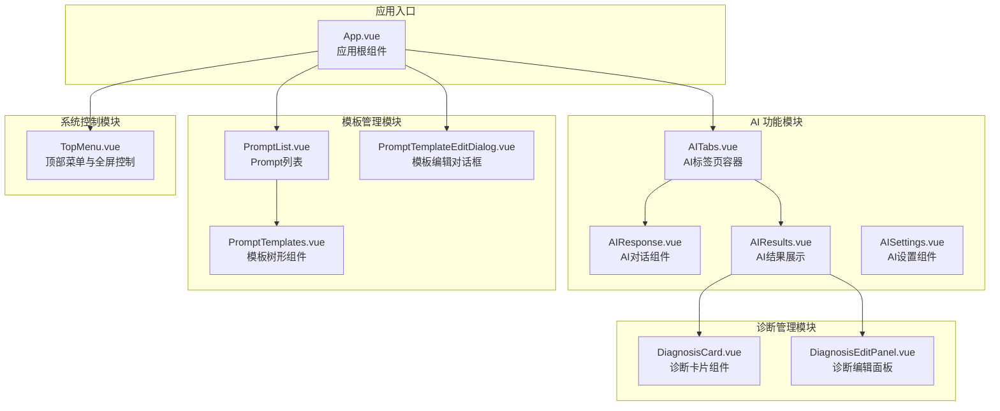
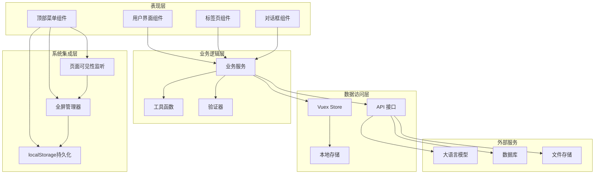
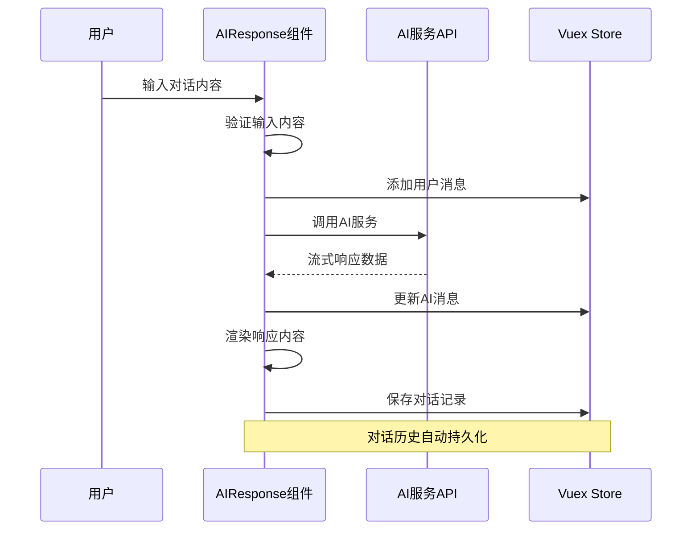
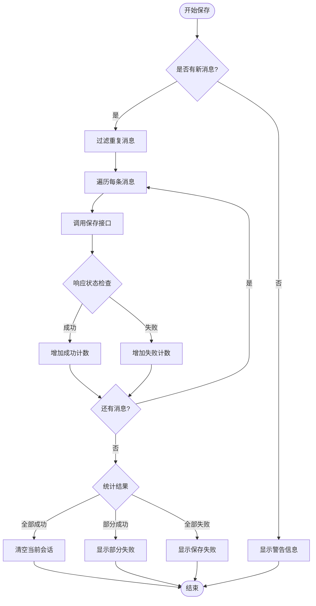
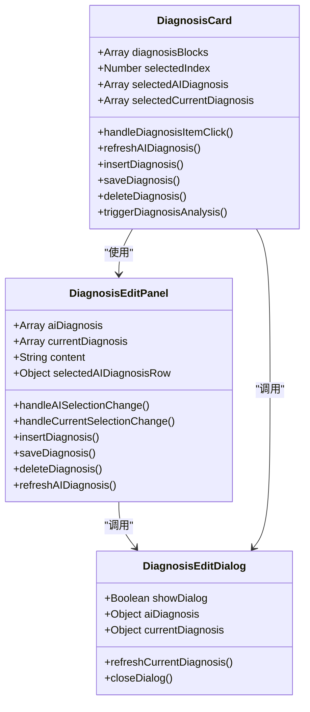
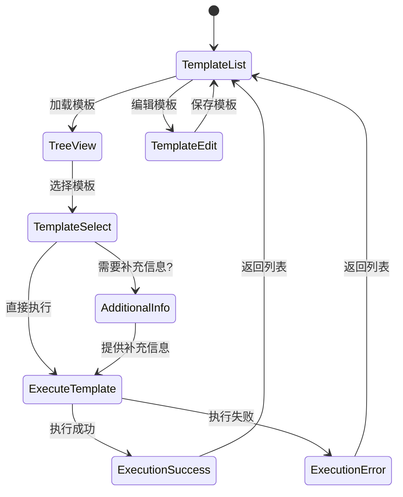
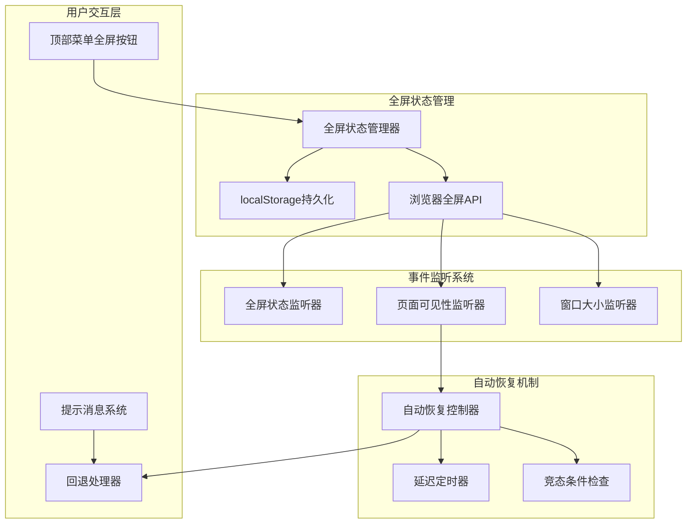
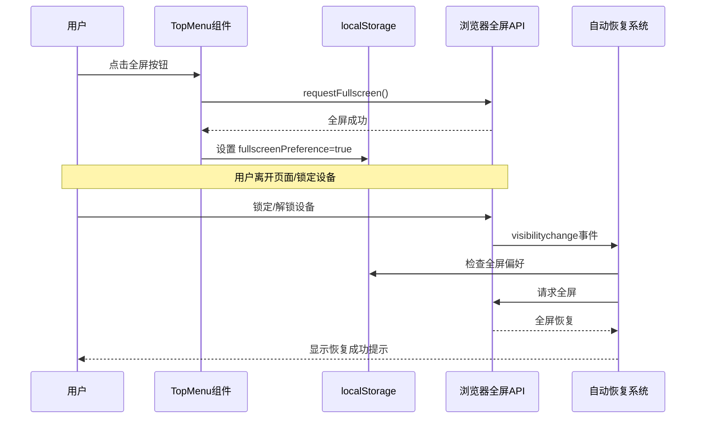
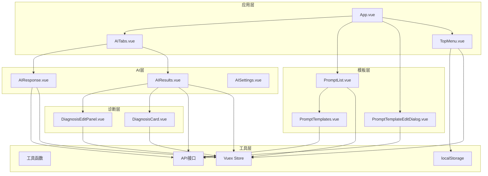

# Vue 组件文档

<cite>
**本文档引用的文件**
- [App.vue](file://med_ai_assistant_1.0_bs_vue/src/App.vue)
- [AIResponse.vue](file://med_ai_assistant_1.0_bs_vue/src/components/ai/AIResponse.vue)
- [AIResults.vue](file://med_ai_assistant_1.0_bs_vue/src/components/ai/AIResults.vue)
- [AISettings.vue](file://med_ai_assistant_1.0_bs_vue/src/components/ai/AISettings.vue)
- [AITabs.vue](file://med_ai_assistant_1.0_bs_vue/src/components/ai/AITabs.vue)
- [DiagnosisCard.vue](file://med_ai_assistant_1.0_bs_vue/src/components/ai/DiagnosisCard.vue)
- [DiagnosisEditPanel.vue](file://med_ai_assistant_1.0_bs_vue/src/components/ai/DiagnosisEditPanel.vue)
- [PromptList.vue](file://med_ai_assistant_1.0_bs_vue/src/components/ai/PromptList.vue)
- [PromptTemplates.vue](file://med_ai_assistant_1.0_bs_vue/src/components/ai/PromptTemplates.vue)
- [PromptTemplateEditDialog.vue](file://med_ai_assistant_1.0_bs_vue/src/components/ai/PromptTemplateEditDialog.vue)
- [TopMenu.vue](file://med_ai_assistant_1.0_bs_vue/src/components/TopMenu.vue)
</cite>

## 更新摘要
**所做更改**
- 新增全屏体验改进章节，重点介绍平板设备全屏模式持久化功能
- 更新 TopMenu 组件分析，详细说明全屏状态持久化机制
- 新增全屏功能架构图和工作流程图
- 增强故障排除指南，包含全屏相关问题的解决方案

## 目录
1. [简介](#简介)
2. [项目结构](#项目结构)
3. [核心组件](#核心组件)
4. [架构概览](#架构概览)
5. [详细组件分析](#详细组件分析)
6. [全屏体验改进](#全屏体验改进)
7. [依赖关系分析](#依赖关系分析)
8. [性能考虑](#性能考虑)
9. [故障排除指南](#故障排除指南)
10. [结论](#结论)

## 简介

MedAiAssistant 是一个基于 Vue.js 的智能医疗助手系统，专注于提供 AI 辅助诊断和治疗决策支持。该系统集成了先进的自然语言处理技术，为医生提供智能化的医疗数据分析和决策支持。

系统采用模块化设计，包含多个专门的 Vue 组件，涵盖了从 AI 对话交互到诊断管理的完整医疗工作流程。项目使用 Element Plus 作为 UI 组件库，结合 Vuex 进行状态管理，实现了高效的前后端分离架构。

**更新** 本版本特别增强了前端全屏体验，特别是在平板设备上的全屏模式持久化功能，确保用户在锁定和解锁平板时能够自动恢复到全屏模式。

## 项目结构

项目采用清晰的模块化组织结构，主要分为以下几个核心模块：

**图表来源**
- [App.vue:1-83](file://med_ai_assistant_1.0_bs_vue/src/App.vue#L1-L83)
- [AITabs.vue:1-76](file://med_ai_assistant_1.0_bs_vue/src/components/ai/AITabs.vue#L1-L76)
- [AIResponse.vue:1-567](file://med_ai_assistant_1.0_bs_vue/src/components/ai/AIResponse.vue#L1-L567)
- [AIResults.vue:1-800](file://med_ai_assistant_1.0_bs_vue/src/components/ai/AIResults.vue#L1-L800)
- [TopMenu.vue:1-855](file://med_ai_assistant_1.0_bs_vue/src/components/TopMenu.vue#L1-L855)

**章节来源**
- [App.vue:1-83](file://med_ai_assistant_1.0_bs_vue/src/App.vue#L1-L83)
- [AITabs.vue:1-76](file://med_ai_assistant_1.0_bs_vue/src/components/ai/AITabs.vue#L1-L76)
- [TopMenu.vue:1-855](file://med_ai_assistant_1.0_bs_vue/src/components/TopMenu.vue#L1-L855)

## 核心组件

### 应用根组件 (App.vue)

应用根组件作为整个系统的入口点，负责：

- **路由视图容器**：提供 `<router-view>` 用于显示当前路由匹配的组件
- **全局对话框管理**：统一管理模板编辑对话框的状态
- **状态同步**：监听 Vuex store 中的模板编辑状态，自动控制对话框显示

### AI 对话组件 (AIResponse.vue)

AI 对话组件提供了完整的对话式 AI 交互功能：

- **实时对话**：支持与大语言模型的实时对话交互
- **流式响应**：实现 AI 响应的流式渲染，提升用户体验
- **历史记录**：自动加载和管理患者的对话历史
- **数据导入**：集成数据导入功能，支持将外部数据导入到对话中
- **Markdown 渲染**：安全地渲染 AI 生成的 Markdown 内容

### AI 结果组件 (AIResults.vue)

AI 结果组件专注于展示和管理 AI 分析结果：

- **结果展示**：以美观的卡片形式展示 AI 分析结果
- **编辑功能**：支持对 AI 结果进行编辑和保存
- **诊断集成**：与诊断管理系统深度集成
- **模板详情**：提供 Prompt 详情查看功能
- **内容管理**：支持复制、删除等操作

### 顶部菜单组件 (TopMenu.vue)

顶部菜单组件提供了完整的系统控制功能，包括全屏模式管理：

- **全屏控制**：提供进入和退出全屏模式的功能
- **状态持久化**：通过 localStorage 持久化用户的全屏偏好设置
- **自动恢复**：在平板设备锁屏/解锁后自动恢复全屏状态
- **多浏览器支持**：兼容标准和厂商前缀的全屏 API
- **页面可见性监听**：监听页面可见性变化以实现自动恢复

**章节来源**
- [AIResponse.vue:100-430](file://med_ai_assistant_1.0_bs_vue/src/components/ai/AIResponse.vue#L100-L430)
- [AIResults.vue:199-763](file://med_ai_assistant_1.0_bs_vue/src/components/ai/AIResults.vue#L199-L763)
- [TopMenu.vue:298-739](file://med_ai_assistant_1.0_bs_vue/src/components/TopMenu.vue#L298-L739)

## 架构概览

系统采用分层架构设计，实现了清晰的关注点分离：

**图表来源**
- [AIResponse.vue:100-430](file://med_ai_assistant_1.0_bs_vue/src/components/ai/AIResponse.vue#L100-L430)
- [AIResults.vue:199-763](file://med_ai_assistant_1.0_bs_vue/src/components/ai/AIResults.vue#L199-L763)
- [TopMenu.vue:291-739](file://med_ai_assistant_1.0_bs_vue/src/components/TopMenu.vue#L291-L739)

## 详细组件分析

### AI 对话流程

AI 对话组件实现了完整的对话处理流程：

**图表来源**
- [AIResponse.vue:150-254](file://med_ai_assistant_1.0_bs_vue/src/components/ai/AIResponse.vue#L150-L254)
- [AIResponse.vue:291-360](file://med_ai_assistant_1.0_bs_vue/src/components/ai/AIResponse.vue#L291-L360)

### AI 结果保存机制

AI 结果保存采用了可靠的顺序保存策略：

**图表来源**
- [AIResponse.vue:291-360](file://med_ai_assistant_1.0_bs_vue/src/components/ai/AIResponse.vue#L291-L360)

### 诊断管理组件

诊断管理组件提供了完整的诊断生命周期管理：

**图表来源**
- [DiagnosisCard.vue:151-532](file://med_ai_assistant_1.0_bs_vue/src/components/ai/DiagnosisCard.vue#L151-L532)
- [DiagnosisEditPanel.vue:179-645](file://med_ai_assistant_1.0_bs_vue/src/components/ai/DiagnosisEditPanel.vue#L179-L645)

**章节来源**
- [DiagnosisCard.vue:151-532](file://med_ai_assistant_1.0_bs_vue/src/components/ai/DiagnosisCard.vue#L151-L532)
- [DiagnosisEditPanel.vue:179-645](file://med_ai_assistant_1.0_bs_vue/src/components/ai/DiagnosisEditPanel.vue#L179-L645)

### Prompt 模板管理系统

Prompt 模板管理系统提供了灵活的模板管理和执行功能：

**图表来源**
- [PromptTemplates.vue:97-187](file://med_ai_assistant_1.0_bs_vue/src/components/ai/PromptTemplates.vue#L97-L187)
- [PromptTemplateEditDialog.vue:181-221](file://med_ai_assistant_1.0_bs_vue/src/components/ai/PromptTemplateEditDialog.vue#L181-L221)

**章节来源**
- [PromptTemplates.vue:97-187](file://med_ai_assistant_1.0_bs_vue/src/components/ai/PromptTemplates.vue#L97-L187)
- [PromptTemplateEditDialog.vue:181-221](file://med_ai_assistant_1.0_bs_vue/src/components/ai/PromptTemplateEditDialog.vue#L181-L221)

## 全屏体验改进

### 全屏功能架构

MedAiAssistant 系统实现了先进的全屏体验，特别针对平板设备进行了优化：

**图表来源**
- [TopMenu.vue:291-739](file://med_ai_assistant_1.0_bs_vue/src/components/TopMenu.vue#L291-L739)

### 全屏状态持久化机制

系统实现了智能的全屏状态持久化，确保用户在不同设备状态间切换时的无缝体验：

**图表来源**
- [TopMenu.vue:298-324](file://med_ai_assistant_1.0_bs_vue/src/components/TopMenu.vue#L298-L324)
- [TopMenu.vue:704-739](file://med_ai_assistant_1.0_bs_vue/src/components/TopMenu.vue#L704-L739)

### 平板设备优化特性

针对平板设备的全屏体验进行了专门优化：

#### 自动恢复机制
- **页面可见性监听**：监听 `visibilitychange` 事件，在页面从隐藏变为可见时自动恢复全屏
- **延迟恢复**：使用 300ms 延迟确保浏览器完全恢复后再请求全屏
- **竞态条件检查**：双重检查确保用户没有在恢复过程中取消全屏偏好

#### 浏览器兼容性
- **标准 API 支持**：`document.requestFullscreen()`
- **Webkit 前缀**：`element.webkitRequestFullscreen()`
- **Microsoft 前缀**：`element.msRequestFullscreen()`

#### 用户体验增强
- **智能提示**：当自动恢复失败时显示友好的用户提示
- **手动恢复**：提供手动全屏切换按钮
- **状态同步**：全屏状态变化时同步更新界面状态

**章节来源**
- [TopMenu.vue:291-324](file://med_ai_assistant_1.0_bs_vue/src/components/TopMenu.vue#L291-L324)
- [TopMenu.vue:632-673](file://med_ai_assistant_1.0_bs_vue/src/components/TopMenu.vue#L632-L673)
- [TopMenu.vue:704-739](file://med_ai_assistant_1.0_bs_vue/src/components/TopMenu.vue#L704-L739)

## 依赖关系分析

系统组件之间的依赖关系体现了清晰的层次结构：

**图表来源**
- [App.vue:16-47](file://med_ai_assistant_1.0_bs_vue/src/App.vue#L16-L47)
- [AITabs.vue:14-64](file://med_ai_assistant_1.0_bs_vue/src/components/ai/AITabs.vue#L14-L64)
- [TopMenu.vue:291-739](file://med_ai_assistant_1.0_bs_vue/src/components/TopMenu.vue#L291-L739)

**章节来源**
- [App.vue:16-47](file://med_ai_assistant_1.0_bs_vue/src/App.vue#L16-L47)
- [AITabs.vue:14-64](file://med_ai_assistant_1.0_bs_vue/src/components/ai/AITabs.vue#L14-L64)
- [TopMenu.vue:291-739](file://med_ai_assistant_1.0_bs_vue/src/components/TopMenu.vue#L291-L739)

## 性能考虑

系统在设计时充分考虑了性能优化：

### 前端性能优化
- **虚拟滚动**：大量数据展示时使用虚拟滚动技术
- **懒加载**：组件按需加载，减少初始包体积
- **缓存策略**：合理使用浏览器缓存和 Vuex 状态缓存
- **防抖节流**：输入框和搜索功能使用防抖优化

### AI 交互优化
- **流式响应**：AI 响应采用流式传输，提升用户体验
- **增量渲染**：支持增量内容渲染，避免全量重绘
- **连接池管理**：合理管理 AI 服务连接，避免资源浪费

### 数据处理优化
- **去重算法**：对话保存时自动去重，避免重复数据
- **批量操作**：支持批量保存和更新操作
- **错误恢复**：部分失败时支持重试和恢复

### 全屏功能性能优化
- **事件监听优化**：使用 `beforeUnmount` 确保事件监听器正确清理
- **内存管理**：避免全屏状态监听器的内存泄漏
- **异步处理**：全屏切换采用异步处理，避免阻塞主线程

## 故障排除指南

### 常见问题及解决方案

#### AI 服务连接问题
- **症状**：AI 响应超时或连接失败
- **原因**：网络不稳定或 AI 服务不可用
- **解决方案**：检查网络连接，查看服务状态，重试请求

#### 对话历史加载失败
- **症状**：患者对话历史无法加载
- **原因**：患者 ID 为空或 API 调用失败
- **解决方案**：确认患者选择状态，检查 API 响应，查看控制台错误

#### 诊断保存失败
- **症状**：诊断修改无法保存
- **原因**：网络问题或权限不足
- **解决方案**：检查网络状态，确认用户权限，重试保存操作

#### 模板编辑异常
- **症状**：Prompt 模板编辑功能异常
- **原因**：模板数据格式错误或权限问题
- **解决方案**：检查模板数据格式，确认编辑权限，重新加载模板

#### 全屏功能异常
- **症状**：全屏切换失败或无法自动恢复
- **原因**：浏览器安全策略限制或设备兼容性问题
- **解决方案**：
  1. 检查浏览器全屏 API 支持情况
  2. 确认用户手势要求已满足
  3. 查看控制台错误信息
  4. 使用手动全屏按钮进行恢复
  5. 检查 localStorage 权限设置

#### 平板设备全屏恢复失败
- **症状**：平板锁屏后无法自动恢复全屏
- **原因**：页面可见性监听器未正确触发或 localStorage 权限问题
- **解决方案**：
  1. 检查 `visibilitychange` 事件监听器状态
  2. 确认 `localStorage` 中的 `fullscreenPreference` 设置
  3. 验证浏览器后台标签页的全屏 API 限制
  4. 手动触发全屏恢复流程

**章节来源**
- [AIResponse.vue:247-253](file://med_ai_assistant_1.0_bs_vue/src/components/ai/AIResponse.vue#L247-L253)
- [AIResults.vue:562-588](file://med_ai_assistant_1.0_bs_vue/src/components/ai/AIResults.vue#L562-L588)
- [TopMenu.vue:632-673](file://med_ai_assistant_1.0_bs_vue/src/components/TopMenu.vue#L632-L673)
- [TopMenu.vue:704-739](file://med_ai_assistant_1.0_bs_vue/src/components/TopMenu.vue#L704-L739)

## 结论

MedAiAssistant Vue 组件系统展现了现代化前端开发的最佳实践，通过模块化设计、清晰的架构分离和完善的错误处理机制，为医疗 AI 应用提供了稳定可靠的技术基础。

系统的主要优势包括：

1. **模块化设计**：各个组件职责明确，易于维护和扩展
2. **用户体验**：流畅的交互体验和及时的反馈机制
3. **安全性**：完善的输入验证和内容安全过滤
4. **可扩展性**：灵活的架构设计支持功能扩展
5. **可靠性**：健壮的错误处理和恢复机制
6. **全屏优化**：针对平板设备的全屏体验改进，实现了智能的状态持久化和自动恢复

**更新** 本次全屏体验改进特别强化了平板设备的使用体验，通过智能的状态持久化和自动恢复机制，确保用户在不同设备状态间切换时能够获得一致的全屏体验。这一改进显著提升了系统的可用性和用户满意度。

未来可以在以下方面进一步优化：
- 增加更多的 AI 模型支持
- 优化移动端适配
- 增强离线功能
- 扩展多语言支持
- 进一步优化全屏状态的检测和恢复机制