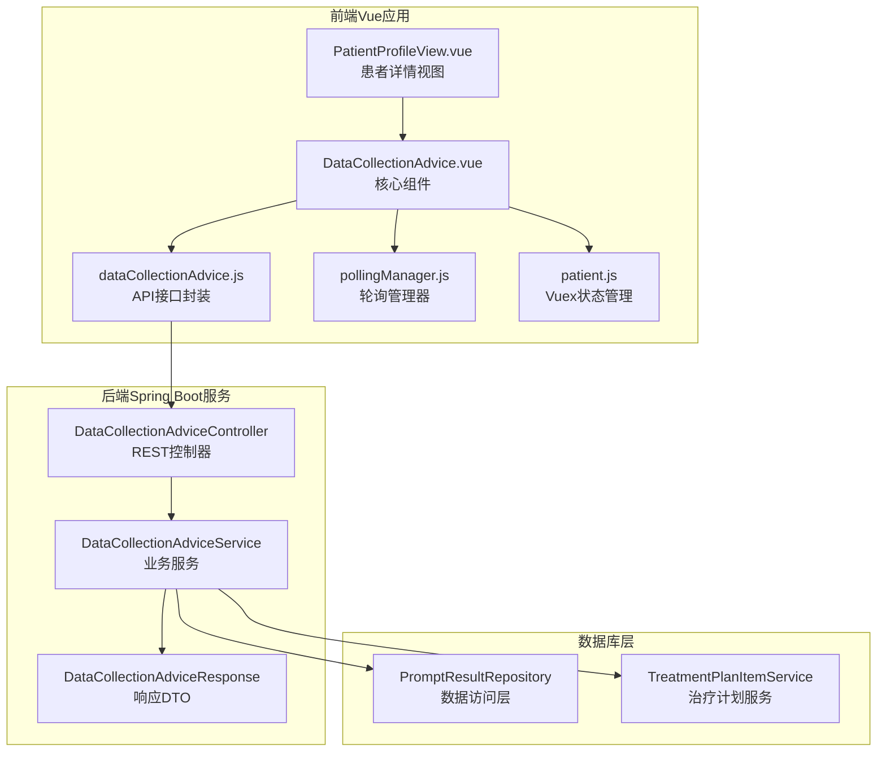
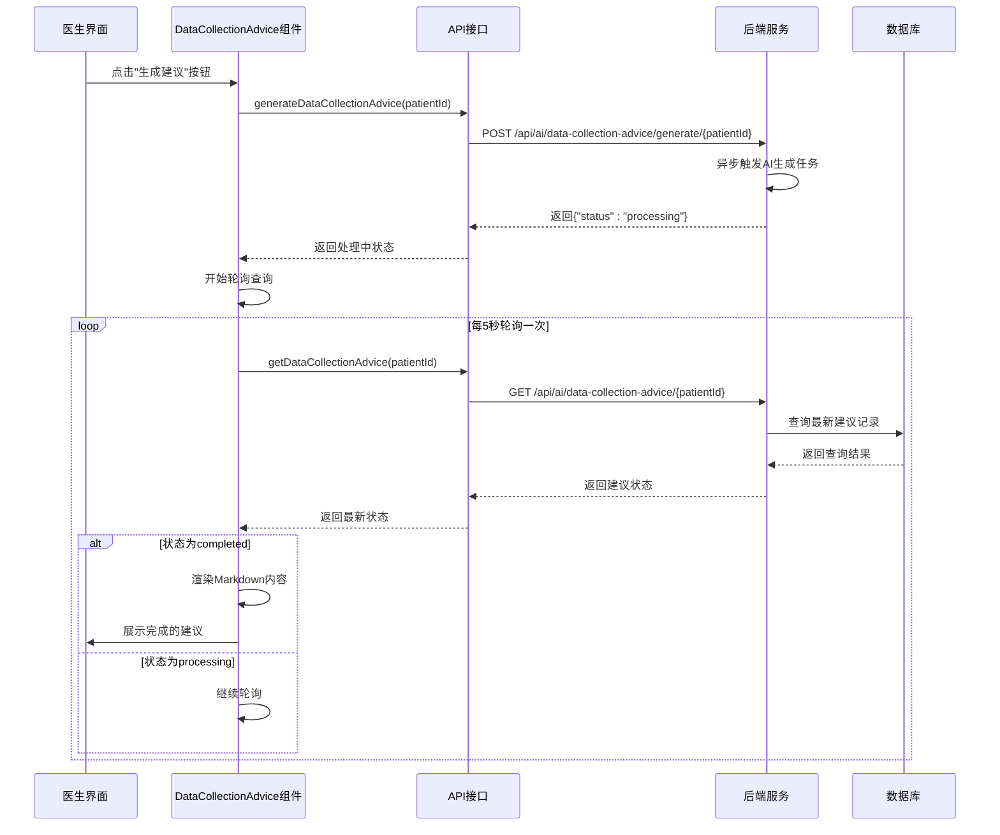
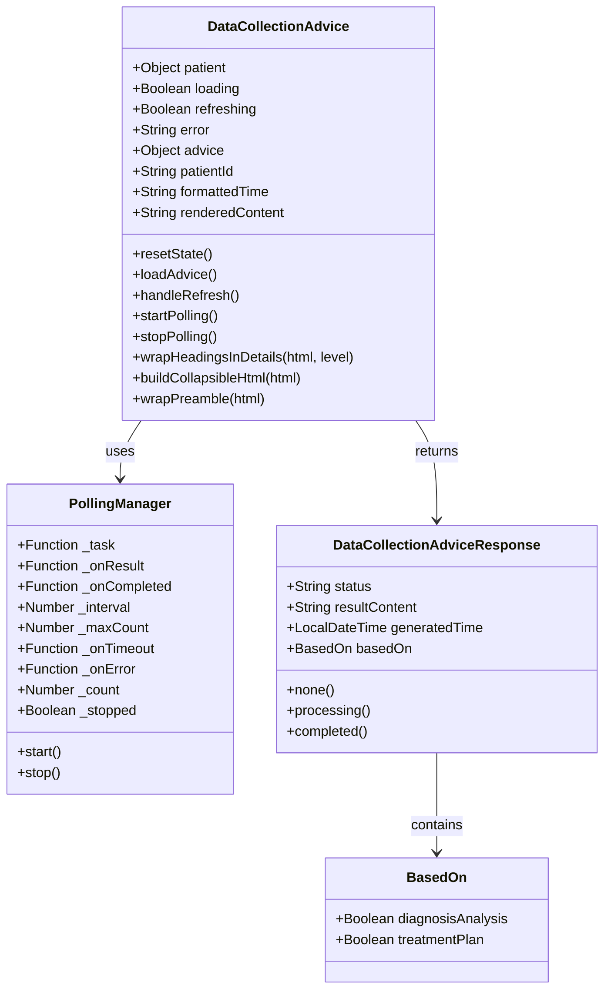
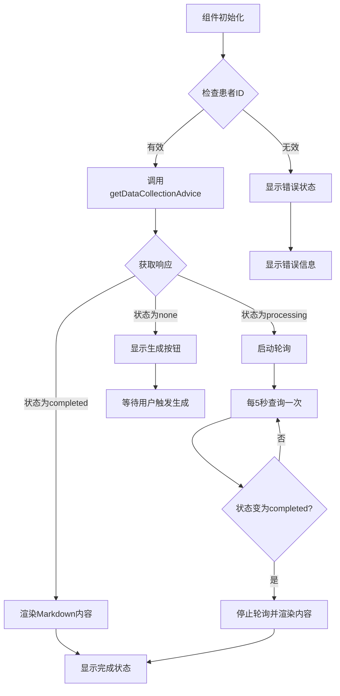
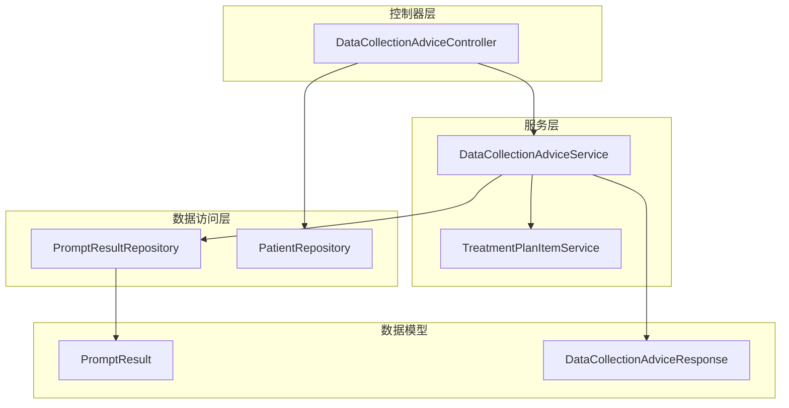
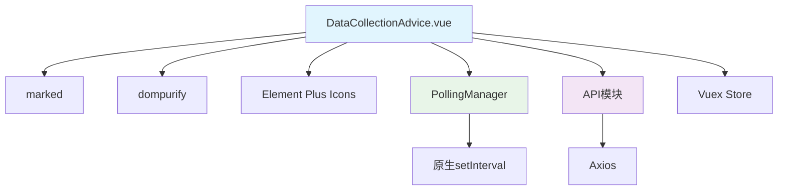
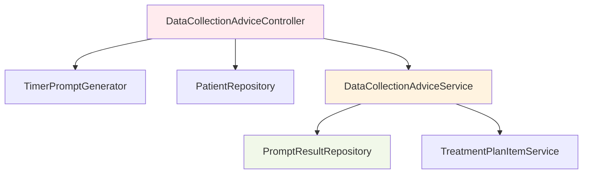

# 数据收集建议Vue组件

<cite>
**本文档引用的文件**
- [DataCollectionAdvice.vue](file://med_ai_assistant_1.0_bs_vue/src/components/patient/DataCollectionAdvice.vue)
- [dataCollectionAdvice.js](file://med_ai_assistant_1.0_bs_vue/src/api/dataCollectionAdvice.js)
- [pollingManager.js](file://med_ai_assistant_1.0_bs_vue/src/utils/pollingManager.js)
- [PatientProfileView.vue](file://med_ai_assistant_1.0_bs_vue/src/views/PatientProfileView.vue)
- [patient.js](file://med_ai_assistant_1.0_bs_vue/src/store/modules/patient.js)
- [DataCollectionAdviceController.java](file://med_ai_assistant_1.0_bs_backend/src/main/java/com/example/medaiassistant/controller/DataCollectionAdviceController.java)
- [DataCollectionAdviceService.java](file://med_ai_assistant_1.0_bs_backend/src/main/java/com/example/medaiassistant/service/DataCollectionAdviceService.java)
- [DataCollectionAdviceResponse.java](file://med_ai_assistant_1.0_bs_backend/src/main/java/com/example/medaiassistant/dto/DataCollectionAdviceResponse.java)
</cite>

## 目录
1. [简介](#简介)
2. [项目结构](#项目结构)
3. [核心组件](#核心组件)
4. [架构概览](#架构概览)
5. [详细组件分析](#详细组件分析)
6. [依赖关系分析](#依赖关系分析)
7. [性能考虑](#性能考虑)
8. [故障排除指南](#故障排除指南)
9. [结论](#结论)

## 简介

数据收集建议Vue组件是MedAiAssistant医疗AI助手系统中的重要功能模块，用于在患者详情页展示AI生成的进一步问诊、查体和辅助检查建议。该组件实现了完整的前后端交互流程，包括手动触发生成、异步状态轮询、Markdown内容渲染和用户友好的界面展示。

该组件基于Vue 3框架构建，采用组件化设计，支持多种状态管理和数据展示模式，为医生提供了智能化的医疗数据收集指导。

## 项目结构

MedAiAssistant项目采用前后端分离架构，数据收集建议功能分布在前端Vue组件和后端Spring Boot服务中：

**图表来源**
- [DataCollectionAdvice.vue:1-604](file://med_ai_assistant_1.0_bs_vue/src/components/patient/DataCollectionAdvice.vue#L1-L604)
- [DataCollectionAdviceController.java:1-121](file://med_ai_assistant_1.0_bs_backend/src/main/java/com/example/medaiassistant/controller/DataCollectionAdviceController.java#L1-L121)

**章节来源**
- [DataCollectionAdvice.vue:1-604](file://med_ai_assistant_1.0_bs_vue/src/components/patient/DataCollectionAdvice.vue#L1-L604)
- [patient.js:1-558](file://med_ai_assistant_1.0_bs_vue/src/store/modules/patient.js#L1-L558)

## 核心组件

### DataCollectionAdvice组件

DataCollectionAdvice组件是数据收集建议功能的核心，提供了完整的UI界面和交互逻辑：

**主要特性：**
- 支持四种状态展示：加载中、已完成、生成中、无数据
- 自动Markdown内容渲染和XSS防护
- 原生details/summary折叠功能
- 智能轮询管理机制
- 错误处理和重试机制

**状态管理：**
- `loading`: 初始加载状态
- `refreshing`: 刷新生成状态  
- `error`: 错误信息存储
- `advice`: 建议响应对象，包含状态、内容、生成时间和数据来源

**章节来源**
- [DataCollectionAdvice.vue:76-168](file://med_ai_assistant_1.0_bs_vue/src/components/patient/DataCollectionAdvice.vue#L76-L168)

### API接口模块

dataCollectionAdvice.js模块封装了与后端的API交互：

**主要接口：**
- `generateDataCollectionAdvice(patientId)`: 手动触发建议生成
- `getDataCollectionAdvice(patientId)`: 查询最新建议状态

**功能特点：**
- 基于Axios的HTTP请求封装
- 自动处理响应数据
- 错误信息标准化

**章节来源**
- [dataCollectionAdvice.js:1-55](file://med_ai_assistant_1.0_bs_vue/src/api/dataCollectionAdvice.js#L1-L55)

### 轮询管理器

pollingManager.js提供了通用的轮询管理功能：

**核心功能：**
- 可配置的轮询间隔和最大次数
- 自动停止机制
- 错误处理和超时回调
- 生命周期管理

**章节来源**
- [pollingManager.js:1-125](file://med_ai_assistant_1.0_bs_vue/src/utils/pollingManager.js#L1-L125)

## 架构概览

数据收集建议功能采用典型的前后端分离架构，实现了完整的异步处理流程：

**图表来源**
- [DataCollectionAdvice.vue:237-284](file://med_ai_assistant_1.0_bs_vue/src/components/patient/DataCollectionAdvice.vue#L237-L284)
- [DataCollectionAdviceController.java:80-120](file://med_ai_assistant_1.0_bs_backend/src/main/java/com/example/medaiassistant/controller/DataCollectionAdviceController.java#L80-L120)

## 详细组件分析

### 组件类结构图

**图表来源**
- [DataCollectionAdvice.vue:90-399](file://med_ai_assistant_1.0_bs_vue/src/components/patient/DataCollectionAdvice.vue#L90-L399)
- [pollingManager.js:35-125](file://med_ai_assistant_1.0_bs_vue/src/utils/pollingManager.js#L35-L125)
- [DataCollectionAdviceResponse.java:16-99](file://med_ai_assistant_1.0_bs_backend/src/main/java/com/example/medaiassistant/dto/DataCollectionAdviceResponse.java#L16-L99)

### 数据流处理流程

组件实现了复杂的数据流处理逻辑：

**图表来源**
- [DataCollectionAdvice.vue:209-284](file://med_ai_assistant_1.0_bs_vue/src/components/patient/DataCollectionAdvice.vue#L209-L284)

### Markdown渲染机制

组件采用了多层次的Markdown渲染和安全处理：

**渲染流程：**
1. 使用marked库将Markdown转换为HTML
2. 应用DOMPurify进行XSS防护
3. 使用原生details/summary实现可折叠结构
4. 支持两级折叠：h2顶级折叠和h3嵌套折叠

**安全措施：**
- 仅允许特定HTML标签和属性
- 自定义CSS样式确保折叠效果
- 保留Markdown语法的语义化结构

**章节来源**
- [DataCollectionAdvice.vue:159-167](file://med_ai_assistant_1.0_bs_vue/src/components/patient/DataCollectionAdvice.vue#L159-L167)

### 后端服务架构

后端服务提供了完整的数据收集建议处理能力：

**图表来源**
- [DataCollectionAdviceController.java:32-58](file://med_ai_assistant_1.0_bs_backend/src/main/java/com/example/medaiassistant/controller/DataCollectionAdviceController.java#L32-L58)
- [DataCollectionAdviceService.java:24-41](file://med_ai_assistant_1.0_bs_backend/src/main/java/com/example/medaiassistant/service/DataCollectionAdviceService.java#L24-L41)

**章节来源**
- [DataCollectionAdviceService.java:57-80](file://med_ai_assistant_1.0_bs_backend/src/main/java/com/example/medaiassistant/service/DataCollectionAdviceService.java#L57-L80)

## 依赖关系分析

### 前端依赖关系

**图表来源**
- [DataCollectionAdvice.vue:60-74](file://med_ai_assistant_1.0_bs_vue/src/components/patient/DataCollectionAdvice.vue#L60-L74)

### 后端依赖关系

**图表来源**
- [DataCollectionAdviceController.java:41-58](file://med_ai_assistant_1.0_bs_backend/src/main/java/com/example/medaiassistant/controller/DataCollectionAdviceController.java#L41-L58)

**章节来源**
- [DataCollectionAdviceController.java:1-121](file://med_ai_assistant_1.0_bs_backend/src/main/java/com/example/medaiassistant/controller/DataCollectionAdviceController.java#L1-L121)

## 性能考虑

### 前端性能优化

1. **组件懒加载**: 使用keep-alive缓存避免重复渲染
2. **轮询优化**: 默认5秒间隔，最多60次轮询（5分钟超时）
3. **内存管理**: 组件卸载时自动清理轮询定时器
4. **渲染优化**: 使用虚拟DOM和条件渲染减少不必要的更新

### 后端性能优化

1. **异步处理**: 生成任务在后台异步执行，不阻塞主线程
2. **数据库优化**: 使用索引查询最新记录
3. **缓存策略**: 合理利用数据库查询缓存
4. **资源隔离**: 通过Profile注解隔离执行服务器功能

### 网络性能

1. **请求合并**: 组件挂载时并行加载多个数据源
2. **错误重试**: 智能错误处理和重试机制
3. **超时控制**: 明确的超时和错误处理策略

## 故障排除指南

### 常见问题及解决方案

**问题1: 建议生成超时**
- **症状**: 显示"建议生成超时，请稍后重试"
- **原因**: AI生成任务超过5分钟仍未完成
- **解决**: 检查后端AI服务状态，确认生成任务正常运行

**问题2: 无法加载建议数据**
- **症状**: 显示错误状态，无法获取建议
- **原因**: 网络请求失败或API返回错误
- **解决**: 检查网络连接，确认后端服务正常运行

**问题3: Markdown渲染异常**
- **症状**: 内容显示为纯文本而非格式化HTML
- **原因**: XSS防护阻止了某些HTML标签
- **解决**: 检查marked解析和DOMPurify配置

**问题4: 轮询功能失效**
- **症状**: 点击生成按钮后状态不更新
- **原因**: 轮询定时器未正确启动或被清理
- **解决**: 检查组件生命周期钩子，确认轮询管理器正确初始化

**章节来源**
- [DataCollectionAdvice.vue:276-282](file://med_ai_assistant_1.0_bs_vue/src/components/patient/DataCollectionAdvice.vue#L276-L282)

### 调试技巧

1. **控制台日志**: 组件内部包含详细的调试日志输出
2. **网络监控**: 使用浏览器开发者工具监控API请求
3. **状态检查**: 通过Vue DevTools检查组件状态变化
4. **后端日志**: 查看后端服务的日志输出了解处理流程

## 结论

数据收集建议Vue组件是MedAiAssistant系统中一个设计精良的功能模块，它成功地将复杂的AI生成流程封装为简洁易用的用户界面。组件采用了现代化的前端技术栈，实现了良好的用户体验和可靠的性能表现。

**主要优势：**
- 完整的状态管理机制
- 智能的轮询和超时处理
- 安全的Markdown渲染
- 用户友好的界面设计
- 良好的错误处理机制

**技术亮点：**
- 原生details/summary折叠实现
- DOMPurify XSS防护
- 可配置的轮询管理器
- 组件化的架构设计

该组件为医疗AI助手系统的智能化发展奠定了坚实的基础，为医生提供了有价值的决策支持工具。