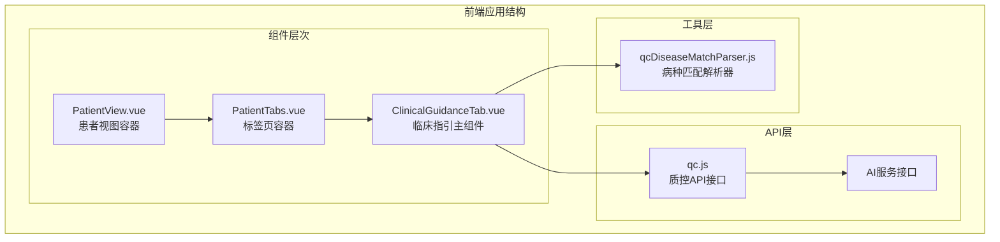
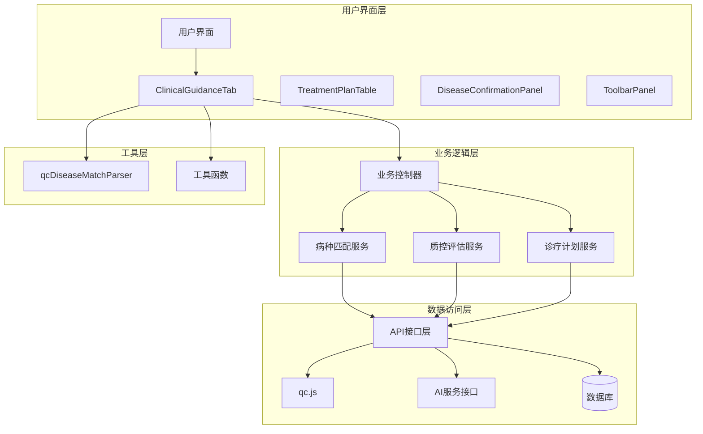
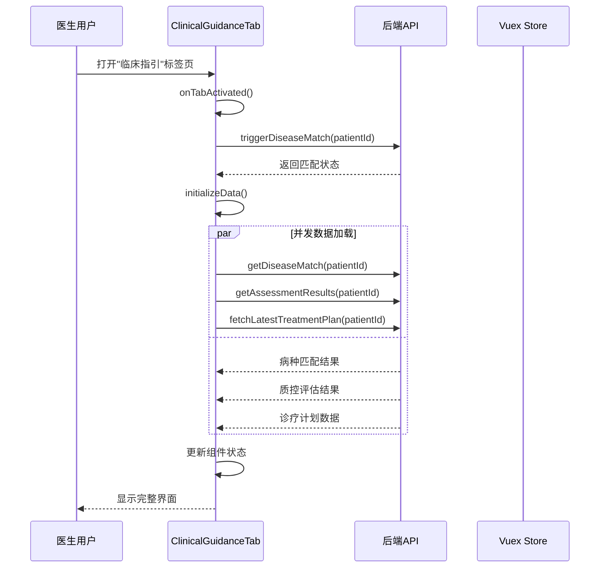
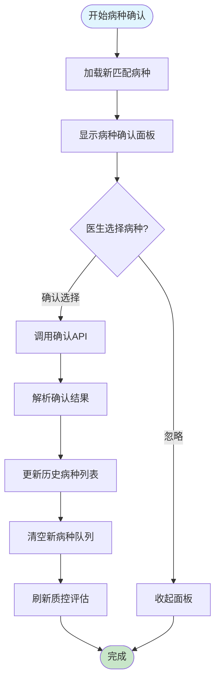
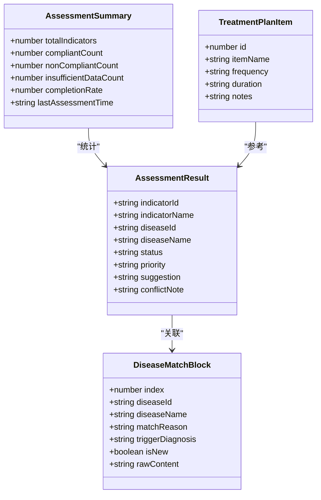
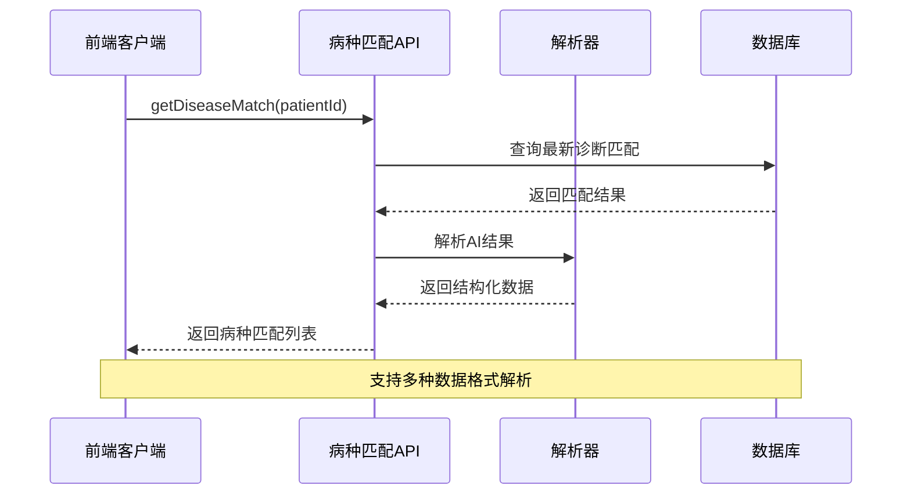
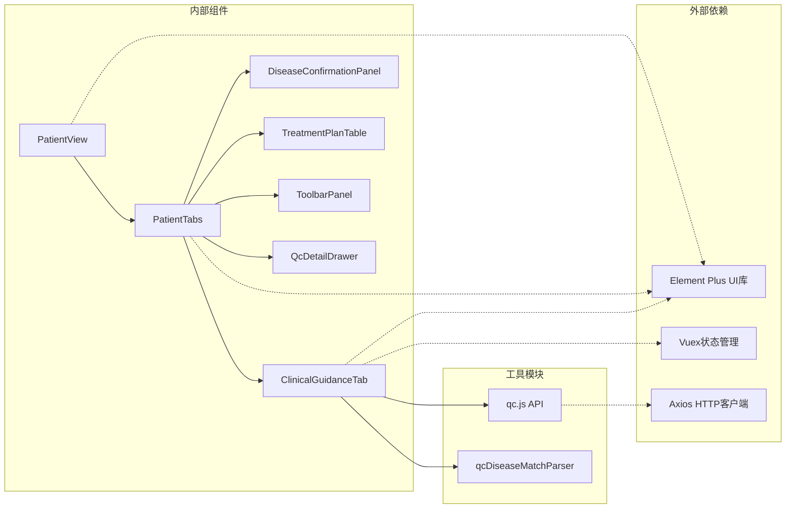

# 临床指引Tab

<cite>
**本文档引用的文件**
- [PatientView.vue](file://med_ai_assistant_1.0_bs_vue/src/views/PatientView.vue)
- [PatientTabs.vue](file://med_ai_assistant_1.0_bs_vue/src/components/patient/PatientTabs.vue)
- [ClinicalGuidanceTab.vue](file://med_ai_assistant_1.0_bs_vue/src/components/qc/ClinicalGuidanceTab.vue)
- [qc.js](file://med_ai_assistant_1.0_bs_vue/src/api/qc.js)
- [qcDiseaseMatchParser.js](file://med_ai_assistant_1.0_bs_vue/src/utils/qcDiseaseMatchParser.js)
</cite>

## 目录
1. [简介](#简介)
2. [项目结构](#项目结构)
3. [核心组件](#核心组件)
4. [架构概览](#架构概览)
5. [详细组件分析](#详细组件分析)
6. [依赖关系分析](#依赖关系分析)
7. [性能考虑](#性能考虑)
8. [故障排除指南](#故障排除指南)
9. [结论](#结论)

## 简介

临床指引Tab是MedAiAssistant项目中的一个关键功能模块，为医生提供基于AI分析的个性化临床指导。该模块集成了病种匹配、质控评估、诊疗计划管理等功能，通过智能算法帮助医生制定最佳治疗方案。

该功能模块采用现代化的Vue.js架构，结合Element Plus组件库，提供了流畅的用户体验和强大的数据处理能力。系统支持实时数据分析、智能提醒、以及与后端服务的无缝集成。

## 项目结构

MedAiAssistant项目采用前后端分离的架构设计，前端Vue应用位于`med_ai_assistant_1.0_bs_vue`目录下。临床指引Tab作为患者信息管理界面的重要组成部分，与其他功能模块协同工作。

**图表来源**
- [PatientView.vue:1-64](file://med_ai_assistant_1.0_bs_vue/src/views/PatientView.vue#L1-L64)
- [PatientTabs.vue:1-136](file://med_ai_assistant_1.0_bs_vue/src/components/patient/PatientTabs.vue#L1-L136)
- [ClinicalGuidanceTab.vue:1-610](file://med_ai_assistant_1.0_bs_vue/src/components/qc/ClinicalGuidanceTab.vue#L1-L610)

**章节来源**
- [PatientView.vue:1-64](file://med_ai_assistant_1.0_bs_vue/src/views/PatientView.vue#L1-L64)
- [PatientTabs.vue:1-136](file://med_ai_assistant_1.0_bs_vue/src/components/patient/PatientTabs.vue#L1-L136)

## 核心组件

### PatientView - 患者视图容器

PatientView是患者信息管理的顶层容器组件，负责协调左侧患者列表和右侧标签页的布局。该组件实现了响应式设计，支持不同屏幕尺寸的自适应显示。

主要功能特性：
- 左右分栏布局设计
- 患者选中事件处理
- 长期医嘱数据加载
- 小屏模式下的界面适配

### PatientTabs - 标签页容器

PatientTabs组件管理患者信息的各个标签页，包括基本信息、病情小结、病历记录、检查报告等。该组件实现了智能的数据加载策略，优化了用户体验。

关键特性：
- 动态标签页管理
- 懒加载机制（仅在用户访问时加载数据）
- 标签页切换监听
- 自动重置到基本信息标签页

### ClinicalGuidanceTab - 临床指引主组件

ClinicalGuidanceTab是整个功能的核心组件，集成了病种确认、质控评估、诊疗计划管理等功能。该组件采用了先进的并发数据处理模式，确保系统的高效运行。

**章节来源**
- [PatientView.vue:14-54](file://med_ai_assistant_1.0_bs_vue/src/views/PatientView.vue#L14-L54)
- [PatientTabs.vue:35-117](file://med_ai_assistant_1.0_bs_vue/src/components/patient/PatientTabs.vue#L35-L117)
- [ClinicalGuidanceTab.vue:79-554](file://med_ai_assistant_1.0_bs_vue/src/components/qc/ClinicalGuidanceTab.vue#L79-L554)

## 架构概览

临床指引Tab采用分层架构设计，从底层的数据访问到顶层的用户界面，每一层都有明确的职责分工。

**图表来源**
- [ClinicalGuidanceTab.vue:80-93](file://med_ai_assistant_1.0_bs_vue/src/components/qc/ClinicalGuidanceTab.vue#L80-L93)
- [qc.js:1-449](file://med_ai_assistant_1.0_bs_vue/src/api/qc.js#L1-L449)

## 详细组件分析

### ClinicalGuidanceTab 组件详解

ClinicalGuidanceTab组件是整个临床指引功能的核心，采用了模块化的架构设计，包含以下主要功能模块：

#### 数据流架构

**图表来源**
- [ClinicalGuidanceTab.vue:506-551](file://med_ai_assistant_1.0_bs_vue/src/components/qc/ClinicalGuidanceTab.vue#L506-L551)
- [ClinicalGuidanceTab.vue:261-301](file://med_ai_assistant_1.0_bs_vue/src/components/qc/ClinicalGuidanceTab.vue#L261-L301)

#### 病种确认流程

**图表来源**
- [ClinicalGuidanceTab.vue:403-447](file://med_ai_assistant_1.0_bs_vue/src/components/qc/ClinicalGuidanceTab.vue#L403-L447)
- [ClinicalGuidanceTab.vue:425-430](file://med_ai_assistant_1.0_bs_vue/src/components/qc/ClinicalGuidanceTab.vue#L425-L430)

#### 质控评估系统

质控评估系统提供了全面的医疗质量监控功能，包括指标评估、状态跟踪、建议生成等。

**图表来源**
- [ClinicalGuidanceTab.vue:151-171](file://med_ai_assistant_1.0_bs_vue/src/components/qc/ClinicalGuidanceTab.vue#L151-L171)
- [qcDiseaseMatchParser.js:7-16](file://med_ai_assistant_1.0_bs_vue/src/utils/qcDiseaseMatchParser.js#L7-L16)

**章节来源**
- [ClinicalGuidanceTab.vue:228-554](file://med_ai_assistant_1.0_bs_vue/src/components/qc/ClinicalGuidanceTab.vue#L228-L554)
- [qcDiseaseMatchParser.js:106-182](file://med_ai_assistant_1.0_bs_vue/src/utils/qcDiseaseMatchParser.js#L106-L182)

### API 接口分析

#### 病种匹配接口

病种匹配功能通过智能算法分析患者的诊断信息，自动识别可能的疾病组合。

**图表来源**
- [qc.js:35-37](file://med_ai_assistant_1.0_bs_vue/src/api/qc.js#L35-L37)
- [ClinicalGuidanceTab.vue:308-343](file://med_ai_assistant_1.0_bs_vue/src/components/qc/ClinicalGuidanceTab.vue#L308-L343)

#### 质控评估接口

质控评估接口提供了全面的医疗质量监控功能，支持指标级别的评估和统计。

**章节来源**
- [qc.js:168-287](file://med_ai_assistant_1.0_bs_vue/src/api/qc.js#L168-L287)
- [qc.js:316-327](file://med_ai_assistant_1.0_bs_vue/src/api/qc.js#L316-L327)

## 依赖关系分析

### 组件依赖图

**图表来源**
- [PatientTabs.vue:44-64](file://med_ai_assistant_1.0_bs_vue/src/components/patient/PatientTabs.vue#L44-L64)
- [ClinicalGuidanceTab.vue:80-93](file://med_ai_assistant_1.0_bs_vue/src/components/qc/ClinicalGuidanceTab.vue#L80-L93)

### 数据流依赖

临床指引Tab的数据流遵循严格的依赖关系，确保系统的稳定性和可维护性。

**章节来源**
- [PatientTabs.vue:102-115](file://med_ai_assistant_1.0_bs_vue/src/components/patient/PatientTabs.vue#L102-L115)
- [ClinicalGuidanceTab.vue:269-274](file://med_ai_assistant_1.0_bs_vue/src/components/qc/ClinicalGuidanceTab.vue#L269-L274)

## 性能考虑

### 并发数据加载优化

系统采用了Promise.all并发加载策略，显著提升了数据加载效率：

- **病种匹配**：实时诊断变更检测
- **质控评估**：多指标综合评估
- **诊疗计划**：最新AI生成结果

### 懒加载机制

为了优化用户体验，系统实现了智能的懒加载策略：

- 检查报告标签页仅在用户访问时加载
- 临床指引Tab在激活时才触发数据加载
- 骨架屏提升加载体验

### 缓存策略

系统实现了多层次的缓存机制：

- Vuex状态管理缓存
- 组件本地状态缓存
- API响应缓存

## 故障排除指南

### 常见问题及解决方案

#### 病种确认失败

当病种确认操作失败时，系统会显示相应的错误提示并保持数据状态不变。

**解决步骤**：
1. 检查网络连接状态
2. 验证患者ID的有效性
3. 确认后端服务正常运行
4. 查看浏览器控制台错误信息

#### 数据加载超时

如果数据加载超过预期时间，系统会显示加载状态并提供重试机制。

**解决步骤**：
1. 检查API接口可用性
2. 验证数据库连接状态
3. 查看服务器日志
4. 考虑增加超时时间

#### 界面显示异常

如果界面显示出现异常，可以尝试以下解决方案：

**解决步骤**：
1. 刷新页面缓存
2. 检查浏览器兼容性
3. 清除浏览器缓存
4. 重启应用服务

**章节来源**
- [ClinicalGuidanceTab.vue:434-439](file://med_ai_assistant_1.0_bs_vue/src/components/qc/ClinicalGuidanceTab.vue#L434-L439)
- [ClinicalGuidanceTab.vue:541-550](file://med_ai_assistant_1.0_bs_vue/src/components/qc/ClinicalGuidanceTab.vue#L541-L550)

## 结论

临床指引Tab作为MedAiAssistant项目的核心功能模块，展现了现代医疗信息系统的设计理念和技术水平。该模块通过智能化的数据处理、优雅的用户界面设计、以及可靠的系统架构，为医生提供了全面的临床决策支持。

### 主要优势

1. **智能化程度高**：基于AI的病种匹配和质控评估
2. **用户体验优秀**：响应式设计和流畅的交互体验
3. **系统稳定性强**：完善的错误处理和性能优化
4. **扩展性强**：模块化设计便于功能扩展

### 技术特色

- 采用Vue.js + Element Plus的现代化前端技术栈
- 实现了智能的并发数据处理机制
- 提供了完整的错误处理和用户反馈机制
- 支持多平台和多设备的自适应显示

该功能模块不仅满足了当前的医疗需求，也为未来的功能扩展和技术升级奠定了坚实的基础。