# 临床指引Tab

<cite>
**本文档引用的文件**
- [PatientView.vue](file://med_ai_assistant_1.0_bs_vue/src/views/PatientView.vue)
- [PatientTabs.vue](file://med_ai_assistant_1.0_bs_vue/src/components/patient/PatientTabs.vue)
- [ClinicalGuidanceTab.vue](file://med_ai_assistant_1.0_bs_vue/src/components/qc/ClinicalGuidanceTab.vue)
- [DiseaseConfirmationPanel.vue](file://med_ai_assistant_1.0_bs_vue/src/components/qc/DiseaseConfirmationPanel.vue)
- [ToolbarPanel.vue](file://med_ai_assistant_1.0_bs_vue/src/components/qc/ToolbarPanel.vue)
- [QcDetailDrawer.vue](file://med_ai_assistant_1.0_bs_vue/src/components/qc/QcDetailDrawer.vue)
- [MedicalRecords.vue](file://med_ai_assistant_1.0_bs_vue/src/components/patient/MedicalRecords.vue)
- [DataCollectionAdvice.vue](file://med_ai_assistant_1.0_bs_vue/src/components/patient/DataCollectionAdvice.vue)
- [dataCollectionAdvice.js](file://med_ai_assistant_1.0_bs_vue/src/api/dataCollectionAdvice.js)
- [pollingManager.js](file://med_ai_assistant_1.0_bs_vue/src/utils/pollingManager.js)
- [qc.js](file://med_ai_assistant_1.0_bs_vue/src/api/qc.js)
- [qcDiseaseMatchParser.js](file://med_ai_assistant_1.0_bs_vue/src/utils/qcDiseaseMatchParser.js)
- [DataCollectionAdviceController.java](file://med_ai_assistant_1.0_bs_backend/src/main/java/com/example/medaiassistant/controller/DataCollectionAdviceController.java)
- [DataCollectionAdviceService.java](file://med_ai_assistant_1.0_bs_backend/src/main/java/com/example/medaiassistant/service/DataCollectionAdviceService.java)
- [DataCollectionAdviceResponse.java](file://med_ai_assistant_1.0_bs_backend/src/main/java/com/example/medaiassistant/dto/DataCollectionAdviceResponse.java)
- [index.js](file://med_ai_assistant_1.0_bs_vue/src/store/index.js)
- [patient.js](file://med_ai_assistant_1.0_bs_vue/src/store/modules/patient.js)
- [ai.js](file://med_ai_assistant_1.0_bs_vue/src/store/modules/ai.js)
</cite>

## 更新摘要
**变更内容**
- 新增资料收集建议标签页嵌入病历记录左侧面板
- 新增自动轮询和状态管理功能
- 新增DataCollectionAdvice组件和相关API接口
- 新增轮询管理器PollingManager工具类
- 新增后端DataCollectionAdviceController和Service服务
- 新增DataCollectionAdviceResponse响应DTO

## 目录
1. [简介](#简介)
2. [项目结构](#项目结构)
3. [核心组件](#核心组件)
4. [架构概览](#架构概览)
5. [详细组件分析](#详细组件分析)
6. [依赖关系分析](#依赖关系分析)
7. [性能考虑](#性能考虑)
8. [故障排除指南](#故障排除指南)
9. [结论](#结论)

## 简介

临床指引Tab是MedAiAssistant项目中的关键功能模块，为医生提供基于AI分析的个性化临床指导。该模块集成了病种匹配、质控评估、诊疗计划管理等功能，通过智能算法帮助医生制定最佳治疗方案。

**更新** 0.8.045版本新增了完整的临床指引Tab功能，包括专业的病种确认区、质控详情抽屉、底部工具栏等全新功能模块，形成了更加完整的临床决策支持体系。

**新增功能** 病历记录左侧面板新增"资料收集建议"标签页，集成AI生成的进一步问诊、查体和辅助检查建议功能，支持自动轮询和状态管理。

该功能模块采用现代化的Vue.js架构，结合Element Plus组件库，提供了流畅的用户体验和强大的数据处理能力。系统支持实时数据分析、智能提醒、以及与后端服务的无缝集成。

## 项目结构

MedAiAssistant项目采用前后端分离的架构设计，前端Vue应用位于`med_ai_assistant_1.0_bs_vue`目录下。临床指引Tab作为患者信息管理界面的重要组成部分，与其他功能模块协同工作。

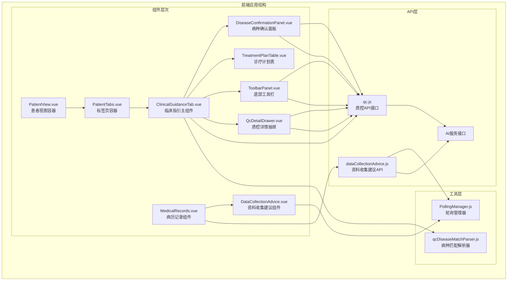
```mermaid
graph TB
subgraph "前端应用结构"
PV[PatientView.vue<br/>患者视图容器]
PT[PatientTabs.vue<br/>标签页容器]
CGT[ClinicalGuidanceTab.vue<br/>临床指引主组件]
DCP[DiseaseConfirmationPanel.vue<br/>病种确认面板]
TP[TreatmentPlanTable.vue<br/>诊疗计划表]
TB[ToolbarPanel.vue<br/>底部工具栏]
QCD[QcDetailDrawer.vue<br/>质控详情抽屉]
MR[MedicalRecords.vue<br/>病历记录组件]
DCA[DataCollectionAdvice.vue<br/>资料收集建议组件]
subgraph "组件层次"
PV --> PT
PT --> CGT
CGT --> DCP
CGT --> TP
CGT --> TB
CGT --> QCD
MR --> DCA
end
subgraph "API层"
QC[qc.js<br/>质控API接口]
DCAPI[dataCollectionAdvice.js<br/>资料收集建议API]
AI[AI服务接口]
end
subgraph "工具层"
PARSER[qcDiseaseMatchParser.js<br/>病种匹配解析器]
PM[PollingManager.js<br/>轮询管理器]
end
CGT --> QC
CGT --> PARSER
DCP --> QC
TB --> QC
QCD --> QC
MR --> DCAPI
DCAPI --> PM
DCA --> PM
DCP --> QC
TB --> QC
QCD --> QC
QC --> AI
DCAPI --> AI
end
```

**图表来源**
- [PatientView.vue:1-64](file://med_ai_assistant_1.0_bs_vue/src/views/PatientView.vue#L1-L64)
- [PatientTabs.vue:1-136](file://med_ai_assistant_1.0_bs_vue/src/components/patient/PatientTabs.vue#L1-L136)
- [ClinicalGuidanceTab.vue:1-1025](file://med_ai_assistant_1.0_bs_vue/src/components/qc/ClinicalGuidanceTab.vue#L1-L1025)
- [DiseaseConfirmationPanel.vue:1-313](file://med_ai_assistant_1.0_bs_vue/src/components/qc/DiseaseConfirmationPanel.vue#L1-L313)
- [MedicalRecords.vue:86-91](file://med_ai_assistant_1.0_bs_vue/src/components/patient/MedicalRecords.vue#L86-L91)
- [DataCollectionAdvice.vue:1-604](file://med_ai_assistant_1.0_bs_vue/src/components/patient/DataCollectionAdvice.vue#L1-L604)

**章节来源**
- [PatientView.vue:1-64](file://med_ai_assistant_1.0_bs_vue/src/views/PatientView.vue#L1-L64)
- [PatientTabs.vue:1-136](file://med_ai_assistant_1.0_bs_vue/src/components/patient/PatientTabs.vue#L1-L136)

## 核心组件

### PatientView - 患者视图容器

PatientView是患者信息管理的顶层容器组件，负责协调左侧患者列表和右侧标签页的布局。该组件实现了响应式设计，支持不同屏幕尺寸的自适应显示。

主要功能特性：
- 左右分栏布局设计
- 患者选中事件处理
- 长期医嘱数据加载
- 小屏模式下的界面适配

### PatientTabs - 标签页容器

PatientTabs组件管理患者信息的各个标签页，包括基本信息、病情小结、病历记录、检查报告等。该组件实现了智能的数据加载策略，优化了用户体验。

**更新** 新增了对ClinicalGuidanceTab的特殊处理，当用户切换到"临床指引"标签页时，会自动触发诊断匹配检查和触发机制。

关键特性：
- 动态标签页管理
- 懒加载机制（仅在用户访问时加载数据）
- 标签页切换监听
- 自动重置到基本信息标签页
- 临床指引标签页的特殊处理逻辑

### ClinicalGuidanceTab - 临床指引主组件

**更新** ClinicalGuidanceTab组件现在集成了完整的临床指引功能，包括专业的病种确认区、质控详情抽屉、底部工具栏等全新功能模块。

ClinicalGuidanceTab是整个功能的核心组件，集成了病种确认、质控评估、诊疗计划管理等功能。该组件采用了先进的并发数据处理模式，确保系统的高效运行。

**新增功能**：
- 病种确认区集成
- 质控详情抽屉
- 底部工具栏
- 重新选择模式
- 忽略病种管理
- 病种恢复功能

### DiseaseConfirmationPanel - 病种确认面板

**新增组件** DiseaseConfirmationPanel是一个专门用于处理病种确认的专业面板组件。

主要功能特性：
- 直观的病种勾选界面
- 实时确认状态反馈
- 加载状态指示
- 忽略操作支持
- 响应式设计

### ToolbarPanel - 底部工具栏

**新增组件** ToolbarPanel是临床指引Tab底部的工具栏组件，提供了统一的操作入口。

主要功能特性：
- 病种标签显示
- 完成率信息展示
- 忽略病种管理
- 重新匹配功能
- 质控详情查看
- 重新分析操作

### QcDetailDrawer - 质控详情抽屉

**新增组件** QcDetailDrawer是一个专门用于展示质控评估详情的抽屉组件。

主要功能特性：
- 顶部汇总信息
- 病种标签展示
- 进度条显示
- 指标列表分组
- 筛选功能
- 折叠展开

### MedicalRecords - 病历记录组件

**更新** MedicalRecords组件现在集成了资料收集建议标签页，嵌入在左侧面板中。

主要功能特性：
- 左右分栏布局设计
- 病历记录选项卡
- EMR病历选项卡
- **新增** 资料收集建议选项卡
- 病历编辑和操作功能

### DataCollectionAdvice - 资料收集建议组件

**新增组件** DataCollectionAdvice是资料收集建议功能的核心组件，提供AI生成的建议展示和管理。

主要功能特性：
- 四种状态展示：加载中、已完成、生成中、无数据
- 自动轮询机制（每5秒查询一次，最多60次）
- Markdown内容渲染和XSS过滤
- 两级可折叠分节（h2和h3）
- 手动触发生成和刷新功能

**章节来源**
- [PatientView.vue:14-54](file://med_ai_assistant_1.0_bs_vue/src/views/PatientView.vue#L14-L54)
- [PatientTabs.vue:35-117](file://med_ai_assistant_1.0_bs_vue/src/components/patient/PatientTabs.vue#L35-L117)
- [ClinicalGuidanceTab.vue:111-127](file://med_ai_assistant_1.0_bs_vue/src/components/qc/ClinicalGuidanceTab.vue#L111-L127)
- [DiseaseConfirmationPanel.vue:76-160](file://med_ai_assistant_1.0_bs_vue/src/components/qc/DiseaseConfirmationPanel.vue#L76-L160)
- [ToolbarPanel.vue:103-112](file://med_ai_assistant_1.0_bs_vue/src/components/qc/ToolbarPanel.vue#L103-L112)
- [QcDetailDrawer.vue:119-131](file://med_ai_assistant_1.0_bs_vue/src/components/qc/QcDetailDrawer.vue#L119-L131)
- [MedicalRecords.vue:86-91](file://med_ai_assistant_1.0_bs_vue/src/components/patient/MedicalRecords.vue#L86-L91)
- [DataCollectionAdvice.vue:19-56](file://med_ai_assistant_1.0_bs_vue/src/components/patient/DataCollectionAdvice.vue#L19-L56)

## 架构概览

**更新** 临床指引Tab现在包含了完整的功能模块，形成了更加完整的临床决策支持体系。

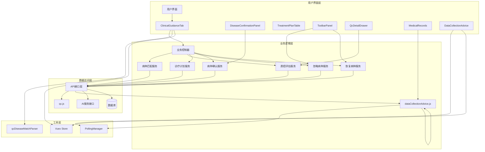
```mermaid
graph TD
subgraph "用户界面层"
UI[用户界面]
CT[ClinicalGuidanceTab]
DCP[DiseaseConfirmationPanel]
TP[TreatmentPlanTable]
TB[ToolbarPanel]
QCD[QcDetailDrawer]
MR[MedicalRecords]
DCA[DataCollectionAdvice]
end
subgraph "业务逻辑层"
BC[业务控制器]
DM[病种匹配服务]
QA[质控评估服务]
TPB[诊疗计划服务]
CONF[病种确认服务]
IG[忽略病种服务]
RES[恢复病种服务]
DCAPI[资料收集建议服务]
end
subgraph "数据访问层"
API[API接口层]
QC[qc.js]
DCAPI[dataCollectionAdvice.js]
AI[AI服务接口]
DB[(数据库)]
end
subgraph "工具层"
PARSER[qcDiseaseMatchParser]
UTIL[PollingManager]
STORE[Vuex Store]
end
UI --> CT
CT --> BC
BC --> DM
BC --> QA
BC --> TPB
BC --> CONF
BC --> IG
BC --> RES
MR --> DCAPI
DCAPI --> UTIL
DCAPI --> DCAPI
DCAPI --> DCAPI
DM --> API
QA --> API
TPB --> API
CONF --> API
IG --> API
RES --> API
API --> QC
API --> DCAPI
API --> AI
API --> DB
CT --> PARSER
CT --> STORE
DCA --> UTIL
DCA --> STORE
DCP --> CONF
TB --> IG
TB --> RES
QCD --> QA
```

**图表来源**
- [ClinicalGuidanceTab.vue:89-138](file://med_ai_assistant_1.0_bs_vue/src/components/qc/ClinicalGuidanceTab.vue#L89-L138)
- [DiseaseConfirmationPanel.vue:74-91](file://med_ai_assistant_1.0_bs_vue/src/components/qc/DiseaseConfirmationPanel.vue#L74-L91)
- [ToolbarPanel.vue:99-115](file://med_ai_assistant_1.0_bs_vue/src/components/qc/ToolbarPanel.vue#L99-L115)
- [QcDetailDrawer.vue:115-133](file://med_ai_assistant_1.0_bs_vue/src/components/qc/QcDetailDrawer.vue#L115-L133)
- [MedicalRecords.vue:86-91](file://med_ai_assistant_1.0_bs_vue/src/components/patient/MedicalRecords.vue#L86-L91)
- [DataCollectionAdvice.vue:267-284](file://med_ai_assistant_1.0_bs_vue/src/components/patient/DataCollectionAdvice.vue#L267-284)
- [qc.js:1-424](file://med_ai_assistant_1.0_bs_vue/src/api/qc.js#L1-L424)

## 详细组件分析

### ClinicalGuidanceTab 组件详解

**更新** ClinicalGuidanceTab组件现在包含了完整的临床指引功能，提供了专业的病种管理、质控评估、诊疗计划等一体化解决方案。

ClinicalGuidanceTab组件是整个临床指引功能的核心，采用了模块化的架构设计，包含以下主要功能模块：

#### 数据流架构

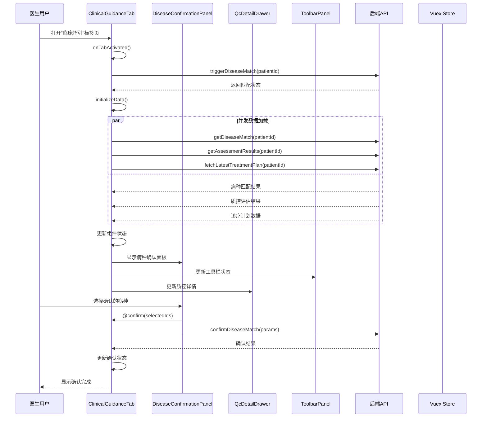
```mermaid
sequenceDiagram
participant User as 医生用户
participant Tab as ClinicalGuidanceTab
participant Panel as DiseaseConfirmationPanel
participant Drawer as QcDetailDrawer
participant Toolbar as ToolbarPanel
participant API as 后端API
participant Store as Vuex Store
User->>Tab : 打开"临床指引"标签页
Tab->>Tab : onTabActivated()
Tab->>API : triggerDiseaseMatch(patientId)
API-->>Tab : 返回匹配状态
Tab->>Tab : initializeData()
par 并发数据加载
Tab->>API : getDiseaseMatch(patientId)
Tab->>API : getAssessmentResults(patientId)
Tab->>API : fetchLatestTreatmentPlan(patientId)
and
API-->>Tab : 病种匹配结果
API-->>Tab : 质控评估结果
API-->>Tab : 诊疗计划数据
end
Tab->>Tab : 更新组件状态
Tab->>Panel : 显示病种确认面板
Tab->>Toolbar : 更新工具栏状态
Tab->>Drawer : 更新质控详情
User->>Panel : 选择确认的病种
Panel->>Tab : @confirm(selectedIds)
Tab->>API : confirmDiseaseMatch(params)
API-->>Tab : 确认结果
Tab->>Tab : 更新确认状态
Tab-->>User : 显示确认完成
```

**图表来源**
- [ClinicalGuidanceTab.vue:941-965](file://med_ai_assistant_1.0_bs_vue/src/components/qc/ClinicalGuidanceTab.vue#L941-L965)
- [ClinicalGuidanceTab.vue:289-330](file://med_ai_assistant_1.0_bs_vue/src/components/qc/ClinicalGuidanceTab.vue#L289-L330)
- [DiseaseConfirmationPanel.vue:183-230](file://med_ai_assistant_1.0_bs_vue/src/components/qc/DiseaseConfirmationPanel.vue#L183-L230)

#### 病种确认流程

**新增功能** 病种确认流程现在提供了完整的确认机制：

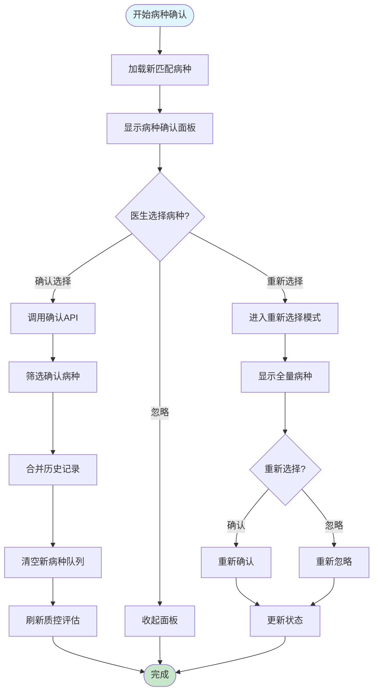
```mermaid
flowchart TD
Start([开始病种确认]) --> LoadData[加载新匹配病种]
LoadData --> ShowPanel[显示病种确认面板]
ShowPanel --> UserSelect{医生选择病种?}
UserSelect --> |确认选择| ConfirmAPI[调用确认API]
UserSelect --> |忽略| DismissPanel[收起面板]
UserSelect --> |重新选择| ReselectMode[进入重新选择模式]
ConfirmAPI --> FilterDiseases[筛选确认病种]
FilterDiseases --> MergeHistory[合并历史记录]
MergeHistory --> ClearNew[清空新病种队列]
ClearNew --> RefreshAssess[刷新质控评估]
RefreshAssess --> End([完成])
DismissPanel --> End
ReselectMode --> ShowAllDiseases[显示全量病种]
ShowAllDiseases --> UserReselect{重新选择?}
UserReselect --> |确认| ReselectConfirm[重新确认]
UserReselect --> |忽略| ReselectIgnore[重新忽略]
ReselectConfirm --> UpdateState[更新状态]
ReselectIgnore --> UpdateState
UpdateState --> End
style Start fill:#e1f5fe
style End fill:#c8e6c9
```

**图表来源**
- [ClinicalGuidanceTab.vue:647-692](file://med_ai_assistant_1.0_bs_vue/src/components/qc/ClinicalGuidanceTab.vue#L647-L692)
- [ClinicalGuidanceTab.vue:783-882](file://med_ai_assistant_1.0_bs_vue/src/components/qc/ClinicalGuidanceTab.vue#L783-L882)

#### 质控评估系统

质控评估系统提供了全面的医疗质量监控功能，包括指标评估、状态跟踪、建议生成等。

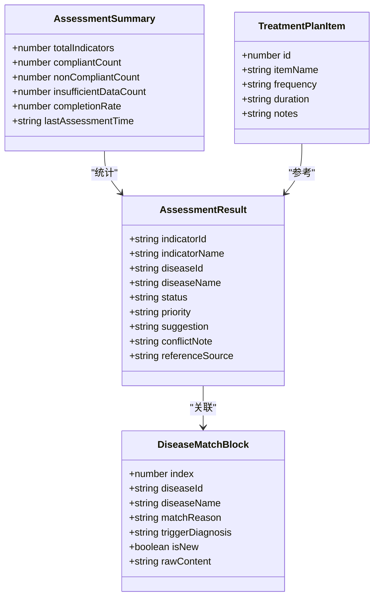
```mermaid
classDiagram
class AssessmentResult {
+string indicatorId
+string indicatorName
+string diseaseId
+string diseaseName
+string status
+string priority
+string suggestion
+string conflictNote
+string referenceSource
}
class AssessmentSummary {
+number totalIndicators
+number compliantCount
+number nonCompliantCount
+number insufficientDataCount
+number completionRate
+string lastAssessmentTime
}
class DiseaseMatchBlock {
+number index
+string diseaseId
+string diseaseName
+string matchReason
+string triggerDiagnosis
+boolean isNew
+string rawContent
}
class TreatmentPlanItem {
+number id
+string itemName
+string frequency
+string duration
+string notes
}
AssessmentResult --> DiseaseMatchBlock : "关联"
AssessmentSummary --> AssessmentResult : "统计"
TreatmentPlanItem --> AssessmentResult : "参考"
```

**图表来源**
- [ClinicalGuidanceTab.vue:151-171](file://med_ai_assistant_1.0_bs_vue/src/components/qc/ClinicalGuidanceTab.vue#L151-L171)
- [qcDiseaseMatchParser.js:7-16](file://med_ai_assistant_1.0_bs_vue/src/utils/qcDiseaseMatchParser.js#L7-L16)

**章节来源**
- [ClinicalGuidanceTab.vue:289-1025](file://med_ai_assistant_1.0_bs_vue/src/components/qc/ClinicalGuidanceTab.vue#L289-L1025)
- [DiseaseConfirmationPanel.vue:1-313](file://med_ai_assistant_1.0_bs_vue/src/components/qc/DiseaseConfirmationPanel.vue#L1-L313)
- [ToolbarPanel.vue:1-368](file://med_ai_assistant_1.0_bs_vue/src/components/qc/ToolbarPanel.vue#L1-L368)
- [QcDetailDrawer.vue:1-461](file://med_ai_assistant_1.0_bs_vue/src/components/qc/QcDetailDrawer.vue#L1-L461)
- [qcDiseaseMatchParser.js:106-182](file://med_ai_assistant_1.0_bs_vue/src/utils/qcDiseaseMatchParser.js#L106-L182)

### DiseaseConfirmationPanel 组件详解

**新增组件** DiseaseConfirmationPanel是一个专业的病种确认面板组件，提供了直观的病种确认界面。

#### 组件架构

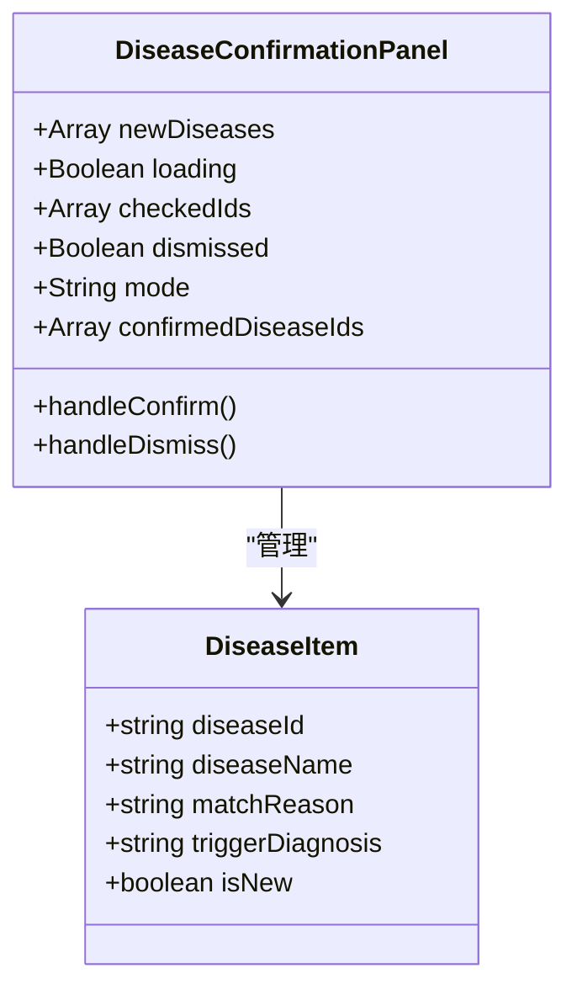
```mermaid
classDiagram
class DiseaseConfirmationPanel {
+Array newDiseases
+Boolean loading
+Array checkedIds
+Boolean dismissed
+String mode
+Array confirmedDiseaseIds
+handleConfirm()
+handleDismiss()
}
class DiseaseItem {
+string diseaseId
+string diseaseName
+string matchReason
+string triggerDiagnosis
+boolean isNew
}
DiseaseConfirmationPanel --> DiseaseItem : "管理"
```

**图表来源**
- [DiseaseConfirmationPanel.vue:86-160](file://med_ai_assistant_1.0_bs_vue/src/components/qc/DiseaseConfirmationPanel.vue#L86-L160)

#### 用户交互流程

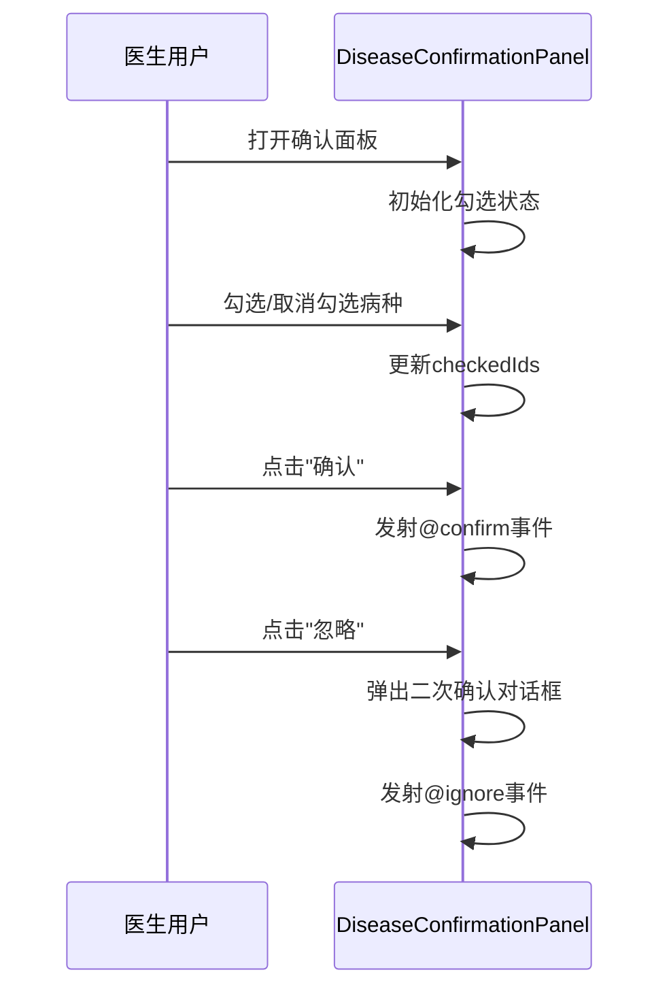
```mermaid
sequenceDiagram
participant User as 医生用户
participant Panel as DiseaseConfirmationPanel
User->>Panel : 打开确认面板
Panel->>Panel : 初始化勾选状态
User->>Panel : 勾选/取消勾选病种
Panel->>Panel : 更新checkedIds
User->>Panel : 点击"确认"
Panel->>Panel : 发射@confirm事件
User->>Panel : 点击"忽略"
Panel->>Panel : 弹出二次确认对话框
Panel->>Panel : 发射@ignore事件
```

**图表来源**
- [DiseaseConfirmationPanel.vue:183-230](file://med_ai_assistant_1.0_bs_vue/src/components/qc/DiseaseConfirmationPanel.vue#L183-L230)

#### 样式设计

组件采用了专业的样式设计，提供了良好的用户体验：

- **警告样式**：使用黄色警告色突出重要性
- **加载指示**：骨架屏显示加载状态
- **勾选界面**：清晰的病种列表和勾选框
- **操作按钮**：主确认按钮和次要忽略按钮
- **响应式布局**：适配不同屏幕尺寸

**章节来源**
- [DiseaseConfirmationPanel.vue:1-313](file://med_ai_assistant_1.0_bs_vue/src/components/qc/DiseaseConfirmationPanel.vue#L1-L313)

### ToolbarPanel 组件详解

**新增组件** ToolbarPanel是临床指引Tab底部的工具栏组件，提供了统一的操作入口。

#### 组件架构

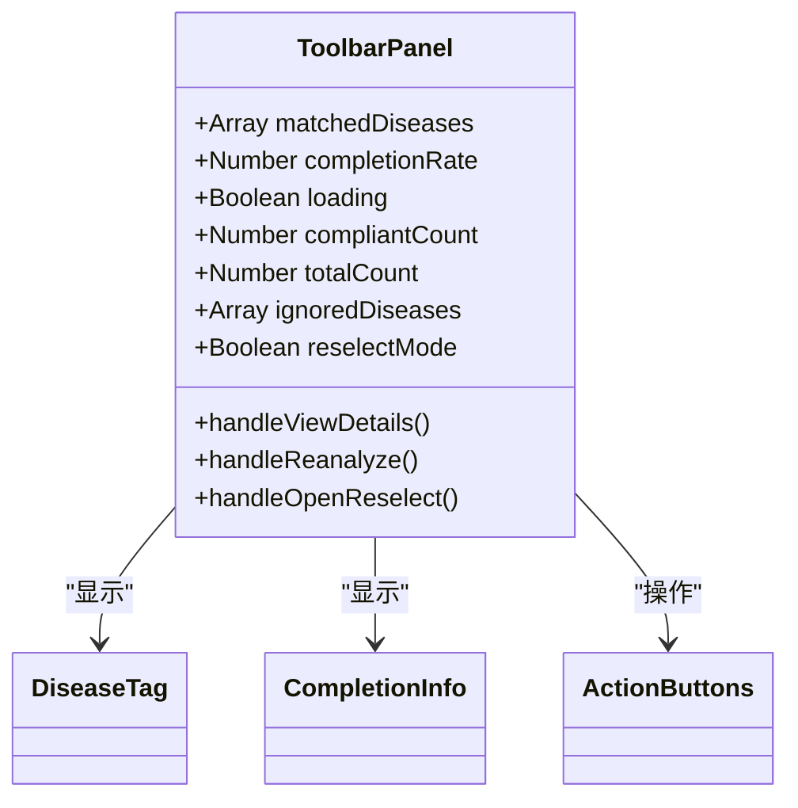
```mermaid
classDiagram
class ToolbarPanel {
+Array matchedDiseases
+Number completionRate
+Boolean loading
+Number compliantCount
+Number totalCount
+Array ignoredDiseases
+Boolean reselectMode
+handleViewDetails()
+handleReanalyze()
+handleOpenReselect()
}
ToolbarPanel --> DiseaseTag : "显示"
ToolbarPanel --> CompletionInfo : "显示"
ToolbarPanel --> ActionButtons : "操作"
```

**图表来源**
- [ToolbarPanel.vue:113-175](file://med_ai_assistant_1.0_bs_vue/src/components/qc/ToolbarPanel.vue#L113-L175)

#### 用户交互流程

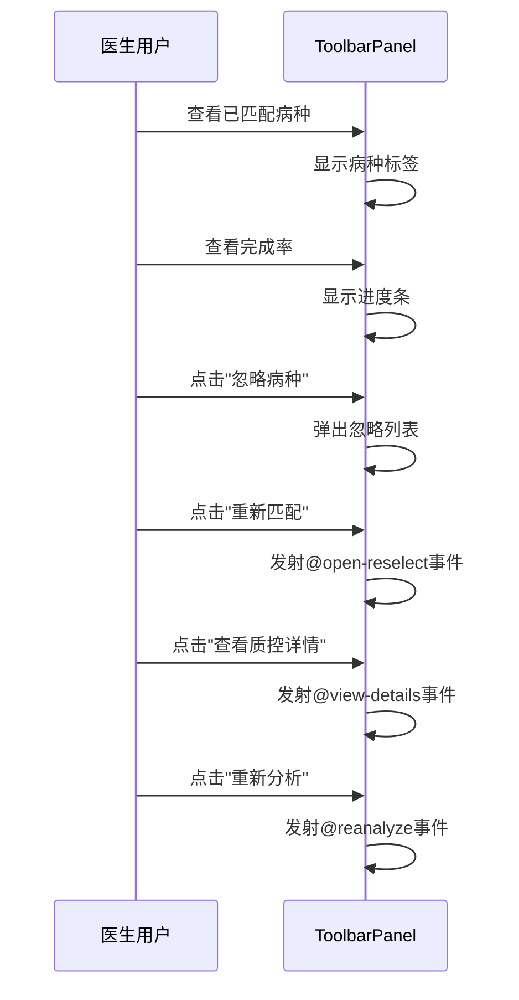
```mermaid
sequenceDiagram
participant User as 医生用户
participant Toolbar as ToolbarPanel
User->>Toolbar : 查看已匹配病种
Toolbar->>Toolbar : 显示病种标签
User->>Toolbar : 查看完成率
Toolbar->>Toolbar : 显示进度条
User->>Toolbar : 点击"忽略病种"
Toolbar->>Toolbar : 弹出忽略列表
User->>Toolbar : 点击"重新匹配"
Toolbar->>Toolbar : 发射@open-reselect事件
User->>Toolbar : 点击"查看质控详情"
Toolbar->>Toolbar : 发射@view-details事件
User->>Toolbar : 点击"重新分析"
Toolbar->>Toolbar : 发射@reanalyze事件
```

**图表来源**
- [ToolbarPanel.vue:36-95](file://med_ai_assistant_1.0_bs_vue/src/components/qc/ToolbarPanel.vue#L36-L95)

#### 样式设计

组件采用了简洁的样式设计，提供了清晰的信息展示：

- **左侧病种区**：显示已确认的病种标签
- **中间完成率区**：显示指标完成率和详细信息
- **右侧操作区**：提供各种操作按钮
- **颜色编码**：根据完成率显示不同颜色

**章节来源**
- [ToolbarPanel.vue:1-368](file://med_ai_assistant_1.0_bs_vue/src/components/qc/ToolbarPanel.vue#L1-L368)

### QcDetailDrawer 组件详解

**新增组件** QcDetailDrawer是一个专业的质控详情抽屉组件，提供了详细的质控评估结果展示。

#### 组件架构

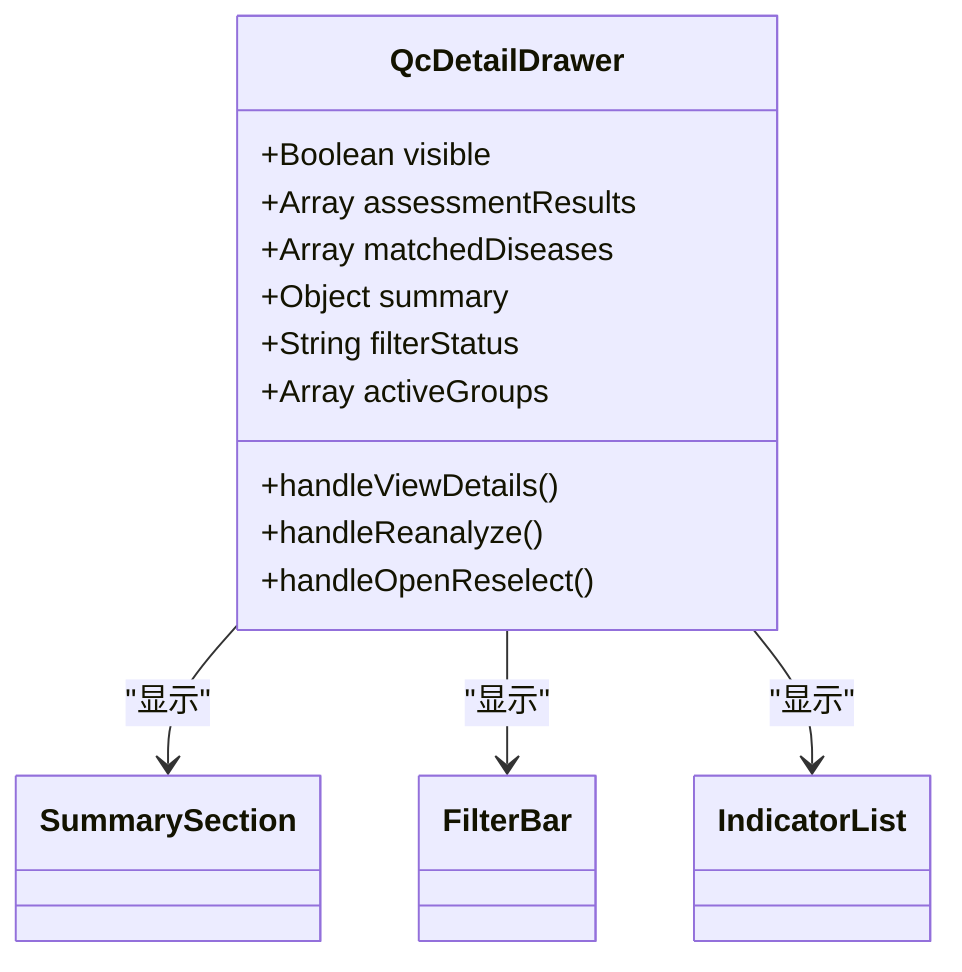
```mermaid
classDiagram
class QcDetailDrawer {
+Boolean visible
+Array assessmentResults
+Array matchedDiseases
+Object summary
+String filterStatus
+Array activeGroups
+handleViewDetails()
+handleReanalyze()
+handleOpenReselect()
}
QcDetailDrawer --> SummarySection : "显示"
QcDetailDrawer --> FilterBar : "显示"
QcDetailDrawer --> IndicatorList : "显示"
```

**图表来源**
- [QcDetailDrawer.vue:132-179](file://med_ai_assistant_1.0_bs_vue/src/components/qc/QcDetailDrawer.vue#L132-L179)

#### 用户交互流程

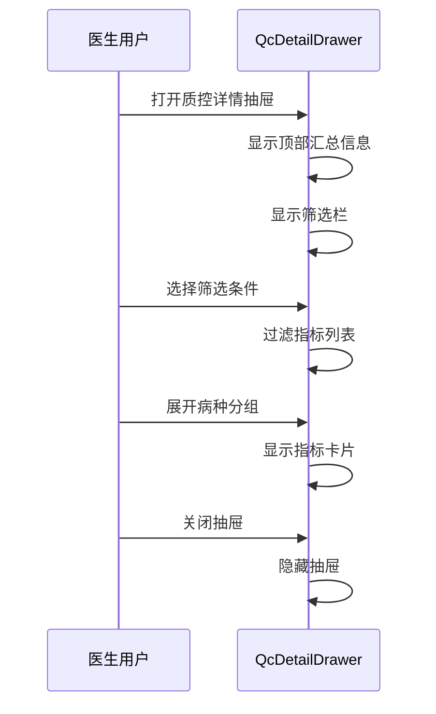
```mermaid
sequenceDiagram
participant User as 医生用户
participant Drawer as QcDetailDrawer
User->>Drawer : 打开质控详情抽屉
Drawer->>Drawer : 显示顶部汇总信息
Drawer->>Drawer : 显示筛选栏
User->>Drawer : 选择筛选条件
Drawer->>Drawer : 过滤指标列表
User->>Drawer : 展开病种分组
Drawer->>Drawer : 显示指标卡片
User->>Drawer : 关闭抽屉
Drawer->>Drawer : 隐藏抽屉
```

**图表来源**
- [QcDetailDrawer.vue:195-325](file://med_ai_assistant_1.0_bs_vue/src/components/qc/QcDetailDrawer.vue#L195-L325)

#### 样式设计

组件采用了专业的样式设计，提供了详细的信息展示：

- **顶部汇总区**：显示病种标签、进度条、评估时间
- **筛选栏**：提供状态筛选功能
- **指标列表**：按病种分组显示指标卡片
- **折叠展开**：支持分组的折叠和展开

**章节来源**
- [QcDetailDrawer.vue:1-461](file://med_ai_assistant_1.0_bs_vue/src/components/qc/QcDetailDrawer.vue#L1-L461)

### MedicalRecords 组件详解

**更新** MedicalRecords组件现在集成了资料收集建议标签页，嵌入在左侧面板中。

#### 组件架构

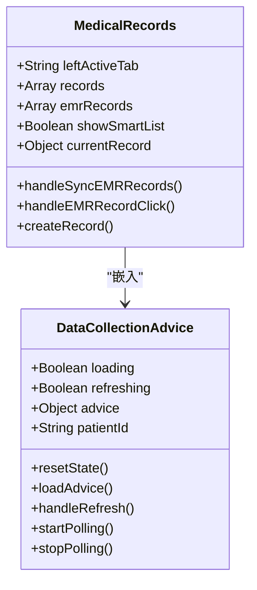
```mermaid
classDiagram
class MedicalRecords {
+String leftActiveTab
+Array records
+Array emrRecords
+Boolean showSmartList
+Object currentRecord
+handleSyncEMRRecords()
+handleEMRRecordClick()
+createRecord()
}
class DataCollectionAdvice {
+Boolean loading
+Boolean refreshing
+Object advice
+String patientId
+resetState()
+loadAdvice()
+handleRefresh()
+startPolling()
+stopPolling()
}
MedicalRecords --> DataCollectionAdvice : "嵌入"
```

**图表来源**
- [MedicalRecords.vue:54-91](file://med_ai_assistant_1.0_bs_vue/src/components/patient/MedicalRecords.vue#L54-L91)

#### 左侧面板集成

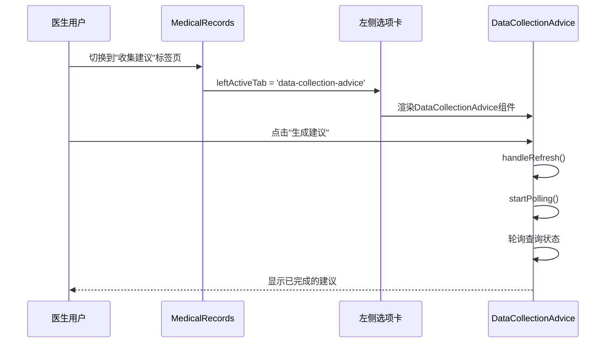
```mermaid
sequenceDiagram
participant User as 医生用户
participant MR as MedicalRecords
participant Tabs as 左侧选项卡
participant DCA as DataCollectionAdvice
User->>MR : 切换到"收集建议"标签页
MR->>Tabs : leftActiveTab = 'data-collection-advice'
Tabs->>DCA : 渲染DataCollectionAdvice组件
User->>DCA : 点击"生成建议"
DCA->>DCA : handleRefresh()
DCA->>DCA : startPolling()
DCA->>DCA : 轮询查询状态
DCA-->>User : 显示已完成的建议
```

**图表来源**
- [MedicalRecords.vue:86-91](file://med_ai_assistant_1.0_bs_vue/src/components/patient/MedicalRecords.vue#L86-L91)
- [DataCollectionAdvice.vue:237-259](file://med_ai_assistant_1.0_bs_vue/src/components/patient/DataCollectionAdvice.vue#L237-L259)

#### 标签页管理

组件支持三个主要标签页：
- **病历记录**：标准的病历记录列表
- **EMR病历**：电子病历系统集成
- **收集建议**：新增的资料收集建议标签页

**章节来源**
- [MedicalRecords.vue:1-200](file://med_ai_assistant_1.0_bs_vue/src/components/patient/MedicalRecords.vue#L1-L200)

### DataCollectionAdvice 组件详解

**新增组件** DataCollectionAdvice是资料收集建议功能的核心组件，提供AI生成的建议展示和管理。

#### 组件架构

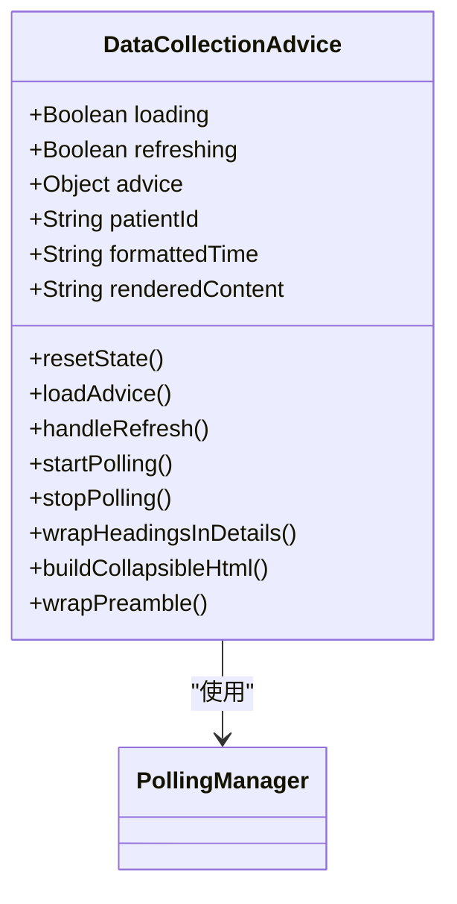
```mermaid
classDiagram
class DataCollectionAdvice {
+Boolean loading
+Boolean refreshing
+Object advice
+String patientId
+String formattedTime
+String renderedContent
+resetState()
+loadAdvice()
+handleRefresh()
+startPolling()
+stopPolling()
+wrapHeadingsInDetails()
+buildCollapsibleHtml()
+wrapPreamble()
}
DataCollectionAdvice --> PollingManager : "使用"
```

**图表来源**
- [DataCollectionAdvice.vue:113-168](file://med_ai_assistant_1.0_bs_vue/src/components/patient/DataCollectionAdvice.vue#L113-L168)

#### 状态管理流程

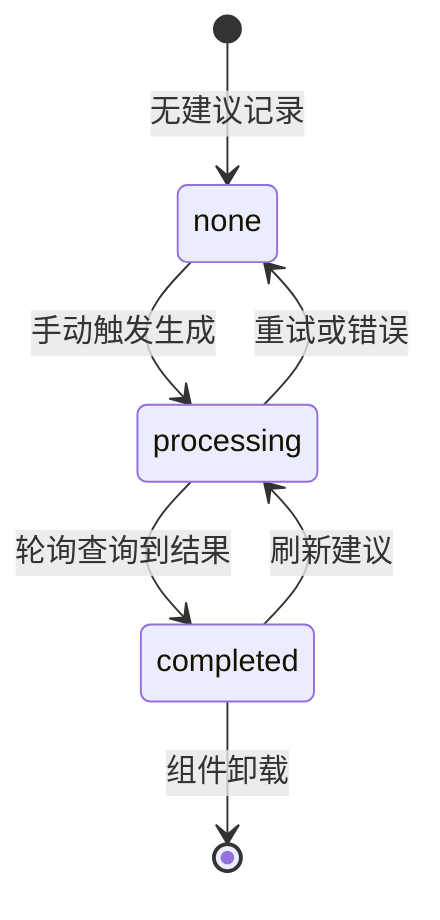
```mermaid
stateDiagram-v2
[*] --> none : 无建议记录
none --> processing : 手动触发生成
processing --> completed : 轮询查询到结果
completed --> processing : 刷新建议
processing --> none : 重试或错误
completed --> [*] : 组件卸载
```

**图表来源**
- [DataCollectionAdvice.vue:18-56](file://med_ai_assistant_1.0_bs_vue/src/components/patient/DataCollectionAdvice.vue#L18-L56)

#### 用户交互流程

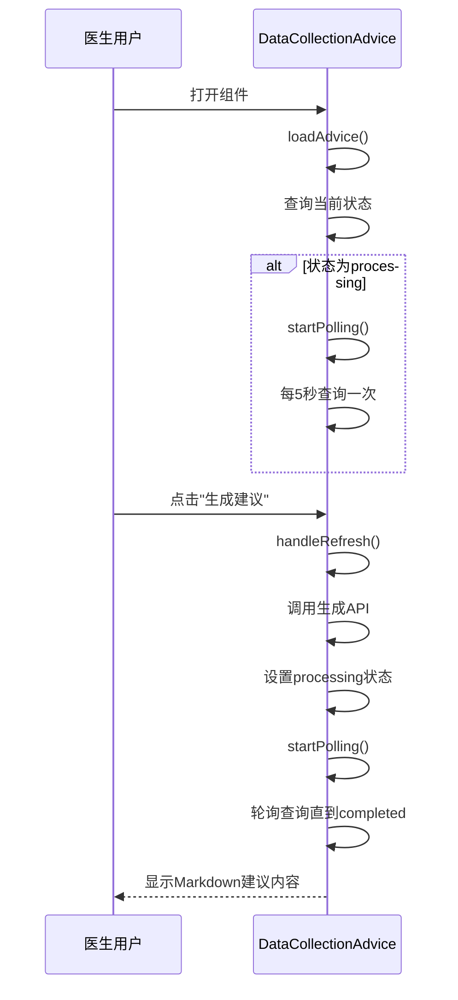
```mermaid
sequenceDiagram
participant User as 医生用户
participant DCA as DataCollectionAdvice
User->>DCA : 打开组件
DCA->>DCA : loadAdvice()
DCA->>DCA : 查询当前状态
alt 状态为processing
DCA->>DCA : startPolling()
DCA->>DCA : 每5秒查询一次
end
User->>DCA : 点击"生成建议"
DCA->>DCA : handleRefresh()
DCA->>DCA : 调用生成API
DCA->>DCA : 设置processing状态
DCA->>DCA : startPolling()
DCA->>DCA : 轮询查询直到completed
DCA-->>User : 显示Markdown建议内容
```

**图表来源**
- [DataCollectionAdvice.vue:209-229](file://med_ai_assistant_1.0_bs_vue/src/components/patient/DataCollectionAdvice.vue#L209-L229)
- [DataCollectionAdvice.vue:237-259](file://med_ai_assistant_1.0_bs_vue/src/components/patient/DataCollectionAdvice.vue#L237-L259)
- [DataCollectionAdvice.vue:267-284](file://med_ai_assistant_1.0_bs_vue/src/components/patient/DataCollectionAdvice.vue#L267-L284)

#### Markdown渲染和折叠功能

组件提供了高级的Markdown渲染功能：

- **XSS防护**：使用DOMPurify过滤HTML内容
- **两级折叠**：h2和h3标题自动包装为details/summary
- **分析过程**：第一个h2之前的内容自动折叠为"分析过程"
- **原生实现**：无需JavaScript，使用浏览器原生details元素

**章节来源**
- [DataCollectionAdvice.vue:159-168](file://med_ai_assistant_1.0_bs_vue/src/components/patient/DataCollectionAdvice.vue#L159-L168)
- [DataCollectionAdvice.vue:293-391](file://med_ai_assistant_1.0_bs_vue/src/components/patient/DataCollectionAdvice.vue#L293-L391)

### API 接口分析

#### 病种匹配接口

**更新** 病种匹配功能现在支持确认状态的查询和管理。

病种匹配功能通过智能算法分析患者的诊断信息，自动识别可能的疾病组合。

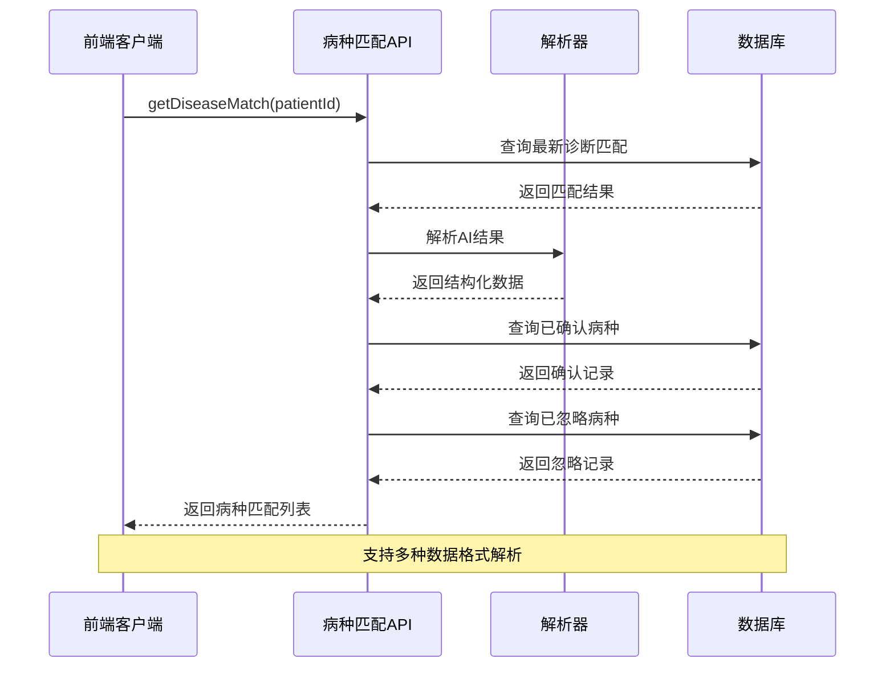
```mermaid
sequenceDiagram
participant Client as 前端客户端
participant API as 病种匹配API
participant Parser as 解析器
participant DB as 数据库
Client->>API : getDiseaseMatch(patientId)
API->>DB : 查询最新诊断匹配
DB-->>API : 返回匹配结果
API->>Parser : 解析AI结果
Parser-->>API : 返回结构化数据
API->>DB : 查询已确认病种
DB-->>API : 返回确认记录
API->>DB : 查询已忽略病种
DB-->>API : 返回忽略记录
API-->>Client : 返回病种匹配列表
Note over Client,DB : 支持多种数据格式解析
```

**图表来源**
- [qc.js:36-38](file://med_ai_assistant_1.0_bs_vue/src/api/qc.js#L36-L38)
- [ClinicalGuidanceTab.vue:337-420](file://med_ai_assistant_1.0_bs_vue/src/components/qc/ClinicalGuidanceTab.vue#L337-L420)

#### 病种确认接口

**新增功能** 病种确认接口提供了专业的病种确认功能。

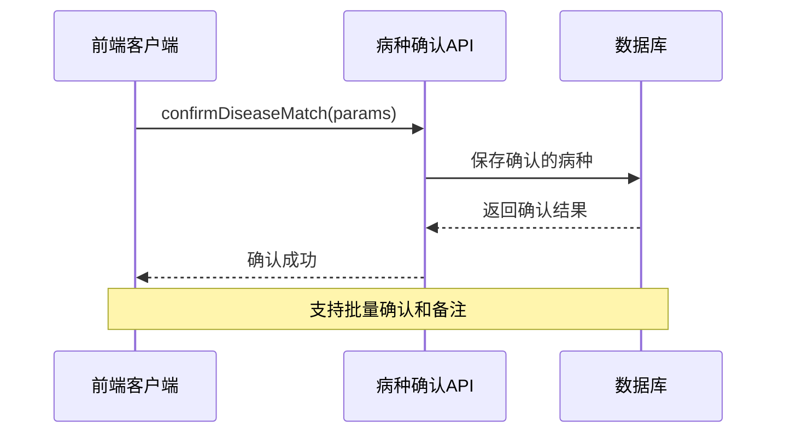
```mermaid
sequenceDiagram
participant Client as 前端客户端
participant API as 病种确认API
participant DB as 数据库
Client->>API : confirmDiseaseMatch(params)
API->>DB : 保存确认的病种
DB-->>API : 返回确认结果
API-->>Client : 确认成功
Note over Client,DB : 支持批量确认和备注
```

**图表来源**
- [qc.js:115-117](file://med_ai_assistant_1.0_bs_vue/src/api/qc.js#L115-L117)
- [ClinicalGuidanceTab.vue:647-692](file://med_ai_assistant_1.0_bs_vue/src/components/qc/ClinicalGuidanceTab.vue#L647-L692)

#### 资料收集建议API

**新增功能** 资料收集建议API提供了AI生成建议的完整生命周期管理。

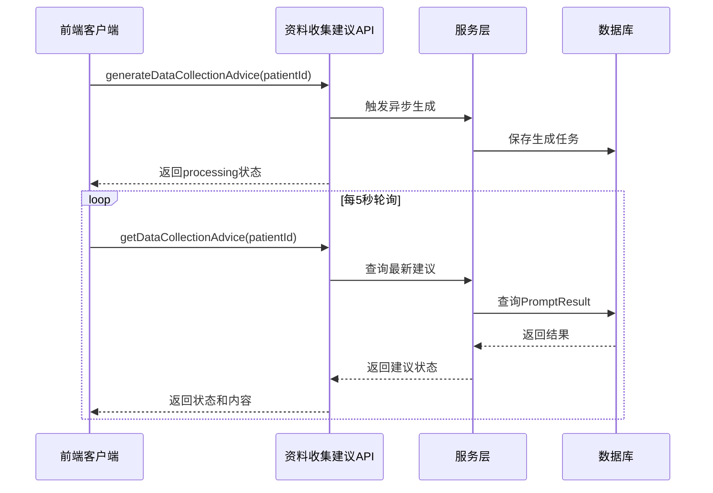
```mermaid
sequenceDiagram
participant Client as 前端客户端
participant API as 资料收集建议API
participant Service as 服务层
participant DB as 数据库
Client->>API : generateDataCollectionAdvice(patientId)
API->>Service : 触发异步生成
Service->>DB : 保存生成任务
API-->>Client : 返回processing状态
loop 每5秒轮询
Client->>API : getDataCollectionAdvice(patientId)
API->>Service : 查询最新建议
Service->>DB : 查询PromptResult
DB-->>Service : 返回结果
Service-->>API : 返回建议状态
API-->>Client : 返回状态和内容
end
```

**图表来源**
- [dataCollectionAdvice.js:27-29](file://med_ai_assistant_1.0_bs_vue/src/api/dataCollectionAdvice.js#L27-L29)
- [dataCollectionAdvice.js:52-54](file://med_ai_assistant_1.0_bs_vue/src/api/dataCollectionAdvice.js#L52-L54)
- [DataCollectionAdviceController.java:80-102](file://med_ai_assistant_1.0_bs_backend/src/main/java/com/example/medaiassistant/controller/DataCollectionAdviceController.java#L80-L102)
- [DataCollectionAdviceService.java:57-80](file://med_ai_assistant_1.0_bs_backend/src/main/java/com/example/medaiassistant/service/DataCollectionAdviceService.java#L57-L80)

#### 质控评估接口

质控评估接口提供了全面的医疗质量监控功能，支持指标级别的评估和统计。

**章节来源**
- [qc.js:242-244](file://med_ai_assistant_1.0_bs_vue/src/api/qc.js#L242-L244)
- [qc.js:274-276](file://med_ai_assistant_1.0_bs_vue/src/api/qc.js#L274-L276)
- [qc.js:300-302](file://med_ai_assistant_1.0_bs_vue/src/api/qc.js#L300-L302)

### 后端服务分析

#### DataCollectionAdviceController

**新增组件** DataCollectionAdviceController处理资料收集建议的HTTP请求。

主要功能：
- **POST /api/ai/data-collection-advice/generate/{patientId}**：手动触发生成
- **GET /api/ai/data-collection-advice/{patientId}**：查询最新建议
- **异步处理**：使用TimerPromptGenerator异步生成AI建议
- **状态校验**：验证患者存在性和参数有效性

#### DataCollectionAdviceService

**新增组件** DataCollectionAdviceService提供资料收集建议的业务逻辑。

主要功能：
- **状态判断**：根据PromptResult内容判断状态（none/processing/completed）
- **数据来源标识**：检查诊断分析和诊疗计划的存在性
- **响应组装**：构建DataCollectionAdviceResponse对象
- **异常处理**：处理查询异常和数据不一致情况

#### DataCollectionAdviceResponse

**新增组件** DataCollectionAdviceResponse是资料收集建议的响应DTO。

包含字段：
- **status**：建议状态（none/processing/completed）
- **resultContent**：Markdown格式的建议内容
- **generatedTime**：建议生成时间
- **basedOn**：数据来源标识对象

**章节来源**
- [DataCollectionAdviceController.java:1-121](file://med_ai_assistant_1.0_bs_backend/src/main/java/com/example/medaiassistant/controller/DataCollectionAdviceController.java#L1-L121)
- [DataCollectionAdviceService.java:1-129](file://med_ai_assistant_1.0_bs_backend/src/main/java/com/example/medaiassistant/service/DataCollectionAdviceService.java#L1-L129)
- [DataCollectionAdviceResponse.java:1-99](file://med_ai_assistant_1.0_bs_backend/src/main/java/com/example/medaiassistant/dto/DataCollectionAdviceResponse.java#L1-L99)

## 依赖关系分析

### 组件依赖图

**更新** 新增了DiseaseConfirmationPanel、ToolbarPanel、QcDetailDrawer、DataCollectionAdvice组件的依赖关系。

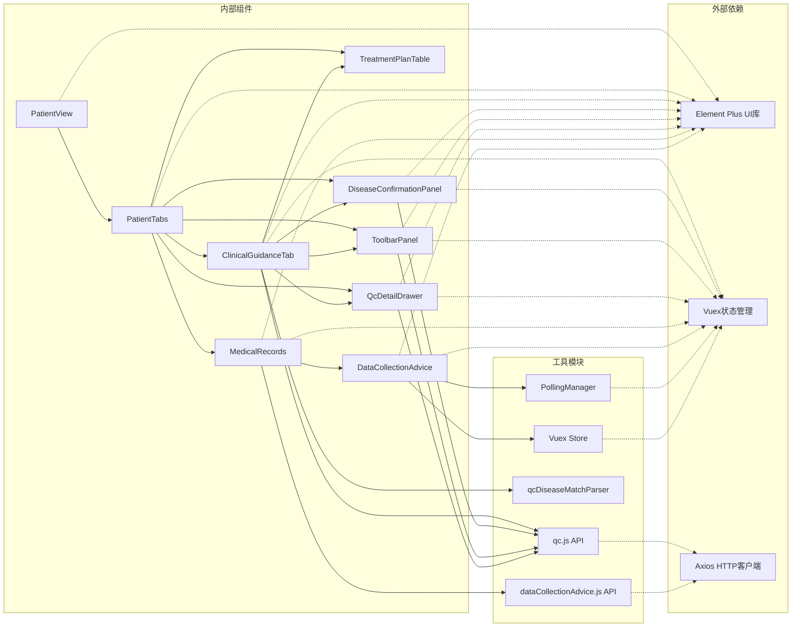
```mermaid
graph LR
subgraph "外部依赖"
ElementPlus[Element Plus UI库]
Vue[Vuex状态管理]
Axios[Axios HTTP客户端]
end
subgraph "内部组件"
PatientView[PatientView]
PatientTabs[PatientTabs]
ClinicalGuidanceTab[ClinicalGuidanceTab]
DiseaseConfirmationPanel[DiseaseConfirmationPanel]
TreatmentPlanTable[TreatmentPlanTable]
ToolbarPanel[ToolbarPanel]
QcDetailDrawer[QcDetailDrawer]
MedicalRecords[MedicalRecords]
DataCollectionAdvice[DataCollectionAdvice]
end
subgraph "工具模块"
qcAPI[qc.js API]
dcaAPI[dataCollectionAdvice.js API]
parser[qcDiseaseMatchParser]
pm[PollingManager]
store[Vuex Store]
end
PatientView --> PatientTabs
PatientTabs --> ClinicalGuidanceTab
PatientTabs --> DiseaseConfirmationPanel
PatientTabs --> TreatmentPlanTable
PatientTabs --> ToolbarPanel
PatientTabs --> QcDetailDrawer
PatientTabs --> MedicalRecords
MedicalRecords --> DataCollectionAdvice
ClinicalGuidanceTab --> DiseaseConfirmationPanel
ClinicalGuidanceTab --> TreatmentPlanTable
ClinicalGuidanceTab --> ToolbarPanel
ClinicalGuidanceTab --> QcDetailDrawer
ClinicalGuidanceTab --> qcAPI
ClinicalGuidanceTab --> parser
DiseaseConfirmationPanel --> qcAPI
ToolbarPanel --> qcAPI
QcDetailDrawer --> qcAPI
MedicalRecords --> dcaAPI
DataCollectionAdvice --> pm
DataCollectionAdvice --> store
PatientView -.-> ElementPlus
PatientTabs -.-> ElementPlus
ClinicalGuidanceTab -.-> ElementPlus
DiseaseConfirmationPanel -.-> ElementPlus
ToolbarPanel -.-> ElementPlus
QcDetailDrawer -.-> ElementPlus
MedicalRecords -.-> ElementPlus
DataCollectionAdvice -.-> ElementPlus
ClinicalGuidanceTab -.-> Vue
DiseaseConfirmationPanel -.-> Vue
ToolbarPanel -.-> Vue
QcDetailDrawer -.-> Vue
MedicalRecords -.-> Vue
DataCollectionAdvice -.-> Vue
qcAPI -.-> Axios
dcaAPI -.-> Axios
pm -.-> Vue
store -.-> Vue
```

**图表来源**
- [PatientTabs.vue:44-64](file://med_ai_assistant_1.0_bs_vue/src/components/patient/PatientTabs.vue#L44-L64)
- [ClinicalGuidanceTab.vue:89-138](file://med_ai_assistant_1.0_bs_vue/src/components/qc/ClinicalGuidanceTab.vue#L89-L138)
- [DiseaseConfirmationPanel.vue:74-91](file://med_ai_assistant_1.0_bs_vue/src/components/qc/DiseaseConfirmationPanel.vue#L74-L91)
- [ToolbarPanel.vue:99-115](file://med_ai_assistant_1.0_bs_vue/src/components/qc/ToolbarPanel.vue#L99-L115)
- [QcDetailDrawer.vue:115-139](file://med_ai_assistant_1.0_bs_vue/src/components/qc/QcDetailDrawer.vue#L115-L139)
- [MedicalRecords.vue:86-91](file://med_ai_assistant_1.0_bs_vue/src/components/patient/MedicalRecords.vue#L86-L91)
- [DataCollectionAdvice.vue:73](file://med_ai_assistant_1.0_bs_vue/src/components/patient/DataCollectionAdvice.vue#L73)

### 数据流依赖

**更新** 新增了病种确认流程、工具栏操作、抽屉展示、资料收集建议等数据流依赖。

临床指引Tab的数据流现在包含了完整的功能模块，确保系统的完整性和可靠性。

**章节来源**
- [PatientTabs.vue:102-115](file://med_ai_assistant_1.0_bs_vue/src/components/patient/PatientTabs.vue#L102-L115)
- [ClinicalGuidanceTab.vue:941-965](file://med_ai_assistant_1.0_bs_vue/src/components/qc/ClinicalGuidanceTab.vue#L941-L965)

## 性能考虑

### 并发数据加载优化

系统采用了Promise.all并发加载策略，显著提升了数据加载效率：

- **病种匹配**：实时诊断变更检测
- **质控评估**：多指标综合评估
- **诊疗计划**：最新AI生成结果
- **病种确认**：确认状态查询和管理
- **忽略列表**：忽略病种状态管理
- **资料收集建议**：异步生成和轮询查询

### 懒加载机制

为了优化用户体验，系统实现了智能的懒加载策略：

- 检查报告标签页仅在用户访问时加载
- 临床指引Tab在激活时才触发数据加载
- 病种确认面板仅在有新病种时显示
- 质控详情抽屉仅在用户主动打开时加载
- 骨架屏提升加载体验
- **新增** 资料收集建议组件仅在切换到相应标签页时加载

### 缓存策略

系统实现了多层次的缓存机制：

- Vuex状态管理缓存
- 组件本地状态缓存
- API响应缓存
- 病种确认状态缓存
- 抽屉内容缓存
- **新增** 资料收集建议状态缓存

### 轮询优化

**新增功能** 资料收集建议功能实现了高效的轮询机制：

- **轮询间隔**：每5秒查询一次
- **最大次数**：最多轮询60次（5分钟超时）
- **智能停止**：状态变为completed时自动停止
- **错误处理**：超时和错误状态的优雅降级
- **组件卸载**：组件销毁时自动停止轮询

### 跨去重机制优化

**更新** 新增了智能的跨去重机制，优化了病种匹配结果的处理效率。

系统实现了高效的去重算法，避免重复病种的多次显示：

- **按病种ID去重**：同一病种被多个诊断触发时合并
- **触发诊断合并**：多个触发诊断合并显示
- **匹配理由聚合**：不同匹配理由聚合显示
- **性能优化**：使用Map数据结构提升查找效率

## 故障排除指南

### 常见问题及解决方案

#### 病种确认失败

**更新** 当病种确认操作失败时，系统会显示相应的错误提示并保持数据状态不变。

**解决步骤**：
1. 检查网络连接状态
2. 验证患者ID的有效性
3. 确认后端服务正常运行
4. 查看浏览器控制台错误信息
5. 检查确认的病种列表是否为空

#### 病种确认面板显示异常

**新增问题** 当病种确认面板显示出现问题时，可以尝试以下解决方案：

**解决步骤**：
1. 检查新病种数据是否正确加载
2. 验证确认面板的props传递
3. 查看组件的watch监听是否正常
4. 检查确认事件的发射和接收

#### 工具栏功能异常

**新增问题** 当底部工具栏功能出现问题时，可以尝试以下解决方案：

**解决步骤**：
1. 检查病种标签数据是否正确
2. 验证完成率计算逻辑
3. 查看忽略病种列表是否正常
4. 检查重新分析按钮的状态

#### 质控详情抽屉异常

**新增问题** 当质控详情抽屉显示出现问题时，可以尝试以下解决方案：

**解决步骤**：
1. 检查评估结果数据是否正确
2. 验证分组逻辑是否正常
3. 查看筛选功能是否工作
4. 检查折叠展开功能

#### 资料收集建议加载失败

**新增问题** 当资料收集建议加载出现问题时，可以尝试以下解决方案：

**解决步骤**：
1. 检查患者ID是否正确传递
2. 验证API接口是否可用
3. 查看轮询是否正常启动
4. 检查组件的错误状态处理
5. 确认后端服务是否正常运行

#### 轮询功能异常

**新增问题** 当轮询功能出现问题时，可以尝试以下解决方案：

**解决步骤**：
1. 检查轮询管理器是否正确初始化
2. 验证轮询间隔和最大次数配置
3. 查看超时和错误回调是否正常执行
4. 检查组件卸载时的轮询停止逻辑

#### 数据加载超时

如果数据加载超过预期时间，系统会显示加载状态并提供重试机制。

**解决步骤**：
1. 检查API接口可用性
2. 验证数据库连接状态
3. 查看服务器日志
4. 考虑增加超时时间

#### 界面显示异常

如果界面显示出现异常，可以尝试以下解决方案：

**解决步骤**：
1. 刷新页面缓存
2. 检查浏览器兼容性
3. 清除浏览器缓存
4. 重启应用服务

**章节来源**
- [ClinicalGuidanceTab.vue:697-700](file://med_ai_assistant_1.0_bs_vue/src/components/qc/ClinicalGuidanceTab.vue#L697-L700)
- [DiseaseConfirmationPanel.vue:203-230](file://med_ai_assistant_1.0_bs_vue/src/components/qc/DiseaseConfirmationPanel.vue#L203-L230)
- [ToolbarPanel.vue:36-95](file://med_ai_assistant_1.0_bs_vue/src/components/qc/ToolbarPanel.vue#L36-L95)
- [QcDetailDrawer.vue:279-282](file://med_ai_assistant_1.0_bs_vue/src/components/qc/QcDetailDrawer.vue#L279-L282)
- [DataCollectionAdvice.vue:276-282](file://med_ai_assistant_1.0_bs_vue/src/components/patient/DataCollectionAdvice.vue#L276-L282)

## 结论

**更新** 临床指引Tab经过重大升级，现在包含了完整的功能模块，形成了更加完整的临床决策支持体系。

**新增功能** 通过集成资料收集建议标签页、自动轮询机制和状态管理系统，临床指引Tab现在提供了从病种确认到AI建议生成的完整闭环。

临床指引Tab作为MedAiAssistant项目的核心功能模块，展现了现代医疗信息系统的设计理念和技术水平。该模块通过智能化的数据处理、专业的病种确认功能、优雅的用户界面设计、以及可靠的系统架构，为医生提供了全面的临床决策支持。

### 主要优势

1. **智能化程度高**：基于AI的病种匹配和质控评估
2. **专业确认功能**：提供直观的病种确认界面
3. **完整功能体系**：包含确认区、抽屉、工具栏等完整模块
4. **用户体验优秀**：响应式设计和流畅的交互体验
5. **系统稳定性强**：完善的错误处理和性能优化
6. **扩展性强**：模块化设计便于功能扩展
7. **去重机制完善**：智能的跨去重算法提升准确性
8. **AI建议集成**：新增的资料收集建议功能提升诊断质量
9. **自动轮询**：智能的轮询机制提升用户体验
10. **状态管理**：完善的组件状态管理确保数据一致性

### 技术特色

- 采用Vue.js + Element Plus的现代化前端技术栈
- 实现了智能的并发数据处理机制
- 提供了完整的错误处理和用户反馈机制
- 支持多平台和多设备的自适应显示
- 集成了专业的病种确认面板功能
- 实现了高效的跨去重算法
- 提供了完整的质控评估可视化展示
- **新增** 实现了资料收集建议的完整生命周期管理
- **新增** 提供了智能的自动轮询和状态管理
- **新增** 集成了后端异步生成和状态查询机制

**新增功能** 完整的临床指引Tab功能模块为医生提供了从病种确认到质控评估再到AI建议生成的一体化解决方案，大大提升了诊断的准确性和效率。

该功能模块不仅满足了当前的医疗需求，也为未来的功能扩展和技术升级奠定了坚实的基础。