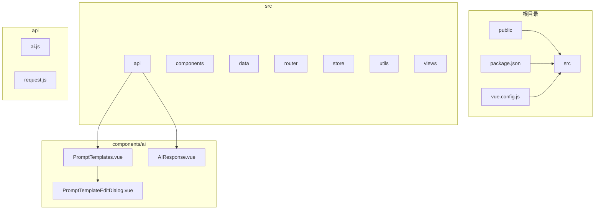
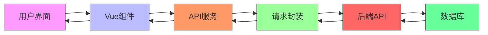
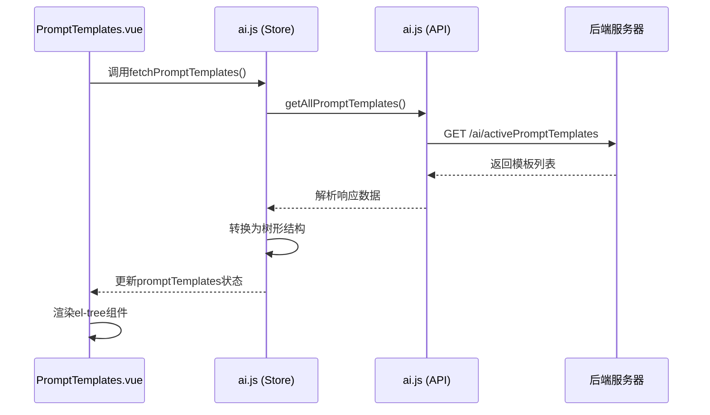
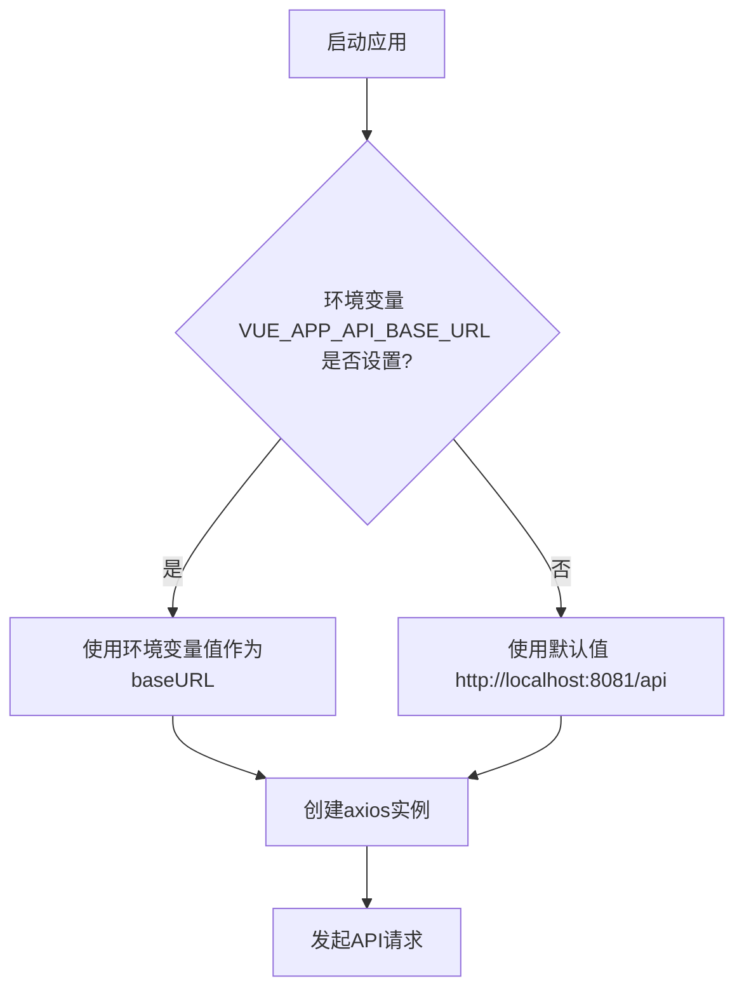

# 开发者指南

<cite>
**本文档引用的文件**  
- [PromptTemplates.vue](file://src/components/ai/PromptTemplates.vue)
- [ai.js](file://src/api/ai.js)
- [promptUtils.js](file://src/utils/promptUtils.js)
- [request.js](file://src/api/request.js)
- [vue.config.js](file://vue.config.js)
- [aiService.js](file://src/api/aiService.js)
- [ai.js](file://src/store/modules/ai.js)
</cite>

## 目录
1. [简介](#简介)
2. [项目结构](#项目结构)
3. [核心组件](#核心组件)
4. [架构概览](#架构概览)
5. [详细组件分析](#详细组件分析)
6. [依赖分析](#依赖分析)
7. [性能考虑](#性能考虑)
8. [故障排除指南](#故障排除指南)
9. [结论](#结论)

## 简介
本文档旨在为开发者提供一份全面的扩展指南，指导如何在医疗AI助手项目中添加新的Prompt模板以支持新的AI分析功能。文档详细说明了在前端组件`PromptTemplates.vue`中注册新模板的步骤，包括前端表单配置与后端API适配要求。同时，文档还介绍了如何在`ai.js`中定义新的API端点，并确保与现有请求封装机制兼容。此外，还涵盖了`vue.config.js`中构建配置的自定义方法，如环境变量设置、代理规则调整等。通过提供代码模板与最佳实践建议，确保新增功能符合项目架构规范。

## 项目结构
本项目采用基于Vue.js的前端架构，结合Element Plus UI组件库，构建了一个医疗AI辅助系统。项目结构清晰，按功能模块划分，主要分为`public`、`src`、配置文件等部分。

- `public`：存放静态资源和主HTML文件
- `src`：源代码目录，包含API接口、组件、数据、路由、状态管理、工具函数、视图等
- 根目录：包含项目配置文件如`package.json`、`vue.config.js`等

核心功能集中在`src/components/ai`目录下，包括AI响应、结果展示、设置、标签页、数据导入、提示模板管理等组件。



**图示来源**  
- [项目结构](file://README.md)

## 核心组件
本项目的核心组件围绕AI分析功能展开，主要包括Prompt模板管理、AI响应处理、数据获取与保存等。

### Prompt模板管理
`PromptTemplates.vue`是前端展示和管理Prompt模板的核心组件。它使用Element Plus的`el-tree`组件以树形结构展示所有可用的Prompt模板。用户点击具体模板时，会触发确认对话框，调用`handlePromptExecution`工具函数执行分析任务。

### API请求封装
`api/ai.js`文件封装了所有与AI服务相关的API请求，包括获取Prompt记录、获取模板、获取AI响应、保存结果等。这些函数统一使用`request.js`中定义的axios实例，确保了请求的一致性和可维护性。

### 工具函数
`utils/promptUtils.js`提供了`handlePromptExecution`函数，负责协调患者数据获取、模板内容获取、数据合并和最终的Prompt记录保存。该函数是前端触发AI分析的核心逻辑。

**本节来源**  
- [PromptTemplates.vue](file://src/components/ai/PromptTemplates.vue)
- [ai.js](file://src/api/ai.js)
- [promptUtils.js](file://src/utils/promptUtils.js)

## 架构概览
系统采用前后端分离架构，前端基于Vue 3 + Element Plus构建，后端提供RESTful API服务。前端通过`request.js`封装的axios实例与后端通信，实现了统一的请求拦截、响应处理和错误管理。



**图示来源**  
- [main.js](file://src/main.js)
- [request.js](file://src/api/request.js)
- [ai.js](file://src/api/ai.js)

## 详细组件分析

### Prompt模板注册与前端配置

#### 前端模板注册流程
在`PromptTemplates.vue`中，模板的展示依赖于传入的`templates`属性。该属性的数据通常由Vuex store中的`ai`模块通过`fetchPromptTemplates` action从后端获取。



**图示来源**  
- [PromptTemplates.vue](file://src/components/ai/PromptTemplates.vue#L0-L108)
- [ai.js](file://src/store/modules/ai.js#L86-L130)
- [ai.js](file://src/api/ai.js#L15-L35)

#### 前端表单配置
`PromptTemplateEditDialog.vue`组件负责模板的编辑和创建。它通过`getAllPromptTemplates`获取所有模板，并将其转换为树形结构用于展示。表单字段包括：
- **模板类型** (`promptType`)
- **模板名称** (`promptName`)
- **模板内容** (`prompt`)
- **特殊内容** (`specialContent`)
- **所需数据类型** (`requiredDataTypes`)
- **过滤规则** (`filterRules`)
- **作用范围** (`scope`)
- **科室ID** (`departmentId`)
- **是否激活** (`isActive`)

提交时，调用`updatePromptTemplate` API更新或创建模板。

**本节来源**  
- [PromptTemplateEditDialog.vue](file://src/components/ai/PromptTemplateEditDialog.vue)

### 后端API适配与端点定义

#### API端点定义
`src/api/ai.js`文件定义了所有与AI服务交互的API端点。每个函数都封装了一个具体的HTTP请求。

```javascript
/**
 * 获取所有激活状态的Prompt模板基本信息
 * @returns {Promise<Array>} 激活状态的Prompt模板基本信息数组
 */
export const getAllPromptTemplates = async () => {
  try {
    const response = await request({
      url: '/ai/activePromptTemplates',
      method: 'get'
    });
    return response.data;
  } catch (error) {
    throw new Error(`获取激活Prompt模板列表失败: ${error.message}`);
  }
};
```

#### 请求封装机制
`src/api/request.js`使用axios创建了一个请求实例，并配置了基础URL、超时时间以及请求和响应拦截器。

```javascript
import axios from 'axios'
import store from '@/store'

const service = axios.create({
  baseURL: process.env.VUE_APP_API_BASE_URL || 'http://localhost:8081/api',
  timeout: 10000
})

// 请求拦截器 - 添加认证令牌
service.interceptors.request.use(
  config => {
    const token = store.state.user.token
    if (token) {
      config.headers['Authorization'] = `Bearer ${token}`
    }
    return config
  },
  error => {
    return Promise.reject(error)
  }
)
```

**本节来源**  
- [ai.js](file://src/api/ai.js)
- [request.js](file://src/api/request.js)

### 构建配置与环境变量

#### vue.config.js 配置
`vue.config.js`是Vue CLI项目的配置文件，用于自定义webpack配置。

```javascript
const { defineConfig } = require('@vue/cli-service')
module.exports = defineConfig({
  transpileDependencies: true,
  publicPath: process.env.NODE_ENV === 'production'
    ? '/med_ai_assistant_1.0_bs/'
    : '/',
  devServer: {
    port: 8080,
    proxy: {
      '/api': {
        target: 'http://localhost:8081',
        changeOrigin: true,
        pathRewrite: {
          '^/api': ''
        }
      }
    }
  },
  chainWebpack: config => {
    config.module
      .rule('md')
      .test(/\.md$/)
      .use('raw-loader')
      .loader('raw-loader')
      .end()
  }
})
```

#### 环境变量配置
项目通过`process.env.VUE_APP_API_BASE_URL`环境变量来配置API的基础URL。如果未设置，则使用默认值`http://localhost:8081/api`。



**本节来源**  
- [vue.config.js](file://vue.config.js)
- [request.js](file://src/api/request.js#L5)

## 依赖分析
项目依赖关系清晰，前端组件依赖于API服务，API服务依赖于请求封装，请求封装依赖于axios和Vuex状态。

```mermaid
graph TD
A[PromptTemplates.vue] --> B[ai.js (API)]
C[PromptTemplateEditDialog.vue] --> B
D[AIResponse.vue] --> B
B --> E[request.js]
E --> F[axios]
E --> G[store]
G --> H[Vue]
F --> H
A --> I[Element Plus]
C --> I
D --> I
```

**图示来源**  
- [项目依赖](file://package.json)

## 性能考虑
- **请求超时**：所有API请求设置了10秒超时，防止长时间等待。
- **并行请求**：`handlePromptExecution`函数使用`Promise.all`并行获取患者数据和模板内容，提高效率。
- **代理配置**：开发服务器配置了代理，避免了CORS问题，同时将`/api`前缀重写为空，简化了API调用。
- **生产路径**：`publicPath`根据环境变量动态设置，确保生产环境下的资源正确加载。

## 故障排除指南
### 常见问题
1. **无法获取模板列表**
   - 检查后端服务是否运行
   - 检查`vue.config.js`中的代理`target`是否正确
   - 检查浏览器控制台是否有CORS错误

2. **API请求401错误**
   - 检查用户是否已登录
   - 检查`localStorage`中的`userInfo`是否有效
   - 检查请求拦截器是否正确添加了`Authorization`头

3. **环境变量未生效**
   - 确保环境变量名为`VUE_APP_`开头
   - 重启开发服务器以使环境变量生效

4. **模板编辑无法保存**
   - 检查`updatePromptTemplate` API的参数是否正确
   - 检查后端接口是否需要特定的字段

**本节来源**  
- [request.js](file://src/api/request.js#L30-L50)
- [promptUtils.js](file://src/utils/promptUtils.js)

## 结论
本文档详细介绍了如何在医疗AI助手项目中扩展新的Prompt模板功能。开发者需要在前端`PromptTemplates.vue`中确保模板数据的正确加载和展示，在`ai.js`中定义新的API端点并与`request.js`的封装机制兼容，并通过`vue.config.js`合理配置构建选项和环境变量。遵循这些步骤和最佳实践，可以确保新功能的顺利集成和系统的稳定运行。