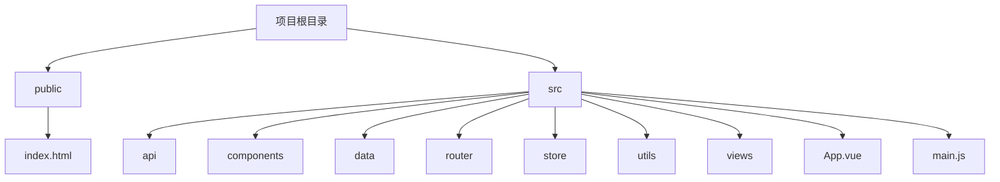
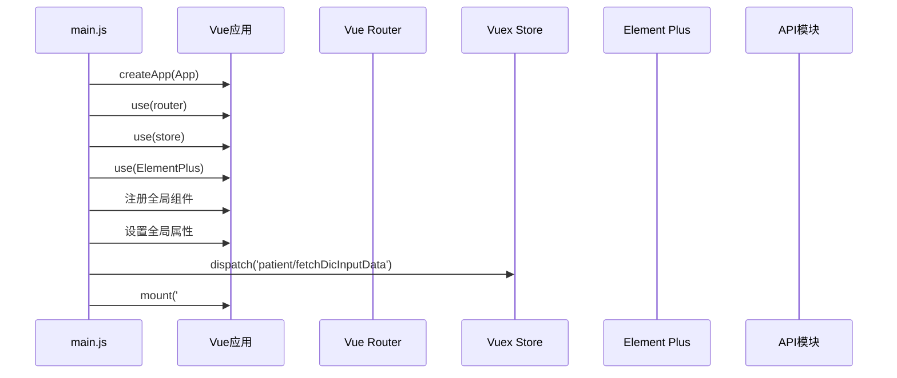
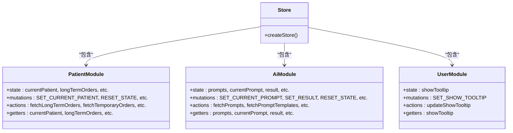
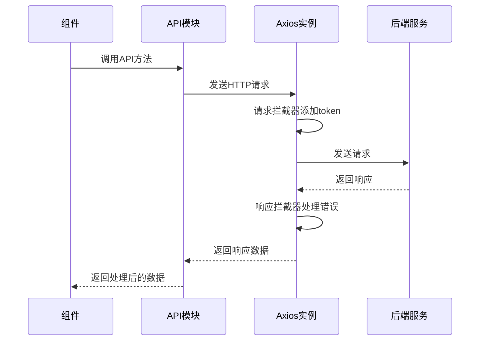
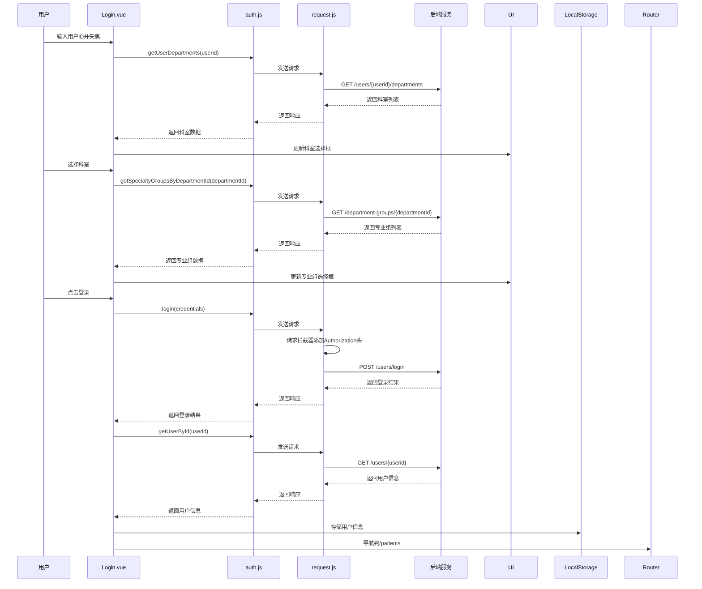

# 快速入门

<cite>
**本文档中引用的文件**   
- [package.json](file://package.json)
- [vue.config.js](file://vue.config.js)
- [main.js](file://src/main.js)
- [router/index.js](file://src/router/index.js)
- [store/index.js](file://src/store/index.js)
- [api/request.js](file://src/api/request.js)
- [api/auth.js](file://src/api/auth.js)
- [store/modules/user.js](file://src/store/modules/user.js)
- [store/modules/patient.js](file://src/store/modules/patient.js)
- [store/modules/ai.js](file://src/store/modules/ai.js)
- [api/ai.js](file://src/api/ai.js)
- [api/patient.js](file://src/api/patient.js)
- [views/Login.vue](file://src/views/Login.vue)
- [views/MainLayout.vue](file://src/views/MainLayout.vue)
- [components/TopMenu.vue](file://src/components/TopMenu.vue)
- [data/tooltips.js](file://src/data/tooltips.js)
</cite>

## 目录
1. [项目结构概览](#项目结构概览)
2. [环境搭建与依赖安装](#环境搭建与依赖安装)
3. [开发服务器配置](#开发服务器配置)
4. [应用初始化流程](#应用初始化流程)
5. [路由配置](#路由配置)
6. [状态管理](#状态管理)
7. [API请求处理](#api请求处理)
8. [用户认证流程](#用户认证流程)
9. [常见问题排查](#常见问题排查)

## 项目结构概览

本项目是一个基于Vue 3的医疗AI助手前端应用，采用模块化设计，结构清晰。主要目录包括：

- **public**: 静态资源目录，包含`index.html`和使用指南文档
- **src**: 源代码目录，包含所有前端代码
  - **api**: API接口定义，按功能模块划分
  - **components**: 可复用的Vue组件，按功能分类
  - **data**: 静态数据文件
  - **router**: 路由配置
  - **store**: Vuex状态管理
  - **utils**: 工具函数
  - **views**: 页面级组件
  - **App.vue**: 根组件
  - **main.js**: 应用入口文件



**Diagram sources**
- [project_structure](file://)

## 环境搭建与依赖安装

### Node.js版本要求

根据`package.json`文件中的依赖项，本项目需要Node.js环境来运行。虽然`package.json`中没有明确指定Node.js版本，但基于Vue CLI 5.0.0的依赖，建议使用Node.js 14.x或更高版本。

### 安装步骤

1. **安装Node.js**
   - 访问[Node.js官网](https://nodejs.org/)下载并安装Node.js
   - 建议安装LTS（长期支持）版本

2. **克隆项目**
   ```bash
   git clone <项目仓库地址>
   cd med_ai_assistant_1.0_bs_vue
   ```

3. **安装依赖**
   ```bash
   npm install
   ```
   此命令会根据`package.json`文件安装所有依赖包，包括：
   - Vue 3.2.13
   - Vue Router 4.5.1
   - Vuex 4.0.2
   - Element Plus 2.10.2
   - Axios 1.10.0
   - 其他开发依赖

**Section sources**
- [package.json](file://package.json)

## 开发服务器配置

### vue.config.js配置

`vue.config.js`文件包含了开发服务器的关键配置：

```javascript
const { defineConfig } = require('@vue/cli-service')
module.exports = defineConfig({
  transpileDependencies: true,
  publicPath: process.env.NODE_ENV === 'production'
    ? '/med_ai_assistant_1.0_bs/'
    : '/',
  devServer: {
    port: 8080,
    proxy: {
      '/api': {
        target: 'http://localhost:8081',
        changeOrigin: true,
        pathRewrite: {
          '^/api': ''
        }
      }
    }
  },
  chainWebpack: config => {
    config.module
      .rule('md')
      .test(/\.md$/)
      .use('raw-loader')
      .loader('raw-loader')
      .end()
  }
})
```

#### 关键配置说明

- **端口配置**: 开发服务器运行在8080端口
- **代理设置**: 将`/api`前缀的请求代理到`http://localhost:8081`，解决了开发环境下的跨域问题
- **路径重写**: `pathRewrite`配置将`/api`前缀移除，使请求能正确到达后端API
- **公共路径**: 生产环境使用`/med_ai_assistant_1.0_bs/`作为基础路径，开发环境使用根路径
- **Markdown处理**: 配置`raw-loader`处理`.md`文件，允许直接导入Markdown内容

### 启动开发服务器

```bash
npm run serve
```

此命令会启动开发服务器，通常在`http://localhost:8080`上运行。

### 构建生产版本

```bash
npm run build
```

此命令会生成优化后的生产版本文件，输出到`dist`目录。

**Section sources**
- [vue.config.js](file://vue.config.js)

## 应用初始化流程

### main.js文件分析

`main.js`是应用的入口文件，负责初始化Vue应用并挂载全局组件和插件。

```javascript
import { createApp } from 'vue'
import App from './App.vue'
import router from './router'
import store from './store'
import ElementPlus from 'element-plus'
import { ElTooltip } from 'element-plus'
import 'element-plus/dist/index.css'
import api from './api'

// 全局ResizeObserver封装
const safeResizeObserver = (callback) => {
  let rafId = null;
  const observer = new ResizeObserver(entries => {
    cancelAnimationFrame(rafId);
    rafId = requestAnimationFrame(() => {
      callback(entries);
    });
  });
  return observer;
};

/**
 * 简单的事件总线实现
 * 用于在Vue 3中替代已移除的$on、$off方法
 */
class EventBus {
  constructor() {
    this.events = {};
  }
  
  on(event, callback) {
    if (!this.events[event]) {
      this.events[event] = [];
    }
    this.events[event].push(callback);
  }
  
  off(event, callback) {
    if (!this.events[event]) return;
    this.events[event] = this.events[event].filter(cb => cb !== callback);
  }
  
  emit(event, data) {
    if (!this.events[event]) return;
    this.events[event].forEach(callback => callback(data));
  }
}

const eventBus = new EventBus();
import * as ElementPlusIconsVue from '@element-plus/icons-vue'

// 彻底隐藏ResizeObserver相关错误
const suppressResizeObserverErrors = () => {
  const originalConsoleError = console.error
  console.error = (...args) => {
    if (args.some(arg => typeof arg === 'string' && 
        arg.includes('ResizeObserver loop'))) {
      return
    }
    originalConsoleError.apply(console, args)
  }

  window.addEventListener('error', e => {
  if (e.message.includes('ResizeObserver')) return;
  console.error(e);
});
}
suppressResizeObserverErrors()

const app = createApp(App)
app.use(router)
app.use(store)
app.use(ElementPlus, {
  components: {
    ElTooltip: {
      openDelay: 3000
    }
  }
})
app.component('ElTooltip', ElTooltip)
app.config.globalProperties.$api = api

// 应用启动时加载字典数据
store.dispatch('patient/fetchDicInputData')

// 添加safeResizeObserver到全局属性
app.config.globalProperties.$safeResizeObserver = safeResizeObserver

// 添加事件总线到全局属性
app.config.globalProperties.eventBus = eventBus;

// 注册所有Element Plus图标
for (const [key, component] of Object.entries(ElementPlusIconsVue)) {
  app.component(key, component)
}

app.mount('#app')
```

### 初始化流程图解



**Diagram sources**
- [main.js](file://src/main.js#L1-L122)

**Section sources**
- [main.js](file://src/main.js#L1-L122)

## 路由配置

### 路由结构

`src/router/index.js`文件定义了应用的路由结构：

```javascript
import { createRouter, createWebHistory } from 'vue-router'
import MainLayout from '@/views/MainLayout.vue'
import UserLogin from '@/views/Login.vue'
import PatientView from '@/views/PatientView.vue'
import AIView from '@/views/AIView.vue'
import ServerMaintenanceView from '@/views/ServerMaintenanceView.vue'
import SurgicalDictionary from '@/components/user/SurgicalDictionary.vue'

const routes = [
  {
    path: '/',
    redirect: '/login'
  },
  {
    path: '/login',
    name: 'Login',
    component: UserLogin
  },
  {
    path: '/main',
    component: MainLayout,
    children: [
      {
        path: '/patients',
        name: '病人列表',
        component: PatientView
      },
      {
        path: '/patient-search',
        name: '病人查询',
        component: () => import('@/views/PatientSearchView.vue')
      },
      // 其他子路由...
    ]
  }
]

const router = createRouter({
  history: createWebHistory(process.env.BASE_URL),
  routes
})

export default router
```

### 路由架构图

```mermaid
graph TD
A[/] --> B[/login]
A --> C[/main]
C --> D[/patients]
C --> E[/patient-search]
C --> F[/medical-records]
C --> G[/examination-reports]
C --> H[/ai-assistant]
C --> I[/data-import]
C --> J[/ai-settings]
C --> K[/user-settings]
C --> L[/help]
C --> M[/test]
C --> N[/server-maintenance]
C --> O[/surgical-dictionary]
```

**Diagram sources**
- [router/index.js](file://src/router/index.js#L1-L93)

**Section sources**
- [router/index.js](file://src/router/index.js#L1-L93)

## 状态管理

### Vuex Store结构

应用使用Vuex进行状态管理，store分为三个模块：

- **patient**: 病人相关状态
- **ai**: AI功能相关状态
- **user**: 用户相关状态

```javascript
import { createStore } from 'vuex'
import patient from './modules/patient'
import ai from './modules/ai'
import user from './modules/user'

export default createStore({
  modules: {
    patient,
    ai,
    user
  },
  actions: {
    resetState({ commit }) {
      commit('patient/RESET_STATE')
      commit('ai/RESET_STATE')
      commit('user/SET_SHOW_TOOLTIP', true)
    }
  }
})
```

### 状态管理模块关系图



**Diagram sources**
- [store/index.js](file://src/store/index.js#L1-L20)
- [store/modules/patient.js](file://src/store/modules/patient.js#L1-L312)
- [store/modules/ai.js](file://src/store/modules/ai.js#L1-L143)
- [store/modules/user.js](file://src/store/modules/user.js#L1-L20)

**Section sources**
- [store/index.js](file://src/store/index.js#L1-L20)
- [store/modules/patient.js](file://src/store/modules/patient.js#L1-L312)
- [store/modules/ai.js](file://src/store/modules/ai.js#L1-L143)
- [store/modules/user.js](file://src/store/modules/user.js#L1-L20)

## API请求处理

### 请求拦截器配置

`src/api/request.js`文件配置了axios实例，包含请求和响应拦截器：

```javascript
import axios from 'axios'
import store from '@/store'

// 创建axios实例
const service = axios.create({
  baseURL: process.env.VUE_APP_API_BASE_URL || 'http://localhost:8081/api',
  timeout: 10000
})

// 请求拦截器
service.interceptors.request.use(
  config => {
    const token = store.state.user.token
    if (token) {
      config.headers['Authorization'] = `Bearer ${token}`
    }
    return config
  },
  error => {
    return Promise.reject(error)
  }
)

// 响应拦截器
service.interceptors.response.use(
  response => {
    return response
  },
  error => {
    if (error.response) {
      switch (error.response.status) {
        case 401:
          // token过期处理
          break
        case 403:
          // 无权限处理
          break
        case 500:
          // 服务器错误处理
          break
        default:
          break
      }
    }
    return Promise.reject(error)
  }
)

export default service
```

### API请求流程



**Diagram sources**
- [api/request.js](file://src/api/request.js#L1-L53)

**Section sources**
- [api/request.js](file://src/api/request.js#L1-L53)

## 用户认证流程

### 认证API接口

`src/api/auth.js`文件定义了用户认证相关的API接口：

```javascript
export const login = (credentials) => {
  return service.post('/users/login', {
    id: credentials.id,
    password: credentials.password
  }).then(response => {
    return { data: response.data }
  }).catch(() => {
    return { data: false }
  })
}

export const logout = () => {
  return service.post('/auth/logout')
}

export const getCurrentUser = () => {
  return service.get('/auth/me')
}

export const refreshToken = (refreshToken) => {
  return service.post('/auth/refresh', { refreshToken })
}

export const updateUserInfo = (userInfo) => {
  return service.put('/auth/user', userInfo)
}
```

### 登录页面实现

`src/views/Login.vue`实现了登录界面，包含用户ID、密码、科室和专业组的选择：

```vue
<template>
  <div class="login-container">
    <div class="login-left">
      
    </div>
    <div class="login-right">
      <h2>医疗AI助手登录</h2>
      <el-form :model="loginForm" label-width="80px">
        <el-form-item label="用户">
          <el-input 
            v-model="loginForm.userid" 
            @blur="handleUserIdBlur"
          ></el-input>
        </el-form-item>
        <el-form-item label="密码">
          <el-input v-model="loginForm.password" type="password"></el-input>
        </el-form-item>
        <el-form-item label="科室">
          <el-select v-model="loginForm.department" placeholder="请选择科室" @change="handleDepartmentChange">
            <el-option
              v-for="dept in departmentsOptions"
              :key="dept.value"
              :label="dept.label"
              :value="dept.value">
            </el-option>
          </el-select>
        </el-form-item>
        <el-form-item label="专业组">
          <el-select v-model="loginForm.specialtyGroup" placeholder="请选择专业组">
            <el-option 
              v-for="group in specialtyGroups"
              :key="group"
              :label="group"
              :value="group">
            </el-option>
          </el-select>
        </el-form-item>
        <el-form-item>
          <el-button type="primary" @click="handleLogin" :loading="loading">登录</el-button>
          <el-button @click="handleCancel">退出</el-button>
        </el-form-item>
      </el-form>
    </div>
  </div>
</template>
```

### 登录流程



**Diagram sources**
- [api/auth.js](file://src/api/auth.js#L1-L84)
- [views/Login.vue](file://src/views/Login.vue#L1-L198)

**Section sources**
- [api/auth.js](file://src/api/auth.js#L1-L84)
- [views/Login.vue](file://src/views/Login.vue#L1-L198)

## 常见问题排查

### 端口冲突

**问题描述**: 开发服务器启动时提示端口8080已被占用。

**解决方案**:
1. 修改`vue.config.js`中的端口配置：
```javascript
devServer: {
  port: 8081, // 修改为其他端口
  // 其他配置...
}
```

2. 或者在启动时指定端口：
```bash
npm run serve -- --port 8081
```

### 依赖安装失败

**问题描述**: 执行`npm install`时出现网络错误或包下载失败。

**解决方案**:
1. 使用国内镜像源：
```bash
npm config set registry https://registry.npmmirror.com
npm install
```

2. 清除npm缓存后重试：
```bash
npm cache clean --force
npm install
```

3. 删除`node_modules`目录和`package-lock.json`文件后重新安装：
```bash
rm -rf node_modules package-lock.json
npm install
```

### API请求404错误

**问题描述**: 前端请求API返回404错误。

**解决方案**:
1. 检查后端服务是否已启动
2. 确认`vue.config.js`中的代理配置是否正确：
```javascript
proxy: {
  '/api': {
    target: 'http://localhost:8081', // 确保端口与后端服务一致
    changeOrigin: true,
    pathRewrite: {
      '^/api': ''
    }
  }
}
```

3. 检查API路径是否正确，注意大小写和拼写

### 跨域问题

**问题描述**: 浏览器控制台出现跨域错误。

**解决方案**:
1. 确保开发服务器的代理配置正确（已在`vue.config.js`中配置）
2. 检查后端服务是否允许前端域名的跨域请求
3. 在生产环境中，确保前后端部署在同一域名下，或后端正确配置CORS

### 组件样式不生效

**问题描述**: Element Plus组件样式未正确应用。

**解决方案**:
1. 确保在`main.js`中正确导入了Element Plus样式：
```javascript
import 'element-plus/dist/index.css'
```

2. 检查是否正确使用了Element Plus组件：
```vue
<template>
  <el-button type="primary">主要按钮</el-button>
</template>
```

3. 确认`package.json`中Element Plus版本是否兼容

**Section sources**
- [vue.config.js](file://vue.config.js)
- [main.js](file://src/main.js)
- [package.json](file://package.json)