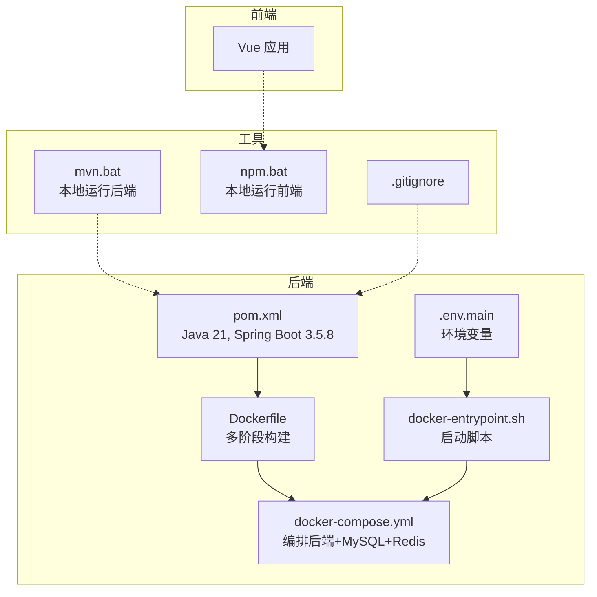
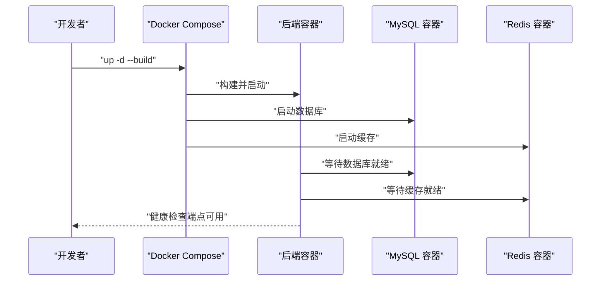
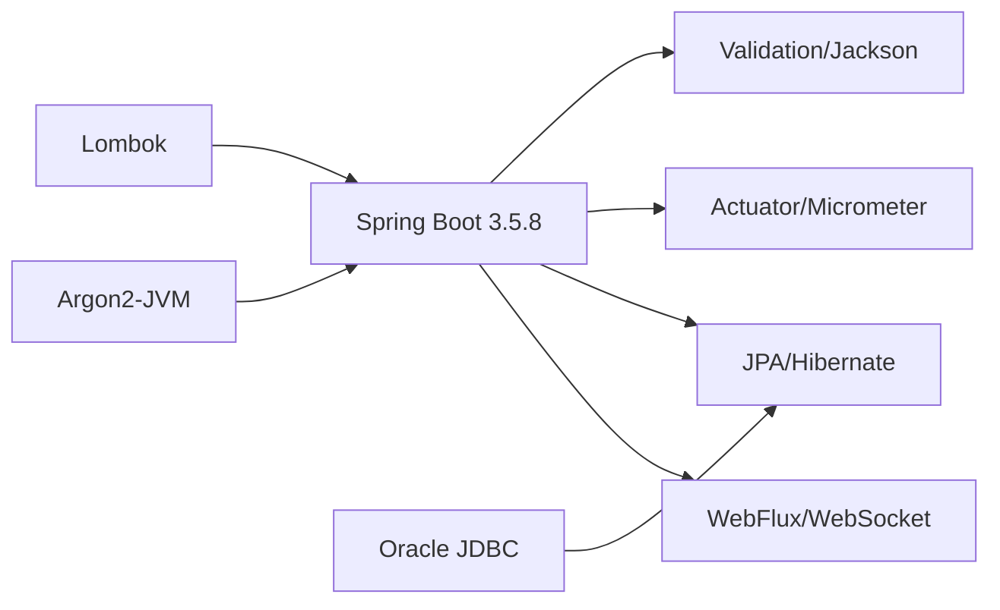

# 快速开始

<cite>
**本文引用的文件**
- [med_ai_assistant_1.0_bs_backend/pom.xml](file://med_ai_assistant_1.0_bs_backend/pom.xml)
- [med_ai_assistant_1.0_bs_backend/Dockerfile](file://med_ai_assistant_1.0_bs_backend/Dockerfile)
- [med_ai_assistant_1.0_bs_backend/docker-compose.yml](file://med_ai_assistant_1.0_bs_backend/docker-compose.yml)
- [med_ai_assistant_1.0_bs_backend/deploy/README.md](file://med_ai_assistant_1.0_bs_backend/deploy/README.md)
- [med_ai_assistant_1.0_bs_backend/deploy/main-linux-oracle/README.md](file://med_ai_assistant_1.0_bs_backend/deploy/main-linux-oracle/README.md)
- [med_ai_assistant_1.0_bs_backend/deploy/main-linux-oracle/docker-entrypoint.sh](file://med_ai_assistant_1.0_bs_backend/deploy/main-linux-oracle/docker-entrypoint.sh)
- [med_ai_assistant_1.0_bs_backend/deploy/main-linux-oracle/.env.main](file://med_ai_assistant_1.0_bs_backend/deploy/main-linux-oracle/.env.main)
- [mvn.bat](file://mvn.bat)
- [.gitignore](file://.gitignore)
- [npm.bat](file://npm.bat)
</cite>

## 目录
1. [简介](#简介)
2. [项目结构](#项目结构)
3. [核心组件](#核心组件)
4. [架构总览](#架构总览)
5. [详细组件分析](#详细组件分析)
6. [依赖关系分析](#依赖关系分析)
7. [性能注意事项](#性能注意事项)
8. [故障排除指南](#故障排除指南)
9. [结论](#结论)
10. [附录](#附录)

## 简介
本指南面向首次接触 MedAiAssistant 1.0 BS 的用户，帮助你在最短时间内完成环境准备、安装部署与基础验证。你将学会：
- 准备所需环境（Java 21、Maven、Docker 等）
- 通过 Docker Compose 启动主服务器与数据库、缓存等依赖
- 执行基本的健康检查与日志查看
- 快速定位常见启动问题并进行故障排除

## 项目结构
仓库采用前后端分离与多环境部署的组织方式：
- 后端（Spring Boot 3.5.8，Java 21）：位于 med_ai_assistant_1.0_bs_backend
- 前端（Vue）：位于 med_ai_assistant_1.0_bs_vue
- 部署与运维文档：位于 med_ai_assistant_1.0_bs_backend/deploy 下
- 工具脚本：根目录提供 mvn.bat、npm.bat 等便捷脚本



图表来源
- [med_ai_assistant_1.0_bs_backend/pom.xml](file://med_ai_assistant_1.0_bs_backend/pom.xml#L29-L31)
- [med_ai_assistant_1.0_bs_backend/Dockerfile](file://med_ai_assistant_1.0_bs_backend/Dockerfile#L1-L71)
- [med_ai_assistant_1.0_bs_backend/docker-compose.yml](file://med_ai_assistant_1.0_bs_backend/docker-compose.yml#L1-L97)
- [med_ai_assistant_1.0_bs_backend/deploy/main-linux-oracle/.env.main](file://med_ai_assistant_1.0_bs_backend/deploy/main-linux-oracle/.env.main#L1-L73)
- [med_ai_assistant_1.0_bs_backend/deploy/main-linux-oracle/docker-entrypoint.sh](file://med_ai_assistant_1.0_bs_backend/deploy/main-linux-oracle/docker-entrypoint.sh#L1-L108)
- [mvn.bat](file://mvn.bat#L1-L5)
- [npm.bat](file://npm.bat#L1-L3)

章节来源
- [med_ai_assistant_1.0_bs_backend/pom.xml](file://med_ai_assistant_1.0_bs_backend/pom.xml#L1-L309)
- [med_ai_assistant_1.0_bs_backend/Dockerfile](file://med_ai_assistant_1.0_bs_backend/Dockerfile#L1-L71)
- [med_ai_assistant_1.0_bs_backend/docker-compose.yml](file://med_ai_assistant_1.0_bs_backend/docker-compose.yml#L1-L97)
- [med_ai_assistant_1.0_bs_backend/deploy/README.md](file://med_ai_assistant_1.0_bs_backend/deploy/README.md#L1-L250)
- [med_ai_assistant_1.0_bs_backend/deploy/main-linux-oracle/README.md](file://med_ai_assistant_1.0_bs_backend/deploy/main-linux-oracle/README.md#L1-L396)
- [mvn.bat](file://mvn.bat#L1-L5)
- [npm.bat](file://npm.bat#L1-L3)

## 核心组件
- 后端服务（主服务器）：基于 Spring Boot 3.5.8，使用 Java 21；提供健康检查端点与 Actuator 监控能力。
- 数据库：MySQL 8.0（容器内），或可配置为远程 Oracle（主服务器通过环境变量控制）。
- 缓存：Redis（可选，容器内部署）。
- 健康检查：后端服务暴露 /api/health；Docker Compose 提供健康检查策略。
- 启动方式：Docker Compose（推荐）、本地 Maven 运行（开发调试）。

章节来源
- [med_ai_assistant_1.0_bs_backend/pom.xml](file://med_ai_assistant_1.0_bs_backend/pom.xml#L29-L31)
- [med_ai_assistant_1.0_bs_backend/Dockerfile](file://med_ai_assistant_1.0_bs_backend/Dockerfile#L59-L71)
- [med_ai_assistant_1.0_bs_backend/docker-compose.yml](file://med_ai_assistant_1.0_bs_backend/docker-compose.yml#L29-L35)
- [med_ai_assistant_1.0_bs_backend/deploy/main-linux-oracle/docker-entrypoint.sh](file://med_ai_assistant_1.0_bs_backend/deploy/main-linux-oracle/docker-entrypoint.sh#L104-L108)

## 架构总览
系统采用“主服务器 + 执行服务器”的分层架构，二者通过 HTTP 推送/回调协作，Redis 作为缓存，MySQL/Oracle 作为持久化存储。

```mermaid
graph TB
subgraph "客户端"
U["浏览器/移动端"]
end
subgraph "主服务器"
M["Spring Boot 应用<br/>端口 8081"]
R["Redis 缓存"]
end
subgraph "执行服务器"
E["执行服务<br/>端口 8082"]
end
subgraph "数据层"
O["Oracle 数据库"]
Y["MySQL 数据库"]
end
U --> |"HTTP"| M
M --> |"HTTP 推送/回调"| E
M <- --> R
M --> O
M --> Y
```

图表来源
- [med_ai_assistant_1.0_bs_backend/deploy/README.md](file://med_ai_assistant_1.0_bs_backend/deploy/README.md#L42-L62)
- [med_ai_assistant_1.0_bs_backend/docker-compose.yml](file://med_ai_assistant_1.0_bs_backend/docker-compose.yml#L5-L28)
- [med_ai_assistant_1.0_bs_backend/deploy/main-linux-oracle/.env.main](file://med_ai_assistant_1.0_bs_backend/deploy/main-linux-oracle/.env.main#L1-L73)

## 详细组件分析

### 环境要求与安装
- Java 21：后端使用 Java 21，确保系统安装匹配版本。
- Maven：用于本地运行与打包（Windows 提供 mvn.bat）。
- Docker 与 Docker Compose：推荐使用 Docker Compose 一键拉起后端、MySQL、Redis。
- 前端：Vue 应用可通过 npm.bat 启动本地服务。

章节来源
- [med_ai_assistant_1.0_bs_backend/pom.xml](file://med_ai_assistant_1.0_bs_backend/pom.xml#L29-L31)
- [med_ai_assistant_1.0_bs_backend/Dockerfile](file://med_ai_assistant_1.0_bs_backend/Dockerfile#L1-L71)
- [med_ai_assistant_1.0_bs_backend/docker-compose.yml](file://med_ai_assistant_1.0_bs_backend/docker-compose.yml#L1-L97)
- [mvn.bat](file://mvn.bat#L1-L5)
- [npm.bat](file://npm.bat#L1-L3)

### 启动主服务器（Docker Compose）
- 进入部署目录并编辑环境变量文件（主服务器示例使用 .env.main）。
- 使用 Compose 构建并启动所有服务（含 MySQL、Redis、后端）。
- 查看容器状态与日志，确认服务正常运行。



图表来源
- [med_ai_assistant_1.0_bs_backend/docker-compose.yml](file://med_ai_assistant_1.0_bs_backend/docker-compose.yml#L5-L28)
- [med_ai_assistant_1.0_bs_backend/deploy/main-linux-oracle/docker-entrypoint.sh](file://med_ai_assistant_1.0_bs_backend/deploy/main-linux-oracle/docker-entrypoint.sh#L59-L93)

章节来源
- [med_ai_assistant_1.0_bs_backend/deploy/README.md](file://med_ai_assistant_1.0_bs_backend/deploy/README.md#L101-L134)
- [med_ai_assistant_1.0_bs_backend/deploy/main-linux-oracle/README.md](file://med_ai_assistant_1.0_bs_backend/deploy/main-linux-oracle/README.md#L124-L165)

### 健康检查与基础验证
- 主服务器健康检查端点：curl http://localhost:8081/api/health
- 执行服务器健康检查端点：curl http://localhost:8082/api/execute/health
- 查看容器状态与日志，确认服务已就绪。

章节来源
- [med_ai_assistant_1.0_bs_backend/Dockerfile](file://med_ai_assistant_1.0_bs_backend/Dockerfile#L68-L71)
- [med_ai_assistant_1.0_bs_backend/docker-compose.yml](file://med_ai_assistant_1.0_bs_backend/docker-compose.yml#L29-L35)
- [med_ai_assistant_1.0_bs_backend/deploy/README.md](file://med_ai_assistant_1.0_bs_backend/deploy/README.md#L135-L156)

### 本地开发运行（Maven）
- Windows 用户可双击 mvn.bat，以 UTF-8 编码启动后端服务。
- 适用于快速验证功能与调试，不依赖 Docker。

章节来源
- [mvn.bat](file://mvn.bat#L1-L5)
- [med_ai_assistant_1.0_bs_backend/pom.xml](file://med_ai_assistant_1.0_bs_backend/pom.xml#L29-L31)

### 前端本地运行
- 进入前端目录，双击 npm.bat 启动 Vue 开发服务器。
- 便于联调前后端接口。

章节来源
- [npm.bat](file://npm.bat#L1-L3)

## 依赖关系分析
后端通过 Maven 管理依赖，核心包括：
- Spring Boot Starter WebFlux、WebSocket、Actuator
- Oracle JDBC 驱动与安全依赖
- Micrometer + Prometheus 用于指标采集
- Argon2-JVM 用于密码学处理
- Lombok、Bean Validation、Jackson JSR310 时间模块等



图表来源
- [med_ai_assistant_1.0_bs_backend/pom.xml](file://med_ai_assistant_1.0_bs_backend/pom.xml#L53-L214)

章节来源
- [med_ai_assistant_1.0_bs_backend/pom.xml](file://med_ai_assistant_1.0_bs_backend/pom.xml#L1-L309)

## 性能注意事项
- JVM 参数已在 Dockerfile 中预设，可根据实际资源调整（内存上限、GC 策略）。
- 建议开启 Prometheus 指标导出，结合 Grafana 进行可视化监控。
- 生产环境建议使用 HTTPS、限制网络访问、定期备份。

[本节为通用建议，不直接分析具体文件]

## 故障排除指南
- 容器无法启动
  - 检查端口占用（8081、3306、6379）
  - 查看容器日志与应用日志
  - 检查磁盘空间与权限
- 健康检查失败
  - 使用 curl 验证 /api/health
  - 检查防火墙与 SELinux（CentOS）
- 连接执行服务器失败
  - 使用 ping/telnet 检查网络连通性
  - 核对 .env.main 中的执行服务器地址与端口
- 内存不足
  - 调整 JAVA_OPTS，降低堆上限
  - 查看容器资源使用情况

章节来源
- [med_ai_assistant_1.0_bs_backend/deploy/main-linux-oracle/README.md](file://med_ai_assistant_1.0_bs_backend/deploy/main-linux-oracle/README.md#L282-L346)
- [med_ai_assistant_1.0_bs_backend/deploy/README.md](file://med_ai_assistant_1.0_bs_backend/deploy/README.md#L209-L227)

## 结论
按照本指南，你可以快速完成环境准备与系统启动，并通过健康检查与日志验证基本功能。建议在生产部署前完善安全加固与监控体系，并根据实际资源调整 JVM 与线程池参数。

[本节为总结性内容，不直接分析具体文件]

## 附录

### 快速操作清单
- 确认 Java 21、Docker、Docker Compose 已安装
- 进入部署目录，编辑 .env.main 并保存
- 执行部署脚本或 docker-compose up -d
- 健康检查：curl http://localhost:8081/api/health
- 查看日志：docker logs -f med-ai-backend

章节来源
- [med_ai_assistant_1.0_bs_backend/deploy/README.md](file://med_ai_assistant_1.0_bs_backend/deploy/README.md#L63-L80)
- [med_ai_assistant_1.0_bs_backend/deploy/main-linux-oracle/README.md](file://med_ai_assistant_1.0_bs_backend/deploy/main-linux-oracle/README.md#L166-L210)