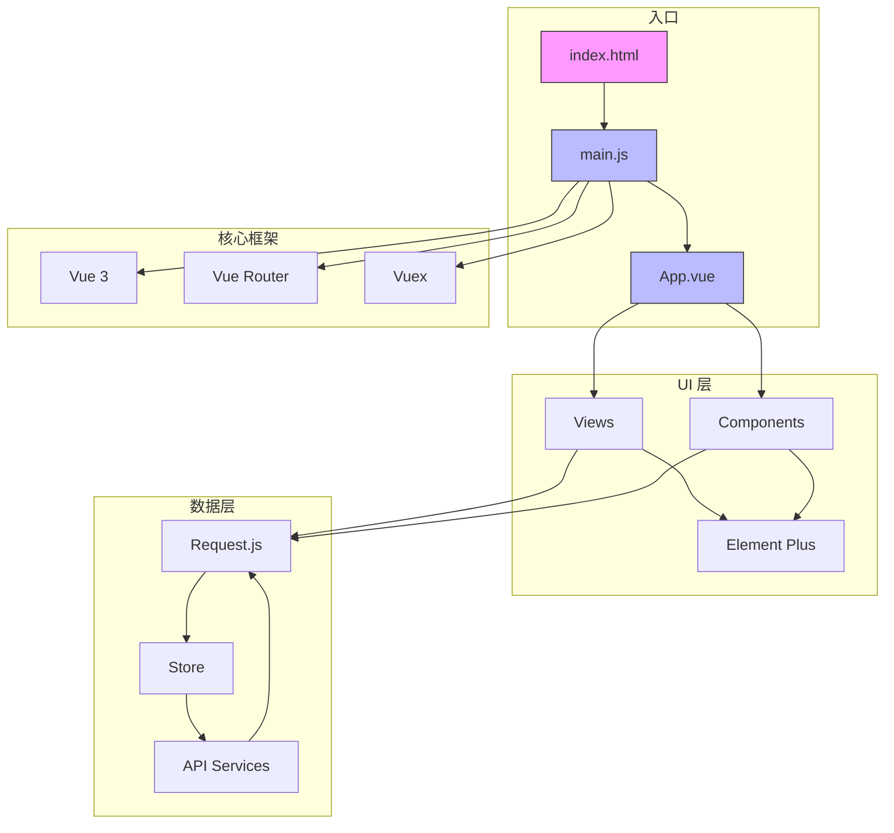
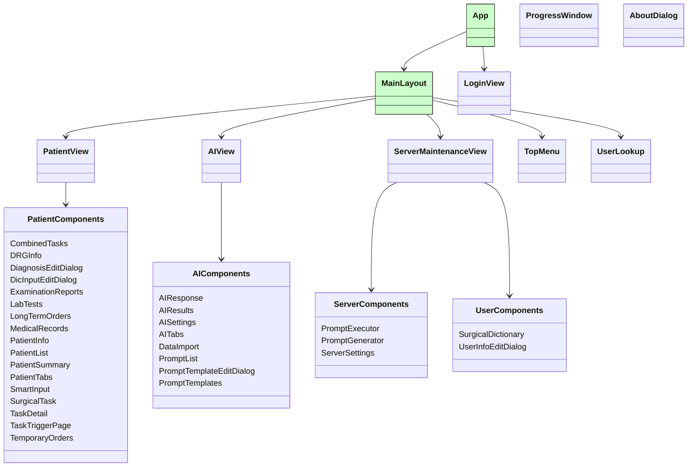
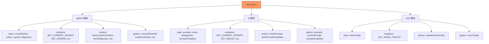
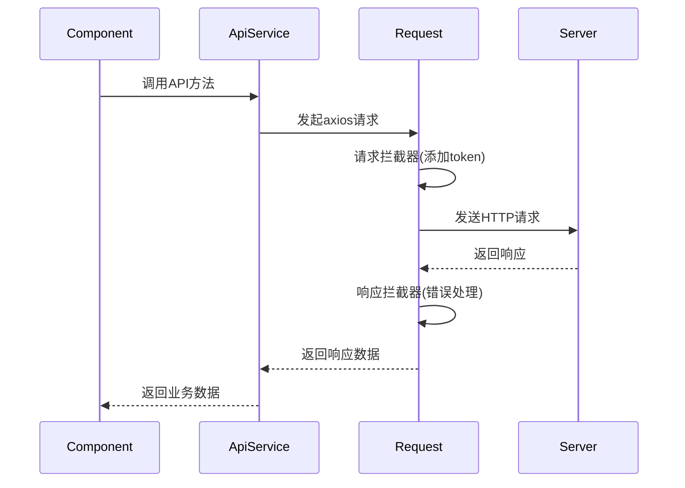

# 技术栈与依赖

<cite>
**本文档引用文件**  
- [package.json](file://package.json)
- [src/main.js](file://src/main.js)
- [src/store/index.js](file://src/store/index.js)
- [src/store/modules/patient.js](file://src/store/modules/patient.js)
- [src/store/modules/ai.js](file://src/store/modules/ai.js)
- [src/store/modules/user.js](file://src/store/modules/user.js)
- [src/router/index.js](file://src/router/index.js)
- [src/api/request.js](file://src/api/request.js)
- [src/api/ai.js](file://src/api/ai.js)
- [src/api/patient.js](file://src/api/patient.js)
</cite>

## 目录
1. [项目结构概览](#项目结构概览)
2. [核心框架与库](#核心框架与库)
3. [Vue.js 3 组件化开发模式](#vuejs-3-组件化开发模式)
4. [Vuex 全局状态管理设计](#vuex-全局状态管理设计)
5. [Vue Router 单页应用路由控制机制](#vue-router-单页应用路由控制机制)
6. [Element Plus UI 组件库使用规范](#element-plus-ui-组件库使用规范)
7. [Markdown 渲染与编辑实现](#markdown-渲染与编辑实现)
8. [Axios HTTP 请求封装机制](#axios-http-请求封装机制)
9. [依赖版本兼容性与职责划分](#依赖版本兼容性与职责划分)

## 项目结构概览

本项目采用基于 Vue CLI 的标准前端项目结构，遵循功能模块化组织原则。主要目录包括：

- `public/`：静态资源目录，包含入口 HTML 和文档
- `src/`：源码目录，包含组件、视图、API 接口、状态管理等
- `src/components/`：可复用 UI 组件，按功能分组（AI、患者、服务器、用户等）
- `src/views/`：页面级视图组件
- `src/api/`：API 接口封装
- `src/store/`：Vuex 状态管理模块
- `src/router/`：路由配置
- `src/utils/`：工具函数

该结构清晰分离关注点，便于团队协作和维护。



**图示来源**
- [src/main.js](file://src/main.js)
- [src/App.vue](file://src/App.vue)
- [src/router/index.js](file://src/router/index.js)
- [src/store/index.js](file://src/store/index.js)

## 核心框架与库

项目依赖的核心技术栈如下：

| 库名 | 版本 | 用途 |
|------|------|------|
| vue | ^3.2.13 | 核心框架，提供响应式系统和组件化能力 |
| vue-router | ^4.5.1 | 路由管理，实现单页应用导航 |
| vuex | ^4.0.2 | 全局状态管理 |
| element-plus | ^2.10.2 | UI 组件库 |
| @element-plus/icons-vue | ^2.3.1 | Element Plus 图标组件 |
| axios | ^1.10.0 | HTTP 客户端 |
| marked | ^16.1.1 | Markdown 渲染引擎 |
| md-editor-v3 | ^5.7.1 | Markdown 编辑器组件 |
| crypto-js | ^4.2.0 | 加密工具库 |
| dompurify | ^3.2.6 | DOM 净化，防止 XSS 攻击 |

这些依赖通过 `package.json` 精确管理，确保开发与生产环境一致性。

**图示来源**
- [package.json](file://package.json)

## Vue.js 3 组件化开发模式

Vue 3 提供了 Composition API 和更好的 TypeScript 支持，本项目充分利用其组件化特性。

### 入口初始化

在 `main.js` 中，通过 `createApp` 创建应用实例，并注册全局插件和属性：

```javascript
import { createApp } from 'vue'
import App from './App.vue'
import router from './router'
import store from './store'
import ElementPlus from 'element-plus'

const app = createApp(App)
app.use(router)
app.use(store)
app.use(ElementPlus)
```

### 全局属性注入

项目通过 `app.config.globalProperties` 注入全局可用对象：

- `$api`：API 接口集合
- `$safeResizeObserver`：封装的 ResizeObserver，避免循环错误
- `eventBus`：自定义事件总线，替代 Vue 2 的 `$on/$emit`



**图示来源**
- [src/main.js](file://src/main.js)
- [src/App.vue](file://src/App.vue)
- [src/views/*.vue](file://src/views/)
- [src/components/](file://src/components/)

## Vuex 全局状态管理设计

项目采用模块化 Vuex 架构，将状态按功能拆分为多个命名空间模块。

### 模块结构



**图示来源**
- [src/store/index.js](file://src/store/index.js)
- [src/store/modules/patient.js](file://src/store/modules/patient.js)
- [src/store/modules/ai.js](file://src/store/modules/ai.js)
- [src/store/modules/user.js](file://src/store/modules/user.js)

### 患者模块 (patient)

负责管理患者相关数据，包括：

- **状态 (state)**：当前患者、医嘱、检查报告、诊断等
- **突变 (mutations)**：同步更新状态
- **动作 (actions)**：异步获取数据，调用 API
- **获取器 (getters)**：计算属性，如 `currentPatientId`

当患者切换时，自动重置 AI 状态：

```javascript
SET_CURRENT_PATIENT(state, patient) {
  state.currentPatient = patient
  this.commit('ai/RESET') // 重置AI状态
}
```

### AI 模块 (ai)

管理 AI 功能相关状态：

- **提示词管理**：当前提示、结果、响应
- **诊断管理**：AI 诊断、当前诊断
- **模板管理**：从后端加载的提示模板树形结构

提供 `RESET_STATE` 和 `RESET` 动作，支持状态重置。

### 用户模块 (user)

简单管理用户偏好，如是否显示工具提示。

### 全局重置机制

在根 store 中定义 `resetState` 动作，协调各模块重置：

```javascript
actions: {
  resetState({ commit }) {
    commit('patient/RESET_STATE')
    commit('ai/RESET_STATE')
    commit('user/SET_SHOW_TOOLTIP', true)
  }
}
```

**章节来源**
- [src/store/index.js](file://src/store/index.js#L1-L20)
- [src/store/modules/patient.js](file://src/store/modules/patient.js#L1-L312)
- [src/store/modules/ai.js](file://src/store/modules/ai.js#L1-L143)
- [src/store/modules/user.js](file://src/store/modules/user.js#L1-L20)

## Vue Router 单页应用路由控制机制

项目使用 Vue Router 4 实现前端路由控制。

### 路由配置

路由采用嵌套路由结构，以 `/main` 为布局容器：

```javascript
const routes = [
  { path: '/', redirect: '/login' },
  { path: '/login', component: UserLogin },
  {
    path: '/main',
    component: MainLayout,
    children: [
      { path: '/patients', name: '病人列表', component: PatientView },
      { path: '/patient-search', name: '病人查询', component: () => import('@/views/PatientSearchView.vue') },
      // ... 其他子路由
    ]
  }
]
```

### 路由模式

使用 `createWebHistory` 模式，URL 无 `#` 符号，更美观。

### 动态导入

部分路由组件使用动态导入（`() => import()`），实现代码分割和懒加载，优化首屏性能。

```mermaid
graph TD
A[/] --> B[/login]
A --> C[/main]
C --> D[/patients]
C --> E[/patient-search]
C --> F[/medical-records]
C --> G[/examination-reports]
C --> H[/ai-assistant]
C --> I[/data-import]
C --> J[/ai-settings]
C --> K[/user-settings]
C --> L[/help]
C --> M[/test]
C --> N[/server-maintenance]
C --> O[/surgical-dictionary]
style A fill:#f9f,stroke:#333
style B fill:#cfc,stroke:#333
style C fill:#cfc,stroke:#333
```

**图示来源**
- [src/router/index.js](file://src/router/index.js#L1-L93)

**章节来源**
- [src/router/index.js](file://src/router/index.js#L1-L93)

## Element Plus UI 组件库使用规范

项目采用 Element Plus 作为 UI 组件库，版本为 ^2.10.2。

### 全局注册

在 `main.js` 中全局注册 Element Plus 及其图标：

```javascript
import ElementPlus from 'element-plus'
import * as ElementPlusIconsVue from '@element-plus/icons-vue'

app.use(ElementPlus)
// 注册所有图标
for (const [key, component] of Object.entries(ElementPlusIconsVue)) {
  app.component(key, component)
}
```

### 按需配置

对特定组件进行全局配置，如设置 `ElTooltip` 的延迟：

```javascript
app.use(ElementPlus, {
  components: {
    ElTooltip: {
      openDelay: 3000
    }
  }
})
```

### 自定义组件

项目封装了多个基于 Element Plus 的复合组件，如：

- `TopMenu.vue`：顶部菜单栏
- `PatientTabs.vue`：患者信息标签页
- `AITabs.vue`：AI 功能标签页

### 图标使用

通过动态注册所有图标组件，可在模板中直接使用 `<el-icon>` 标签。

**章节来源**
- [src/main.js](file://src/main.js#L1-L122)
- [package.json](file://package.json)

## Markdown 渲染与编辑实现

项目使用 `marked` 和 `md-editor-v3` 实现 Markdown 功能。

### Markdown 渲染 (marked)

`marked` 是一个轻量级 Markdown 解析器，用于将 Markdown 文本转换为 HTML。

在 `AIResponse.vue` 等组件中，将 AI 返回的 Markdown 内容渲染为富文本：

```javascript
import marked from 'marked'
const html = marked.parse(markdownText)
```

### Markdown 编辑器 (md-editor-v3)

`md-editor-v3` 是一个功能丰富的 Vue 3 Markdown 编辑器组件，用于：

- 编辑提示模板
- 输入和预览 Markdown 内容

支持实时预览、语法高亮、工具栏等功能。

### 安全处理

为防止 XSS 攻击，渲染 HTML 时应使用 `DOMPurify` 净化：

```javascript
import DOMPurify from 'dompurify'
const cleanHtml = DOMPurify.sanitize(dirtyHtml)
```

**章节来源**
- [package.json](file://package.json)
- [src/components/ai/PromptTemplateEditDialog.vue](file://src/components/ai/PromptTemplateEditDialog.vue)
- [src/components/ai/AIResponse.vue](file://src/components/ai/AIResponse.vue)

## Axios HTTP 请求封装机制

项目通过 `request.js` 封装 axios，实现统一的请求处理。

### 基础配置

```javascript
const service = axios.create({
  baseURL: process.env.VUE_APP_API_BASE_URL || 'http://localhost:8081/api',
  timeout: 10000
})
```

### 请求拦截器

在请求头中自动添加认证令牌：

```javascript
service.interceptors.request.use(config => {
  const token = store.state.user.token
  if (token) {
    config.headers['Authorization'] = `Bearer ${token}`
  }
  return config
})
```

### 响应拦截器

统一处理响应和错误：

```javascript
service.interceptors.response.use(
  response => response,
  error => {
    if (error.response) {
      switch (error.response.status) {
        case 401: /* token过期 */ break
        case 403: /* 无权限 */ break
        case 500: /* 服务器错误 */ break
      }
    }
    return Promise.reject(error)
  }
)
```

### API 接口组织

在 `api/` 目录下按功能拆分接口文件：

- `ai.js`：AI 相关接口
- `patient.js`：患者数据接口
- `auth.js`：认证接口

各文件导入 `request.js` 实例并导出具体方法。



**图示来源**
- [src/api/request.js](file://src/api/request.js#L1-L53)
- [src/api/ai.js](file://src/api/ai.js)
- [src/api/patient.js](file://src/api/patient.js)

**章节来源**
- [src/api/request.js](file://src/api/request.js#L1-L53)

## 依赖版本兼容性与职责划分

### 版本兼容性

所有依赖版本均通过 Vue CLI 5 锁定，确保兼容性：

- Vue 3 (^3.2.13) 与 Vue Router 4 (^4.5.1)、Vuex 4 (^4.0.2) 完全兼容
- Element Plus (^2.10.2) 支持 Vue 3
- axios (^1.10.0) 为稳定版本

### 职责划分

| 模块 | 职责 |
|------|------|
| Vue 3 | 核心框架，提供响应式、组件化、生命周期等 |
| Vue Router | 路由管理，URL 与视图映射 |
| Vuex | 全局状态管理，跨组件状态共享 |
| Element Plus | 提供 UI 组件，保证界面一致性 |
| axios | 发起 HTTP 请求，与后端交互 |
| marked | Markdown 文本渲染 |
| md-editor-v3 | Markdown 编辑功能 |
| crypto-js | 数据加密 |
| dompurify | 安全防护 |

### 技术选型背景

- **Vue 3**：现代化、高性能、良好的 TypeScript 支持
- **Vuex**：成熟的 Vue 状态管理方案，适合中大型应用
- **Vue Router**：官方路由库，与 Vue 深度集成
- **Element Plus**：功能丰富、文档完善的 UI 库，适合企业级应用
- **axios**：功能强大、拦截器机制完善的 HTTP 客户端
- **marked**：轻量、快速的 Markdown 解析器
- **md-editor-v3**：专为 Vue 3 设计的 Markdown 编辑器

此技术栈为新成员提供了清晰的开发范式和可维护的代码结构。

**章节来源**
- [package.json](file://package.json)
- [src/main.js](file://src/main.js)
- [src/store/index.js](file://src/store/index.js)
- [src/router/index.js](file://src/router/index.js)
- [src/api/request.js](file://src/api/request.js)