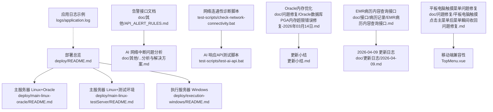
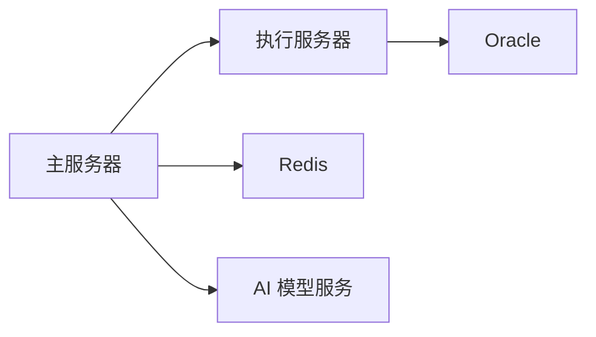
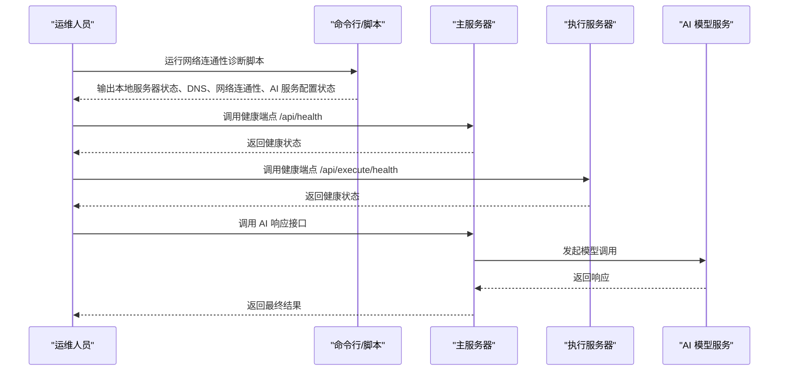

# 故障排除

<cite>
**本文引用的文件**
- [部署总览](file://med_ai_assistant_1.0_bs_backend/deploy/README.md)
- [主服务器 Linux+Oracle 部署指南](file://med_ai_assistant_1.0_bs_backend/deploy/main-linux-oracle/README.md)
- [主服务器 Linux+测试环境部署指南](file://med_ai_assistant_1.0_bs_backend/deploy/main-linux-testServer/README.md)
- [执行服务器 Windows 部署指南](file://med_ai_assistant_1.0_bs_backend/deploy/execution-windows/README.md)
- [执行服务器 Linux 部署指南](file://med_ai_assistant_1.0_bs_backend/deploy/execution-linux/README.md)
- [AI 响应接口网络中断后连接失败问题分析与解决方案](file://med_ai_assistant_1.0_bs_backend/doc/其他/AI响应接口网络中断后连接失败问题分析与解决方案.md)
- [AI 响应接口网络中断后连接失败问题解决方案实施总结](file://med_ai_assistant_1.0_bs_backend/doc/其他/AI响应接口网络中断后连接失败问题解决方案实施总结.md)
- [告警规则相关接口文档](file://med_ai_assistant_1.0_bs_backend/doc/其他/API_ALERT_RULES.md)
- [Oracle数据库PGA内存超限错误修复-2026年03月14日](file://med_ai_assistant_1.0_bs_backend/doc/问题修复/Oracle数据库PGA内存超限错误修复-2026年03月14日.md)
- [平板电脑触摸点击主菜单后菜单瞬间收回问题修复](file://med_ai_assistant_1.0_bs_backend/doc/问题修复/平板电脑触摸点击主菜单后菜单瞬间收回问题修复.md)
- [EMR病历内容查询接口](file://med_ai_assistant_1.0_bs_backend/doc/接口/病历记录/EMR病历内容查询接口.md)
- [2026-04-09 更新日志](file://med_ai_assistant_1.0_bs_backend/doc/更新日志/2026-04-09.md)
- [2026-04-22 更新日志](file://med_ai_assistant_1.0_bs_backend/doc/更新日志/2026-04-22.md)
- [TopMenu.vue](file://med_ai_assistant_1.0_bs_vue/src/components/TopMenu.vue)
- [user.js](file://med_ai_assistant_1.0_bs_vue/src/store/modules/user.js)
- [EmrRecordService.java](file://med_ai_assistant_1.0_bs_backend/src/main/java/com/example/medaiassistant/service/EmrRecordService.java)
- [MedicalRecordController.java](file://med_ai_assistant_1.0_bs_backend/src/main/java/com/example/medaiassistant/controller/MedicalRecordController.java)
- [EmrRecordListDTO.java](file://med_ai_assistant_1.0_bs_backend/src/main/java/com/example/medaiassistant/dto/EmrRecordListDTO.java)
- [EmrRecordContentDTO.java](file://med_ai_assistant_1.0_bs_backend/src/main/java/com/example/medaiassistant/dto/EmrRecordContentDTO.java)
- [MedicalRecords.vue](file://med_ai_assistant_1.0_bs_vue/src/components/patient/MedicalRecords.vue)
- [AI 服务网络连接诊断脚本](file://med_ai_assistant_1.0_bs_backend/test-scripts/check-network-connectivity.bat)
- [AI 响应API测试脚本](file://med_ai_assistant_1.0_bs_backend/test-scripts/test-ai-api.bat)
- [应用日志文件（示例）](file://med_ai_assistant_1.0_bs_backend/logs/application.log)
- [更新小结](file://更新小结.md)
</cite>

## 更新摘要
**变更内容**
- 新增平板电脑触摸点击主菜单后菜单瞬间收回问题的故障排除指南
- 更新移动端兼容性章节，包含触摸设备检测和菜单触发方式切换
- 增加小屏界面适配方案的移动端支持说明
- 完善移动端故障排除的诊断流程和解决方案

## 目录
1. [简介](#简介)
2. [项目结构](#项目结构)
3. [核心组件](#核心组件)
4. [架构总览](#架构总览)
5. [详细组件分析](#详细组件分析)
6. [依赖关系分析](#依赖关系分析)
7. [性能考虑](#性能考虑)
8. [故障排除指南](#故障排除指南)
9. [结论](#结论)
10. [附录](#附录)

## 简介
本指南面向运维与技术支持人员，围绕 MedAiAssistant 1.0 BS 的主服务器与执行服务器，系统化梳理启动失败、数据库连接问题、AI 模型调用异常、性能瓶颈等常见问题的诊断方法与解决方案；提供标准化的调试流程、日志分析技巧、性能定位方法；并给出紧急处置预案、系统恢复流程与数据备份策略，帮助快速定位与解决问题。

**更新** 新增平板电脑触摸点击主菜单后菜单瞬间收回问题的完整故障排除指南，涵盖移动端兼容性问题的根因分析、解决方案实施和验证方法。**新增Oracle数据库内存优化章节**，收录PGA内存超限问题的完整诊断和解决流程，为类似问题提供参考解决方案。**新增EMR记录调试增强章节**，反映新增的错误日志调试能力和EMR记录选择错误的调试信息，包括记录ID、患者标识符、文档类型和网络错误详情的捕获能力。

## 项目结构
- 部署与运维相关文档集中在 deploy 目录，按平台与角色分层组织，便于快速定位部署与故障排查路径。
- doc/其他 目录包含告警接口、AI 网络中断问题分析与总结等专题文档，有助于快速理解系统能力边界与历史问题。
- doc/问题修复 目录包含Oracle数据库PGA内存超限、平板电脑触摸点击菜单收回等具体问题的修复报告，为故障排查提供权威参考。
- doc/接口 目录包含EMR病历内容查询等接口文档，为问题定位提供接口规范参考。
- test-scripts 提供网络连通性与 AI API 的自动化测试脚本，便于一线快速验证。
- logs 目录包含应用日志文件，是定位问题的重要依据。



**图示来源**
- [部署总览:1-250](file://med_ai_assistant_1.0_bs_backend/deploy/README.md#L1-L250)
- [主服务器 Linux+Oracle 部署指南:1-396](file://med_ai_assistant_1.0_bs_backend/deploy/main-linux-oracle/README.md#L1-L396)
- [主服务器 Linux+测试环境部署指南:1-396](file://med_ai_assistant_1.0_bs_backend/deploy/main-linux-testServer/README.md#L1-L396)
- [执行服务器 Windows 部署指南:1-469](file://med_ai_assistant_1.0_bs_backend/deploy/execution-windows/README.md#L1-L469)
- [执行服务器 Linux 部署指南:1-138](file://med_ai_assistant_1.0_bs_backend/deploy/execution-linux/README.md#L1-L138)
- [告警规则相关接口文档:1-59](file://med_ai_assistant_1.0_bs_backend/doc/其他/API_ALERT_RULES.md#L1-L59)
- [AI 服务网络连接诊断脚本:1-67](file://med_ai_assistant_1.0_bs_backend/test-scripts/check-network-connectivity.bat#L1-L67)
- [AI 响应API测试脚本:1-22](file://med_ai_assistant_1.0_bs_backend/test-scripts/test-ai-api.bat#L1-L22)
- [应用日志文件（示例）:1-200](file://med_ai_assistant_1.0_bs_backend/logs/application.log#L1-L200)
- [Oracle数据库PGA内存超限错误修复-2026年03月14日:1-173](file://med_ai_assistant_1.0_bs_backend/doc/问题修复/Oracle数据库PGA内存超限错误修复-2026年03月14日.md#L1-L173)
- [EMR病历内容查询接口:1-132](file://med_ai_assistant_1.0_bs_backend/doc/接口/病历记录/EMR病历内容查询接口.md#L1-L132)
- [2026-04-09 更新日志:76-130](file://med_ai_assistant_1.0_bs_backend/doc/更新日志/2026-04-09.md#L76-L130)
- [2026-04-22 更新日志:14-27](file://med_ai_assistant_1.0_bs_backend/doc/更新日志/2026-04-22.md#L14-L27)
- [更新小结:1-372](file://更新小结.md#L1-L372)

**章节来源**
- [部署总览:1-250](file://med_ai_assistant_1.0_bs_backend/deploy/README.md#L1-L250)

## 核心组件
- 主服务器（Main Server）
  - 角色：处理用户请求、API 网关、任务调度
  - 端口：8081
  - 依赖：Redis 缓存、执行服务器（HTTP 通信）
- 执行服务器（Execution Server）
  - 角色：执行 AI 模型调用、数据处理等耗时任务
  - 端口：8082
  - 依赖：Oracle 数据库（远程连接）、Redis 缓存
- 健康检查端点
  - 主服务器：/api/health
  - 执行服务器：/api/execute/health 与 /api/execute/service-status

**章节来源**
- [部署总览:42-62](file://med_ai_assistant_1.0_bs_backend/deploy/README.md#L42-L62)
- [部署总览:135-155](file://med_ai_assistant_1.0_bs_backend/deploy/README.md#L135-L155)

## 架构总览
系统采用"主服务器 + 执行服务器"的双节点架构，通过 HTTP API 进行推送与回调模式通信；主服务器负责接入与调度，执行服务器负责 AI 与数据库密集型任务。

```mermaid
graph TB
subgraph "前端/客户端"
U["用户/调用方"]
end
subgraph "主服务器"
MS["主服务器<br/>Port: 8081"]
R["Redis 缓存"]
end
subgraph "执行服务器"
ES["执行服务器<br/>Port: 8082"]
O["Oracle 数据库"]
end
U --> |"HTTP API"| MS
MS --> |"HTTP API 推送/回调"| ES
MS < --> |"缓存/状态"| R
ES --> |"数据库访问"| O
```

**图示来源**
- [部署总览:42-62](file://med_ai_assistant_1.0_bs_backend/deploy/README.md#L42-L62)

## 详细组件分析

### 主服务器（Linux + Oracle）
- 部署要点
  - Docker 与 Docker Compose 版本要求
  - 环境变量（Redis 密码、执行服务器地址、AI 模型密钥、JVM 参数等）
  - 应用配置（日志级别等）
- 健康检查与日志
  - 健康端点：/api/health
  - 日志位置：容器日志与应用日志文件
- 常见问题与排查
  - 容器无法启动：端口占用、容器日志、磁盘空间
  - 健康检查失败：服务状态、防火墙、SELinux
  - 连接执行服务器失败：网络连通性、环境变量配置
  - 内存不足：调整 JVM 参数并重启

**章节来源**
- [主服务器 Linux+Oracle 部署指南:28-63](file://med_ai_assistant_1.0_bs_backend/deploy/main-linux-oracle/README.md#L28-L63)
- [主服务器 Linux+Oracle 部署指南:166-210](file://med_ai_assistant_1.0_bs_backend/deploy/main-linux-oracle/README.md#L166-L210)
- [主服务器 Linux+Oracle 部署指南:282-346](file://med_ai_assistant_1.0_bs_backend/deploy/main-linux-oracle/README.md#L282-L346)

### 执行服务器（Windows）
- 部署要点
  - Windows Server 环境、Docker、端口 8082
  - 执行轮询服务状态检查端点
- 常见问题与排查
  - 容器启动失败、端口占用、容器日志
  - 健康检查失败、防火墙、SELinux（如适用）
  - Oracle 连接测试脚本与诊断脚本

**章节来源**
- [执行服务器 Windows 部署指南:1-469](file://med_ai_assistant_1.0_bs_backend/deploy/execution-windows/README.md#L1-L469)

### 执行服务器（Linux）
- 部署要点
  - Linux 环境、Docker Compose、端口 8082
  - 健康检查脚本与日志监控
- 常见问题与排查
  - 容器启动失败、端口占用、容器日志
  - 健康检查失败、防火墙
  - Oracle 连接测试脚本与诊断脚本

**章节来源**
- [执行服务器 Linux 部署指南:1-138](file://med_ai_assistant_1.0_bs_backend/deploy/execution-linux/README.md#L1-L138)

### 告警规则接口
- 接口用途：根据规则名称获取激活的告警规则内容与所需操作
- 关键点：请求参数、返回结构、错误码、数据库查询语句
- 适用场景：辅助定位业务规则类问题与告警触发异常

**章节来源**
- [告警规则相关接口文档:1-59](file://med_ai_assistant_1.0_bs_backend/doc/其他/API_ALERT_RULES.md#L1-L59)

### AI 响应接口与网络中断问题
- 专题文档涵盖网络中断后的连接失败问题分析与解决方案实施总结
- 适用于诊断与修复 AI 模型调用过程中的网络波动与超时问题

**章节来源**
- [AI 响应接口网络中断后连接失败问题分析与解决方案:1-200](file://med_ai_assistant_1.0_bs_backend/doc/其他/AI响应接口网络中断后连接失败问题分析与解决方案.md#L1-L200)
- [AI 响应接口网络中断后连接失败问题解决方案实施总结:1-200](file://med_ai_assistant_1.0_bs_backend/doc/其他/AI响应接口网络中断后连接失败问题解决方案实施总结.md#L1-L200)

### 平板电脑触摸点击主菜单后菜单瞬间收回问题

**更新** 新增平板电脑触摸点击主菜单后菜单瞬间收回问题的完整故障排除指南

#### 4.1 问题描述
在平板电脑上使用触摸操作点击顶部主菜单时，下拉子菜单只显示一瞬间就自动收回，无法正常选择菜单项。而在 Windows 电脑上使用鼠标操作，或在平板电脑上接入鼠标后操作，菜单行为完全正常。

#### 4.2 影响范围
- **影响设备**：所有触摸屏设备（Android 平板、iPad、触屏笔记本等）
- **影响组件**：TopMenu.vue 顶部导航菜单
- **影响菜单**：所有主菜单（病人管理、AI辅助、设置、系统、帮助）

#### 4.3 根因分析
Element Plus 的 `el-menu` 组件在 `mode="horizontal"`（水平模式）下，默认使用 `hover`（鼠标悬停）方式触发子菜单展开，内部依赖 `mouseenter` / `mouseleave` 事件来控制子菜单的显示和隐藏。

在触摸设备上，浏览器会将 touch 事件自动转换为 mouse 事件以保持兼容性。但由于触摸事件和鼠标事件的时序差异，事件触发顺序为：
```
touchstart → touchend → mousemove → mouseenter → mouseleave(立即触发) → click
```

`mouseleave` 事件在 `mouseenter` 之后几乎立即被触发，导致子菜单在展开后瞬间被关闭。

#### 4.4 解决方案
利用 Element Plus `el-menu` 组件官方提供的 `menu-trigger` 属性，在触摸设备上将子菜单触发方式从 `hover` 改为 `click`。

**章节来源**
- [平板电脑触摸点击主菜单后菜单瞬间收回问题修复:1-96](file://med_ai_assistant_1.0_bs_backend/doc/问题修复/平板电脑触摸点击主菜单后菜单瞬间收回问题修复.md#L1-L96)

### EMR病历内容查询接口
- 接口功能：提供EMR病历记录列表查询和详细内容获取功能
- 接口路径：
  - 列表查询：`GET /api/medicalrecords/emr-list`
  - 内容查询：`GET /api/medicalrecords/emr-content/{id}`
- JSON字段名对齐：通过JsonProperty注解确保前后端字段名匹配
- 错误处理增强：新增详细的日志记录和错误信息捕获

**章节来源**
- [EMR病历内容查询接口:1-132](file://med_ai_assistant_1.0_bs_backend/doc/接口/病历记录/EMR病历内容查询接口.md#L1-L132)

## 依赖关系分析
- 主服务器依赖
  - Redis 缓存：用于会话、任务状态等
  - 执行服务器：通过 HTTP API 调用 AI 与数据处理能力
- 执行服务器依赖
  - Oracle 数据库：远程连接
  - Redis 缓存：共享状态与消息队列
- 外部依赖
  - AI 模型服务（如 DeepSeek）：域名解析与网络连通性



**图示来源**
- [部署总览:42-62](file://med_ai_assistant_1.0_bs_backend/deploy/README.md#L42-L62)

## 性能考虑
- 资源监控
  - 容器资源使用：docker stats
  - JVM 堆内存：docker exec + jmap
- 日志监控
  - 错误日志：tail -f + grep ERROR
  - 慢请求：tail -f + grep "took more than"
- JVM 参数调优
  - 通过环境变量调整堆大小与 GC 参数，避免频繁 Full GC

**章节来源**
- [主服务器 Linux+Oracle 部署指南:347-367](file://med_ai_assistant_1.0_bs_backend/deploy/main-linux-oracle/README.md#L347-L367)

## 故障排除指南

### 一、启动失败
- 主服务器（Linux）
  - 检查端口占用：确认 8081、6379 未被占用
  - 查看容器日志：docker logs med-ai-main
  - 检查磁盘空间：df -h
- 执行服务器（Windows/Linux）
  - 检查端口占用与容器日志
  - 确认 Docker 与 Compose 版本满足要求

**章节来源**
- [主服务器 Linux+Oracle 部署指南:284-300](file://med_ai_assistant_1.0_bs_backend/deploy/main-linux-oracle/README.md#L284-L300)
- [执行服务器 Windows 部署指南:1-469](file://med_ai_assistant_1.0_bs_backend/deploy/execution-windows/README.md#L1-L469)
- [执行服务器 Linux 部署指南:1-138](file://med_ai_assistant_1.0_bs_backend/deploy/execution-linux/README.md#L1-L138)

### 二、数据库连接问题
- 执行服务器（Oracle）
  - 使用诊断脚本进行连接测试
  - 检查网络连通性与防火墙策略
  - 核对远程数据库凭据与服务名

**章节来源**
- [执行服务器 Windows 部署指南:284-310](file://med_ai_assistant_1.0_bs_backend/deploy/execution-windows/README.md#L284-L310)
- [执行服务器 Linux 部署指南:114-132](file://med_ai_assistant_1.0_bs_backend/deploy/execution-linux/README.md#L114-L132)

### 三、AI 模型调用异常
- 健康检查
  - 主服务器健康端点：/api/health
  - 执行服务器健康端点：/api/execute/health 与 /api/execute/service-status
- 网络连通性
  - 使用网络诊断脚本检查本地服务器、DNS 解析、网络连通性与 AI 服务配置状态
  - 若存在 DNS 问题，可尝试更换 DNS 服务器或联系网络管理员
- 接口测试
  - 使用 AI 响应 API 测试脚本进行最小化调用验证
- 专题问题
  - 参考"网络中断后连接失败"专题文档，定位网络波动与超时问题



**图示来源**
- [AI 服务网络连接诊断脚本:1-67](file://med_ai_assistant_1.0_bs_backend/test-scripts/check-network-connectivity.bat#L1-L67)
- [AI 响应API测试脚本:1-22](file://med_ai_assistant_1.0_bs_backend/test-scripts/test-ai-api.bat#L1-L22)
- [部署总览:135-155](file://med_ai_assistant_1.0_bs_backend/deploy/README.md#L135-L155)

**章节来源**
- [AI 服务网络连接诊断脚本:1-67](file://med_ai_assistant_1.0_bs_backend/test-scripts/check-network-connectivity.bat#L1-L67)
- [AI 响应API测试脚本:1-22](file://med_ai_assistant_1.0_bs_backend/test-scripts/test-ai-api.bat#L1-L22)
- [部署总览:135-155](file://med_ai_assistant_1.0_bs_backend/deploy/README.md#L135-L155)

### 四、性能瓶颈
- 容器资源使用：docker stats
- JVM 堆内存：docker exec + jmap
- 日志分析：tail -f + grep ERROR / "took more than"
- JVM 参数优化：调整堆大小与 GC 参数

**章节来源**
- [主服务器 Linux+Oracle 部署指南:347-367](file://med_ai_assistant_1.0_bs_backend/deploy/main-linux-oracle/README.md#L347-L367)

### 五、Oracle数据库内存优化

**更新** 新增Oracle数据库内存优化章节，专门处理PGA内存超限问题

#### 5.1 问题识别
- **症状表现**：执行服务器向Oracle数据库插入数据时出现ORA-04036错误
- **错误信息**：`ORA-04036: PGA memory used by the instance or PDB exceeds PGA_AGGREGATE_LIMIT`
- **影响范围**：数据库插入操作失败，导致事务回滚
- **内存异常**：后台进程BG00占用约1.6GB PGA内存

**章节来源**
- [Oracle数据库PGA内存超限错误修复-2026年03月14日:1-173](file://med_ai_assistant_1.0_bs_backend/doc/问题修复/Oracle数据库PGA内存超限错误修复-2026年03月14日.md#L1-L173)

#### 5.2 根因分析
- **版本限制**：Oracle AI Database 26ai Free版本最大RAM限制为2GB
- **配置不当**：初始`pga_aggregate_limit = 4G`超过Free版本内存限制
- **进程占用**：BG00后台进程占用大量PGA内存（约1.6GB）
- **资源竞争**：数据库实例无法分配足够PGA内存给后台进程

**章节来源**
- [Oracle数据库PGA内存超限错误修复-2026年03月14日:23-62](file://med_ai_assistant_1.0_bs_backend/doc/问题修复/Oracle数据库PGA内存超限错误修复-2026年03月14日.md#L23-L62)

#### 5.3 诊断方法
- **进程内存分析**：查询V$SESSION和V$PROCESS视图识别高内存占用进程
- **配置检查**：使用SHOW PARAMETER命令检查PGA和SGA配置
- **使用情况监控**：查询V$PROCESS获取PGA内存使用详情
- **版本确认**：通过V$VERSION确认数据库版本信息

**章节来源**
- [Oracle数据库PGA内存超限错误修复-2026年03月14日:25-83](file://med_ai_assistant_1.0_bs_backend/doc/问题修复/Oracle数据库PGA内存超限错误修复-2026年03月14日.md#L25-L83)

#### 5.4 解决方案
- **参数调整**：将`pga_aggregate_limit`从4G降低到2G
- **容器重启**：重启Oracle容器以释放BG00进程占用的内存
- **验证检查**：确认PGA内存使用降至正常水平

**章节来源**
- [Oracle数据库PGA内存超限错误修复-2026年03月14日:64-98](file://med_ai_assistant_1.0_bs_backend/doc/问题修复/Oracle数据库PGA内存超限错误修复-2026年03月14日.md#L64-L98)

#### 5.5 预防措施
- **监控PGA内存使用**：定期检查V$PROCESS的PGA内存使用情况
- **监控高内存占用会话**：识别并处理异常的高内存占用进程
- **应用程序优化**：
  - 大批量插入时采用分批提交策略
  - 及时释放LOB字段数据
  - 合理配置HikariCP连接池参数

**章节来源**
- [Oracle数据库PGA内存超限错误修复-2026年03月14日:100-133](file://med_ai_assistant_1.0_bs_backend/doc/问题修复/Oracle数据库PGA内存超限错误修复-2026年03月14日.md#L100-L133)

#### 5.6 相关SQL命令
- 查看PGA配置：`SHOW PARAMETER PGA`
- 查看SGA配置：`SHOW PARAMETER SGA`
- 查看Oracle版本：`SELECT * FROM V$VERSION`
- 修改PGA限制：`ALTER SYSTEM SET PGA_AGGREGATE_LIMIT = 2048M SCOPE=BOTH`

**章节来源**
- [Oracle数据库PGA内存超限错误修复-2026年03月14日:140-166](file://med_ai_assistant_1.0_bs_backend/doc/问题修复/Oracle数据库PGA内存超限错误修复-2026年03月14日.md#L140-L166)

### 六、平板电脑触摸点击主菜单后菜单瞬间收回问题

**更新** 新增平板电脑触摸点击主菜单后菜单瞬间收回问题的完整故障排除指南

#### 6.1 问题识别
- **症状表现**：在平板电脑上使用触摸点击主菜单，子菜单只显示一瞬间就自动收回
- **影响设备**：所有触摸屏设备（Android平板、iPad、触屏笔记本等）
- **影响范围**：所有主菜单（病人管理、AI辅助、设置、系统、帮助）

#### 6.2 根因分析
Element Plus 的 `el-menu` 组件在 `mode="horizontal"`（水平模式）下，默认使用 `hover`（鼠标悬停）方式触发子菜单展开，内部依赖 `mouseenter` / `mouseleave` 事件来控制子菜单的显示和隐藏。

在触摸设备上，浏览器会将 touch 事件自动转换为 mouse 事件以保持兼容性。但由于触摸事件和鼠标事件的时序差异，事件触发顺序为：
```
touchstart → touchend → mousemove → mouseenter → mouseleave(立即触发) → click
```

`mouseleave` 事件在 `mouseenter` 之后几乎立即被触发，导致子菜单在展开后瞬间被关闭。

#### 6.3 诊断方法
- **设备检测**：检查 `isTouchDevice` 状态是否正确识别触摸设备
- **菜单触发方式**：验证 `menu-trigger` 属性是否根据设备类型动态切换
- **事件时序**：使用浏览器开发者工具监控 `mouseenter` 和 `mouseleave` 事件触发
- **组件状态**：检查 TopMenu.vue 组件的数据和计算属性状态

**章节来源**
- [平板电脑触摸点击主菜单后菜单瞬间收回问题修复:13-28](file://med_ai_assistant_1.0_bs_backend/doc/问题修复/平板电脑触摸点击主菜单后菜单瞬间收回问题修复.md#L13-L28)

#### 6.4 解决方案实施
- **动态菜单触发**：在 `el-menu` 组件上添加 `:menu-trigger="isTouchDevice ? 'click' : 'hover'"` 属性
- **触摸设备检测**：在 `created()` 生命周期中设置 `this.isTouchDevice = ('ontouchstart' in window) || (navigator.maxTouchPoints > 0)`
- **统一事件处理**：在 `handleAIAssistantTitleClick()` 方法中统一使用 `isTouchDevice` 判断

**章节来源**
- [平板电脑触摸点击主菜单后菜单瞬间收回问题修复:29-79](file://med_ai_assistant_1.0_bs_backend/doc/问题修复/平板电脑触摸点击主菜单后菜单瞬间收回问题修复.md#L29-L79)

#### 6.5 验证方法
- **触摸设备测试**：在Android平板、iPad等触摸设备上验证菜单行为
- **鼠标设备测试**：在桌面电脑上验证鼠标悬停功能正常
- **混合设备测试**：在平板接入鼠标的情况下验证菜单触发方式
- **事件时序验证**：使用浏览器开发者工具确认事件触发顺序正常

**章节来源**
- [平板电脑触摸点击主菜单后菜单瞬间收回问题修复:81-96](file://med_ai_assistant_1.0_bs_backend/doc/问题修复/平板电脑触摸点击主菜单后菜单瞬间收回问题修复.md#L81-L96)

#### 6.6 相关代码实现
- **TopMenu.vue**：实现触摸设备检测和动态菜单触发
- **user.js**：提供小屏模式状态管理，支持移动端界面适配
- **状态管理**：通过 Vuex 管理触摸设备状态和菜单触发方式

**章节来源**
- [TopMenu.vue:5,246-247,326-333](file://med_ai_assistant_1.0_bs_vue/src/components/TopMenu.vue#L5,L246-L247,L326-L333)
- [user.js:18-23,41-47](file://med_ai_assistant_1.0_bs_vue/src/store/modules/user.js#L18-L23,L41-L47)

### 七、EMR记录调试增强

**更新** 新增EMR记录调试增强章节，反映新增的错误日志调试能力和EMR记录选择错误的调试信息

#### 7.1 调试日志增强
- **后端服务层增强**（EmrRecordService.java）
  - 添加详细的日志记录，包括请求开始时间、记录ID、耗时
  - 成功时记录内容长度和耗时
  - 记录不存在时记录警告日志
  - 异常时记录完整错误信息：错误类型、错误消息、堆栈跟踪、耗时
  - 新增 `getStackTrace()` 辅助方法，将异常堆栈转换为字符串
- **后端控制器层增强**（MedicalRecordController.java）
  - 添加 `Logger` 实例定义
  - 记录请求开始时间和操作时间戳
  - 空记录ID时记录警告日志
  - 成功响应时记录内容长度和耗时
  - 异常时记录完整错误信息并返回空内容（保持向后兼容）

**章节来源**
- [EmrRecordService.java:216-247](file://med_ai_assistant_1.0_bs_backend/src/main/java/com/example/medaiassistant/service/EmrRecordService.java#L216-L247)
- [MedicalRecordController.java:234-266](file://med_ai_assistant_1.0_bs_backend/src/main/java/com/example/medaiassistant/controller/MedicalRecordController.java#L234-L266)

#### 7.2 前端调试增强
- **前端组件增强**（MedicalRecords.vue）
  - 增强 `handleEMRRecordClick` 方法的错误调试信息
  - 记录开始时间、记录ID、患者ID、文档类型
  - API调用耗时和响应状态
  - 成功获取时的内容长度
  - 详细的错误对象：错误类型、错误消息、完整堆栈跟踪、时间戳、操作耗时
  - 区分网络错误类型（服务器响应错误 vs 网络请求错误）
  - 用户友好的错误提示（包含记录ID）

**章节来源**
- [MedicalRecords.vue:1005-1096](file://med_ai_assistant_1.0_bs_vue/src/components/patient/MedicalRecords.vue#L1005-L1096)

#### 7.3 JSON字段名对齐
- **EmrRecordListDTO**使用@JsonProperty("id")将后端ID字段序列化为小写id，与前端row.id对齐
- **EmrRecordListDTO**使用@JsonProperty("doc_TYPE_NAME")和@JsonProperty("doc_TITLE_TIME")保持原有大小写，与前端prop属性对齐
- **EmrRecordContentDTO**使用@JsonProperty("content")将后端CONTENT字段序列化为小写content，与前端response.data.content对齐

**章节来源**
- [EmrRecordListDTO.java:18-33](file://med_ai_assistant_1.0_bs_backend/src/main/java/com/example/medaiassistant/dto/EmrRecordListDTO.java#L18-L33)
- [EmrRecordContentDTO.java:17-18](file://med_ai_assistant_1.0_bs_backend/src/main/java/com/example/medaiassistant/dto/EmrRecordContentDTO.java#L17-L18)

#### 7.4 调试日志格式
- **日志前缀**：`[EMR记录详情]`
- **包含上下文**：recordId、patientId、docType、耗时、时间戳
- **日志级别**：
  - 成功：INFO级别，包含内容长度和耗时
  - 记录不存在：WARN级别，包含耗时
  - 异常：ERROR级别，包含错误类型、错误消息、堆栈跟踪、耗时

**章节来源**
- [2026-04-09 更新日志:111-114](file://med_ai_assistant_1.0_bs_backend/doc/更新日志/2026-04-09.md#L111-L114)

#### 7.5 接口调试流程
- **列表查询调试**：
  1. 调用`GET /api/medicalrecords/emr-list?patientId={id}`
  2. 检查返回的JSON字段名是否正确（id、doc_TYPE_NAME、doc_TITLE_TIME）
  3. 验证数据格式和时间戳格式
- **内容查询调试**：
  1. 调用`GET /api/medicalrecords/emr-content/{id}`
  2. 检查返回的JSON字段名是否正确（content）
  3. 验证内容长度和响应时间

**章节来源**
- [EMR病历内容查询接口:19-77](file://med_ai_assistant_1.0_bs_backend/doc/接口/病历记录/EMR病历内容查询接口.md#L19-L77)

### 八、紧急情况处理预案
- 立即措施
  - 停止/重启相关容器以恢复服务
  - 检查并释放被占用端口
  - 临时放宽防火墙策略以便诊断
- 降级方案
  - 暂停高负载任务，优先保障核心健康端点可用
  - 切换到备用 AI 模型服务（如可行）
- 通知与升级
  - 触发告警规则接口，获取所需操作内容
  - 按照告警规则执行标准处置流程

**章节来源**
- [告警规则相关接口文档:1-59](file://med_ai_assistant_1.0_bs_backend/doc/其他/API_ALERT_RULES.md#L1-L59)

### 九、系统恢复流程
- 主服务器
  - 停止服务：docker-compose stop
  - 重启服务：docker-compose start
  - 重新加载镜像并启动：docker-compose up -d
- 执行服务器
  - 同步执行主服务器的停止/启动/镜像加载流程

**章节来源**
- [主服务器 Linux+Oracle 部署指南:211-230](file://med_ai_assistant_1.0_bs_backend/deploy/main-linux-oracle/README.md#L211-L230)
- [主服务器 Linux+Oracle 部署指南:245-280](file://med_ai_assistant_1.0_bs_backend/deploy/main-linux-oracle/README.md#L245-L280)

### 十、数据备份策略
- Redis 数据备份
  - 执行持久化命令并复制 rdb 文件
- 配置文件与应用日志备份
  - 定期归档 config 与 logs 目录

**章节来源**
- [主服务器 Linux+Oracle 部署指南:237-243](file://med_ai_assistant_1.0_bs_backend/deploy/main-linux-oracle/README.md#L237-L243)

### 十一、日志分析技巧
- 定位错误
  - tail -f 应用日志 + grep ERROR
- 定位慢请求
  - tail -f 应用日志 + grep "took more than"
- 容器日志
  - docker logs -f <container_name>
- EMR记录调试日志
  - 查找包含"[EMR记录详情]"前缀的日志
  - 分析recordId、patientId、docType等上下文信息
  - 检查耗时和错误类型
- 移动端兼容性日志
  - 检查触摸设备检测相关的日志输出
  - 验证菜单触发方式切换的日志记录

**章节来源**
- [主服务器 Linux+Oracle 部署指南:349-357](file://med_ai_assistant_1.0_bs_backend/deploy/main-linux-oracle/README.md#L349-L357)
- [部署总览:157-172](file://med_ai_assistant_1.0_bs_backend/deploy/README.md#L157-L172)
- [EmrRecordService.java:218-244](file://med_ai_assistant_1.0_bs_backend/src/main/java/com/example/medaiassistant/service/EmrRecordService.java#L218-L244)

## 结论
通过标准化的部署与故障排查流程、完善的日志与监控手段、以及针对 AI 网络波动的专项问题处理方案，MedAiAssistant 1.0 BS 的运维团队能够快速定位并解决启动失败、数据库连接、AI 调用异常与性能瓶颈等问题。**新增的平板电脑触摸点击主菜单后菜单瞬间收回问题修复指南**为移动端兼容性问题提供了完整的诊断和解决方案，包括问题识别、根因分析、解决方案实施和验证方法。**新增的Oracle数据库内存优化章节**为处理PGA内存超限等数据库内存问题提供了完整的诊断和解决流程，包括问题识别、根因分析、参数调整、容器重启等步骤。**新增的EMR记录调试增强章节**显著提升了EMR记录查询的可诊断性，通过详细的日志记录、错误信息捕获和JSON字段名对齐，为EMR记录选择错误等常见问题提供了强大的调试支持。建议在生产环境中严格执行安全加固与定期备份策略，并结合告警规则实现自动化处置闭环。

## 附录
- 常用端点
  - 主服务器健康检查：/api/health
  - 执行服务器健康检查：/api/execute/health
  - 执行服务器服务状态：/api/execute/service-status
  - EMR列表查询：/api/medicalrecords/emr-list
  - EMR内容查询：/api/medicalrecords/emr-content/{id}
- 常用脚本
  - 网络连通性诊断：test-scripts/check-network-connectivity.bat
  - AI 响应 API 测试：test-scripts/test-ai-api.bat
- 日志位置
  - 主服务器：./logs/main/main-server.log
  - 执行服务器：./logs/execution/execution-server.log
  - 应用日志文件示例：logs/application.log
- 问题修复文档
  - Oracle数据库PGA内存超限错误修复：doc/问题修复/Oracle数据库PGA内存超限错误修复-2026年03月14日.md
  - 平板电脑触摸点击主菜单后菜单瞬间收回问题修复：doc/问题修复/平板电脑触摸点击主菜单后菜单瞬间收回问题修复.md
  - EMR病历内容查询接口：doc/接口/病历记录/EMR病历内容查询接口.md
  - 2026-04-09 更新日志：doc/更新日志/2026-04-09.md
  - 2026-04-22 更新日志：doc/更新日志/2026-04-22.md
  - 更新小结：更新小结.md

**章节来源**
- [部署总览:135-172](file://med_ai_assistant_1.0_bs_backend/deploy/README.md#L135-L172)
- [应用日志文件（示例）:1-200](file://med_ai_assistant_1.0_bs_backend/logs/application.log#L1-L200)
- [Oracle数据库PGA内存超限错误修复-2026年03月14日:1-173](file://med_ai_assistant_1.0_bs_backend/doc/问题修复/Oracle数据库PGA内存超限错误修复-2026年03月14日.md#L1-L173)
- [平板电脑触摸点击主菜单后菜单瞬间收回问题修复:1-96](file://med_ai_assistant_1.0_bs_backend/doc/问题修复/平板电脑触摸点击主菜单后菜单瞬间收回问题修复.md#L1-L96)
- [EMR病历内容查询接口:1-132](file://med_ai_assistant_1.0_bs_backend/doc/接口/病历记录/EMR病历内容查询接口.md#L1-L132)
- [2026-04-09 更新日志:76-130](file://med_ai_assistant_1.0_bs_backend/doc/更新日志/2026-04-09.md#L76-L130)
- [2026-04-22 更新日志:14-27](file://med_ai_assistant_1.0_bs_backend/doc/更新日志/2026-04-22.md#L14-L27)
- [更新小结:1-372](file://更新小结.md#L1-L372)