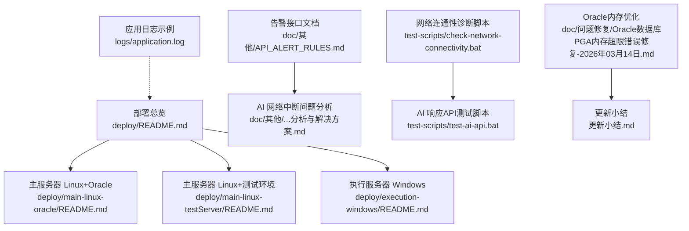
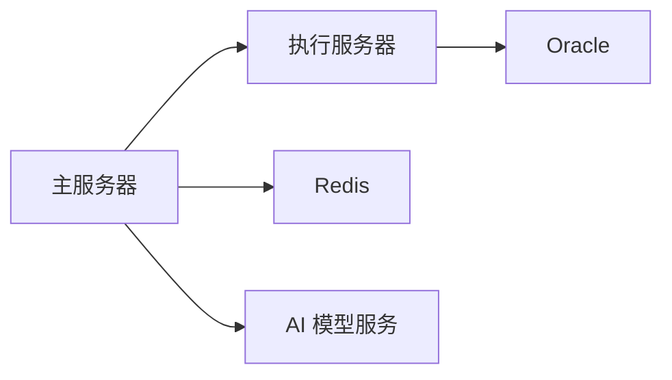
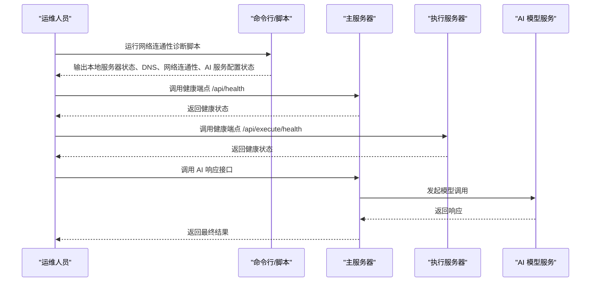

# 故障排除

<cite>
**本文引用的文件**
- [部署总览](file://med_ai_assistant_1.0_bs_backend/deploy/README.md)
- [主服务器 Linux+Oracle 部署指南](file://med_ai_assistant_1.0_bs_backend/deploy/main-linux-oracle/README.md)
- [主服务器 Linux+测试环境部署指南](file://med_ai_assistant_1.0_bs_backend/deploy/main-linux-testServer/README.md)
- [执行服务器 Windows 部署指南](file://med_ai_assistant_1.0_bs_backend/deploy/execution-windows/README.md)
- [执行服务器 Linux 部署指南](file://med_ai_assistant_1.0_bs_backend/deploy/execution-linux/README.md)
- [AI 响应接口网络中断后连接失败问题分析与解决方案](file://med_ai_assistant_1.0_bs_backend/doc/其他/AI响应接口网络中断后连接失败问题分析与解决方案.md)
- [AI 响应接口网络中断后连接失败问题解决方案实施总结](file://med_ai_assistant_1.0_bs_backend/doc/其他/AI响应接口网络中断后连接失败问题解决方案实施总结.md)
- [告警规则相关接口文档](file://med_ai_assistant_1.0_bs_backend/doc/其他/API_ALERT_RULES.md)
- [Oracle数据库PGA内存超限错误修复-2026年03月14日](file://med_ai_assistant_1.0_bs_backend/doc/问题修复/Oracle数据库PGA内存超限错误修复-2026年03月14日.md)
- [AI 服务网络连接诊断脚本](file://med_ai_assistant_1.0_bs_backend/test-scripts/check-network-connectivity.bat)
- [AI 响应API测试脚本](file://med_ai_assistant_1.0_bs_backend/test-scripts/test-ai-api.bat)
- [应用日志文件（示例）](file://med_ai_assistant_1.0_bs_backend/logs/application.log)
- [更新小结](file://更新小结.md)
</cite>

## 目录
1. [简介](#简介)
2. [项目结构](#项目结构)
3. [核心组件](#核心组件)
4. [架构总览](#架构总览)
5. [详细组件分析](#详细组件分析)
6. [依赖关系分析](#依赖关系分析)
7. [性能考虑](#性能考虑)
8. [故障排除指南](#故障排除指南)
9. [结论](#结论)
10. [附录](#附录)

## 简介
本指南面向运维与技术支持人员，围绕 MedAiAssistant 1.0 BS 的主服务器与执行服务器，系统化梳理启动失败、数据库连接问题、AI 模型调用异常、性能瓶颈等常见问题的诊断方法与解决方案；提供标准化的调试流程、日志分析技巧、性能定位方法；并给出紧急处置预案、系统恢复流程与数据备份策略，帮助快速定位与解决问题。

**更新** 新增Oracle数据库内存优化章节，收录PGA内存超限问题的完整诊断和解决流程，为类似问题提供参考解决方案。

## 项目结构
- 部署与运维相关文档集中在 deploy 目录，按平台与角色分层组织，便于快速定位部署与故障排查路径。
- doc/其他 目录包含告警接口、AI 网络中断问题分析与总结等专题文档，有助于快速理解系统能力边界与历史问题。
- doc/问题修复 目录包含Oracle数据库PGA内存超限等具体问题的修复报告，为故障排查提供权威参考。
- test-scripts 提供网络连通性与 AI API 的自动化测试脚本，便于一线快速验证。
- logs 目录包含应用日志文件，是定位问题的重要依据。



**图示来源**
- [部署总览](file://med_ai_assistant_1.0_bs_backend/deploy/README.md#L1-L250)
- [主服务器 Linux+Oracle 部署指南](file://med_ai_assistant_1.0_bs_backend/deploy/main-linux-oracle/README.md#L1-L396)
- [主服务器 Linux+测试环境部署指南](file://med_ai_assistant_1.0_bs_backend/deploy/main-linux-testServer/README.md#L1-L396)
- [执行服务器 Windows 部署指南](file://med_ai_assistant_1.0_bs_backend/deploy/execution-windows/README.md#L1-L469)
- [执行服务器 Linux 部署指南](file://med_ai_assistant_1.0_bs_backend/deploy/execution-linux/README.md#L1-L138)
- [告警规则相关接口文档](file://med_ai_assistant_1.0_bs_backend/doc/其他/API_ALERT_RULES.md#L1-L59)
- [AI 服务网络连接诊断脚本](file://med_ai_assistant_1.0_bs_backend/test-scripts/check-network-connectivity.bat#L1-L67)
- [AI 响应API测试脚本](file://med_ai_assistant_1.0_bs_backend/test-scripts/test-ai-api.bat#L1-L22)
- [应用日志文件（示例）](file://med_ai_assistant_1.0_bs_backend/logs/application.log#L1-L200)
- [Oracle数据库PGA内存超限错误修复-2026年03月14日](file://med_ai_assistant_1.0_bs_backend/doc/问题修复/Oracle数据库PGA内存超限错误修复-2026年03月14日.md#L1-L173)
- [更新小结](file://更新小结.md#L1-L372)

**章节来源**
- [部署总览](file://med_ai_assistant_1.0_bs_backend/deploy/README.md#L1-L250)

## 核心组件
- 主服务器（Main Server）
  - 角色：处理用户请求、API 网关、任务调度
  - 端口：8081
  - 依赖：Redis 缓存、执行服务器（HTTP 通信）
- 执行服务器（Execution Server）
  - 角色：执行 AI 模型调用、数据处理等耗时任务
  - 端口：8082
  - 依赖：Oracle 数据库（远程连接）、Redis 缓存
- 健康检查端点
  - 主服务器：/api/health
  - 执行服务器：/api/execute/health 与 /api/execute/service-status

**章节来源**
- [部署总览](file://med_ai_assistant_1.0_bs_backend/deploy/README.md#L42-L62)
- [部署总览](file://med_ai_assistant_1.0_bs_backend/deploy/README.md#L135-L155)

## 架构总览
系统采用"主服务器 + 执行服务器"的双节点架构，通过 HTTP API 进行推送与回调模式通信；主服务器负责接入与调度，执行服务器负责 AI 与数据库密集型任务。

```mermaid
graph TB
subgraph "前端/客户端"
U["用户/调用方"]
end
subgraph "主服务器"
MS["主服务器<br/>Port: 8081"]
R["Redis 缓存"]
end
subgraph "执行服务器"
ES["执行服务器<br/>Port: 8082"]
O["Oracle 数据库"]
end
U --> |"HTTP API"| MS
MS --> |"HTTP API 推送/回调"| ES
MS < --> |"缓存/状态"| R
ES --> |"数据库访问"| O
```

**图示来源**
- [部署总览](file://med_ai_assistant_1.0_bs_backend/deploy/README.md#L42-L62)

## 详细组件分析

### 主服务器（Linux + Oracle）
- 部署要点
  - Docker 与 Docker Compose 版本要求
  - 环境变量（Redis 密码、执行服务器地址、AI 模型密钥、JVM 参数等）
  - 应用配置（日志级别等）
- 健康检查与日志
  - 健康端点：/api/health
  - 日志位置：容器日志与应用日志文件
- 常见问题与排查
  - 容器无法启动：端口占用、容器日志、磁盘空间
  - 健康检查失败：服务状态、防火墙、SELinux
  - 连接执行服务器失败：网络连通性、环境变量配置
  - 内存不足：调整 JVM 参数并重启

**章节来源**
- [主服务器 Linux+Oracle 部署指南](file://med_ai_assistant_1.0_bs_backend/deploy/main-linux-oracle/README.md#L28-L63)
- [主服务器 Linux+Oracle 部署指南](file://med_ai_assistant_1.0_bs_backend/deploy/main-linux-oracle/README.md#L166-L210)
- [主服务器 Linux+Oracle 部署指南](file://med_ai_assistant_1.0_bs_backend/deploy/main-linux-oracle/README.md#L282-L346)

### 执行服务器（Windows）
- 部署要点
  - Windows Server 环境、Docker、端口 8082
  - 执行轮询服务状态检查端点
- 常见问题与排查
  - 容器启动失败、端口占用、容器日志
  - 健康检查失败、防火墙、SELinux（如适用）
  - Oracle 连接测试脚本与诊断脚本

**章节来源**
- [执行服务器 Windows 部署指南](file://med_ai_assistant_1.0_bs_backend/deploy/execution-windows/README.md#L1-L469)

### 执行服务器（Linux）
- 部署要点
  - Linux 环境、Docker Compose、端口 8082
  - 健康检查脚本与日志监控
- 常见问题与排查
  - 容器启动失败、端口占用、容器日志
  - 健康检查失败、防火墙
  - Oracle 连接测试脚本与诊断脚本

**章节来源**
- [执行服务器 Linux 部署指南](file://med_ai_assistant_1.0_bs_backend/deploy/execution-linux/README.md#L1-L138)

### 告警规则接口
- 接口用途：根据规则名称获取激活的告警规则内容与所需操作
- 关键点：请求参数、返回结构、错误码、数据库查询语句
- 适用场景：辅助定位业务规则类问题与告警触发异常

**章节来源**
- [告警规则相关接口文档](file://med_ai_assistant_1.0_bs_backend/doc/其他/API_ALERT_RULES.md#L1-L59)

### AI 响应接口与网络中断问题
- 专题文档涵盖网络中断后的连接失败问题分析与解决方案实施总结
- 适用于诊断与修复 AI 模型调用过程中的网络波动与超时问题

**章节来源**
- [AI 响应接口网络中断后连接失败问题分析与解决方案](file://med_ai_assistant_1.0_bs_backend/doc/其他/AI响应接口网络中断后连接失败问题分析与解决方案.md#L1-L200)
- [AI 响应接口网络中断后连接失败问题解决方案实施总结](file://med_ai_assistant_1.0_bs_backend/doc/其他/AI响应接口网络中断后连接失败问题解决方案实施总结.md#L1-L200)

## 依赖关系分析
- 主服务器依赖
  - Redis 缓存：用于会话、任务状态等
  - 执行服务器：通过 HTTP API 调用 AI 与数据处理能力
- 执行服务器依赖
  - Oracle 数据库：远程连接
  - Redis 缓存：共享状态与消息队列
- 外部依赖
  - AI 模型服务（如 DeepSeek）：域名解析与网络连通性



**图示来源**
- [部署总览](file://med_ai_assistant_1.0_bs_backend/deploy/README.md#L42-L62)

## 性能考虑
- 资源监控
  - 容器资源使用：docker stats
  - JVM 堆内存：docker exec + jmap
- 日志监控
  - 错误日志：tail -f + grep ERROR
  - 慢请求：tail -f + grep "took more than"
- JVM 参数调优
  - 通过环境变量调整堆大小与 GC 参数，避免频繁 Full GC

**章节来源**
- [主服务器 Linux+Oracle 部署指南](file://med_ai_assistant_1.0_bs_backend/deploy/main-linux-oracle/README.md#L347-L367)

## 故障排除指南

### 一、启动失败
- 主服务器（Linux）
  - 检查端口占用：确认 8081、6379 未被占用
  - 查看容器日志：docker logs med-ai-main
  - 检查磁盘空间：df -h
- 执行服务器（Windows/Linux）
  - 检查端口占用与容器日志
  - 确认 Docker 与 Compose 版本满足要求

**章节来源**
- [主服务器 Linux+Oracle 部署指南](file://med_ai_assistant_1.0_bs_backend/deploy/main-linux-oracle/README.md#L284-L300)
- [执行服务器 Windows 部署指南](file://med_ai_assistant_1.0_bs_backend/deploy/execution-windows/README.md#L1-L469)
- [执行服务器 Linux 部署指南](file://med_ai_assistant_1.0_bs_backend/deploy/execution-linux/README.md#L1-L138)

### 二、数据库连接问题
- 执行服务器（Oracle）
  - 使用诊断脚本进行连接测试
  - 检查网络连通性与防火墙策略
  - 核对远程数据库凭据与服务名

**章节来源**
- [执行服务器 Windows 部署指南](file://med_ai_assistant_1.0_bs_backend/deploy/execution-windows/README.md#L284-L310)
- [执行服务器 Linux 部署指南](file://med_ai_assistant_1.0_bs_backend/deploy/execution-linux/README.md#L114-L132)

### 三、AI 模型调用异常
- 健康检查
  - 主服务器健康端点：/api/health
  - 执行服务器健康端点：/api/execute/health 与 /api/execute/service-status
- 网络连通性
  - 使用网络诊断脚本检查本地服务器、DNS 解析、网络连通性与 AI 服务配置状态
  - 若存在 DNS 问题，可尝试更换 DNS 服务器或联系网络管理员
- 接口测试
  - 使用 AI 响应 API 测试脚本进行最小化调用验证
- 专题问题
  - 参考"网络中断后连接失败"专题文档，定位网络波动与超时问题



**图示来源**
- [AI 服务网络连接诊断脚本](file://med_ai_assistant_1.0_bs_backend/test-scripts/check-network-connectivity.bat#L1-L67)
- [AI 响应API测试脚本](file://med_ai_assistant_1.0_bs_backend/test-scripts/test-ai-api.bat#L1-L22)
- [部署总览](file://med_ai_assistant_1.0_bs_backend/deploy/README.md#L135-L155)

**章节来源**
- [AI 服务网络连接诊断脚本](file://med_ai_assistant_1.0_bs_backend/test-scripts/check-network-connectivity.bat#L1-L67)
- [AI 响应API测试脚本](file://med_ai_assistant_1.0_bs_backend/test-scripts/test-ai-api.bat#L1-L22)
- [部署总览](file://med_ai_assistant_1.0_bs_backend/deploy/README.md#L135-L155)

### 四、性能瓶颈
- 容器资源使用：docker stats
- JVM 堆内存：docker exec + jmap
- 日志分析：tail -f + grep ERROR / "took more than"
- JVM 参数优化：调整堆大小与 GC 参数

**章节来源**
- [主服务器 Linux+Oracle 部署指南](file://med_ai_assistant_1.0_bs_backend/deploy/main-linux-oracle/README.md#L347-L367)

### 五、Oracle数据库内存优化

**更新** 新增Oracle数据库内存优化章节，专门处理PGA内存超限问题

#### 5.1 问题识别
- **症状表现**：执行服务器向Oracle数据库插入数据时出现ORA-04036错误
- **错误信息**：`ORA-04036: PGA memory used by the instance or PDB exceeds PGA_AGGREGATE_LIMIT`
- **影响范围**：数据库插入操作失败，导致事务回滚
- **内存异常**：后台进程BG00占用约1.6GB PGA内存

**章节来源**
- [Oracle数据库PGA内存超限错误修复-2026年03月14日](file://med_ai_assistant_1.0_bs_backend/doc/问题修复/Oracle数据库PGA内存超限错误修复-2026年03月14日.md#L1-L173)

#### 5.2 根因分析
- **版本限制**：Oracle AI Database 26ai Free版本最大RAM限制为2GB
- **配置不当**：初始`pga_aggregate_limit = 4G`超过Free版本内存限制
- **进程占用**：BG00后台进程占用大量PGA内存（约1.6GB）
- **资源竞争**：数据库实例无法分配足够PGA内存给后台进程

**章节来源**
- [Oracle数据库PGA内存超限错误修复-2026年03月14日](file://med_ai_assistant_1.0_bs_backend/doc/问题修复/Oracle数据库PGA内存超限错误修复-2026年03月14日.md#L23-L62)

#### 5.3 诊断方法
- **进程内存分析**：查询V$SESSION和V$PROCESS视图识别高内存占用进程
- **配置检查**：使用SHOW PARAMETER命令检查PGA和SGA配置
- **使用情况监控**：查询V$PROCESS获取PGA内存使用详情
- **版本确认**：通过V$VERSION确认数据库版本信息

**章节来源**
- [Oracle数据库PGA内存超限错误修复-2026年03月14日](file://med_ai_assistant_1.0_bs_backend/doc/问题修复/Oracle数据库PGA内存超限错误修复-2026年03月14日.md#L25-L83)

#### 5.4 解决方案
- **参数调整**：将`pga_aggregate_limit`从4G降低到2G
- **容器重启**：重启Oracle容器以释放BG00进程占用的内存
- **验证检查**：确认PGA内存使用降至正常水平

**章节来源**
- [Oracle数据库PGA内存超限错误修复-2026年03月14日](file://med_ai_assistant_1.0_bs_backend/doc/问题修复/Oracle数据库PGA内存超限错误修复-2026年03月14日.md#L64-L98)

#### 5.5 预防措施
- **监控PGA内存使用**：定期检查V$PROCESS的PGA内存使用情况
- **监控高内存占用会话**：识别并处理异常的高内存占用进程
- **应用程序优化**：
  - 大批量插入时采用分批提交策略
  - 及时释放LOB字段数据
  - 合理配置HikariCP连接池参数

**章节来源**
- [Oracle数据库PGA内存超限错误修复-2026年03月14日](file://med_ai_assistant_1.0_bs_backend/doc/问题修复/Oracle数据库PGA内存超限错误修复-2026年03月14日.md#L100-L133)

#### 5.6 相关SQL命令
- 查看PGA配置：`SHOW PARAMETER PGA`
- 查看SGA配置：`SHOW PARAMETER SGA`
- 查看Oracle版本：`SELECT * FROM V$VERSION`
- 修改PGA限制：`ALTER SYSTEM SET PGA_AGGREGATE_LIMIT = 2048M SCOPE=BOTH`

**章节来源**
- [Oracle数据库PGA内存超限错误修复-2026年03月14日](file://med_ai_assistant_1.0_bs_backend/doc/问题修复/Oracle数据库PGA内存超限错误修复-2026年03月14日.md#L140-L166)

### 六、紧急情况处理预案
- 立即措施
  - 停止/重启相关容器以恢复服务
  - 检查并释放被占用端口
  - 临时放宽防火墙策略以便诊断
- 降级方案
  - 暂停高负载任务，优先保障核心健康端点可用
  - 切换到备用 AI 模型服务（如可行）
- 通知与升级
  - 触发告警规则接口，获取所需操作内容
  - 按照告警规则执行标准处置流程

**章节来源**
- [告警规则相关接口文档](file://med_ai_assistant_1.0_bs_backend/doc/其他/API_ALERT_RULES.md#L1-L59)

### 七、系统恢复流程
- 主服务器
  - 停止服务：docker-compose stop
  - 重启服务：docker-compose start
  - 重新加载镜像并启动：docker-compose up -d
- 执行服务器
  - 同步执行主服务器的停止/启动/镜像加载流程

**章节来源**
- [主服务器 Linux+Oracle 部署指南](file://med_ai_assistant_1.0_bs_backend/deploy/main-linux-oracle/README.md#L211-L230)
- [主服务器 Linux+Oracle 部署指南](file://med_ai_assistant_1.0_bs_backend/deploy/main-linux-oracle/README.md#L245-L280)

### 八、数据备份策略
- Redis 数据备份
  - 执行持久化命令并复制 rdb 文件
- 配置文件与应用日志备份
  - 定期归档 config 与 logs 目录

**章节来源**
- [主服务器 Linux+Oracle 部署指南](file://med_ai_assistant_1.0_bs_backend/deploy/main-linux-oracle/README.md#L237-L243)

### 九、日志分析技巧
- 定位错误
  - tail -f 应用日志 + grep ERROR
- 定位慢请求
  - tail -f 应用日志 + grep "took more than"
- 容器日志
  - docker logs -f <container_name>

**章节来源**
- [主服务器 Linux+Oracle 部署指南](file://med_ai_assistant_1.0_bs_backend/deploy/main-linux-oracle/README.md#L349-L357)
- [部署总览](file://med_ai_assistant_1.0_bs_backend/deploy/README.md#L157-L172)

## 结论
通过标准化的部署与故障排查流程、完善的日志与监控手段、以及针对 AI 网络波动的专项问题处理方案，MedAiAssistant 1.0 BS 的运维团队能够快速定位并解决启动失败、数据库连接、AI 调用异常与性能瓶颈等问题。**新增的Oracle数据库内存优化章节**为处理PGA内存超限等数据库内存问题提供了完整的诊断和解决流程，包括问题识别、根因分析、参数调整、容器重启等步骤。建议在生产环境中严格执行安全加固与定期备份策略，并结合告警规则实现自动化处置闭环。

## 附录
- 常用端点
  - 主服务器健康检查：/api/health
  - 执行服务器健康检查：/api/execute/health
  - 执行服务器服务状态：/api/execute/service-status
- 常用脚本
  - 网络连通性诊断：test-scripts/check-network-connectivity.bat
  - AI 响应 API 测试：test-scripts/test-ai-api.bat
- 日志位置
  - 主服务器：./logs/main/main-server.log
  - 执行服务器：./logs/execution/execution-server.log
  - 应用日志文件示例：logs/application.log
- 问题修复文档
  - Oracle数据库PGA内存超限错误修复：doc/问题修复/Oracle数据库PGA内存超限错误修复-2026年03月14日.md
  - 更新小结：更新小结.md

**章节来源**
- [部署总览](file://med_ai_assistant_1.0_bs_backend/deploy/README.md#L135-L172)
- [应用日志文件（示例）](file://med_ai_assistant_1.0_bs_backend/logs/application.log#L1-L200)
- [Oracle数据库PGA内存超限错误修复-2026年03月14日](file://med_ai_assistant_1.0_bs_backend/doc/问题修复/Oracle数据库PGA内存超限错误修复-2026年03月14日.md#L1-L173)
- [更新小结](file://更新小结.md#L1-L372)