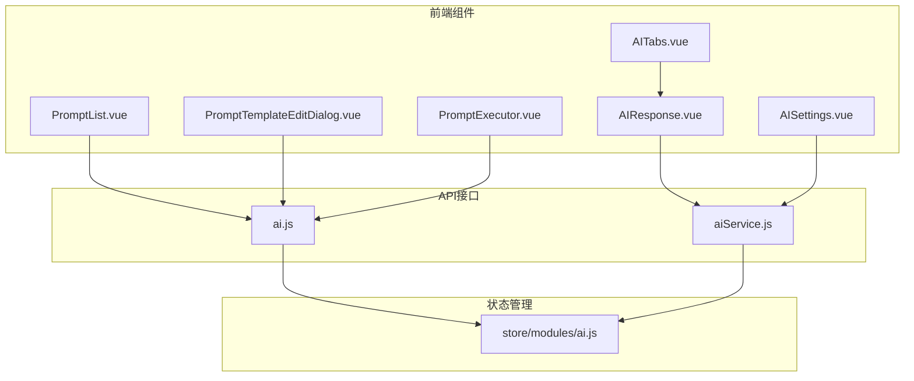
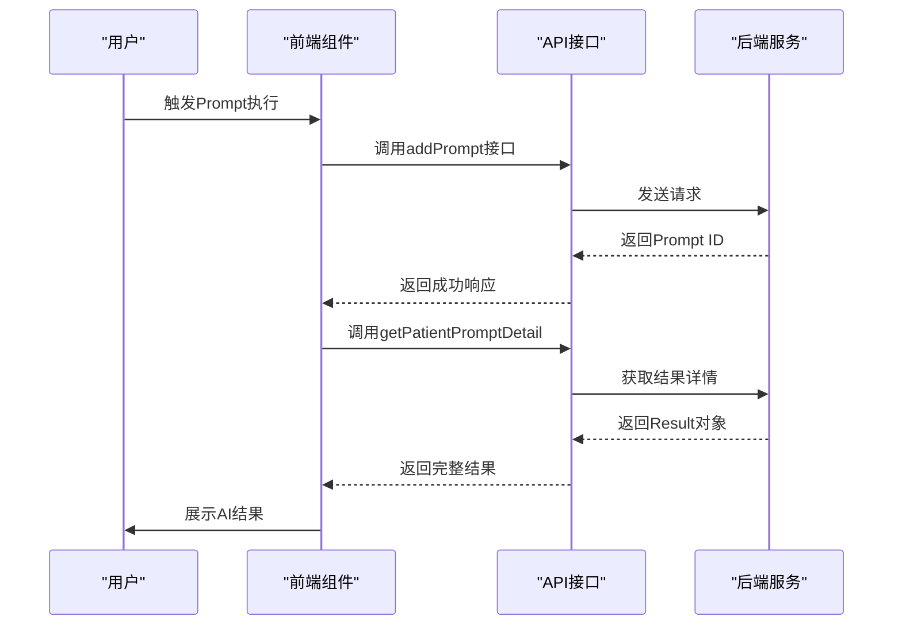
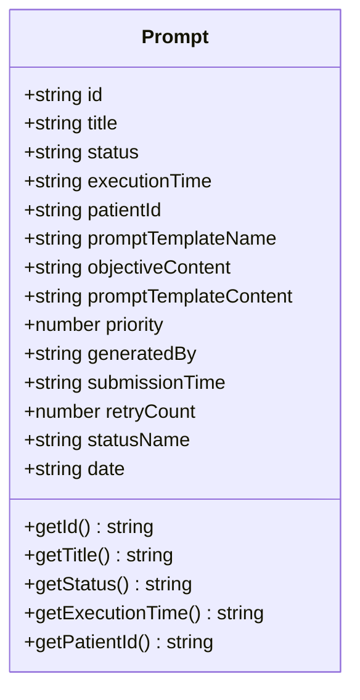
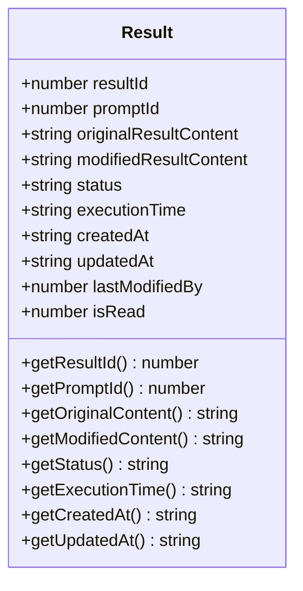
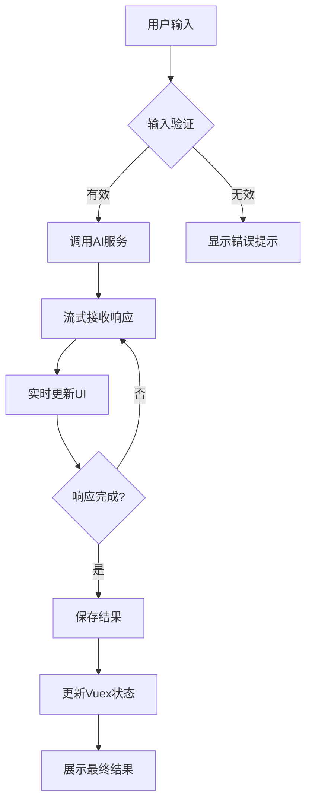
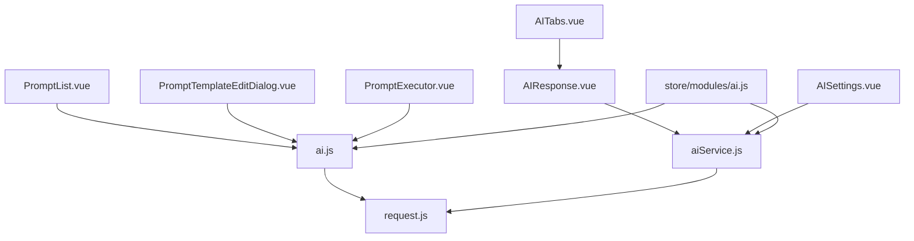

# 数据模型

<cite>
**本文档中引用的文件**   
- [PromptList.vue](file://src/components/ai/PromptList.vue)
- [ai.js](file://src/api/ai.js)
- [PromptTemplateEditDialog.vue](file://src/components/ai/PromptTemplateEditDialog.vue)
- [AIResponse.vue](file://src/components/ai/AIResponse.vue)
- [aiService.js](file://src/api/aiService.js)
- [AISettings.vue](file://src/components/ai/AISettings.vue)
- [PromptExecutor.vue](file://src/components/server/PromptExecutor.vue)
- [AITabs.vue](file://src/components/ai/AITabs.vue)
</cite>

## 目录
1. [引言](#引言)
2. [项目结构](#项目结构)
3. [核心组件](#核心组件)
4. [架构概述](#架构概述)
5. [详细组件分析](#详细组件分析)
6. [依赖分析](#依赖分析)
7. [性能考虑](#性能考虑)
8. [故障排除指南](#故障排除指南)
9. [结论](#结论)

## 引言
本文档旨在全面阐述医疗AI助手系统中的数据模型，重点定义Prompt对象和Result对象的结构、字段含义、数据类型及业务逻辑。通过分析API响应格式与Vuex状态管理结构，明确各字段的约束条件与交互方式，并说明这些模型在组件间传递时的序列化与反序列化处理机制。文档将使用图表形式展示实体关系，并提供JSON示例数据以增强可读性。

## 项目结构
本项目采用基于Vue.js的前端架构，遵循功能模块化组织原则。核心AI功能集中在`src/components/ai`目录下，包括Prompt管理、AI响应处理、模板编辑等组件。数据流通过Vuex进行集中管理，API调用封装在`src/api`目录中。整体结构清晰，便于维护和扩展。

**图源**
- [PromptList.vue](file://src/components/ai/PromptList.vue)
- [ai.js](file://src/api/ai.js)
- [aiService.js](file://src/api/aiService.js)

**本节来源**
- [PromptList.vue](file://src/components/ai/PromptList.vue)
- [ai.js](file://src/api/ai.js)

## 核心组件
核心组件包括Prompt列表、AI响应处理、模板编辑器和执行器。这些组件共同构成了AI助手的核心功能链路。Prompt对象作为任务载体，包含ID、标题、状态、执行时间等关键字段；Result对象则存储AI生成的原始内容、编辑后内容、时间戳和版本信息。组件间通过Vuex共享状态，并利用API进行数据持久化。

**本节来源**
- [PromptList.vue](file://src/components/ai/PromptList.vue#L0-L41)
- [AIResponse.vue](file://src/components/ai/AIResponse.vue#L0-L495)
- [PromptTemplateEditDialog.vue](file://src/components/ai/PromptTemplateEditDialog.vue#L0-L463)

## 架构概述
系统采用前后端分离架构，前端通过API与后端通信。AI服务调用采用流式响应模式，提升用户体验。数据模型通过API定义，确保前后端一致性。Vuex用于管理全局状态，实现组件间数据共享。整体架构支持高并发处理，适用于医疗场景下的实时AI辅助决策。

**图源**
- [ai.js](file://src/api/ai.js#L349-L382)
- [PromptList.vue](file://src/components/ai/PromptList.vue#L166-L200)

## 详细组件分析
### Prompt对象分析
Prompt对象是系统中的核心任务单元，包含任务的基本信息和执行状态。

#### Prompt对象结构

**图源**
- [PromptList.vue](file://src/components/ai/PromptList.vue#L0-L41)
- [PromptExecutor.vue](file://src/components/server/PromptExecutor.vue#L0-L36)

#### Prompt对象字段说明
**Prompt对象字段**
- **id**: Prompt的唯一标识符，字符串类型，必填。
- **title**: Prompt的标题，字符串类型，必填。
- **status**: 当前状态（如"待处理"、"执行中"、"已完成"），字符串类型。
- **executionTime**: 执行时间，格式为"yyyy-MM-dd HH:mm:ss"，字符串类型。
- **patientId**: 关联的患者ID，字符串类型，必填。
- **promptTemplateName**: Prompt模板名称，字符串类型。
- **objectiveContent**: 目标内容，字符串类型。
- **promptTemplateContent**: Prompt模板内容，字符串类型。
- **priority**: 优先级，数字类型，默认值为3。
- **generatedBy**: 生成来源，字符串类型，默认为"user"。
- **submissionTime**: 提交时间，ISO格式字符串。
- **retryCount**: 重试次数，数字类型。
- **statusName**: 状态名称，字符串类型。
- **date**: 显示用日期，字符串类型。

**本节来源**
- [PromptList.vue](file://src/components/ai/PromptList.vue#L0-L41)
- [PromptExecutor.vue](file://src/components/server/PromptExecutor.vue#L65-L95)

### Result对象分析
Result对象存储AI生成的结果，包含原始内容、编辑后内容和元数据。

#### Result对象结构

**图源**
- [ai.js](file://src/api/ai.js#L349-L382)
- [PromptList.vue](file://src/components/ai/PromptList.vue#L166-L200)

#### Result对象字段说明
**Result对象字段**
- **resultId**: 结果ID，数字类型，主键。
- **promptId**: 关联的Prompt ID，数字类型，外键。
- **originalResultContent**: 原始结果内容，大文本字符串，必填。
- **modifiedResultContent**: 修改后结果内容，大文本字符串，可选。
- **status**: 状态（如"SAVED"、"UPDATED"），字符串类型。
- **executionTime**: 执行时间，格式为"yyyy-MM-dd HH:mm:ss"，字符串类型。
- **createdAt**: 创建时间，格式为"yyyy-MM-dd HH:mm:ss"，字符串类型。
- **updatedAt**: 更新时间，格式为"yyyy-MM-dd HH:mm:ss"，字符串类型。
- **lastModifiedBy**: 最后修改人ID，数字类型。
- **isRead**: 是否已读标记，数字类型（0/1）。

**本节来源**
- [ai.js](file://src/api/ai.js#L349-L382)
- [PromptList.vue](file://src/components/ai/PromptList.vue#L166-L200)

### 数据流分析
#### AI响应处理流程

**图源**
- [AIResponse.vue](file://src/components/ai/AIResponse.vue#L0-L495)
- [aiService.js](file://src/api/aiService.js#L0-L157)

**本节来源**
- [AIResponse.vue](file://src/components/ai/AIResponse.vue#L0-L495)
- [aiService.js](file://src/api/aiService.js#L0-L157)

## 依赖分析
系统依赖于多个核心模块，包括API服务、状态管理和UI组件。API模块提供数据访问接口，状态管理模块维护应用状态，UI组件负责用户交互。各模块间通过明确的接口进行通信，降低了耦合度。

**图源**
- [AIResponse.vue](file://src/components/ai/AIResponse.vue)
- [ai.js](file://src/api/ai.js)
- [aiService.js](file://src/api/aiService.js)

**本节来源**
- [AIResponse.vue](file://src/components/ai/AIResponse.vue)
- [ai.js](file://src/api/ai.js)
- [aiService.js](file://src/api/aiService.js)

## 性能考虑
系统在设计时充分考虑了性能因素。AI服务采用流式响应，避免长时间等待。前端通过Vuex缓存数据，减少重复请求。API调用设置合理的超时时间，防止界面卡死。对于大数据量的Result内容，采用分页加载策略，提升响应速度。

## 故障排除指南
常见问题包括API调用失败、AI响应延迟和数据同步问题。建议检查网络连接、API服务状态和用户权限。对于流式响应中断，可尝试重新连接。数据不一致时，可通过刷新按钮重新加载最新数据。

**本节来源**
- [AIResponse.vue](file://src/components/ai/AIResponse.vue#L0-L495)
- [aiService.js](file://src/api/aiService.js#L0-L157)

## 结论
本文档详细定义了医疗AI助手系统中的Prompt和Result数据模型，明确了各字段的业务含义和技术约束。通过图表和代码示例，清晰展示了数据结构和交互流程。该模型设计合理，支持系统的各项功能需求，为后续开发和维护提供了坚实的基础。