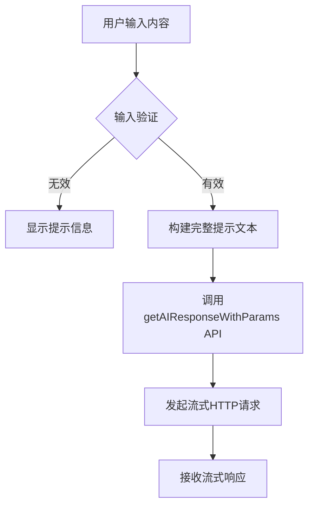
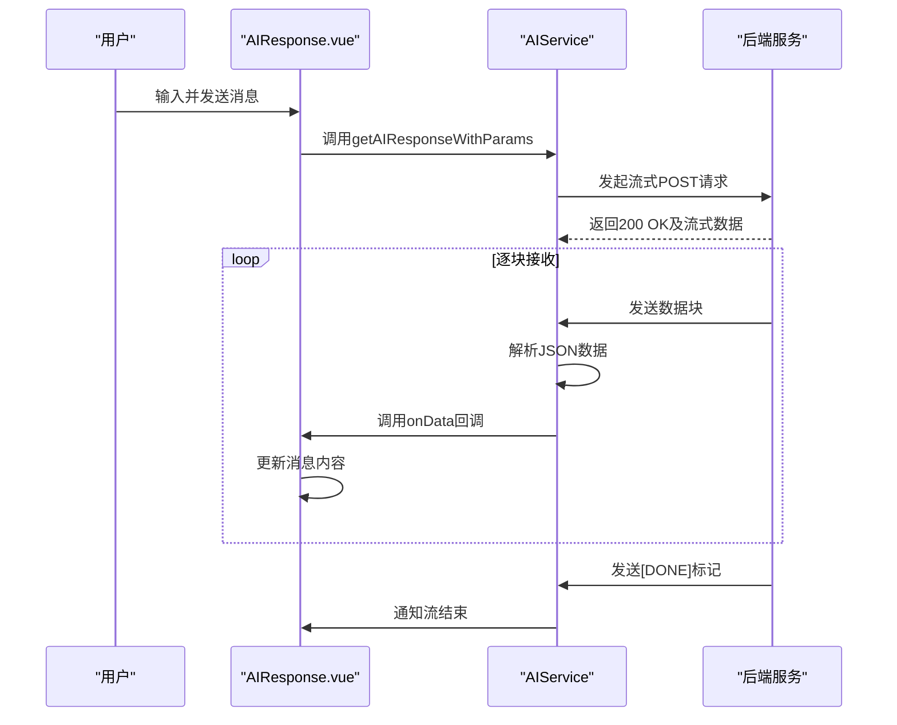
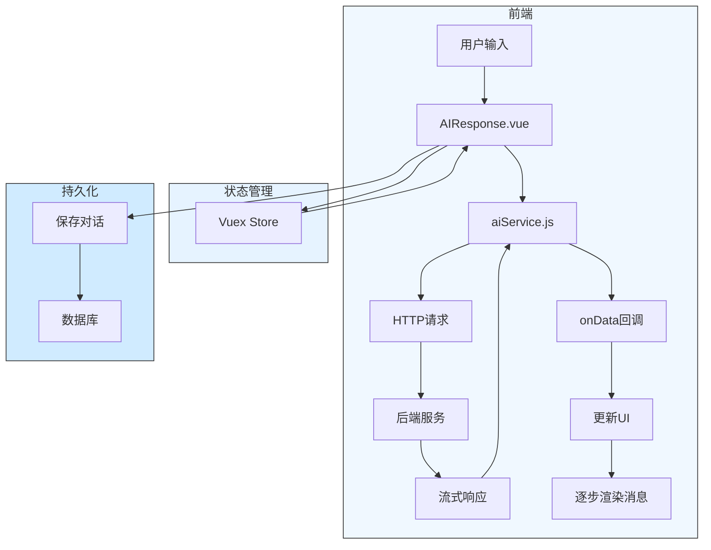

# AI交互式对话流程

<cite>
**Referenced Files in This Document**   
- [AIResponse.vue](file://src/components/ai/AIResponse.vue)
- [aiService.js](file://src/api/aiService.js)
- [ai.js](file://src/api/ai.js)
- [ai.js](file://src/store/modules/ai.js)
- [AITabs.vue](file://src/components/ai/AITabs.vue)
</cite>

## 目录
1. [简介](#简介)
2. [核心组件](#核心组件)
3. [用户输入处理流程](#用户输入处理流程)
4. [流式响应接收机制](#流式响应接收机制)
5. [Vuex状态管理](#vuex状态管理)
6. [消息操作实现](#消息操作实现)
7. [数据流图示](#数据流图示)
8. [异常处理方案](#异常处理方案)

## 简介
本文档系统化描述医疗AI助手系统中AI交互式对话功能的实现机制。重点阐述前端组件如何通过流式HTTP请求实现实时接收大语言模型的响应，并逐步渲染消息流。文档详细说明了从用户输入提交到后端调用的完整流程，以及Vuex状态管理模块如何维护对话历史和会话状态。

## 核心组件

AI交互式对话功能由多个核心组件协同工作，包括用户界面组件、API服务层和状态管理模块。这些组件共同实现了完整的对话交互流程。

**Section sources**
- [AIResponse.vue](file://src/components/ai/AIResponse.vue)
- [AITabs.vue](file://src/components/ai/AITabs.vue)
- [aiService.js](file://src/api/aiService.js)
- [ai.js](file://src/store/modules/ai.js)

## 用户输入处理流程

用户输入的处理流程始于`AIResponse.vue`组件中的输入框提交事件。当用户点击"发送"按钮时，系统执行以下步骤：

1. 验证输入内容的有效性
2. 构建包含上下文历史的完整提示文本
3. 调用`aiService.js`中的`getAIResponseWithParams` API
4. 发起流式HTTP请求至后端服务

该流程确保了用户输入能够被正确处理并传递给大语言模型进行分析。



**Diagram sources**
- [AIResponse.vue](file://src/components/ai/AIResponse.vue#L250-L350)
- [aiService.js](file://src/api/aiService.js#L119-L156)

**Section sources**
- [AIResponse.vue](file://src/components/ai/AIResponse.vue#L250-L350)
- [aiService.js](file://src/api/aiService.js#L119-L156)

## 流式响应接收机制

系统通过流式HTTP请求实现大语言模型响应的实时接收和逐步渲染。`aiService.js`文件中的`getAIResponseStream`方法负责处理流式响应，其核心机制如下：

- 使用`fetch` API发起带有`stream: true`参数的POST请求
- 通过`response.body.getReader()`获取可读流
- 逐块读取并解析NDJSON格式的响应数据
- 通过回调函数`onData`将每个数据块传递给UI组件
- 在UI层逐步更新AI消息内容，实现渐进式渲染

这种机制避免了长时间等待完整响应，提供了更好的用户体验。



**Diagram sources**
- [aiService.js](file://src/api/aiService.js#L60-L115)
- [AIResponse.vue](file://src/components/ai/AIResponse.vue#L280-L320)

**Section sources**
- [aiService.js](file://src/api/aiService.js#L60-L115)
- [AIResponse.vue](file://src/components/ai/AIResponse.vue#L280-L320)

## Vuex状态管理

`src/store/modules/ai.js`文件定义了AI相关功能的状态管理模块，主要管理以下状态：

- `response`: 存储AI的响应内容
- `conversation`: 存储完整的对话历史记录
- `currentSessionMessages`: 跟踪当前会话产生的消息
- `loading`: 标识请求处理状态

通过`mapState`和`mapMutations`，组件可以方便地访问和更新这些状态，确保了应用状态的一致性和可预测性。

```mermaid
classDiagram
class AIStore {
+prompts : Array
+currentPrompt : Object
+selectedPromptIndex : Number
+result : Object
+aiDiagnosis : Array
+currentDiagnosis : Array
+response : String
+editingTemplate : Object
+modelSettings : Object
+aiResponse : String
+promptTemplates : Array
}
class Mutations {
+SET_CURRENT_PROMPT(state, prompt)
+SET_SELECTED_PROMPT_INDEX(state, index)
+SET_RESULT(state, result)
+SET_AI_DIAGNOSIS(state, diagnosis)
+SET_CURRENT_DIAGNOSIS(state, diagnosis)
+SET_RESPONSE(state, response)
+SET_AI_RESPONSE(state, response)
+SET_PROMPTS(state, prompts)
+SET_MODEL_SETTINGS(state, settings)
+SET_EDITING_TEMPLATE(state, template)
+SET_PROMPT_TEMPLATES(state, templates)
+RESET_STATE(state)
+RESET()
}
class Actions {
+fetchPrompts({ commit }, patientId)
+fetchPromptTemplates({ commit })
}
class Getters {
+prompts(state)
+currentPrompt(state)
+selectedPromptIndex(state)
+result(state)
+aiDiagnosis(state)
+currentDiagnosis(state)
+response(state)
+aiResponse(state)
+modelSettings(state)
+editingTemplate(state)
+promptTemplates(state)
}
AIStore --> Mutations : "包含"
AIStore --> Actions : "包含"
AIStore --> Getters : "包含"
```

**Diagram sources**
- [ai.js](file://src/store/modules/ai.js)

**Section sources**
- [ai.js](file://src/store/modules/ai.js)

## 消息操作实现

系统实现了多种消息操作功能，包括消息保存、清空和重新生成等。这些功能的实现逻辑如下：

### 消息保存
当用户点击"保存"按钮时，系统会：
1. 检查是否有新的对话内容需要保存
2. 为本次会话生成唯一的会话ID
3. 过滤掉重复的消息记录
4. 通过API批量保存消息到后端数据库
5. 清空当前会话的消息跟踪数组

### 消息清空
清空操作直接将`conversation`数组重置为空，清除当前的对话显示。

### 重新生成
系统通过重新发送相同的用户输入来实现重新生成功能，利用相同的上下文历史获取新的AI响应。

**Section sources**
- [AIResponse.vue](file://src/components/ai/AIResponse.vue#L400-L480)

## 数据流图示

以下流程图展示了AI交互式对话中消息发送与接收的完整数据流：



**Diagram sources**
- [AIResponse.vue](file://src/components/ai/AIResponse.vue)
- [aiService.js](file://src/api/aiService.js)

## 异常处理方案

系统针对常见的连接问题实现了相应的处理方案：

### 连接超时
- 设置30秒的请求超时时间
- 超时后显示友好的错误提示
- 允许用户重新尝试发送

### 流中断
- 在流式读取过程中捕获异常
- 显示具体的错误信息
- 保持已接收的部分内容，避免完全丢失

### 网络错误
- 捕获网络连接异常
- 提示用户检查网络连接
- 提供重试机制

这些异常处理机制确保了系统的稳定性和用户体验。

**Section sources**
- [aiService.js](file://src/api/aiService.js#L90-L110)
- [AIResponse.vue](file://src/components/ai/AIResponse.vue#L300-L320)