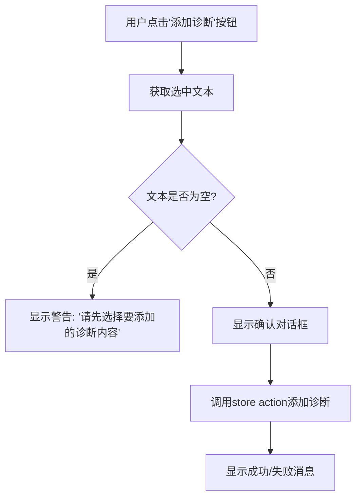
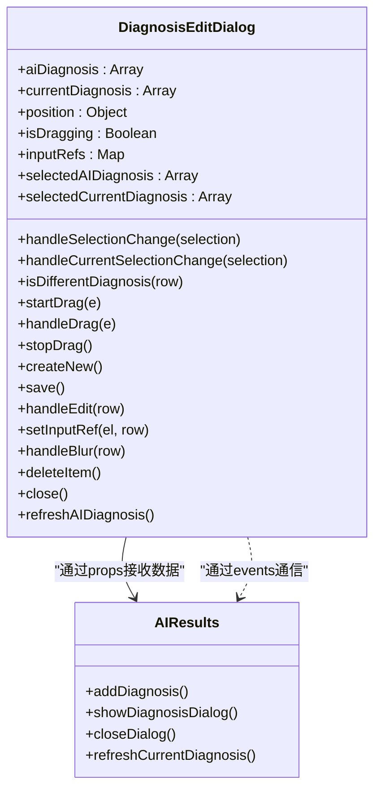
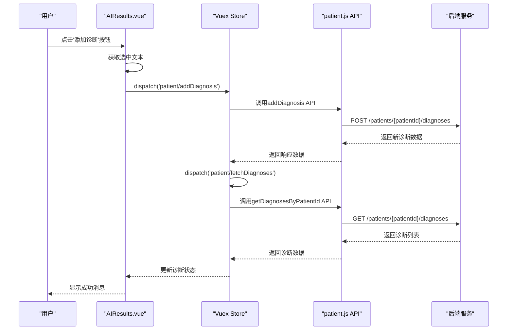
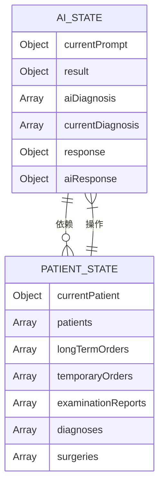
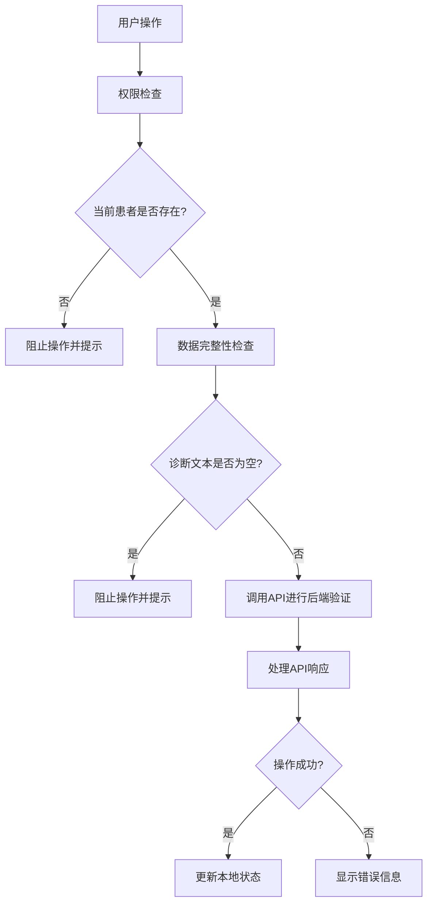
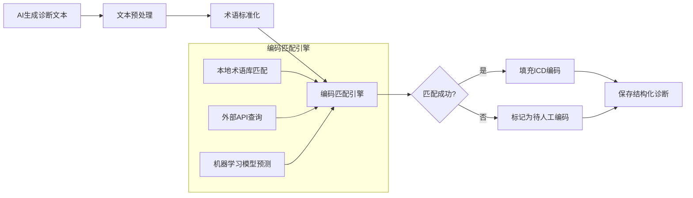

# AI结果转诊断流程

<cite>
**Referenced Files in This Document**   
- [AIResults.vue](file://src/components/ai/AIResults.vue)
- [DiagnosisEditDialog.vue](file://src/components/patient/DiagnosisEditDialog.vue)
- [patient.js](file://src/api/patient.js)
- [patient.js](file://src/store/modules/patient.js)
- [ai.js](file://src/store/modules/ai.js)
</cite>

## 目录
1. [流程概述](#流程概述)
2. [核心组件分析](#核心组件分析)
3. [数据流与状态管理](#数据流与状态管理)
4. [权限与验证机制](#权限与验证机制)
5. [状态转换图](#状态转换图)
6. [扩展点与未来规划](#扩展点与未来规划)

## 流程概述

本流程文档详细描述了医疗AI助手系统中，将AI生成的非结构化内容转化为结构化诊断条目的完整过程。该流程始于用户在AI结果界面点击"添加诊断"按钮，经过Markdown内容解析、诊断建议提取、对话框交互、API验证与保存等环节，最终将诊断信息持久化至患者病历系统。整个流程体现了从自由文本到结构化医疗数据的转化机制，确保了诊断信息的准确性和可追溯性。

## 核心组件分析

### AIResults.vue 组件分析

`AIResults.vue` 组件是AI结果展示和诊断提取的入口点，其核心功能是处理用户交互并启动诊断提取流程。

**Diagram sources**
- [AIResults.vue](file://src/components/ai/AIResults.vue#L10-L298)

**Section sources**
- [AIResults.vue](file://src/components/ai/AIResults.vue#L10-L298)

### DiagnosisEditDialog.vue 组件分析

`DiagnosisEditDialog.vue` 组件负责提供一个交互式界面，用于管理AI生成的诊断建议与患者现有诊断之间的关系。

**Diagram sources**
- [DiagnosisEditDialog.vue](file://src/components/patient/DiagnosisEditDialog.vue#L1-L454)

**Section sources**
- [DiagnosisEditDialog.vue](file://src/components/patient/DiagnosisEditDialog.vue#L1-L454)

## 数据流与状态管理

### 数据流分析

系统采用Vuex进行全局状态管理，实现了组件间的解耦和数据的集中管理。从AI结果到诊断保存的完整数据流如下：

**Diagram sources**
- [AIResults.vue](file://src/components/ai/AIResults.vue#L10-L298)
- [patient.js](file://src/api/patient.js#L1-L453)
- [patient.js](file://src/store/modules/patient.js#L1-L408)

**Section sources**
- [AIResults.vue](file://src/components/ai/AIResults.vue#L10-L298)
- [patient.js](file://src/api/patient.js#L1-L453)
- [patient.js](file://src/store/modules/patient.js#L1-L408)

### 状态管理机制

系统通过Vuex模块化设计，将AI相关状态与患者相关状态分离管理，确保了状态的清晰边界和可维护性。

**Diagram sources**
- [ai.js](file://src/store/modules/ai.js#L1-L143)
- [patient.js](file://src/store/modules/patient.js#L1-L408)

**Section sources**
- [ai.js](file://src/store/modules/ai.js#L1-L143)
- [patient.js](file://src/store/modules/patient.js#L1-L408)

## 权限与验证机制

### 前端验证逻辑

系统在前端实施了多层次的验证机制，确保用户操作的合法性和数据的完整性。

**Section sources**
- [patient.js](file://src/store/modules/patient.js#L1-L408)
- [patient.js](file://src/api/patient.js#L1-L453)

## 状态转换图

### AI结果到诊断记录的演变过程

该状态图展示了从AI生成内容到最终诊断记录的完整生命周期，包括各个关键状态和转换条件。

```mermaid
stateDiagram-v2
[*] --> AI_RESULT_GENERATED
AI_RESULT_GENERATED --> DIAGNOSIS_EXTRACTION : "用户选择文本"
DIAGNOSIS_EXTRACTION --> CONFIRMATION_DIALOG : "点击'添加诊断'"
CONFIRMATION_DIALOG --> API_VALIDATION : "用户确认"
API_VALIDATION --> DIAGNOSIS_SAVED : "API验证通过"
API_VALIDATION --> ERROR_HANDLING : "API验证失败"
DIAGNOSIS_SAVED --> STATE_SYNC : "诊断保存成功"
STATE_SYNC --> DIAGNOSIS_LIST_UPDATED : "刷新诊断列表"
ERROR_HANDLING --> USER_FEEDBACK : "显示错误信息"
USER_FEEDBACK --> DIAGNOSIS_EXTRACTION : "用户修正后重试"
note right of API_VALIDATION
后端验证包括 :
- 患者ID有效性
- 诊断文本格式
- 用户权限检查
- 诊断重复性检查
end note
note left of STATE_SYNC
状态同步过程 :
1. 本地Vuex状态更新
2. 重新获取诊断列表
3. UI组件重新渲染
end note
```

**Diagram sources**
- [AIResults.vue](file://src/components/ai/AIResults.vue#L10-L298)
- [patient.js](file://src/store/modules/patient.js#L1-L408)
- [patient.js](file://src/api/patient.js#L1-L453)

**Section sources**
- [AIResults.vue](file://src/components/ai/AIResults.vue#L10-L298)
- [patient.js](file://src/store/modules/patient.js#L1-L408)
- [patient.js](file://src/api/patient.js#L1-L453)

## 扩展点与未来规划

### 自动编码匹配扩展点

系统设计了清晰的扩展接口，为未来实现自动ICD编码匹配功能提供了基础架构。

**Section sources**
- [DiagnosisEditDialog.vue](file://src/components/patient/DiagnosisEditDialog.vue#L1-L454)
- [patient.js](file://src/api/patient.js#L1-L453)