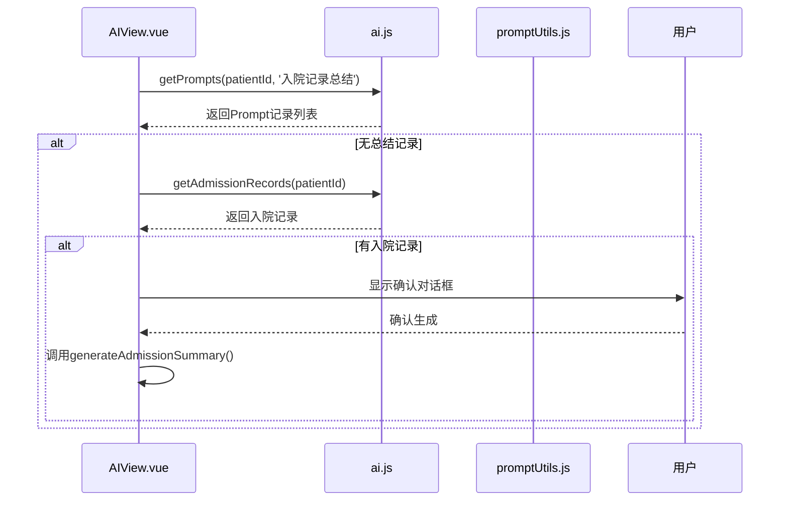
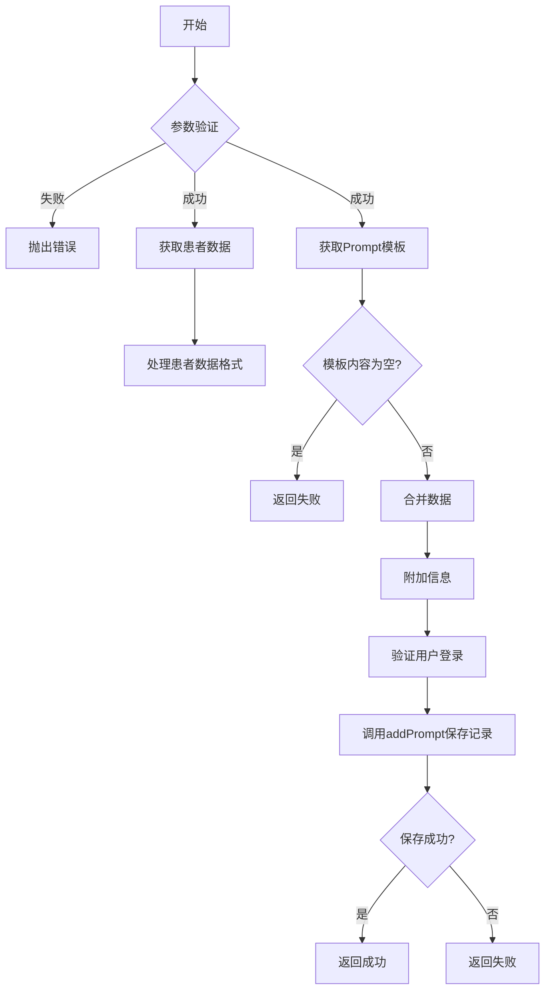
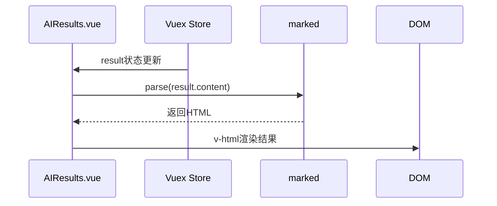
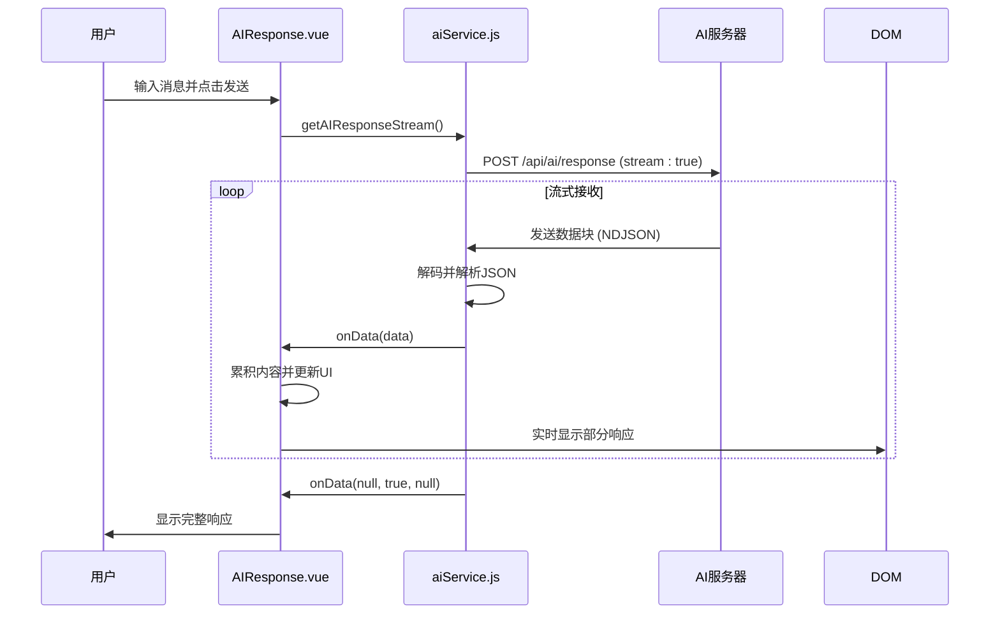
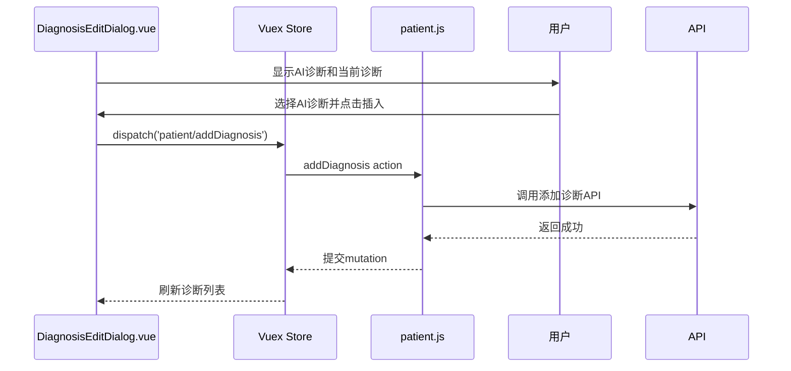

# 核心功能工作流

<cite>
**本文档中引用的文件**
- [AIView.vue](file://src\views\AIView.vue)
- [promptUtils.js](file://src\utils\promptUtils.js)
- [AIResults.vue](file://src\components\ai\AIResults.vue)
- [AIResponse.vue](file://src\components\ai\AIResponse.vue)
- [DiagnosisEditDialog.vue](file://src\components\patient\DiagnosisEditDialog.vue)
- [ai.js](file://src\api\ai.js)
- [aiService.js](file://src\api\aiService.js)
- [ai.js](file://src\store\modules\ai.js)
- [patient.js](file://src\store\modules\patient.js)
</cite>

## 目录
1. [生成入院记录总结工作流](#生成入院记录总结工作流)
2. [AI对话工作流](#ai对话工作流)
3. [添加诊断功能](#添加诊断功能)

## 生成入院记录总结工作流

该工作流实现了从用户触发到AI生成并展示入院记录总结的完整过程，核心涉及`AIView.vue`、`promptUtils.js`和`AIResults.vue`三个组件。

### 触发与检查机制

工作流始于`AIView.vue`组件的`mounted`生命周期钩子，当用户进入AI视图时，会自动调用`checkAdmissionRecords`方法。该方法首先检查当前患者是否存在“入院记录总结”类型的Prompt记录。



**Diagram sources**
- [AIView.vue](file://src\views\AIView.vue#L100-L150)

**Section sources**
- [AIView.vue](file://src\views\AIView.vue#L100-L150)

### 数据协调与模板执行

当用户确认生成总结时，`AIView.vue`调用`promptUtils.js`中的`handlePromptExecution`函数。该函数是整个流程的核心协调器，负责并行获取患者数据和Prompt模板内容。



**Diagram sources**
- [promptUtils.js](file://src\utils\promptUtils.js#L50-L190)

**Section sources**
- [promptUtils.js](file://src\utils\promptUtils.js#L50-L190)

### 结果展示

当AI处理完成后，结果会通过`AIResults.vue`组件展示给用户。该组件通过Vuex store监听`result`状态的变化，并使用`marked`库将Markdown格式的AI回复渲染为HTML。



**Diagram sources**
- [AIResults.vue](file://src\components\ai\AIResults.vue#L100-L150)

**Section sources**
- [AIResults.vue](file://src\components\ai\AIResults.vue#L100-L150)

## AI对话工作流

该工作流实现了与AI模型的实时对话功能，核心特点是消息的流式接收与显示，主要由`AIResponse.vue`和`aiService.js`实现。

### 流式响应处理

`AIResponse.vue`组件在用户发送消息后，调用`getAIResponseWithParams`函数。该函数内部使用`aiService.js`的`getAIResponseStream`方法，通过fetch API的流式读取能力，逐块接收AI的响应。



**Diagram sources**
- [AIResponse.vue](file://src\components\ai\AIResponse.vue#L150-L250)
- [aiService.js](file://src\api\aiService.js#L30-L130)

**Section sources**
- [AIResponse.vue](file://src\components\ai\AIResponse.vue#L150-L250)
- [aiService.js](file://src\api\aiService.js#L30-L130)

## 添加诊断功能

该功能实现了将AI输出的文本诊断转化为结构化诊断条目的过程，涉及`AIResults.vue`、`DiagnosisEditDialog.vue`和`patient.js` store模块。

### 文本提取与结构化

在`AIResults.vue`中，当用户点击“显示列表”按钮时，`showDiagnosisDialog`方法会解析AI回复内容，通过正则表达式提取出诊断名称。

```mermaid
flowchart TD
A[用户点击显示列表] --> B[showDiagnosisDialog]
B --> C{prompt.title包含'诊断分析'?}
C --> |是| D[使用正则表达式提取诊断]
D --> E[/#### 诊断名称: (.+?)(?:\n|$)/]
E --> F[去重并格式化为对象数组]
F --> G[存入aiDiagnosis状态]
C --> |否| H[aiDiagnosis为空]
G --> I[显示DiagnosisEditDialog]
```

**Diagram sources**
- [AIResults.vue](file://src\components\ai\AIResults.vue#L150-L200)

**Section sources**
- [AIResults.vue](file://src\components\ai\AIResults.vue#L150-L200)

### 诊断条目管理

`DiagnosisEditDialog.vue`组件提供了一个双表界面，左侧显示AI提取的诊断，右侧显示患者当前的诊断。用户可以选择AI诊断并点击“插入”按钮，将其添加到患者诊断列表中。



**Diagram sources**
- [DiagnosisEditDialog.vue](file://src\components\patient\DiagnosisEditDialog.vue#L150-L200)
- [patient.js](file://src\store\modules\patient.js)

**Section sources**
- [DiagnosisEditDialog.vue](file://src\components\patient\DiagnosisEditDialog.vue#L150-L200)
- [patient.js](file://src\store\modules\patient.js)