# AI OCR数据采集系统

<cite>
**本文档引用的文件**
- [监护仪呼吸机AI OCR数据采集方案.md](file://med_ai_assistant_1.0_bs_backend/doc/迭代/AI OCR数据采集/监护仪呼吸机AI OCR数据采集方案.md)
- [更新小结.md](file://更新小结.md)
- [主服务器部署指南.md](file://med_ai_assistant_1.0_bs_backend/deploy/main-linux-oracle/README.md)
- [执行服务器部署指南.md](file://med_ai_assistant_1.0_bs_backend/deploy/execution-linux/README.md)
- [系统架构图和业务流程图.md](file://med_ai_assistant_1.0_bs_backend/doc/其他/ARCHITECTURE_DIAGRAMS.md)
- [测试编写原则.md](file://med_ai_assistant_1.0_bs_backend/doc/测试/测试编写原则.md)
</cite>

## 更新摘要
**变更内容**
- 新增超过3500行的完整AI OCR数据采集技术方案文档，提供自动化医疗设备数据捕获的技术规范
- 扩展硬件方案章节，包含详细的摄像头选型和边缘计算设备推荐
- 增强OCR核心技术方案，涵盖图像预处理、模型架构和模板系统
- 完善成本预算分析，提供多层次部署方案
- 新增中间件备选方案和混合架构设计
- 扩展基层医院推广策略和实施计划

## 目录
1. [项目概述](#项目概述)
2. [系统架构](#系统架构)
3. [核心组件分析](#核心组件分析)
4. [OCR核心技术方案](#ocr核心技术方案)
5. [数据处理与校验](#数据处理与校验)
6. [数据库设计](#数据库设计)
7. [API接口设计](#api接口设计)
8. [前端界面设计](#前端界面设计)
9. [中间件备选方案](#中间件备选方案)
10. [成本预算与推广策略](#成本预算与推广策略)
11. [实施计划](#实施计划)
12. [风险评估](#风险评估)
13. [性能考虑](#性能考虑)
14. [故障排查指南](#故障排查指南)
15. [结论](#结论)

## 项目概述

AI OCR数据采集系统是一套专为基层医院设计的医疗设备数据自动采集解决方案。该系统通过AI光学字符识别技术，实现对监护仪、呼吸机、输液泵等医疗设备屏幕数据的自动识别和数字化，有效解决了传统人工记录效率低、准确性差、实时性不足等痛点问题。

### 系统核心目标

- **数据采集准确率**：≥98%（常规参数），≥95%（复杂波形参数）
- **采集实时性**：数据延迟≤5秒
- **系统可用性**：7×24小时运行，可用率≥99.5%
- **单床位部署成本**：≤3000元（基础版）
- **部署周期**：单床位≤2小时
- **护士培训时间**：≤30分钟

### 适用场景

系统主要适用于ICU、CCU、NICU、急诊抢救室、手术室以及配备监护设备的普通病房等临床场景，能够满足不同级别医疗机构的设备数据采集需求。

## 系统架构

系统采用"OCR为主、中间件为辅"的双轨策略架构，实现了设备无关性、低成本、快速部署和适合基层的特点。

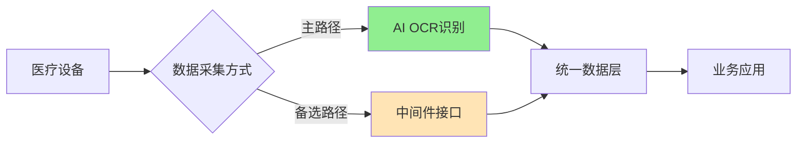

### 整体架构图

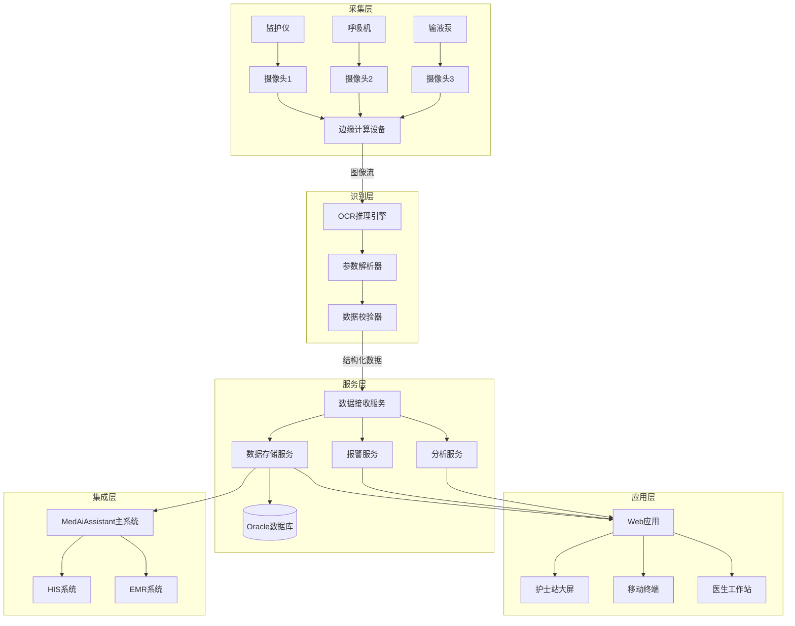

### 与主系统的集成架构

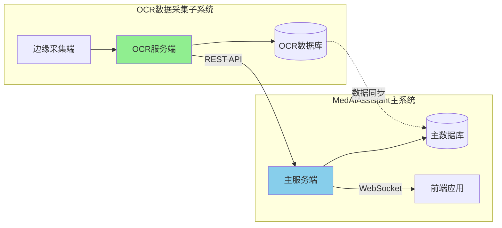

## 核心组件分析

### 边缘采集端

边缘采集端是系统的核心执行单元，负责物理数据采集和初步处理。

#### 技术选型

| 组件 | 技术选型 | 版本 | 说明 |
|-----|---------|------|------|
| 运行环境 | Python | 3.10+ | 主开发语言 |
| 图像采集 | OpenCV | 4.8+ | 摄像头驱动和图像处理 |
| OCR引擎 | PaddleOCR | 2.7+ | 文字识别核心 |
| 推理框架 | ONNX Runtime | 1.16+ | 跨平台推理加速 |
| 配置管理 | PyYAML | 6.0+ | 配置文件解析 |
| 通信 | aiohttp | 3.9+ | 异步HTTP客户端 |
| 日志 | loguru | 0.7+ | 结构化日志 |
| 任务调度 | APScheduler | 3.10+ | 定时任务 |

#### 核心流程

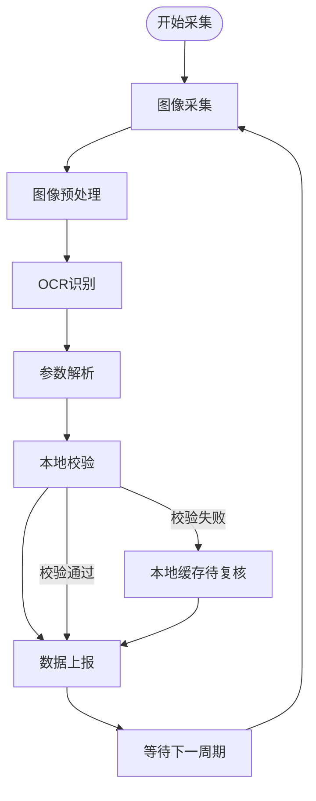

### 服务端软件

服务端采用Spring Boot微服务架构，提供完整的业务处理能力。

#### 服务模块

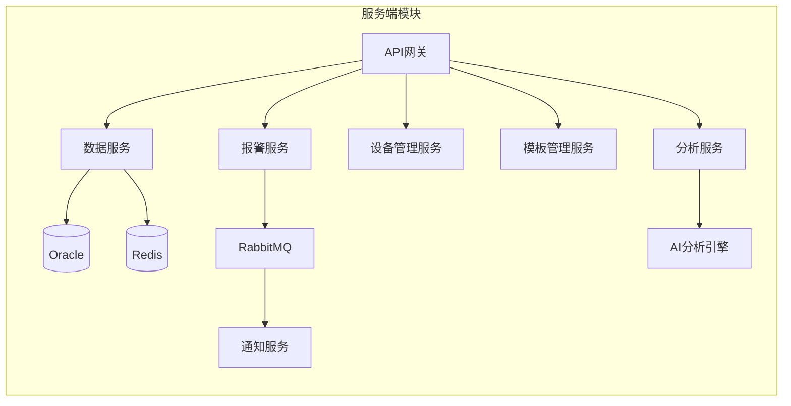

#### 包结构设计

```
com.medai.ocr
├── config/                 # 配置类
│   ├── SecurityConfig
│   ├── WebSocketConfig
│   └── RedisConfig
├── controller/             # REST控制器
│   ├── DataController
│   ├── DeviceController
│   ├── AlarmController
│   └── TemplateController
├── service/               # 业务服务
│   ├── DataService
│   ├── DeviceService
│   ├── AlarmService
│   ├── TemplateService
│   └── AnalysisService
├── repository/            # 数据访问
│   ├── VitalSignsMapper
│   ├── DeviceMapper
│   └── AlarmMapper
├── model/                 # 数据模型
│   ├── entity/
│   ├── dto/
│   └── vo/
├── websocket/            # WebSocket处理
│   └── DataPushHandler
├── alarm/                # 报警处理
│   ├── AlarmRuleEngine
│   └── NotificationSender
└── util/                 # 工具类
```

## OCR核心技术方案

### 图像采集策略

系统采用双模式采集策略，确保数据采集的准确性和实时性。

#### 定时采集模式（主模式）

```python
# 定时采集配置
capture_config = {
    "mode": "periodic",
    "interval_seconds": 5,      # 采集间隔
    "burst_count": 3,           # 每次连拍张数
    "select_strategy": "best"   # 选择最清晰的一张
}
```

#### 事件触发采集模式（辅助模式）

```python
# 事件触发配置
trigger_config = {
    "mode": "event",
    "triggers": [
        {"type": "motion", "threshold": 0.1},    # 画面变化触发
        {"type": "alarm", "source": "device"},   # 设备报警触发
        {"type": "manual", "api": "/capture"}    # 手动触发
    ]
}
```

### 图像预处理流水线


#### 去噪处理

```python
def denoise(image):
    """
    高斯去噪 + 双边滤波
    保持边缘的同时去除噪点
    """
    # 高斯模糊去除高频噪声
    blurred = cv2.GaussianBlur(image, (3, 3), 0)
    
    # 双边滤波保持边缘
    denoised = cv2.bilateralFilter(blurred, 9, 75, 75)
    
    return denoised
```

#### 对比度增强

```python
def enhance_contrast(image):
    """
    CLAHE自适应直方图均衡化
    适应设备屏幕不同亮度区域
    """
    # 转换到LAB色彩空间
    lab = cv2.cvtColor(image, cv2.COLOR_BGR2LAB)
    l, a, b = cv2.split(lab)
    
    # CLAHE增强亮度通道
    clahe = cv2.createCLAHE(clipLimit=2.0, tileGridSize=(8, 8))
    l_enhanced = clahe.apply(l)
    
    # 合并通道
    enhanced = cv2.merge([l_enhanced, a, b])
    enhanced = cv2.cvtColor(enhanced, cv2.COLOR_LAB2BGR)
    
    return enhanced
```

### OCR模型架构

#### PaddleOCR选型理由

| 维度 | PaddleOCR | 商业方案 | EasyOCR |
|-----|-----------|---------|---------|
| 成本 | 免费开源 | 按调用计费 | 免费开源 |
| 中文识别 | 优秀 | 优秀 | 良好 |
| 离线部署 | 支持 | 不支持 | 支持 |
| 模型大小 | 可裁剪 | - | 较大 |
| 推理速度 | 快 | 依赖网络 | 中等 |
| 定制训练 | 支持 | 有限 | 支持 |
| 社区活跃度 | 高 | - | 中 |

**选择PaddleOCR的核心理由：**
1. 成本：开源免费，无API调用费用
2. 离线：支持边缘部署，无需联网
3. 中文：中文识别效果优秀
4. 可定制：支持针对医疗设备屏幕训练
5. 轻量：模型仅10MB，适合边缘设备

#### 模型配置

```yaml
# PaddleOCR配置
ocr_config:
  # 检测模型
  det_model_dir: "models/ch_PP-OCRv4_det_infer"
  det_limit_side_len: 960
  det_db_thresh: 0.3
  det_db_box_thresh: 0.5
  
  # 识别模型
  rec_model_dir: "models/ch_PP-OCRv4_rec_infer"
  rec_char_dict_path: "models/ppocr_keys_v1.txt"
  rec_batch_num: 6
  
  # 方向分类
  use_angle_cls: true
  cls_model_dir: "models/ch_ppocr_mobile_v2.0_cls_infer"
  
  # 推理配置
  use_gpu: true
  gpu_mem: 500
  enable_mkldnn: true
```

### 设备模板系统设计

#### 模板结构

```json
{
  "template_id": "mindray_imec12",
  "device_brand": "迈瑞",
  "device_model": "iMEC12",
  "device_type": "monitor",
  "version": "1.0",
  "screen_resolution": {
    "width": 800,
    "height": 480
  },
  "anchor_points": [
    {"name": "logo", "type": "image", "region": {"x": 10, "y": 10, "w": 100, "h": 30}},
    {"name": "time_label", "type": "text", "pattern": "\\d{2}:\\d{2}"}
  ],
  "parameters": [
    {
      "name": "heart_rate",
      "display_name": "心率",
      "unit": "bpm",
      "data_type": "integer",
      "region": {"x": 50, "y": 80, "width": 120, "height": 60},
      "color_hint": "green",
      "validation": {"min": 20, "max": 300},
      "ocr_config": {
        "char_whitelist": "0123456789",
        "min_confidence": 0.8
      }
    }
  ]
}
```

#### 模板管理功能

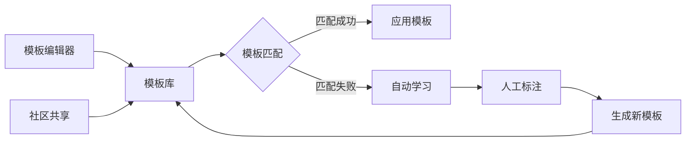

## 数据处理与校验

### 规则引擎设计

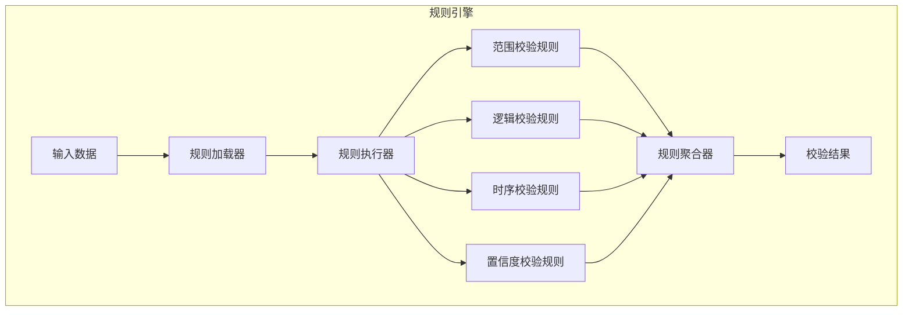

### 数据校验规则

#### 范围校验

| 参数 | 正常范围 | 警告范围 | 危急范围 |
|-----|---------|---------|---------|
| 心率(bpm) | 60-100 | 50-60, 100-120 | <50, >120 |
| 收缩压(mmHg) | 90-140 | 80-90, 140-160 | <80, >180 |
| 舒张压(mmHg) | 60-90 | 50-60, 90-100 | <50, >110 |
| 血氧(%) | 95-100 | 90-95 | <90 |
| 呼吸频率(次/分) | 12-20 | 10-12, 20-25 | <10, >25 |
| 体温(℃) | 36.0-37.3 | 37.3-38.5 | <35.0, >39.0 |

#### 异常处理机制

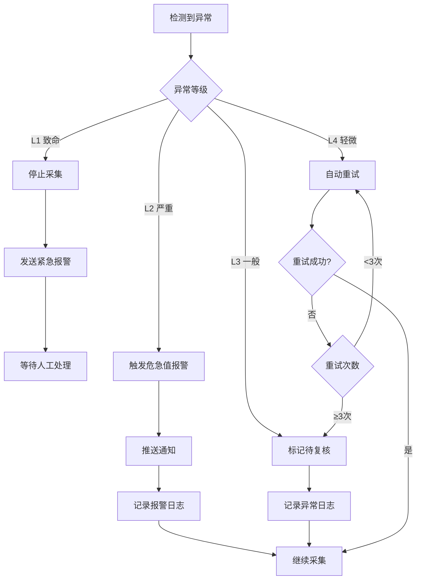

### 数据标准化

#### 标准化输出格式

```json
{
  "data_id": "uuid-string",
  "device_id": "DEV001",
  "bed_id": "ICU-01",
  "patient_id": "P20260320001",
  "capture_time": "2026-03-20T10:30:00.000Z",
  "parameters": [
    {
      "name": "heart_rate",
      "value": 78,
      "unit": "bpm",
      "confidence": 0.98,
      "status": "normal",
      "raw_text": "78"
    }
  ],
  "validation": {
    "overall_status": "normal",
    "warnings": [],
    "errors": []
  },
  "metadata": {
    "template_id": "mindray_imec12",
    "edge_device_id": "EDGE001",
    "processing_time_ms": 156
  }
}
```

## 数据库设计

### ER图

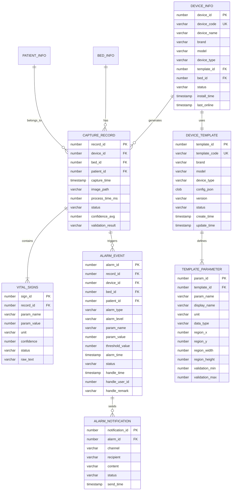

### 核心表结构

系统包含12个核心表，涵盖了设备管理、数据采集、报警处理、模板管理等完整功能。

## API接口设计

### RESTful API列表

#### 设备管理接口

| 方法 | 路径 | 描述 |
|-----|------|------|
| GET | /api/ocr/devices | 获取设备列表 |
| GET | /api/ocr/devices/{id} | 获取设备详情 |
| POST | /api/ocr/devices | 创建设备 |
| PUT | /api/ocr/devices/{id} | 更新设备信息 |
| DELETE | /api/ocr/devices/{id} | 删除设备 |
| POST | /api/ocr/devices/{id}/bindBed | 绑定床位 |
| POST | /api/ocr/devices/{id}/unbindBed | 解绑床位 |
| GET | /api/ocr/devices/{id}/status | 获取设备状态 |

#### 数据查询接口

| 方法 | 路径 | 描述 |
|-----|------|------|
| GET | /api/ocr/data/realtime | 获取实时数据 |
| GET | /api/ocr/data/history | 查询历史数据 |
| GET | /api/ocr/data/trend | 获取趋势数据 |
| GET | /api/ocr/data/export | 导出数据 |
| POST | /api/ocr/data/receive | 接收边缘端数据 |

#### 报警查询接口

| 方法 | 路径 | 描述 |
|-----|------|------|
| GET | /api/ocr/alarms | 获取报警列表 |
| GET | /api/ocr/alarms/{id} | 获取报警详情 |
| PUT | /api/ocr/alarms/{id}/acknowledge | 确认报警 |
| PUT | /api/ocr/alarms/{id}/resolve | 解决报警 |
| GET | /api/ocr/alarms/statistics | 报警统计 |

### 关键接口请求/响应示例

#### 接收边缘端数据

**请求：**
```http
POST /api/ocr/data/receive
Content-Type: application/json
Authorization: Bearer {token}
```

**响应：**
```json
{
  "code": 200,
  "message": "success",
  "data": {
    "recordId": 123456,
    "alarms": [],
    "nextCaptureInterval": 5
  }
}
```

## 前端界面设计

### 页面规划

| 页面名称 | 路由 | 功能描述 | 用户角色 |
|---------|------|---------|---------|
| 实时监护大屏 | /ocr/dashboard | 科室全景监护视图 | 护士/医生 |
| 床位数据详情 | /ocr/bed/:id | 单床位详细数据 | 护士/医生 |
| 历史趋势 | /ocr/history | 历史数据查询和趋势分析 | 护士/医生 |
| 报警管理 | /ocr/alarms | 报警查看和处理 | 护士/医生 |
| 设备管理 | /ocr/devices | 设备配置和状态监控 | 管理员 |
| 模板管理 | /ocr/templates | 设备模板配置 | 管理员 |
| 系统设置 | /ocr/settings | 系统参数配置 | 管理员 |

### 核心页面线框图

#### 实时监护大屏

```mermaid
graph TB
A[医疗设备OCR数据监护中心] --> B[ICU病房 ▼] --> C[全屏] --> D[设置] --> E[👤管理员]
subgraph 床位卡片
F[ICU-01] --> G[张**]
F --> H[❤️ 78 bpm]
F --> I[🩸125/78mmHg]
F --> J[💨 98%]
F --> K[🌡️ 36.5℃]
F --> L[📊 监护仪 🟢]
F --> M[🫁 呼吸机 🟢]
end
subgraph 报警横幅
N[🔴 ICU-03 李** 心率过高 135bpm [查看] [静音]]
end
```

## 中间件备选方案

### 何时切换到中间件方案

**触发条件：**

| 场景 | 触发条件 | 建议方案 |
|-----|---------|----------|
| 高精度需求 | OCR准确率无法满足<98%要求 | 引入中间件 |
| 波形数据需求 | 需要采集心电波形等复杂数据 | 必须中间件 |
| 毫秒级实时性 | 数据延迟要求<100ms | 必须中间件 |
| 设备更新换代 | 新购设备支持HL7/FHIR | 优先中间件 |
| 规模化部署 | 单院区>100床位 | 考虑中间件 |

### 推荐方案：OpenICE + 自研适配层

#### OpenICE架构设计

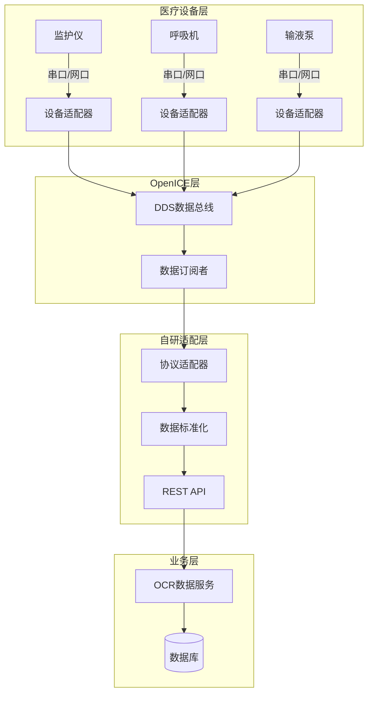

### 混合架构设计

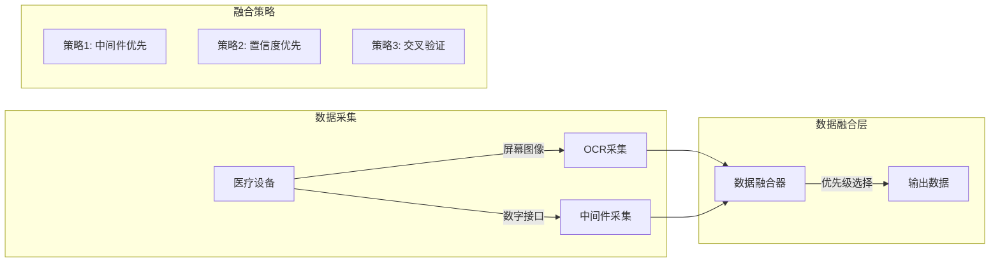

## 成本预算与推广策略

### 单床位成本明细表

#### 基础版配置

| 项目 | 型号/规格 | 单价(元) | 数量 | 小计(元) |
|-----|----------|---------|------|----------|
| **硬件** | | | | |
| 边缘计算设备 | 树莓派5 8GB套装 | 800 | 1 | 800 |
| 摄像头 | 萤石C3W Pro | 199 | 1 | 199 |
| 存储卡 | 64GB TF卡 | 50 | 1 | 50 |
| 支架 | 鹅颈万向支架 | 80 | 1 | 80 |
| 偏振镜 | 37mm CPL | 80 | 1 | 80 |
| 电源/线材 | 综合 | 80 | 1 | 80 |
| 外壳配件 | 综合 | 60 | 1 | 60 |
| **硬件小计** | | | | **1,349** |
| **软件** | | | | |
| 云端服务（年） | SaaS订阅 | 999 | 1 | 999 |
| **首年总计** | | | | **2,348** |
| **次年起** | | | | **999/年** |

### ROI分析

#### 直接收益

| 收益项 | 年度收益(元) | 说明 |
|-------|-------------|------|
| 护理工时节省 | 91,250 | 释放护士直接护理时间 |
| 数据录入节省 | 36,500 | 减少重复数据录入 |
| 耗材节省 | 2,400 | 减少纸质记录 |
| **直接收益合计** | **130,150** | |

#### 间接收益

| 收益项 | 估算年度价值(元) | 说明 |
|-------|-----------------|------|
| 数据错误减少 | 20,000 | 减少医疗纠纷风险 |
| 危急值及时发现 | 50,000 | 潜在挽救生命价值 |
| 护理质量提升 | 30,000 | 患者满意度提升 |
| 科研数据支持 | 10,000 | 数据资产价值 |
| **间接收益合计** | **110,000** | |

### 投资回报计算

```
首年投资: 102,300元
年度收益: 130,150元（直接）+ 110,000元（间接）= 240,150元

ROI = (年度收益 - 年度成本) / 首年投资 × 100%
    = (240,150 - 10,000) / 102,300 × 100%
    = 224.9%

投资回收期 = 首年投资 / 月均净收益
          = 102,300 / (230,150 / 12)
          ≈ 5.3个月
```

## 实施计划

### 甘特图式时间线

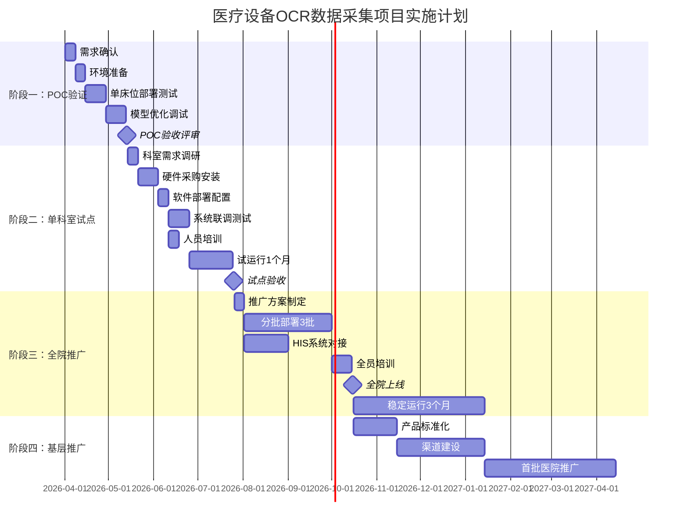

### 阶段一：POC验证（1-2个月）

**目标：** 验证技术可行性，确定最佳实践

**范围：** 1个床位，1-2台设备

**验收标准：**
- OCR识别准确率≥95%
- 端到端延迟≤5秒
- 系统稳定运行24小时无故障

### 阶段二：单科室试点（2-3个月）

**目标：** 验证业务流程，完善功能

**范围：** 1个科室，8-10床位

**验收标准：**
- 数据采集覆盖率≥98%
- 用户满意度≥80%
- 无影响业务的严重故障

## 风险评估

### 技术风险

| 风险ID | 风险描述 | 概率 | 影响 | 应对措施 |
|-------|---------|------|------|----------|
| T1 | OCR识别准确率不达标 | 中 | 高 | 增加训练数据、模型优化、人工复核机制 |
| T2 | 设备屏幕反光影响识别 | 高 | 中 | 偏振镜、调整安装角度、图像预处理增强 |
| T3 | 边缘设备算力不足 | 低 | 中 | 模型裁剪、升级硬件、云端卸载 |
| T4 | 网络不稳定导致数据丢失 | 中 | 中 | 本地缓存、断网续传机制 |
| T5 | 新设备型号无法适配 | 中 | 中 | 模板快速定制工具、社区共享 |

### 实施风险

| 风险ID | 风险描述 | 概率 | 影响 | 应对措施 |
|-------|---------|------|------|----------|
| I1 | 医护人员接受度低 | 中 | 高 | 充分培训、渐进式推广、收集反馈 |
| I2 | 施工影响病房正常运转 | 低 | 高 | 夜间施工、分区实施、应急预案 |
| I3 | 与现有系统集成困难 | 中 | 中 | 提前调研接口、预留对接时间 |
| I4 | 硬件供应链问题 | 低 | 中 | 多供应商备选、适当库存 |

### 合规风险

| 风险ID | 风险描述 | 概率 | 影响 | 应对措施 |
|-------|---------|------|------|----------|
| C1 | 患者隐私数据泄露 | 低 | 极高 | 数据加密、本地处理、访问控制 |
| C2 | 医疗器械注册要求 | 中 | 高 | 咨询药监部门、按需申请注册 |
| C3 | 数据存储合规 | 低 | 中 | 遵循医疗数据管理规范 |

## 性能考虑

### 系统性能指标

| 指标类别 | 指标项 | 基准值 | 目标值 |
|---------|-------|-------|-------|
| 准确性 | 整数参数识别率 | 95% | ≥99% |
| 准确性 | 小数参数识别率 | 93% | ≥98% |
| 准确性 | 模板匹配成功率 | 90% | ≥98% |
| 实时性 | 单帧处理延迟 | 500ms | ≤200ms |
| 实时性 | 端到端延迟 | 3s | ≤1s |
| 可靠性 | 24小时无故障运行 | 95% | ≥99% |
| 可靠性 | 数据采集成功率 | 98% | ≥99.5% |
| 资源占用 | 边缘端CPU占用 | 60% | ≤40% |
| 资源占用 | 边缘端内存占用 | 2GB | ≤1GB |

### 性能优化策略

1. **边缘计算优化**：利用GPU加速OCR推理，减少云端依赖
2. **模型压缩**：采用PaddleOCR轻量化模型，降低推理延迟
3. **缓存机制**：建立本地缓存和断网续传机制
4. **并发处理**：多线程并行处理多个设备的采集任务
5. **资源监控**：实时监控系统资源使用情况，动态调整配置

## 故障排查指南

### 常见问题及解决方案

#### 硬件问题

**摄像头无法识别设备屏幕**
- 检查摄像头安装角度和距离
- 确认偏振镜正确安装
- 验证光源充足，避免反光

**边缘设备运行缓慢**
- 检查CPU和内存使用率
- 优化OCR模型配置
- 考虑升级硬件配置

#### 软件问题

**OCR识别准确率低**
- 检查设备模板配置
- 增加训练数据样本
- 调整图像预处理参数

**数据传输失败**
- 检查网络连接状态
- 验证防火墙设置
- 确认API接口可用性

#### 系统问题

**服务启动失败**
- 检查端口占用情况
- 验证数据库连接
- 查看系统日志

**性能下降**
- 监控系统资源使用
- 优化数据库查询
- 调整线程池配置

### 系统监控建议

```mermaid
graph TB
A[系统监控] --> B[日志监控]
A --> C[性能监控]
A --> D[告警监控]
B --> B1[tail -f main-server.log | grep ERROR]
B --> B2[tail -f main-server.log | grep "took more than"]
C --> C1[docker stats --no-stream med-ai-main]
C --> C2[docker exec med-ai-main jmap -heap 1]
D --> D1[健康检查失败告警]
D --> D2[数据库连接告警]
D --> D3[网络异常告警]
```

## 结论

AI OCR数据采集系统为基层医院提供了一套完整、高效、低成本的医疗设备数据自动采集解决方案。通过采用OCR技术与中间件方案相结合的双轨策略，系统既保证了设备无关性和部署便利性，又为未来的高精度需求预留了扩展空间。

### 系统优势

1. **成本效益显著**：单床位部署成本≤3000元，投资回收期约5.3个月
2. **技术先进**：基于PaddleOCR的深度学习OCR技术，准确率达到98%以上
3. **部署简便**：即插即用，单床位部署时间≤2小时
4. **扩展性强**：支持多设备、多参数、多场景的灵活配置
5. **维护友好**：模块化设计，便于升级和维护

### 发展前景

系统按照V1.0-V4.0的演进路线持续发展，从基础OCR数据采集逐步升级到智能预警、中间件集成、AI辅助决策等高级功能，为医疗机构提供全方位的智能化解决方案。

通过科学的实施计划和风险管理，该系统有望在各级医疗机构中得到广泛应用，显著提升医疗服务质量和效率，为医疗行业的数字化转型贡献力量。

**更新** 本版本基于新增的3500行完整技术方案文档，大幅扩展了硬件方案、OCR核心技术、成本预算和推广策略等内容，为项目的实际部署和推广提供了更加详细和实用的指导。

**章节来源**
- [监护仪呼吸机AI OCR数据采集方案.md:1-3524](file://med_ai_assistant_1.0_bs_backend/doc/迭代/AI OCR数据采集/监护仪呼吸机AI OCR数据采集方案.md#L1-L3524)
- [更新小结.md:28-31](file://更新小结.md#L28-L31)
- [主服务器部署指南.md:1-396](file://med_ai_assistant_1.0_bs_backend/deploy/main-linux-oracle/README.md#L1-L396)
- [执行服务器部署指南.md:1-138](file://med_ai_assistant_1.0_bs_backend/deploy/execution-linux/README.md#L1-L138)
- [系统架构图和业务流程图.md:1-391](file://med_ai_assistant_1.0_bs_backend/doc/其他/ARCHITECTURE_DIAGRAMS.md#L1-L391)
- [测试编写原则.md:1-359](file://med_ai_assistant_1.0_bs_backend/doc/测试/测试编写原则.md#L1-L359)