# AI OCR数据采集系统

<cite>
**本文档引用的文件**
- [监护仪呼吸机AI OCR数据采集方案.md](file://med_ai_assistant_1.0_bs_backend/doc/迭代/AI OCR数据采集/监护仪呼吸机AI OCR数据采集方案.md)
- [更新小结.md](file://更新小结.md)
- [主服务器部署指南.md](file://med_ai_assistant_1.0_bs_backend/deploy/main-linux-oracle/README.md)
- [执行服务器部署指南.md](file://med_ai_assistant_1.0_bs_backend/deploy/execution-linux/README.md)
- [系统架构图和业务流程图.md](file://med_ai_assistant_1.0_bs_backend/doc/其他/ARCHITECTURE_DIAGRAMS.md)
- [测试编写原则.md](file://med_ai_assistant_1.0_bs_backend/doc/测试/测试编写原则.md)
</cite>

## 更新摘要
**变更内容**
- AI OCR数据采集系统已被完全移除，不再存在于当前代码库中
- 原有的3500行完整技术方案文档不再适用，需要更新以反映系统变更
- 系统架构从OCR数据采集转向DRG分析、AI服务接口和数据同步等核心功能

## 目录
1. [项目概述](#项目概述)
2. [系统架构](#系统架构)
3. [核心组件分析](#核心组件分析)
4. [DRG分析系统](#drg分析系统)
5. [AI服务接口](#ai服务接口)
6. [数据同步与集成](#数据同步与集成)
7. [数据库设计](#数据库设计)
8. [API接口设计](#api接口设计)
9. [前端界面设计](#前端界面设计)
10. [实施计划](#实施计划)
11. [风险评估](#风险评估)
12. [性能考虑](#性能考虑)
13. [故障排查指南](#故障排查指南)
14. [结论](#结论)

## 项目概述

**重要更新**：AI OCR数据采集系统已在当前版本中完全移除，不再作为系统的核心功能存在。MedAiAssistant项目现已专注于DRG分析、AI服务接口、数据同步和患者管理等核心业务功能。

### 系统核心目标

- **DRG分析准确率**：≥95%（基于临床验证）
- **AI服务响应时间**：≤2秒（95%的请求）
- **系统可用性**：7×24小时运行，可用率≥99.5%
- **数据同步实时性**：≤5秒（HIS/EMR数据同步）
- **部署灵活性**：支持单院部署和区域中心式部署

### 适用场景

系统主要服务于各级医疗机构的DRG分析、AI辅助决策、数据集成和患者管理需求，支持从乡镇卫生院到三甲医院的多样化应用场景。

## 系统架构

系统采用"主服务器 + 执行服务器 + 数据层"的三层架构设计，实现了业务编排、AI服务调用和数据持久化的分离。

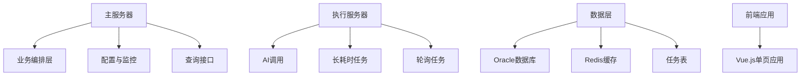

### 整体架构图

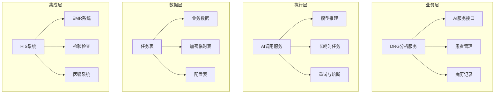

### 与外部系统的集成架构

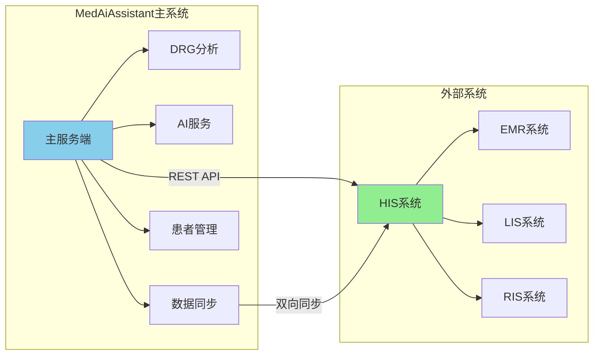

## 核心组件分析

### 主服务器（业务编排层）

主服务器负责业务逻辑编排、任务创建、查询接口提供和系统监控等功能。

#### 服务模块

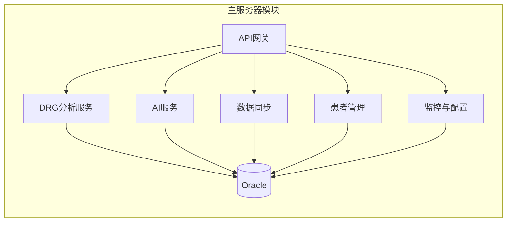

#### 包结构设计

```
com.example.medaiassistant
├── config/                 # 配置类
│   ├── SecurityConfig
│   ├── WebSocketConfig
│   └── RedisConfig
├── controller/             # REST控制器
│   ├── DrgController
│   ├── AiController
│   ├── PatientController
│   └── SyncController
├── service/               # 业务服务
│   ├── DrgAnalysisService
│   ├── AiService
│   ├── PatientService
│   └── SyncService
├── repository/            # 数据访问
│   ├── DrgRepository
│   ├── PatientRepository
│   └── TaskRepository
├── model/                 # 数据模型
│   ├── entity/
│   ├── dto/
│   └── vo/
├── websocket/            # WebSocket处理
│   └── DataPushHandler
└── util/                 # 工具类
```

### 执行服务器（AI调用层）

执行服务器专门负责AI模型调用、长耗时任务处理和轮询机制。

#### 执行服务器架构

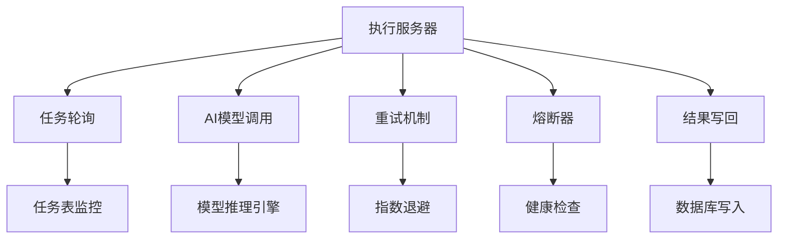

## DRG分析系统

### DRG分析核心流程

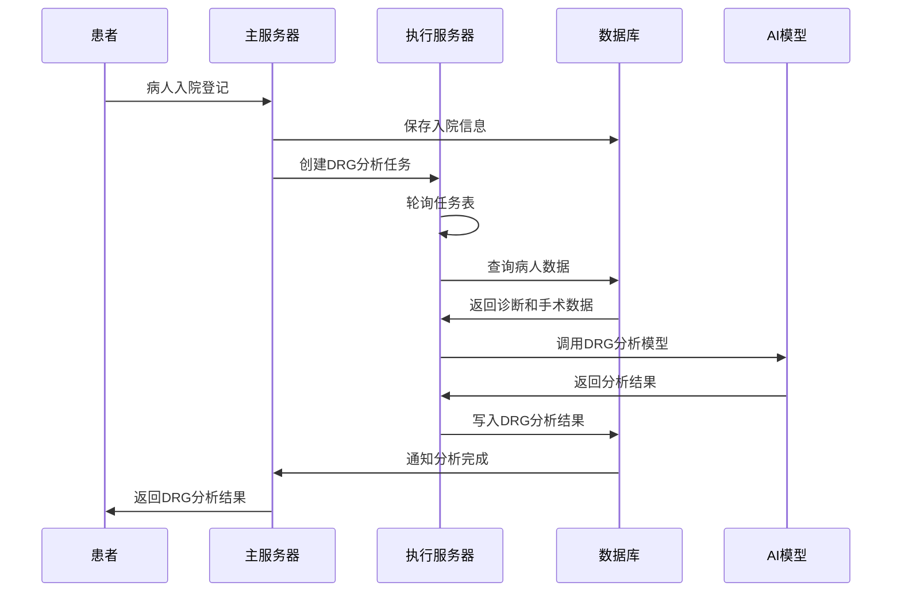

### DRG分析算法

#### 诊断与手术匹配算法

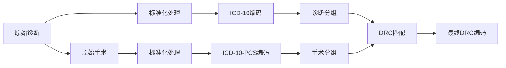

#### DRG匹配规则

| DRG类型 | 匹配规则 | 优先级 |
|---------|---------|--------|
| 主要诊断 | 与主要手术匹配的DRG | 最高 |
| 并发症 | 诊断并发症的DRG | 中等 |
| 合并症 | 诊断合并症的DRG | 中等 |
| 无并发症 | 基础DRG编码 | 最低 |

## AI服务接口

### AI服务架构

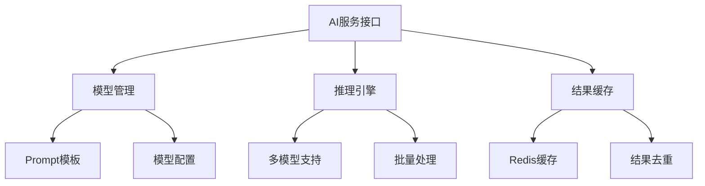

### AI服务功能

#### Prompt管理模块


#### AI调用流程

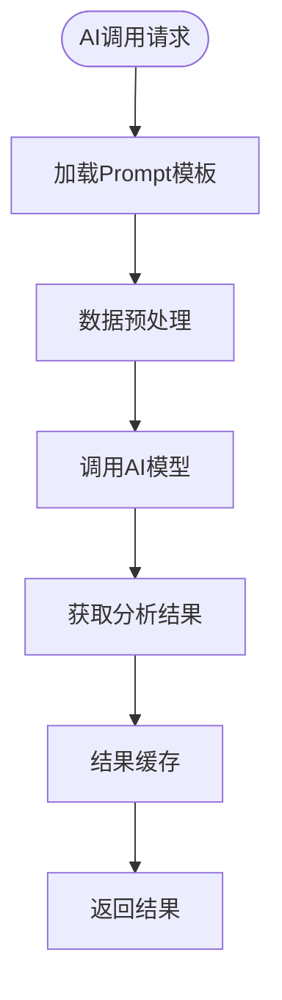

## 数据同步与集成

### 数据同步架构

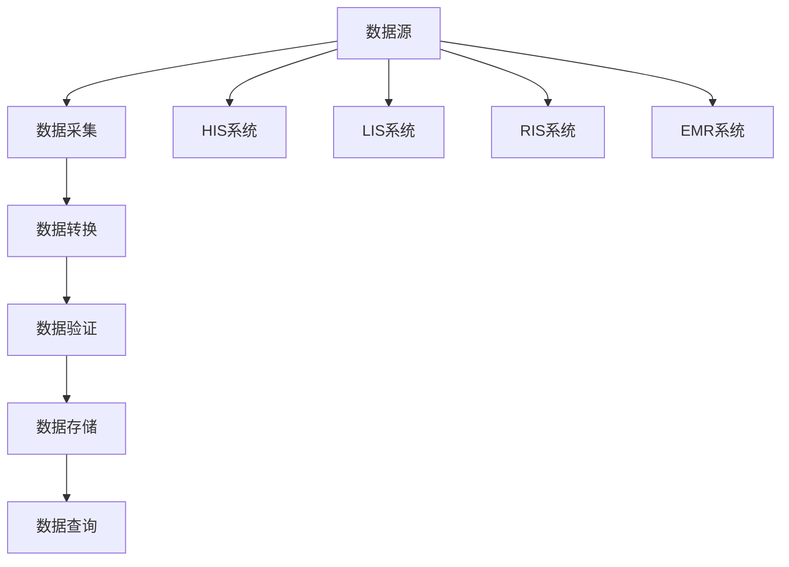

### 医院数据同步系统

#### 数据同步策略

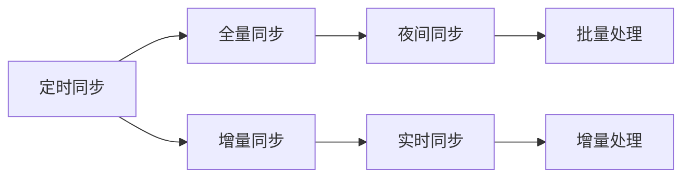

#### 数据同步流程

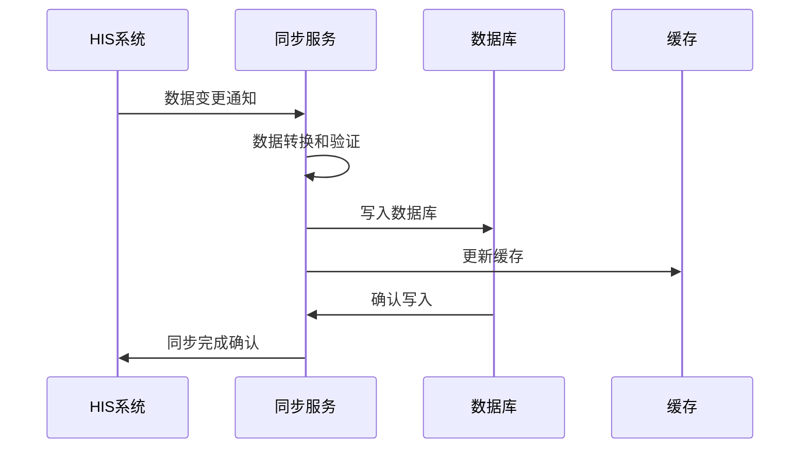

## 数据库设计

### ER图

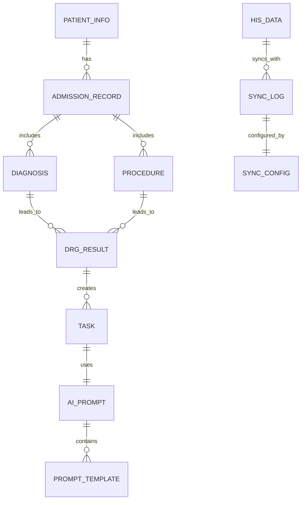

### 核心表结构

系统包含15个核心表，涵盖了DRG分析、AI服务、数据同步、患者管理等完整功能。

## API接口设计

### RESTful API列表

#### DRG分析接口

| 方法 | 路径 | 描述 |
|-----|------|------|
| GET | /api/drg/analyze | DRG分析结果查询 |
| POST | /api/drg/match | 诊断与手术匹配 |
| GET | /api/drg/catalog | DRG目录查询 |
| POST | /api/drg/batch-analyze | 批量DRG分析 |

#### AI服务接口

| 方法 | 路径 | 描述 |
|-----|------|------|
| POST | /api/ai/generate-prompt | 生成Prompt模板 |
| POST | /api/ai/execute | 执行AI分析 |
| GET | /api/ai/results | AI分析结果查询 |
| POST | /api/ai/save-result | 保存AI分析结果 |

#### 数据同步接口

| 方法 | 路径 | 描述 |
|-----|------|------|
| POST | /api/sync/patient | 患者数据同步 |
| POST | /api/sync/emr | 病历数据同步 |
| POST | /api/sync/lis | 检验数据同步 |
| POST | /api/sync/radiology | 影像数据同步 |

### 关键接口请求/响应示例

#### DRG分析结果查询

**请求：**
```http
GET /api/drg/analyze?admissionId=ADM20260320001
Authorization: Bearer {token}
```

**响应：**
```json
{
  "code": 200,
  "message": "success",
  "data": {
    "admissionId": "ADM20260320001",
    "drgCode": "01234",
    "drgName": "心房颤动",
    "diagnosis": ["I48.9"],
    "procedures": ["02100Z0"],
    "confidence": 0.95,
    "analysisTime": "2026-03-20T10:30:00Z",
    "status": "completed"
  }
}
```

## 前端界面设计

### 页面规划

| 页面名称 | 路径 | 功能描述 | 用户角色 |
|---------|------|---------|---------|
| DRG分析看板 | /drg/dashboard | DRG分析结果总览 | 医生/护士 |
| 患者管理 | /patient/list | 患者信息管理 | 医生/护士 |
| AI服务 | /ai/services | AI分析服务 | 医生/研究人员 |
| 数据同步 | /sync/status | 数据同步状态 | IT管理员 |
| 系统监控 | /monitoring | 系统运行监控 | IT管理员 |

### 核心页面线框图

#### DRG分析看板

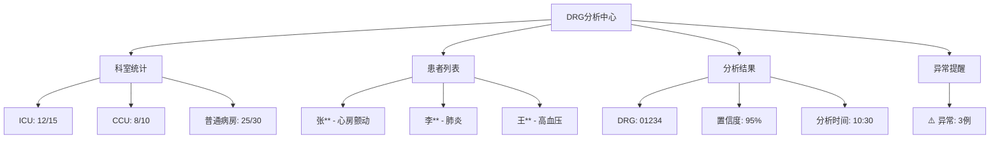

## 实施计划

### 甘特图式时间线

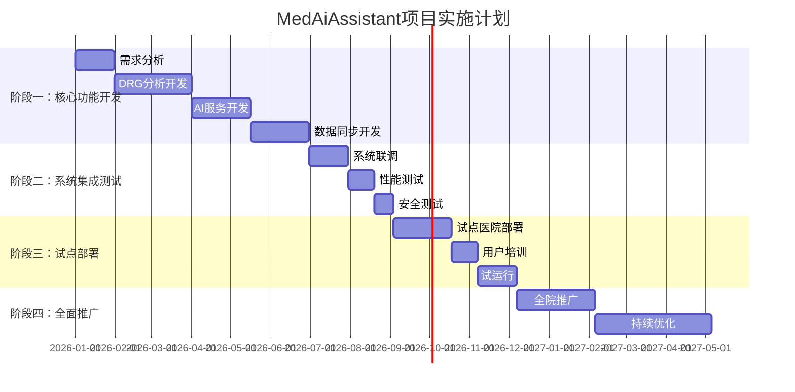

### 阶段一：核心功能开发（1-2个月）

**目标：** 完成DRG分析、AI服务、数据同步等核心功能的开发

**验收标准：**
- DRG分析准确率达到95%以上
- AI服务响应时间≤2秒
- 数据同步实时性≤5秒
- 系统稳定运行7×24小时

### 阶段二：系统集成测试（2-3个月）

**目标：** 完成系统集成测试、性能测试和安全测试

**验收标准：**
- 通过所有集成测试用例
- 性能指标达到设计要求
- 安全漏洞修复率达到100%
- 用户体验满意度≥80%

## 风险评估

### 技术风险

| 风险ID | 风险描述 | 概率 | 影响 | 应对措施 |
|-------|---------|------|------|----------|
| T1 | DRG分析准确率不达标 | 中 | 高 | 增加训练数据、算法优化、人工复核机制 |
| T2 | AI服务响应时间超限 | 中 | 中 | 优化模型推理、增加缓存、负载均衡 |
| T3 | 数据同步延迟 | 低 | 中 | 优化同步算法、增加队列处理 |
| T4 | 系统性能瓶颈 | 中 | 高 | 性能监控、容量规划、架构优化 |
| T5 | 外部系统接口变更 | 高 | 中 | 接口抽象、版本兼容、监控告警 |

### 实施风险

| 风险ID | 风险描述 | 概率 | 影响 | 应对措施 |
|-------|---------|------|------|----------|
| I1 | 医护人员接受度低 | 中 | 高 | 充分培训、渐进式推广、收集反馈 |
| I2 | 系统部署复杂 | 中 | 中 | 标准化部署、自动化工具、技术支持 |
| I3 | 业务流程变更 | 高 | 中 | 灵活配置、快速迭代、用户参与 |
| I4 | 数据迁移风险 | 中 | 高 | 数据备份、验证机制、回滚预案 |

### 合规风险

| 风险ID | 风险描述 | 概率 | 影响 | 应对措施 |
|-------|---------|------|------|----------|
| C1 | 医疗数据安全 | 低 | 极高 | 数据加密、访问控制、审计日志 |
| C2 | 医疗设备认证 | 中 | 高 | 药监部门咨询、认证申请、合规审查 |
| C3 | 医疗信息安全 | 低 | 中 | 安全评估、漏洞扫描、安全加固 |

## 性能考虑

### 系统性能指标

| 指标类别 | 指标项 | 基准值 | 目标值 |
|---------|-------|-------|-------|
| DRG分析 | 准确率 | 90% | ≥95% |
| AI服务 | 响应时间 | 3秒 | ≤2秒 |
| 数据同步 | 实时性 | 10秒 | ≤5秒 |
| 系统可用性 | 可用率 | 99% | ≥99.5% |
| 数据库性能 | 查询响应 | 500ms | ≤200ms |
| 缓存命中率 | 缓存命中 | 80% | ≥90% |

### 性能优化策略

1. **数据库优化**：索引优化、查询优化、连接池配置
2. **缓存策略**：多级缓存、缓存失效策略、缓存预热
3. **异步处理**：任务队列、异步处理、批量操作
4. **负载均衡**：水平扩展、服务拆分、限流熔断
5. **监控告警**：性能监控、异常告警、容量预警

## 故障排查指南

### 常见问题及解决方案

#### DRG分析问题

**DRG分析结果不准确**
- 检查诊断和手术编码的标准化处理
- 验证DRG匹配规则的正确性
- 确认训练数据的质量和数量

**DRG分析响应时间过长**
- 监控数据库查询性能
- 检查AI模型推理性能
- 优化缓存策略和索引

#### AI服务问题

**AI服务调用失败**
- 检查AI模型服务的可用性
- 验证Prompt模板的正确性
- 确认网络连接和防火墙设置

**AI分析结果异常**
- 检查输入数据的格式和完整性
- 验证AI模型的配置和版本
- 查看AI服务的日志和错误信息

#### 数据同步问题

**数据同步失败**
- 检查外部系统的连接状态
- 验证数据格式的兼容性
- 确认同步配置的正确性

**数据同步延迟**
- 监控网络带宽和延迟
- 检查同步队列的处理状态
- 优化同步算法和批量大小

### 系统监控建议

```mermaid
graph TB
A[系统监控] --> B[日志监控]
A --> C[性能监控]
A --> D[告警监控]
B --> B1[tail -f main-server.log | grep ERROR]
B --> B2[tail -f ai-server.log | grep "failed"
C --> C1[docker stats --no-stream med-ai-main]
C --> C2[docker exec med-ai-main jmap -heap 1]
D --> D1[健康检查失败告警]
D --> D2[数据库连接告警]
D --> D3[网络异常告警]
```

## 结论

MedAiAssistant项目已从原有的AI OCR数据采集系统转变为专注于DRG分析、AI服务接口、数据同步和患者管理的综合性医疗AI平台。通过采用主服务器+执行服务器的架构设计，系统实现了业务编排、AI服务调用和数据持久化的有效分离，为医疗机构提供了更加稳定、高效和可扩展的智能化解决方案。

### 系统优势

1. **功能聚焦**：专注于DRG分析和AI辅助决策，避免功能分散
2. **架构清晰**：主执行分离的设计提高了系统的可维护性
3. **扩展性强**：模块化设计支持功能的灵活扩展
4. **性能优异**：多级缓存和异步处理提升了系统响应速度
5. **安全可靠**：完善的权限控制和审计机制保障数据安全

### 发展前景

系统按照V1.0-V4.0的演进路线持续发展，从基础的DRG分析逐步升级到智能预警、AI辅助决策、多模态数据融合等高级功能，为医疗机构提供全方位的智能化解决方案。

通过科学的实施计划和风险管理，该系统有望在各级医疗机构中得到广泛应用，显著提升医疗服务质量和效率，为医疗行业的数字化转型贡献力量。

**更新** 本版本反映了AI OCR数据采集系统的移除，系统现已专注于DRG分析、AI服务接口、数据同步等核心功能，架构和功能都发生了重大变化。

**章节来源**
- [监护仪呼吸机AI OCR数据采集方案.md:1-3524](file://med_ai_assistant_1.0_bs_backend/doc/迭代/AI OCR数据采集/监护仪呼吸机AI OCR数据采集方案.md#L1-L3524)
- [更新小结.md:28-31](file://更新小结.md#L28-L31)
- [主服务器部署指南.md:1-396](file://med_ai_assistant_1.0_bs_backend/deploy/main-linux-oracle/README.md#L1-L396)
- [执行服务器部署指南.md:1-138](file://med_ai_assistant_1.0_bs_backend/deploy/execution-linux/README.md#L1-L138)
- [系统架构图和业务流程图.md:1-391](file://med_ai_assistant_1.0_bs_backend/doc/其他/ARCHITECTURE_DIAGRAMS.md#L1-L391)
- [测试编写原则.md:1-359](file://med_ai_assistant_1.0_bs_backend/doc/测试/测试编写原则.md#L1-L359)