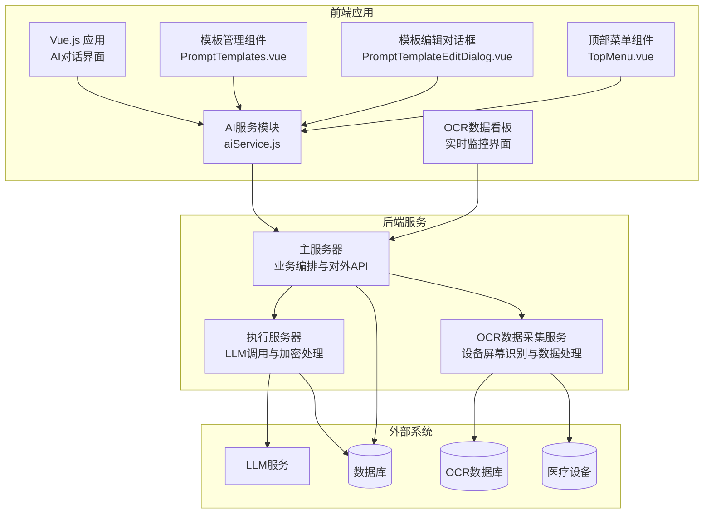
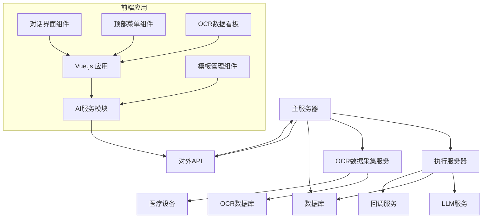
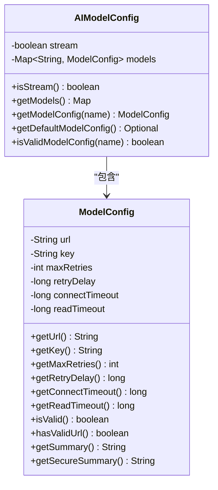
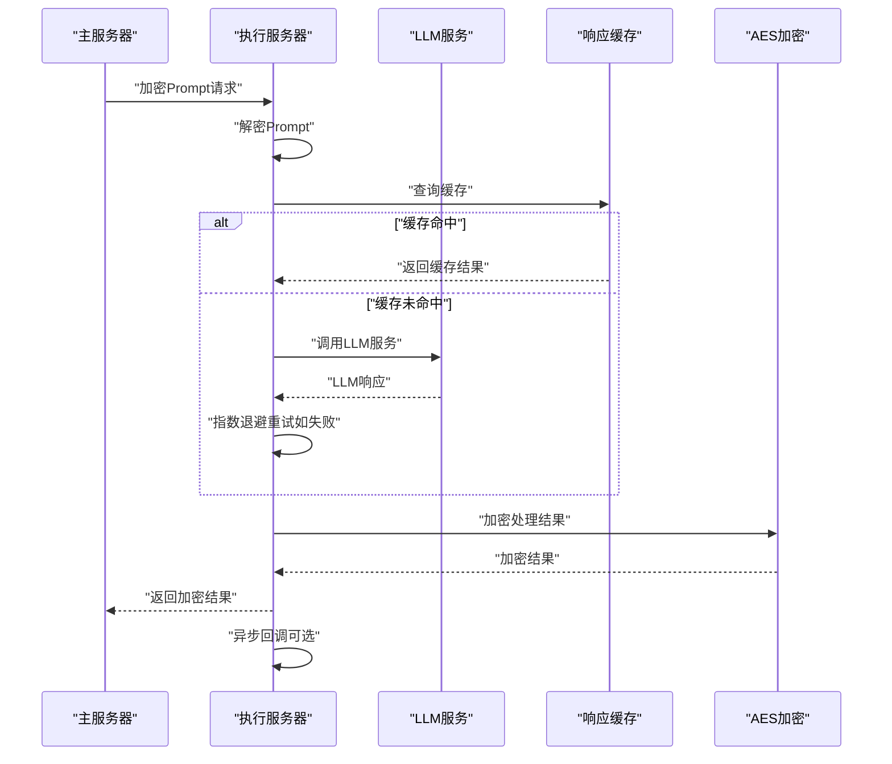
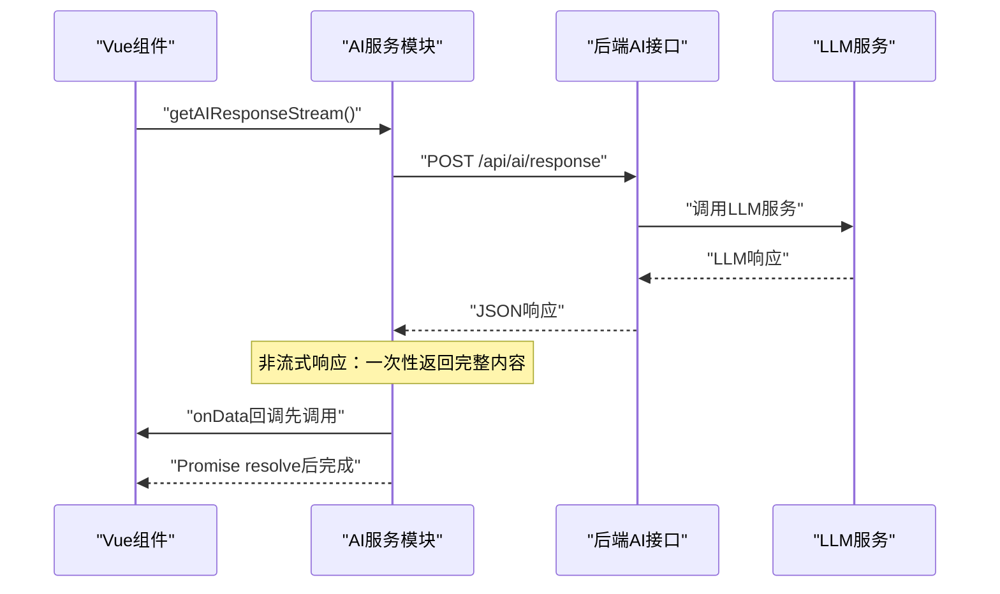
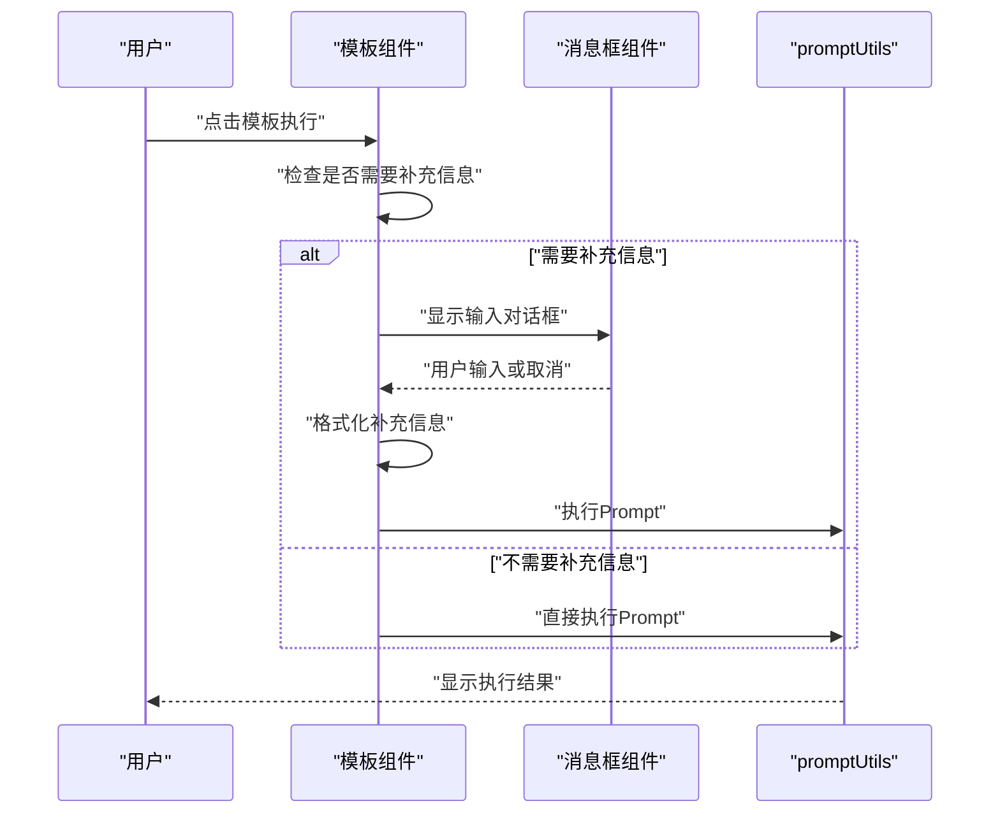
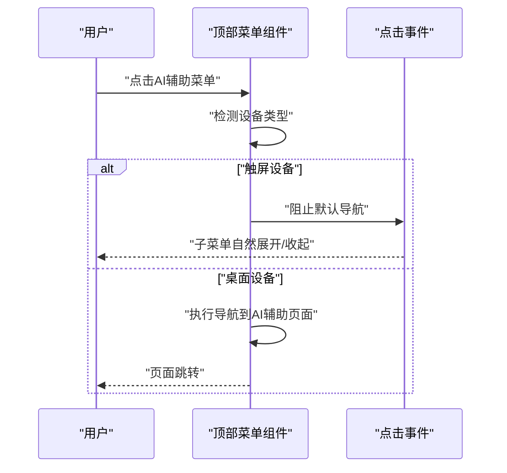
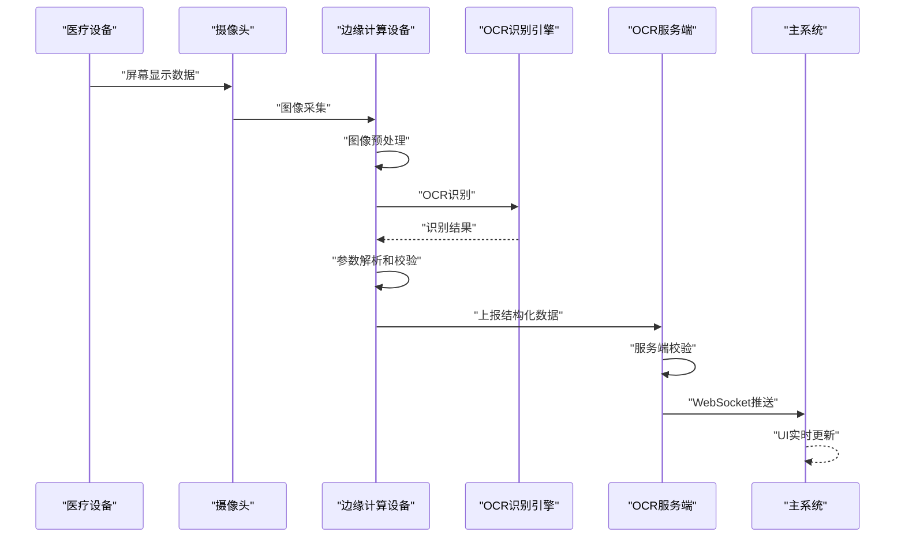
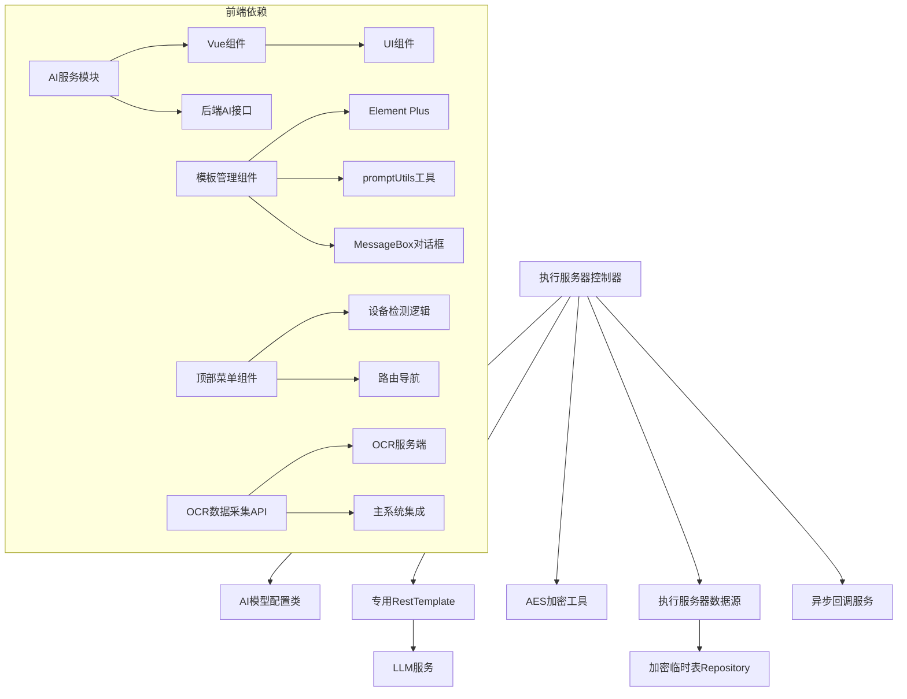

# AI诊断辅助系统

<cite>
**本文引用的文件**
- [执行服务器LLM调用优化敏捷迭代规划.md](file://med_ai_assistant_1.0_bs_backend/doc/其他/执行服务器LLM调用优化敏捷迭代规划.md)
- [API文档.md](file://med_ai_assistant_1.0_bs_backend/doc/其他/API_DOCUMENTATION.md)
- [AI模型配置类.java](file://med_ai_assistant_1.0_bs_backend/src/main/java/com/example/medaiassistant/config/AIModelConfig.java)
- [执行服务器控制器.java](file://med_ai_assistant_1.0_bs_backend/src/main/java/com/example/medaiassistant/controller/ExecutionServerController.java)
- [系统架构图.md](file://med_ai_assistant_1.0_bs_backend/doc/其他/ARCHITECTURE_DIAGRAMS.md)
- [AI响应接口网络中断后连接失败问题分析与解决方案.md](file://med_ai_assistant_1.0_bs_backend/doc/其他/AI响应接口网络中断后连接失败问题分析与解决方案.md)
- [执行服务器架构简化实施报告.md](file://med_ai_assistant_1.0_bs_backend/doc/其他/执行服务器架构简化实施报告.md)
- [执行服务器性能优化方案.md](file://med_ai_assistant_1.0_bs_backend/doc/其他/执行服务器性能优化方案.md)
- [application.properties](file://med_ai_assistant_1.0_bs_backend/src/main/resources/application.properties)
- [aiService.js](file://med_ai_assistant_1.0_bs_vue/src/api/aiService.js)
- [2026-03-24更新日志.md](file://med_ai_assistant_1.0_bs/更新小结.md)
- [2026-03-23更新日志.md](file://med_ai_assistant_1.0_bs/更新小结.md)
- [2026-03-21更新日志.md](file://med_ai_assistant_1.0_bs/更新小结.md)
- [2026-03-20更新日志.md](file://med_ai_assistant_1.0_bs/更新小结.md)
- [2026-03-08更新日志.md](file://med_ai_assistant_1.0_bs/更新小结.md)
- [PromptTemplates.vue](file://med_ai_assistant_1.0_bs_vue/src/components/ai/PromptTemplates.vue)
- [PromptTemplateEditDialog.vue](file://med_ai_assistant_1.0_bs_vue/src/components/ai/PromptTemplateEditDialog.vue)
- [PromptList.vue](file://med_ai_assistant_1.0_bs_vue/src/components/ai/PromptList.vue)
- [PromptExecutor.vue](file://med_ai_assistant_1.0_bs_vue/src/components/server/PromptExecutor.vue)
- [promptUtils.js](file://med_ai_assistant_1.0_bs_vue/src/utils/promptUtils.js)
- [TopMenu.vue](file://med_ai_assistant_1.0_bs_vue/src/components/TopMenu.vue)
- [监护仪呼吸机AI OCR数据采集方案.md](file://med_ai_assistant_1.0_bs_backend/doc/迭代/AI OCR数据采集/监护仪呼吸机AI OCR数据采集方案.md)
</cite>

## 更新摘要
**变更内容**
- 修复Android平板界面问题：解决"AI辅助"子菜单点击后立即收起的问题，新增触屏/桌面设备差异化交互逻辑
- 增强AI OCR数据采集系统：新增监护仪呼吸机AI OCR数据采集完整技术方案，支持设备屏幕自动识别和数据数字化
- 优化模板管理组件：完善补充信息输入对话框功能，支持"请会诊记录"和"日常对话"模板的上下文信息收集
- 改进UI显示时序：优化非流式响应模式下的回调时序，确保AI对话内容能够及时显示在界面上
- 新增设备差异化交互：通过检测触摸设备能力，智能区分触屏和桌面设备的菜单交互行为
- **新增AI OCR数据采集系统完整技术方案**：涵盖硬件选型、软件架构、OCR核心技术、数据处理与校验、数据库设计、API接口设计、前端界面设计等

## 目录
1. [简介](#简介)
2. [项目结构](#项目结构)
3. [核心组件](#核心组件)
4. [架构总览](#架构总览)
5. [详细组件分析](#详细组件分析)
6. [依赖关系分析](#依赖关系分析)
7. [性能考虑](#性能考虑)
8. [故障排查指南](#故障排查指南)
9. [结论](#结论)
10. [附录](#附录)

## 简介
本文件面向AI诊断辅助系统，系统采用"主服务器 + 执行服务器"的双层架构：主服务器负责业务编排、数据聚合与对外API，执行服务器专注于高时延LLM调用与加密处理。系统通过专用RestTemplate优化LLM超时配置、实现指数退避重试、完善错误分类与恢复策略，并提供性能监控与统计接口，确保在复杂医疗文本分析场景下的稳定性与可靠性。

**最新更新** 新增Android平板界面修复和AI OCR数据采集系统功能增强，包括触屏/桌面设备差异化交互逻辑、UI显示时序优化、模板管理组件的补充信息输入功能等。**AI OCR数据采集系统作为全新的核心功能模块，为医疗设备数据的自动采集和数字化提供了完整的解决方案。**

## 项目结构
项目采用多模块/多文档组织方式，核心后端位于 `med_ai_assistant_1.0_bs_backend` 目录，前端位于 `med_ai_assistant_1.0_bs_vue` 目录，包含：
- 配置与控制器：AI模型配置类、执行服务器控制器等
- 前端AI服务：aiService.js提供统一的AI服务调用接口
- 模板管理：PromptTemplates.vue、PromptTemplateEditDialog.vue等模板管理组件
- 文档：API文档、架构图、性能优化与问题分析报告
- 部署与测试：部署说明、自动化构建配置、测试脚本等
- **AI OCR数据采集**：监护仪呼吸机AI OCR数据采集完整技术方案

**图表来源**
- [执行服务器LLM调用优化敏捷迭代规划.md:140-161](file://med_ai_assistant_1.0_bs_backend/doc/其他/执行服务器LLM调用优化敏捷迭代规划.md#L140-L161)
- [API文档.md:192-493](file://med_ai_assistant_1.0_bs_backend/doc/其他/API_DOCUMENTATION.md#L192-L493)
- [监护仪呼吸机AI OCR数据采集方案.md:375-416](file://med_ai_assistant_1.0_bs_backend/doc/迭代/AI OCR数据采集/监护仪呼吸机AI OCR数据采集方案.md#L375-L416)

**章节来源**
- [执行服务器LLM调用优化敏捷迭代规划.md:1-136](file://med_ai_assistant_1.0_bs_backend/doc/其他/执行服务器LLM调用优化敏捷迭代规划.md#L1-L136)
- [API文档.md:1-100](file://med_ai_assistant_1.0_bs_backend/doc/其他/API_DOCUMENTATION.md#L1-L100)

## 核心组件
- AI模型配置类：统一管理多个AI模型的端点、密钥、超时与重试参数，提供配置校验与默认模型选择。
- 执行服务器控制器：负责接收加密Prompt、解密、调用LLM、加密结果、异步回调与性能统计。
- 专用RestTemplate：针对LLM调用优化连接池、超时与请求配置，降低超时与连接耗尽风险。
- 响应缓存：对相同Prompt进行缓存，减少重复LLM调用，提升吞吐与稳定性。
- 错误分类与恢复：区分网络超时、服务端错误与未知异常，结合指数退避重试与告警机制。
- **前端AI服务模块**：提供统一的AI服务调用接口，支持Promise和回调两种模式，优化非流式响应处理时序。
- **模板管理组件**：提供Prompt模板的树形展示、编辑、删除等功能，支持补充信息输入对话框。
- **模板编辑对话框**：支持模板的创建、编辑、删除操作，包含完整的表单验证和数据管理。
- **顶部菜单组件**：支持触屏/桌面设备差异化交互，修复Android平板上的菜单点击问题。
- **AI OCR数据采集系统**：实现医疗设备屏幕的自动OCR识别和数据数字化处理，支持多品牌设备的参数提取。

**最新更新** 新增触屏/桌面设备差异化交互逻辑和AI OCR数据采集系统，显著提升了系统的兼容性和功能性。

**章节来源**
- [AI模型配置类.java:29-398](file://med_ai_assistant_1.0_bs_backend/src/main/java/com/example/medaiassistant/config/AIModelConfig.java#L29-L398)
- [执行服务器控制器.java:84-403](file://med_ai_assistant_1.0_bs_backend/src/main/java/com/example/medaiassistant/controller/ExecutionServerController.java#L84-L403)
- [执行服务器LLM调用优化敏捷迭代规划.md:139-225](file://med_ai_assistant_1.0_bs_backend/doc/其他/执行服务器LLM调用优化敏捷迭代规划.md#L139-L225)
- [aiService.js:1-280](file://med_ai_assistant_1.0_bs_vue/src/api/aiService.js#L1-L280)
- [PromptTemplates.vue:26-31](file://med_ai_assistant_1.0_bs_vue/src/components/ai/PromptTemplates.vue#L26-L31)
- [PromptTemplateEditDialog.vue:144-453](file://med_ai_assistant_1.0_bs_vue/src/components/ai/PromptTemplateEditDialog.vue#L144-L453)
- [TopMenu.vue:314-326](file://med_ai_assistant_1.0_bs_vue/src/components/TopMenu.vue#L314-L326)
- [监护仪呼吸机AI OCR数据采集方案.md:1-800](file://med_ai_assistant_1.0_bs_backend/doc/迭代/AI OCR数据采集/监护仪呼吸机AI OCR数据采集方案.md#L1-L800)

## 架构总览
系统采用"主服务器 + 执行服务器"协作模式：
- 主服务器：聚合患者数据、生成Prompt、调度执行服务器、提供对外API。
- 执行服务器：专注LLM调用与加密处理，支持轮询模式与回调机制，具备完善的监控与统计。
- **前端应用**：通过AI服务模块统一调用后端AI接口，提供用户友好的对话界面和模板管理功能。
- **AI OCR数据采集系统**：独立的OCR识别服务，专门处理医疗设备屏幕数据的自动采集和数字化，与主系统通过REST API和WebSocket集成。

**图表来源**
- [执行服务器LLM调用优化敏捷迭代规划.md:141-161](file://med_ai_assistant_1.0_bs_backend/doc/其他/执行服务器LLM调用优化敏捷迭代规划.md#L141-L161)
- [API文档.md:192-493](file://med_ai_assistant_1.0_bs_backend/doc/其他/API_DOCUMENTATION.md#L192-L493)
- [监护仪呼吸机AI OCR数据采集方案.md:375-416](file://med_ai_assistant_1.0_bs_backend/doc/迭代/AI OCR数据采集/监护仪呼吸机AI OCR数据采集方案.md#L375-L416)

## 详细组件分析

### AI模型配置组件
- 设计要点
  - 以模型名为键的配置映射，支持多模型并行
  - 每个模型包含URL、密钥、连接/读取超时、最大重试次数、初始重试延迟
  - 提供配置有效性校验、默认模型选择与安全摘要
- 关键接口
  - 获取模型配置：按模型名检索
  - 校验配置：URL格式、必填字段完整性
  - 默认模型：优先返回常用模型，否则返回首个有效配置

**图表来源**
- [AI模型配置类.java:29-398](file://med_ai_assistant_1.0_bs_backend/src/main/java/com/example/medaiassistant/config/AIModelConfig.java#L29-L398)

**章节来源**
- [AI模型配置类.java:29-398](file://med_ai_assistant_1.0_bs_backend/src/main/java/com/example/medaiassistant/config/AIModelConfig.java#L29-L398)

### 执行服务器控制器（LLM调用与处理）
- 设计要点
  - 专用RestTemplate：连接池、超时与Keep-Alive策略优化
  - LLM调用：集成重试机制（指数退避+抖动），错误分类与恢复
  - 数据处理：解密 -> Prompt分析 -> 加密 -> 回调
  - 监控统计：调用次数、成功率、响应时间分布、重试统计
- 关键流程

**图表来源**
- [执行服务器控制器.java:400-470](file://med_ai_assistant_1.0_bs_backend/src/main/java/com/example/medaiassistant/controller/ExecutionServerController.java#L400-L470)
- [执行服务器控制器.java:781-884](file://med_ai_assistant_1.0_bs_backend/src/main/java/com/example/medaiassistant/controller/ExecutionServerController.java#L781-L884)
- [执行服务器LLM调用优化敏捷迭代规划.md:229-281](file://med_ai_assistant_1.0_bs_backend/doc/其他/执行服务器LLM调用优化敏捷迭代规划.md#L229-L281)

**章节来源**
- [执行服务器控制器.java:400-470](file://med_ai_assistant_1.0_bs_backend/src/main/java/com/example/medaiassistant/controller/ExecutionServerController.java#L400-L470)
- [执行服务器控制器.java:781-884](file://med_ai_assistant_1.0_bs_backend/src/main/java/com/example/medaiassistant/controller/ExecutionServerController.java#L781-L884)
- [执行服务器LLM调用优化敏捷迭代规划.md:229-281](file://med_ai_assistant_1.0_bs_backend/doc/其他/执行服务器LLM调用优化敏捷迭代规划.md#L229-L281)

### 前端AI服务模块（时序优化）
- 设计要点
  - 提供统一的AI服务调用接口，支持Promise和回调两种模式
  - 优化非流式响应处理时序，确保UI能够及时接收数据
  - 完善错误处理机制，支持字符串和对象形式的错误信息
  - 保留方法名向后兼容性，实际采用非流式请求模式
- 关键流程

**最新更新** 修复了非流式响应模式下的回调时序问题，确保UI能够在Promise resolve之前接收到数据。

**图表来源**
- [aiService.js:110-170](file://med_ai_assistant_1.0_bs_vue/src/api/aiService.js#L110-L170)
- [aiService.js:229-279](file://med_ai_assistant_1.0_bs_vue/src/api/aiService.js#L229-L279)

**章节来源**
- [aiService.js:110-170](file://med_ai_assistant_1.0_bs_vue/src/api/aiService.js#L110-L170)
- [aiService.js:229-279](file://med_ai_assistant_1.0_bs_vue/src/api/aiService.js#L229-L279)

### 模板管理组件（补充信息输入功能）
- 设计要点
  - 支持Prompt模板的树形展示和分类管理
  - 新增补充信息输入对话框功能，针对特定模板提供额外上下文
  - 动态处理用户输入的补充信息，将其注入到执行选项中
  - 完善用户交互体验，提供灵活的上下文信息收集
- 关键特性
  - 模板常量定义：`TEMPLATES_REQUIRING_ADDITIONAL_INFO = ['请会诊记录', '日常对话']`
  - 弹窗输入：使用Element Plus的MessageBox.prompt组件
  - 信息处理：将补充信息格式化为`AdditionalInfo`字段
  - 状态管理：支持跳过输入和关闭对话框的操作

**最新更新** 新增补充信息输入对话框功能，显著提升了用户在使用特定模板时的上下文信息提供能力。

**图表来源**
- [PromptTemplates.vue:106-131](file://med_ai_assistant_1.0_bs_vue/src/components/ai/PromptTemplates.vue#L106-L131)
- [PromptTemplates.vue:149-152](file://med_ai_assistant_1.0_bs_vue/src/components/ai/PromptTemplates.vue#L149-L152)

**章节来源**
- [PromptTemplates.vue:26-31](file://med_ai_assistant_1.0_bs_vue/src/components/ai/PromptTemplates.vue#L26-L31)
- [PromptTemplates.vue:86-174](file://med_ai_assistant_1.0_bs_vue/src/components/ai/PromptTemplates.vue#L86-L174)

### 模板编辑对话框（完整管理功能）
- 设计要点
  - 提供完整的模板编辑界面，支持创建、编辑、删除操作
  - 包含多标签页的表单结构，支持不同类型的模板配置
  - 集成数据类型、过滤规则、作用范围等高级配置选项
  - 实现模板树形结构的可视化展示和管理
- 关键功能
  - 模板树形展示：支持模板类型分组和层级管理
  - 表单验证：完整的字段验证和错误处理机制
  - 数据同步：实时刷新模板列表和状态管理
  - 权限控制：根据用户权限显示不同的操作选项

**章节来源**
- [PromptTemplateEditDialog.vue:144-453](file://med_ai_assistant_1.0_bs_vue/src/components/ai/PromptTemplateEditDialog.vue#L144-L453)

### 顶部菜单组件（触屏/桌面差异化交互）
- 设计要点
  - 检测设备是否支持触摸功能，智能区分触屏和桌面设备
  - 触屏设备：AI辅助子菜单点击时不触发导航，让子菜单自然展开/收起
  - 桌面设备：AI辅助子菜单点击时直接导航到AI辅助页面
  - 支持小屏模式切换，适配7-8英寸设备
- 关键特性
  - 设备检测：`'ontouchstart' in window || navigator.maxTouchPoints > 0`
  - 事件处理：根据设备类型执行不同的菜单交互逻辑
  - 用户体验：避免Android平板上的菜单点击问题

**最新更新** 新增触屏/桌面设备差异化交互逻辑，修复Android平板上的菜单点击问题。

**图表来源**
- [TopMenu.vue:314-326](file://med_ai_assistant_1.0_bs_vue/src/components/TopMenu.vue#L314-L326)

**章节来源**
- [TopMenu.vue:314-326](file://med_ai_assistant_1.0_bs_vue/src/components/TopMenu.vue#L314-L326)

### AI OCR数据采集系统
- 设计要点
  - 独立的OCR识别服务，专门处理医疗设备屏幕数据
  - 支持多品牌医疗设备（监护仪、呼吸机、输液泵等）
  - 提供设备模板管理系统，支持自学习和社区共享
  - 实现实时数据推送和历史数据查询功能
- 关键特性
  - OCR识别：基于PaddleOCR的文字识别技术
  - 数据校验：规则引擎进行数据有效性检查
  - 报警机制：危急值自动检测和通知推送
  - 集成接口：与主系统通过REST API和WebSocket集成

**最新更新** 新增完整的AI OCR数据采集系统，支持医疗设备屏幕的自动识别和数据数字化。

**图表来源**
- [监护仪呼吸机AI OCR数据采集方案.md:417-454](file://med_ai_assistant_1.0_bs_backend/doc/迭代/AI OCR数据采集/监护仪呼吸机AI OCR数据采集方案.md#L417-L454)

**章节来源**
- [监护仪呼吸机AI OCR数据采集方案.md:1-800](file://med_ai_assistant_1.0_bs_backend/doc/迭代/AI OCR数据采集/监护仪呼吸机AI OCR数据采集方案.md#L1-L800)

### 数据预处理与结果后处理
- 预处理
  - 解密：从数据库读取AES密钥与盐值，解密Base64加密的Prompt
  - 缓存：基于Prompt内容生成缓存键，命中则直接返回
  - 补充信息：处理用户提供的额外上下文信息
- 推理过程
  - 调用LLM服务，支持流式与非流式响应
  - 指数退避重试，避免网络波动与服务异常导致的失败
- 后处理
  - 加密：将LLM结果进行AES加密
  - 回调：异步通知主服务器处理完成
  - 统计：记录调用次数、成功率、响应时间与错误类型

**图表来源**
- [执行服务器控制器.java:781-884](file://med_ai_assistant_1.0_bs_backend/src/main/java/com/example/medaiassistant/controller/ExecutionServerController.java#L781-L884)
- [执行服务器LLM调用优化敏捷迭代规划.md:229-281](file://med_ai_assistant_1.0_bs_backend/doc/其他/执行服务器LLM调用优化敏捷迭代规划.md#L229-L281)

**章节来源**
- [执行服务器控制器.java:781-884](file://med_ai_assistant_1.0_bs_backend/src/main/java/com/example/medaiassistant/controller/ExecutionServerController.java#L781-L884)

### API与调用方式
- AI分析服务
  - 获取患者综合信息：聚合基本信息、诊断、病历、长期/临时医嘱、化验与检查结果
  - 保存对话历史：记录用户与AI的交互
  - 流式AI响应：SSE流式返回，支持心跳与错误事件
  - 非流式AI响应：一次性返回推理过程与最终结果
  - AI参数：支持温度、最大token、top_p、频率惩罚、存在惩罚、生成数量、停止符、用户标识等
  - 健康检查：检查AI模型服务状态
- 调用示例
  - 流式调用：POST `/api/ai/stream-response-post`，Content-Type: application/json
  - 非流式调用：POST `/api/ai/response`，请求体包含model与messages
  - 健康检查：GET `/api/health/ai-status`
- **模板管理API**
  - 获取模板列表：GET `/api/ai/promptTemplates`
  - 获取模板详情：GET `/api/ai/promptTemplate`
  - 创建模板：POST `/api/ai/prompt-templates`
  - 更新模板：PUT `/api/ai/prompt-templates/{templateId}`
  - 删除模板：DELETE `/api/ai/prompt-templates/{templateId}`
- **OCR数据采集API**
  - 设备注册：POST `/api/ocr/devices`
  - 数据上报：POST `/api/ocr/data`
  - 模板管理：GET/POST/PUT `/api/ocr/templates`
  - 实时数据：GET `/api/ocr/live-data`

**章节来源**
- [API文档.md:192-493](file://med_ai_assistant_1.0_bs_backend/doc/其他/API_DOCUMENTATION.md#L192-L493)
- [API文档.md:494-590](file://med_ai_assistant_1.0_bs_backend/doc/其他/API_DOCUMENTATION.md#L494-L590)

## 依赖关系分析
- 组件耦合
  - 执行服务器控制器依赖AI模型配置类、专用RestTemplate、加密工具与回调服务
  - 与数据库交互通过执行服务器专用数据源与临时表Repository
  - **前端AI服务模块**依赖Vue.js组件和后端AI接口
  - **模板管理组件**依赖Element Plus UI组件和promptUtils工具
  - **顶部菜单组件**依赖设备检测逻辑和路由导航
  - **OCR数据采集系统**独立部署，通过API与主系统集成
- 外部依赖
  - LLM服务：通过RestTemplate调用，需配置URL与密钥
  - 数据库：存储加密临时数据、配置与回调记录
  - Element Plus：提供UI组件和对话框功能
  - PaddleOCR：提供医疗设备屏幕的OCR识别能力
- 潜在风险
  - LLM服务不稳定：通过熔断器与重试缓解
  - 连接池耗尽：通过专用连接池与超时配置控制
  - 配置冲突：通过隔离配置与向后兼容策略解决
  - **UI显示时序问题**：通过优化回调时序解决非流式响应显示问题
  - **模板执行异常**：通过补充信息输入验证和错误处理机制解决
  - **设备兼容性问题**：通过触屏/桌面差异化交互解决Android平板菜单问题
  - **OCR识别准确性**：通过模板管理和规则引擎保证数据质量

**图表来源**
- [执行服务器控制器.java:84-145](file://med_ai_assistant_1.0_bs_backend/src/main/java/com/example/medaiassistant/controller/ExecutionServerController.java#L84-L145)
- [AI模型配置类.java:29-68](file://med_ai_assistant_1.0_bs_backend/src/main/java/com/example/medaiassistant/config/AIModelConfig.java#L29-L68)
- [aiService.js:9-178](file://med_ai_assistant_1.0_bs_vue/src/api/aiService.js#L9-L178)
- [PromptTemplates.vue:22-24](file://med_ai_assistant_1.0_bs_vue/src/components/ai/PromptTemplates.vue#L22-L24)
- [TopMenu.vue:314-326](file://med_ai_assistant_1.0_bs_vue/src/components/TopMenu.vue#L314-L326)

**章节来源**
- [执行服务器控制器.java:84-145](file://med_ai_assistant_1.0_bs_backend/src/main/java/com/example/medaiassistant/controller/ExecutionServerController.java#L84-L145)
- [AI模型配置类.java:29-68](file://med_ai_assistant_1.0_bs_backend/src/main/java/com/example/medaiassistant/config/AIModelConfig.java#L29-L68)
- [aiService.js:9-178](file://med_ai_assistant_1.0_bs_vue/src/api/aiService.js#L9-L178)
- [PromptTemplates.vue:22-24](file://med_ai_assistant_1.0_bs_vue/src/components/ai/PromptTemplates.vue#L22-L24)
- [TopMenu.vue:314-326](file://med_ai_assistant_1.0_bs_vue/src/components/TopMenu.vue#L314-L326)

## 性能考虑
- 连接池与超时
  - 专用RestTemplate：连接超时60秒，读取超时10分钟，连接池最大50，每路由10
  - 避免默认超时导致的频繁超时与连接耗尽
- 重试策略
  - 指数退避（1秒、2秒、4秒）+ 随机抖动，避免雷群效应
  - 最多重试3次，失败后返回结构化错误信息
- 缓存与统计
  - 响应缓存：对相同Prompt复用LLM结果，降低延迟与成本
  - 性能统计：成功率、平均响应时间、错误类型分布、重试次数
- 监控与告警
  - 实时监控：调用成功率、响应时间阈值告警
  - 历史分析：每日趋势、错误模式分析，指导配置调优
- **UI性能优化**
  - **非流式响应时序优化**：确保回调在Promise resolve之前执行，避免UI显示延迟
  - **错误处理优化**：支持字符串和对象形式的错误信息，提升错误信息可读性
  - **模板执行优化**：补充信息输入对话框的异步处理，避免阻塞主界面
  - **设备适配优化**：触屏/桌面差异化交互，提升移动端用户体验
- **模板管理性能**
  - **树形结构渲染**：优化大量模板的渲染性能
  - **表单验证**：实时验证用户输入，减少无效提交
  - **状态管理**：高效的组件状态更新和同步机制
- **OCR系统性能**
  - **边缘计算优化**：GPU加速OCR推理，提升识别速度
  - **模板匹配优化**：基于锚点特征的快速模板识别
  - **数据流优化**：异步处理和批量上传，减少网络延迟
  - **缓存策略**：本地缓存和断网续传，保证数据完整性

**最新更新** 新增触屏/桌面设备差异化交互和AI OCR数据采集系统的性能优化措施。

**章节来源**
- [执行服务器LLM调用优化敏捷迭代规划.md:361-430](file://med_ai_assistant_1.0_bs_backend/doc/其他/执行服务器LLM调用优化敏捷迭代规划.md#L361-L430)
- [执行服务器LLM调用优化敏捷迭代规划.md:229-281](file://med_ai_assistant_1.0_bs_backend/doc/其他/执行服务器LLM调用优化敏捷迭代规划.md#L229-L281)
- [2026-03-21更新日志.md:1-21](file://med_ai_assistant_1.0_bs/更新小结.md#L1-L21)
- [监护仪呼吸机AI OCR数据采集方案.md:1340-1352](file://med_ai_assistant_1.0_bs_backend/doc/迭代/AI OCR数据采集/监护仪呼吸机AI OCR数据采集方案.md#L1340-L1352)

## 故障排查指南
- 常见问题
  - LLM调用超时：确认专用RestTemplate配置与连接池参数
  - 网络中断后连接失败：检查连接Keep-Alive与请求超时设置
  - 错误分类不准确：完善异常捕获与错误类型映射
  - **AI对话UI无内容显示**：检查非流式响应回调时序是否正确
  - **模板补充信息输入异常**：检查Element Plus对话框组件的配置和事件处理
  - **模板管理功能失效**：验证模板树形结构渲染和表单验证逻辑
  - **Android平板菜单点击问题**：检查触屏设备检测逻辑和事件处理
  - **OCR识别失败**：验证设备模板配置和图像预处理参数
- 排查步骤
  - 查看LLM调用统计接口，确认成功率与响应时间
  - 检查应用配置文件中的LLM专用参数
  - 验证AI模型配置的有效性与URL可达性
  - 观察回调状态与异步处理日志
  - **检查前端AI服务模块的回调时序**：确认onData回调在Promise resolve之前执行
  - **验证模板组件的补充信息处理**：检查ElMessageBox.prompt的配置和事件监听
  - **测试模板编辑对话框功能**：确认表单验证和数据同步机制
  - **验证设备检测逻辑**：检查'ontouchstart'检测和maxTouchPoints判断
  - **测试OCR数据采集流程**：验证图像采集、OCR识别和数据上报
  - **检查OCR模板匹配**：确认设备模板配置和参数区域定位
- 相关文档
  - AI响应接口网络中断后连接失败问题分析与解决方案
  - 执行服务器架构简化实施报告
  - 执行服务器性能优化方案
  - **AI对话UI无内容显示问题修复说明**
  - **模板管理组件功能实现指南**
  - **Android平板菜单交互问题解决方案**
  - **AI OCR数据采集系统技术方案**

**最新更新** 新增Android平板菜单交互问题和AI OCR数据采集系统的故障排查指南。

**章节来源**
- [AI响应接口网络中断后连接失败问题分析与解决方案.md](file://med_ai_assistant_1.0_bs_backend/doc/其他/AI响应接口网络中断后连接失败问题分析与解决方案.md)
- [执行服务器架构简化实施报告.md](file://med_ai_assistant_1.0_bs_backend/doc/其他/执行服务器架构简化实施报告.md)
- [执行服务器性能优化方案.md](file://med_ai_assistant_1.0_bs_backend/doc/其他/执行服务器性能优化方案.md)
- [2026-03-21更新日志.md:1-21](file://med_ai_assistant_1.0_bs/更新小结.md#L1-L21)

## 结论
系统通过专用RestTemplate、指数退避重试、响应缓存与全面监控，有效提升了LLM调用的稳定性与性能。执行服务器专注于高时延推理与加密处理，主服务器负责业务编排与对外API，二者协同实现高可靠、可扩展的AI诊断辅助能力。**前端AI服务模块的时序优化进一步提升了用户体验，确保AI对话内容能够及时显示在界面上。**

**最新更新** 新增的触屏/桌面设备差异化交互逻辑显著提升了Android平板等触屏设备的用户体验，修复了"AI辅助"子菜单点击后立即收起的问题。AI OCR数据采集系统的引入为医疗设备数据的自动采集和数字化提供了完整的解决方案，支持多品牌设备的屏幕识别和参数提取。这些功能增强体现了系统在兼容性、实用性和扩展性方面的持续改进，为复杂的医疗场景提供了更好的支持。

建议持续基于监控数据进行配置调优与容量规划，确保系统在复杂医疗场景下的长期稳定运行。

## 附录
- 配置建议
  - 在应用配置中添加LLM专用参数：连接超时、读取超时、最大重试次数、基础延迟、连接池大小等
  - 启用监控与告警：实时成功率、响应时间、超时错误频率与重试成功率
  - **前端配置**：确保AI服务模块的回调时序正确，支持Promise和回调两种调用模式
  - **模板管理配置**：Element Plus组件的国际化和主题配置
  - **设备检测配置**：触屏设备检测逻辑的兼容性测试
  - **OCR系统配置**：边缘计算设备的性能参数和网络配置
- 部署策略
  - 分阶段部署：开发 -> 测试 -> 预生产 -> 灰度 -> 全量
  - 回滚计划：代码回滚、配置回滚、数据回滚与监控验证
  - **版本管理**：版本号从0.4.071更新到0.6.080，包含UI显示问题修复、模板管理功能增强、Android平板界面修复和AI OCR数据采集系统
  - **OCR系统部署**：独立部署OCR服务，与主系统通过API集成
- **UI优化建议**
  - **非流式响应**：确保回调在Promise resolve之前执行，避免UI显示延迟
  - **错误处理**：支持多种错误格式，提供清晰的错误信息反馈
  - **加载状态**：在AI响应期间提供适当的加载提示，改善用户体验
  - **模板交互**：优化补充信息输入对话框的用户体验，提供清晰的引导和帮助信息
  - **设备适配**：完善触屏/桌面差异化交互，提升移动端用户体验
  - **OCR界面**：提供直观的设备管理和数据监控界面
- **模板管理最佳实践**
  - **模板分类**：合理组织模板类型，便于用户快速找到所需模板
  - **表单验证**：建立完善的表单验证机制，确保模板配置的正确性
  - **权限控制**：根据用户角色限制模板的创建、编辑和删除权限
  - **数据备份**：定期备份模板配置，防止意外删除造成的数据丢失
  - **模板共享**：建立模板社区共享机制，促进模板的复用和优化
- **OCR系统最佳实践**
  - **设备模板管理**：建立完善的设备模板库，支持快速模板匹配
  - **图像质量优化**：确保摄像头安装位置和角度符合识别要求
  - **数据校验机制**：建立多层次的数据校验规则，保证数据准确性
  - **报警机制**：设置合理的报警阈值，及时发现异常情况
  - **性能监控**：实时监控OCR识别性能和系统运行状态

**最新更新** 新增触屏/桌面设备差异化交互和AI OCR数据采集系统的配置建议和最佳实践，包括设备检测逻辑、OCR模板管理和性能监控等方面。

**章节来源**
- [执行服务器LLM调用优化敏捷迭代规划.md:361-430](file://med_ai_assistant_1.0_bs_backend/doc/其他/执行服务器LLM调用优化敏捷迭代规划.md#L361-L430)
- [application.properties](file://med_ai_assistant_1.0_bs_backend/src/main/resources/application.properties)
- [2026-03-24更新日志.md:1-39](file://med_ai_assistant_1.0_bs/更新小结.md#L1-L39)
- [2026-03-23更新日志.md:1-39](file://med_ai_assistant_1.0_bs/更新小结.md#L1-L39)
- [2026-03-21更新日志.md:1-21](file://med_ai_assistant_1.0_bs/更新小结.md#L1-L21)
- [2026-03-20更新日志.md:1-21](file://med_ai_assistant_1.0_bs/更新小结.md#L1-L21)
- [2026-03-08更新日志.md:28-36](file://med_ai_assistant_1.0_bs/更新小结.md#L28-L36)
- [监护仪呼吸机AI OCR数据采集方案.md:1-800](file://med_ai_assistant_1.0_bs_backend/doc/迭代/AI OCR数据采集/监护仪呼吸机AI OCR数据采集方案.md#L1-L800)