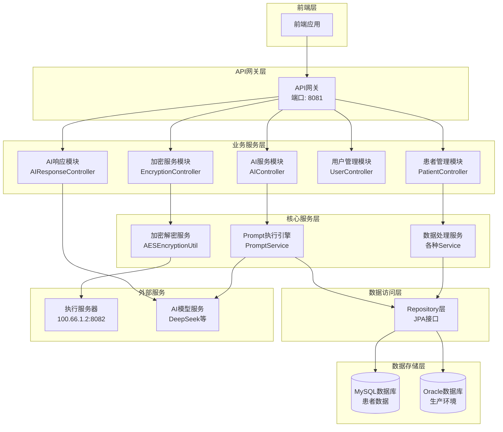
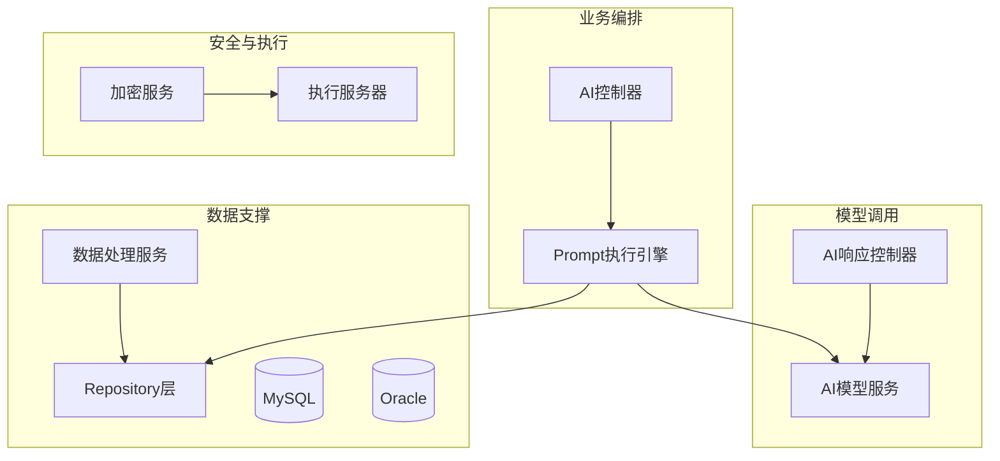
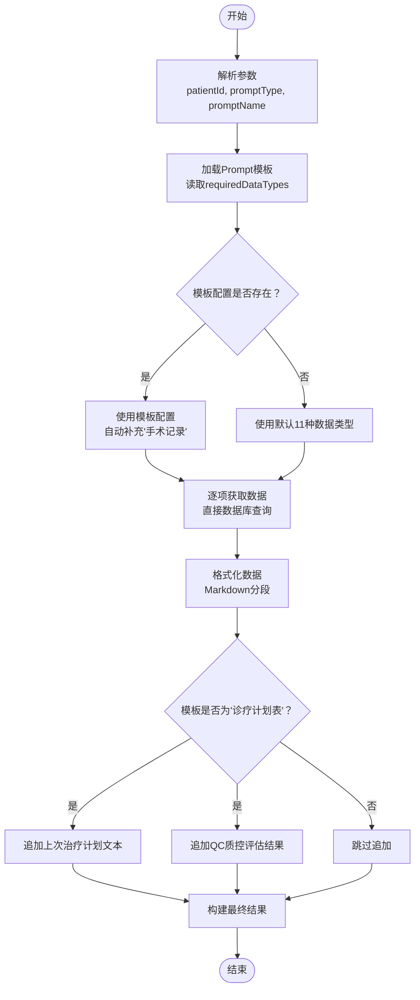
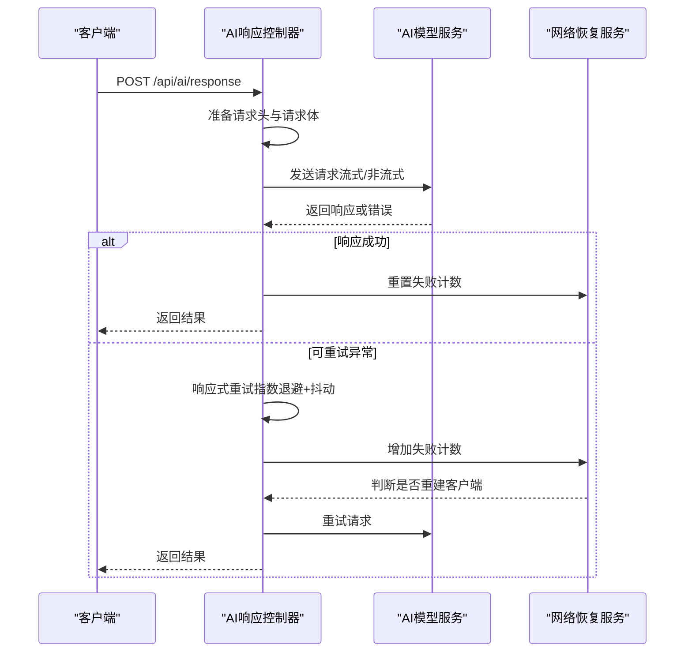
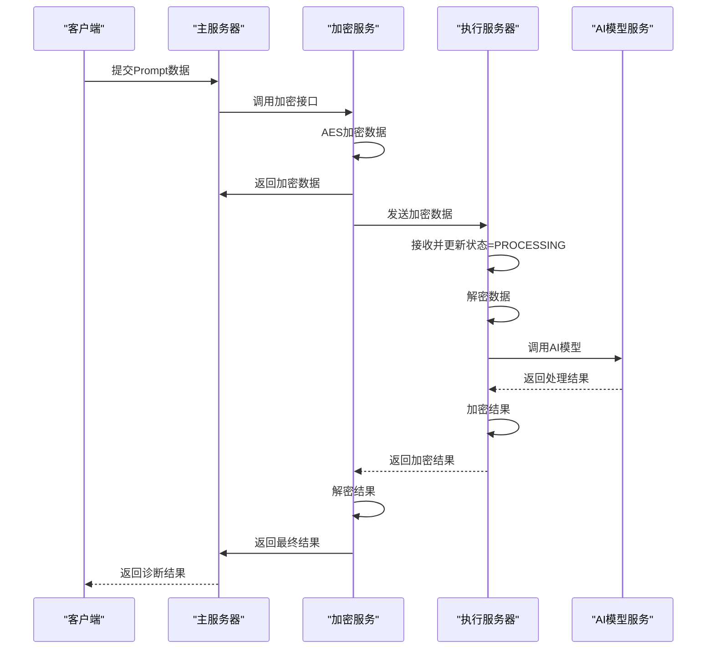
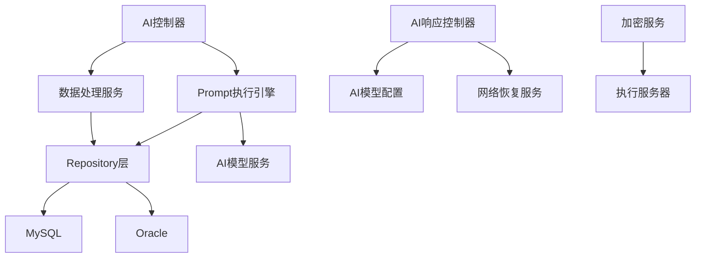

# AI诊断辅助系统

<cite>
**本文档引用的文件**
- [ARCHITECTURE_DIAGRAPH.md](file://med_ai_assistant_1.0_bs_backend/doc/其他/ARCHITECTURE_DIAGRAMS.md)
- [AI响应接口网络中断后连接失败问题分析与解决方案.md](file://med_ai_assistant_1.0_bs_backend/doc/其他/AI响应接口网络中断后连接失败问题分析与解决方案.md)
- [AI模型配置](file://med_ai_assistant_1.0_bs_backend/src/main/resources/ai-models.properties)
- [AI控制器](file://med_ai_assistant_1.0_bs_backend/src/main/java/com/example/medaiassistant/controller/AIController.java)
- [AI响应控制器](file://med_ai_assistant_1.0_bs_backend/src/main/java/com/example/medaiassistant/controller/AIResponseController.java)
- [AI模型配置类](file://med_ai_assistant_1.0_bs_backend/src/main/java/com/example/medaiassistant/config/AIModelConfig.java)
- [网络恢复服务](file://med_ai_assistant_1.0_bs_backend/src/main/java/com/example/medaiassistant/service/NetworkRecoveryService.java)
</cite>

## 目录
1. [简介](#简介)
2. [项目结构](#项目结构)
3. [核心组件](#核心组件)
4. [架构总览](#架构总览)
5. [详细组件分析](#详细组件分析)
6. [依赖关系分析](#依赖关系分析)
7. [性能考虑](#性能考虑)
8. [故障排除指南](#故障排除指南)
9. [结论](#结论)
10. [附录](#附录)

## 简介
本文件面向AI诊断辅助系统的使用者与维护者，系统性阐述AI模型集成机制、诊断算法实现与结果处理流程，重点覆盖以下方面：
- AI服务调用方式：同步与流式响应、模型参数映射、超时与重试策略
- 数据预处理：患者数据聚合、模板驱动的数据类型选择、脱敏与降级策略
- 模型推理过程：WebFlux响应式链路、DNS与连接池优化、网络恢复自动重建
- 结果后处理：结果落库、状态管理、健康检查与运维排障
- 配置与性能优化：多模型配置、超时与重试参数、连接池与DNS缓存
- 错误处理策略：可重试异常判定、自动恢复机制、健康状态探测
- 实际使用示例与最佳实践：接口调用、参数配置、运维排障
- 与主服务器和执行服务器的协作关系：加密传输、远程推理、状态同步

## 项目结构
系统采用分层架构，核心围绕AI控制器、AI响应控制器、模型配置与网络恢复服务展开，配合Prompt执行引擎与数据服务模块，形成完整的AI诊断辅助闭环。

**图表来源**
- [ARCHITECTURE_DIAGRAPH.md](file://med_ai_assistant_1.0_bs_backend/doc/其他/ARCHITECTURE_DIAGRAMS.md)

**章节来源**
- [ARCHITECTURE_DIAGRAPH.md](file://med_ai_assistant_1.0_bs_backend/doc/其他/ARCHITECTURE_DIAGRAPH.md)

## 核心组件
- AI控制器：负责Prompt模板管理、患者数据聚合与格式化、对话历史保存、结果查询与状态管理。优化后直接数据库查询，消除HTTP自调用死锁与超时问题。
- AI响应控制器：面向外部AI模型的统一入口，支持流式与非流式响应，集成响应式重试、DNS与连接池优化、网络恢复自动重建。
- AI模型配置类：集中管理多模型配置（URL、密钥、超时、重试），提供配置校验与默认模型选择。
- 网络恢复服务：维护连续失败计数与恢复窗口，达到阈值自动重建WebClient，保障网络波动后的可用性。
- 加密服务与执行服务器：在加密传输模式下，主服务器将敏感数据加密后发送至执行服务器，执行服务器解密后调用AI模型，再加密返回。

**章节来源**
- [AI控制器](file://med_ai_assistant_1.0_bs_backend/src/main/java/com/example/medaiassistant/controller/AIController.java)
- [AI响应控制器](file://med_ai_assistant_1.0_bs_backend/src/main/java/com/example/medaiassistant/controller/AIResponseController.java)
- [AI模型配置类](file://med_ai_assistant_1.0_bs_backend/src/main/java/com/example/medaiassistant/config/AIModelConfig.java)
- [网络恢复服务](file://med_ai_assistant_1.0_bs_backend/src/main/java/com/example/medaiassistant/service/NetworkRecoveryService.java)

## 架构总览
系统整体分为前端层、API网关层、业务服务层、核心服务层、数据访问层与数据存储层，以及外部AI模型与执行服务器。AI控制器与AI响应控制器分别承担业务编排与模型调用职责，Prompt执行引擎与数据服务模块提供数据支撑，加密服务与执行服务器实现安全的远程推理。

**图表来源**
- [ARCHITECTURE_DIAGRAPH.md](file://med_ai_assistant_1.0_bs_backend/doc/其他/ARCHITECTURE_DIAGRAMS.md)

**章节来源**
- [ARCHITECTURE_DIAGRAPH.md](file://med_ai_assistant_1.0_bs_backend/doc/其他/ARCHITECTURE_DIAGRAMS.md)

## 详细组件分析

### AI控制器：数据聚合与模板驱动
- 功能要点
  - 患者数据聚合：根据模板配置动态选择数据类型（一般信息、诊断信息、病历记录、长期/临时医嘱、化验/检查结果、入院/会诊/手术记录等），直接数据库查询，避免HTTP自调用导致的超时与死锁。
  - 模板驱动的数据类型决策：优先读取模板配置的requiredDataTypes，自动补充“手术记录”，未提供模板参数时使用默认11种数据类型。
  - 三层降级策略：入院记录优先使用PromptResult中的“入院记录总结”，其次使用EMR_CONTENT原始记录，最后输出统一标记“无入院记录数据”。
  - 连续性功能：当模板名为“诊疗计划表”时，追加上次生成的治疗计划文本与QC质控评估结果。
  - 对话历史保存：事务性保存会话消息，及时暴露持久化异常。
- 性能优化
  - 消除HTTP自调用，直接Repository查询，响应时间从5-30秒降至0.5-2秒，显著降低超时错误。
  - 时间过滤：查房记录模板对长期/临时医嘱与化验/检查结果应用时间范围过滤，减少无关数据。
- 错误处理
  - 单个数据类型失败不影响整体流程，错误信息不进入返回结果，仅记录日志便于排查。

**图表来源**
- [AI控制器](file://med_ai_assistant_1.0_bs_backend/src/main/java/com/example/medaiassistant/controller/AIController.java)

**章节来源**
- [AI控制器](file://med_ai_assistant_1.0_bs_backend/src/main/java/com/example/medaiassistant/controller/AIController.java)

### AI响应控制器：模型调用与网络恢复
- 功能要点
  - 统一入口：接收AI请求，准备请求头与请求体，支持流式与非流式响应。
  - 模型参数映射：将前端请求参数映射为模型API所需字段，特殊处理inHospitalDeepseek模型名称映射。
  - 响应式重试：在响应式链路中集成retryWhen，指数退避（1s→2s→4s）并加入随机抖动，仅对可重试异常生效。
  - DNS与连接池优化：配置连接池大小、空闲与生命周期、DNS缓存TTL与负缓存，提升网络稳定性。
  - 自动恢复：基于连续失败计数与恢复窗口，达到阈值自动重建WebClient，避免必须重启。
- 超时与重试
  - 连接超时：30秒；读取超时：300秒（5分钟）；最大重试：3次；指数退避与抖动降低重试风暴。
- 健康检查
  - 通过AI控制器的健康检查接口探测外部依赖状态，在degraded状态下触发自动恢复。

**图表来源**
- [AI响应控制器](file://med_ai_assistant_1.0_bs_backend/src/main/java/com/example/medaiassistant/controller/AIResponseController.java)
- [网络恢复服务](file://med_ai_assistant_1.0_bs_backend/src/main/java/com/example/medaiassistant/service/NetworkRecoveryService.java)

**章节来源**
- [AI响应控制器](file://med_ai_assistant_1.0_bs_backend/src/main/java/com/example/medaiassistant/controller/AIResponseController.java)
- [网络恢复服务](file://med_ai_assistant_1.0_bs_backend/src/main/java/com/example/medaiassistant/service/NetworkRecoveryService.java)

### AI模型配置：多模型与参数管理
- 功能要点
  - 配置绑定：以“ai”为前缀的配置属性，支持全局流式开关与多模型配置。
  - 模型配置：包含URL、密钥、连接/读取超时、最大重试次数、初始重试延迟等。
  - 配置校验：提供有效性检查与URL格式验证，支持默认模型选择与有效模型枚举。
  - 安全摘要：对外展示时隐藏密钥，便于运维审计。
- 配置示例
  - 支持DeepSeek聊天与推理模型，以及院内模型配置，便于后续扩展与替换。

**章节来源**
- [AI模型配置类](file://med_ai_assistant_1.0_bs_backend/src/main/java/com/example/medaiassistant/config/AIModelConfig.java)
- [AI模型配置](file://med_ai_assistant_1.0_bs_backend/src/main/resources/ai-models.properties)

### 加密传输与执行服务器协作
- 流程概览
  - 主服务器接收Prompt数据，调用加密接口进行AES加密。
  - 将加密数据保存并发送至执行服务器，执行服务器解密后调用AI模型。
  - 执行服务器对结果进行加密并返回，主服务器解密后落库并返回给前端。
- 关键点
  - EncryptedDataTemp状态管理：RECEIVED、PROCESSING、COMPLETED，确保流程可追溯。
  - 执行服务器严格遵守统一配置规范，避免参数差异导致的推理偏差。

**图表来源**
- [ARCHITECTURE_DIAGRAPH.md](file://med_ai_assistant_1.0_bs_backend/doc/其他/ARCHITECTURE_DIAGRAMS.md)

**章节来源**
- [ARCHITECTURE_DIAGRAPH.md](file://med_ai_assistant_1.0_bs_backend/doc/其他/ARCHITECTURE_DIAGRAMS.md)

## 依赖关系分析
- 组件耦合
  - AI控制器依赖Prompt执行引擎与各类数据服务，直接数据库查询降低耦合度与超时风险。
  - AI响应控制器依赖AI模型配置与网络恢复服务，通过WebClient与响应式链路实现高可用。
  - 加密服务与执行服务器形成独立的安全通道，避免敏感数据在主服务器驻留。
- 外部依赖
  - 外部AI模型服务（如DeepSeek）与执行服务器，健康状态通过健康检查接口反馈。
  - 数据库：MySQL与Oracle双活，支持动态切换与健康检查。

**图表来源**
- [ARCHITECTURE_DIAGRAPH.md](file://med_ai_assistant_1.0_bs_backend/doc/其他/ARCHITECTURE_DIAGRAMS.md)

**章节来源**
- [ARCHITECTURE_DIAGRAPH.md](file://med_ai_assistant_1.0_bs_backend/doc/其他/ARCHITECTURE_DIAGRAMS.md)

## 性能考虑
- 网络优化
  - 连接池：最大连接数、空闲与生命周期、后台逐出策略，避免连接泄露与不健康状态滞留。
  - DNS缓存：正缓存1-5分钟、负缓存30秒，降低解析压力与负缓存影响。
  - IPv4优先：减少IPv6环境异常带来的解析问题。
- 响应式重试
  - 指数退避与抖动，避免重试风暴；仅对可重试异常生效，提升成功率。
- 数据查询优化
  - 直接数据库查询替代HTTP自调用，显著降低响应时间与超时风险。
- 超时与重试参数
  - 连接超时30秒、读取超时300秒、最大重试3次，平衡用户体验与资源消耗。

**章节来源**
- [AI响应接口网络中断后连接失败问题分析与解决方案.md](file://med_ai_assistant_1.0_bs_backend/doc/其他/AI响应接口网络中断后连接失败问题分析与解决方案.md)

## 故障排除指南
- 网络中断后连接失败
  - 现象：/api/ai/response偶发“无法连接到DeepSeek”，健康检查返回degraded。
  - 根因：DNS负缓存、连接池状态不健康、重试位置不当。
  - 解决：响应式重试、DNS与连接池优化、自动重建客户端、健康探测与自动恢复。
- 健康检查
  - 通过/checkAIStatus接口探测外部依赖可达性；在degraded状态下触发自动恢复。
- 运维排查
  - DNS：刷新缓存、指定可信DNS、验证端口连通性。
  - 代理/防火墙：检查策略与SSL拦截；确认443出口畅通。
  - 配置：核对ai-models.properties的URL与密钥，确保无空格与未过期。

**章节来源**
- [AI响应接口网络中断后连接失败问题分析与解决方案.md](file://med_ai_assistant_1.0_bs_backend/doc/其他/AI响应接口网络中断后连接失败问题分析与解决方案.md)

## 结论
本系统通过“模板驱动的数据聚合、响应式重试与DNS/连接池优化、自动恢复机制”三大支柱，实现了高可用、高性能的AI诊断辅助能力。AI控制器与AI响应控制器分别承担业务编排与模型调用职责，配合加密传输与执行服务器，确保敏感数据安全与推理一致性。通过完善的健康检查与运维排障机制，系统在网络波动与异常情况下仍能保持稳定运行。

## 附录
- 实际使用示例
  - 获取患者数据：GET /api/ai/patient-data?patientId={id}&promptType={type}&promptName={name}
  - 保存AI结果：POST /api/ai/saveAIResult（请求体包含promptId与结果内容）
  - 健康检查：GET /api/ai/health/ai-status
- 最佳实践
  - 优先使用模板驱动的数据类型配置，确保数据完整性与一致性。
  - 在网络波动环境中启用响应式重试与自动恢复，避免人工干预。
  - 定期检查DNS与连接池配置，维持最优性能与稳定性。
  - 对敏感数据采用加密传输，确保合规与安全。