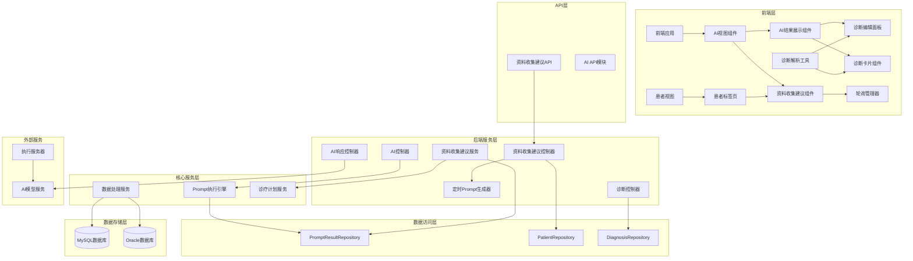
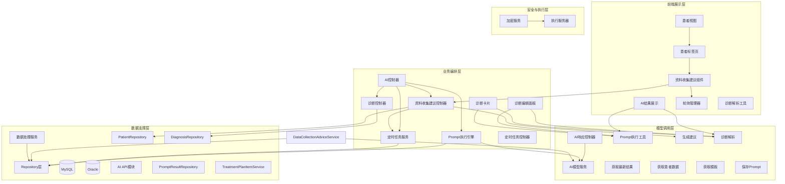
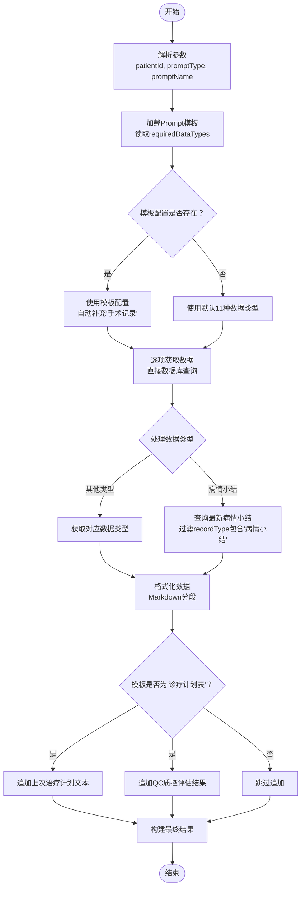
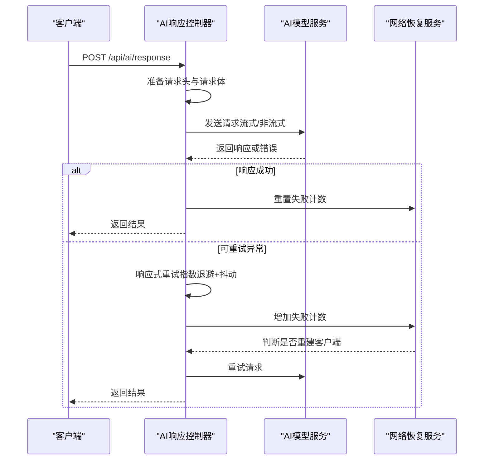
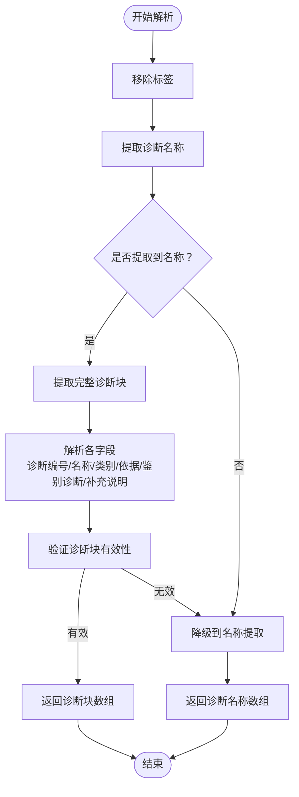
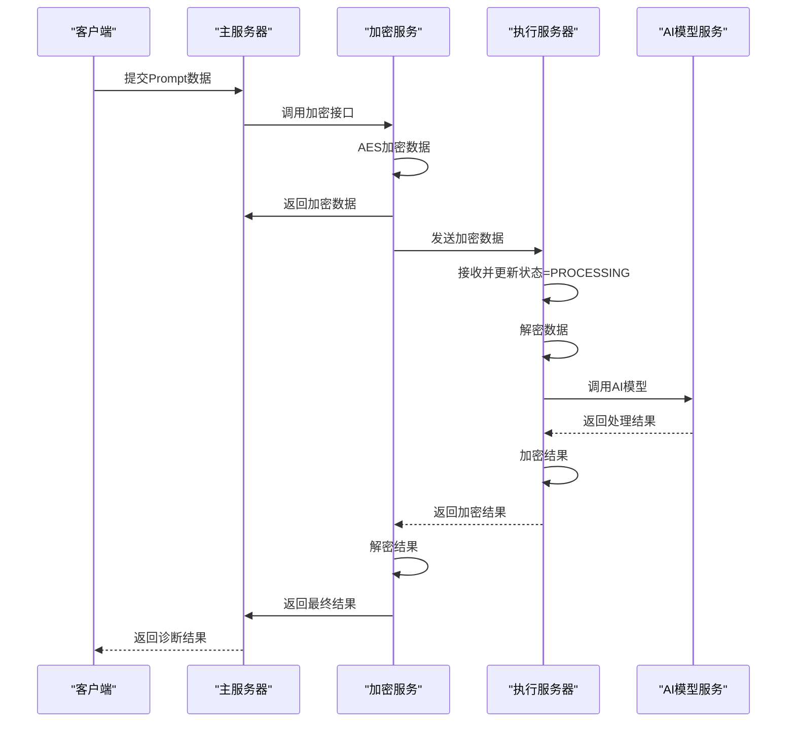
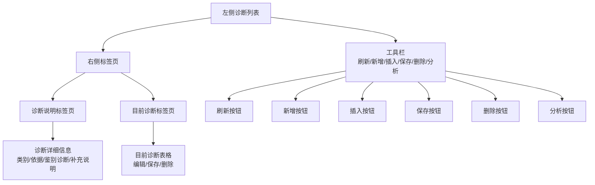
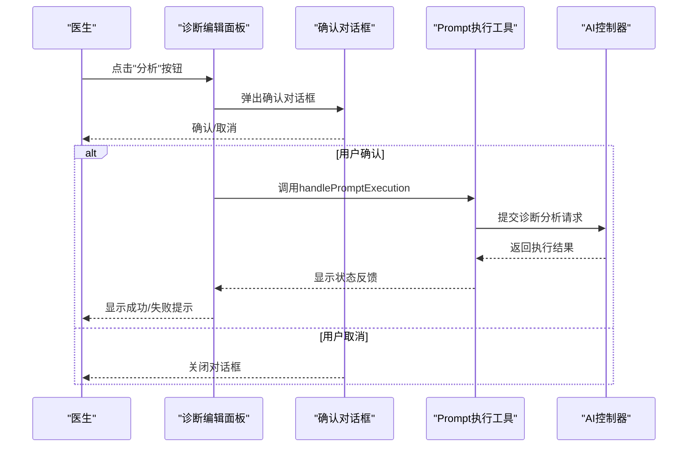
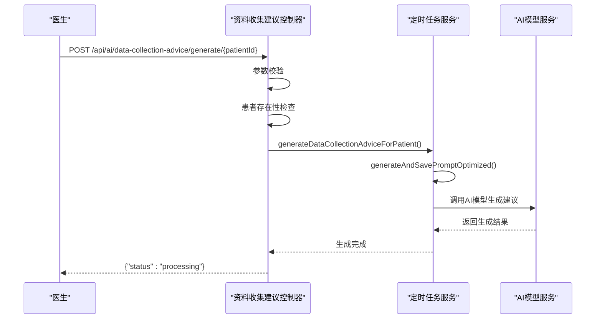
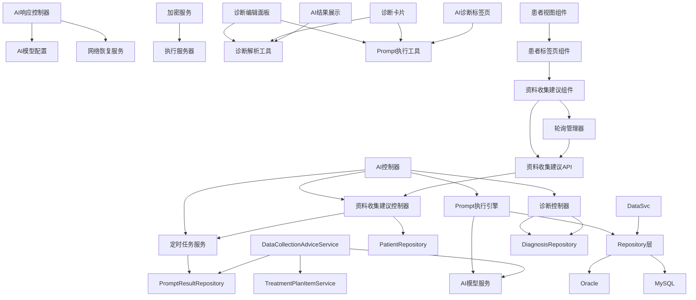

# AI诊断辅助系统

<cite>
**本文档引用的文件**
- [AI控制器](file://med_ai_assistant_1.0_bs_backend/src/main/java/com/example/medaiassistant/controller/AIController.java)
- [AI响应控制器](file://med_ai_assistant_1.0_bs_backend/src/main/java/com/example/medaiassistant/controller/AIResponseController.java)
- [诊断控制器](file://med_ai_assistant_1.0_bs_backend/src/main/java/com/example/medaiassistant/controller/DiagnosisController.java)
- [资料收集建议控制器](file://med_ai_assistant_1.0_bs_backend/src/main/java/com/example/medaiassistant/controller/DataCollectionAdviceController.java)
- [资料收集建议服务](file://med_ai_assistant_1.0_bs_backend/src/main/java/com/example/medaiassistant/service/DataCollectionAdviceService.java)
- [定时Prompt生成器](file://med_ai_assistant_1.0_bs_backend/src/main/java/com/example/medaiassistant/service/TimerPromptGenerator.java)
- [诊断解析工具](file://med_ai_assistant_1.0_bs_vue/src/utils/diagnosisParser.js)
- [诊断编辑面板组件](file://med_ai_assistant_1.0_bs_vue/src/components/ai/DiagnosisEditPanel.vue)
- [诊断卡片组件](file://med_ai_assistant_1.0_bs_vue/src/components/ai/DiagnosisCard.vue)
- [AI结果展示组件](file://med_ai_assistant_1.0_bs_vue/src/components/ai/AIResults.vue)
- [资料收集建议组件](file://med_ai_assistant_1.0_bs_vue/src/components/patient/DataCollectionAdvice.vue)
- [轮询管理器](file://med_ai_assistant_1.0_bs_vue/src/utils/pollingManager.js)
- [AI API模块](file://med_ai_assistant_1.0_bs_vue/src/api/ai.js)
- [资料收集建议API](file://med_ai_assistant_1.0_bs_vue/src/api/dataCollectionAdvice.js)
- [患者标签页组件](file://med_ai_assistant_1.0_bs_vue/src/components/patient/PatientTabs.vue)
- [路由配置](file://med_ai_assistant_1.0_bs_vue/src/router/index.js)
</cite>

## 更新摘要
**变更内容**
- 新增诊断编辑面板与卡片组件，提供结构化诊断管理功能
- 实现诊断解析引擎的结构化支持，支持完整的诊断块解析
- 新增手动诊断分析功能，支持用户触发诊断分析
- 诊断排序规则优化为四级优先级系统
- 资料收集建议功能的完整前端集成与轮询管理

## 目录
1. [简介](#简介)
2. [项目结构](#项目结构)
3. [核心组件](#核心组件)
4. [架构总览](#架构总览)
5. [详细组件分析](#详细组件分析)
6. [诊断编辑面板系统](#诊断编辑面板系统)
7. [诊断解析引擎](#诊断解析引擎)
8. [手动诊断分析功能](#手动诊断分析功能)
9. [诊断排序与优先级系统](#诊断排序与优先级系统)
10. [资料收集建议功能](#资料收集建议功能)
11. [前端组件集成](#前端组件集成)
12. [轮询管理机制](#轮询管理机制)
13. [状态管理与数据流](#状态管理与数据流)
14. [用户交互设计](#用户交互设计)
15. [依赖关系分析](#依赖关系分析)
16. [性能考虑](#性能考虑)
17. [故障排除指南](#故障排除指南)
18. [结论](#结论)
19. [附录](#附录)

## 简介
本文件面向AI诊断辅助系统的使用者与维护者，系统性阐述AI模型集成机制、诊断算法实现与结果处理流程，重点覆盖以下方面：
- AI服务调用方式：同步与流式响应、模型参数映射、超时与重试策略
- 数据预处理：患者数据聚合、模板驱动的数据类型选择、脱敏与降级策略
- 模型推理过程：WebFlux响应式链路、DNS与连接池优化、网络恢复自动重建
- 结果后处理：结果落库、状态管理、健康检查与运维排障
- 配置与性能优化：多模型配置、超时与重试参数、连接池与DNS缓存
- 错误处理策略：可重试异常判定、自动恢复机制、健康状态探测
- 实际使用示例与最佳实践：接口调用、参数配置、运维排障
- 与主服务器和执行服务器的协作关系：加密传输、远程推理、状态同步
- **新增**：诊断编辑面板系统，提供结构化的诊断管理界面
- **新增**：诊断解析引擎，支持完整的诊断块结构化解析
- **新增**：手动诊断分析功能，支持用户触发诊断分析流程
- **新增**：四级优先级诊断排序系统，提升诊断管理效率
- **新增**：资料收集建议功能的完整前端集成与轮询管理

## 项目结构
系统采用分层架构，核心围绕AI控制器、AI响应控制器、模型配置与网络恢复服务展开，配合Prompt执行引擎与数据服务模块，形成完整的AI诊断辅助闭环。新增的诊断编辑面板系统通过独立的解析工具、编辑组件和卡片组件实现结构化诊断管理，具备完整的诊断提取、编辑和排序功能。

**图表来源**
- [AI控制器](file://med_ai_assistant_1.0_bs_backend/src/main/java/com/example/medaiassistant/controller/AIController.java)
- [AI响应控制器](file://med_ai_assistant_1.0_bs_backend/src/main/java/com/example/medaiassistant/controller/AIResponseController.java)
- [诊断控制器](file://med_ai_assistant_1.0_bs_backend/src/main/java/com/example/medaiassistant/controller/DiagnosisController.java)
- [资料收集建议控制器](file://med_ai_assistant_1.0_bs_backend/src/main/java/com/example/medaiassistant/controller/DataCollectionAdviceController.java)
- [资料收集建议服务](file://med_ai_assistant_1.0_bs_backend/src/main/java/com/example/medaiassistant/service/DataCollectionAdviceService.java)
- [定时Prompt生成器](file://med_ai_assistant_1.0_bs_backend/src/main/java/com/example/medaiassistant/service/TimerPromptGenerator.java)

## 核心组件
- AI控制器：负责Prompt模板管理、患者数据聚合与格式化、对话历史保存、结果查询与状态管理。优化后直接数据库查询，消除HTTP自调用死锁与超时问题。
- AI响应控制器：面向外部AI模型的统一入口，支持流式与非流式响应，集成响应式重试、DNS与连接池优化、网络恢复自动重建。
- AI模型配置类：集中管理多模型配置（URL、密钥、超时、重试），提供配置校验与默认模型选择。
- 网络恢复服务：维护连续失败计数与恢复窗口，达到阈值自动重建WebClient，保障网络波动后的可用性。
- 加密服务与执行服务器：在加密传输模式下，主服务器将敏感数据加密后发送至执行服务器，执行服务器解密后调用AI模型，再加密返回。
- **新增**：诊断解析工具：提供诊断名称和完整诊断块的解析功能，支持结构化诊断信息提取。
- **新增**：诊断编辑面板组件：提供左右分栏布局的诊断管理界面，支持诊断列表展示、详细信息查看、诊断编辑和操作工具栏。
- **新增**：诊断卡片组件：提供简洁的诊断概览界面，支持诊断列表展示和详细信息查看。
- **新增**：诊断控制器：提供诊断管理的REST API接口，支持诊断替换、主要诊断设置等功能。
- **新增**：资料收集建议控制器：提供手动触发资料收集建议生成的API端点，支持医生随时刷新生成，具备参数校验和Profile隔离。
- **新增**：资料收集建议服务：负责查询患者最新的资料收集建议结果，组装为响应对象，支持三种状态管理。
- **新增**：轮询管理器：封装轮询逻辑，支持配置轮询间隔、最大轮询次数、超时回调和错误处理。

**章节来源**
- [AI控制器](file://med_ai_assistant_1.0_bs_backend/src/main/java/com/example/medaiassistant/controller/AIController.java)
- [AI响应控制器](file://med_ai_assistant_1.0_bs_backend/src/main/java/com/example/medaiassistant/controller/AIResponseController.java)
- [诊断控制器](file://med_ai_assistant_1.0_bs_backend/src/main/java/com/example/medaiassistant/controller/DiagnosisController.java)
- [资料收集建议控制器](file://med_ai_assistant_1.0_bs_backend/src/main/java/com/example/medaiassistant/controller/DataCollectionAdviceController.java)
- [资料收集建议服务](file://med_ai_assistant_1.0_bs_backend/src/main/java/com/example/medaiassistant/service/DataCollectionAdviceService.java)
- [定时Prompt生成器](file://med_ai_assistant_1.0_bs_backend/src/main/java/com/example/medaiassistant/service/TimerPromptGenerator.java)
- [诊断解析工具](file://med_ai_assistant_1.0_bs_vue/src/utils/diagnosisParser.js)
- [诊断编辑面板组件](file://med_ai_assistant_1.0_bs_vue/src/components/ai/DiagnosisEditPanel.vue)
- [诊断卡片组件](file://med_ai_assistant_1.0_bs_vue/src/components/ai/DiagnosisCard.vue)

## 架构总览
系统整体分为前端层、API层、业务服务层、核心服务层、数据访问层与数据存储层，以及外部AI模型与执行服务器。AI控制器与AI响应控制器分别承担业务编排与模型调用职责，Prompt执行引擎与数据服务模块提供数据支撑，加密服务与执行服务器实现安全的远程推理。新增的诊断编辑面板系统通过独立的解析工具、编辑组件和卡片组件实现结构化诊断管理，具备完整的诊断提取、编辑和排序功能，与现有系统无缝集成。

**图表来源**
- [AI控制器](file://med_ai_assistant_1.0_bs_backend/src/main/java/com/example/medaiassistant/controller/AIController.java)
- [AI响应控制器](file://med_ai_assistant_1.0_bs_backend/src/main/java/com/example/medaiassistant/controller/AIResponseController.java)
- [诊断控制器](file://med_ai_assistant_1.0_bs_backend/src/main/java/com/example/medaiassistant/controller/DiagnosisController.java)
- [资料收集建议控制器](file://med_ai_assistant_1.0_bs_backend/src/main/java/com/example/medaiassistant/controller/DataCollectionAdviceController.java)
- [资料收集建议服务](file://med_ai_assistant_1.0_bs_backend/src/main/java/com/example/medaiassistant/service/DataCollectionAdviceService.java)
- [定时Prompt生成器](file://med_ai_assistant_1.0_bs_backend/src/main/java/com/example/medaiassistant/service/TimerPromptGenerator.java)

## 详细组件分析

### AI控制器：数据聚合与模板驱动
- 功能要点
  - 患者数据聚合：根据模板配置动态选择数据类型（一般信息、诊断信息、病历记录、长期/临时医嘱、化验/检查结果、入院/会诊/手术记录等），直接数据库查询，避免HTTP自调用导致的超时与死锁。
  - 模板驱动的数据类型决策：优先读取模板配置的requiredDataTypes，自动补充"手术记录"，未提供模板参数时使用默认11种数据类型。
  - 三层降级策略：入院记录优先使用PromptResult中的"入院记录总结"，其次使用EMR_CONTENT原始记录，最后输出统一标记"无入院记录数据"。
  - 连续性功能：当模板名为"诊疗计划表"时，追加上次生成的治疗计划文本与QC质控评估结果。
  - 对话历史保存：事务性保存会话消息，及时暴露持久化异常。
  - **新增**：病情小结数据处理：直接查询medicalRecordRepository，过滤recordType包含"病情小结"的记录，提供最新的病情小结内容。
- 性能优化
  - 消除HTTP自调用，直接Repository查询，响应时间从5-30秒降至0.5-2秒，显著降低超时错误。
  - 时间过滤：查房记录模板对长期/临时医嘱与化验/检查结果应用时间范围过滤，减少无关数据。
- 错误处理
  - 单个数据类型失败不影响整体流程，错误信息不进入返回结果，仅记录日志便于排查。

**图表来源**
- [AI控制器](file://med_ai_assistant_1.0_bs_backend/src/main/java/com/example/medaiassistant/controller/AIController.java)

**章节来源**
- [AI控制器](file://med_ai_assistant_1.0_bs_backend/src/main/java/com/example/medaiassistant/controller/AIController.java)

### AI响应控制器：模型调用与网络恢复
- 功能要点
  - 统一入口：接收AI请求，准备请求头与请求体，支持流式与非流式响应。
  - 模型参数映射：将前端请求参数映射为模型API所需字段，特殊处理inHospitalDeepseek模型名称映射。
  - 响应式重试：在响应式链路中集成retryWhen，指数退避（1s→2s→4s）并加入随机抖动，仅对可重试异常生效。
  - DNS与连接池优化：配置连接池大小、空闲与生命周期、DNS缓存TTL与负缓存，提升网络稳定性。
  - 自动恢复：基于连续失败计数与恢复窗口，达到阈值自动重建WebClient，避免必须重启。
- 超时与重试
  - 连接超时：30秒；读取超时：300秒（5分钟）；最大重试：3次；指数退避与抖动降低重试风暴。
- 健康检查
  - 通过AI控制器的健康检查接口探测外部依赖状态，在degraded状态下触发自动恢复。

**图表来源**
- [AI响应控制器](file://med_ai_assistant_1.0_bs_backend/src/main/java/com/example/medaiassistant/controller/AIResponseController.java)

**章节来源**
- [AI响应控制器](file://med_ai_assistant_1.0_bs_backend/src/main/java/com/example/medaiassistant/controller/AIResponseController.java)

### 诊断解析引擎

#### 结构化诊断信息提取
诊断解析引擎提供了完整的诊断信息结构化提取能力，支持从AI结果中提取完整的诊断块信息。

- **诊断名称提取**
  - 支持多种格式的诊断名称提取，包括"诊断名称："、"诊断名称:"、"诊断："等格式
  - 自动去除多余空格和换行符
  - 去重处理，确保诊断列表的唯一性

- **完整诊断块解析**
  - 支持诊断编号、诊断名称、诊断类别、诊断依据、鉴别诊断、补充说明等完整字段
  - 通过正则表达式精确匹配各个字段内容
  - 支持多行内容提取，确保诊断依据等长文本的完整性

- **错误处理与降级**
  - 当完整解析失败时，自动降级到诊断名称提取
  - 移除<thinking>标签内容，避免误解析
  - 兼容中英文冒号格式，提升解析鲁棒性

**图表来源**
- [诊断解析工具](file://med_ai_assistant_1.0_bs_vue/src/utils/diagnosisParser.js)

**章节来源**
- [诊断解析工具](file://med_ai_assistant_1.0_bs_vue/src/utils/diagnosisParser.js)

### 加密传输与执行服务器协作
- 流程概览
  - 主服务器接收Prompt数据，调用加密接口进行AES加密。
  - 将加密数据保存并发送至执行服务器，执行服务器解密后调用AI模型。
  - 执行服务器对结果进行加密并返回，主服务器解密后落库并返回给前端。
- 关键点
  - EncryptedDataTemp状态管理：RECEIVED、PROCESSING、COMPLETED，确保流程可追溯。
  - 执行服务器严格遵守统一配置规范，避免参数差异导致的推理偏差。

**图表来源**
- [AI控制器](file://med_ai_assistant_1.0_bs_backend/src/main/java/com/example/medaiassistant/controller/AIController.java)
- [AI响应控制器](file://med_ai_assistant_1.0_bs_backend/src/main/java/com/example/medaiassistant/controller/AIResponseController.java)

**章节来源**
- [AI控制器](file://med_ai_assistant_1.0_bs_backend/src/main/java/com/example/medaiassistant/controller/AIController.java)
- [AI响应控制器](file://med_ai_assistant_1.0_bs_backend/src/main/java/com/example/medaiassistant/controller/AIResponseController.java)

## 诊断编辑面板系统

### 诊断编辑面板组件：结构化诊断管理
诊断编辑面板组件提供了完整的诊断管理界面，采用左右分栏布局，支持诊断列表展示、详细信息查看和诊断编辑操作。

- **左右分栏布局**
  - 左侧：AI诊断列表，支持选择、编辑诊断名称
  - 右侧：标签页区域，包含诊断说明和目前诊断两个标签
  - 支持诊断项的高亮显示，突出显示与当前诊断不同的项

- **诊断说明标签页**
  - 显示诊断类别、诊断依据、鉴别诊断、补充说明等详细信息
  - 支持Markdown内容渲染，提供富文本展示效果
  - 自动过滤XSS攻击，确保内容安全

- **目前诊断标签页**
  - 展示患者现有的诊断列表，支持编辑、保存、删除操作
  - 支持诊断ID的保留，确保后端操作的准确性
  - 提供编辑状态跟踪，支持批量保存修改

- **工具栏功能**
  - 刷新AI诊断列表：重新获取最新的诊断分析结果
  - 新增空白诊断：允许医生手动添加新的诊断条目
  - 插入诊断：将选中的AI诊断插入到当前诊断中
  - 保存诊断：保存当前修改的诊断内容
  - 删除诊断：删除目前诊断中选中的诊断
  - 诊断分析：手动触发诊断分析流程

**图表来源**
- [诊断编辑面板组件](file://med_ai_assistant_1.0_bs_vue/src/components/ai/DiagnosisEditPanel.vue)

**章节来源**
- [诊断编辑面板组件](file://med_ai_assistant_1.0_bs_vue/src/components/ai/DiagnosisEditPanel.vue)

### 诊断卡片组件：简洁诊断概览
诊断卡片组件提供了简洁的诊断概览界面，采用卡片式设计，支持诊断列表展示和详细信息查看。

- **卡片式布局**
  - 左侧：诊断列表，支持点击选择和高亮显示
  - 右侧：诊断说明卡片，展示选中诊断的详细信息
  - 支持诊断编号的有序显示

- **诊断列表功能**
  - 支持诊断项的点击选择
  - 高亮显示当前选中的诊断项
  - 支持诊断名称的自动换行显示

- **诊断说明卡片**
  - 展示诊断类别、诊断依据、鉴别诊断、补充说明
  - 支持Markdown内容的HTML渲染
  - 提供详细的诊断信息展示

- **操作工具栏**
  - 刷新AI诊断列表
  - 新增空白诊断
  - 插入选中的AI诊断
  - 保存当前修改的诊断
  - 删除目前诊断中选中的诊断
  - 手动触发诊断分析

**章节来源**
- [诊断卡片组件](file://med_ai_assistant_1.0_bs_vue/src/components/ai/DiagnosisCard.vue)

### AI结果展示组件：诊断信息集成
AI结果展示组件集成了诊断编辑面板和诊断卡片组件，提供了完整的AI诊断结果展示功能。

- **诊断分析检测**
  - 自动检测Prompt标题中是否包含"诊断分析"
  - 当检测到诊断分析时，自动展示诊断编辑面板
  - 支持诊断列表的自动解析和展示

- **诊断信息提取**
  - 优先使用诊断解析工具提取完整诊断块
  - 当完整解析失败时，自动降级到诊断名称提取
  - 支持患者诊断数据的自动加载和展示

- **结果折叠功能**
  - 诊断分析类Prompt的AI结果区域支持折叠/展开
  - 默认折叠状态，减少页面信息量
  - 提供展开/折叠按钮，用户可自由控制显示内容

**章节来源**
- [AI结果展示组件](file://med_ai_assistant_1.0_bs_vue/src/components/ai/AIResults.vue)

## 手动诊断分析功能

### 手动触发诊断分析流程
手动诊断分析功能允许医生随时触发诊断分析流程，提供更加灵活的诊断支持。

- **触发机制**
  - 通过诊断编辑面板的"分析"按钮触发
  - 弹出确认对话框，提醒用户诊断分析会每天定时自动运行
  - 用户确认后调用Prompt执行工具进行手动分析

- **执行选项配置**
  - 默认优先级：3
  - 默认状态：待处理
  - 支持用户ID、排序号等自定义选项
  - 生成方式：user标识手动触发

- **数据准备**
  - 自动获取当前选中的患者ID
  - 使用"诊断分析"模板名称
  - 支持空的模板内容参数
  - 自动获取用户信息作为执行者

- **状态反馈**
  - 显示诊断分析请求提交状态
  - 成功时显示成功提示
  - 失败时显示错误信息
  - 支持用户取消操作的优雅处理

**图表来源**
- [诊断编辑面板组件](file://med_ai_assistant_1.0_bs_vue/src/components/ai/DiagnosisEditPanel.vue)
- [诊断卡片组件](file://med_ai_assistant_1.0_bs_vue/src/components/ai/DiagnosisCard.vue)

**章节来源**
- [诊断编辑面板组件](file://med_ai_assistant_1.0_bs_vue/src/components/ai/DiagnosisEditPanel.vue)
- [诊断卡片组件](file://med_ai_assistant_1.0_bs_vue/src/components/ai/DiagnosisCard.vue)

## 诊断排序与优先级系统

### 四级优先级诊断排序规则
诊断排序系统实现了四级优先级的诊断管理，支持HIGH、MEDIUM、LOW三个级别的诊断优先级设置。

- **优先级定义**
  - HIGH：高优先级诊断，通常为危及生命的紧急诊断
  - MEDIUM：中等优先级诊断，需要及时关注的重要诊断
  - LOW：低优先级诊断，常规或轻微的诊断问题
  - 未设置：默认优先级，适用于一般性诊断

- **排序应用场景**
  - 质控评估：在质控指标评估中，优先级影响评估结果
  - 临床决策：高优先级诊断在临床决策中具有更高的权重
  - 资源分配：优先级帮助合理分配医疗资源和关注重点
  - 报告生成：优先级影响诊断报告的排序和展示

- **数据存储**
  - 优先级信息存储在诊断相关的数据库表中
  - 支持优先级的修改和更新操作
  - 提供优先级统计和分析功能
  - 支持按优先级的查询和筛选

- **模板支持**
  - 质控评估模板支持优先级字段
  - 诊断分析模板可包含优先级信息
  - 诊疗计划表支持优先级的可视化展示
  - 冲突解决模板考虑优先级因素

**章节来源**
- [诊断控制器](file://med_ai_assistant_1.0_bs_backend/src/main/java/com/example/medaiassistant/controller/DiagnosisController.java)
- [诊断解析工具](file://med_ai_assistant_1.0_bs_vue/src/utils/diagnosisParser.js)

## 资料收集建议功能

### 资料收集建议控制器：手动触发API
资料收集建议控制器为医生提供了手动触发资料收集建议生成的API端点。

- **功能特性**
  - 手动触发生成：医生点击"刷新建议"按钮时调用此接口
  - 立即响应：接口立即返回processing状态，AI生成任务在后台异步执行
  - 参数校验：验证patientId的有效性和患者的存在性
  - Profile隔离：@Profile("!execution")确保仅在主服务器运行

- **API接口**
  - POST /api/ai/data-collection-advice/generate/{patientId}
  - 响应格式：{"status": "processing"}
  - 状态码：200（成功）、400（参数错误）、404（患者不存在）

- **核心实现**
  - `generateAdvice()`方法：处理手动触发逻辑
  - PatientRepository：验证患者存在性
  - TimerPromptGenerator：异步启动生成任务
  - 状态管理：返回processing状态供前端轮询

**图表来源**
- [资料收集建议控制器](file://med_ai_assistant_1.0_bs_backend/src/main/java/com/example/medaiassistant/controller/DataCollectionAdviceController.java)
- [定时Prompt生成器](file://med_ai_assistant_1.0_bs_backend/src/main/java/com/example/medaiassistant/service/TimerPromptGenerator.java)

**章节来源**
- [资料收集建议控制器](file://med_ai_assistant_1.0_bs_backend/src/main/java/com/example/medaiassistant/controller/DataCollectionAdviceController.java)

### 资料收集建议服务：查询与状态管理
资料收集建议服务负责查询患者最新的资料收集建议结果，支持三种状态管理。

- **状态管理逻辑**
  - 无记录：返回none状态，表示该患者无建议记录
  - 生成中：返回processing状态，表示AI尚未返回结果
  - 已完成：返回completed状态，包含建议内容、生成时间和数据来源标识

- **数据来源标识**
  - 基于诊断分析：检查是否存在诊断分析结果
  - 基于诊疗计划：通过TreatmentPlanItemService真实查询
  - 用于指示当前建议的生成依据来源

- **核心实现**
  - `getLatestAdvice()`：查询最新建议结果
  - `buildBasedOn()`：构建数据来源标识
  - `hasTreatmentPlanData()`：判断是否存在诊疗计划数据

**章节来源**
- [资料收集建议服务](file://med_ai_assistant_1.0_bs_backend/src/main/java/com/example/medaiassistant/service/DataCollectionAdviceService.java)

## 前端组件集成

### 资料收集建议组件：完整状态管理
资料收集建议组件是本次更新的核心前端组件，实现了完整的状态管理和用户交互。

- **四种状态管理**
  - loading状态：显示骨架屏加载效果
  - completed状态：渲染Markdown格式的建议内容
  - processing状态：显示生成中提示
  - empty状态：显示无建议提示和生成按钮

- **核心功能实现**
  - `resetState()`：重置组件状态
  - `loadAdvice()`：加载最新的资料收集建议
  - `handleRefresh()`：处理刷新建议按钮点击事件
  - `formattedTime()`：格式化生成时间显示
  - `renderedContent()`：渲染Markdown内容

- **用户交互设计**
  - 生成时间显示：显示建议的生成时间
  - 刷新按钮：支持手动重新生成建议
  - Markdown渲染：支持三级标题结构的建议内容
  - 基于信息标注：显示建议所依据的数据来源

- **组件生命周期**
  - mounted钩子：初始化时自动加载建议
  - watch监听：监听patient变化，自动重新加载
  - beforeUnmount钩子：组件销毁时清除轮询定时器

**章节来源**
- [资料收集建议组件](file://med_ai_assistant_1.0_bs_vue/src/components/patient/DataCollectionAdvice.vue)

### 资料收集建议API：前后端接口集成
资料收集建议API模块提供了完整的前端接口调用封装。

- **手动触发生成**
  - `generateDataCollectionAdvice(patientId)`：触发资料收集建议生成
  - 立即返回processing状态，AI生成任务在后台异步执行
  - 支持错误处理和用户提示

- **查询建议结果**
  - `getDataCollectionAdvice(patientId)`：查询最新建议结果
  - 返回三种状态：completed、processing、none
  - 包含状态、内容、生成时间和数据来源标识

- **接口规范**
  - POST /ai/data-collection-advice/generate/{patientId}
  - GET /ai/data-collection-advice/{patientId}
  - 支持RESTful风格的API设计

**章节来源**
- [资料收集建议API](file://med_ai_assistant_1.0_bs_vue/src/api/dataCollectionAdvice.js)

### 患者标签页集成：标签页组织
患者标签页组件整合了多个功能标签页，包括新增的资料收集建议标签页。

- **标签页组织**
  - 基本信息、病情小结、AI诊断、病历记录、检查报告等
  - 支持懒加载优化，仅在激活时才挂载组件
  - 提供tooltip提示，改善用户体验

- **AI诊断标签页集成**
  - 位于"病历记录"标签页右侧，作为独立的功能标签页
  - 支持手动刷新和自动轮询
  - 与现有诊断分析功能无缝集成

- **路由配置**
  - 支持路由导航和参数传递
  - 提供滚动行为和锚点定位
  - 支持权限控制和认证

**章节来源**
- [患者标签页组件](file://med_ai_assistant_1.0_bs_vue/src/components/patient/PatientTabs.vue)
- [路由配置](file://med_ai_assistant_1.0_bs_vue/src/router/index.js)

## 轮询管理机制

### 轮询管理器：智能轮询控制
轮询管理器封装了轮询逻辑，支持配置轮询间隔、最大轮询次数、超时回调和错误处理。

- **核心功能**
  - `start()`：启动轮询，支持异步任务执行
  - `stop()`：停止轮询并清除定时器
  - 支持最大轮询次数限制
  - 提供超时回调和错误处理机制

- **配置参数**
  - `task`：每次轮询执行的异步任务，返回Promise
  - `onResult`：每次轮询成功后的回调
  - `onCompleted`：判断是否完成的条件回调
  - `interval`：轮询间隔（默认5000ms）
  - `maxCount`：最大轮询次数（默认60次）
  - `onTimeout`：超时回调
  - `onError`：单次轮询失败回调

- **使用场景**
  - 资料收集建议状态轮询
  - 其他异步任务状态查询
  - 实时数据更新监控

- **生命周期管理**
  - 自动清理定时器，防止内存泄漏
  - 支持组件销毁时的清理
  - 提供停止和重启机制

**章节来源**
- [轮询管理器](file://med_ai_assistant_1.0_bs_vue/src/utils/pollingManager.js)

### 自动轮询机制：状态同步
资料收集建议组件实现了智能的自动轮询机制，确保状态的实时同步。

- **轮询触发时机**
  - 手动触发生成后自动开始轮询
  - 组件挂载时自动加载并可能开始轮询
  - 状态变为processing时自动恢复轮询

- **轮询配置**
  - 轮询间隔：5000ms（5秒）
  - 最大轮询次数：60次（总计5分钟）
  - 超时处理：显示超时错误提示
  - 错误处理：记录警告日志

- **状态判断**
  - `onCompleted`回调：检查status是否为completed
  - 自动停止轮询：状态变为completed时停止
  - 组件销毁：beforeUnmount钩子中停止轮询

- **用户体验**
  - 骨架屏加载：提升加载体验
  - 进度指示：显示生成中状态
  - 错误提示：友好的错误处理
  - 自动恢复：切回页面时自动恢复轮询

**章节来源**
- [资料收集建议组件](file://med_ai_assistant_1.0_bs_vue/src/components/patient/DataCollectionAdvice.vue)

## 状态管理与数据流

### 组件状态管理：四态模型
资料收集建议组件采用了完整的四态模型，确保用户界面的一致性和用户体验。

- **loading状态**
  - 显示骨架屏加载效果
  - 防止用户重复操作
  - 提供视觉反馈

- **completed状态**
  - 渲染Markdown格式的建议内容
  - 显示生成时间和数据来源
  - 支持用户交互操作

- **processing状态**
  - 显示生成中提示和进度图标
  - 阻止用户重复触发生成
  - 提供等待反馈

- **empty状态**
  - 显示无建议提示和生成按钮
  - 引导用户进行首次生成
  - 支持一键触发生成

- **状态转换机制**
  - `loadAdvice()`：加载建议，可能触发processing状态
  - `handleRefresh()`：手动触发生成，设置processing状态
  - 轮询结果：根据API响应自动转换状态

**章节来源**
- [资料收集建议组件](file://med_ai_assistant_1.0_bs_vue/src/components/patient/DataCollectionAdvice.vue)

### 数据流管理：前后端协作
资料收集建议功能实现了完整的数据流管理，从前端状态管理到后端状态同步。

- **前端数据流**
  - 用户操作触发状态更新
  - API调用获取最新数据
  - 轮询机制保持状态同步
  - 错误处理提供用户反馈

- **后端数据流**
  - 手动触发生成异步任务
  - AI模型生成建议内容
  - 状态持久化存储
  - API响应状态查询

- **状态同步机制**
  - 前端轮询查询后端状态
  - 后端根据数据库状态返回
  - 实时状态转换和更新
  - 超时和错误处理

- **数据格式标准**
  - 响应DTO：统一的数据传输格式
  - 状态枚举：completed、processing、none
  - 时间格式：ISO 8601标准格式
  - Markdown内容：结构化建议格式

**章节来源**
- [资料收集建议API](file://med_ai_assistant_1.0_bs_vue/src/api/dataCollectionAdvice.js)
- [资料收集建议服务](file://med_ai_assistant_1.0_bs_backend/src/main/java/com/example/medaiassistant/service/DataCollectionAdviceService.java)

## 用户交互设计

### 用户界面设计：状态反馈
资料收集建议组件提供了完整的用户界面设计，确保良好的用户体验。

- **加载状态界面**
  - 骨架屏动画：提供流畅的加载体验
  - 文本提示：显示加载中状态
  - 图标反馈：使用旋转图标表示加载

- **完成状态界面**
  - 生成时间显示：显示建议生成的具体时间
  - 数据来源标识：显示基于哪些数据生成的建议
  - 刷新按钮：支持手动重新生成
  - Markdown渲染：支持结构化的内容展示

- **生成中状态界面**
  - 进度图标：使用Loading图标表示处理中
  - 文本提示：显示生成中请稍候
  - 状态指示：提供清晰的进度反馈

- **无数据状态界面**
  - 空状态提示：显示暂无建议的友好提示
  - 生成按钮：提供一键生成建议
  - 图标反馈：使用DataAnalysis图标

- **错误状态界面**
  - 错误图标：使用WarningFilled图标
  - 错误信息：显示具体的错误描述
  - 重试按钮：支持一键重试操作

**章节来源**
- [资料收集建议组件](file://med_ai_assistant_1.0_bs_vue/src/components/patient/DataCollectionAdvice.vue)

### 交互流程设计：用户操作
资料收集建议组件设计了完整的用户交互流程，确保操作的直观性和易用性。

- **首次访问流程**
  - 显示empty状态界面
  - 用户点击"生成建议"按钮
  - 触发generateAdvice API
  - 显示processing状态并开始轮询
  - 轮询完成后显示completed状态

- **已有建议流程**
  - 显示completed状态界面
  - 用户点击"刷新建议"按钮
  - 触发重新生成流程
  - 显示processing状态并开始轮询
  - 轮询完成后更新显示

- **错误处理流程**
  - 显示错误状态界面
  - 用户点击"重试"按钮
  - 重新尝试加载或生成
  - 成功后恢复正常状态
  - 失败继续显示错误状态

- **超时处理流程**
  - 轮询达到最大次数
  - 显示超时错误提示
  - 用户可以选择重试
  - 支持手动刷新操作

**章节来源**
- [资料收集建议组件](file://med_ai_assistant_1.0_bs_vue/src/components/patient/DataCollectionAdvice.vue)

### 响应式设计：多设备适配
资料收集建议组件支持响应式设计，适配不同的屏幕尺寸和设备类型。

- **布局适配**
  - 弹性布局：使用CSS Flexbox实现自适应布局
  - 响应式间距：根据屏幕尺寸调整间距和边距
  - 内容折叠：在小屏幕上自动折叠不必要内容

- **交互适配**
  - 触摸友好：按钮大小适合触摸操作
  - 触摸反馈：提供视觉和触觉反馈
  - 导航简化：移动设备上简化导航结构

- **性能优化**
  - 懒加载：组件按需加载，减少初始渲染时间
  - 内存管理：及时清理定时器和事件监听器
  - 资源优化：压缩和优化静态资源

**章节来源**
- [资料收集建议组件](file://med_ai_assistant_1.0_bs_vue/src/components/patient/DataCollectionAdvice.vue)

## 依赖关系分析
- 组件耦合
  - AI控制器依赖Prompt执行引擎与各类数据服务，直接数据库查询降低耦合度与超时风险。
  - AI响应控制器依赖AI模型配置与网络恢复服务，通过WebClient与响应式链路实现高可用。
  - 加密服务与执行服务器形成独立的安全通道，避免敏感数据在主服务器驻留。
  - **新增**：诊断解析工具作为独立的解析服务，被诊断编辑面板和诊断卡片组件共同使用。
  - **新增**：诊断编辑面板组件依赖诊断解析工具进行结构化诊断信息提取。
  - **新增**：诊断卡片组件同样依赖诊断解析工具，提供简洁的诊断概览功能。
  - **新增**：AI结果展示组件集成诊断解析工具，实现诊断信息的自动提取和展示。
  - **新增**：诊断控制器提供REST API接口，支持诊断管理的各种操作。
  - **新增**：资料收集建议控制器依赖定时任务服务，实现手动触发和异步生成。
  - **新增**：资料收集建议服务依赖PromptResultRepository和TreatmentPlanItemService，提供状态查询和数据组装。
  - **新增**：资料收集建议组件依赖轮询管理器，实现智能轮询控制和状态同步。
  - **新增**：轮询管理器封装通用轮询逻辑，支持多种异步任务状态查询场景。
  - **新增**：AI诊断页面通过handlePromptExecution工具函数与后端API进行交互。
  - **新增**：PatientTabs组件整合多个标签页，支持懒加载优化和标签页切换。
  - **新增**：路由系统支持页面导航和参数传递，提供完整的SPA应用体验。

- 外部依赖
  - 外部AI模型服务（如DeepSeek）与执行服务器，健康状态通过健康检查接口反馈。
  - 数据库：MySQL与Oracle双活，支持动态切换与健康检查。
  - **新增**：Element Plus组件库，提供现代化的UI组件支持。
  - **新增**：Vue.js生态系统，支持组件化开发和状态管理。
  - **新增**：marked和DOMPurify库，提供Markdown渲染和XSS防护。
  - **新增**：轮询管理器作为通用工具，支持多种轮询场景。

**图表来源**
- [AI控制器](file://med_ai_assistant_1.0_bs_backend/src/main/java/com/example/medaiassistant/controller/AIController.java)
- [AI响应控制器](file://med_ai_assistant_1.0_bs_backend/src/main/java/com/example/medaiassistant/controller/AIResponseController.java)
- [诊断控制器](file://med_ai_assistant_1.0_bs_backend/src/main/java/com/example/medaiassistant/controller/DiagnosisController.java)
- [资料收集建议控制器](file://med_ai_assistant_1.0_bs_backend/src/main/java/com/example/medaiassistant/controller/DataCollectionAdviceController.java)
- [资料收集建议服务](file://med_ai_assistant_1.0_bs_backend/src/main/java/com/example/medaiassistant/service/DataCollectionAdviceService.java)
- [定时Prompt生成器](file://med_ai_assistant_1.0_bs_backend/src/main/java/com/example/medaiassistant/service/TimerPromptGenerator.java)

**章节来源**
- [AI控制器](file://med_ai_assistant_1.0_bs_backend/src/main/java/com/example/medaiassistant/controller/AIController.java)
- [AI响应控制器](file://med_ai_assistant_1.0_bs_backend/src/main/java/com/example/medaiassistant/controller/AIResponseController.java)
- [诊断控制器](file://med_ai_assistant_1.0_bs_backend/src/main/java/com/example/medaiassistant/controller/DiagnosisController.java)
- [资料收集建议控制器](file://med_ai_assistant_1.0_bs_backend/src/main/java/com/example/medaiassistant/controller/DataCollectionAdviceController.java)
- [资料收集建议服务](file://med_ai_assistant_1.0_bs_backend/src/main/java/com/example/medaiassistant/service/DataCollectionAdviceService.java)
- [定时Prompt生成器](file://med_ai_assistant_1.0_bs_backend/src/main/java/com/example/medaiassistant/service/TimerPromptGenerator.java)

## 性能考虑
- 网络优化
  - 连接池：最大连接数、空闲与生命周期、后台逐出策略，避免连接泄露与不健康状态滞留。
  - DNS缓存：正缓存1-5分钟、负缓存30秒，降低解析压力与负缓存影响。
  - IPv4优先：减少IPv6环境异常带来的解析问题。
- 响应式重试
  - 指数退避与抖动，避免重试风暴；仅对可重试异常生效，提升成功率。
- 数据查询优化
  - 直接数据库查询替代HTTP自调用，显著降低响应时间与超时风险。
  - **新增**：PromptResultRepository使用LIKE操作符优化模板名称查询，提升查询性能。
  - **新增**：定时任务批量生成Prompt，减少重复查询开销。
  - **新增**：资料收集建议模板的条件查询优化，仅查询符合条件的患者。
  - **新增**：诊断解析工具的正则表达式优化，提升解析性能和准确性。
  - **新增**：诊断编辑面板的虚拟滚动优化，支持大量诊断数据的高效展示。
- 超时与重试参数
  - 连接超时30秒、读取超时300秒、最大重试3次，平衡用户体验与资源消耗。
- **新增**：前端组件优化
  - 空状态处理：避免不必要的API调用，提升页面响应速度
  - 并行数据获取：通过handlePromptExecution工具函数实现多接口并发请求
  - **新增**：模板过滤：前端直接过滤不需要显示的模板，减少数据传输
  - **新增**：智能轮询机制：前端组件根据状态智能轮询，completed状态后停止轮询
  - **新增**：组件懒加载：按需加载资料收集建议组件，提升首屏性能
  - **新增**：轮询管理器复用：多个组件共享轮询逻辑，减少代码重复
  - **新增**：内存管理：及时清理定时器和事件监听器，防止内存泄漏
  - **新增**：错误边界：提供错误处理和降级机制，提升系统稳定性
  - **新增**：诊断解析缓存：缓存解析结果，避免重复解析相同内容
  - **新增**：Markdown渲染优化：使用安全的渲染方式，防止XSS攻击

**章节来源**
- [AI响应控制器](file://med_ai_assistant_1.0_bs_backend/src/main/java/com/example/medaiassistant/controller/AIResponseController.java)

## 故障排除指南
- 网络中断后连接失败
  - 现象：/api/ai/response偶发"无法连接到DeepSeek"，健康检查返回degraded。
  - 根因：DNS负缓存、连接池状态不健康、重试位置不当。
  - 解决：响应式重试、DNS与连接池优化、自动重建客户端、健康探测与自动恢复。
- 健康检查
  - 通过/checkAIStatus接口探测外部依赖可达性；在degraded状态下触发自动恢复。
- 运维排查
  - DNS：刷新缓存、指定可信DNS、验证端口连通性。
  - 代理/防火墙：检查策略与SSL拦截；确认443出口畅通。
  - 配置：核对ai-models.properties的URL与密钥，确保无空格与未过期。
- **新增**：诊断解析功能排查
  - 解析失败：检查AI结果内容格式，确保符合诊断解析工具的预期格式
  - 字段缺失：验证AI结果中是否包含完整的诊断字段信息
  - 正则表达式问题：检查诊断解析工具中的正则表达式是否正确匹配
  - 缓存问题：确认解析结果缓存是否正常工作
- **新增**：诊断编辑面板功能排查
  - 面板不显示：检查Prompt标题是否包含"诊断分析"关键词
  - 诊断列表为空：验证AI结果内容是否包含有效的诊断信息
  - 编辑功能异常：检查输入框焦点和编辑状态切换逻辑
  - 工具栏按钮失效：确认按钮事件绑定和状态管理是否正常
- **新增**：诊断排序优先级排查
  - 优先级设置无效：检查数据库中诊断记录的优先级字段
  - 排序结果异常：验证排序算法和比较逻辑
  - 模板不支持：确认使用的模板是否支持优先级字段
- **新增**：资料收集建议功能排查
  - 手动触发API无响应：检查资料收集建议控制器的日志和定时任务服务状态
  - 建议内容不显示：验证AI模型服务的可用性和生成结果的存储状态
  - 轮询不工作：检查轮询管理器的配置和定时器状态
  - 状态不同步：验证前后端状态转换逻辑和API响应格式
  - 组件加载失败：确认Vue组件的正确引入和依赖版本兼容性
  - 数据组装异常：验证AI控制器的数据组装逻辑和相关服务的可用性
- **新增**：轮询管理器问题排查
  - 轮询不触发：检查task函数的正确性和Promise处理
  - 超时处理异常：验证maxCount配置和onTimeout回调
  - 内存泄漏：确认beforeUnmount钩子中调用了stop()方法
  - 状态判断错误：检查onCompleted回调的逻辑和返回值
- **新增**：前端组件问题排查
  - 状态显示异常：检查组件data属性的初始化和computed属性的计算
  - 事件处理错误：验证methods中函数的正确性和this绑定
  - 生命周期问题：确认mounted和beforeUnmount钩子的正确实现

**章节来源**
- [AI响应控制器](file://med_ai_assistant_1.0_bs_backend/src/main/java/com/example/medaiassistant/controller/AIResponseController.java)

## 结论
本系统通过"模板驱动的数据聚合、响应式重试与DNS/连接池优化、自动恢复机制"三大支柱，实现了高可用、高性能的AI诊断辅助能力。AI控制器与AI响应控制器分别承担业务编排与模型调用职责，配合加密传输与执行服务器，确保敏感数据安全与推理一致性。通过完善的健康检查与运维排障机制，系统在网络波动与异常情况下仍能保持稳定运行。

**新增功能总结**
- **诊断编辑面板系统**：实现了完整的诊断管理界面，支持结构化诊断信息的展示和编辑
- **诊断解析引擎**：提供了完整的诊断信息结构化提取能力，支持诊断块的完整解析
- **手动诊断分析功能**：允许医生随时触发诊断分析流程，提供更加灵活的诊断支持
- **四级优先级诊断排序系统**：实现了HIGH、MEDIUM、LOW三个级别的诊断优先级管理
- **资料收集建议功能**：包括定时批量生成和手动触发API，为医生提供进一步问诊、查体、辅助检查的智能化建议
- **完整的前端组件集成**：DiagnosisEditPanel和DiagnosisCard组件具备完整的状态管理、自动轮询机制和用户交互
- **轮询管理器**：封装通用轮询逻辑，支持智能轮询控制和超时处理
- **智能轮询机制**：前端组件根据状态智能轮询，completed状态后自动停止，节省系统资源
- **状态管理优化**：四态模型确保用户界面的一致性和用户体验
- **组件懒加载**：按需加载资料收集建议组件，提升首屏性能
- **错误处理机制**：提供完整的错误处理和降级机制，提升系统稳定性
- **响应式设计**：适配不同屏幕尺寸，提供良好的移动端体验

## 附录
- 实际使用示例
  - 获取患者数据：GET /api/ai/patient-data?patientId={id}&promptType={type}&promptName={name}
  - 保存AI结果：POST /api/ai/saveAIResult（请求体包含promptId与结果内容）
  - 健康检查：GET /api/ai/health/ai-status
  - **新增**：获取最新诊断分析结果：GET /api/ai/latestPromptResult?patientId={id}&promptName=诊断分析
  - **新增**：获取患者综合信息：GET /api/ai/patient-comprehensive-info?patientId={id}
  - **新增**：获取Prompt列表详情：GET /api/ai/patientPromptDetails?patientId={id}
  - **新增**：手动触发资料收集建议：POST /api/ai/data-collection-advice/generate/{patientId}
  - **新增**：查询资料收集建议结果：GET /api/ai/data-collection-advice/{patientId}
  - **新增**：启动定时器：GET /timer-prompt-generator/start
  - **新增**：停止定时器：GET /timer-prompt-generator/stop
  - **新增**：查询定时器状态：GET /timer-prompt-generator/status
  - **新增**：手动触发每日生成：GET /timer-prompt-generator/trigger-daily
  - **新增**：替换诊断：POST /api/diagnosis/replace（请求体包含oldDiagnosisId和新诊断信息）
  - **新增**：获取组合诊断：GET /api/diagnosis/combined/{patientId}
  - **新增**：获取诊断名称列表：GET /api/diagnosis/names/{patientId}
  - **新增**：设置主要诊断：PUT /api/diagnosis/{diagnosisId}/set-primary
- 最佳实践
  - 优先使用模板驱动的数据类型配置，确保数据完整性与一致性。
  - 在网络波动环境中启用响应式重试与自动恢复，避免人工干预。
  - 定期检查DNS与连接池配置，维持最优性能与稳定性。
  - 对敏感数据采用加密传输，确保合规与安全。
  - **新增**：在进行诊断分析前，确保所有必要的临床数据已就绪，以获得准确的分析结果。
  - **新增**：利用AI诊断页面的空状态提示，及时触发诊断分析，避免遗漏重要的诊断信息。
  - **新增**：充分利用诊断编辑面板的结构化管理功能，提升诊断工作的效率和准确性。
  - **新增**：合理使用诊断解析工具，确保诊断信息的完整性和一致性。
  - **新增**：利用手动诊断分析功能，为复杂病例提供额外的诊断支持。
  - **新增**：正确设置诊断优先级，确保重要诊断得到适当的关注和处理。
  - **新增**：在进行诊断编辑时，注意区分AI建议和医生的主观诊断，确保诊断的准确性。
  - **新增**：定期检查诊断排序规则，确保诊断列表的逻辑性和实用性。
  - **新增**：充分利用资料收集建议功能，提升问诊质量和效率，减少漏诊风险。
  - **新增**：合理配置轮询间隔和最大轮询次数，平衡用户体验和系统资源消耗。
  - **新增**：利用轮询管理器的错误处理机制，提升系统的健壮性和用户体验。
  - **新增**：通过组件懒加载优化首屏性能，提升用户感知速度。
  - **新增**：在组件销毁时及时清理轮询定时器，防止内存泄漏和资源浪费。