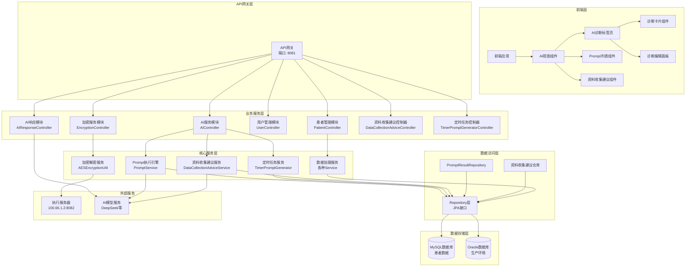
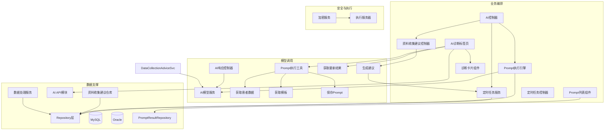
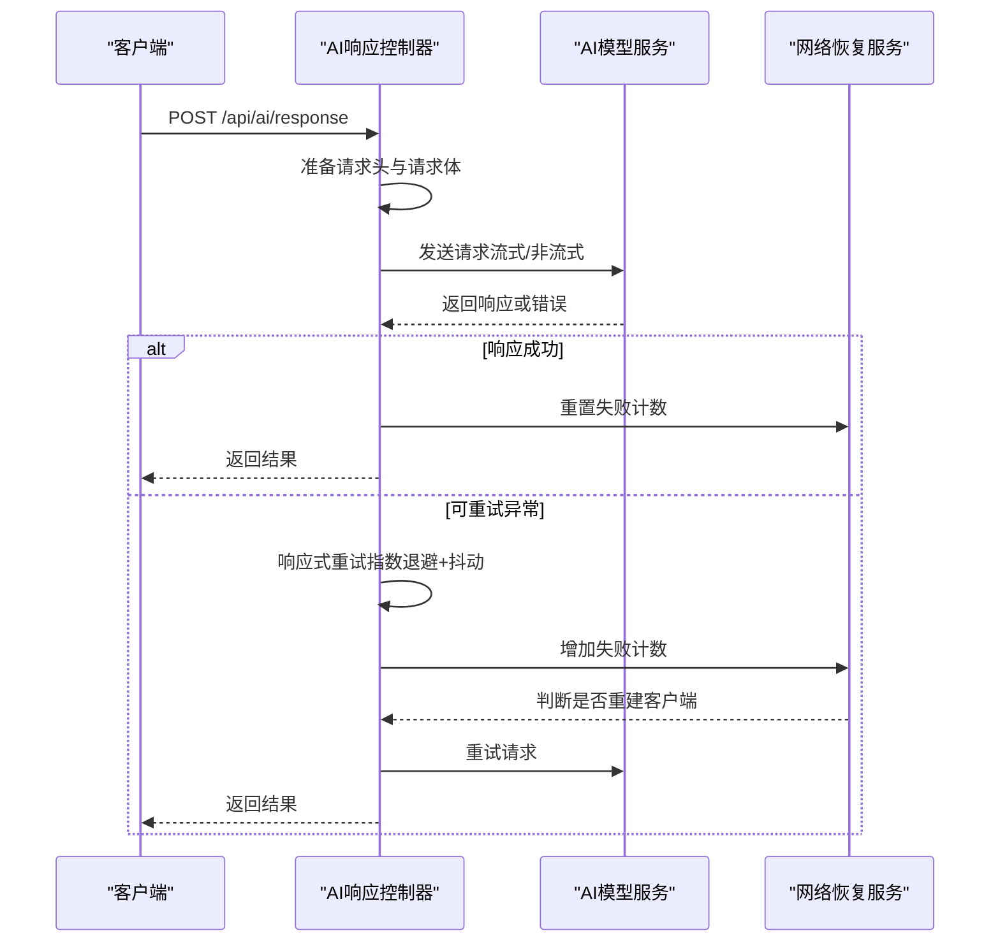
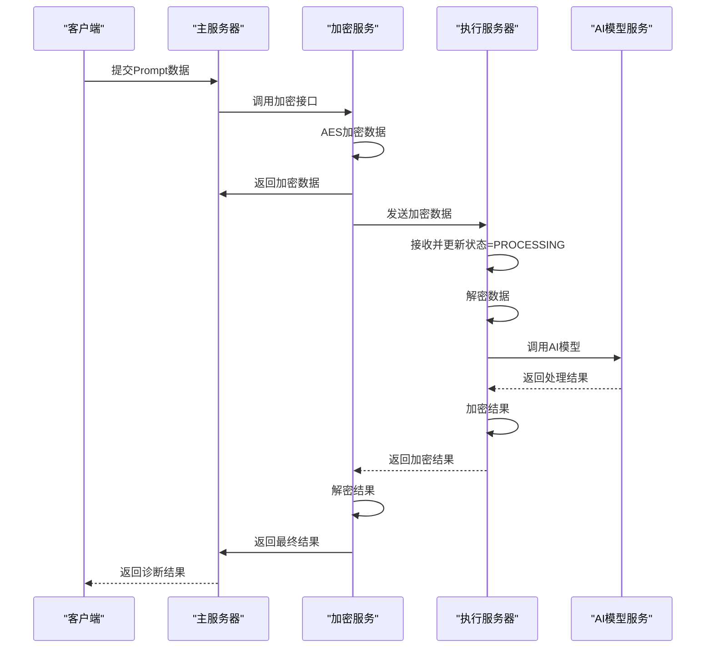
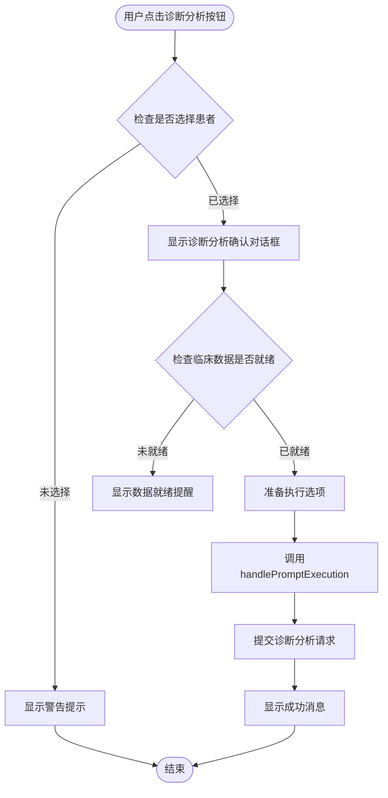
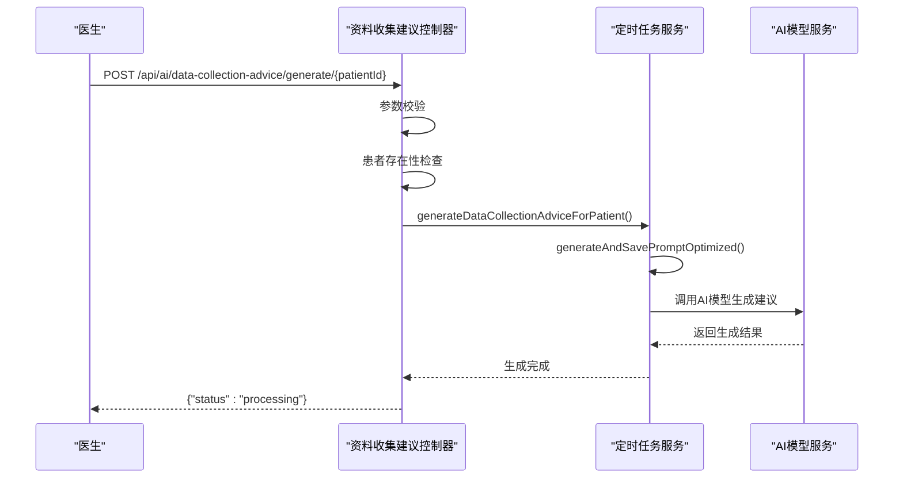
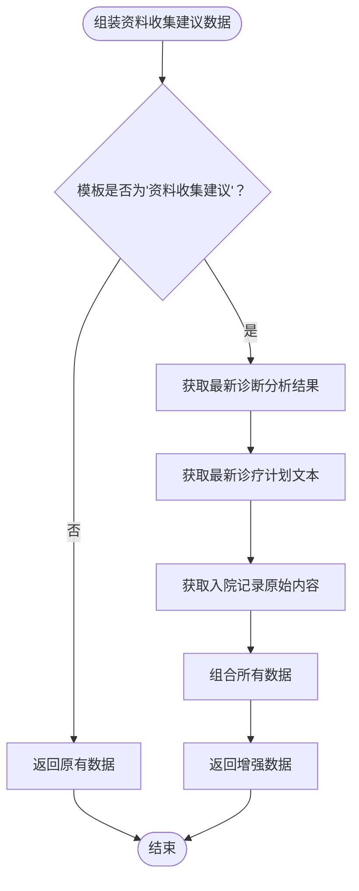
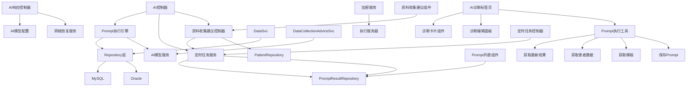

# AI诊断辅助系统

<cite>
**本文档引用的文件**
- [ARCHITECTURE_DIAGRAPH.md](file://med_ai_assistant_1.0_bs_backend/doc/其他/ARCHITECTURE_DIAGRAMS.md)
- [AI响应接口网络中断后连接失败问题分析与解决方案.md](file://med_ai_assistant_1.0_bs_backend/doc/其他/AI响应接口网络中断后连接失败问题分析与解决方案.md)
- [AI模型配置](file://med_ai_assistant_1.0_bs_backend/src/main/resources/ai-models.properties)
- [AI控制器](file://med_ai_assistant_1.0_bs_backend/src/main/java/com/example/medaiassistant/controller/AIController.java)
- [AI响应控制器](file://med_ai_assistant_1.0_bs_backend/src/main/java/com/example/medaiassistant/controller/AIResponseController.java)
- [AI模型配置类](file://med_ai_assistant_1.0_bs_backend/src/main/java/com/example/medaiassistant/config/AIModelConfig.java)
- [网络恢复服务](file://med_ai_assistant_1.0_bs_backend/src/main/java/com/example/medaiassistant/service/NetworkRecoveryService.java)
- [资料收集建议控制器](file://med_ai_assistant_1.0_bs_backend/src/main/java/com/example/medaiassistant/controller/DataCollectionAdviceController.java)
- [定时Prompt生成器](file://med_ai_assistant_1.0_bs_backend/src/main/java/com/example/medaiassistant/service/TimerPromptGenerator.java)
- [定时Prompt生成控制器](file://med_ai_assistant_1.0_bs_backend/src/main/java/com/example/medaiassistant/controller/TimerPromptGeneratorController.java)
- [Prompt列表组件](file://med_ai_assistant_1.0_bs_vue/src/components/ai/PromptList.vue)
- [AI诊断标签页组件](file://med_ai_assistant_1.0_bs_vue/src/components/patient/AIDiagnosisTab.vue)
- [AI视图组件](file://med_ai_assistant_1.0_bs_vue/src/views/AIView.vue)
- [promptUtils.js](file://med_ai_assistant_1.0_bs_vue/src/utils/promptUtils.js)
- [ai.js](file://med_ai_assistant_1.0_bs_vue/src/api/ai.js)
- [定时任务配置](file://med_ai_assistant_1.0_bs_backend/doc/其他/TIMER_TASK_CONFIGURATION.md)
- [资料收集建议TDD实施指南](file://med_ai_assistant_1.0_bs_backend/doc/迭代/进一步问诊建议/TDD实施指南.md)
- [PromptListDTO.java](file://med_ai_assistant_1.0_bs_backend/src/main/java/com/example/medaiassistant/dto/PromptListDTO.java)
- [PromptResultRepository.java](file://med_ai_assistant_1.0_bs_backend/src/main/java/com/example/medaiassistant/repository/PromptResultRepository.java)
</cite>

## 更新摘要
**变更内容**
- 新增资料收集建议功能，包括定时批量生成和手动触发API
- 数据组装增强：为资料收集建议模板追加诊断分析结果、诊疗计划和入院记录
- 定时任务系统：每日08:00自动为符合条件的患者生成建议
- 手动触发API：医生可随时刷新生成资料收集建议
- 前端组件：新增资料收集建议标签页和相关交互功能

## 目录
1. [简介](#简介)
2. [项目结构](#项目结构)
3. [核心组件](#核心组件)
4. [架构总览](#架构总览)
5. [详细组件分析](#详细组件分析)
6. [AI诊断页面增强功能](#ai诊断页面增强功能)
7. [资料收集建议功能](#资料收集建议功能)
8. [定时任务系统](#定时任务系统)
9. [数据组装增强](#数据组装增强)
10. [手动触发API](#手动触发api)
11. [前端组件集成](#前端组件集成)
12. [依赖关系分析](#依赖关系分析)
13. [性能考虑](#性能考虑)
14. [故障排除指南](#故障排除指南)
15. [结论](#结论)
16. [附录](#附录)

## 简介
本文件面向AI诊断辅助系统的使用者与维护者，系统性阐述AI模型集成机制、诊断算法实现与结果处理流程，重点覆盖以下方面：
- AI服务调用方式：同步与流式响应、模型参数映射、超时与重试策略
- 数据预处理：患者数据聚合、模板驱动的数据类型选择、脱敏与降级策略
- 模型推理过程：WebFlux响应式链路、DNS与连接池优化、网络恢复自动重建
- 结果后处理：结果落库、状态管理、健康检查与运维排障
- 配置与性能优化：多模型配置、超时与重试参数、连接池与DNS缓存
- 错误处理策略：可重试异常判定、自动恢复机制、健康状态探测
- 实际使用示例与最佳实践：接口调用、参数配置、运维排障
- 与主服务器和执行服务器的协作关系：加密传输、远程推理、状态同步
- **新增**：AI诊断页面空状态处理与临床数据就绪提醒机制
- **新增**：病情小结模板过滤功能，优化AI助手页面的模板展示
- **新增**：资料收集建议功能，包括定时批量生成和手动触发API
- **新增**：数据组装增强，为资料收集建议模板追加诊断分析结果、诊疗计划和入院记录
- **新增**：完整的定时任务系统，支持每日自动化的资料收集建议生成

## 项目结构
系统采用分层架构，核心围绕AI控制器、AI响应控制器、模型配置与网络恢复服务展开，配合Prompt执行引擎与数据服务模块，形成完整的AI诊断辅助闭环。新增的资料收集建议功能通过独立的控制器和定时任务服务实现。



**图表来源**
- [ARCHITECTURE_DIAGRAPH.md](file://med_ai_assistant_1.0_bs_backend/doc/其他/ARCHITECTURE_DIAGRAMS.md)

**章节来源**
- [ARCHITECTURE_DIAGRAPH.md](file://med_ai_assistant_1.0_bs_backend/doc/其他/ARCHITECTURE_DIAGRAMS.md)

## 核心组件
- AI控制器：负责Prompt模板管理、患者数据聚合与格式化、对话历史保存、结果查询与状态管理。优化后直接数据库查询，消除HTTP自调用死锁与超时问题。
- AI响应控制器：面向外部AI模型的统一入口，支持流式与非流式响应，集成响应式重试、DNS与连接池优化、网络恢复自动重建。
- AI模型配置类：集中管理多模型配置（URL、密钥、超时、重试），提供配置校验与默认模型选择。
- 网络恢复服务：维护连续失败计数与恢复窗口，达到阈值自动重建WebClient，保障网络波动后的可用性。
- 加密服务与执行服务器：在加密传输模式下，主服务器将敏感数据加密后发送至执行服务器，执行服务器解密后调用AI模型，再加密返回。
- **新增**：资料收集建议控制器：提供手动触发资料收集建议生成的API端点，支持医生随时刷新生成。
- **新增**：定时任务服务：负责定期生成诊断分析、诊疗计划、病情小结和资料收集建议等Prompt任务。
- **新增**：AI诊断标签页组件：负责AI诊断结果的展示、空状态处理、诊断分析触发等功能。
- **新增**：诊断卡片组件：提供诊断列表展示、工具栏操作、诊断分析触发等交互功能。
- **新增**：Prompt列表组件：负责展示Prompt执行历史，包含病情小结模板过滤功能。
- **新增**：资料收集建议组件：展示AI生成的进一步问诊、查体、辅助检查建议，支持手动刷新。

**章节来源**
- [AI控制器](file://med_ai_assistant_1.0_bs_backend/src/main/java/com/example/medaiassistant/controller/AIController.java)
- [AI响应控制器](file://med_ai_assistant_1.0_bs_backend/src/main/java/com/example/medaiassistant/controller/AIResponseController.java)
- [AI模型配置类](file://med_ai_assistant_1.0_bs_backend/src/main/java/com/example/medaiassistant/config/AIModelConfig.java)
- [网络恢复服务](file://med_ai_assistant_1.0_bs_backend/src/main/java/com/example/medaiassistant/service/NetworkRecoveryService.java)
- [资料收集建议控制器](file://med_ai_assistant_1.0_bs_backend/src/main/java/com/example/medaiassistant/controller/DataCollectionAdviceController.java)
- [定时Prompt生成器](file://med_ai_assistant_1.0_bs_backend/src/main/java/com/example/medaiassistant/service/TimerPromptGenerator.java)
- [AI诊断标签页组件](file://med_ai_assistant_1.0_bs_vue/src/components/patient/AIDiagnosisTab.vue)
- [诊断卡片组件](file://med_ai_assistant_1.0_bs_vue/src/components/ai/DiagnosisCard.vue)
- [Prompt列表组件](file://med_ai_assistant_1.0_bs_vue/src/components/ai/PromptList.vue)
- [资料收集建议组件](file://med_ai_assistant_1.0_bs_vue/src/components/ai/DataCollectionAdvice.vue)

## 架构总览
系统整体分为前端层、API网关层、业务服务层、核心服务层、数据访问层与数据存储层，以及外部AI模型与执行服务器。AI控制器与AI响应控制器分别承担业务编排与模型调用职责，Prompt执行引擎与数据服务模块提供数据支撑，加密服务与执行服务器实现安全的远程推理。新增的资料收集建议功能通过独立的服务层和控制器实现，与现有系统无缝集成。



**图表来源**
- [ARCHITECTURE_DIAGRAPH.md](file://med_ai_assistant_1.0_bs_backend/doc/其他/ARCHITECTURE_DIAGRAMS.md)

**章节来源**
- [ARCHITECTURE_DIAGRAPH.md](file://med_ai_assistant_1.0_bs_backend/doc/其他/ARCHITECTURE_DIAGRAMS.md)

## 详细组件分析

### AI控制器：数据聚合与模板驱动
- 功能要点
  - 患者数据聚合：根据模板配置动态选择数据类型（一般信息、诊断信息、病历记录、长期/临时医嘱、化验/检查结果、入院/会诊/手术记录等），直接数据库查询，避免HTTP自调用导致的超时与死锁。
  - 模板驱动的数据类型决策：优先读取模板配置的requiredDataTypes，自动补充"手术记录"，未提供模板参数时使用默认11种数据类型。
  - 三层降级策略：入院记录优先使用PromptResult中的"入院记录总结"，其次使用EMR_CONTENT原始记录，最后输出统一标记"无入院记录数据"。
  - 连续性功能：当模板名为"诊疗计划表"时，追加上次生成的治疗计划文本与QC质控评估结果。
  - 对话历史保存：事务性保存会话消息，及时暴露持久化异常。
  - **新增**：病情小结数据处理：直接查询medicalRecordRepository，过滤recordType包含"病情小结"的记录，提供最新的病情小结内容。
- 性能优化
  - 消除HTTP自调用，直接Repository查询，响应时间从5-30秒降至0.5-2秒，显著降低超时错误。
  - 时间过滤：查房记录模板对长期/临时医嘱与化验/检查结果应用时间范围过滤，减少无关数据。
- 错误处理
  - 单个数据类型失败不影响整体流程，错误信息不进入返回结果，仅记录日志便于排查。


**图表来源**
- [AI控制器](file://med_ai_assistant_1.0_bs_backend/src/main/java/com/example/medaiassistant/controller/AIController.java)

**章节来源**
- [AI控制器](file://med_ai_assistant_1.0_bs_backend/src/main/java/com/example/medaiassistant/controller/AIController.java)

### AI响应控制器：模型调用与网络恢复
- 功能要点
  - 统一入口：接收AI请求，准备请求头与请求体，支持流式与非流式响应。
  - 模型参数映射：将前端请求参数映射为模型API所需字段，特殊处理inHospitalDeepseek模型名称映射。
  - 响应式重试：在响应式链路中集成retryWhen，指数退避（1s→2s→4s）并加入随机抖动，仅对可重试异常生效。
  - DNS与连接池优化：配置连接池大小、空闲与生命周期、DNS缓存TTL与负缓存，提升网络稳定性。
  - 自动恢复：基于连续失败计数与恢复窗口，达到阈值自动重建WebClient，避免必须重启。
- 超时与重试
  - 连接超时：30秒；读取超时：300秒（5分钟）；最大重试：3次；指数退避与抖动降低重试风暴。
- 健康检查
  - 通过AI控制器的健康检查接口探测外部依赖状态，在degraded状态下触发自动恢复。



**图表来源**
- [AI响应控制器](file://med_ai_assistant_1.0_bs_backend/src/main/java/com/example/medaiassistant/controller/AIResponseController.java)
- [网络恢复服务](file://med_ai_assistant_1.0_bs_backend/src/main/java/com/example/medaiassistant/service/NetworkRecoveryService.java)

**章节来源**
- [AI响应控制器](file://med_ai_assistant_1.0_bs_backend/src/main/java/com/example/medaiassistant/controller/AIResponseController.java)
- [网络恢复服务](file://med_ai_assistant_1.0_bs_backend/src/main/java/com/example/medaiassistant/service/NetworkRecoveryService.java)

### AI模型配置：多模型与参数管理
- 功能要点
  - 配置绑定：以"ai"为前缀的配置属性，支持全局流式开关与多模型配置。
  - 模型配置：包含URL、密钥、连接/读取超时、最大重试次数、初始重试延迟等。
  - 配置校验：提供有效性检查与URL格式验证，支持默认模型选择与有效模型枚举。
  - 安全摘要：对外展示时隐藏密钥，便于运维审计。
- 配置示例
  - 支持DeepSeek聊天与推理模型，以及院内模型配置，便于后续扩展与替换。

**章节来源**
- [AI模型配置类](file://med_ai_assistant_1.0_bs_backend/src/main/java/com/example/medaiassistant/config/AIModelConfig.java)
- [AI模型配置](file://med_ai_assistant_1.0_bs_backend/src/main/resources/ai-models.properties)

### 加密传输与执行服务器协作
- 流程概览
  - 主服务器接收Prompt数据，调用加密接口进行AES加密。
  - 将加密数据保存并发送至执行服务器，执行服务器解密后调用AI模型。
  - 执行服务器对结果进行加密并返回，主服务器解密后落库并返回给前端。
- 关键点
  - EncryptedDataTemp状态管理：RECEIVED、PROCESSING、COMPLETED，确保流程可追溯。
  - 执行服务器严格遵守统一配置规范，避免参数差异导致的推理偏差。



**图表来源**
- [ARCHITECTURE_DIAGRAPH.md](file://med_ai_assistant_1.0_bs_backend/doc/其他/ARCHITECTURE_DIAGRAMS.md)

**章节来源**
- [ARCHITECTURE_DIAGRAPH.md](file://med_ai_assistant_1.0_bs_backend/doc/其他/ARCHITECTURE_DIAGRAMS.md)

## AI诊断页面增强功能

### AI诊断标签页组件：空状态处理与诊断分析触发
AI诊断标签页组件是本次更新的核心，负责处理AI诊断结果的展示与用户交互。

- **空状态处理机制**
  - 当患者没有诊断分析结果时，显示友好的空状态界面
  - 提供明显的"诊断分析"按钮，引导用户进行诊断分析
  - 使用InfoFilled图标和提示文本，营造专业的医疗界面体验

- **诊断分析触发流程**
  - 点击"诊断分析"按钮触发诊断分析确认对话框
  - 对话框明确列出需要就绪的临床数据清单
  - 提醒用户确认数据完整性以确保分析准确性

- **核心功能实现**
  - `triggerDiagnosisAnalysis()`方法：处理诊断分析触发逻辑
  - ElMessageBox.confirm：弹出确认对话框，包含HTML格式的提醒内容
  - handlePromptExecution：调用工具函数提交诊断分析任务
  - 状态管理：处理成功/失败状态，提供用户反馈



**图表来源**
- [AI诊断标签页组件](file://med_ai_assistant_1.0_bs_vue/src/components/patient/AIDiagnosisTab.vue)

**章节来源**
- [AI诊断标签页组件](file://med_ai_assistant_1.0_bs_vue/src/components/patient/AIDiagnosisTab.vue)

### 诊断卡片组件：工具栏增强
诊断卡片组件提供了丰富的工具栏操作，包括刷新、新增诊断等常用功能。

- **工具栏功能**
  - 刷新AI诊断列表：重新获取最新的诊断分析结果
  - 新增空白诊断：允许医生手动添加新的诊断条目
  - 诊断列表展示：清晰展示AI提取的诊断列表
  - 诊断项点击：支持点击诊断项进行查看详情

- **交互设计**
  - 使用Element Plus的Button Group组件
  - 提供Tooltip提示，提升用户体验
  - 支持诊断项的选中状态显示

**章节来源**
- [诊断卡片组件](file://med_ai_assistant_1.0_bs_vue/src/components/ai/DiagnosisCard.vue)

### Prompt执行工具：诊断分析流程支持
handlePromptExecution工具函数为诊断分析提供了完整的执行流程支持。

- **参数处理**
  - 自动检测模板类型，支持"诊断分析"默认类型
  - 处理特殊模板（如"首次病程记录"）的入院记录替补逻辑
  - 并行获取患者数据和模板内容，提升执行效率

- **数据处理**
  - 支持字符串和对象格式的患者数据
  - 自动合并数据为单个字符串
  - 支持附加信息的追加

- **执行选项**
  - 默认优先级：3
  - 默认状态：待处理
  - 支持用户ID、排序号等自定义选项

**章节来源**
- [promptUtils.js](file://med_ai_assistant_1.0_bs_vue/src/utils/promptUtils.js)

### AI API模块：诊断分析结果获取
AI API模块提供了诊断分析结果的获取接口。

- **最新结果获取**
  - `getLatestPromptResult()`：根据患者ID和模板名称获取最新分析结果
  - 支持诊断分析模板的专门查询
  - 返回原始结果内容和执行时间信息

- **数据格式**
  - 返回包装格式的响应数据
  - 包含resultId、originalResultContent、executionTime等字段
  - 支持无结果时的null处理

**章节来源**
- [ai.js](file://med_ai_assistant_1.0_bs_vue/src/api/ai.js)

## 资料收集建议功能

### 资料收集建议控制器：手动触发API
资料收集建议控制器为医生提供了手动触发资料收集建议生成的API端点。

- **功能特性**
  - 手动触发生成：医生点击"刷新建议"按钮时调用此接口
  - 立即响应：接口立即返回processing状态，AI生成任务在后台异步执行
  - 参数校验：验证patientId的有效性和患者的存在性
  - Profile隔离：@Profile("!execution")确保仅在主服务器运行

- **API接口**
  - POST /api/ai/data-collection-advice/generate/{patientId}
  - 响应格式：{"status": "processing"}
  - 状态码：200（成功）、400（参数错误）、404（患者不存在）

- **核心实现**
  - `generateAdvice()`方法：处理手动触发逻辑
  - PatientRepository：验证患者存在性
  - TimerPromptGenerator：异步启动生成任务
  - 状态管理：返回processing状态供前端轮询



**图表来源**
- [资料收集建议控制器](file://med_ai_assistant_1.0_bs_backend/src/main/java/com/example/medaiassistant/controller/DataCollectionAdviceController.java)
- [定时Prompt生成器](file://med_ai_assistant_1.0_bs_backend/src/main/java/com/example/medaiassistant/service/TimerPromptGenerator.java)

**章节来源**
- [资料收集建议控制器](file://med_ai_assistant_1.0_bs_backend/src/main/java/com/example/medaiassistant/controller/DataCollectionAdviceController.java)

### 资料收集建议组件：前端展示与交互
资料收集建议组件为医生提供了直观的建议展示界面。

- **状态管理**
  - loading状态：显示骨架屏加载效果
  - completed状态：渲染Markdown格式的建议内容
  - processing状态：显示生成中提示
  - empty状态：显示无建议提示和生成按钮

- **核心功能**
  - `handleRefresh()`：处理刷新建议按钮点击事件
  - `formattedTime()`：格式化生成时间显示
  - `renderedContent()`：渲染Markdown内容
  - 自动轮询：状态变为completed后停止轮询

- **用户体验**
  - 生成时间显示：显示建议的生成时间
  - 刷新按钮：支持手动重新生成
  - Markdown渲染：支持三级标题结构的建议内容
  - 基于信息标注：显示建议所依据的数据来源

**章节来源**
- [资料收集建议组件](file://med_ai_assistant_1.0_bs_vue/src/components/ai/DataCollectionAdvice.vue)

## 定时任务系统

### 定时任务控制器：系统管理
定时任务控制器提供了对定时任务系统的完整管理接口。

- **核心功能**
  - `startTimer()`：启动定时器
  - `stopTimer()`：停止定时器
  - `timerStatus()`：查询定时器状态
  - `triggerDailyPromptGeneration()`：手动触发每日Prompt生成

- **手动触发机制**
  - 支持临时修改执行时间和最大并发数
  - 执行完成后自动恢复原始配置
  - 提供详细的执行结果信息

- **系统集成**
  - 与TimerPromptGenerator服务集成
  - 支持定时器状态的实时查询
  - 提供系统健康检查接口

**章节来源**
- [定时Prompt生成控制器](file://med_ai_assistant_1.0_bs_backend/src/main/java/com/example/medaiassistant/controller/TimerPromptGeneratorController.java)

### 定时任务配置：参数设置
定时任务系统支持灵活的配置参数设置。

- **配置参数**
  - `timergenerator.daily.time`：每日任务cron表达式，默认"0 0 8 * * *"（每天08:00）
  - `maxConcurrency`：最大并发数，默认5
  - `schedulingProperties`：调度属性配置

- **Cron表达式格式**
  ```
  秒 分 时 日 月 周 年
  ```

- **常用示例**
  - `0 0 7 * * *` - 每天07:00
  - `0 0/30 * * * *` - 每30分钟
  - `0 0 9-17 * * MON-FRI` - 工作日9点到17点整点

**章节来源**
- [定时任务配置](file://med_ai_assistant_1.0_bs_backend/doc/其他/TIMER_TASK_CONFIGURATION.md)

## 数据组装增强

### AI控制器数据组装增强
AI控制器为资料收集建议模板增强了数据组装逻辑。

- **增强逻辑**
  - 当模板为"资料收集建议"时，追加最新诊断分析结果
  - 追加最新诊疗计划纯文本
  - 追加入院记录原始内容（非入院记录总结）
  - 保持原有行为，非"资料收集建议"模板不追加额外数据

- **数据来源**
  - 最新诊断分析结果：通过PromptResultRepository查询
  - 诊疗计划文本：通过TreatmentPlanItemService获取
  - 入院记录内容：通过AdmissionRecordService获取原始内容

- **异常处理**
  - 无诊断分析结果时不抛出异常，对应字段为空
  - 无诊疗计划时不抛出异常，对应字段为空
  - 多条诊断分析结果时取最新一条



**图表来源**
- [AI控制器](file://med_ai_assistant_1.0_bs_backend/src/main/java/com/example/medaiassistant/controller/AIController.java)

**章节来源**
- [AI控制器](file://med_ai_assistant_1.0_bs_backend/src/main/java/com/example/medaiassistant/controller/AIController.java)

### 资料收集建议模板配置
系统通过数据库模板配置支持资料收集建议功能。

- **模板配置**
  - `promptType = "资料总结"`
  - `promptName = "资料收集建议"`
  - `requiredDataTypes`：包含"一般信息,诊断信息,病历记录"
  - 模板内容包含三级标题结构（## 问诊 / ## 查体 / ## 辅助检查）

- **模板作用**
  - 为AI模型提供标准化的提示词
  - 确保生成内容的结构化和完整性
  - 支持进一步问诊、查体、辅助检查的建议生成

**章节来源**
- [资料收集建议TDD实施指南](file://med_ai_assistant_1.0_bs_backend/doc/迭代/进一步问诊建议/TDD实施指南.md)

## 手动触发API

### API接口规范
资料收集建议的手动触发API提供了完整的接口规范。

- **接口定义**
  - 方法：POST
  - 路径：/api/ai/data-collection-advice/generate/{patientId}
  - 功能：手动触发为指定患者生成资料收集建议

- **请求参数**
  - 路径参数：patientId（必须，非空字符串）
  - 参数校验：验证patientId的有效性

- **响应格式**
  - 成功：{"status": "processing"}
  - 参数错误：{"error": "patientId不能为空"}
  - 患者不存在：404状态码

- **业务逻辑**
  - 立即返回processing状态
  - 异步启动AI生成任务
  - 生成完成后可通过查询接口获取结果

**章节来源**
- [资料收集建议控制器](file://med_ai_assistant_1.0_bs_backend/src/main/java/com/example/medaiassistant/controller/DataCollectionAdviceController.java)

### 前端API集成
前端通过API层与后端手动触发接口进行集成。

- **API封装**
  - `generateDataCollectionAdvice(patientId)`：触发生成建议
  - `getDataCollectionAdvice(patientId)`：查询建议结果
  - 错误处理：统一的错误捕获和用户提示

- **交互流程**
  - 医生点击"刷新建议"按钮
  - 调用generateDataCollectionAdvice接口
  - 显示processing状态并开始轮询
  - 获取completed状态后渲染建议内容

**章节来源**
- [资料收集建议组件](file://med_ai_assistant_1.0_bs_vue/src/components/ai/DataCollectionAdvice.vue)

## 前端组件集成

### 资料收集建议标签页
资料收集建议标签页为医生提供了独立的功能界面。

- **界面设计**
  - 位于患者详情页"病历记录"标签页右侧
  - 独立的标签页组件，与诊断分析标签页并列
  - 支持手动刷新和自动轮询

- **核心功能**
  - 建议内容展示：Markdown格式渲染
  - 生成状态管理：loading、processing、completed、empty状态
  - 生成时间显示：显示建议的生成时间
  - 刷新机制：支持手动重新生成建议

- **用户体验**
  - 骨架屏加载：提升加载体验
  - 状态提示：清晰的状态指示
  - 错误处理：友好的错误提示
  - 基于信息标注：显示建议的数据来源

**章节来源**
- [资料收集建议组件](file://med_ai_assistant_1.0_bs_vue/src/components/ai/DataCollectionAdvice.vue)

### 定时任务管理界面
定时任务管理界面为系统管理员提供了定时任务的可视化管理。

- **功能特性**
  - 定时器状态显示：实时显示定时器运行状态
  - 启动/停止控制：支持定时器的启动和停止
  - 手动执行：支持手动触发每日Prompt生成
  - 状态同步：定期查询后端定时器状态

- **用户交互**
  - 按钮组：自动生成、停止、手动执行
  - 成功/失败提示：操作结果的用户反馈
  - 状态轮询：自动同步后端状态

**章节来源**
- [定时任务管理组件](file://med_ai_assistant_1.0_bs_vue/src/components/server/PromptGenerator.vue)

## 依赖关系分析
- 组件耦合
  - AI控制器依赖Prompt执行引擎与各类数据服务，直接数据库查询降低耦合度与超时风险。
  - AI响应控制器依赖AI模型配置与网络恢复服务，通过WebClient与响应式链路实现高可用。
  - 加密服务与执行服务器形成独立的安全通道，避免敏感数据在主服务器驻留。
  - **新增**：资料收集建议控制器依赖定时任务服务，实现手动触发和异步生成。
  - **新增**：定时任务服务依赖AI控制器的定时任务生成逻辑，支持多类型Prompt的批量生成。
  - **新增**：AI诊断页面通过handlePromptExecution工具函数与后端API进行交互。
  - **新增**：PromptList组件依赖PromptResultRepository进行数据查询，实现模板过滤功能。
  - **新增**：定时任务管理组件依赖定时任务控制器，提供系统管理界面。

- 外部依赖
  - 外部AI模型服务（如DeepSeek）与执行服务器，健康状态通过健康检查接口反馈。
  - 数据库：MySQL与Oracle双活，支持动态切换与健康检查。
  - **新增**：Element Plus组件库，提供现代化的UI组件支持。
  - **新增**：Vue.js生态系统，支持组件化开发和状态管理。



**图表来源**
- [ARCHITECTURE_DIAGRAPH.md](file://med_ai_assistant_1.0_bs_backend/doc/其他/ARCHITECTURE_DIAGRAMS.md)

**章节来源**
- [ARCHITECTURE_DIAGRAPH.md](file://med_ai_assistant_1.0_bs_backend/doc/其他/ARCHITECTURE_DIAGRAMS.md)

## 性能考虑
- 网络优化
  - 连接池：最大连接数、空闲与生命周期、后台逐出策略，避免连接泄露与不健康状态滞留。
  - DNS缓存：正缓存1-5分钟、负缓存30秒，降低解析压力与负缓存影响。
  - IPv4优先：减少IPv6环境异常带来的解析问题。
- 响应式重试
  - 指数退避与抖动，避免重试风暴；仅对可重试异常生效，提升成功率。
- 数据查询优化
  - 直接数据库查询替代HTTP自调用，显著降低响应时间与超时风险。
  - **新增**：PromptResultRepository使用LIKE操作符优化模板名称查询，提升查询性能。
  - **新增**：定时任务批量生成Prompt，减少重复查询开销。
  - **新增**：资料收集建议模板的条件查询优化，仅查询符合条件的患者。
- 超时与重试参数
  - 连接超时30秒、读取超时300秒、最大重试3次，平衡用户体验与资源消耗。
- **新增**：前端组件优化
  - 空状态处理：避免不必要的API调用，提升页面响应速度
  - 并行数据获取：通过handlePromptExecution工具函数实现多接口并发请求
  - **新增**：模板过滤：前端直接过滤不需要显示的模板，减少数据传输
  - **新增**：状态轮询：智能轮询策略，completed状态后停止轮询
  - **新增**：组件懒加载：按需加载资料收集建议组件，提升首屏性能

**章节来源**
- [AI响应接口网络中断后连接失败问题分析与解决方案.md](file://med_ai_assistant_1.0_bs_backend/doc/其他/AI响应接口网络中断后连接失败问题分析与解决方案.md)

## 故障排除指南
- 网络中断后连接失败
  - 现象：/api/ai/response偶发"无法连接到DeepSeek"，健康检查返回degraded。
  - 根因：DNS负缓存、连接池状态不健康、重试位置不当。
  - 解决：响应式重试、DNS与连接池优化、自动重建客户端、健康探测与自动恢复。
- 健康检查
  - 通过/checkAIStatus接口探测外部依赖可达性；在degraded状态下触发自动恢复。
- 运维排查
  - DNS：刷新缓存、指定可信DNS、验证端口连通性。
  - 代理/防火墙：检查策略与SSL拦截；确认443出口畅通。
  - 配置：核对ai-models.properties的URL与密钥，确保无空格与未过期。
- **新增**：资料收集建议功能排查
  - 手动触发API无响应：检查资料收集建议控制器的日志和定时任务服务状态
  - 建议内容不显示：验证AI模型服务的可用性和生成结果的存储状态
  - 定时任务不执行：检查定时任务配置和Cron表达式的正确性
  - 前端组件加载失败：确认Vue组件的正确引入和依赖版本兼容性
  - 数据组装异常：验证AI控制器的数据组装逻辑和相关服务的可用性
- **新增**：定时任务系统问题排查
  - 定时器状态异常：检查定时任务控制器的接口调用和后端状态同步
  - 手动触发失败：验证临时配置修改和原始配置恢复的逻辑
  - 并发控制问题：检查最大并发数设置和线程池配置

**章节来源**
- [AI响应接口网络中断后连接失败问题分析与解决方案.md](file://med_ai_assistant_1.0_bs_backend/doc/其他/AI响应接口网络中断后连接失败问题分析与解决方案.md)

## 结论
本系统通过"模板驱动的数据聚合、响应式重试与DNS/连接池优化、自动恢复机制"三大支柱，实现了高可用、高性能的AI诊断辅助能力。AI控制器与AI响应控制器分别承担业务编排与模型调用职责，配合加密传输与执行服务器，确保敏感数据安全与推理一致性。通过完善的健康检查与运维排障机制，系统在网络波动与异常情况下仍能保持稳定运行。

**新增功能总结**
- AI诊断页面空状态处理：通过友好的空状态界面和明确的操作按钮，提升了用户体验
- 诊断分析确认机制：通过临床数据就绪提醒，确保分析质量，减少因数据不完整导致的误诊风险
- 工作流程优化：为医生提供了更清晰的诊断分析流程，提高了工作效率
- **新增**：资料收集建议功能：包括定时批量生成和手动触发API，为医生提供进一步问诊、查体、辅助检查的智能化建议
- **新增**：数据组装增强：为资料收集建议模板追加诊断分析结果、诊疗计划和入院记录，确保AI获取完整上下文
- **新增**：完整的定时任务系统：支持每日自动化的资料收集建议生成，提升系统自动化水平
- **新增**：前端组件优化：新增资料收集建议标签页和相关交互功能，提升用户体验
- **新增**：病情小结模板过滤功能：优化AI助手页面的模板展示，避免重复显示，提升用户体验
- **新增**：定时任务批量生成：减少重复查询开销，提升系统性能
- **新增**：智能轮询机制：前端组件根据状态智能轮询，completed状态后自动停止，节省系统资源

## 附录
- 实际使用示例
  - 获取患者数据：GET /api/ai/patient-data?patientId={id}&promptType={type}&promptName={name}
  - 保存AI结果：POST /api/ai/saveAIResult（请求体包含promptId与结果内容）
  - 健康检查：GET /api/ai/health/ai-status
  - **新增**：获取最新诊断分析结果：GET /api/ai/latestPromptResult?patientId={id}&promptName=诊断分析
  - **新增**：获取患者综合信息：GET /api/ai/patient-comprehensive-info?patientId={id}
  - **新增**：获取Prompt列表详情：GET /api/ai/patientPromptDetails?patientId={id}
  - **新增**：手动触发资料收集建议：POST /api/ai/data-collection-advice/generate/{patientId}
  - **新增**：查询资料收集建议结果：GET /api/ai/data-collection-advice/{patientId}
  - **新增**：启动定时器：GET /timer-prompt-generator/start
  - **新增**：停止定时器：GET /timer-prompt-generator/stop
  - **新增**：查询定时器状态：GET /timer-prompt-generator/status
  - **新增**：手动触发每日生成：GET /timer-prompt-generator/trigger-daily
- 最佳实践
  - 优先使用模板驱动的数据类型配置，确保数据完整性与一致性。
  - 在网络波动环境中启用响应式重试与自动恢复，避免人工干预。
  - 定期检查DNS与连接池配置，维持最优性能与稳定性。
  - 对敏感数据采用加密传输，确保合规与安全。
  - **新增**：在进行诊断分析前，确保所有必要的临床数据已就绪，以获得准确的分析结果。
  - **新增**：利用AI诊断页面的空状态提示，及时触发诊断分析，避免遗漏重要的诊断信息。
  - **新增**：合理使用病情小结模板过滤功能，确保AI助手页面的整洁性和用户体验。
  - **新增**：定期检查定时任务的执行情况，确保病情小结等自动化功能正常运行。
  - **新增**：充分利用资料收集建议功能，提升问诊质量和效率，减少漏诊风险。
  - **新增**：合理配置定时任务的执行时间和并发数，平衡系统负载和响应速度。
  - **新增**：利用前端组件的智能轮询机制，避免不必要的API调用，提升系统性能。