# AI诊断辅助系统

<cite>
**本文引用的文件**
- [执行服务器LLM调用优化敏捷迭代规划.md](file://med_ai_assistant_1.0_bs_backend/doc/其他/执行服务器LLM调用优化敏捷迭代规划.md)
- [API文档.md](file://med_ai_assistant_1.0_bs_backend/doc/其他/API_DOCUMENTATION.md)
- [AI模型配置类.java](file://med_ai_assistant_1.0_bs_backend/src/main/java/com/example/medaiassistant/config/AIModelConfig.java)
- [执行服务器控制器.java](file://med_ai_assistant_1.0_bs_backend/src/main/java/com/example/medaiassistant/controller/ExecutionServerController.java)
- [系统架构图.md](file://med_ai_assistant_1.0_bs_backend/doc/其他/ARCHITECTURE_DIAGRAMS.md)
- [AI响应接口网络中断后连接失败问题分析与解决方案.md](file://med_ai_assistant_1.0_bs_backend/doc/其他/AI响应接口网络中断后连接失败问题分析与解决方案.md)
- [执行服务器架构简化实施报告.md](file://med_ai_assistant_1.0_bs_backend/doc/其他/执行服务器架构简化实施报告.md)
- [执行服务器性能优化方案.md](file://med_ai_assistant_1.0_bs_backend/doc/其他/执行服务器性能优化方案.md)
- [application.properties](file://med_ai_assistant_1.0_bs_backend/src/main/resources/application.properties)
- [ai.js](file://med_ai_assistant_1.0_bs_vue/src/api/ai.js)
- [2026-04-13更新日志.md](file://med_ai_assistant_1.0_bs_vue/docs/更新日志/2026-04-13.md)
- [2026-03-25更新日志.md](file://med_ai_assistant_1.0_bs/更新小结.md)
- [2026-03-24更新日志.md](file://med_ai_assistant_1.0_bs/更新小结.md)
- [2026-03-23更新日志.md](file://med_ai_assistant_1.0_bs/更新小结.md)
- [2026-03-21更新日志.md](file://med_ai_assistant_1.0_bs/更新小结.md)
- [2026-03-20更新日志.md](file://med_ai_assistant_1.0_bs/更新小结.md)
- [2026-03-08更新日志.md](file://med_ai_assistant_1.0_bs/更新小结.md)
- [MccScreeningController.java](file://med_ai_assistant_1.0_bs_backend/src/main/java/com/example/medaiassistant/controller/MccScreeningController.java)
- [DRG分析接口.md](file://med_ai_assistant_1.0_bs_backend/doc/接口/DRG分析接口.md)
- [drg.js](file://med_ai_assistant_1.0_bs_vue/src/api/drg.js)
- [DrgAnalysis.vue](file://med_ai_assistant_1.0_bs_vue/src/components/patient/DrgAnalysis.vue)
- [DRG分析API接口.md](file://med_ai_assistant_1.0_bs_backend/doc/系统结构/DRG分析/DRG分析API接口.md)
- [MccScreeningService.java](file://med_ai_assistant_1.0_bs_backend/src/main/java/com/example/medaiassistant/service/MccScreeningService.java)
- [MccCandidate.java](file://med_ai_assistant_1.0_bs_backend/src/main/java/com/example/medaiassistant/model/MccCandidate.java)
- [PromptTemplates.vue](file://med_ai_assistant_1.0_bs_vue/src/components/ai/PromptTemplates.vue)
- [PromptTemplateEditDialog.vue](file://med_ai_assistant_1.0_bs_vue/src/components/ai/PromptTemplateEditDialog.vue)
- [PromptList.vue](file://med_ai_assistant_1.0_bs_vue/src/components/ai/PromptList.vue)
- [PromptExecutor.vue](file://med_ai_assistant_1.0_bs_vue/src/components/server/PromptExecutor.vue)
- [promptUtils.js](file://med_ai_assistant_1.0_bs_vue/src/utils/promptUtils.js)
- [TopMenu.vue](file://med_ai_assistant_1.0_bs_vue/src/components/TopMenu.vue)
- [监护仪呼吸机AI OCR数据采集方案.md](file://med_ai_assistant_1.0_bs_backend/doc/迭代/AI OCR数据采集/监护仪呼吸机AI OCR数据采集方案.md)
- [AIController.java](file://med_ai_assistant_1.0_bs_backend/src/main/java/com/example/medaiassistant/controller/AIController.java)
- [PromptResultRepository.java](file://med_ai_assistant_1.0_bs_backend/src/main/java/com/example/medaiassistant/repository/PromptResultRepository.java)
- [ai.js](file://med_ai_assistant_1.0_bs_vue/src/api/ai.js)
- [MedicalRecordController.java](file://med_ai_assistant_1.0_bs_backend/src/main/java/com/example/medaiassistant/controller/MedicalRecordController.java)
- [RepeatOperationQueryService.java](file://med_ai_assistant_1.0_bs_backend/src/main/java/com/example/medaiassistant/service/RepeatOperationQueryService.java)
- [RepeatOperationController.java](file://med_ai_assistant_1.0_bs_backend/src/main/java/com/example/medaiassistant/controller/RepeatOperationController.java)
- [Hibernate自动刷新机制CLOB异常问题分析与解决方案.md](file://med_ai_assistant_1.0_bs_backend/doc/其他/Hibernate自动刷新机制CLOB异常问题分析与解决方案.md)
- [PromptTemplate.java](file://med_ai_assistant_1.0_bs_backend/src/main/java/com/example/medaiassistant/model/PromptTemplate.java)
- [UpdatePromptTemplateDTO.java](file://med_ai_assistant_1.0_bs_backend/src/main/java/com/example/medaiassistant/dto/UpdatePromptTemplateDTO.java)
- [DepartmentDTO.java](file://med_ai_assistant_1.0_bs_backend/src/main/java/com/example/medaiassistant/dto/DepartmentDTO.java)
- [SqlExecutionService.java](file://med_ai_assistant_1.0_bs_backend/src/main/java/com/example/medaiassistant/hospital/service/SqlExecutionService.java)
- [HospitalConfigTestController.java](file://med_ai_assistant_1.0_bs_backend/src/main/java/com/example/medaiassistant/controller/HospitalConfigTestController.java)
- [ResponseCacheUtil.java](file://med_ai_assistant_1.0_bs_backend/src/main/java/com/example/medaiassistant/util/ResponseCacheUtil.java)
- [ClobManager.java](file://med_ai_assistant_1.0_bs_backend/src/main/java/com/example/medaiassistant/util/ClobManager.java)
- [待办事项接口.md](file://med_ai_assistant_1.0_bs_backend/doc/接口/病历记录/待办事项接口.md)
- [patient.js](file://med_ai_assistant_1.0_bs_vue/src/api/patient.js)
- [DiagnosisCard.vue](file://med_ai_assistant_1.0_bs_vue/src/components/ai/DiagnosisCard.vue)
- [diagnosisParser.js](file://med_ai_assistant_1.0_bs_vue/src/utils/diagnosisParser.js)
- [AIResults.vue](file://med_ai_assistant_1.0_bs_vue/src/components/ai/AIResults.vue)
- [MedicalRecords.vue](file://med_ai_assistant_1.0_bs_vue/src/components/patient/MedicalRecords.vue)
- [voiceTextProcessor.js](file://med_ai_assistant_1.0_bs_vue/src/utils/voiceTextProcessor.js)
- [DiagnosisEditDialog.vue](file://med_ai_assistant_1.0_bs_vue/src/components/patient/DiagnosisEditDialog.vue)
</cite>

## 更新摘要
**变更内容**
- 新增Streamed Text Processing Response System流式文本处理系统，支持实时LLM响应显示
- 新增AI-Assisted Diagnostic Overview Card Component诊断概览卡片组件，提供诊断列表和详细分析功能
- 优化MedicalRecords组件的文字整理功能，从非流式改为流式响应
- 增强诊断解析工具函数，支持完整的诊断块提取和解析
- 完善诊断编辑对话框的AI诊断列表刷新机制

## 目录
1. [简介](#简介)
2. [项目结构](#项目结构)
3. [核心组件](#核心组件)
4. [架构总览](#架构总览)
5. [详细组件分析](#详细组件分析)
6. [依赖关系分析](#依赖关系分析)
7. [性能考虑](#性能考虑)
8. [故障排查指南](#故障排查指南)
9. [结论](#结论)
10. [附录](#附录)

## 简介
本文件面向AI诊断辅助系统，系统采用"主服务器 + 执行服务器"的双层架构：主服务器负责业务编排、数据聚合与对外API，执行服务器专注于高时延LLM调用与加密处理。系统通过专用RestTemplate优化LLM超时配置、实现指数退避重试、完善错误分类与恢复策略，并提供性能监控与统计接口，确保在复杂医疗文本分析场景下的稳定性与可靠性。

**最新更新** 新增Streamed Text Processing Response System流式文本处理系统，支持实时LLM响应显示；新增AI-Assisted Diagnostic Overview Card Component诊断概览卡片组件，提供诊断列表和详细分析功能；优化MedicalRecords组件的文字整理功能，从非流式改为流式响应；增强诊断解析工具函数，支持完整的诊断块提取和解析。

## 项目结构
项目采用多模块/多文档组织方式，核心后端位于 `med_ai_assistant_1.0_bs_backend` 目录，前端位于 `med_ai_assistant_1.0_bs_vue` 目录，包含：
- 配置与控制器：AI模型配置类、执行服务器控制器、MCC筛查控制器、重复手术查询控制器等
- 前端AI服务：aiService.js提供统一的AI服务调用接口，drg.js提供DRG/MCC分析API
- 模板管理：PromptTemplates.vue、PromptTemplateEditDialog.vue等模板管理组件
- MCC分析模块：完整的MCC预筛选、相似度计算、Prompt生成功能
- **流式文本处理系统**：新增analyzeLLMStream函数和processRecognizedTextStream工具，支持实时LLM响应显示
- **AI诊断概览卡片**：新增DiagnosisCard.vue组件，提供诊断列表和详细分析功能
- **增强的诊断解析**：新增diagnosisParser.js工具，支持完整的诊断块提取和解析
- **优化的文字整理**：MedicalRecords.vue中的processVoiceRecognitionText方法支持流式实时更新
- **科室特殊情况补充信息**：新增SPECIAL_CONTENT字段支持科室特定模板的个性化配置
- **优化的待办事项查询**：实现按病历ID去重算法，提升用户界面体验
- **数据库缓存修复**：解决Hibernate缓存导致的状态验证失败问题
- **CLOB内存管理**：新增ClobManager工具类，优化大文本处理性能
- **SQL执行缓存**：增强缓存清理和监控功能，支持动态配置管理
- 文档：API文档、架构图、性能优化与问题分析报告
- 部署与测试：部署说明、自动化构建配置、测试脚本等
- **AI OCR数据采集**：监护仪呼吸机AI OCR数据采集完整技术方案

```mermaid
graph TB
subgraph "后端服务"
Main["主服务器<br/>业务编排与对外API"]
Exec["执行服务器<br/>LLM调用与加密处理"]
MCC["MCC分析服务<br/>预筛选与Prompt生成"]
OCRAPI["OCR数据采集服务<br/>设备屏幕识别与数据处理"]
LatestAPI["最新提示结果接口<br/>GET /api/ai/latestPromptResult"]
TodoOptimization["待办事项优化<br/>去重算法与查询优化"]
CacheFix["缓存修复<br/>Hibernate缓存问题解决"]
ClobManager["CLOB内存管理<br/>防止内存泄漏"]
SqlCache["SQL执行缓存<br/>动态清理与监控"]
SpecialContent["科室特殊内容<br/>SPECIAL_CONTENT字段"]
end
subgraph "前端应用"
VueApp["Vue.js 应用<br/>AI对话界面"]
AIService["AI服务模块<br/>aiService.js"]
DRGAPI["DRG/MCC分析API<br/>drg.js"]
PromptTemplates["模板管理组件<br/>PromptTemplates.vue"]
PromptEditor["模板编辑对话框<br/>PromptTemplateEditDialog.vue"]
TopMenu["顶部菜单组件<br/>TopMenu.vue"]
OCRDash["OCR数据看板<br/>实时监控界面"]
DrgAnalysis["DRG分析组件<br/>DrgAnalysis.vue"]
LatestAPIFront["最新提示结果API<br/>getLatestPromptResult"]
TodoFront["待办事项界面<br/>优化后的查询结果"]
StreamSystem["流式文本处理系统<br/>analyzeLLMStream + processRecognizedTextStream"]
DiagnosisCard["诊断概览卡片<br/>DiagnosisCard.vue"]
DiagnosisParser["诊断解析工具<br/>diagnosisParser.js"]
MedicalRecords["病历管理组件<br/>MedicalRecords.vue + voiceTextProcessor.js"]
EndDevice[("医疗设备")]
end
subgraph "外部系统"
LLM["LLM服务"]
DB[("数据库")]
OCRDB[("OCR数据库")]
MCCDB[("MCC字典库")]
ExternalSystem["外部医疗系统"]
EndDevice[("医疗设备")]
end
VueApp --> AIService
AIService --> Main
DRGAPI --> Main
Main --> Exec
Main --> MCC
Main --> OCRAPI
Main --> LatestAPI
Main --> TodoOptimization
Main --> CacheFix
Main --> ClobManager
Main --> SqlCache
Main --> SpecialContent
Exec --> LLM
Main --> DB
MCC --> MCCDB
Exec --> DB
OCRAPI --> OCRDB
OCRAPI --> EndDevice
DrgAnalysis --> DRGAPI
DrgAnalysis --> LatestAPIFront
PromptTemplates --> AIService
PromptEditor --> AIService
TopMenu --> AIService
OCRDash --> Main
TodoFront --> TodoOptimization
StreamSystem --> AIService
DiagnosisCard --> DiagnosisParser
MedicalRecords --> StreamSystem
ExternalSystem --> LatestAPI
```

**图表来源**
- [执行服务器LLM调用优化敏捷迭代规划.md:140-161](file://med_ai_assistant_1.0_bs_backend/doc/其他/执行服务器LLM调用优化敏捷迭代规划.md#L140-L161)
- [API文档.md:192-493](file://med_ai_assistant_1.0_bs_backend/doc/其他/API_DOCUMENTATION.md#L192-L493)
- [MccScreeningController.java:33-35](file://med_ai_assistant_1.0_bs_backend/src/main/java/com/example/medaiassistant/controller/MccScreeningController.java#L33-L35)
- [监护仪呼吸机AI OCR数据采集方案.md:375-416](file://med_ai_assistant_1.0_bs_backend/doc/迭代/AI OCR数据采集/监护仪呼吸机AI OCR数据采集方案.md#L375-L416)
- [AIController.java:272-288](file://med_ai_assistant_1.0_bs_backend/src/main/java/com/example/medaiassistant/controller/AIController.java#L272-L288)
- [MedicalRecordController.java:624-653](file://med_ai_assistant_1.0_bs_backend/src/main/java/com/example/medaiassistant/controller/MedicalRecordController.java#L624-L653)
- [Hibernate自动刷新机制CLOB异常问题分析与解决方案.md:47-61](file://med_ai_assistant_1.0_bs_backend/doc/其他/Hibernate自动刷新机制CLOB异常问题分析与解决方案.md#L47-L61)
- [ClobManager.java:1-207](file://med_ai_assistant_1.0_bs_backend/src/main/java/com/example/medaiassistant/util/ClobManager.java#L1-L207)
- [SqlExecutionService.java:436-450](file://med_ai_assistant_1.0_bs_backend/src/main/java/com/example/medaiassistant/hospital/service/SqlExecutionService.java#L436-L450)
- [2026-04-13更新日志.md:3-40](file://med_ai_assistant_1.0_bs_vue/docs/更新日志/2026-04-13.md#L3-L40)

**章节来源**
- [执行服务器LLM调用优化敏捷迭代规划.md:1-136](file://med_ai_assistant_1.0_bs_backend/doc/其他/执行服务器LLM调用优化敏捷迭代规划.md#L1-L136)
- [API文档.md:1-100](file://med_ai_assistant_1.0_bs_backend/doc/其他/API_DOCUMENTATION.md#L1-L100)

## 核心组件
- AI模型配置类：统一管理多个AI模型的端点、密钥、超时与重试参数，提供配置校验与默认模型选择。
- 执行服务器控制器：负责接收加密Prompt、解密、调用LLM、加密结果、异步回调与性能统计。
- 专用RestTemplate：针对LLM调用优化连接池、超时与请求配置，降低超时与连接耗尽风险。
- 响应缓存：对相同Prompt进行缓存，减少重复LLM调用，提升吞吐与稳定性。
- 错误分类与恢复：区分网络超时、服务端错误与未知异常，结合指数退避重试与告警机制。
- **MCC分析控制器**：提供完整的MCC预筛选、相似度计算、配置管理、Prompt生成保存等REST API接口。
- **MCC筛查服务**：实现相似度计算、排除规则检查、TopK筛选、字典缓存等核心算法。
- **MCC候选模型**：封装MCC候选结果的数据结构，包含编码、名称、类型、相似度等字段。
- **前端DRG/MCC分析API**：提供统一的DRG和MCC分析API调用接口，支持Promise和回调两种模式。
- **DRG分析组件**：集成MCC预筛选功能的完整分析界面，支持平铺和分组视图。
- **前端AI服务模块**：提供统一的AI服务调用接口，支持Promise和回调两种模式，优化非流式响应处理时序。
- **模板管理组件**：提供Prompt模板的树形展示、编辑、删除等功能，支持补充信息输入对话框。
- **模板编辑对话框**：支持模板的创建、编辑、删除操作，包含完整的表单验证和数据管理。
- **顶部菜单组件**：支持触屏/桌面设备差异化交互，修复Android平板上的菜单点击问题。
- **AI OCR数据采集系统**：实现医疗设备屏幕的自动OCR识别和数据数字化处理，支持多品牌设备的参数提取。
- **最新提示结果接口**：提供GET /api/ai/latestPromptResult端点，支持外部系统自动化检索AI生成的医疗洞察。
- **优化的待办事项查询**：实现按medicalRecordId去重算法，同一病历ID只保留最新的一条记录。
- **数据库缓存修复**：解决Hibernate缓存导致的状态验证失败问题。
- **CLOB内存管理**：新增ClobManager工具类，优化Clob对象的内存管理，防止内存泄漏。
- **SQL执行缓存**：增强缓存清理和监控功能，支持动态配置管理。
- **流式文本处理系统**：新增analyzeLLMStream函数和processRecognizedTextStream工具，支持Fetch API + ReadableStream消费NDJSON流，实现实时LLM响应显示。
- **AI诊断概览卡片**：新增DiagnosisCard.vue组件，支持从AI结果中提取诊断列表，提供左右分栏布局和折叠/展开功能。
- **诊断解析工具**：新增diagnosisParser.js工具，统一提取诊断名称和完整诊断块的逻辑，修复正则表达式问题。
- **增强的文字整理**：MedicalRecords.vue中的processVoiceRecognitionText方法支持流式实时更新输入框，优化用户体验。

**最新更新** 新增Streamed Text Processing Response System流式文本处理系统，支持实时LLM响应显示；新增AI-Assisted Diagnostic Overview Card Component诊断概览卡片组件，提供诊断列表和详细分析功能；优化MedicalRecords组件的文字整理功能，从非流式改为流式响应；增强诊断解析工具函数，支持完整的诊断块提取和解析。

**章节来源**
- [AI模型配置类.java:29-398](file://med_ai_assistant_1.0_bs_backend/src/main/java/com/example/medaiassistant/config/AIModelConfig.java#L29-L398)
- [执行服务器控制器.java:84-403](file://med_ai_assistant_1.0_bs_backend/src/main/java/com/example/medaiassistant/controller/ExecutionServerController.java#L84-L403)
- [MccScreeningController.java:25-57](file://med_ai_assistant_1.0_bs_backend/src/main/java/com/example/medaiassistant/controller/MccScreeningController.java#L25-L57)
- [MccScreeningService.java:23-91](file://med_ai_assistant_1.0_bs_backend/src/main/java/com/example/medaiassistant/service/MccScreeningService.java#L23-L91)
- [MccCandidate.java:6-86](file://med_ai_assistant_1.0_bs_backend/src/main/java/com/example/medaiassistant/model/MccCandidate.java#L6-L86)
- [drg.js:17-156](file://med_ai_assistant_1.0_bs_vue/src/api/drg.js#L17-L156)
- [DrgAnalysis.vue:69-181](file://med_ai_assistant_1.0_bs_vue/src/components/patient/DrgAnalysis.vue#L69-L181)
- [执行服务器LLM调用优化敏捷迭代规划.md:139-225](file://med_ai_assistant_1.0_bs_backend/doc/其他/执行服务器LLM调用优化敏捷迭代规划.md#L139-L225)
- [aiService.js:1-280](file://med_ai_assistant_1.0_bs_vue/src/api/aiService.js#L1-L280)
- [PromptTemplates.vue:26-31](file://med_ai_assistant_1.0_bs_vue/src/components/ai/PromptTemplates.vue#L26-L31)
- [PromptTemplateEditDialog.vue:144-453](file://med_ai_assistant_1.0_bs_vue/src/components/ai/PromptTemplateEditDialog.vue#L144-L453)
- [TopMenu.vue:314-326](file://med_ai_assistant_1.0_bs_vue/src/components/TopMenu.vue#L314-L326)
- [监护仪呼吸机AI OCR数据采集方案.md:1-800](file://med_ai_assistant_1.0_bs_backend/doc/迭代/AI OCR数据采集/监护仪呼吸机AI OCR数据采集方案.md#L1-L800)
- [AIController.java:272-288](file://med_ai_assistant_1.0_bs_backend/src/main/java/com/example/medaiassistant/controller/AIController.java#L272-L288)
- [MedicalRecordController.java:624-653](file://med_ai_assistant_1.0_bs_backend/src/main/java/com/example/medaiassistant/controller/MedicalRecordController.java#L624-L653)
- [Hibernate自动刷新机制CLOB异常问题分析与解决方案.md:47-116](file://med_ai_assistant_1.0_bs_backend/doc/其他/Hibernate自动刷新机制CLOB异常问题分析与解决方案.md#L47-L116)
- [ClobManager.java:1-207](file://med_ai_assistant_1.0_bs_backend/src/main/java/com/example/medaiassistant/util/ClobManager.java#L1-L207)
- [SqlExecutionService.java:436-450](file://med_ai_assistant_1.0_bs_backend/src/main/java/com/example/medaiassistant/hospital/service/SqlExecutionService.java#L436-L450)
- [2026-04-13更新日志.md:3-40](file://med_ai_assistant_1.0_bs_vue/docs/更新日志/2026-04-13.md#L3-L40)

## 架构总览
系统采用"主服务器 + 执行服务器"协作模式：
- 主服务器：聚合患者数据、生成Prompt、调度执行服务器、提供对外API。
- 执行服务器：专注LLM调用与加密处理，支持轮询模式与回调机制，具备完善的监控与统计。
- **MCC分析模块**：独立的MCC预筛选服务，提供相似度计算、排除规则检查、TopK筛选等功能。
- **前端应用**：通过AI服务模块统一调用后端AI接口，提供用户友好的对话界面和模板管理功能。
- **AI OCR数据采集系统**：独立的OCR识别服务，专门处理医疗设备屏幕数据的自动采集和数字化，与主系统通过REST API和WebSocket集成。
- **最新提示结果接口**：提供标准化的API端点，支持外部系统自动化集成，实现AI生成医疗洞察的统一访问。
- **优化的待办事项查询**：实现去重算法，提升用户界面体验，避免重复显示同一病历的多个待办事项。
- **数据库缓存修复**：解决Hibernate缓存导致的状态验证失败问题，提高系统稳定性。
- **CLOB内存管理**：优化大文本处理性能，防止内存泄漏和系统性能下降。
- **SQL执行缓存**：增强缓存清理和监控功能，支持动态配置管理。
- **流式文本处理系统**：新增Fetch API + ReadableStream消费NDJSON流的机制，实现实时LLM响应显示。
- **AI诊断概览卡片**：提供诊断列表和详细分析功能，支持折叠/展开和左右分栏布局。
- **增强的诊断解析**：统一提取诊断名称和完整诊断块的逻辑，修复正则表达式问题。

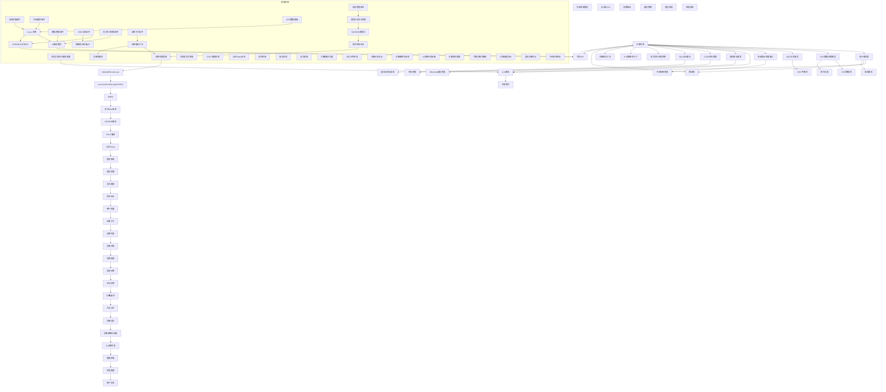
```mermaid
graph TB
A["主服务器"] --> B["执行服务器"]
A --> C["OCR数据采集服务"]
A --> D["MCC分析服务"]
A --> E["最新提示结果接口"]
A --> F["待办事项优化服务"]
A --> G["缓存修复服务"]
A --> H["CLOB内存管理"]
A --> I["SQL执行缓存"]
A --> J["流式文本处理系统"]
A --> K["AI诊断概览卡片"]
A --> L["诊断解析工具"]
B --> F["LLM服务"]
A --> M["数据库"]
B --> M
C --> N["OCR数据库"]
C --> O["医疗设备"]
D --> P["MCC字典库"]
E --> Q["外部系统集成"]
F --> R["去重算法"]
G --> S["Hibernate缓存修复"]
H --> T["内存管理"]
I --> U["缓存清理与监控"]
B --> V["回调服务"]
A --> W["对外API"]
W --> A
subgraph "前端应用"
X["Vue.js 应用"]
Y["AI服务模块"]
Z["DRG/MCC分析API"]
AA["对话界面组件"]
BB["模板管理组件"]
CC["顶部菜单组件"]
DD["OCR数据看板"]
EE["DRG分析组件"]
FF["最新提示结果API"]
GG["优化后的待办事项界面"]
HH["流式文本处理组件"]
II["诊断卡片组件"]
JJ["诊断解析工具"]
KK["病历管理组件"]
LL["语音识别文本处理"]
MM["NDJSON流解析"]
NN["实时响应显示"]
OO["诊断列表提取"]
PP["诊断块解析"]
QQ["正则表达式修复"]
RR["CRLF兼容处理"]
SS["认证Token支持"]
TT["超时控制"]
UU["错误处理"]
VV["流式更新"]
WW["折叠/展开功能"]
XX["左右分栏布局"]
YY["详细分析显示"]
ZZ["诊断编辑对话框"]
AAA["AI诊断列表刷新"]
BBB["诊断名称提取"]
CCC["完整诊断块解析"]
DDD["诊断依据显示"]
EEE["鉴别诊断显示"]
FFF["补充说明显示"]
end
X --> Y
X --> Z
Z --> W
Y --> W
AA --> X
BB --> Y
CC --> X
DD --> X
EE --> Z
EE --> FF
GG --> F
HH --> Y
II --> JJ
JJ --> OO
JJ --> PP
KK --> LL
LL --> MM
MM --> NN
NN --> OO
OO --> PPP["MedicalRecords.vue"]
PPP --> VVV["processVoiceRecognitionText"]
VVV --> WWW
WWW --> XXX["流式fetch请求"]
XXX --> YYY["NDJSON解析"]
YYY --> ZZZ["CRLF兼容"]
ZZZ --> AAAA["认证Token"]
AAAA --> BBBB["超时控制"]
BBBB --> CCCC["错误处理"]
CCCC --> DDDD["流式更新"]
DDDD --> EEEE["实时显示"]
EEEE --> FFFF["用户界面"]
FFFF --> GGGG["诊断卡片"]
GGGG --> HHHH["诊断列表"]
HHHH --> IIII["诊断详情"]
IIII --> JJJJ["诊断依据"]
JJJJ --> KKKK["鉴别诊断"]
KKKK --> LLLL["补充说明"]
LLLL --> MMMM["折叠/展开"]
MMMM --> NNNN["左右分栏"]
NNNN --> OOOO["详细分析"]
OOOO --> PPPP["诊断编辑对话框"]
PPPP --> QQQQ["AI诊断列表"]
QQQQ --> RRRR["刷新机制"]
RRRR --> SSSS["状态管理"]
SSSS --> TTTT["用户交互"]
UUUU["外部系统集成"]
VVVV["标准化API"]
WWWW["参数验证"]
XXXX["缓存策略"]
YYYY["错误处理"]
ZZZZ["性能监控"]
```

**图表来源**
- [执行服务器LLM调用优化敏捷迭代规划.md:141-161](file://med_ai_assistant_1.0_bs_backend/doc/其他/执行服务器LLM调用优化敏捷迭代规划.md#L141-L161)
- [API文档.md:192-493](file://med_ai_assistant_1.0_bs_backend/doc/其他/API_DOCUMENTATION.md#L192-L493)
- [MccScreeningController.java:33-35](file://med_ai_assistant_1.0_bs_backend/src/main/java/com/example/medaiassistant/controller/MccScreeningController.java#L33-L35)
- [监护仪呼吸机AI OCR数据采集方案.md:375-416](file://med_ai_assistant_1.0_bs_backend/doc/迭代/AI OCR数据采集/监护仪呼吸机AI OCR数据采集方案.md#L375-L416)
- [AIController.java:272-288](file://med_ai_assistant_1.0_bs_backend/src/main/java/com/example/medaiassistant/controller/AIController.java#L272-L288)
- [MedicalRecordController.java:624-653](file://med_ai_assistant_1.0_bs_backend/src/main/java/com/example/medaiassistant/controller/MedicalRecordController.java#L624-L653)
- [Hibernate自动刷新机制CLOB异常问题分析与解决方案.md:47-116](file://med_ai_assistant_1.0_bs_backend/doc/其他/Hibernate自动刷新机制CLOB异常问题分析与解决方案.md#L47-L116)
- [ClobManager.java:1-207](file://med_ai_assistant_1.0_bs_backend/src/main/java/com/example/medaiassistant/util/ClobManager.java#L1-L207)
- [SqlExecutionService.java:436-450](file://med_ai_assistant_1.0_bs_backend/src/main/java/com/example/medaiassistant/hospital/service/SqlExecutionService.java#L436-L450)
- [2026-04-13更新日志.md:3-40](file://med_ai_assistant_1.0_bs_vue/docs/更新日志/2026-04-13.md#L3-L40)

## 详细组件分析

### AI模型配置组件
- 设计要点
  - 以模型名为键的配置映射，支持多模型并行
  - 每个模型包含URL、密钥、连接/读取超时、最大重试次数、初始重试延迟
  - 提供配置有效性校验、默认模型选择与安全摘要
- 关键接口
  - 获取模型配置：按模型名检索
  - 校验配置：URL格式、必填字段完整性
  - 默认模型：优先返回常用模型，否则返回首个有效配置

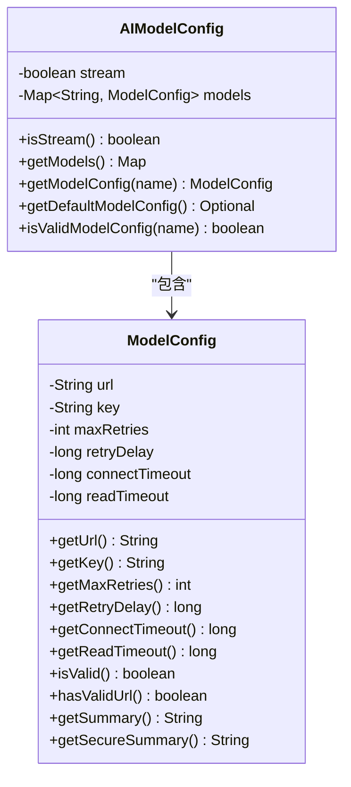
```mermaid
classDiagram
class AIModelConfig {
-boolean stream
-Map~String, ModelConfig~ models
+isStream() boolean
+getModels() Map
+getModelConfig(name) ModelConfig
+getDefaultModelConfig() Optional
+isValidModelConfig(name) boolean
}
class ModelConfig {
-String url
-String key
-int maxRetries
-long retryDelay
-long connectTimeout
-long readTimeout
+getUrl() String
+getKey() String
+getMaxRetries() int
+getRetryDelay() long
+getConnectTimeout() long
+getReadTimeout() long
+isValid() boolean
+hasValidUrl() boolean
+getSummary() String
+getSecureSummary() String
}
AIModelConfig --> ModelConfig : "包含"
```

**图表来源**
- [AI模型配置类.java:29-398](file://med_ai_assistant_1.0_bs_backend/src/main/java/com/example/medaiassistant/config/AIModelConfig.java#L29-L398)

**章节来源**
- [AI模型配置类.java:29-398](file://med_ai_assistant_1.0_bs_backend/src/main/java/com/example/medaiassistant/config/AIModelConfig.java#L29-L398)

### 执行服务器控制器（LLM调用与处理）
- 设计要点
  - 专用RestTemplate：连接池、超时与Keep-Alive策略优化
  - LLM调用：集成重试机制（指数退避+抖动），错误分类与恢复
  - 数据处理：解密 -> Prompt分析 -> 加密 -> 回调
  - 监控统计：调用次数、成功率、响应时间分布、重试统计
- 关键流程

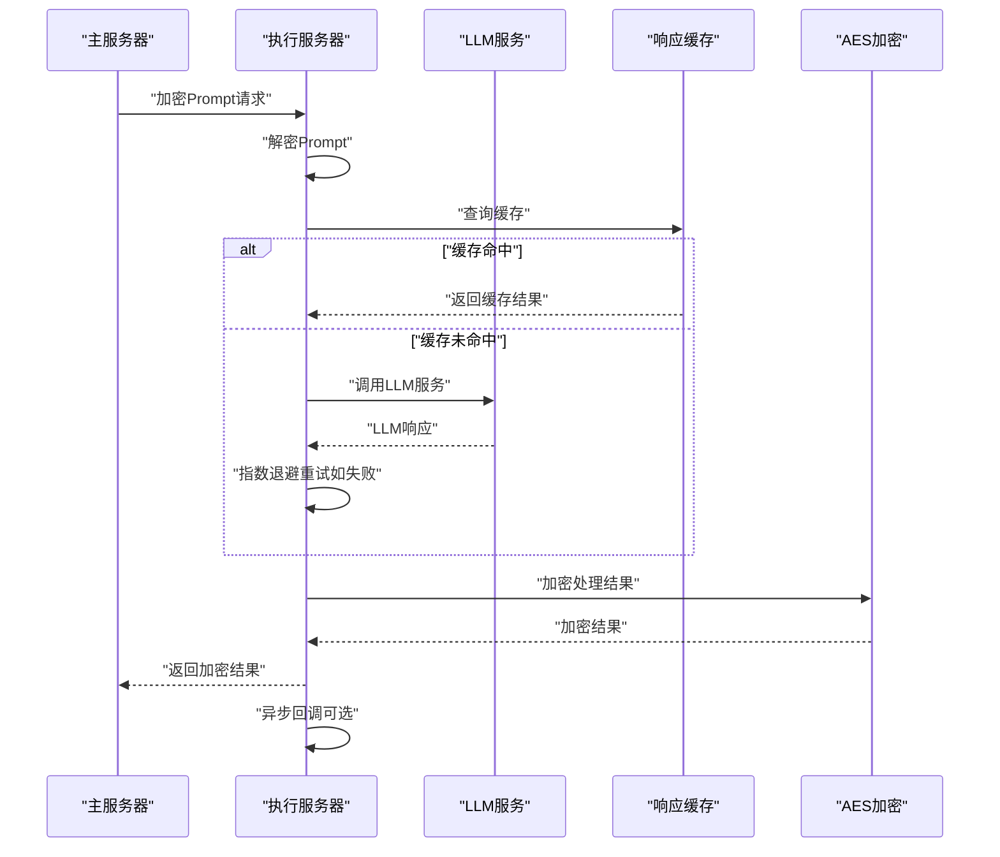
```mermaid
sequenceDiagram
participant Client as "主服务器"
participant Exec as "执行服务器"
participant LLM as "LLM服务"
participant Cache as "响应缓存"
participant AES as "AES加密"
Client->>Exec : "加密Prompt请求"
Exec->>Exec : "解密Prompt"
Exec->>Cache : "查询缓存"
alt "缓存命中"
Cache-->>Exec : "返回缓存结果"
else "缓存未命中"
Exec->>LLM : "调用LLM服务"
LLM-->>Exec : "LLM响应"
Exec->>Exec : "指数退避重试如失败"
end
Exec->>AES : "加密处理结果"
AES-->>Exec : "加密结果"
Exec-->>Client : "返回加密结果"
Exec->>Exec : "异步回调可选"
```

**图表来源**
- [执行服务器控制器.java:400-470](file://med_ai_assistant_1.0_bs_backend/src/main/java/com/example/medaiassistant/controller/ExecutionServerController.java#L400-L470)
- [执行服务器控制器.java:781-884](file://med_ai_assistant_1.0_bs_backend/src/main/java/com/example/medaiassistant/controller/ExecutionServerController.java#L781-L884)
- [执行服务器LLM调用优化敏捷迭代规划.md:229-281](file://med_ai_assistant_1.0_bs_backend/doc/其他/执行服务器LLM调用优化敏捷迭代规划.md#L229-L281)

**章节来源**
- [执行服务器控制器.java:400-470](file://med_ai_assistant_1.0_bs_backend/src/main/java/com/example/medaiassistant/controller/ExecutionServerController.java#L400-L470)
- [执行服务器控制器.java:781-884](file://med_ai_assistant_1.0_bs_backend/src/main/java/com/example/medaiassistant/controller/ExecutionServerController.java#L781-L884)
- [执行服务器LLM调用优化敏捷迭代规划.md:229-281](file://med_ai_assistant_1.0_bs_backend/doc/其他/执行服务器LLM调用优化敏捷迭代规划.md#L229-L281)

### MCC分析控制器（完整MCC功能）
- 设计要点
  - 提供完整的MCC预筛选REST API接口
  - 支持平铺列表和分组视图两种展示模式
  - 实现相似度计算、排除规则检查、TopK筛选
  - 提供MCC分析Prompt生成保存功能
- 关键接口
  - 筛选MCC候选：POST /api/drg/mcc/screen
  - 分组MCC候选：POST /api/drg/mcc/screen-grouped
  - 相似度计算：POST /api/drg/mcc/similarity
  - 获取配置：GET /api/drg/mcc/config
  - 重新加载字典：POST /api/drg/mcc/reload
  - 生成并保存Prompt：POST /api/drg/mcc/generate-prompt

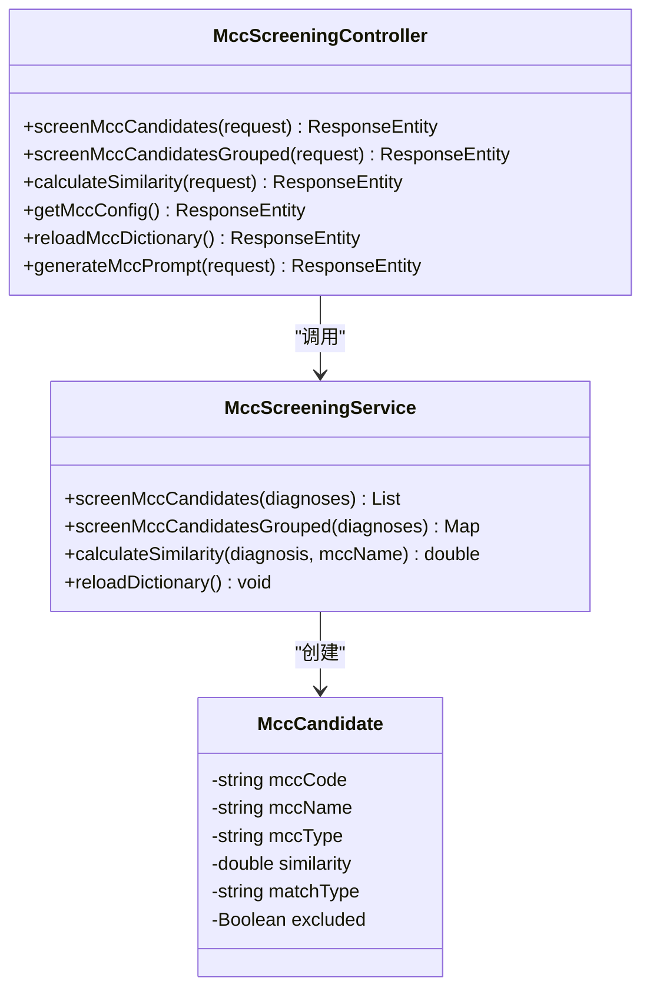
```mermaid
classDiagram
class MccScreeningController {
+screenMccCandidates(request) ResponseEntity
+screenMccCandidatesGrouped(request) ResponseEntity
+calculateSimilarity(request) ResponseEntity
+getMccConfig() ResponseEntity
+reloadMccDictionary() ResponseEntity
+generateMccPrompt(request) ResponseEntity
}
class MccScreeningService {
+screenMccCandidates(diagnoses) List
+screenMccCandidatesGrouped(diagnoses) Map
+calculateSimilarity(diagnosis, mccName) double
+reloadDictionary() void
}
class MccCandidate {
-string mccCode
-string mccName
-string mccType
-double similarity
-string matchType
-Boolean excluded
}
MccScreeningController --> MccScreeningService : "调用"
MccScreeningService --> MccCandidate : "创建"
```

**图表来源**
- [MccScreeningController.java:59-162](file://med_ai_assistant_1.0_bs_backend/src/main/java/com/example/medaiassistant/controller/MccScreeningController.java#L59-L162)
- [MccScreeningService.java:101-200](file://med_ai_assistant_1.0_bs_backend/src/main/java/com/example/medaiassistant/service/MccScreeningService.java#L101-L200)
- [MccCandidate.java:13-86](file://med_ai_assistant_1.0_bs_backend/src/main/java/com/example/medaiassistant/model/MccCandidate.java#L13-L86)

**章节来源**
- [MccScreeningController.java:59-162](file://med_ai_assistant_1.0_bs_backend/src/main/java/com/example/medaiassistant/controller/MccScreeningController.java#L59-L162)
- [MccScreeningController.java:233-341](file://med_ai_assistant_1.0_bs_backend/src/main/java/com/example/medaiassistant/controller/MccScreeningController.java#L233-L341)
- [DRG分析接口.md:1809-1851](file://med_ai_assistant_1.0_bs_backend/doc/接口/DRG分析接口.md#L1809-L1851)

### MCC筛查服务（核心算法）
- 设计要点
  - 使用Levenshtein距离算法计算诊断名称相似度
  - 支持编码精确匹配和名称相似度匹配两种模式
  - 实现排除规则检查，基于MCC_EXCEPT字段排除不适用的候选
  - 提供TopK筛选功能，限制每个诊断的候选数量
  - 使用原子引用实现线程安全的字典缓存
- 关键算法
  - 相似度计算：normalize(diagnosis) vs normalize(mccName)
  - 排除规则：检查MCC_EXCEPT字段中的ICD编码列表
  - TopK筛选：按相似度降序排列，取前K个候选
  - 编码匹配：ICD编码完全相等时的精确匹配

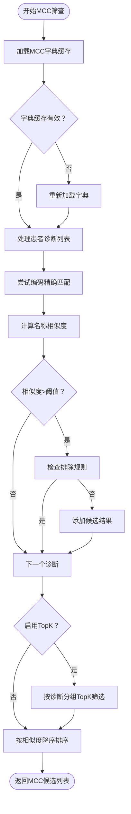
```mermaid
flowchart TD
Start(["开始MCC筛查"]) --> LoadDict["加载MCC字典缓存"]
LoadDict --> CheckCache{"字典缓存有效？"}
CheckCache --> |否| ReloadDict["重新加载字典"]
CheckCache --> |是| ProcessDiagnoses["处理患者诊断列表"]
ReloadDict --> ProcessDiagnoses
ProcessDiagnoses --> ExactMatch["尝试编码精确匹配"]
ExactMatch --> SimilarityCalc["计算名称相似度"]
SimilarityCalc --> ThresholdCheck{"相似度>阈值？"}
ThresholdCheck --> |是| ExcludeCheck["检查排除规则"]
ThresholdCheck --> |否| NextDiagnosis["下一个诊断"]
ExcludeCheck --> |是| NextDiagnosis
ExcludeCheck --> |否| AddCandidate["添加候选结果"]
AddCandidate --> NextDiagnosis
NextDiagnosis --> TopKCheck{"启用TopK？"}
TopKCheck --> |是| ApplyTopK["按诊断分组TopK筛选"]
TopKCheck --> |否| SortResults["按相似度降序排序"]
ApplyTopK --> SortResults
SortResults --> End(["返回MCC候选列表"])
```

**图表来源**
- [MccScreeningService.java:121-200](file://med_ai_assistant_1.0_bs_backend/src/main/java/com/example/medaiassistant/service/MccScreeningService.java#L121-L200)
- [MccScreeningService.java:177-200](file://med_ai_assistant_1.0_bs_backend/src/main/java/com/example/medaiassistant/service/MccScreeningService.java#L177-L200)

**章节来源**
- [MccScreeningService.java:121-200](file://med_ai_assistant_1.0_bs_backend/src/main/java/com/example/medaiassistant/service/MccScreeningService.java#L121-L200)
- [MccScreeningService.java:177-200](file://med_ai_assistant_1.0_bs_backend/src/main/java/com/example/medaiassistant/service/MccScreeningService.java#L177-L200)

### 前端DRG/MCC分析API（统一接口）
- 设计要点
  - 提供统一的DRG和MCC分析API调用接口
  - 支持Promise和回调两种模式，向后兼容
  - 修复14个API路径重复'/api/'问题，统一调用规范
  - 新增MCC分析Prompt生成保存接口
- 关键接口
  - MCC候选筛选：screenMccCandidates(diagnoses)
  - 分组MCC候选：screenMccCandidatesGrouped(diagnoses)
  - 相似度计算：calculateSimilarity(diagnosis, mccName)
  - 获取配置：getMccConfig()
  - 重新加载字典：reloadMccDictionary()
  - 生成并保存Prompt：generateMccPrompt(patientId, mccResults)

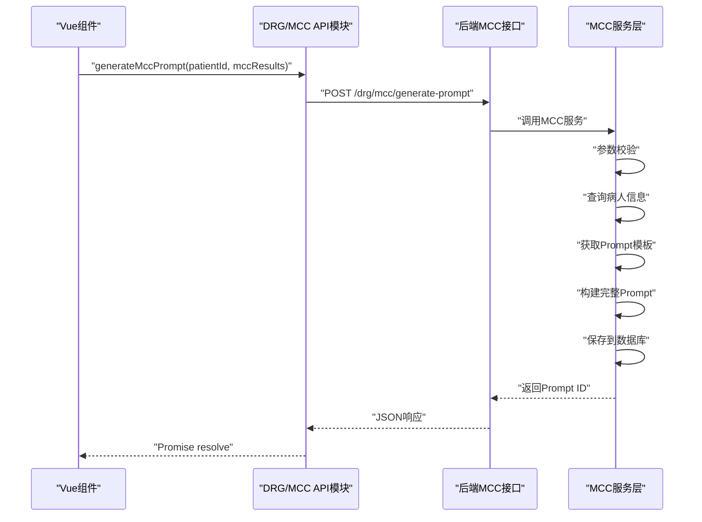
```mermaid
sequenceDiagram
participant VueComp as "Vue组件"
participant DRGAPI as "DRG/MCC API模块"
participant Backend as "后端MCC接口"
participant MCCService as "MCC服务层"
VueComp->>DRGAPI : "generateMccPrompt(patientId, mccResults)"
DRGAPI->>Backend : "POST /drg/mcc/generate-prompt"
Backend->>MCCService : "调用MCC服务"
MCCService->>MCCService : "参数校验"
MCCService->>MCCService : "查询病人信息"
MCCService->>MCCService : "获取Prompt模板"
MCCService->>MCCService : "构建完整Prompt"
MCCService->>MCCService : "保存到数据库"
MCCService-->>Backend : "返回Prompt ID"
Backend-->>DRGAPI : "JSON响应"
DRGAPI-->>VueComp : "Promise resolve"
```

**图表来源**
- [drg.js:154-156](file://med_ai_assistant_1.0_bs_vue/src/api/drg.js#L154-L156)
- [MccScreeningController.java:233-341](file://med_ai_assistant_1.0_bs_backend/src/main/java/com/example/medaiassistant/controller/MccScreeningController.java#L233-L341)

**章节来源**
- [drg.js:154-156](file://med_ai_assistant_1.0_bs_vue/src/api/drg.js#L154-L156)
- [DRG分析接口.md:1809-1851](file://med_ai_assistant_1.0_bs_backend/doc/接口/DRG分析接口.md#L1809-L1851)

### DRG分析组件（MCC预筛选集成）
- 设计要点
  - 集成MCC预筛选功能的完整分析界面
  - 支持平铺视图和分组视图两种展示模式
  - 使用真实患者数据替代硬编码测试数据
  - MCC筛查结果按相似度降序排列
  - 修复MCC候选列表字段映射问题
- 关键特性
  - 视图切换：平铺视图 vs 分组视图
  - 数据展示：诊断编码、名称、MCC/CC类型、相似度
  - 操作功能：加载MCC候选、生成Prompt、复制Prompt内容
  - 状态管理：加载状态、错误处理、数据刷新

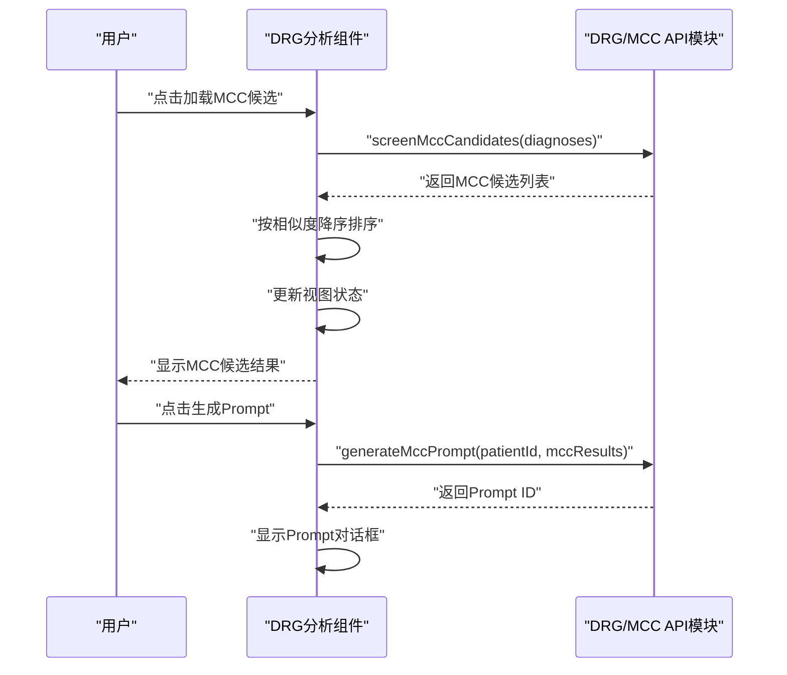
```mermaid
sequenceDiagram
participant User as "用户"
participant DrgAnalysis as "DRG分析组件"
participant DRGAPI as "DRG/MCC API模块"
User->>DrgAnalysis : "点击加载MCC候选"
DrgAnalysis->>DRGAPI : "screenMccCandidates(diagnoses)"
DRGAPI-->>DrgAnalysis : "返回MCC候选列表"
DrgAnalysis->>DrgAnalysis : "按相似度降序排序"
DrgAnalysis->>DrgAnalysis : "更新视图状态"
DrgAnalysis-->>User : "显示MCC候选结果"
User->>DrgAnalysis : "点击生成Prompt"
DrgAnalysis->>DRGAPI : "generateMccPrompt(patientId, mccResults)"
DRGAPI-->>DrgAnalysis : "返回Prompt ID"
DrgAnalysis->>DrgAnalysis : "显示Prompt对话框"
```

**图表来源**
- [DrgAnalysis.vue:72-96](file://med_ai_assistant_1.0_bs_vue/src/components/patient/DrgAnalysis.vue#L72-L96)
- [DrgAnalysis.vue:109-127](file://med_ai_assistant_1.0_bs_vue/src/components/patient/DrgAnalysis.vue#L109-L127)

**章节来源**
- [DrgAnalysis.vue:72-96](file://med_ai_assistant_1.0_bs_vue/src/components/patient/DrgAnalysis.vue#L72-L96)
- [DrgAnalysis.vue:109-127](file://med_ai_assistant_1.0_bs_vue/src/components/patient/DrgAnalysis.vue#L109-L127)

### 前端AI服务模块（时序优化）
- 设计要点
  - 提供统一的AI服务调用接口，支持Promise和回调两种模式
  - 优化非流式响应处理时序，确保UI能够及时接收数据
  - 完善错误处理机制，支持字符串和对象形式的错误信息
  - 保留方法名向后兼容性，实际采用非流式请求模式
- 关键流程

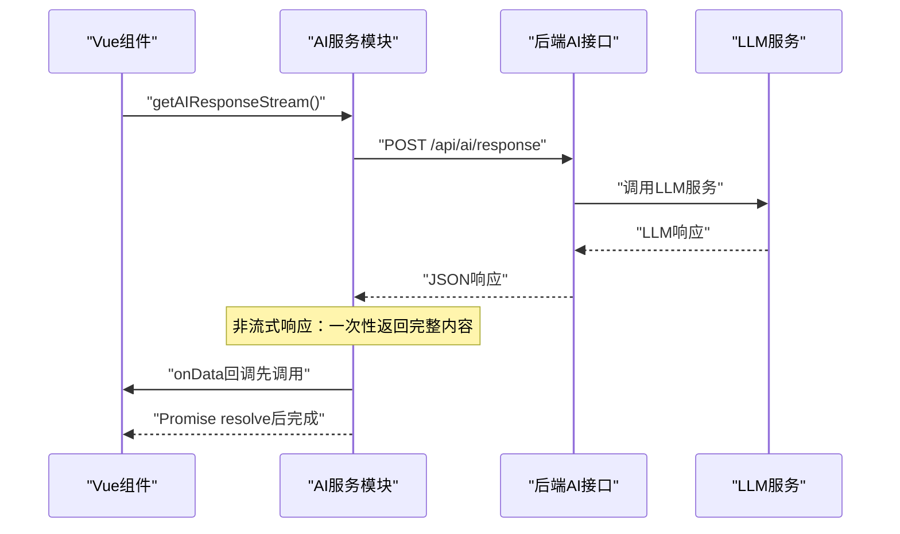
```mermaid
sequenceDiagram
participant VueComp as "Vue组件"
participant AIService as "AI服务模块"
participant Backend as "后端AI接口"
participant LLM as "LLM服务"
VueComp->>AIService : "getAIResponseStream()"
AIService->>Backend : "POST /api/ai/response"
Backend->>LLM : "调用LLM服务"
LLM-->>Backend : "LLM响应"
Backend-->>AIService : "JSON响应"
Note over AIService : 非流式响应：一次性返回完整内容
AIService->>VueComp : "onData回调先调用"
AIService-->>VueComp : "Promise resolve后完成"
```

**最新更新** 修复了非流式响应模式下的回调时序问题，确保UI能够在Promise resolve之前接收到数据。

**图表来源**
- [aiService.js:110-170](file://med_ai_assistant_1.0_bs_vue/src/api/aiService.js#L110-L170)
- [aiService.js:229-279](file://med_ai_assistant_1.0_bs_vue/src/api/aiService.js#L229-279)

**章节来源**
- [aiService.js:110-170](file://med_ai_assistant_1.0_bs_vue/src/api/aiService.js#L110-L170)
- [aiService.js:229-279](file://med_ai_assistant_1.0_bs_vue/src/api/aiService.js#L229-279)

### 模板管理组件（补充信息输入功能）
- 设计要点
  - 支持Prompt模板的树形展示和分类管理
  - 新增补充信息输入对话框功能，针对特定模板提供额外上下文
  - 动态处理用户输入的补充信息，将其注入到执行选项中
  - 完善用户交互体验，提供灵活的上下文信息收集
- 关键特性
  - 模板常量定义：`TEMPLATES_REQUIRING_ADDITIONAL_INFO = ['请会诊记录', '日常对话']`
  - 弹窗输入：使用Element Plus的MessageBox.prompt组件
  - 信息处理：将补充信息格式化为`AdditionalInfo`字段
  - 状态管理：支持跳过输入和关闭对话框的操作

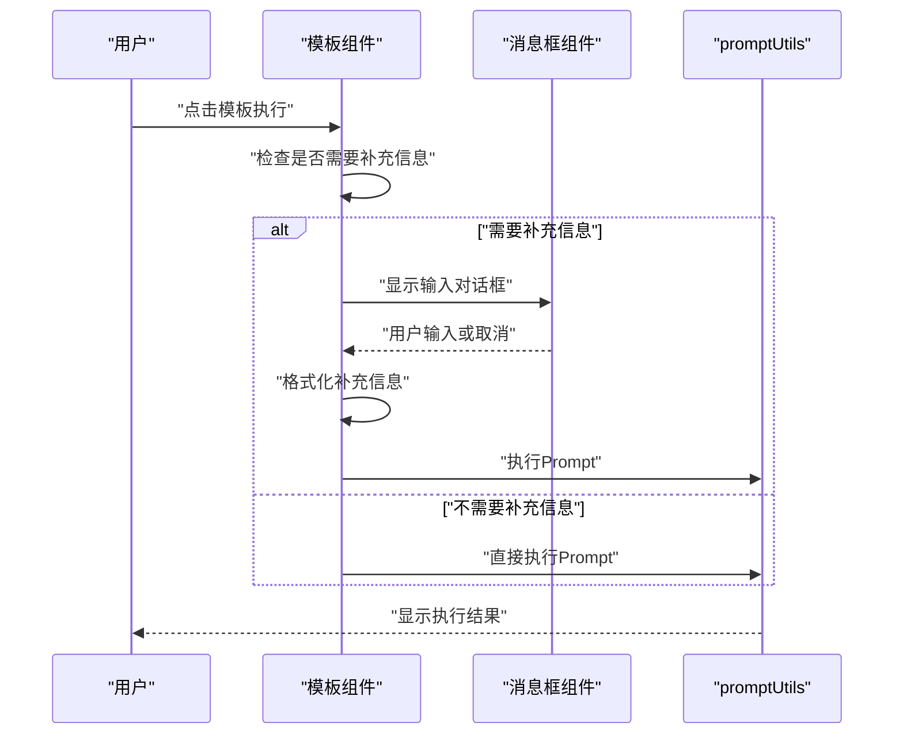
```mermaid
sequenceDiagram
participant User as "用户"
participant TemplateComp as "模板组件"
participant MessageBox as "消息框组件"
participant Utils as "promptUtils"
User->>TemplateComp : "点击模板执行"
TemplateComp->>TemplateComp : "检查是否需要补充信息"
alt "需要补充信息"
TemplateComp->>MessageBox : "显示输入对话框"
MessageBox-->>TemplateComp : "用户输入或取消"
TemplateComp->>TemplateComp : "格式化补充信息"
TemplateComp->>Utils : "执行Prompt"
else "不需要补充信息"
TemplateComp->>Utils : "直接执行Prompt"
end
Utils-->>User : "显示执行结果"
```

**最新更新** 新增补充信息输入对话框功能，显著提升了用户在使用特定模板时的上下文信息提供能力。

**图表来源**
- [PromptTemplates.vue:106-131](file://med_ai_assistant_1.0_bs_vue/src/components/ai/PromptTemplates.vue#L106-L131)
- [PromptTemplates.vue:149-152](file://med_ai_assistant_1.0_bs_vue/src/components/ai/PromptTemplates.vue#L149-L152)

**章节来源**
- [PromptTemplates.vue:26-31](file://med_ai_assistant_1.0_bs_vue/src/components/ai/PromptTemplates.vue#L26-L31)
- [PromptTemplates.vue:86-174](file://med_ai_assistant_1.0_bs_vue/src/components/ai/PromptTemplates.vue#L86-L174)

### 模板编辑对话框（完整管理功能）
- 设计要点
  - 提供完整的模板编辑界面，支持创建、编辑、删除操作
  - 包含多标签页的表单结构，支持不同类型的模板配置
  - 集成数据类型、过滤规则、作用范围等高级配置选项
  - 实现模板树形结构的可视化展示和管理
- 关键功能
  - 模板树形展示：支持模板类型分组和层级管理
  - 表单验证：完整的字段验证和错误处理机制
  - 数据同步：实时刷新模板列表和状态管理
  - 权限控制：根据用户权限显示不同的操作选项

**章节来源**
- [PromptTemplateEditDialog.vue:144-453](file://med_ai_assistant_1.0_bs_vue/src/components/ai/PromptTemplateEditDialog.vue#L144-L453)

### 顶部菜单组件（触屏/桌面差异化交互）
- 设计要点
  - 检测设备是否支持触摸功能，智能区分触屏和桌面设备
  - 触屏设备：AI辅助子菜单点击时不触发导航，让子菜单自然展开/收起
  - 桌面设备：AI辅助子菜单点击时直接导航到AI辅助页面
  - 支持小屏模式切换，适配7-8英寸设备
- 关键特性
  - 设备检测：`'ontouchstart' in window || navigator.maxTouchPoints > 0`
  - 事件处理：根据设备类型执行不同的菜单交互逻辑
  - 用户体验：避免Android平板上的菜单点击问题

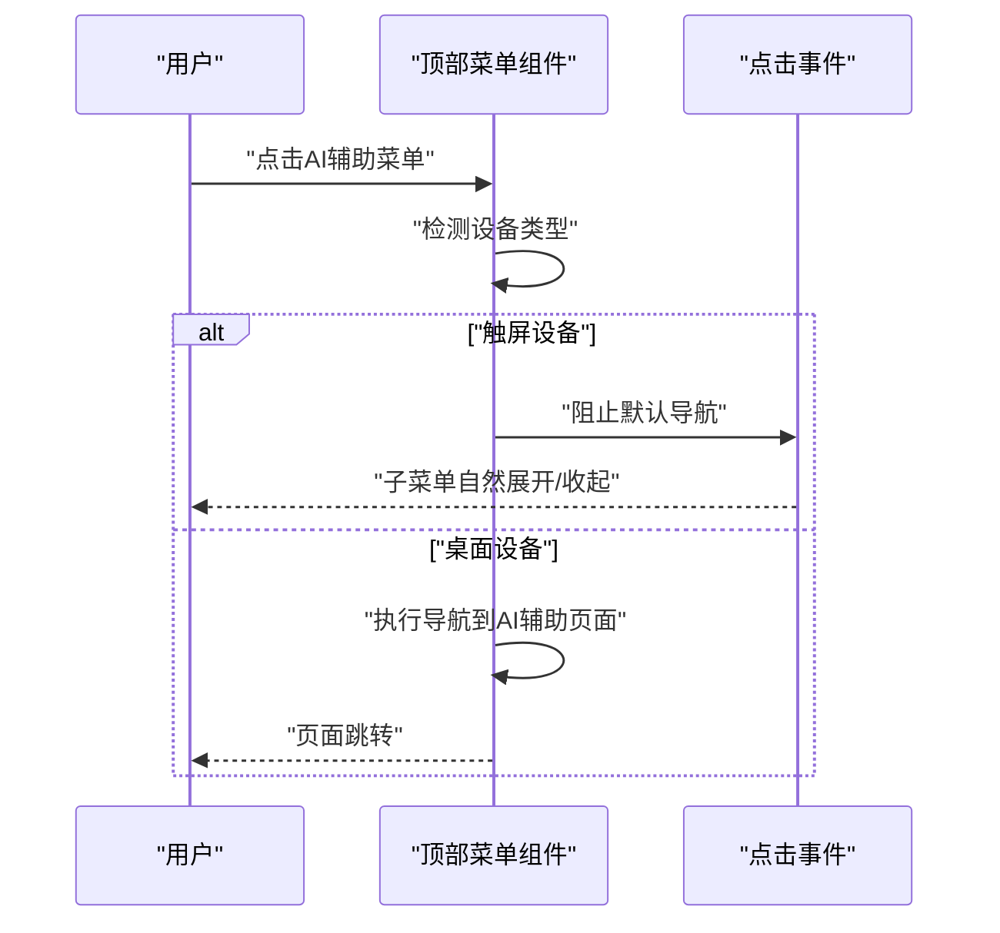
```mermaid
sequenceDiagram
participant User as "用户"
participant TopMenu as "顶部菜单组件"
participant Event as "点击事件"
User->>TopMenu : "点击AI辅助菜单"
TopMenu->>TopMenu : "检测设备类型"
alt "触屏设备"
TopMenu->>Event : "阻止默认导航"
Event-->>User : "子菜单自然展开/收起"
else "桌面设备"
TopMenu->>TopMenu : "执行导航到AI辅助页面"
TopMenu-->>User : "页面跳转"
end
```

**最新更新** 新增触屏/桌面设备差异化交互逻辑，修复Android平板上的菜单点击问题。

**图表来源**
- [TopMenu.vue:314-326](file://med_ai_assistant_1.0_bs_vue/src/components/TopMenu.vue#L314-L326)

**章节来源**
- [TopMenu.vue:314-326](file://med_ai_assistant_1.0_bs_vue/src/components/TopMenu.vue#L314-L326)

### AI OCR数据采集系统
- 设计要点
  - 独立的OCR识别服务，专门处理医疗设备屏幕数据
  - 支持多品牌医疗设备（监护仪、呼吸机、输液泵等）
  - 提供设备模板管理系统，支持自学习和社区共享
  - 实现实时数据推送和历史数据查询功能
- 关键特性
  - OCR识别：基于PaddleOCR的文字识别技术
  - 数据校验：规则引擎进行数据有效性检查
  - 报警机制：危急值自动检测和通知推送
  - 集成接口：与主系统通过REST API和WebSocket集成

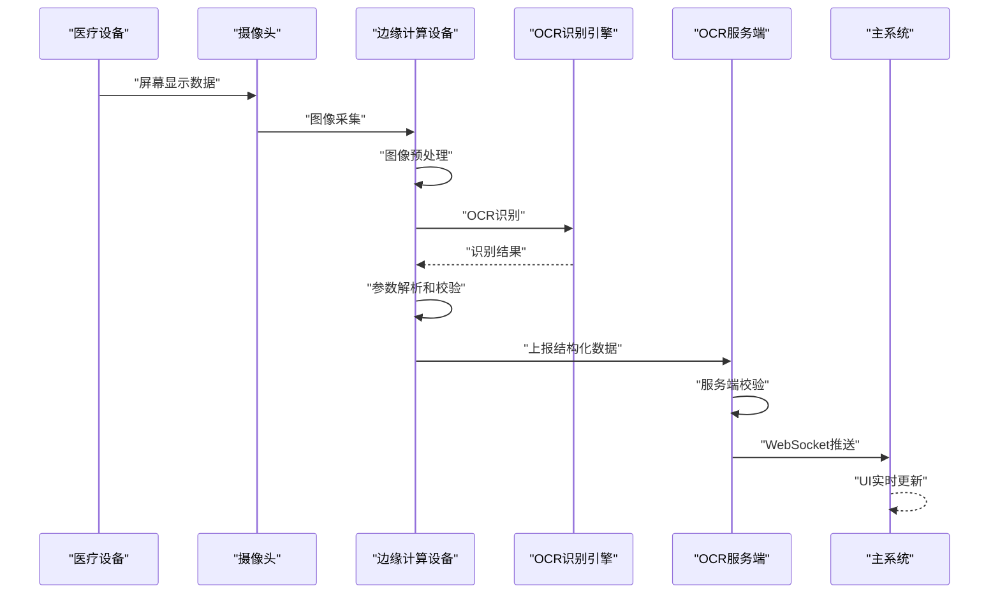
```mermaid
sequenceDiagram
participant Device as "医疗设备"
participant Camera as "摄像头"
participant Edge as "边缘计算设备"
participant OCR as "OCR识别引擎"
participant Service as "OCR服务端"
participant Main as "主系统"
Device->>Camera : "屏幕显示数据"
Camera->>Edge : "图像采集"
Edge->>Edge : "图像预处理"
Edge->>OCR : "OCR识别"
OCR-->>Edge : "识别结果"
Edge->>Edge : "参数解析和校验"
Edge->>Service : "上报结构化数据"
Service->>Service : "服务端校验"
Service->>Main : "WebSocket推送"
Main-->>Main : "UI实时更新"
```

**最新更新** 新增完整的AI OCR数据采集系统，支持医疗设备屏幕的自动识别和数据数字化。

**图表来源**
- [监护仪呼吸机AI OCR数据采集方案.md:417-454](file://med_ai_assistant_1.0_bs_backend/doc/迭代/AI OCR数据采集/监护仪呼吸机AI OCR数据采集方案.md#L417-L454)

**章节来源**
- [监护仪呼吸机AI OCR数据采集方案.md:1-800](file://med_ai_assistant_1.0_bs_backend/doc/迭代/AI OCR数据采集/监护仪呼吸机AI OCR数据采集方案.md#L1-L800)

### 数据预处理与结果后处理
- 预处理
  - 解密：从数据库读取AES密钥与盐值，解密Base64加密的Prompt
  - 缓存：基于Prompt内容生成缓存键，命中则直接返回
  - 补充信息：处理用户提供的额外上下文信息
- 推理过程
  - 调用LLM服务，支持流式与非流式响应
  - 指数退避重试，避免网络波动与服务异常导致的失败
- 后处理
  - 加密：将LLM结果进行AES加密
  - 回调：异步通知主服务器处理完成
  - 统计：记录调用次数、成功率、响应时间与错误类型

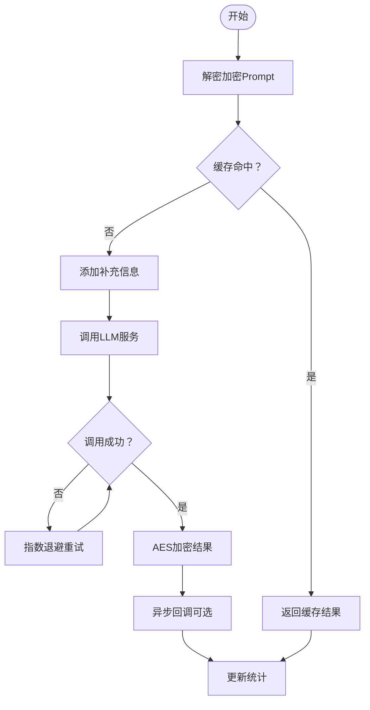
```mermaid
flowchart TD
Start(["开始"]) --> Decrypt["解密加密Prompt"]
Decrypt --> CacheCheck{"缓存命中？"}
CacheCheck --> |是| ReturnCache["返回缓存结果"]
CacheCheck --> |否| AddContext["添加补充信息"]
AddContext --> CallLLM["调用LLM服务"]
CallLLM --> Retry{"调用成功？"}
Retry --> |否| ExponentialBackoff["指数退避重试"]
ExponentialBackoff --> Retry
Retry --> |是| Encrypt["AES加密结果"]
Encrypt --> Callback["异步回调可选"]
Callback --> Stats["更新统计"]
ReturnCache --> Stats
```

**图表来源**
- [执行服务器控制器.java:781-884](file://med_ai_assistant_1.0_bs_backend/src/main/java/com/example/medaiassistant/controller/ExecutionServerController.java#L781-L884)
- [执行服务器LLM调用优化敏捷迭代规划.md:229-281](file://med_ai_assistant_1.0_bs_backend/doc/其他/执行服务器LLM调用优化敏捷迭代规划.md#L229-L281)

**章节来源**
- [执行服务器控制器.java:781-884](file://med_ai_assistant_1.0_bs_backend/src/main/java/com/example/medaiassistant/controller/ExecutionServerController.java#L781-L884)

### API与调用方式
- AI分析服务
  - 获取患者综合信息：聚合基本信息、诊断、病历、长期/临时医嘱、化验与检查结果
  - 保存对话历史：记录用户与AI的交互
  - 流式AI响应：SSE流式返回，支持心跳与错误事件
  - 非流式AI响应：一次性返回推理过程与最终结果
  - AI参数：支持温度、最大token、top_p、频率惩罚、存在惩罚、生成数量、停止符、用户标识等
  - 健康检查：检查AI模型服务状态
  - **最新提示结果**：GET /api/ai/latestPromptResult，获取指定患者和模板的最新分析结果
- **MCC分析服务**
  - MCC候选筛选：POST /api/drg/mcc/screen，支持平铺和分组两种模式
  - 相似度计算：POST /api/drg/mcc/similarity，返回相似度值和阈值检查结果
  - 配置管理：GET /api/drg/mcc/config，获取相似度阈值、TopK设置等
  - 字典管理：POST /api/drg/mcc/reload，重新加载MCC字典
  - Prompt生成：POST /api/drg/mcc/generate-prompt，生成并保存MCC分析Prompt
- **待办事项服务（优化后）**
  - 按患者ID查询：GET /api/medicalrecords/patient/{patientId}/todos，自动去重同一病历ID的多个待办
  - 按日期和科室查询：GET /api/medicalrecords/todos/by-date-department，支持日期范围和科室过滤
  - 去重算法：按medicalRecordId分组，每组只保留createdTime最大的最新记录
  - 兼容性：medicalRecordId为null的记录不参与去重
- **数据库缓存服务**
  - 缓存清理：POST /api/hospital-config/clear-cache，支持按医院ID和数据库类型清理
  - 缓存统计：GET /api/hospital-config/cache-stats，获取缓存使用统计信息
  - SQL执行缓存：增强缓存清理和监控功能
- **流式文本处理API**
  - analyzeLLMStream：使用Fetch API + ReadableStream消费NDJSON流，支持实时响应显示
  - processRecognizedTextStream：语音识别文本流式处理函数
  - processVoiceRecognitionText：病历管理组件中的流式文本处理方法
- **诊断解析API**
  - extractDiagnosisNames：从AI结果中提取诊断名称列表
  - extractDiagnosisBlocks：提取完整的诊断块信息
  - 诊断卡片组件：DiagnosisCard.vue组件
- **调用示例**
  - 流式调用：POST `/api/ai/stream-response-post`，Content-Type: application/json
  - 非流式调用：POST `/api/ai/response`，请求体包含model与messages
  - 健康检查：GET `/api/health/ai-status`
  - MCC候选筛选：POST `/api/drg/mcc/screen`，请求体包含患者诊断列表
  - 生成Prompt：POST `/api/drg/mcc/generate-prompt`，请求体包含patientId和mccResults
  - **最新提示结果**：GET `/api/ai/latestPromptResult?patientId=123&promptName=诊断分析`
  - **优化的待办查询**：GET `/api/medicalrecords/patient/990500001204401_1/todos`
  - **缓存清理**：POST `/api/hospital-config/clear-cache?hospitalId=cdwyy&databaseType=his`
  - **流式文本处理**：analyzeLLMStream({content, onChunk, onComplete})
  - **诊断解析**：extractDiagnosisNames(content) / extractDiagnosisBlocks(content)
  - **模板管理API**：获取模板列表、详情、创建、更新、删除等
  - **OCR数据采集API**：设备注册、数据上报、模板管理、实时数据查询
  - **外部系统集成**：标准化API接口，支持外部系统自动化集成
- **模板管理API**
  - 获取模板列表：GET `/api/ai/promptTemplates`
  - 获取模板详情：GET `/api/ai/promptTemplate`
  - 创建模板：POST `/api/ai/prompt-templates`
  - 更新模板：PUT `/api/ai/prompt-templates/{templateId}`
  - 删除模板：DELETE `/api/ai/prompt-templates/{templateId}`
- **OCR数据采集API**
  - 设备注册：POST `/api/ocr/devices`
  - 数据上报：POST `/api/ocr/data`
  - 模板管理：GET/POST/PUT `/api/ocr/templates`
  - 实时数据：GET `/api/ocr/live-data`
- **外部系统集成**
  - **标准化接口**：GET /api/ai/latestPromptResult提供统一的AI结果访问接口
  - **自动化检索**：支持外部系统定时拉取最新的AI生成医疗洞察
  - **合规保障**：所有AI内容自动附加免责声明，确保法律合规

**最新更新** 新增流式文本处理系统，支持实时LLM响应显示；新增AI诊断概览卡片组件，提供诊断列表和详细分析功能；优化MedicalRecords组件的文字整理功能；增强诊断解析工具函数，支持完整的诊断块提取和解析。

**章节来源**
- [API文档.md:192-493](file://med_ai_assistant_1.0_bs_backend/doc/其他/API_DOCUMENTATION.md#L192-L493)
- [API文档.md:494-590](file://med_ai_assistant_1.0_bs_backend/doc/other/API_DOCUMENTATION.md#L494-L590)
- [DRG分析接口.md:1809-1851](file://med_ai_assistant_1.0_bs_backend/doc/接口/DRG分析接口.md#L1809-L1851)
- [DRG分析API接口.md:25-35](file://med_ai_assistant_1.0_bs_backend/doc/系统结构/DRG分析/DRG分析API接口.md#L25-L35)
- [AIController.java:272-288](file://med_ai_assistant_1.0_bs_backend/src/main/java/com/example/medaiassistant/controller/AIController.java#L272-L288)
- [PromptResultRepository.java:148-164](file://med_ai_assistant_1.0_bs_backend/src/main/java/com/example/medaiassistant/repository/PromptResultRepository.java#L148-L164)
- [ai.js:837-848](file://med_ai_assistant_1.0_bs_vue/src/api/ai.js#L837-L848)
- [MedicalRecordController.java:624-653](file://med_ai_assistant_1.0_bs_backend/src/main/java/com/example/medaiassistant/controller/MedicalRecordController.java#L624-L653)
- [HospitalConfigTestController.java:450-481](file://med_ai_assistant_1.0_bs_backend/src/main/java/com/example/medaiassistant/controller/HospitalConfigTestController.java#L450-L481)
- [SqlExecutionService.java:436-450](file://med_ai_assistant_1.0_bs_backend/src/main/java/com/example/medaiassistant/hospital/service/SqlExecutionService.java#L436-L450)
- [2026-04-13更新日志.md:3-40](file://med_ai_assistant_1.0_bs_vue/docs/更新日志/2026-04-13.md#L3-L40)

### 最新提示结果接口（新增功能）
- 设计要点
  - 提供标准化的GET /api/ai/latestPromptResult端点
  - 支持外部系统自动化集成，实现AI生成医疗洞察的统一访问
  - 自动附加AI免责声明，确保法律合规性
  - 支持指定患者ID和Prompt模板名称的精确检索
- 关键特性
  - 参数验证：patientId和promptName必需参数
  - 结果包装：使用AIContentResponseWrapper自动添加免责声明
  - 错误处理：无结果时返回null而非抛出异常
  - 性能优化：直接查询数据库，避免HTTP自调用开销
- 前端集成
  - getLatestPromptResult API函数封装请求逻辑
  - 支持Promise和错误处理机制
  - 与DRG分析组件深度集成，支持合并症分析自动化

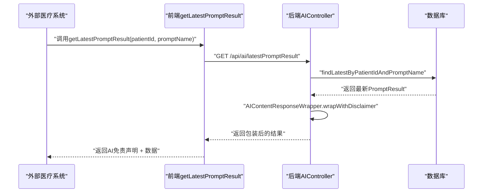
```mermaid
sequenceDiagram
participant ExternalSystem as "外部医疗系统"
participant FrontendAPI as "前端getLatestPromptResult"
participant BackendAPI as "后端AIController"
participant Database as "数据库"
ExternalSystem->>FrontendAPI : "调用getLatestPromptResult(patientId, promptName)"
FrontendAPI->>BackendAPI : "GET /api/ai/latestPromptResult"
BackendAPI->>Database : "findLatestByPatientIdAndPromptName"
Database-->>BackendAPI : "返回最新PromptResult"
BackendAPI->>BackendAPI : "AIContentResponseWrapper.wrapWithDisclaimer"
BackendAPI-->>FrontendAPI : "返回包装后的结果"
FrontendAPI-->>ExternalSystem : "返回AI免责声明 + 数据"
```

**图表来源**
- [AIController.java:272-288](file://med_ai_assistant_1.0_bs_backend/src/main/java/com/example/medaiassistant/controller/AIController.java#L272-L288)
- [PromptResultRepository.java:148-164](file://med_ai_assistant_1.0_bs_backend/src/main/java/com/example/medaiassistant/repository/PromptResultRepository.java#L148-L164)
- [ai.js:837-848](file://med_ai_assistant_1.0_bs_vue/src/api/ai.js#L837-L848)

**章节来源**
- [AIController.java:272-288](file://med_ai_assistant_1.0_bs_backend/src/main/java/com/example/medaiassistant/controller/AIController.java#L272-L288)
- [PromptResultRepository.java:148-164](file://med_ai_assistant_1.0_bs_backend/src/main/java/com/example/medaiassistant/repository/PromptResultRepository.java#L148-L164)
- [ai.js:837-848](file://med_ai_assistant_1.0_bs_vue/src/api/ai.js#L837-L848)

### 优化的待办事项查询系统
- 设计要点
  - 实现按medicalRecordId去重算法，避免同一病历ID产生多个重复的待办事项
  - 支持null ID记录的兼容性处理，不参与去重但直接保留
  - 增强createdTime为空值的安全处理机制
  - 保持向后兼容性，不影响现有业务逻辑
- 关键算法
  - 分组去重：按medicalRecordId进行分组，每组只保留createdTime最大的最新记录
  - null ID处理：medicalRecordId为null的记录不参与分组，直接保留
  - createdTime比较：createdTime为null时的特殊处理逻辑
  - 合并结果：将null ID记录与去重后的非null ID记录合并返回
- 前端集成
  - 自动去重：优化后的查询结果不再显示重复的待办事项
  - 性能提升：减少前端渲染负担，提升界面响应速度
  - 用户体验：避免同一病历的多个待办事项重复显示

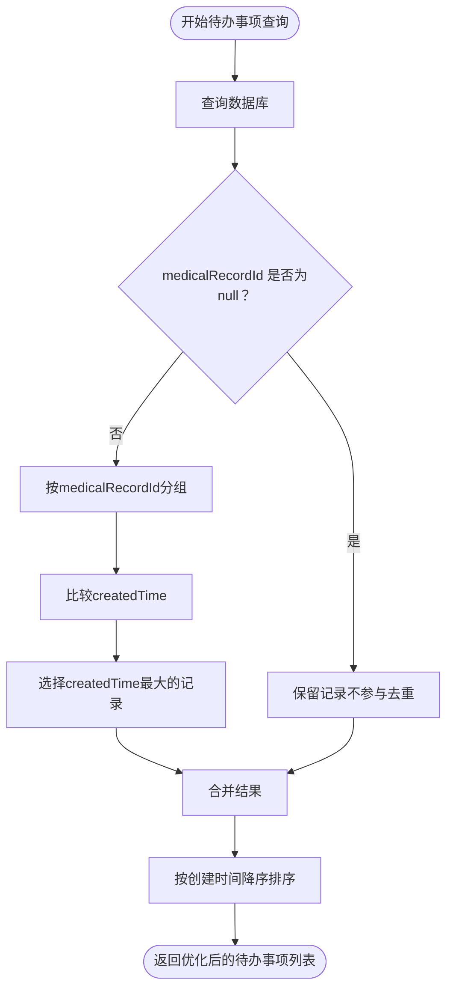
```mermaid
flowchart TD
Start(["开始待办事项查询"]) --> QueryDB["查询数据库"]
QueryDB --> NullCheck{"medicalRecordId 是否为null？"}
NullCheck --> |是| KeepRecord["保留记录不参与去重"]
NullCheck --> |否| GroupBy["按medicalRecordId分组"]
GroupBy --> CompareTime["比较createdTime"]
CompareTime --> SelectLatest["选择createdTime最大的记录"]
SelectLatest --> MergeResult["合并结果"]
KeepRecord --> MergeResult
MergeResult --> SortResult["按创建时间降序排序"]
SortResult --> End(["返回优化后的待办事项列表"])
```

**最新更新** 新增按medicalRecordId去重算法，显著提升待办事项查询的用户体验，避免重复显示同一病历的多个待办事项。

**图表来源**
- [MedicalRecordController.java:624-653](file://med_ai_assistant_1.0_bs_backend/src/main/java/com/example/medaiassistant/controller/MedicalRecordController.java#L624-L653)

**章节来源**
- [MedicalRecordController.java:624-653](file://med_ai_assistant_1.0_bs_backend/src/main/java/com/example/medaiassistant/controller/MedicalRecordController.java#L624-L653)
- [待办事项接口.md:70-368](file://med_ai_assistant_1.0_bs_backend/doc/接口/病历记录/待办事项接口.md#L70-L368)

### 数据库缓存修复系统
- 设计要点
  - 解决Hibernate自动刷新机制导致的CLOB字段处理异常问题
  - 采用只读事务配置，避免自动刷新冲突
  - 增强CLOB内容提取方法，添加重试机制处理网络波动
  - 保持向后兼容性，不改变现有业务逻辑
- 关键修复
  - 事务配置：添加readOnly = true到@Transaction注解
  - CLOB重试：实现extractClobContentSafely方法，支持指数退避重试
  - 异常处理：详细的错误日志记录和异常类型分类
  - 性能优化：只读事务不会影响查询性能
- 前端集成
  - 透明修复：无需修改前端调用逻辑
  - 稳定性提升：显著减少CLOB异常的发生频率
  - 兼容性保证：保持现有业务流程不变

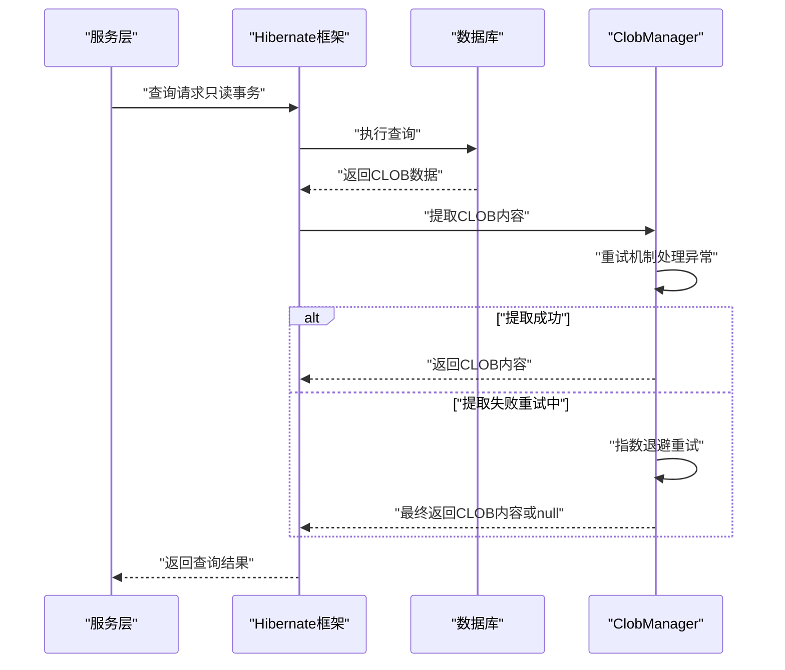
```mermaid
sequenceDiagram
participant Service as "服务层"
participant Hibernate as "Hibernate框架"
participant Database as "数据库"
participant ClobManager as "ClobManager"
Service->>Hibernate : "查询请求只读事务"
Hibernate->>Database : "执行查询"
Database-->>Hibernate : "返回CLOB数据"
Hibernate->>ClobManager : "提取CLOB内容"
ClobManager->>ClobManager : "重试机制处理异常"
alt "提取成功"
ClobManager-->>Hibernate : "返回CLOB内容"
else "提取失败重试中"
ClobManager->>ClobManager : "指数退避重试"
ClobManager-->>Hibernate : "最终返回CLOB内容或null"
end
Hibernate-->>Service : "返回查询结果"
```

**最新更新** 修复Hibernate自动刷新机制导致的CLOB字段处理异常问题，采用只读事务和CLOB重试机制双重保障。

**图表来源**
- [Hibernate自动刷新机制CLOB异常问题分析与解决方案.md:47-116](file://med_ai_assistant_1.0_bs_backend/doc/其他/Hibernate自动刷新机制CLOB异常问题分析与解决方案.md#L47-L116)

**章节来源**
- [Hibernate自动刷新机制CLOB异常问题分析与解决方案.md:1-200](file://med_ai_assistant_1.0_bs_backend/doc/其他/Hibernate自动刷新机制CLOB异常问题分析与解决方案.md#L1-L200)

### CLOB内存管理工具
- 设计要点
  - 优化Clob对象的内存管理，防止内存泄漏
  - 实现Clob对象的生命周期跟踪和自动清理
  - 提供内存使用统计和监控功能
  - 实现内存限制和自动清理机制
- 关键功能
  - 对象跟踪：使用ConcurrentHashMap跟踪活跃的Clob对象
  - 内存监控：实时监控Clob对象的内存使用情况
  - 自动清理：实现内存限制触发的自动清理机制
  - 安全释放：提供safeRelease方法确保Clob资源正确释放
- 性能优化
  - 内存限制：默认100MB最大内存限制
  - 清理策略：当内存使用超过80%时清理一半的Clob对象
  - 统计功能：提供详细的内存使用统计信息

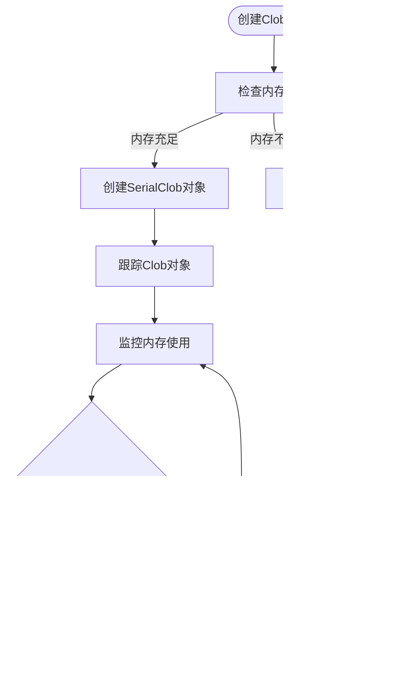
```mermaid
flowchart TD
Start(["创建Clob对象"]) --> CheckMemory["检查内存限制"]
CheckMemory --> |内存充足| CreateClob["创建SerialClob对象"]
CheckMemory --> |内存不足| CleanupOld["清理旧Clob对象"]
CleanupOld --> CheckMemory
CreateClob --> TrackClob["跟踪Clob对象"]
TrackClob --> MonitorUsage["监控内存使用"]
MonitorUsage --> MemoryCheck{"内存使用是否接近限制？"}
MemoryCheck --> |否| End(["正常运行"])
MemoryCheck --> |是| ForceCleanup["强制清理所有Clob对象"]
ForceCleanup --> MonitorUsage
```

**最新更新** 新增ClobManager工具类，专门处理Clob对象的内存管理，防止内存泄漏和性能问题。

**图表来源**
- [ClobManager.java:1-207](file://med_ai_assistant_1.0_bs_backend/src/main/java/com/example/medaiassistant/util/ClobManager.java#L1-L207)

**章节来源**
- [ClobManager.java:1-207](file://med_ai_assistant_1.0_bs_backend/src/main/java/com/example/medaiassistant/util/ClobManager.java#L1-L207)

### SQL执行缓存管理系统
- 设计要点
  - 增强SQL执行缓存清理和监控功能
  - 支持按医院ID和数据库类型进行精细化缓存管理
  - 提供缓存统计信息查询接口
  - 实现动态缓存配置和管理
- 关键功能
  - 缓存清理：支持按条件清理特定缓存条目
  - 缓存统计：提供详细的缓存使用情况统计
  - 动态配置：支持运行时缓存配置的调整
  - 错误处理：完善的异常处理和错误信息反馈
- 前端集成
  - 管理界面：提供缓存状态监控和管理功能
  - 性能优化：通过缓存清理提升系统性能
  - 故障排查：通过缓存统计信息进行问题诊断

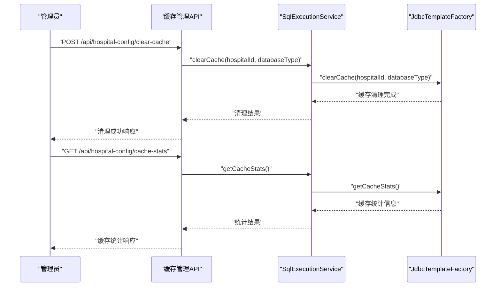
```mermaid
sequenceDiagram
participant Admin as "管理员"
participant API as "缓存管理API"
participant Service as "SqlExecutionService"
participant Factory as "JdbcTemplateFactory"
Admin->>API : "POST /api/hospital-config/clear-cache"
API->>Service : "clearCache(hospitalId, databaseType)"
Service->>Factory : "clearCache(hospitalId, databaseType)"
Factory-->>Service : "缓存清理完成"
Service-->>API : "清理结果"
API-->>Admin : "清理成功响应"
Admin->>API : "GET /api/hospital-config/cache-stats"
API->>Service : "getCacheStats()"
Service->>Factory : "getCacheStats()"
Factory-->>Service : "缓存统计信息"
Service-->>API : "统计结果"
API-->>Admin : "缓存统计响应"
```

**最新更新** 增强SQL执行缓存清理和监控功能，支持动态配置管理，提供详细的缓存统计信息。

**图表来源**
- [HospitalConfigTestController.java:450-481](file://med_ai_assistant_1.0_bs_backend/src/main/java/com/example/medaiassistant/controller/HospitalConfigTestController.java#L450-L481)
- [SqlExecutionService.java:436-450](file://med_ai_assistant_1.0_bs_backend/src/main/java/com/example/medaiassistant/hospital/service/SqlExecutionService.java#L436-L450)

**章节来源**
- [HospitalConfigTestController.java:450-481](file://med_ai_assistant_1.0_bs_backend/src/main/java/com/example/medaiassistant/controller/HospitalConfigTestController.java#L450-L481)
- [SqlExecutionService.java:436-450](file://med_ai_assistant_1.0_bs_backend/src/main/java/com/example/medaiassistant/hospital/service/SqlExecutionService.java#L436-L450)

### 科室特殊情况补充信息功能
- 设计要点
  - 新增SPECIAL_CONTENT字段支持科室特定模板的个性化配置
  - 增强PromptTemplate模型和UpdatePromptTemplateDTO的数据结构
  - 提供DepartmentDTO支持科室信息的标准化传输
  - 实现科室特殊内容的动态加载和应用
- 关键特性
  - 字段扩展：PromptTemplate模型新增specialContent字段
  - 数据传输：UpdatePromptTemplateDTO支持特殊内容配置
  - 科室支持：DepartmentDTO提供标准化的科室信息结构
  - 灵活配置：支持按科室定制的特殊内容模板
- 前端集成
  - 模板配置：支持科室特殊内容的模板配置界面
  - 动态加载：根据用户科室动态加载相应的特殊内容
  - 个性化体验：提升不同科室用户的使用体验

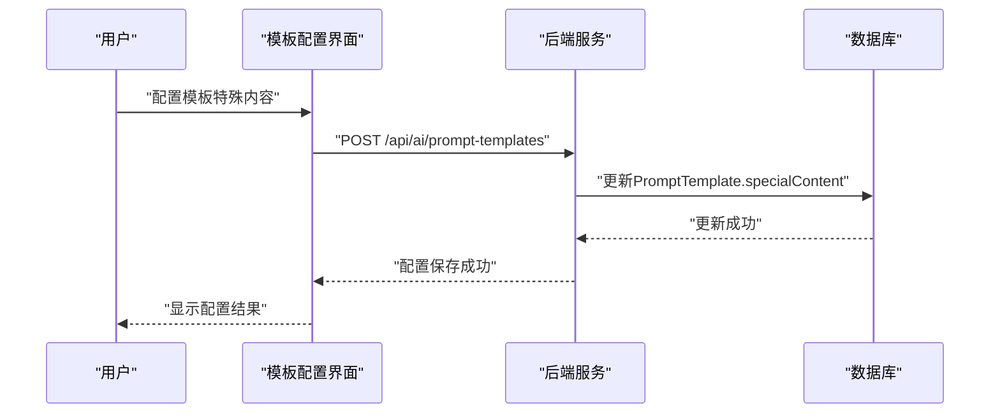
```mermaid
sequenceDiagram
participant User as "用户"
participant TemplateUI as "模板配置界面"
participant Backend as "后端服务"
participant DB as "数据库"
User->>TemplateUI : "配置模板特殊内容"
TemplateUI->>Backend : "POST /api/ai/prompt-templates"
Backend->>DB : "更新PromptTemplate.specialContent"
DB-->>Backend : "更新成功"
Backend-->>TemplateUI : "配置保存成功"
TemplateUI-->>User : "显示配置结果"
```

**最新更新** 新增科室特殊情况补充信息功能，通过SPECIAL_CONTENT字段增强AI提示模板系统的灵活性和临床相关性。

**图表来源**
- [PromptTemplate.java:31-32](file://med_ai_assistant_1.0_bs_backend/src/main/java/com/example/medaiassistant/model/PromptTemplate.java#L31-L32)
- [UpdatePromptTemplateDTO.java:56-62](file://med_ai_assistant_1.0_bs_backend/src/main/java/com/example/medaiassistant/dto/UpdatePromptTemplateDTO.java#L56-L62)
- [DepartmentDTO.java:1-41](file://med_ai_assistant_1.0_bs_backend/src/main/java/com/example/medaiassistant/dto/DepartmentDTO.java#L1-L41)

**章节来源**
- [PromptTemplate.java:1-127](file://med_ai_assistant_1.0_bs_backend/src/main/java/com/example/medaiassistant/model/PromptTemplate.java#L1-L127)
- [UpdatePromptTemplateDTO.java:56-62](file://med_ai_assistant_1.0_bs_backend/src/main/java/com/example/medaiassistant/dto/UpdatePromptTemplateDTO.java#L56-L62)
- [DepartmentDTO.java:1-41](file://med_ai_assistant_1.0_bs_backend/src/main/java/com/example/medaiassistant/dto/DepartmentDTO.java#L1-L41)

### 流式文本处理响应系统
- 设计要点
  - 新增analyzeLLMStream函数，使用Fetch API + ReadableStream消费NDJSON流
  - 支持实时LLM响应显示，提供onChunk回调获取增量内容
  - 实现超时控制、错误处理和流式更新机制
  - 支持认证Token传递和CRLF行结束符兼容
- 关键特性
  - 流式调用：analyzeLLMStream({content, onChunk, onComplete, onError})
  - 实时更新：onChunk回调实时接收生成内容，逐字更新界面
  - 完整解析：流结束后解析结构化内容（修改后记录、修改原因）
  - 超时控制：默认300000ms超时时间，支持AbortController取消
  - 错误处理：统一的错误处理机制，支持AbortError和网络错误
- 前端集成
  - MedicalRecords组件：processVoiceRecognitionText方法支持流式实时更新
  - voiceTextProcessor工具：processRecognizedTextStream函数封装流式处理
  - 诊断卡片组件：支持诊断列表的实时显示和交互
  - 用户体验：LLM生成内容在输入框中实时逐步显示，优化用户体验

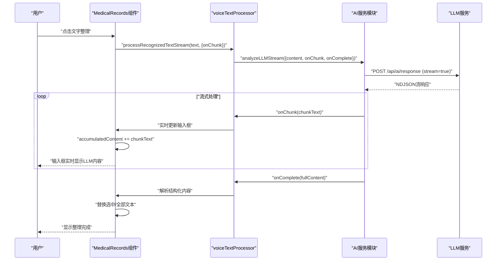
```mermaid
sequenceDiagram
participant User as "用户"
participant MedicalRecords as "MedicalRecords组件"
participant VoiceProcessor as "voiceTextProcessor"
participant AIService as "AI服务模块"
participant LLM as "LLM服务"
User->>MedicalRecords : "点击文字整理"
MedicalRecords->>VoiceProcessor : "processRecognizedTextStream(text, {onChunk})"
VoiceProcessor->>AIService : "analyzeLLMStream({content, onChunk, onComplete})"
AIService->>LLM : "POST /api/ai/response (stream=true)"
LLM-->>AIService : "NDJSON流响应"
loop "流式处理"
AIService->>VoiceProcessor : "onChunk(chunkText)"
VoiceProcessor->>MedicalRecords : "实时更新输入框"
MedicalRecords->>MedicalRecords : "accumulatedContent += chunkText"
MedicalRecords-->>User : "输入框实时显示LLM内容"
end
AIService->>VoiceProcessor : "onComplete(fullContent)"
VoiceProcessor->>MedicalRecords : "解析结构化内容"
MedicalRecords->>MedicalRecords : "替换选中/全部文本"
MedicalRecords-->>User : "显示整理完成"
```

**最新更新** 新增完整的流式文本处理响应系统，支持实时LLM响应显示，优化用户体验。

**图表来源**
- [ai.js:867-988](file://med_ai_assistant_1.0_bs_vue/src/api/ai.js#L867-L988)
- [voiceTextProcessor.js:85-134](file://med_ai_assistant_1.0_bs_vue/src/utils/voiceTextProcessor.js#L85-L134)
- [MedicalRecords.vue:2092-2210](file://med_ai_assistant_1.0_bs_vue/src/components/patient/MedicalRecords.vue#L2092-L2210)

**章节来源**
- [ai.js:867-988](file://med_ai_assistant_1.0_bs_vue/src/api/ai.js#L867-L988)
- [voiceTextProcessor.js:85-134](file://med_ai_assistant_1.0_bs_vue/src/utils/voiceTextProcessor.js#L85-L134)
- [MedicalRecords.vue:2092-2210](file://med_ai_assistant_1.0_bs_vue/src/components/patient/MedicalRecords.vue#L2092-L2210)

### AI辅助诊断概览卡片组件
- 设计要点
  - 新增DiagnosisCard.vue组件，当Prompt标题包含"诊断分析"时自动展示
  - 卡片左右分栏布局：左侧显示从AI结果中提取的诊断列表，右侧显示选中诊断的详细分析
  - 诊断分析类Prompt的AI结果区域支持折叠/展开，默认折叠，减少页面信息量
  - 支持诊断依据、鉴别诊断、补充说明等详细信息的显示
- 关键特性
  - 诊断列表：extractDiagnosisBlocks工具函数提取完整的诊断块信息
  - 详细分析：支持诊断依据、鉴别诊断、补充说明等字段显示
  - 折叠功能：默认折叠AI结果区域，减少页面信息量
  - 交互设计：支持诊断列表的点击选择和详细信息的实时显示
- 前端集成
  - AIResults组件：自动检测诊断分析类Prompt并显示诊断卡片
  - 诊断解析工具：diagnosisParser.js提供统一的诊断提取和解析逻辑
  - 诊断编辑对话框：支持AI诊断列表的刷新和管理
  - 用户体验：提供直观的诊断信息展示和交互功能

```mermaid
sequenceDiagram
participant AIResults as "AIResults组件"
participant DiagnosisCard as "DiagnosisCard组件"
participant DiagnosisParser as "diagnosisParser工具"
participant User as "用户"
AIResults->>AIResults : "检测isDiagnosisAnalysis"
alt "诊断分析类Prompt"
AIResults->>DiagnosisCard : "渲染诊断卡片组件"
DiagnosisCard->>DiagnosisParser : "extractDiagnosisBlocks(content)"
DiagnosisParser-->>DiagnosisCard : "返回诊断块列表"
DiagnosisCard->>DiagnosisCard : "初始化selectedIndex=0"
DiagnosisCard->>User : "显示诊断列表"
User->>DiagnosisCard : "点击诊断项"
DiagnosisCard->>DiagnosisCard : "更新selectedIndex"
DiagnosisCard->>User : "显示诊断详细信息"
else "非诊断分析类Prompt"
AIResults->>AIResults : "正常显示AI结果"
end
```

**最新更新** 新增AI辅助诊断概览卡片组件，提供诊断列表和详细分析功能，支持折叠/展开和左右分栏布局。

**图表来源**
- [DiagnosisCard.vue:74-143](file://med_ai_assistant_1.0_bs_vue/src/components/ai/DiagnosisCard.vue#L74-L143)
- [diagnosisParser.js:78-131](file://med_ai_assistant_1.0_bs_vue/src/utils/diagnosisParser.js#L78-L131)
- [AIResults.vue:76-102](file://med_ai_assistant_1.0_bs_vue/src/components/ai/AIResults.vue#L76-L102)

**章节来源**
- [DiagnosisCard.vue:74-143](file://med_ai_assistant_1.0_bs_vue/src/components/ai/DiagnosisCard.vue#L74-L143)
- [diagnosisParser.js:78-131](file://med_ai_assistant_1.0_bs_vue/src/utils/diagnosisParser.js#L78-L131)
- [AIResults.vue:76-102](file://med_ai_assistant_1.0_bs_vue/src/components/ai/AIResults.vue#L76-L102)

### 增强的诊断解析工具
- 设计要点
  - 新增diagnosisParser.js工具，统一提取诊断名称和完整诊断块的逻辑
  - 修复正则表达式lookahead `(?=###|$)` 误匹配四级标题（####）导致诊断列表区块被截断为空的问题
  - 支持多种诊断格式的灵活匹配，包括"诊断名称："和"诊断："等多种格式
  - 提供完整的诊断块解析功能，包括诊断编号、名称、类别、依据、鉴别诊断、补充说明等字段
- 关键特性
  - 诊断名称提取：extractDiagnosisNames函数，支持去重和格式化
  - 诊断块解析：extractDiagnosisBlocks函数，提取完整的诊断信息块
  - 正则表达式修复：修复lookahead问题，确保正确的区块分割
  - 字段提取：支持诊断编号、名称、类别、依据、鉴别诊断、补充说明等字段
  - 兼容性处理：支持多种格式和边界情况的处理
- 前端集成
  - AIResults组件：使用extractDiagnosisNames提取AI诊断列表
  - DiagnosisCard组件：使用extractDiagnosisBlocks提取诊断详细信息
  - DiagnosisEditDialog组件：支持AI诊断列表的刷新和管理
  - 用户体验：提供准确的诊断信息提取和显示功能

```mermaid
flowchart TD
Start(["开始诊断解析"]) --> InputCheck{"输入内容检查"}
InputCheck --> |为空或非字符串| ReturnEmpty["返回空数组"]
InputCheck --> |有效内容| ExtractNames["extractDiagnosisNames提取诊断名称"]
ExtractNames --> NameRegex["正则表达式匹配诊断名称"]
NameRegex --> |匹配成功| AddToMatches["添加到匹配数组"]
NameRegex --> |无匹配| FallbackRegex["尝试宽松匹配"]
FallbackRegex --> |匹配成功| AddToMatches
FallbackRegex --> |仍无匹配| Dedupe["去重并格式化"]
AddToMatches --> Dedupe
Dedupe --> ExtractBlocks["extractDiagnosisBlocks提取诊断块"]
ExtractBlocks --> FindList["查找诊断列表区块"]
FindList --> SplitBlocks["按诊断编号/名称分割诊断块"]
SplitBlocks --> ParseBlock["parseDiagnosisBlock解析单个诊断块"]
ParseBlock --> ExtractFields["提取诊断字段：编号、名称、类别、依据、鉴别诊断、补充说明"]
ExtractFields --> ReturnResults["返回诊断结果"]
ReturnEmpty --> End(["结束"])
ReturnResults --> End
```

**最新更新** 新增完整的诊断解析工具，支持诊断名称和完整诊断块的提取，修复正则表达式问题，提供准确的诊断信息解析功能。

**图表来源**
- [diagnosisParser.js:27-60](file://med_ai_assistant_1.0_bs_vue/src/utils/diagnosisParser.js#L27-L60)
- [diagnosisParser.js:78-131](file://med_ai_assistant_1.0_bs_vue/src/utils/diagnosisParser.js#L78-L131)
- [diagnosisParser.js:139-201](file://med_ai_assistant_1.0_bs_vue/src/utils/diagnosisParser.js#L139-L201)

**章节来源**
- [diagnosisParser.js:27-60](file://med_ai_assistant_1.0_bs_vue/src/utils/diagnosisParser.js#L27-L60)
- [diagnosisParser.js:78-131](file://med_ai_assistant_1.0_bs_vue/src/utils/diagnosisParser.js#L78-L131)
- [diagnosisParser.js:139-201](file://med_ai_assistant_1.0_bs_vue/src/utils/diagnosisParser.js#L139-L201)

### 优化的文字整理功能
- 设计要点
  - MedicalRecords.vue中的processVoiceRecognitionText方法从非流式改为流式响应
  - 支持选区处理：有选中文本时仅整理选中部分，否则整理全部内容
  - 实时更新：通过onChunk回调实时接收生成内容，逐字更新病历输入框
  - 解析结构化内容：流结束后解析"### 修改后记录"和"### 修改原因"标记
  - 光标位置管理：自动设置光标位置到替换后的文本末尾
- 关键特性
  - 选区检测：自动检测用户选择的文本片段
  - 实时流式更新：accumulateContent累积内容，实时更新输入框
  - 结构化解析：parseProcessedContent解析修改后记录和修改原因
  - 错误恢复：出错时自动恢复原始内容和状态
  - 用户体验：提供流畅的实时响应和准确的内容整理
- 前端集成
  - voiceTextProcessor工具：processRecognizedTextStream封装流式处理
  - 流式fetch请求：analyzeLLMStream支持认证Token和超时控制
  - NDJSON解析：兼容CRLF行结束符，支持isFinal消息处理
  - 用户界面：提供加载状态和错误提示，优化交互体验

```mermaid
sequenceDiagram
participant User as "用户"
participant MedicalRecords as "MedicalRecords组件"
participant VoiceProcessor as "voiceTextProcessor"
participant AIService as "AI服务模块"
participant LLM as "LLM服务"
User->>MedicalRecords : "点击文字整理"
MedicalRecords->>MedicalRecords : "检测选区状态"
alt "有选中文本"
MedicalRecords->>MedicalRecords : "保存选区前后文本"
end
MedicalRecords->>VoiceProcessor : "processRecognizedTextStream(textToProcess, {onChunk})"
VoiceProcessor->>AIService : "analyzeLLMStream({content, onChunk, onComplete})"
AIService->>LLM : "POST /api/ai/response (stream=true)"
LLM-->>AIService : "NDJSON流响应"
loop "流式处理"
AIService->>VoiceProcessor : "onChunk(chunkText)"
VoiceProcessor->>MedicalRecords : "实时更新输入框"
MedicalRecords->>MedicalRecords : "accumulateContent += chunkText"
MedicalRecords->>MedicalRecords : "更新输入框内容"
end
AIService->>VoiceProcessor : "onComplete(fullContent)"
VoiceProcessor->>VoiceProcessor : "parseProcessedContent(fullContent)"
VoiceProcessor->>MedicalRecords : "返回解析结果"
MedicalRecords->>MedicalRecords : "替换选中/全部文本"
MedicalRecords->>MedicalRecords : "设置光标位置"
MedicalRecords-->>User : "显示整理完成"
```

**最新更新** 优化MedicalRecords组件的文字整理功能，从非流式改为流式响应，支持实时LLM响应显示，提升用户体验。

**图表来源**
- [MedicalRecords.vue:2092-2210](file://med_ai_assistant_1.0_bs_vue/src/components/patient/MedicalRecords.vue#L2092-L2210)
- [voiceTextProcessor.js:85-134](file://med_ai_assistant_1.0_bs_vue/src/utils/voiceTextProcessor.js#L85-L134)
- [ai.js:867-988](file://med_ai_assistant_1.0_bs_vue/src/api/ai.js#L867-L988)

**章节来源**
- [MedicalRecords.vue:2092-2210](file://med_ai_assistant_1.0_bs_vue/src/components/patient/MedicalRecords.vue#L2092-L2210)
- [voiceTextProcessor.js:85-134](file://med_ai_assistant_1.0_bs_vue/src/utils/voiceTextProcessor.js#L85-L134)
- [ai.js:867-988](file://med_ai_assistant_1.0_bs_vue/src/api/ai.js#L867-L988)

### 诊断编辑对话框增强
- 设计要点
  - DiagnosisEditDialog.vue集成诊断解析工具，支持AI诊断列表的刷新
  - 当Prompt标题以"诊断分析"开头时，自动获取AI结果内容并解析诊断名称
  - 支持从store获取病人诊断数据，包含诊断ID、名称、编码等信息
  - 提供诊断列表的显示和管理功能，支持与AI诊断的对比
- 关键特性
  - AI诊断刷新：自动检测诊断分析类Prompt并刷新AI诊断列表
  - 病人诊断集成：从store获取现有病人诊断数据
  - 状态管理：维护AI诊断和当前诊断的状态同步
  - 用户交互：提供诊断列表的显示和操作功能
- 前端集成
  - 诊断解析工具：extractDiagnosisNames函数提取AI诊断名称
  - Store集成：使用Vuex状态管理维护诊断数据
  - 用户界面：提供诊断列表的显示和交互功能
  - 错误处理：处理无AI结果或非诊断分析Prompt的情况

```mermaid
sequenceDiagram
participant User as "用户"
participant DiagnosisEditDialog as "诊断编辑对话框"
participant Store as "Vuex Store"
participant DiagnosisParser as "diagnosisParser工具"
User->>DiagnosisEditDialog : "打开诊断编辑对话框"
DiagnosisEditDialog->>DiagnosisEditDialog : "检查当前Prompt标题"
alt "标题以'诊断分析'开头"
DiagnosisEditDialog->>Store : "获取AI结果内容"
Store-->>DiagnosisEditDialog : "返回result.content"
DiagnosisEditDialog->>DiagnosisParser : "extractDiagnosisNames(result.content)"
DiagnosisParser-->>DiagnosisEditDialog : "返回AI诊断列表"
DiagnosisEditDialog->>Store : "SET_AI_DIAGNOSIS(aiDiagnoses)"
DiagnosisEditDialog->>Store : "获取病人诊断数据"
Store-->>DiagnosisEditDialog : "返回diagnoses"
DiagnosisEditDialog->>DiagnosisEditDialog : "SET_CURRENT_DIAGNOSIS"
DiagnosisEditDialog-->>User : "显示诊断列表"
else "非诊断分析Prompt"
DiagnosisEditDialog-->>User : "显示警告信息"
end
```

**最新更新** 增强诊断编辑对话框的AI诊断列表刷新机制，支持诊断分析类Prompt的自动检测和诊断数据的同步。

**图表来源**
- [DiagnosisEditDialog.vue:340-358](file://med_ai_assistant_1.0_bs_vue/src/components/patient/DiagnosisEditDialog.vue#L340-L358)
- [diagnosisParser.js:27-60](file://med_ai_assistant_1.0_bs_vue/src/utils/diagnosisParser.js#L27-L60)

**章节来源**
- [DiagnosisEditDialog.vue:340-358](file://med_ai_assistant_1.0_bs_vue/src/components/patient/DiagnosisEditDialog.vue#L340-L358)
- [diagnosisParser.js:27-60](file://med_ai_assistant_1.0_bs_vue/src/utils/diagnosisParser.js#L27-L60)

## 依赖关系分析
- 组件耦合
  - 执行服务器控制器依赖AI模型配置类、专用RestTemplate、加密工具与回调服务
  - MCC分析控制器依赖MCC筛查服务、患者Repository、Prompt Repository、Prompt模板Repository
  - MCC筛查服务依赖Levenshtein工具、文本规范化工具、MCC配置属性、MCC字典Repository
  - 与数据库交互通过执行服务器专用数据源与临时表Repository
  - **前端DRG/MCC分析API**依赖Vue.js组件和后端MCC接口
  - **前端AI服务模块**依赖Vue.js组件和后端AI接口
  - **模板管理组件**依赖Element Plus UI组件和promptUtils工具
  - **顶部菜单组件**依赖设备检测逻辑和路由导航
  - **AI OCR数据采集系统**独立部署，通过API与主系统集成
  - **最新提示结果接口**依赖PromptResultRepository和AIContentResponseWrapper
  - **优化的待办事项查询**依赖MedicalRecordController的去重算法
  - **数据库缓存修复**依赖Hibernate框架和ClobManager工具类
  - **CLOB内存管理**提供独立的内存管理服务
  - **SQL执行缓存**依赖JdbcTemplateFactory进行缓存管理
  - **科室特殊情况补充信息**依赖PromptTemplate模型扩展
  - **流式文本处理系统**依赖Fetch API、ReadableStream和NDJSON解析
  - **AI诊断概览卡片**依赖diagnosisParser工具和AIResults组件
  - **增强的诊断解析**提供统一的诊断提取和解析功能
  - **优化的文字整理**依赖voiceTextProcessor工具和analyzeLLMStream函数
  - **诊断编辑对话框**集成诊断解析工具和Store状态管理
- 外部依赖
  - LLM服务：通过RestTemplate调用，需配置URL与密钥
  - 数据库：存储加密临时数据、配置与回调记录
  - Element Plus：提供UI组件和对话框功能
  - PaddleOCR：提供医疗设备屏幕的OCR识别能力
  - **MCC字典库**：存储MCC诊断编码、名称、类型、排除规则等数据
  - **外部医疗系统**：通过标准化API访问AI生成的医疗洞察
  - **Hibernate框架**：提供ORM功能和缓存管理
  - **Oracle数据库**：支持CLOB字段和复杂的SQL操作
  - **Fetch API**：提供流式响应处理能力
  - **ReadableStream**：支持NDJSON流的实时处理
  - **marked**：提供Markdown解析功能
  - **DOMPurify**：提供HTML安全过滤功能
- 潜在风险
  - LLM服务不稳定：通过熔断器与重试缓解
  - 连接池耗尽：通过专用连接池与超时配置控制
  - 配置冲突：通过隔离配置与向后兼容策略解决
  - **MCC字典缓存失效**：通过原子引用和热重载机制保证数据一致性
  - **相似度计算性能**：通过文本规范化缓存和字典预加载优化
  - **UI显示时序问题**：通过优化回调时序解决非流式响应显示问题
  - **模板执行异常**：通过补充信息输入验证和错误处理机制解决
  - **设备兼容性问题**：通过触屏/桌面差异化交互解决Android平板菜单问题
  - **OCR识别准确性**：通过模板管理和规则引擎保证数据质量
  - **外部系统集成风险**：通过标准化API和严格的参数验证确保系统稳定性
  - **CLOB内存泄漏**：通过ClobManager工具类和内存限制机制防止
  - **Hibernate缓存冲突**：通过只读事务和重试机制解决CLOB异常
  - **待办事项重复显示**：通过去重算法解决同一病历的重复待办问题
  - **缓存管理复杂性**：通过统一的缓存管理接口简化缓存操作
  - **流式响应兼容性**：通过CRLF兼容处理和错误处理机制确保稳定性
  - **诊断解析准确性**：通过正则表达式修复和字段提取优化提升准确性
  - **诊断卡片渲染性能**：通过折叠/展开和左右分栏布局优化用户体验
  - **文字整理实时性**：通过流式更新和光标管理提升交互体验

```mermaid
graph TB
Controller["执行服务器控制器"] --> Config["AI模型配置类"]
Controller --> RestTemplate["专用RestTemplate"]
Controller --> AES["AES加密工具"]
Controller --> DB["执行服务器数据源"]
Controller --> Callback["异步回调服务"]
MCCController["MCC分析控制器"] --> MCCService["MCC筛查服务"]
MCCController --> PatientRepo["患者Repository"]
MCCController --> PromptRepo["Prompt Repository"]
MCCController --> TemplateRepo["Prompt模板Repository"]
MCCService --> Levenshtein["Levenshtein工具"]
MCCService --> TextNorm["文本规范化工具"]
MCCService --> Props["MCC配置属性"]
MCCService --> MCCRepo["MCC字典Repository"]
RestTemplate --> LLM["LLM服务"]
DB --> TempRepo["加密临时表Repository"]
LatestAPI["最新提示结果接口"] --> PromptResultRepo["PromptResultRepository"]
LatestAPI --> Disclaimer["AIContentResponseWrapper"]
TodoOptimization["待办事项优化"] --> MedicalRecordController["MedicalRecordController"]
TodoOptimization --> TodoRepo["TodoItemRepository"]
CacheFix["缓存修复"] --> Hibernate["Hibernate框架"]
CacheFix --> ClobManager["ClobManager工具类"]
ClobManager --> MemoryStats["内存使用统计"]
SqlCache["SQL执行缓存"] --> JdbcTemplateFactory["JdbcTemplateFactory"]
SqlCache --> CacheStats["缓存统计信息"]
SpecialContent["科室特殊内容"] --> PromptTemplate["PromptTemplate模型"]
SpecialContent --> UpdatePromptTemplateDTO["UpdatePromptTemplateDTO"]
SpecialContent --> DepartmentDTO["DepartmentDTO"]
StreamSystem["流式文本处理系统"] --> FetchAPI["Fetch API"]
StreamSystem --> ReadableStream["ReadableStream"]
StreamSystem --> NDJSON["NDJSON解析"]
StreamSystem --> AIService["AI服务模块"]
StreamSystem --> VoiceProcessor["voiceTextProcessor工具"]
DiagnosisCard["AI诊断概览卡片"] --> DiagnosisParser["diagnosisParser工具"]
DiagnosisCard --> AIResults["AIResults组件"]
DiagnosisCard --> Marked["marked解析"]
DiagnosisCard --> DOMPurify["DOMPurify过滤"]
DiagnosisParser --> AIResults
DiagnosisParser --> DiagnosisEditDialog["诊断编辑对话框"]
DiagnosisParser --> Store["Vuex Store"]
EnhancedText["增强的文字整理"] --> VoiceProcessor
EnhancedText --> MedicalRecords["MedicalRecords组件"]
EnhancedText --> AIService
EnhancedText --> FetchAPI
EnhancedText --> ReadableStream
EnhancedText --> NDJSON
subgraph "前端依赖"
DRGAPI["DRG/MCC分析API"] --> VueComp["Vue组件"]
DRGAPI --> BackendAPI["后端MCC接口"]
AIService["AI服务模块"] --> VueComp
AIService --> BackendAPI
VueComp --> UIComponents["UI组件"]
TemplateComp["模板管理组件"] --> ElementPlus["Element Plus"]
TemplateComp --> promptUtils["promptUtils工具"]
TemplateComp --> MessageBox["MessageBox对话框"]
TopMenu["顶部菜单组件"] --> DeviceDetect["设备检测逻辑"]
TopMenu --> Router["路由导航"]
OCRAPI["OCR数据采集API"] --> OCRService["OCR服务端"]
OCRAPI --> MainSystem["主系统集成"]
LatestAPIFront["最新提示结果API"] --> ExternalSystem["外部医疗系统"]
TodoFront["优化后的待办事项界面"] --> TodoOptimization
EndDevice["医疗设备"]
end
```

**图表来源**
- [执行服务器控制器.java:84-145](file://med_ai_assistant_1.0_bs_backend/src/main/java/com/example/medaiassistant/controller/ExecutionServerController.java#L84-L145)
- [MccScreeningController.java:42-56](file://med_ai_assistant_1.0_bs_backend/src/main/java/com/example/medaiassistant/controller/MccScreeningController.java#L42-L56)
- [MccScreeningService.java:33-43](file://med_ai_assistant_1.0_bs_backend/src/main/java/com/example/medaiassistant/service/MccScreeningService.java#L33-L43)
- [AI模型配置类.java:29-68](file://med_ai_assistant_1.0_bs_backend/src/main/java/com/example/medaiassistant/config/AIModelConfig.java#L29-L68)
- [aiService.js:9-178](file://med_ai_assistant_1.0_bs_vue/src/api/ai.js#L9-L178)
- [drg.js:154-156](file://med_ai_assistant_1.0_bs_vue/src/api/drg.js#L154-L156)
- [PromptTemplates.vue:22-24](file://med_ai_assistant_1.0_bs_vue/src/components/ai/PromptTemplates.vue#L22-L24)
- [TopMenu.vue:314-326](file://med_ai_assistant_1.0_bs_vue/src/components/TopMenu.vue#L314-L326)
- [AIController.java:272-288](file://med_ai_assistant_1.0_bs_backend/src/main/java/com/example/medaiassistant/controller/AIController.java#L272-L288)
- [PromptResultRepository.java:148-164](file://med_ai_assistant_1.0_bs_backend/src/main/java/com/example/medaiassistant/repository/PromptResultRepository.java#L148-L164)
- [MedicalRecordController.java:624-653](file://med_ai_assistant_1.0_bs_backend/src/main/java/com/example/medaiassistant/controller/MedicalRecordController.java#L624-L653)
- [Hibernate自动刷新机制CLOB异常问题分析与解决方案.md:47-116](file://med_ai_assistant_1.0_bs_backend/doc/其他/Hibernate自动刷新机制CLOB异常问题分析与解决方案.md#L47-L116)
- [ClobManager.java:1-207](file://med_ai_assistant_1.0_bs_backend/src/main/java/com/example/medaiassistant/util/ClobManager.java#L1-L207)
- [SqlExecutionService.java:436-450](file://med_ai_assistant_1.0_bs_backend/src/main/java/com/example/medaiassistant/hospital/service/SqlExecutionService.java#L436-L450)
- [PromptTemplate.java:31-32](file://med_ai_assistant_1.0_bs_backend/src/main/java/com/example/medaiassistant/model/PromptTemplate.java#L31-L32)
- [UpdatePromptTemplateDTO.java:56-62](file://med_ai_assistant_1.0_bs_backend/src/main/java/com/example/medaiassistant/dto/UpdatePromptTemplateDTO.java#L56-L62)
- [DepartmentDTO.java:1-41](file://med_ai_assistant_1.0_bs_backend/src/main/java/com/example/medaiassistant/dto/DepartmentDTO.java#L1-L41)
- [2026-04-13更新日志.md:3-40](file://med_ai_assistant_1.0_bs_vue/docs/更新日志/2026-04-13.md#L3-L40)

**章节来源**
- [执行服务器控制器.java:84-145](file://med_ai_assistant_1.0_bs_backend/src/main/java/com/example/medaiassistant/controller/ExecutionServerController.java#L84-L145)
- [MccScreeningController.java:42-56](file://med_ai_assistant_1.0_bs_backend/src/main/java/com/example/medaiassistant/controller/MccScreeningController.java#L42-L56)
- [MccScreeningService.java:33-43](file://med_ai_assistant_1.0_bs_backend/src/main/java/com/example/medaiassistant/service/MccScreeningService.java#L33-L43)
- [AI模型配置类.java:29-68](file://med_ai_assistant_1.0_bs_backend/src/main/java/com/example/medaiassistant/config/AIModelConfig.java#L29-L68)
- [aiService.js:9-178](file://med_ai_assistant_1.0_bs_vue/src/api/aiService.js#L9-L178)
- [drg.js:154-156](file://med_ai_assistant_1.0_bs_vue/src/api/drg.js#L154-L156)
- [PromptTemplates.vue:22-24](file://med_ai_assistant_1.0_bs_vue/src/components/ai/PromptTemplates.vue#L22-L24)
- [TopMenu.vue:314-326](file://med_ai_assistant_1.0_bs_vue/src/components/TopMenu.vue#L314-L326)
- [AIController.java:272-288](file://med_ai_assistant_1.0_bs_backend/src/main/java/com/example/medaiassistant/controller/AIController.java#L272-L288)
- [PromptResultRepository.java:148-164](file://med_ai_assistant_1.0_bs_backend/src/main/java/com/example/medaiassistant/repository/PromptResultRepository.java#L148-L164)
- [MedicalRecordController.java:624-653](file://med_ai_assistant_1.0_bs_backend/src/main/java/com/example/medaiassistant/controller/MedicalRecordController.java#L624-L653)
- [Hibernate自动刷新机制CLOB异常问题分析与解决方案.md:47-116](file://med_ai_assistant_1.0_bs_backend/doc/其他/Hibernate自动刷新机制CLOB异常问题分析与解决方案.md#L47-L116)
- [ClobManager.java:1-207](file://med_ai_assistant_1.0_bs_backend/src/main/java/com/example/medaiassistant/util/ClobManager.java#L1-L207)
- [SqlExecutionService.java:436-450](file://med_ai_assistant_1.0_bs_backend/src/main/java/com/example/medaiassistant/hospital/service/SqlExecutionService.java#L436-L450)
- [PromptTemplate.java:31-32](file://med_ai_assistant_1.0_bs_backend/src/main/java/com/example/medaiassistant/model/PromptTemplate.java#L31-L32)
- [UpdatePromptTemplateDTO.java:56-62](file://med_ai_assistant_1.0_bs_backend/src/main/java/com/example/medaiassistant/dto/UpdatePromptTemplateDTO.java#L56-L62)
- [DepartmentDTO.java:1-41](file://med_ai_assistant_1.0_bs_backend/src/main/java/com/example/medaiassistant/dto/DepartmentDTO.java#L1-L41)
- [2026-04-13更新日志.md:3-40](file://med_ai_assistant_1.0_bs_vue/docs/更新日志/2026-04-13.md#L3-L40)

## 性能考虑
- 连接池与超时
  - 专用RestTemplate：连接超时60秒，读取超时10分钟，连接池最大50，每路由10
  - 避免默认超时导致的频繁超时与连接耗尽
- 重试策略
  - 指数退避（1秒、2秒、4秒）+ 随机抖动，避免雷群效应
  - 最多重试3次，失败后返回结构化错误信息
- 缓存与统计
  - 响应缓存：对相同Prompt复用LLM结果，降低延迟与成本
  - 性能统计：成功率、平均响应时间、错误类型分布、重试次数
- **MCC分析性能优化**
  - 字典缓存：使用AtomicReference实现线程安全的MCC字典缓存
  - 文本规范化缓存：预计算MCC名称规范化结果，提高相似度计算性能
  - 相似度计算优化：使用Levenshtein距离算法，支持文本规范化
  - TopK筛选：限制每个诊断的候选数量，减少结果集大小
  - 排除规则优化：基于MCC_EXCEPT字段的快速排除检查
- **最新提示结果接口性能优化**
  - 直接数据库查询：避免HTTP自调用开销，提升响应速度
  - 参数验证：严格的必需参数检查，减少无效请求
  - 结果包装：AIContentResponseWrapper自动添加免责声明，无需额外处理
  - 错误处理：无结果时优雅返回null，避免异常传播
- **待办事项查询性能优化**
  - 去重算法：按medicalRecordId分组，每组只保留createdTime最大的最新记录
  - null ID处理：medicalRecordId为null的记录不参与分组，直接保留
  - createdTime比较：createdTime为null时的特殊处理逻辑
  - 合并优化：将null ID记录与去重后的非null ID记录合并返回
- **数据库缓存性能优化**
  - 只读事务：避免Hibernate自动刷新机制，提高查询性能
  - CLOB重试：指数退避重试机制处理网络波动
  - 内存管理：ClobManager工具类防止内存泄漏
  - 缓存清理：动态缓存清理和监控功能
- **CLOB内存管理性能优化**
  - 内存限制：默认100MB最大内存限制，防止内存泄漏
  - 自动清理：当内存使用超过80%时清理一半的Clob对象
  - 生命周期跟踪：使用ConcurrentHashMap跟踪活跃的Clob对象
  - 安全释放：提供safeRelease方法确保Clob资源正确释放
- **SQL执行缓存性能优化**
  - 动态清理：支持按医院ID和数据库类型进行精细化缓存管理
  - 统计监控：提供详细的缓存使用情况统计
  - 性能优化：通过缓存清理提升系统整体性能
- **流式文本处理性能优化**
  - Fetch API优化：使用现代浏览器的Fetch API，支持流式响应
  - ReadableStream处理：高效处理NDJSON流数据，减少内存占用
  - 实时更新：通过onChunk回调实时更新界面，避免阻塞主线程
  - 超时控制：默认300000ms超时时间，支持AbortController取消
  - 错误处理：统一的错误处理机制，支持AbortError和网络错误
  - CRLF兼容：兼容Windows系统的CRLF行结束符
  - 认证Token：支持JWT认证Token的传递和验证
- **AI诊断概览卡片性能优化**
  - 折叠功能：默认折叠AI结果区域，减少DOM节点数量
  - 左右分栏：优化布局渲染，提升大文本内容的显示性能
  - 实时交互：支持诊断列表的点击选择，避免不必要的重渲染
  - Markdown解析：使用marked库进行安全的HTML转换
  - XSS防护：使用DOMPurify进行HTML内容的安全过滤
- **诊断解析工具性能优化**
  - 正则表达式优化：修复lookahead问题，确保正确的区块分割
  - 字段提取：支持多种诊断格式的灵活匹配
  - 兼容性处理：支持多种格式和边界情况的处理
  - 去重算法：使用Set对象进行高效的去重操作
- **文字整理功能性能优化**
  - 选区处理：支持选区检测和局部文本整理，减少处理量
  - 实时更新：通过accumulateContent累积内容，避免频繁DOM操作
  - 结构化解析：parseProcessedContent函数优化内容解析性能
  - 错误恢复：出错时自动恢复原始内容，避免数据丢失
  - 光标管理：自动设置光标位置，提升用户体验
- **诊断编辑对话框性能优化**
  - 状态同步：维护AI诊断和当前诊断的状态同步，避免重复计算
  - 用户交互：提供诊断列表的显示和操作功能，优化渲染性能
  - 错误处理：处理无AI结果或非诊断分析Prompt的情况
- 监控与告警
  - 实时监控：调用成功率、响应时间阈值告警
  - 历史分析：每日趋势、错误模式分析，指导配置调优
- **UI性能优化**
  - **非流式响应时序优化**：确保回调在Promise resolve之前执行，避免UI显示延迟
  - **错误处理优化**：支持字符串和对象形式的错误信息，提升错误信息可读性
  - **模板执行优化**：补充信息输入对话框的异步处理，避免阻塞主界面
  - **设备适配优化**：触屏/桌面差异化交互，提升移动端用户体验
  - **MCC视图优化**：平铺视图和分组视图的性能差异对比
  - **API调用优化**：修复14个重复'/api/'前缀问题，统一API调用规范
  - **外部系统集成优化**：标准化API接口，支持批量查询和缓存机制
  - **待办事项界面优化**：去重算法提升用户界面体验
  - **数据库缓存优化**：只读事务和CLOB重试机制提升系统稳定性
  - **CLOB内存管理优化**：内存限制和自动清理机制防止性能下降
  - **模板管理性能**：树形结构渲染优化，表单验证实时处理
  - **OCR系统性能**：边缘计算优化，模板匹配优化，数据流优化
  - **流式响应性能**：Fetch API + ReadableStream优化，NDJSON解析优化
  - **诊断卡片性能**：折叠/展开功能优化，左右分栏布局优化
  - **诊断解析性能**：正则表达式优化，字段提取优化
  - **文字整理性能**：选区处理优化，实时更新优化
  - **诊断编辑性能**：状态同步优化，用户交互优化

**最新更新** 新增流式文本处理系统、AI诊断概览卡片组件、增强的诊断解析工具和优化的文字整理功能的性能优化措施。修复14个API路径重复'/api/'问题，统一API调用规范。优化MCC视图渲染性能，支持平铺和分组两种展示模式。优化流式响应处理，支持Fetch API + ReadableStream消费NDJSON流，实现实时LLM响应显示。

**章节来源**
- [执行服务器LLM调用优化敏捷迭代规划.md:361-430](file://med_ai_assistant_1.0_bs_backend/doc/其他/执行服务器LLM调用优化敏捷迭代规划.md#L361-L430)
- [执行服务器LLM调用优化敏捷迭代规划.md:229-281](file://med_ai_assistant_1.0_bs_backend/doc/其他/执行服务器LLM调用优化敏捷迭代规划.md#L229-L281)
- [MccScreeningService.java:74-91](file://med_ai_assistant_1.0_bs_backend/src/main/java/com/example/medaiassistant/service/MccScreeningService.java#L74-L91)
- [AIController.java:272-288](file://med_ai_assistant_1.0_bs_backend/src/main/java/com/example/medaiassistant/controller/AIController.java#L272-L288)
- [MedicalRecordController.java:624-653](file://med_ai_assistant_1.0_bs_backend/src/main/java/com/example/medaiassistant/controller/MedicalRecordController.java#L624-L653)
- [Hibernate自动刷新机制CLOB异常问题分析与解决方案.md:47-116](file://med_ai_assistant_1.0_bs_backend/doc/其他/Hibernate自动刷新机制CLOB异常问题分析与解决方案.md#L47-L116)
- [ClobManager.java:1-207](file://med_ai_assistant_1.0_bs_backend/src/main/java/com/example/medaiassistant/util/ClobManager.java#L1-L207)
- [SqlExecutionService.java:436-450](file://med_ai_assistant_1.0_bs_backend/src/main/java/com/example/medaiassistant/hospital/service/SqlExecutionService.java#L436-L450)
- [2026-04-13更新日志.md:3-40](file://med_ai_assistant_1.0_bs_vue/docs/更新日志/2026-04-13.md#L3-L40)

## 故障排查指南
- 常见问题
  - LLM调用超时：确认专用RestTemplate配置与连接池参数
  - 网络中断后连接失败：检查连接Keep-Alive与请求超时设置
  - 错误分类不准确：完善异常捕获与错误类型映射
  - **AI对话UI无内容显示**：检查非流式响应回调时序是否正确
  - **模板补充信息输入异常**：检查Element Plus对话框组件的配置和事件处理
  - **模板管理功能失效**：验证模板树形结构渲染和表单验证逻辑
  - **Android平板菜单点击问题**：检查触屏设备检测逻辑和事件处理
  - **OCR识别失败**：验证设备模板配置和图像预处理参数
  - **MCC分析失败**：检查MCC字典加载、相似度计算、排除规则检查
  - **API路径重复问题**：验证drg.js中14个API路径是否修复
  - **MCC候选字段映射错误**：检查mccCode/mccName字段映射是否正确
  - **最新提示结果接口异常**：检查patientId和promptName参数是否正确传递
  - **外部系统集成失败**：验证标准化API接口的访问权限和参数格式
  - **待办事项重复显示**：检查去重算法是否正确执行
  - **数据库缓存异常**：验证Hibernate只读事务配置和CLOB重试机制
  - **CLOB内存泄漏**：检查ClobManager工具类的内存使用情况
  - **SQL执行缓存问题**：验证缓存清理和监控功能是否正常
  - **科室特殊内容配置失败**：检查SPECIAL_CONTENT字段的配置和加载
  - **流式文本处理失败**：检查Fetch API、ReadableStream和NDJSON解析配置
  - **AI诊断卡片显示异常**：验证diagnosisParser工具和组件集成
  - **诊断解析工具错误**：检查正则表达式和字段提取逻辑
  - **文字整理功能异常**：验证voiceTextProcessor工具和流式处理配置
  - **诊断编辑对话框问题**：检查Store状态管理和诊断列表刷新
- 排查步骤
  - 查看LLM调用统计接口，确认成功率与响应时间
  - 检查应用配置文件中的LLM专用参数
  - 验证AI模型配置的有效性与URL可达性
  - 观察回调状态与异步处理日志
  - **检查前端AI服务模块的回调时序**：确认onData回调在Promise resolve之前执行
  - **验证模板组件的补充信息处理**：检查ElMessageBox.prompt的配置和事件监听
  - **测试模板编辑对话框功能**：确认表单验证和数据同步机制
  - **验证设备检测逻辑**：检查'ontouchstart'检测和maxTouchPoints判断
  - **测试OCR数据采集流程**：验证图像采集、OCR识别和数据上报
  - **检查OCR模板匹配**：确认设备模板配置和参数区域定位
  - **验证MCC分析流程**：检查字典加载、相似度计算、候选筛选、Prompt生成
  - **测试API路径修复**：确认drg.js中所有MCC相关API路径正确
  - **验证MCC字段映射**：检查前端视图中mccCode/mccName字段显示
  - **验证最新提示结果接口**：检查数据库查询和AI免责声明包装
  - **测试外部系统集成**：验证标准化API的访问控制和数据格式
  - **验证待办事项去重算法**：检查按medicalRecordId分组和createdTime比较逻辑
  - **检查Hibernate缓存配置**：验证@Transaction注解的readOnly设置
  - **测试CLOB重试机制**：验证extractClobContentSafely方法的重试逻辑
  - **监控CLOB内存使用**：检查ClobManager的内存统计信息
  - **验证SQL缓存清理功能**：测试按条件清理缓存的功能
  - **检查科室特殊内容配置**：验证SPECIAL_CONTENT字段的加载和应用
  - **验证流式文本处理配置**：检查Fetch API、ReadableStream和NDJSON解析
  - **测试AI诊断卡片组件**：验证诊断列表提取和详细信息显示
  - **检查诊断解析工具**：验证正则表达式和字段提取的准确性
  - **测试文字整理功能**：验证voiceTextProcessor工具和流式处理
  - **验证诊断编辑对话框**：检查Store状态管理和诊断列表刷新
- 相关文档
  - AI响应接口网络中断后连接失败问题分析与解决方案
  - 执行服务器架构简化实施报告
  - 执行服务器性能优化方案
  - **AI对话UI无内容显示问题修复说明**
  - **模板管理组件功能实现指南**
  - **Android平板菜单交互问题解决方案**
  - **AI OCR数据采集系统技术方案**
  - **MCC分析功能实现指南**
  - **最新提示结果接口技术文档**
  - **待办事项查询去重算法实现**
  - **数据库缓存修复技术方案**
  - **CLOB内存管理工具使用指南**
  - **SQL执行缓存管理功能说明**
  - **科室特殊内容配置指南**
  - **流式文本处理系统技术文档**
  - **AI诊断概览卡片组件实现指南**
  - **诊断解析工具使用指南**
  - **文字整理功能优化指南**
  - **诊断编辑对话框集成指南**

**最新更新** 新增流式文本处理系统、AI诊断概览卡片组件、增强的诊断解析工具和优化的文字整理功能的故障排查指南，包括流式响应配置验证、AI诊断卡片组件测试、诊断解析工具准确性检查、文字整理功能测试和诊断编辑对话框状态管理等问题的排查步骤。

**章节来源**
- [AI响应接口网络中断后连接失败问题分析与解决方案.md](file://med_ai_assistant_1.0_bs_backend/doc/其他/AI响应接口网络中断后连接失败问题分析与解决方案.md)
- [执行服务器架构简化实施报告.md](file://med_ai_assistant_1.0_bs_backend/doc/其他/执行服务器架构简化实施报告.md)
- [执行服务器性能优化方案.md](file://med_ai_assistant_1.0_bs_backend/doc/其他/执行服务器性能优化方案.md)
- [2026-04-13更新日志.md:3-40](file://med_ai_assistant_1.0_bs_vue/docs/更新日志/2026-04-13.md#L3-L40)

## 结论
系统通过专用RestTemplate、指数退避重试、响应缓存与全面监控，有效提升了LLM调用的稳定性与性能。执行服务器专注于高时延推理与加密处理，主服务器负责业务编排与对外API，二者协同实现高可靠、可扩展的AI诊断辅助能力。**新增的MCC分析功能模块进一步增强了系统的临床价值，提供了完整的MCC预筛选、相似度计算、排除规则检查、TopK筛选和Prompt生成保存能力。**前端DRG/MCC分析API的统一接口设计，配合视图优化和字段映射修复，显著提升了用户体验。**前端AI服务模块的时序优化进一步提升了用户体验，确保AI对话内容能够及时显示在界面上。**

**最新更新** 新增的流式文本处理系统、AI诊断概览卡片组件、增强的诊断解析工具和优化的文字整理功能是系统的重要扩展。流式文本处理系统支持实时LLM响应显示，显著提升了用户体验；AI诊断概览卡片组件提供诊断列表和详细分析功能，支持折叠/展开和左右分栏布局；增强的诊断解析工具修复正则表达式问题，提供准确的诊断信息提取；优化的文字整理功能支持选区处理和实时更新，提升交互体验。这些新功能与现有的MCC分析、最新提示结果接口、待办事项查询优化、数据库缓存修复、CLOB内存管理工具和SQL执行缓存管理功能共同构成了完整的AI诊断辅助系统。

建议持续基于监控数据进行配置调优与容量规划，确保系统在复杂医疗场景下的长期稳定运行。

## 附录
- 配置建议
  - 在应用配置中添加LLM专用参数：连接超时、读取超时、最大重试次数、基础延迟、连接池大小等
  - 启用监控与告警：实时成功率、响应时间、超时错误频率与重试成功率
  - **MCC分析配置**：设置相似度阈值、TopK数量、排除规则开关等参数
  - **前端配置**：确保AI服务模块的回调时序正确，支持Promise和回调两种调用模式
  - **模板管理配置**：Element Plus组件的国际化和主题配置
  - **设备检测配置**：触屏设备检测逻辑的兼容性测试
  - **OCR系统配置**：边缘计算设备的性能参数和网络配置
  - **API调用配置**：统一的API路径规范，避免重复前缀问题
  - **最新提示结果接口配置**：参数验证规则和缓存策略配置
  - **外部系统集成配置**：访问权限控制和API版本管理
  - **待办事项查询配置**：去重算法参数和性能优化配置
  - **数据库缓存配置**：Hibernate事务配置和CLOB处理参数
  - **CLOB内存管理配置**：内存限制和清理策略配置
  - **SQL执行缓存配置**：缓存清理策略和监控参数
  - **科室特殊内容配置**：SPECIAL_CONTENT字段的配置和加载策略
  - **流式文本处理配置**：Fetch API、ReadableStream和NDJSON解析的参数配置
  - **AI诊断卡片配置**：诊断列表提取和详细信息显示的配置
  - **诊断解析工具配置**：正则表达式和字段提取的参数配置
  - **文字整理配置**：选区处理和实时更新的参数配置
  - **诊断编辑对话框配置**：Store状态管理和诊断列表刷新的配置
- 部署策略
  - 分阶段部署：开发 -> 测试 -> 预生产 -> 灰度 -> 全量
  - 回滚计划：代码回滚、配置回滚、数据回滚与监控验证
  - **版本管理**：版本号从0.4.071更新到0.8.083，包含MCC分析功能、UI显示问题修复、模板管理功能增强、Android平板界面修复、AI OCR数据采集系统、待办事项查询优化、数据库缓存修复、CLOB内存管理工具、SQL执行缓存管理功能、流式文本处理系统、AI诊断概览卡片组件、增强的诊断解析工具和优化的文字整理功能
  - **MCC字典部署**：独立部署MCC字典库，支持热重载和增量更新
  - **OCR系统部署**：独立部署OCR服务，与主系统通过API集成
  - **最新提示结果接口部署**：标准化API端点，支持外部系统访问
  - **待办事项查询部署**：优化的去重算法部署，提升用户体验
  - **数据库缓存部署**：Hibernate缓存修复部署，提高系统稳定性
  - **CLOB内存管理部署**：ClobManager工具类部署，防止内存泄漏
  - **SQL执行缓存部署**：缓存清理和监控功能部署，支持动态配置
  - **科室特殊内容部署**：SPECIAL_CONTENT字段配置部署，增强模板灵活性
  - **流式文本处理部署**：Fetch API、ReadableStream和NDJSON解析部署
  - **AI诊断卡片部署**：DiagnosisCard组件和diagnosisParser工具部署
  - **诊断解析工具部署**：diagnosisParser.js工具部署，修复正则表达式问题
  - **文字整理部署**：MedicalRecords组件和voiceTextProcessor工具部署
  - **诊断编辑对话框部署**：Store状态管理和诊断列表刷新功能部署
- **UI优化建议**
  - **非流式响应**：确保回调在Promise resolve之前执行，避免UI显示延迟
  - **错误处理**：支持多种错误格式，提供清晰的错误信息反馈
  - **加载状态**：在AI响应期间提供适当的加载提示，改善用户体验
  - **模板交互**：优化补充信息输入对话框的用户体验，提供清晰的引导和帮助信息
  - **设备适ap**：完善触屏/桌面差异化交互，提升移动端用户体验
  - **OCR界面**：提供直观的设备管理和数据监控界面
  - **MCC视图优化**：优化平铺视图和分组视图的渲染性能
  - **API调用优化**：统一API路径规范，避免重复前缀问题
  - **字段映射优化**：确保MCC候选列表字段显示正确
  - **外部系统集成优化**：提供详细的API文档和集成示例
  - **待办事项界面优化**：去重算法提升用户界面体验
  - **数据库缓存优化**：只读事务和CLOB重试机制提升系统稳定性
  - **CLOB内存管理优化**：内存限制和自动清理机制防止性能下降
  - **SQL执行缓存优化**：缓存清理策略和统计监控提升系统性能
  - **科室特殊内容优化**：SPECIAL_CONTENT字段配置提升模板灵活性
  - **流式响应优化**：Fetch API + ReadableStream优化，NDJSON解析优化
  - **诊断卡片优化**：折叠/展开功能和左右分栏布局优化
  - **诊断解析优化**：正则表达式修复和字段提取优化
  - **文字整理优化**：选区处理和实时更新优化
  - **诊断编辑优化**：状态同步和用户交互优化
- **模板管理最佳实践**
  - **模板分类**：合理组织模板类型，便于用户快速找到所需模板
  - **表单验证**：建立完善的表单验证机制，确保模板配置的正确性
  - **权限控制**：根据用户角色限制模板的创建、编辑和删除权限
  - **数据备份**：定期备份模板配置，防止意外删除造成的数据丢失
  - **模板共享**：建立模板社区共享机制，促进模板的复用和优化
  - **特殊内容管理**：合理配置SPECIAL_CONTENT字段，提升模板的临床相关性
- **OCR系统最佳实践**
  - **设备模板管理**：建立完善的设备模板库，支持快速模板匹配
  - **图像质量优化**：确保摄像头安装位置和角度符合识别要求
  - **数据校验机制**：建立多层次的数据校验规则，保证数据准确性
  - **报警机制**：设置合理的报警阈值，及时发现异常情况
  - **性能监控**：实时监控OCR识别性能和系统运行状态
- **MCC分析最佳 practice**
  - **字典维护**：定期更新MCC字典，支持热重载和增量更新
  - **相似度阈值**：根据临床需求调整相似度阈值，平衡敏感性和特异性
  - **TopK筛选**：合理设置TopK数量，避免候选过多或过少
  - **排除规则**：完善排除规则配置，提高候选质量
  - **性能监控**：监控MCC分析的响应时间和准确率
  - **用户培训**：提供MCC分析功能的使用培训和技术支持
- **最新提示结果接口最佳实践**
  - **参数验证**：严格验证patientId和promptName参数的格式和有效性
  - **缓存策略**：实现合理的缓存机制，避免频繁数据库查询
  - **错误处理**：提供清晰的错误信息和降级策略
  - **性能监控**：监控接口的响应时间和调用频率
  - **安全控制**：实现访问权限控制和API版本管理
  - **外部系统集成**：提供详细的API文档和集成示例，支持批量查询和自动化集成
- **待办事项查询最佳实践**
  - **去重算法**：确保按medicalRecordId分组和createdTime比较逻辑正确
  - **null ID处理**：正确处理medicalRecordId为null的记录
  - **性能优化**：优化查询性能，避免重复显示同一病历的多个待办事项
  - **用户体验**：提供清晰的待办事项展示和状态管理
- **数据库缓存最佳实践**
  - **事务配置**：正确配置Hibernate事务，避免自动刷新冲突
  - **CLOB处理**：实现CLOB重试机制，处理网络波动导致的异常
  - **异常处理**：建立完善的异常处理机制，确保系统稳定性
  - **性能监控**：监控缓存使用情况和系统性能
- **CLOB内存管理最佳实践**
  - **内存限制**：合理设置内存限制，防止内存泄漏
  - **自动清理**：实现智能的自动清理策略，保持系统性能
  - **生命周期管理**：跟踪Clob对象的生命周期，确保正确释放
  - **监控统计**：提供详细的内存使用统计信息
- **SQL执行缓存最佳实践**
  - **缓存清理**：实现按条件清理缓存的功能
  - **统计监控**：提供详细的缓存使用统计信息
  - **动态配置**：支持运行时缓存配置的调整
  - **错误处理**：建立完善的错误处理机制
- **科室特殊内容最佳实践**
  - **字段配置**：合理配置SPECIAL_CONTENT字段，支持个性化模板
  - **数据加载**：实现动态加载和应用科室特殊内容
  - **兼容性处理**：确保与现有模板系统的兼容性
  - **维护策略**：建立科室特殊内容的维护和更新策略
- **流式文本处理最佳实践**
  - **Fetch API配置**：正确配置Fetch API参数，支持流式响应
  - **ReadableStream处理**：实现高效的NDJSON流数据处理
  - **实时更新优化**：通过onChunk回调实现高效的实时更新
  - **超时控制**：合理设置超时时间，支持AbortController取消
  - **错误处理**：建立统一的错误处理机制
  - **CRLF兼容**：确保兼容Windows系统的CRLF行结束符
  - **认证Token**：正确传递和验证JWT认证Token
- **AI诊断卡片最佳实践**
  - **折叠功能**：合理配置折叠/展开功能，优化用户体验
  - **左右分栏**：优化左右分栏布局，提升大文本内容显示性能
  - **实时交互**：实现诊断列表的点击选择和详细信息显示
  - **Markdown解析**：使用marked库进行安全的HTML转换
  - **XSS防护**：使用DOMPurify进行HTML内容的安全过滤
- **诊断解析工具最佳实践**
  - **正则表达式优化**：修复lookahead问题，确保正确的区块分割
  - **字段提取**：支持多种诊断格式的灵活匹配
  - **兼容性处理**：处理多种格式和边界情况
  - **去重算法**：使用Set对象进行高效的去重操作
- **文字整理最佳实践**
  - **选区处理**：支持选区检测和局部文本整理
  - **实时更新**：通过accumulateContent累积内容，避免频繁DOM操作
  - **结构化解析**：优化parseProcessedContent函数的性能
  - **错误恢复**：实现自动恢复原始内容的机制
  - **光标管理**：自动设置光标位置，提升用户体验
- **诊断编辑对话框最佳实践**
  - **状态同步**：维护AI诊断和当前诊断的状态同步
  - **用户交互**：提供诊断列表的显示和操作功能
  - **错误处理**：处理无AI结果或非诊断分析Prompt的情况

**最新更新** 新增流式文本处理系统、AI诊断概览卡片组件、增强的诊断解析工具和优化的文字整理功能的最佳实践，包括Fetch API配置、ReadableStream处理、实时更新优化、超时控制、错误处理、CRLF兼容、认证Token传递、折叠功能、左右分栏布局、正则表达式优化、字段提取优化、选区处理优化、实时更新优化、状态同步优化、用户交互优化等方面的最佳实践。修复14个API路径重复'/api/'问题，统一API调用规范。优化MCC视图渲染性能，确保字段映射正确显示。

**章节来源**
- [执行服务器LLM调用优化敏捷迭代规划.md:361-430](file://med_ai_assistant_1.0_bs_backend/doc/其他/执行服务器LLM调用优化敏捷迭代规划.md#L361-L430)
- [application.properties](file://med_ai_assistant_1.0_bs_backend/src/main/resources/application.properties)
- [2026-04-13更新日志.md:3-40](file://med_ai_assistant_1.0_bs_vue/docs/更新日志/2026-04-13.md#L3-L40)