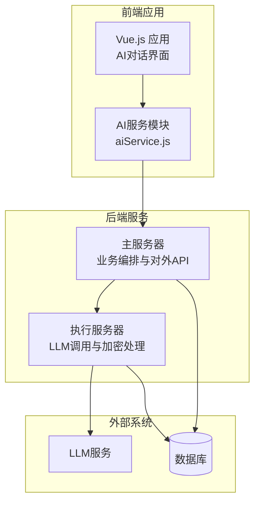
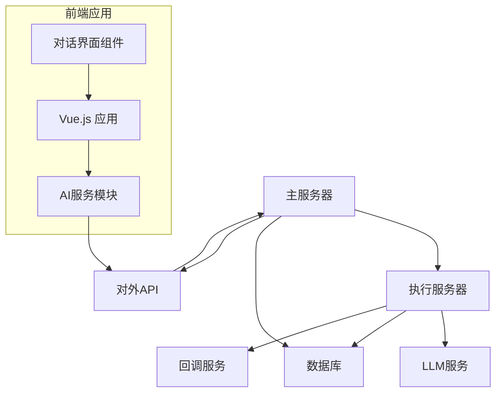
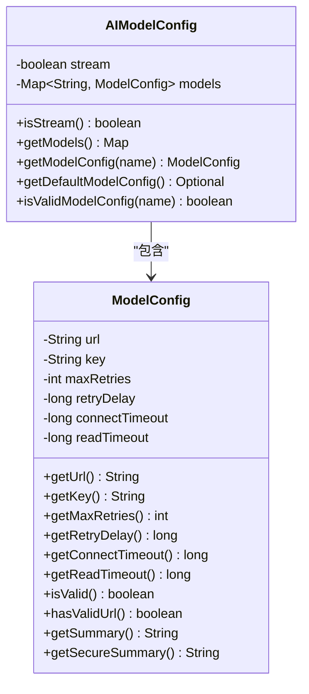
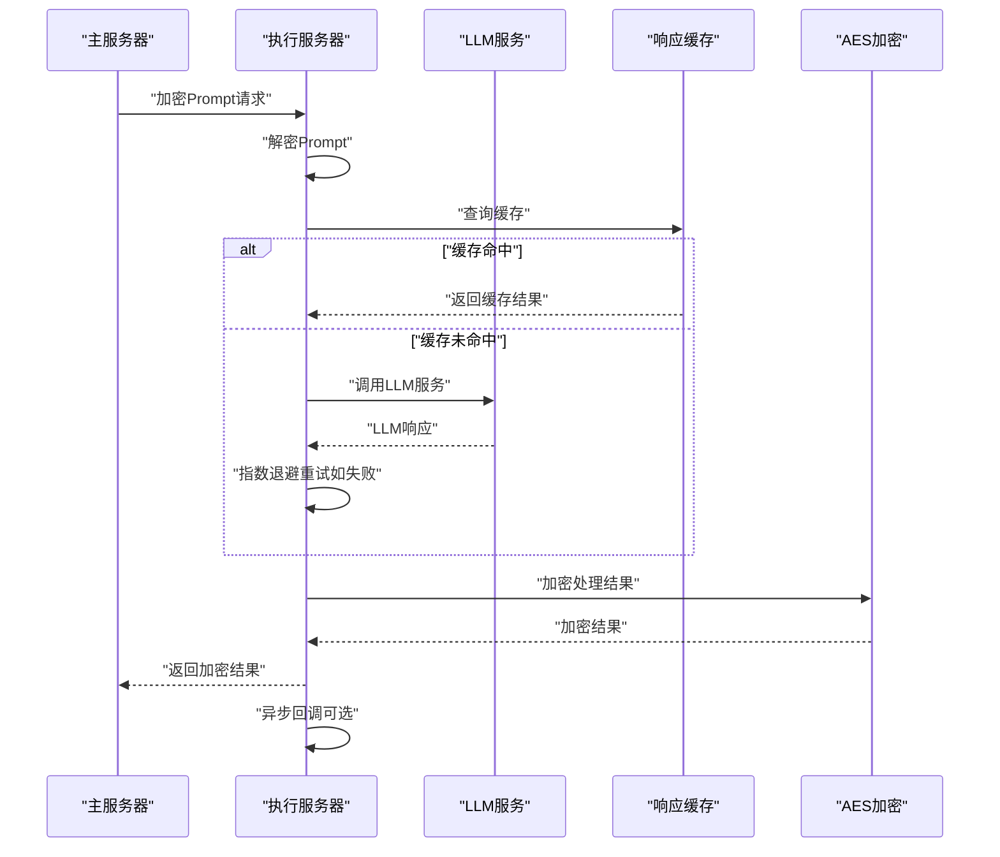
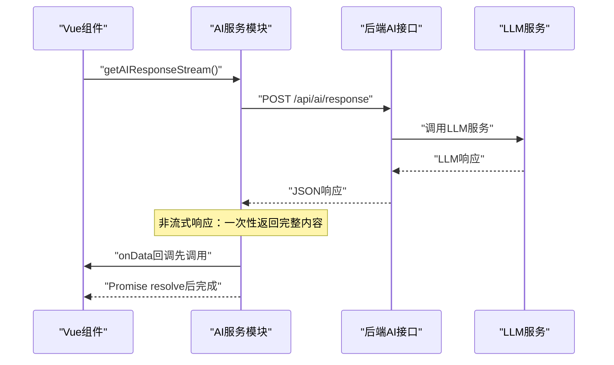
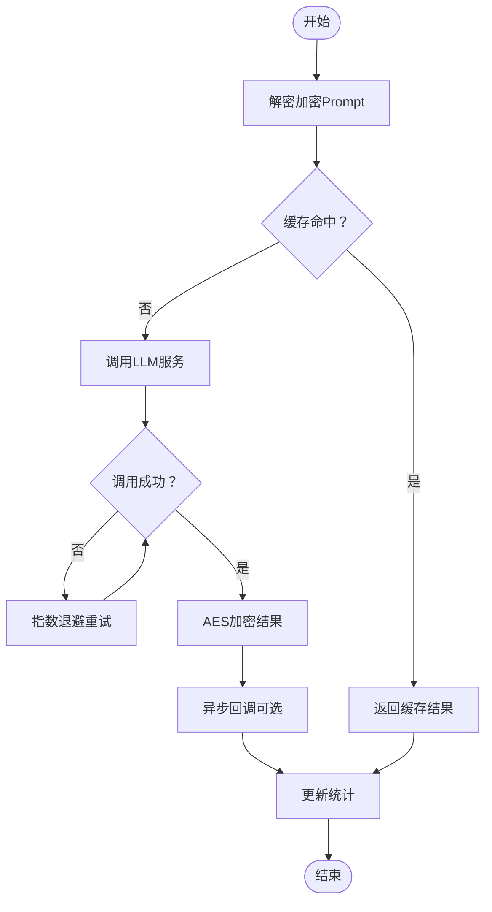
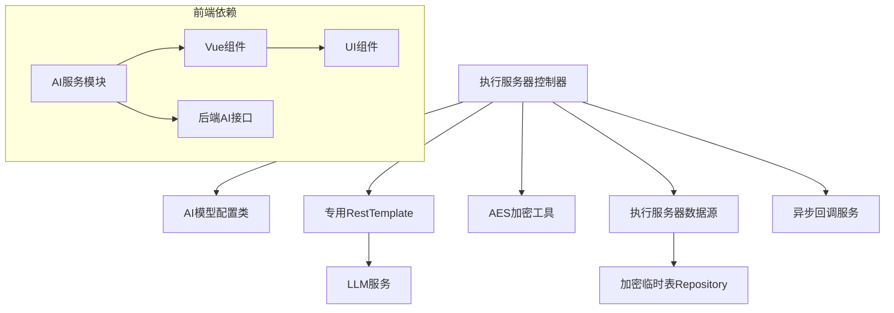

# AI诊断辅助系统

<cite>
**本文引用的文件**
- [执行服务器LLM调用优化敏捷迭代规划.md](file://med_ai_assistant_1.0_bs_backend/doc/其他/执行服务器LLM调用优化敏捷迭代规划.md)
- [API文档.md](file://med_ai_assistant_1.0_bs_backend/doc/其他/API_DOCUMENTATION.md)
- [AI模型配置类.java](file://med_ai_assistant_1.0_bs_backend/src/main/java/com/example/medaiassistant/config/AIModelConfig.java)
- [执行服务器控制器.java](file://med_ai_assistant_1.0_bs_backend/src/main/java/com/example/medaiassistant/controller/ExecutionServerController.java)
- [系统架构图.md](file://med_ai_assistant_1.0_bs_backend/doc/其他/ARCHITECTURE_DIAGRAMS.md)
- [AI响应接口网络中断后连接失败问题分析与解决方案.md](file://med_ai_assistant_1.0_bs_backend/doc/其他/AI响应接口网络中断后连接失败问题分析与解决方案.md)
- [执行服务器架构简化实施报告.md](file://med_ai_assistant_1.0_bs_backend/doc/其他/执行服务器架构简化实施报告.md)
- [执行服务器性能优化方案.md](file://med_ai_assistant_1.0_bs_backend/doc/其他/执行服务器性能优化方案.md)
- [application.properties](file://med_ai_assistant_1.0_bs_backend/src/main/resources/application.properties)
- [aiService.js](file://med_ai_assistant_1.0_bs_vue/src/api/aiService.js)
- [2026-03-20.md](file://med_ai_assistant_1.0_bs_vue/docs/更新日志/2026-03-20.md)
- [2026-03-08.md](file://med_ai_assistant_1.0_bs_vue/docs/更新日志/2026-03-08.md)
- [AIResponse.vue](file://med_ai_assistant_1.0_bs_vue/src/components/ai/AIResponse.vue)
- [MedicalRecords.vue](file://med_ai_assistant_1.0_bs_vue/src/components/patient/MedicalRecords.vue)
- [更新小结.md](file://med_ai_assistant_1.0_bs/更新小结.md)
</cite>

## 更新摘要
**变更内容**
- 修复AI对话UI无内容显示问题（aiService.js非流式响应回调时序修复）
- 版本号从0.4.071更新到0.4.072
- 优化AI服务调用时序，确保UI能够正确显示非流式响应内容
- 完善错误处理机制，提升用户体验和系统稳定性

## 目录
1. [简介](#简介)
2. [项目结构](#项目结构)
3. [核心组件](#核心组件)
4. [架构总览](#架构总览)
5. [详细组件分析](#详细组件分析)
6. [依赖关系分析](#依赖关系分析)
7. [性能考虑](#性能考虑)
8. [故障排查指南](#故障排查指南)
9. [结论](#结论)
10. [附录](#附录)

## 简介
本文件面向AI诊断辅助系统，系统采用"主服务器 + 执行服务器"的双层架构：主服务器负责业务编排、数据聚合与对外API，执行服务器专注于高时延LLM调用与加密处理。系统通过专用RestTemplate优化LLM超时配置、实现指数退避重试、完善错误分类与恢复策略，并提供性能监控与统计接口，确保在复杂医疗文本分析场景下的稳定性与可靠性。

**更新** 版本0.4.072修复了AI对话UI无内容显示的关键问题，通过优化非流式响应回调时序，确保用户界面能够正确接收和显示AI生成的内容。

## 项目结构
项目采用多模块/多文档组织方式，核心后端位于 `med_ai_assistant_1.0_bs_backend` 目录，前端位于 `med_ai_assistant_1.0_bs_vue` 目录，包含：
- 配置与控制器：AI模型配置类、执行服务器控制器等
- 前端AI服务：aiService.js提供统一的AI服务调用接口
- 文档：API文档、架构图、性能优化与问题分析报告
- 部署与测试：部署说明、自动化构建配置、测试脚本等

**图表来源**
- [执行服务器LLM调用优化敏捷迭代规划.md:140-161](file://med_ai_assistant_1.0_bs_backend/doc/其他/执行服务器LLM调用优化敏捷迭代规划.md#L140-L161)
- [API文档.md:192-493](file://med_ai_assistant_1.0_bs_backend/doc/其他/API_DOCUMENTATION.md#L192-L493)

**章节来源**
- [执行服务器LLM调用优化敏捷迭代规划.md:1-136](file://med_ai_assistant_1.0_bs_backend/doc/其他/执行服务器LLM调用优化敏捷迭代规划.md#L1-L136)
- [API文档.md:1-100](file://med_ai_assistant_1.0_bs_backend/doc/其他/API_DOCUMENTATION.md#L1-L100)

## 核心组件
- AI模型配置类：统一管理多个AI模型的端点、密钥、超时与重试参数，提供配置校验与默认模型选择。
- 执行服务器控制器：负责接收加密Prompt、解密、调用LLM、加密结果、异步回调与性能统计。
- 专用RestTemplate：针对LLM调用优化连接池、超时与请求配置，降低超时与连接耗尽风险。
- 响应缓存：对相同Prompt进行缓存，减少重复LLM调用，提升吞吐与稳定性。
- 错误分类与恢复：区分网络超时、服务端错误与未知异常，结合指数退避重试与告警机制。
- **前端AI服务模块**：提供统一的AI服务调用接口，支持Promise和回调两种模式，优化非流式响应处理时序。

**更新** 新增前端AI服务模块的时序优化，确保UI能够及时接收和显示AI响应内容。

**章节来源**
- [AI模型配置类.java:29-398](file://med_ai_assistant_1.0_bs_backend/src/main/java/com/example/medaiassistant/config/AIModelConfig.java#L29-L398)
- [执行服务器控制器.java:84-403](file://med_ai_assistant_1.0_bs_backend/src/main/java/com/example/medaiassistant/controller/ExecutionServerController.java#L84-L403)
- [执行服务器LLM调用优化敏捷迭代规划.md:139-225](file://med_ai_assistant_1.0_bs_backend/doc/其他/执行服务器LLM调用优化敏捷迭代规划.md#L139-L225)
- [aiService.js:1-280](file://med_ai_assistant_1.0_bs_vue/src/api/aiService.js#L1-L280)

## 架构总览
系统采用"主服务器 + 执行服务器"协作模式：
- 主服务器：聚合患者数据、生成Prompt、调度执行服务器、提供对外API。
- 执行服务器：专注LLM调用与加密处理，支持轮询模式与回调机制，具备完善的监控与统计。
- **前端应用**：通过AI服务模块统一调用后端AI接口，提供用户友好的对话界面。

**图表来源**
- [执行服务器LLM调用优化敏捷迭代规划.md:141-161](file://med_ai_assistant_1.0_bs_backend/doc/其他/执行服务器LLM调用优化敏捷迭代规划.md#L141-L161)
- [API文档.md:192-493](file://med_ai_assistant_1.0_bs_backend/doc/其他/API_DOCUMENTATION.md#L192-L493)

## 详细组件分析

### AI模型配置组件
- 设计要点
  - 以模型名为键的配置映射，支持多模型并行
  - 每个模型包含URL、密钥、连接/读取超时、最大重试次数、初始重试延迟
  - 提供配置有效性校验、默认模型选择与安全摘要
- 关键接口
  - 获取模型配置：按模型名检索
  - 校验配置：URL格式、必填字段完整性
  - 默认模型：优先返回常用模型，否则返回首个有效配置

**图表来源**
- [AI模型配置类.java:29-398](file://med_ai_assistant_1.0_bs_backend/src/main/java/com/example/medaiassistant/config/AIModelConfig.java#L29-L398)

**章节来源**
- [AI模型配置类.java:29-398](file://med_ai_assistant_1.0_bs_backend/src/main/java/com/example/medaiassistant/config/AIModelConfig.java#L29-L398)

### 执行服务器控制器（LLM调用与处理）
- 设计要点
  - 专用RestTemplate：连接池、超时与Keep-Alive策略优化
  - LLM调用：集成重试机制（指数退避+抖动），错误分类与恢复
  - 数据处理：解密 -> Prompt分析 -> 加密 -> 回调
  - 监控统计：调用次数、成功率、响应时间分布、重试统计
- 关键流程

**图表来源**
- [执行服务器控制器.java:400-470](file://med_ai_assistant_1.0_bs_backend/src/main/java/com/example/medaiassistant/controller/ExecutionServerController.java#L400-L470)
- [执行服务器控制器.java:781-884](file://med_ai_assistant_1.0_bs_backend/src/main/java/com/example/medaiassistant/controller/ExecutionServerController.java#L781-L884)
- [执行服务器LLM调用优化敏捷迭代规划.md:229-281](file://med_ai_assistant_1.0_bs_backend/doc/其他/执行服务器LLM调用优化敏捷迭代规划.md#L229-L281)

**章节来源**
- [执行服务器控制器.java:400-470](file://med_ai_assistant_1.0_bs_backend/src/main/java/com/example/medaiassistant/controller/ExecutionServerController.java#L400-L470)
- [执行服务器控制器.java:781-884](file://med_ai_assistant_1.0_bs_backend/src/main/java/com/example/medaiassistant/controller/ExecutionServerController.java#L781-L884)
- [执行服务器LLM调用优化敏捷迭代规划.md:229-281](file://med_ai_assistant_1.0_bs_backend/doc/其他/执行服务器LLM调用优化敏捷迭代规划.md#L229-L281)

### 前端AI服务模块（时序优化）
- 设计要点
  - 提供统一的AI服务调用接口，支持Promise和回调两种模式
  - 优化非流式响应处理时序，确保UI能够及时接收数据
  - 完善错误处理机制，支持字符串和对象形式的错误信息
  - 保留方法名向后兼容性，实际采用非流式请求模式
- 关键流程

**更新** 修复了非流式响应模式下的回调时序问题，确保UI能够在Promise resolve之前接收到数据。

**图表来源**
- [aiService.js:110-170](file://med_ai_assistant_1.0_bs_vue/src/api/aiService.js#L110-L170)
- [aiService.js:229-279](file://med_ai_assistant_1.0_bs_vue/src/api/aiService.js#L229-L279)

**章节来源**
- [aiService.js:110-170](file://med_ai_assistant_1.0_bs_vue/src/api/aiService.js#L110-L170)
- [aiService.js:229-279](file://med_ai_assistant_1.0_bs_vue/src/api/aiService.js#L229-L279)

### 数据预处理与结果后处理
- 预处理
  - 解密：从数据库读取AES密钥与盐值，解密Base64加密的Prompt
  - 缓存：基于Prompt内容生成缓存键，命中则直接返回
- 推理过程
  - 调用LLM服务，支持流式与非流式响应
  - 指数退避重试，避免网络波动与服务异常导致的失败
- 后处理
  - 加密：将LLM结果进行AES加密
  - 回调：异步通知主服务器处理完成
  - 统计：记录调用次数、成功率、响应时间与错误类型

**图表来源**
- [执行服务器控制器.java:781-884](file://med_ai_assistant_1.0_bs_backend/src/main/java/com/example/medaiassistant/controller/ExecutionServerController.java#L781-L884)
- [执行服务器LLM调用优化敏捷迭代规划.md:229-281](file://med_ai_assistant_1.0_bs_backend/doc/其他/执行服务器LLM调用优化敏捷迭代规划.md#L229-L281)

**章节来源**
- [执行服务器控制器.java:781-884](file://med_ai_assistant_1.0_bs_backend/src/main/java/com/example/medaiassistant/controller/ExecutionServerController.java#L781-L884)

### API与调用方式
- AI分析服务
  - 获取患者综合信息：聚合基本信息、诊断、病历、长期/临时医嘱、化验与检查结果
  - 保存对话历史：记录用户与AI的交互
  - 流式AI响应：SSE流式返回，支持心跳与错误事件
  - 非流式AI响应：一次性返回推理过程与最终结果
  - AI参数：支持温度、最大token、top_p、频率惩罚、存在惩罚、生成数量、停止符、用户标识等
  - 健康检查：检查AI模型服务状态
- 调用示例
  - 流式调用：POST `/api/ai/stream-response-post`，Content-Type: application/json
  - 非流式调用：POST `/api/ai/response`，请求体包含model与messages
  - 健康检查：GET `/api/health/ai-status`

**章节来源**
- [API文档.md:192-493](file://med_ai_assistant_1.0_bs_backend/doc/其他/API_DOCUMENTATION.md#L192-L493)
- [API文档.md:494-590](file://med_ai_assistant_1.0_bs_backend/doc/其他/API_DOCUMENTATION.md#L494-L590)

## 依赖关系分析
- 组件耦合
  - 执行服务器控制器依赖AI模型配置类、专用RestTemplate、加密工具与回调服务
  - 与数据库交互通过执行服务器专用数据源与临时表Repository
  - **前端AI服务模块**依赖Vue.js组件和后端AI接口
- 外部依赖
  - LLM服务：通过RestTemplate调用，需配置URL与密钥
  - 数据库：存储加密临时数据、配置与回调记录
- 潜在风险
  - LLM服务不稳定：通过熔断器与重试缓解
  - 连接池耗尽：通过专用连接池与超时配置控制
  - 配置冲突：通过隔离配置与向后兼容策略解决
  - **UI显示时序问题**：通过优化回调时序解决非流式响应显示问题

**图表来源**
- [执行服务器控制器.java:84-145](file://med_ai_assistant_1.0_bs_backend/src/main/java/com/example/medaiassistant/controller/ExecutionServerController.java#L84-L145)
- [AI模型配置类.java:29-68](file://med_ai_assistant_1.0_bs_backend/src/main/java/com/example/medaiassistant/config/AIModelConfig.java#L29-L68)
- [aiService.js:9-178](file://med_ai_assistant_1.0_bs_vue/src/api/aiService.js#L9-L178)

**章节来源**
- [执行服务器控制器.java:84-145](file://med_ai_assistant_1.0_bs_backend/src/main/java/com/example/medaiassistant/controller/ExecutionServerController.java#L84-L145)
- [AI模型配置类.java:29-68](file://med_ai_assistant_1.0_bs_backend/src/main/java/com/example/medaiassistant/config/AIModelConfig.java#L29-L68)
- [aiService.js:9-178](file://med_ai_assistant_1.0_bs_vue/src/api/aiService.js#L9-L178)

## 性能考虑
- 连接池与超时
  - 专用RestTemplate：连接超时60秒，读取超时10分钟，连接池最大50，每路由10
  - 避免默认超时导致的频繁超时与连接耗尽
- 重试策略
  - 指数退避（1秒、2秒、4秒）+ 随机抖动，避免雷群效应
  - 最多重试3次，失败后返回结构化错误信息
- 缓存与统计
  - 响应缓存：对相同Prompt复用LLM结果，降低延迟与成本
  - 性能统计：成功率、平均响应时间、错误类型分布、重试次数
- 监控与告警
  - 实时监控：调用成功率、响应时间阈值告警
  - 历史分析：每日趋势、错误模式分析，指导配置调优
- **UI性能优化**
  - **非流式响应时序优化**：确保回调在Promise resolve之前执行，避免UI显示延迟
  - **错误处理优化**：支持字符串和对象形式的错误信息，提升错误信息可读性

**更新** 新增UI性能优化措施，特别是非流式响应的时序优化。

**章节来源**
- [执行服务器LLM调用优化敏捷迭代规划.md:361-430](file://med_ai_assistant_1.0_bs_backend/doc/其他/执行服务器LLM调用优化敏捷迭代规划.md#L361-L430)
- [执行服务器LLM调用优化敏捷迭代规划.md:229-281](file://med_ai_assistant_1.0_bs_backend/doc/其他/执行服务器LLM调用优化敏捷迭代规划.md#L229-L281)
- [2026-03-20.md:5-10](file://med_ai_assistant_1.0_bs_vue/docs/更新日志/2026-03-20.md#L5-L10)

## 故障排查指南
- 常见问题
  - LLM调用超时：确认专用RestTemplate配置与连接池参数
  - 网络中断后连接失败：检查连接Keep-Alive与请求超时设置
  - 错误分类不准确：完善异常捕获与错误类型映射
  - **AI对话UI无内容显示**：检查非流式响应回调时序是否正确
- 排查步骤
  - 查看LLM调用统计接口，确认成功率与响应时间
  - 检查应用配置文件中的LLM专用参数
  - 验证AI模型配置的有效性与URL可达性
  - 观察回调状态与异步处理日志
  - **检查前端AI服务模块的回调时序**：确认onData回调在Promise resolve之前执行
- 相关文档
  - AI响应接口网络中断后连接失败问题分析与解决方案
  - 执行服务器架构简化实施报告
  - 执行服务器性能优化方案
  - **AI对话UI无内容显示问题修复说明**

**更新** 新增AI对话UI无内容显示问题的排查指南。

**章节来源**
- [AI响应接口网络中断后连接失败问题分析与解决方案.md](file://med_ai_assistant_1.0_bs_backend/doc/其他/AI响应接口网络中断后连接失败问题分析与解决方案.md)
- [执行服务器架构简化实施报告.md](file://med_ai_assistant_1.0_bs_backend/doc/其他/执行服务器架构简化实施报告.md)
- [执行服务器性能优化方案.md](file://med_ai_assistant_1.0_bs_backend/doc/其他/执行服务器性能优化方案.md)
- [2026-03-20.md:5-10](file://med_ai_assistant_1.0_bs_vue/docs/更新日志/2026-03-20.md#L5-L10)

## 结论
系统通过专用RestTemplate、指数退避重试、响应缓存与全面监控，有效提升了LLM调用的稳定性与性能。执行服务器专注于高时延推理与加密处理，主服务器负责业务编排与对外API，二者协同实现高可靠、可扩展的AI诊断辅助能力。**前端AI服务模块的时序优化进一步提升了用户体验，确保AI对话内容能够及时显示在界面上。** 建议持续基于监控数据进行配置调优与容量规划，确保系统在复杂医疗场景下的长期稳定运行。

**更新** 版本0.4.072通过修复非流式响应回调时序问题，显著提升了AI对话UI的用户体验和系统稳定性。

## 附录
- 配置建议
  - 在应用配置中添加LLM专用参数：连接超时、读取超时、最大重试次数、基础延迟、连接池大小等
  - 启用监控与告警：实时成功率、响应时间、超时错误频率与重试成功率
  - **前端配置**：确保AI服务模块的回调时序正确，支持Promise和回调两种调用模式
- 部署策略
  - 分阶段部署：开发 -> 测试 -> 预生产 -> 灰度 -> 全量
  - 回滚计划：代码回滚、配置回滚、数据回滚与监控验证
  - **版本管理**：版本号从0.4.071更新到0.4.072，包含UI显示问题修复
- **UI优化建议**
  - **非流式响应**：确保回调在Promise resolve之前执行，避免UI显示延迟
  - **错误处理**：支持多种错误格式，提供清晰的错误信息反馈
  - **加载状态**：在AI响应期间提供适当的加载提示，改善用户体验

**更新** 新增UI优化建议和版本管理说明。

**章节来源**
- [执行服务器LLM调用优化敏捷迭代规划.md:361-430](file://med_ai_assistant_1.0_bs_backend/doc/其他/执行服务器LLM调用优化敏捷迭代规划.md#L361-L430)
- [application.properties](file://med_ai_assistant_1.0_bs_backend/src/main/resources/application.properties)
- [2026-03-20.md:15-17](file://med_ai_assistant_1.0_bs_vue/docs/更新日志/2026-03-20.md#L15-L17)
- [2026-03-08.md:28-36](file://med_ai_assistant_1.0_bs_vue/docs/更新日志/2026-03-08.md#L28-L36)