# DRG分析系统增强

<cite>
**本文档引用的文件**
- [MedAiAssistantBackendApplication.java](file://med_ai_assistant_1.0_bs_backend/src/main/java/com/example/medaiassistant/MedAiAssistantBackendApplication.java)
- [HomeController.java](file://med_ai_assistant_1.0_bs_backend/src/main/java/com/example/medaiassistant/HomeController.java)
- [AIModelConfig.java](file://med_ai_assistant_1.0_bs_backend/src/main/java/com/example/medaiassistant/config/AIModelConfig.java)
- [AIRouterConfig.java](file://med_ai_assistant_1.0_bs_backend/src/main/java/com/example/medaiassistant/config/AIRouterConfig.java)
- [AIResponseController.java](file://med_ai_assistant_1.0_bs_backend/src/main/java/com/example/medaiassistant/controller/AIResponseController.java)
- [AIController.java](file://med_ai_assistant_1.0_bs_backend/src/main/java/com/example/medaiassistant/controller/AIController.java)
- [RetryUtil.java](file://med_ai_assistant_1.0_bs_backend/src/main/java/com/example/medaiassistant/util/RetryUtil.java)
- [AIRequest.java](file://med_ai_assistant_1.0_bs_backend/src/main/java/com/example/medaiassistant/dto/AIRequest.java)
- [README.md](file://med_ai_assistant_1.0_bs_backend/deploy/README.md)
- [DRG分析接口.md](file://med_ai_assistant_1.0_bs_backend/doc/接口/DRG分析接口.md)
- [DRG分析API接口.md](file://med_ai_assistant_1.0_bs_backend/doc/系统结构/DRG分析/DRG分析API接口.md)
- [DRG目录匹配接口.md](file://med_ai_assistant_1.0_bs_backend/doc/接口/DRG目录匹配接口.md)
- [DiagnosisController.java](file://med_ai_assistant_1.0_bs_backend/src/main/java/com/example/medaiassistant/controller/DiagnosisController.java)
- [SurgeryController.java](file://med_ai_assistant_1.0_bs_backend/src/main/java/com/example/medaiassistant/controller/SurgeryController.java)
- [DrgAnalysisController.java](file://med_ai_assistant_1.0_bs_backend/src/main/java/com/example/medaiassistant/controller/DrgAnalysisController.java)
- [DrgMatchingController.java](file://med_ai_assistant_1.0_bs_backend/src/main/java/com/example/medaiassistant/controller/DrgMatchingController.java)
- [DrgCatalogController.java](file://med_ai_assistant_1.0_bs_backend/src/main/java/com/example/medaiassistant/controller/DrgCatalogController.java)
- [DrgAiAnalysisController.java](file://med_ai_assistant_1.0_bs_backend/src/main/java/com/example/medaiassistant/controller/DrgAiAnalysisController.java)
- [DrgProfitLossController.java](file://med_ai_assistant_1.0_bs_backend/src/main/java/com/example/medaiassistant/controller/DrgProfitLossController.java)
- [DrgSnapshotController.java](file://med_ai_assistant_1.0_bs_backend/src/main/java/com/example/medaiassistant/controller/DrgSnapshotController.java)
- [MccScreeningController.java](file://med_ai_assistant_1.0_bs_backend/src/main/java/com/example/medaiassistant/controller/MccScreeningController.java)
- [DrgAnalysisOrchestrator.java](file://med_ai_assistant_1.0_bs_backend/src/main/java/com/example/medaiassistant/drg/orchestrator/DrgAnalysisOrchestrator.java)
- [PrimaryDiagnosisProcedureMatcher.java](file://med_ai_assistant_1.0_bs_backend/src/main/java/com/example/medaiassistant/drg/matching/PrimaryDiagnosisProcedureMatcher.java)
- [DrgMatchingService.java](file://med_ai_assistant_1.0_bs_backend/src/main/java/com/example/medaiassistant/service/DrgMatchingService.java)
- [DrgCatalogLoader.java](file://med_ai_assistant_1.0_bs_backend/src/main/java/com/example/medaiassistant/drg/catalog/DrgCatalogLoader.java)
- [DrgAiAnalysisService.java](file://med_ai_assistant_1.0_bs_backend/src/main/java/com/example/medaiassistant/service/DrgAiAnalysisService.java)
- [DrgAnalysisService.java](file://med_ai_assistant_1.0_bs_backend/src/main/java/com/example/medaiassistant/service/DrgAnalysisService.java)
- [DrgAnalysisResultRepository.java](file://med_ai_assistant_1.0_bs_backend/src/main/java/com/example/medaiassistant/repository/DrgAnalysisResultRepository.java)
- [DiagnosisRepository.java](file://med_ai_assistant_1.0_bs_backend/src/main/java/com/example/medaiassistant/repository/DiagnosisRepository.java)
- [SurgeryRepository.java](file://med_ai_assistant_1.0_bs_backend/src/main/java/com/example/medaiassistant/repository/SurgeryRepository.java)
- [PromptResult.java](file://med_ai_assistant_1.0_bs_backend/src/main/java/com/example/medaiassistant/model/PromptResult.java)
- [DrgAnalysisResult.java](file://med_ai_assistant_1.0_bs_backend/src/main/java/com/example/medaiassistant/model/DrgAnalysisResult.java)
- [Diagnosis.java](file://med_ai_assistant_1.0_bs_backend/src/main/java/com/example/medaiassistant/model/Diagnosis.java)
- [Surgery.java](file://med_ai_assistant_1.0_bs_backend/src/main/java/com/example/medaiassistant/model/Surgery.java)
- [Drg.java](file://med_ai_assistant_1.0_bs_backend/src/main/java/com/example/medaiassistant/model/Drg.java)
- [DrgAnalysisInputSnapshot.java](file://med_ai_assistant_1.0_bs_backend/src/main/java/com/example/medaiassistant/model/DrgAnalysisInputSnapshot.java)
- [DrgAnalysisInputSnapshot.java](file://med_ai_assistant_1.0_bs_backend/src/main/java/com/example/medaiassistant/dto/drg/DrgAnalysisInputSnapshot.java)
- [DrgAnalysisResultDTO.java](file://med_ai_assistant_1.0_bs_backend/src/main/java/com/example/medaiassistant/dto/drg/DrgAnalysisResultDTO.java)
- [DrgParsedRecord.java](file://med_ai_assistant_1.0_bs_backend/src/main/java/com/example/medaiassistant/dto/drg/DrgParsedRecord.java)
- [DiagnosisEntry.java](file://med_ai_assistant_1.0_bs_backend/src/main/java/com/example/medaiassistant/dto/drg/DiagnosisEntry.java)
- [PatientDiagnosis.java](file://med_ai_assistant_1.0_bs_backend/src/main/java/com/example/medaiassistant/dto/drg/PatientDiagnosis.java)
- [MatchingResult.java](file://med_ai_assistant_1.0_bs_backend/src/main/java/com/example/medaiassistant/dto/drg/MatchingResult.java)
- [DrgFilter.java](file://med_ai_assistant_1.0_bs_backend/src/main/java/com/example/medaiassistant/drg/matching/DrgFilter.java)
- [NameCollector.java](file://med_ai_assistant_1.0_bs_backend/src/main/java/com/example/medaiassistant/drg/matching/NameCollector.java)
- [IcdMatcher.java](file://med_ai_assistant_1.0_bs_backend/src/main/java/com/example/medaiassistant/drg/matching/IcdMatcher.java)
- [NameMatcher.java](file://med_ai_assistant_1.0_bs_backend/src/main/java/com/example/medaiassistant/drg/matching/NameMatcher.java)
- [DrgBatchMatchResult.java](file://med_ai_assistant_1.0_bs_backend/src/main/java/com/example/medaiassistant/drg/catalog/DrgBatchMatchResult.java)
- [Stage2 DRG Analysis Verification Report.md](file://med_ai_assistant_1.0_bs_backend/doc/其他/阶段2-DRG分析功能完成验证.md)
- [Update Log.md](file://更新小结.md)
</cite>

## 更新摘要
**所做更改**
- 实现"诊断为主、手术为辅"差异化评分策略，优化DRG匹配逻辑
- 新增PrimaryDiagnosisProcedureMatcher匹配过程DEBUG日志，增强调试能力
- 添加心房颤动无手术场景测试用例，完善匹配策略验证
- 更新DRG目录匹配接口文档和Javadoc注释，提升文档质量
- **版本0.7.005新增**：DRG分析按钮添加确认对话框，新增AI分析结果卡片，AI辅助页面过滤DRG专用Prompt记录
- **版本0.7.004新增**：DRG分析页面新增"主要诊断及操作分析"按钮，一键生成DRG分析Prompt并提交AI分析
- **版本0.7.003新增**：新增DRG批量组合匹配功能，遍历所有诊断×手术组合进行DRG分组计算，按权重降序展示汇总结果
- **版本0.7.002新增**：新增DRG HIV过滤功能：当患者无HIV相关诊断时，排除HIV相关DRG分组
- **版本0.7.001实现**：双向严格分流策略：患者无手术时只匹配无手术DRG，患者有手术时只匹配有手术DRG；新增首行"/"标识检测，支持识别MAINPROCEDURES首行为"/"的DRG记录
- **版本0.6.090和0.6.089优化**：DRG匹配逻辑，实现"诊断为主、手术为辅"差异化评分策略

## 目录
1. [项目概述](#项目概述)
2. [系统架构](#系统架构)
3. [核心组件分析](#核心组件分析)
4. [AI模型配置系统](#ai模型配置系统)
5. [响应式AI服务](#响应式ai服务)
6. [重试机制设计](#重试机制设计)
7. [DRG分析页面重构](#drg分析页面重构)
8. [DRG目录匹配服务](#drg目录匹配服务)
9. [患者医疗信息卡片](#患者医疗信息卡片)
10. [诊断列表管理](#诊断列表管理)
11. [手术列表管理](#手术列表管理)
12. [合并症历史结果卡片](#合并症历史结果卡片)
13. [DRG批量组合匹配功能](#drg批量组合匹配功能)
14. [HIV过滤功能](#hiv过滤功能)
15. [双向严格分流策略](#双向严格分流策略)
16. [首行标识检测](#首行标识检测)
17. [后端API接口](#后端api接口)
18. [部署架构](#部署架构)
19. [性能优化特性](#性能优化特性)
20. [故障排查指南](#故障排查指南)
21. [总结](#总结)

## 项目概述

DRG分析系统增强项目是一个基于Spring Boot的企业级医疗AI助手后端系统。该系统专门为DRG（Diagnosis Related Groups）分析场景提供智能化的医疗数据分析能力，集成了先进的AI模型调用、响应式编程和高可用性架构设计。

### 系统特性

- **多模型支持**：支持多种AI模型配置，包括DeepSeek等主流大语言模型
- **响应式编程**：采用WebFlux实现高并发的流式数据处理
- **智能重试机制**：内置指数退避和抖动算法，确保网络波动下的稳定性
- **分布式部署**：支持主服务器和执行服务器的分离部署架构
- **企业级安全**：完善的配置管理和安全防护机制
- **页面重构支持**：全新DRG分析页面设计，支持患者医疗信息卡片展示
- **历史结果跟踪**：新增合并症或并发症分析历史结果卡片功能，允许医护人员查看和跟踪过去的分析结果
- **DRG目录匹配**：新增基于主要诊断和主要手术的DRG目录匹配功能，提供精确的DRG记录查询和匹配能力
- **差异化评分策略**：实现"诊断为主、手术为辅"的匹配评分策略，提升匹配准确性
- **批量组合匹配**：支持遍历所有诊断×手术组合进行DRG分组计算，按权重降序展示汇总结果
- **HIV过滤功能**：当患者无HIV相关诊断时，自动排除HIV相关DRG分组
- **双向严格分流**：根据患者手术状态严格分流DRG匹配，确保匹配结果的临床准确性

**章节来源**
- [MedAiAssistantBackendApplication.java:1-50](file://med_ai_assistant_1.0_bs_backend/src/main/java/com/example/medaiassistant/MedAiAssistantBackendApplication.java#L1-L50)
- [README.md:1-250](file://med_ai_assistant_1.0_bs_backend/deploy/README.md#L1-L250)

## 系统架构

系统采用分层架构设计，将AI服务调用、配置管理、响应式处理和安全控制有机结合。

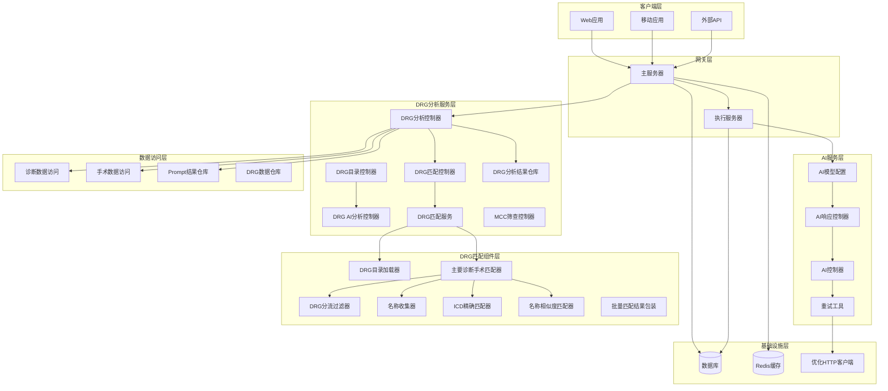
```mermaid
graph TB
subgraph "客户端层"
WebApp[Web应用]
MobileApp[移动应用]
API[外部API]
end
subgraph "网关层"
MainServer[主服务器]
ExecutionServer[执行服务器]
end
subgraph "AI服务层"
AIModelConfig[AI模型配置]
AIResponseController[AI响应控制器]
AIController[AI控制器]
RetryUtil[重试工具]
end
subgraph "DRG分析服务层"
DrgAnalysisController[DRG分析控制器]
DrgMatchingController[DRG匹配控制器]
DrgCatalogController[DRG目录控制器]
DrgAiAnalysisController[DRG AI分析控制器]
DrgMatchingService[DRG匹配服务]
DrgAnalysisResultRepository[DRG分析结果仓库]
MccScreeningController[MCC筛查控制器]
end
subgraph "DRG匹配组件层"
DrgCatalogLoader[DRG目录加载器]
PrimaryDiagnosisProcedureMatcher[主要诊断手术匹配器]
DrgFilter[DRG分流过滤器]
NameCollector[名称收集器]
IcdMatcher[ICD精确匹配器]
NameMatcher[名称相似度匹配器]
DrgBatchMatchResult[批量匹配结果包装]
end
subgraph "数据访问层"
DiagnosisRepository[诊断数据访问]
SurgeryRepository[手术数据访问]
PromptResultRepository[Prompt结果仓库]
DrgRepository[DRG数据仓库]
end
subgraph "基础设施层"
Database[(数据库)]
Redis[(Redis缓存)]
HttpClient[优化HTTP客户端]
end
WebApp --> MainServer
MobileApp --> MainServer
API --> MainServer
MainServer --> ExecutionServer
ExecutionServer --> AIModelConfig
AIModelConfig --> AIResponseController
AIResponseController --> AIController
AIController --> RetryUtil
RetryUtil --> HttpClient
MainServer --> DrgAnalysisController
DrgAnalysisController --> DrgMatchingController
DrgMatchingController --> DrgMatchingService
DrgMatchingService --> DrgCatalogLoader
DrgMatchingService --> PrimaryDiagnosisProcedureMatcher
PrimaryDiagnosisProcedureMatcher --> DrgFilter
PrimaryDiagnosisProcedureMatcher --> NameCollector
PrimaryDiagnosisProcedureMatcher --> IcdMatcher
PrimaryDiagnosisProcedureMatcher --> NameMatcher
DrgCatalogController --> DrgAiAnalysisController
DrgAnalysisController --> DrgAnalysisResultRepository
DrgAnalysisController --> DiagnosisRepository
DrgAnalysisController --> SurgeryRepository
DrgAnalysisController --> PromptResultRepository
MainServer --> Database
MainServer --> Redis
ExecutionServer --> Database
```

**图表来源**
- [MedAiAssistantBackendApplication.java:26-37](file://med_ai_assistant_1.0_bs_backend/src/main/java/com/example/medaiassistant/MedAiAssistantBackendApplication.java#L26-L37)
- [AIResponseController.java:75-87](file://med_ai_assistant_1.0_bs_backend/src/main/java/com/example/medaiassistant/controller/AIResponseController.java#L75-L87)
- [DrgAnalysisController.java:1-50](file://med_ai_assistant_1.0_bs_backend/src/main/java/com/example/medaiassistant/controller/DrgAnalysisController.java#L1-L50)

### 核心架构组件

1. **主服务器**：处理用户请求、API网关、任务调度
2. **执行服务器**：执行AI模型调用、数据处理等耗时任务
3. **AI服务层**：提供智能的AI响应处理能力
4. **DRG分析服务层**：专门处理DRG分析相关的业务逻辑
5. **DRG匹配服务层**：提供基于主要诊断和主要手术的DRG目录匹配功能
6. **配置管理层**：统一管理AI模型配置和系统参数

**章节来源**
- [README.md:42-62](file://med_ai_assistant_1.0_bs_backend/deploy/README.md#L42-L62)

## 核心组件分析

### 应用程序入口

系统的核心入口点是`MedAiAssistantBackendApplication`类，它配置了Spring Boot应用程序的基础设置。

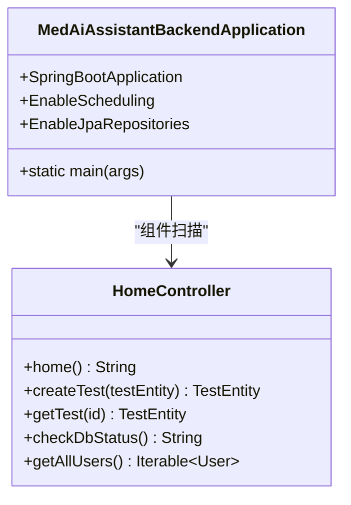
```mermaid
classDiagram
class MedAiAssistantBackendApplication {
+static main(args)
+SpringBootApplication
+EnableScheduling
+EnableJpaRepositories
}
class HomeController {
+home() String
+createTest(testEntity) TestEntity
+getTest(id) TestEntity
+checkDbStatus() String
+getAllUsers() Iterable~User~
}
MedAiAssistantBackendApplication --> HomeController : "组件扫描"
```

**图表来源**
- [MedAiAssistantBackendApplication.java:26-47](file://med_ai_assistant_1.0_bs_backend/src/main/java/com/example/medaiassistant/MedAiAssistantBackendApplication.java#L26-L47)
- [HomeController.java:9-50](file://med_ai_assistant_1.0_bs_backend/src/main/java/com/example/medaiassistant/HomeController.java#L9-L50)

### API路由配置

系统采用WebFlux框架实现响应式API路由，特别针对AI服务进行了优化配置。

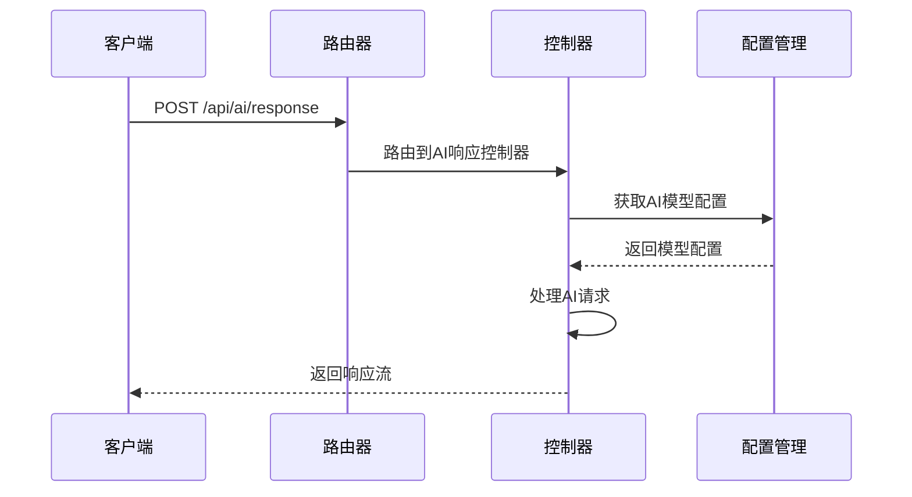
```mermaid
sequenceDiagram
participant Client as 客户端
participant Router as 路由器
participant Controller as 控制器
participant Config as 配置管理
Client->>Router : POST /api/ai/response
Router->>Controller : 路由到AI响应控制器
Controller->>Config : 获取AI模型配置
Config-->>Controller : 返回模型配置
Controller->>Controller : 处理AI请求
Controller-->>Client : 返回响应流
```

**图表来源**
- [AIRouterConfig.java:24-34](file://med_ai_assistant_1.0_bs_backend/src/main/java/com/example/medaiassistant/config/AIRouterConfig.java#L24-L34)
- [AIResponseController.java:91-182](file://med_ai_assistant_1.0_bs_backend/src/main/java/com/example/medaiassistant/controller/AIResponseController.java#L91-L182)

**章节来源**
- [MedAiAssistantBackendApplication.java:26-47](file://med_ai_assistant_1.0_bs_backend/src/main/java/com/example/medaiassistant/MedAiAssistantBackendApplication.java#L26-L47)
- [HomeController.java:9-50](file://med_ai_assistant_1.0_bs_backend/src/main/java/com/example/medaiassistant/HomeController.java#L9-L50)

## AI模型配置系统

### 配置架构设计

AI模型配置系统采用灵活的配置管理模式，支持多模型并存和动态配置更新。

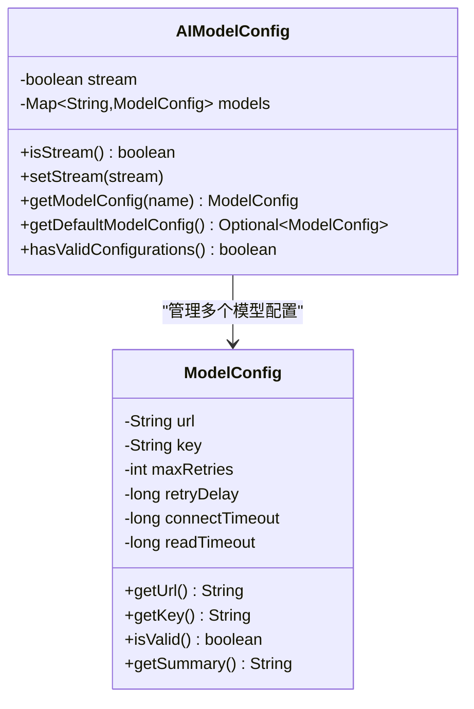
```mermaid
classDiagram
class AIModelConfig {
-boolean stream
-Map~String,ModelConfig~ models
+isStream() boolean
+setStream(stream)
+getModelConfig(name) ModelConfig
+getDefaultModelConfig() Optional~ModelConfig~
+hasValidConfigurations() boolean
}
class ModelConfig {
-String url
-String key
-int maxRetries
-long retryDelay
-long connectTimeout
-long readTimeout
+getUrl() String
+getKey() String
+isValid() boolean
+getSummary() String
}
AIModelConfig --> ModelConfig : "管理多个模型配置"
```

**图表来源**
- [AIModelConfig.java:31-264](file://med_ai_assistant_1.0_bs_backend/src/main/java/com/example/medaiassistant/config/AIModelConfig.java#L31-L264)

### 配置验证机制

系统实现了多层次的配置验证机制，确保AI模型配置的有效性和安全性。

```mermaid
flowchart TD
Start([配置加载开始]) --> LoadConfig["加载配置文件"]
LoadConfig --> ValidateModels["验证模型配置"]
ValidateModels --> CheckURL{"URL格式验证"}
CheckURL --> |通过| CheckKey{"API密钥验证"}
CheckURL --> |失败| LogWarning["记录警告日志"]
CheckKey --> |通过| CheckTimeouts{"超时参数验证"}
CheckKey --> |失败| LogWarning
CheckTimeouts --> |通过| LogSuccess["记录成功配置"]
CheckTimeouts --> |失败| LogWarning
LogWarning --> End([配置加载完成])
LogSuccess --> End
```

**图表来源**
- [AIModelConfig.java:294-310](file://med_ai_assistant_1.0_bs_backend/src/main/java/com/example/medaiassistant/config/AIModelConfig.java#L294-L310)

**章节来源**
- [AIModelConfig.java:12-399](file://med_ai_assistant_1.0_bs_backend/src/main/java/com/example/medaiassistant/config/AIModelConfig.java#L12-L399)

## 响应式AI服务

### 流式响应处理

系统采用响应式编程模式处理AI服务的流式响应，支持实时的数据传输和处理。

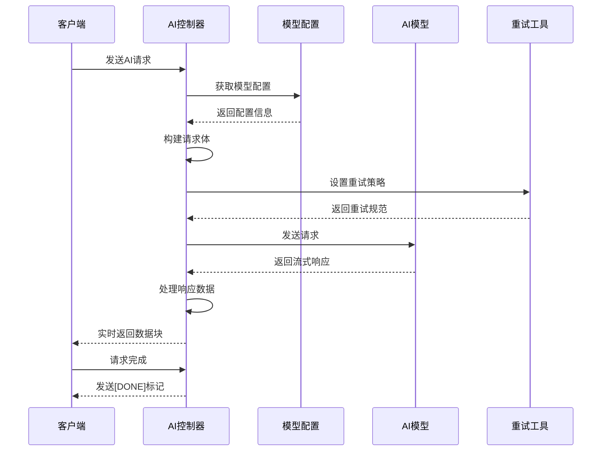
```mermaid
sequenceDiagram
participant Client as 客户端
participant Controller as AI控制器
participant ModelConfig as 模型配置
participant AIModel as AI模型
participant RetryUtil as 重试工具
Client->>Controller : 发送AI请求
Controller->>ModelConfig : 获取模型配置
ModelConfig-->>Controller : 返回配置信息
Controller->>Controller : 构建请求体
Controller->>RetryUtil : 设置重试策略
RetryUtil-->>Controller : 返回重试规范
Controller->>AIModel : 发送请求
AIModel-->>Controller : 返回流式响应
Controller->>Controller : 处理响应数据
Controller-->>Client : 实时返回数据块
Client->>Controller : 请求完成
Controller-->>Client : 发送[DONE]标记
```

**图表来源**
- [AIResponseController.java:292-402](file://med_ai_assistant_1.0_bs_backend/src/main/java/com/example/medaiassistant/controller/AIResponseController.java#L292-L402)

### 非流式响应处理

对于非流式的AI响应，系统提供完整的JSON响应处理机制。

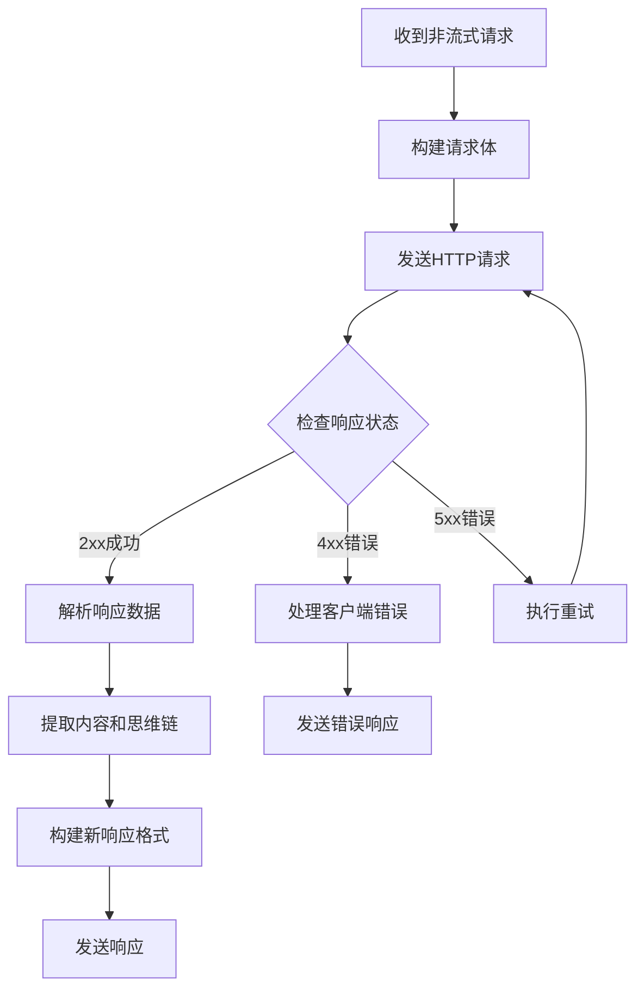
```mermaid
flowchart TD
Request[收到非流式请求] --> BuildRequest[构建请求体]
BuildRequest --> SendRequest[发送HTTP请求]
SendRequest --> CheckResponse{检查响应状态}
CheckResponse --> |2xx成功| ParseResponse[解析响应数据]
CheckResponse --> |4xx错误| HandleClientError[处理客户端错误]
CheckResponse --> |5xx错误| RetryRequest[执行重试]
ParseResponse --> ExtractContent[提取内容和思维链]
ExtractContent --> BuildNewResponse[构建新响应格式]
BuildNewResponse --> SendResponse[发送响应]
HandleClientError --> SendErrorResponse[发送错误响应]
RetryRequest --> SendRequest
```

**图表来源**
- [AIResponseController.java:455-526](file://med_ai_assistant_1.0_bs_backend/src/main/java/com/example/medaiassistant/controller/AIResponseController.java#L455-L526)

**章节来源**
- [AIResponseController.java:30-528](file://med_ai_assistant_1.0_bs_backend/src/main/java/com/example/medaiassistant/controller/AIResponseController.java#L30-L528)

## 重试机制设计

### 智能重试策略

系统实现了基于指数退避和随机抖动的智能重试机制，有效应对网络波动和临时故障。

```mermaid
flowchart TD
Start([开始请求]) --> FirstAttempt[第一次尝试]
FirstAttempt --> CheckResult{检查结果}
CheckResult --> |成功| Success[处理成功]
CheckResult --> |失败| CheckException{检查异常类型}
CheckException --> |可重试异常| CheckRetryCount{检查重试次数}
CheckException --> |不可重试异常| Fail[处理失败]
CheckRetryCount --> |未达到最大次数| ApplyBackoff[应用指数退避]
CheckRetryCount --> |达到最大次数| Fail
ApplyBackoff --> Wait[等待退避时间]
Wait --> RetryAttempt[重试尝试]
RetryAttempt --> CheckResult
Success --> End([结束])
Fail --> End
```

**图表来源**
- [RetryUtil.java:49-64](file://med_ai_assistant_1.0_bs_backend/src/main/java/com/example/medaiassistant/util/RetryUtil.java#L49-L64)

### 异常分类处理

系统对不同类型的异常进行智能识别和处理，确保重试的有效性和效率。

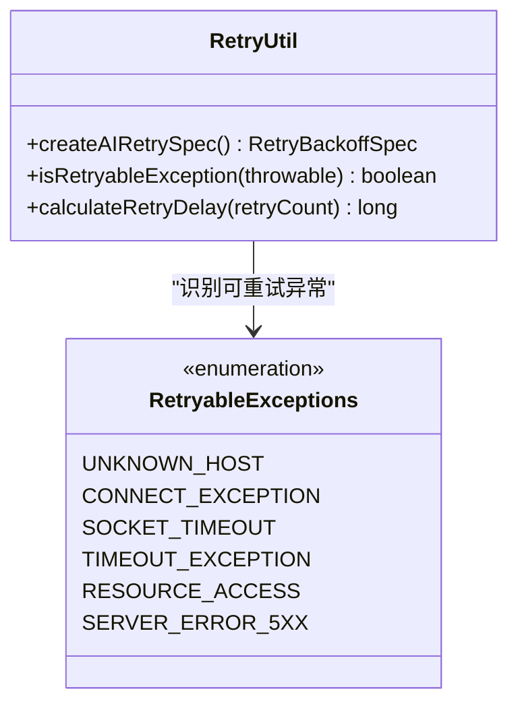
```mermaid
classDiagram
class RetryUtil {
+createAIRetrySpec() RetryBackoffSpec
+isRetryableException(throwable) boolean
+calculateRetryDelay(retryCount) long
}
class RetryableExceptions {
<<enumeration>>
UNKNOWN_HOST
CONNECT_EXCEPTION
SOCKET_TIMEOUT
TIMEOUT_EXCEPTION
RESOURCE_ACCESS
SERVER_ERROR_5XX
}
RetryUtil --> RetryableExceptions : "识别可重试异常"
```

**图表来源**
- [RetryUtil.java:80-118](file://med_ai_assistant_1.0_bs_backend/src/main/java/com/example/medaiassistant/util/RetryUtil.java#L80-L118)

**章节来源**
- [RetryUtil.java:17-204](file://med_ai_assistant_1.0_bs_backend/src/main/java/com/example/medaiassistant/util/RetryUtil.java#L17-L204)

## DRG分析页面重构

### 页面架构变更

根据更新小结的要求，DRG分析页面进行了重大重构：

- **删除所有标签页**：移除了原有的多标签页导航结构
- **仅保留"开始分析"按钮**：简化用户操作流程，提供直接的分析入口
- **新增患者医疗信息卡片**：整合诊断和手术信息的可视化展示
- **新增合并症历史结果卡片**：提供历史分析结果的集中展示和跟踪功能
- **新增DRG费用卡片**：基于DRG目录匹配功能，显示匹配的DRG记录和费用信息
- **版本0.7.005新增**：DRG分析按钮添加确认对话框，新增AI分析结果卡片，AI辅助页面过滤DRG专用Prompt记录
- **版本0.7.004新增**：DRG分析页面新增"主要诊断及操作分析"按钮，一键生成DRG分析Prompt并提交AI分析

### 页面布局设计

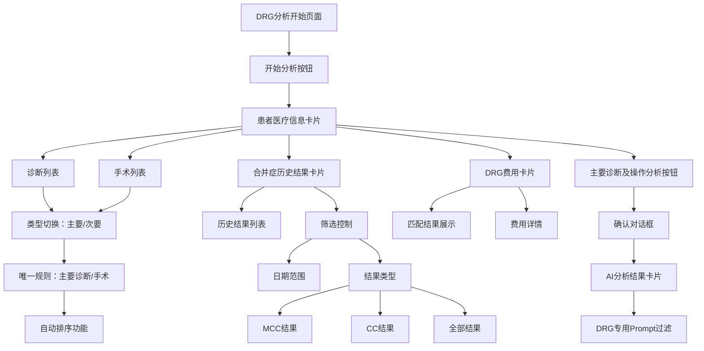
```mermaid
flowchart TD
StartPage[DRG分析开始页面] --> StartButton["开始分析按钮"]
StartButton --> PatientCard[患者医疗信息卡片]
PatientCard --> DiagnosisList[诊断列表]
PatientCard --> SurgeryList[手术列表]
DiagnosisList --> TypeSwitch[类型切换：主要/次要]
SurgeryList --> TypeSwitch
TypeSwitch --> UniqueRule[唯一规则：主要诊断/手术]
UniqueRule --> AutoSort[自动排序功能]
PatientCard --> HistoryCard[合并症历史结果卡片]
HistoryCard --> ResultList[历史结果列表]
HistoryCard --> FilterControls[筛选控制]
FilterControls --> DateRange[日期范围]
FilterControls --> ResultType[结果类型]
ResultType --> MCCResults[MCC结果]
ResultType --> CCResults[CC结果]
ResultType --> AllResults[全部结果]
PatientCard --> DrgFeeCard[DRG费用卡片]
DrgFeeCard --> MatchResults[匹配结果展示]
DrgFeeCard --> FeeDetails[费用详情]
PatientCard --> AnalysisButton["主要诊断及操作分析按钮"]
AnalysisButton --> ConfirmationDialog[确认对话框]
ConfirmationDialog --> AiAnalysisCard[AI分析结果卡片]
AiAnalysisCard --> PromptFilter[DRG专用Prompt过滤]
```

**图表来源**
- [Update Log.md:2-8](file://更新小结.md#L2-L8)

**章节来源**
- [Update Log.md:1-216](file://更新小结.md#L1-L216)

## DRG目录匹配服务

### 服务架构设计

DRG目录匹配服务是本次更新的核心功能，提供基于主要诊断和主要手术的精确匹配能力。

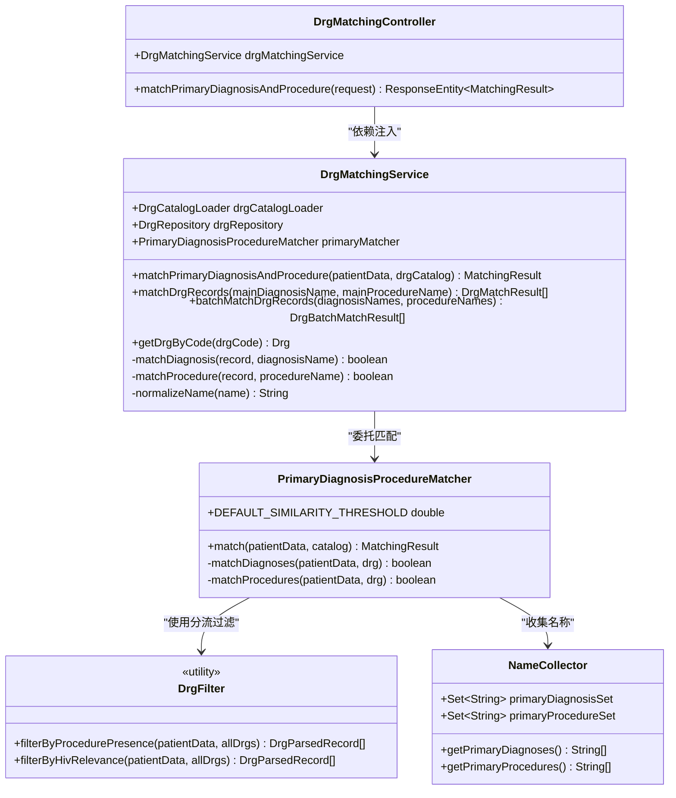
```mermaid
classDiagram
class DrgMatchingService {
+DrgCatalogLoader drgCatalogLoader
+DrgRepository drgRepository
+PrimaryDiagnosisProcedureMatcher primaryMatcher
+matchPrimaryDiagnosisAndProcedure(patientData, drgCatalog) MatchingResult
+matchDrgRecords(mainDiagnosisName, mainProcedureName) DrgMatchResult[]
+batchMatchDrgRecords(diagnosisNames, procedureNames) DrgBatchMatchResult[]
+getDrgByCode(drgCode) Drg
-matchDiagnosis(record, diagnosisName) boolean
-matchProcedure(record, procedureName) boolean
-normalizeName(name) String
}
class DrgMatchingController {
+DrgMatchingService drgMatchingService
+matchPrimaryDiagnosisAndProcedure(request) ResponseEntity~MatchingResult~
}
class PrimaryDiagnosisProcedureMatcher {
+DEFAULT_SIMILARITY_THRESHOLD double
+match(patientData, catalog) MatchingResult
-matchDiagnoses(patientData, drg) boolean
-matchProcedures(patientData, drg) boolean
}
class DrgFilter {
<<utility>>
+filterByProcedurePresence(patientData, allDrgs) DrgParsedRecord[]
+filterByHivRelevance(patientData, allDrgs) DrgParsedRecord[]
}
class NameCollector {
+Set~String~ primaryDiagnosisSet
+Set~String~ primaryProcedureSet
+getPrimaryDiagnoses() String[]
+getPrimaryProcedures() String[]
}
DrgMatchingController --> DrgMatchingService : "依赖注入"
DrgMatchingService --> PrimaryDiagnosisProcedureMatcher : "委托匹配"
PrimaryDiagnosisProcedureMatcher --> DrgFilter : "使用分流过滤"
PrimaryDiagnosisProcedureMatcher --> NameCollector : "收集名称"
```

**图表来源**
- [DrgMatchingService.java:28-190](file://med_ai_assistant_1.0_bs_backend/src/main/java/com/example/medaiassistant/service/DrgMatchingService.java#L28-L190)
- [DrgMatchingController.java:24-83](file://med_ai_assistant_1.0_bs_backend/src/main/java/com/example/medaiassistant/controller/DrgMatchingController.java#L24-L83)
- [PrimaryDiagnosisProcedureMatcher.java:29-143](file://med_ai_assistant_1.0_bs_backend/src/main/java/com/example/medaiassistant/drg/matching/PrimaryDiagnosisProcedureMatcher.java#L29-L143)

### 匹配流程设计

DRG目录匹配服务实现了完整的匹配流程，包括分流过滤、精确匹配和结果收集。

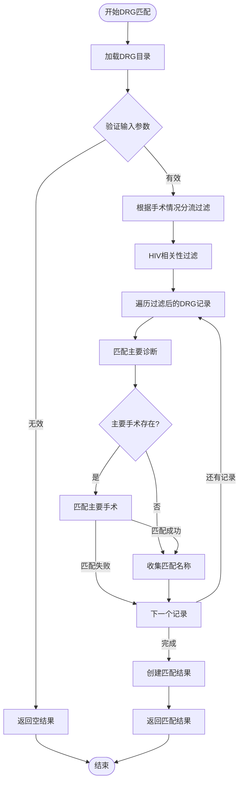
```mermaid
flowchart TD
Start([开始DRG匹配]) --> LoadCatalog[加载DRG目录]
LoadCatalog --> ValidateInput{验证输入参数}
ValidateInput --> |有效| FilterByProcedure[根据手术情况分流过滤]
ValidateInput --> |无效| ReturnEmpty[返回空结果]
FilterByProcedure --> FilterByHiv[HIV相关性过滤]
FilterByHiv --> IterateRecords[遍历过滤后的DRG记录]
IterateRecords --> MatchDiagnosis[匹配主要诊断]
MatchDiagnosis --> MatchProcedure{主要手术存在?}
MatchProcedure --> |是| CheckProcedure[匹配主要手术]
MatchProcedure --> |否| CollectNames[收集匹配名称]
CheckProcedure --> |匹配成功| CollectNames
CheckProcedure --> |匹配失败| NextRecord[下一个记录]
CollectNames --> NextRecord
NextRecord --> |还有记录| IterateRecords
NextRecord --> |完成| CreateResult[创建匹配结果]
CreateResult --> ReturnResult[返回匹配结果]
ReturnEmpty --> End([结束])
ReturnResult --> End
```

**图表来源**
- [PrimaryDiagnosisProcedureMatcher.java:40-72](file://med_ai_assistant_1.0_bs_backend/src/main/java/com/example/medaiassistant/drg/matching/PrimaryDiagnosisProcedureMatcher.java#L40-L72)

### 匹配规则实现

系统实现了严格的DRG匹配规则，确保匹配结果的准确性和一致性。

1. **分流过滤规则**：
   - 患者有手术：只匹配包含主要手术的DRG记录
   - 患者无手术：只匹配不包含主要手术的DRG记录

2. **诊断匹配规则**：
   - 支持ICD编码精确匹配
   - 支持诊断名称相似度匹配（阈值0.7）
   - 支持诊断别名匹配

3. **手术匹配规则**：
   - 支持手术编码精确匹配
   - 支持手术名称相似度匹配（阈值0.7）

4. **名称标准化处理**：
   - 转换为小写
   - 移除空白字符
   - 移除标点符号
   - 统一字符串格式

**更新** 实现"诊断为主、手术为辅"差异化评分策略，新增DEBUG日志记录匹配过程

**章节来源**
- [DrgMatchingService.java:50-190](file://med_ai_assistant_1.0_bs_backend/src/main/java/com/example/medaiassistant/service/DrgMatchingService.java#L50-L190)
- [PrimaryDiagnosisProcedureMatcher.java:34-141](file://med_ai_assistant_1.0_bs_backend/src/main/java/com/example/medaiassistant/drg/matching/PrimaryDiagnosisProcedureMatcher.java#L34-L141)
- [DrgFilter.java:34-48](file://med_ai_assistant_1.0_bs_backend/src/main/java/com/example/medaiassistant/drg/matching/DrgFilter.java#L34-L48)

## 患者医疗信息卡片

### 卡片架构设计

患者医疗信息卡片作为DRG分析页面的核心组件，提供集中式的患者医疗信息展示。

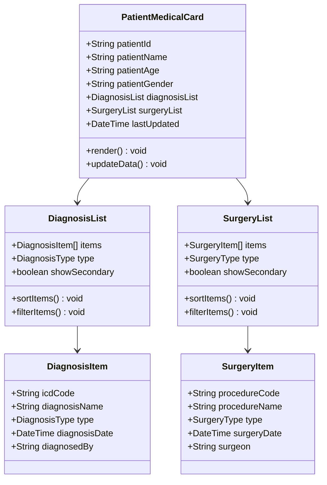
```mermaid
classDiagram
class PatientMedicalCard {
+String patientId
+String patientName
+String patientAge
+String patientGender
+DiagnosisList diagnosisList
+SurgeryList surgeryList
+DateTime lastUpdated
+render() void
+updateData() void
}
class DiagnosisList {
+DiagnosisItem[] items
+DiagnosisType type
+boolean showSecondary
+sortItems() void
+filterItems() void
}
class SurgeryList {
+SurgeryItem[] items
+SurgeryType type
+boolean showSecondary
+sortItems() void
+filterItems() void
}
class DiagnosisItem {
+String icdCode
+String diagnosisName
+DiagnosisType type
+DateTime diagnosisDate
+String diagnosedBy
}
class SurgeryItem {
+String procedureCode
+String procedureName
+SurgeryType type
+DateTime surgeryDate
+String surgeon
}
PatientMedicalCard --> DiagnosisList
PatientMedicalCard --> SurgeryList
DiagnosisList --> DiagnosisItem
SurgeryList --> SurgeryItem
```

**图表来源**
- [DiagnosisController.java:87-108](file://med_ai_assistant_1.0_bs_backend/src/main/java/com/example/medaiassistant/controller/DiagnosisController.java#L87-L108)
- [SurgeryController.java:32-35](file://med_ai_assistant_1.0_bs_backend/src/main/java/com/example/medaiassistant/controller/SurgeryController.java#L32-L35)

### 卡片功能特性

1. **实时数据更新**：从后端API获取最新的诊断和手术数据
2. **双列表展示**：同时显示诊断列表和手术列表
3. **类型切换**：支持主要诊断/次要诊断和主要手术/次要手术的切换显示
4. **唯一性规则**：确保主要诊断和主要手术的唯一性
5. **自动排序**：按照时间或其他逻辑进行自动排序
6. **DRG费用集成**：与DRG目录匹配功能集成，提供费用相关信息
7. **版本0.7.005新增**：AI分析结果卡片集成，支持DRG专用Prompt过滤

**章节来源**
- [DiagnosisController.java:1-110](file://med_ai_assistant_1.0_bs_backend/src/main/java/com/example/medaiassistant/controller/DiagnosisController.java#L1-L110)
- [SurgeryController.java:1-223](file://med_ai_assistant_1.0_bs_backend/src/main/java/com/example/medaiassistant/controller/SurgeryController.java#L1-L223)

## 诊断列表管理

### 诊断列表架构

诊断列表作为患者医疗信息卡片的重要组成部分，提供诊断信息的集中管理。

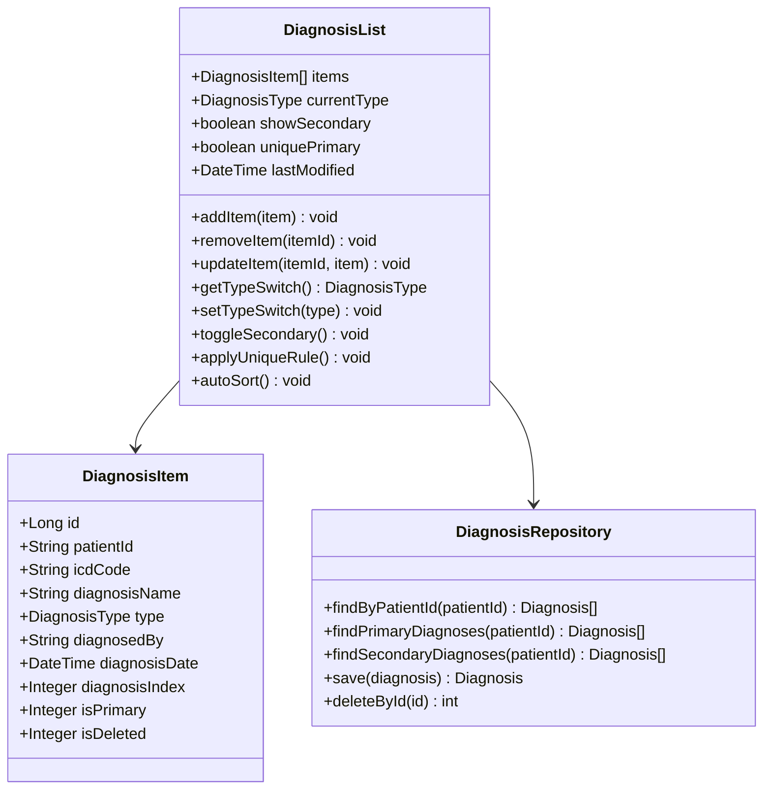
```mermaid
classDiagram
class DiagnosisList {
+DiagnosisItem[] items
+DiagnosisType currentType
+boolean showSecondary
+boolean uniquePrimary
+DateTime lastModified
+addItem(item) void
+removeItem(itemId) void
+updateItem(itemId, item) void
+getTypeSwitch() DiagnosisType
+setTypeSwitch(type) void
+toggleSecondary() void
+applyUniqueRule() void
+autoSort() void
}
class DiagnosisItem {
+Long id
+String patientId
+String icdCode
+String diagnosisName
+DiagnosisType type
+String diagnosedBy
+DateTime diagnosisDate
+Integer diagnosisIndex
+Integer isPrimary
+Integer isDeleted
}
class DiagnosisRepository {
+findByPatientId(patientId) Diagnosis[]
+findPrimaryDiagnoses(patientId) Diagnosis[]
+findSecondaryDiagnoses(patientId) Diagnosis[]
+save(diagnosis) Diagnosis
+deleteById(id) int
}
DiagnosisList --> DiagnosisItem
DiagnosisList --> DiagnosisRepository
```

**图表来源**
- [DiagnosisController.java:87-108](file://med_ai_assistant_1.0_bs_backend/src/main/java/com/example/medaiassistant/controller/DiagnosisController.java#L87-L108)
- [DiagnosisRepository.java:1-50](file://med_ai_assistant_1.0_bs_backend/src/main/java/com/example/medaiassistant/repository/DiagnosisRepository.java#L1-L50)

### 诊断类型管理

系统支持诊断类型的灵活切换和管理：

1. **主要诊断规则**：
   - 唯一主要诊断原则
   - 自动排序机制
   - 类型验证和冲突检测

2. **次要诊断规则**：
   - 支持多个次要诊断
   - 自动排序和去重
   - 类型切换功能

3. **数据验证**：
   - ICD编码验证
   - 诊断名称完整性检查
   - 时间戳一致性验证

**章节来源**
- [DiagnosisController.java:22-85](file://med_ai_assistant_1.0_bs_backend/src/main/java/com/example/medaiassistant/controller/DiagnosisController.java#L22-L85)
- [DiagnosisRepository.java:1-100](file://med_ai_assistant_1.0_bs_backend/src/main/java/com/example/medaiassistant/repository/DiagnosisRepository.java#L1-L100)

## 手术列表管理

### 手术列表架构

手术列表提供患者手术信息的完整管理功能，支持复杂的手术数据处理。

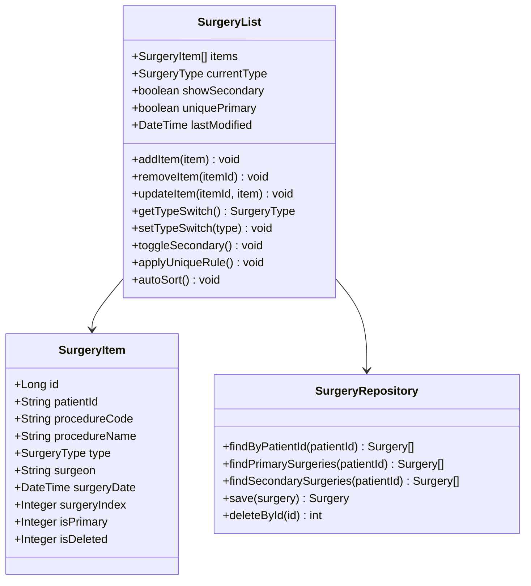
```mermaid
classDiagram
class SurgeryList {
+SurgeryItem[] items
+SurgeryType currentType
+boolean showSecondary
+boolean uniquePrimary
+DateTime lastModified
+addItem(item) void
+removeItem(itemId) void
+updateItem(itemId, item) void
+getTypeSwitch() SurgeryType
+setTypeSwitch(type) void
+toggleSecondary() void
+applyUniqueRule() void
+autoSort() void
}
class SurgeryItem {
+Long id
+String patientId
+String procedureCode
+String procedureName
+SurgeryType type
+String surgeon
+DateTime surgeryDate
+Integer surgeryIndex
+Integer isPrimary
+Integer isDeleted
}
class SurgeryRepository {
+findByPatientId(patientId) Surgery[]
+findPrimarySurgeries(patientId) Surgery[]
+findSecondarySurgeries(patientId) Surgery[]
+save(surgery) Surgery
+deleteById(id) int
}
SurgeryList --> SurgeryItem
SurgeryList --> SurgeryRepository
```

**图表来源**
- [SurgeryController.java:32-35](file://med_ai_assistant_1.0_bs_backend/src/main/java/com/example/medaiassistant/controller/SurgeryController.java#L32-L35)
- [SurgeryRepository.java:1-50](file://med_ai_assistant_1.0_bs_backend/src/main/java/com/example/medaiassistant/repository/SurgeryRepository.java#L1-L50)

### 手术类型管理

系统对手术类型提供精细的管理控制：

1. **主要手术规则**：
   - 唯一主要手术原则
   - 自动排序和时间优先
   - 类型冲突自动检测

2. **次要手术规则**：
   - 支持多个次要手术
   - 按时间顺序自动排序
   - 类型切换和过滤功能

3. **数据完整性**：
   - 手术编码验证
   - 医生信息完整性检查
   - 手术日期合理性验证

**章节来源**
- [SurgeryController.java:74-144](file://med_ai_assistant_1.0_bs_backend/src/main/java/com/example/medaiassistant/controller/SurgeryController.java#L74-L144)
- [SurgeryRepository.java:1-100](file://med_ai_assistant_1.0_bs_backend/src/main/java/com/example/medaiassistant/repository/SurgeryRepository.java#L1-L100)

## 合并症历史结果卡片

### 历史结果卡片架构

合并症历史结果卡片作为DRG分析页面的重要组成部分，提供历史分析结果的集中展示和跟踪功能。

```mermaid
classDiagram
class HistoryResultCard {
+String patientId
+HistoricalResult[] historicalResults
+DateRange dateRange
+ResultType resultType
+render() void
+loadHistory() void
+filterResults() void
+displayResult(result) void
}
class HistoricalResult {
+Long resultId
+String promptName
+String originalResultContent
+LocalDateTime executionTime
+LocalDateTime createdAt
+String status
+Integer isRead
}
class PromptResultRepository {
+findLatestByPatientIdAndPromptName(patientId, promptName) PromptResult[]
+findByPatientIdOrderByExecutionTimeDesc(patientId) PromptResult[]
+findByPatientIdAndPromptName(patientId, promptName) PromptResult[]
}
class DrgAnalysisResultRepository {
+findByPatientIdOrderByCreatedTimeDesc(patientId) DrgAnalysisResult[]
+findLatestByPatientId(patientId) Optional~DrgAnalysisResult~
+findByPatientIdAndUserSelectedMccType(patientId, mccType) DrgAnalysisResult[]
}
HistoryResultCard --> HistoricalResult
HistoryResultCard --> PromptResultRepository
HistoryResultCard --> DrgAnalysisResultRepository
```

**图表来源**
- [AIController.java:272-288](file://med_ai_assistant_1.0_bs_backend/src/main/java/com/example/medaiassistant/controller/AIController.java#L272-L288)
- [DrgAnalysisResultRepository.java:53-63](file://med_ai_assistant_1.0_bs_backend/src/main/java/com/example/medaiassistant/repository/DrgAnalysisResultRepository.java#L53-L63)

### 历史结果功能特性

1. **历史结果展示**：
   - 展示患者所有合并症或并发症分析的历史结果
   - 支持按时间倒序排列
   - 显示每次分析的执行时间和状态

2. **结果筛选功能**：
   - 支持按日期范围筛选历史结果
   - 支持按结果类型（MCC/CC/全部）筛选
   - 支持按状态筛选（已完成/进行中）

3. **结果详情查看**：
   - 点击历史结果可查看详细分析内容
   - 支持Markdown渲染AI分析结果
   - 自动过滤thinking标签，优化显示效果

4. **结果管理功能**：
   - 支持标记结果为已读
   - 支持软删除历史结果
   - 支持重新执行分析

**章节来源**
- [AIController.java:272-400](file://med_ai_assistant_1.0_bs_backend/src/main/java/com/example/medaiassistant/controller/AIController.java#L272-L400)
- [PromptResult.java:1-145](file://med_ai_assistant_1.0_bs_backend/src/main/java/com/example/medaiassistant/model/PromptResult.java#L1-L145)

## DRG批量组合匹配功能

### 批量匹配架构设计

DRG批量组合匹配功能是版本0.7.003新增的核心功能，支持遍历所有诊断×手术组合进行DRG分组计算。

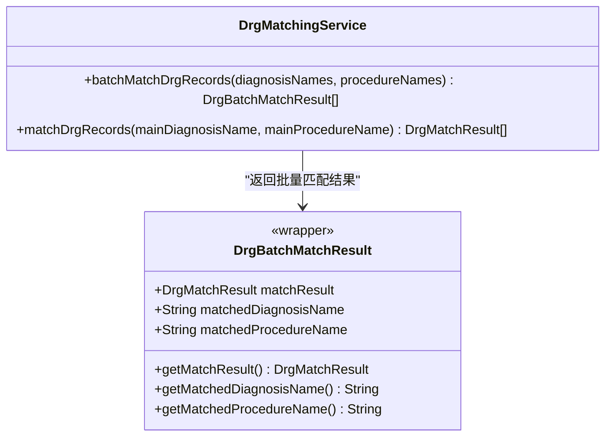
```mermaid
classDiagram
class DrgBatchMatchResult {
+DrgMatchResult matchResult
+String matchedDiagnosisName
+String matchedProcedureName
+getMatchResult() DrgMatchResult
+getMatchedDiagnosisName() String
+getMatchedProcedureName() String
}
class DrgMatchingService {
+batchMatchDrgRecords(diagnosisNames, procedureNames) DrgBatchMatchResult[]
+matchDrgRecords(mainDiagnosisName, mainProcedureName) DrgMatchResult[]
}
class DrgBatchMatchResult {
<<wrapper>>
}
DrgMatchingService --> DrgBatchMatchResult : "返回批量匹配结果"
```

**图表来源**
- [DrgMatchingService.java:501-542](file://med_ai_assistant_1.0_bs_backend/src/main/java/com/example/medaiassistant/service/DrgMatchingService.java#L501-L542)
- [DrgBatchMatchResult.java:8-22](file://med_ai_assistant_1.0_bs_backend/src/main/java/com/example/medaiassistant/drg/catalog/DrgBatchMatchResult.java#L8-L22)

### 批量匹配流程

系统实现了完整的批量匹配流程，支持诊断和手术的笛卡尔积组合遍历。

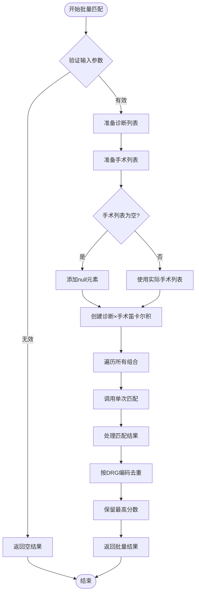
```mermaid
flowchart TD
Start([开始批量匹配]) --> ValidateInputs{验证输入参数}
ValidateInputs --> |有效| PrepareDiagnoses[准备诊断列表]
ValidateInputs --> |无效| ReturnEmpty[返回空结果]
PrepareDiagnoses --> PrepareProcedures[准备手术列表]
PrepareProcedures --> CheckEmptyProcedures{手术列表为空?}
CheckEmptyProcedures --> |是| AddNullProcedure[添加null元素]
CheckEmptyProcedures --> |否| UseActualProcedures[使用实际手术列表]
AddNullProcedure --> CreateCartesian[创建诊断×手术笛卡尔积]
UseActualProcedures --> CreateCartesian
CreateCartesian --> IterateCombinations[遍历所有组合]
IterateCombinations --> CallSingleMatch[调用单次匹配]
CallSingleMatch --> ProcessResult[处理匹配结果]
ProcessResult --> GroupByDrgCode[按DRG编码去重]
GroupByDrgCode --> KeepBestScore[保留最高分数]
KeepBestScore --> ReturnResults[返回批量结果]
ReturnEmpty --> End([结束])
ReturnResults --> End
```

**图表来源**
- [DrgMatchingService.java:511-542](file://med_ai_assistant_1.0_bs_backend/src/main/java/com/example/medaiassistant/service/DrgMatchingService.java#L511-L542)

### 批量匹配特性

1. **组合遍历**：遍历诊断列表和手术列表的所有可能组合
2. **去重机制**：按DRG编码去重，保留匹配分数最高的组合
3. **权重计算**：为每个组合计算匹配分数，支持按权重降序展示
4. **性能优化**：使用LinkedHashMap保持插入顺序，提高去重效率
5. **结果包装**：提供DrgBatchMatchResult包装类，包含原始匹配结果和匹配的诊断/手术名称

**章节来源**
- [DrgMatchingService.java:501-542](file://med_ai_assistant_1.0_bs_backend/src/main/java/com/example/medaiassistant/service/DrgMatchingService.java#L501-L542)
- [DrgBatchMatchResult.java:1-23](file://med_ai_assistant_1.0_bs_backend/src/main/java/com/example/medaiassistant/drg/catalog/DrgBatchMatchResult.java#L1-L23)

## HIV过滤功能

### 过滤架构设计

HIV过滤功能是版本0.7.002新增的安全过滤机制，确保DRG匹配结果的临床准确性。

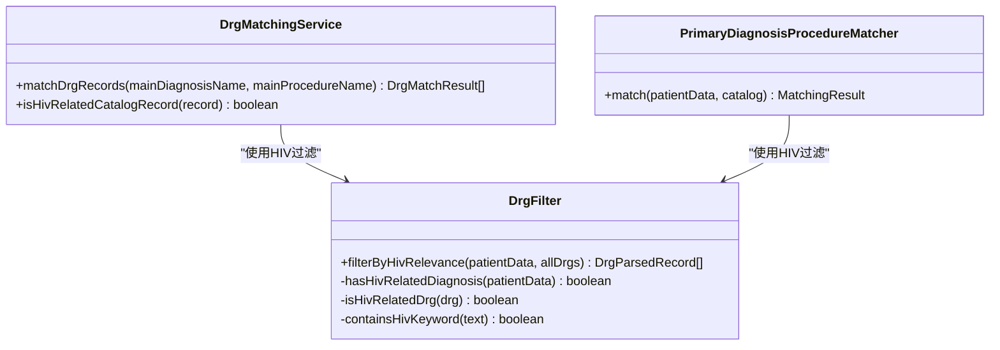
```mermaid
classDiagram
class DrgFilter {
+filterByHivRelevance(patientData, allDrgs) DrgParsedRecord[]
-hasHivRelatedDiagnosis(patientData) boolean
-isHivRelatedDrg(drg) boolean
-containsHivKeyword(text) boolean
}
class DrgMatchingService {
+matchDrgRecords(mainDiagnosisName, mainProcedureName) DrgMatchResult[]
+isHivRelatedCatalogRecord(record) boolean
}
class PrimaryDiagnosisProcedureMatcher {
+match(patientData, catalog) MatchingResult
}
DrgMatchingService --> DrgFilter : "使用HIV过滤"
PrimaryDiagnosisProcedureMatcher --> DrgFilter : "使用HIV过滤"
```

**图表来源**
- [DrgFilter.java:72-107](file://med_ai_assistant_1.0_bs_backend/src/main/java/com/example/medaiassistant/drg/matching/DrgFilter.java#L72-L107)
- [DrgMatchingService.java:196-205](file://med_ai_assistant_1.0_bs_backend/src/main/java/com/example/medaiassistant/service/DrgMatchingService.java#L196-L205)

### 过滤逻辑实现

系统实现了智能的HIV相关性过滤机制，确保只有存在相关诊断的患者才能匹配到HIV相关DRG。

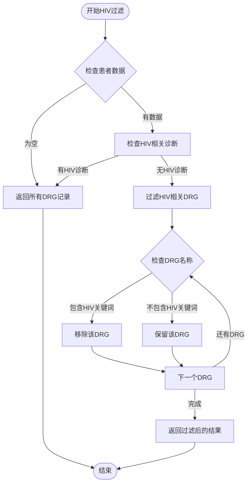
```mermaid
flowchart TD
Start([开始HIV过滤]) --> CheckPatientData{检查患者数据}
CheckPatientData --> |为空| ReturnAll[返回所有DRG记录]
CheckPatientData --> |有数据| CheckHivDiagnosis[检查HIV相关诊断]
CheckHivDiagnosis --> |有HIV诊断| ReturnAll
CheckHivDiagnosis --> |无HIV诊断| FilterHivDrgs[过滤HIV相关DRG]
FilterHivDrgs --> CheckDrgName{检查DRG名称}
CheckDrgName --> |包含HIV关键词| RemoveDrg[移除该DRG]
CheckDrgName --> |不包含HIV关键词| KeepDrg[保留该DRG]
RemoveDrg --> NextDrg[下一个DRG]
KeepDrg --> NextDrg
NextDrg --> |还有DRG| CheckDrgName
NextDrg --> |完成| ReturnFiltered[返回过滤后的结果]
ReturnAll --> End([结束])
ReturnFiltered --> End
```

**图表来源**
- [DrgFilter.java:90-107](file://med_ai_assistant_1.0_bs_backend/src/main/java/com/example/medaiassistant/drg/matching/DrgFilter.java#L90-L107)

### 过滤规则特性

1. **诊断检测**：检查患者诊断列表中是否包含HIV相关关键词
2. **DRG检测**：检查DRG名称中是否包含HIV相关关键词
3. **关键词匹配**：支持"HIV"和"获得性免疫缺陷"两种关键词
4. **大小写不敏感**：统一转换为大写进行匹配
5. **条件过滤**：只有当患者确实存在HIV相关诊断时才允许保留HIV相关DRG

**章节来源**
- [DrgFilter.java:72-165](file://med_ai_assistant_1.0_bs_backend/src/main/java/com/example/medaiassistant/drg/matching/DrgFilter.java#L72-L165)
- [DrgMatchingService.java:196-288](file://med_ai_assistant_1.0_bs_backend/src/main/java/com/example/medaiassistant/service/DrgMatchingService.java#L196-L288)

## 双向严格分流策略

### 分流策略架构设计

双向严格分流策略是版本0.7.001实现的核心匹配优化，确保DRG匹配结果严格符合患者的手术状态。

```mermaid
classDiagram
class DrgFilter {
+filterByProcedurePresence(patientData, allDrgs) DrgParsedRecord[]
}
class PrimaryDiagnosisProcedureMatcher {
+match(patientData, catalog) MatchingResult
}
class DrgMatchingService {
+matchDrgRecords(mainDiagnosisName, mainProcedureName) DrgMatchResult[]
}
class DrgParsedRecord {
+hasProcedures() boolean
+getDrgCode() String
+getDrgName() String
}
DrgMatchingService --> DrgFilter : "使用双向分流"
PrimaryDiagnosisProcedureMatcher --> DrgFilter : "使用双向分流"
DrgFilter --> DrgParsedRecord : "检查手术要求"
```

**图表来源**
- [DrgFilter.java:24-70](file://med_ai_assistant_1.0_bs_backend/src/main/java/com/example/medaiassistant/drg/matching/DrgFilter.java#L24-L70)
- [PrimaryDiagnosisProcedureMatcher.java:60-114](file://med_ai_assistant_1.0_bs_backend/src/main/java/com/example/medaiassistant/drg/matching/PrimaryDiagnosisProcedureMatcher.java#L60-L114)

### 分流逻辑实现

系统实现了严格的双向分流机制，确保匹配结果符合临床实际。

```mermaid
flowchart TD
Start([开始双向分流]) --> CheckPatientData{检查患者数据}
CheckPatientData --> |为空| ReturnEmpty[返回空列表]
CheckPatientData --> |有数据| CheckProcedurePresence[检查患者手术状态]
CheckProcedurePresence --> |患者有手术| FilterHasProcedures[过滤有手术要求的DRG]
CheckProcedurePresence --> |患者无手术| FilterNoProcedures[过滤无手术要求的DRG]
FilterHasProcedures --> CheckDrgRecord{检查DRG记录}
FilterNoProcedures --> CheckDrgRecord
CheckDrgRecord --> |有手术要求| KeepRecord[保留该DRG]
CheckDrgRecord --> |无手术要求| KeepRecord
KeepRecord --> NextRecord[下一个DRG记录]
NextRecord --> |还有记录| CheckDrgRecord
NextRecord --> |完成| ReturnFiltered[返回过滤后的结果]
ReturnEmpty --> End([结束])
ReturnFiltered --> End
```

**图表来源**
- [DrgFilter.java:52-70](file://med_ai_assistant_1.0_bs_backend/src/main/java/com/example/medaiassistant/drg/matching/DrgFilter.java#L52-L70)

### 分流规则特性

1. **严格匹配**：患者有手术时只能匹配有手术要求的DRG
2. **严格匹配**：患者无手术时只能匹配无手术要求的DRG
3. **手术要求判定**：通过`hasProcedures()`方法判断DRG是否要求手术
4. **双向保证**：避免无手术患者被匹配到需手术的DRG，也避免有手术患者匹配到无手术要求的DRG
5. **临床一致性**：确保DRG匹配结果严格符合临床手术存在性要求

**章节来源**
- [DrgFilter.java:24-70](file://med_ai_assistant_1.0_bs_backend/src/main/java/com/example/medaiassistant/drg/matching/DrgFilter.java#L24-L70)
- [PrimaryDiagnosisProcedureMatcher.java:60-114](file://med_ai_assistant_1.0_bs_backend/src/main/java/com/example/medaiassistant/drg/matching/PrimaryDiagnosisProcedureMatcher.java#L60-L114)

## 首行标识检测

### 标识检测架构设计

首行"/"标识检测是版本0.7.001新增的DRG记录解析优化，支持识别MAINPROCEDURES首行为"/"的DRG记录。

```mermaid
classDiagram
class DrgCatalogLoader {
+startsWithSlashLine(text) boolean
}
class DrgMatchingService {
+matchDrgRecords(mainDiagnosisName, mainProcedureName) DrgMatchResult[]
}
class DrgParsedRecord {
+hasProcedures() boolean
+getDrgName() String
}
DrgMatchingService --> DrgCatalogLoader : "使用首行检测"
DrgCatalogLoader --> DrgParsedRecord : "解析MAINPROCEDURES"
```

**图表来源**
- [DrgMatchingService.java:178-179](file://med_ai_assistant_1.0_bs_backend/src/main/java/com/example/medaiassistant/service/DrgMatchingService.java#L178-L179)

### 标识检测逻辑

系统实现了智能的首行标识检测机制，正确识别特殊格式的DRG记录。

```mermaid
flowchart TD
Start([开始首行检测]) --> CheckText{检查MAINPROCEDURES文本}
CheckText --> |为空| NoProcedures[标记无手术要求]
CheckText --> |有内容| CheckFirstLine[检查首行内容]
CheckFirstLine --> |首行为"/"| NoProcedures
CheckFirstLine --> |首行非"/"| HasProcedures[标记有手术要求]
CheckFirstLine --> |无换行符| CheckSlash[检查是否包含"/"]
CheckSlash --> |包含"/"| NoProcedures
CheckSlash --> |不包含"/"| HasProcedures
NoProcedures --> End([结束])
HasProcedures --> End
```

**图表来源**
- [DrgMatchingService.java:178-179](file://med_ai_assistant_1.0_bs_backend/src/main/java/com/example/medaiassistant/service/DrgMatchingService.java#L178-L179)

### 标识检测规则

1. **空内容检测**：MAINPROCEDURES为空表示无手术要求
2. **首行"/"检测**：首行为"/"表示无手术要求，后续手术仅为伴随操作
3. **斜杠检测**：无换行符但包含"/"的文本也视为无手术要求
4. **标准手术检测**：首行非"/"的文本视为有手术要求
5. **兼容性保证**：确保与现有DRG目录格式的兼容性

**章节来源**
- [DrgMatchingService.java:178-179](file://med_ai_assistant_1.0_bs_backend/src/main/java/com/example/medaiassistant/service/DrgMatchingService.java#L178-L179)

## 后端API接口

### 诊断相关API

系统提供完整的诊断数据管理API接口：

```mermaid
sequenceDiagram
participant Client as 客户端
participant DiagnosisController as 诊断控制器
participant DiagnosisRepository as 诊断仓库
participant DB as 数据库
Client->>DiagnosisController : GET /api/diagnosis/combined/{patientId}
DiagnosisController->>DiagnosisRepository : findByPatientId(patientId)
DiagnosisRepository->>DB : 查询诊断记录
DB-->>DiagnosisRepository : 返回诊断列表
DiagnosisRepository-->>DiagnosisController : 返回诊断数据
DiagnosisController->>DiagnosisController : 组合诊断文本
DiagnosisController-->>Client : 返回组合诊断字符串
```

**图表来源**
- [DiagnosisController.java:87-99](file://med_ai_assistant_1.0_bs_backend/src/main/java/com/example/medaiassistant/controller/DiagnosisController.java#L87-L99)

### 手术相关API

系统提供全面的手术数据管理API接口：

```mermaid
sequenceDiagram
participant Client as 客户端
participant SurgeryController as 手术控制器
participant SurgeryService as 手术服务
participant SurgeryRepository as 手术仓库
Client->>SurgeryController : GET /api/surgeries/by-patient/{patientId}
SurgeryController->>SurgeryService : getSurgeriesByPatientId(patientId)
SurgeryService->>SurgeryRepository : findByPatientId(patientId)
SurgeryRepository-->>SurgeryService : 返回手术列表
SurgeryService-->>SurgeryController : 返回手术数据
SurgeryController-->>Client : 返回手术列表
```

**图表来源**
- [SurgeryController.java:32-35](file://med_ai_assistant_1.0_bs_backend/src/main/java/com/example/medaiassistant/controller/SurgeryController.java#L32-L35)

### DRG分析API

系统提供完整的DRG分析相关API接口：

```mermaid
sequenceDiagram
participant Client as 客户端
participant DrgAnalysisController as DRG分析控制器
participant DrgAnalysisOrchestrator as 分析编排器
participant DrgAnalysisService as 分析服务
Client->>DrgAnalysisController : POST /api/drg/analyze
DrgAnalysisController->>DrgAnalysisOrchestrator : 执行分析编排
DrgAnalysisOrchestrator->>DrgAnalysisService : 执行DRG分析
DrgAnalysisService->>DrgAnalysisService : 匹配诊断和手术
DrgAnalysisService-->>DrgAnalysisOrchestrator : 返回分析结果
DrgAnalysisOrchestrator-->>DrgAnalysisController : 返回完整分析数据
DrgAnalysisController-->>Client : 返回DRG分析结果
```

**图表来源**
- [DrgAnalysisController.java:1-50](file://med_ai_assistant_1.0_bs_backend/src/main/java/com/example/medaiassistant/controller/DrgAnalysisController.java#L1-L50)
- [DrgAnalysisOrchestrator.java:1-50](file://med_ai_assistant_1.0_bs_backend/src/main/java/com/example/medaiassistant/drg/orchestrator/DrgAnalysisOrchestrator.java#L1-L50)

### DRG目录匹配API

系统新增了完整的DRG目录匹配API接口，支持基于主要诊断和主要手术的精确匹配。

```mermaid
sequenceDiagram
participant Client as 客户端
participant DrgMatchingController as DRG匹配控制器
participant DrgMatchingService as 匹配服务
participant DrgCatalogLoader as 目录加载器
participant DrgRepository as DRG仓库
Client->>DrgMatchingController : GET /api/drg/matching/primary
DrgMatchingController->>DrgMatchingService : matchPrimaryDiagnosisAndProcedure
DrgMatchingService->>DrgCatalogLoader : getCurrentCatalog()
DrgCatalogLoader-->>DrgMatchingService : 返回DRG目录
DrgMatchingService->>DrgMatchingService : 遍历匹配DRG记录
DrgMatchingService->>DrgRepository : getDrgByCode(drgCode)
DrgRepository-->>DrgMatchingService : 返回DRG费用信息
DrgMatchingService-->>DrgMatchingController : 返回匹配结果
DrgMatchingController-->>Client : 返回DRG匹配结果
```

**图表来源**
- [DrgMatchingController.java:39-49](file://med_ai_assistant_1.0_bs_backend/src/main/java/com/example/medaiassistant/controller/DrgMatchingController.java#L39-L49)
- [DrgMatchingService.java:66-76](file://med_ai_assistant_1.0_bs_backend/src/main/java/com/example/medaiassistant/service/DrgMatchingService.java#L66-L76)

### DRG批量匹配API

系统新增了DRG批量组合匹配API接口，支持遍历所有诊断×手术组合进行匹配。

```mermaid
sequenceDiagram
participant Client as 客户端
participant DrgMatchingService as 匹配服务
participant DrgCatalogLoader as 目录加载器
Client->>DrgMatchingService : POST /api/drg/batch-match
DrgMatchingService->>DrgCatalogLoader : getCurrentCatalog()
DrgCatalogLoader-->>DrgMatchingService : 返回DRG目录
DrgMatchingService->>DrgMatchingService : 遍历诊断×手术组合
DrgMatchingService->>DrgMatchingService : 计算匹配分数
DrgMatchingService->>DrgMatchingService : 去重并保留最佳分数
DrgMatchingService-->>Client : 返回批量匹配结果
```

**图表来源**
- [DrgMatchingService.java:511-542](file://med_ai_assistant_1.0_bs_backend/src/main/java/com/example/medaiassistant/service/DrgMatchingService.java#L511-L542)

### 历史结果API

系统提供合并症历史结果的相关API接口：

```mermaid
sequenceDiagram
participant Client as 客户端
participant AIController as AI控制器
participant PromptResultRepository as Prompt结果仓库
participant DrgAnalysisResultRepository as DRG分析结果仓库
Client->>AIController : GET /api/ai/latestPromptResult?patientId={}&promptName={}
AIController->>PromptResultRepository : findLatestByPatientIdAndPromptName
PromptResultRepository-->>AIController : 返回最新结果
AIController->>AIController : 包装AI免责声明
AIController-->>Client : 返回最新历史结果
```

**图表来源**
- [AIController.java:272-288](file://med_ai_assistant_1.0_bs_backend/src/main/java/com/example/medaiassistant/controller/AIController.java#L272-L288)

### DRG AI分析API

系统提供DRG AI分析相关的API接口，支持生成和保存DRG分析Prompt。

```mermaid
sequenceDiagram
participant Client as 客户端
participant DrgAiAnalysisController as DRG AI分析控制器
participant DrgAiAnalysisService as AI分析服务
Client->>DrgAiAnalysisController : POST /api/drg/ai-analysis/generate-and-save
DrgAiAnalysisController->>DrgAiAnalysisService : generateAnalysisPrompt
DrgAiAnalysisService-->>DrgAiAnalysisController : 返回生成的Prompt
DrgAiAnalysisController->>DrgAiAnalysisService : savePrompt
DrgAiAnalysisService-->>DrgAiAnalysisController : 返回Prompt ID
DrgAiAnalysisController-->>Client : 返回生成和保存结果
```

**图表来源**
- [DrgAiAnalysisController.java:134-175](file://med_ai_assistant_1.0_bs_backend/src/main/java/com/example/medaiassistant/controller/DrgAiAnalysisController.java#L134-L175)

**章节来源**
- [DiagnosisController.java:1-110](file://med_ai_assistant_1.0_bs_backend/src/main/java/com/example/medaiassistant/controller/DiagnosisController.java#L1-L110)
- [SurgeryController.java:1-223](file://med_ai_assistant_1.0_bs_backend/src/main/java/com/example/medaiassistant/controller/SurgeryController.java#L1-L223)
- [DrgAnalysisController.java:1-100](file://med_ai_assistant_1.0_bs_backend/src/main/java/com/example/medaiassistant/controller/DrgAnalysisController.java#L1-L100)
- [DrgMatchingController.java:1-83](file://med_ai_assistant_1.0_bs_backend/src/main/java/com/example/medaiassistant/controller/DrgMatchingController.java#L1-L83)
- [DrgAiAnalysisController.java:1-332](file://med_ai_assistant_1.0_bs_backend/src/main/java/com/example/medaiassistant/controller/DrgAiAnalysisController.java#L1-L332)
- [AIController.java:272-400](file://med_ai_assistant_1.0_bs_backend/src/main/java/com/example/medaiassistant/controller/AIController.java#L272-L400)

## 部署架构

### 分布式部署模式

系统支持灵活的分布式部署模式，满足不同规模和需求的部署场景。

```mermaid
graph TB
subgraph "主服务器集群"
MainLinux[Linux + Oracle]
MainWindows[Windows服务器]
end
subgraph "执行服务器集群"
ExecWindows[Windows执行服务器]
end
subgraph "基础设施"
Redis[(Redis缓存)]
OracleDB[(Oracle数据库)]
MySQL[(MySQL数据库)]
end
subgraph "通信协议"
HTTP[HTTP API]
PushCallback[推送+回调]
end
MainLinux --> ExecWindows
MainWindows --> ExecWindows
ExecWindows --> HTTP
HTTP --> PushCallback
MainLinux --> Redis
MainWindows --> Redis
ExecWindows --> OracleDB
ExecWindows --> MySQL
```

**图表来源**
- [README.md:15-41](file://med_ai_assistant_1.0_bs_backend/deploy/README.md#L15-L41)

### 部署配置管理

系统提供完善的部署配置管理机制，支持多环境和多场景的部署需求。

**章节来源**
- [README.md:80-133](file://med_ai_assistant_1.0_bs_backend/deploy/README.md#L80-L133)

## 性能优化特性

### 连接池优化

系统采用优化的HTTP客户端配置，包括连接池管理和DNS缓存策略。

### 超时配置

- **响应超时**：300秒（5分钟），支持长时间的LLM处理
- **连接超时**：30秒
- **DNS查询超时**：30秒

### 并发处理

系统支持高并发的AI服务调用，通过响应式编程模式实现高效的异步处理。

### Markdown渲染优化

系统新增Markdown渲染AI分析结果功能，自动过滤thinking标签，优化文本左对齐显示效果。

### DRG匹配性能优化

DRG目录匹配服务采用了多项性能优化措施：

1. **原子目录加载**：使用AtomicReference实现DRG目录的原子替换，确保并发读取的一致性
2. **内存缓存**：DRG目录数据加载到内存中，避免频繁的数据库查询
3. **分流过滤**：根据患者是否有手术快速过滤DRG记录，减少匹配计算量
4. **名称标准化**：预处理诊断和手术名称，提高匹配效率
5. **去重机制**：使用HashSet自动去除重复的匹配结果
6. **批量匹配优化**：使用LinkedHashMap保持插入顺序，提高去重效率
7. **HIV过滤优化**：提前检查患者诊断，避免不必要的DRG名称检查
8. **双向分流优化**：通过Stream过滤减少匹配计算量

**更新** 实现"诊断为主、手术为辅"差异化评分策略，新增DEBUG日志记录匹配过程

**章节来源**
- [AIResponseController.java:30-528](file://med_ai_assistant_1.0_bs_backend/src/main/java/com/example/medaiassistant/controller/AIResponseController.java#L30-L528)
- [DrgCatalogLoader.java:31-49](file://med_ai_assistant_1.0_bs_backend/src/main/java/com/example/medaiassistant/drg/catalog/DrgCatalogLoader.java#L31-L49)

## 故障排查指南

### 常见问题诊断

1. **容器启动失败**
   - 检查端口占用情况
   - 查看容器日志信息
   - 验证环境变量配置

2. **数据库连接问题**
   - 验证数据库可访问性
   - 检查用户名和密码
   - 确认防火墙规则

3. **AI服务调用失败**
   - 检查AI模型配置
   - 验证API密钥有效性
   - 监控网络连接状态

4. **DRG分析页面加载失败**
   - 检查后端API接口状态
   - 验证数据库连接
   - 确认缓存配置

5. **DRG目录匹配功能异常**
   - 检查DrgCatalogLoader是否正确加载目录
   - 验证DRG数据完整性
   - 确认匹配算法正常运行
   - 检查DrgRepository连接状态
   - **版本0.7.002新增**：检查HIV过滤功能是否正确识别HIV相关诊断
   - **版本0.7.001新增**：检查双向分流策略是否正确应用

6. **历史结果卡片显示异常**
   - 检查PromptResult表连接
   - 验证历史结果数据完整性
   - 确认Markdown渲染配置

7. **DRG匹配日志问题**
   - 检查DEBUG级别日志配置
   - 验证匹配过程日志输出
   - 确认"诊断为主"特殊标注日志

8. **批量匹配功能异常**
   - **版本0.7.003新增**：检查诊断和手术列表数据格式
   - **版本0.7.003新增**：验证笛卡尔积组合生成逻辑
   - **版本0.7.003新增**：确认去重和分数计算准确性

### 日志分析

系统提供详细的日志记录机制，包括：
- 请求处理日志
- 错误追踪日志
- 性能监控日志
- 配置变更日志
- DRG匹配过程日志
- DEBUG级别匹配过程日志
- **版本0.7.005新增**：AI分析结果卡片交互日志
- **版本0.7.004新增**："主要诊断及操作分析"按钮点击日志

**章节来源**
- [README.md:209-230](file://med_ai_assistant_1.0_bs_backend/deploy/README.md#L209-L230)

## 总结

DRG分析系统增强项目展现了现代企业级应用开发的最佳实践，通过以下关键特性实现了卓越的性能和可靠性：

### 核心优势

1. **架构先进性**：采用响应式编程和微服务架构，支持高并发和弹性扩展
2. **配置灵活性**：多模型配置管理，支持动态调整和热更新
3. **稳定性保障**：智能重试机制和异常处理，确保服务连续性
4. **部署友好性**：支持多种部署模式，简化运维管理
5. **安全性考虑**：完善的配置管理和安全防护机制
6. **页面重构支持**：全新的DRG分析页面设计，提升用户体验
7. **历史结果跟踪**：新增合并症历史结果卡片功能，支持医护人员跟踪过去分析结果
8. **DRG目录匹配**：新增基于主要诊断和主要手术的精确匹配功能，提供DRG费用信息查询能力
9. **差异化评分策略**：实现"诊断为主、手术为辅"的匹配评分策略，提升匹配准确性
10. **增强调试能力**：新增DEBUG日志记录匹配过程，便于问题排查和性能优化
11. **批量组合匹配**：版本0.7.003新增批量组合匹配功能，支持遍历所有诊断×手术组合进行DRG分组计算
12. **HIV过滤安全**：版本0.7.002新增HIV过滤功能，确保DRG匹配结果的临床安全性
13. **双向分流严格**：版本0.7.001实现双向严格分流策略，确保匹配结果符合患者实际手术状态
14. **首行标识检测**：版本0.7.001新增首行"/"标识检测，支持识别特殊格式的DRG记录
15. **确认对话框优化**：版本0.7.005新增DRG分析确认对话框，提升用户操作安全性
16. **AI分析结果卡片**：版本0.7.005新增AI分析结果卡片，改善DRG分析结果展示体验

### 技术创新

- **响应式AI服务**：实现真正的流式数据处理
- **智能重试算法**：基于指数退避和抖动的优化策略
- **分布式部署**：支持主执行分离的架构模式
- **企业级监控**：全面的日志记录和性能监控
- **页面重构架构**：支持患者医疗信息卡片的复杂交互
- **诊断手术管理**：提供完整的诊断和手术数据管理功能
- **历史结果管理**：新增PromptResult实体和相关仓库，支持历史结果的存储和查询
- **Markdown渲染优化**：自动过滤thinking标签，优化AI分析结果的显示效果
- **DRG匹配服务**：实现完整的DRG目录匹配流程，包括分流过滤、精确匹配和结果收集
- **原子目录加载**：使用AtomicReference实现DRG目录的原子替换，确保并发一致性
- **性能优化**：采用内存缓存、分流过滤、名称标准化等技术提升匹配效率
- **差异化评分**：实现"诊断为主、手术为辅"的匹配策略，提升匹配准确性
- **DEBUG日志**：新增匹配过程DEBUG日志，增强系统可观测性
- **批量匹配算法**：实现诊断×手术组合的笛卡尔积遍历和去重优化
- **HIV安全过滤**：实现智能的HIV相关性检测和过滤机制
- **双向分流策略**：实现严格的患者手术状态匹配保证
- **首行标识解析**：支持特殊格式DRG记录的智能识别
- **用户交互优化**：新增确认对话框和结果卡片提升用户体验

该系统为DRG分析场景提供了强大的技术支撑，能够有效提升医疗数据分析的效率和准确性，为企业决策提供可靠的数据基础。新的页面重构设计、历史结果跟踪功能、DRG目录匹配功能、差异化评分策略、批量组合匹配功能、HIV过滤功能、双向分流策略和首行标识检测进一步提升了用户体验，使得DRG分析过程更加直观、高效、可追溯、实用且准确。

**章节来源**
- [Stage2 DRG Analysis Verification Report.md:1-163](file://med_ai_assistant_1.0_bs_backend/doc/其他/阶段2-DRG分析功能完成验证.md#L1-L163)
- [Update Log.md:1-216](file://更新小结.md#L1-L216)