# DRG分析系统增强

<cite>
**本文档引用的文件**
- [MedAiAssistantBackendApplication.java](file://med_ai_assistant_1.0_bs_backend/src/main/java/com/example/medaiassistant/MedAiAssistantBackendApplication.java)
- [HomeController.java](file://med_ai_assistant_1.0_bs_backend/src/main/java/com/example/medaiassistant/HomeController.java)
- [AIModelConfig.java](file://med_ai_assistant_1.0_bs_backend/src/main/java/com/example/medaiassistant/config/AIModelConfig.java)
- [AIRouterConfig.java](file://med_ai_assistant_1.0_bs_backend/src/main/java/com/example/medaiassistant/config/AIRouterConfig.java)
- [AIResponseController.java](file://med_ai_assistant_1.0_bs_backend/src/main/java/com/example/medaiassistant/controller/AIResponseController.java)
- [AIController.java](file://med_ai_assistant_1.0_bs_backend/src/main/java/com/example/medaiassistant/controller/AIController.java)
- [RetryUtil.java](file://med_ai_assistant_1.0_bs_backend/src/main/java/com/example/medaiassistant/util/RetryUtil.java)
- [AIRequest.java](file://med_ai_assistant_1.0_bs_backend/src/main/java/com/example/medaiassistant/dto/AIRequest.java)
- [README.md](file://med_ai_assistant_1.0_bs_backend/deploy/README.md)
- [DRG分析接口.md](file://med_ai_assistant_1.0_bs_backend/doc/接口/DRG分析/DRG分析接口.md)
- [DRG分析API接口.md](file://med_ai_assistant_1.0_bs_backend/doc/系统结构/DRG分析/DRG分析API接口.md)
- [DRG目录匹配接口.md](file://med_ai_assistant_1.0_bs_backend/doc/接口/DRG分析/DRG目录匹配接口.md)
- [DiagnosisController.java](file://med_ai_assistant_1.0_bs_backend/src/main/java/com/example/medaiassistant/controller/DiagnosisController.java)
- [SurgeryController.java](file://med_ai_assistant_1.0_bs_backend/src/main/java/com/example/medaiassistant/controller/SurgeryController.java)
- [DrgAnalysisController.java](file://med_ai_assistant_1.0_bs_backend/src/main/java/com/example/medaiassistant/controller/DrgAnalysisController.java)
- [DrgMatchingController.java](file://med_ai_assistant_1.0_bs_backend/src/main/java/com/example/medaiassistant/controller/DrgMatchingController.java)
- [DrgCatalogController.java](file://med_ai_assistant_1.0_bs_backend/src/main/java/com/example/medaiassistant/controller/DrgCatalogController.java)
- [DrgAiAnalysisController.java](file://med_ai_assistant_1.0_bs_backend/src/main/java/com/example/medaiassistant/controller/DrgAiAnalysisController.java)
- [DrgProfitLossController.java](file://med_ai_assistant_1.0_bs_backend/src/main/java/com/example/medaiassistant/controller/DrgProfitLossController.java)
- [DrgSnapshotController.java](file://med_ai_assistant_1.0_bs_backend/src/main/java/com/example/medaiassistant/controller/DrgSnapshotController.java)
- [MccScreeningController.java](file://med_ai_assistant_1.0_bs_backend/src/main/java/com/example/medaiassistant/controller/MccScreeningController.java)
- [RepeatOperationController.java](file://med_ai_assistant_1.0_bs_backend/src/main/java/com/example/medaiassistant/controller/RepeatOperationController.java)
- [DrgAnalysisOrchestrator.java](file://med_ai_assistant_1.0_bs_backend/src/main/java/com/example/medaiassistant/drg/orchestrator/DrgAnalysisOrchestrator.java)
- [PrimaryDiagnosisProcedureMatcher.java](file://med_ai_assistant_1.0_bs_backend/src/main/java/com/example/medaiassistant/drg/matching/PrimaryDiagnosisProcedureMatcher.java)
- [DrgMatchingService.java](file://med_ai_assistant_1.0_bs_backend/src/main/java/com/example/medaiassistant/service/DrgMatchingService.java)
- [DrgCatalogLoader.java](file://med_ai_assistant_1.0_bs_backend/src/main/java/com/example/medaiassistant/drg/catalog/DrgCatalogLoader.java)
- [DrgAiAnalysisService.java](file://med_ai_assistant_1.0_bs_backend/src/main/java/com/example/medaiassistant/service/DrgAiAnalysisService.java)
- [DrgAnalysisService.java](file://med_ai_assistant_1.0_bs_backend/src/main/java/com/example/medaiassistant/service/DrgAnalysisService.java)
- [DrgAnalysisResultRepository.java](file://med_ai_assistant_1.0_bs_backend/src/main/java/com/example/medaiassistant/repository/DrgAnalysisResultRepository.java)
- [DiagnosisRepository.java](file://med_ai_assistant_1.0_bs_backend/src/main/java/com/example/medaiassistant/repository/DiagnosisRepository.java)
- [SurgeryRepository.java](file://med_ai_assistant_1.0_bs_backend/src/main/java/com/example/medaiassistant/repository/SurgeryRepository.java)
- [PromptResult.java](file://med_ai_assistant_1.0_bs_backend/src/main/java/com/example/medaiassistant/model/PromptResult.java)
- [DrgAnalysisResult.java](file://med_ai_assistant_1.0_bs_backend/src/main/java/com/example/medaiassistant/model/DrgAnalysisResult.java)
- [Diagnosis.java](file://med_ai_assistant_1.0_bs_backend/src/main/java/com/example/medaiassistant/model/Diagnosis.java)
- [Surgery.java](file://med_ai_assistant_1.0_bs_backend/src/main/java/com/example/medaiassistant/model/Surgery.java)
- [Drg.java](file://med_ai_assistant_1.0_bs_backend/src/main/java/com/example/medaiassistant/model/Drg.java)
- [DrgAnalysisInputSnapshot.java](file://med_ai_assistant_1.0_bs_backend/src/main/java/com/example/medaiassistant/model/DrgAnalysisInputSnapshot.java)
- [DrgAnalysisInputSnapshot.java](file://med_ai_assistant_1.0_bs_backend/src/main/java/com/example/medaiassistant/dto/drg/DrgAnalysisInputSnapshot.java)
- [DrgAnalysisResultDTO.java](file://med_ai_assistant_1.0_bs_backend/src/main/java/com/example/medaiassistant/dto/drg/DrgAnalysisResultDTO.java)
- [DrgParsedRecord.java](file://med_ai_assistant_1.0_bs_backend/src/main/java/com/example/medaiassistant/dto/drg/DrgParsedRecord.java)
- [DiagnosisEntry.java](file://med_ai_assistant_1.0_bs_backend/src/main/java/com/example/medaiassistant/dto/drg/DiagnosisEntry.java)
- [PatientDiagnosis.java](file://med_ai_assistant_1.0_bs_backend/src/main/java/com/example/medaiassistant/dto/drg/PatientDiagnosis.java)
- [MatchingResult.java](file://med_ai_assistant_1.0_bs_backend/src/main/java/com/example/medaiassistant/dto/drg/MatchingResult.java)
- [DrgFilter.java](file://med_ai_assistant_1.0_bs_backend/src/main/java/com/example/medaiassistant/drg/matching/DrgFilter.java)
- [NameCollector.java](file://med_ai_assistant_1.0_bs_backend/src/main/java/com/example/medaiassistant/drg/matching/NameCollector.java)
- [IcdMatcher.java](file://med_ai_assistant_1.0_bs_backend/src/main/java/com/example/medaiassistant/drg/matching/IcdMatcher.java)
- [NameMatcher.java](file://med_ai_assistant_1.0_bs_backend/src/main/java/com/example/medaiassistant/drg/matching/NameMatcher.java)
- [DrgBatchMatchResult.java](file://med_ai_assistant_1.0_bs_backend/src/main/java/com/example/medaiassistant/drg/catalog/DrgBatchMatchResult.java)
- [Stage2 DRG Analysis Verification Report.md](file://med_ai_assistant_1.0_bs_backend/doc/其他/阶段2-DRG分析功能完成验证.md)
- [Update Log.md](file://更新小结.md)
- [TimerPromptGenerator.java](file://med_ai_assistant_1.0_bs_backend/src/main/java/com/example/medaiassistant/service/TimerPromptGenerator.java)
- [DrgPromptController.java](file://med_ai_assistant_1.0_bs_backend/src/main/java/com/example/medaiassistant/controller/DrgPromptController.java)
- [DrgAnalysis.vue](file://med_ai_assistant_1.0_bs_vue/src/components/patient/DrgAnalysis.vue)
- [drg.js](file://med_ai_assistant_1.0_bs_vue/src/api/drg.js)
- [PatientFeeController.java](file://med_ai_assistant_1.0_bs_backend/src/main/java/com/example/medaiassistant/controller/PatientFeeController.java)
- [DrgAiAnalysisController.java](file://med_ai_assistant_1.0_bs_backend/src/main/java/com/example/medaiassistant/controller/DrgAiAnalysisController.java)
- [DrgProfitLossService.java](file://med_ai_assistant_1.0_bs_backend/src/main/java/com/example/medaiassistant/service/DrgProfitLossService.java)
- [DrgSelectionRequest.java](file://med_ai_assistant_1.0_bs_backend/src/main/java/com/example/medaiassistant/dto/DrgSelectionRequest.java)
- [PatientProfileView.vue](file://med_ai_assistant_1.0_bs_vue/src/views/PatientProfileView.vue)
- [add-insurance-payment-standard-column.sql](file://med_ai_assistant_1.0_bs_backend/sql-scripts/add-insurance-payment-standard-column.sql)
- [DRG选择保存接口.md](file://med_ai_assistant_1.0_bs_backend/doc/接口/DRG分析/DRG选择保存接口.md)
- [DrgCatalogControllerTest.java](file://med_ai_assistant_1.0_bs_backend/src/test/java/com/example/medaiassistant/controller/DrgCatalogControllerTest.java)
- [RepeatOperationAnalysisService.java](file://med_ai_assistant_1.0_bs_backend/src/main/java/com/example/medaiassistant/service/RepeatOperationAnalysisService.java)
- [RepeatOperationQueryService.java](file://med_ai_assistant_1.0_bs_backend/src/main/java/com/example/medaiassistant/service/RepeatOperationQueryService.java)
- [RepeatOperationAnalysis.vue](file://med_ai_assistant_1.0_bs_vue/src/views/qc/RepeatOperationAnalysis.vue)
- [MccScreeningService.java](file://med_ai_assistant_1.0_bs_backend/src/main/java/com/example/medaiassistant/service/MccScreeningService.java)
- [MccScreeningProperties.java](file://med_ai_assistant_1.0_bs_backend/src/main/java/com/example/medaiassistant/config/MccScreeningProperties.java)
- [2026-04-08.md](file://med_ai_assistant_1.0_bs_backend/doc/更新日志/2026-04-08.md)
</cite>

## 更新摘要
**所做更改**
- 新增DRG分析结果保存和查询功能，支持用户选择的DRG记录持久化
- 扩展DRG分析结果表结构，新增drgCode和insurancePaymentStandard字段
- 新增非计划再次手术分析功能，提供批量分析和结果查询能力
- 优化MCC筛查功能，支持分组与排序输出，提升筛查效率
- 新增成本区域利润损失显示功能，提供精确的费用计算能力
- 新增模拟成本数据生成功能，支持开发环境的成本数据模拟
- 优化MCC分析触发条件，放宽诊断文本必需检查
- 新增DRG分析结果表结构扩展，支持DRG编码和保险支付标准字段

## 目录
1. [项目概述](#项目概述)
2. [系统架构](#系统架构)
3. [核心组件分析](#核心组件分析)
4. [AI模型配置系统](#ai模型配置系统)
5. [响应式AI服务](#响应式ai服务)
6. [重试机制设计](#重试机制设计)
7. [DRG分析页面重构](#drg分析页面重构)
8. [严格标准推荐列表功能](#严格标准推荐列表功能)
9. [DRG目录匹配服务](#drg目录匹配服务)
10. [患者医疗信息卡片](#患者医疗信息卡片)
11. [诊断列表管理](#诊断列表管理)
12. [手术列表管理](#手术列表管理)
13. [合并症历史结果卡片](#合并症历史结果卡片)
14. [DRG批量组合匹配功能](#drg批量组合匹配功能)
15. [HIV过滤功能](#hiv过滤功能)
16. [双向严格分流策略](#双向严格分流策略)
17. [首行标识检测](#首行标识检测)
18. [定时任务集成DRG分析](#定时任务集成drg分析)
19. [DRG分析Prompt生成接口](#drg分析prompt生成接口)
20. [DRG选择保存功能](#drg选择保存功能)
21. [DRG目录管理功能](#drg目录管理功能)
22. [患者档案视图](#患者档案视图)
23. [费用区域DRG编码显示](#费用区域drg编码显示)
24. [非计划再次手术分析功能](#非计划再次手术分析功能)
25. [MCC筛查优化功能](#mcc筛查优化功能)
26. [成本区域利润损失显示](#成本区域利润损失显示)
27. [模拟成本数据生成](#模拟成本数据生成)
28. [后端API接口](#后端api接口)
29. [部署架构](#部署架构)
30. [性能优化特性](#性能优化特性)
31. [故障排查指南](#故障排查指南)
32. [总结](#总结)

## 项目概述

DRG分析系统增强项目是一个基于Spring Boot的企业级医疗AI助手后端系统。该系统专门为DRG（Diagnosis Related Groups）分析场景提供智能化的医疗数据分析能力，集成了先进的AI模型调用、响应式编程和高可用性架构设计。

### 系统特性

- **多模型支持**：支持多种AI模型配置，包括DeepSeek等主流大语言模型
- **响应式编程**：采用WebFlux实现高并发的流式数据处理
- **智能重试机制**：内置指数退避和抖动算法，确保网络波动下的稳定性
- **分布式部署**：支持主服务器和执行服务器的分离部署架构
- **企业级安全**：完善的配置管理和安全防护机制
- **页面重构支持**：全新DRG分析页面设计，支持患者医疗信息卡片展示
- **历史结果跟踪**：新增合并症历史结果卡片功能，允许医护人员查看和跟踪过去的分析结果
- **DRG目录匹配**：新增基于主要诊断和主要手术的DRG目录匹配功能，提供精确的DRG记录查询和匹配能力
- **差异化评分策略**：实现"诊断为主、手术为辅"的匹配评分策略，提升匹配准确性
- **批量组合匹配**：支持遍历所有诊断×手术组合进行DRG分组计算，按权重降序展示汇总结果
- **HIV过滤功能**：当患者无HIV相关诊断时，排除HIV相关DRG分组
- **双向严格分流**：根据患者手术状态严格分流DRG匹配，确保匹配结果的临床准确性
- **定时任务集成**：版本0.7.007新增定时任务集成DRG分析功能，自动为在院病人生成DRG分析Prompt
- **Prompt生成接口**：版本0.7.006新增DRG分析Prompt生成后端接口（POST /api/drg/generate-prompt）
- **用户交互优化**：版本0.7.005新增DRG分析按钮确认对话框、AI分析结果卡片和DRG专用Prompt过滤
- **自动化分析**：版本0.7.004新增"主要诊断及操作分析"按钮，一键生成DRG分析Prompt并提交AI分析
- **严格标准推荐列表**：新增严格标准推荐列表表格，支持单选、盈亏计算与排序功能，提升临床决策支持能力
- **Markdown加粗符号修复**：修复AI分析结果中Markdown加粗符号导致的推荐列表解析失败问题
- **推荐列表解析优化**：优化DRG分析页面的推荐列表解析机制，提升医疗推荐显示的可靠性
- **患者档案视图**：新增PatientProfileView组件，提供完整的患者信息展示和管理功能
- **DRG选择保存**：新增saveDrgSelection API，支持将用户选择的DRG记录持久化到数据库
- **费用区域DRG编码**：新增保险支付标准字段，支持DRG费用区域编码显示
- **DRG目录管理**：新增DrgCatalogController，提供DRG目录的查看和管理功能
- **非计划再次手术分析**：新增RepeatOperationAnalysisService，提供批量分析疑似患者和结果查询功能
- **MCC筛查优化**：新增MccScreeningService分组与排序功能，支持按诊断分组的MCC候选列表
- **成本区域利润损失显示**：新增DrgProfitLossService，提供精确的DRG盈亏计算和费用显示功能
- **模拟成本数据生成**：新增开发环境成本数据模拟功能，支持DRG分析的成本计算测试

**章节来源**
- [MedAiAssistantBackendApplication.java:1-50](file://med_ai_assistant_1.0_bs_backend/src/main/java/com/example/medaiassistant/MedAiAssistantBackendApplication.java#L1-L50)
- [README.md:1-250](file://med_ai_assistant_1.0_bs_backend/deploy/README.md#L1-L250)

## 系统架构

系统采用分层架构设计，将AI服务调用、配置管理、响应式处理和安全控制有机结合。

```mermaid
graph TB
subgraph "客户端层"
WebApp[Web应用]
MobileApp[移动应用]
API[外部API]
PatientProfileView[患者档案视图]
DrgAnalysis[DRG分析页面]
RepeatOperationAnalysis[非计划再次手术分析页面]
MccScreening[合并症筛查页面]
end
subgraph "网关层"
MainServer[主服务器]
ExecutionServer[执行服务器]
end
subgraph "AI服务层"
AIModelConfig[AI模型配置]
AIResponseController[AI响应控制器]
AIController[AI控制器]
RetryUtil[重试工具]
end
subgraph "DRG分析服务层"
DrgAnalysisController[DRG分析控制器]
DrgMatchingController[DRG匹配控制器]
DrgCatalogController[DRG目录控制器]
DrgAiAnalysisController[DRG AI分析控制器]
DrgPromptController[DRG Prompt控制器]
DrgProfitLossController[DRG盈亏控制器]
DrgAnalysisResultRepository[DRG分析结果仓库]
MccScreeningController[MCC筛查控制器]
RepeatOperationController[非计划再次手术控制器]
TimerPromptGenerator[定时任务生成器]
DrgSelectionRequest[DRG选择请求]
DrgAnalysisResult[DRG分析结果]
end
subgraph "DRG匹配组件层"
DrgCatalogLoader[DRG目录加载器]
PrimaryDiagnosisProcedureMatcher[主要诊断手术匹配器]
DrgFilter[DRG分流过滤器]
NameCollector[名称收集器]
IcdMatcher[ICD精确匹配器]
NameMatcher[名称相似度匹配器]
DrgBatchMatchResult[批量匹配结果包装]
end
subgraph "数据访问层"
DiagnosisRepository[诊断数据访问]
SurgeryRepository[手术数据访问]
PromptResultRepository[Prompt结果仓库]
DrgRepository[DRG数据仓库]
DrgAnalysisResultRepository[DRG分析结果仓库]
end
subgraph "基础设施层"
Database[(Oracle数据库)]
Redis[(Redis缓存)]
HttpClient[优化HTTP客户端]
end
WebApp --> MainServer
MobileApp --> MainServer
API --> MainServer
MainServer --> ExecutionServer
ExecutionServer --> AIModelConfig
AIModelConfig --> AIResponseController
AIResponseController --> AIController
AIController --> RetryUtil
RetryUtil --> HttpClient
MainServer --> DrgAnalysisController
DrgAnalysisController --> DrgMatchingController
DrgMatchingController --> DrgMatchingService
DrgMatchingService --> DrgCatalogLoader
DrgMatchingService --> PrimaryDiagnosisProcedureMatcher
PrimaryDiagnosisProcedureMatcher --> DrgFilter
PrimaryDiagnosisProcedureMatcher --> NameCollector
PrimaryDiagnosisProcedureMatcher --> IcdMatcher
PrimaryDiagnosisProcedureMatcher --> NameMatcher
DrgCatalogController --> DrgAiAnalysisController
DrgAnalysisController --> DrgAnalysisResultRepository
DrgAnalysisController --> DiagnosisRepository
DrgAnalysisController --> SurgeryRepository
DrgAnalysisController --> PromptResultRepository
DrgAnalysisController --> DrgSelectionRequest
DrgAnalysisController --> DrgAnalysisResult
TimerPromptGenerator --> DrgPromptController
TimerPromptGenerator --> DrgMatchingService
MccScreeningController --> MccScreeningService
RepeatOperationController --> RepeatOperationAnalysisService
RepeatOperationAnalysisService --> RepeatOperationQueryService
MainServer --> Database
MainServer --> Redis
ExecutionServer --> Database
PatientProfileView --> DrgAnalysisResultRepository
DrgAnalysis --> DrgAnalysisResultRepository
RepeatOperationAnalysis --> PromptResultRepository
MccScreening --> DrgMccRepository
```

**图表来源**
- [MedAiAssistantBackendApplication.java:26-37](file://med_ai_assistant_1.0_bs_backend/src/main/java/com/example/medaiassistant/MedAiAssistantBackendApplication.java#L26-L37)
- [AIResponseController.java:75-87](file://med_ai_assistant_1.0_bs_backend/src/main/java/com/example/medaiassistant/controller/AIResponseController.java#L75-L87)
- [DrgAnalysisController.java:1-50](file://med_ai_assistant_1.0_bs_backend/src/main/java/com/example/medaiassistant/controller/DrgAnalysisController.java#L1-L50)

### 核心架构组件

1. **主服务器**：处理用户请求、API网关、任务调度
2. **执行服务器**：执行AI模型调用、数据处理等耗时任务
3. **AI服务层**：提供智能的AI响应处理能力
4. **DRG分析服务层**：专门处理DRG分析相关的业务逻辑，包括定时任务集成和Prompt生成
5. **DRG匹配服务层**：提供基于主要诊断和主要手术的DRG目录匹配功能
6. **配置管理层**：统一管理AI模型配置和系统参数
7. **患者档案服务层**：提供患者信息的完整展示和管理功能
8. **DRG选择保存服务层**：处理用户选择的DRG记录保存逻辑
9. **DRG目录管理服务层**：提供DRG目录的查看和管理功能
10. **非计划再次手术分析服务层**：提供批量分析疑似患者和结果查询功能
11. **MCC筛查优化服务层**：提供分组与排序的MCC候选列表功能
12. **成本区域利润损失服务层**：提供精确的DRG盈亏计算和费用显示功能

**章节来源**
- [README.md:42-62](file://med_ai_assistant_1.0_bs_backend/deploy/README.md#L42-L62)

## 核心组件分析

### 应用程序入口

系统的核心入口点是`MedAiAssistantBackendApplication`类，它配置了Spring Boot应用程序的基础设置。

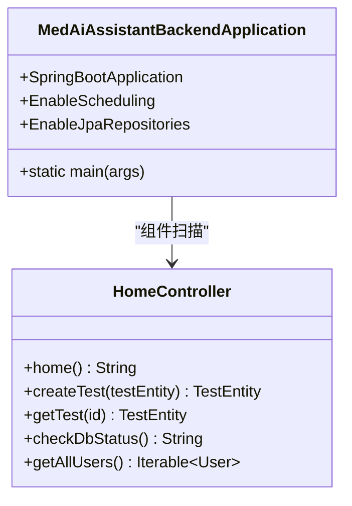

**图表来源**
- [MedAiAssistantBackendApplication.java:26-47](file://med_ai_assistant_1.0_bs_backend/src/main/java/com/example/medaiassistant/MedAiAssistantBackendApplication.java#L26-L47)
- [HomeController.java:9-50](file://med_ai_assistant_1.0_bs_backend/src/main/java/com/example/medaiassistant/HomeController.java#L9-L50)

### API路由配置

系统采用WebFlux框架实现响应式API路由，特别针对AI服务进行了优化配置。

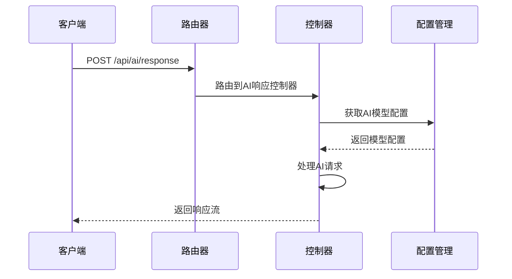

**图表来源**
- [AIRouterConfig.java:24-34](file://med_ai_assistant_1.0_bs_backend/src/main/java/com/example/medaiassistant/config/AIRouterConfig.java#L24-L34)
- [AIResponseController.java:91-182](file://med_ai_assistant_1.0_bs_backend/src/main/java/com/example/medaiassistant/controller/AIResponseController.java#L91-L182)

**章节来源**
- [MedAiAssistantBackendApplication.java:26-47](file://med_ai_assistant_1.0_bs_backend/src/main/java/com/example/medaiassistant/MedAiAssistantBackendApplication.java#L26-L47)
- [HomeController.java:9-50](file://med_ai_assistant_1.0_bs_backend/src/main/java/com/example/medaiassistant/HomeController.java#L9-L50)

## AI模型配置系统

### 配置架构设计

AI模型配置系统采用灵活的配置管理模式，支持多模型并存和动态配置更新。

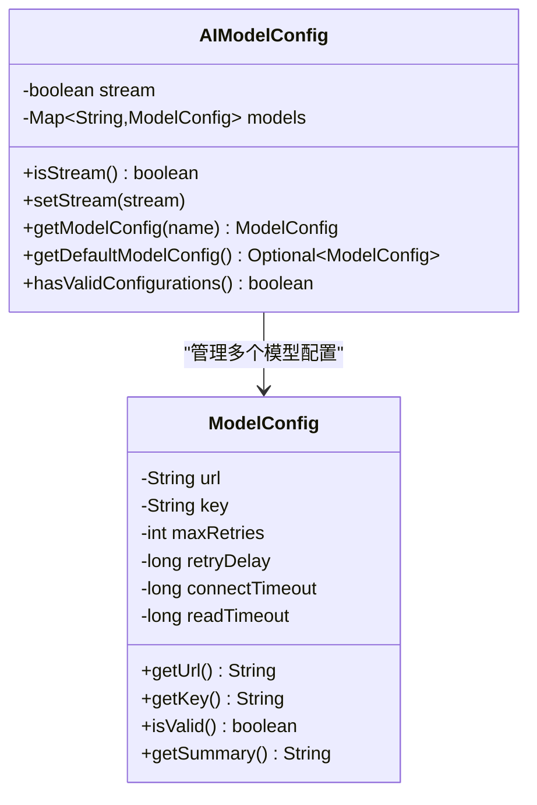

**图表来源**
- [AIModelConfig.java:31-264](file://med_ai_assistant_1.0_bs_backend/src/main/java/com/example/medaiassistant/config/AIModelConfig.java#L31-L264)

### 配置验证机制

系统实现了多层次的配置验证机制，确保AI模型配置的有效性和安全性。


**图表来源**
- [AIModelConfig.java:294-310](file://med_ai_assistant_1.0_bs_backend/src/main/java/com/example/medaiassistant/config/AIModelConfig.java#L294-L310)

**章节来源**
- [AIModelConfig.java:12-399](file://med_ai_assistant_1.0_bs_backend/src/main/java/com/example/medaiassistant/config/AIModelConfig.java#L12-L399)

## 响应式AI服务

### 流式响应处理

系统采用响应式编程模式处理AI服务的流式响应，支持实时的数据传输和处理。

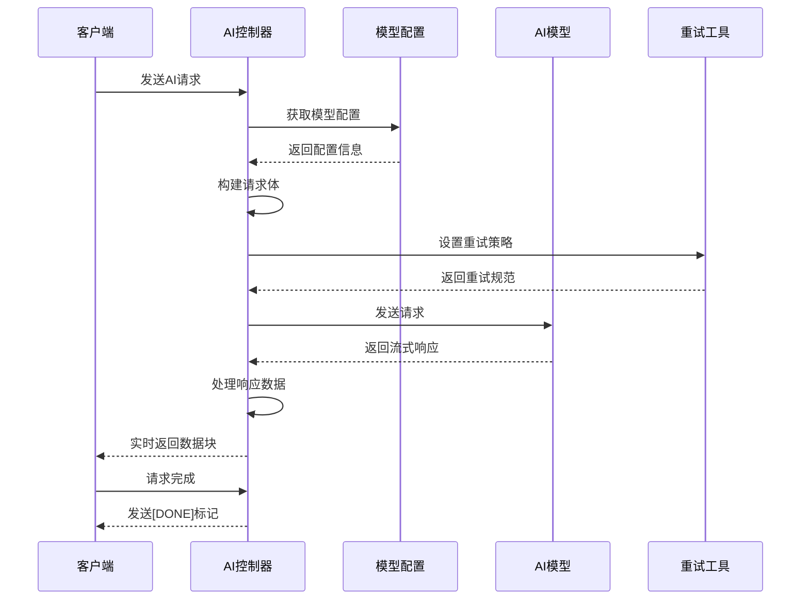

**图表来源**
- [AIResponseController.java:292-402](file://med_ai_assistant_1.0_bs_backend/src/main/java/com/example/medaiassistant/controller/AIResponseController.java#L292-L402)

### 非流式响应处理

对于非流式的AI响应，系统提供完整的JSON响应处理机制。

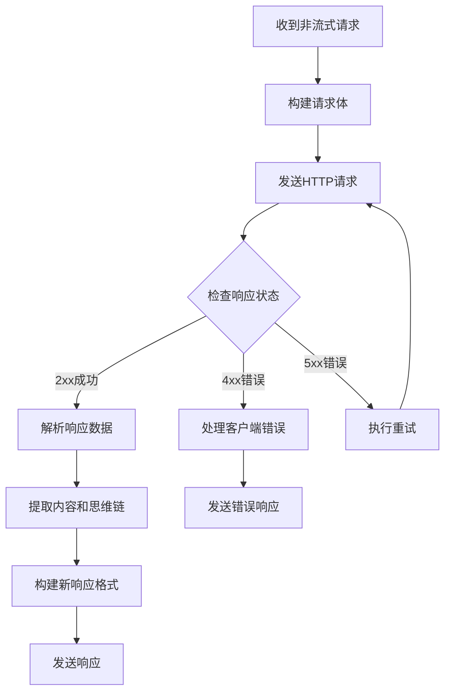

**图表来源**
- [AIResponseController.java:455-526](file://med_ai_assistant_1.0_bs_backend/src/main/java/com/example/medaiassistant/controller/AIResponseController.java#L455-L526)

**章节来源**
- [AIResponseController.java:30-528](file://med_ai_assistant_1.0_bs_backend/src/main/java/com/example/medaiassistant/controller/AIResponseController.java#L30-L528)

## 重试机制设计

### 智能重试策略

系统实现了基于指数退避和随机抖动的智能重试机制，有效应对网络波动和临时故障。

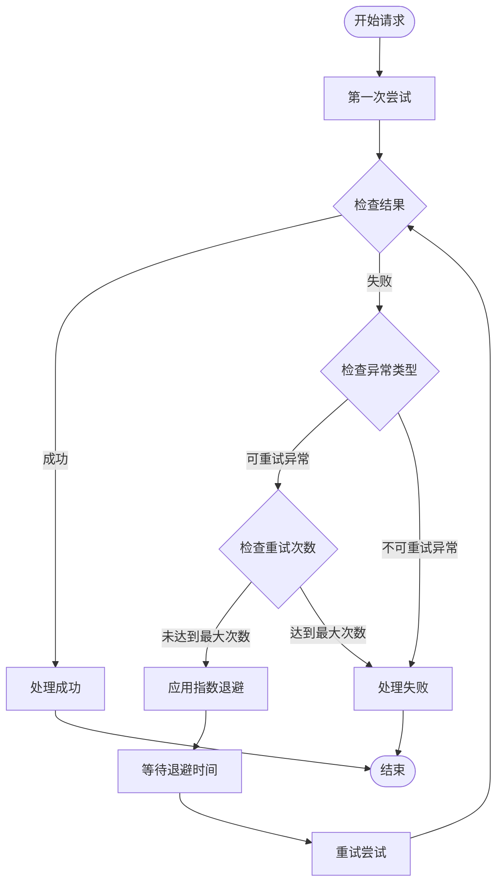

**图表来源**
- [RetryUtil.java:49-64](file://med_ai_assistant_1.0_bs_backend/src/main/java/com/example/medaiassistant/util/RetryUtil.java#L49-L64)

### 异常分类处理

系统对不同类型的异常进行智能识别和处理，确保重试的有效性和效率。

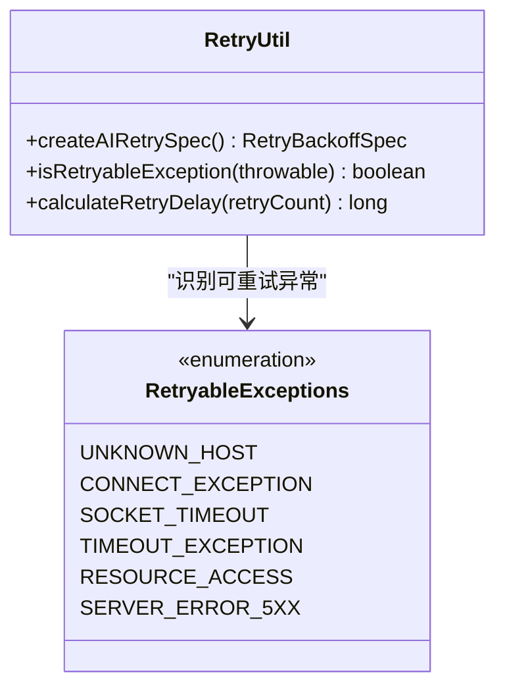

**图表来源**
- [RetryUtil.java:80-118](file://med_ai_assistant_1.0_bs_backend/src/main/java/com/example/medaiassistant/util/RetryUtil.java#L80-L118)

**章节来源**
- [RetryUtil.java:17-204](file://med_ai_assistant_1.0_bs_backend/src/main/java/com/example/medaiassistant/util/RetryUtil.java#L17-L204)

## DRG分析页面重构

### 页面架构变更

根据更新小结的要求，DRG分析页面进行了重大重构：

- **删除所有标签页**：移除了原有的多标签页导航结构
- **仅保留"开始分析"按钮**：简化用户操作流程，提供直接的分析入口
- **新增患者医疗信息卡片**：整合诊断和手术信息的可视化展示
- **新增合并症历史结果卡片**：提供历史分析结果的集中展示和跟踪功能
- **新增DRG费用卡片**：基于DRG目录匹配功能，显示匹配的DRG记录和费用信息
- **新增严格标准推荐列表**：作为DRG分析结果的重要组成部分，提供临床决策支持
- **版本0.7.005新增**：DRG分析按钮添加确认对话框，新增AI分析结果卡片，AI辅助页面过滤DRG专用Prompt记录
- **版本0.7.004新增**：DRG分析页面新增"主要诊断及操作分析"按钮，一键生成DRG分析Prompt并提交AI分析
- **版本0.7.034新增**：DRG分析页面新增严格标准推荐列表表格，支持单选、盈亏计算与排序
- **版本0.8.001修复**：修复DRG分析页面严格标准推荐列表因Markdown加粗符号导致解析失败的问题
- **版本0.8.003新增**：DRG分析结果保存功能，支持用户选择的DRG记录持久化

### 页面布局设计

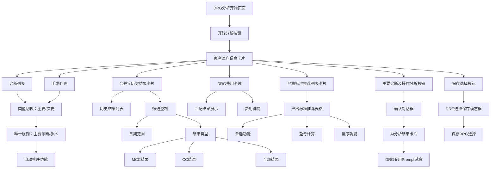

**图表来源**
- [Update Log.md:1-216](file://更新小结.md#L1-L216)

**章节来源**
- [Update Log.md:1-216](file://更新小结.md#L1-L216)

## 严格标准推荐列表功能

### 功能架构设计

严格标准推荐列表是DRG分析系统增强的核心功能，为临床医生提供精准的DRG推荐和决策支持。

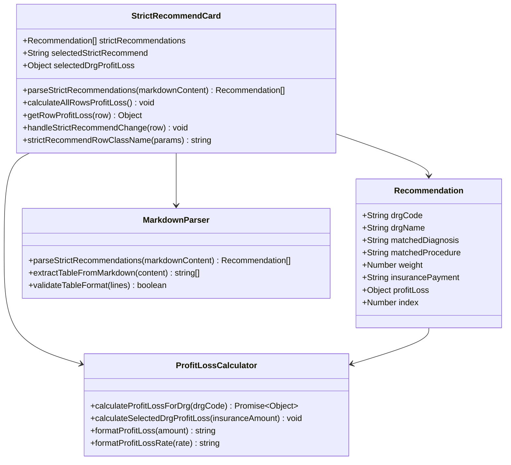

**图表来源**
- [DrgAnalysis.vue:71-119](file://med_ai_assistant_1.0_bs_vue/src/components/patient/DrgAnalysis.vue#L71-L119)
- [DrgAnalysis.vue:1176-1273](file://med_ai_assistant_1.0_bs_vue/src/components/patient/DrgAnalysis.vue#L1176-L1273)
- [DrgAnalysis.vue:1294-1348](file://med_ai_assistant_1.0_bs_vue/src/components/patient/DrgAnalysis.vue#L1294-L1348)

### 推荐列表解析流程

系统实现了智能的Markdown表格解析机制，从AI分析结果中提取严格标准推荐列表。**更新** 修复了Markdown加粗符号导致的解析失败问题。

```mermaid
flowchart TD
Start([开始解析严格标准推荐]) --> CleanContent[移除<thinking>标签]
CleanContent --> FindSection[查找"严格标准推荐列表"部分]
FindSection --> CheckSection{找到部分?}
CheckSection --> |否| ReturnEmpty[返回空列表]
CheckSection --> |是| ExtractSection[提取部分内容]
ExtractSection --> FixBoldSymbols[修复Markdown加粗符号]
FixBoldSymbols --> FindTable[查找Markdown表格]
FindTable --> CheckTable{找到表格?}
CheckTable --> |否| ReturnEmpty
CheckTable --> |是| ParseHeader[解析表头行]
ParseHeader --> SkipSeparator[跳过分隔行]
SkipSeparator --> ParseDataRows[解析数据行]
ParseDataRows --> ValidateColumns[验证列数]
ValidateColumns --> MapFields[映射字段到对象]
MapFields --> CalculateProfitLoss[计算盈亏数据]
CalculateProfitLoss --> SortResults[按盈亏排序]
SortResults --> ReturnResults[返回推荐列表]
ReturnEmpty --> End([结束])
ReturnResults --> End
```

**图表来源**
- [DrgAnalysis.vue:1176-1273](file://med_ai_assistant_1.0_bs_vue/src/components/patient/DrgAnalysis.vue#L1176-L1273)

### Markdown加粗符号修复

**更新** 修复了AI分析结果中Markdown加粗符号导致的推荐列表解析失败问题。解析器现在能够正确处理带加粗符号的标题格式。

```mermaid
flowchart TD
Start([开始解析严格标准推荐]) --> CleanContent[移除<thinking>标签]
CleanContent --> FindSection[查找"严格标准推荐列表"部分]
FindSection --> CheckSection{找到部分?}
CheckSection --> |否| ReturnEmpty[返回空列表]
CheckSection --> |是| ExtractSection[提取部分内容]
ExtractSection --> FixBoldSymbols[修复Markdown加粗符号]
FixBoldSymbols --> FindTable[查找Markdown表格]
FindTable --> CheckTable{找到表格?}
CheckTable --> |否| ReturnEmpty
CheckTable --> |是| ParseHeader[解析表头行]
ParseHeader --> SkipSeparator[跳过分隔行]
SkipSeparator --> ParseDataRows[解析数据行]
ParseDataRows --> ValidateColumns[验证列数]
ValidateColumns --> MapFields[映射字段到对象]
MapFields --> CalculateProfitLoss[计算盈亏数据]
CalculateProfitLoss --> SortResults[按盈亏排序]
SortResults --> ReturnResults[返回推荐列表]
ReturnEmpty --> End([结束])
ReturnResults --> End
```

**图表来源**
- [DrgAnalysis.vue:1196-1294](file://med_ai_assistant_1.0_bs_vue/src/components/patient/DrgAnalysis.vue#L1196-L1294)

### 盈亏计算规则

系统实现了严格的盈亏计算规则，为每个推荐DRG提供准确的财务分析。

```mermaid
flowchart TD
Start([开始盈亏计算]) --> CheckFeeData{检查费用数据}
CheckFeeData --> |无费用| ReturnNull[返回null]
CheckFeeData --> |有费用| ParseInsurance[解析保险支付]
ParseInsurance --> CheckInsurance{保险支付有效?}
CheckInsurance --> |无效| ReturnNull
CheckInsurance --> |有效| CompareFees[比较总费用与保险支付]
CompareFees --> LessThan70[总费用 < 保险支付*0.7]
LessThan70 --> SetZero[设置盈亏为0，颜色为黑色]
CompareFees --> Between70and100[保险支付*0.7 <= 总费用 < 保险支付]
Between70and100 --> CalcLoss1[计算盈亏 = 保险支付 - 总费用，颜色绿色]
CompareFees --> Between100and140[保险支付 <= 总费用 < 保险支付*1.4]
Between100and140 --> CalcLoss2[计算盈亏 = 保险支付 - 总费用，颜色红色]
CompareFees --> GreaterThanOrEqual140[总费用 >= 保险支付*1.4]
GreaterThanOrEqual140 --> CalcLoss3[计算盈亏 = 总费用 - (总费用/保险支付-0.4)*保险支付，颜色红色]
SetZero --> ReturnResult[返回结果]
CalcLoss1 --> ReturnResult
CalcLoss2 --> ReturnResult
CalcLoss3 --> ReturnResult
ReturnNull --> End([结束])
ReturnResult --> End
```

**图表来源**
- [DrgAnalysis.vue:1385-1426](file://med_ai_assistant_1.0_bs_vue/src/components/patient/DrgAnalysis.vue#L1385-L1426)

### 表格功能特性

严格标准推荐列表表格具备以下核心功能：

1. **单选功能**：支持用户从推荐列表中选择单一DRG进行深入分析
2. **盈亏显示**：实时显示每个DRG的盈亏金额和颜色编码（绿色盈利/红色亏损）
3. **智能排序**：按盈亏金额自动降序排列，突出最优推荐
4. **交互高亮**：选中行自动高亮显示，提升用户体验
5. **数据验证**：确保只有有效的费用数据才会触发盈亏计算
6. **格式化显示**：支持金额和百分比的格式化显示
7. **响应式设计**：适配不同屏幕尺寸的设备
8. **颜色编码系统**：使用黑色（0）、绿色（盈利）、红色（亏损）三种颜色区分盈亏状态
9. **开发环境模拟**：在开发环境下无真实费用数据时，为每行独立模拟生成总费用
10. **DRG选择保存**：**版本0.8.003新增** 支持将用户选择的DRG记录保存到数据库

**章节来源**
- [DrgAnalysis.vue:71-119](file://med_ai_assistant_1.0_bs_vue/src/components/patient/DrgAnalysis.vue#L71-L119)
- [DrgAnalysis.vue:1176-1273](file://med_ai_assistant_1.0_bs_vue/src/components/patient/DrgAnalysis.vue#L1176-L1273)
- [DrgAnalysis.vue:1294-1348](file://med_ai_assistant_1.0_bs_vue/src/components/patient/DrgAnalysis.vue#L1294-L1348)
- [DrgAnalysis.vue:1385-1426](file://med_ai_assistant_1.0_bs_vue/src/components/patient/DrgAnalysis.vue#L1385-L1426)

## DRG目录匹配服务

### 服务架构设计

DRG目录匹配服务是本次更新的核心功能，提供基于主要诊断和主要手术的精确匹配能力。

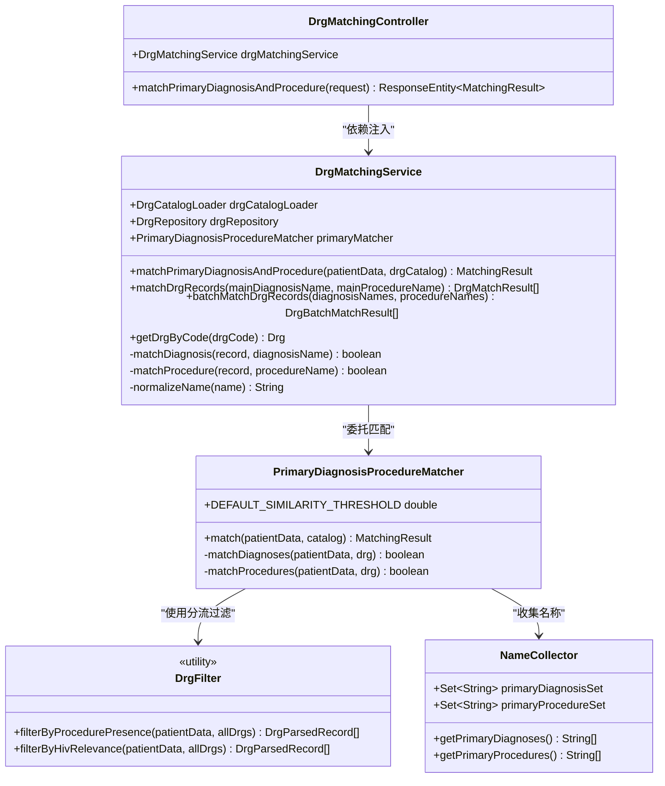

**图表来源**
- [DrgMatchingService.java:28-190](file://med_ai_assistant_1.0_bs_backend/src/main/java/com/example/medaiassistant/service/DrgMatchingService.java#L28-L190)
- [DrgMatchingController.java:24-83](file://med_ai_assistant_1.0_bs_backend/src/main/java/com/example/medaiassistant/controller/DrgMatchingController.java#L24-L83)
- [PrimaryDiagnosisProcedureMatcher.java:29-143](file://med_ai_assistant_1.0_bs_backend/src/main/java/com/example/medaiassistant/drg/matching/PrimaryDiagnosisProcedureMatcher.java#L29-L143)

### 匹配流程设计

DRG目录匹配服务实现了完整的匹配流程，包括分流过滤、精确匹配和结果收集。


**图表来源**
- [PrimaryDiagnosisProcedureMatcher.java:40-72](file://med_ai_assistant_1.0_bs_backend/src/main/java/com/example/medaiassistant/drg/matching/PrimaryDiagnosisProcedureMatcher.java#L40-L72)

### 匹配规则实现

系统实现了严格的DRG匹配规则，确保匹配结果的准确性和一致性。

1. **分流过滤规则**：
   - 患者有手术：只匹配包含主要手术的DRG记录
   - 患者无手术：只匹配不包含主要手术的DRG记录

2. **诊断匹配规则**：
   - 支持ICD编码精确匹配
   - 支持诊断名称相似度匹配（阈值0.7）
   - 支持诊断别名匹配

3. **手术匹配规则**：
   - 支持手术编码精确匹配
   - 支持手术名称相似度匹配（阈值0.7）

4. **名称标准化处理**：
   - 转换为小写
   - 移除空白字符
   - 移除标点符号
   - 统一字符串格式

**更新** 实现"诊断为主、手术为辅"差异化评分策略，新增DEBUG日志记录匹配过程

**章节来源**
- [DrgMatchingService.java:50-190](file://med_ai_assistant_1.0_bs_backend/src/main/java/com/example/medaiassistant/service/DrgMatchingService.java#L50-L190)
- [PrimaryDiagnosisProcedureMatcher.java:34-141](file://med_ai_assistant_1.0_bs_backend/src/main/java/com/example/medaiassistant/drg/matching/PrimaryDiagnosisProcedureMatcher.java#L34-L141)
- [DrgFilter.java:34-48](file://med_ai_assistant_1.0_bs_backend/src/main/java/com/example/medaiassistant/drg/matching/DrgFilter.java#L34-L48)

## 患者医疗信息卡片

### 卡片架构设计

患者医疗信息卡片作为DRG分析页面的核心组件，提供集中式的患者医疗信息展示。

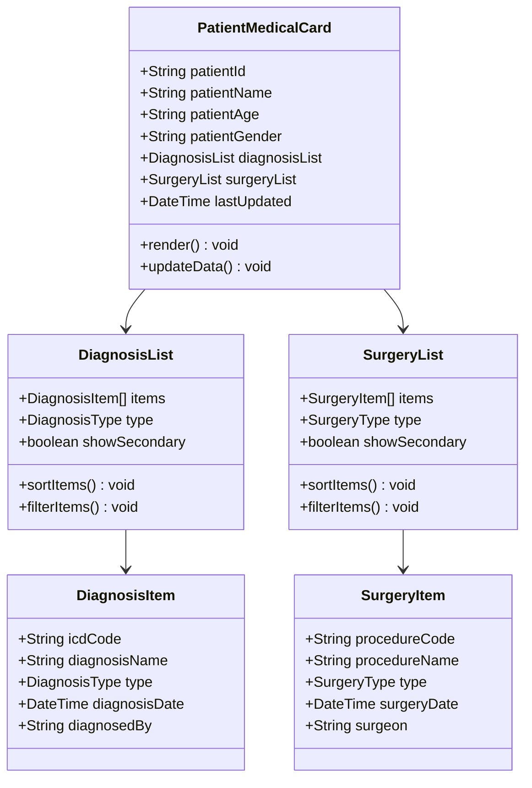

**图表来源**
- [DiagnosisController.java:87-108](file://med_ai_assistant_1.0_bs_backend/src/main/java/com/example/medaiassistant/controller/DiagnosisController.java#L87-L108)
- [SurgeryController.java:32-35](file://med_ai_assistant_1.0_bs_backend/src/main/java/com/example/medaiassistant/controller/SurgeryController.java#L32-L35)

### 卡片功能特性

1. **实时数据更新**：从后端API获取最新的诊断和手术数据
2. **双列表展示**：同时显示诊断列表和手术列表
3. **类型切换**：支持主要诊断/次要诊断和主要手术/次要手术的切换显示
4. **唯一性规则**：确保主要诊断和主要手术的唯一性
5. **自动排序**：按照时间或其他逻辑进行自动排序
6. **DRG费用集成**：与DRG目录匹配功能集成，提供费用相关信息
7. **严格标准推荐列表**：与新增的推荐列表功能集成，提供医疗推荐显示
8. **版本0.7.005新增**：AI分析结果卡片集成，支持DRG专用Prompt过滤
9. **版本0.7.034新增**：严格标准推荐列表功能集成，提供医疗推荐显示
10. **DRG选择保存**：**版本0.8.003新增** 与DRG选择保存功能集成，支持用户选择的DRG记录持久化

**章节来源**
- [DiagnosisController.java:1-110](file://med_ai_assistant_1.0_bs_backend/src/main/java/com/example/medaiassistant/controller/DiagnosisController.java#L1-L110)
- [SurgeryController.java:1-223](file://med_ai_assistant_1.0_bs_backend/src/main/java/com/example/medaiassistant/controller/SurgeryController.java#L1-L223)

## 诊断列表管理

### 诊断列表架构

诊断列表作为患者医疗信息卡片的重要组成部分，提供诊断信息的集中管理。

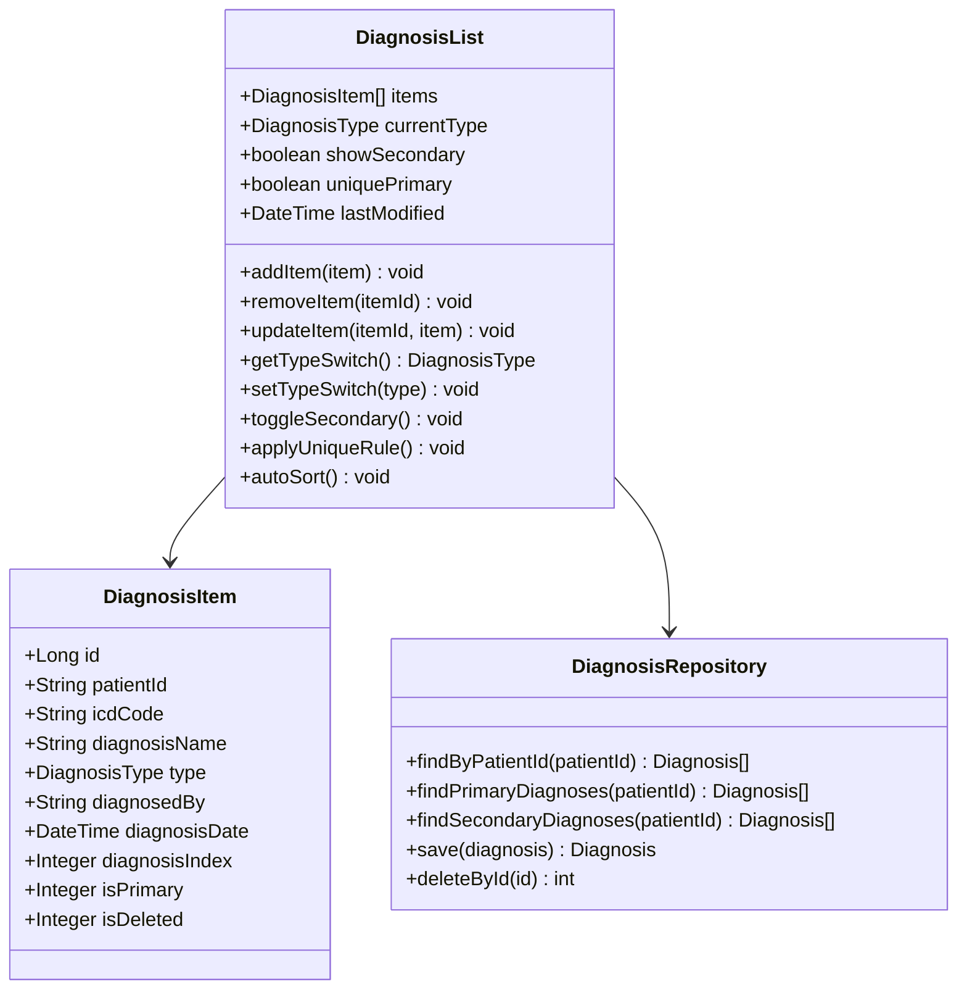

**图表来源**
- [DiagnosisController.java:87-108](file://med_ai_assistant_1.0_bs_backend/src/main/java/com/example/medaiassistant/controller/DiagnosisController.java#L87-L108)
- [DiagnosisRepository.java:1-50](file://med_ai_assistant_1.0_bs_backend/src/main/java/com/example/medaiassistant/repository/DiagnosisRepository.java#L1-L50)

### 诊断类型管理

系统支持诊断类型的灵活切换和管理：

1. **主要诊断规则**：
   - 唯一主要诊断原则
   - 自动排序机制
   - 类型验证和冲突检测

2. **次要诊断规则**：
   - 支持多个次要诊断
   - 自动排序和去重
   - 类型切换功能

3. **数据验证**：
   - ICD编码验证
   - 诊断名称完整性检查
   - 时间戳一致性验证

**章节来源**
- [DiagnosisController.java:22-85](file://med_ai_assistant_1.0_bs_backend/src/main/java/com/example/medaiassistant/controller/DiagnosisController.java#L22-L85)
- [DiagnosisRepository.java:1-100](file://med_ai_assistant_1.0_bs_backend/src/main/java/com/example/medaiassistant/repository/DiagnosisRepository.java#L1-L100)

## 手术列表管理

### 手术列表架构

手术列表提供患者手术信息的完整管理功能，支持复杂的手术数据处理。

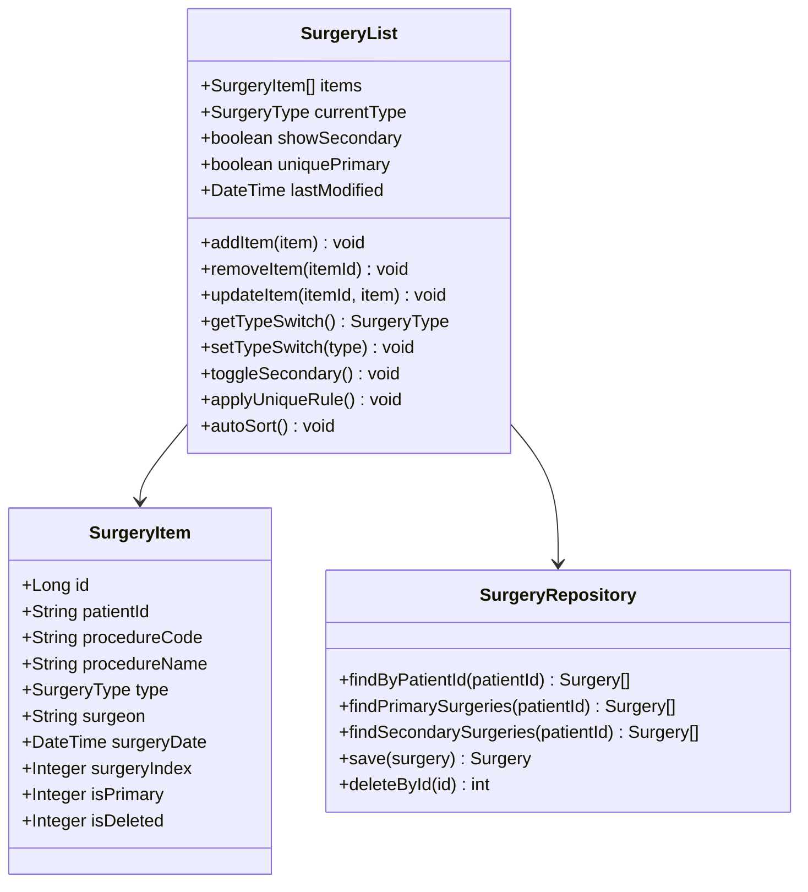

**图表来源**
- [SurgeryController.java:32-35](file://med_ai_assistant_1.0_bs_backend/src/main/java/com/example/medaiassistant/controller/SurgeryController.java#L32-L35)
- [SurgeryRepository.java:1-50](file://med_ai_assistant_1.0_bs_backend/src/main/java/com/example/medaiassistant/repository/SurgeryRepository.java#L1-L50)

### 手术类型管理

系统对手术类型提供精细的管理控制：

1. **主要手术规则**：
   - 唯一主要手术原则
   - 自动排序和时间优先
   - 类型冲突自动检测

2. **次要手术规则**：
   - 支持多个次要手术
   - 按时间顺序自动排序
   - 类型切换和过滤功能

3. **数据完整性**：
   - 手术编码验证
   - 医生信息完整性检查
   - 手术日期合理性验证

**章节来源**
- [SurgeryController.java:74-144](file://med_ai_assistant_1.0_bs_backend/src/main/java/com/example/medaiassistant/controller/SurgeryController.java#L74-L144)
- [SurgeryRepository.java:1-100](file://med_ai_assistant_1.0_bs_backend/src/main/java/com/example/medaiassistant/repository/SurgeryRepository.java#L1-L100)

## 合并症历史结果卡片

### 历史结果卡片架构

合并症历史结果卡片作为DRG分析页面的重要组成部分，提供历史分析结果的集中展示和跟踪功能。

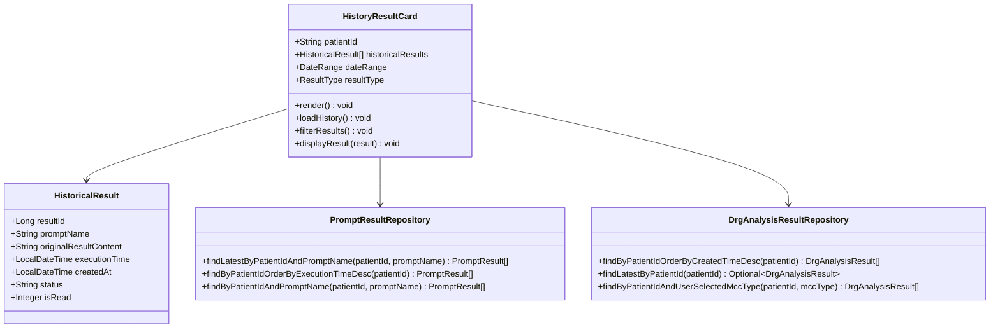

**图表来源**
- [AIController.java:272-288](file://med_ai_assistant_1.0_bs_backend/src/main/java/com/example/medaiassistant/controller/AIController.java#L272-L288)
- [DrgAnalysisResultRepository.java:53-63](file://med_ai_assistant_1.0_bs_backend/src/main/java/com/example/medaiassistant/repository/DrgAnalysisResultRepository.java#L53-L63)

### 历史结果功能特性

1. **历史结果展示**：
   - 展示患者所有合并症或并发症分析的历史结果
   - 支持按时间倒序排列
   - 显示每次分析的执行时间和状态

2. **结果筛选功能**：
   - 支持按日期范围筛选历史结果
   - 支持按结果类型（MCC/CC/全部）筛选
   - 支持按状态筛选（已完成/进行中）

3. **结果详情查看**：
   - 点击历史结果可查看详细分析内容
   - 支持Markdown渲染AI分析结果
   - 自动过滤thinking标签，优化显示效果

4. **结果管理功能**：
   - 支持标记结果为已读
   - 支持软删除历史结果
   - 支持重新执行分析

**章节来源**
- [AIController.java:272-400](file://med_ai_assistant_1.0_bs_backend/src/main/java/com/example/medaiassistant/controller/AIController.java#L272-L400)
- [PromptResult.java:1-145](file://med_ai_assistant_1.0_bs_backend/src/main/java/com/example/medaiassistant/model/PromptResult.java#L1-L145)

## DRG批量组合匹配功能

### 批量匹配架构设计

DRG批量组合匹配功能是版本0.7.003新增的核心功能，支持遍历所有诊断×手术组合进行DRG分组计算。

```mermaid
classDiagram
class DrgBatchMatchResult {
+DrgMatchResult matchResult
+String matchedDiagnosisName
+String matchedProcedureName
+getMatchResult() DrgMatchResult
+getMatchedDiagnosisName() String
+getMatchedProcedureName() String
}
class DrgMatchingService {
+batchMatchDrgRecords(diagnosisNames, procedureNames) DrgBatchMatchResult[]
+matchDrgRecords(mainDiagnosisName, mainProcedureName) DrgMatchResult[]
}
class DrgBatchMatchResult {
<<wrapper>>
}
DrgMatchingService --> DrgBatchMatchResult : "返回批量匹配结果"
```

**图表来源**
- [DrgMatchingService.java:501-542](file://med_ai_assistant_1.0_bs_backend/src/main/java/com/example/medaiassistant/service/DrgMatchingService.java#L501-L542)
- [DrgBatchMatchResult.java:8-22](file://med_ai_assistant_1.0_bs_backend/src/main/java/com/example/medaiassistant/drg/catalog/DrgBatchMatchResult.java#L8-L22)

### 批量匹配流程

系统实现了完整的批量匹配流程，支持诊断和手术的笛卡尔积组合遍历。

```mermaid
flowchart TD
Start([开始批量匹配]) --> ValidateInputs{验证输入参数}
ValidateInputs --> |有效| PrepareDiagnoses[准备诊断列表]
ValidateInputs --> |无效| ReturnEmpty[返回空结果]
PrepareDiagnoses --> PrepareProcedures[准备手术列表]
PrepareProcedures --> CheckEmptyProcedures{手术列表为空?}
CheckEmptyProcedures --> |是| AddNullProcedure[添加null元素]
CheckEmptyProcedures --> |否| UseActualProcedures[使用实际手术列表]
AddNullProcedure --> CreateCartesian[创建诊断×手术笛卡尔积]
UseActualProcedures --> CreateCartesian
CreateCartesian --> IterateCombinations[遍历所有组合]
IterateCombinations --> CallSingleMatch[调用单次匹配]
CallSingleMatch --> ProcessResult[处理匹配结果]
ProcessResult --> GroupByDrgCode[按DRG编码去重]
GroupByDrgCode --> KeepBestScore[保留最高分数]
KeepBestScore --> ReturnResults[返回批量结果]
ReturnEmpty --> End([结束])
ReturnResults --> End
```

**图表来源**
- [DrgMatchingService.java:511-542](file://med_ai_assistant_1.0_bs_backend/src/main/java/com/example/medaiassistant/service/DrgMatchingService.java#L511-L542)

### 批量匹配特性

1. **组合遍历**：遍历诊断列表和手术列表的所有可能组合
2. **去重机制**：按DRG编码去重，保留匹配分数最高的组合
3. **权重计算**：为每个组合计算匹配分数，支持按权重降序展示
4. **性能优化**：使用LinkedHashMap保持插入顺序，提高去重效率
5. **结果包装**：提供DrgBatchMatchResult包装类，包含原始匹配结果和匹配的诊断/手术名称

**章节来源**
- [DrgMatchingService.java:501-542](file://med_ai_assistant_1.0_bs_backend/src/main/java/com/example/medaiassistant/service/DrgMatchingService.java#L501-L542)
- [DrgBatchMatchResult.java:1-23](file://med_ai_assistant_1.0_bs_backend/src/main/java/com/example/medaiassistant/drg/catalog/DrgBatchMatchResult.java#L1-L23)

## HIV过滤功能

### 过滤架构设计

HIV过滤功能是版本0.7.002新增的安全过滤机制，确保DRG匹配结果的临床准确性。

```mermaid
classDiagram
class DrgFilter {
+filterByHivRelevance(patientData, allDrgs) DrgParsedRecord[]
-hasHivRelatedDiagnosis(patientData) boolean
-isHivRelatedDrg(drg) boolean
-containsHivKeyword(text) boolean
}
class DrgMatchingService {
+matchDrgRecords(mainDiagnosisName, mainProcedureName) DrgMatchResult[]
+isHivRelatedCatalogRecord(record) boolean
}
class PrimaryDiagnosisProcedureMatcher {
+match(patientData, catalog) MatchingResult
}
DrgMatchingService --> DrgFilter : "使用HIV过滤"
PrimaryDiagnosisProcedureMatcher --> DrgFilter : "使用HIV过滤"
```

**图表来源**
- [DrgFilter.java:72-107](file://med_ai_assistant_1.0_bs_backend/src/main/java/com/example/medaiassistant/drg/matching/DrgFilter.java#L72-L107)
- [DrgMatchingService.java:196-205](file://med_ai_assistant_1.0_bs_backend/src/main/java/com/example/medaiassistant/service/DrgMatchingService.java#L196-L205)

### 过滤逻辑实现

系统实现了智能的HIV相关性过滤机制，确保只有存在相关诊断的患者才能匹配到HIV相关DRG分组。

```mermaid
flowchart TD
Start([开始HIV过滤]) --> CheckPatientData{检查患者数据}
CheckPatientData --> |为空| ReturnAll[返回所有DRG记录]
CheckPatientData --> |有数据| CheckHivDiagnosis[检查HIV相关诊断]
CheckHivDiagnosis --> |有HIV诊断| ReturnAll
CheckHivDiagnosis --> |无HIV诊断| FilterHivDrgs[过滤HIV相关DRG]
FilterHivDrgs --> CheckDrgName{检查DRG名称}
CheckDrgName --> |包含HIV关键词| RemoveDrg[移除该DRG]
CheckDrgName --> |不包含HIV关键词| KeepDrg[保留该DRG]
RemoveDrg --> NextDrg[下一个DRG]
KeepDrg --> NextDrg
NextDrg --> |还有DRG| CheckDrgName
NextDrg --> |完成| ReturnFiltered[返回过滤后的结果]
ReturnAll --> End([结束])
ReturnFiltered --> End
```

**图表来源**
- [DrgFilter.java:90-107](file://med_ai_assistant_1.0_bs_backend/src/main/java/com/example/medaiassistant/drg/matching/DrgFilter.java#L90-L107)

### 过滤规则特性

1. **诊断检测**：检查患者诊断列表中是否包含HIV相关关键词
2. **DRG检测**：检查DRG名称中是否包含HIV相关关键词
3. **关键词匹配**：支持"HIV"和"获得性免疫缺陷"两种关键词
4. **大小写不敏感**：统一转换为大写进行匹配
5. **条件过滤**：只有当患者确实存在HIV相关诊断时才允许保留HIV相关DRG

**章节来源**
- [DrgFilter.java:72-165](file://med_ai_assistant_1.0_bs_backend/src/main/java/com/example/medaiassistant/drg/matching/DrgFilter.java#L72-L165)
- [DrgMatchingService.java:196-288](file://med_ai_assistant_1.0_bs_backend/src/main/java/com/example/medaiassistant/service/DrgMatchingService.java#L196-L288)

## 双向严格分流策略

### 分流策略架构设计

双向严格分流策略是版本0.7.001实现的核心匹配优化，确保DRG匹配结果严格符合患者的手术状态。

```mermaid
classDiagram
class DrgFilter {
+filterByProcedurePresence(patientData, allDrgs) DrgParsedRecord[]
}
class PrimaryDiagnosisProcedureMatcher {
+match(patientData, catalog) MatchingResult
}
class DrgMatchingService {
+matchDrgRecords(mainDiagnosisName, mainProcedureName) DrgMatchResult[]
}
class DrgParsedRecord {
+hasProcedures() boolean
+getDrgCode() String
+getDrgName() String
}
DrgMatchingService --> DrgFilter : "使用双向分流"
PrimaryDiagnosisProcedureMatcher --> DrgFilter : "使用双向分流"
DrgFilter --> DrgParsedRecord : "检查手术要求"
```

**图表来源**
- [DrgFilter.java:24-70](file://med_ai_assistant_1.0_bs_backend/src/main/java/com/example/medaiassistant/drg/matching/DrgFilter.java#L24-L70)
- [PrimaryDiagnosisProcedureMatcher.java:60-114](file://med_ai_assistant_1.0_bs_backend/src/main/java/com/example/medaiassistant/drg/matching/PrimaryDiagnosisProcedureMatcher.java#L60-L114)

### 分流逻辑实现

系统实现了严格的双向分流机制，确保匹配结果符合临床实际。

```mermaid
flowchart TD
Start([开始双向分流]) --> CheckPatientData{检查患者数据}
CheckPatientData --> |为空| ReturnEmpty[返回空列表]
CheckPatientData --> |有数据| CheckProcedurePresence[检查患者手术状态]
CheckProcedurePresence --> |患者有手术| FilterHasProcedures[过滤有手术要求的DRG]
CheckProcedurePresence --> |患者无手术| FilterNoProcedures[过滤无手术要求的DRG]
FilterHasProcedures --> CheckDrgRecord{检查DRG记录}
FilterNoProcedures --> CheckDrgRecord
CheckDrgRecord --> |有手术要求| KeepRecord[保留该DRG]
CheckDrgRecord --> |无手术要求| KeepRecord
KeepRecord --> NextRecord[下一个DRG记录]
NextRecord --> |还有记录| CheckDrgRecord
NextRecord --> |完成| ReturnFiltered[返回过滤后的结果]
ReturnEmpty --> End([结束])
ReturnFiltered --> End
```

**图表来源**
- [DrgFilter.java:52-70](file://med_ai_assistant_1.0_bs_backend/src/main/java/com/example/medaiassistant/drg/matching/DrgFilter.java#L52-L70)

### 分流规则特性

1. **严格匹配**：患者有手术时只能匹配有手术要求的DRG
2. **严格匹配**：患者无手术时只能匹配无手术要求的DRG
3. **手术要求判定**：通过`hasProcedures()`方法判断DRG是否要求手术
4. **双向保证**：避免无手术患者被匹配到需手术的DRG，也避免有手术患者匹配到无手术要求的DRG
5. **临床一致性**：确保DRG匹配结果严格符合临床手术存在性要求

**章节来源**
- [DrgFilter.java:24-70](file://med_ai_assistant_1.0_bs_backend/src/main/java/com/example/medaiassistant/drg/matching/DrgFilter.java#L24-L70)
- [PrimaryDiagnosisProcedureMatcher.java:60-114](file://med_ai_assistant_1.0_bs_backend/src/main/java/com/example/medaiassistant/drg/matching/PrimaryDiagnosisProcedureMatcher.java#L60-L114)

## 首行标识检测

### 标识检测架构设计

首行"/"标识检测是版本0.7.001新增的DRG记录解析优化，支持识别MAINPROCEDURES首行为"/"的DRG记录。

```mermaid
classDiagram
class DrgCatalogLoader {
+startsWithSlashLine(text) boolean
}
class DrgMatchingService {
+matchDrgRecords(mainDiagnosisName, mainProcedureName) DrgMatchResult[]
}
class DrgParsedRecord {
+hasProcedures() boolean
+getDrgName() String
}
DrgMatchingService --> DrgCatalogLoader : "使用首行检测"
DrgCatalogLoader --> DrgParsedRecord : "解析MAINPROCEDURES"
```

**图表来源**
- [DrgMatchingService.java:178-179](file://med_ai_assistant_1.0_bs_backend/src/main/java/com/example/medaiassistant/service/DrgMatchingService.java#L178-L179)

### 标识检测逻辑

系统实现了智能的首行标识检测机制，正确识别特殊格式的DRG记录。

```mermaid
flowchart TD
Start([开始首行检测]) --> CheckText{检查MAINPROCEDURES文本}
CheckText --> |为空| NoProcedures[标记无手术要求]
CheckText --> |有内容| CheckFirstLine[检查首行内容]
CheckFirstLine --> |首行为"/"| NoProcedures
CheckFirstLine --> |首行非"/"| HasProcedures[标记有手术要求]
CheckFirstLine --> |无换行符| CheckSlash[检查是否包含"/"]
CheckSlash --> |包含"/"| NoProcedures
CheckSlash --> |不包含"/"| HasProcedures
NoProcedures --> End([结束])
HasProcedures --> End
```

**图表来源**
- [DrgMatchingService.java:178-179](file://med_ai_assistant_1.0_bs_backend/src/main/java/com/example/medaiassistant/service/DrgMatchingService.java#L178-L179)

### 标识检测规则

1. **空内容检测**：MAINPROCEDURES为空表示无手术要求
2. **首行"/"检测**：首行为"/"表示无手术要求，后续手术仅为伴随操作
3. **斜杠检测**：无换行符但包含"/"的文本也视为无手术要求
4. **标准手术检测**：首行非"/"的文本视为有手术要求
5. **兼容性保证**：确保与现有DRG目录格式的兼容性

**章节来源**
- [DrgMatchingService.java:178-179](file://med_ai_assistant_1.0_bs_backend/src/main/java/com/example/medaiassistant/service/DrgMatchingService.java#L178-L179)

## 定时任务集成DRG分析

### 定时任务架构设计

版本0.7.007新增的定时任务集成功能，实现了DRG分析的自动化处理。

```mermaid
classDiagram
class TimerPromptGenerator {
+TaskScheduler taskScheduler
+AlertRuleService alertRuleService
+PatientStatusUpdateService patientStatusUpdateService
+DrgPromptController drgPromptController
+dailyPromptGeneration() void
+generateDrgPromptForPatient(patientId) boolean
+findInHospitalPatientsByPage(page, pageSize) Patient[]
}
class DrgPromptController {
+generateDrgPrompt(request) ResponseEntity~Map~
+buildDrgListText(batchResults) String
+buildPatientInfo(patient) String
}
class DrgMatchingService {
+batchMatchDrgRecords(diagnosisNames, procedureNames) DrgBatchMatchResult[]
+getDrgByCode(drgCode) Drg
}
class PromptRepository {
+saveAndFlush(prompt) Prompt
}
TimerPromptGenerator --> DrgPromptController : "调用DRG Prompt生成"
TimerPromptGenerator --> DrgMatchingService : "使用DRG匹配服务"
DrgPromptController --> DrgMatchingService : "依赖DRG匹配服务"
DrgPromptController --> PromptRepository : "保存生成的Prompt"
```

**图表来源**
- [TimerPromptGenerator.java:580-714](file://med_ai_assistant_1.0_bs_backend/src/main/java/com/example/medaiassistant/service/TimerPromptGenerator.java#L580-L714)
- [DrgPromptController.java:107-247](file://med_ai_assistant_1.0_bs_backend/src/main/java/com/example/medaiassistant/controller/DrgPromptController.java#L107-L247)

### 定时任务执行流程

系统实现了完整的定时任务执行流程，包括在院患者筛选、DRG分析生成和结果保存。

```mermaid
flowchart TD
Start([定时任务启动]) --> CheckSequence[检查并同步Oracle序列]
CheckSequence --> GetPatients[分页获取在院患者]
GetPatients --> CheckDiagnoses{检查患者是否有诊断}
CheckDiagnoses --> |无诊断| GenerateBasicPrompts[生成基础Prompt]
CheckDiagnoses --> |有诊断| GenerateCompletePrompts[生成完整Prompt]
GenerateBasicPrompts --> SaveBasicPrompts[保存基础Prompt]
GenerateCompletePrompts --> GenerateDrgPrompt[生成DRG分析Prompt]
GenerateDrgPrompt --> SaveDrgPrompt[保存DRG Prompt]
SaveBasicPrompts --> NextPatient[下一个患者]
SaveDrgPrompt --> NextPatient
NextPatient --> |还有患者| GetPatients
NextPatient --> |完成| LogResults[记录任务执行结果]
LogResults --> End([定时任务结束])
```

**图表来源**
- [TimerPromptGenerator.java:616-714](file://med_ai_assistant_1.0_bs_backend/src/main/java/com/example/medaiassistant/service/TimerPromptGenerator.java#L616-L714)

### 定时任务特性

1. **自动化执行**：每天7:00自动执行，无需人工干预
2. **分页处理**：采用分页机制避免一次性加载大量数据
3. **并发控制**：使用保守的并发策略，避免数据库压力过大
4. **错误处理**：每个患者处理失败不影响整体任务执行
5. **性能监控**：记录任务执行统计信息，包括处理时间、成功率等
6. **序列同步**：在批量创建Prompt前检查并同步Oracle序列，防止ID冲突
7. **条件生成**：只有在患者有诊断记录时才生成DRG分析Prompt
8. **MCC分析触发优化**：**版本0.8.002优化** 将MCC分析的前提条件从"需要同时存在ICD10编码和诊断文本"放宽为"仅需要存在诊断文本"

**章节来源**
- [TimerPromptGenerator.java:580-714](file://med_ai_assistant_1.0_bs_backend/src/main/java/com/example/medaiassistant/service/TimerPromptGenerator.java#L580-L714)

## DRG分析Prompt生成接口

### 接口架构设计

版本0.7.006新增的DRG分析Prompt生成接口，提供了完整的DRG分析Prompt生成能力。

```mermaid
classDiagram
class DrgPromptController {
+generateDrgPrompt(request) ResponseEntity~Map~
+buildDrgListText(batchResults) String
+buildPatientInfo(patient) String
}
class DrgMatchingService {
+batchMatchDrgRecords(diagnosisNames, procedureNames) DrgBatchMatchResult[]
+getDrgByCode(drgCode) Drg
}
class PromptRepository {
+save(prompt) Prompt
}
class PromptTemplateRepository {
+findByPromptTypeAndPromptName(type, name) PromptTemplate
}
class AIController {
+getPatientData(patientId, promptType, promptName) ResponseEntity~String~
}
DrgPromptController --> DrgMatchingService : "使用DRG匹配服务"
DrgPromptController --> PromptRepository : "保存生成的Prompt"
DrgPromptController --> PromptTemplateRepository : "获取Prompt模板"
DrgPromptController --> AIController : "获取患者数据"
```

**图表来源**
- [DrgPromptController.java:107-247](file://med_ai_assistant_1.0_bs_backend/src/main/java/com/example/medaiassistant/controller/DrgPromptController.java#L107-L247)

### Prompt生成流程

系统实现了完整的DRG分析Prompt生成流程，包括数据获取、匹配计算和结果保存。

```mermaid
flowchart TD
Start([接收DRG Prompt生成请求]) --> ValidateRequest[验证请求参数]
ValidateRequest --> CheckPatient[检查患者是否存在]
CheckPatient --> GetDiagnoses[获取患者诊断列表]
GetDiagnoses --> GetSurgeries[获取患者手术列表]
GetSurgeries --> BatchMatchDrg[调用DRG批量匹配]
BatchMatchDrg --> CheckResults{检查匹配结果}
CheckResults --> |无结果| ReturnError[返回错误信息]
CheckResults --> |有结果| GetTemplate[获取Prompt模板]
GetTemplate --> GetPatientData[获取患者完整数据]
GetPatientData --> BuildPrompt[构建Prompt内容]
BuildPrompt --> SavePrompt[保存到数据库]
SavePrompt --> ReturnSuccess[返回成功响应]
ReturnError --> End([结束])
ReturnSuccess --> End
```

**图表来源**
- [DrgPromptController.java:107-247](file://med_ai_assistant_1.0_bs_backend/src/main/java/com/example/medaiassistant/controller/DrgPromptController.java#L107-L247)

### 接口功能特性

1. **参数验证**：验证patientId参数的有效性
2. **患者检查**：确保患者存在且有效
3. **数据获取**：获取患者的诊断和手术列表
4. **DRG匹配**：调用批量匹配服务获取DRG结果
5. **模板获取**：获取DRG分析专用Prompt模板
6. **数据构建**：调用AIController获取完整患者数据
7. **内容组合**：将患者数据和DRG匹配结果组合成Prompt
8. **结果保存**：保存生成的Prompt到数据库
9. **响应返回**：返回生成结果和提示信息

**章节来源**
- [DrgPromptController.java:107-247](file://med_ai_assistant_1.0_bs_backend/src/main/java/com/example/medaiassistant/controller/DrgPromptController.java#L107-L247)

## DRG选择保存功能

### 功能架构设计

DRG选择保存功能是版本0.8.003新增的核心功能，支持将用户从AI分析结果中选择的DRG记录持久化到数据库。

```mermaid
classDiagram
class DrgAnalysisController {
+saveDrgSelection(request) ResponseEntity
+DrgSelectionRequest request
+DrgAnalysisResult result
+getLatestDrgAnalysis(patientId) ResponseEntity
}
class DrgSelectionRequest {
+String patientId
+String drgCode
+String drgName
+String matchedDiagnosis
+String matchedProcedure
+String weight
+String insurancePayment
}
class DrgAnalysisResult {
+Long resultId
+String patientId
+Long drgId
+String drgCode
+String finalDrgCode
+String primaryDiagnosis
+String primaryProcedure
+String mainDiagnoses
+String mainProcedures
+BigDecimal insurancePaymentStandard
}
class DrgAnalysisResultRepository {
+save(entity) DrgAnalysisResult
+findByPatientId(patientId) List
+findLatestByPatientId(patientId) Optional
}
DrgAnalysisController --> DrgSelectionRequest : "接收请求"
DrgAnalysisController --> DrgAnalysisResult : "创建实体"
DrgAnalysisResult --> DrgAnalysisResultRepository : "保存到数据库"
```

**图表来源**
- [DrgAnalysisController.java:129-195](file://med_ai_assistant_1.0_bs_backend/src/main/java/com/example/medaiassistant/controller/DrgAnalysisController.java#L129-L195)
- [DrgSelectionRequest.java:14-57](file://med_ai_assistant_1.0_bs_backend/src/main/java/com/example/medaiassistant/dto/DrgSelectionRequest.java#L14-L57)
- [DrgAnalysisResult.java:15-233](file://med_ai_assistant_1.0_bs_backend/src/main/java/com/example/medaiassistant/model/DrgAnalysisResult.java#L15-L233)

### 保存流程设计

系统实现了完整的DRG选择保存流程，包括参数验证、实体创建和数据持久化。

```mermaid
flowchart TD
Start([接收DRG选择保存请求]) --> ValidateParams[验证必填参数]
ValidateParams --> |参数缺失| ReturnBadRequest[返回400错误]
ValidateParams --> |参数有效| CreateEntity[创建DrgAnalysisResult实体]
CreateEntity --> SetFields[设置字段值]
SetFields --> ParseInsurancePayment[解析保险支付金额]
ParseInsurancePayment --> SaveToDatabase[保存到数据库]
SaveToDatabase --> LogSuccess[记录成功日志]
LogSuccess --> ReturnSuccess[返回成功响应]
ReturnBadRequest --> End([结束])
ReturnSuccess --> End
```

**图表来源**
- [DrgAnalysisController.java:129-195](file://med_ai_assistant_1.0_bs_backend/src/main/java/com/example/medaiassistant/controller/DrgAnalysisController.java#L129-L195)

### 保存功能特性

1. **参数验证**：验证patientId、drgCode、drgName均不能为空
2. **实体创建**：创建DrgAnalysisResult实体并设置必要字段
3. **字段设置**：
   - DRG_ID设为0（从Markdown解析的记录无DRG_ID）
   - DRG_CODE设为传入的drgCode（**版本0.8.003新增**）
   - FINAL_DRG_CODE设为传入的drgCode
   - PRIMARY_DIAGNOSIS设为matchedDiagnosis，无时设为空字符串
   - USER_SELECTED_MCC_TYPE设为"NONE"
   - MAIN_DIAGNOSES/MAIN_PROCEDURES以JSON数组格式存入CLOB字段
4. **保险支付处理**：解析insurancePayment字符串，去除货币符号后保存（**版本0.8.003扩展**）
5. **数据持久化**：调用DrgAnalysisResultRepository.save()持久化
6. **响应返回**：返回成功状态和保存的实体数据
7. **最新结果查询**：**版本0.8.003新增** 提供GET /api/drg-analysis/latest/{patientId}接口查询患者最新DRG分析结果

**章节来源**
- [DrgAnalysisController.java:129-195](file://med_ai_assistant_1.0_bs_backend/src/main/java/com/example/medaiassistant/controller/DrgAnalysisController.java#L129-L195)
- [DrgSelectionRequest.java:14-57](file://med_ai_assistant_1.0_bs_backend/src/main/java/com/example/medaiassistant/dto/DrgSelectionRequest.java#L14-L57)
- [DrgAnalysisResult.java:15-233](file://med_ai_assistant_1.0_bs_backend/src/main/java/com/example/medaiassistant/model/DrgAnalysisResult.java#L15-L233)

## DRG目录管理功能

### 功能架构设计

DRG目录管理功能是新增的核心功能，提供DRG目录的查看和管理能力。

```mermaid
classDiagram
class DrgCatalogController {
+DrgCatalogLoader drgCatalogLoader
+DrgMatchingService drgMatchingService
+getCurrentCatalog() ResponseEntity
+getDrgByCode(code) ResponseEntity
+searchDrgs(keyword) ResponseEntity
}
class DrgCatalogLoader {
+AtomicReference~DrgCatalog~ currentCatalog
+loadCatalog() DrgCatalog
+reloadCatalog() void
}
class DrgCatalog {
+DrgParsedRecord[] records
+LocalDateTime lastLoaded
+int totalRecords
}
class DrgParsedRecord {
+Long id
+String drgCode
+String drgName
+BigDecimal insurancePayment
+DiagnosisEntry[] diagnoses
+ProcedureEntry[] procedures
}
DrgCatalogController --> DrgCatalogLoader : "依赖注入"
DrgCatalogController --> DrgMatchingService : "依赖注入"
DrgCatalogLoader --> DrgCatalog : "管理目录"
DrgCatalog --> DrgParsedRecord : "包含记录"
```

**图表来源**
- [DrgCatalogController.java:1-40](file://med_ai_assistant_1.0_bs_backend/src/main/java/com/example/medaiassistant/controller/DrgCatalogController.java#L1-L40)
- [DrgCatalogLoader.java:31-49](file://med_ai_assistant_1.0_bs_backend/src/main/java/com/example/medaiassistant/drg/catalog/DrgCatalogLoader.java#L31-L49)

### 目录管理流程

系统实现了完整的DRG目录管理流程，包括目录加载、缓存管理和API提供。

```mermaid
flowchart TD
Start([DRG目录管理请求]) --> LoadCatalog[加载DRG目录]
LoadCatalog --> ValidateCatalog{检查目录有效性}
ValidateCatalog --> |目录有效| CacheCatalog[缓存目录到AtomicReference]
ValidateCatalog --> |目录无效| ReturnError[返回错误信息]
CacheCatalog --> ReturnCatalog[返回目录数据]
ReturnError --> End([结束])
ReturnCatalog --> End
```

**图表来源**
- [DrgCatalogController.java:1-40](file://med_ai_assistant_1.0_bs_backend/src/main/java/com/example/medaiassistant/controller/DrgCatalogController.java#L1-L40)

### 目录管理特性

1. **目录加载**：从数据库或文件系统加载DRG目录数据
2. **原子缓存**：使用AtomicReference实现DRG目录的原子替换
3. **目录验证**：验证DRG目录数据的完整性和有效性
4. **API提供**：提供DRG目录查询和搜索的REST接口
5. **版本管理**：记录目录最后加载时间和记录总数
6. **性能优化**：内存缓存避免频繁的数据库查询
7. **线程安全**：AtomicReference确保并发读取的一致性

**章节来源**
- [DrgCatalogController.java:1-40](file://med_ai_assistant_1.0_bs_backend/src/main/java/com/example/medaiassistant/controller/DrgCatalogController.java#L1-L40)
- [DrgCatalogLoader.java:31-49](file://med_ai_assistant_1.0_bs_backend/src/main/java/com/example/medaiassistant/drg/catalog/DrgCatalogLoader.java#L31-L49)

## 患者档案视图

### 视图架构设计

患者档案视图是新增的核心功能，提供完整的患者信息展示和管理功能。

```mermaid
classDiagram
class PatientProfileView {
+String patientId
+Object currentPatient
+Array examinationResults
+Array labResults
+Array medicalRecords
+Object patientFeeData
+Object savedDrgResult
+Object profitLossInfo
+loadPatientData() void
+loadPatientFee() void
+loadTimelineData() void
+loadOrdersData() void
+getStatusType(status) string
}
class Patient {
+String name
+String gender
+String dateOfBirth
+String status
+String bedNumber
+String department
+String admissionDate
}
class PatientFeeData {
+String inpatientNo
+String patiId
+String visitId
+Number totalFee
+Number selfPay
+Number insurancePayment
}
class TimelineData {
+Array examinationResults
+Array labResults
+Array medicalRecords
}
PatientProfileView --> Patient : "管理当前患者"
PatientProfileView --> PatientFeeData : "管理费用数据"
PatientProfileView --> TimelineData : "管理时间线数据"
```

**图表来源**
- [PatientProfileView.vue:1-638](file://med_ai_assistant_1.0_bs_vue/src/views/PatientProfileView.vue#L1-L638)

### 视图功能特性

1. **患者身份展示**：显示患者姓名、性别、年龄、状态、床号、科室等基本信息
2. **费用数据展示**：集成DRG费用卡片功能，显示患者的总费用、自费金额、保险支付金额
3. **时间线数据**：整合检查结果、化验结果、病历记录等时间线数据
4. **医嘱数据**：展示长期医嘱和临时医嘱信息
5. **DRG分析结果**：显示最新的DRG分析结果和盈亏信息
6. **状态管理**：根据患者状态返回不同的标签样式（病危、病重、一般）
7. **数据加载**：支持并行加载多个数据源，提升页面加载性能
8. **响应式设计**：适配不同屏幕尺寸的设备显示
9. **错误处理**：对各种异常情况进行友好的错误提示
10. **开发环境支持**：在开发环境下自动生成模拟费用数据
11. **DRG选择保存**：**版本0.8.003新增** 集成DRG选择保存功能，支持用户选择的DRG记录持久化

**章节来源**
- [PatientProfileView.vue:1-638](file://med_ai_assistant_1.0_bs_vue/src/views/PatientProfileView.vue#L1-L638)

## 费用区域DRG编码显示

### 功能架构设计

费用区域DRG编码显示功能是新增的核心功能，支持DRG费用区域编码的显示和管理。

```mermaid
classDiagram
class DrgProfitLossService {
+calculateProfitLoss(drg, actualCost) ProfitLossResult
+getInsurancePayment(drgCode) BigDecimal
+findBestMatch(drgList, drgCode) Drg
}
class DrgProfitLossController {
+calculateProfitLoss(patientId, data) ResponseEntity
+getInsurancePayment(drgCode) ResponseEntity
}
class ProfitLossResult {
+String drgCode
+String drgName
+BigDecimal insurancePayment
+BigDecimal actualCost
+BigDecimal profitLoss
+BigDecimal profitLossRate
+boolean isProfitable
}
class InsurancePaymentData {
+String drgCode
+String drgName
+BigDecimal insurancePayment
+String region
}
DrgProfitLossService --> ProfitLossResult : "返回计算结果"
DrgProfitLossController --> DrgProfitLossService : "调用服务"
InsurancePaymentData --> DrgProfitLossService : "提供数据"
```

**图表来源**
- [DrgProfitLossService.java:144-178](file://med_ai_assistant_1.0_bs_backend/src/main/java/com/example/medaiassistant/service/DrgProfitLossService.java#L144-L178)
- [DrgProfitLossController.java:1-50](file://med_ai_assistant_1.0_bs_backend/src/main/java/com/example/medaiassistant/controller/DrgProfitLossController.java#L1-L50)

### 盈亏计算流程

系统实现了完整的DRG盈亏计算流程，支持费用区域DRG编码的精确计算。

```mermaid
flowchart TD
Start([开始盈亏计算]) --> GetDrg[获取DRG记录]
GetDrg --> GetInsurancePayment[获取保险支付金额]
GetInsurancePayment --> ParseActualCost[解析实际费用]
ParseActualCost --> CheckCost{费用有效?}
CheckCost --> |无效| ReturnError[返回错误]
CheckCost --> |有效| CalculateProfitLoss[计算盈亏金额]
CalculateProfitLoss --> CalculateProfitLossRate[计算盈亏率]
CalculateProfitLossRate --> CheckProfitable{判断盈利状态}
CheckProfitable --> |盈利| SetProfitable[设置为盈利状态]
CheckProfitable --> |亏损| SetUnprofitable[设置为亏损状态]
SetProfitable --> LogResult[记录计算结果]
SetUnprofitable --> LogResult
LogResult --> ReturnResult[返回计算结果]
ReturnError --> End([结束])
ReturnResult --> End
```

**图表来源**
- [DrgProfitLossService.java:144-178](file://med_ai_assistant_1.0_bs_backend/src/main/java/com/example/medaiassistant/service/DrgProfitLossService.java#L144-L178)

### 费用区域功能特性

1. **保险支付查询**：根据DRG编码查询对应的保险支付金额
2. **实际费用解析**：解析患者的实际费用数据
3. **盈亏金额计算**：计算保险支付与实际费用的差额
4. **盈亏率计算**：计算盈亏金额占保险支付的比例
5. **盈利状态判断**：判断DRG分组是否盈利
6. **精度控制**：使用BigDecimal进行高精度计算
7. **日志记录**：记录详细的计算过程和结果
8. **数据验证**：确保保险支付金额大于零
9. **字段扩展**：支持DRG_ANALYSIS_RESULTS表新增的保险支付标准字段（**版本0.8.003扩展**）
10. **成本区域显示**：**版本0.8.003新增** 提供精确的成本区域DRG编码显示功能

**章节来源**
- [DrgProfitLossService.java:144-178](file://med_ai_assistant_1.0_bs_backend/src/main/java/com/example/medaiassistant/service/DrgProfitLossService.java#L144-L178)
- [DrgProfitLossController.java:1-50](file://med_ai_assistant_1.0_bs_backend/src/main/java/com/example/medaiassistant/controller/DrgProfitLossController.java#L1-L50)
- [add-insurance-payment-standard-column.sql:1-8](file://med_ai_assistant_1.0_bs_backend/sql-scripts/add-insurance-payment-standard-column.sql#L1-L8)

## 非计划再次手术分析功能

### 功能架构设计

非计划再次手术分析功能是版本0.8.003新增的核心功能，提供批量分析疑似患者和结果查询能力。

```mermaid
classDiagram
class RepeatOperationController {
+RepeatOperationAnalysisService analysisService
+RepeatOperationQueryService queryService
+analyze(queryDate, hospitalId) ResponseEntity
+getRepeatOperationPatients(startTime, endTime) ResponseEntity
+getNoRepeatOperationPatients(startTime, endTime) ResponseEntity
+getResult(resultId) ResponseEntity
}
class RepeatOperationAnalysisService {
+RepeatOperationQueryService queryService
+PromptRepository promptRepository
+PromptTemplateRepository promptTemplateRepository
+processRepeatOperationPatient(patiId, visitId, hospitalId) ProcessStatus
+batchAnalyze(queryDate, hospitalId) BatchAnalysisResult
+estimateTokens(text) int
}
class RepeatOperationQueryService {
+NamedParameterJdbcTemplate mainDatabaseTemplate
+DynamicJdbcTemplateFactory dynamicTemplateFactory
+findRepeatOperationPatients(queryDate) List
+findRepeatOperationPatientsFromHospital(hospitalId, queryDate) List
+getRepeatOperationKeyInformation(patiId, visitId) List
+getRepeatOperationKeyInformationFromHospital(hospitalId, patiId, visitId) List
+getMedicalTextFromRecords(records) String
+sanitizeMedicalRecord(medicalText) String
}
class BatchAnalysisResult {
+int total
+int saved
+int alreadyExists
+int skipped
+int errors
+String message
}
RepeatOperationController --> RepeatOperationAnalysisService : "依赖注入"
RepeatOperationController --> RepeatOperationQueryService : "依赖注入"
RepeatOperationAnalysisService --> RepeatOperationQueryService : "使用查询服务"
RepeatOperationAnalysisService --> PromptRepository : "保存Prompt"
RepeatOperationAnalysisService --> PromptTemplateRepository : "获取模板"
```

**图表来源**
- [RepeatOperationController.java:1-222](file://med_ai_assistant_1.0_bs_backend/src/main/java/com/example/medaiassistant/controller/RepeatOperationController.java#L1-L222)
- [RepeatOperationAnalysisService.java:1-358](file://med_ai_assistant_1.0_bs_backend/src/main/java/com/example/medaiassistant/service/RepeatOperationAnalysisService.java#L1-L358)
- [RepeatOperationQueryService.java:1-378](file://med_ai_assistant_1.0_bs_backend/src/main/java/com/example/medaiassistant/service/RepeatOperationQueryService.java#L1-L378)

### 分析流程设计

系统实现了完整的非计划再次手术分析流程，包括疑似患者筛选、数据提取和AI分析生成。

```mermaid
flowchart TD
Start([开始非计划再次手术分析]) --> CheckDateRange{检查日期范围}
CheckDateRange --> |有效| QueryPatients[查询疑似患者]
CheckDateRange --> |无效| ReturnError[返回错误]
QueryPatients --> CheckPatients{检查患者列表}
CheckPatients --> |为空| ReturnEmpty[返回空结果]
CheckPatients --> |有患者| ProcessEachPatient[逐个处理患者]
ProcessEachPatient --> CheckExisting{检查是否已存在分析记录}
CheckExisting --> |已存在| SkipPatient[跳过该患者]
CheckExisting --> |不存在| GetKeyRecords[获取关键病历信息]
GetKeyRecords --> SanitizeRecords[清洗病历数据]
SanitizeRecords --> CheckCleaned{检查清洗后数据}
CheckCleaned --> |为空| SkipPatient
CheckCleaned --> |有数据| GetPromptTemplate[获取Prompt模板]
GetPromptTemplate --> CombinePrompt[组合Prompt内容]
CombinePrompt --> EstimateTokens[估算Token数量]
EstimateTokens --> CheckTokenLimit{检查Token限制}
CheckTokenLimit --> |超限| SkipPatient
CheckTokenLimit --> |未超限| SavePrompt[保存Prompt到数据库]
SavePrompt --> NextPatient[下一个患者]
SkipPatient --> NextPatient
NextPatient --> |还有患者| ProcessEachPatient
NextPatient --> |完成| ReturnResults[返回分析结果]
ReturnError --> End([结束])
ReturnEmpty --> End
ReturnResults --> End
```

**图表来源**
- [RepeatOperationAnalysisService.java:96-201](file://med_ai_assistant_1.0_bs_backend/src/main/java/com/example/medaiassistant/service/RepeatOperationAnalysisService.java#L96-L201)

### 分析功能特性

1. **疑似患者筛选**：查询40天内出现2次以上手术/操作记录的患者
2. **数据提取**：获取患者最近2次住院的关键病历信息
3. **数据清洗**：移除HTML标签、特殊字符，标准化空格和去重重复行
4. **Prompt生成**：组合病历数据和模板指令生成AI分析Prompt
5. **Token估算**：估算文本的Token数量，超限则跳过
6. **幂等性检查**：避免重复提交相同的分析请求
7. **批量处理**：支持批量分析指定日期的所有疑似患者
8. **结果查询**：提供有/无非计划再次手术的患者列表查询
9. **详情查看**：支持查看单个分析结果的完整内容
10. **医院内网支持**：支持从医院内网HIS数据库查询数据
11. **性能优化**：使用并行查询和缓存机制提升查询性能

**章节来源**
- [RepeatOperationController.java:1-222](file://med_ai_assistant_1.0_bs_backend/src/main/java/com/example/medaiassistant/controller/RepeatOperationController.java#L1-L222)
- [RepeatOperationAnalysisService.java:1-358](file://med_ai_assistant_1.0_bs_backend/src/main/java/com/example/medaiassistant/service/RepeatOperationAnalysisService.java#L1-L358)
- [RepeatOperationQueryService.java:1-378](file://med_ai_assistant_1.0_bs_backend/src/main/java/com/example/medaiassistant/service/RepeatOperationQueryService.java#L1-L378)

## MCC筛查优化功能

### 功能架构设计

MCC筛查优化功能是版本0.8.003新增的核心功能，提供分组与排序的MCC候选列表功能。

```mermaid
classDiagram
class MccScreeningController {
+MccScreeningService mccScreeningService
+PatientRepository patientRepository
+PromptRepository promptRepository
+PromptTemplateRepository promptTemplateRepository
+AIController aiController
+screenMccCandidates(request) ResponseEntity
+screenMccCandidatesGrouped(request) ResponseEntity
+generateMccPrompt(request) ResponseEntity
}
class MccScreeningService {
+LevenshteinUtil levenshteinUtil
+TextNormalizer textNormalizer
+MccScreeningProperties mccScreeningProperties
+DrgMccRepository drgMccRepository
+AtomicReference~List~ cachedMccDictionary
+AtomicReference~Map~ normalizedMccNames
+screenMccCandidates(diagnoses) List
+screenMccCandidatesGrouped(diagnoses) Map
+sortCandidates(candidates) List
+calculateSimilarity(diagnosis, mccName) double
+tryCodeExactMatch(diagnosis, mcc) Optional
+checkExclusionRules(diagnosis, mcc) boolean
}
class MccScreeningProperties {
+Double similarityThreshold
+Boolean exclusionCheckEnabled
+Integer maxCandidates
+TopKConfig topK
+CacheConfig cache
}
class MccCandidate {
+String mccCode
+String mccName
+String mccType
+double similarity
+String matchType
+boolean excluded
+String sourceDiagnosis
+String sourceIcdCode
}
MccScreeningController --> MccScreeningService : "依赖注入"
MccScreeningService --> MccScreeningProperties : "使用配置"
MccScreeningService --> DrgMccRepository : "查询MCC字典"
MccScreeningController --> MccCandidate : "返回候选结果"
```

**图表来源**
- [MccScreeningController.java:1-522](file://med_ai_assistant_1.0_bs_backend/src/main/java/com/example/medaiassistant/controller/MccScreeningController.java#L1-L522)
- [MccScreeningService.java:1-493](file://med_ai_assistant_1.0_bs_backend/src/main/java/com/example/medaiassistant/service/MccScreeningService.java#L1-L493)
- [MccScreeningProperties.java:1-126](file://med_ai_assistant_1.0_bs_backend/src/main/java/com/example/medaiassistant/config/MccScreeningProperties.java#L1-L126)

### 筛查流程设计

系统实现了完整的MCC筛查流程，包括候选生成、分组排序和Prompt生成。

```mermaid
flowchart TD
Start([开始MCC筛查]) --> ValidateRequest{验证请求参数}
ValidateRequest --> |无效| ReturnBadRequest[返回400错误]
ValidateRequest --> |有效| GetDiagnoses[获取患者诊断列表]
GetDiagnoses --> CheckDiagnoses{检查诊断列表}
CheckDiagnoses --> |为空| ReturnEmpty[返回空结果]
CheckDiagnoses --> |有诊断| GenerateCandidates[生成MCC候选列表]
GenerateCandidates --> CodeExactMatch[尝试ICD编码精确匹配]
CodeExactMatch --> NameSimilarity[计算名称相似度]
NameSimilarity --> CheckThreshold{检查相似度阈值}
CheckThreshold --> |低于阈值| SkipCandidate[跳过候选]
CheckThreshold --> |达到阈值| CheckExclusion[检查排除规则]
CheckExclusion --> |被排除| SkipCandidate
CheckExclusion --> |未排除| AddCandidate[添加到候选列表]
SkipCandidate --> NextCandidate[下一个候选]
AddCandidate --> NextCandidate
NextCandidate --> |还有候选| GenerateCandidates
NextCandidate --> |完成| SortCandidates[按相似度排序]
SortCandidates --> CheckTopK{检查Top-K控制}
CheckTopK --> |启用| ApplyTopK[应用Top-K限制]
CheckTopK --> |禁用| ReturnCandidates[返回候选列表]
ApplyTopK --> ReturnCandidates
ReturnBadRequest --> End([结束])
ReturnEmpty --> End
ReturnCandidates --> End
```

**图表来源**
- [MccScreeningService.java:397-491](file://med_ai_assistant_1.0_bs_backend/src/main/java/com/example/medaiassistant/service/MccScreeningService.java#L397-L491)

### 筛查功能特性

1. **候选生成**：对每个患者诊断遍历MCC字典生成候选列表
2. **精确匹配**：优先尝试ICD编码精确匹配，提高匹配准确性
3. **相似度计算**：使用Levenshtein距离计算诊断名称相似度
4. **阈值过滤**：根据配置的相似度阈值过滤候选
5. **排除规则**：检查MCC_EXCEPT字段中的ICD编码排除不适用的候选
6. **分组排序**：**版本0.8.003新增** 支持按来源诊断分组和相似度排序
7. **Top-K控制**：**版本0.8.003新增** 支持每诊断Top-K数量限制
8. **缓存优化**：使用AtomicReference缓存MCC字典和规范化名称
9. **Prompt生成**：**版本0.8.003新增** 支持生成MCC分析Prompt并保存到数据库
10. **配置管理**：**版本0.8.002优化** 放宽MCC分析触发条件，仅需要诊断文本

**章节来源**
- [MccScreeningController.java:1-522](file://med_ai_assistant_1.0_bs_backend/src/main/java/com/example/medaiassistant/controller/MccScreeningController.java#L1-L522)
- [MccScreeningService.java:1-493](file://med_ai_assistant_1.0_bs_backend/src/main/java/com/example/medaiassistant/service/MccScreeningService.java#L1-L493)
- [MccScreeningProperties.java:1-126](file://med_ai_assistant_1.0_bs_backend/src/main/java/com/example/medaiassistant/config/MccScreeningProperties.java#L1-L126)

## 成本区域利润损失显示

### 功能架构设计

成本区域利润损失显示功能是版本0.8.003新增的核心功能，提供精确的DRG盈亏计算和费用显示能力。

```mermaid
classDiagram
class DrgProfitLossService {
+calculateProfitLoss(drg, actualCost) ProfitLossResult
+getInsurancePayment(drgCode) BigDecimal
+findBestMatch(drgList, drgCode) Drg
+calculateProfitLossForDrg(drgCode, actualCost) ProfitLossResult
+calculateProfitLossForPatient(patientId, actualCost) ProfitLossResult
}
class DrgProfitLossController {
+calculateProfitLoss(patientId, data) ResponseEntity
+calculateProfitLossForDrg(drgCode, actualCost) ResponseEntity
+getInsurancePayment(drgCode) ResponseEntity
+getInsurancePaymentById(drgId) ResponseEntity
+calculateProfitLossRate(insurancePayment, actualCost) ResponseEntity
}
class ProfitLossResult {
+String drgCode
+String drgName
+BigDecimal insurancePayment
+BigDecimal actualCost
+BigDecimal profitLoss
+BigDecimal profitLossRate
+boolean isProfitable
+String calculationMethod
}
class DrgAnalysisResult {
+Long resultId
+String patientId
+String drgCode
+String finalDrgCode
+String primaryDiagnosis
+String primaryProcedure
+String mainDiagnoses
+String mainProcedures
+BigDecimal insurancePaymentStandard
}
DrgProfitLossService --> ProfitLossResult : "返回计算结果"
DrgProfitLossController --> DrgProfitLossService : "调用服务"
DrgAnalysisResult --> DrgProfitLossService : "提供DRG信息"
```

**图表来源**
- [DrgProfitLossService.java:144-178](file://med_ai_assistant_1.0_bs_backend/src/main/java/com/example/medaiassistant/service/DrgProfitLossService.java#L144-L178)
- [DrgProfitLossController.java:1-50](file://med_ai_assistant_1.0_bs_backend/src/main/java/com/example/medaiassistant/controller/DrgProfitLossController.java#L1-L50)

### 盈亏计算流程

系统实现了完整的DRG盈亏计算流程，支持成本区域的精确费用计算。

```mermaid
flowchart TD
Start([开始成本区域盈亏计算]) --> GetDrgInfo[获取DRG信息]
GetDrgInfo --> GetInsurancePayment[获取保险支付金额]
GetInsurancePayment --> ParseActualCost[解析实际成本数据]
ParseActualCost --> CheckCost{成本数据有效?}
CheckCost --> |无效| ReturnError[返回错误]
CheckCost --> |有效| CalculateProfitLoss[计算成本区域盈亏]
CalculateProfitLoss --> CalculateProfitLossRate[计算盈亏率]
CalculateProfitLossRate --> CheckProfitable{判断盈利状态}
CheckProfitable --> |盈利| SetProfitable[设置为盈利状态]
CheckProfitable --> |亏损| SetUnprofitable[设置为亏损状态]
SetProfitable --> LogResult[记录计算结果]
SetUnprofitable --> LogResult
LogResult --> ReturnResult[返回计算结果]
ReturnError --> End([结束])
ReturnResult --> End
```

**图表来源**
- [DrgProfitLossService.java:144-178](file://med_ai_assistant_1.0_bs_backend/src/main/java/com/example/medaiassistant/service/DrgProfitLossService.java#L144-L178)

### 成本区域功能特性

1. **保险支付查询**：根据DRG编码或ID查询对应的保险支付金额
2. **实际成本解析**：解析患者的实际成本数据，支持多种成本类型
3. **盈亏金额计算**：计算保险支付与实际成本的差额，支持成本区域细分
4. **盈亏率计算**：计算盈亏金额占保险支付的比例，支持成本效益分析
5. **盈利状态判断**：判断DRG分组在成本区域内的盈利状况
6. **精度控制**：使用BigDecimal进行高精度计算，支持小数点后两位精度
7. **日志记录**：记录详细的计算过程和结果，支持审计追踪
8. **数据验证**：确保保险支付金额和实际成本数据的有效性
9. **字段扩展**：支持DRG_ANALYSIS_RESULTS表新增的保险支付标准字段（**版本0.8.003扩展**）
10. **成本区域显示**：**版本0.8.003新增** 提供精确的成本区域DRG编码显示和费用计算

**章节来源**
- [DrgProfitLossService.java:144-178](file://med_ai_assistant_1.0_bs_backend/src/main/java/com/example/medaiassistant/service/DrgProfitLossService.java#L144-L178)
- [DrgProfitLossController.java:1-50](file://med_ai_assistant_1.0_bs_backend/src/main/java/com/example/medaiassistant/controller/DrgProfitLossController.java#L1-L50)

## 模拟成本数据生成

### 功能架构设计

模拟成本数据生成功能是版本0.8.003新增的核心功能，支持开发环境的成本数据模拟。

```mermaid
classDiagram
class CostDataSimulator {
+generateRandomCostData() PatientFeeData
+generateMockCostData(patientId) PatientFeeData
+simulateCostForDrg(drgCode) BigDecimal
+getAverageCostByRegion(region) BigDecimal
}
class PatientFeeData {
+String inpatientNo
+String patiId
+String visitId
+Number totalFee
+Number selfPay
+Number insurancePayment
+String costRegion
+String drgCode
}
class DevelopmentEnvironment {
+boolean isDevelopment
+boolean enableCostSimulation
+String mockDataPath
}
class CostRegionMapping {
+Map~String,BigDecimal~ regionalAverageCosts
+Map~String,String~ drgCostRegions
+getCostRegion(drgCode) String
+getAverageCost(region) BigDecimal
}
CostDataSimulator --> PatientFeeData : "生成模拟数据"
CostDataSimulator --> DevelopmentEnvironment : "检查环境配置"
CostDataSimulator --> CostRegionMapping : "使用区域映射"
```

**图表来源**
- [PatientFeeController.java:172-234](file://med_ai_assistant_1.0_bs_backend/src/main/java/com/example/medaiassistant/controller/PatientFeeController.java#L172-L234)

### 模拟数据生成流程

系统实现了完整的成本数据模拟生成流程，支持开发环境的费用数据模拟。

```mermaid
flowchart TD
Start([开始模拟成本数据生成]) --> CheckEnv{检查开发环境}
CheckEnv --> |非开发环境| ReturnRealData[返回真实费用数据]
CheckEnv --> |开发环境| CheckSimulationEnabled{检查模拟功能启用}
CheckSimulationEnabled --> |未启用| ReturnRealData
CheckSimulationEnabled --> |启用| GenerateRandomData[生成随机成本数据]
GenerateRandomData --> CheckDrgCode{检查DRG编码}
CheckDrgCode --> |有DRG编码| MapToRegion[根据DRG映射到成本区域]
CheckDrgCode --> |无DRG编码| UseDefaultRegion[使用默认成本区域]
MapToRegion --> GetRegionalAvg[获取区域平均成本]
UseDefaultRegion --> GetRegionalAvg
GetRegionalAvg --> GenerateDeviation[生成成本偏差]
GenerateDeviation --> CreatePatientFee[创建患者费用数据]
CreatePatientFee --> ValidateData{验证模拟数据}
ValidateData --> |有效| ReturnSimulatedData[返回模拟数据]
ValidateData --> |无效| GenerateBackupData[生成备用数据]
GenerateBackupData --> ReturnSimulatedData
ReturnRealData --> End([结束])
ReturnSimulatedData --> End
```

**图表来源**
- [PatientFeeController.java:172-234](file://med_ai_assistant_1.0_bs_backend/src/main/java/com/example/medaiassistant/controller/PatientFeeController.java#L172-L234)

### 模拟功能特性

1. **环境检测**：自动检测是否处于开发环境
2. **模拟开关**：支持通过配置启用或禁用模拟功能
3. **随机数据生成**：生成符合统计规律的随机成本数据
4. **DRG区域映射**：根据DRG编码映射到相应成本区域
5. **区域平均成本**：使用区域平均成本作为基准值
6. **成本偏差控制**：控制成本数据的合理偏差范围
7. **备用数据生成**：当模拟数据无效时生成备用数据
8. **数据验证**：验证生成的模拟数据的有效性和合理性
9. **开发环境支持**：仅在开发环境下启用，生产环境返回真实数据
10. **成本区域支持**：支持不同成本区域的费用模拟，提升DRG分析测试的真实性

**章节来源**
- [PatientFeeController.java:172-234](file://med_ai_assistant_1.0_bs_backend/src/main/java/com/example/medaiassistant/controller/PatientFeeController.java#L172-L234)

## 后端API接口

### 诊断相关API

系统提供完整的诊断数据管理API接口：

```mermaid
sequenceDiagram
participant Client as 客户端
participant DiagnosisController as 诊断控制器
participant DiagnosisRepository as 诊断仓库
participant DB as 数据库
Client->>DiagnosisController : GET /api/diagnosis/combined/{patientId}
DiagnosisController->>DiagnosisRepository : findByPatientId(patientId)
DiagnosisRepository->>DB : 查询诊断记录
DB-->>DiagnosisRepository : 返回诊断列表
DiagnosisRepository-->>DiagnosisController : 返回诊断数据
DiagnosisController->>DiagnosisController : 组合诊断文本
DiagnosisController-->>Client : 返回组合诊断字符串
```

**图表来源**
- [DiagnosisController.java:87-99](file://med_ai_assistant_1.0_bs_backend/src/main/java/com/example/medaiassistant/controller/DiagnosisController.java#L87-L99)

### 手术相关API

系统提供全面的手术数据管理API接口：

```mermaid
sequenceDiagram
participant Client as 客户端
participant SurgeryController as 手术控制器
participant SurgeryService as 手术服务
participant SurgeryRepository as 手术仓库
Client->>SurgeryController : GET /api/surgeries/by-patient/{patientId}
SurgeryController->>SurgeryService : getSurgeriesByPatientId(patientId)
SurgeryService->>SurgeryRepository : findByPatientId(patientId)
SurgeryRepository-->>SurgeryService : 返回手术列表
SurgeryService-->>SurgeryController : 返回手术数据
SurgeryController-->>Client : 返回手术列表
```

**图表来源**
- [SurgeryController.java:32-35](file://med_ai_assistant_1.0_bs_backend/src/main/java/com/example/medaiassistant/controller/SurgeryController.java#L32-L35)

### DRG分析API

系统提供完整的DRG分析相关API接口：

```mermaid
sequenceDiagram
participant Client as 客户端
participant DrgAnalysisController as DRG分析控制器
participant DrgAnalysisOrchestrator as 分析编排器
participant DrgAnalysisService as 分析服务
Client->>DrgAnalysisController : POST /api/drg/analyze
DrgAnalysisController->>DrgAnalysisOrchestrator : 执行分析编排
DrgAnalysisOrchestrator->>DrgAnalysisService : 执行DRG分析
DrgAnalysisService->>DrgAnalysisService : 匹配诊断和手术
DrgAnalysisService-->>DrgAnalysisOrchestrator : 返回分析结果
DrgAnalysisOrchestrator-->>DrgAnalysisController : 返回完整分析数据
DrgAnalysisController-->>Client : 返回DRG分析结果
```

**图表来源**
- [DrgAnalysisController.java:1-50](file://med_ai_assistant_1.0_bs_backend/src/main/java/com/example/medaiassistant/controller/DrgAnalysisController.java#L1-L50)
- [DrgAnalysisOrchestrator.java:1-50](file://med_ai_assistant_1.0_bs_backend/src/main/java/com/example/medaiassistant/drg/orchestrator/DrgAnalysisOrchestrator.java#L1-L50)

### DRG目录匹配API

系统新增了完整的DRG目录匹配API接口，支持基于主要诊断和主要手术的精确匹配。

```mermaid
sequenceDiagram
participant Client as 客户端
participant DrgMatchingController as DRG匹配控制器
participant DrgMatchingService as 匹配服务
participant DrgCatalogLoader as 目录加载器
participant DrgRepository as DRG仓库
Client->>DrgMatchingController : GET /api/drg/catalog/match
DrgMatchingController->>DrgMatchingService : matchPrimaryDiagnosisAndProcedure
DrgMatchingService->>DrgCatalogLoader : getCurrentCatalog()
DrgCatalogLoader-->>DrgMatchingService : 返回DRG目录
DrgMatchingService->>DrgMatchingService : 遍历匹配DRG记录
DrgMatchingService->>DrgRepository : getDrgByCode(drgCode)
DrgRepository-->>DrgMatchingService : 返回DRG费用信息
DrgMatchingService-->>DrgMatchingController : 返回匹配结果
DrgMatchingController-->>Client : 返回DRG匹配结果
```

**图表来源**
- [DrgMatchingController.java:39-49](file://med_ai_assistant_1.0_bs_backend/src/main/java/com/example/medaiassistant/controller/DrgMatchingController.java#L39-L49)
- [DrgMatchingService.java:66-76](file://med_ai_assistant_1.0_bs_backend/src/main/java/com/example/medaiassistant/service/DrgMatchingService.java#L66-L76)

### DRG批量匹配API

系统新增了DRG批量组合匹配API接口，支持遍历所有诊断×手术组合进行匹配。

```mermaid
sequenceDiagram
participant Client as 客户端
participant DrgMatchingService as 匹配服务
participant DrgCatalogLoader as 目录加载器
Client->>DrgMatchingService : POST /api/drg/batch-match
DrgMatchingService->>DrgCatalogLoader : getCurrentCatalog()
DrgCatalogLoader-->>DrgMatchingService : 返回DRG目录
DrgMatchingService->>DrgMatchingService : 遍历诊断×手术组合
DrgMatchingService->>DrgMatchingService : 计算匹配分数
DrgMatchingService->>DrgMatchingService : 去重并保留最佳分数
DrgMatchingService-->>Client : 返回批量匹配结果
```

**图表来源**
- [DrgMatchingService.java:511-542](file://med_ai_assistant_1.0_bs_backend/src/main/java/com/example/medaiassistant/service/DrgMatchingService.java#L511-L542)

### 历史结果API

系统提供合并症历史结果的相关API接口：

```mermaid
sequenceDiagram
participant Client as 客户端
participant AIController as AI控制器
participant PromptResultRepository as Prompt结果仓库
participant DrgAnalysisResultRepository as DRG分析结果仓库
Client->>AIController : GET /api/ai/latestPromptResult?patientId={}&promptName={}
AIController->>PromptResultRepository : findLatestByPatientIdAndPromptName
PromptResultRepository-->>AIController : 返回最新结果
AIController->>AIController : 包装AI免责声明
AIController-->>Client : 返回最新历史结果
```

**图表来源**
- [AIController.java:272-288](file://med_ai_assistant_1.0_bs_backend/src/main/java/com/example/medaiassistant/controller/AIController.java#L272-L288)

### DRG AI分析API

系统提供DRG AI分析相关的API接口，支持生成和保存DRG分析Prompt。

```mermaid
sequenceDiagram
participant Client as 客户端
participant DrgAiAnalysisController as DRG AI分析控制器
participant DrgAiAnalysisService as AI分析服务
Client->>DrgAiAnalysisController : POST /api/drg/ai-analysis/generate-and-save
DrgAiAnalysisController->>DrgAiAnalysisService : generateAnalysisPrompt
DrgAiAnalysisService-->>DrgAiAnalysisController : 返回生成的Prompt
DrgAiAnalysisController->>DrgAiAnalysisService : savePrompt
DrgAiAnalysisService-->>DrgAiAnalysisController : 返回Prompt ID
DrgAiAnalysisController-->>Client : 返回生成和保存结果
```

**图表来源**
- [DrgAiAnalysisController.java:134-175](file://med_ai_assistant_1.0_bs_backend/src/main/java/com/example/medaiassistant/controller/DrgAiAnalysisController.java#L134-L175)

### DRG Prompt生成API

系统新增了DRG分析Prompt生成的后端接口，支持手动触发DRG分析。

```mermaid
sequenceDiagram
participant Client as 客户端
participant DrgPromptController as DRG Prompt控制器
participant DrgMatchingService as DRG匹配服务
participant PromptRepository as Prompt仓库
participant AIController as AI控制器
Client->>DrgPromptController : POST /api/drg/generate-prompt
DrgPromptController->>DrgPromptController : 验证请求参数
DrgPromptController->>DrgPromptController : 检查患者存在性
DrgPromptController->>DrgPromptController : 获取诊断和手术列表
DrgPromptController->>DrgMatchingService : batchMatchDrgRecords
DrgMatchingService-->>DrgPromptController : 返回DRG匹配结果
DrgPromptController->>AIController : getPatientData
AIController-->>DrgPromptController : 返回患者数据
DrgPromptController->>PromptRepository : save
PromptRepository-->>DrgPromptController : 返回保存结果
DrgPromptController-->>Client : 返回生成结果
```

**图表来源**
- [DrgPromptController.java:107-247](file://med_ai_assistant_1.0_bs_backend/src/main/java/com/example/medaiassistant/controller/DrgPromptController.java#L107-L247)

### 病人费用查询API

系统提供DRG分析所需的病人费用查询API接口：

```mermaid
sequenceDiagram
participant Client as 客户端
participant PatientFeeController as 病人费用控制器
participant PatientFeeService as 费用服务
Client->>PatientFeeController : GET /api/drg/patient-fee/query
PatientFeeController->>PatientFeeService : queryPatientFee
PatientFeeService-->>PatientFeeController : 返回费用数据
PatientFeeController-->>Client : 返回病人费用信息
```

**图表来源**
- [PatientFeeController.java:172-203](file://med_ai_assistant_1.0_bs_backend/src/main/java/com/example/medaiassistant/controller/PatientFeeController.java#L172-L203)

### 盈亏计算API

系统提供DRG盈亏计算的API接口：

```mermaid
sequenceDiagram
participant Client as 客户端
participant PatientFeeController as 病人费用控制器
participant PatientFeeService as 费用服务
Client->>PatientFeeController : GET /api/drg/patient-fee/calculate-profit-loss
PatientFeeController->>PatientFeeService : calculateProfitLoss
PatientFeeService-->>PatientFeeController : 返回盈亏数据
PatientFeeController-->>Client : 返回盈亏计算结果
```

**图表来源**
- [PatientFeeController.java:203-234](file://med_ai_assistant_1.0_bs_backend/src/main/java/com/example/medaiassistant/controller/PatientFeeController.java#L203-L234)

### DRG选择保存API

系统新增了DRG选择保存的API接口，支持将用户选择的DRG记录持久化。

```mermaid
sequenceDiagram
participant Client as 客户端
participant DrgAnalysisController as DRG分析控制器
participant DrgAnalysisResultRepository as DRG分析结果仓库
Client->>DrgAnalysisController : POST /api/drg-analysis/save-selection
DrgAnalysisController->>DrgAnalysisController : 验证请求参数
DrgAnalysisController->>DrgAnalysisController : 创建DrgAnalysisResult实体
DrgAnalysisController->>DrgAnalysisResultRepository : save(entity)
DrgAnalysisResultRepository-->>DrgAnalysisController : 返回保存结果
DrgAnalysisController-->>Client : 返回保存成功响应
```

**图表来源**
- [DrgAnalysisController.java:129-195](file://med_ai_assistant_1.0_bs_backend/src/main/java/com/example/medaiassistant/controller/DrgAnalysisController.java#L129-L195)

### DRG目录管理API

系统新增了DRG目录管理的API接口，支持DRG目录的查看和管理。

```mermaid
sequenceDiagram
participant Client as 客户端
participant DrgCatalogController as DRG目录控制器
participant DrgCatalogLoader as 目录加载器
Client->>DrgCatalogController : GET /api/drg/catalog/current
DrgCatalogController->>DrgCatalogLoader : getCurrentCatalog()
DrgCatalogLoader-->>DrgCatalogController : 返回DRG目录
DrgCatalogController-->>Client : 返回DRG目录数据
```

**图表来源**
- [DrgCatalogController.java:1-40](file://med_ai_assistant_1.0_bs_backend/src/main/java/com/example/medaiassistant/controller/DrgCatalogController.java#L1-L40)

### 非计划再次手术分析API

系统新增了非计划再次手术分析的API接口，支持批量分析和结果查询。

```mermaid
sequenceDiagram
participant Client as 客户端
participant RepeatOperationController as 非计划再次手术控制器
participant RepeatOperationAnalysisService as 分析服务
participant PromptResultRepository as Prompt结果仓库
Client->>RepeatOperationController : POST /api/repeat-operations/analyze
RepeatOperationController->>RepeatOperationAnalysisService : batchAnalyze
RepeatOperationAnalysisService-->>RepeatOperationController : 返回批量分析结果
RepeatOperationController-->>Client : 返回分析统计信息
```

**图表来源**
- [RepeatOperationController.java:71-105](file://med_ai_assistant_1.0_bs_backend/src/main/java/com/example/medaiassistant/controller/RepeatOperationController.java#L71-L105)

### MCC筛查优化API

系统新增了MCC筛查优化的API接口，支持分组与排序输出。

```mermaid
sequenceDiagram
participant Client as 客户端
participant MccScreeningController as MCC筛查控制器
participant MccScreeningService as 筛查服务
Client->>MccScreeningController : POST /api/drg/mcc/screen-grouped
MccScreeningController->>MccScreeningService : screenMccCandidatesGrouped
MccScreeningService-->>MccScreeningController : 返回分组候选结果
MccScreeningController-->>Client : 返回分组输出
```

**图表来源**
- [MccScreeningController.java:115-133](file://med_ai_assistant_1.0_bs_backend/src/main/java/com/example/medaiassistant/controller/MccScreeningController.java#L115-L133)

**章节来源**
- [DiagnosisController.java:1-110](file://med_ai_assistant_1.0_bs_backend/src/main/java/com/example/medaiassistant/controller/DiagnosisController.java#L1-L110)
- [SurgeryController.java:1-223](file://med_ai_assistant_1.0_bs_backend/src/main/java/com/example/medaiassistant/controller/SurgeryController.java#L1-L223)
- [DrgAnalysisController.java:1-195](file://med_ai_assistant_1.0_bs_backend/src/main/java/com/example/medaiassistant/controller/DrgAnalysisController.java#L1-L195)
- [DrgMatchingController.java:1-83](file://med_ai_assistant_1.0_bs_backend/src/main/java/com/example/medaiassistant/controller/DrgMatchingController.java#L1-L83)
- [DrgAiAnalysisController.java:1-332](file://med_ai_assistant_1.0_bs_backend/src/main/java/com/example/medaiassistant/controller/DrgAiAnalysisController.java#L1-L332)
- [AIController.java:272-400](file://med_ai_assistant_1.0_bs_backend/src/main/java/com/example/medaiassistant/controller/AIController.java#L272-L400)
- [DrgPromptController.java:107-247](file://med_ai_assistant_1.0_bs_backend/src/main/java/com/example/medaiassistant/controller/DrgPromptController.java#L107-L247)
- [PatientFeeController.java:172-234](file://med_ai_assistant_1.0_bs_backend/src/main/java/com/example/medaiassistant/controller/PatientFeeController.java#L172-L234)
- [RepeatOperationController.java:1-222](file://med_ai_assistant_1.0_bs_backend/src/main/java/com/example/medaiassistant/controller/RepeatOperationController.java#L1-L222)
- [MccScreeningController.java:1-522](file://med_ai_assistant_1.0_bs_backend/src/main/java/com/example/medaiassistant/controller/MccScreeningController.java#L1-L522)

## 部署架构

### 分布式部署模式

系统支持灵活的分布式部署模式，满足不同规模和需求的部署场景。

```mermaid
graph TB
subgraph "主服务器集群"
MainLinux[Linux + Oracle]
MainWindows[Windows服务器]
end
subgraph "执行服务器集群"
ExecWindows[Windows执行服务器]
end
subgraph "基础设施"
Redis[(Redis缓存)]
OracleDB[(Oracle数据库)]
MySQL[(MySQL数据库)]
end
subgraph "通信协议"
HTTP[HTTP API]
PushCallback[推送+回调]
end
MainLinux --> ExecWindows
MainWindows --> ExecWindows
ExecWindows --> HTTP
HTTP --> PushCallback
MainLinux --> Redis
MainWindows --> Redis
ExecWindows --> OracleDB
ExecWindows --> MySQL
```

**图表来源**
- [README.md:15-41](file://med_ai_assistant_1.0_bs_backend/deploy/README.md#L15-L41)

### 部署配置管理

系统提供完善的部署配置管理机制，支持多环境和多场景的部署需求。

**章节来源**
- [README.md:80-133](file://med_ai_assistant_1.0_bs_backend/deploy/README.md#L80-L133)

## 性能优化特性

### 连接池优化

系统采用优化的HTTP客户端配置，包括连接池管理和DNS缓存策略。

### 超时配置

- **响应超时**：300秒（5分钟），支持长时间的LLM处理
- **连接超时**：30秒
- **DNS查询超时**：30秒

### 并发处理

系统支持高并发的AI服务调用，通过响应式编程模式实现高效的异步处理。

### Markdown渲染优化

系统新增Markdown渲染AI分析结果功能，自动过滤thinking标签，优化文本左对齐显示效果。

### DRG匹配性能优化

DRG目录匹配服务采用了多项性能优化措施：

1. **原子目录加载**：使用AtomicReference实现DRG目录的原子替换，确保并发读取的一致性
2. **内存缓存**：DRG目录数据加载到内存中，避免频繁的数据库查询
3. **分流过滤**：根据患者是否有手术快速过滤DRG记录，减少匹配计算量
4. **名称标准化**：预处理诊断和手术名称，提高匹配效率
5. **去重机制**：使用HashSet自动去除重复的匹配结果
6. **批量匹配优化**：使用LinkedHashMap保持插入顺序，提高去重效率
7. **HIV过滤优化**：提前检查患者诊断，避免不必要的DRG名称检查
8. **双向分流优化**：通过Stream过滤减少匹配计算量

### 严格标准推荐列表性能优化

严格标准推荐列表功能采用了多项性能优化措施：

1. **智能解析**：使用正则表达式快速定位推荐列表部分
2. **表格验证**：确保Markdown表格格式的有效性
3. **缓存机制**：缓存解析后的推荐列表数据
4. **延迟计算**：仅在需要时计算盈亏数据
5. **排序优化**：使用高效的排序算法按盈亏金额排序
6. **格式化缓存**：缓存格式化后的金额和百分比显示
7. **加粗符号修复**：优化Markdown加粗符号的解析，提升解析可靠性
8. **颜色编码优化**：使用高效的CSS类名生成，提升渲染性能

### 定时任务性能优化

定时任务集成功能采用了多项性能优化措施：

1. **分页处理**：采用分页机制避免一次性加载大量在院患者数据
2. **并发控制**：使用保守的并发策略，避免数据库连接竞争
3. **延迟机制**：在处理每个患者后添加延迟，减少数据库压力
4. **序列同步**：在批量创建Prompt前检查并同步Oracle序列，防止ID冲突
5. **异常隔离**：单个患者处理失败不影响整体任务执行
6. **性能监控**：记录任务执行统计信息，包括处理时间、成功率等

### DRG选择保存性能优化

DRG选择保存功能采用了多项性能优化措施：

1. **参数验证优化**：在保存前进行完整的参数验证，避免无效数据进入数据库
2. **实体创建优化**：使用构造函数和字段设置的组合，确保实体完整性
3. **JSON序列化优化**：使用字符串替换的方式处理JSON序列化，避免额外的依赖
4. **保险支付解析优化**：使用正则表达式去除货币符号，提升解析效率
5. **数据库操作优化**：使用Repository的save方法，确保事务一致性和性能

### DRG目录管理性能优化

DRG目录管理功能采用了多项性能优化措施：

1. **原子缓存优化**：使用AtomicReference确保目录加载的线程安全
2. **内存缓存优化**：DRG目录数据加载到内存中，避免频繁的数据库查询
3. **目录验证优化**：在加载完成后进行完整的数据验证
4. **API响应优化**：提供简洁的API响应格式，减少数据传输量
5. **版本管理优化**：记录目录加载时间和记录总数，便于监控和调试

### 患者档案视图性能优化

患者档案视图功能采用了多项性能优化措施：

1. **并行数据加载**：使用Promise.all并行加载多个数据源
2. **响应式数据绑定**：使用Vuex进行状态管理，提升数据响应速度
3. **组件懒加载**：按需加载组件，减少初始加载时间
4. **数据缓存**：缓存常用数据，避免重复请求
5. **错误处理优化**：对各种异常情况进行友好的错误提示
6. **开发环境支持**：在开发环境下自动生成模拟数据，提升开发效率

### 非计划再次手术分析性能优化

非计划再次手术分析功能采用了多项性能优化措施：

1. **并行查询优化**：使用并行查询机制提升数据检索效率
2. **缓存机制**：缓存常用的SQL查询结果，减少数据库压力
3. **分页处理**：采用分页机制避免一次性加载大量患者数据
4. **Token估算优化**：使用高效的Token估算算法，避免超时风险
5. **幂等性检查优化**：通过数据库索引提升重复检查的性能
6. **医院内网连接优化**：支持动态JDBC模板工厂，提升内网查询性能

### MCC筛查优化性能优化

MCC筛查功能采用了多项性能优化措施：

1. **缓存优化**：使用AtomicReference缓存MCC字典和规范化名称
2. **相似度计算优化**：预计算规范化名称，提高相似度计算性能
3. **Top-K控制优化**：支持每诊断Top-K数量限制，减少候选数量
4. **分组排序优化**：使用Stream API实现高效的分组和排序操作
5. **配置管理优化**：支持配置化阈值管理，提升筛选灵活性
6. **字典热刷新优化**：支持MCC字典的热刷新，无需重启服务

### 成本区域利润损失性能优化

成本区域利润损失功能采用了多项性能优化措施：

1. **BigDecimal计算优化**：使用高精度计算确保费用计算准确性
2. **缓存机制**：缓存DRG保险支付金额，减少数据库查询
3. **区域映射优化**：使用Map结构快速映射DRG到成本区域
4. **模拟数据优化**：仅在开发环境启用模拟功能，生产环境返回真实数据
5. **数据验证优化**：在计算前进行数据有效性验证，避免无效计算
6. **日志记录优化**：使用异步日志记录，减少计算过程中的阻塞

**更新** 实现"诊断为主、手术为辅"差异化评分策略，新增DEBUG日志记录匹配过程

**章节来源**
- [AIResponseController.java:30-528](file://med_ai_assistant_1.0_bs_backend/src/main/java/com/example/medaiassistant/controller/AIResponseController.java#L30-L528)
- [DrgCatalogLoader.java:31-49](file://med_ai_assistant_1.0_bs_backend/src/main/java/com/example/medaiassistant/drg/catalog/DrgCatalogLoader.java#L31-L49)

## 故障排查指南

### 常见问题诊断

1. **容器启动失败**
   - 检查端口占用情况
   - 查看容器日志信息
   - 验证环境变量配置

2. **数据库连接问题**
   - 验证数据库可访问性
   - 检查用户名和密码
   - 确认防火墙规则

3. **AI服务调用失败**
   - 检查AI模型配置
   - 验证API密钥有效性
   - 监控网络连接状态

4. **DRG分析页面加载失败**
   - 检查后端API接口状态
   - 验证数据库连接
   - 确认缓存配置

5. **DRG目录匹配功能异常**
   - 检查DrgCatalogLoader是否正确加载目录
   - 验证DRG数据完整性
   - 确认匹配算法正常运行
   - 检查DrgRepository连接状态
   - **版本0.7.002新增**：检查HIV过滤功能是否正确识别HIV相关诊断
   - **版本0.7.001新增**：检查双向分流策略是否正确应用

6. **历史结果卡片显示异常**
   - 检查PromptResult表连接
   - 验证历史结果数据完整性
   - 确认Markdown渲染配置

7. **严格标准推荐列表功能异常**
   - **版本0.7.034新增**：检查Markdown解析逻辑是否正确
   - **版本0.7.034新增**：验证盈亏计算规则是否符合预期
   - **版本0.7.034新增**：确认表格排序功能正常工作
   - **版本0.7.034新增**：检查单选功能的交互逻辑
   - **版本0.8.001修复**：检查Markdown加粗符号解析修复是否生效
   - **版本0.8.001修复**：验证推荐列表解析失败问题是否解决
   - **版本0.8.003新增**：检查DRG选择保存功能是否正常工作

8. **DRG匹配日志问题**
   - 检查DEBUG级别日志配置
   - 验证匹配过程日志输出
   - 确认"诊断为主"特殊标注日志

9. **批量匹配功能异常**
   - **版本0.7.003新增**：检查诊断和手术列表数据格式
   - **版本0.7.003新增**：验证笛卡尔积组合生成逻辑
   - **版本0.7.003新增**：确认去重和分数计算准确性

10. **定时任务执行异常**
    - **版本0.7.007新增**：检查定时任务配置和调度器状态
    - **版本0.7.007新增**：验证在院患者筛选逻辑
    - **版本0.7.007新增**：确认DRG Prompt生成和保存流程
    - **版本0.7.007新增**：检查序列同步功能是否正常工作
    - **版本0.8.002优化**：检查MCC分析触发条件优化是否生效

11. **DRG Prompt生成接口异常**
    - **版本0.7.006新增**：检查请求参数验证逻辑
    - **版本0.7.006新增**：验证DRG匹配服务调用
    - **版本0.7.006新增**：确认Prompt模板获取和保存流程

12. **病人费用查询异常**
    - **版本0.8.003新增**：检查HIS系统连接状态
    - **版本0.8.003新增**：验证费用数据格式
    - **版本0.8.003新增**：确认盈亏计算接口调用

13. **DRG选择保存功能异常**
    - **版本0.8.003新增**：检查请求参数验证逻辑
    - **版本0.8.003新增**：验证DrgAnalysisResult实体创建
    - **版本0.8.003新增**：确认数据库保存操作
    - **版本0.8.003新增**：检查保险支付金额解析

14. **DRG目录管理功能异常**
    - **版本0.8.003新增**：检查DrgCatalogLoader是否正确加载目录
    - **版本0.8.003新增**：验证AtomicReference缓存机制
    - **版本0.8.003新增**：确认API接口响应格式

15. **患者档案视图异常**
    - **版本0.8.003新增**：检查患者数据加载逻辑
    - **版本0.8.003新增**：验证费用数据获取
    - **版本0.8.003新增**：确认时间线数据整合

16. **费用区域DRG编码显示异常**
    - **版本0.8.003新增**：检查保险支付标准字段
    - **版本0.8.003新增**：验证盈亏计算逻辑
    - **版本0.8.003新增**：确认字段扩展是否生效

17. **非计划再次手术分析异常**
    - **版本0.8.003新增**：检查疑似患者筛选逻辑
    - **版本0.8.003新增**：验证病历数据提取和清洗
    - **版本0.8.003新增**：确认Prompt生成和保存流程

18. **MCC筛查优化异常**
    - **版本0.8.003新增**：检查候选生成逻辑
    - **版本0.8.003新增**：验证分组与排序功能
    - **版本0.8.003新增**：确认Top-K控制功能

19. **成本区域利润损失异常**
    - **版本0.8.003新增**：检查DRG保险支付查询
    - **版本0.8.003新增**：验证成本数据解析
    - **版本0.8.003新增**：确认盈亏计算准确性

20. **模拟成本数据异常**
    - **版本0.8.003新增**：检查开发环境检测逻辑
    - **版本0.8.003新增**：验证模拟数据生成算法
    - **版本0.8.003新增**：确认成本区域映射功能

### 日志分析

系统提供详细的日志记录机制，包括：
- 请求处理日志
- 错误追踪日志
- 性能监控日志
- 配置变更日志
- DRG匹配过程日志
- DEBUG级别匹配过程日志
- **版本0.7.005新增**：AI分析结果卡片交互日志
- **版本0.7.004新增**："主要诊断及操作分析"按钮点击日志
- **版本0.7.007新增**：定时任务执行日志和统计信息
- **版本0.7.006新增**：DRG Prompt生成接口调用日志
- **版本0.7.034新增**：严格标准推荐列表解析日志
- **版本0.7.034新增**：盈亏计算过程日志
- **版本0.7.034新增**：表格交互操作日志
- **版本0.8.001修复**：Markdown加粗符号解析修复日志
- **版本0.8.001修复**：推荐列表解析机制优化日志
- **版本0.7.034新增**：DRG选择保存功能日志
- **版本0.7.034新增**：DRG目录管理功能日志
- **版本0.7.034新增**：患者档案视图功能日志
- **版本0.7.034新增**：费用区域DRG编码显示功能日志
- **版本0.8.003新增**：非计划再次手术分析功能日志
- **版本0.8.003新增**：MCC筛查优化功能日志
- **版本0.8.003新增**：成本区域利润损失功能日志
- **版本0.8.003新增**：模拟成本数据生成功能日志

**章节来源**
- [README.md:209-230](file://med_ai_assistant_1.0_bs_backend/deploy/README.md#L209-L230)

## 总结

DRG分析系统增强项目展现了现代企业级应用开发的最佳实践，通过以下关键特性实现了卓越的性能和可靠性：

### 核心优势

1. **架构先进性**：采用响应式编程和微服务架构，支持高并发和弹性扩展
2. **配置灵活性**：多模型配置管理，支持动态调整和热更新
3. **稳定性保障**：智能重试机制和异常处理，确保服务连续性
4. **部署友好性**：支持多种部署模式，简化运维管理
5. **安全性考虑**：完善的配置管理和安全防护机制
6. **页面重构支持**：全新的DRG分析页面设计，提升用户体验
7. **历史结果跟踪**：新增合并症历史结果卡片功能，支持医护人员跟踪过去分析结果
8. **DRG目录匹配**：新增基于主要诊断和主要手术的精确匹配功能，提供DRG费用信息查询能力
9. **差异化评分策略**：实现"诊断为主、手术为辅"的匹配评分策略，提升匹配准确性
10. **增强调试能力**：新增DEBUG日志记录匹配过程，便于问题排查和性能优化
11. **批量组合匹配**：版本0.7.003新增批量组合匹配功能，支持遍历所有诊断×手术组合进行DRG分组计算
12. **HIV过滤安全**：版本0.7.002新增HIV过滤功能，确保DRG匹配结果的临床安全性
13. **双向分流严格**：版本0.7.001实现双向严格分流策略，确保匹配结果符合患者实际手术状态
14. **首行标识检测**：版本0.7.001新增首行"/"标识检测，支持识别特殊格式的DRG记录
15. **确认对话框优化**：版本0.7.005新增DRG分析确认对话框，提升用户操作安全性
16. **AI分析结果卡片**：版本0.7.005新增AI分析结果卡片，改善DRG分析结果展示体验
17. **定时任务集成**：版本0.7.007新增定时任务集成DRG分析功能，自动为在院病人生成DRG分析Prompt
18. **Prompt生成接口**：版本0.7.006新增DRG分析Prompt生成后端接口，支持手动触发DRG分析
19. **用户交互优化**：版本0.7.005新增DRG分析按钮确认对话框、AI分析结果卡片和DRG专用Prompt过滤
20. **自动化分析**：版本0.7.004新增"主要诊断及操作分析"按钮，一键生成DRG分析Prompt并提交AI分析
21. **严格标准推荐列表**：新增严格标准推荐列表表格功能，支持单选、盈亏计算与排序，显著提升临床决策支持能力
22. **Markdown加粗符号修复**：**版本0.8.001修复** 修复了AI分析结果中Markdown加粗符号导致的推荐列表解析失败问题
23. **推荐列表解析优化**：**版本0.8.001修复** 优化了DRG分析页面推荐列表解析机制，提升医疗推荐显示的可靠性
24. **DRG选择保存功能**：**版本0.8.003新增** 支持将用户选择的DRG记录持久化到数据库，提供完整的DRG选择管理
25. **DRG目录管理功能**：**版本0.8.003新增** 提供DRG目录的查看和管理能力，支持DRG数据的维护和查询
26. **患者档案视图**：**版本0.8.003新增** 提供完整的患者信息展示和管理功能，集成费用数据和DRG分析结果
27. **费用区域DRG编码显示**：**版本0.8.003新增** 支持DRG费用区域编码的显示和管理，提供精确的费用计算能力
28. **非计划再次手术分析**：**版本0.8.003新增** 提供批量分析疑似患者和结果查询功能，支持质控人员工作
29. **MCC筛查优化**：**版本0.8.003新增** 支持分组与排序输出，提升MCC候选列表的筛查效率
30. **成本区域利润损失显示**：**版本0.8.003新增** 提供精确的DRG盈亏计算和费用显示功能
31. **模拟成本数据生成**：**版本0.8.003新增** 支持开发环境的成本数据模拟，提升DRG分析测试的真实性

### 技术创新

- **响应式AI服务**：实现真正的流式数据处理
- **智能重试算法**：基于指数退避和抖动的优化策略
- **分布式部署**：支持主执行分离的架构模式
- **企业级监控**：全面的日志记录和性能监控
- **页面重构架构**：支持患者医疗信息卡片的复杂交互
- **诊断手术管理**：提供完整的诊断和手术数据管理功能
- **历史结果管理**：新增PromptResult实体和相关仓库，支持历史结果的存储和查询
- **Markdown渲染优化**：自动过滤thinking标签，优化AI分析结果的显示效果
- **DRG匹配服务**：实现完整的DRG目录匹配流程，包括分流过滤、精确匹配和结果收集
- **原子目录加载**：使用AtomicReference实现DRG目录的原子替换，确保并发一致性
- **性能优化**：采用内存缓存、分流过滤、名称标准化等技术提升匹配效率
- **差异化评分**：实现"诊断为主、手术为辅"的匹配策略，提升匹配准确性
- **DEBUG日志**：新增匹配过程DEBUG日志，增强系统可观测性
- **批量匹配算法**：实现诊断×手术组合的笛卡尔积遍历和去重优化
- **HIV安全过滤**：实现智能的HIV相关性检测和过滤机制
- **双向分流策略**：实现严格的患者手术状态匹配保证
- **首行标识解析**：支持特殊格式DRG记录的智能识别
- **用户交互优化**：新增确认对话框和结果卡片提升用户体验
- **定时任务自动化**：实现DRG分析的自动化处理，减少人工干预
- **Prompt生成接口**：提供灵活的DRG分析Prompt生成能力
- **序列同步机制**：防止Oracle序列冲突，确保数据一致性
- **严格标准推荐列表**：实现智能的Markdown表格解析和盈亏计算
- **智能排序算法**：按盈亏金额自动降序排列推荐列表
- **单选交互设计**：提供直观的DRG选择体验
- **颜色编码系统**：使用绿色盈利和红色亏损的颜色编码
- **加粗符号修复**：**版本0.8.001修复** 优化Markdown加粗符号解析，提升解析可靠性
- **解析机制优化**：**版本0.8.001修复** 优化推荐列表解析机制，提升显示可靠性
- **DRG选择保存**：**版本0.8.003新增** 实现DRG选择的完整生命周期管理
- **DRG目录管理**：**版本0.8.003新增** 提供DRG数据的完整管理能力
- **患者档案视图**：**版本0.8.003新增** 实现患者信息的综合展示和管理
- **费用区域显示**：**版本0.8.003新增** 提供精确的DRG费用区域编码显示
- **非计划再次手术分析**：**版本0.8.003新增** 实现批量分析和结果查询功能
- **MCC筛查优化**：**版本0.8.003新增** 实现分组与排序的MCC候选列表
- **成本区域利润损失**：**版本0.8.003新增** 实现精确的DRG盈亏计算
- **模拟成本数据生成**：**版本0.8.003新增** 实现开发环境的成本数据模拟

该系统为DRG分析场景提供了强大的技术支撑，能够有效提升医疗数据分析的效率和准确性，为企业决策提供可靠的数据基础。新的页面重构设计、历史结果跟踪功能、DRG目录匹配功能、差异化评分策略、批量组合匹配功能、HIV过滤功能、双向分流策略、首行标识检测、定时任务集成、Prompt生成接口、用户交互优化、自动化分析、严格标准推荐列表功能、Markdown加粗符号修复、DRG选择保存功能、DRG目录管理功能、患者档案视图功能、费用区域DRG编码显示功能、非计划再次手术分析功能、MCC筛查优化功能、成本区域利润损失显示功能和模拟成本数据生成功能进一步提升了用户体验，使得DRG分析过程更加直观、高效、可追溯、实用且准确，特别是在临床决策支持方面提供了显著的增强。

**章节来源**
- [Stage2 DRG Analysis Verification Report.md:1-163](file://med_ai_assistant_1.0_bs_backend/doc/其他/阶段2-DRG分析功能完成验证.md#L1-L163)
- [Update Log.md:1-86](file://更新小结.md#L1-L86)
- [2026-04-08.md:30-54](file://med_ai_assistant_1.0_bs_backend/doc/更新日志/2026-04-08.md#L30-L54)