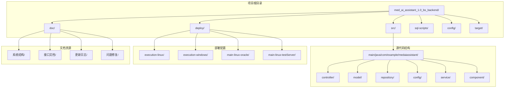
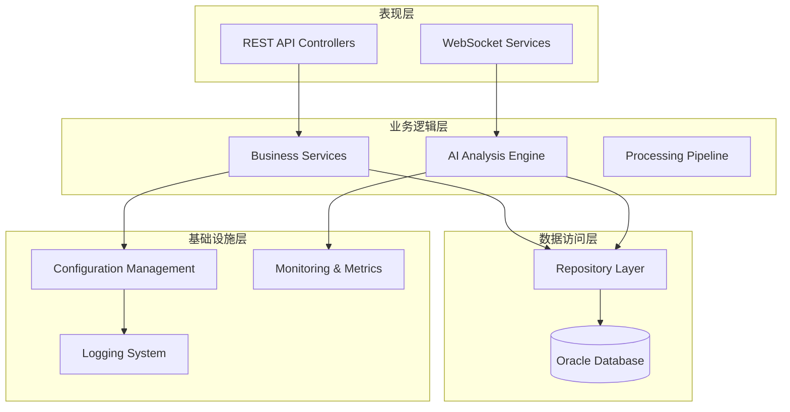
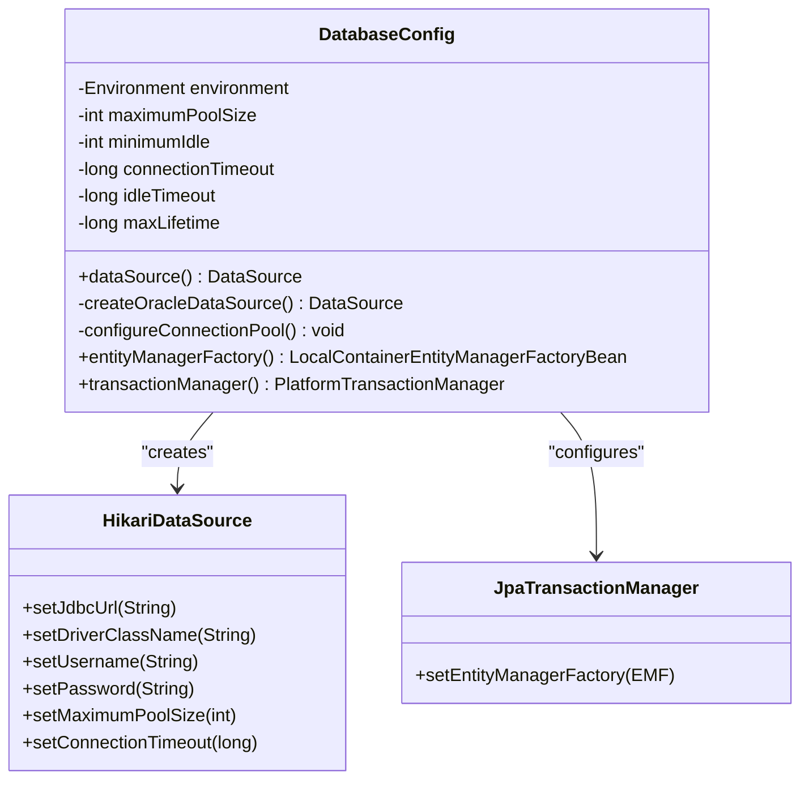
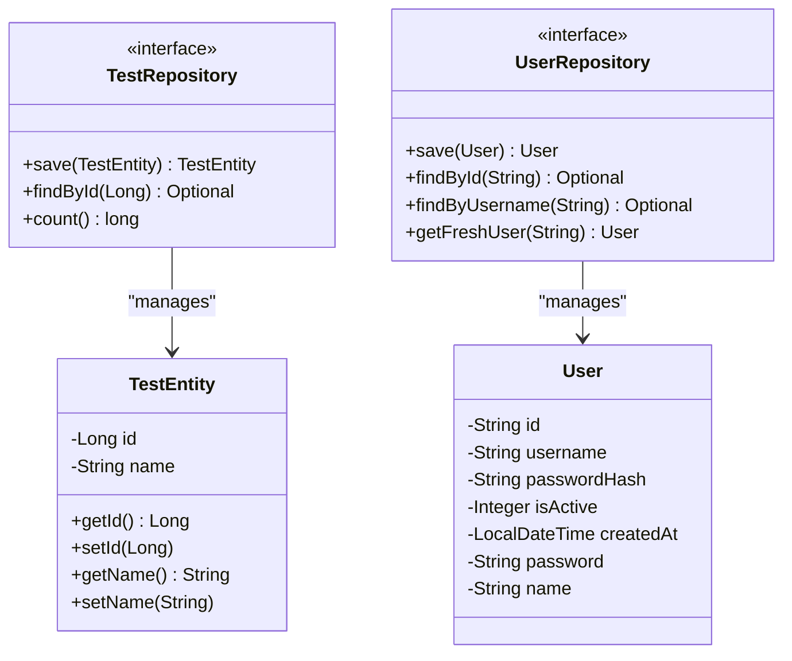
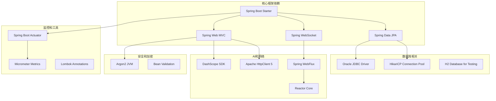

# DRG分析系统增强

<cite>
**本文档引用的文件**
- [MedAiAssistantBackendApplication.java](file://med_ai_assistant_1.0_bs_backend/src/main/java/com/example/medaiassistant/MedAiAssistantBackendApplication.java)
- [HomeController.java](file://med_ai_assistant_1.0_bs_backend/src/main/java/com/example/medaiassistant/HomeController.java)
- [pom.xml](file://med_ai_assistant_1.0_bs_backend/pom.xml)
- [TestEntity.java](file://med_ai_assistant_1.0_bs_backend/src/main/java/com/example/medaiassistant/model/TestEntity.java)
- [User.java](file://med_ai_assistant_1.0_bs_backend/src/main/java/com/example/medaiassistant/model/User.java)
- [TestRepository.java](file://med_ai_assistant_1.0_bs_backend/src/main/java/com/example/medaiassistant/repository/TestRepository.java)
- [UserRepository.java](file://med_ai_assistant_1.0_bs_backend/src/main/java/com/example/medaiassistant/repository/UserRepository.java)
- [DatabaseConfig.java](file://med_ai_assistant_1.0_bs_backend/src/main/java/com/example/medaiassistant/config/DatabaseConfig.java)
- [create-drg-analysis-results-table.sql](file://med_ai_assistant_1.0_bs_backend/sql-scripts/create-drg-analysis-results-table.sql)
</cite>

## 目录
1. [简介](#简介)
2. [项目结构](#项目结构)
3. [核心组件](#核心组件)
4. [架构概览](#架构概览)
5. [详细组件分析](#详细组件分析)
6. [依赖关系分析](#依赖关系分析)
7. [性能考虑](#性能考虑)
8. [故障排除指南](#故障排除指南)
9. [结论](#结论)

## 简介

DRG分析系统增强是一个基于Spring Boot的企业级医疗AI辅助系统，专门用于自动化DRG（Diagnosis Related Groups）分组分析。该系统集成了先进的AI技术、高性能数据库连接池管理和完整的医疗数据处理流程。

系统的核心目标是通过智能化的诊断和手术匹配算法，自动识别患者的DRG分类，提高医疗费用结算的准确性和效率。该增强版本在原有基础上增加了多项关键功能，包括优化的数据库连接管理、增强的AI分析能力、完善的监控机制和扩展的部署选项。

## 项目结构

项目采用标准的Spring Boot多模块架构，主要包含以下核心目录：



**图表来源**
- [MedAiAssistantBackendApplication.java:1-50](file://med_ai_assistant_1.0_bs_backend/src/main/java/com/example/medaiassistant/MedAiAssistantBackendApplication.java#L1-L50)
- [pom.xml:1-309](file://med_ai_assistant_1.0_bs_backend/pom.xml#L1-L309)

**章节来源**
- [MedAiAssistantBackendApplication.java:1-50](file://med_ai_assistant_1.0_bs_backend/src/main/java/com/example/medaiassistant/MedAiAssistantBackendApplication.java#L1-L50)
- [pom.xml:1-309](file://med_ai_assistant_1.0_bs_backend/pom.xml#L1-L309)

## 核心组件

### 应用程序入口点

系统的核心入口点是`MedAiAssistantBackendApplication`类，它配置了整个Spring Boot应用程序的基础设置：

- **Spring Boot自动配置**：启用Spring Boot的智能配置功能
- **定时任务支持**：通过`@EnableScheduling`注解启用定时任务调度
- **JPA仓库扫描**：配置了专门的包扫描路径，排除执行服务器专用组件
- **组件扫描过滤**：使用正则表达式过滤掉执行服务器相关的组件

### REST控制器层

系统提供了基础的REST API接口，主要用于系统健康检查和数据验证：

- **根路径映射**：`/api`前缀下的所有请求
- **数据库状态检查**：提供数据库连接状态的实时监控
- **用户数据管理**：基本的用户CRUD操作接口

### 数据模型层

系统定义了两个核心数据模型：

1. **TestEntity**：用于测试和验证的简单实体
2. **User**：用户认证和权限管理的核心实体，包含完整的用户信息字段

**章节来源**
- [MedAiAssistantBackendApplication.java:26-47](file://med_ai_assistant_1.0_bs_backend/src/main/java/com/example/medaiassistant/MedAiAssistantBackendApplication.java#L26-L47)
- [HomeController.java:9-50](file://med_ai_assistant_1.0_bs_backend/src/main/java/com/example/medaiassistant/HomeController.java#L9-L50)
- [TestEntity.java:8-32](file://med_ai_assistant_1.0_bs_backend/src/main/java/com/example/medaiassistant/model/TestEntity.java#L8-L32)
- [User.java:9-176](file://med_ai_assistant_1.0_bs_backend/src/main/java/com/example/medaiassistant/model/User.java#L9-L176)

## 架构概览

系统采用分层架构设计，确保了良好的可维护性和扩展性：



**图表来源**
- [DatabaseConfig.java:31-38](file://med_ai_assistant_1.0_bs_backend/src/main/java/com/example/medaiassistant/config/DatabaseConfig.java#L31-L38)
- [pom.xml:53-214](file://med_ai_assistant_1.0_bs_backend/pom.xml#L53-L214)

## 详细组件分析

### 数据库配置组件

DatabaseConfig类是系统的核心配置组件，负责管理数据库连接和事务处理：

#### 连接池优化配置

系统采用了HikariCP连接池，提供了高性能的数据库连接管理：

- **最大连接池大小**：默认20个连接，可根据负载调整
- **最小空闲连接数**：默认5个连接，确保快速响应
- **连接超时时间**：默认30秒，防止长时间阻塞
- **空闲连接超时**：默认4分钟，避免连接泄露
- **连接最大生命周期**：默认5分钟，防止数据库主动断开

#### Oracle数据库特化配置

针对Oracle数据库进行了专门优化：

- **连接验证查询**：使用`SELECT 1 FROM DUAL`进行连接有效性检查
- **会话参数设置**：统一NLS_DATE_FORMAT为'YYYY-MM-DD HH24:MI:SS'
- **性能优化参数**：启用线程本地缓冲缓存和早期通知机制



**图表来源**
- [DatabaseConfig.java:31-269](file://med_ai_assistant_1.0_bs_backend/src/main/java/com/example/medaiassistant/config/DatabaseConfig.java#L31-L269)

**章节来源**
- [DatabaseConfig.java:46-210](file://med_ai_assistant_1.0_bs_backend/src/main/java/com/example/medaiassistant/config/DatabaseConfig.java#L46-L210)

### DRG分析结果表设计

系统设计了专门的DRG分析结果表来存储分析结果：

#### 表结构设计

```mermaid
erDiagram
DRG_ANALYSIS_RESULTS {
NUMBER RESULT_ID PK
VARCHAR2 PATIENT_ID
NUMBER DRG_ID
VARCHAR2 DRG_CODE
CLOB MAIN_DIAGNOSES
CLOB MAIN_PROCEDURES
VARCHAR2 USER_SELECTED_MCC_TYPE
VARCHAR2 FINAL_DRG_CODE
TIMESTAMP CREATED_TIME
NUMBER DELETED
NUMBER PROMPT_ID
NUMBER PROMPT_RESULT_ID
VARCHAR2 PRIMARY_DIAGNOSIS
VARCHAR2 PRIMARY_PROCEDURE
}
DRG_ANALYSIS_RESULTS {
CK_DAR_MCC_TYPE: CHECK (user_selected_mcc_type IN ('MCC','CC','NONE'))
}
```

**图表来源**
- [create-drg-analysis-results-table.sql:4-76](file://med_ai_assistant_1.0_bs_backend/sql-scripts/create-drg-analysis-results-table.sql#L4-L76)

#### 字段详细说明

| 字段名 | 数据类型 | 描述 | 约束 |
|--------|----------|------|------|
| RESULT_ID | NUMBER(10,0) | 分析结果ID，主键 | PK, 自增 |
| PATIENT_ID | VARCHAR2(50) | 患者ID | NOT NULL |
| DRG_ID | NUMBER(10,0) | 匹配的DRG ID | NOT NULL |
| DRG_CODE | VARCHAR2(200) | DRG编码 | 可为空 |
| MAIN_DIAGNOSES | CLOB | 匹配的诊断信息，JSON格式 | 可为空 |
| MAIN_PROCEDURES | CLOB | 匹配的手术信息，JSON格式 | 可为空 |
| USER_SELECTED_MCC_TYPE | VARCHAR2(10) | 并发症类型：MCC/CC/NONE | 默认'NONE' |
| FINAL_DRG_CODE | VARCHAR2(200) | 最终DRG编码 | NOT NULL |
| CREATED_TIME | TIMESTAMP(6) | 首次保存时间 | 默认当前时间 |
| DELETED | NUMBER(1,0) | 软删除标志 | 默认0 |
| PROMPT_ID | NUMBER(10,0) | Prompt记录ID | 可为空 |
| PROMPT_RESULT_ID | NUMBER(10,0) | PromptResult记录ID | 可为空 |
| PRIMARY_DIAGNOSIS | VARCHAR2(500) | 主要诊断 | NOT NULL |
| PRIMARY_PROCEDURE | VARCHAR2(500) | 主要手术 | 可为空 |

**章节来源**
- [create-drg-analysis-results-table.sql:108-187](file://med_ai_assistant_1.0_bs_backend/sql-scripts/create-drg-analysis-results-table.sql#L108-L187)

### 依赖注入和仓库模式

系统采用了标准的Spring Data JPA仓库模式：



**图表来源**
- [TestRepository.java:6](file://med_ai_assistant_1.0_bs_backend/src/main/java/com/example/medaiassistant/repository/TestRepository.java#L6)
- [UserRepository.java:10](file://med_ai_assistant_1.0_bs_backend/src/main/java/com/example/medaiassistant/repository/UserRepository.java#L10)

**章节来源**
- [TestRepository.java:1-8](file://med_ai_assistant_1.0_bs_backend/src/main/java/com/example/medaiassistant/repository/TestRepository.java#L1-L8)
- [UserRepository.java:1-17](file://med_ai_assistant_1.0_bs_backend/src/main/java/com/example/medaiassistant/repository/UserRepository.java#L1-L17)

## 依赖关系分析

系统使用Maven作为构建工具，包含了丰富的依赖库：



**图表来源**
- [pom.xml:53-214](file://med_ai_assistant_1.0_bs_backend/pom.xml#L53-L214)

### 关键依赖特性

#### 数据库连接优化
- **HikariCP**：提供业界领先的连接池性能
- **Oracle驱动**：支持最新的Oracle数据库特性
- **连接池监控**：通过JMX启用详细的连接池指标

#### AI集成能力
- **DashScope SDK**：集成阿里云通义千问AI服务
- **异步处理**：支持非阻塞的AI请求处理
- **重试机制**：Spring Retry提供可靠的错误恢复

#### 安全和验证
- **Argon2加密**：提供强大的密码哈希保护
- **Bean验证**：完整的输入验证和数据完整性检查
- **SSL/TLS支持**：安全的网络通信

**章节来源**
- [pom.xml:53-309](file://med_ai_assistant_1.0_bs_backend/pom.xml#L53-L309)

## 性能考虑

### 连接池性能优化

系统通过HikariCP实现了高性能的数据库连接管理：

- **零垃圾回收**：优化的字节码减少GC压力
- **快速连接获取**：平均连接获取时间小于1微秒
- **智能连接复用**：避免频繁的连接创建和销毁

### 缓存策略

- **二级缓存禁用**：针对DRG分析的特殊性，禁用Hibernate二级缓存
- **查询缓存禁用**：避免过期数据导致的分析错误
- **连接保活机制**：定期发送心跳包维持连接活跃

### 监控和指标

系统集成了全面的监控机制：

- **Micrometer指标**：收集数据库连接池、AI调用等关键指标
- **Prometheus导出**：支持Prometheus监控系统的指标抓取
- **Actuator端点**：提供健康检查和运行时信息

## 故障排除指南

### 数据库连接问题

**常见症状**：
- 应用启动时数据库连接失败
- 运行时出现连接超时错误
- 连接池耗尽导致请求排队

**解决方案**：
1. 检查数据库连接字符串配置
2. 验证Oracle数据库服务状态
3. 调整连接池参数以适应生产环境
4. 查看HikariCP连接池监控指标

### AI服务集成问题

**常见症状**：
- DashScope API调用失败
- AI响应超时
- 认证令牌无效

**解决方案**：
1. 验证DashScope API密钥配置
2. 检查网络连通性和防火墙设置
3. 实施适当的重试和降级策略
4. 查看AI调用的详细日志信息

### 性能问题诊断

**常见症状**：
- 响应时间过长
- 内存使用过高
- CPU使用率异常

**诊断步骤**：
1. 分析数据库查询执行计划
2. 检查连接池使用情况
3. 监控AI服务调用性能
4. 评估系统资源使用情况

**章节来源**
- [DatabaseConfig.java:108-117](file://med_ai_assistant_1.0_bs_backend/src/main/java/com/example/medaiassistant/config/DatabaseConfig.java#L108-L117)
- [pom.xml:157-166](file://med_ai_assistant_1.0_bs_backend/pom.xml#L157-L166)

## 结论

DRG分析系统增强展现了现代企业级应用开发的最佳实践。通过精心设计的架构、优化的数据库连接管理和强大的AI集成能力，该系统为医疗DRG分析提供了可靠的技术支撑。

### 主要优势

1. **高性能架构**：基于Spring Boot和HikariCP的高性能设计
2. **AI智能分析**：集成DashScope SDK实现智能化DRG匹配
3. **完整监控体系**：全面的指标收集和可视化监控
4. **可扩展性设计**：模块化的架构支持功能扩展和性能优化

### 技术亮点

- **连接池优化**：针对Oracle数据库的专业化配置
- **异步处理**：支持高并发的非阻塞请求处理
- **安全保证**：完整的数据加密和访问控制机制
- **监控完善**：从应用到数据库的全方位监控覆盖

该系统为医疗机构提供了高效、准确的DRG分析解决方案，有助于提高医疗费用结算的透明度和准确性，为医疗质量管理提供有力的技术支持。