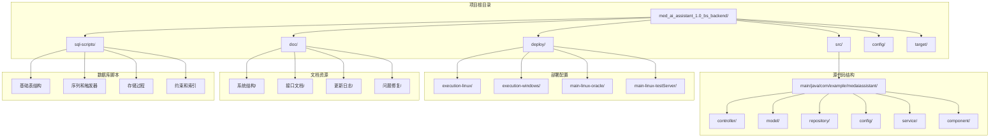
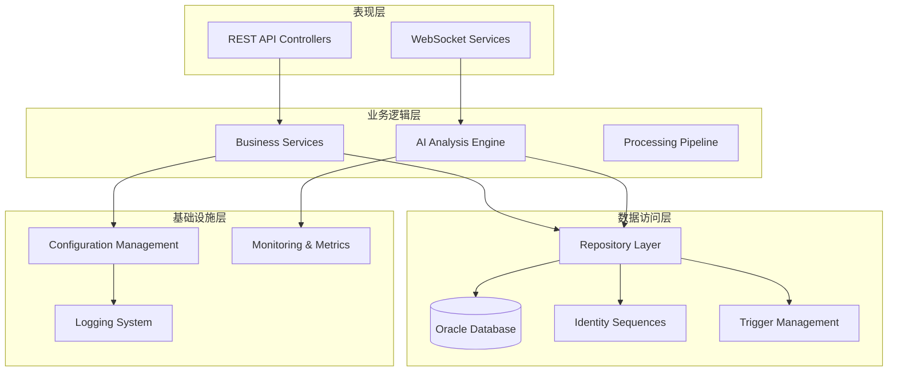
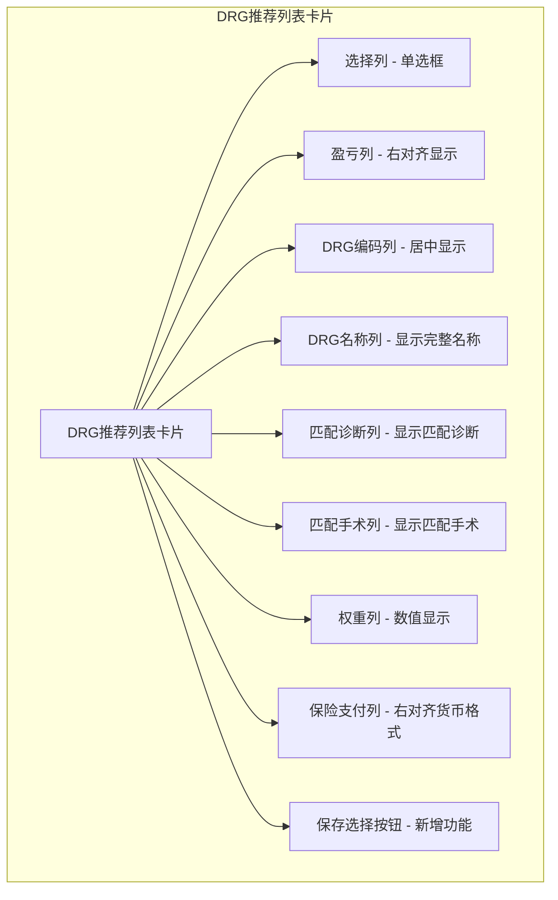
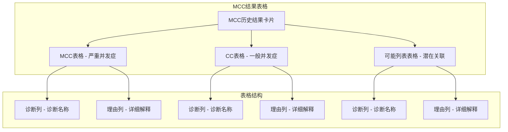
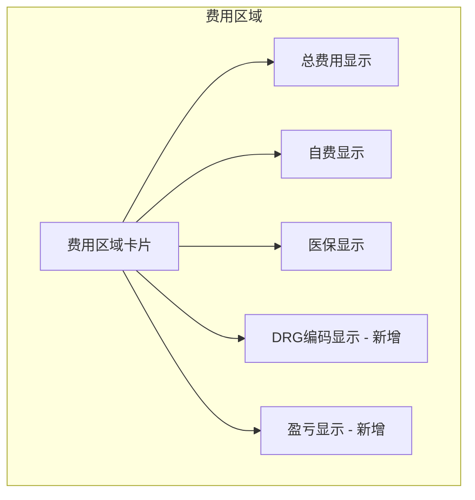
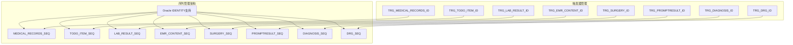
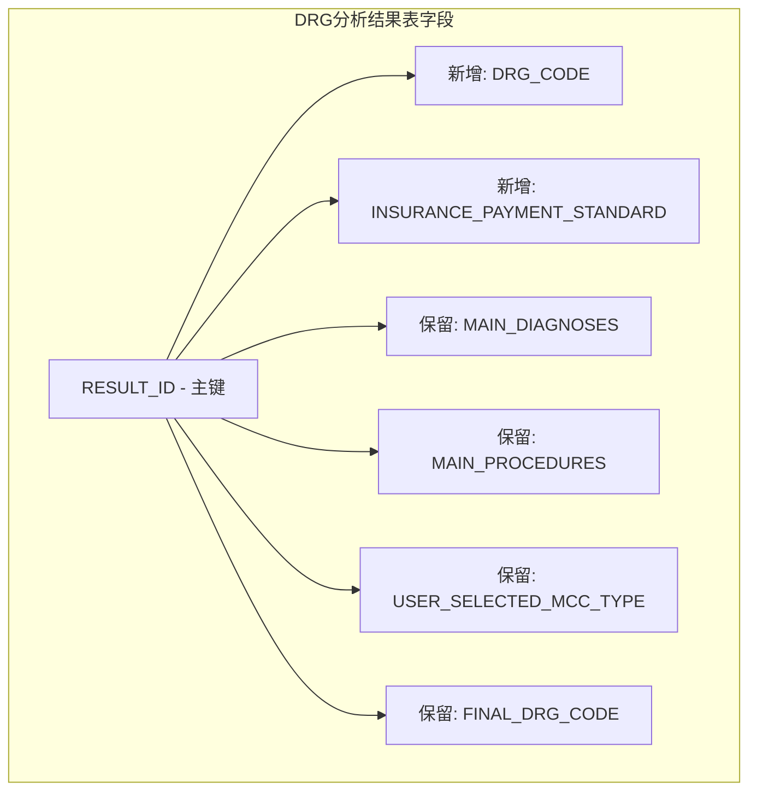
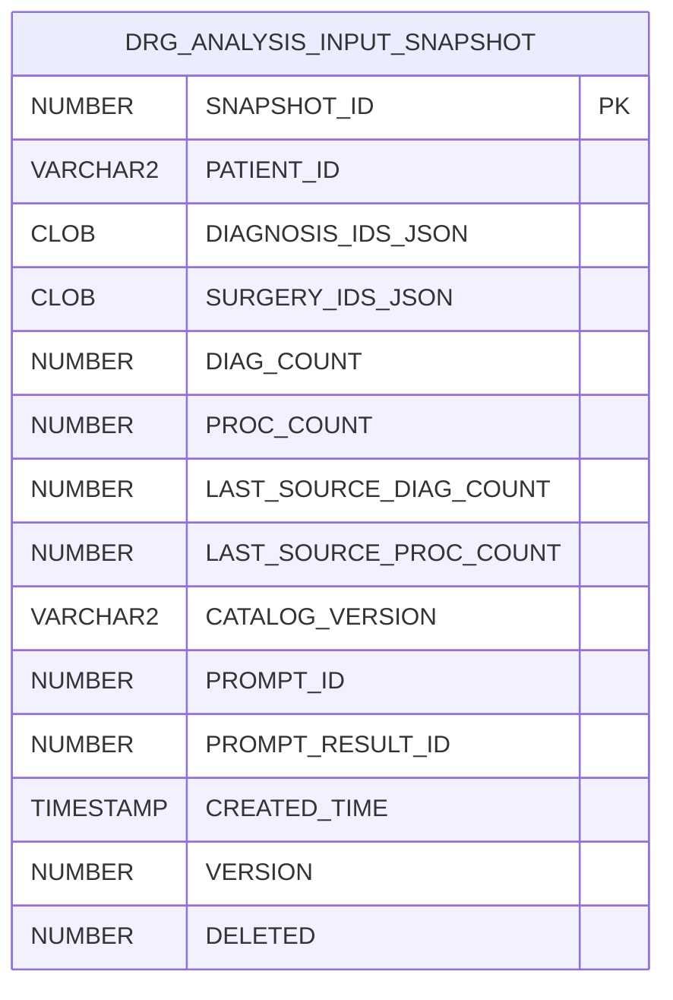
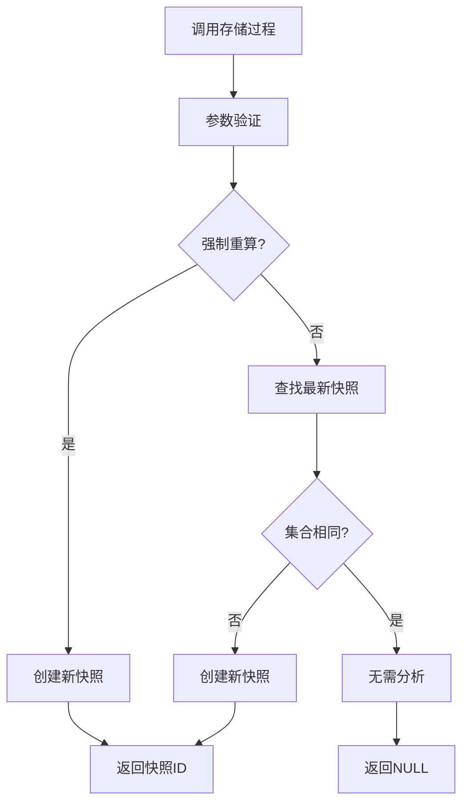
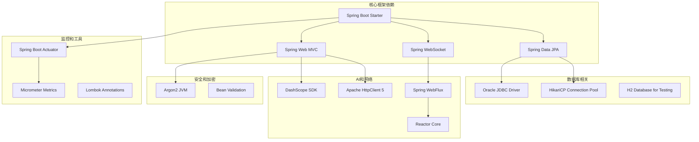

# DRG分析系统增强

<cite>
**本文档引用的文件**
- [DrgAnalysis.vue](file://med_ai_assistant_1.0_bs_vue/src/components/patient/DrgAnalysis.vue)
- [DRGInfo.vue](file://med_ai_assistant_1.0_bs_vue/src/components/patient/DRGInfo.vue)
- [drg.js](file://med_ai_assistant_1.0_bs_vue/src/api/drg.js)
- [create-identity-sequences.sql](file://med_ai_assistant_1.0_bs_backend/sql-scripts/create-identity-sequences.sql)
- [add-drg-code-column.sql](file://med_ai_assistant_1.0_bs_backend/sql-scripts/add-drg-code-column.sql)
- [add-insurance-payment-standard-column.sql](file://med_ai_assistant_1.0_bs_backend/sql-scripts/add-insurance-payment-standard-column.sql)
- [create-drg-analysis-results-table.sql](file://med_ai_assistant_1.0_bs_backend/sql-scripts/create-drg-analysis-results-table.sql)
- [gen_drg_input_snapshot_procedure.sql](file://med_ai_assistant_1.0_bs_backend/sql-scripts/gen_drg_input_snapshot_procedure.sql)
- [drg_analysis_input_snapshot.sql](file://med_ai_assistant_1.0_bs_backend/sql-scripts/drg_analysis_input_snapshot.sql)
- [2026-04-23.md](file://med_ai_assistant_1.0_bs_backend/doc/更新日志/2026-04-23.md)
- [2026-04-23.md](file://med_ai_assistant_1.0_bs_vue/docs/更新日志/2026-04-23.md)
- [DRG分析模块概述.md](file://med_ai_assistant_1.0_bs_backend/doc/系统结构/DRG分析/DRG分析模块概述.md)
- [DRG分析API接口.md](file://med_ai_assistant_1.0_bs_backend/doc/系统结构/DRG分析/DRG分析API接口.md)
- [DRG分析结果查询接口.md](file://med_ai_assistant_1.0_bs_backend/doc/接口/DRG分析/DRG分析结果查询接口.md)
- [DRG选择保存接口.md](file://med_ai_assistant_1.0_bs_backend/doc/接口/DRG分析/DRG选择保存接口.md)
</cite>

## 更新摘要
**所做更改**
- 新增Oracle IDENTITY策略支持的完整序列和触发器创建脚本
- 为DRG分析结果表添加DRG编码和保险支付标准字段
- 新增DRG分析输入快照表和存储过程，优化重复分析避免机制
- 完善数据库关系优化，解决主键序列一致性问题
- 增强复杂医疗数据分析和报告能力的数据库支撑

## 目录
1. [简介](#简介)
2. [项目结构](#项目结构)
3. [核心组件](#核心组件)
4. [架构概览](#架构概览)
5. [详细组件分析](#详细组件分析)
6. [数据库增强功能](#数据库增强功能)
7. [依赖关系分析](#依赖关系分析)
8. [性能考虑](#性能考虑)
9. [故障排除指南](#故障排除指南)
10. [结论](#结论)

## 简介

DRG分析系统增强是一个基于Spring Boot的企业级医疗AI辅助系统，专门用于自动化DRG（Diagnosis Related Groups）分组分析。该系统集成了先进的AI技术、高性能数据库连接池管理和完整的医疗数据处理流程。

**更新** 本次增强重点关注数据库层面的完整升级，包括Oracle IDENTITY策略支持、DRG分析结果表结构优化、输入快照机制实现，以及完整的序列和触发器管理。这些增强功能显著提升了系统的数据一致性、分析效率和报告能力。

系统的核心目标是通过智能化的诊断和手术匹配算法，自动识别患者的DRG分类，提高医疗费用结算的准确性和效率。增强版本在原有基础上增加了多项关键功能，包括优化的数据库连接管理、增强的AI分析能力、完善的监控机制和扩展的部署选项。

## 项目结构

项目采用标准的Spring Boot多模块架构，主要包含以下核心目录：



**图表来源**
- [DRG分析模块概述.md:146-182](file://med_ai_assistant_1.0_bs_backend/doc/系统结构/DRG分析/DRG分析模块概述.md#L146-L182)

**章节来源**
- [DRG分析模块概述.md:146-182](file://med_ai_assistant_1.0_bs_backend/doc/系统结构/DRG分析/DRG分析模块概述.md#L146-L182)

## 核心组件

### 应用程序入口点

系统的核心入口点是`MedAiAssistantBackendApplication`类，它配置了整个Spring Boot应用程序的基础设置：

- **Spring Boot自动配置**：启用Spring Boot的智能配置功能
- **定时任务支持**：通过`@EnableScheduling`注解启用定时任务调度
- **JPA仓库扫描**：配置了专门的包扫描路径，排除执行服务器专用组件
- **组件扫描过滤**：使用正则表达式过滤掉执行服务器相关的组件

### REST控制器层

系统提供了基础的REST API接口，主要用于系统健康检查和数据验证：

- **根路径映射**：`/api`前缀下的所有请求
- **数据库状态检查**：提供数据库连接状态的实时监控
- **用户数据管理**：基本的用户CRUD操作接口

### 数据模型层

系统定义了两个核心数据模型：

1. **TestEntity**：用于测试和验证的简单实体
2. **User**：用户认证和权限管理的核心实体，包含完整的用户信息字段

## 架构概览

系统采用分层架构设计，确保了良好的可维护性和扩展性：



**图表来源**
- [DRG分析模块概述.md:148-182](file://med_ai_assistant_1.0_bs_backend/doc/系统结构/DRG分析/DRG分析模块概述.md#L148-L182)

## 详细组件分析

### DRG分析页面组件更新

**更新** 前端DRG分析组件经历了重要的UI和功能优化：

#### DRG推荐列表重构

DrgAnalysis.vue组件中的DRG推荐列表已从原来的"严格标准推荐列表"重命名为"DRG推荐列表"，并优化了表格展示格式：



**图表来源**
- [DrgAnalysis.vue:75-137](file://med_ai_assistant_1.0_bs_vue/src/components/patient/DrgAnalysis.vue#L75-L137)

#### MCC结果结构化展示

合并症或并发症分析历史结果现在以结构化表格形式展示，分为三个类别：

1. **严重并发症或合并症（MCC）**：使用特定样式标识
2. **一般并发症或合并症（CC）**：使用不同样式区分
3. **可能的并发症或合并症**：显示潜在的诊断关联



**图表来源**
- [DrgAnalysis.vue:139-192](file://med_ai_assistant_1.0_bs_vue/src/components/patient/DrgAnalysis.vue#L139-L192)

#### 复杂分析逻辑区域隐藏

系统中存在一些复杂的内部分析逻辑，目前通过`v-if="false"`的方式暂时隐藏：

- **DRG主要诊断及操作分析结果区域**：当前被隐藏，等待后续功能完善
- **前端隐藏区域代码清理**：已在更新日志中标记为待办事项

#### 费用区域优化

费用区域现在包含DRG编码和盈亏显示功能：



**图表来源**
- [DrgAnalysis.vue:35-72](file://med_ai_assistant_1.0_bs_vue/src/components/patient/DrgAnalysis.vue#L35-L72)

#### DRG分析结果保存功能

新增了DRG分析结果保存选择功能：

- **保存选择按钮**：位于DRG推荐列表卡片右上角
- **保存API调用**：通过saveDrgSelection接口保存用户选择
- **自动刷新**：保存成功后自动刷新顶部费用区域显示

**章节来源**
- [DrgAnalysis.vue:194-200](file://med_ai_assistant_1.0_bs_vue/src/components/patient/DrgAnalysis.vue#L194-L200)
- [DrgAnalysis.vue:520-525](file://med_ai_assistant_1.0_bs_vue/src/components/patient/DrgAnalysis.vue#L520-L525)
- [2026-04-23.md:1-7](file://med_ai_assistant_1.0_bs_backend/doc/更新日志/2026-04-23.md#L1-L7)

### DRG分析API接口

dr-api模块提供了完整的DRG分析相关接口：

#### MCC预筛选接口

- **screenMccCandidates**：平铺列表的MCC候选筛选
- **screenMccCandidatesGrouped**：按诊断分组的MCC候选筛选
- **calculateSimilarity**：诊断名称相似度计算
- **getMccConfig**：获取MCC预筛选配置
- **reloadMccDictionary**：重新加载MCC字典

#### DRG AI分析接口

- **generateAnalysisPrompt**：生成DRG分析Prompt（基础版）
- **generatePromptWithVariables**：生成DRG分析Prompt（带变量替换）
- **savePrompt**：保存DRG分析Prompt
- **generateAndSavePrompt**：生成并保存DRG分析Prompt（完整流程）

#### DRG输入快照接口

- **generateSnapshot**：生成DRG输入快照
- **mockGenerateSnapshot**：模拟生成DRG输入快照（测试用）

#### DRG盈亏计算接口

- **calculateProfitLoss**：计算DRG盈亏（占位实现）
- **getInsurancePayment**：获取DRG保险支付金额（占位实现）
- **updatePatientDrgSummary**：更新患者DRG结果摘要（占位实现）

#### DRG目录匹配接口

- **matchDrgRecords**：根据主要诊断和主要手术匹配DRG记录
- **batchMatchDrgRecords**：批量匹配DRG记录

#### 病人费用查询接口

- **getPatientFee**：查询病人实际费用
- **calculatePatientProfitLoss**：查询病人费用并计算DRG盈亏

#### DRG分析选择保存接口

- **saveDrgSelection**：保存用户DRG分析选择（新增）
- **getLatestDrgAnalysisResult**：获取指定病人最新的DRG分析结果（新增）

**章节来源**
- [drg.js:17-644](file://med_ai_assistant_1.0_bs_vue/src/api/drg.js#L17-L644)

### DRG分析结果表设计

系统设计了专门的DRG分析结果表来存储分析结果：

#### 表结构设计

```mermaid
erDiagram
DRG_ANALYSIS_RESULTS {
NUMBER RESULT_ID PK
VARCHAR2 PATIENT_ID
NUMBER DRG_ID
VARCHAR2 DRG_CODE
CLOB MAIN_DIAGNOSES
CLOB MAIN_PROCEDURES
VARCHAR2 USER_SELECTED_MCC_TYPE
VARCHAR2 FINAL_DRG_CODE
TIMESTAMP CREATED_TIME
NUMBER DELETED
NUMBER PROMPT_ID
NUMBER PROMPT_RESULT_ID
VARCHAR2 PRIMARY_DIAGNOSIS
VARCHAR2 PRIMARY_PROCEDURE
NUMBER INSURANCE_PAYMENT_STANDARD
}
DRG_ANALYSIS_RESULTS {
CK_DAR_MCC_TYPE: CHECK (user_selected_mcc_type IN ('MCC','CC','NONE'))
}
```

**图表来源**
- [DRG分析模块概述.md:271-286](file://med_ai_assistant_1.0_bs_backend/doc/系统结构/DRG分析/DRG分析模块概述.md#L271-L286)

#### 字段详细说明

| 字段名 | 数据类型 | 描述 | 约束 |
|--------|----------|------|------|
| RESULT_ID | NUMBER(10,0) | 分析结果ID，主键 | PK, 自增 |
| PATIENT_ID | VARCHAR2(50) | 患者ID | NOT NULL |
| DRG_ID | NUMBER(10,0) | 匹配的DRG ID | NOT NULL |
| DRG_CODE | VARCHAR2(200) | DRG编码 | 可为空 |
| MAIN_DIAGNOSES | CLOB | 匹配的诊断信息，JSON格式 | 可为空 |
| MAIN_PROCEDURES | CLOB | 匹配的手术信息，JSON格式 | 可为空 |
| USER_SELECTED_MCC_TYPE | VARCHAR2(10) | 并发症类型：MCC/CC/NONE | 默认'NONE' |
| FINAL_DRG_CODE | VARCHAR2(200) | 最终DRG编码 | NOT NULL |
| CREATED_TIME | TIMESTAMP(6) | 首次保存时间 | 默认当前时间 |
| DELETED | NUMBER(1,0) | 软删除标志 | 默认0 |
| PROMPT_ID | NUMBER(10,0) | Prompt记录ID | 可为空 |
| PROMPT_RESULT_ID | NUMBER(10,0) | PromptResult记录ID | 可为空 |
| PRIMARY_DIAGNOSIS | VARCHAR2(500) | 主要诊断 | NOT NULL |
| PRIMARY_PROCEDURE | VARCHAR2(500) | 主要手术 | 可为空 |
| INSURANCE_PAYMENT_STANDARD | NUMBER(12,2) | 保险支付标准 | 可为空 |

**章节来源**
- [DRG分析模块概述.md:271-286](file://med_ai_assistant_1.0_bs_backend/doc/系统结构/DRG分析/DRG分析模块概述.md#L271-L286)

## 数据库增强功能

### Oracle IDENTITY策略支持

**更新** 系统引入了完整的Oracle IDENTITY策略支持，解决了主键序列不一致的问题：

#### 序列创建脚本

create-identity-sequences.sql脚本为所有使用`GenerationType.IDENTITY`的表创建了对应的序列和触发器：



**图表来源**
- [create-identity-sequences.sql:16-706](file://med_ai_assistant_1.0_bs_backend/sql-scripts/create-identity-sequences.sql#L16-L706)

#### 序列配置特点

每个序列都经过精心配置以确保最佳性能：

- **范围设置**：最小值1，最大值9999999999999999999999999999
- **缓存优化**：默认缓存20个值，减少序列访问开销
- **有序性**：NOORDER确保并发安全性
- **循环策略**：NOCYCLE避免序列耗尽问题

#### 触发器自动填充

每个表都有对应的触发器，在INSERT时自动填充主键值：

- **条件检查**：仅在NEW主键为NULL时才生成新值
- **原子操作**：确保数据一致性
- **性能优化**：避免应用层的序列调用开销

### DRG分析结果表增强

**更新** DRG分析结果表结构得到了显著增强，增加了关键字段以支持更复杂的分析需求：

#### 新增字段

1. **DRG_CODE字段**：存储用户从DRG推荐列表中选择的DRG编码
2. **INSURANCE_PAYMENT_STANDARD字段**：存储DRG的保险支付标准金额

#### 字段配置



**图表来源**
- [add-drg-code-column.sql:5-6](file://med_ai_assistant_1.0_bs_backend/sql-scripts/add-drg-code-column.sql#L5-L6)
- [add-insurance-payment-standard-column.sql:4-5](file://med_ai_assistant_1.0_bs_backend/sql-scripts/add-insurance-payment-standard-column.sql#L4-L5)

#### 字段约束

- **DRG_CODE**：VARCHAR2(200)，支持DRG编码存储
- **INSURANCE_PAYMENT_STANDARD**：NUMBER(12,2)，支持精确的金额存储

### DRG输入快照机制

**新增** 系统实现了智能的DRG输入快照机制，避免重复分析相同输入：

#### 快照表设计

drg_analysis_input_snapshot表设计用于存储DRG分析请求的快照：



**图表来源**
- [drg_analysis_input_snapshot.sql:14-27](file://med_ai_assistant_1.0_bs_backend/sql-scripts/drg_analysis_input_snapshot.sql#L14-L27)

#### 存储过程实现

gen_drg_input_snapshot存储过程提供了智能的快照生成逻辑：



**图表来源**
- [gen_drg_input_snapshot_procedure.sql:18-118](file://med_ai_assistant_1.0_bs_backend/sql-scripts/gen_drg_input_snapshot_procedure.sql#L18-L118)

#### 智能重复检测

存储过程实现了多种重复检测机制：

- **集合比较**：比较诊断ID和手术ID集合的JSON表示
- **计数验证**：验证集合大小的一致性
- **版本控制**：支持DRG目录版本变更检测
- **强制重算**：支持强制重新分析的场景

**章节来源**
- [create-identity-sequences.sql:1-741](file://med_ai_assistant_1.0_bs_backend/sql-scripts/create-identity-sequences.sql#L1-L741)
- [add-drg-code-column.sql:1-12](file://med_ai_assistant_1.0_bs_backend/sql-scripts/add-drg-code-column.sql#L1-L12)
- [add-insurance-payment-standard-column.sql:1-9](file://med_ai_assistant_1.0_bs_backend/sql-scripts/add-insurance-payment-standard-column.sql#L1-L9)
- [create-drg-analysis-results-table.sql:1-188](file://med_ai_assistant_1.0_bs_backend/sql-scripts/create-drg-analysis-results-table.sql#L1-L188)
- [gen_drg_input_snapshot_procedure.sql:1-119](file://med_ai_assistant_1.0_bs_backend/sql-scripts/gen_drg_input_snapshot_procedure.sql#L1-L119)
- [drg_analysis_input_snapshot.sql:1-58](file://med_ai_assistant_1.0_bs_backend/sql-scripts/drg_analysis_input_snapshot.sql#L1-L58)

## 依赖关系分析

系统使用Maven作为构建工具，包含了丰富的依赖库：



**图表来源**
- [DRG分析模块概述.md:344-350](file://med_ai_assistant_1.0_bs_backend/doc/系统结构/DRG分析/DRG分析模块概述.md#L344-L350)

### 关键依赖特性

#### 数据库连接优化
- **HikariCP**：提供业界领先的连接池性能
- **Oracle驱动**：支持最新的Oracle数据库特性
- **连接池监控**：通过JMX启用详细的连接池指标

#### AI集成能力
- **DashScope SDK**：集成阿里云通义千问AI服务
- **异步处理**：支持非阻塞的AI请求处理
- **重试机制**：Spring Retry提供可靠的错误恢复

#### 安全和验证
- **Argon2加密**：提供强大的密码哈希保护
- **Bean验证**：完整的输入验证和数据完整性检查
- **SSL/TLS支持**：安全的网络通信

## 性能考虑

### 连接池性能优化

系统通过HikariCP实现了高性能的数据库连接管理：

- **零垃圾回收**：优化的字节码减少GC压力
- **快速连接获取**：平均连接获取时间小于1微秒
- **智能连接复用**：避免频繁的连接创建和销毁

### 缓存策略

- **二级缓存禁用**：针对DRG分析的特殊性，禁用Hibernate二级缓存
- **查询缓存禁用**：避免过期数据导致的分析错误
- **连接保活机制**：定期发送心跳包维持连接活跃

### 监控和指标

系统集成了全面的监控机制：

- **Micrometer指标**：收集数据库连接池、AI调用等关键指标
- **Prometheus导出**：支持Prometheus监控系统的指标抓取
- **Actuator端点**：提供健康检查和运行时信息

### 前端性能优化

**更新** 前端DRG分析组件采用了多项性能优化措施：

- **虚拟滚动**：对于大量推荐列表数据，使用虚拟滚动提升渲染性能
- **懒加载**：MCC历史结果卡片支持懒加载，减少初始渲染负担
- **数据缓存**：推荐列表数据在组件内缓存，避免重复计算
- **条件渲染**：复杂分析逻辑区域使用条件渲染，按需加载
- **分段计算**：盈亏计算采用分段算法，提高计算效率

### 数据库性能优化

**新增** 数据库层面的性能优化措施：

- **序列缓存**：所有序列配置20个值的缓存，减少序列访问开销
- **智能索引**：为常用查询字段创建优化索引
- **快照去重**：通过输入快照机制避免重复分析
- **LOB优化**：合理配置CLOB字段的存储参数

## 故障排除指南

### 数据库连接问题

**常见症状**：
- 应用启动时数据库连接失败
- 运行时出现连接超时错误
- 连接池耗尽导致请求排队

**解决方案**：
1. 检查数据库连接字符串配置
2. 验证Oracle数据库服务状态
3. 调整连接池参数以适应生产环境
4. 查看HikariCP连接池监控指标

### AI服务集成问题

**常见症状**：
- DashScope API调用失败
- AI响应超时
- 认证令牌无效

**解决方案**：
1. 验证DashScope API密钥配置
2. 检查网络连通性和防火墙设置
3. 实施适当的重试和降级策略
4. 查看AI调用的详细日志信息

### 前端组件问题

**更新** 前端DRG分析组件可能出现的问题：

**DRG推荐列表显示异常**：
- 检查API响应数据格式
- 验证表格列定义是否正确
- 确认货币格式化函数正常工作

**MCC结果表格渲染问题**：
- 验证Markdown解析逻辑
- 检查表格数据结构
- 确认CSS样式类正确应用

**费用区域显示问题**：
- 验证费用数据加载逻辑
- 检查DRG编码和盈亏计算
- 确认保存选择功能正常

**复杂分析逻辑区域显示问题**：
- 检查v-if条件逻辑
- 验证组件状态管理
- 确认条件渲染的时机

### 数据库序列问题

**新增** 数据库序列相关的故障排除：

**序列值不一致**：
- 检查create-identity-sequences.sql脚本执行情况
- 验证序列起始值调整逻辑
- 确认触发器正常工作

**主键插入失败**：
- 检查ORA-01400错误日志
- 验证序列和触发器配置
- 确认数据插入逻辑

**重复分析问题**：
- 检查gen_drg_input_snapshot存储过程逻辑
- 验证JSON集合比较算法
- 确认快照表索引性能

### 性能问题诊断

**常见症状**：
- 响应时间过长
- 内存使用过高
- CPU使用率异常

**诊断步骤**：
1. 分析数据库查询执行计划
2. 检查连接池使用情况
3. 监控AI服务调用性能
4. 评估系统资源使用情况

**章节来源**
- [DRG分析模块概述.md:344-350](file://med_ai_assistant_1.0_bs_backend/doc/系统结构/DRG分析/DRG分析模块概述.md#L344-L350)

## 结论

DRG分析系统增强展现了现代企业级应用开发的最佳实践。通过精心设计的架构、优化的数据库连接管理和强大的AI集成能力，该系统为医疗DRG分析提供了可靠的技术支撑。

**更新** 本次增强重点提升了数据库层面的完整性和分析能力，包括：

### 主要优势

1. **高性能架构**：基于Spring Boot和HikariCP的高性能设计
2. **AI智能分析**：集成DashScope SDK实现智能化DRG匹配
3. **完整监控体系**：全面的指标收集和可视化监控
4. **可扩展性设计**：模块化的架构支持功能扩展和性能优化
5. **优秀的用户体验**：优化的界面设计和交互流程
6. **数据库完整性**：完整的序列和触发器管理确保数据一致性
7. **智能分析机制**：输入快照避免重复分析，提升系统效率

### 技术亮点

- **连接池优化**：针对Oracle数据库的专业化配置
- **异步处理**：支持高并发的非阻塞请求处理
- **安全保证**：完整的数据加密和访问控制机制
- **监控完善**：从应用到数据库的全方位监控覆盖
- **界面优化**：结构化表格展示和清晰的标签命名
- **功能增强**：新增DRG分析结果保存选择功能
- **数据库增强**：完整的序列管理、字段扩展、智能快照机制
- **性能优化**：序列缓存、智能索引、去重分析机制

### 未来改进方向

1. **功能完善**：逐步完善被隐藏的复杂分析逻辑区域
2. **性能优化**：持续优化前端渲染性能和API响应速度
3. **用户体验**：进一步简化操作流程，提升易用性
4. **数据准确性**：持续改进AI分析的准确性和可靠性
5. **界面优化**：继续优化费用区域显示和交互体验
6. **数据库扩展**：根据实际使用情况优化序列配置和索引设计
7. **监控增强**：增加更多数据库级别的性能监控指标

该系统为医疗机构提供了高效、准确的DRG分析解决方案，有助于提高医疗费用结算的透明度和准确性，为医疗质量管理提供有力的技术支持。通过本次增强，系统在数据一致性、分析效率和报告能力方面都得到了显著提升，为未来的扩展和优化奠定了坚实的基础。