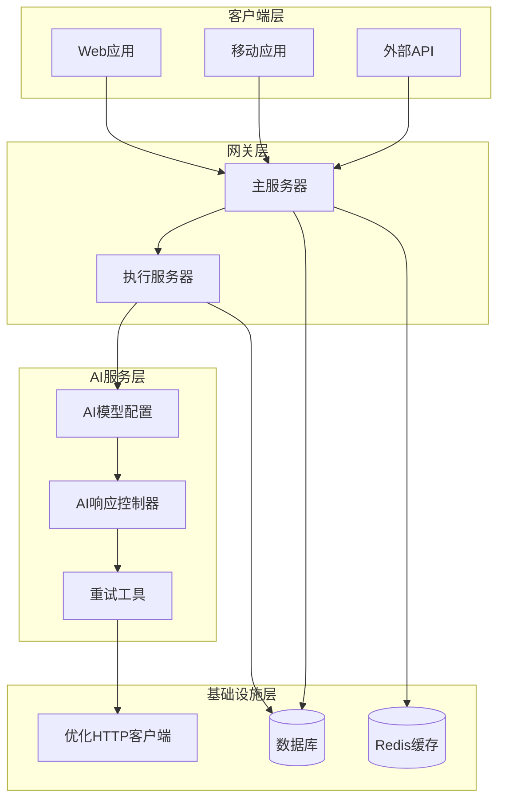
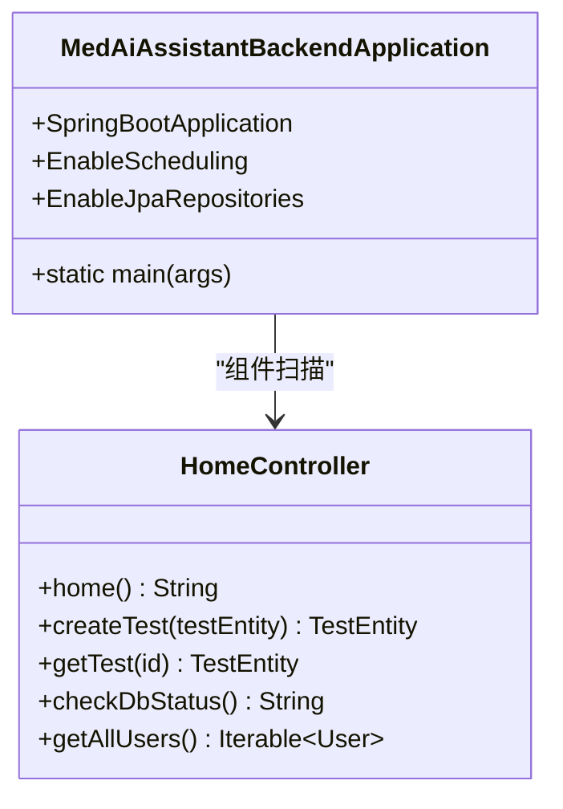
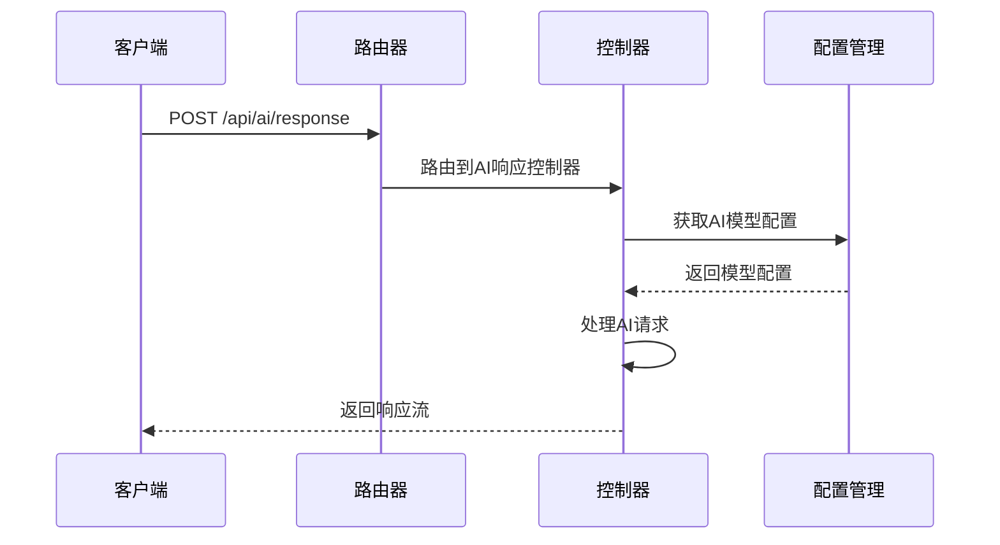
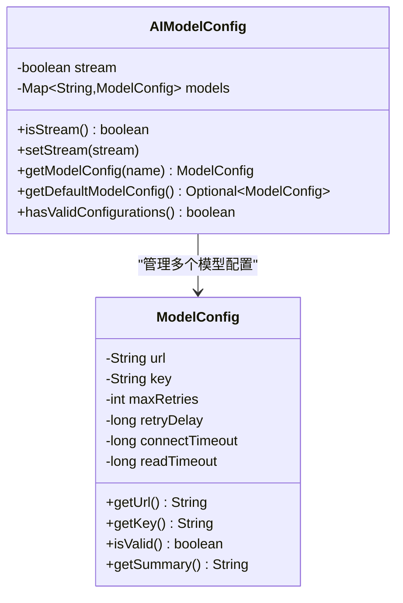
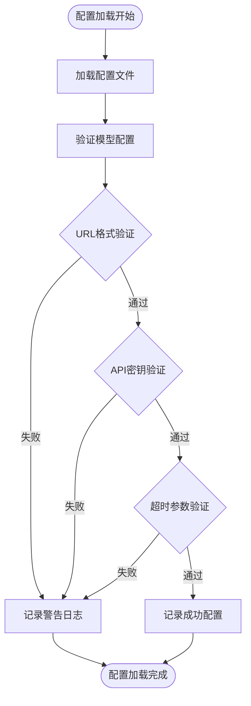
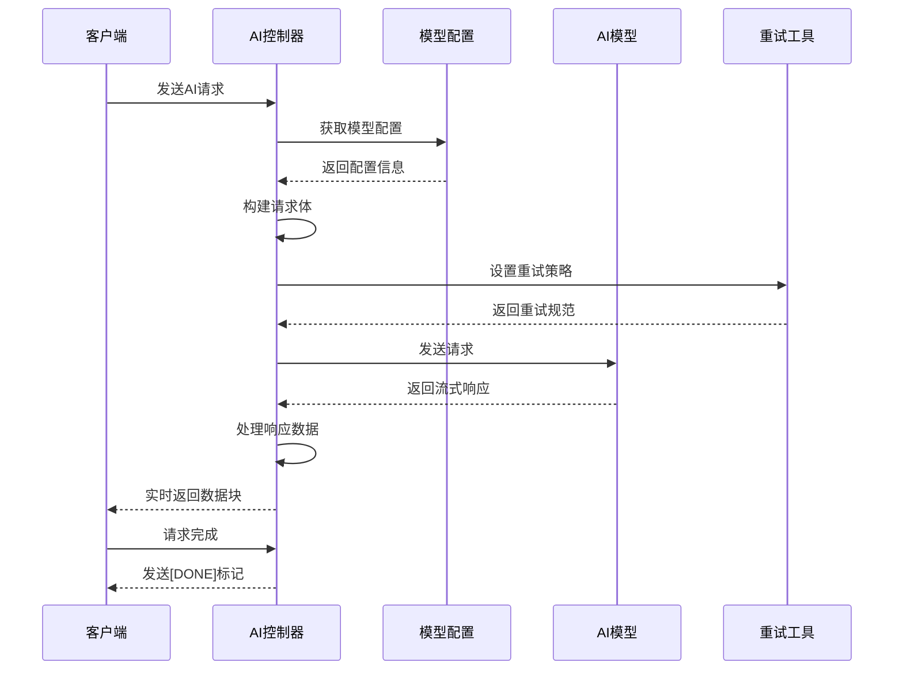
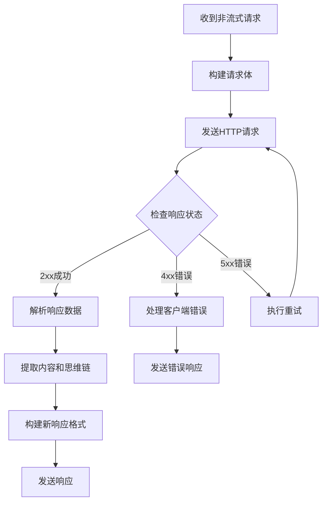
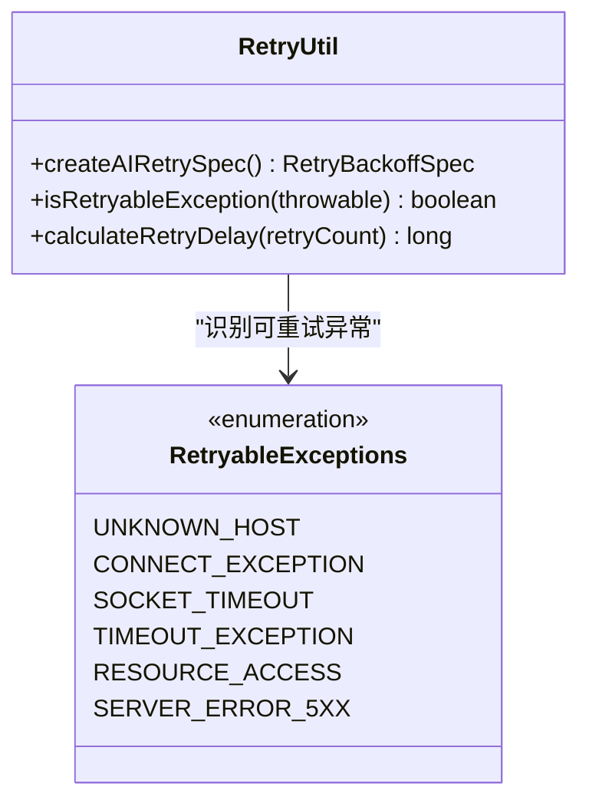
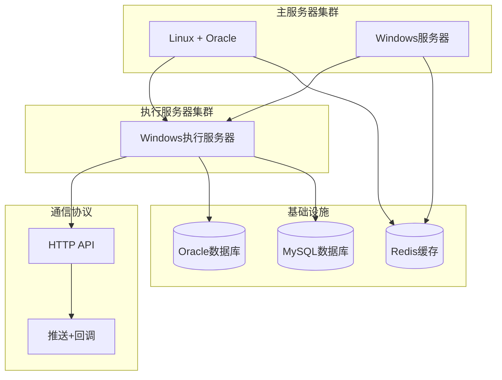

# DRG分析系统增强

<cite>
**本文档引用的文件**
- [MedAiAssistantBackendApplication.java](file://med_ai_assistant_1.0_bs_backend/src/main/java/com/example/medaiassistant/MedAiAssistantBackendApplication.java)
- [HomeController.java](file://med_ai_assistant_1.0_bs_backend/src/main/java/com/example/medaiassistant/HomeController.java)
- [AIModelConfig.java](file://med_ai_assistant_1.0_bs_backend/src/main/java/com/example/medaiassistant/config/AIModelConfig.java)
- [AIRouterConfig.java](file://med_ai_assistant_1.0_bs_backend/src/main/java/com/example/medaiassistant/config/AIRouterConfig.java)
- [AIResponseController.java](file://med_ai_assistant_1.0_bs_backend/src/main/java/com/example/medaiassistant/controller/AIResponseController.java)
- [RetryUtil.java](file://med_ai_assistant_1.0_bs_backend/src/main/java/com/example/medaiassistant/util/RetryUtil.java)
- [AIRequest.java](file://med_ai_assistant_1.0_bs_backend/src/main/java/com/example/medaiassistant/dto/AIRequest.java)
- [README.md](file://med_ai_assistant_1.0_bs_backend/deploy/README.md)
</cite>

## 目录
1. [项目概述](#项目概述)
2. [系统架构](#系统架构)
3. [核心组件分析](#核心组件分析)
4. [AI模型配置系统](#ai模型配置系统)
5. [响应式AI服务](#响应式ai服务)
6. [重试机制设计](#重试机制设计)
7. [部署架构](#部署架构)
8. [性能优化特性](#性能优化特性)
9. [故障排查指南](#故障排查指南)
10. [总结](#总结)

## 项目概述

DRG分析系统增强项目是一个基于Spring Boot的企业级医疗AI助手后端系统。该系统专门为DRG（Diagnosis Related Groups）分析场景提供智能化的医疗数据分析能力，集成了先进的AI模型调用、响应式编程和高可用性架构设计。

### 系统特性

- **多模型支持**：支持多种AI模型配置，包括DeepSeek等主流大语言模型
- **响应式编程**：采用WebFlux实现高并发的流式数据处理
- **智能重试机制**：内置指数退避和抖动算法，确保网络波动下的稳定性
- **分布式部署**：支持主服务器和执行服务器的分离部署架构
- **企业级安全**：完善的配置管理和安全防护机制

**章节来源**
- [MedAiAssistantBackendApplication.java:1-50](file://med_ai_assistant_1.0_bs_backend/src/main/java/com/example/medaiassistant/MedAiAssistantBackendApplication.java#L1-L50)
- [README.md:1-250](file://med_ai_assistant_1.0_bs_backend/deploy/README.md#L1-L250)

## 系统架构

系统采用分层架构设计，将AI服务调用、配置管理、响应式处理和安全控制有机结合。

**图表来源**
- [MedAiAssistantBackendApplication.java:26-37](file://med_ai_assistant_1.0_bs_backend/src/main/java/com/example/medaiassistant/MedAiAssistantBackendApplication.java#L26-L37)
- [AIResponseController.java:75-87](file://med_ai_assistant_1.0_bs_backend/src/main/java/com/example/medaiassistant/controller/AIResponseController.java#L75-L87)

### 核心架构组件

1. **主服务器**：处理用户请求、API网关、任务调度
2. **执行服务器**：执行AI模型调用、数据处理等耗时任务
3. **AI服务层**：提供智能的AI响应处理能力
4. **配置管理层**：统一管理AI模型配置和系统参数

**章节来源**
- [README.md:42-62](file://med_ai_assistant_1.0_bs_backend/deploy/README.md#L42-L62)

## 核心组件分析

### 应用程序入口

系统的核心入口点是`MedAiAssistantBackendApplication`类，它配置了Spring Boot应用程序的基础设置。

**图表来源**
- [MedAiAssistantBackendApplication.java:26-47](file://med_ai_assistant_1.0_bs_backend/src/main/java/com/example/medaiassistant/MedAiAssistantBackendApplication.java#L26-L47)
- [HomeController.java:9-50](file://med_ai_assistant_1.0_bs_backend/src/main/java/com/example/medaiassistant/HomeController.java#L9-L50)

### API路由配置

系统采用WebFlux框架实现响应式API路由，特别针对AI服务进行了优化配置。

**图表来源**
- [AIRouterConfig.java:24-34](file://med_ai_assistant_1.0_bs_backend/src/main/java/com/example/medaiassistant/config/AIRouterConfig.java#L24-L34)
- [AIResponseController.java:91-182](file://med_ai_assistant_1.0_bs_backend/src/main/java/com/example/medaiassistant/controller/AIResponseController.java#L91-L182)

**章节来源**
- [MedAiAssistantBackendApplication.java:26-47](file://med_ai_assistant_1.0_bs_backend/src/main/java/com/example/medaiassistant/MedAiAssistantBackendApplication.java#L26-L47)
- [HomeController.java:9-50](file://med_ai_assistant_1.0_bs_backend/src/main/java/com/example/medaiassistant/HomeController.java#L9-L50)

## AI模型配置系统

### 配置架构设计

AI模型配置系统采用灵活的配置管理模式，支持多模型并存和动态配置更新。

**图表来源**
- [AIModelConfig.java:31-264](file://med_ai_assistant_1.0_bs_backend/src/main/java/com/example/medaiassistant/config/AIModelConfig.java#L31-L264)

### 配置验证机制

系统实现了多层次的配置验证机制，确保AI模型配置的有效性和安全性。

**图表来源**
- [AIModelConfig.java:294-310](file://med_ai_assistant_1.0_bs_backend/src/main/java/com/example/medaiassistant/config/AIModelConfig.java#L294-L310)

**章节来源**
- [AIModelConfig.java:12-399](file://med_ai_assistant_1.0_bs_backend/src/main/java/com/example/medaiassistant/config/AIModelConfig.java#L12-L399)

## 响应式AI服务

### 流式响应处理

系统采用响应式编程模式处理AI服务的流式响应，支持实时的数据传输和处理。

**图表来源**
- [AIResponseController.java:292-402](file://med_ai_assistant_1.0_bs_backend/src/main/java/com/example/medaiassistant/controller/AIResponseController.java#L292-L402)

### 非流式响应处理

对于非流式的AI响应，系统提供完整的JSON响应处理机制。

**图表来源**
- [AIResponseController.java:455-526](file://med_ai_assistant_1.0_bs_backend/src/main/java/com/example/medaiassistant/controller/AIResponseController.java#L455-L526)

**章节来源**
- [AIResponseController.java:30-528](file://med_ai_assistant_1.0_bs_backend/src/main/java/com/example/medaiassistant/controller/AIResponseController.java#L30-L528)

## 重试机制设计

### 智能重试策略

系统实现了基于指数退避和随机抖动的智能重试机制，有效应对网络波动和临时故障。

**图表来源**
- [RetryUtil.java:49-64](file://med_ai_assistant_1.0_bs_backend/src/main/java/com/example/medaiassistant/util/RetryUtil.java#L49-L64)

### 异常分类处理

系统对不同类型的异常进行智能识别和处理，确保重试的有效性和效率。

**图表来源**
- [RetryUtil.java:80-118](file://med_ai_assistant_1.0_bs_backend/src/main/java/com/example/medaiassistant/util/RetryUtil.java#L80-L118)

**章节来源**
- [RetryUtil.java:17-204](file://med_ai_assistant_1.0_bs_backend/src/main/java/com/example/medaiassistant/util/RetryUtil.java#L17-L204)

## 部署架构

### 分布式部署模式

系统支持灵活的分布式部署模式，满足不同规模和需求的部署场景。

**图表来源**
- [README.md:15-41](file://med_ai_assistant_1.0_bs_backend/deploy/README.md#L15-L41)

### 部署配置管理

系统提供完善的部署配置管理机制，支持多环境和多场景的部署需求。

**章节来源**
- [README.md:80-133](file://med_ai_assistant_1.0_bs_backend/deploy/README.md#L80-L133)

## 性能优化特性

### 连接池优化

系统采用优化的HTTP客户端配置，包括连接池管理和DNS缓存策略。

### 超时配置

- **响应超时**：300秒（5分钟），支持长时间的LLM处理
- **连接超时**：30秒
- **DNS查询超时**：30秒

### 并发处理

系统支持高并发的AI服务调用，通过响应式编程模式实现高效的异步处理。

## 故障排查指南

### 常见问题诊断

1. **容器启动失败**
   - 检查端口占用情况
   - 查看容器日志信息
   - 验证环境变量配置

2. **数据库连接问题**
   - 验证数据库可访问性
   - 检查用户名和密码
   - 确认防火墙规则

3. **AI服务调用失败**
   - 检查AI模型配置
   - 验证API密钥有效性
   - 监控网络连接状态

### 日志分析

系统提供详细的日志记录机制，包括：
- 请求处理日志
- 错误追踪日志
- 性能监控日志
- 配置变更日志

**章节来源**
- [README.md:209-230](file://med_ai_assistant_1.0_bs_backend/deploy/README.md#L209-L230)

## 总结

DRG分析系统增强项目展现了现代企业级应用开发的最佳实践，通过以下关键特性实现了卓越的性能和可靠性：

### 核心优势

1. **架构先进性**：采用响应式编程和微服务架构，支持高并发和弹性扩展
2. **配置灵活性**：多模型配置管理，支持动态调整和热更新
3. **稳定性保障**：智能重试机制和异常处理，确保服务连续性
4. **部署友好性**：支持多种部署模式，简化运维管理
5. **安全性考虑**：完善的配置管理和安全防护机制

### 技术创新

- **响应式AI服务**：实现真正的流式数据处理
- **智能重试算法**：基于指数退避和抖动的优化策略
- **分布式部署**：支持主执行分离的架构模式
- **企业级监控**：全面的日志记录和性能监控

该系统为DRG分析场景提供了强大的技术支撑，能够有效提升医疗数据分析的效率和准确性，为企业决策提供可靠的数据基础。