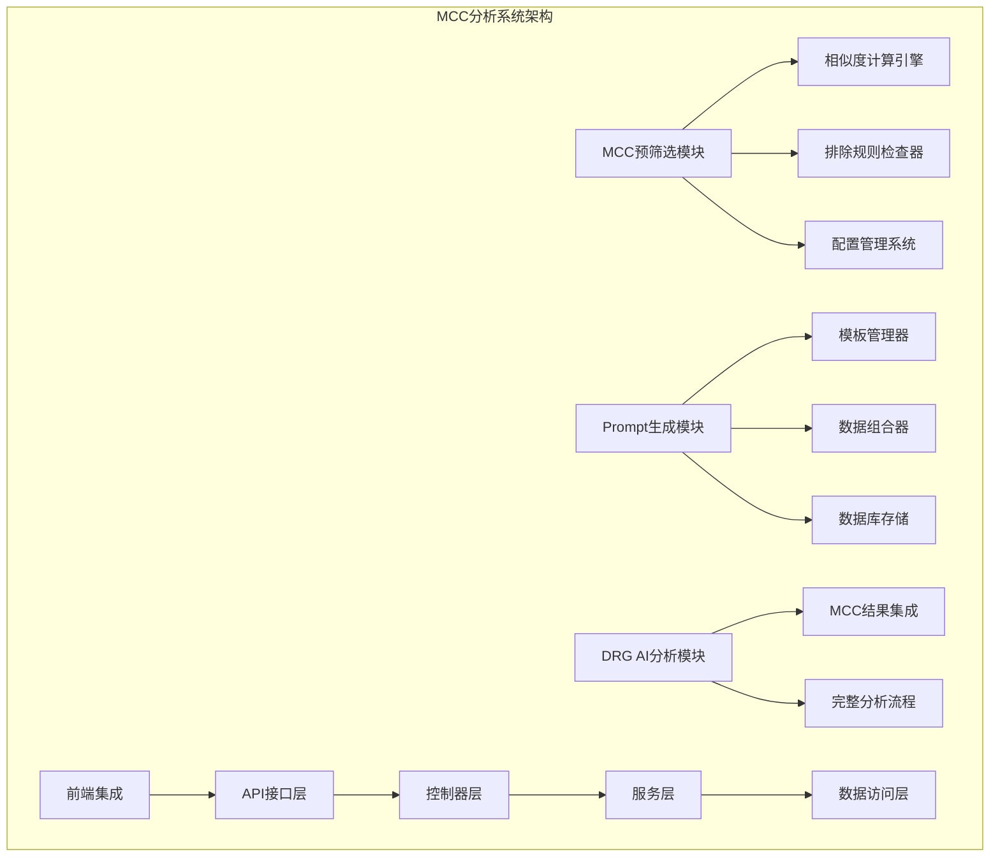
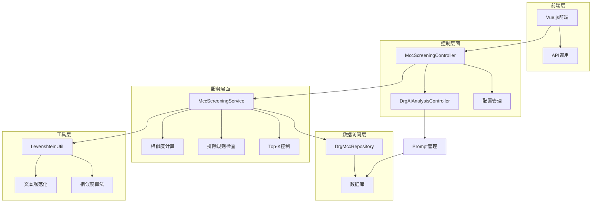
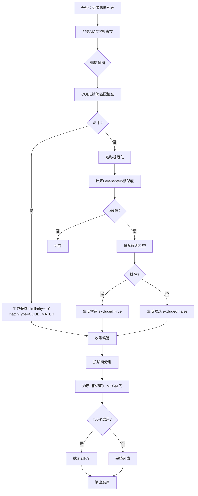
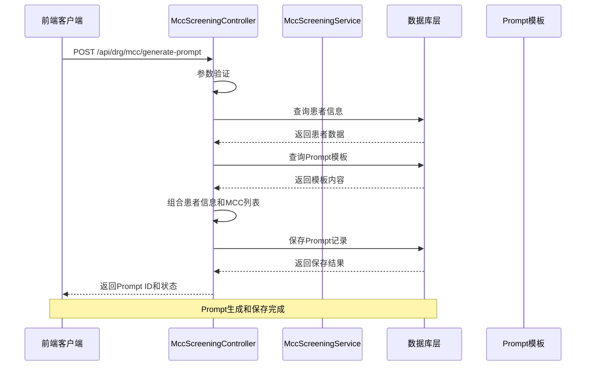
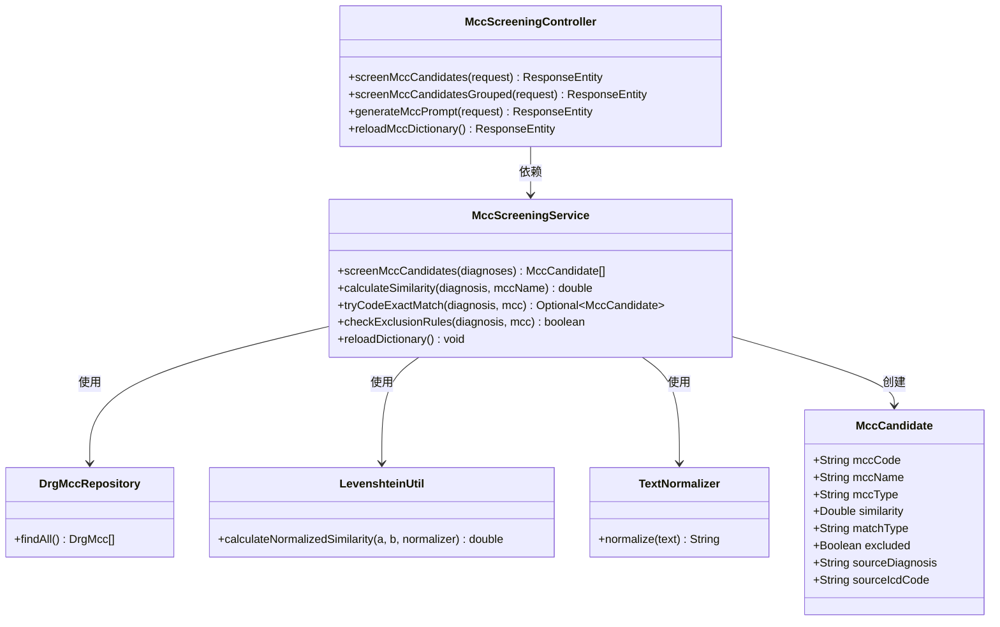

# MCC分析系统

<cite>
**本文档引用的文件**
- [更新小结.md](file://更新小结.md)
- [MCC预筛选模块TDD实施指南.md](file://doc/迭代/DRGs自动分析/MCC预筛选模块TDD实施指南.md)
- [MccScreeningController.java](file://med_ai_assistant_1.0_bs_backend/src/main/java/com/example/medaiassistant/controller/MccScreeningController.java)
- [DrgAiAnalysisController.java](file://med_ai_assistant_1.0_bs_backend/src/main/java/com/example/medaiassistant/controller/DrgAiAnalysisController.java)
- [MccScreeningService.java](file://med_ai_assistant_1.0_bs_backend/src/main/java/com/example/medaiassistant/service/MccScreeningService.java)
- [MccCandidate.java](file://med_ai_assistant_1.0_bs_backend/src/main/java/com/example/medaiassistant/model/MccCandidate.java)
- [MccType.java](file://med_ai_assistant_1.0_bs_backend/src/main/java/com/example/medaiassistant/enums/MccType.java)
</cite>

## 目录
1. [简介](#简介)
2. [项目结构](#项目结构)
3. [核心组件](#核心组件)
4. [架构概览](#架构概览)
5. [详细组件分析](#详细组件分析)
6. [依赖关系分析](#依赖关系分析)
7. [性能考虑](#性能考虑)
8. [故障排除指南](#故障排除指南)
9. [结论](#结论)

## 简介

MCC分析系统是MedAi Assistant项目中的一个重要组成部分，专注于医疗诊断中的并发症分析。该系统通过智能匹配患者的诊断信息与MCC（严重并发症）字典，为医生提供准确的并发症候选列表，辅助DRG（疾病诊断相关分组）分析和医疗决策。

系统基于Spring Boot框架构建，采用了现代化的软件工程实践，包括TDD（测试驱动开发）、微服务架构和高性能的数据处理算法。核心功能包括MCC预筛选、相似度计算、排除规则检查和Prompt生成等。

## 项目结构

**图表来源**
- [MccScreeningController.java:1-478](file://med_ai_assistant_1.0_bs_backend/src/main/java/com/example/medaiassistant/controller/MccScreeningController.java#L1-L478)
- [DrgAiAnalysisController.java:1-332](file://med_ai_assistant_1.0_bs_backend/src/main/java/com/example/medaiassistant/controller/DrgAiAnalysisController.java#L1-L332)

**章节来源**
- [更新小结.md:1-509](file://更新小结.md#L1-L509)

## 核心组件

### MCC预筛选控制器

MccScreeningController是系统的核心入口点，提供了完整的MCC预筛选REST API接口：

- **平铺列表筛选**：`POST /api/drg/mcc/screen`
- **分组筛选**：`POST /api/drg/mcc/screen-grouped`
- **相似度计算**：`POST /api/drg/mcc/similarity`
- **配置管理**：`GET /api/drg/mcc/config`
- **字典重载**：`POST /api/drg/mcc/reload`
- **Prompt生成**：`POST /api/drg/mcc/generate-prompt`

### MCC预筛选服务

MccScreeningService实现了复杂的匹配算法和数据处理逻辑：

- **双层匹配策略**：先进行ICD编码精确匹配，再进行名称相似度匹配
- **智能缓存机制**：使用AtomicReference确保线程安全的字典缓存
- **排除规则系统**：支持多分隔符的排除条件解析
- **Top-K控制**：可配置的候选数量限制
- **性能优化**：预计算规范化名称，提高相似度计算效率

### 数据模型

系统定义了完整的数据模型来表示MCC分析结果：

- **MccCandidate**：MCC候选结果实体，包含编码、名称、类型、相似度等信息
- **MccType**：并发症类型枚举，支持MCC、CC和NONE三种类型
- **PatientDiagnosis**：患者诊断信息模型
- **DrgMcc**：MCC字典实体

**章节来源**
- [MccScreeningController.java:1-478](file://med_ai_assistant_1.0_bs_backend/src/main/java/com/example/medaiassistant/controller/MccScreeningController.java#L1-L478)
- [MccScreeningService.java:1-447](file://med_ai_assistant_1.0_bs_backend/src/main/java/com/example/medaiassistant/service/MccScreeningService.java#L1-L447)
- [MccCandidate.java:1-135](file://med_ai_assistant_1.0_bs_backend/src/main/java/com/example/medaiassistant/model/MccCandidate.java#L1-L135)
- [MccType.java:1-26](file://med_ai_assistant_1.0_bs_backend/src/main/java/com/example/medaiassistant/enums/MccType.java#L1-L26)

## 架构概览

**图表来源**
- [MccScreeningController.java:33-57](file://med_ai_assistant_1.0_bs_backend/src/main/java/com/example/medaiassistant/controller/MccScreeningController.java#L33-L57)
- [MccScreeningService.java:30-447](file://med_ai_assistant_1.0_bs_backend/src/main/java/com/example/medaiassistant/service/MccScreeningService.java#L30-L447)

## 详细组件分析

### MCC预筛选算法

系统实现了高效的MCC预筛选算法，采用双层匹配策略：

**图表来源**
- [MccScreeningService.java:388-445](file://med_ai_assistant_1.0_bs_backend/src/main/java/com/example/medaiassistant/service/MccScreeningService.java#L388-L445)

### Prompt生成流程

系统提供了完整的Prompt生成和保存机制：

**图表来源**
- [MccScreeningController.java:233-341](file://med_ai_assistant_1.0_bs_backend/src/main/java/com/example/medaiassistant/controller/MccScreeningController.java#L233-L341)

### 配置管理系统

系统采用了灵活的配置管理机制：

| 配置项 | 默认值 | 描述 |
|--------|--------|------|
| `drg.mcc.similarity-threshold` | 0.3 | 相似度阈值，决定候选是否通过筛选 |
| `drg.mcc.exclusion-check-enabled` | true | 是否启用排除规则检查 |
| `drg.mcc.topK.enabled` | false | 是否启用Top-K控制 |
| `drg.mcc.topK.diag` | 5 | 每个诊断返回的候选数量限制 |

**章节来源**
- [MccScreeningService.java:66-68](file://med_ai_assistant_1.0_bs_backend/src/main/java/com/example/medaiassistant/service/MccScreeningService.java#L66-L68)
- [MccScreeningService.java:177-202](file://med_ai_assistant_1.0_bs_backend/src/main/java/com/example/medaiassistant/service/MccScreeningService.java#L177-L202)

## 依赖关系分析

**图表来源**
- [MccScreeningController.java:47-57](file://med_ai_assistant_1.0_bs_backend/src/main/java/com/example/medaiassistant/controller/MccScreeningController.java#L47-L57)
- [MccScreeningService.java:33-44](file://med_ai_assistant_1.0_bs_backend/src/main/java/com/example/medaiassistant/service/MccScreeningService.java#L33-L44)
- [MccCandidate.java:13-135](file://med_ai_assistant_1.0_bs_backend/src/main/java/com/example/medaiassistant/model/MccCandidate.java#L13-L135)

**章节来源**
- [MccScreeningController.java:1-478](file://med_ai_assistant_1.0_bs_backend/src/main/java/com/example/medaiassistant/controller/MccScreeningController.java#L1-L478)
- [MccScreeningService.java:1-447](file://med_ai_assistant_1.0_bs_backend/src/main/java/com/example/medaiassistant/service/MccScreeningService.java#L1-L447)

## 性能考虑

### 缓存策略

系统采用了多层次的缓存策略来确保高性能：

1. **字典缓存**：使用AtomicReference确保线程安全的MCC字典缓存
2. **规范化缓存**：预计算并缓存MCC名称的规范化形式
3. **原子更新**：支持字典热刷新而不需要停机

### 性能指标

| 指标 | 目标 | 实现方式 |
|------|------|----------|
| 单患者MCC筛选时间 | ≤500ms | 字典预加载、缓存优化 |
| 并发处理能力 | 支持多线程 | 不可变对象、原子操作 |
| 内存使用 | ≤200MB | 分批加载、内存监控 |
| 相似度计算 | <10ms/对 | 预规范化、算法优化 |

### 优化技术

1. **预计算优化**：在启动时预计算所有MCC名称的规范化形式
2. **不可变对象**：使用Collections.unmodifiableList确保线程安全
3. **原子引用**：使用AtomicReference支持热刷新
4. **流式处理**：使用Java Stream API优化数据处理

## 故障排除指南

### 常见问题及解决方案

#### 1. 相似度计算不准确

**问题表现**：MCC匹配结果不符合预期

**可能原因**：
- 相似度阈值设置不当
- 文本规范化处理问题
- ICD编码格式不匹配

**解决方案**：
- 调整`drg.mcc.similarity-threshold`配置
- 检查输入数据的ICD编码格式
- 验证文本规范化规则

#### 2. 排除规则不生效

**问题表现**：某些MCC候选没有被正确排除

**可能原因**：
- 排除规则开关未启用
- 排除条件格式不正确
- 编码匹配大小写问题

**解决方案**：
- 确认`drg.mcc.exclusion-check-enabled=true`
- 检查MCC_EXCEPT字段的分隔符（逗号、分号、空格）
- 验证编码匹配的大小写处理

#### 3. 性能问题

**问题表现**：MCC筛选响应时间过长

**可能原因**：
- 字典缓存未正确加载
- 数据库查询性能问题
- 并发访问冲突

**解决方案**：
- 检查字典缓存状态
- 优化数据库索引
- 调整并发处理参数

**章节来源**
- [MccScreeningService.java:74-99](file://med_ai_assistant_1.0_bs_backend/src/main/java/com/example/medaiassistant/service/MccScreeningService.java#L74-L99)
- [MccScreeningService.java:177-202](file://med_ai_assistant_1.0_bs_backend/src/main/java/com/example/medaiassistant/service/MccScreeningService.java#L177-L202)

## 结论

MCC分析系统是一个功能完整、性能优异的医疗并发症分析平台。系统采用了先进的软件工程实践，包括TDD开发、微服务架构和高性能算法实现。

### 主要优势

1. **算法先进**：采用双层匹配策略，结合精确匹配和相似度计算
2. **性能优异**：通过多层缓存和优化算法，确保快速响应
3. **配置灵活**：支持运行时配置调整，适应不同临床需求
4. **扩展性强**：模块化设计，便于功能扩展和维护

### 技术特色

- **智能缓存机制**：确保线程安全的同时提供最佳性能
- **灵活的匹配策略**：支持多种匹配方式和排序规则
- **完善的错误处理**：提供详细的日志记录和错误信息
- **完整的测试覆盖**：通过TDD确保代码质量和可靠性

该系统为医疗机构提供了强大的MCC分析能力，有助于提高DRG分析的准确性和医疗决策的质量。