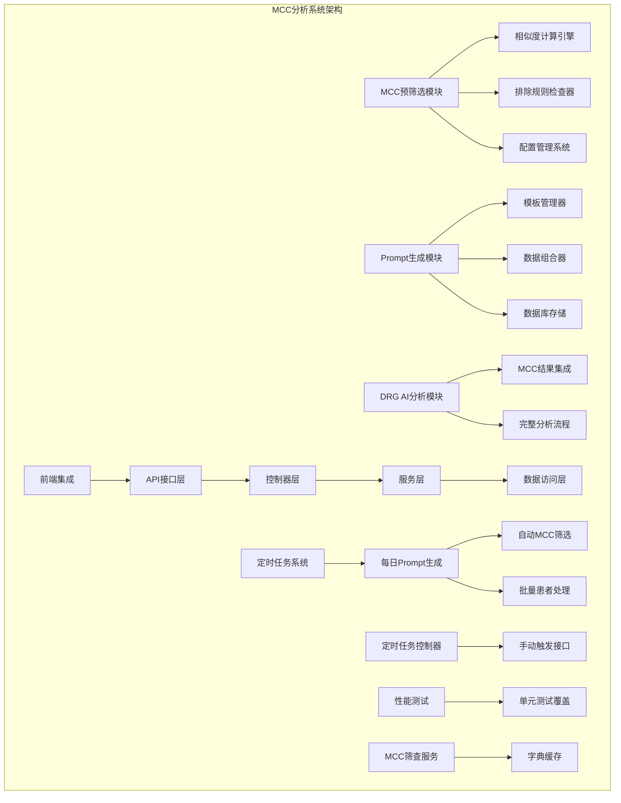
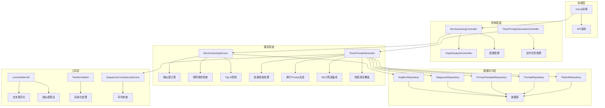
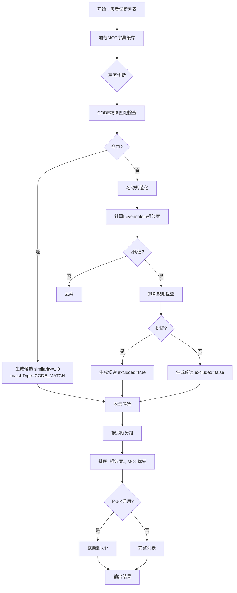
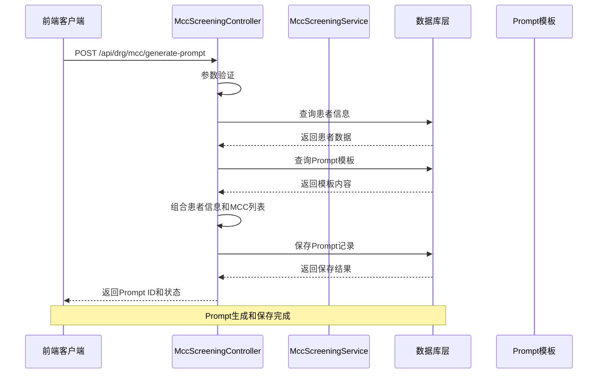
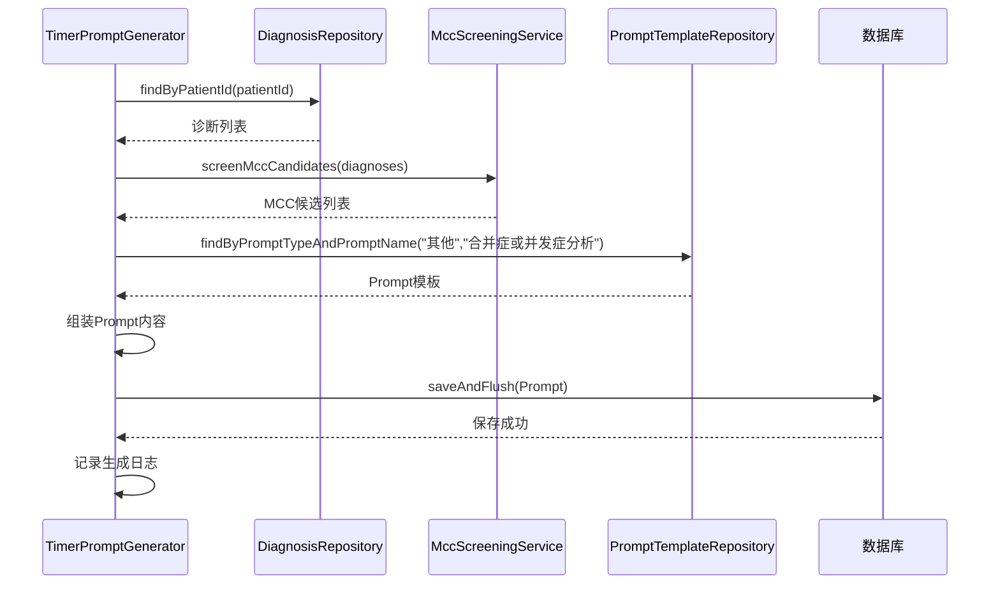
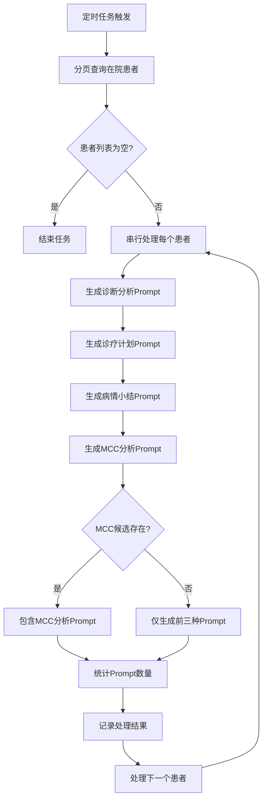
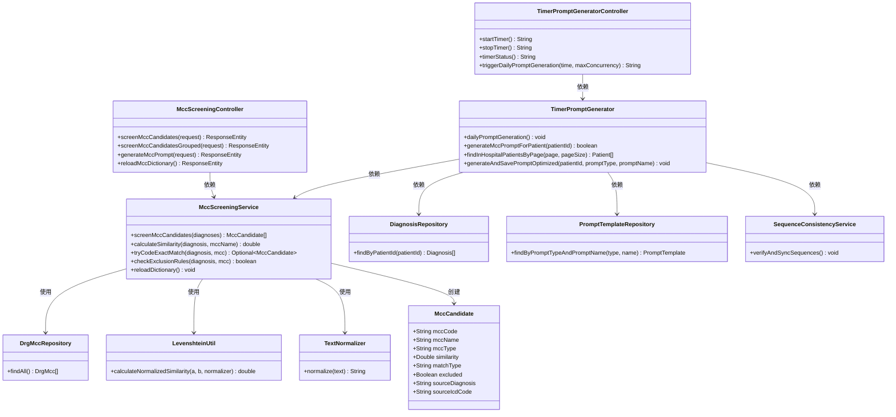

# MCC分析系统

<cite>
**本文档引用的文件**
- [更新小结.md](file://更新小结.md)
- [MCC预筛选模块TDD实施指南.md](file://doc/迭代/DRGs自动分析/MCC预筛选模块TDD实施指南.md)
- [MccScreeningController.java](file://med_ai_assistant_1.0_bs_backend/src/main/java/com/example/medaiassistant/controller/MccScreeningController.java)
- [DrgAiAnalysisController.java](file://med_ai_assistant_1.0_bs_backend/src/main/java/com/example/medaiassistant/controller/DrgAiAnalysisController.java)
- [TimerPromptGeneratorController.java](file://med_ai_assistant_1.0_bs_backend/src/main/java/com/example/medaiassistant/controller/TimerPromptGeneratorController.java)
- [TimerPromptGenerator.java](file://med_ai_assistant_1.0_bs_backend/src/main/java/com/example/medaiassistant/service/TimerPromptGenerator.java)
- [MccScreeningService.java](file://med_ai_assistant_1.0_bs_backend/src/main/java/com/example/medaiassistant/service/MccScreeningService.java)
- [MccCandidate.java](file://med_ai_assistant_1.0_bs_backend/src/main/java/com/example/medaiassistant/model/MccCandidate.java)
- [MccType.java](file://med_ai_assistant_1.0_bs_backend/src/main/java/com/example/medaiassistant/enums/MccType.java)
- [TimerPromptGeneratorPerformanceTest.java](file://med_ai_assistant_1.0_bs_backend/src/test/java/com/example/medaiassistant/service/TimerPromptGeneratorPerformanceTest.java)
- [TimerPromptGeneratorWardRoundTask1Test.java](file://med_ai_assistant_1.0_bs_backend/src/test/java/com/example/medaiassistant/service/TimerPromptGeneratorWardRoundTask1Test.java)
- [TimerPromptGeneratorWardRoundTask2Test.java](file://med_ai_assistant_1.0_bs_backend/src/test/java/com/example/medaiassistant/service/TimerPromptGeneratorWardRoundTask2Test.java)
</cite>

## 更新摘要
**所做更改**
- 新增定时任务中MCC筛选Prompt自动生成功能章节
- 更新核心组件部分，添加TimerPromptGenerator控制器
- 更新架构概览图，展示定时任务与MCC筛选的集成
- 新增generateMccPromptForPatient方法的技术实现细节
- 更新依赖关系分析，反映新增的依赖注入关系
- 新增定时任务接口文档和使用说明
- 新增性能测试和单元测试覆盖范围

## 目录
1. [简介](#简介)
2. [项目结构](#项目结构)
3. [核心组件](#核心组件)
4. [架构概览](#架构概览)
5. [详细组件分析](#详细组件分析)
6. [定时任务中的MCC筛选Prompt自动生成](#定时任务中的mcc筛选prompt自动生成)
7. [依赖关系分析](#依赖关系分析)
8. [性能考虑](#性能考虑)
9. [故障排除指南](#故障排除指南)
10. [结论](#结论)

## 简介

MCC分析系统是MedAi Assistant项目中的一个重要组成部分，专注于医疗诊断中的并发症分析。该系统通过智能匹配患者的诊断信息与MCC（严重并发症）字典，为医生提供准确的并发症候选列表，辅助DRG（疾病诊断相关分组）分析和医疗决策。

系统基于Spring Boot框架构建，采用了现代化的软件工程实践，包括TDD（测试驱动开发）、微服务架构和高性能的数据处理算法。核心功能包括MCC预筛选、相似度计算、排除规则检查和Prompt生成等。**最新更新**在定时任务中集成了MCC筛选Prompt自动生成功能，为所有在院患者自动生成诊断分析、诊疗计划、病情小结和MCC分析四种Prompt。

## 项目结构



**图表来源**
- [MccScreeningController.java:1-478](file://med_ai_assistant_1.0_bs_backend/src/main/java/com/example/medaiassistant/controller/MccScreeningController.java#L1-L478)
- [DrgAiAnalysisController.java:1-332](file://med_ai_assistant_1.0_bs_backend/src/main/java/com/example/medaiassistant/controller/DrgAiAnalysisController.java#L1-L332)
- [TimerPromptGeneratorController.java:1-100](file://med_ai_assistant_1.0_bs_backend/src/main/java/com/example/medaiassistant/controller/TimerPromptGeneratorController.java#L1-L100)
- [TimerPromptGenerator.java:1-2142](file://med_ai_assistant_1.0_bs_backend/src/main/java/com/example/medaiassistant/service/TimerPromptGenerator.java#L1-L2142)

**章节来源**
- [更新小结.md:1-509](file://更新小结.md#L1-L509)

## 核心组件

### MCC预筛选控制器

MccScreeningController是系统的核心入口点，提供了完整的MCC预筛选REST API接口：

- **平铺列表筛选**：`POST /api/drg/mcc/screen`
- **分组筛选**：`POST /api/drg/mcc/screen-grouped`
- **相似度计算**：`POST /api/drg/mcc/similarity`
- **配置管理**：`GET /api/drg/mcc/config`
- **字典重载**：`POST /api/drg/mcc/reload`
- **Prompt生成**：`POST /api/drg/mcc/generate-prompt`

### 定时任务控制器

**新增** TimerPromptGeneratorController提供了定时任务的管理和控制接口：

- **启动定时器**：`GET /api/timer-prompt-generator/start`
- **停止定时器**：`GET /api/timer-prompt-generator/stop`
- **查询状态**：`GET /api/timer-prompt-generator/status`
- **手动触发**：`GET /api/timer-prompt-generator/trigger-daily`

### MCC预筛选服务

MccScreeningService实现了复杂的匹配算法和数据处理逻辑：

- **双层匹配策略**：先进行ICD编码精确匹配，再进行名称相似度匹配
- **智能缓存机制**：使用AtomicReference确保线程安全的字典缓存
- **排除规则系统**：支持多分隔符的排除条件解析
- **Top-K控制**：可配置的候选数量限制
- **性能优化**：预计算规范化名称，提高相似度计算效率

### 定时任务生成器

**新增** TimerPromptGenerator实现了定时任务的批量Prompt生成功能：

- **批量患者处理**：分页查询在院患者，支持科室过滤
- **串行处理策略**：避免数据库连接竞争，确保数据一致性
- **四合一Prompt生成**：为每个患者自动生成诊断分析、诊疗计划、病情小结和MCC分析
- **异常容错机制**：单个患者失败不影响整体任务执行
- **性能监控**：实时统计处理进度和性能指标
- **序列一致性检查**：自动检测并修复Oracle序列落后问题

### 数据模型

系统定义了完整的数据模型来表示MCC分析结果：

- **MccCandidate**：MCC候选结果实体，包含编码、名称、类型、相似度等信息
- **MccType**：并发症类型枚举，支持MCC、CC和NONE三种类型
- **PatientDiagnosis**：患者诊断信息模型
- **DrgMcc**：MCC字典实体

**章节来源**
- [MccScreeningController.java:1-478](file://med_ai_assistant_1.0_bs_backend/src/main/java/com/example/medaiassistant/controller/MccScreeningController.java#L1-L478)
- [TimerPromptGeneratorController.java:1-100](file://med_ai_assistant_1.0_bs_backend/src/main/java/com/example/medaiassistant/controller/TimerPromptGeneratorController.java#L1-L100)
- [MccScreeningService.java:1-447](file://med_ai_assistant_1.0_bs_backend/src/main/java/com/example/medaiassistant/service/MccScreeningService.java#L1-L447)
- [TimerPromptGenerator.java:1-2142](file://med_ai_assistant_1.0_bs_backend/src/main/java/com/example/medaiassistant/service/TimerPromptGenerator.java#L1-L2142)
- [MccCandidate.java:1-135](file://med_ai_assistant_1.0_bs_backend/src/main/java/com/example/medaiassistant/model/MccCandidate.java#L1-L135)
- [MccType.java:1-26](file://med_ai_assistant_1.0_bs_backend/src/main/java/com/example/medaiassistant/enums/MccType.java#L1-L26)

## 架构概览



**图表来源**
- [MccScreeningController.java:33-57](file://med_ai_assistant_1.0_bs_backend/src/main/java/com/example/medaiassistant/controller/MccScreeningController.java#L33-L57)
- [TimerPromptGeneratorController.java:14-26](file://med_ai_assistant_1.0_bs_backend/src/main/java/com/example/medaiassistant/controller/TimerPromptGeneratorController.java#L14-L26)
- [MccScreeningService.java:30-447](file://med_ai_assistant_1.0_bs_backend/src/main/java/com/example/medaiassistant/service/MccScreeningService.java#L30-L447)
- [TimerPromptGenerator.java:106-136](file://med_ai_assistant_1.0_bs_backend/src/main/java/com/example/medaiassistant/service/TimerPromptGenerator.java#L106-L136)

## 详细组件分析

### MCC预筛选算法

系统实现了高效的MCC预筛选算法，采用双层匹配策略：



**图表来源**
- [MccScreeningService.java:388-445](file://med_ai_assistant_1.0_bs_backend/src/main/java/com/example/medaiassistant/service/MccScreeningService.java#L388-L445)

### Prompt生成流程

系统提供了完整的Prompt生成和保存机制：



**图表来源**
- [MccScreeningController.java:233-341](file://med_ai_assistant_1.0_bs_backend/src/main/java/com/example/medaiassistant/controller/MccScreeningController.java#L233-L341)

### 配置管理系统

系统采用了灵活的配置管理机制：

| 配置项 | 默认值 | 描述 |
|--------|--------|------|
| `drg.mcc.similarity-threshold` | 0.3 | 相似度阈值，决定候选是否通过筛选 |
| `drg.mcc.exclusion-check-enabled` | true | 是否启用排除规则检查 |
| `drg.mcc.topK.enabled` | false | 是否启用Top-K控制 |
| `drg.mcc.topK.diag` | 5 | 每个诊断返回的候选数量限制 |

### generateMccPromptForPatient方法实现

**新增** generateMccPromptForPatient方法实现了MCC筛选和Prompt生成的完整逻辑：



**图表来源**
- [TimerPromptGenerator.java:2043-2139](file://med_ai_assistant_1.0_bs_backend/src/main/java/com/example/medaiassistant/service/TimerPromptGenerator.java#L2043-L2139)

## 定时任务中的MCC筛选Prompt自动生成

**新增章节** 系统在定时任务中集成了MCC筛选Prompt自动生成功能，为所有在院患者自动生成诊断分析、诊疗计划、病情小结和MCC分析四种Prompt。

### 自动生成功能概述

定时任务每天自动为所有在院患者生成MCC筛选Prompt，具体流程如下：



**图表来源**
- [TimerPromptGenerator.java:580-653](file://med_ai_assistant_1.0_bs_backend/src/main/java/com/example/medaiassistant/service/TimerPromptGenerator.java#L580-L653)

### 定时任务接口文档

**新增** 定时任务控制器提供了完整的接口文档：

| 接口路径 | 方法 | 功能描述 | 请求参数 | 响应示例 |
|----------|------|----------|----------|----------|
| `/api/timer-prompt-generator/start` | GET | 启动定时器 | 无 | "定时器启动请求已发送" |
| `/api/timer-prompt-generator/stop` | GET | 停止定时器 | 无 | "定时器停止请求已发送" |
| `/api/timer-prompt-generator/status` | GET | 查询定时器状态 | 无 | "定时器正在运行" 或 "定时器未运行" |
| `/api/timer-prompt-generator/trigger-daily` | GET | 手动触发每日Prompt生成 | time: 临时执行时间(cron表达式)<br/>maxConcurrency: 临时最大并发数 | "每日Prompt生成任务已手动触发" |

### 依赖注入配置

**新增** TimerPromptGenerator类的构造函数展示了完整的依赖注入配置：

```java
@Autowired
public TimerPromptGenerator(TaskScheduler taskScheduler,
                          AlertRuleService alertRuleService,
                          PatientStatusUpdateService patientStatusUpdateService,
                          PatientRepository patientRepository,
                          PromptRepository promptRepository,
                          PromptResultRepository promptResultRepository,
                          MedicalRecordRepository medicalRecordRepository,
                          LabResultRepository labResultRepository,
                          ExaminationResultRepository examinationResultRepository,
                          LongTermOrderRepository longTermOrderRepository,
                          ServerConfigService serverConfigService,
                          RestTemplate restTemplate,
                          ApiProperties apiProperties,
                          SchedulingProperties schedulingProperties,
                          EmrRecordRepository emrRecordRepository,
                          EmrContentRepository emrContentRepository,
                          SurgeryRepository surgeryRepository,
                          PromptGenerationLogService promptGenerationLogService,
                          PromptsTaskUpdater promptsTaskUpdater,
                          MccScreeningService mccScreeningService,
                          DiagnosisRepository diagnosisRepository,
                          PromptTemplateRepository promptTemplateRepository) {
    // 初始化所有依赖
}
```

### 性能测试覆盖

**新增** 系统包含了全面的性能测试覆盖：

- **时间区间筛选性能测试**：验证化验结果和检查结果的大数据量处理性能
- **单元测试覆盖**：使用Mockito进行业务逻辑层单元测试
- **集成测试**：验证模块间的协作和依赖注入
- **异常处理测试**：确保单个患者失败不影响整体任务执行

**章节来源**
- [TimerPromptGenerator.java:2043-2139](file://med_ai_assistant_1.0_bs_backend/src/main/java/com/example/medaiassistant/service/TimerPromptGenerator.java#L2043-L2139)
- [TimerPromptGeneratorController.java:1-100](file://med_ai_assistant_1.0_bs_backend/src/main/java/com/example/medaiassistant/controller/TimerPromptGeneratorController.java#L1-L100)
- [TimerPromptGeneratorPerformanceTest.java:1-374](file://med_ai_assistant_1.0_bs_backend/src/test/java/com/example/medaiassistant/service/TimerPromptGeneratorPerformanceTest.java#L1-L374)
- [TimerPromptGeneratorWardRoundTask1Test.java:1-178](file://med_ai_assistant_1.0_bs_backend/src/test/java/com/example/medaiassistant/service/TimerPromptGeneratorWardRoundTask1Test.java#L1-L178)
- [TimerPromptGeneratorWardRoundTask2Test.java:1-200](file://med_ai_assistant_1.0_bs_backend/src/test/java/com/example/medaiassistant/service/TimerPromptGeneratorWardRoundTask2Test.java#L1-L200)

## 依赖关系分析



**图表来源**
- [MccScreeningController.java:47-57](file://med_ai_assistant_1.0_bs_backend/src/main/java/com/example/medaiassistant/controller/MccScreeningController.java#L47-L57)
- [TimerPromptGeneratorController.java:17-26](file://med_ai_assistant_1.0_bs_backend/src/main/java/com/example/medaiassistant/controller/TimerPromptGeneratorController.java#L17-L26)
- [MccScreeningService.java:33-44](file://med_ai_assistant_1.0_bs_backend/src/main/java/com/example/medaiassistant/service/MccScreeningService.java#L33-L44)
- [TimerPromptGenerator.java:133-137](file://med_ai_assistant_1.0_bs_backend/src/main/java/com/example/medaiassistant/service/TimerPromptGenerator.java#L133-L137)
- [MccCandidate.java:13-135](file://med_ai_assistant_1.0_bs_backend/src/main/java/com/example/medaiassistant/model/MccCandidate.java#L13-L135)

**章节来源**
- [MccScreeningController.java:1-478](file://med_ai_assistant_1.0_bs_backend/src/main/java/com/example/medaiassistant/controller/MccScreeningController.java#L1-L478)
- [TimerPromptGeneratorController.java:1-100](file://med_ai_assistant_1.0_bs_backend/src/main/java/com/example/medaiassistant/controller/TimerPromptGeneratorController.java#L1-L100)
- [MccScreeningService.java:1-447](file://med_ai_assistant_1.0_bs_backend/src/main/java/com/example/medaiassistant/service/MccScreeningService.java#L1-L447)
- [TimerPromptGenerator.java:1-2142](file://med_ai_assistant_1.0_bs_backend/src/main/java/com/example/medaiassistant/service/TimerPromptGenerator.java#L1-L2142)

## 性能考虑

### 缓存策略

系统采用了多层次的缓存策略来确保高性能：

1. **字典缓存**：使用AtomicReference确保线程安全的MCC字典缓存
2. **规范化缓存**：预计算并缓存MCC名称的规范化形式
3. **原子更新**：支持字典热刷新而不需要停机

### 定时任务性能优化

**新增** 定时任务采用了多项性能优化措施：

1. **分页查询**：每次只处理20个患者，避免内存溢出
2. **串行处理**：每个患者内部串行生成四种Prompt，避免数据库连接竞争
3. **延迟控制**：每个患者处理后延迟500ms，每页处理后延迟2秒
4. **异常容错**：单个患者失败不影响整体任务执行
5. **性能监控**：实时统计处理进度、成功率和性能指标
6. **序列一致性检查**：自动检测并修复Oracle序列落后问题

### 性能指标

| 指标 | 目标 | 实现方式 |
|------|------|----------|
| 单患者MCC筛选时间 | ≤500ms | 字典预加载、缓存优化 |
| 每页处理时间 | ≤10秒 | 分页控制、延迟优化 |
| 并发处理能力 | 支持多线程 | 串行策略、原子操作 |
| 内存使用 | ≤200MB | 分批加载、内存监控 |
| 相似度计算 | <10ms/对 | 预规范化、算法优化 |
| 序列检查时间 | ≤1秒 | 批量检查、异步处理 |

### 优化技术

1. **预计算优化**：在启动时预计算所有MCC名称的规范化形式
2. **不可变对象**：使用Collections.unmodifiableList确保线程安全
3. **原子引用**：使用AtomicReference支持热刷新
4. **流式处理**：使用Java Stream API优化数据处理
5. **数据库优化**：使用saveAndFlush立即刷新，减少连接占用
6. **测试驱动优化**：通过全面的单元测试确保性能稳定性

## 故障排除指南

### 常见问题及解决方案

#### 1. 相似度计算不准确

**问题表现**：MCC匹配结果不符合预期

**可能原因**：
- 相似度阈值设置不当
- 文本规范化处理问题
- ICD编码格式不匹配

**解决方案**：
- 调整`drg.mcc.similarity-threshold`配置
- 检查输入数据的ICD编码格式
- 验证文本规范化规则

#### 2. 排除规则不生效

**问题表现**：某些MCC候选没有被正确排除

**可能原因**：
- 排除规则开关未启用
- 排除条件格式不正确
- 编码匹配大小写问题

**解决方案**：
- 确认`drg.mcc.exclusion-check-enabled=true`
- 检查MCC_EXCEPT字段的分隔符（逗号、分号、空格）
- 验证编码匹配的大小写处理

#### 3. 定时任务性能问题

**问题表现**：定时任务执行缓慢或内存不足

**可能原因**：
- 分页大小设置不当
- 延迟时间过短
- 数据库连接池配置问题
- 序列不一致导致的性能问题

**解决方案**：
- 调整pageSize参数（当前为20）
- 增加延迟时间（当前为500ms/2s）
- 优化数据库连接池配置
- 检查服务器资源使用情况
- 运行序列一致性检查服务

#### 4. MCC筛选Prompt生成失败

**问题表现**：定时任务中MCC分析Prompt生成失败

**可能原因**：
- 患者诊断数据缺失
- MCC字典未正确加载
- Prompt模板不存在
- 数据库连接异常
- 序列不一致问题

**解决方案**：
- 检查患者诊断数据完整性
- 验证MCC字典加载状态
- 确认Prompt模板存在且正确
- 检查数据库连接状态
- 运行序列一致性检查
- 查看详细错误日志

#### 5. 性能测试失败

**问题表现**：性能测试用例执行超时或失败

**可能原因**：
- 测试数据量过大
- Mock配置不正确
- 线程池配置问题

**解决方案**：
- 调整测试数据规模
- 检查Mockito配置
- 优化线程池参数
- 增加超时时间

**章节来源**
- [MccScreeningService.java:74-99](file://med_ai_assistant_1.0_bs_backend/src/main/java/com/example/medaiassistant/service/MccScreeningService.java#L74-L99)
- [MccScreeningService.java:177-202](file://med_ai_assistant_1.0_bs_backend/src/main/java/com/example/medaiassistant/service/MccScreeningService.java#L177-L202)
- [TimerPromptGenerator.java:2134-2139](file://med_ai_assistant_1.0_bs_backend/src/main/java/com/example/medaiassistant/service/TimerPromptGenerator.java#L2134-L2139)
- [TimerPromptGeneratorPerformanceTest.java:144-208](file://med_ai_assistant_1.0_bs_backend/src/test/java/com/example/medaiassistant/service/TimerPromptGeneratorPerformanceTest.java#L144-L208)

## 结论

MCC分析系统是一个功能完整、性能优异的医疗并发症分析平台。系统采用了先进的软件工程实践，包括TDD开发、微服务架构和高性能算法实现。

### 主要优势

1. **算法先进**：采用双层匹配策略，结合精确匹配和相似度计算
2. **性能优异**：通过多层缓存和优化算法，确保快速响应
3. **配置灵活**：支持运行时配置调整，适应不同临床需求
4. **扩展性强**：模块化设计，便于功能扩展和维护
5. **自动化程度高**：新增定时任务自动生成功能，大幅提高工作效率
6. **测试覆盖全面**：通过单元测试、集成测试和性能测试确保系统稳定性

### 技术特色

- **智能缓存机制**：确保线程安全的同时提供最佳性能
- **灵活的匹配策略**：支持多种匹配方式和排序规则
- **完善的错误处理**：提供详细的日志记录和错误信息
- **完整的测试覆盖**：通过TDD确保代码质量和可靠性
- **定时任务集成**：自动化的批量Prompt生成功能
- **性能监控**：实时统计和性能指标跟踪
- **序列一致性保证**：防止数据库主键冲突问题

### 新功能亮点

**新增的定时任务MCC筛选Prompt自动生成功能**为系统带来了显著的价值：

- **全自动化**：无需人工干预，每天自动为所有在院患者生成MCC分析Prompt
- **批量处理**：支持分页批量处理，避免内存和数据库压力
- **异常容错**：单个患者失败不影响整体任务执行
- **性能优化**：串行处理策略确保数据一致性和系统稳定性
- **接口完善**：提供完整的定时任务控制接口，支持手动触发和状态查询
- **序列保护**：自动检测并修复Oracle序列落后问题，防止主键冲突
- **测试保障**：全面的性能测试和单元测试确保功能稳定性

该系统为医疗机构提供了强大的MCC分析能力，有助于提高DRG分析的准确性和医疗决策的质量，同时通过自动化功能大幅提升了工作效率和系统可用性。系统的测试驱动开发方法和全面的测试覆盖确保了代码质量和长期维护的便利性。