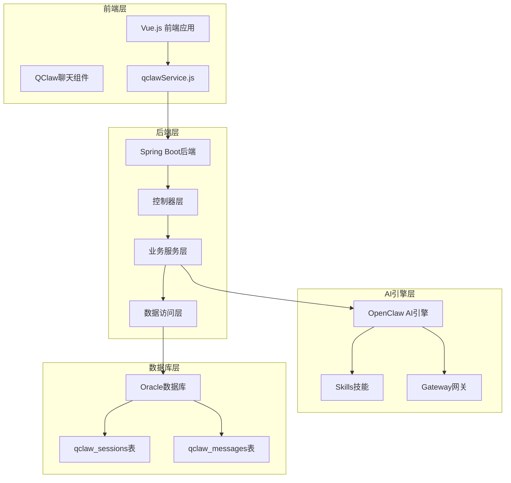
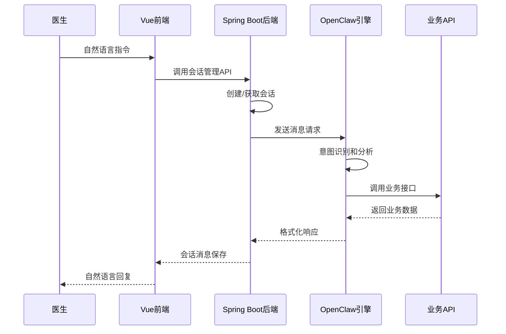
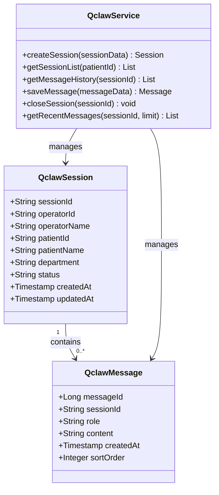
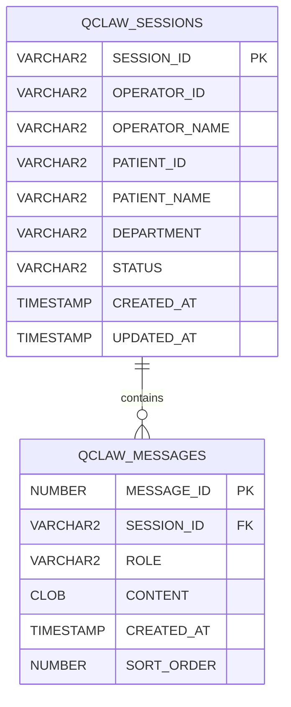
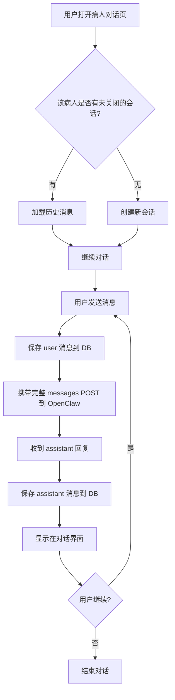
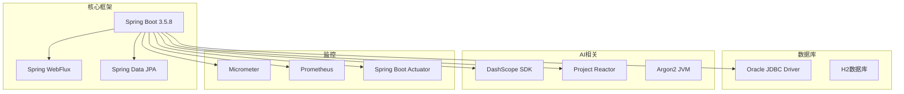

# OpenClaw集成方案

<cite>
**本文档引用的文件**
- [OpenClaw集成方案-临床场景分析与PoC规划.md](file://med_ai_assistant_1.0_bs_backend/doc/迭代/openclaw/OpenClaw集成方案-临床场景分析与PoC规划.md)
- [QClaw API调用链路实施方案.md](file://med_ai_assistant_1.0_bs_backend/doc/迭代/QClaw API调用链路/QClaw API调用链路实施方案.md)
- [API_DOCUMENTATION.md](file://med_ai_assistant_1.0_bs_backend/doc/其他/API_DOCUMENTATION.md)
- [pom.xml](file://med_ai_assistant_1.0_bs_backend/pom.xml)
- [MedicalRecordController.java](file://med_ai_assistant_1.0_bs_backend/src/main/java/com/example/medaiassistant/controller/MedicalRecordController.java)
</cite>

## 目录
1. [简介](#简介)
2. [项目结构](#项目结构)
3. [核心组件](#核心组件)
4. [架构概览](#架构概览)
5. [详细组件分析](#详细组件分析)
6. [依赖分析](#依赖分析)
7. [性能考虑](#性能考虑)
8. [故障排除指南](#故障排除指南)
9. [结论](#结论)

## 简介

OpenClaw集成方案旨在将OpenClaw AI代理引擎与MedAiAssistant医疗AI助手系统进行深度集成，通过自然语言驱动的API编排来提升医疗工作效率。该方案的核心价值在于用自然语言替代传统的硬编码流程，实现复杂的多步骤业务操作。

系统主要服务于医疗机构，通过OpenClaw的自然语言理解能力，将医生的口头指令转化为具体的医疗业务操作，包括病历管理、患者查询、DRG分析等功能。

## 项目结构

基于现有代码库，OpenClaw集成涉及以下关键模块：

**图表来源**
- [OpenClaw集成方案-临床场景分析与PoC规划.md:1-345](file://med_ai_assistant_1.0_bs_backend/doc/迭代/openclaw/OpenClaw集成方案-临床场景分析与PoC规划.md#L1-L345)
- [QClaw API调用链路实施方案.md:28-67](file://med_ai_assistant_1.0_bs_backend/doc/迭代/QClaw API调用链路/QClaw API调用链路实施方案.md#L28-L67)

**章节来源**
- [OpenClaw集成方案-临床场景分析与PoC规划.md:1-345](file://med_ai_assistant_1.0_bs_backend/doc/迭代/openclaw/OpenClaw集成方案-临床场景分析与PoC规划.md#L1-L345)
- [QClaw API调用链路实施方案.md:28-67](file://med_ai_assistant_1.0_bs_backend/doc/迭代/QClaw API调用链路/QClaw API调用链路实施方案.md#L28-L67)

## 核心组件

### 1. OpenClaw AI引擎组件

OpenClaw作为AI代理引擎，负责：
- 自然语言意图识别和理解
- API编排和流程调度
- 与后端业务接口的通信
- 技能(Skill)的触发和执行

### 2. 会话管理系统

系统实现了完整的会话管理机制：
- 会话创建和维护
- 消息历史持久化
- 多用户并发支持
- 上下文管理

### 3. 病历记录集成

通过现有的病历记录API实现：
- 病历内容的获取和格式化
- 新病历记录的创建和保存
- 病历记录的查询和管理

### 4. 前端集成组件

Vue.js前端提供了：
- QClaw聊天组件
- 自然语言交互界面
- 会话状态管理
- 实时消息展示

**章节来源**
- [QClaw API调用链路实施方案.md:192-251](file://med_ai_assistant_1.0_bs_backend/doc/迭代/QClaw API调用链路/QClaw API调用链路实施方案.md#L192-L251)
- [API_DOCUMENTATION.md:590-661](file://med_ai_assistant_1.0_bs_backend/doc/其他/API_DOCUMENTATION.md#L590-L661)

## 架构概览

系统采用分层架构设计，实现了AI代理层与业务能力层的有效分离：

**图表来源**
- [QClaw API调用链路实施方案.md:32-50](file://med_ai_assistant_1.0_bs_backend/doc/迭代/QClaw API调用链路/QClaw API调用链路实施方案.md#L32-L50)

### 架构特点

1. **分层解耦**: AI代理层与业务层完全分离
2. **标准化接口**: 采用OpenAI兼容格式
3. **会话管理**: 支持连续对话和上下文保持
4. **并发控制**: 实现多用户并发支持
5. **数据持久化**: 完整的消息历史记录

**章节来源**
- [QClaw API调用链路实施方案.md:52-67](file://med_ai_assistant_1.0_bs_backend/doc/迭代/QClaw API调用链路/QClaw API调用链路实施方案.md#L52-L67)

## 详细组件分析

### 会话管理组件

会话管理是整个系统的核心组件，负责维护用户的对话状态：

**图表来源**
- [QClaw API调用链路实施方案.md:229-251](file://med_ai_assistant_1.0_bs_backend/doc/迭代/QClaw API调用链路/QClaw API调用链路实施方案.md#L229-L251)

### 数据库设计

系统使用Oracle数据库存储会话和消息数据：

**图表来源**
- [QClaw API调用链路实施方案.md:229-251](file://med_ai_assistant_1.0_bs_backend/doc/迭代/QClaw API调用链路/QClaw API调用链路实施方案.md#L229-L251)

### API设计规范

系统提供了完整的RESTful API接口：

| API路径 | 方法 | 用途 | 参数/Body |
|---------|------|------|-----------|
| `/api/qclaw/sessions` | POST | 创建新会话 | sessionId, operatorId, operatorName, patientId, patientName, department |
| `/api/qclaw/sessions` | GET | 查询病人的会话列表 | patientId (query param) |
| `/api/qclaw/sessions/{id}/messages` | GET | 加载会话消息历史 | id (path param) |
| `/api/qclaw/sessions/{id}/messages` | POST | 保存消息 | role, content |
| `/api/qclaw/sessions/{id}/close` | PUT | 关闭会话 | id (path param) |

**章节来源**
- [QClaw API调用链路实施方案.md:255-267](file://med_ai_assistant_1.0_bs_backend/doc/迭代/QClaw API调用链路/QClaw API调用链路实施方案.md#L255-L267)

### 前端集成组件

Vue.js前端提供了完整的聊天界面集成：

**图表来源**
- [QClaw API调用链路实施方案.md:300-316](file://med_ai_assistant_1.0_bs_backend/doc/迭代/QClaw API调用链路/QClaw API调用链路实施方案.md#L300-L316)

**章节来源**
- [QClaw API调用链路实施方案.md:286-323](file://med_ai_assistant_1.0_bs_backend/doc/迭代/QClaw API调用链路/QClaw API调用链路实施方案.md#L286-L323)

## 依赖分析

系统的技术栈和依赖关系如下：

**图表来源**
- [pom.xml:53-200](file://med_ai_assistant_1.0_bs_backend/pom.xml#L53-L200)

### 关键依赖说明

1. **Spring Boot生态系统**: 提供完整的微服务基础设施
2. **Oracle数据库支持**: 满足医疗系统的数据存储需求
3. **Reactive编程模型**: 支持高并发和异步处理
4. **监控和可观测性**: 完善的运维支持

**章节来源**
- [pom.xml:1-200](file://med_ai_assistant_1.0_bs_backend/pom.xml#L1-L200)

## 性能考虑

### 并发处理

系统采用双层并发模型：
- **Session Lane**: 同一会话内严格串行执行，保证对话一致性
- **Global Lane**: 不同会话间可并行执行，默认并发上限4

### 长对话管理

为应对医疗场景中的长对话需求：
- 数据库存储完整历史消息用于审计
- 发送请求时使用滑动窗口控制Token使用
- 可选的对话摘要功能压缩早期对话内容

### 网络优化

- OpenAI兼容的请求格式减少适配成本
- 异步处理机制提升响应速度
- 连接池管理和超时控制

## 故障排除指南

### 常见问题及解决方案

1. **会话创建失败**
   - 检查数据库连接配置
   - 验证Oracle驱动版本
   - 确认表结构完整性

2. **消息保存异常**
   - 检查CLOB字段配置
   - 验证JPA映射设置
   - 确认数据库权限

3. **OpenClaw连接问题**
   - 验证Gateway Token配置
   - 检查网络连通性
   - 确认端口访问权限

4. **并发冲突**
   - 调整maxConcurrent配置
   - 检查会话隔离机制
   - 验证UUID生成逻辑

**章节来源**
- [QClaw API调用链路实施方案.md:528-536](file://med_ai_assistant_1.0_bs_backend/doc/迭代/QClaw API调用链路/QClaw API调用链路实施方案.md#L528-L536)

## 结论

OpenClaw集成方案为MedAiAssistant系统提供了强大的自然语言处理能力，通过以下关键改进提升了医疗工作效率：

1. **无缝集成**: 通过标准化的API接口实现AI引擎与业务系统的深度集成
2. **会话管理**: 完整的会话生命周期管理确保对话的一致性和连续性
3. **多场景支持**: 覆盖查房、DRG分析、患者查询等多个核心医疗场景
4. **技术先进**: 采用Spring Boot、Reactive编程等现代技术栈
5. **生产就绪**: 完善的监控、测试和部署方案

该方案的成功实施将显著提升医护人员的工作效率，减少重复性操作，为医疗AI助手系统的发展奠定坚实基础。