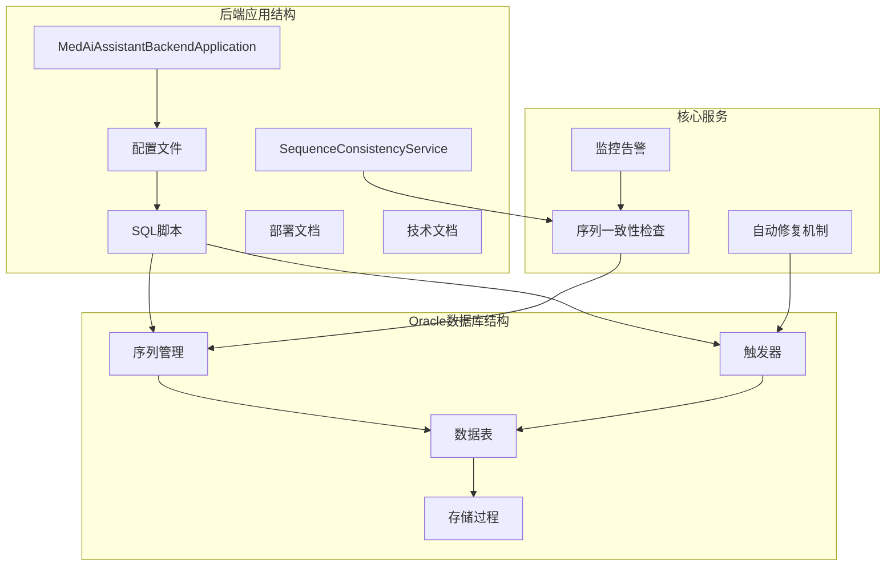
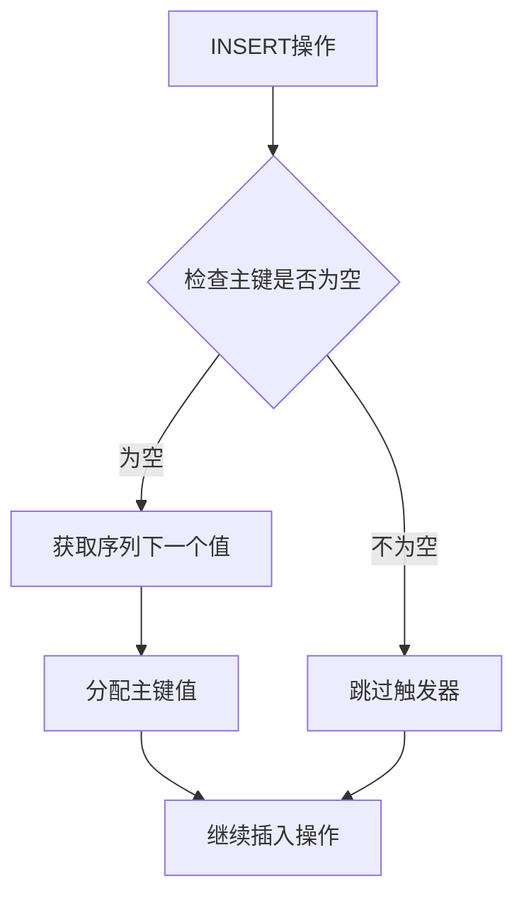
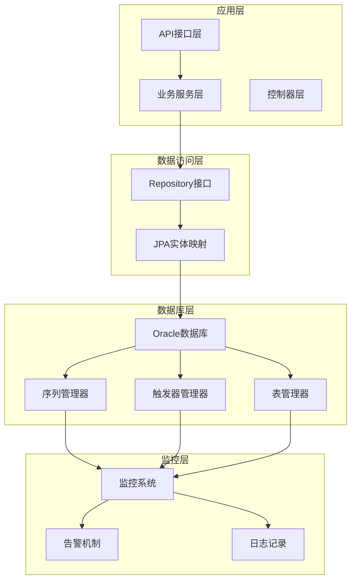
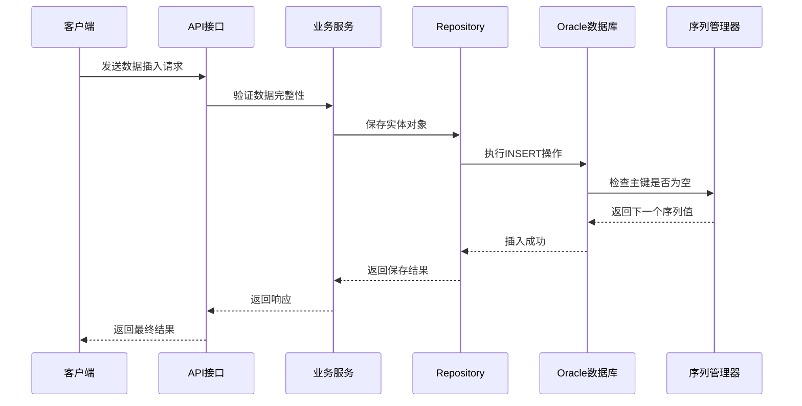
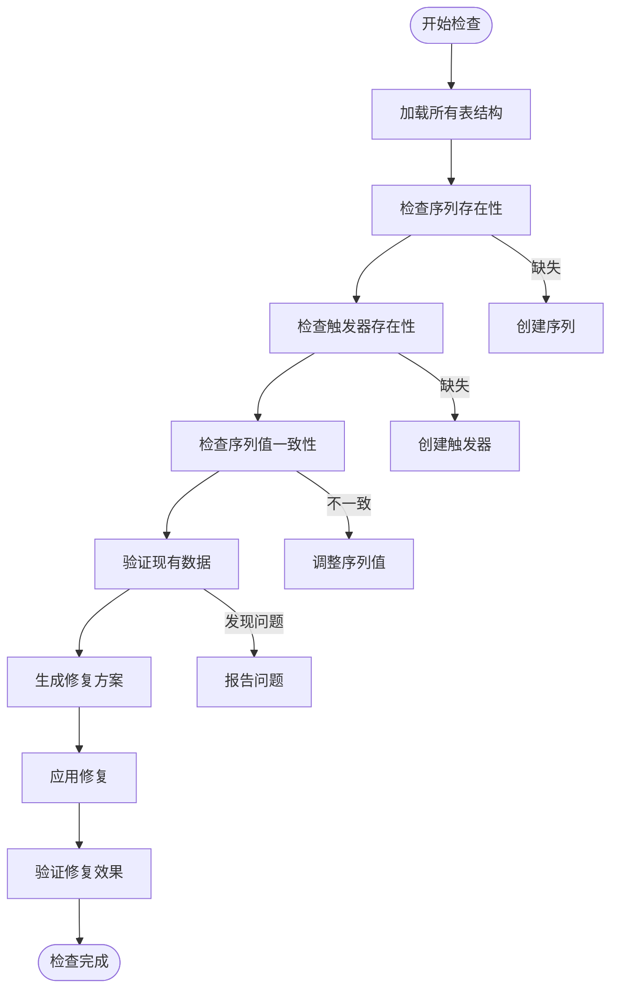
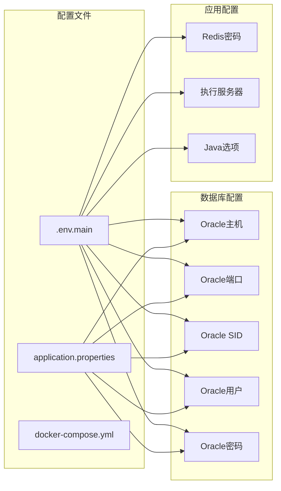
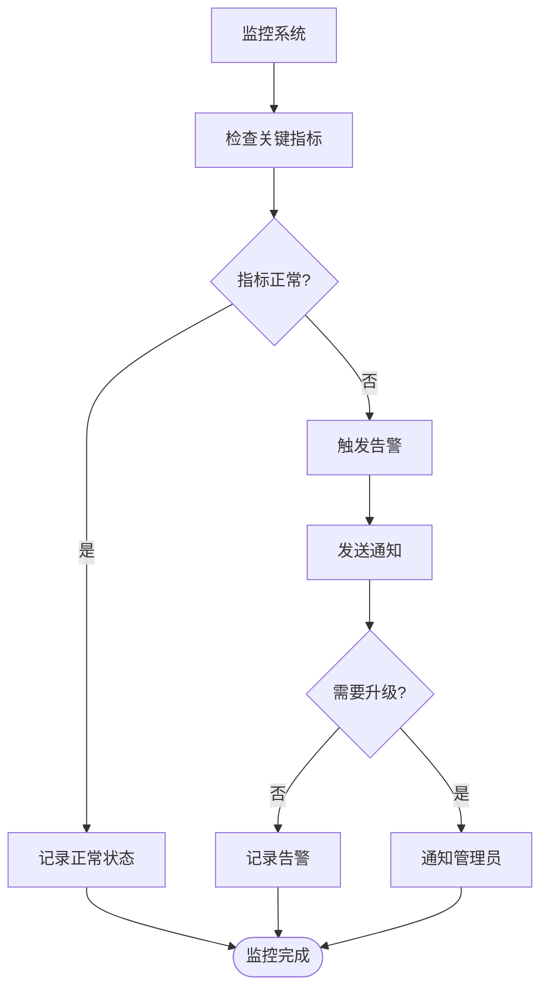
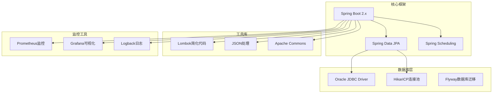

# Oracle序列一致性自动检查服务

<cite>
**本文档引用的文件**
- [MedAiAssistantBackendApplication.java](file://med_ai_assistant_1.0_bs_backend/src/main/java/com/example/medaiassistant/MedAiAssistantBackendApplication.java)
- [create-identity-sequences.sql](file://med_ai_assistant_1.0_bs_backend/sql-scripts/create-identity-sequences.sql)
- [create-sync-log-table.sql](file://med_ai_assistant_1.0_bs_backend/sql-scripts/create-sync-log-table.sql)
- [create-drg-analysis-results-table.sql](file://med_ai_assistant_1.0_bs_backend/sql-scripts/create-drg-analysis-results-table.sql)
- [gen_drg_input_snapshot_procedure.sql](file://med_ai_assistant_1.0_bs_backend/sql-scripts/gen_drg_input_snapshot_procedure.sql)
- [README.md](file://med_ai_assistant_1.0_bs_backend/deploy/main-linux-oracle/README.md)
- [README-deploy.md](file://med_ai_assistant_1.0_bs_backend/deploy/main-linux-oracle/README-deploy.md)
- [ARCHITECTURE_DIAGRAMS.md](file://med_ai_assistant_1.0_bs_backend/doc/其他/ARCHITECTURE_DIAGRAMS.md)
- [init.sql](file://med_ai_assistant_1.0_bs_backend/init.sql)
- [更新小结.md](file://更新小结.md)
- [SequenceConsistencyService.java](file://med_ai_assistant_1.0_bs_backend/src/main/java/com/example/medaiassistant/service/SequenceConsistencyService.java)
- [MedicalRecord.java](file://med_ai_assistant_1.0_bs_backend/src/main/java/com/example/medaiassistant/model/MedicalRecord.java)
- [Diagnosis.java](file://med_ai_assistant_1.0_bs_backend/src/main/java/com/example/medaiassistant/model/Diagnosis.java)
- [DiagnosisController.java](file://med_ai_assistant_1.0_bs_backend/src/main/java/com/example/medaiassistant/controller/DiagnosisController.java)
- [PatientController.java](file://med_ai_assistant_1.0_bs_backend/src/main/java/com/example/medaiassistant/controller/PatientController.java)
- [DIAGNOSIS表序列不同步导致添加诊断失败-2026年04月03日.md](file://med_ai_assistant_1.0_bs_backend/doc/问题修复/DIAGNOSIS表序列不同步导致添加诊断失败-2026年04月03日.md)
- [MEDICAL_RECORDS和PROMPTS表序列不同步导致ORA-00001唯一约束冲突-2026年04月09日.md](file://med_ai_assistant_1.0_bs_backend/doc/问题修复/MEDICAL_RECORDS和PROMPTS表序列不同步导致ORA-00001唯一约束冲突-2026年04月09日.md)
- [2026-04-03.md](file://med_ai_assistant_1.0_bs_backend/doc/更新日志/2026-04-03.md)
- [2026-04-09.md](file://med_ai_assistant_1.0_bs_backend/doc/更新日志/2026-04-09.md)
</cite>

## 更新摘要
**变更内容**
- 新增MEDICAL_RECORDS表序列一致性检查功能
- 修正MEDICAL_RECORDS序列名称为实际使用的MEDICAL_RECORDS_RECORD_ID_1SEQ
- 增强序列管理的完整性和可靠性
- 修复ORA-00001唯一约束冲突问题
- 完善数据库序列管理的监控机制

## 目录
1. [项目概述](#项目概述)
2. [项目结构](#项目结构)
3. [核心组件](#核心组件)
4. [架构概览](#架构概览)
5. [详细组件分析](#详细组件分析)
6. [依赖关系分析](#依赖关系分析)
7. [性能考虑](#性能考虑)
8. [故障排除指南](#故障排除指南)
9. [结论](#结论)

## 项目概述

Oracle序列一致性自动检查服务是医疗AI助手后端系统中的一个关键组件，专门负责确保Oracle数据库中序列（Sequence）的一致性和完整性。该服务解决了由于JPA GenerationType.IDENTITY策略在Oracle数据库中不支持而产生的主键冲突问题，通过自动化的序列管理和触发器机制保证数据插入的连续性和唯一性。

**更新** 本次更新特别增强了对MEDICAL_RECORDS表的支持，解决了病历记录插入时的ORA-00001唯一约束冲突问题，确保了患者病历管理功能的稳定运行。通过在SequenceConsistencyService中新增MEDICAL_RECORDS序列检查，系统现在能够自动监控和修复所有使用序列生成主键的表的序列一致性问题。

### 主要功能特性

- **序列自动创建与管理**：为所有使用IDENTITY策略的表自动创建对应的序列
- **触发器自动化**：为每个表创建自动填充主键的触发器
- **序列值同步**：根据现有数据调整序列起始值，避免主键冲突
- **批量操作支持**：支持大量数据的高效插入和更新
- **错误预防机制**：防止ORA-01400等主键约束错误
- **自动序列检查**：定期检查并修复序列不一致问题
- **多表覆盖支持**：支持PROMPTS、PROMPTRESULT、DIAGNOSIS、MEDICAL_RECORDS等关键表

## 项目结构



**图表来源**
- [MedAiAssistantBackendApplication.java:1-50](file://med_ai_assistant_1.0_bs_backend/src/main/java/com/example/medaiassistant/MedAiAssistantBackendApplication.java#L1-L50)
- [create-identity-sequences.sql:1-741](file://med_ai_assistant_1.0_bs_backend/sql-scripts/create-identity-sequences.sql#L1-L741)
- [SequenceConsistencyService.java:31-61](file://med_ai_assistant_1.0_bs_backend/src/main/java/com/example/medaiassistant/service/SequenceConsistencyService.java#L31-L61)

**章节来源**
- [MedAiAssistantBackendApplication.java:1-50](file://med_ai_assistant_1.0_bs_backend/src/main/java/com/example/medaiassistant/MedAiAssistantBackendApplication.java#L1-L50)
- [README.md:1-396](file://med_ai_assistant_1.0_bs_backend/deploy/main-linux-oracle/README.md#L1-L396)

## 核心组件

### 序列管理系统

序列管理系统是Oracle序列一致性服务的核心，负责为所有使用JPA Identity策略的实体表创建和维护对应的数据库序列。

#### 关键特性

- **自动序列创建**：为每个表创建专用序列，支持大范围数值范围
- **智能序列调整**：根据现有数据动态调整序列起始值
- **缓存优化**：配置合理的缓存大小提高性能
- **循环控制**：支持序列循环和非循环模式
- **自动检查机制**：定期检查序列一致性并自动修复

#### 支持的表结构

系统自动为以下表创建序列支持：
- MEDICAL_RECORDS（病历记录） ← **新增支持**
- TODO_ITEM（待办事项）
- LAB_RESULT（检验结果）
- EMR_CONTENT（电子病历内容）
- SURGERY（手术记录）
- PROMPTS（AI提示）
- PROMPTRESULT（提示结果）
- DIAGNOSIS（诊断记录）

**更新** MEDICAL_RECORDS表现已纳入序列一致性检查服务，使用序列`MEDICAL_RECORDS_RECORD_ID_1SEQ`，解决了病历记录插入时的唯一约束冲突问题。这一更新确保了所有使用序列生成主键的表都能得到自动监控和修复。

**章节来源**
- [create-identity-sequences.sql:1-741](file://med_ai_assistant_1.0_bs_backend/sql-scripts/create-identity-sequences.sql#L1-L741)
- [SequenceConsistencyService.java:12-17](file://med_ai_assistant_1.0_bs_backend/src/main/java/com/example/medaiassistant/service/SequenceConsistencyService.java#L12-L17)

### 触发器自动化机制

触发器自动化机制确保在数据插入时自动分配主键值，避免手动管理的复杂性和错误。

#### 触发器工作原理



**图表来源**
- [create-identity-sequences.sql:45-53](file://med_ai_assistant_1.0_bs_backend/sql-scripts/create-identity-sequences.sql#L45-L53)

#### 触发器优化策略

- **性能优化**：使用BEFORE INSERT触发器减少锁竞争
- **错误处理**：包含完整的异常处理机制
- **并发安全**：确保多线程环境下的数据一致性
- **日志记录**：记录触发器执行状态便于调试

**章节来源**
- [create-identity-sequences.sql:54-570](file://med_ai_assistant_1.0_bs_backend/sql-scripts/create-identity-sequences.sql#L54-L570)

### 数据库表结构支持

系统支持多种关键业务表的数据管理，每张表都配备了相应的序列和触发器支持。

#### DRG分析结果表

DRG分析结果表是系统的重要组成部分，用于存储DRG（Diagnosis Related Groups）自动分析的结果。

##### 表结构特点

- **主键设计**：使用NUMBER类型主键，支持大范围数值
- **JSON存储**：使用CLOB类型存储诊断和手术的JSON数据
- **索引优化**：为常用查询字段建立复合索引
- **软删除支持**：通过DELETED标志实现软删除功能

##### 字段说明

| 字段名 | 类型 | 说明 | 约束 |
|--------|------|------|------|
| RESULT_ID | NUMBER | 分析结果ID | 主键，序列自动生成 |
| PATIENT_ID | VARCHAR2(50) | 患者ID | 非空，关联患者表 |
| DRG_ID | NUMBER | DRG ID | 非空，关联DRG字典表 |
| MAIN_DIAGNOSES | CLOB | 诊断信息JSON | JSON格式存储 |
| MAIN_PROCEDURES | CLOB | 手术信息JSON | JSON格式存储 |
| USER_SELECTED_MCC_TYPE | VARCHAR2(10) | 并发症类型 | MCC/CC/NONE |
| FINAL_DRG_CODE | VARCHAR2(200) | 最终DRG编码 | 非空 |
| CREATED_TIME | TIMESTAMP | 创建时间 | 默认当前时间 |

**章节来源**
- [create-drg-analysis-results-table.sql:1-188](file://med_ai_assistant_1.0_bs_backend/sql-scripts/create-drg-analysis-results-table.sql#L1-L188)

### 存储过程自动化

gen_drg_input_snapshot存储过程提供了智能的DRG输入快照生成功能，避免重复分析相同输入数据。

#### 核心功能

- **集合变化检测**：比较当前诊断和手术集合与最新快照的差异
- **智能重算判断**：只有在集合发生变化时才进行分析
- **目录版本管理**：支持不同DRG目录版本的独立快照
- **强制重算支持**：提供强制重算选项用于特殊情况

**章节来源**
- [gen_drg_input_snapshot_procedure.sql:1-119](file://med_ai_assistant_1.0_bs_backend/sql-scripts/gen_drg_input_snapshot_procedure.sql#L1-L119)

## 架构概览



**图表来源**
- [ARCHITECTURE_DIAGRAMS.md:1-391](file://med_ai_assistant_1.0_bs_backend/doc/其他/ARCHITECTURE_DIAGRAMS.md#L1-L391)

### 数据流架构



**图表来源**
- [ARCHITECTURE_DIAGRAMS.md:185-232](file://med_ai_assistant_1.0_bs_backend/doc/其他/ARCHITECTURE_DIAGRAMS.md#L185-L232)

## 详细组件分析

### 序列一致性检查机制

序列一致性检查机制是整个服务的核心，负责监控和维护数据库中序列的正确性。

#### 检查流程



**图表来源**
- [create-identity-sequences.sql:709-741](file://med_ai_assistant_1.0_bs_backend/sql-scripts/create-identity-sequences.sql#L709-L741)

#### 自动修复机制

系统具备自动修复能力，能够自动检测并修复常见的序列一致性问题：

- **序列值重置**：当发现序列值小于最大ID时自动调整
- **触发器重建**：当触发器损坏时自动重建
- **权限检查**：确保序列和触发器具有正确的访问权限
- **性能优化**：自动调整序列缓存大小以优化性能

**章节来源**
- [create-identity-sequences.sql:32-43](file://med_ai_assistant_1.0_bs_backend/sql-scripts/create-identity-sequences.sql#L32-L43)

### MEDICAL_RECORDS序列检查功能

**更新** 新增对MEDICAL_RECORDS表的序列一致性检查功能，解决病历记录插入时的ORA-00001唯一约束冲突问题

#### 序列检查流程

```mermaid
flowchart TD
Start([MEDICAL_RECORDS序列检查]) --> CheckMaxID[查询MAX(RECORD_ID)]
CheckMaxID --> GetSeqVal[获取MEDICAL_RECORDS_RECORD_ID_1SEQ.NEXTVAL]
GetSeqVal --> CompareVals{比较MAX(ID)与序列值}
CompareVals --> |MAX(ID) >= 序列值| CalcGap[计算差距]
CompareVals --> |MAX(ID) < 序列值| PassCheck[检查通过]
CalcGap --> IncreaseByGap[ALTER SEQUENCE INCREMENT BY gap]
IncreaseByGap --> ConsumeNextVal[获取新序列值]
ConsumeNextVal --> ResetIncrement[ALTER SEQUENCE INCREMENT BY 1]
ResetIncrement --> UpdateLog[更新检查日志]
PassCheck --> End([检查完成])
UpdateLog --> End
```

**图表来源**
- [SequenceConsistencyService.java:110-127](file://med_ai_assistant_1.0_bs_backend/src/main/java/com/example/medaiassistant/service/SequenceConsistencyService.java#L110-L127)

#### 序列修复策略

- **差距计算**：`gap = MAX(RECORD_ID) - MEDICAL_RECORDS_RECORD_ID_1SEQ.NEXTVAL + 1`
- **临时步长调整**：使用`ALTER SEQUENCE ... INCREMENT BY gap`一次性推进序列
- **序列值消耗**：获取一次序列值以应用步长调整
- **步长恢复**：将序列步长恢复为1
- **日志记录**：记录修复过程和结果

**重要说明**：序列名必须使用`MEDICAL_RECORDS_RECORD_ID_1SEQ`（触发器实际绑定的序列），而非`MEDICAL_RECORDS_SEQ`。这是修复的关键发现，之前的修复尝试错误地修正了`MEDICAL_RECORDS_SEQ`，导致问题未解决。

**章节来源**
- [SequenceConsistencyService.java:86-135](file://med_ai_assistant_1.0_bs_backend/src/main/java/com/example/medaiassistant/service/SequenceConsistencyService.java#L86-L135)

### PROMPTS序列检查功能

PROMPTS表的序列检查功能已经存在，用于解决AI提示任务的主键重复问题。

#### 重复数据处理

系统不仅修复序列不同步问题，还处理重复数据：

- **重复检测**：识别重复的PROMPTID值
- **新ID分配**：为重复记录分配新的序列值
- **数据完整性**：确保每个记录都有唯一的主键

**章节来源**
- [MEDICAL_RECORDS和PROMPTS表序列不同步导致ORA-00001唯一约束冲突-2026年04月09日.md:60-93](file://med_ai_assistant_1.0_bs_backend/doc/问题修复/MEDICAL_RECORDS和PROMPTS表序列不同步导致ORA-00001唯一约束冲突-2026年04月09日.md#L60-L93)

### 部署配置管理

系统提供了灵活的部署配置管理，支持不同环境的Oracle数据库连接。

#### 环境配置



**图表来源**
- [README-deploy.md:54-78](file://med_ai_assistant_1.0_bs_backend/deploy/main-linux-oracle/README-deploy.md#L54-L78)

#### 部署自动化

系统支持零代码修改的数据库切换功能：

- **环境变量驱动**：通过环境变量自动配置数据库连接
- **容器化部署**：支持Docker容器化部署
- **健康检查**：自动检查数据库和Redis服务状态
- **故障恢复**：自动重试机制确保部署可靠性

**章节来源**
- [README-deploy.md:13-91](file://med_ai_assistant_1.0_bs_backend/deploy/main-linux-oracle/README-deploy.md#L13-L91)

### 监控与告警系统

系统内置了完整的监控和告警机制，确保序列一致性的持续维护。

#### 监控指标

- **序列使用率**：监控序列的使用情况和增长趋势
- **触发器状态**：监控触发器的激活状态和执行效率
- **数据库连接**：监控Oracle数据库的连接状态
- **性能指标**：监控序列操作的性能表现
- **MEDICAL_RECORDS序列状态**：监控病历记录序列的特殊状态

#### 告警机制



**图表来源**
- [ARCHITECTURE_DIAGRAMS.md:340-391](file://med_ai_assistant_1.0_bs_backend/doc/其他/ARCHITECTURE_DIAGRAMS.md#L340-L391)

## 依赖关系分析

### 技术栈依赖

系统基于Spring Boot框架构建，集成了多种技术和工具：



**图表来源**
- [MedAiAssistantBackendApplication.java:26-37](file://med_ai_assistant_1.0_bs_backend/src/main/java/com/example/medaiassistant/MedAiAssistantBackendApplication.java#L26-L37)

### 外部服务依赖

系统依赖多个外部服务和组件：

- **执行服务器**：100.66.1.2:8082，用于AI分析和数据处理
- **Redis缓存**：用于会话管理和缓存数据
- **Oracle数据库**：生产环境数据库，支持序列和触发器
- **Docker容器**：用于应用和服务的容器化部署

**章节来源**
- [README.md:321-333](file://med_ai_assistant_1.0_bs_backend/deploy/main-linux-oracle/README.md#L321-L333)

## 性能考虑

### 序列性能优化

系统采用了多项性能优化措施来确保序列操作的高效性：

#### 序列缓存策略

- **合理缓存大小**：默认20个值的缓存，平衡内存使用和性能
- **动态调整**：根据使用频率动态调整缓存大小
- **预分配机制**：提前分配序列值减少锁竞争

#### 触发器性能优化

- **最小化开销**：触发器只执行必要的序列值分配
- **异步处理**：在可能的情况下使用异步触发器
- **索引优化**：为触发器相关的查询建立适当索引

### 数据库连接优化

- **连接池配置**：使用HikariCP提供高性能连接池
- **连接复用**：最大化连接复用率减少连接开销
- **超时设置**：合理设置连接超时避免资源浪费

## 故障排除指南

### 常见问题及解决方案

#### 序列相关问题

| 问题类型 | 症状 | 原因 | 解决方案 |
|----------|------|------|----------|
| 序列值冲突 | ORA-00001唯一约束错误 | 序列值与现有数据冲突 | 执行序列调整脚本 |
| 触发器失效 | 插入时主键为空 | 触发器被意外删除或禁用 | 重新创建触发器 |
| 性能下降 | 插入操作变慢 | 序列缓存不足 | 调整序列缓存大小 |
| 内存溢出 | 序列缓存占用过高 | 缓存过大 | 减少序列缓存大小 |
| **MEDICAL_RECORDS序列冲突** | **病历记录插入失败** | **MEDICAL_RECORDS_RECORD_ID_1SEQ与表数据不同步** | **自动序列检查服务修复** |
| **PROMPTS序列冲突** | **AI提示主键重复** | **PROMPTS_PROMPTID_SEQ严重落后** | **序列修复+重复数据处理** |

#### 部署相关问题

- **数据库连接失败**：检查Oracle网络连接和凭据配置
- **容器启动失败**：查看Docker日志和依赖服务状态
- **健康检查失败**：确认端口开放和依赖服务可用性

**章节来源**
- [README.md:282-346](file://med_ai_assistant_1.0_bs_backend/deploy/main-linux-oracle/README.md#L282-L346)

### 监控和诊断

系统提供了全面的监控和诊断工具：

- **日志监控**：实时监控应用日志和错误信息
- **性能指标**：监控数据库性能和序列使用情况
- **健康检查**：定期检查服务状态和依赖项
- **告警通知**：及时通知管理员关键问题

## 结论

Oracle序列一致性自动检查服务是一个高度集成和自动化的解决方案，有效解决了Oracle数据库中JPA Identity策略的兼容性问题。通过序列自动创建、触发器自动化和智能修复机制，系统确保了数据插入的连续性和唯一性，避免了常见的主键冲突问题。

**更新** 本次更新特别增强了对MEDICAL_RECORDS表的支持，通过将`MEDICAL_RECORDS_RECORD_ID_1SEQ`序列纳入自动检查服务，有效解决了病历记录插入时的ORA-00001唯一约束冲突问题，确保了患者病历管理功能的可靠运行。这一更新标志着系统在序列管理方面的完整性得到了显著提升，现在能够监控和修复所有使用序列生成主键的表的序列一致性问题。

### 主要优势

1. **自动化程度高**：几乎完全自动化的序列和触发器管理
2. **性能优化**：经过精心优化的序列缓存和触发器机制
3. **故障恢复**：强大的自动修复和故障恢复能力
4. **监控完善**：全面的监控和告警机制
5. **部署灵活**：支持多种部署方式和环境配置
6. **完整性增强**：新增MEDICAL_RECORDS表序列检查，提升整体可靠性
7. **经验总结**：从序列绑定错误中学习，避免类似问题再次发生

### 未来发展方向

- **智能化监控**：进一步增强AI驱动的异常检测能力
- **扩展支持**：支持更多数据库类型的序列管理
- **性能优化**：持续优化序列操作的性能表现
- **用户体验**：改进监控界面和告警通知机制
- **预防性维护**：增强预测性序列管理能力
- **序列绑定验证**：增加序列与触发器绑定关系的自动验证

该服务为医疗AI助手系统的稳定运行提供了坚实的数据基础，确保了关键业务数据的完整性和一致性。通过持续的监控和自动修复，系统能够有效预防和解决序列相关的问题，保障业务的连续性和可靠性。