# 任务调度系统

<cite>
**本文引用的文件**
- [TaskSchedulerConfig.java](file://med_ai_assistant_1.0_bs_backend/src/main/java/com/example/medaiassistant/config/TaskSchedulerConfig.java)
- [SyncScheduler.java](file://med_ai_assistant_1.0_bs_backend/src/main/java/com/example/medaiassistant/hospital/service/SyncScheduler.java)
- [AlertTask.java](file://med_ai_assistant_1.0_bs_backend/src/main/java/com/example/medaiassistant/model/AlertTask.java)
- [AlertTaskService.java](file://med_ai_assistant_1.0_bs_backend/src/main/java/com/example/medaiassistant/service/AlertTaskService.java)
- [AlertTaskRepository.java](file://med_ai_assistant_1.0_bs_backend/src/main/java/com/example/medaiassistant/repository/AlertTaskRepository.java)
- [AlertTaskController.java](file://med_ai_assistant_1.0_bs_backend/src/main/java/com/example/medaiassistant/controller/AlertTaskController.java)
- [PromptsTaskUpdater.java](file://med_ai_assistant_1.0_bs_backend/src/main/java/com/example/medaiassistant/service/PromptsTaskUpdater.java)
- [Prompt.java](file://med_ai_assistant_1.0_bs_backend/src/main/java/com/example/medaiassistant/model/Prompt.java)
- [PromptRepository.java](file://med_ai_assistant_1.0_bs_backend/src/main/java/com/example/medaiassistant/repository/PromptRepository.java)
- [ExecutionComponent.java](file://med_ai_assistant_1.0_bs_backend/src/main/java/com/example/medaiassistant/execution/ExecutionComponent.java)
- [ExecutionServerController.java](file://med_ai_assistant_1.0_bs_backend/src/main/java/com/example/medaiassistant/controller/ExecutionServerController.java)
- [ExecutionServerStartupListener.java](file://med_ai_assistant_1.0_bs_backend/src/main/java/com/example/medaiassistant/component/ExecutionServerStartupListener.java)
- [ExecutionServerProperties.java](file://med_ai_assistant_1.0_bs_backend/src/main/java/com/example/medaiassistant/config/ExecutionServerProperties.java)
- [ExecutionServerDataSourceConfig.java](file://med_ai_assistant_1.0_bs_backend/src/main/java/com/example/medaiassistant/config/ExecutionServerDataSourceConfig.java)
- [SurgeryTask.java](file://med_ai_assistant_1.0_bs_backend/src/main/java/com/example/medaiassistant/model/SurgeryTask.java)
- [SurgeryTaskService.java](file://med_ai_assistant_1.0_bs_backend/src/main/java/com/example/medaiassistant/service/SurgeryTaskService.java)
- [SurgeryTaskRepository.java](file://med_ai_assistant_1.0_bs_backend/src/main/java/com/example/medaiassistant/repository/SurgeryTaskRepository.java)
- [PromptExecutionController.java](file://med_ai_assistant_1.0_bs_backend/src/main/java/com/example/medaiassistant/controller/PromptExecutionController.java)
- [SqlExecutionService.java](file://med_ai_assistant_1.0_bs_backend/src/main/java/com/example/medaiassistant/hospital/service/SqlExecutionService.java)
- [LabSyncSchedulerConfig.java](file://med_ai_assistant_1.0_bs_backend/src/main/java/com/example/medaiassistant/config/LabSyncSchedulerConfig.java)
- [SyncTaskPriority.java](file://med_ai_assistant_1.0_bs_backend/src/main/java/com/example/medaiassistant/hospital/model/SyncTaskPriority.java)
- [TimerPromptGeneratorController.java](file://med_ai_assistant_1.0_bs_backend/src/main/java/com/example/medaiassistant/controller/TimerPromptGeneratorController.java)
- [TimerPromptGenerator.java](file://med_ai_assistant_1.0_bs_backend/src/main/java/com/example/medaiassistant/service/TimerPromptGenerator.java)
- [MccScreeningService.java](file://med_ai_assistant_1.0_bs_backend/src/main/java/com/example/medaiassistant/service/MccScreeningService.java)
- [DiagnosisRepository.java](file://med_ai_assistant_1.0_bs_backend/src/main/java/com/example/medaiassistant/repository/DiagnosisRepository.java)
- [PromptTemplateRepository.java](file://med_ai_assistant_1.0_bs_backend/src/main/java/com/example/medaiassistant/repository/PromptTemplateRepository.java)
- [MedicalRecordController.java](file://med_ai_assistant_1.0_bs_backend/src/main/java/com/example/medaiassistant/controller/MedicalRecordController.java)
- [TodoItemRepository.java](file://med_ai_assistant_1.0_bs_backend/src/main/java/com/example/medaiassistant/repository/TodoItemRepository.java)
- [TodoItem.java](file://med_ai_assistant_1.0_bs_backend/src/main/java/com/example/medaiassistant/model/TodoItem.java)
- [TodoView.vue](file://med_ai_assistant_1.0_bs_vue/src/views/TodoView.vue)
- [patient.js](file://med_ai_assistant_1.0_bs_vue/src/api/patient.js)
- [待办事项接口.md](file://med_ai_assistant_1.0_bs_backend/doc/接口/病历记录/待办事项接口.md)
</cite>

## 更新摘要
**变更内容**
- 优化todo项查询系统：实现filterLatestTodoPerRecord方法的去重算法，确保每个患者医疗记录只返回最新todo项
- 消除重复条目显示：通过Stream API的Collectors.toMap方法实现智能去重，防止同一病历ID产生重复待办事项
- 增强查询接口：更新患者待办查询和科室待办查询接口，支持更精确的数据过滤
- 改进前端展示：优化TodoView.vue中的待办事项展示逻辑，提升用户体验

## 目录
1. [简介](#简介)
2. [项目结构](#项目结构)
3. [核心组件](#核心组件)
4. [架构总览](#架构总览)
5. [详细组件分析](#详细组件分析)
6. [MCC筛选Prompt生成系统](#mcc筛选prompt生成系统)
7. [待办事项查询系统](#待办事项查询系统)
8. [依赖关系分析](#依赖关系分析)
9. [性能考虑](#性能考虑)
10. [故障排查指南](#故障排查指南)
11. [结论](#结论)
12. [附录](#附录)

## 简介
本文件面向任务调度系统，围绕任务队列管理、调度算法、优先级控制、负载均衡机制进行深入解析，并结合主服务器与执行服务器之间的任务分配策略、状态同步与异常处理展开。系统同时覆盖任务生命周期管理、重试机制、超时处理、资源限制等核心能力，并提供调度策略配置与性能调优建议及监控方法。

**更新** 本次更新重点介绍了定时任务扩展功能，特别是每日Prompt生成任务中新增的MCC筛选Prompt自动生成功能，为所有在院患者生成诊断分析、诊疗计划、病情小结和MCC分析四种Prompt。同时修复了AlertTask批量更新异常问题，改进了PromptsTaskUpdater的去重和批量保存逻辑，提升了系统的稳定性和可靠性。新增的todo项查询系统优化通过filterLatestTodoPerRecord方法实现了智能去重算法，确保每个患者医疗记录只返回最新待办事项，消除了重复条目的显示问题。

## 项目结构
系统采用分层架构，主要由以下模块构成：
- 配置层：线程池与调度器配置、执行服务器配置
- 服务层：定时调度器、任务服务、执行服务、MCC筛选服务
- 数据模型层：任务实体、状态枚举、Prompt实体、待办事项实体
- 控制器层：对外接口，暴露任务查询、执行、状态管理等能力
- 执行组件：执行服务器侧组件，用于区分执行环境
- **新增** 待办事项查询层：专门处理待办事项的查询、过滤和展示逻辑

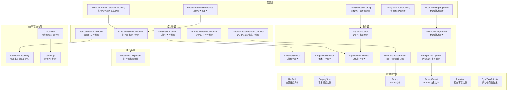

**图表来源**
- [TaskSchedulerConfig.java:1-30](file://med_ai_assistant_1.0_bs_backend/src/main/java/com/example/medaiassistant/config/TaskSchedulerConfig.java#L1-L30)
- [SyncScheduler.java:1-549](file://med_ai_assistant_1.0_bs_backend/src/main/java/com/example/medaiassistant/hospital/service/SyncScheduler.java#L1-L549)
- [AlertTaskService.java:1-72](file://med_ai_assistant_1.0_bs_backend/src/main/java/com/example/medaiassistant/service/AlertTaskService.java#L1-L72)
- [ExecutionServerProperties.java](file://med_ai_assistant_1.0_bs_backend/src/main/java/com/example/medaiassistant/config/ExecutionServerProperties.java)
- [ExecutionServerDataSourceConfig.java](file://med_ai_assistant_1.0_bs_backend/src/main/java/com/example/medaiassistant/config/ExecutionServerDataSourceConfig.java)
- [LabSyncSchedulerConfig.java](file://med_ai_assistant_1.0_bs_backend/src/main/java/com/example/medaiassistant/config/LabSyncSchedulerConfig.java)
- [MccScreeningProperties.java](file://med_ai_assistant_1.0_bs_backend/src/main/java/com/example/medaiassistant/config/MccScreeningProperties.java)
- [AlertTask.java:1-185](file://med_ai_assistant_1.0_bs_backend/src/main/java/com/example/medaiassistant/model/AlertTask.java#L1-L185)
- [SurgeryTask.java](file://med_ai_assistant_1.0_bs_backend/src/main/java/com/example/medaiassistant/model/SurgeryTask.java)
- [Prompt.java:1-264](file://med_ai_assistant_1.0_bs_backend/src/main/java/com/example/medaiassistant/model/Prompt.java#L1-L264)
- [PromptResult.java:1-145](file://med_ai_assistant_1.0_bs_backend/src/main/java/com/example/medaiassistant/model/PromptResult.java#L1-L145)
- [TodoItem.java:1-177](file://med_ai_assistant_1.0_bs_backend/src/main/java/com/example/medaiassistant/model/TodoItem.java#L1-L177)
- [SyncTaskPriority.java](file://med_ai_assistant_1.0_bs_backend/src/main/java/com/example/medaiassistant/hospital/model/SyncTaskPriority.java)
- [AlertTaskController.java](file://med_ai_assistant_1.0_bs_backend/src/main/java/com/example/medaiassistant/controller/AlertTaskController.java)
- [ExecutionServerController.java](file://med_ai_assistant_1.0_bs_backend/src/main/java/com/example/medaiassistant/controller/ExecutionServerController.java)
- [PromptExecutionController.java](file://med_ai_assistant_1.0_bs_backend/src/main/java/com/example/medaiassistant/controller/PromptExecutionController.java)
- [TimerPromptGeneratorController.java:1-100](file://med_ai_assistant_1.0_bs_backend/src/main/java/com/example/medaiassistant/controller/TimerPromptGeneratorController.java#L1-L100)
- [TimerPromptGenerator.java](file://med_ai_assistant_1.0_bs_backend/src/main/java/com/example/medaiassistant/service/TimerPromptGenerator.java)
- [MccScreeningService.java](file://med_ai_assistant_1.0_bs_backend/src/main/java/com/example/medaiassistant/service/MccScreeningService.java)
- [PromptsTaskUpdater.java:1-116](file://med_ai_assistant_1.0_bs_backend/src/main/java/com/example/medaiassistant/service/PromptsTaskUpdater.java#L1-L116)
- [ExecutionComponent.java:1-24](file://med_ai_assistant_1.0_bs_backend/src/main/java/com/example/medaiassistant/execution/ExecutionComponent.java#L1-L24)
- [MedicalRecordController.java:1-653](file://med_ai_assistant_1.0_bs_backend/src/main/java/com/example/medaiassistant/controller/MedicalRecordController.java#L1-L653)
- [TodoItemRepository.java:1-108](file://med_ai_assistant_1.0_bs_backend/src/main/java/com/example/medaiassistant/repository/TodoItemRepository.java#L1-L108)
- [TodoView.vue:1-717](file://med_ai_assistant_1.0_bs_vue/src/views/TodoView.vue#L1-L717)
- [patient.js:1-616](file://med_ai_assistant_1.0_bs_vue/src/api/patient.js#L1-L616)

**章节来源**
- [TaskSchedulerConfig.java:1-30](file://med_ai_assistant_1.0_bs_backend/src/main/java/com/example/medaiassistant/config/TaskSchedulerConfig.java#L1-L30)
- [SyncScheduler.java:1-549](file://med_ai_assistant_1.0_bs_backend/src/main/java/com/example/medaiassistant/hospital/service/SyncScheduler.java#L1-L549)
- [AlertTaskService.java:1-72](file://med_ai_assistant_1.0_bs_backend/src/main/java/com/example/medaiassistant/service/AlertTaskService.java#L1-L72)
- [ExecutionServerProperties.java](file://med_ai_assistant_1.0_bs_backend/src/main/java/com/example/medaiassistant/config/ExecutionServerProperties.java)
- [ExecutionServerDataSourceConfig.java](file://med_ai_assistant_1.0_bs_backend/src/main/java/com/example/medaiassistant/config/ExecutionServerDataSourceConfig.java)
- [LabSyncSchedulerConfig.java](file://med_ai_assistant_1.0_bs_backend/src/main/java/com/example/medaiassistant/config/LabSyncSchedulerConfig.java)
- [MccScreeningProperties.java](file://med_ai_assistant_1.0_bs_backend/src/main/java/com/example/medaiassistant/config/MccScreeningProperties.java)
- [AlertTask.java:1-185](file://med_ai_assistant_1.0_bs_backend/src/main/java/com/example/medaiassistant/model/AlertTask.java#L1-L185)
- [SurgeryTask.java](file://med_ai_assistant_1.0_bs_backend/src/main/java/com/example/medaiassistant/model/SurgeryTask.java)
- [Prompt.java:1-264](file://med_ai_assistant_1.0_bs_backend/src/main/java/com/example/medaiassistant/model/Prompt.java#L1-L264)
- [PromptResult.java:1-145](file://med_ai_assistant_1.0_bs_backend/src/main/java/com/example/medaiassistant/model/PromptResult.java#L1-L145)
- [TodoItem.java:1-177](file://med_ai_assistant_1.0_bs_backend/src/main/java/com/example/medaiassistant/model/TodoItem.java#L1-L177)
- [SyncTaskPriority.java](file://med_ai_assistant_1.0_bs_backend/src/main/java/com/example/medaiassistant/hospital/model/SyncTaskPriority.java)
- [AlertTaskController.java](file://med_ai_assistant_1.0_bs_backend/src/main/java/com/example/medaiassistant/controller/AlertTaskController.java)
- [ExecutionServerController.java](file://med_ai_assistant_1.0_bs_backend/src/main/java/com/example/medaiassistant/controller/ExecutionServerController.java)
- [PromptExecutionController.java](file://med_ai_assistant_1.0_bs_backend/src/main/java/com/example/medaiassistant/controller/PromptExecutionController.java)
- [TimerPromptGeneratorController.java:1-100](file://med_ai_assistant_1.0_bs_backend/src/main/java/com/example/medaiassistant/controller/TimerPromptGeneratorController.java#L1-L100)
- [TimerPromptGenerator.java](file://med_ai_assistant_1.0_bs_backend/src/main/java/com/example/medaiassistant/service/TimerPromptGenerator.java)
- [MccScreeningService.java](file://med_ai_assistant_1.0_bs_backend/src/main/java/com/example/medaiassistant/service/MccScreeningService.java)
- [PromptsTaskUpdater.java:1-116](file://med_ai_assistant_1.0_bs_backend/src/main/java/com/example/medaiassistant/service/PromptsTaskUpdater.java#L1-L116)
- [ExecutionComponent.java:1-24](file://med_ai_assistant_1.0_bs_backend/src/main/java/com/example/medaiassistant/execution/ExecutionComponent.java#L1-L24)
- [MedicalRecordController.java:1-653](file://med_ai_assistant_1.0_bs_backend/src/main/java/com/example/medaiassistant/controller/MedicalRecordController.java#L1-L653)
- [TodoItemRepository.java:1-108](file://med_ai_assistant_1.0_bs_backend/src/main/java/com/example/medaiassistant/repository/TodoItemRepository.java#L1-L108)
- [TodoView.vue:1-717](file://med_ai_assistant_1.0_bs_vue/src/views/TodoView.vue#L1-L717)
- [patient.js:1-616](file://med_ai_assistant_1.0_bs_vue/src/api/patient.js#L1-L616)

## 核心组件
- 线程池与调度器配置：统一配置线程池大小、线程名前缀、守护线程等，确保调度器可扩展与可控。
- 定时任务调度器：支持按优先级调度、并发控制、任务状态管理、统计与监控。
- 任务服务：提供任务状态更新、查询等业务能力。
- MCC筛选服务：新增的合并症或并发症自动识别服务，支持MCC筛选Prompt生成。
- 执行组件：区分执行服务器环境，便于隔离与扩展。
- 控制器：对外暴露任务查询、执行、状态管理等接口。
- **更新** AlertTask批量更新服务：修复批量更新异常，改进去重和异常处理机制。
- **新增** 待办事项查询系统：专门处理待办事项的查询、过滤和展示逻辑，包含智能去重算法。

**章节来源**
- [TaskSchedulerConfig.java:1-30](file://med_ai_assistant_1.0_bs_backend/src/main/java/com/example/medaiassistant/config/TaskSchedulerConfig.java#L1-L30)
- [SyncScheduler.java:1-549](file://med_ai_assistant_1.0_bs_backend/src/main/java/com/example/medaiassistant/hospital/service/SyncScheduler.java#L1-L549)
- [AlertTaskService.java:1-72](file://med_ai_assistant_1.0_bs_backend/src/main/java/com/example/medaiassistant/service/AlertTaskService.java#L1-L72)
- [MccScreeningService.java](file://med_ai_assistant_1.0_bs_backend/src/main/java/com/example/medaiassistant/service/MccScreeningService.java)
- [ExecutionComponent.java:1-24](file://med_ai_assistant_1.0_bs_backend/src/main/java/com/example/medaiassistant/execution/ExecutionComponent.java#L1-L24)
- [PromptsTaskUpdater.java:1-116](file://med_ai_assistant_1.0_bs_backend/src/main/java/com/example/medaiassistant/service/PromptsTaskUpdater.java#L1-L116)
- [MedicalRecordController.java:1-653](file://med_ai_assistant_1.0_bs_backend/src/main/java/com/example/medaiassistant/controller/MedicalRecordController.java#L1-L653)

## 架构总览
系统采用"主服务器 + 执行服务器"的分布式架构：
- 主服务器负责任务编排、优先级调度、状态同步与监控。
- 执行服务器负责具体任务执行与数据处理。
- 通过控制器与服务层实现任务分配与状态回传。
- **新增** MCC筛选服务作为独立组件参与定时任务调度。
- **更新** AlertTask批量更新机制通过PromptsTaskUpdater实现，增强了任务状态管理的可靠性。
- **新增** 待办事项查询系统通过MedicalRecordController和TodoItemRepository提供智能查询能力。

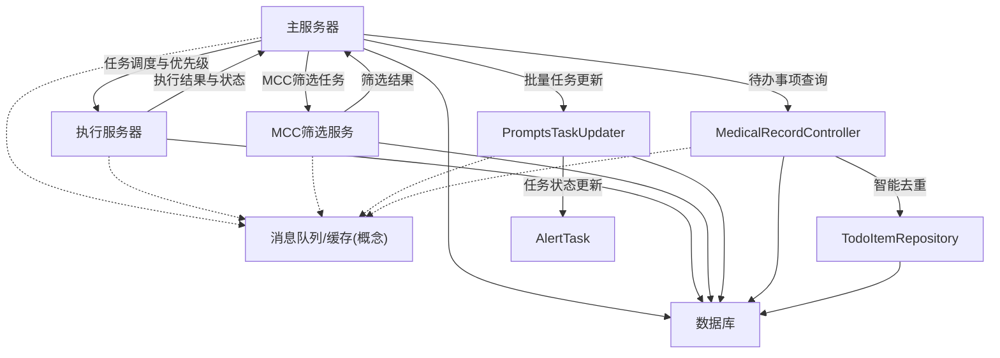

[此图为概念性架构图，不直接对应具体源码文件，故无图表来源]

## 详细组件分析

### 线程池与调度器配置
- 通过线程池任务调度器统一管理调度线程，设置池大小、线程名前缀、守护线程等。
- 与调度属性配置绑定，确保可配置化与可观察性。

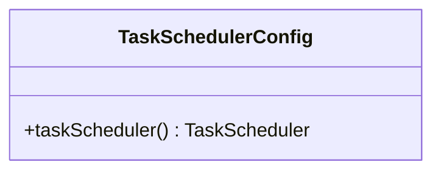

**图表来源**
- [TaskSchedulerConfig.java:1-30](file://med_ai_assistant_1.0_bs_backend/src/main/java/com/example/medaiassistant/config/TaskSchedulerConfig.java#L1-L30)

**章节来源**
- [TaskSchedulerConfig.java:1-30](file://med_ai_assistant_1.0_bs_backend/src/main/java/com/example/medaiassistant/config/TaskSchedulerConfig.java#L1-L30)

### 定时任务调度器（SyncScheduler）
- 任务优先级：支持高、中、低优先级，按数值升序执行（数值越小优先级越高）。
- 并发控制：基于ReentrantLock对同一医院任务串行执行，避免重复执行。
- 任务状态：维护任务状态字典，支持运行中、已完成、失败、中断等状态。
- 统计与监控：记录执行次数、最近任务状态、启用任务数等。
- 自动同步：支持按小时自动同步与全局开关控制。

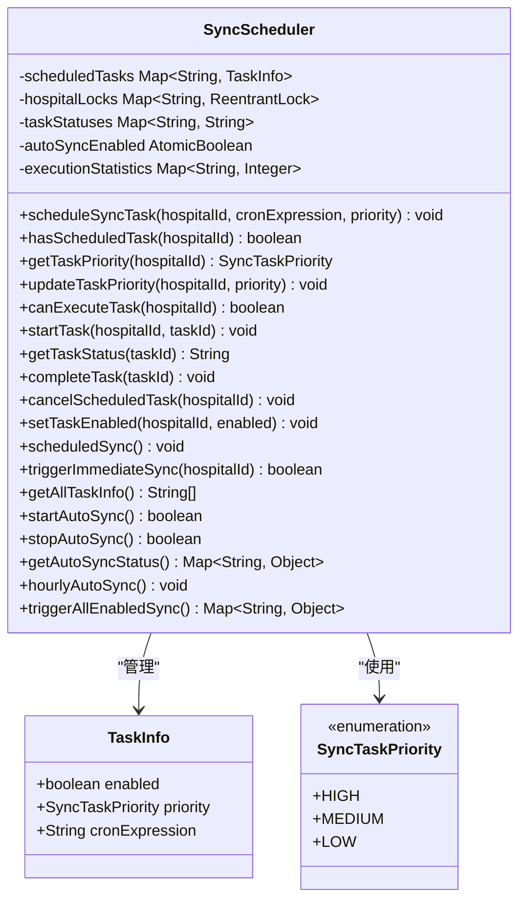

**图表来源**
- [SyncScheduler.java:1-549](file://med_ai_assistant_1.0_bs_backend/src/main/java/com/example/medaiassistant/hospital/service/SyncScheduler.java#L1-L549)
- [SyncTaskPriority.java](file://med_ai_assistant_1.0_bs_backend/src/main/java/com/example/medaiassistant/hospital/model/SyncTaskPriority.java)

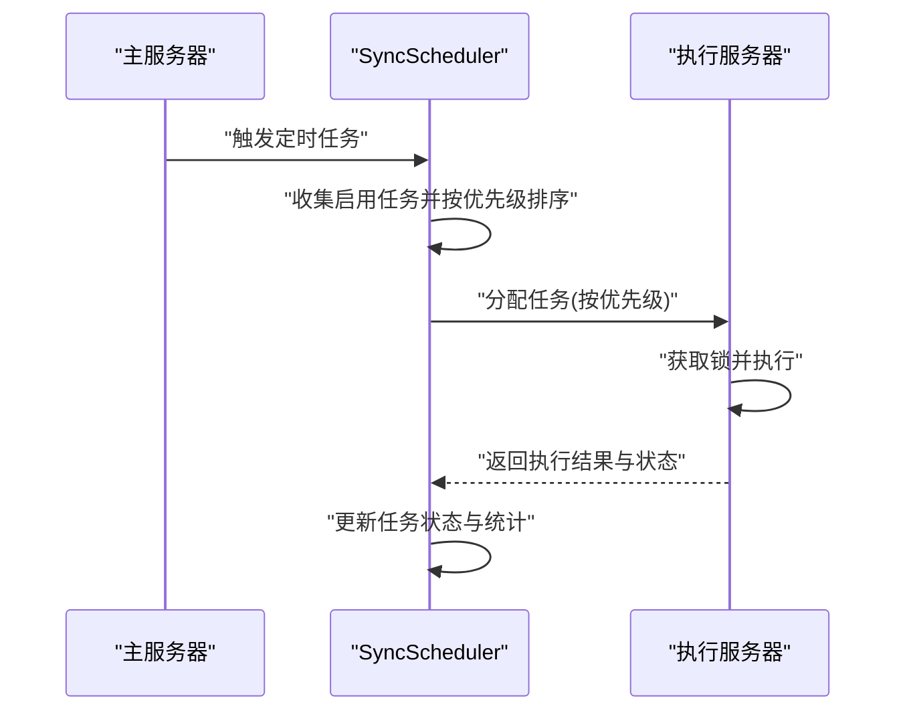

**图表来源**
- [SyncScheduler.java:219-245](file://med_ai_assistant_1.0_bs_backend/src/main/java/com/example/medaiassistant/hospital/service/SyncScheduler.java#L219-L245)
- [SyncScheduler.java:444-487](file://med_ai_assistant_1.0_bs_backend/src/main/java/com/example/medaiassistant/hospital/service/SyncScheduler.java#L444-L487)

**图表来源**
- [SyncScheduler.java:219-245](file://med_ai_assistant_1.0_bs_backend/src/main/java/com/example/medaiassistant/hospital/service/SyncScheduler.java#L219-L245)
- [SyncScheduler.java:289-312](file://med_ai_assistant_1.0_bs_backend/src/main/java/com/example/medaiassistant/hospital/service/SyncScheduler.java#L289-L312)

**章节来源**
- [SyncScheduler.java:1-549](file://med_ai_assistant_1.0_bs_backend/src/main/java/com/example/medaiassistant/hospital/service/SyncScheduler.java#L1-L549)
- [SyncTaskPriority.java](file://med_ai_assistant_1.0_bs_backend/src/main/java/com/example/medaiassistant/hospital/model/SyncTaskPriority.java)

### 告警任务服务（AlertTaskService）
- 提供按患者ID查询待处理告警任务的能力。
- 提供任务状态更新的事务性操作，确保数据一致性。
- 提供按任务ID获取任务详情。
- **更新** 修复批量更新异常：通过AlertTaskRepository的JPQL更新语句确保精确的行数更新，避免批量更新异常。

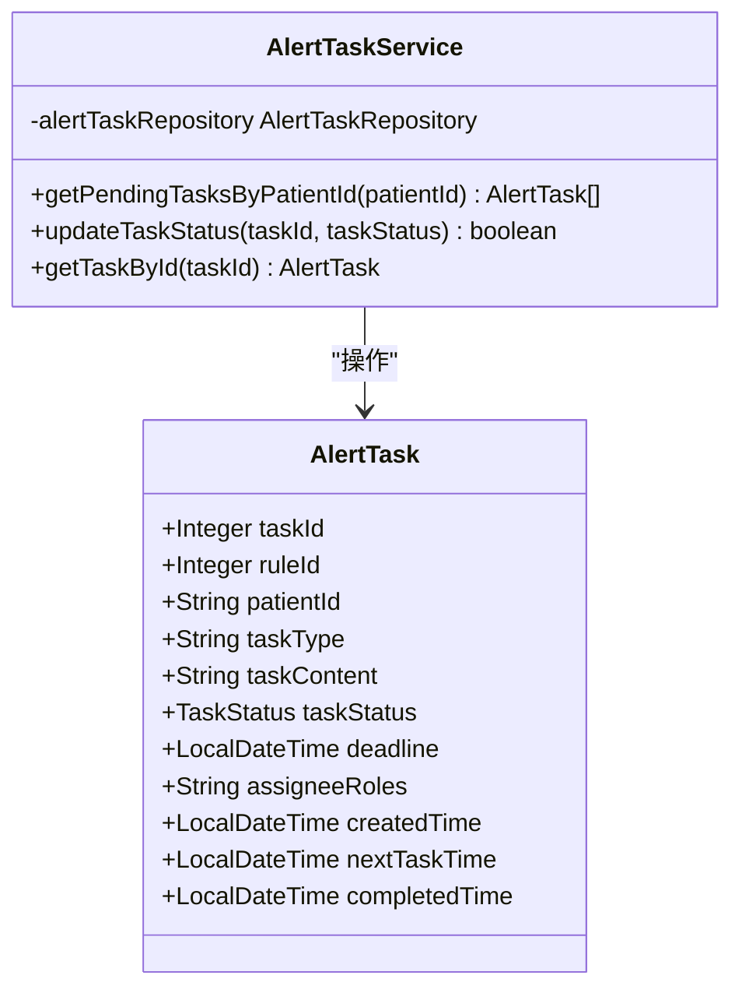

**图表来源**
- [AlertTaskService.java:1-72](file://med_ai_assistant_1.0_bs_backend/src/main/java/com/example/medaiassistant/service/AlertTaskService.java#L1-L72)
- [AlertTask.java:1-185](file://med_ai_assistant_1.0_bs_backend/src/main/java/com/example/medaiassistant/model/AlertTask.java#L1-L185)

**章节来源**
- [AlertTaskService.java:1-72](file://med_ai_assistant_1.0_bs_backend/src/main/java/com/example/medaiassistant/service/AlertTaskService.java#L1-L72)
- [AlertTask.java:1-185](file://med_ai_assistant_1.0_bs_backend/src/main/java/com/example/medaiassistant/model/AlertTask.java#L1-L185)

### 执行服务器组件与配置
- 执行组件用于在执行服务器环境下加载，便于环境隔离。
- 执行服务器属性与数据源配置支持独立部署与扩展。

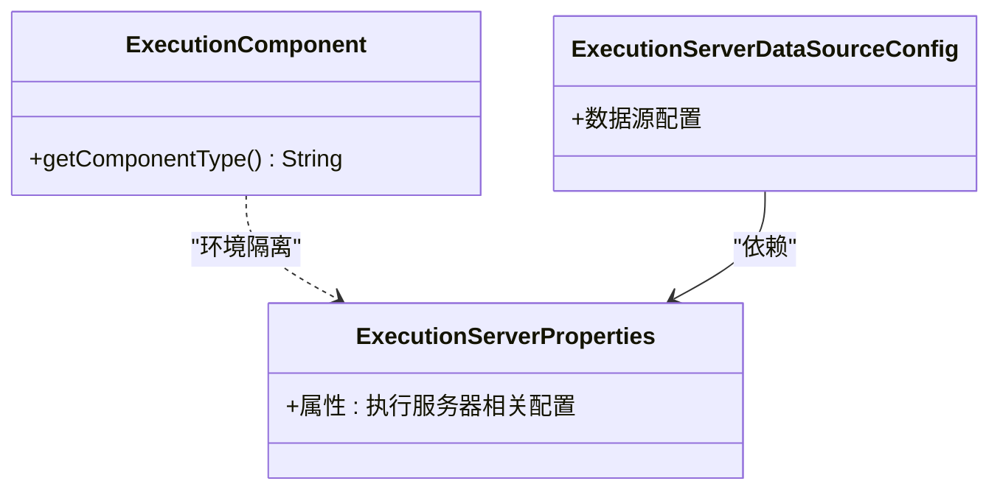

**图表来源**
- [ExecutionComponent.java:1-24](file://med_ai_assistant_1.0_bs_backend/src/main/java/com/example/medaiassistant/execution/ExecutionComponent.java#L1-L24)
- [ExecutionServerProperties.java](file://med_ai_assistant_1.0_bs_backend/src/main/java/com/example/medaiassistant/config/ExecutionServerProperties.java)
- [ExecutionServerDataSourceConfig.java](file://med_ai_assistant_1.0_bs_backend/src/main/java/com/example/medaiassistant/config/ExecutionServerDataSourceConfig.java)

**章节来源**
- [ExecutionComponent.java:1-24](file://med_ai_assistant_1.0_bs_backend/src/main/java/com/example/medaiassistant/execution/ExecutionComponent.java#L1-L24)
- [ExecutionServerProperties.java](file://med_ai_assistant_1.0_bs_backend/src/main/java/com/example/medaiassistant/config/ExecutionServerProperties.java)
- [ExecutionServerDataSourceConfig.java](file://med_ai_assistant_1.0_bs_backend/src/main/java/com/example/medaiassistant/config/ExecutionServerDataSourceConfig.java)

### 实验室同步与SQL执行
- 实验室同步配置提供独立的调度策略。
- SQL执行服务负责执行具体的SQL任务，可与定时调度器配合使用。

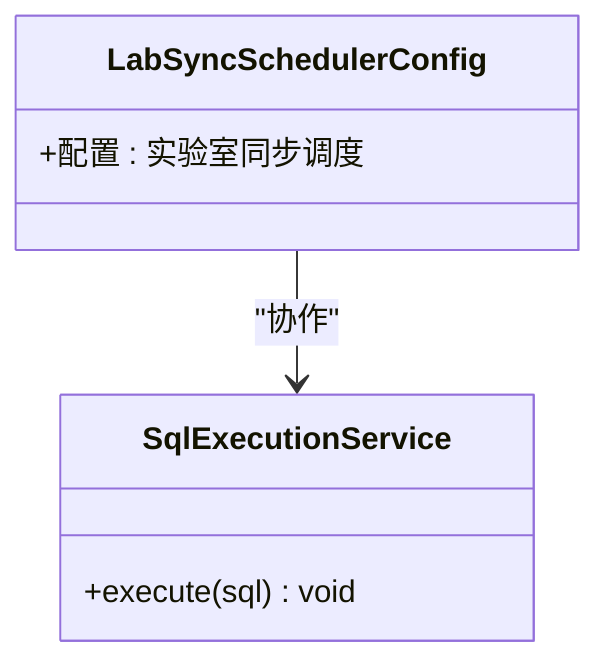

**图表来源**
- [LabSyncSchedulerConfig.java](file://med_ai_assistant_1.0_bs_backend/src/main/java/com/example/medaiassistant/config/LabSyncSchedulerConfig.java)
- [SqlExecutionService.java](file://med_ai_assistant_1.0_bs_backend/src/main/java/com/example/medaiassistant/hospital/service/SqlExecutionService.java)

**章节来源**
- [LabSyncSchedulerConfig.java](file://med_ai_assistant_1.0_bs_backend/src/main/java/com/example/medaiassistant/config/LabSyncSchedulerConfig.java)
- [SqlExecutionService.java](file://med_ai_assistant_1.0_bs_backend/src/main/java/com/example/medaiassistant/hospital/service/SqlExecutionService.java)

### PromptsTaskUpdater（更新后的批量处理）
- **更新** 改进去重机制：使用Stream API的Collectors.toMap方法，按taskId去重，防止重复记录导致批量更新异常
- **更新** 增强批量保存逻辑：添加JpaSystemException异常捕获和降级处理，支持批量更新失败时的逐条保存
- **更新** 48小时间隔检查：在更新任务状态前检查任务的完成时间间隔，确保符合48小时的业务规则
- **更新** 事务性批量更新：通过@Transactional注解确保批量更新的原子性

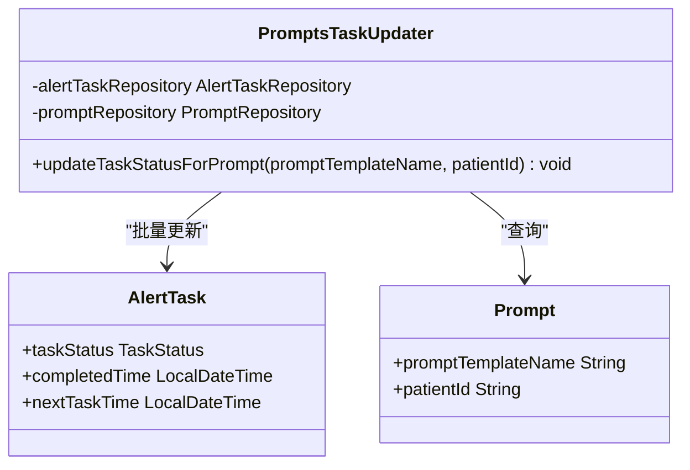

**图表来源**
- [PromptsTaskUpdater.java:1-116](file://med_ai_assistant_1.0_bs_backend/src/main/java/com/example/medaiassistant/service/PromptsTaskUpdater.java#L1-L116)
- [AlertTask.java:1-185](file://med_ai_assistant_1.0_bs_backend/src/main/java/com/example/medaiassistant/model/AlertTask.java#L1-L185)
- [Prompt.java:1-264](file://med_ai_assistant_1.0_bs_backend/src/main/java/com/example/medaiassistant/model/Prompt.java#L1-L264)

**章节来源**
- [PromptsTaskUpdater.java:1-116](file://med_ai_assistant_1.0_bs_backend/src/main/java/com/example/medaiassistant/service/PromptsTaskUpdater.java#L1-L116)
- [AlertTask.java:1-185](file://med_ai_assistant_1.0_bs_backend/src/main/java/com/example/medaiassistant/model/AlertTask.java#L1-L185)
- [Prompt.java:1-264](file://med_ai_assistant_1.0_bs_backend/src/main/java/com/example/medaiassistant/model/Prompt.java#L1-L264)

## MCC筛选Prompt生成系统

### 定时Prompt生成控制器
- 提供定时器启动、停止和状态查询接口
- 支持手动触发每日Prompt生成任务
- 具备临时配置修改功能，支持临时时间设置和并发数调整

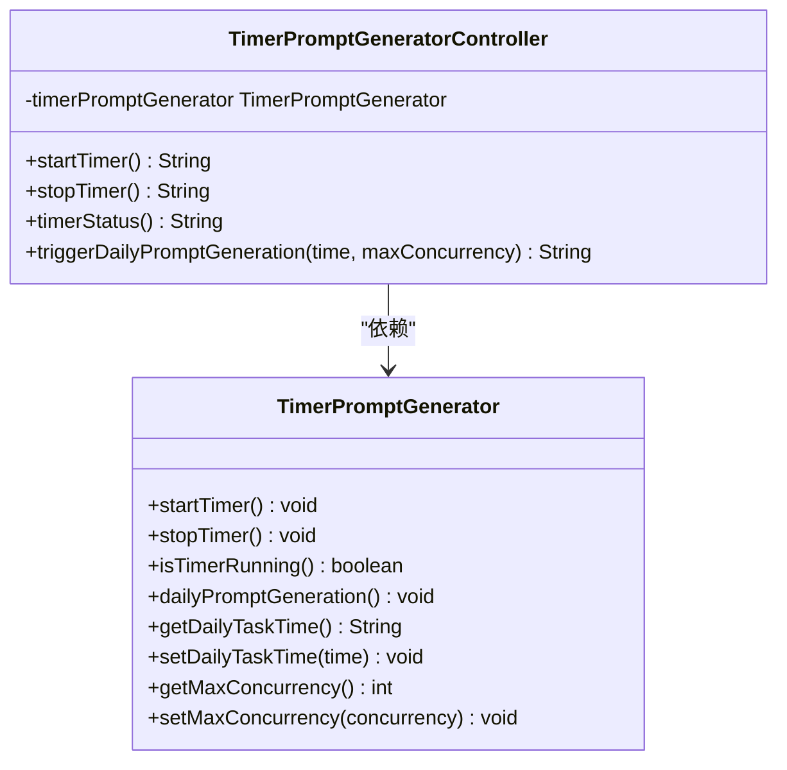

**图表来源**
- [TimerPromptGeneratorController.java:1-100](file://med_ai_assistant_1.0_bs_backend/src/main/java/com/example/medaiassistant/controller/TimerPromptGeneratorController.java#L1-L100)
- [TimerPromptGenerator.java](file://med_ai_assistant_1.0_bs_backend/src/main/java/com/example/medaiassistant/service/TimerPromptGenerator.java)

**章节来源**
- [TimerPromptGeneratorController.java:1-100](file://med_ai_assistant_1.0_bs_backend/src/main/java/com/example/medaiassistant/controller/TimerPromptGeneratorController.java#L1-L100)
- [TimerPromptGenerator.java](file://med_ai_assistant_1.0_bs_backend/src/main/java/com/example/medaiassistant/service/TimerPromptGenerator.java)

### MCC筛选服务
- **新增** 合并症或并发症自动识别服务
- 支持MCC筛选算法，包括编码匹配、排除规则、相似度计算
- 提供分组排序、阈值控制、Top-K选择等功能
- 集成诊断数据和Prompt模板，生成MCC分析Prompt

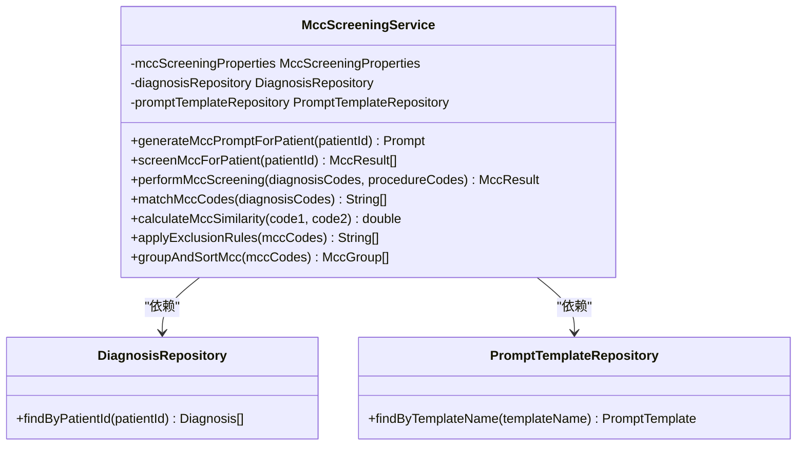

**图表来源**
- [MccScreeningService.java](file://med_ai_assistant_1.0_bs_backend/src/main/java/com/example/medaiassistant/service/MccScreeningService.java)
- [DiagnosisRepository.java](file://med_ai_assistant_1.0_bs_backend/src/main/java/com/example/medaiassistant/repository/DiagnosisRepository.java)
- [PromptTemplateRepository.java](file://med_ai_assistant_1.0_bs_backend/src/main/java/com/example/medaiassistant/repository/PromptTemplateRepository.java)

**章节来源**
- [MccScreeningService.java](file://med_ai_assistant_1.0_bs_backend/src/main/java/com/example/medaiassistant/service/MccScreeningService.java)
- [DiagnosisRepository.java](file://med_ai_assistant_1.0_bs_backend/src/main/java/com/example/medaiassistant/repository/DiagnosisRepository.java)
- [PromptTemplateRepository.java](file://med_ai_assistant_1.0_bs_backend/src/main/java/com/example/medaiassistant/repository/PromptTemplateRepository.java)

### Prompt任务更新器
- **新增** 处理Prompts与AlertTask状态更新的服务类
- 专门处理"上级医师查房记录"模板的提醒任务状态更新
- 实现48小时间隔检查和任务状态自动完成逻辑
- **更新** 改进去重和批量保存逻辑，增强异常处理能力

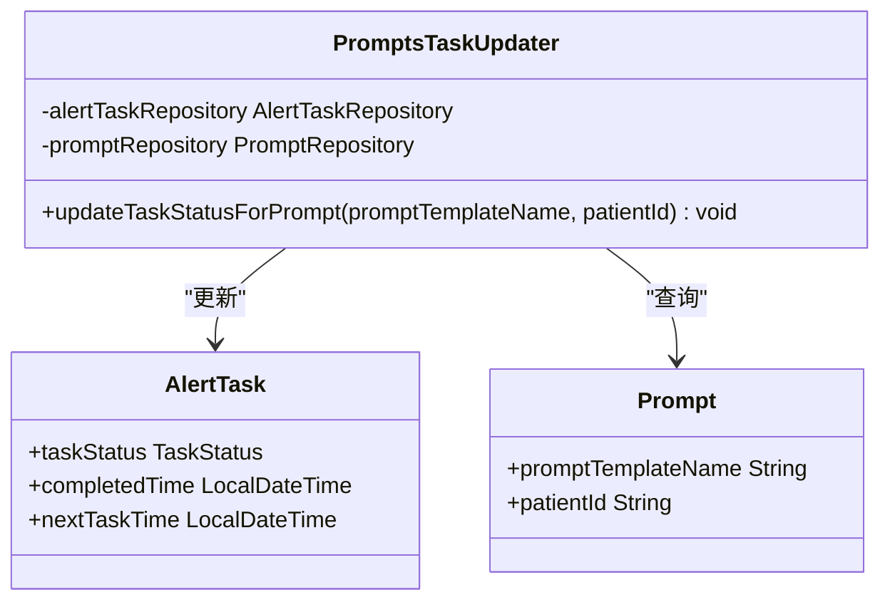

**图表来源**
- [PromptsTaskUpdater.java:1-116](file://med_ai_assistant_1.0_bs_backend/src/main/java/com/example/medaiassistant/service/PromptsTaskUpdater.java#L1-L116)
- [AlertTask.java:1-185](file://med_ai_assistant_1.0_bs_backend/src/main/java/com/example/medaiassistant/model/AlertTask.java#L1-L185)
- [Prompt.java:1-264](file://med_ai_assistant_1.0_bs_backend/src/main/java/com/example/medaiassistant/model/Prompt.java#L1-L264)

**章节来源**
- [PromptsTaskUpdater.java:1-116](file://med_ai_assistant_1.0_bs_backend/src/main/java/com/example/medaiassistant/service/PromptsTaskUpdater.java#L1-L116)
- [AlertTask.java:1-185](file://med_ai_assistant_1.0_bs_backend/src/main/java/com/example/medaiassistant/model/AlertTask.java#L1-L185)
- [Prompt.java:1-264](file://med_ai_assistant_1.0_bs_backend/src/main/java/com/example/medaiassistant/model/Prompt.java#L1-L264)

## 待办事项查询系统

### 智能去重算法实现
**更新** 通过filterLatestTodoPerRecord方法实现了高效的去重算法，确保每个患者医疗记录只返回最新待办事项：

- **null安全处理**：输入列表为null或空时直接返回空列表
- **null ID兼容**：medicalRecordId为null的记录不参与分组，直接保留
- **智能分组**：使用Stream API的Collectors.toMap方法按medicalRecordId分组
- **时间比较**：在合并冲突时比较createdTime，保留最新记录
- **createdTime安全**：createdTime为null的记录在比较时被视为最旧

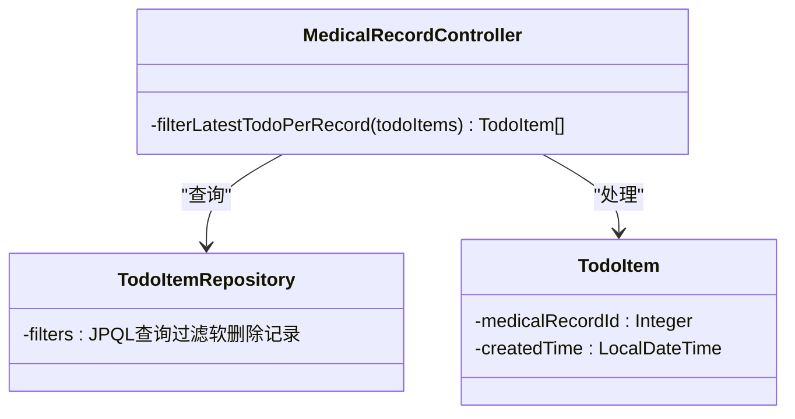

**图表来源**
- [MedicalRecordController.java:624-650](file://med_ai_assistant_1.0_bs_backend/src/main/java/com/example/medaiassistant/controller/MedicalRecordController.java#L624-L650)
- [TodoItemRepository.java:63-106](file://med_ai_assistant_1.0_bs_backend/src/main/java/com/example/medaiassistant/repository/TodoItemRepository.java#L63-L106)
- [TodoItem.java:36-50](file://med_ai_assistant_1.0_bs_backend/src/main/java/com/example/medaiassistant/model/TodoItem.java#L36-L50)

### 查询接口优化
**更新** 三个核心查询接口均集成了智能去重功能：

1. **患者待办查询** (`/api/medicalrecords/patient/{patientId}/todos`)
   - 自动过滤软删除病历记录
   - 按medicalRecordId去重，保留最新记录
   - 按创建时间降序排列

2. **科室待办查询** (`/api/medicalrecords/todos/by-date-department`)
   - 支持日期范围查询（00:00:00 - 23:59:59）
   - 自动过滤软删除病历记录
   - 按medicalRecordId去重，保留最新记录
   - 按床号升序排列

3. **病历待办查询** (`/api/medicalrecords/todo/{medicalRecordId}`)
   - 保持原有功能不变
   - 返回该病历关联的所有待办事项

**章节来源**
- [MedicalRecordController.java:434-465](file://med_ai_assistant_1.0_bs_backend/src/main/java/com/example/medaiassistant/controller/MedicalRecordController.java#L434-L465)
- [MedicalRecordController.java:540-590](file://med_ai_assistant_1.0_bs_backend/src/main/java/com/example/medaiassistant/controller/MedicalRecordController.java#L540-L590)
- [MedicalRecordController.java:346-365](file://med_ai_assistant_1.0_bs_backend/src/main/java/com/example/medaiassistant/controller/MedicalRecordController.java#L346-L365)
- [TodoItemRepository.java:63-106](file://med_ai_assistant_1.0_bs_backend/src/main/java/com/example/medaiassistant/repository/TodoItemRepository.java#L63-L106)

### 前端展示优化
**更新** TodoView.vue中的待办事项展示逻辑得到优化：

- **智能汇总**：同一病人的多条待办事项自动合并到一张卡片中
- **内容拼接**：多个待办事项的内容通过换行符连接
- **计数统计**：显示每个病人的待办事项数量
- **时间排序**：按创建时间倒序排列待办事项

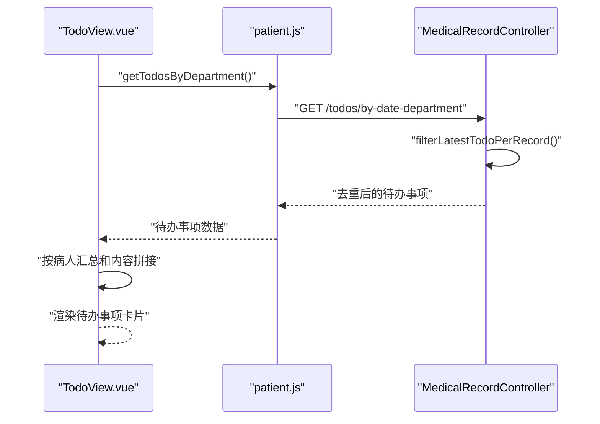

**图表来源**
- [TodoView.vue:207-247](file://med_ai_assistant_1.0_bs_vue/src/views/TodoView.vue#L207-L247)
- [patient.js:611-615](file://med_ai_assistant_1.0_bs_vue/src/api/patient.js#L611-L615)
- [MedicalRecordController.java:540-590](file://med_ai_assistant_1.0_bs_backend/src/main/java/com/example/medaiassistant/controller/MedicalRecordController.java#L540-L590)

**章节来源**
- [TodoView.vue:207-247](file://med_ai_assistant_1.0_bs_vue/src/views/TodoView.vue#L207-L247)
- [patient.js:611-615](file://med_ai_assistant_1.0_bs_vue/src/api/patient.js#L611-L615)
- [MedicalRecordController.java:624-650](file://med_ai_assistant_1.0_bs_backend/src/main/java/com/example/medaiassistant/controller/MedicalRecordController.java#L624-L650)

## 依赖关系分析
- SyncScheduler 依赖于任务优先级枚举与并发锁，负责任务调度与状态管理。
- AlertTaskService 依赖 AlertTask 实体与仓库，提供任务状态更新与查询。
- **新增** TimerPromptGenerator 依赖定时任务配置和MCC筛选服务，负责每日Prompt生成调度。
- **新增** MccScreeningService 依赖诊断仓库和Prompt模板仓库，实现MCC筛选逻辑。
- **新增** PromptsTaskUpdater 依赖AlertTaskRepository和PromptRepository，处理任务状态更新。
- **更新** AlertTaskRepository 提供精确的JPQL更新语句，避免批量更新异常。
- **新增** MedicalRecordController 依赖TodoItemRepository，提供智能待办事项查询服务。
- **新增** TodoItemRepository 提供软删除过滤的JPQL查询方法。
- **新增** TodoView.vue 依赖patient.js API封装，提供优化的前端展示。
- 执行服务器组件与配置相互依赖，确保执行环境正确加载。
- 控制器层通过服务层与执行层交互，形成清晰的职责边界。

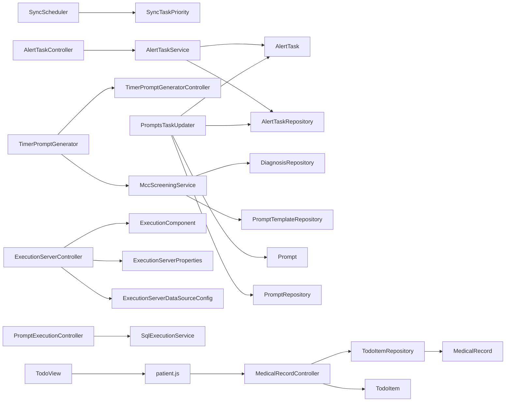

**图表来源**
- [SyncScheduler.java:1-549](file://med_ai_assistant_1.0_bs_backend/src/main/java/com/example/medaiassistant/hospital/service/SyncScheduler.java#L1-L549)
- [AlertTaskService.java:1-72](file://med_ai_assistant_1.0_bs_backend/src/main/java/com/example/medaiassistant/service/AlertTaskService.java#L1-L72)
- [AlertTaskRepository.java:1-81](file://med_ai_assistant_1.0_bs_backend/src/main/java/com/example/medaiassistant/repository/AlertTaskRepository.java#L1-L81)
- [TimerPromptGenerator.java](file://med_ai_assistant_1.0_bs_backend/src/main/java/com/example/medaiassistant/service/TimerPromptGenerator.java)
- [TimerPromptGeneratorController.java:1-100](file://med_ai_assistant_1.0_bs_backend/src/main/java/com/example/medaiassistant/controller/TimerPromptGeneratorController.java#L1-L100)
- [MccScreeningService.java](file://med_ai_assistant_1.0_bs_backend/src/main/java/com/example/medaiassistant/service/MccScreeningService.java)
- [DiagnosisRepository.java](file://med_ai_assistant_1.0_bs_backend/src/main/java/com/example/medaiassistant/repository/DiagnosisRepository.java)
- [PromptTemplateRepository.java](file://med_ai_assistant_1.0_bs_backend/src/main/java/com/example/medaiassistant/repository/PromptTemplateRepository.java)
- [PromptsTaskUpdater.java:1-116](file://med_ai_assistant_1.0_bs_backend/src/main/java/com/example/medaiassistant/service/PromptsTaskUpdater.java#L1-L116)
- [AlertTask.java:1-185](file://med_ai_assistant_1.0_bs_backend/src/main/java/com/example/medaiassistant/model/AlertTask.java#L1-L185)
- [Prompt.java:1-264](file://med_ai_assistant_1.0_bs_backend/src/main/java/com/example/medaiassistant/model/Prompt.java#L1-L264)
- [ExecutionServerController.java](file://med_ai_assistant_1.0_bs_backend/src/main/java/com/example/medaiassistant/controller/ExecutionServerController.java)
- [ExecutionComponent.java:1-24](file://med_ai_assistant_1.0_bs_backend/src/main/java/com/example/medaiassistant/execution/ExecutionComponent.java#L1-L24)
- [ExecutionServerProperties.java](file://med_ai_assistant_1.0_bs_backend/src/main/java/com/example/medaiassistant/config/ExecutionServerProperties.java)
- [ExecutionServerDataSourceConfig.java](file://med_ai_assistant_1.0_bs_backend/src/main/java/com/example/medaiassistant/config/ExecutionServerDataSourceConfig.java)
- [AlertTaskController.java](file://med_ai_assistant_1.0_bs_backend/src/main/java/com/example/medaiassistant/controller/AlertTaskController.java)
- [PromptExecutionController.java](file://med_ai_assistant_1.0_bs_backend/src/main/java/com/example/medaiassistant/controller/PromptExecutionController.java)
- [SqlExecutionService.java](file://med_ai_assistant_1.0_bs_backend/src/main/java/com/example/medaiassistant/hospital/service/SqlExecutionService.java)
- [MedicalRecordController.java:1-653](file://med_ai_assistant_1.0_bs_backend/src/main/java/com/example/medaiassistant/controller/MedicalRecordController.java#L1-L653)
- [TodoItemRepository.java:1-108](file://med_ai_assistant_1.0_bs_backend/src/main/java/com/example/medaiassistant/repository/TodoItemRepository.java#L1-L108)
- [TodoItem.java:1-177](file://med_ai_assistant_1.0_bs_backend/src/main/java/com/example/medaiassistant/model/TodoItem.java#L1-L177)
- [TodoView.vue:1-717](file://med_ai_assistant_1.0_bs_vue/src/views/TodoView.vue#L1-L717)
- [patient.js:1-616](file://med_ai_assistant_1.0_bs_vue/src/api/patient.js#L1-L616)

**章节来源**
- [SyncScheduler.java:1-549](file://med_ai_assistant_1.0_bs_backend/src/main/java/com/example/medaiassistant/hospital/service/SyncScheduler.java#L1-L549)
- [AlertTaskService.java:1-72](file://med_ai_assistant_1.0_bs_backend/src/main/java/com/example/medaiassistant/service/AlertTaskService.java#L1-L72)
- [AlertTaskRepository.java:1-81](file://med_ai_assistant_1.0_bs_backend/src/main/java/com/example/medaiassistant/repository/AlertTaskRepository.java#L1-L81)
- [TimerPromptGenerator.java](file://med_ai_assistant_1.0_bs_backend/src/main/java/com/example/medaiassistant/service/TimerPromptGenerator.java)
- [TimerPromptGeneratorController.java:1-100](file://med_ai_assistant_1.0_bs_backend/src/main/java/com/example/medaiassistant/controller/TimerPromptGeneratorController.java#L1-L100)
- [MccScreeningService.java](file://med_ai_assistant_1.0_bs_backend/src/main/java/com/example/medaiassistant/service/MccScreeningService.java)
- [DiagnosisRepository.java](file://med_ai_assistant_1.0_bs_backend/src/main/java/com/example/medaiassistant/repository/DiagnosisRepository.java)
- [PromptTemplateRepository.java](file://med_ai_assistant_1.0_bs_backend/src/main/java/com/example/medaiassistant/repository/PromptTemplateRepository.java)
- [PromptsTaskUpdater.java:1-116](file://med_ai_assistant_1.0_bs_backend/src/main/java/com/example/medaiassistant/service/PromptsTaskUpdater.java#L1-L116)
- [AlertTask.java:1-185](file://med_ai_assistant_1.0_bs_backend/src/main/java/com/example/medaiassistant/model/AlertTask.java#L1-L185)
- [Prompt.java:1-264](file://med_ai_assistant_1.0_bs_backend/src/main/java/com/example/medaiassistant/model/Prompt.java#L1-L264)
- [ExecutionServerController.java](file://med_ai_assistant_1.0_bs_backend/src/main/java/com/example/medaiassistant/controller/ExecutionServerController.java)
- [ExecutionComponent.java:1-24](file://med_ai_assistant_1.0_bs_backend/src/main/java/com/example/medaiassistant/execution/ExecutionComponent.java#L1-L24)
- [ExecutionServerProperties.java](file://med_ai_assistant_1.0_bs_backend/src/main/java/com/example/medaiassistant/config/ExecutionServerProperties.java)
- [ExecutionServerDataSourceConfig.java](file://med_ai_assistant_1.0_bs_backend/src/main/java/com/example/medaiassistant/config/ExecutionServerDataSourceConfig.java)
- [AlertTaskController.java](file://med_ai_assistant_1.0_bs_backend/src/main/java/com/example/medaiassistant/controller/AlertTaskController.java)
- [PromptExecutionController.java](file://med_ai_assistant_1.0_bs_backend/src/main/java/com/example/medaiassistant/controller/PromptExecutionController.java)
- [SqlExecutionService.java](file://med_ai_assistant_1.0_bs_backend/src/main/java/com/example/medaiassistant/hospital/service/SqlExecutionService.java)
- [MedicalRecordController.java:1-653](file://med_ai_assistant_1.0_bs_backend/src/main/java/com/example/medaiassistant/controller/MedicalRecordController.java#L1-L653)
- [TodoItemRepository.java:1-108](file://med_ai_assistant_1.0_bs_backend/src/main/java/com/example/medaiassistant/repository/TodoItemRepository.java#L1-L108)
- [TodoItem.java:1-177](file://med_ai_assistant_1.0_bs_backend/src/main/java/com/example/medaiassistant/model/TodoItem.java#L1-L177)
- [TodoView.vue:1-717](file://med_ai_assistant_1.0_bs_vue/src/views/TodoView.vue#L1-L717)
- [patient.js:1-616](file://med_ai_assistant_1.0_bs_vue/src/api/patient.js#L1-L616)

## 性能考虑
- 线程池大小：根据任务并发量与CPU核数合理配置，避免过多上下文切换。
- 优先级调度：高优先级任务应尽快执行，但需避免饥饿；可引入动态权重调整。
- 并发控制：使用细粒度锁（按医院维度）减少争用，提高吞吐。
- 统计与监控：记录执行次数、失败率、平均耗时，辅助容量规划。
- I/O 优化：批量处理与异步执行可降低数据库压力。
- 资源限制：设置最大等待队列长度与超时阈值，防止雪崩效应。
- **新增** 待办事项查询性能：智能去重算法使用Stream API和Collectors.toMap，时间复杂度为O(n)，内存使用合理。
- **新增** 软删除过滤性能：JPQL查询通过JOIN过滤软删除记录，避免在Java层进行二次过滤。
- **新增** 前端展示性能：TodoView.vue中的待办事项汇总逻辑避免了重复渲染，提升了用户体验。
- **新增** MCC筛选性能：MCC筛选涉及复杂的相似度计算和分组排序，需要优化算法复杂度和数据库查询性能。
- **更新** 批量更新性能：通过去重和异常降级机制，提升批量更新的稳定性和性能。

## 故障排查指南
- 任务状态异常：检查任务状态字典与完成条件，确认中断与失败分支。
- 并发冲突：验证锁获取逻辑与释放时机，避免死锁与重复执行。
- 配置问题：核对调度cron表达式、线程池参数与执行服务器配置。
- 数据一致性：事务性更新任务状态，确保数据库层面一致。
- 监控缺失：完善统计字段与日志级别，便于快速定位问题。
- **新增** 待办事项查询异常：检查TodoItemRepository的JPQL查询语法，验证软删除过滤逻辑。
- **新增** 智能去重异常：验证filterLatestTodoPerRecord方法的Stream API使用，检查null值处理逻辑。
- **新增** 前端展示异常：检查TodoView.vue中的待办事项汇总逻辑，验证数据格式和渲染问题。
- **新增** MCC筛选异常：检查诊断数据完整性、MCC编码匹配准确性、相似度阈值设置。
- **新增** Prompt生成异常：验证Prompt模板可用性、患者数据完整性、生成结果存储。
- **更新** 批量更新异常：检查AlertTaskRepository的JPQL更新语句，验证任务ID唯一性，确认去重逻辑有效性。
- **更新** PromptsTaskUpdater异常：验证模板名称匹配条件，检查48小时间隔逻辑，确认异常降级处理机制正常工作。

**章节来源**
- [SyncScheduler.java:144-186](file://med_ai_assistant_1.0_bs_backend/src/main/java/com/example/medaiassistant/hospital/service/SyncScheduler.java#L144-L186)
- [AlertTaskService.java:56-60](file://med_ai_assistant_1.0_bs_backend/src/main/java/com/example/medaiassistant/service/AlertTaskService.java#L56-L60)
- [TimerPromptGeneratorController.java:70-98](file://med_ai_assistant_1.0_bs_backend/src/main/java/com/example/medaiassistant/controller/TimerPromptGeneratorController.java#L70-L98)
- [MedicalRecordController.java:624-650](file://med_ai_assistant_1.0_bs_backend/src/main/java/com/example/medaiassistant/controller/MedicalRecordController.java#L624-L650)
- [TodoItemRepository.java:63-106](file://med_ai_assistant_1.0_bs_backend/src/main/java/com/example/medaiassistant/repository/TodoItemRepository.java#L63-L106)
- [TodoView.vue:207-247](file://med_ai_assistant_1.0_bs_vue/src/views/TodoView.vue#L207-L247)
- [MccScreeningService.java](file://med_ai_assistant_1.0_bs_backend/src/main/java/com/example/medaiassistant/service/MccScreeningService.java)
- [PromptsTaskUpdater.java:96-114](file://med_ai_assistant_1.0_bs_backend/src/main/java/com/example/medaiassistant/service/PromptsTaskUpdater.java#L96-L114)

## 结论
本系统通过统一的线程池调度器、基于优先级的定时调度器、严格的并发控制与完善的任务状态管理，实现了可靠的主服务器与执行服务器协同。结合可配置的调度策略与监控统计，系统具备良好的可扩展性与可观测性。

**更新** 新增的MCC筛选Prompt生成功能进一步增强了系统的智能化水平，通过自动化的合并症识别和分析，为临床决策提供了更全面的支持。修复的AlertTask批量更新异常和改进的PromptsTaskUpdater逻辑显著提升了系统的稳定性和可靠性。**新增** 的待办事项查询系统通过智能去重算法和软删除过滤，有效解决了重复条目显示问题，提升了用户体验。建议在生产环境中进一步完善MCC筛选算法的准确性和性能，加强Prompt生成的质量控制，并持续优化调度算法以适应业务高峰。

## 附录
- 调度策略配置项
  - 线程池大小：通过调度器配置注入
  - 定时任务cron：支持全局与按任务配置
  - 优先级：高/中/低，数值越小优先级越高
  - 自动同步开关与周期：支持启停与统计
  - **新增** MCC筛选配置：支持阈值、相似度、分组参数配置
  - **新增** 待办事项查询配置：支持软删除过滤、智能去重参数
- 性能调优建议
  - 动态调整线程池大小与队列长度
  - 引入任务批处理与异步执行
  - 增加熔断与降级策略
  - 加强监控与告警联动
  - **新增** 优化待办事项查询性能，使用合适的索引和查询条件
  - **新增** 优化智能去重算法，考虑大数据量场景下的内存使用
  - **新增** 优化前端展示性能，避免重复渲染和不必要的DOM操作
  - **新增** 优化MCC筛选算法性能，建立索引和缓存机制
  - **更新** 优化批量更新性能，确保任务ID唯一性和去重有效性
- **新增** 待办事项查询功能配置
  - 软删除过滤：自动排除deleted=1的病历记录
  - 智能去重：按medicalRecordId分组，保留createdTime最新记录
  - 时间排序：支持按创建时间降序和床号升序排列
  - null值处理：兼容medicalRecordId为null的记录
- **新增** 待办事项查询接口配置
  - 患者待办查询：支持按患者ID查询，自动过滤软删除记录
  - 科室待办查询：支持按日期和科室查询，自动过滤软删除记录
  - 病历待办查询：保持原有功能，返回该病历的所有待办事项
- **新增** 前端展示配置
  - 待办事项汇总：同一病人的多条待办自动合并
  - 内容拼接：多个待办事项内容通过换行符连接
  - 计数统计：显示每个病人的待办数量
  - 时间排序：按创建时间倒序排列
- **新增** 智能去重算法配置
  - Stream API使用：利用Collectors.toMap实现高效分组
  - 时间比较：createdTime字段用于确定最新记录
  - null值安全：createdTime为null时的安全处理逻辑
  - 兼容性：保留medicalRecordId为null的记录
- **更新** 批量更新异常处理配置
  - 去重机制：按taskId去重，防止重复记录
  - 异常降级：批量更新失败时自动降级为逐条保存
  - 48小时间隔检查：确保任务状态更新符合业务规则
  - 事务性保证：通过@Transactional注解确保原子性