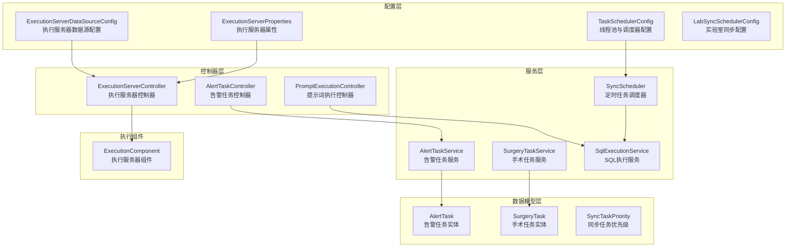
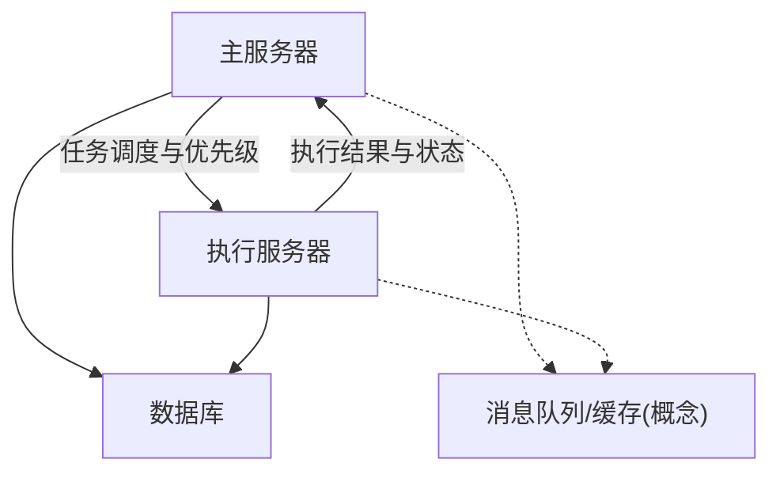
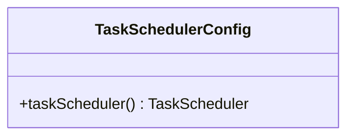
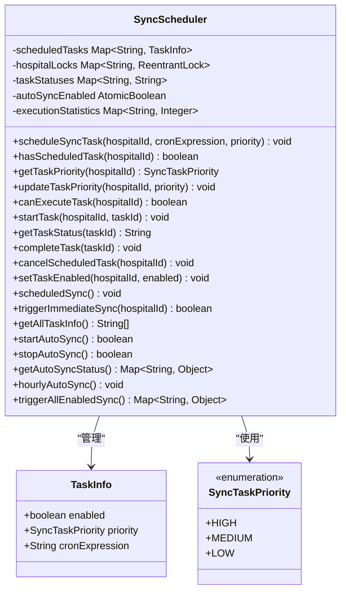
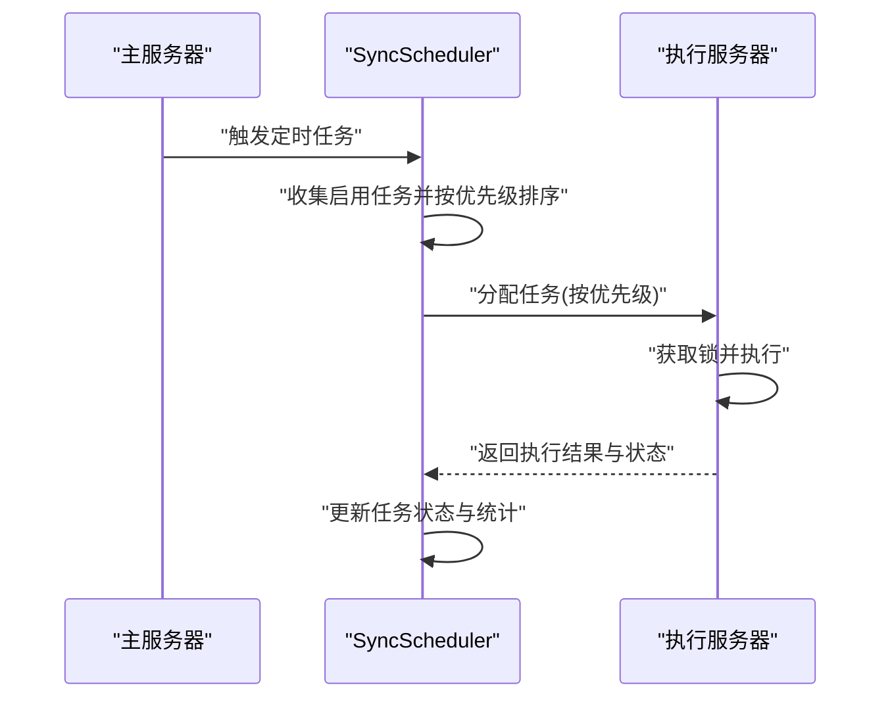
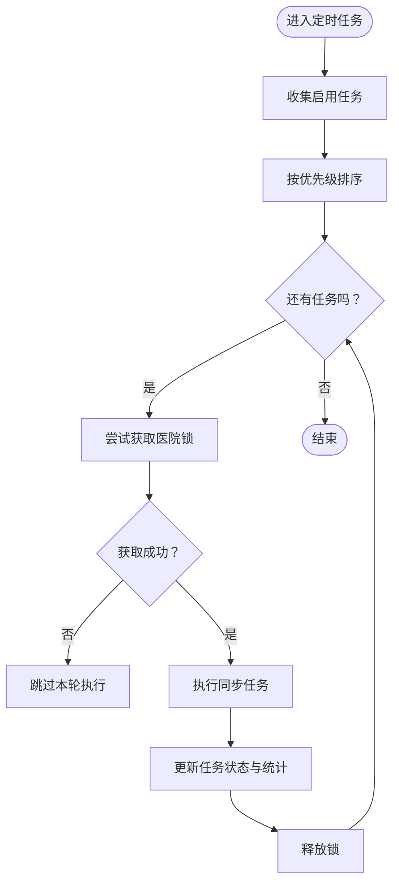
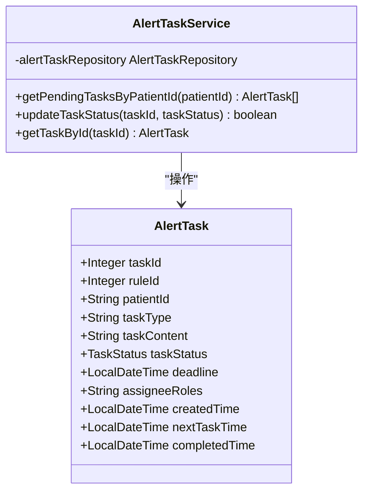
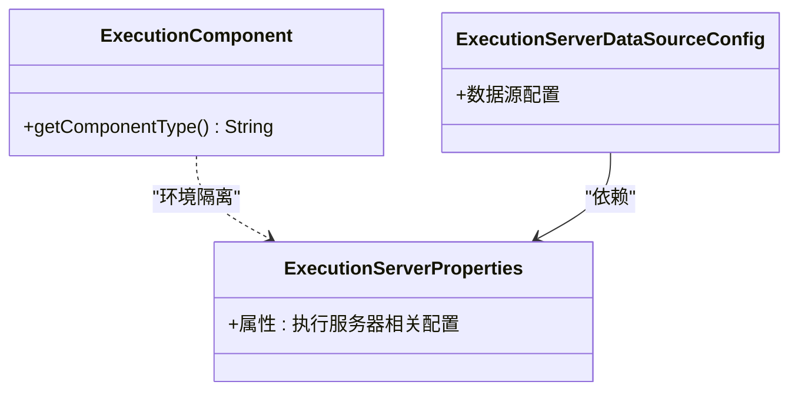
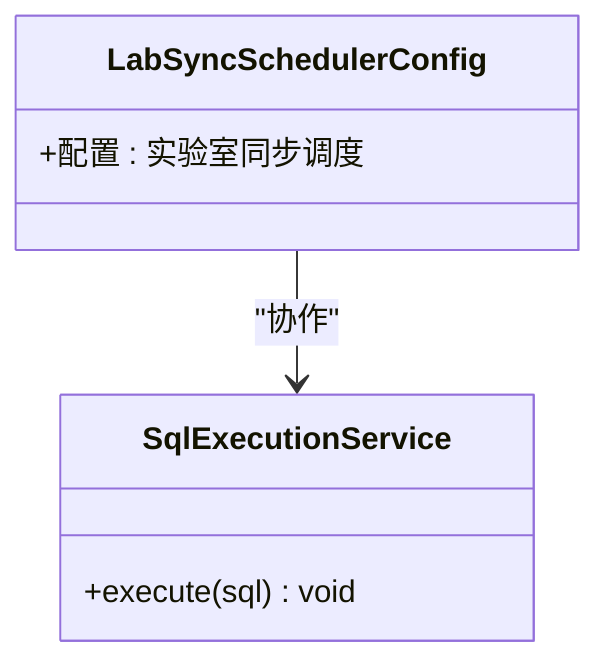
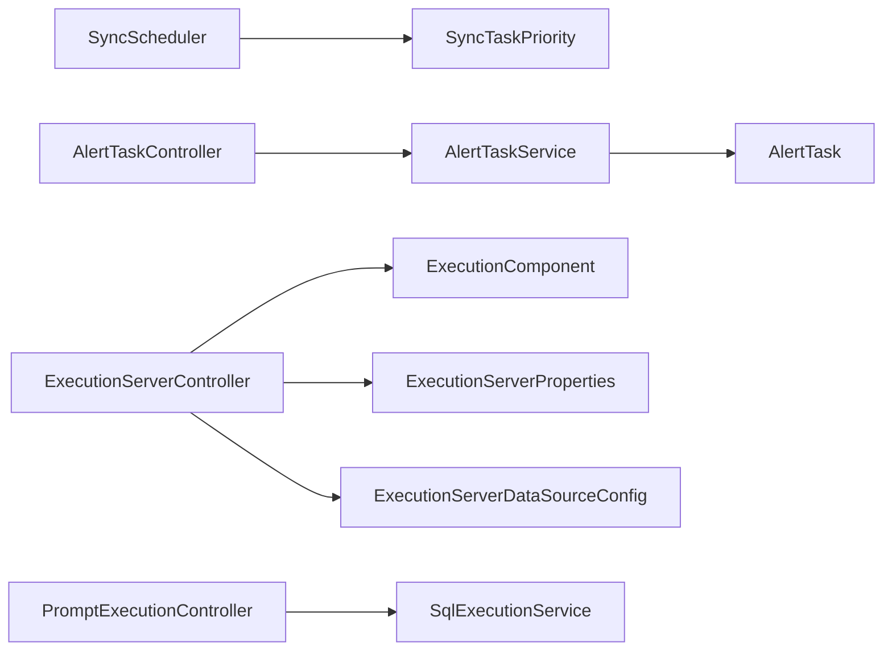

# 任务调度系统

<cite>
**本文引用的文件**
- [TaskSchedulerConfig.java](file://med_ai_assistant_1.0_bs_backend/src/main/java/com/example/medaiassistant/config/TaskSchedulerConfig.java)
- [SyncScheduler.java](file://med_ai_assistant_1.0_bs_backend/src/main/java/com/example/medaiassistant/hospital/service/SyncScheduler.java)
- [AlertTask.java](file://med_ai_assistant_1.0_bs_backend/src/main/java/com/example/medaiassistant/model/AlertTask.java)
- [AlertTaskService.java](file://med_ai_assistant_1.0_bs_backend/src/main/java/com/example/medaiassistant/service/AlertTaskService.java)
- [ExecutionComponent.java](file://med_ai_assistant_1.0_bs_backend/src/main/java/com/example/medaiassistant/execution/ExecutionComponent.java)
- [AlertTaskController.java](file://med_ai_assistant_1.0_bs_backend/src/main/java/com/example/medaiassistant/controller/AlertTaskController.java)
- [ExecutionServerController.java](file://med_ai_assistant_1.0_bs_backend/src/main/java/com/example/medaiassistant/controller/ExecutionServerController.java)
- [ExecutionServerStartupListener.java](file://med_ai_assistant_1.0_bs_backend/src/main/java/com/example/medaiassistant/component/ExecutionServerStartupListener.java)
- [ExecutionServerProperties.java](file://med_ai_assistant_1.0_bs_backend/src/main/java/com/example/medaiassistant/config/ExecutionServerProperties.java)
- [ExecutionServerDataSourceConfig.java](file://med_ai_assistant_1.0_bs_backend/src/main/java/com/example/medaiassistant/config/ExecutionServerDataSourceConfig.java)
- [AlertTaskRepository.java](file://med_ai_assistant_1.0_bs_backend/src/main/java/com/example/medaiassistant/repository/AlertTaskRepository.java)
- [SurgeryTask.java](file://med_ai_assistant_1.0_bs_backend/src/main/java/com/example/medaiassistant/model/SurgeryTask.java)
- [SurgeryTaskService.java](file://med_ai_assistant_1.0_bs_backend/src/main/java/com/example/medaiassistant/service/SurgeryTaskService.java)
- [SurgeryTaskRepository.java](file://med_ai_assistant_1.0_bs_backend/src/main/java/com/example/medaiassistant/repository/SurgeryTaskRepository.java)
- [PromptExecutionController.java](file://med_ai_assistant_1.0_bs_backend/src/main/java/com/example/medaiassistant/controller/PromptExecutionController.java)
- [SqlExecutionService.java](file://med_ai_assistant_1.0_bs_backend/src/main/java/com/example/medaiassistant/hospital/service/SqlExecutionService.java)
- [LabSyncSchedulerConfig.java](file://med_ai_assistant_1.0_bs_backend/src/main/java/com/example/medaiassistant/config/LabSyncSchedulerConfig.java)
- [SyncTaskPriority.java](file://med_ai_assistant_1.0_bs_backend/src/main/java/com/example/medaiassistant/hospital/model/SyncTaskPriority.java)
</cite>

## 目录
1. [简介](#简介)
2. [项目结构](#项目结构)
3. [核心组件](#核心组件)
4. [架构总览](#架构总览)
5. [详细组件分析](#详细组件分析)
6. [依赖关系分析](#依赖关系分析)
7. [性能考虑](#性能考虑)
8. [故障排查指南](#故障排查指南)
9. [结论](#结论)
10. [附录](#附录)

## 简介
本文件面向任务调度系统，围绕任务队列管理、调度算法、优先级控制、负载均衡机制进行深入解析，并结合主服务器与执行服务器之间的任务分配策略、状态同步与异常处理展开。系统同时覆盖任务生命周期管理、重试机制、超时处理、资源限制等核心能力，并提供调度策略配置与性能调优建议及监控方法。

## 项目结构
系统采用分层架构，主要由以下模块构成：
- 配置层：线程池与调度器配置、执行服务器配置
- 服务层：定时调度器、任务服务、执行服务
- 数据模型层：任务实体、状态枚举
- 控制器层：对外接口，暴露任务查询、执行、状态管理等能力
- 执行组件：执行服务器侧组件，用于区分执行环境

**图表来源**
- [TaskSchedulerConfig.java](file://med_ai_assistant_1.0_bs_backend/src/main/java/com/example/medaiassistant/config/TaskSchedulerConfig.java#L1-L30)
- [SyncScheduler.java](file://med_ai_assistant_1.0_bs_backend/src/main/java/com/example/medaiassistant/hospital/service/SyncScheduler.java#L1-L549)
- [AlertTaskService.java](file://med_ai_assistant_1.0_bs_backend/src/main/java/com/example/medaiassistant/service/AlertTaskService.java#L1-L72)
- [ExecutionServerProperties.java](file://med_ai_assistant_1.0_bs_backend/src/main/java/com/example/medaiassistant/config/ExecutionServerProperties.java)
- [ExecutionServerDataSourceConfig.java](file://med_ai_assistant_1.0_bs_backend/src/main/java/com/example/medaiassistant/config/ExecutionServerDataSourceConfig.java)
- [LabSyncSchedulerConfig.java](file://med_ai_assistant_1.0_bs_backend/src/main/java/com/example/medaiassistant/config/LabSyncSchedulerConfig.java)
- [AlertTask.java](file://med_ai_assistant_1.0_bs_backend/src/main/java/com/example/medaiassistant/model/AlertTask.java#L1-L185)
- [SurgeryTask.java](file://med_ai_assistant_1.0_bs_backend/src/main/java/com/example/medaiassistant/model/SurgeryTask.java)
- [SyncTaskPriority.java](file://med_ai_assistant_1.0_bs_backend/src/main/java/com/example/medaiassistant/hospital/model/SyncTaskPriority.java)
- [AlertTaskController.java](file://med_ai_assistant_1.0_bs_backend/src/main/java/com/example/medaiassistant/controller/AlertTaskController.java)
- [ExecutionServerController.java](file://med_ai_assistant_1.0_bs_backend/src/main/java/com/example/medaiassistant/controller/ExecutionServerController.java)
- [PromptExecutionController.java](file://med_ai_assistant_1.0_bs_backend/src/main/java/com/example/medaiassistant/controller/PromptExecutionController.java)
- [SqlExecutionService.java](file://med_ai_assistant_1.0_bs_backend/src/main/java/com/example/medaiassistant/hospital/service/SqlExecutionService.java)
- [ExecutionComponent.java](file://med_ai_assistant_1.0_bs_backend/src/main/java/com/example/medaiassistant/execution/ExecutionComponent.java#L1-L24)

**章节来源**
- [TaskSchedulerConfig.java](file://med_ai_assistant_1.0_bs_backend/src/main/java/com/example/medaiassistant/config/TaskSchedulerConfig.java#L1-L30)
- [SyncScheduler.java](file://med_ai_assistant_1.0_bs_backend/src/main/java/com/example/medaiassistant/hospital/service/SyncScheduler.java#L1-L549)
- [AlertTaskService.java](file://med_ai_assistant_1.0_bs_backend/src/main/java/com/example/medaiassistant/service/AlertTaskService.java#L1-L72)
- [ExecutionServerProperties.java](file://med_ai_assistant_1.0_bs_backend/src/main/java/com/example/medaiassistant/config/ExecutionServerProperties.java)
- [ExecutionServerDataSourceConfig.java](file://med_ai_assistant_1.0_bs_backend/src/main/java/com/example/medaiassistant/config/ExecutionServerDataSourceConfig.java)
- [LabSyncSchedulerConfig.java](file://med_ai_assistant_1.0_bs_backend/src/main/java/com/example/medaiassistant/config/LabSyncSchedulerConfig.java)
- [AlertTask.java](file://med_ai_assistant_1.0_bs_backend/src/main/java/com/example/medaiassistant/model/AlertTask.java#L1-L185)
- [SurgeryTask.java](file://med_ai_assistant_1.0_bs_backend/src/main/java/com/example/medaiassistant/model/SurgeryTask.java)
- [SyncTaskPriority.java](file://med_ai_assistant_1.0_bs_backend/src/main/java/com/example/medaiassistant/hospital/model/SyncTaskPriority.java)
- [AlertTaskController.java](file://med_ai_assistant_1.0_bs_backend/src/main/java/com/example/medaiassistant/controller/AlertTaskController.java)
- [ExecutionServerController.java](file://med_ai_assistant_1.0_bs_backend/src/main/java/com/example/medaiassistant/controller/ExecutionServerController.java)
- [PromptExecutionController.java](file://med_ai_assistant_1.0_bs_backend/src/main/java/com/example/medaiassistant/controller/PromptExecutionController.java)
- [SqlExecutionService.java](file://med_ai_assistant_1.0_bs_backend/src/main/java/com/example/medaiassistant/hospital/service/SqlExecutionService.java)
- [ExecutionComponent.java](file://med_ai_assistant_1.0_bs_backend/src/main/java/com/example/medaiassistant/execution/ExecutionComponent.java#L1-L24)

## 核心组件
- 线程池与调度器配置：统一配置线程池大小、线程名前缀、守护线程等，确保调度器可扩展与可控。
- 定时任务调度器：支持按优先级调度、并发控制、任务状态管理、统计与监控。
- 任务服务：提供任务状态更新、查询等业务能力。
- 执行组件：区分执行服务器环境，便于隔离与扩展。
- 控制器：对外暴露任务查询、执行、状态管理等接口。

**章节来源**
- [TaskSchedulerConfig.java](file://med_ai_assistant_1.0_bs_backend/src/main/java/com/example/medaiassistant/config/TaskSchedulerConfig.java#L1-L30)
- [SyncScheduler.java](file://med_ai_assistant_1.0_bs_backend/src/main/java/com/example/medaiassistant/hospital/service/SyncScheduler.java#L1-L549)
- [AlertTaskService.java](file://med_ai_assistant_1.0_bs_backend/src/main/java/com/example/medaiassistant/service/AlertTaskService.java#L1-L72)
- [ExecutionComponent.java](file://med_ai_assistant_1.0_bs_backend/src/main/java/com/example/medaiassistant/execution/ExecutionComponent.java#L1-L24)

## 架构总览
系统采用“主服务器 + 执行服务器”的分布式架构：
- 主服务器负责任务编排、优先级调度、状态同步与监控。
- 执行服务器负责具体任务执行与数据处理。
- 通过控制器与服务层实现任务分配与状态回传。

[此图为概念性架构图，不直接对应具体源码文件，故无图表来源]

## 详细组件分析

### 线程池与调度器配置
- 通过线程池任务调度器统一管理调度线程，设置池大小、线程名前缀、守护线程等。
- 与调度属性配置绑定，确保可配置化与可观察性。

**图表来源**
- [TaskSchedulerConfig.java](file://med_ai_assistant_1.0_bs_backend/src/main/java/com/example/medaiassistant/config/TaskSchedulerConfig.java#L1-L30)

**章节来源**
- [TaskSchedulerConfig.java](file://med_ai_assistant_1.0_bs_backend/src/main/java/com/example/medaiassistant/config/TaskSchedulerConfig.java#L1-L30)

### 定时任务调度器（SyncScheduler）
- 任务优先级：支持高、中、低优先级，按数值升序执行（数值越小优先级越高）。
- 并发控制：基于ReentrantLock对同一医院任务串行执行，避免重复执行。
- 任务状态：维护任务状态字典，支持运行中、已完成、失败、中断等状态。
- 统计与监控：记录执行次数、最近任务状态、启用任务数等。
- 自动同步：支持按小时自动同步与全局开关控制。

**图表来源**
- [SyncScheduler.java](file://med_ai_assistant_1.0_bs_backend/src/main/java/com/example/medaiassistant/hospital/service/SyncScheduler.java#L1-L549)
- [SyncTaskPriority.java](file://med_ai_assistant_1.0_bs_backend/src/main/java/com/example/medaiassistant/hospital/model/SyncTaskPriority.java)

**图表来源**
- [SyncScheduler.java](file://med_ai_assistant_1.0_bs_backend/src/main/java/com/example/medaiassistant/hospital/service/SyncScheduler.java#L219-L245)
- [SyncScheduler.java](file://med_ai_assistant_1.0_bs_backend/src/main/java/com/example/medaiassistant/hospital/service/SyncScheduler.java#L444-L487)

**图表来源**
- [SyncScheduler.java](file://med_ai_assistant_1.0_bs_backend/src/main/java/com/example/medaiassistant/hospital/service/SyncScheduler.java#L219-L245)
- [SyncScheduler.java](file://med_ai_assistant_1.0_bs_backend/src/main/java/com/example/medaiassistant/hospital/service/SyncScheduler.java#L289-L312)

**章节来源**
- [SyncScheduler.java](file://med_ai_assistant_1.0_bs_backend/src/main/java/com/example/medaiassistant/hospital/service/SyncScheduler.java#L1-L549)
- [SyncTaskPriority.java](file://med_ai_assistant_1.0_bs_backend/src/main/java/com/example/medaiassistant/hospital/model/SyncTaskPriority.java)

### 告警任务服务（AlertTaskService）
- 提供按患者ID查询待处理告警任务的能力。
- 提供任务状态更新的事务性操作，确保数据一致性。
- 提供按任务ID获取任务详情。

**图表来源**
- [AlertTaskService.java](file://med_ai_assistant_1.0_bs_backend/src/main/java/com/example/medaiassistant/service/AlertTaskService.java#L1-L72)
- [AlertTask.java](file://med_ai_assistant_1.0_bs_backend/src/main/java/com/example/medaiassistant/model/AlertTask.java#L1-L185)

**章节来源**
- [AlertTaskService.java](file://med_ai_assistant_1.0_bs_backend/src/main/java/com/example/medaiassistant/service/AlertTaskService.java#L1-L72)
- [AlertTask.java](file://med_ai_assistant_1.0_bs_backend/src/main/java/com/example/medaiassistant/model/AlertTask.java#L1-L185)

### 执行服务器组件与配置
- 执行组件用于在执行服务器环境下加载，便于环境隔离。
- 执行服务器属性与数据源配置支持独立部署与扩展。

**图表来源**
- [ExecutionComponent.java](file://med_ai_assistant_1.0_bs_backend/src/main/java/com/example/medaiassistant/execution/ExecutionComponent.java#L1-L24)
- [ExecutionServerProperties.java](file://med_ai_assistant_1.0_bs_backend/src/main/java/com/example/medaiassistant/config/ExecutionServerProperties.java)
- [ExecutionServerDataSourceConfig.java](file://med_ai_assistant_1.0_bs_backend/src/main/java/com/example/medaiassistant/config/ExecutionServerDataSourceConfig.java)

**章节来源**
- [ExecutionComponent.java](file://med_ai_assistant_1.0_bs_backend/src/main/java/com/example/medaiassistant/execution/ExecutionComponent.java#L1-L24)
- [ExecutionServerProperties.java](file://med_ai_assistant_1.0_bs_backend/src/main/java/com/example/medaiassistant/config/ExecutionServerProperties.java)
- [ExecutionServerDataSourceConfig.java](file://med_ai_assistant_1.0_bs_backend/src/main/java/com/example/medaiassistant/config/ExecutionServerDataSourceConfig.java)

### 实验室同步与SQL执行
- 实验室同步配置提供独立的调度策略。
- SQL执行服务负责执行具体的SQL任务，可与定时调度器配合使用。

**图表来源**
- [LabSyncSchedulerConfig.java](file://med_ai_assistant_1.0_bs_backend/src/main/java/com/example/medaiassistant/config/LabSyncSchedulerConfig.java)
- [SqlExecutionService.java](file://med_ai_assistant_1.0_bs_backend/src/main/java/com/example/medaiassistant/hospital/service/SqlExecutionService.java)

**章节来源**
- [LabSyncSchedulerConfig.java](file://med_ai_assistant_1.0_bs_backend/src/main/java/com/example/medaiassistant/config/LabSyncSchedulerConfig.java)
- [SqlExecutionService.java](file://med_ai_assistant_1.0_bs_backend/src/main/java/com/example/medaiassistant/hospital/service/SqlExecutionService.java)

## 依赖关系分析
- SyncScheduler 依赖于任务优先级枚举与并发锁，负责任务调度与状态管理。
- AlertTaskService 依赖 AlertTask 实体与仓库，提供任务状态更新与查询。
- 执行服务器组件与配置相互依赖，确保执行环境正确加载。
- 控制器层通过服务层与执行层交互，形成清晰的职责边界。

**图表来源**
- [SyncScheduler.java](file://med_ai_assistant_1.0_bs_backend/src/main/java/com/example/medaiassistant/hospital/service/SyncScheduler.java#L1-L549)
- [AlertTaskService.java](file://med_ai_assistant_1.0_bs_backend/src/main/java/com/example/medaiassistant/service/AlertTaskService.java#L1-L72)
- [AlertTask.java](file://med_ai_assistant_1.0_bs_backend/src/main/java/com/example/medaiassistant/model/AlertTask.java#L1-L185)
- [ExecutionServerController.java](file://med_ai_assistant_1.0_bs_backend/src/main/java/com/example/medaiassistant/controller/ExecutionServerController.java)
- [ExecutionComponent.java](file://med_ai_assistant_1.0_bs_backend/src/main/java/com/example/medaiassistant/execution/ExecutionComponent.java#L1-L24)
- [ExecutionServerProperties.java](file://med_ai_assistant_1.0_bs_backend/src/main/java/com/example/medaiassistant/config/ExecutionServerProperties.java)
- [ExecutionServerDataSourceConfig.java](file://med_ai_assistant_1.0_bs_backend/src/main/java/com/example/medaiassistant/config/ExecutionServerDataSourceConfig.java)
- [AlertTaskController.java](file://med_ai_assistant_1.0_bs_backend/src/main/java/com/example/medaiassistant/controller/AlertTaskController.java)
- [PromptExecutionController.java](file://med_ai_assistant_1.0_bs_backend/src/main/java/com/example/medaiassistant/controller/PromptExecutionController.java)
- [SqlExecutionService.java](file://med_ai_assistant_1.0_bs_backend/src/main/java/com/example/medaiassistant/hospital/service/SqlExecutionService.java)

**章节来源**
- [SyncScheduler.java](file://med_ai_assistant_1.0_bs_backend/src/main/java/com/example/medaiassistant/hospital/service/SyncScheduler.java#L1-L549)
- [AlertTaskService.java](file://med_ai_assistant_1.0_bs_backend/src/main/java/com/example/medaiassistant/service/AlertTaskService.java#L1-L72)
- [AlertTask.java](file://med_ai_assistant_1.0_bs_backend/src/main/java/com/example/medaiassistant/model/AlertTask.java#L1-L185)
- [ExecutionServerController.java](file://med_ai_assistant_1.0_bs_backend/src/main/java/com/example/medaiassistant/controller/ExecutionServerController.java)
- [ExecutionComponent.java](file://med_ai_assistant_1.0_bs_backend/src/main/java/com/example/medaiassistant/execution/ExecutionComponent.java#L1-L24)
- [ExecutionServerProperties.java](file://med_ai_assistant_1.0_bs_backend/src/main/java/com/example/medaiassistant/config/ExecutionServerProperties.java)
- [ExecutionServerDataSourceConfig.java](file://med_ai_assistant_1.0_bs_backend/src/main/java/com/example/medaiassistant/config/ExecutionServerDataSourceConfig.java)
- [AlertTaskController.java](file://med_ai_assistant_1.0_bs_backend/src/main/java/com/example/medaiassistant/controller/AlertTaskController.java)
- [PromptExecutionController.java](file://med_ai_assistant_1.0_bs_backend/src/main/java/com/example/medaiassistant/controller/PromptExecutionController.java)
- [SqlExecutionService.java](file://med_ai_assistant_1.0_bs_backend/src/main/java/com/example/medaiassistant/hospital/service/SqlExecutionService.java)

## 性能考虑
- 线程池大小：根据任务并发量与CPU核数合理配置，避免过多上下文切换。
- 优先级调度：高优先级任务应尽快执行，但需避免饥饿；可引入动态权重调整。
- 并发控制：使用细粒度锁（按医院维度）减少争用，提高吞吐。
- 统计与监控：记录执行次数、失败率、平均耗时，辅助容量规划。
- I/O 优化：批量处理与异步执行可降低数据库压力。
- 资源限制：设置最大等待队列长度与超时阈值，防止雪崩效应。

[本节为通用性能建议，无需列出章节来源]

## 故障排查指南
- 任务状态异常：检查任务状态字典与完成条件，确认中断与失败分支。
- 并发冲突：验证锁获取逻辑与释放时机，避免死锁与重复执行。
- 配置问题：核对调度cron表达式、线程池参数与执行服务器配置。
- 数据一致性：事务性更新任务状态，确保数据库层面一致。
- 监控缺失：完善统计字段与日志级别，便于快速定位问题。

**章节来源**
- [SyncScheduler.java](file://med_ai_assistant_1.0_bs_backend/src/main/java/com/example/medaiassistant/hospital/service/SyncScheduler.java#L144-L186)
- [AlertTaskService.java](file://med_ai_assistant_1.0_bs_backend/src/main/java/com/example/medaiassistant/service/AlertTaskService.java#L56-L60)

## 结论
本系统通过统一的线程池调度器、基于优先级的定时调度器、严格的并发控制与完善的任务状态管理，实现了可靠的主服务器与执行服务器协同。结合可配置的调度策略与监控统计，系统具备良好的可扩展性与可观测性。建议在生产环境中进一步完善重试与超时机制、资源配额与限流策略，并持续优化调度算法以适应业务高峰。

## 附录
- 调度策略配置项
  - 线程池大小：通过调度器配置注入
  - 定时任务cron：支持全局与按任务配置
  - 优先级：高/中/低，数值越小优先级越高
  - 自动同步开关与周期：支持启停与统计
- 性能调优建议
  - 动态调整线程池大小与队列长度
  - 引入任务批处理与异步执行
  - 增加熔断与降级策略
  - 加强监控与告警联动

[本节为通用附录内容，无需列出章节来源]