# 任务调度系统

<cite>
**本文引用的文件**
- [TaskSchedulerConfig.java](file://med_ai_assistant_1.0_bs_backend/src/main/java/com/example/medaiassistant/config/TaskSchedulerConfig.java)
- [SchedulingProperties.java](file://med_ai_assistant_1.0_bs_backend/src/main/java/com/example/medaiassistant/config/SchedulingProperties.java)
- [SyncScheduler.java](file://med_ai_assistant_1.0_bs_backend/src/main/java/com/example/medaiassistant/hospital/service/SyncScheduler.java)
- [AlertTask.java](file://med_ai_assistant_1.0_bs_backend/src/main/java/com/example/medaiassistant/model/AlertTask.java)
- [AlertTaskService.java](file://med_ai_assistant_1.0_bs_backend/src/main/java/com/example/medaiassistant/service/AlertTaskService.java)
- [AlertTaskRepository.java](file://med_ai_assistant_1.0_bs_backend/src/main/java/com/example/medaiassistant/repository/AlertTaskRepository.java)
- [AlertTaskController.java](file://med_ai_assistant_1.0_bs_backend/src/main/java/com/example/medaiassistant/controller/AlertTaskController.java)
- [PromptsTaskUpdater.java](file://med_ai_assistant_1.0_bs_backend/src/main/java/com/example/medaiassistant/service/PromptsTaskUpdater.java)
- [Prompt.java](file://med_ai_assistant_1.0_bs_backend/src/main/java/com/example/medaiassistant/model/Prompt.java)
- [PromptRepository.java](file://med_ai_assistant_1.0_bs_backend/src/main/java/com/example/medaiassistant/repository/PromptRepository.java)
- [ExecutionComponent.java](file://med_ai_assistant_1.0_bs_backend/src/main/java/com/example/medaiassistant/execution/ExecutionComponent.java)
- [ExecutionServerController.java](file://med_ai_assistant_1.0_bs_backend/src/main/java/com/example/medaiassistant/controller/ExecutionServerController.java)
- [ExecutionServerStartupListener.java](file://med_ai_assistant_1.0_bs_backend/src/main/java/com/example/medaiassistant/component/ExecutionServerStartupListener.java)
- [ExecutionServerProperties.java](file://med_ai_assistant_1.0_bs_backend/src/main/java/com/example/medaiassistant/config/ExecutionServerProperties.java)
- [ExecutionServerDataSourceConfig.java](file://med_ai_assistant_1.0_bs_backend/src/main/java/com/example/medaiassistant/config/ExecutionServerDataSourceConfig.java)
- [SurgeryTask.java](file://med_ai_assistant_1.0_bs_backend/src/main/java/com/example/medaiassistant/model/SurgeryTask.java)
- [SurgeryTaskService.java](file://med_ai_assistant_1.0_bs_backend/src/main/java/com/example/medaiassistant/service/SurgeryTaskService.java)
- [SurgeryTaskRepository.java](file://med_ai_assistant_1.0_bs_backend/src/main/java/com/example/medaiassistant/repository/SurgeryTaskRepository.java)
- [PromptExecutionController.java](file://med_ai_assistant_1.0_bs_backend/src/main/java/com/example/medaiassistant/controller/PromptExecutionController.java)
- [SqlExecutionService.java](file://med_ai_assistant_1.0_bs_backend/src/main/java/com/example/medaiassistant/hospital/service/SqlExecutionService.java)
- [LabSyncSchedulerConfig.java](file://med_ai_assistant_1.0_bs_backend/src/main/java/com/example/medaiassistant/config/LabSyncSchedulerConfig.java)
- [SyncTaskPriority.java](file://med_ai_assistant_1.0_bs_backend/src/main/java/com/example/medaiassistant/hospital/model/SyncTaskPriority.java)
- [TimerPromptGeneratorController.java](file://med_ai_assistant_1.0_bs_backend/src/main/java/com/example/medaiassistant/controller/TimerPromptGeneratorController.java)
- [TimerPromptGenerator.java](file://med_ai_assistant_1.0_bs_backend/src/main/java/com/example/medaiassistant/service/TimerPromptGenerator.java)
- [MccScreeningService.java](file://med_ai_assistant_1.0_bs_backend/src/main/java/com/example/medaiassistant/service/MccScreeningService.java)
- [DiagnosisRepository.java](file://med_ai_assistant_1.0_bs_backend/src/main/java/com/example/medaiassistant/repository/DiagnosisRepository.java)
- [PromptTemplateRepository.java](file://med_ai_assistant_1.0_bs_backend/src/main/java/com/example/medaiassistant/repository/PromptTemplateRepository.java)
- [MedicalRecordController.java](file://med_ai_assistant_1.0_bs_backend/src/main/java/com/example/medaiassistant/controller/MedicalRecordController.java)
- [TodoItemRepository.java](file://med_ai_assistant_1.0_bs_backend/src/main/java/com/example/medaiassistant/repository/TodoItemRepository.java)
- [TodoItem.java](file://med_ai_assistant_1.0_bs_backend/src/main/java/com/example/medaiassistant/model/TodoItem.java)
- [TodoView.vue](file://med_ai_assistant_1.0_bs_vue/src/views/TodoView.vue)
- [patient.js](file://med_ai_assistant_1.0_bs_vue/src/api/patient.js)
- [待办事项接口.md](file://med_ai_assistant_1.0_bs_backend/doc/接口/病历记录/待办事项接口.md)
- [TIMER_TASK_CONFIGURATION.md](file://med_ai_assistant_1.0_bs_backend/doc/其他/TIMER_TASK_CONFIGURATION.md)
- [application.properties](file://med_ai_assistant_1.0_bs_backend/src/main/resources/application.properties)
- [SchedulingPropertiesTddTest.java](file://med_ai_assistant_1.0_bs_backend/src/test/java/com/example/medaiassistant/config/SchedulingPropertiesTddTest.java)
- [SchedulingPropertiesDepartmentFilterTest.java](file://med_ai_assistant_1.0_bs_backend/src/test/java/com/example/medaiassistant/config/SchedulingPropertiesDepartmentFilterTest.java)
- [TimerPromptGeneratorNoonWardRoundTest.java](file://med_ai_assistant_1.0_bs_backend/src/test/java/com/example/medaiassistant/service/TimerPromptGeneratorNoonWardRoundTest.java)
</cite>

## 更新摘要
**变更内容**
- 新增统一调度配置管理：引入SchedulingProperties统一管理所有定时任务配置参数
- 新增定时任务配置能力：支持每日提示生成、手术分析和病房查房记录创建的cron表达式配置
- 新增部门过滤功能：支持按目标科室列表过滤定时任务执行范围
- 新增床位号过滤功能：支持按目标床位号列表过滤定时任务执行范围
- 新增定时任务控制器：提供定时任务的启动、停止和状态查询接口
- 新增定时任务配置文档：提供完整的配置参数说明和使用指南

## 目录
1. [简介](#简介)
2. [项目结构](#项目结构)
3. [核心组件](#核心组件)
4. [架构总览](#架构总览)
5. [详细组件分析](#详细组件分析)
6. [统一调度配置管理](#统一调度配置管理)
7. [定时任务配置与管理](#定时任务配置与管理)
8. [部门和床位号过滤功能](#部门和床位号过滤功能)
9. [定时任务控制器](#定时任务控制器)
10. [定时任务配置文档](#定时任务配置文档)
11. [依赖关系分析](#依赖关系分析)
12. [性能考虑](#性能考虑)
13. [故障排查指南](#故障排查指南)
14. [结论](#结论)
15. [附录](#附录)

## 简介
本文件面向任务调度系统，围绕任务队列管理、调度算法、优先级控制、负载均衡机制进行深入解析，并结合主服务器与执行服务器之间的任务分配策略、状态同步与异常处理展开。系统同时覆盖任务生命周期管理、重试机制、超时处理、资源限制等核心能力，并提供调度策略配置与性能调优建议及监控方法。

**更新** 本次更新重点介绍了统一的调度配置管理能力，包括新增的定时任务配置系统、部门和床位号过滤功能，以及完整的定时任务控制器接口。系统现在支持通过SchedulingProperties统一管理所有定时任务相关的配置参数，包括每日提示生成、手术分析和病房查房记录创建的cron表达式配置，以及灵活的部门和床位号过滤机制。新增的定时任务控制器提供了完整的API接口，支持定时任务的动态启停和状态监控。

## 项目结构
系统采用分层架构，主要由以下模块构成：
- 配置层：统一调度配置、线程池与调度器配置、执行服务器配置
- 服务层：定时调度器、任务服务、执行服务、MCC筛选服务
- 数据模型层：任务实体、状态枚举、Prompt实体、待办事项实体
- 控制器层：对外接口，暴露任务查询、执行、状态管理等能力
- 执行组件：执行服务器侧组件，用于区分执行环境
- **新增** 统一调度配置管理：集中管理所有定时任务配置参数
- **新增** 定时任务控制器：提供定时任务的API接口
- **新增** 部门和床位号过滤功能：支持按科室和床位号过滤定时任务执行范围

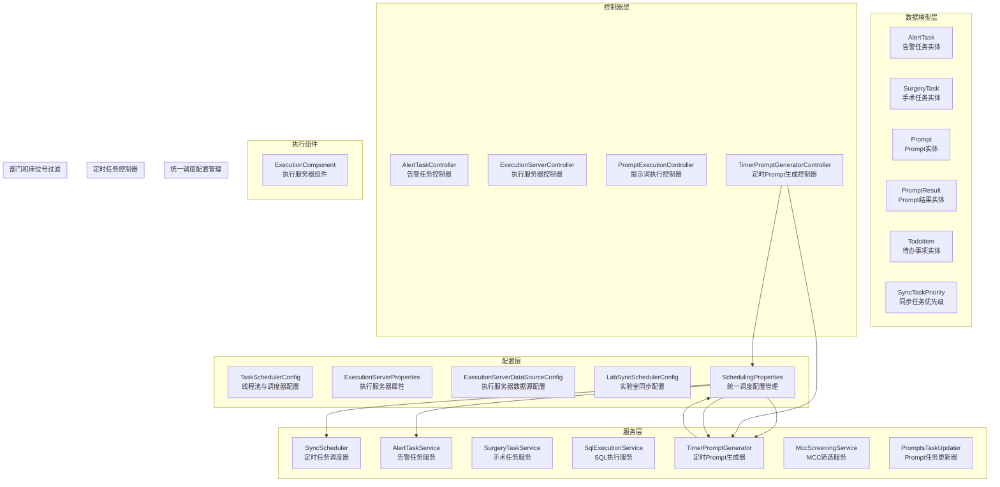

**图表来源**
- [TaskSchedulerConfig.java:1-30](file://med_ai_assistant_1.0_bs_backend/src/main/java/com/example/medaiassistant/config/TaskSchedulerConfig.java#L1-L30)
- [SchedulingProperties.java:1-885](file://med_ai_assistant_1.0_bs_backend/src/main/java/com/example/medaiassistant/config/SchedulingProperties.java#L1-L885)
- [SyncScheduler.java:1-549](file://med_ai_assistant_1.0_bs_backend/src/main/java/com/example/medaiassistant/hospital/service/SyncScheduler.java#L1-L549)
- [AlertTaskService.java:1-72](file://med_ai_assistant_1.0_bs_backend/src/main/java/com/example/medaiassistant/service/AlertTaskService.java#L1-L72)
- [ExecutionServerProperties.java](file://med_ai_assistant_1.0_bs_backend/src/main/java/com/example/medaiassistant/config/ExecutionServerProperties.java)
- [ExecutionServerDataSourceConfig.java](file://med_ai_assistant_1.0_bs_backend/src/main/java/com/example/medaiassistant/config/ExecutionServerDataSourceConfig.java)
- [LabSyncSchedulerConfig.java](file://med_ai_assistant_1.0_bs_backend/src/main/java/com/example/medaiassistant/config/LabSyncSchedulerConfig.java)
- [AlertTask.java:1-185](file://med_ai_assistant_1.0_bs_backend/src/main/java/com/example/medaiassistant/model/AlertTask.java#L1-L185)
- [SurgeryTask.java](file://med_ai_assistant_1.0_bs_backend/src/main/java/com/example/medaiassistant/model/SurgeryTask.java)
- [Prompt.java:1-264](file://med_ai_assistant_1.0_bs_backend/src/main/java/com/example/medaiassistant/model/Prompt.java#L1-L264)
- [PromptResult.java:1-145](file://med_ai_assistant_1.0_bs_backend/src/main/java/com/example/medaiassistant/model/PromptResult.java#L1-L145)
- [TodoItem.java:1-177](file://med_ai_assistant_1.0_bs_backend/src/main/java/com/example/medaiassistant/model/TodoItem.java#L1-L177)
- [SyncTaskPriority.java](file://med_ai_assistant_1.0_bs_backend/src/main/java/com/example/medaiassistant/hospital/model/SyncTaskPriority.java)
- [AlertTaskController.java](file://med_ai_assistant_1.0_bs_backend/src/main/java/com/example/medaiassistant/controller/AlertTaskController.java)
- [ExecutionServerController.java](file://med_ai_assistant_1.0_bs_backend/src/main/java/com/example/medaiassistant/controller/ExecutionServerController.java)
- [PromptExecutionController.java](file://med_ai_assistant_1.0_bs_backend/src/main/java/com/example/medaiassistant/controller/PromptExecutionController.java)
- [TimerPromptGeneratorController.java:1-100](file://med_ai_assistant_1.0_bs_backend/src/main/java/com/example/medaiassistant/controller/TimerPromptGeneratorController.java#L1-L100)
- [TimerPromptGenerator.java:1-2325](file://med_ai_assistant_1.0_bs_backend/src/main/java/com/example/medaiassistant/service/TimerPromptGenerator.java#L1-L2325)
- [MccScreeningService.java](file://med_ai_assistant_1.0_bs_backend/src/main/java/com/example/medaiassistant/service/MccScreeningService.java)
- [PromptsTaskUpdater.java:1-116](file://med_ai_assistant_1.0_bs_backend/src/main/java/com/example/medaiassistant/service/PromptsTaskUpdater.java#L1-L116)
- [ExecutionComponent.java:1-24](file://med_ai_assistant_1.0_bs_backend/src/main/java/com/example/medaiassistant/execution/ExecutionComponent.java#L1-L24)
- [MedicalRecordController.java:1-653](file://med_ai_assistant_1.0_bs_backend/src/main/java/com/example/medaiassistant/controller/MedicalRecordController.java#L1-L653)
- [TodoItemRepository.java:1-108](file://med_ai_assistant_1.0_bs_backend/src/main/java/com/example/medaiassistant/repository/TodoItemRepository.java#L1-L108)
- [TodoView.vue:1-717](file://med_ai_assistant_1.0_bs_vue/src/views/TodoView.vue#L1-L717)
- [patient.js:1-616](file://med_ai_assistant_1.0_bs_vue/src/api/patient.js#L1-L616)

**章节来源**
- [TaskSchedulerConfig.java:1-30](file://med_ai_assistant_1.0_bs_backend/src/main/java/com/example/medaiassistant/config/TaskSchedulerConfig.java#L1-L30)
- [SchedulingProperties.java:1-885](file://med_ai_assistant_1.0_bs_backend/src/main/java/com/example/medaiassistant/config/SchedulingProperties.java#L1-L885)
- [SyncScheduler.java:1-549](file://med_ai_assistant_1.0_bs_backend/src/main/java/com/example/medaiassistant/hospital/service/SyncScheduler.java#L1-L549)
- [AlertTaskService.java:1-72](file://med_ai_assistant_1.0_bs_backend/src/main/java/com/example/medaiassistant/service/AlertTaskService.java#L1-L72)
- [ExecutionServerProperties.java](file://med_ai_assistant_1.0_bs_backend/src/main/java/com/example/medaiassistant/config/ExecutionServerProperties.java)
- [ExecutionServerDataSourceConfig.java](file://med_ai_assistant_1.0_bs_backend/src/main/java/com/example/medaiassistant/config/ExecutionServerDataSourceConfig.java)
- [LabSyncSchedulerConfig.java](file://med_ai_assistant_1.0_bs_backend/src/main/java/com/example/medaiassistant/config/LabSyncSchedulerConfig.java)
- [AlertTask.java:1-185](file://med_ai_assistant_1.0_bs_backend/src/main/java/com/example/medaiassistant/model/AlertTask.java#L1-L185)
- [SurgeryTask.java](file://med_ai_assistant_1.0_bs_backend/src/main/java/com/example/medaiassistant/model/SurgeryTask.java)
- [Prompt.java:1-264](file://med_ai_assistant_1.0_bs_backend/src/main/java/com/example/medaiassistant/model/Prompt.java#L1-L264)
- [PromptResult.java:1-145](file://med_ai_assistant_1.0_bs_backend/src/main/java/com/example/medaiassistant/model/PromptResult.java#L1-L145)
- [TodoItem.java:1-177](file://med_ai_assistant_1.0_bs_backend/src/main/java/com/example/medaiassistant/model/TodoItem.java#L1-L177)
- [SyncTaskPriority.java](file://med_ai_assistant_1.0_bs_backend/src/main/java/com/example/medaiassistant/hospital/model/SyncTaskPriority.java)
- [AlertTaskController.java](file://med_ai_assistant_1.0_bs_backend/src/main/java/com/example/medaiassistant/controller/AlertTaskController.java)
- [ExecutionServerController.java](file://med_ai_assistant_1.0_bs_backend/src/main/java/com/example/medaiassistant/controller/ExecutionServerController.java)
- [PromptExecutionController.java](file://med_ai_assistant_1.0_bs_backend/src/main/java/com/example/medaiassistant/controller/PromptExecutionController.java)
- [TimerPromptGeneratorController.java:1-100](file://med_ai_assistant_1.0_bs_backend/src/main/java/com/example/medaiassistant/controller/TimerPromptGeneratorController.java#L1-L100)
- [TimerPromptGenerator.java:1-2325](file://med_ai_assistant_1.0_bs_backend/src/main/java/com/example/medaiassistant/service/TimerPromptGenerator.java#L1-L2325)
- [MccScreeningService.java](file://med_ai_assistant_1.0_bs_backend/src/main/java/com/example/medaiassistant/service/MccScreeningService.java)
- [PromptsTaskUpdater.java:1-116](file://med_ai_assistant_1.0_bs_backend/src/main/java/com/example/medaiassistant/service/PromptsTaskUpdater.java#L1-L116)
- [ExecutionComponent.java:1-24](file://med_ai_assistant_1.0_bs_backend/src/main/java/com/example/medaiassistant/execution/ExecutionComponent.java#L1-L24)
- [MedicalRecordController.java:1-653](file://med_ai_assistant_1.0_bs_backend/src/main/java/com/example/medaiassistant/controller/MedicalRecordController.java#L1-L653)
- [TodoItemRepository.java:1-108](file://med_ai_assistant_1.0_bs_backend/src/main/java/com/example/medaiassistant/repository/TodoItemRepository.java#L1-L108)
- [TodoView.vue:1-717](file://med_ai_assistant_1.0_bs_vue/src/views/TodoView.vue#L1-L717)
- [patient.js:1-616](file://med_ai_assistant_1.0_bs_vue/src/api/patient.js#L1-L616)

## 核心组件
- 线程池与调度器配置：统一配置线程池大小、线程名前缀、守护线程等，确保调度器可扩展与可控。
- **新增** 统一调度配置管理：通过SchedulingProperties集中管理所有定时任务配置参数，包括定时任务、自动执行、线程池、监控等配置。
- 定时任务调度器：支持按优先级调度、并发控制、任务状态管理、统计与监控。
- 任务服务：提供任务状态更新、查询等业务能力。
- MCC筛选服务：新增的合并症或并发症自动识别服务，支持MCC筛选Prompt生成。
- 执行组件：区分执行服务器环境，便于隔离与扩展。
- 控制器：对外暴露任务查询、执行、状态管理等接口。
- **更新** AlertTask批量更新服务：修复批量更新异常，改进去重和异常处理机制。
- **新增** 定时任务控制器：提供定时任务的启动、停止和状态查询API接口。
- **新增** 部门和床位号过滤功能：支持按目标科室和床位号列表过滤定时任务执行范围。
- **新增** 定时任务配置文档：提供完整的配置参数说明和使用指南。

**章节来源**
- [TaskSchedulerConfig.java:1-30](file://med_ai_assistant_1.0_bs_backend/src/main/java/com/example/medaiassistant/config/TaskSchedulerConfig.java#L1-L30)
- [SchedulingProperties.java:1-885](file://med_ai_assistant_1.0_bs_backend/src/main/java/com/example/medaiassistant/config/SchedulingProperties.java#L1-L885)
- [SyncScheduler.java:1-549](file://med_ai_assistant_1.0_bs_backend/src/main/java/com/example/medaiassistant/hospital/service/SyncScheduler.java#L1-L549)
- [AlertTaskService.java:1-72](file://med_ai_assistant_1.0_bs_backend/src/main/java/com/example/medaiassistant/service/AlertTaskService.java#L1-L72)
- [MccScreeningService.java](file://med_ai_assistant_1.0_bs_backend/src/main/java/com/example/medaiassistant/service/MccScreeningService.java)
- [ExecutionComponent.java:1-24](file://med_ai_assistant_1.0_bs_backend/src/main/java/com/example/medaiassistant/execution/ExecutionComponent.java#L1-L24)
- [PromptsTaskUpdater.java:1-116](file://med_ai_assistant_1.0_bs_backend/src/main/java/com/example/medaiassistant/service/PromptsTaskUpdater.java#L1-L116)
- [MedicalRecordController.java:1-653](file://med_ai_assistant_1.0_bs_backend/src/main/java/com/example/medaiassistant/controller/MedicalRecordController.java#L1-L653)
- [TimerPromptGeneratorController.java:1-100](file://med_ai_assistant_1.0_bs_backend/src/main/java/com/example/medaiassistant/controller/TimerPromptGeneratorController.java#L1-L100)

## 架构总览
系统采用"主服务器 + 执行服务器"的分布式架构：
- 主服务器负责任务编排、优先级调度、状态同步与监控。
- 执行服务器负责具体任务执行与数据处理。
- 通过控制器与服务层实现任务分配与状态回传。
- **新增** 统一调度配置管理作为核心配置中心，集中管理所有定时任务配置。
- **新增** 定时任务控制器提供API接口，支持定时任务的动态启停和状态监控。
- **新增** 部门和床位号过滤功能，支持精细化的任务执行范围控制。
- **更新** AlertTask批量更新机制通过PromptsTaskUpdater实现，增强了任务状态管理的可靠性。
- **新增** 待办事项查询系统通过MedicalRecordController和TodoItemRepository提供智能查询能力。

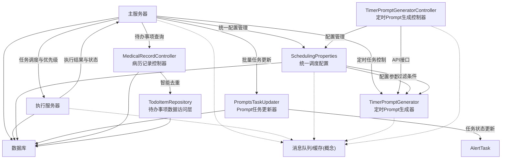

[此图为概念性架构图，不直接对应具体源码文件，故无图表来源]

## 详细组件分析

### 线程池与调度器配置
- 通过线程池任务调度器统一管理调度线程，设置池大小、线程名前缀、守护线程等。
- 与调度属性配置绑定，确保可配置化与可观察性。

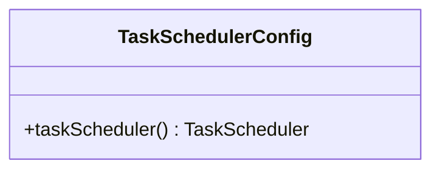

**图表来源**
- [TaskSchedulerConfig.java:1-30](file://med_ai_assistant_1.0_bs_backend/src/main/java/com/example/medaiassistant/config/TaskSchedulerConfig.java#L1-L30)

**章节来源**
- [TaskSchedulerConfig.java:1-30](file://med_ai_assistant_1.0_bs_backend/src/main/java/com/example/medaiassistant/config/TaskSchedulerConfig.java#L1-L30)

### 统一调度配置管理

**新增** SchedulingProperties类提供了统一的调度配置管理能力，集中管理所有定时任务相关的配置参数：

- **自动执行配置**：管理自动执行任务的间隔、线程数、时区等参数
- **定时任务配置**：管理每日任务、手术分析任务、病房查房任务的cron表达式和并发控制
- **线程池配置**：管理调度线程池、Prompt生成线程池、手术分析线程池等配置
- **监控配置**：管理监控开关、指标收集间隔、告警邮箱等参数
- **执行轮询配置**：管理执行服务器轮询的并发数、超时时间、重试次数等

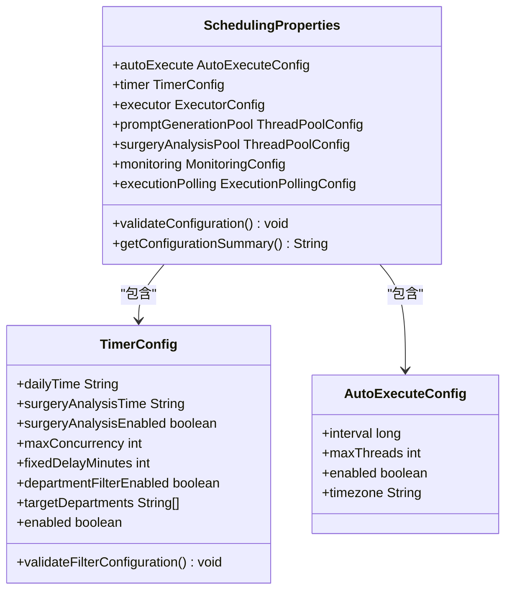

**图表来源**
- [SchedulingProperties.java:1-885](file://med_ai_assistant_1.0_bs_backend/src/main/java/com/example/medaiassistant/config/SchedulingProperties.java#L1-L885)

**章节来源**
- [SchedulingProperties.java:1-885](file://med_ai_assistant_1.0_bs_backend/src/main/java/com/example/medaiassistant/config/SchedulingProperties.java#L1-L885)

### 定时任务调度器（SyncScheduler）
- 任务优先级：支持高、中、低优先级，按数值升序执行（数值越小优先级越高）。
- 并发控制：基于ReentrantLock对同一医院任务串行执行，避免重复执行。
- 任务状态：维护任务状态字典，支持运行中、已完成、失败、中断等状态。
- 统计与监控：记录执行次数、最近任务状态、启用任务数等。
- 自动同步：支持按小时自动同步与全局开关控制。

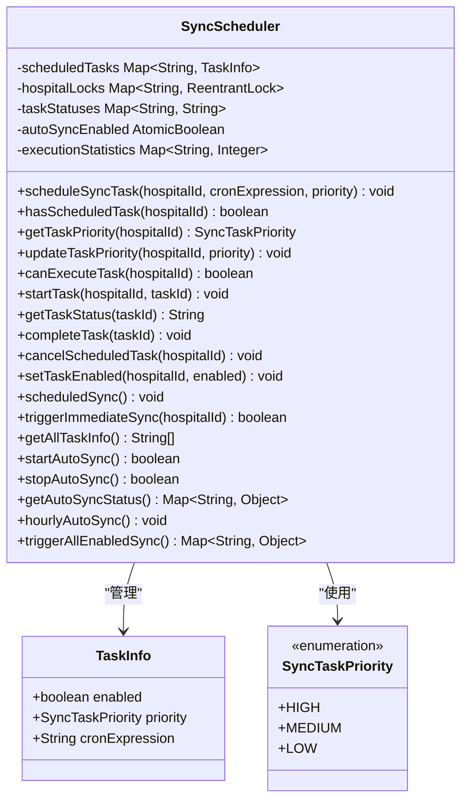

**图表来源**
- [SyncScheduler.java:1-549](file://med_ai_assistant_1.0_bs_backend/src/main/java/com/example/medaiassistant/hospital/service/SyncScheduler.java#L1-L549)
- [SyncTaskPriority.java](file://med_ai_assistant_1.0_bs_backend/src/main/java/com/example/medaiassistant/hospital/model/SyncTaskPriority.java)

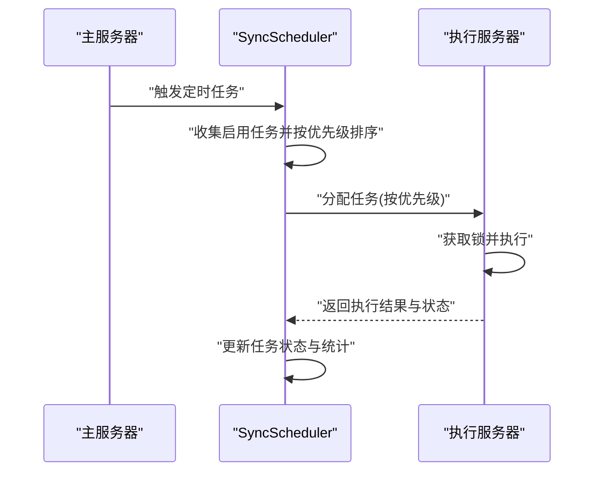

**图表来源**
- [SyncScheduler.java:219-245](file://med_ai_assistant_1.0_bs_backend/src/main/java/com/example/medaiassistant/hospital/service/SyncScheduler.java#L219-L245)
- [SyncScheduler.java:444-487](file://med_ai_assistant_1.0_bs_backend/src/main/java/com/example/medaiassistant/hospital/service/SyncScheduler.java#L444-L487)


**图表来源**
- [SyncScheduler.java:219-245](file://med_ai_assistant_1.0_bs_backend/src/main/java/com/example/medaiassistant/hospital/service/SyncScheduler.java#L219-L245)
- [SyncScheduler.java:289-312](file://med_ai_assistant_1.0_bs_backend/src/main/java/com/example/medaiassistant/hospital/service/SyncScheduler.java#L289-L312)

**章节来源**
- [SyncScheduler.java:1-549](file://med_ai_assistant_1.0_bs_backend/src/main/java/com/example/medaiassistant/hospital/service/SyncScheduler.java#L1-L549)
- [SyncTaskPriority.java](file://med_ai_assistant_1.0_bs_backend/src/main/java/com/example/medaiassistant/hospital/model/SyncTaskPriority.java)

### 告警任务服务（AlertTaskService）
- 提供按患者ID查询待处理告警任务的能力。
- 提供任务状态更新的事务性操作，确保数据一致性。
- 提供按任务ID获取任务详情。
- **更新** 修复批量更新异常：通过AlertTaskRepository的JPQL更新语句确保精确的行数更新，避免批量更新异常。

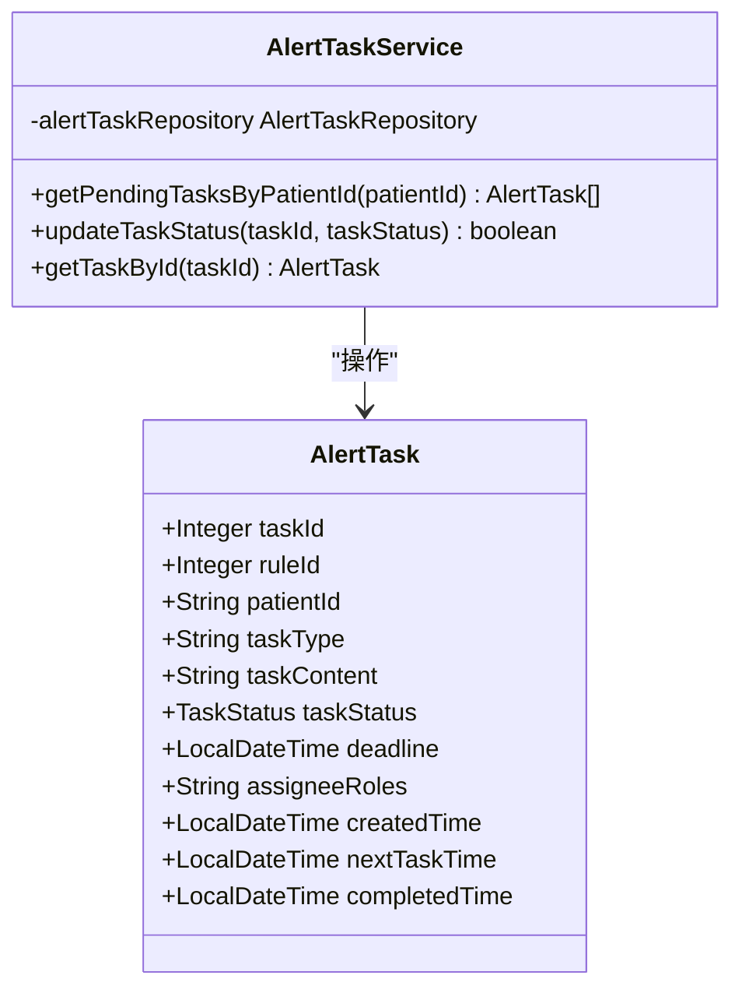

**图表来源**
- [AlertTaskService.java:1-72](file://med_ai_assistant_1.0_bs_backend/src/main/java/com/example/medaiassistant/service/AlertTaskService.java#L1-L72)
- [AlertTask.java:1-185](file://med_ai_assistant_1.0_bs_backend/src/main/java/com/example/medaiassistant/model/AlertTask.java#L1-L185)

**章节来源**
- [AlertTaskService.java:1-72](file://med_ai_assistant_1.0_bs_backend/src/main/java/com/example/medaiassistant/service/AlertTaskService.java#L1-L72)
- [AlertTask.java:1-185](file://med_ai_assistant_1.0_bs_backend/src/main/java/com/example/medaiassistant/model/AlertTask.java#L1-L185)

### 执行服务器组件与配置
- 执行组件用于在执行服务器环境下加载，便于环境隔离。
- 执行服务器属性与数据源配置支持独立部署与扩展。

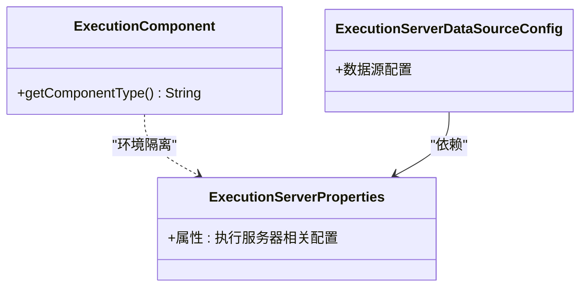

**图表来源**
- [ExecutionComponent.java:1-24](file://med_ai_assistant_1.0_bs_backend/src/main/java/com/example/medaiassistant/execution/ExecutionComponent.java#L1-L24)
- [ExecutionServerProperties.java](file://med_ai_assistant_1.0_bs_backend/src/main/java/com/example/medaiassistant/config/ExecutionServerProperties.java)
- [ExecutionServerDataSourceConfig.java](file://med_ai_assistant_1.0_bs_backend/src/main/java/com/example/medaiassistant/config/ExecutionServerDataSourceConfig.java)

**章节来源**
- [ExecutionComponent.java:1-24](file://med_ai_assistant_1.0_bs_backend/src/main/java/com/example/medaiassistant/execution/ExecutionComponent.java#L1-L24)
- [ExecutionServerProperties.java](file://med_ai_assistant_1.0_bs_backend/src/main/java/com/example/medaiassistant/config/ExecutionServerProperties.java)
- [ExecutionServerDataSourceConfig.java](file://med_ai_assistant_1.0_bs_backend/src/main/java/com/example/medaiassistant/config/ExecutionServerDataSourceConfig.java)

### 实验室同步与SQL执行
- 实验室同步配置提供独立的调度策略。
- SQL执行服务负责执行具体的SQL任务，可与定时调度器配合使用。

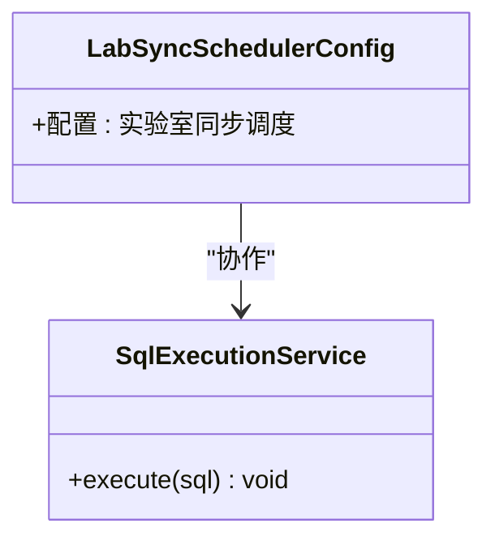

**图表来源**
- [LabSyncSchedulerConfig.java](file://med_ai_assistant_1.0_bs_backend/src/main/java/com/example/medaiassistant/config/LabSyncSchedulerConfig.java)
- [SqlExecutionService.java](file://med_ai_assistant_1.0_bs_backend/src/main/java/com/example/medaiassistant/hospital/service/SqlExecutionService.java)

**章节来源**
- [LabSyncSchedulerConfig.java](file://med_ai_assistant_1.0_bs_backend/src/main/java/com/example/medaiassistant/config/LabSyncSchedulerConfig.java)
- [SqlExecutionService.java](file://med_ai_assistant_1.0_bs_backend/src/main/java/com/example/medaiassistant/hospital/service/SqlExecutionService.java)

### PromptsTaskUpdater（更新后的批量处理）
- **更新** 改进去重机制：使用Stream API的Collectors.toMap方法，按taskId去重，防止重复记录导致批量更新异常
- **更新** 增强批量保存逻辑：添加JpaSystemException异常捕获和降级处理，支持批量更新失败时的逐条保存
- **更新** 48小时间隔检查：在更新任务状态前检查任务的完成时间间隔，确保符合48小时的业务规则
- **更新** 事务性批量更新：通过@Transactional注解确保批量更新的原子性

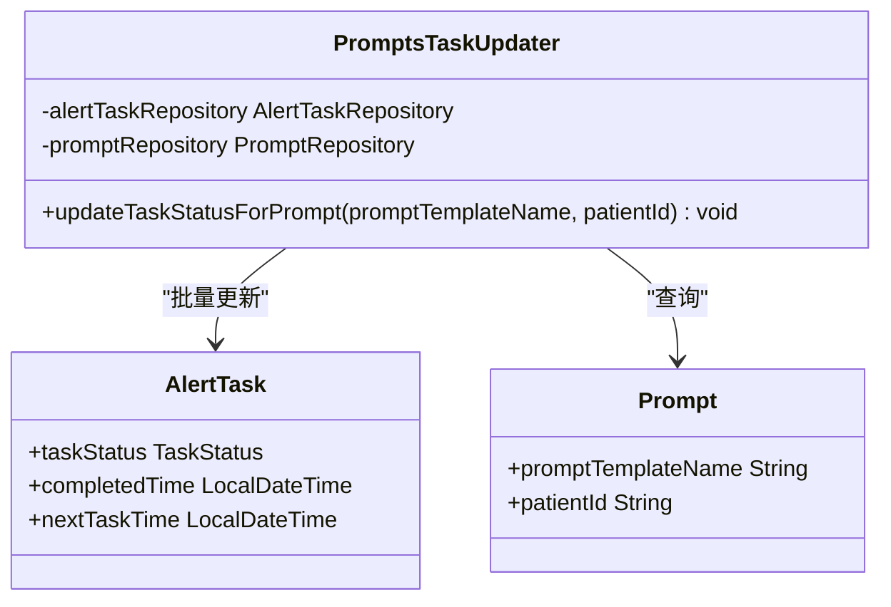

**图表来源**
- [PromptsTaskUpdater.java:1-116](file://med_ai_assistant_1.0_bs_backend/src/main/java/com/example/medaiassistant/service/PromptsTaskUpdater.java#L1-L116)
- [AlertTask.java:1-185](file://med_ai_assistant_1.0_bs_backend/src/main/java/com/example/medaiassistant/model/AlertTask.java#L1-L185)
- [Prompt.java:1-264](file://med_ai_assistant_1.0_bs_backend/src/main/java/com/example/medaiassistant/model/Prompt.java#L1-L264)

**章节来源**
- [PromptsTaskUpdater.java:1-116](file://med_ai_assistant_1.0_bs_backend/src/main/java/com/example/medaiassistant/service/PromptsTaskUpdater.java#L1-L116)
- [AlertTask.java:1-185](file://med_ai_assistant_1.0_bs_backend/src/main/java/com/example/medaiassistant/model/AlertTask.java#L1-L185)
- [Prompt.java:1-264](file://med_ai_assistant_1.0_bs_backend/src/main/java/com/example/medaiassistant/model/Prompt.java#L1-L264)

## 统一调度配置管理

**新增** SchedulingProperties类提供了统一的调度配置管理能力，替代了之前分散的配置方式：

### 配置层次结构
- **自动执行配置** (`scheduling.auto-execute.*`)
  - `interval`: 执行间隔时间（毫秒），默认5000ms
  - `max-threads`: 最大并发线程数，默认10个
  - `enabled`: 是否启用自动执行，默认true
  - `timezone`: 时区配置，默认Asia/Shanghai

- **定时任务配置** (`scheduling.timer.*`)
  - `daily-time`: 每日任务执行时间（cron表达式），默认0 0 7 * * *
  - `surgery-analysis-time`: 手术分析任务执行时间（cron表达式），默认0 0 8 * * *
  - `noon-ward-round-time`: 中午查房任务执行时间（cron表达式），默认0 0 13 * * *
  - `max-concurrency`: 最大并发数，默认5个
  - `fixed-delay-minutes`: 固定延迟任务间隔（分钟），默认5分钟
  - `enabled`: 是否启用定时任务，默认true
  - `department-filter-enabled`: 是否启用科室过滤，默认false
  - `target-departments`: 目标科室列表，默认空列表

- **线程池配置** (`scheduling.executor.*`, `scheduling.prompt-generation-pool.*`, `scheduling.surgery-analysis-pool.*`)
  - `core-pool-size`: 核心线程数
  - `max-pool-size`: 最大线程数
  - `queue-capacity`: 队列容量
  - `thread-name-prefix`: 线程名称前缀

- **监控配置** (`scheduling.monitoring.*`)
  - `enabled`: 是否启用监控，默认true
  - `metrics-interval`: 指标收集间隔（毫秒），默认60000ms
  - `alert-emails`: 告警邮箱列表，默认空列表
  - `warning-threshold`: 警告阈值（百分比），默认80%
  - `critical-threshold`: 严重警告阈值（百分比），默认95%

### 配置验证机制
SchedulingProperties提供了完整的配置验证机制：
- 验证定时任务配置的有效性（cron表达式、并发数等）
- 验证自动执行配置的有效性（间隔、线程数、时区等）
- 验证线程池配置的有效性（核心线程数、最大线程数、队列容量等）
- 验证监控配置的有效性（阈值范围、指标间隔等）

### 配置摘要功能
提供`getConfigurationSummary()`方法生成详细的配置摘要信息，便于监控和调试。

**章节来源**
- [SchedulingProperties.java:1-885](file://med_ai_assistant_1.0_bs_backend/src/main/java/com/example/medaiassistant/config/SchedulingProperties.java#L1-L885)
- [application.properties:140-172](file://med_ai_assistant_1.0_bs_backend/src/main/resources/application.properties#L140-L172)

## 定时任务配置与管理

**新增** TimerPromptGenerator类提供了完整的定时任务管理能力：

### 定时任务类型
- **每日Prompt生成任务**：每天定时为在院患者生成诊断分析、诊疗计划、病情小结等Prompt
- **手术分析任务**：手动执行的手术记录分析任务
- **病房查房任务**：定时生成病房查房记录的AI分析任务

### Cron表达式配置
系统支持多种定时任务的cron表达式配置：

- `scheduling.timer.daily-time`: 每日Prompt生成任务，默认0 0 4 * * *（每天4:00）
- `scheduling.timer.surgery-analysis-time`: 手术分析任务，默认0 0 5 * * *（每天5:00）
- `scheduling.timer.noon-ward-round-time`: 中午查房任务，默认0 0 13 * * *（每天13:00）

### 定时任务控制
- **启动定时器**：`startTimer()`方法启动定时任务
- **停止定时器**：`stopTimer()`方法停止定时任务
- **检查状态**：`isTimerRunning()`方法检查定时任务运行状态
- **动态配置**：支持运行时修改每日任务时间和最大并发数

### 分页处理和并发控制
- 使用分页查询避免内存溢出
- 支持并发执行控制，避免数据库连接竞争
- 提供性能监控指标，包括API调用次数、成功率、处理时间等

**章节来源**
- [TimerPromptGenerator.java:1-2325](file://med_ai_assistant_1.0_bs_backend/src/main/java/com/example/medaiassistant/service/TimerPromptGenerator.java#L1-L2325)
- [application.properties:145-149](file://med_ai_assistant_1.0_bs_backend/src/main/resources/application.properties#L145-L149)

## 部门和床位号过滤功能

**新增** 定时任务的部门和床位号过滤功能，提供了精细化的任务执行范围控制：

### 部门过滤功能
- **配置参数**：`scheduling.timer.department-filter-enabled`和`scheduling.timer.target-departments`
- **过滤逻辑**：支持按目标科室列表过滤定时任务执行范围
- **应用场景**：可以针对特定科室（如心血管病区、神经外科等）执行定时任务
- **配置示例**：
  ```properties
  scheduling.timer.department-filter-enabled=true
  scheduling.timer.target-departments=心血管一病区,心血管二病区
  ```

### 床位号过滤功能
- **配置参数**：`scheduling.timer.bed-number-filter-enabled`和`scheduling.timer.target-bed-numbers`
- **过滤逻辑**：支持按目标床位号列表过滤定时任务执行范围
- **应用场景**：可以针对特定床位号（如101床、102床等）执行定时任务
- **配置示例**：
  ```properties
  scheduling.timer.bed-number-filter-enabled=true
  scheduling.timer.target-bed-numbers=101,102,103
  ```

### 过滤配置验证
- 当启用科室过滤时，必须配置目标科室列表
- 提供完整的配置验证机制，确保配置参数的有效性
- 支持中文科室名称的编码修复功能

### 分页查询优化
- 在分页查询中集成过滤条件，避免不必要的数据处理
- 提供详细的调试信息，便于问题排查
- 支持空列表和null值的安全处理

**章节来源**
- [SchedulingProperties.java:175-408](file://med_ai_assistant_1.0_bs_backend/src/main/java/com/example/medaiassistant/config/SchedulingProperties.java#L175-L408)
- [TimerPromptGenerator.java:747-786](file://med_ai_assistant_1.0_bs_backend/src/main/java/com/example/medaiassistant/service/TimerPromptGenerator.java#L747-L786)
- [SchedulingPropertiesDepartmentFilterTest.java:1-185](file://med_ai_assistant_1.0_bs_backend/src/test/java/com/example/medaiassistant/config/SchedulingPropertiesDepartmentFilterTest.java#L1-L185)

## 定时任务控制器

**新增** TimerPromptGeneratorController类提供了完整的定时任务API接口：

### API接口功能
- **启动定时任务**：`POST /api/timer/start`
- **停止定时任务**：`POST /api/timer/stop`
- **获取定时任务状态**：`GET /api/timer/status`
- **手动触发每日Prompt生成**：`POST /api/timer/daily-prompt-generation`

### 接口参数
- **启动定时任务**：支持可选的`maxThreads`参数，指定最大线程数
- **手动触发**：支持可选的`time`和`maxConcurrency`参数，临时修改执行时间和并发数
- **状态查询**：返回定时任务的运行状态、配置信息等

### 响应格式
- **启动成功**：返回包含状态、消息、配置信息的JSON对象
- **停止成功**：返回包含状态和消息的JSON对象
- **状态查询**：返回包含运行状态、当前任务ID、配置信息的JSON对象

### 错误处理
- 提供完整的错误处理机制，包括参数验证、配置检查、异常捕获等
- 支持详细的错误信息返回，便于问题诊断

**章节来源**
- [TimerPromptGeneratorController.java:1-100](file://med_ai_assistant_1.0_bs_backend/src/main/java/com/example/medaiassistant/controller/TimerPromptGeneratorController.java#L1-L100)
- [TimerPromptGenerator.java:333-373](file://med_ai_assistant_1.0_bs_backend/src/main/java/com/example/medaiassistant/service/TimerPromptGenerator.java#L333-L373)

## 定时任务配置文档

**新增** TIMER_TASK_CONFIGURATION.md文档提供了完整的定时任务配置指南：

### 配置参数说明
- **AutoExecuteProperties配置**：`auto.execute.interval`和`auto.execute.maxThreads`
- **TimerPromptGenerator配置**：`timergenerator.daily.time`和最大并发数
- **Cron表达式格式**：秒 分 时 日 月 周 年

### 使用示例
- **基础配置**：提供简单的配置示例和参数说明
- **高级配置**：提供生产环境的优化配置建议
- **完整示例**：包含完整的配置文件和测试脚本

### 最佳实践
- **生产环境配置建议**：根据服务器配置调整线程池大小
- **监控和日志**：建议添加监控端点和日志分析
- **错误处理最佳实践**：提供错误处理和告警通知的实现示例
- **性能优化建议**：批量处理、异步执行、连接池优化等

### 故障排除
- **常见问题及解决方案**：定时任务不执行、执行性能下降、内存溢出等问题
- **日志分析**：关键日志信息和调试技巧
- **监控指标**：建议监控的任务执行次数、平均执行时间、成功率等指标

**章节来源**
- [TIMER_TASK_CONFIGURATION.md:1-526](file://med_ai_assistant_1.0_bs_backend/doc/其他/TIMER_TASK_CONFIGURATION.md#L1-L526)

## 依赖关系分析
- SyncScheduler 依赖于任务优先级枚举与并发锁，负责任务调度与状态管理。
- AlertTaskService 依赖 AlertTask 实体与仓库，提供任务状态更新与查询。
- **新增** SchedulingProperties 依赖于所有定时任务配置类，提供统一的配置管理。
- **新增** TimerPromptGenerator 依赖定时任务配置和MCC筛选服务，负责定时任务的执行。
- **新增** TimerPromptGeneratorController 依赖定时任务生成器和调度配置，提供API接口。
- **新增** 部门和床位号过滤功能依赖SchedulingProperties的过滤配置。
- **新增** 定时任务配置验证依赖SchedulingProperties的验证机制。
- **更新** AlertTaskRepository 提供精确的JPQL更新语句，避免批量更新异常。
- **新增** MedicalRecordController 依赖TodoItemRepository，提供智能待办事项查询服务。
- **新增** TodoItemRepository 提供软删除过滤的JPQL查询方法。
- **新增** TodoView.vue 依赖patient.js API封装，提供优化的前端展示。
- 执行服务器组件与配置相互依赖，确保执行环境正确加载。
- 控制器层通过服务层与执行层交互，形成清晰的职责边界。

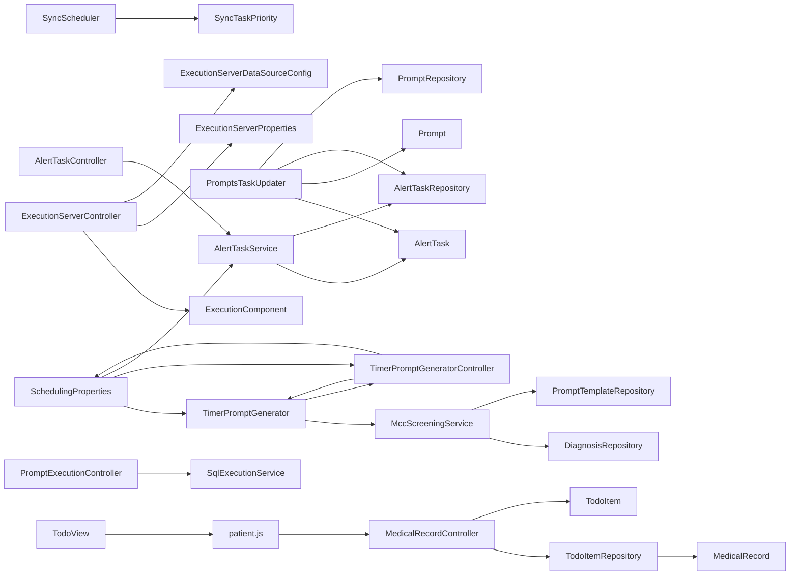

**图表来源**
- [SyncScheduler.java:1-549](file://med_ai_assistant_1.0_bs_backend/src/main/java/com/example/medaiassistant/hospital/service/SyncScheduler.java#L1-L549)
- [AlertTaskService.java:1-72](file://med_ai_assistant_1.0_bs_backend/src/main/java/com/example/medaiassistant/service/AlertTaskService.java#L1-L72)
- [AlertTaskRepository.java:1-81](file://med_ai_assistant_1.0_bs_backend/src/main/java/com/example/medaiassistant/repository/AlertTaskRepository.java#L1-L81)
- [SchedulingProperties.java:1-885](file://med_ai_assistant_1.0_bs_backend/src/main/java/com/example/medaiassistant/config/SchedulingProperties.java#L1-L885)
- [TimerPromptGenerator.java:1-2325](file://med_ai_assistant_1.0_bs_backend/src/main/java/com/example/medaiassistant/service/TimerPromptGenerator.java#L1-L2325)
- [TimerPromptGeneratorController.java:1-100](file://med_ai_assistant_1.0_bs_backend/src/main/java/com/example/medaiassistant/controller/TimerPromptGeneratorController.java#L1-L100)
- [MccScreeningService.java](file://med_ai_assistant_1.0_bs_backend/src/main/java/com/example/medaiassistant/service/MccScreeningService.java)
- [DiagnosisRepository.java](file://med_ai_assistant_1.0_bs_backend/src/main/java/com/example/medaiassistant/repository/DiagnosisRepository.java)
- [PromptTemplateRepository.java](file://med_ai_assistant_1.0_bs_backend/src/main/java/com/example/medaiassistant/repository/PromptTemplateRepository.java)
- [PromptsTaskUpdater.java:1-116](file://med_ai_assistant_1.0_bs_backend/src/main/java/com/example/medaiassistant/service/PromptsTaskUpdater.java#L1-L116)
- [AlertTask.java:1-185](file://med_ai_assistant_1.0_bs_backend/src/main/java/com/example/medaiassistant/model/AlertTask.java#L1-L185)
- [Prompt.java:1-264](file://med_ai_assistant_1.0_bs_backend/src/main/java/com/example/medaiassistant/model/Prompt.java#L1-L264)
- [ExecutionServerController.java](file://med_ai_assistant_1.0_bs_backend/src/main/java/com/example/medaiassistant/controller/ExecutionServerController.java)
- [ExecutionComponent.java:1-24](file://med_ai_assistant_1.0_bs_backend/src/main/java/com/example/medaiassistant/execution/ExecutionComponent.java#L1-L24)
- [ExecutionServerProperties.java](file://med_ai_assistant_1.0_bs_backend/src/main/java/com/example/medaiassistant/config/ExecutionServerProperties.java)
- [ExecutionServerDataSourceConfig.java](file://med_ai_assistant_1.0_bs_backend/src/main/java/com/example/medaiassistant/config/ExecutionServerDataSourceConfig.java)
- [AlertTaskController.java](file://med_ai_assistant_1.0_bs_backend/src/main/java/com/example/medaiassistant/controller/AlertTaskController.java)
- [PromptExecutionController.java](file://med_ai_assistant_1.0_bs_backend/src/main/java/com/example/medaiassistant/controller/PromptExecutionController.java)
- [SqlExecutionService.java](file://med_ai_assistant_1.0_bs_backend/src/main/java/com/example/medaiassistant/hospital/service/SqlExecutionService.java)
- [MedicalRecordController.java:1-653](file://med_ai_assistant_1.0_bs_backend/src/main/java/com/example/medaiassistant/controller/MedicalRecordController.java#L1-L653)
- [TodoItemRepository.java:1-108](file://med_ai_assistant_1.0_bs_backend/src/main/java/com/example/medaiassistant/repository/TodoItemRepository.java#L1-L108)
- [TodoItem.java:1-177](file://med_ai_assistant_1.0_bs_backend/src/main/java/com/example/medaiassistant/model/TodoItem.java#L1-L177)
- [TodoView.vue:1-717](file://med_ai_assistant_1.0_bs_vue/src/views/TodoView.vue#L1-L717)
- [patient.js:1-616](file://med_ai_assistant_1.0_bs_vue/src/api/patient.js#L1-L616)

**章节来源**
- [SyncScheduler.java:1-549](file://med_ai_assistant_1.0_bs_backend/src/main/java/com/example/medaiassistant/hospital/service/SyncScheduler.java#L1-L549)
- [AlertTaskService.java:1-72](file://med_ai_assistant_1.0_bs_backend/src/main/java/com/example/medaiassistant/service/AlertTaskService.java#L1-L72)
- [AlertTaskRepository.java:1-81](file://med_ai_assistant_1.0_bs_backend/src/main/java/com/example/medaiassistant/repository/AlertTaskRepository.java#L1-L81)
- [SchedulingProperties.java:1-885](file://med_ai_assistant_1.0_bs_backend/src/main/java/com/example/medaiassistant/config/SchedulingProperties.java#L1-L885)
- [TimerPromptGenerator.java:1-2325](file://med_ai_assistant_1.0_bs_backend/src/main/java/com/example/medaiassistant/service/TimerPromptGenerator.java#L1-L2325)
- [TimerPromptGeneratorController.java:1-100](file://med_ai_assistant_1.0_bs_backend/src/main/java/com/example/medaiassistant/controller/TimerPromptGeneratorController.java#L1-L100)
- [MccScreeningService.java](file://med_ai_assistant_1.0_bs_backend/src/main/java/com/example/medaiassistant/service/MccScreeningService.java)
- [DiagnosisRepository.java](file://med_ai_assistant_1.0_bs_backend/src/main/java/com/example/medaiassistant/repository/DiagnosisRepository.java)
- [PromptTemplateRepository.java](file://med_ai_assistant_1.0_bs_backend/src/main/java/com/example/medaiassistant/repository/PromptTemplateRepository.java)
- [PromptsTaskUpdater.java:1-116](file://med_ai_assistant_1.0_bs_backend/src/main/java/com/example/medaiassistant/service/PromptsTaskUpdater.java#L1-L116)
- [AlertTask.java:1-185](file://med_ai_assistant_1.0_bs_backend/src/main/java/com/example/medaiassistant/model/AlertTask.java#L1-L185)
- [Prompt.java:1-264](file://med_ai_assistant_1.0_bs_backend/src/main/java/com/example/medaiassistant/model/Prompt.java#L1-L264)
- [ExecutionServerController.java](file://med_ai_assistant_1.0_bs_backend/src/main/java/com/example/medaiassistant/controller/ExecutionServerController.java)
- [ExecutionComponent.java:1-24](file://med_ai_assistant_1.0_bs_backend/src/main/java/com/example/medaiassistant/execution/ExecutionComponent.java#L1-L24)
- [ExecutionServerProperties.java](file://med_ai_assistant_1.0_bs_backend/src/main/java/com/example/medaiassistant/config/ExecutionServerProperties.java)
- [ExecutionServerDataSourceConfig.java](file://med_ai_assistant_1.0_bs_backend/src/main/java/com/example/medaiassistant/config/ExecutionServerDataSourceConfig.java)
- [AlertTaskController.java](file://med_ai_assistant_1.0_bs_backend/src/main/java/com/example/medaiassistant/controller/AlertTaskController.java)
- [PromptExecutionController.java](file://med_ai_assistant_1.0_bs_backend/src/main/java/com/example/medaiassistant/controller/PromptExecutionController.java)
- [SqlExecutionService.java](file://med_ai_assistant_1.0_bs_backend/src/main/java/com/example/medaiassistant/hospital/service/SqlExecutionService.java)
- [MedicalRecordController.java:1-653](file://med_ai_assistant_1.0_bs_backend/src/main/java/com/example/medaiassistant/controller/MedicalRecordController.java#L1-L653)
- [TodoItemRepository.java:1-108](file://med_ai_assistant_1.0_bs_backend/src/main/java/com/example/medaiassistant/repository/TodoItemRepository.java#L1-L108)
- [TodoItem.java:1-177](file://med_ai_assistant_1.0_bs_backend/src/main/java/com/example/medaiassistant/model/TodoItem.java#L1-L177)
- [TodoView.vue:1-717](file://med_ai_assistant_1.0_bs_vue/src/views/TodoView.vue#L1-L717)
- [patient.js:1-616](file://med_ai_assistant_1.0_bs_vue/src/api/patient.js#L1-L616)

## 性能考虑
- 线程池大小：根据任务并发量与CPU核数合理配置，避免过多上下文切换。
- 优先级调度：高优先级任务应尽快执行，但需避免饥饿；可引入动态权重调整。
- 并发控制：使用细粒度锁（按医院维度）减少争用，提高吞吐。
- 统计与监控：记录执行次数、失败率、平均耗时，辅助容量规划。
- I/O 优化：批量处理与异步执行可降低数据库压力。
- 资源限制：设置最大等待队列长度与超时阈值，防止雪崩效应。
- **新增** 统一配置管理性能：SchedulingProperties提供集中配置管理，减少配置分散带来的性能开销。
- **新增** 定时任务过滤性能：部门和床位号过滤功能通过数据库层面的过滤减少不必要的数据处理。
- **新增** 分页查询性能：定时任务采用分页查询避免内存溢出，提高大数据量处理能力。
- **新增** 并发控制性能：定时任务支持并发控制，避免数据库连接竞争和资源争用。
- **新增** 配置验证性能：SchedulingProperties的配置验证机制在启动时进行，避免运行时配置错误。
- **新增** 待办事项查询性能：智能去重算法使用Stream API和Collectors.toMap，时间复杂度为O(n)，内存使用合理。
- **新增** 软删除过滤性能：JPQL查询通过JOIN过滤软删除记录，避免在Java层进行二次过滤。
- **新增** 前端展示性能：TodoView.vue中的待办事项汇总逻辑避免了重复渲染，提升了用户体验。
- **新增** MCC筛选性能：MCC筛选涉及复杂的相似度计算和分组排序，需要优化算法复杂度和数据库查询性能。
- **更新** 批量更新性能：通过去重和异常降级机制，提升批量更新的稳定性和性能。

## 故障排查指南
- 任务状态异常：检查任务状态字典与完成条件，确认中断与失败分支。
- 并发冲突：验证锁获取逻辑与释放时机，避免死锁与重复执行。
- 配置问题：核对调度cron表达式、线程池参数与执行服务器配置。
- 数据一致性：事务性更新任务状态，确保数据库层面一致。
- 监控缺失：完善统计字段与日志级别，便于快速定位问题。
- **新增** 统一配置管理异常：检查SchedulingProperties的配置验证，确认配置参数的有效性。
- **新增** 定时任务过滤异常：检查部门和床位号过滤配置，验证过滤条件的正确性。
- **新增** 定时任务控制器异常：检查API接口的参数验证和错误处理机制。
- **新增** 定时任务配置文档异常：检查配置参数的格式和取值范围。
- **新增** 待办事项查询异常：检查TodoItemRepository的JPQL查询语法，验证软删除过滤逻辑。
- **新增** 智能去重异常：验证filterLatestTodoPerRecord方法的Stream API使用，检查null值处理逻辑。
- **新增** 前端展示异常：检查TodoView.vue中的待办事项汇总逻辑，验证数据格式和渲染问题。
- **新增** MCC筛选异常：检查诊断数据完整性、MCC编码匹配准确性、相似度阈值设置。
- **新增** Prompt生成异常：验证Prompt模板可用性、患者数据完整性、生成结果存储。
- **更新** 批量更新异常：检查AlertTaskRepository的JPQL更新语句，验证任务ID唯一性，确认去重逻辑有效性。
- **更新** PromptsTaskUpdater异常：验证模板名称匹配条件，检查48小时间隔逻辑，确认异常降级处理机制正常工作。

**章节来源**
- [SyncScheduler.java:144-186](file://med_ai_assistant_1.0_bs_backend/src/main/java/com/example/medaiassistant/hospital/service/SyncScheduler.java#L144-L186)
- [AlertTaskService.java:56-60](file://med_ai_assistant_1.0_bs_backend/src/main/java/com/example/medaiassistant/service/AlertTaskService.java#L56-L60)
- [SchedulingProperties.java:686-760](file://med_ai_assistant_1.0_bs_backend/src/main/java/com/example/medaiassistant/config/SchedulingProperties.java#L686-L760)
- [TimerPromptGeneratorController.java:70-98](file://med_ai_assistant_1.0_bs_backend/src/main/java/com/example/medaiassistant/controller/TimerPromptGeneratorController.java#L70-L98)
- [TimerPromptGenerator.java:747-786](file://med_ai_assistant_1.0_bs_backend/src/main/java/com/example/medaiassistant/service/TimerPromptGenerator.java#L747-L786)
- [MedicalRecordController.java:624-650](file://med_ai_assistant_1.0_bs_backend/src/main/java/com/example/medaiassistant/controller/MedicalRecordController.java#L624-L650)
- [TodoItemRepository.java:63-106](file://med_ai_assistant_1.0_bs_backend/src/main/java/com/example/medaiassistant/repository/TodoItemRepository.java#L63-L106)
- [TodoView.vue:207-247](file://med_ai_assistant_1.0_bs_vue/src/views/TodoView.vue#L207-L247)
- [MccScreeningService.java](file://med_ai_assistant_1.0_bs_backend/src/main/java/com/example/medaiassistant/service/MccScreeningService.java)
- [PromptsTaskUpdater.java:96-114](file://med_ai_assistant_1.0_bs_backend/src/main/java/com/example/medaiassistant/service/PromptsTaskUpdater.java#L96-L114)

## 结论
本系统通过统一的线程池调度器、基于优先级的定时调度器、严格的并发控制与完善的任务状态管理，实现了可靠的主服务器与执行服务器协同。结合可配置的调度策略与监控统计，系统具备良好的可扩展性与可观测性。

**更新** 新增的统一调度配置管理能力显著提升了系统的配置管理效率，通过SchedulingProperties集中管理所有定时任务配置参数，包括每日提示生成、手术分析和病房查房记录创建的cron表达式配置，以及灵活的部门和床位号过滤机制。新增的定时任务控制器提供了完整的API接口，支持定时任务的动态启停和状态监控。新增的定时任务配置文档为用户提供了详细的配置指南和最佳实践建议。

建议在生产环境中进一步完善定时任务的配置验证机制，加强定时任务执行的监控和告警功能，优化部门和床位号过滤的性能表现，并持续改进定时任务的配置管理和API接口设计。

## 附录
- 调度策略配置项
  - 线程池大小：通过调度器配置注入
  - 定时任务cron：支持全局与按任务配置
  - 优先级：高/中/低，数值越小优先级越高
  - 自动同步开关与周期：支持启停与统计
  - **新增** 统一调度配置：通过SchedulingProperties集中管理
  - **新增** 定时任务过滤：支持部门和床位号过滤
  - **新增** 定时任务控制器：提供API接口管理
  - **新增** 定时任务配置文档：提供完整使用指南
  - **新增** MCC筛选配置：支持阈值、相似度、分组参数配置
  - **新增** 待办事项查询配置：支持软删除过滤、智能去重参数
- 性能调优建议
  - 动态调整线程池大小与队列长度
  - 引入任务批处理与异步执行
  - 增加熔断与降级策略
  - 加强监控与告警联动
  - **新增** 优化统一配置管理性能，减少配置加载开销
  - **新增** 优化定时任务过滤性能，使用合适的索引和查询条件
  - **新增** 优化定时任务分页查询性能，避免内存溢出
  - **新增** 优化定时任务并发控制，避免数据库连接竞争
  - **新增** 优化定时任务控制器API性能，减少请求处理时间
  - **新增** 优化待办事项查询性能，使用合适的索引和查询条件
  - **新增** 优化智能去重算法，考虑大数据量场景下的内存使用
  - **新增** 优化前端展示性能，避免重复渲染和不必要的DOM操作
  - **新增** 优化MCC筛选算法性能，建立索引和缓存机制
  - **更新** 优化批量更新性能，确保任务ID唯一性和去重有效性
- **新增** 统一调度配置管理功能配置
  - 自动执行配置：支持间隔、线程数、时区等参数配置
  - 定时任务配置：支持cron表达式、并发数、过滤条件等参数配置
  - 线程池配置：支持核心线程数、最大线程数、队列容量等参数配置
  - 监控配置：支持监控开关、指标收集间隔、告警邮箱等参数配置
  - 执行轮询配置：支持并发数、超时时间、重试次数等参数配置
- **新增** 定时任务过滤功能配置
  - 部门过滤：支持启用/禁用和目标科室列表配置
  - 床位号过滤：支持启用/禁用和目标床位号列表配置
  - 过滤验证：支持配置参数的有效性验证
  - 编码修复：支持中文科室名称的编码修复功能
- **新增** 定时任务控制器功能配置
  - 启动定时任务：支持可选的最大线程数参数
  - 停止定时任务：支持无参数停止操作
  - 获取状态：支持实时查询定时任务运行状态
  - 手动触发：支持临时修改执行时间和并发数
- **新增** 定时任务配置文档功能配置
  - 基础配置：提供简单配置示例和参数说明
  - 高级配置：提供生产环境优化配置建议
  - 完整示例：包含完整配置文件和测试脚本
  - 最佳实践：提供性能优化和故障排除建议
  - 故障排除：提供常见问题和解决方案
- **新增** 待办事项查询功能配置
  - 软删除过滤：自动排除deleted=1的病历记录
  - 智能去重：按medicalRecordId分组，保留createdTime最新记录
  - 时间排序：支持按创建时间降序和床号升序排列
  - null值处理：兼容medicalRecordId为null的记录
- **新增** 待办事项查询接口配置
  - 患者待办查询：支持按患者ID查询，自动过滤软删除记录
  - 科室待办查询：支持按日期和科室查询，自动过滤软删除记录
  - 病历待办查询：保持原有功能，返回该病历的所有待办事项
- **新增** 前端展示配置
  - 待办事项汇总：同一病人的多条待办自动合并
  - 内容拼接：多个待办事项内容通过换行符连接
  - 计数统计：显示每个病人的待办数量
  - 时间排序：按创建时间倒序排列
- **新增** 智能去重算法配置
  - Stream API使用：利用Collectors.toMap实现高效分组
  - 时间比较：createdTime字段用于确定最新记录
  - null值安全：createdTime为null时的安全处理逻辑
  - 兼容性：保留medicalRecordId为null的记录
- **更新** 批量更新异常处理配置
  - 去重机制：按taskId去重，防止重复记录
  - 异常降级：批量更新失败时自动降级为逐条保存
  - 48小时间隔检查：确保任务状态更新符合业务规则
  - 事务性保证：通过Transactional注解确保原子性