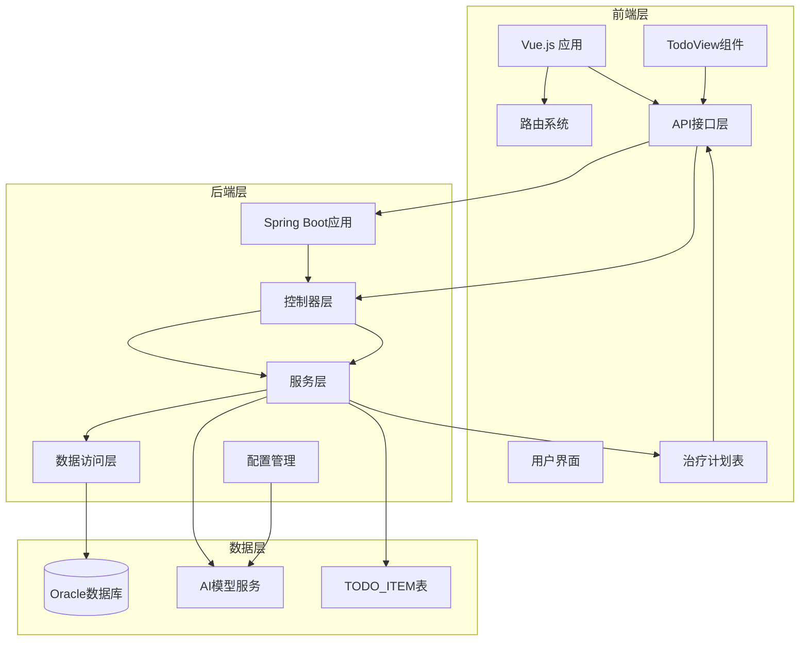
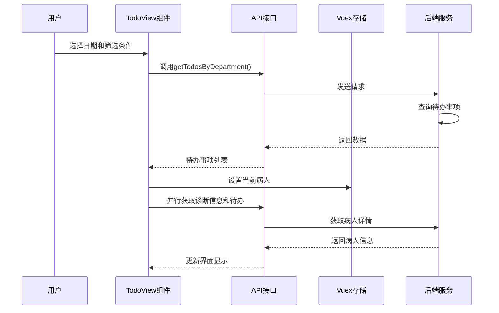
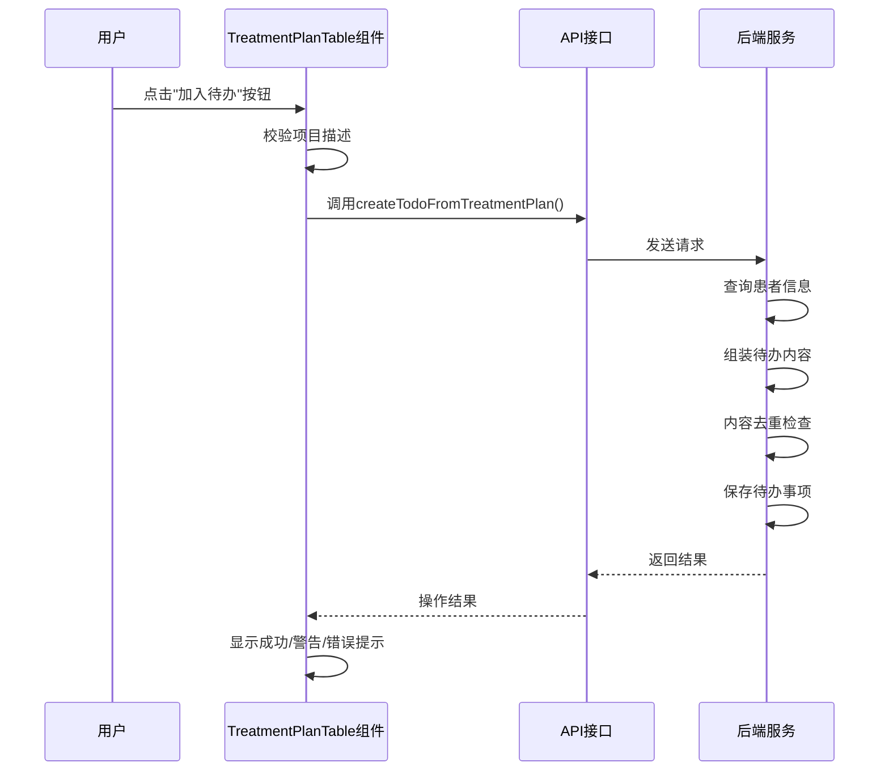
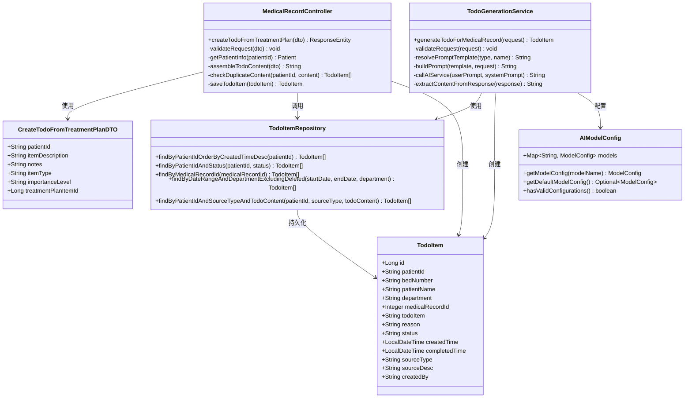
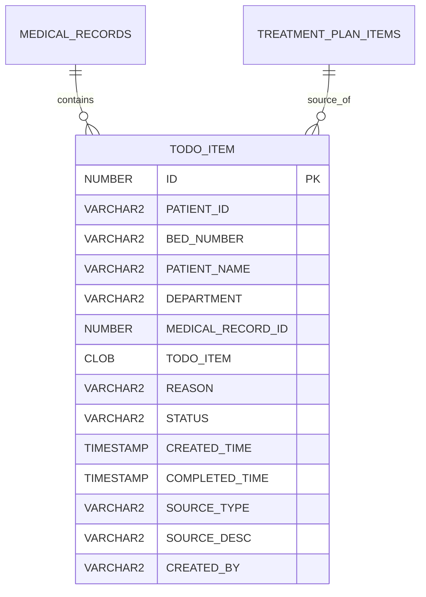
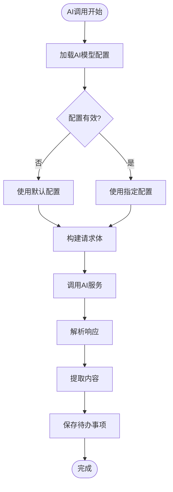
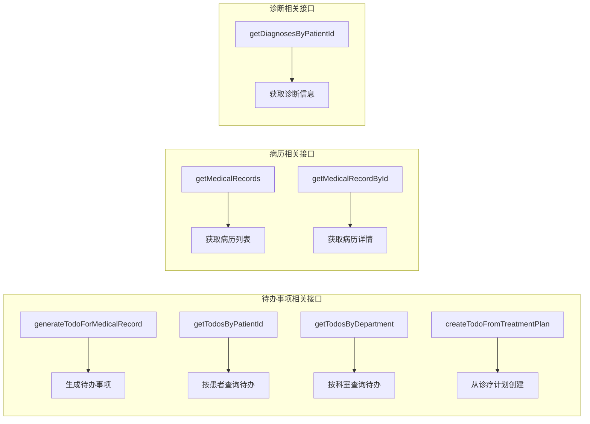

# 待办事项管理系统

<cite>
**本文档引用的文件**
- [TodoView.vue](file://med_ai_assistant_1.0_bs_vue/src/views/TodoView.vue)
- [TreatmentPlanTable.vue](file://med_ai_assistant_1.0_bs_vue/src/components/ai/TreatmentPlanTable.vue)
- [patient.js](file://med_ai_assistant_1.0_bs_vue/src/api/patient.js)
- [index.js](file://med_ai_assistant_1.0_bs_vue/src/router/index.js)
- [MedicalRecordController.java](file://med_ai_assistant_1.0_bs_backend/src/main/java/com/example/medaiassistant/controller/MedicalRecordController.java)
- [CreateTodoFromTreatmentPlanDTO.java](file://med_ai_assistant_1.0_bs_backend/src/main/java/com/example/medaiassistant/dto/CreateTodoFromTreatmentPlanDTO.java)
- [TodoItemRepository.java](file://med_ai_assistant_1.0_bs_backend/src/main/java/com/example/medaiassistant/repository/TodoItemRepository.java)
- [TodoGenerationService.java](file://med_ai_assistant_1.0_bs_backend/src/main/java/com/example/medaiassistant/service/TodoGenerationService.java)
- [TodoGenerationRequest.java](file://med_ai_assistant_1.0_bs_backend/src/main/java/com/example/medaiassistant/dto/TodoGenerationRequest.java)
- [TodoItem.java](file://med_ai_assistant_1.0_bs_backend/src/main/java/com/example/medaiassistant/model/TodoItem.java)
- [AIModelConfig.java](file://med_ai_assistant_1.0_bs_backend/src/main/java/com/example/medaiassistant/config/AIModelConfig.java)
- [application.properties](file://med_ai_assistant_1.0_bs_backend/src/main/resources/application.properties)
- [ai-models.properties](file://med_ai_assistant_1.0_bs_backend/src/main/resources/ai-models.properties)
- [待办事项接口.md](file://med_ai_assistant_1.0_bs_backend/doc/接口/病历记录/待办事项接口.md)
- [诊疗计划表操作列添加加入待办按钮方案.md](file://med_ai_assistant_1.0_bs_backend/doc/迭代/诊疗计划表/诊疗计划表操作列添加加入待办按钮方案.md)
- [TodoGenerationServiceTest.java](file://med_ai_assistant_1.0_bs_backend/src/test/java/com/example/medaiassistant/service/TodoGenerationServiceTest.java)
</cite>

## 更新摘要
**所做更改**
- 新增了"从诊疗计划创建待办"功能的完整文档说明
- 更新了前端界面分析，增加了治疗计划表格的"加入待办"按钮功能
- 新增了后端服务架构中新增接口的详细说明
- 完善了数据模型设计，增加了来源类型字段的说明
- 更新了API接口设计，包含了新的待办创建接口

## 目录
1. [项目概述](#项目概述)
2. [系统架构](#系统架构)
3. [核心组件](#核心组件)
4. [前端界面分析](#前端界面分析)
5. [后端服务架构](#后端服务架构)
6. [数据模型设计](#数据模型设计)
7. [AI集成机制](#ai集成机制)
8. [API接口设计](#api接口设计)
9. [性能优化策略](#性能优化策略)
10. [故障排查指南](#故障排查指南)
11. [总结](#总结)

## 项目概述

待办事项管理系统是一个基于Vue.js前端和Spring Boot后端的医疗信息系统模块，主要功能是从病历记录中智能生成待办事项，并提供统一的待办事项管理界面。系统集成了AI大语言模型，能够自动分析病历内容并提取需要完善的待办事项。

**更新** 系统现已增强从治疗计划到待办事项的集成能力，新增了"加入待办"按钮功能，显著提升了工作流程效率。

该系统采用前后端分离架构，前端使用Vue.js + Element Plus构建用户界面，后端使用Spring Boot + JPA提供RESTful API服务，数据库采用Oracle关系型数据库。

## 系统架构

**图表来源**
- [TodoView.vue:1-717](file://med_ai_assistant_1.0_bs_vue/src/views/TodoView.vue#L1-L717)
- [TreatmentPlanTable.vue:1-975](file://med_ai_assistant_1.0_bs_vue/src/components/ai/TreatmentPlanTable.vue#L1-L975)
- [MedicalRecordController.java:1-810](file://med_ai_assistant_1.0_bs_backend/src/main/java/com/example/medaiassistant/controller/MedicalRecordController.java#L1-L810)

## 核心组件

### 前端组件

系统的核心前端组件包括：

- **左侧筛选面板**：支持按日期、科室筛选待办事项
- **病人卡片列表**：显示每个病人的待办事项概览
- **右侧详情面板**：显示病人的详细信息和完整待办列表
- **治疗计划表格**：新增的诊疗计划管理组件，包含"加入待办"按钮功能

**更新** 治疗计划表格组件提供了完整的诊疗计划管理界面，支持行内编辑、软删除、批量保存等功能，并新增了便捷的"加入待办"按钮。

### 后端服务组件

后端系统包含多个核心服务组件：

- **TodoGenerationService**：待办事项生成服务
- **TodoItemRepository**：数据访问层接口
- **AIModelConfig**：AI模型配置管理
- **TodoItem**：待办事项实体模型
- **MedicalRecordController**：新增的医疗记录控制器，包含待办事项相关接口

**更新** 新增了专门处理治疗计划到待办事项转换的后端接口和数据传输对象。

## 前端界面分析

### TodoView组件功能

TodoView组件是整个待办事项系统的核心界面，具有以下主要功能：

**图表来源**
- [TodoView.vue:191-254](file://med_ai_assistant_1.0_bs_vue/src/views/TodoView.vue#L191-L254)
- [patient.js:611-615](file://med_ai_assistant_1.0_bs_vue/src/api/patient.js#L611-L615)

### 治疗计划表格组件功能

**新增** 治疗计划表格组件提供了完整的诊疗计划管理功能：

**图表来源**
- [TreatmentPlanTable.vue:631-682](file://med_ai_assistant_1.0_bs_vue/src/components/ai/TreatmentPlanTable.vue#L631-L682)
- [patient.js:618-630](file://med_ai_assistant_1.0_bs_vue/src/api/patient.js#L618-L630)

### 界面特性

1. **响应式布局**：采用左右分栏设计，左侧显示病人列表，右侧显示详细信息
2. **实时筛选**：支持按日期和科室实时筛选待办事项
3. **Markdown渲染**：支持任务列表格式的Markdown内容渲染
4. **并行数据加载**：使用Promise.all实现数据的并行加载优化
5. **便捷操作**：治疗计划表格新增"加入待办"按钮，一键将计划项转为待办事项

**更新** 新增了治疗计划表格的"加入待办"按钮功能，支持内容校验、患者信息获取、待办内容组装、去重检查和保存操作。

**章节来源**
- [TodoView.vue:1-717](file://med_ai_assistant_1.0_bs_vue/src/views/TodoView.vue#L1-L717)
- [TreatmentPlanTable.vue:1-975](file://med_ai_assistant_1.0_bs_vue/src/components/ai/TreatmentPlanTable.vue#L1-L975)

## 后端服务架构

### 服务层设计

后端采用经典的三层架构模式：

**图表来源**
- [MedicalRecordController.java:692-779](file://med_ai_assistant_1.0_bs_backend/src/main/java/com/example/medaiassistant/controller/MedicalRecordController.java#L692-L779)
- [CreateTodoFromTreatmentPlanDTO.java:1-178](file://med_ai_assistant_1.0_bs_backend/src/main/java/com/example/medaiassistant/dto/CreateTodoFromTreatmentPlanDTO.java#L1-L178)
- [TodoGenerationService.java:34-362](file://med_ai_assistant_1.0_bs_backend/src/main/java/com/example/medaiassistant/service/TodoGenerationService.java#L34-L362)
- [TodoItemRepository.java:1-136](file://med_ai_assistant_1.0_bs_backend/src/main/java/com/example/medaiassistant/repository/TodoItemRepository.java#L1-L136)
- [TodoItem.java:17-304](file://med_ai_assistant_1.0_bs_backend/src/main/java/com/example/medaiassistant/model/TodoItem.java#L17-L304)
- [AIModelConfig.java:31-399](file://med_ai_assistant_1.0_bs_backend/src/main/java/com/example/medaiassistant/config/AIModelConfig.java#L31-L399)

### 数据访问层

TodoItemRepository提供了丰富的查询方法：

1. **按患者查询**：支持按患者ID查询待办事项
2. **按状态查询**：支持按状态过滤待办事项
3. **日期范围查询**：支持按日期范围查询待办事项
4. **去重查询**：支持基于CLOB字段的去重查询
5. **新增内容匹配查询**：支持按患者ID、来源类型和待办内容进行精确匹配

**更新** 新增了`findByPatientIdAndSourceTypeAndTodoContent`方法，用于治疗计划到待办事项的去重检查。

**章节来源**
- [TodoItemRepository.java:1-136](file://med_ai_assistant_1.0_bs_backend/src/main/java/com/example/medaiassistant/repository/TodoItemRepository.java#L1-L136)

## 数据模型设计

### TodoItem实体模型

TodoItem是系统的核心数据模型，设计考虑了医疗场景的特殊需求：

**图表来源**
- [TodoItem.java:17-304](file://med_ai_assistant_1.0_bs_backend/src/main/java/com/example/medaiassistant/model/TodoItem.java#L17-L304)

### 字段设计特点

1. **CLOB类型支持**：待办事项内容使用CLOB类型，支持长文本存储
2. **状态管理**：内置待办事项状态字段，支持待处理、已完成、已忽略
3. **来源追踪**：记录待办事项的来源类型和描述，新增`TREATMENT_PLAN`类型
4. **时间戳管理**：包含创建时间和完成时间字段
5. **去重机制**：通过`SOURCE_TYPE`和`TODO_ITEM`内容实现精确去重

**更新** 新增了`SOURCE_TYPE`字段用于区分待办事项来源，支持`MEDICAL_RECORD`和`TREATMENT_PLAN`两种类型。

**章节来源**
- [TodoItem.java:1-304](file://med_ai_assistant_1.0_bs_backend/src/main/java/com/example/medaiassistant/model/TodoItem.java#L1-L304)

## AI集成机制

### AI模型配置管理

系统采用灵活的AI模型配置机制：

**图表来源**
- [TodoGenerationService.java:251-312](file://med_ai_assistant_1.0_bs_backend/src/main/java/com/example/medaiassistant/service/TodoGenerationService.java#L251-L312)
- [AIModelConfig.java:325-348](file://med_ai_assistant_1.0_bs_backend/src/main/java/com/example/medaiassistant/config/AIModelConfig.java#L325-L348)

### Prompt模板系统

系统支持灵活的Prompt模板配置：

1. **默认模板**：提供基础的待办事项分析Prompt
2. **数据库模板**：支持从数据库动态加载模板
3. **模板解析**：自动解析和组装完整的Prompt内容

**章节来源**
- [TodoGenerationService.java:164-212](file://med_ai_assistant_1.0_bs_backend/src/main/java/com/example/medaiassistant/service/TodoGenerationService.java#L164-L212)

## API接口设计

### 前端API接口

前端通过patient.js文件定义了完整的API接口：

**图表来源**
- [patient.js:565-630](file://med_ai_assistant_1.0_bs_vue/src/api/patient.js#L565-L630)

### 新增接口

**更新** 新增了从治疗计划创建待办事项的专用接口：

- **POST /api/medicalrecords/todos/from-treatment-plan**：从诊疗计划项创建待办事项
- **请求参数**：包含患者ID、项目描述、注意事项、项目类型、重要程度等
- **响应格式**：包含操作结果、待办事项ID和内容

### 接口特性

1. **统一错误处理**：所有接口都包含完整的错误处理机制
2. **超时配置**：针对AI调用设置了合理的超时时间
3. **数据格式化**：自动处理前端需要的数据格式转换
4. **内容去重**：新增接口支持基于内容的去重检查

**章节来源**
- [patient.js:1-640](file://med_ai_assistant_1.0_bs_vue/src/api/patient.js#L1-L640)
- [待办事项接口.md:366-410](file://med_ai_assistant_1.0_bs_backend/doc/接口/病历记录/待办事项接口.md#L366-L410)

## 性能优化策略

### 前端性能优化

1. **并行数据加载**：使用Promise.all实现多个API的并行调用
2. **虚拟滚动**：对于大量数据的列表使用虚拟滚动技术
3. **缓存机制**：合理使用浏览器缓存减少重复请求
4. **按钮状态管理**：治疗计划表格中的"加入待办"按钮支持独立的加载状态

### 后端性能优化

1. **连接池优化**：配置了高性能的HikariCP连接池
2. **查询优化**：针对Oracle数据库进行了专门的查询优化
3. **异步处理**：AI调用采用异步处理避免阻塞
4. **CLOB处理优化**：使用DBMS_LOB.SUBSTR函数优化CLOB字段的比较操作

**更新** 新增了针对CLOB字段的优化处理，避免直接对CLOB使用等值比较导致的性能问题。

**章节来源**
- [application.properties:42-58](file://med_ai_assistant_1.0_bs_backend/src/main/resources/application.properties#L42-L58)
- [TodoItemRepository.java:125-134](file://med_ai_assistant_1.0_bs_backend/src/main/java/com/example/medaiassistant/repository/TodoItemRepository.java#L125-L134)

## 故障排查指南

### 常见问题及解决方案

1. **AI模型配置错误**
   - 检查ai-models.properties文件中的配置
   - 验证API密钥的有效性
   - 确认网络连接正常

2. **数据库连接问题**
   - 检查Oracle数据库连接配置
   - 验证连接池参数设置
   - 查看数据库日志信息

3. **待办事项生成失败**
   - 检查病历内容格式
   - 验证AI服务可用性
   - 查看详细的错误日志

4. **治疗计划待办创建失败**
   - 检查患者ID是否正确
   - 验证项目描述是否为空
   - 确认去重检查逻辑是否正常
   - 查看CLOB字段处理是否正确

**更新** 新增了治疗计划相关功能的故障排查指南。

**章节来源**
- [TodoGenerationServiceTest.java:89-142](file://med_ai_assistant_1.0_bs_backend/src/test/java/com/example/medaiassistant/service/TodoGenerationServiceTest.java#L89-L142)

## 总结

待办事项管理系统是一个功能完整、架构清晰的医疗信息系统模块。系统通过AI技术实现了智能化的待办事项生成，为医护人员提供了高效的病历管理工具。

**更新** 系统现已显著增强了从治疗计划到待办事项的集成能力，新增的"加入待办"按钮功能大幅提升了工作流程效率。

### 系统优势

1. **智能化程度高**：通过AI模型自动分析病历内容
2. **用户体验优秀**：提供直观易用的界面设计
3. **扩展性强**：模块化设计便于功能扩展
4. **性能稳定**：经过优化的架构确保系统稳定运行
5. **工作流程优化**：新增的治疗计划到待办事项集成功能提升了工作效率

### 技术特色

1. **前后端分离**：采用现代化的技术栈
2. **数据库优化**：针对Oracle数据库进行了专门优化
3. **AI集成**：灵活的AI模型配置机制
4. **测试完善**：包含完整的单元测试和集成测试
5. **内容去重**：智能的重复内容检查机制
6. **来源追踪**：完整的待办事项来源记录

该系统为医疗机构提供了一个可靠的待办事项管理解决方案，能够有效提高医疗工作效率和质量。新增的治疗计划集成功能进一步强化了系统的实用性，为医护人员提供了更加便捷的工作流程支持。