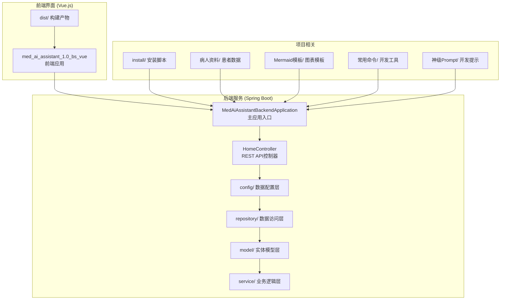
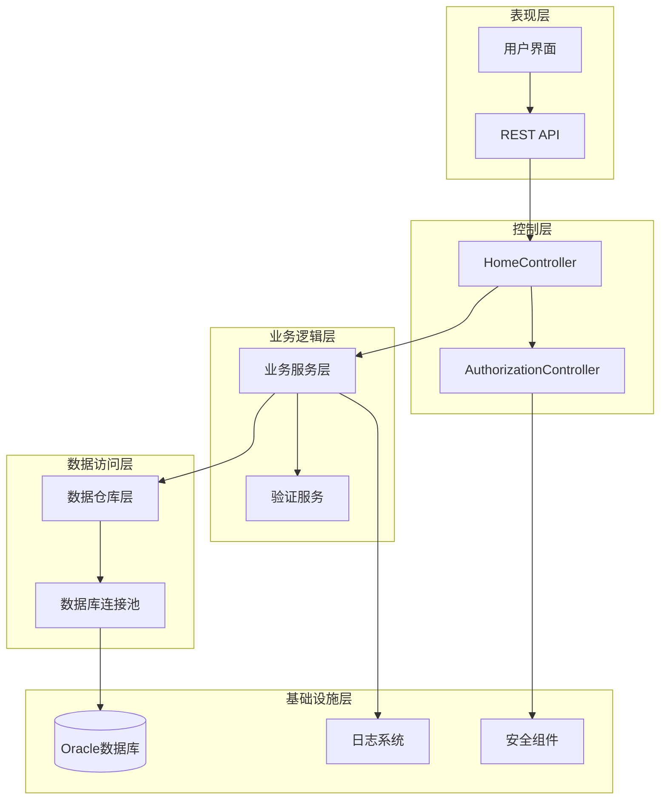
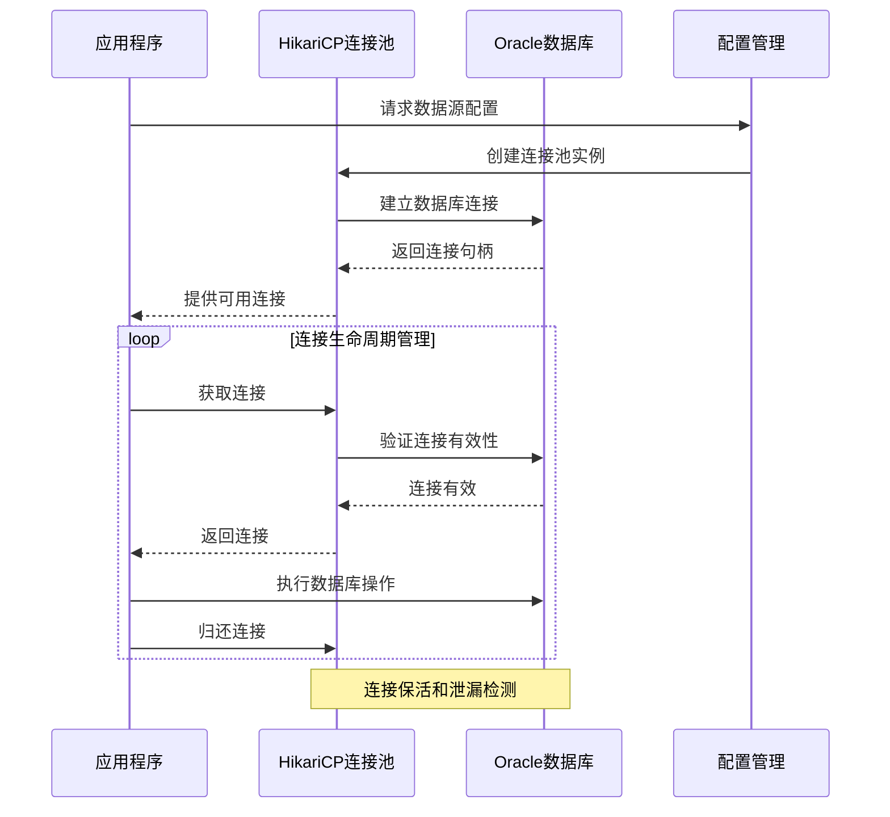
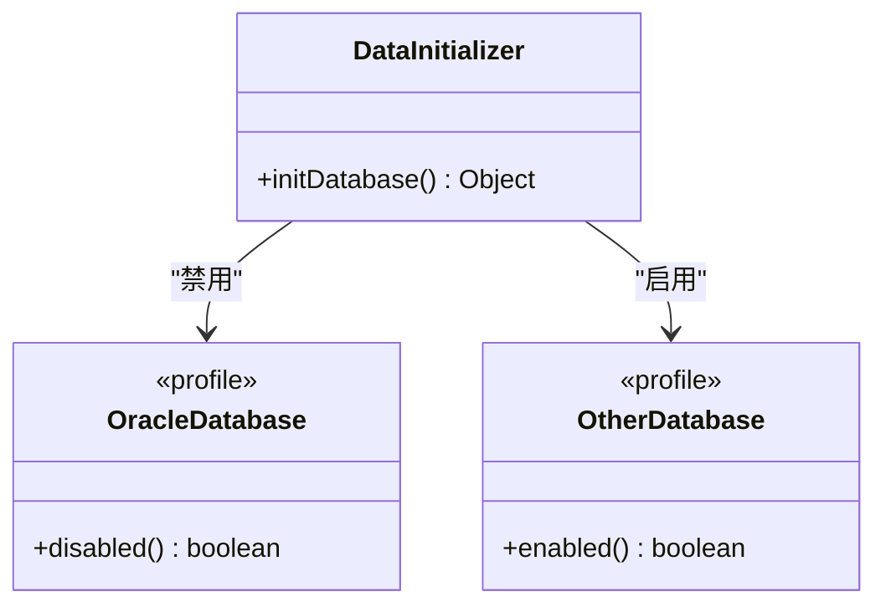
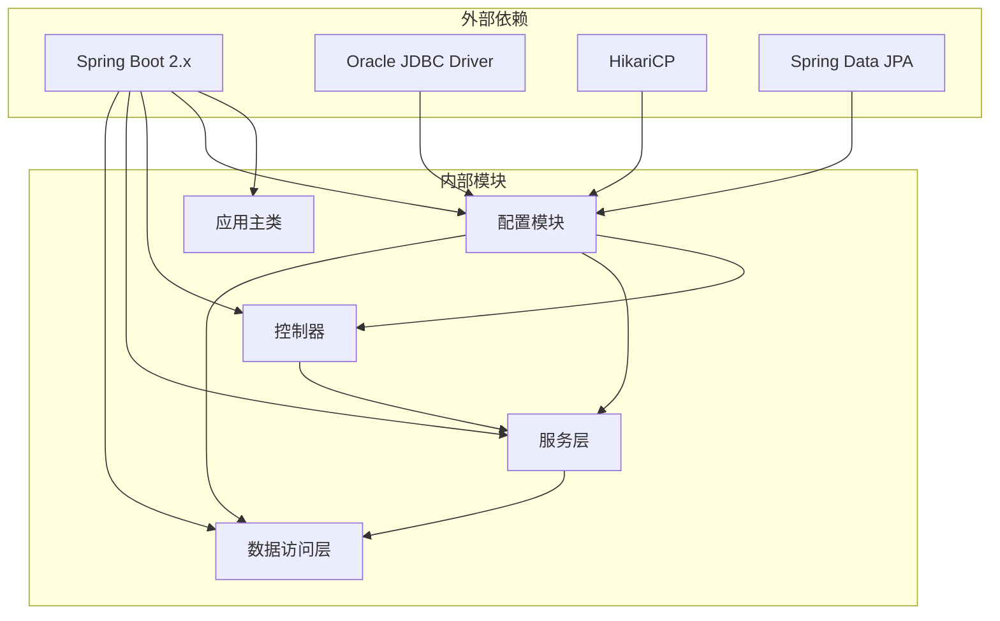

# 患者数据管理系统

<cite>
**本文档引用的文件**
- [MedAiAssistantBackendApplication.java](file://med_ai_assistant_1.0_bs_backend/src/main/java/com/example/medaiassistant/MedAiAssistantBackendApplication.java)
- [HomeController.java](file://med_ai_assistant_1.0_bs_backend/src/main/java/com/example/medaiassistant/HomeController.java)
- [DatabaseConfig.java](file://med_ai_assistant_1.0_bs_backend/src/main/java/com/example/medaiassistant/config/DatabaseConfig.java)
- [AuthorizationConfig.java](file://med_ai_assistant_1.0_bs_backend/src/main/java/com/example/medaiassistant/config/AuthorizationConfig.java)
- [DataInitializer.java](file://med_ai_assistant_1.0_bs_backend/src/main/java/com/example/medaiassistant/config/DataInitializer.java)
- [常用.txt](file://项目相关/常用.txt)
- [神级Prompt.txt](file://项目相关/神级Prompt.txt)
</cite>

## 目录
1. [简介](#简介)
2. [项目结构](#项目结构)
3. [核心组件](#核心组件)
4. [架构概览](#架构概览)
5. [详细组件分析](#详细组件分析)
6. [依赖关系分析](#依赖关系分析)
7. [性能考虑](#性能考虑)
8. [故障排除指南](#故障排除指南)
9. [结论](#结论)
10. [附录](#附录)

## 简介

患者数据管理系统是一个基于Spring Boot的企业级医疗信息系统，专注于患者信息的全生命周期管理。该系统采用现代化的技术栈，集成了高性能的数据库连接池、细粒度的权限控制和完善的日志监控机制。

系统的主要功能包括：
- 患者信息的增删改查操作
- 状态更新机制
- 数据验证规则
- 权限控制策略
- 数据导入导出功能
- 批量操作处理
- 数据同步机制
- 数据安全保护措施
- 隐私合规要求

该系统特别针对Oracle数据库进行了深度优化，使用HikariCP连接池提供卓越的性能表现，同时确保在高并发场景下的稳定性和可靠性。

## 项目结构

项目采用典型的分层架构设计，主要分为后端服务和前端界面两大部分：

**图表来源**
- [MedAiAssistantBackendApplication.java](file://med_ai_assistant_1.0_bs_backend/src/main/java/com/example/medaiassistant/MedAiAssistantBackendApplication.java#L26-L47)
- [HomeController.java](file://med_ai_assistant_1.0_bs_backend/src/main/java/com/example/medaiassistant/HomeController.java#L9-L19)

**章节来源**
- [MedAiAssistantBackendApplication.java](file://med_ai_assistant_1.0_bs_backend/src/main/java/com/example/medaiassistant/MedAiAssistantBackendApplication.java#L1-L50)
- [常用.txt](file://项目相关/常用.txt#L66-L91)

## 核心组件

### 应用程序主入口

系统的核心启动类负责配置整个应用程序的基础设置，包括组件扫描、JPA仓库启用和调度功能开启。

### REST API控制器

HomeController提供了基础的API接口，包括系统健康检查、数据库状态验证和用户管理功能。当前实现了简单的测试实体CRUD操作和用户列表查询。

### 数据库配置层

DatabaseConfig类是系统的核心配置组件，专门负责数据库连接管理和性能优化。该配置针对Oracle数据库进行了深度定制，使用HikariCP连接池提供卓越的性能表现。

### 权限控制系统

AuthorizationConfig类实现了细粒度的权限控制机制，支持基于角色的访问控制(RBAC)和基于权限的访问控制(PBAC)，确保系统的安全性。

**章节来源**
- [MedAiAssistantBackendApplication.java](file://med_ai_assistant_1.0_bs_backend/src/main/java/com/example/medaiassistant/MedAiAssistantBackendApplication.java#L10-L47)
- [HomeController.java](file://med_ai_assistant_1.0_bs_backend/src/main/java/com/example/medaiassistant/HomeController.java#L21-L50)
- [DatabaseConfig.java](file://med_ai_assistant_1.0_bs_backend/src/main/java/com/example/medaiassistant/config/DatabaseConfig.java#L23-L210)
- [AuthorizationConfig.java](file://med_ai_assistant_1.0_bs_backend/src/main/java/com/example/medaiassistant/config/AuthorizationConfig.java#L11-L150)

## 架构概览

系统采用分层架构设计，确保各层职责明确，便于维护和扩展：

**图表来源**
- [MedAiAssistantBackendApplication.java](file://med_ai_assistant_1.0_bs_backend/src/main/java/com/example/medaiassistant/MedAiAssistantBackendApplication.java#L26-L37)
- [DatabaseConfig.java](file://med_ai_assistant_1.0_bs_backend/src/main/java/com/example/medaiassistant/config/DatabaseConfig.java#L103-L210)
- [AuthorizationConfig.java](file://med_ai_assistant_1.0_bs_backend/src/main/java/com/example/medaiassistant/config/AuthorizationConfig.java#L26-L95)

## 详细组件分析

### 数据库连接池配置

DatabaseConfig类实现了针对Oracle数据库的高性能连接池配置，采用了多项优化策略：

#### 连接池参数优化

| 参数名称 | 默认值 | 优化目的 |
|---------|--------|----------|
| maximumPoolSize | 20 | 控制最大连接数，平衡性能与资源消耗 |
| minimumIdle | 5 | 确保最小空闲连接，减少连接建立开销 |
| connectionTimeout | 30000ms | 连接超时时间，防止长时间等待 |
| idleTimeout | 240000ms | 空闲连接超时，防止连接泄漏 |
| maxLifetime | 300000ms | 连接最大生命周期，避免连接过期 |

#### Oracle特定优化

系统针对Oracle数据库进行了专门优化，包括：
- 使用Oracle JDBC驱动程序
- 配置连接验证查询(SELECT 1 FROM DUAL)
- 设置Oracle会话参数
- 启用连接保活机制

**图表来源**
- [DatabaseConfig.java](file://med_ai_assistant_1.0_bs_backend/src/main/java/com/example/medaiassistant/config/DatabaseConfig.java#L103-L210)

**章节来源**
- [DatabaseConfig.java](file://med_ai_assistant_1.0_bs_backend/src/main/java/com/example/medaiassistant/config/DatabaseConfig.java#L46-L210)

### 权限控制系统

AuthorizationConfig类实现了企业级的权限控制机制，支持多种访问控制模式：

#### 角色权限映射

系统预定义了三种基本角色及其权限：

| 角色 | 权限级别 | 可执行操作 |
|------|----------|------------|
| USER | 基础用户 | READ, WRITE |
| ADMIN | 系统管理员 | READ, WRITE, DELETE, MANAGE_USERS |
| VIEWER | 只读用户 | READ |

#### 访问控制规则

系统定义了以下访问控制规则：
- USER可以读取和修改自己的数据
- ADMIN可以访问和修改所有数据
- VIEWER只能读取公开数据

**图表来源**
- [AuthorizationConfig.java](file://med_ai_assistant_1.0_bs_backend/src/main/java/com/example/medaiassistant/config/AuthorizationConfig.java#L122-L150)

**章节来源**
- [AuthorizationConfig.java](file://med_ai_assistant_1.0_bs_backend/src/main/java/com/example/medaiassistant/config/AuthorizationConfig.java#L31-L150)

### 数据初始化配置

DataInitializer类负责在应用启动时进行必要的数据初始化，但针对Oracle数据库进行了特殊处理：

#### Oracle兼容性处理

**图表来源**
- [DataInitializer.java](file://med_ai_assistant_1.0_bs_backend/src/main/java/com/example/medaiassistant/config/DataInitializer.java#L15-L27)

**章节来源**
- [DataInitializer.java](file://med_ai_assistant_1.0_bs_backend/src/main/java/com/example/medaiassistant/config/DataInitializer.java#L7-L27)

### 基础API接口

HomeController提供了系统的基础API接口，当前实现了以下功能：

#### 系统健康检查

- GET `/api/` - 基础健康检查
- GET `/api/db-status` - 数据库连接状态检查

#### 测试功能

- POST `/api/test` - 创建测试实体
- GET `/api/test/{id}` - 获取测试实体

#### 用户管理

- GET `/api/users` - 获取所有用户列表

**章节来源**
- [HomeController.java](file://med_ai_assistant_1.0_bs_backend/src/main/java/com/example/medaiassistant/HomeController.java#L21-L50)

## 依赖关系分析

系统采用模块化设计，各组件之间的依赖关系清晰明确：

**图表来源**
- [MedAiAssistantBackendApplication.java](file://med_ai_assistant_1.0_bs_backend/src/main/java/com/example/medaiassistant/MedAiAssistantBackendApplication.java#L26-L37)
- [DatabaseConfig.java](file://med_ai_assistant_1.0_bs_backend/src/main/java/com/example/medaiassistant/config/DatabaseConfig.java#L103-L210)

**章节来源**
- [MedAiAssistantBackendApplication.java](file://med_ai_assistant_1.0_bs_backend/src/main/java/com/example/medaiassistant/MedAiAssistantBackendApplication.java#L26-L37)
- [DatabaseConfig.java](file://med_ai_assistant_1.0_bs_backend/src/main/java/com/example/medaiassistant/config/DatabaseConfig.java#L103-L210)

## 性能考虑

系统在多个层面进行了性能优化，确保在高并发场景下的稳定运行：

### 数据库性能优化

1. **连接池优化**：使用HikariCP提供高性能的连接池管理
2. **Oracle特定优化**：针对Oracle数据库进行专门优化
3. **连接生命周期管理**：防止连接泄漏和过期连接
4. **批量操作支持**：支持批量插入和更新操作

### 缓存策略

系统目前禁用了二级缓存和查询缓存，以避免复杂场景下的缓存一致性问题。

### 日志监控

- 启用JMX监控，便于性能调优
- 详细的连接池状态日志
- 错误和异常的完整追踪

## 故障排除指南

### 常见问题及解决方案

#### 数据库连接问题

**症状**：应用启动失败或数据库连接异常
**原因**：
- 数据库连接参数配置错误
- Oracle驱动程序缺失
- 网络连接问题

**解决方案**：
1. 检查数据库连接URL、用户名和密码
2. 确认Oracle JDBC驱动程序已正确配置
3. 验证网络连接和防火墙设置

#### 权限控制问题

**症状**：用户无法访问预期的功能
**原因**：
- 角色配置错误
- 权限验证失败
- 配置参数未生效

**解决方案**：
1. 检查AuthorizationConfig配置
2. 验证用户角色分配
3. 确认权限验证逻辑正常

#### 性能问题

**症状**：系统响应缓慢或内存占用过高
**原因**：
- 连接池配置不当
- 查询性能问题
- 缓存策略问题

**解决方案**：
1. 调整连接池参数
2. 优化数据库查询
3. 分析性能监控数据

**章节来源**
- [DatabaseConfig.java](file://med_ai_assistant_1.0_bs_backend/src/main/java/com/example/medaiassistant/config/DatabaseConfig.java#L103-L210)
- [AuthorizationConfig.java](file://med_ai_assistant_1.0_bs_backend/src/main/java/com/example/medaiassistant/config/AuthorizationConfig.java#L122-L150)

## 结论

患者数据管理系统是一个设计精良的企业级应用，具有以下特点：

### 技术优势

1. **高性能架构**：采用HikariCP连接池和Oracle数据库优化
2. **安全可靠**：完善的权限控制和数据验证机制
3. **易于维护**：清晰的分层架构和模块化设计
4. **可扩展性强**：支持插件化和配置化扩展

### 业务价值

1. **合规性保障**：符合医疗行业的安全和隐私要求
2. **用户体验**：简洁直观的操作界面
3. **数据完整性**：严格的验证规则和备份机制
4. **运维友好**：完善的监控和日志系统

### 发展建议

1. **功能完善**：扩展患者数据管理的完整功能
2. **性能优化**：持续监控和优化系统性能
3. **安全保障**：加强数据加密和访问控制
4. **用户体验**：改进界面设计和交互体验

## 附录

### 开发环境配置

系统提供了完整的开发环境配置指南，包括常用命令和部署脚本。

### 测试策略

系统采用测试金字塔策略，包括单元测试、集成测试和端到端测试，确保代码质量和系统稳定性。

### 部署指南

系统支持多种部署方式，包括本地开发、容器化部署和生产环境部署。

**章节来源**
- [常用.txt](file://项目相关/常用.txt#L66-L91)
- [神级Prompt.txt](file://项目相关/神级Prompt.txt#L1-L500)