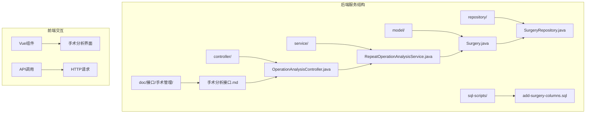
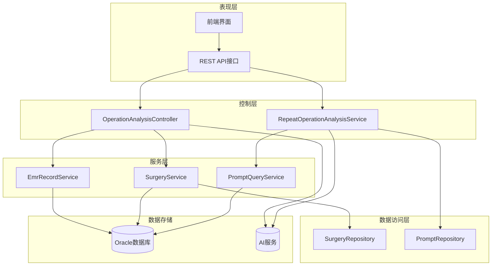
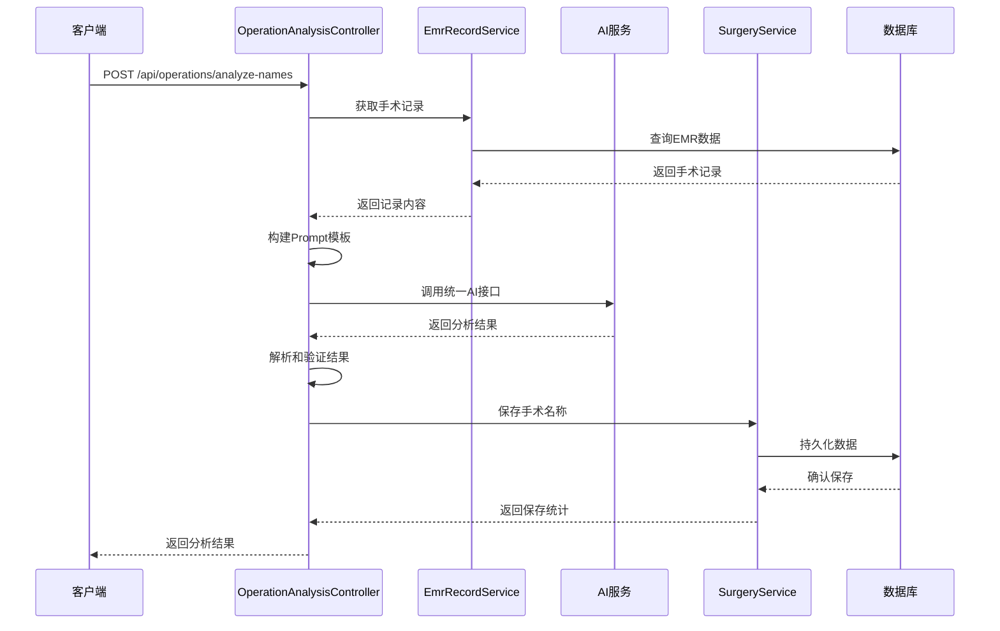
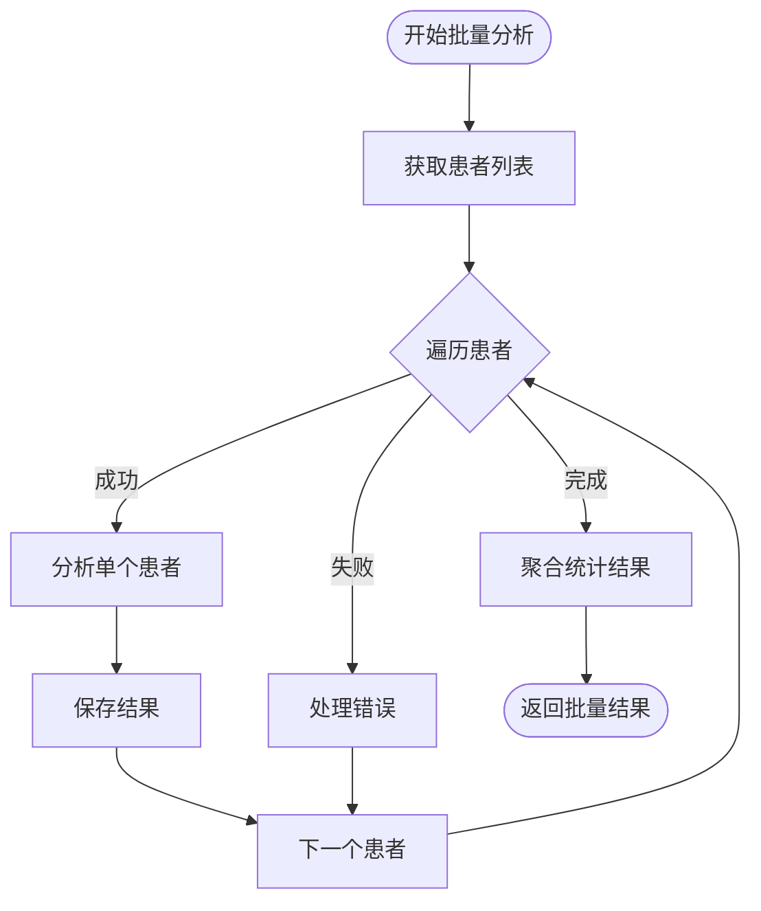
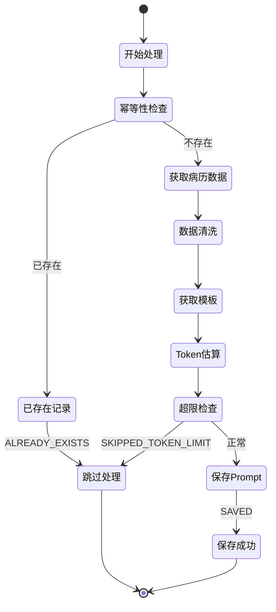
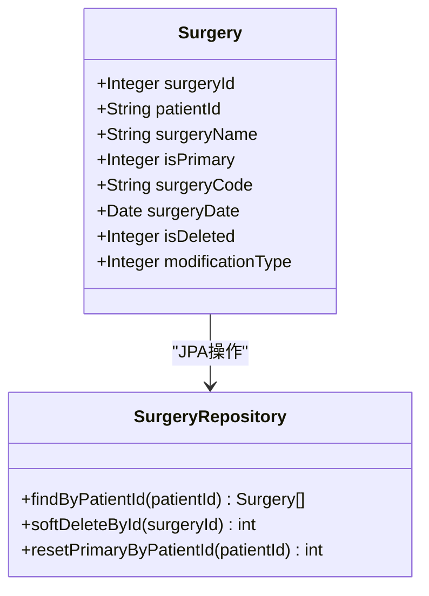
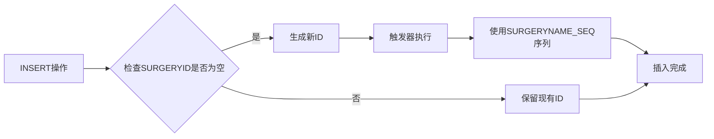
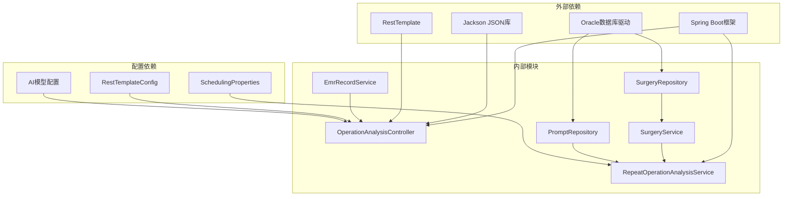
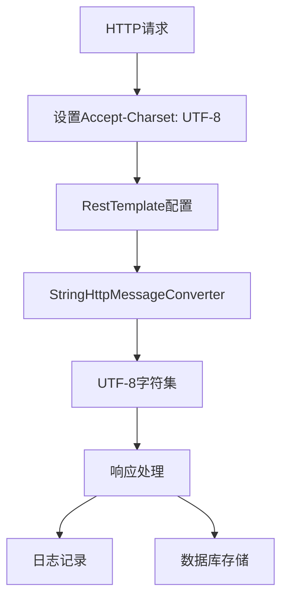

# 手术分析功能增强

<cite>
**本文档引用的文件**
- [手术分析接口.md](file://med_ai_assistant_1.0_bs_backend/doc/接口/手术管理/手术分析接口.md)
- [OperationAnalysisController.java](file://med_ai_assistant_1.0_bs_backend/src/main/java/com/example/medaiassistant/controller/OperationAnalysisController.java)
- [RepeatOperationAnalysisService.java](file://med_ai_assistant_1.0_bs_backend/src/main/java/com/example/medaiassistant/service/RepeatOperationAnalysisService.java)
- [Surgery.java](file://med_ai_assistant_1.0_bs_backend/src/main/java/com/example/medaiassistant/model/Surgery.java)
- [SurgeryRepository.java](file://med_ai_assistant_1.0_bs_backend/src/main/java/com/example/medaiassistant/repository/SurgeryRepository.java)
- [add-surgery-columns.sql](file://med_ai_assistant_1.0_bs_backend/sql-scripts/add-surgery-columns.sql)
- [test-surgery-analysis-manual.http](file://med_ai_assistant_1.0_bs_backend/test-scripts/test-surgery-analysis-manual.http)
</cite>

## 目录
1. [简介](#简介)
2. [项目结构](#项目结构)
3. [核心组件](#核心组件)
4. [架构概览](#架构概览)
5. [详细组件分析](#详细组件分析)
6. [依赖关系分析](#依赖关系分析)
7. [性能考虑](#性能考虑)
8. [故障排除指南](#故障排除指南)
9. [结论](#结论)

## 简介

手术分析功能增强是MedAiAssistant项目中的一个重要模块，旨在通过人工智能技术自动分析和整理患者的手术记录。该功能通过统一的AI接口调用院内LLM模型，对患者的手术记录进行智能分析，提取和整理手术/操作名称，并将标准化的结果保存到数据库中。

该功能具有以下核心特性：
- 支持单个患者手术名称分析
- 支持批量患者手术名称分析  
- 使用统一的 `/api/ai/response` 接口调用LLM服务
- 自动解析响应结果并持久化到数据库
- 支持UTF-8编码处理，解决中文乱码问题
- 提供完整的错误处理和日志记录机制

## 项目结构

手术分析功能主要分布在以下目录结构中：

**图表来源**
- [OperationAnalysisController.java:1-625](file://med_ai_assistant_1.0_bs_backend/src/main/java/com/example/medaiassistant/controller/OperationAnalysisController.java#L1-L625)
- [RepeatOperationAnalysisService.java:1-358](file://med_ai_assistant_1.0_bs_backend/src/main/java/com/example/medaiassistant/service/RepeatOperationAnalysisService.java#L1-L358)

**章节来源**
- [手术分析接口.md:1-220](file://med_ai_assistant_1.0_bs_backend/doc/接口/手术管理/手术分析接口.md#L1-L220)

## 核心组件

### 控制器层

**OperationAnalysisController** 是手术分析功能的主要入口点，负责处理HTTP请求和响应。该控制器提供了两个核心接口：

1. **单个患者手术名称分析** (`POST /api/operations/analyze-names`)
2. **批量患者手术名称分析** (`POST /api/operations/batch-analyze-names`)

### 服务层

**RepeatOperationAnalysisService** 负责处理非计划再次手术的分析逻辑，包括：
- 幂等性检查，避免重复提交
- 关键病历信息获取和数据清洗
- Prompt模板管理和Token估算
- 数据库操作和状态管理

### 数据模型层

**Surgery实体类** 定义了手术记录的数据结构，包括：
- 手术记录主键ID
- 患者ID关联
- 手术名称存储
- 是否为主要手术标识
- 手术代码和日期
- 软删除标志和数据来源类型

**章节来源**
- [OperationAnalysisController.java:37-625](file://med_ai_assistant_1.0_bs_backend/src/main/java/com/example/medaiassistant/controller/OperationAnalysisController.java#L37-L625)
- [RepeatOperationAnalysisService.java:37-358](file://med_ai_assistant_1.0_bs_backend/src/main/java/com/example/medaiassistant/service/RepeatOperationAnalysisService.java#L37-L358)
- [Surgery.java:38-130](file://med_ai_assistant_1.0_bs_backend/src/main/java/com/example/medaiassistant/model/Surgery.java#L38-L130)

## 架构概览

手术分析功能采用分层架构设计，确保了良好的可维护性和扩展性：

**图表来源**
- [OperationAnalysisController.java:106-220](file://med_ai_assistant_1.0_bs_backend/src/main/java/com/example/medaiassistant/controller/OperationAnalysisController.java#L106-L220)
- [RepeatOperationAnalysisService.java:96-201](file://med_ai_assistant_1.0_bs_backend/src/main/java/com/example/medaiassistant/service/RepeatOperationAnalysisService.java#L96-L201)

## 详细组件分析

### 手术分析控制器

**OperationAnalysisController** 实现了完整的手术分析流程，包括：

#### 单个患者分析流程

**图表来源**
- [OperationAnalysisController.java:106-219](file://med_ai_assistant_1.0_bs_backend/src/main/java/com/example/medaiassistant/controller/OperationAnalysisController.java#L106-L219)

#### 批量分析流程

批量分析功能提供了高效的数据处理能力：

**图表来源**
- [OperationAnalysisController.java:573-623](file://med_ai_assistant_1.0_bs_backend/src/main/java/com/example/medaiassistant/controller/OperationAnalysisController.java#L573-L623)

**章节来源**
- [OperationAnalysisController.java:106-623](file://med_ai_assistant_1.0_bs_backend/src/main/java/com/example/medaiassistant/controller/OperationAnalysisController.java#L106-L623)

### 非计划再次手术分析服务

**RepeatOperationAnalysisService** 专门处理非计划再次手术的复杂分析逻辑：

#### 处理状态管理

**图表来源**
- [RepeatOperationAnalysisService.java:120-201](file://med_ai_assistant_1.0_bs_backend/src/main/java/com/example/medaiassistant/service/RepeatOperationAnalysisService.java#L120-L201)

#### Token估算算法

服务实现了智能的Token估算机制，确保AI调用的效率和成本控制：

| 文本类型 | 估算因子 |
|---------|---------|
| 中文字符 | 1.5字符/Token |
| 英文字符 | 4字符/Token |
| 特殊字符 | 1字符/Token |

**章节来源**
- [RepeatOperationAnalysisService.java:120-358](file://med_ai_assistant_1.0_bs_backend/src/main/java/com/example/medaiassistant/service/RepeatOperationAnalysisService.java#L120-L358)

### 数据模型设计

**Surgery实体类** 采用了现代化的JPA注解设计，支持复杂的数据库操作：

**图表来源**
- [Surgery.java:41-129](file://med_ai_assistant_1.0_bs_backend/src/main/java/com/example/medaiassistant/model/Surgery.java#L41-L129)
- [SurgeryRepository.java:21-57](file://med_ai_assistant_1.0_bs_backend/src/main/java/com/example/medaiassistant/repository/SurgeryRepository.java#L21-L57)

**章节来源**
- [Surgery.java:38-130](file://med_ai_assistant_1.0_bs_backend/src/main/java/com/example/medaiassistant/model/Surgery.java#L38-L130)
- [SurgeryRepository.java:13-58](file://med_ai_assistant_1.0_bs_backend/src/main/java/com/example/medaiassistant/repository/SurgeryRepository.java#L13-L58)

### 数据库架构增强

**add-surgery-columns.sql** 脚本提供了完整的数据库架构升级：

#### 新增列设计

| 列名 | 数据类型 | 默认值 | 用途 | 约束 |
|------|----------|--------|------|------|
| IS_DELETED | NUMBER(1,0) | 0 | 软删除标志 | 0=正常, 1=已删除 |
| MODIFICATION_TYPE | NUMBER | 0 | 数据来源类型 | 0=EMR同步, 1=手动添加 |

#### 自动化ID管理

**图表来源**
- [add-surgery-columns.sql:26-40](file://med_ai_assistant_1.0_bs_backend/sql-scripts/add-surgery-columns.sql#L26-L40)

**章节来源**
- [add-surgery-columns.sql:1-41](file://med_ai_assistant_1.0_bs_backend/sql-scripts/add-surgery-columns.sql#L1-L41)

## 依赖关系分析

手术分析功能的依赖关系体现了清晰的分层架构：

**图表来源**
- [OperationAnalysisController.java:37-58](file://med_ai_assistant_1.0_bs_backend/src/main/java/com/example/medaiassistant/controller/OperationAnalysisController.java#L37-L58)
- [RepeatOperationAnalysisService.java:56-74](file://med_ai_assistant_1.0_bs_backend/src/main/java/com/example/medaiassistant/service/RepeatOperationAnalysisService.java#L56-L74)

### 核心依赖关系

| 组件 | 主要依赖 | 作用 |
|------|----------|------|
| OperationAnalysisController | EmrRecordService, SurgeryService, RestTemplate | 处理HTTP请求和业务逻辑协调 |
| RepeatOperationAnalysisService | RepeatOperationQueryService, PromptRepository | 实现复杂的分析逻辑 |
| SurgeryRepository | JPA/Hibernate | 提供数据访问操作 |
| RestTemplateConfig | Spring配置 | 确保UTF-8编码支持 |

**章节来源**
- [OperationAnalysisController.java:37-58](file://med_ai_assistant_1.0_bs_backend/src/main/java/com/example/medaiassistant/controller/OperationAnalysisController.java#L37-L58)
- [RepeatOperationAnalysisService.java:56-74](file://med_ai_assistant_1.0_bs_backend/src/main/java/com/example/medaiassistant/service/RepeatOperationAnalysisService.java#L56-L74)

## 性能考虑

### 异步处理机制

系统采用了多种异步处理策略来提升性能：

1. **专用线程池配置**
   - 手术分析专用线程池，避免与其他任务竞争资源
   - 独立的执行环境，确保任务执行的稳定性

2. **批量处理优化**
   - 支持批量患者分析，减少API调用次数
   - 顺序处理保证数据一致性，同时保持处理效率

3. **缓存策略**
   - Prompt模板缓存，避免重复查询
   - 分析结果缓存，支持快速查询

### 编码处理优化

为了解决中文乱码问题，系统实现了多层次的编码处理：

**图表来源**
- [OperationAnalysisController.java:309-337](file://med_ai_assistant_1.0_bs_backend/src/main/java/com/example/medaiassistant/controller/OperationAnalysisController.java#L309-L337)

## 故障排除指南

### 常见问题及解决方案

#### AI服务调用失败

**问题症状**：返回500错误，包含"AI服务调用失败"信息

**可能原因**：
1. AI服务不可达或响应超时
2. 统一AI接口配置错误
3. 网络连接问题

**解决方案**：
1. 检查AI服务状态和可用性
2. 验证 `api.base.url` 配置
3. 确认网络连接和防火墙设置

#### JSON解析失败

**问题症状**：返回500错误，包含"解析AI响应失败"信息

**可能原因**：
1. AI响应格式不符合预期
2. 响应内容包含非JSON字符
3. 网络传输过程中的数据损坏

**解决方案**：
1. 检查AI服务的响应格式
2. 实现响应内容的容错处理
3. 添加详细的日志记录以便调试

#### 数据库操作异常

**问题症状**：保存手术记录失败，返回数据库相关错误

**可能原因**：
1. 数据库连接问题
2. 表结构不匹配
3. 约束冲突

**解决方案**：
1. 检查数据库连接配置
2. 验证表结构是否包含新增列
3. 处理数据约束冲突

**章节来源**
- [OperationAnalysisController.java:156-218](file://med_ai_assistant_1.0_bs_backend/src/main/java/com/example/medaiassistant/controller/OperationAnalysisController.java#L156-L218)

### 日志分析技巧

系统提供了丰富的日志信息，有助于问题诊断：

1. **请求处理日志**：记录每个请求的处理时间和状态
2. **AI调用日志**：记录AI服务的响应状态和数据长度
3. **数据库操作日志**：记录数据保存和查询的详细信息
4. **错误处理日志**：记录异常情况和处理结果

## 结论

手术分析功能增强通过智能化的AI技术和完善的架构设计，为医疗信息系统提供了强大的手术记录分析能力。该功能不仅提升了医疗服务的效率和质量，还为后续的医疗数据分析奠定了坚实的基础。

### 主要优势

1. **智能化处理**：通过AI技术自动分析和整理手术记录
2. **标准化输出**：统一的JSON格式输出，便于后续处理
3. **高可靠性**：完善的错误处理和日志记录机制
4. **高性能**：异步处理和批量操作优化
5. **易扩展**：模块化的架构设计，便于功能扩展

### 技术创新点

1. **统一AI接口**：通过统一的 `/api/ai/response` 接口实现AI服务的灵活调度
2. **智能编码处理**：多层次的UTF-8编码配置，确保中文内容的正确处理
3. **软删除机制**：支持数据的软删除，保护历史数据的完整性
4. **Token估算**：智能的Token估算算法，优化AI调用成本

该功能的成功实现展示了现代医疗信息系统的发展方向，即通过人工智能技术提升医疗服务质量和效率，为患者提供更好的医疗体验。