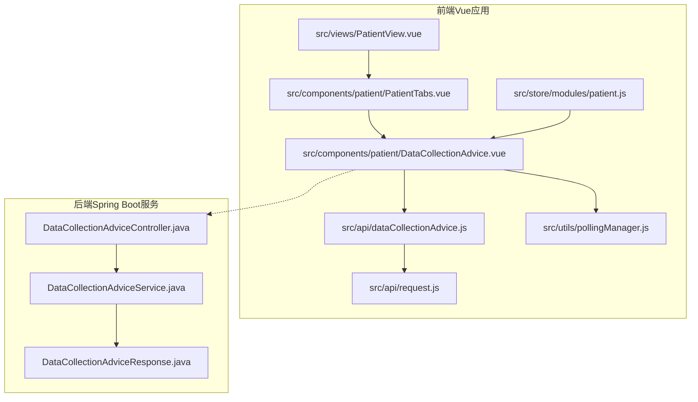
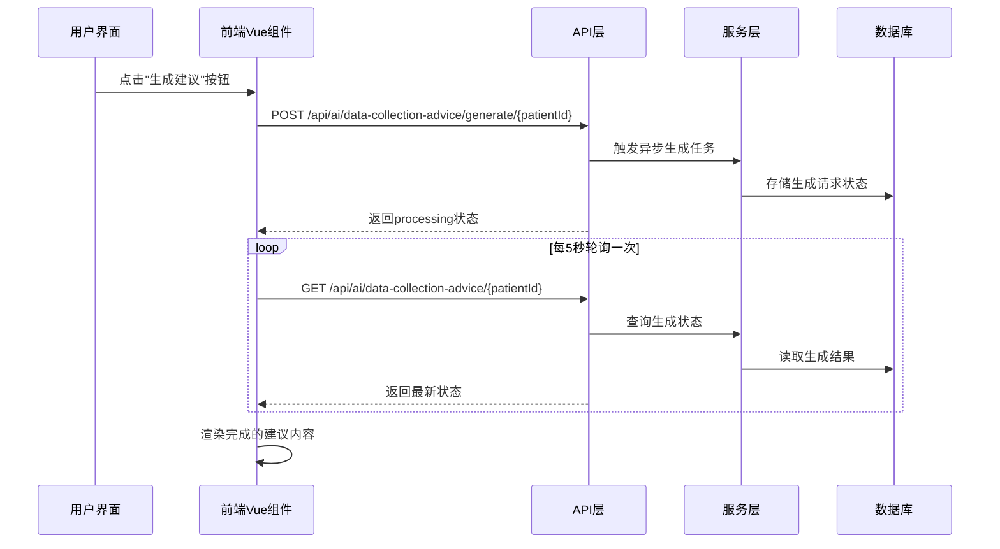
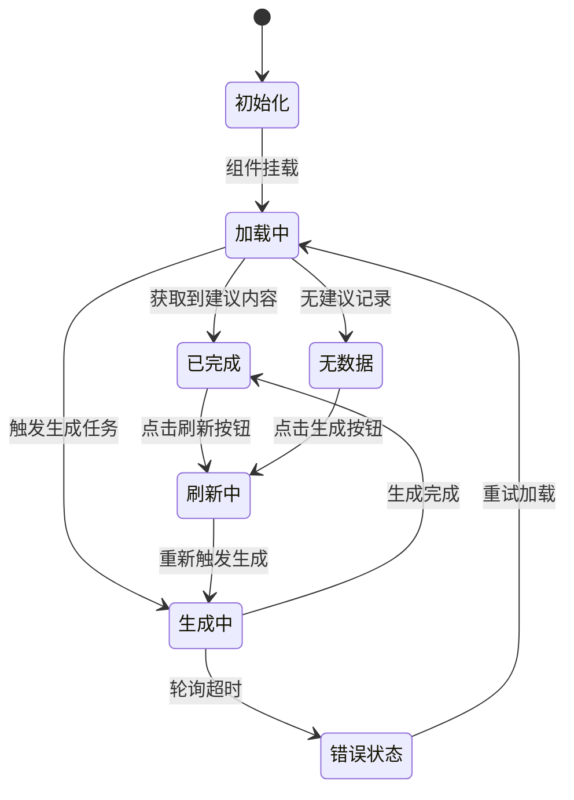
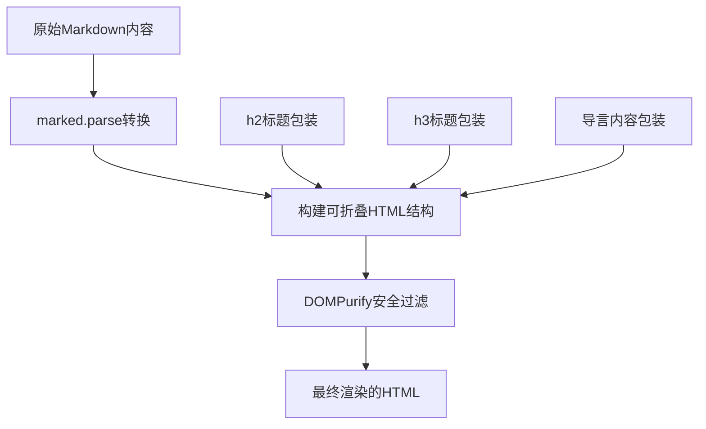
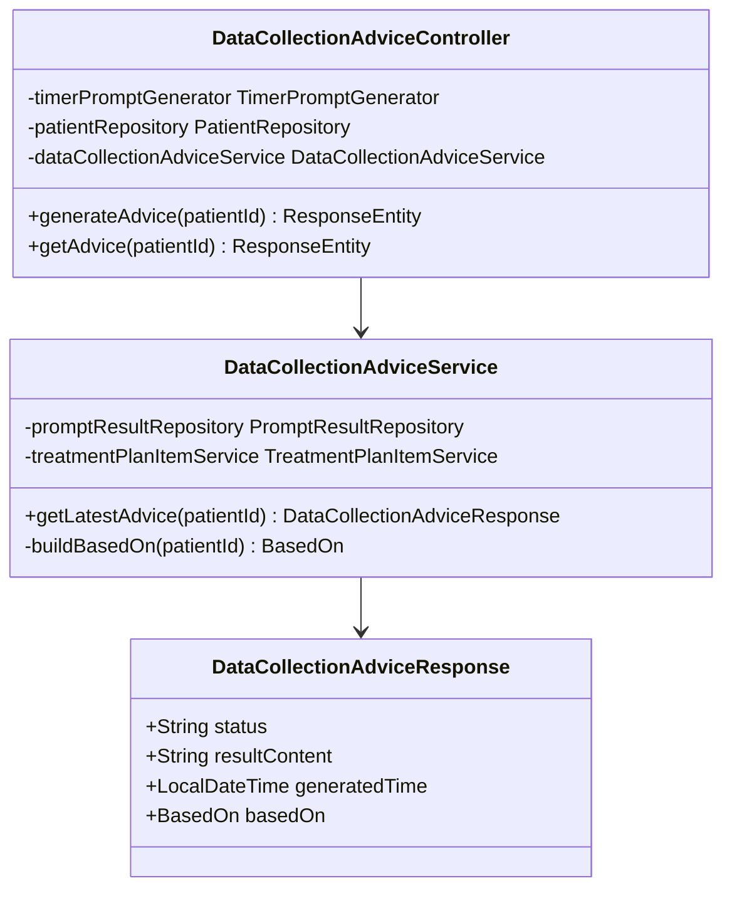
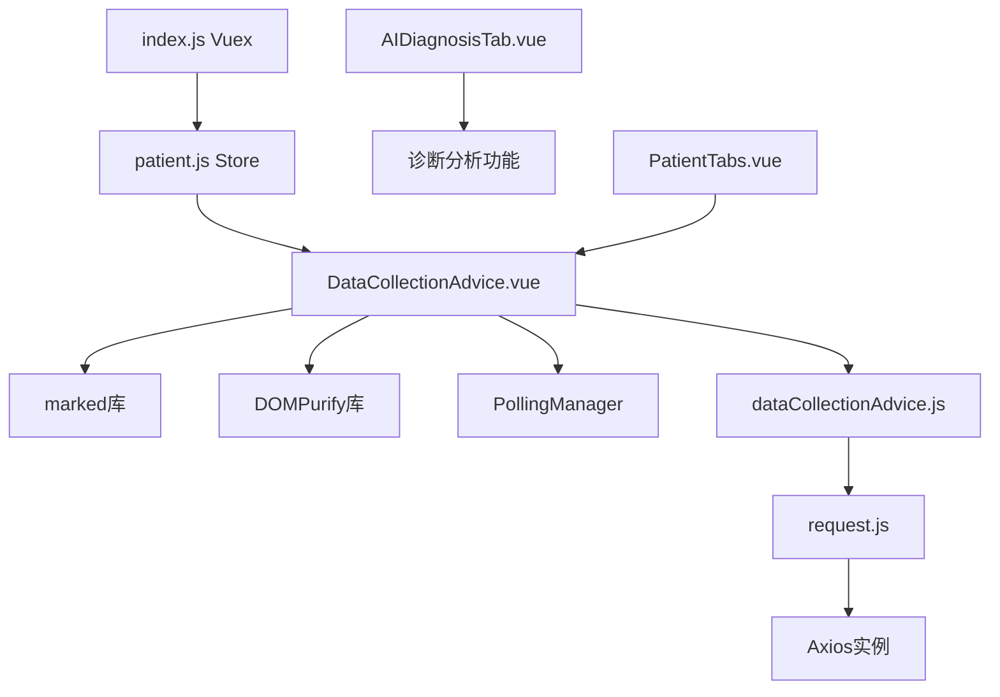
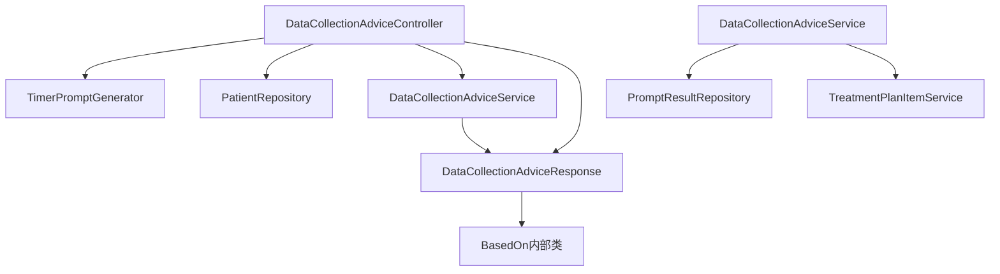

# 数据收集建议界面增强

<cite>
**本文档引用的文件**
- [PatientView.vue](file://med_ai_assistant_1.0_bs_vue/src/views/PatientView.vue)
- [PatientTabs.vue](file://med_ai_assistant_1.0_bs_vue/src/components/patient/PatientTabs.vue)
- [DataCollectionAdvice.vue](file://med_ai_assistant_1.0_bs_vue/src/components/patient/DataCollectionAdvice.vue)
- [dataCollectionAdvice.js](file://med_ai_assistant_1.0_bs_vue/src/api/dataCollectionAdvice.js)
- [request.js](file://med_ai_assistant_1.0_bs_vue/src/api/request.js)
- [pollingManager.js](file://med_ai_assistant_1.0_bs_vue/src/utils/pollingManager.js)
- [patient.js](file://med_ai_assistant_1.0_bs_vue/src/store/modules/patient.js)
- [index.js](file://med_ai_assistant_1.0_bs_vue/src/store/index.js)
- [DataCollectionAdviceController.java](file://med_ai_assistant_1.0_bs_backend/src/main/java/com/example/medaiassistant/controller/DataCollectionAdviceController.java)
- [DataCollectionAdviceService.java](file://med_ai_assistant_1.0_bs_backend/src/main/java/com/example/medaiassistant/service/DataCollectionAdviceService.java)
- [DataCollectionAdviceResponse.java](file://med_ai_assistant_1.0_bs_backend/src/main/java/com/example/medaiassistant/dto/DataCollectionAdviceResponse.java)
</cite>

## 目录
1. [简介](#简介)
2. [项目结构](#项目结构)
3. [核心组件](#核心组件)
4. [架构概览](#架构概览)
5. [详细组件分析](#详细组件分析)
6. [依赖关系分析](#依赖关系分析)
7. [性能考虑](#性能考虑)
8. [故障排除指南](#故障排除指南)
9. [结论](#结论)

## 简介

数据收集建议界面增强是MedAiAssistant项目中的一个重要功能模块，旨在为医生提供智能化的进一步问诊、查体和辅助检查建议。该功能通过AI技术分析患者的完整医疗信息，生成个性化的数据收集建议，帮助医生完善病史采集和诊断过程。

本系统采用前后端分离架构，前端使用Vue.js框架构建用户界面，后端基于Spring Boot提供RESTful API服务。核心功能包括：

- **智能建议生成**：基于患者的诊断分析和诊疗计划生成个性化建议
- **异步处理机制**：支持长时间运行的AI生成任务
- **轮询状态查询**：实时跟踪生成进度并更新UI状态
- **Markdown渲染**：提供富文本格式的建议内容展示
- **两级折叠结构**：支持详细的可折叠内容展示

## 项目结构

MedAiAssistant项目采用模块化组织方式，数据收集建议功能主要分布在以下目录结构中：

**图表来源**
- [PatientView.vue:1-64](file://med_ai_assistant_1.0_bs_vue/src/views/PatientView.vue#L1-L64)
- [PatientTabs.vue:1-187](file://med_ai_assistant_1.0_bs_vue/src/components/patient/PatientTabs.vue#L1-L187)
- [DataCollectionAdvice.vue:1-604](file://med_ai_assistant_1.0_bs_vue/src/components/patient/DataCollectionAdvice.vue#L1-L604)

**章节来源**
- [PatientView.vue:1-64](file://med_ai_assistant_1.0_bs_vue/src/views/PatientView.vue#L1-L64)
- [PatientTabs.vue:1-187](file://med_ai_assistant_1.0_bs_vue/src/components/patient/PatientTabs.vue#L1-L187)

## 核心组件

### 前端核心组件

#### 患者视图容器
PatientView组件作为患者信息展示的主容器，负责协调左侧患者列表和右侧标签页的布局。该组件实现了响应式设计，支持小屏幕设备上的自动隐藏功能。

#### 标签页容器
PatientTabs组件提供了完整的患者信息展示界面，包含多个专业标签页。数据收集建议功能通过新增的DataCollectionAdvice标签页集成到现有界面中。

#### 数据收集建议组件
DataCollectionAdvice组件是本次增强的核心，实现了完整的建议展示和交互功能。该组件支持四种状态显示：加载中、完成、生成中、无数据。

### 后端核心组件

#### 控制器层
DataCollectionAdviceController处理来自前端的API请求，提供手动触发生成和查询建议状态两个核心接口。该控制器使用异步处理机制，确保用户体验流畅。

#### 服务层
DataCollectionAdviceService负责业务逻辑处理，包括建议状态查询、数据来源分析等功能。该服务通过组合多个数据源来生成全面的建议内容。

#### 数据传输对象
DataCollectionAdviceResponse定义了建议查询的响应格式，包含状态、内容、生成时间和数据来源等关键信息。

**章节来源**
- [DataCollectionAdvice.vue:76-89](file://med_ai_assistant_1.0_bs_vue/src/components/patient/DataCollectionAdvice.vue#L76-L89)
- [DataCollectionAdviceController.java:15-28](file://med_ai_assistant_1.0_bs_backend/src/main/java/com/example/medaiassistant/controller/DataCollectionAdviceController.java#L15-L28)

## 架构概览

系统采用经典的三层架构设计，前后端通过RESTful API进行通信：

**图表来源**
- [DataCollectionAdvice.vue:237-259](file://med_ai_assistant_1.0_bs_vue/src/components/patient/DataCollectionAdvice.vue#L237-L259)
- [DataCollectionAdviceController.java:80-102](file://med_ai_assistant_1.0_bs_backend/src/main/java/com/example/medaiassistant/controller/DataCollectionAdviceController.java#L80-L102)

系统架构特点：

1. **异步处理**：生成任务在后台异步执行，避免阻塞用户界面
2. **轮询机制**：前端定期查询生成状态，确保实时更新
3. **状态管理**：清晰的状态定义支持多种UI展示场景
4. **安全防护**：完整的错误处理和超时机制

## 详细组件分析

### DataCollectionAdvice组件深入分析

#### 状态管理机制
组件实现了完整的四状态管理模式：

**图表来源**
- [DataCollectionAdvice.vue:17-56](file://med_ai_assistant_1.0_bs_vue/src/components/patient/DataCollectionAdvice.vue#L17-L56)

#### Markdown渲染引擎
组件集成了marked库进行Markdown到HTML的转换，并使用DOMPurify进行XSS防护：

**图表来源**
- [DataCollectionAdvice.vue:159-167](file://med_ai_assistant_1.0_bs_vue/src/components/patient/DataCollectionAdvice.vue#L159-L167)

#### 轮询管理器
PollingManager提供了灵活的轮询控制机制：

| 配置项 | 默认值 | 说明 |
|--------|--------|------|
| interval | 5000ms | 轮询间隔时间 |
| maxCount | 60次 | 最大轮询次数（5分钟） |
| onTimeout | 错误提示 | 超时回调函数 |
| onError | 日志记录 | 错误处理回调 |

**章节来源**
- [DataCollectionAdvice.vue:267-284](file://med_ai_assistant_1.0_bs_vue/src/components/patient/DataCollectionAdvice.vue#L267-L284)
- [pollingManager.js:35-68](file://med_ai_assistant_1.0_bs_vue/src/utils/pollingManager.js#L35-L68)

### API接口设计

#### 前端API模块
dataCollectionAdvice.js提供了两个核心API：

| 接口名称 | HTTP方法 | 路径 | 功能描述 |
|----------|----------|------|----------|
| generateDataCollectionAdvice | POST | `/ai/data-collection-advice/generate/{patientId}` | 手动触发建议生成 |
| getDataCollectionAdvice | GET | `/ai/data-collection-advice/{patientId}` | 查询最新建议状态 |

#### 后端控制器实现
后端控制器实现了完整的业务逻辑：

**图表来源**
- [DataCollectionAdviceController.java:32-58](file://med_ai_assistant_1.0_bs_backend/src/main/java/com/example/medaiassistant/controller/DataCollectionAdviceController.java#L32-L58)
- [DataCollectionAdviceService.java:25-41](file://med_ai_assistant_1.0_bs_backend/src/main/java/com/example/medaiassistant/service/DataCollectionAdviceService.java#L25-L41)

**章节来源**
- [dataCollectionAdvice.js:27-54](file://med_ai_assistant_1.0_bs_vue/src/api/dataCollectionAdvice.js#L27-L54)
- [DataCollectionAdviceController.java:80-119](file://med_ai_assistant_1.0_bs_backend/src/main/java/com/example/medaiassistant/controller/DataCollectionAdviceController.java#L80-L119)

## 依赖关系分析

### 前端依赖关系

**图表来源**
- [DataCollectionAdvice.vue:60-75](file://med_ai_assistant_1.0_bs_vue/src/components/patient/DataCollectionAdvice.vue#L60-L75)
- [request.js:27-33](file://med_ai_assistant_1.0_bs_vue/src/api/request.js#L27-L33)

### 后端依赖关系

**图表来源**
- [DataCollectionAdviceController.java:41-58](file://med_ai_assistant_1.0_bs_backend/src/main/java/com/example/medaiassistant/controller/DataCollectionAdviceController.java#L41-L58)
- [DataCollectionAdviceService.java:34-41](file://med_ai_assistant_1.0_bs_backend/src/main/java/com/example/medaiassistant/service/DataCollectionAdviceService.java#L34-L41)

**章节来源**
- [patient.js:1-16](file://med_ai_assistant_1.0_bs_vue/src/store/modules/patient.js#L1-L16)
- [index.js:6-12](file://med_ai_assistant_1.0_bs_vue/src/store/index.js#L6-L12)

## 性能考虑

### 前端性能优化

1. **懒加载机制**：组件仅在需要时才加载和渲染
2. **轮询频率控制**：5秒间隔平衡响应速度和服务器负载
3. **内存管理**：组件销毁时自动清理轮询定时器
4. **状态缓存**：避免重复的API调用

### 后端性能优化

1. **异步处理**：生成任务在后台执行，不阻塞主线程
2. **数据库优化**：使用索引和查询优化提升响应速度
3. **资源隔离**：通过Profile注解隔离执行服务器依赖

### 缓存策略

| 缓存类型 | 缓存策略 | 有效期 | 用途 |
|----------|----------|--------|------|
| Vuex状态缓存 | 组件级别 | 组件销毁 | 避免重复加载 |
| 轮询缓存 | 5秒间隔 | 5秒 | 状态更新 |
| API响应缓存 | 无 | 实时 | 最新数据获取 |

## 故障排除指南

### 常见问题及解决方案

#### 生成超时问题
**症状**：建议生成超过5分钟后仍未完成
**解决方案**：
1. 检查后端服务状态
2. 验证AI模型可用性
3. 查看服务器日志

#### 网络连接问题
**症状**：API请求失败或响应超时
**解决方案**：
1. 检查API基础URL配置
2. 验证网络连接状态
3. 确认防火墙设置

#### XSS攻击防护
**症状**：Markdown内容显示异常
**解决方案**：
1. 检查DOMPurify配置
2. 验证内容过滤规则
3. 查看安全日志

### 调试工具

#### 前端调试
- Vue DevTools：检查组件状态和生命周期
- 浏览器开发者工具：监控网络请求和JavaScript错误
- 控制台日志：查看详细的错误信息

#### 后端调试
- Spring Boot Actuator：监控应用状态
- 日志分析：查看详细的执行日志
- 性能监控：分析数据库查询和API响应时间

**章节来源**
- [DataCollectionAdvice.vue:276-281](file://med_ai_assistant_1.0_bs_vue/src/components/patient/DataCollectionAdvice.vue#L276-L281)
- [pollingManager.js:78-109](file://med_ai_assistant_1.0_bs_vue/src/utils/pollingManager.js#L78-L109)

## 结论

数据收集建议界面增强功能为MedAiAssistant项目提供了强大的智能化辅助能力。通过精心设计的前后端架构和完善的错误处理机制，该功能能够为医生提供准确、及时的个性化建议。

### 主要成就

1. **完整的异步处理流程**：从前端触发到后端生成再到状态更新的完整闭环
2. **用户友好的界面设计**：支持多种状态显示和两级折叠内容展示
3. **健壮的错误处理机制**：完善的超时处理和错误恢复策略
4. **高性能的系统架构**：合理的轮询策略和资源管理

### 未来改进方向

1. **实时WebSocket支持**：替代轮询机制，提供更实时的状态更新
2. **建议质量评估**：增加建议可信度评分和来源标注
3. **个性化推荐算法**：根据医生历史行为优化建议内容
4. **移动端适配**：优化小屏幕设备上的用户体验

该功能的成功实现不仅提升了系统的智能化水平，也为后续的功能扩展奠定了坚实的技术基础。