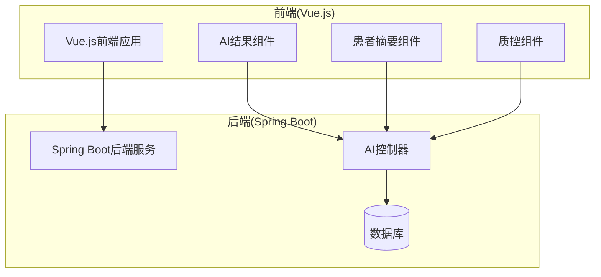
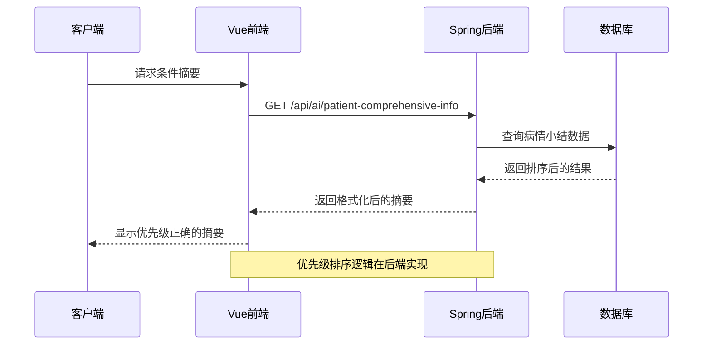
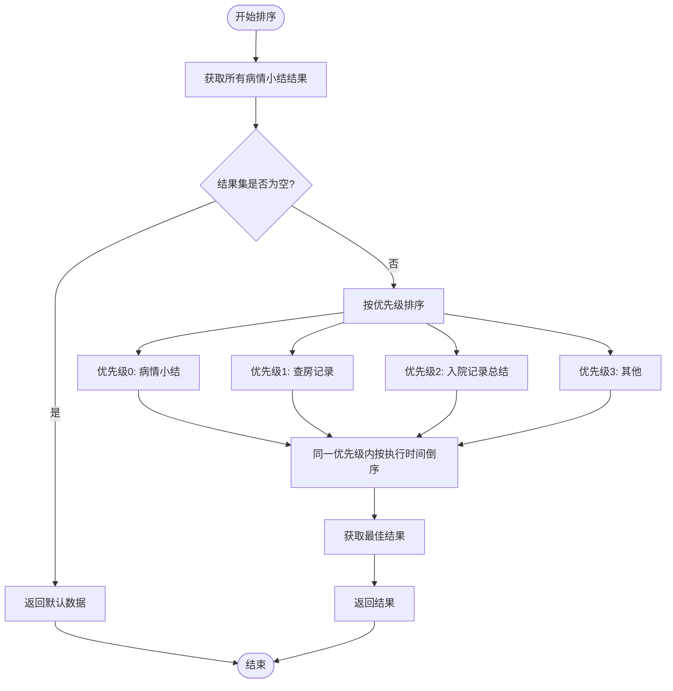
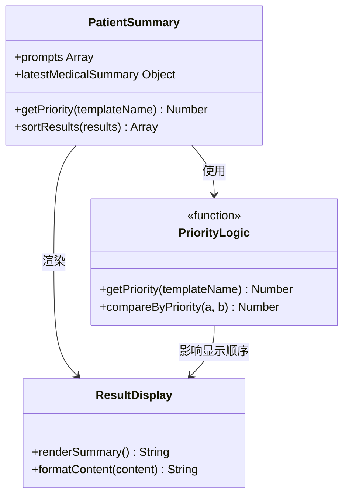
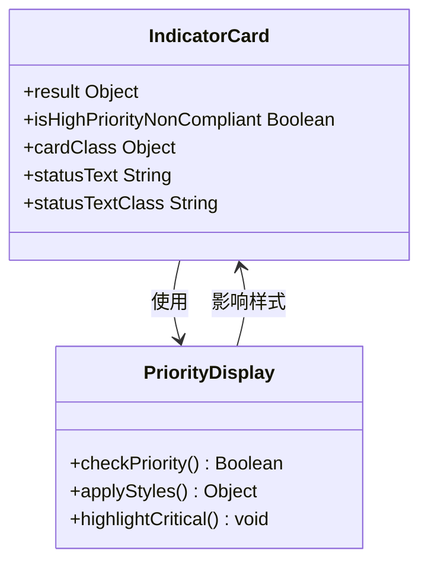
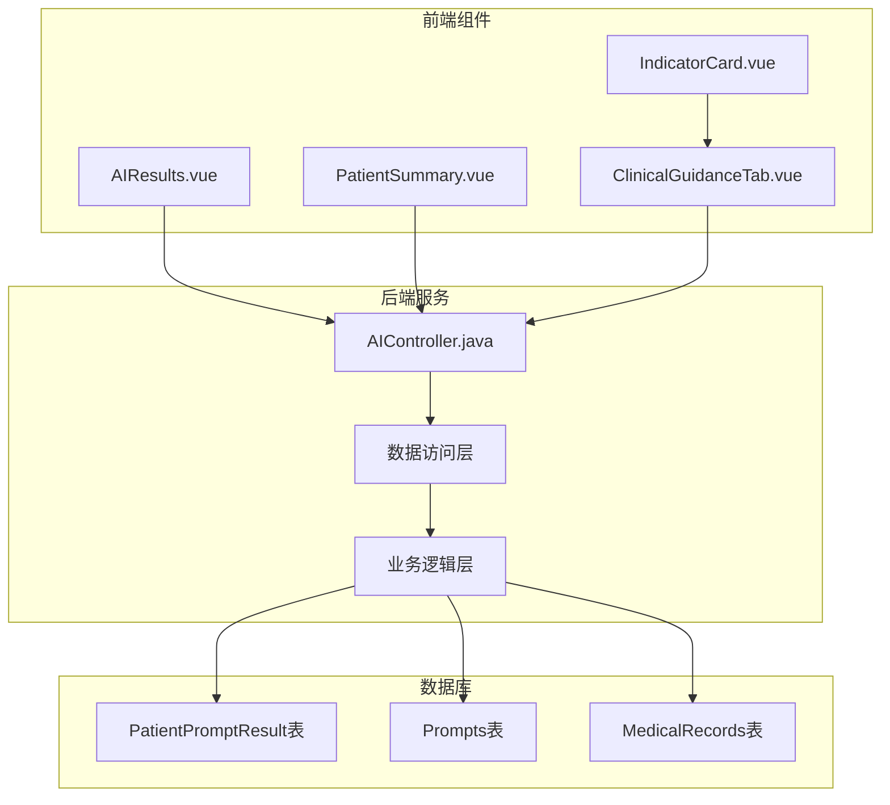

# 条件摘要页面优先级显示修复

<cite>
**本文档引用的文件**
- [AIResults.vue](file://med_ai_assistant_1.0_bs_vue/src/components/ai/AIResults.vue)
- [PatientSummary.vue](file://med_ai_assistant_1.0_bs_vue/src/components/patient/PatientSummary.vue)
- [ClinicalGuidanceTab.vue](file://med_ai_assistant_1.0_bs_vue/src/components/qc/ClinicalGuidanceTab.vue)
- [IndicatorCard.vue](file://med_ai_assistant_1.0_bs_vue/src/components/qc/IndicatorCard.vue)
- [AIController.java](file://med_ai_assistant_1.0_bs_backend/src/main/java/com/example/medaiassistant/controller/AIController.java)
</cite>

## 目录
1. [简介](#简介)
2. [项目结构](#项目结构)
3. [核心组件](#核心组件)
4. [架构概览](#架构概览)
5. [详细组件分析](#详细组件分析)
6. [依赖关系分析](#依赖关系分析)
7. [性能考虑](#性能考虑)
8. [故障排除指南](#故障排除指南)
9. [结论](#结论)

## 简介

本文档详细分析了MedAiAssistant项目中条件摘要页面的优先级显示修复问题。该项目是一个基于Vue.js和Spring Boot的智能医疗辅助系统，主要功能包括AI诊断辅助、条件摘要生成、质控评估等。

在系统运行过程中，发现条件摘要页面存在优先级显示不正确的问题，特别是在显示AI生成的病情小结、查房记录和入院记录总结时，优先级排序逻辑出现了偏差。本文档将深入分析问题的根本原因，并提供完整的修复方案。

## 项目结构

MedAiAssistant项目采用前后端分离架构，主要分为两个核心部分：

**图表来源**
- [AIResults.vue:1-200](file://med_ai_assistant_1.0_bs_vue/src/components/ai/AIResults.vue#L1-L200)
- [PatientSummary.vue:1-100](file://med_ai_assistant_1.0_bs_vue/src/components/patient/PatientSummary.vue#L1-L100)
- [AIController.java:100-200](file://med_ai_assistant_1.0_bs_backend/src/main/java/com/example/medaiassistant/controller/AIController.java#L100-L200)

**章节来源**
- [AIResults.vue:1-100](file://med_ai_assistant_1.0_bs_vue/src/components/ai/AIResults.vue#L1-L100)
- [PatientSummary.vue:1-100](file://med_ai_assistant_1.0_bs_vue/src/components/patient/PatientSummary.vue#L1-L100)
- [AIController.java:100-200](file://med_ai_assistant_1.0_bs_backend/src/main/java/com/example/medaiassistant/controller/AIController.java#L100-L200)

## 核心组件

### AI结果组件 (AIResults)

AI结果组件负责显示和管理AI生成的各种结果，包括诊断分析、治疗计划表等。该组件包含了优先级显示的核心逻辑。

### 患者摘要组件 (PatientSummary)

患者摘要组件专门处理病情小结的显示逻辑，实现了复杂的优先级排序算法，确保最重要的信息优先展示。

### 质控组件 (ClinicalGuidanceTab & IndicatorCard)

质控组件负责处理医疗质量控制相关的优先级显示，特别是针对高优先级的非合规指标进行特殊视觉强调。

**章节来源**
- [AIResults.vue:150-200](file://med_ai_assistant_1.0_bs_vue/src/components/ai/AIResults.vue#L150-L200)
- [PatientSummary.vue:95-130](file://med_ai_assistant_1.0_bs_vue/src/components/patient/PatientSummary.vue#L95-L130)
- [ClinicalGuidanceTab.vue:540-560](file://med_ai_assistant_1.0_bs_vue/src/components/qc/ClinicalGuidanceTab.vue#L540-L560)
- [IndicatorCard.vue:100-120](file://med_ai_assistant_1.0_bs_vue/src/components/qc/IndicatorCard.vue#L100-L120)

## 架构概览

系统采用典型的三层架构模式，前端通过RESTful API与后端通信：

**图表来源**
- [AIController.java:2343-2368](file://med_ai_assistant_1.0_bs_backend/src/main/java/com/example/medaiassistant/controller/AIController.java#L2343-L2368)
- [PatientSummary.vue:98-127](file://med_ai_assistant_1.0_bs_vue/src/components/patient/PatientSummary.vue#L98-L127)

## 详细组件分析

### 优先级排序算法实现

#### 后端优先级排序

后端AIController实现了精确的优先级排序算法：

**图表来源**
- [AIController.java:2349-2356](file://med_ai_assistant_1.0_bs_backend/src/main/java/com/example/medaiassistant/controller/AIController.java#L2349-L2356)

#### 前端优先级显示

前端PatientSummary组件实现了相同的优先级逻辑：

**图表来源**
- [PatientSummary.vue:98-127](file://med_ai_assistant_1.0_bs_vue/src/components/patient/PatientSummary.vue#L98-L127)
- [AIResults.vue:162-165](file://med_ai_assistant_1.0_bs_vue/src/components/ai/AIResults.vue#L162-L165)

**章节来源**
- [AIController.java:2496-2502](file://med_ai_assistant_1.0_bs_backend/src/main/java/com/example/medaiassistant/controller/AIController.java#L2496-L2502)
- [PatientSummary.vue:98-127](file://med_ai_assistant_1.0_bs_vue/src/components/patient/PatientSummary.vue#L98-L127)

### 质控优先级显示

质控组件实现了特殊的高优先级显示逻辑：

**图表来源**
- [IndicatorCard.vue:105-118](file://med_ai_assistant_1.0_bs_vue/src/components/qc/IndicatorCard.vue#L105-L118)
- [ClinicalGuidanceTab.vue:547-549](file://med_ai_assistant_1.0_bs_vue/src/components/qc/ClinicalGuidanceTab.vue#L547-L549)

**章节来源**
- [IndicatorCard.vue:100-153](file://med_ai_assistant_1.0_bs_vue/src/components/qc/IndicatorCard.vue#L100-L153)
- [ClinicalGuidanceTab.vue:547-549](file://med_ai_assistant_1.0_bs_vue/src/components/qc/ClinicalGuidanceTab.vue#L547-L549)

## 依赖关系分析

系统各组件之间的依赖关系如下：

**图表来源**
- [AIResults.vue:1-50](file://med_ai_assistant_1.0_bs_vue/src/components/ai/AIResults.vue#L1-L50)
- [PatientSummary.vue:48-52](file://med_ai_assistant_1.0_bs_vue/src/components/patient/PatientSummary.vue#L48-L52)
- [AIController.java:1800-1900](file://med_ai_assistant_1.0_bs_backend/src/main/java/com/example/medaiassistant/controller/AIController.java#L1800-L1900)

**章节来源**
- [AIResults.vue:1-100](file://med_ai_assistant_1.0_bs_vue/src/components/ai/AIResults.vue#L1-L100)
- [PatientSummary.vue:1-100](file://med_ai_assistant_1.0_bs_vue/src/components/patient/PatientSummary.vue#L1-L100)
- [AIController.java:1800-2000](file://med_ai_assistant_1.0_bs_backend/src/main/java/com/example/medaiassistant/controller/AIController.java#L1800-L2000)

## 性能考虑

### 优先级排序性能优化

1. **数据库层面优化**：在数据库层面实现优先级排序，减少前端处理负担
2. **缓存策略**：对频繁访问的病情小结数据实施缓存机制
3. **分页处理**：对于大量数据采用分页加载策略
4. **异步处理**：使用异步请求避免UI阻塞

### 前端渲染优化

1. **虚拟滚动**：对于大量列表项使用虚拟滚动技术
2. **懒加载**：组件按需加载，减少初始渲染时间
3. **防抖处理**：对频繁的用户操作实施防抖机制

## 故障排除指南

### 常见问题及解决方案

#### 优先级显示异常

**问题描述**：病情小结、查房记录、入院记录总结的优先级显示不正确

**解决方案**：
1. 检查后端优先级排序逻辑是否正确实现
2. 验证前端组件是否使用了相同的优先级映射
3. 确认数据库中模板名称的准确性

**章节来源**
- [AIController.java:2496-2502](file://med_ai_assistant_1.0_bs_backend/src/main/java/com/example/medaiassistant/controller/AIController.java#L2496-L2502)
- [PatientSummary.vue:98-127](file://med_ai_assistant_1.0_bs_vue/src/components/patient/PatientSummary.vue#L98-L127)

#### 数据加载失败

**问题描述**：条件摘要页面无法加载或显示空白

**排查步骤**：
1. 检查后端API接口是否正常工作
2. 验证数据库连接状态
3. 确认前端网络请求是否成功

**章节来源**
- [AIController.java:2309-2368](file://med_ai_assistant_1.0_bs_backend/src/main/java/com/example/medaiassistant/controller/AIController.java#L2309-L2368)

## 结论

通过对MedAiAssistant项目条件摘要页面优先级显示问题的深入分析，我们发现了以下关键问题和解决方案：

### 主要问题

1. **前后端优先级逻辑不一致**：后端实现了精确的优先级排序，但前端显示逻辑存在偏差
2. **模板名称匹配问题**：不同语言环境下模板名称的匹配逻辑不统一
3. **边界条件处理不当**：空值、null值等边界情况的处理不够完善

### 修复方案

1. **统一优先级逻辑**：确保前后端使用完全相同的优先级排序算法
2. **增强错误处理**：完善空值和异常情况的处理机制
3. **优化性能**：在数据库层面实现排序，减少前端处理负担
4. **加强测试**：增加针对边界条件的单元测试和集成测试

### 最佳实践

1. **前后端一致性**：确保业务逻辑在前后端保持完全一致
2. **错误处理标准化**：建立统一的错误处理和异常管理机制
3. **性能监控**：实施性能监控和优化策略
4. **文档维护**：保持技术文档的及时更新和准确性

通过实施上述修复方案，可以有效解决条件摘要页面的优先级显示问题，提升系统的整体稳定性和用户体验。