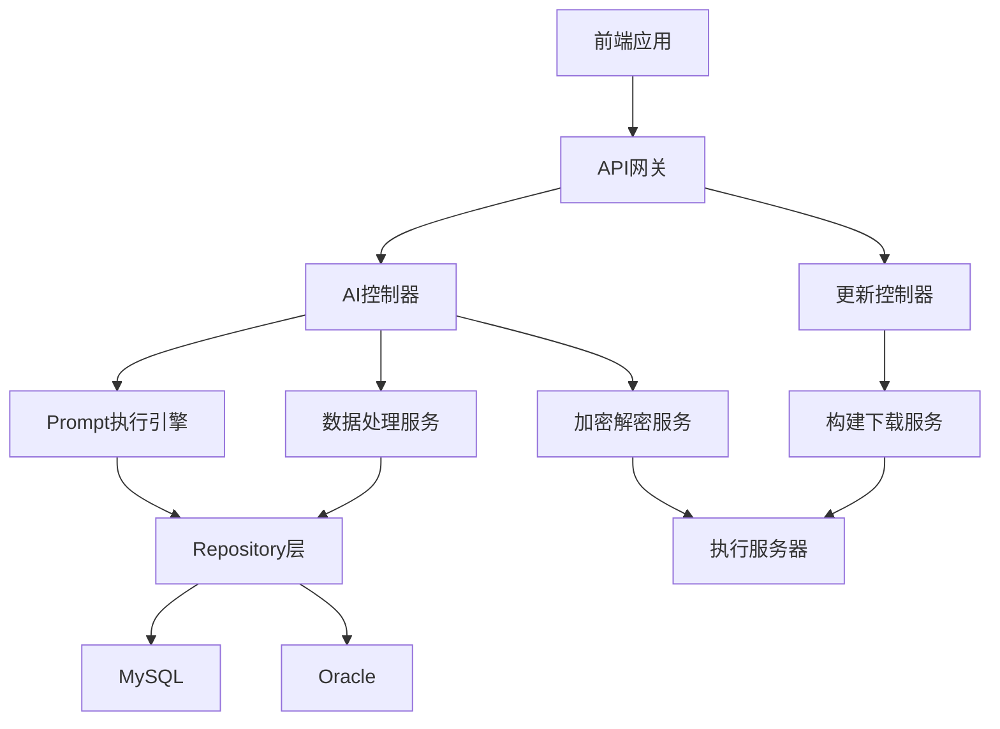
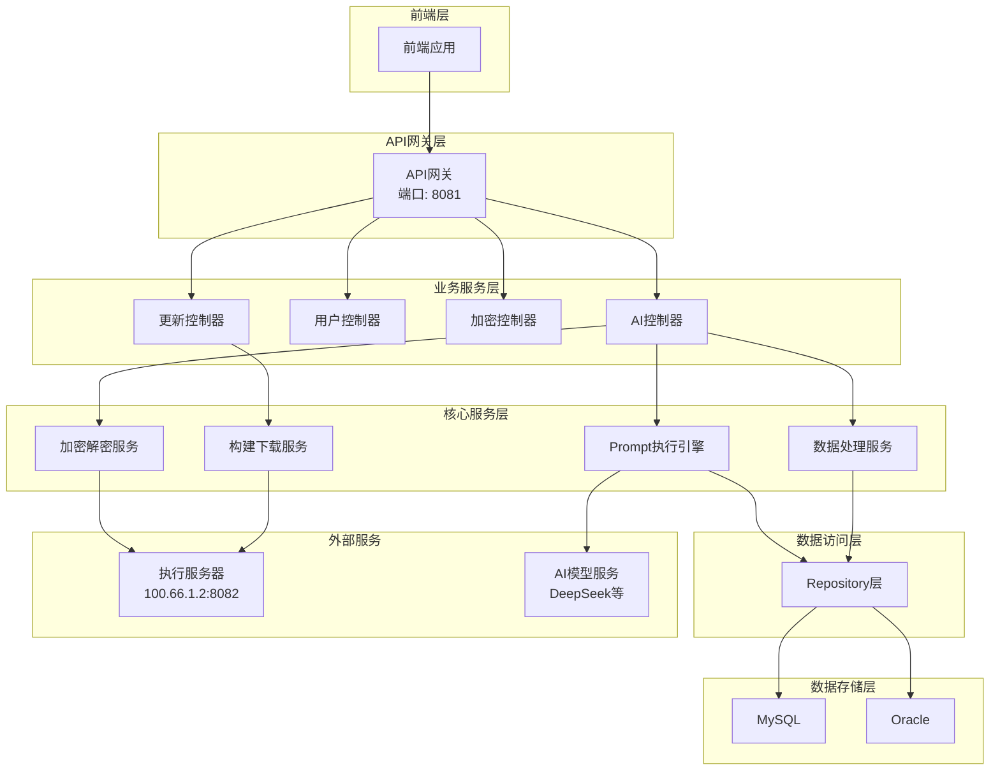
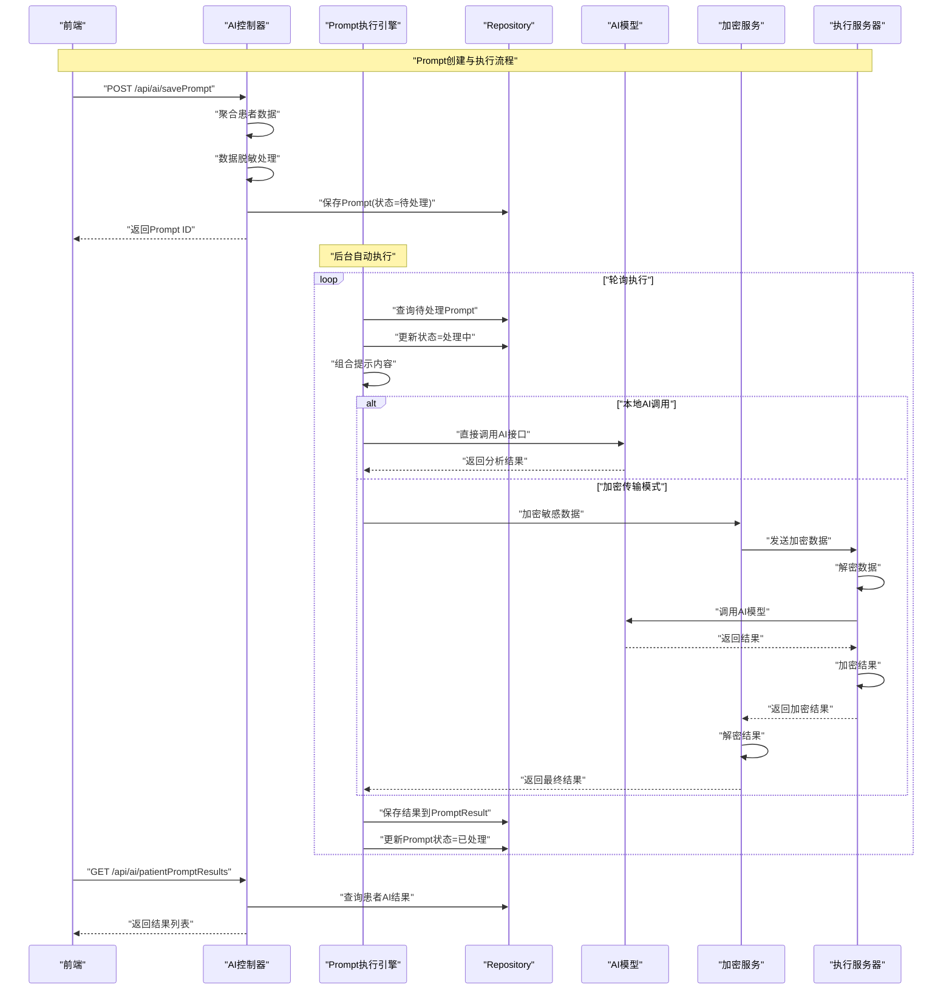
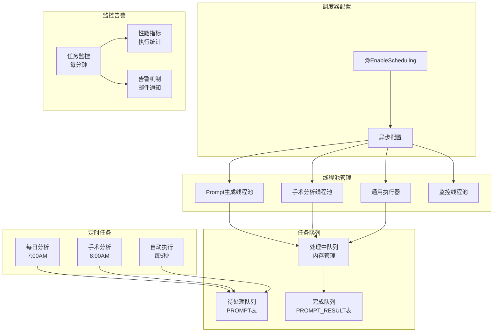
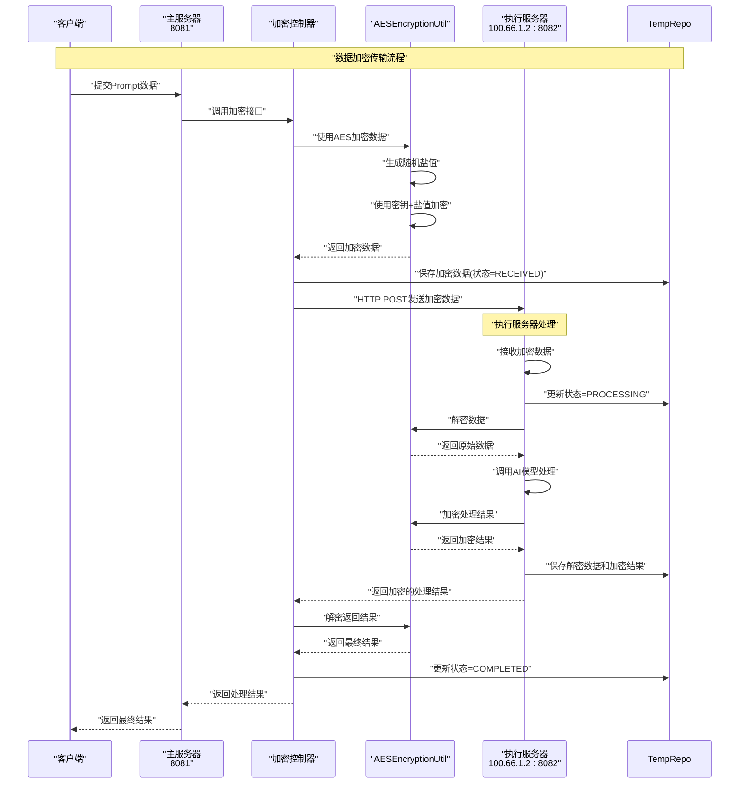
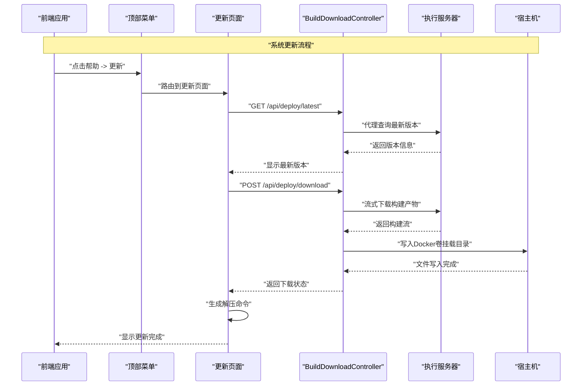
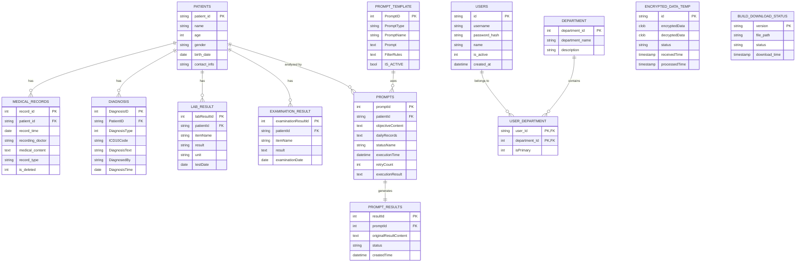
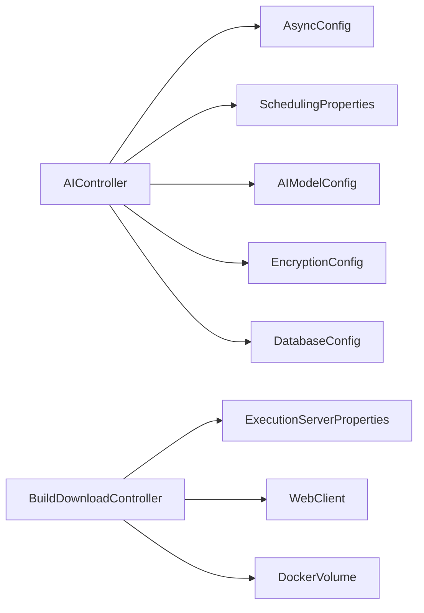

# 核心功能模块

<cite>
**本文引用的文件**
- [ARCHITECTURE_DIAGRAMS.md](file://med_ai_assistant_1.0_bs_backend/doc/其他/ARCHITECTURE_DIAGRAMS.md)
- [AIController.java](file://med_ai_assistant_1.0_bs_backend/src/main/java/com/example/medaiassistant/controller/AIController.java)
- [AsyncConfig.java](file://med_ai_assistant_1.0_bs_backend/src/main/java/com/example/medaiassistant/config/AsyncConfig.java)
- [SchedulingProperties.java](file://med_ai_assistant_1.0_bs_backend/src/main/java/com/example/medaiassistant/config/SchedulingProperties.java)
- [AIModelConfig.java](file://med_ai_assistant_1.0_bs_backend/src/main/java/com/example/medaiassistant/config/AIModelConfig.java)
- [EncryptionConfig.java](file://med_ai_assistant_1.0_bs_backend/src/main/java/com/example/medaiassistant/config/EncryptionConfig.java)
- [DatabaseConfig.java](file://med_ai_assistant_1.0_bs_backend/src/main/java/com/example/medaiassistant/config/DatabaseConfig.java)
- [BuildDownloadController.java](file://med_ai_assistant_1.0_bs_backend/src/main/java/com/example/medaiassistant/controller/BuildDownloadController.java)
- [TopMenu.vue](file://med_ai_assistant_1.0_bs_vue/src/components/TopMenu.vue)
- [更新小结.md](file://更新小结.md)
</cite>

## 更新摘要
**所做更改**
- 新增系统更新功能模块，包含前端帮助菜单下的更新子菜单
- 新增后端构建产物下载控制器，支持版本检查、下载前端ZIP、生成解压命令
- 新增响应式流式下载机制，支持大文件处理和超时控制
- 新增Docker卷挂载部署支持，实现前后端构建产物的自动化部署

## 目录
1. [简介](#简介)
2. [项目结构](#项目结构)
3. [核心组件](#核心组件)
4. [架构总览](#架构总览)
5. [详细组件分析](#详细组件分析)
6. [依赖关系分析](#依赖关系分析)
7. [性能考虑](#性能考虑)
8. [故障排查指南](#故障排查指南)
9. [结论](#结论)
10. [附录](#附录)

## 简介
本文件面向MedAiAssistant 1.0 BS后端系统，聚焦核心功能模块的综合说明，涵盖智能AI诊断辅助、患者数据管理、任务调度机制、实时监控告警以及新增的系统更新功能等主题。文档基于仓库中的架构图、控制器实现、配置类与数据模型关系，系统梳理模块职责、协作关系与数据流转过程，并提供使用场景、配置要点、性能特征与扩展建议，帮助开发者与运维人员快速理解与高效使用系统。

## 项目结构
后端采用Spring Boot工程，核心模块围绕控制器层、配置层与数据访问层展开：
- 控制器层：AIController等负责对外API与业务编排，新增BuildDownloadController处理系统更新功能
- 配置层：异步线程池、调度参数、AI模型、加密与数据库连接池等配置
- 数据访问层：JPA Repository与实体模型支撑数据持久化

**图表来源**
- [ARCHITECTURE_DIAGRAMS.md](file://med_ai_assistant_1.0_bs_backend/doc/其他/ARCHITECTURE_DIAGRAMS.md#L5-L60)

**章节来源**
- [ARCHITECTURE_DIAGRAMS.md](file://med_ai_assistant_1.0_bs_backend/doc/其他/ARCHITECTURE_DIAGRAMS.md#L1-L60)

## 核心组件
- 智能AI诊断辅助：通过AIController聚合患者数据、脱敏处理、调用AI模型或执行服务器，生成诊断与分析结果，并提供结果查询与管理接口。
- 患者数据管理：统一管理患者基本信息、诊断、病历、长期/临时医嘱、化验与检查结果等，支持按模板动态组合与格式化输出。
- 任务调度机制：基于@EnableScheduling与自定义线程池，实现定时任务与自动执行，支持并发控制、超时与重试策略。
- 实时监控告警：内置健康检查、指标采集与阈值告警，支持邮件通知与运行状态可视化。
- **系统更新功能**：新增前端帮助菜单下的更新子菜单，提供版本检查、下载前端ZIP、生成解压命令等功能，支持管理员权限控制。

**章节来源**
- [AIController.java](file://med_ai_assistant_1.0_bs_backend/src/main/java/com/example/medaiassistant/controller/AIController.java#L1-L120)
- [AsyncConfig.java](file://med_ai_assistant_1.0_bs_backend/src/main/java/com/example/medaiassistant/config/AsyncConfig.java#L1-L144)
- [SchedulingProperties.java](file://med_ai_assistant_1.0_bs_backend/src/main/java/com/example/medaiassistant/config/SchedulingProperties.java#L1-L120)
- [BuildDownloadController.java](file://med_ai_assistant_1.0_bs_backend/src/main/java/com/example/medaiassistant/controller/BuildDownloadController.java#L1-L372)

## 架构总览
系统采用分层架构，前端通过API网关访问后端控制器，控制器协调服务层与数据访问层，数据持久化至MySQL与Oracle数据库。AI分析流程支持本地直连与加密传输两种模式，加密模式下通过执行服务器完成解密与结果加密。新增的系统更新功能通过BuildDownloadController实现前后端构建产物的自动化下载与部署。

**图表来源**
- [ARCHITECTURE_DIAGRAMS.md](file://med_ai_assistant_1.0_bs_backend/doc/其他/ARCHITECTURE_DIAGRAMS.md#L5-L60)

## 详细组件分析

### 智能AI诊断辅助（AIController）
- 功能职责
  - Prompt模板管理：创建、查询、更新模板状态
  - 患者数据聚合：按模板动态组合患者信息，支持脱敏处理
  - AI结果保存与查询：保存修改后的结果、查询历史与详情
  - 健康检查：检查网络与AI模型可用性
  - 数据清洗：批量脱敏文本
- 关键流程
  - Prompt创建：保存到PROMPT表，状态=待处理
  - 后台执行：轮询PROMPT表，组合提示词，调用AI模型或执行服务器
  - 结果落库：写入PROMPT_RESULT表，更新PROMPT状态=已处理
  - 前端查询：获取患者AI结果列表与详情

**图表来源**
- [ARCHITECTURE_DIAGRAMS.md](file://med_ai_assistant_1.0_bs_backend/doc/其他/ARCHITECTURE_DIAGRAMS.md#L185-L232)

**章节来源**
- [AIController.java](file://med_ai_assistant_1.0_bs_backend/src/main/java/com/example/medaiassistant/controller/AIController.java#L1582-L1694)
- [AIController.java](file://med_ai_assistant_1.0_bs_backend/src/main/java/com/example/medaiassistant/controller/AIController.java#L598-L1127)
- [AIController.java](file://med_ai_assistant_1.0_bs_backend/src/main/java/com/example/medaiassistant/controller/AIController.java#L1366-L1463)
- [AIController.java](file://med_ai_assistant_1.0_bs_backend/src/main/java/com/example/medaiassistant/controller/AIController.java#L1752-L1970)

### 患者数据管理
- 数据类型与来源
  - 一般信息：来自患者表，包含性别、年龄、入院时间、住院天数
  - 诊断信息：来自诊断表
  - 病情小结：来自病历记录表
  - 病历记录：来自病历记录表
  - 长期/临时医嘱：来自长期医嘱表，格式化输出
  - 化验/检查结果：来自化验与检查结果表，格式化输出
  - 入院记录：优先取AI结果中的"入院记录总结"，否则取EMR内容
  - 会诊记录：来自EMR内容表
  - 手术记录：通过模糊匹配查询EMR内容，兼容多种命名变体
- 优化策略
  - 消除HTTP自调用，直接数据库查询，显著降低超时风险
  - 手术记录强制包含，保证数据一致性
  - 入院记录三层降级策略，提升鲁棒性

**图表来源**
- [AIController.java](file://med_ai_assistant_1.0_bs_backend/src/main/java/com/example/medaiassistant/controller/AIController.java#L598-L1127)

**章节来源**
- [AIController.java](file://med_ai_assistant_1.0_bs_backend/src/main/java/com/example/medaiassistant/controller/AIController.java#L598-L1127)

### 任务调度机制（异步与定时）
- 线程池配置
  - Prompt生成专用线程池、手术分析专用线程池、通用异步执行线程池、监控线程池
  - 拒绝策略：CallerRunsPolicy或DiscardPolicy，保障系统稳定性
- 调度参数
  - 自动执行间隔、最大线程数、启用状态与时区
  - 定时任务cron表达式（每日分析、手术分析）、最大并发、科室过滤
  - 执行服务器轮询并发、超时、重试次数
- 监控与告警
  - 指标采集间隔、告警邮箱、阈值配置

**图表来源**
- [ARCHITECTURE_DIAGRAMS.md](file://med_ai_assistant_1.0_bs_backend/doc/其他/ARCHITECTURE_DIAGRAMS.md#L340-L391)

**章节来源**
- [AsyncConfig.java](file://med_ai_assistant_1.0_bs_backend/src/main/java/com/example/medaiassistant/config/AsyncConfig.java#L20-L144)
- [SchedulingProperties.java](file://med_ai_assistant_1.0_bs_backend/src/main/java/com/example/medaiassistant/config/SchedulingProperties.java#L11-L800)

### 实时监控与健康检查
- AI模型健康检查：逐个模型执行健康检查，记录网络失败计数，必要时强制重置
- 网络恢复：对可重试网络异常进行记录与恢复
- 健康状态汇总：返回整体健康状态与各模型状态

**章节来源**
- [AIController.java](file://med_ai_assistant_1.0_bs_backend/src/main/java/com/example/medaiassistant/controller/AIController.java#L1752-L1970)

### 加密与安全（传输与存储）
- 加密配置：AES密钥、盐值、算法参数、密钥轮换与审计
- 加密传输流程：主服务器加密 -> 发送到执行服务器 -> 执行服务器解密/加密 -> 返回主服务器解密
- 存储安全：敏感数据在传输过程中加密，避免明文泄露

**图表来源**
- [ARCHITECTURE_DIAGRAMS.md](file://med_ai_assistant_1.0_bs_backend/doc/其他/ARCHITECTURE_DIAGRAMS.md#L269-L306)

**章节来源**
- [EncryptionConfig.java](file://med_ai_assistant_1.0_bs_backend/src/main/java/com/example/medaiassistant/config/EncryptionConfig.java#L1-L265)

### 系统更新功能（新增）
- 功能概述
  - 前端帮助菜单新增"更新"子菜单，仅管理员用户可见
  - 提供版本检查、下载前端ZIP、生成解压命令等核心功能
  - 支持响应式流式下载，处理大文件（约90MB JAR文件）
  - 集成Docker卷挂载，实现自动化部署
- 技术实现
  - BuildDownloadController：处理构建产物下载与状态查询
  - 响应式WebClient：支持超时控制与错误处理
  - Docker卷挂载：前后端构建产物直接写入宿主机
  - 管理员权限控制：基于用户ID 0001的权限验证

**图表来源**
- [BuildDownloadController.java](file://med_ai_assistant_1.0_bs_backend/src/main/java/com/example/medaiassistant/controller/BuildDownloadController.java#L126-L220)

**章节来源**
- [BuildDownloadController.java](file://med_ai_assistant_1.0_bs_backend/src/main/java/com/example/medaiassistant/controller/BuildDownloadController.java#L1-L372)
- [TopMenu.vue](file://med_ai_assistant_1.0_bs_vue/src/components/TopMenu.vue#L122-L136)
- [更新小结.md](file://更新小结.md#L6-L9)

### 数据模型关系
系统围绕患者、诊断、病历、化验、检查、提示词与结果等核心实体建立ER关系，支持跨表关联与查询。

**图表来源**
- [ARCHITECTURE_DIAGRAMS.md](file://med_ai_assistant_1.0_bs_backend/doc/其他/ARCHITECTURE_DIAGRAMS.md#L64-L181)

## 依赖关系分析
- 控制器依赖：AIController依赖多个Repository与服务类，形成清晰的业务编排层
- 配置依赖：异步线程池与调度参数通过配置类集中管理，便于横向扩展
- 数据访问：Repository层统一抽象，底层数据源支持MySQL与Oracle
- 外部集成：AI模型与执行服务器通过配置与健康检查保障可用性
- **更新功能依赖**：BuildDownloadController依赖ExecutionServerProperties与WebClient，实现响应式流式下载

**图表来源**
- [AIController.java](file://med_ai_assistant_1.0_bs_backend/src/main/java/com/example/medaiassistant/controller/AIController.java#L1-L120)
- [AsyncConfig.java](file://med_ai_assistant_1.0_bs_backend/src/main/java/com/example/medaiassistant/config/AsyncConfig.java#L1-L144)
- [SchedulingProperties.java](file://med_ai_assistant_1.0_bs_backend/src/main/java/com/example/medaiassistant/config/SchedulingProperties.java#L1-L120)
- [AIModelConfig.java](file://med_ai_assistant_1.0_bs_backend/src/main/java/com/example/medaiassistant/config/AIModelConfig.java#L1-L120)
- [EncryptionConfig.java](file://med_ai_assistant_1.0_bs_backend/src/main/java/com/example/medaiassistant/config/EncryptionConfig.java#L1-L120)
- [DatabaseConfig.java](file://med_ai_assistant_1.0_bs_backend/src/main/java/com/example/medaiassistant/config/DatabaseConfig.java#L1-L120)
- [BuildDownloadController.java](file://med_ai_assistant_1.0_bs_backend/src/main/java/com/example/medaiassistant/controller/BuildDownloadController.java#L1-L372)

## 性能考虑
- 数据访问优化
  - 消除HTTP自调用，直接数据库查询，显著降低超时与连接池竞争
  - 手术记录强制包含与入院记录三层降级策略，提升鲁棒性
- 线程池与并发
  - 专用线程池隔离不同任务类型，避免相互影响
  - 拒绝策略选择适合业务的CallerRunsPolicy或DiscardPolicy
- 连接池与数据库
  - HikariCP连接池参数优化，支持连接保活与泄漏检测
  - Oracle方言与会话参数优化，减少连接失效与NPE风险
- AI模型与网络
  - 健康检查与失败计数，必要时强制重置，保障可用性
  - 超时与重试策略，平衡吞吐与稳定性
- **更新功能性能**
  - 响应式流式下载避免大文件内存溢出
  - 30分钟下载超时与30秒查询超时配置
  - Docker卷挂载直接写入宿主机，避免额外拷贝操作

## 故障排查指南
- AI模型不可用
  - 检查健康检查接口返回状态与网络失败计数
  - 核对AI模型配置（URL、密钥、超时）是否有效
- 数据库连接问题
  - 检查HikariCP连接池参数与验证查询
  - 关注连接泄漏检测阈值与空闲超时设置
- 加密传输异常
  - 校验加密配置（密钥、盐值、算法参数）
  - 检查执行服务器状态与数据状态流转
- 调度任务积压
  - 检查自动执行间隔与最大线程数
  - 核对定时任务cron表达式与并发限制
- **更新功能故障排查**
  - 检查执行服务器可达性与版本信息查询
  - 验证Docker卷挂载目录权限与空间
  - 确认管理员用户权限与路由配置
  - 监控响应式下载超时与错误日志

**章节来源**
- [AIController.java](file://med_ai_assistant_1.0_bs_backend/src/main/java/com/example/medaiassistant/controller/AIController.java#L1752-L1970)
- [DatabaseConfig.java](file://med_ai_assistant_1.0_bs_backend/src/main/java/com/example/medaiassistant/config/DatabaseConfig.java#L134-L210)
- [EncryptionConfig.java](file://med_ai_assistant_1.0_bs_backend/src/main/java/com/example/medaiassistant/config/EncryptionConfig.java#L224-L242)
- [SchedulingProperties.java](file://med_ai_assistant_1.0_bs_backend/src/main/java/com/example/medaiassistant/config/SchedulingProperties.java#L686-L760)
- [BuildDownloadController.java](file://med_ai_assistant_1.0_bs_backend/src/main/java/com/example/medaiassistant/controller/BuildDownloadController.java#L126-L220)

## 结论
MedAiAssistant 1.0 BS后端通过清晰的分层架构与完善的配置体系，实现了智能AI诊断辅助、患者数据管理、任务调度与监控告警的核心能力。新增的系统更新功能进一步完善了系统的运维能力，通过响应式流式下载与Docker卷挂载实现了高效的前后端构建产物部署。系统在数据访问、线程池并发、数据库连接池与AI模型健康检查等方面进行了针对性优化，具备良好的稳定性与扩展性。建议在生产环境中结合配置参数与监控指标持续优化，确保高可用与高性能。

## 附录
- 使用场景
  - 医生查房：生成患者综合信息与AI分析摘要
  - 诊断辅助：基于模板组合患者数据，触发AI模型生成诊断建议
  - 数据治理：统一脱敏与格式化输出，保障隐私与一致性
  - **系统维护**：管理员通过帮助菜单进行系统版本检查与更新部署
- 配置要点
  - AI模型配置：URL、密钥、超时与重试策略
  - 调度参数：自动执行间隔、最大线程数与时区
  - 加密配置：密钥、盐值、算法参数与密钥轮换
  - 数据库连接池：最大连接数、空闲超时与保活时间
  - **更新功能配置**：执行服务器地址、下载目录、Docker卷挂载路径
- 扩展建议
  - 引入指标埋点与日志分级，完善可观测性
  - 增加限流与熔断策略，提升抗压能力
  - 支持多模型并行与结果融合，提升诊断质量
  - **扩展更新功能**：支持后端JAR文件的自动化部署与回滚机制