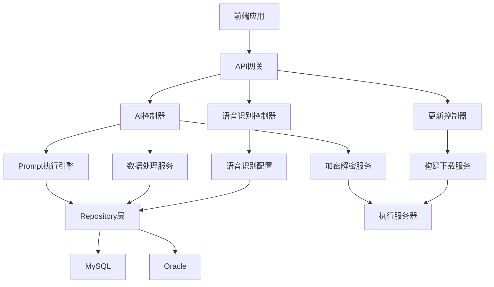
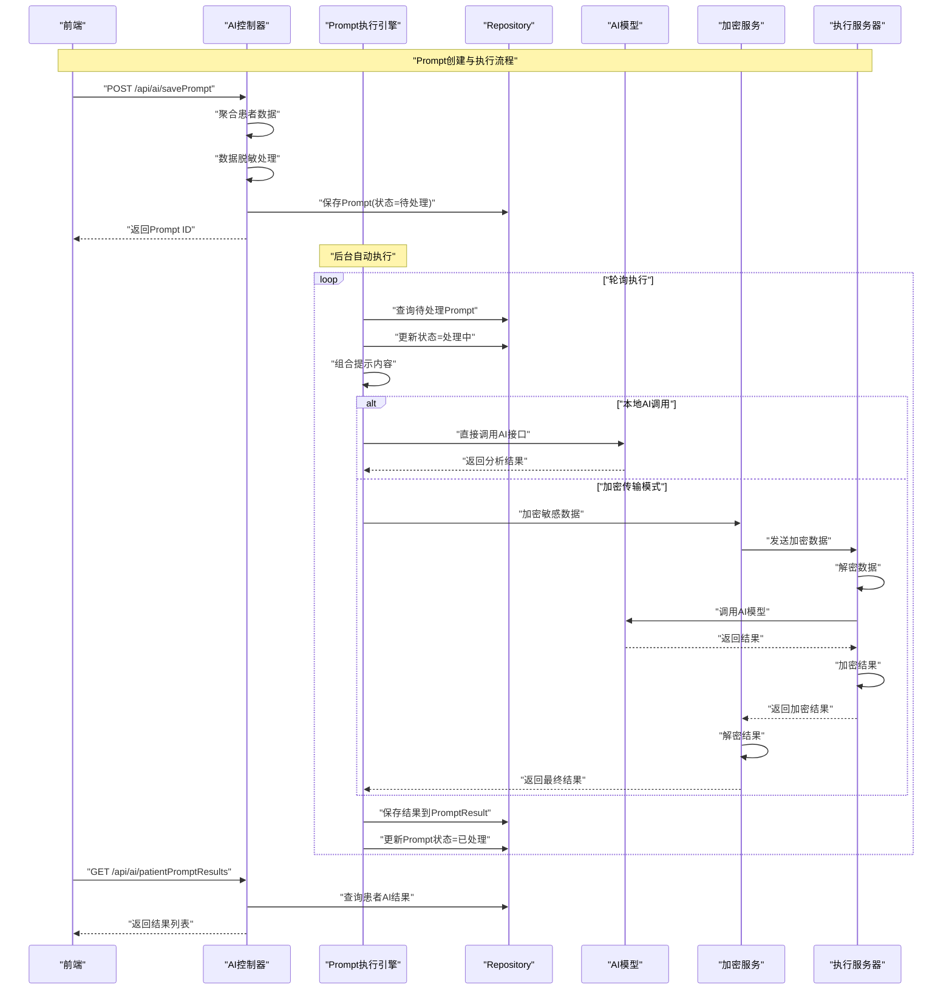
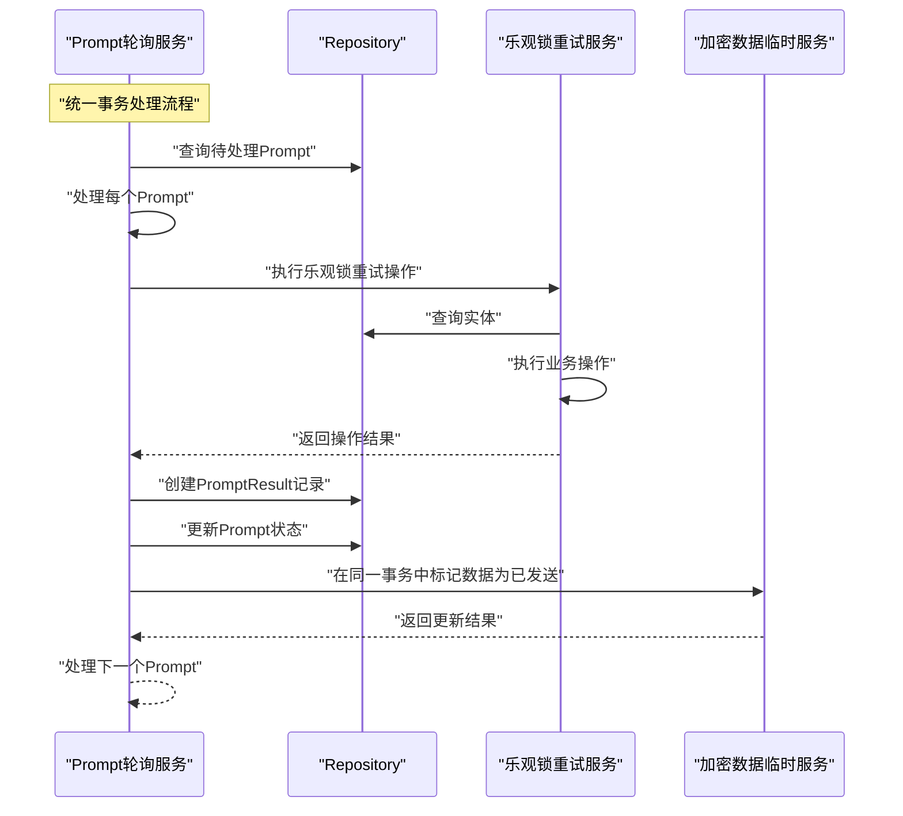
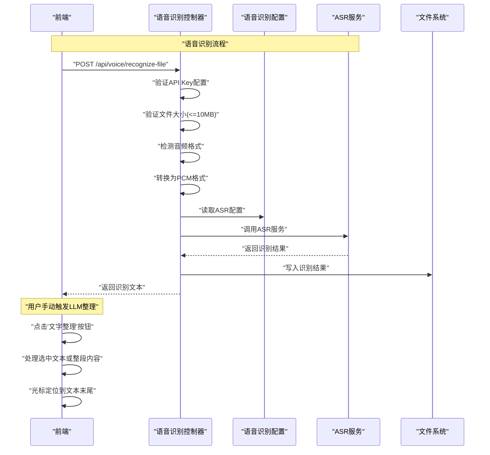
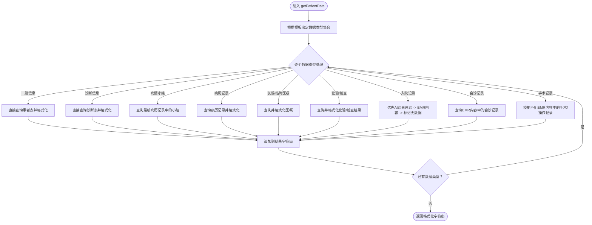
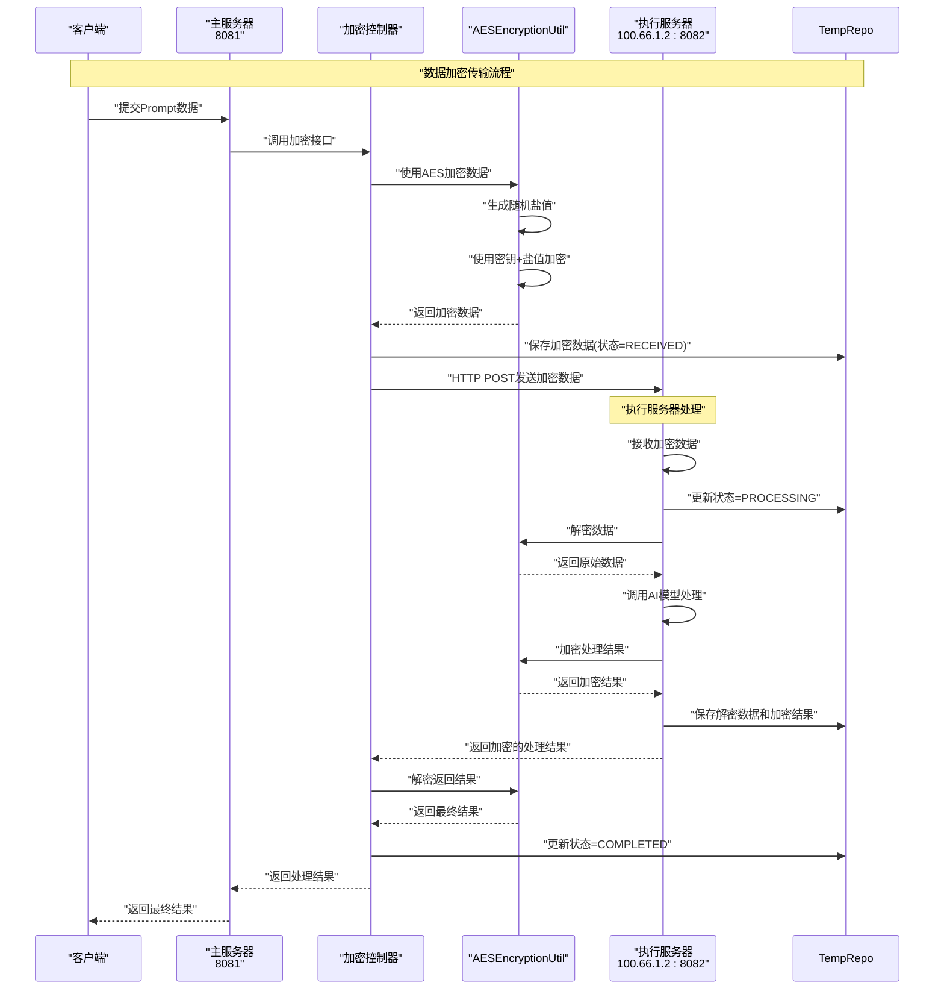
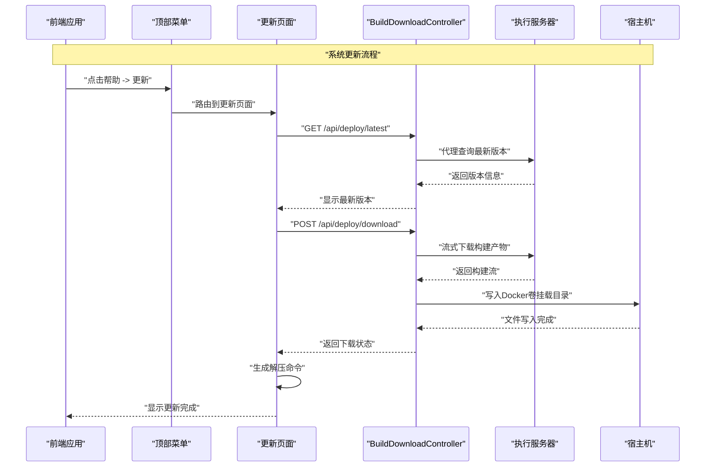
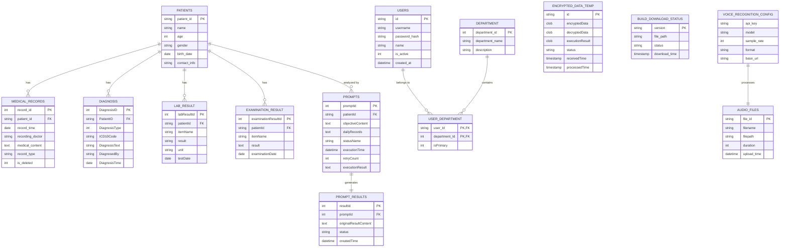
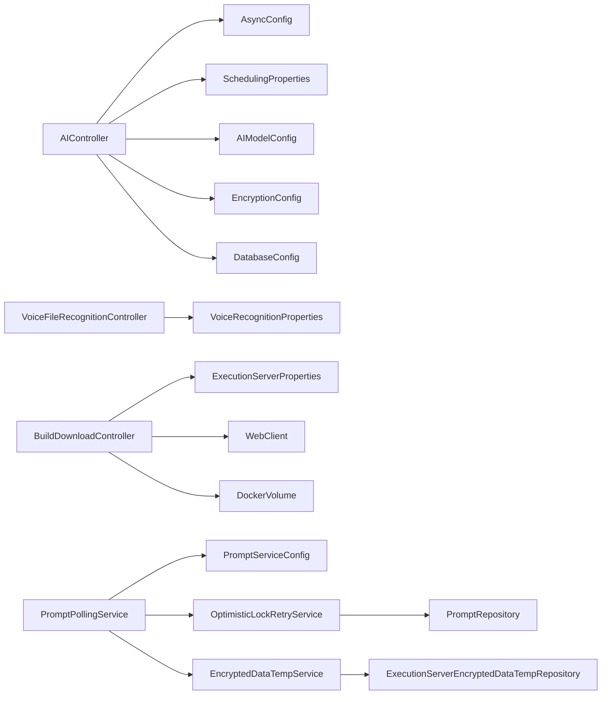

# 核心功能模块

<cite>
**本文引用的文件**
- [ARCHITECTURE_DIAGRAMS.md](file://med_ai_assistant_1.0_bs_backend/doc/其他/ARCHITECTURE_DIAGRAMS.md)
- [AIController.java](file://med_ai_assistant_1.0_bs_backend/src/main/java/com/example/medaiassistant/controller/AIController.java)
- [AIResponseController.java](file://med_ai_assistant_1.0_bs_backend/src/main/java/com/example/medaiassistant/controller/AIResponseController.java)
- [AIRouterConfig.java](file://med_ai_assistant_1.0_bs_backend/src/main/java/com/example/medaiassistant/config/AIRouterConfig.java)
- [AsyncConfig.java](file://med_ai_assistant_1.0_bs_backend/src/main/java/com/example/medaiassistant/config/AsyncConfig.java)
- [SchedulingProperties.java](file://med_ai_assistant_1.0_bs_backend/src/main/java/com/example/medaiassistant/config/SchedulingProperties.java)
- [AIModelConfig.java](file://med_ai_assistant_1.0_bs_backend/src/main/java/com/example/medaiassistant/config/AIModelConfig.java)
- [EncryptionConfig.java](file://med_ai_assistant_1.0_bs_backend/src/main/java/com/example/medaiassistant/config/EncryptionConfig.java)
- [DatabaseConfig.java](file://med_ai_assistant_1.0_bs_backend/src/main/java/com/example/medaiassistant/config/DatabaseConfig.java)
- [VoiceFileRecognitionController.java](file://med_ai_assistant_1.0_bs_backend/src/main/java/com/example/medaiassistant/controller/VoiceFileRecognitionController.java)
- [VoiceRecognitionProperties.java](file://med_ai_assistant_1.0_bs_backend/src/main/java/com/example/medaiassistant/config/VoiceRecognitionProperties.java)
- [BuildDownloadController.java](file://med_ai_assistant_1.0_bs_backend/src/main/java/com/example/medaiassistant/controller/BuildDownloadController.java)
- [TopMenu.vue](file://med_ai_assistant_1.0_bs_vue/src/components/TopMenu.vue)
- [UpdateView.vue](file://med_ai_assistant_1.0_bs_vue/src/views/UpdateView.vue)
- [更新小结.md](file://更新小结.md)
- [PromptPollingService.java](file://med_ai_assistant_1.0_bs_backend/src/main/java/com/example/medaiassistant/service/PromptPollingService.java)
- [OptimisticLockRetryService.java](file://med_ai_assistant_1.0_bs_backend/src/main/java/com/example/medaiassistant/service/OptimisticLockRetryService.java)
- [PromptServiceConfig.java](file://med_ai_assistant_1.0_bs_backend/src/main/java/com/example/medaiassistant/config/PromptServiceConfig.java)
- [EncryptedDataTempService.java](file://med_ai_assistant_1.0_bs_backend/src/main/java/com/example/medaiassistant/service/EncryptedDataTempService.java)
</cite>

## 更新摘要
**所做更改**
- 新增Prompt提交与数据取回机制加固说明，包括事务一致性、超时处理、乐观锁、轮询配置优化等核心改进
- 更新智能AI诊断辅助功能描述，突出事务边界修复、CLOB处理优化和数据一致性保障
- 新增乐观锁重试机制在Prompt处理中的应用说明
- 更新轮询服务配置优化，包括超时处理和清理重试机制
- 新增EncryptedDataTempService JPQL直接更新机制说明

## 目录
1. [简介](#简介)
2. [项目结构](#项目结构)
3. [核心组件](#核心组件)
4. [架构总览](#架构总览)
5. [详细组件分析](#详细组件分析)
6. [依赖关系分析](#依赖关系分析)
7. [性能考虑](#性能考虑)
8. [故障排查指南](#故障排查指南)
9. [结论](#结论)
10. [附录](#附录)

## 简介
本文件面向MedAiAssistant 1.0 BS后端系统，聚焦核心功能模块的综合说明，涵盖智能AI诊断辅助、患者数据管理、任务调度机制、实时监控告警、语音识别与LLM整理功能解耦以及新增的系统更新功能等主题。文档基于仓库中的架构图、控制器实现、配置类与数据模型关系，系统梳理模块职责、协作关系与数据流转过程，并提供使用场景、配置要点、性能特征与扩展建议，帮助开发者与运维人员快速理解与高效使用系统。

**更新重点**：本次更新重点关注版本0.7.010中Prompt提交与数据取回机制的重大加固，包括事务一致性修复、超时处理优化、乐观锁重试机制引入、轮询配置优化以及CLOB处理安全保障等核心改进。

## 项目结构
后端采用Spring Boot工程，核心模块围绕控制器层、配置层与数据访问层展开：
- 控制器层：AIController等负责对外API与业务编排，新增BuildDownloadController处理系统更新功能，新增VoiceFileRecognitionController处理语音识别功能
- 配置层：异步线程池、调度参数、AI模型、加密与数据库连接池、语音识别配置、Prompt服务配置等配置
- 数据访问层：JPA Repository与实体模型支撑数据持久化



**图表来源**
- [ARCHITECTURE_DIAGRAMS.md:5-60](file://med_ai_assistant_1.0_bs_backend/doc/其他/ARCHITECTURE_DIAGRAMS.md#L5-L60)

**章节来源**
- [ARCHITECTURE_DIAGRAMS.md:1-60](file://med_ai_assistant_1.0_bs_backend/doc/其他/ARCHITECTURE_DIAGRAMS.md#L1-L60)

## 核心组件
- 智能AI诊断辅助：通过AIController聚合患者数据、脱敏处理、调用AI模型或执行服务器，生成诊断与分析结果，并提供结果查询与管理接口。**新增**：Prompt提交与数据取回机制经过重大加固，包括事务边界修复、CLOB处理优化和数据一致性保障。
- 患者数据管理：统一管理患者基本信息、诊断、病历、长期/临时医嘱、化验与检查结果等，支持按模板动态组合与格式化输出。
- 任务调度机制：基于@EnableScheduling与自定义线程池，实现定时任务与自动执行，支持并发控制、超时与重试策略。**新增**：Prompt轮询服务配置优化，包括超时处理和清理重试机制。
- 实时监控告警：内置健康检查、指标采集与阈值告警，支持邮件通知与运行状态可视化。
- **语音识别与LLM整理功能解耦**：语音识别完成后不再自动调用LLM整理，用户可手动点击"文字整理"按钮触发；优化语音识别按钮逻辑，支持选中文本替换和光标定位。
- **系统更新功能**：新增前端帮助菜单下的更新子菜单，提供版本检查、下载前端ZIP、生成解压命令等功能，支持管理员权限控制。
- **乐观锁重试机制**：新增OptimisticLockRetryService服务，处理乐观锁冲突、版本控制和并发更新问题，提升数据一致性保障。
- **EncryptedDataTempService JPQL更新机制**：采用JPQL直接更新方式，避免Hibernate实体状态管理问题，解决ORA-01407约束违规错误。

**章节来源**
- [AIController.java:1-120](file://med_ai_assistant_1.0_bs_backend/src/main/java/com/example/medaiassistant/controller/AIController.java#L1-L120)
- [VoiceFileRecognitionController.java:1-368](file://med_ai_assistant_1.0_bs_backend/src/main/java/com/example/medaiassistant/controller/VoiceFileRecognitionController.java#L1-L368)
- [AsyncConfig.java:1-144](file://med_ai_assistant_1.0_bs_backend/src/main/java/com/example/medaiassistant/config/AsyncConfig.java#L1-L144)
- [SchedulingProperties.java:1-120](file://med_ai_assistant_1.0_bs_backend/src/main/java/com/example/medaiassistant/config/SchedulingProperties.java#L1-L120)
- [BuildDownloadController.java:1-372](file://med_ai_assistant_1.0_bs_backend/src/main/java/com/example/medaiassistant/controller/BuildDownloadController.java#L1-L372)
- [PromptPollingService.java:1-1411](file://med_ai_assistant_1.0_bs_backend/src/main/java/com/example/medaiassistant/service/PromptPollingService.java#L1-L1411)
- [OptimisticLockRetryService.java:1-352](file://med_ai_assistant_1.0_bs_backend/src/main/java/com/example/medaiassistant/service/OptimisticLockRetryService.java#L1-L352)
- [EncryptedDataTempService.java:1-798](file://med_ai_assistant_1.0_bs_backend/src/main/java/com/example/medaiassistant/service/EncryptedDataTempService.java#L1-L798)

## 架构总览
系统采用分层架构，前端通过API网关访问后端控制器，控制器协调服务层与数据访问层，数据持久化至MySQL与Oracle数据库。AI分析流程支持本地直连与加密传输两种模式，加密模式下通过执行服务器完成解密与结果加密。新增的语音识别功能通过VoiceFileRecognitionController实现ASR服务调用，支持配置外化和多服务提供商切换。新增的系统更新功能通过BuildDownloadController实现前后端构建产物的自动化下载与部署。

**更新重点**：架构中新增了Prompt提交与数据取回机制的加固层，包括事务一致性保障、乐观锁重试机制和JPQL直接更新策略，确保数据处理的可靠性和一致性。

```mermaid
graph TB
subgraph "前端层"
FE["前端应用"]
end
subgraph "API网关层"
GW["API网关<br/>端口: 8081"]
end
subgraph "业务服务层"
CTRL_AI["AI控制器"]
CTRL_VOICE["语音识别控制器"]
CTRL_USER["用户控制器"]
CTRL_ENC["加密控制器"]
CTRL_UPDATE["更新控制器"]
end
subgraph "核心服务层"
SVC_PROMPT["Prompt执行引擎"]
SVC_DATA["数据处理服务"]
SVC_ENCRYPT["加密解密服务"]
SVC_VOICE_CONFIG["语音识别配置"]
SVC_DOWNLOAD["构建下载服务"]
SVC_OPTIMISTIC["乐观锁重试服务"]
SVC_POLLING["Prompt轮询服务"]
SVC_ENCRYPT_TEMP["加密数据临时服务"]
end
subgraph "数据访问层"
REPO["Repository层"]
end
subgraph "数据存储层"
DB_MY["MySQL"]
DB_ORA["Oracle"]
END
subgraph "外部服务"
EXEC["执行服务器<br/>100.66.1.2:8082"]
AI["AI模型服务<br/>DeepSeek等"]
ASR["语音识别服务<br/>阿里云DashScope等"]
END
FE --> GW
GW --> CTRL_AI
GW --> CTRL_VOICE
GW --> CTRL_USER
GW --> CTRL_ENC
GW --> CTRL_UPDATE
CTRL_AI --> SVC_PROMPT
CTRL_AI --> SVC_DATA
CTRL_AI --> SVC_ENCRYPT
CTRL_VOICE --> SVC_VOICE_CONFIG
CTRL_UPDATE --> SVC_DOWNLOAD
SVC_PROMPT --> SVC_POLLING
SVC_POLLING --> SVC_OPTIMISTIC
SVC_POLLING --> SVC_ENCRYPT_TEMP
SVC_ENCRYPT --> EXEC
SVC_VOICE_CONFIG --> ASR
SVC_DOWNLOAD --> EXEC
REPO --> DB_MY
REPO --> DB_ORA
SVC_PROMPT --> AI
```

**图表来源**
- [ARCHITECTURE_DIAGRAMS.md:5-60](file://med_ai_assistant_1.0_bs_backend/doc/其他/ARCHITECTURE_DIAGRAMS.md#L5-L60)

## 详细组件分析

### 智能AI诊断辅助（AIController）
- 功能职责
  - Prompt模板管理：创建、查询、更新模板状态
  - 患者数据聚合：按模板动态组合患者信息，支持脱敏处理
  - AI结果保存与查询：保存修改后的结果、查询历史与详情
  - 健康检查：检查网络与AI模型可用性
  - 数据清洗：批量脱敏文本
- 关键流程
  - Prompt创建：保存到PROMPT表，状态=待处理
  - 后台执行：轮询PROMPT表，组合提示词，调用AI模型或执行服务器
  - 结果落库：写入PROMPT_RESULT表，更新PROMPT状态=已处理
  - 前端查询：获取患者AI结果列表与详情

**更新重点**：Prompt提交与数据取回机制经过重大加固，包括事务边界修复、CLOB处理优化和数据一致性保障。



**图表来源**
- [ARCHITECTURE_DIAGRAMS.md:185-232](file://med_ai_assistant_1.0_bs_backend/doc/其他/ARCHITECTURE_DIAGRAMS.md#L185-L232)

**章节来源**
- [AIController.java:1582-1694](file://med_ai_assistant_1.0_bs_backend/src/main/java/com/example/medaiassistant/controller/AIController.java#L1582-L1694)
- [AIController.java:598-1127](file://med_ai_assistant_1.0_bs_backend/src/main/java/com/example/medaiassistant/controller/AIController.java#L598-L1127)
- [AIController.java:1366-1463](file://med_ai_assistant_1.0_bs_backend/src/main/java/com/example/medaiassistant/controller/AIController.java#L1366-L1463)
- [AIController.java:1752-1970](file://med_ai_assistant_1.0_bs_backend/src/main/java/com/example/medaiassistant/controller/AIController.java#L1752-L1970)

### Prompt提交与数据取回机制加固
- 功能职责
  - 事务边界修复：将STATUS更新与PromptResult创建放在同一个事务中，消除独立事务导致的数据不一致风险
  - CLOB处理优化：增强Clob内容提取方法，包含重试机制和大小限制检查，防止OOM
  - 数据一致性检查：定期检查数据一致性，自动修复状态为"已完成"但ResultId为NULL或PromptResult不存在的记录
  - 超时处理优化：新增长期停滞Prompt检查机制，自动清理超时的ENCRYPTED_DATA_TEMP记录
  - 乐观锁重试：使用OptimisticLockRetryService处理并发更新冲突
- 关键流程
  - Prompt提交：保存到PROMPT表，状态=待处理
  - 轮询执行：定时轮询已提交的Prompt
  - 数据处理：从ENCRYPTED_DATA_TEMP表获取处理结果
  - 状态更新：在统一事务中创建PromptResult、更新Prompt状态、标记STATUS为SENT
  - 数据清理：自动清理超时的ENCRYPTED_DATA_TEMP记录

**更新重点**：本次版本0.7.010中Prompt提交与数据取回机制得到重大加固，解决了独立事务不一致、超时处理不当、乐观锁冲突等问题。



**图表来源**
- [PromptPollingService.java:547-643](file://med_ai_assistant_1.0_bs_backend/src/main/java/com/example/medaiassistant/service/PromptPollingService.java#L547-L643)

**章节来源**
- [PromptPollingService.java:1-1411](file://med_ai_assistant_1.0_bs_backend/src/main/java/com/example/medaiassistant/service/PromptPollingService.java#L1-L1411)
- [OptimisticLockRetryService.java:1-352](file://med_ai_assistant_1.0_bs_backend/src/main/java/com/example/medaiassistant/service/OptimisticLockRetryService.java#L1-L352)
- [EncryptedDataTempService.java:1-798](file://med_ai_assistant_1.0_bs_backend/src/main/java/com/example/medaiassistant/service/EncryptedDataTempService.java#L1-L798)

### 语音识别与LLM整理功能解耦
- 功能职责
  - 语音识别：支持上传音频文件进行ASR识别，支持PCM/WAV/MP3格式
  - 配置外化：通过VoiceRecognitionProperties配置类支持多服务提供商切换
  - 用户交互优化：语音识别完成后不再自动调用LLM整理，支持手动触发
  - 文本处理：优化选中文本替换和光标定位逻辑
- 关键流程
  - 文件上传：接收前端上传的音频文件，验证文件大小和格式
  - 格式转换：将WAV/MP3转换为PCM格式（16kHz, 16bit, 单声道）
  - ASR调用：调用配置的ASR服务进行语音识别
  - 结果返回：返回识别结果文本和元数据



**图表来源**
- [VoiceFileRecognitionController.java:111-178](file://med_ai_assistant_1.0_bs_backend/src/main/java/com/example/medaiassistant/controller/VoiceFileRecognitionController.java#L111-L178)
- [VoiceRecognitionProperties.java:28-104](file://med_ai_assistant_1.0_bs_backend/src/main/java/com/example/medaiassistant/config/VoiceRecognitionProperties.java#L28-L104)

**章节来源**
- [VoiceFileRecognitionController.java:1-368](file://med_ai_assistant_1.0_bs_backend/src/main/java/com/example/medaiassistant/controller/VoiceFileRecognitionController.java#L1-L368)
- [VoiceRecognitionProperties.java:1-104](file://med_ai_assistant_1.0_bs_backend/src/main/java/com/example/medaiassistant/config/VoiceRecognitionProperties.java#L1-L104)

### 患者数据管理
- 数据类型与来源
  - 一般信息：来自患者表，包含性别、年龄、入院时间、住院天数
  - 诊断信息：来自诊断表
  - 病情小结：来自病历记录表
  - 病历记录：来自病历记录表
  - 长期/临时医嘱：来自长期医嘱表，格式化输出
  - 化验/检查结果：来自化验与检查结果表，格式化输出
  - 入院记录：优先取AI结果中的"入院记录总结"，否则取EMR内容
  - 会诊记录：来自EMR内容表
  - 手术记录：通过模糊匹配查询EMR内容，兼容多种命名变体
- 优化策略
  - 消除HTTP自调用，直接数据库查询，显著降低超时风险
  - 手术记录强制包含，保证数据一致性
  - 入院记录三层降级策略，提升鲁棒性



**图表来源**
- [AIController.java:598-1127](file://med_ai_assistant_1.0_bs_backend/src/main/java/com/example/medaiassistant/controller/AIController.java#L598-L1127)

**章节来源**
- [AIController.java:598-1127](file://med_ai_assistant_1.0_bs_backend/src/main/java/com/example/medaiassistant/controller/AIController.java#L598-L1127)

### 任务调度机制（异步与定时）
- 线程池配置
  - Prompt生成专用线程池、手术分析专用线程池、通用异步执行线程池、监控线程池
  - 拒绝策略：CallerRunsPolicy或DiscardPolicy，保障系统稳定性
- 调度参数
  - 自动执行间隔、最大线程数、启用状态与时区
  - 定时任务cron表达式（每日分析、手术分析）、最大并发、科室过滤
  - 执行服务器轮询并发、超时、重试次数
- 监控与告警
  - 指标采集间隔、告警邮箱、阈值配置
- **轮询服务配置优化**
  - 超时时间配置：默认5分钟，可从配置读取
  - 清理重试机制：最大重试3次，间隔1秒
  - 批量处理优化：批量大小50条记录
  - 停滞Prompt检测：自动清理超时的ENCRYPTED_DATA_TEMP记录

```mermaid
graph TB
subgraph "调度器配置"
SCHED["@EnableScheduling"]
CONF["异步配置"]
PROMPT_CONF["Prompt服务配置"]
end
subgraph "线程池管理"
POOL_PROMPT["Prompt生成线程池"]
POOL_SURG["手术分析线程池"]
POOL_ASYNC["通用执行器"]
POOL_MONITOR["监控线程池"]
end
subgraph "定时任务"
DAILY["每日分析<br/>7:00AM"]
SURG["手术分析<br/>8:00AM"]
AUTO["自动执行<br/>每5秒"]
POLLING["Prompt轮询<br/>每30秒"]
end
subgraph "任务队列"
PENDING["待处理队列<br/>PROMPT表"]
PROCESSING["处理中队列<br/>内存管理"]
COMPLETED["完成队列<br/>PROMPT_RESULT表"]
end
subgraph "监控告警"
MONITOR["任务监控<br/>每分钟"]
ALERT["告警机制<br/>邮件通知"]
METRICS["性能指标<br/>执行统计"]
POLLING_STATS["轮询状态统计"]
END
subgraph "轮询配置"
STUCK_TIMEOUT["停滞超时: 5分钟"]
CLEANUP_RETRY["清理重试: 3次"]
BATCH_SIZE["批量大小: 50条"]
TIMEOUT["超时: 30秒"]
end
SCHED --> CONF
CONF --> POOL_PROMPT
CONF --> POOL_SURG
CONF --> POOL_ASYNC
CONF --> POOL_MONITOR
DAILY --> PENDING
SURG --> PENDING
AUTO --> PENDING
POLLING --> PENDING
POLLING --> POLLING_STATS
POOL_PROMPT --> PROCESSING
POOL_SURG --> PROCESSING
POOL_ASYNC --> PROCESSING
PROCESSING --> COMPLETED
MONITOR --> METRICS
MONITOR --> ALERT
PROMPT_CONF --> STUCK_TIMEOUT
PROMPT_CONF --> CLEANUP_RETRY
PROMPT_CONF --> BATCH_SIZE
PROMPT_CONF --> TIMEOUT
```

**图表来源**
- [ARCHITECTURE_DIAGRAMS.md:340-391](file://med_ai_assistant_1.0_bs_backend/doc/其他/ARCHITECTURE_DIAGRAMS.md#L340-L391)

**章节来源**
- [AsyncConfig.java:20-144](file://med_ai_assistant_1.0_bs_backend/src/main/java/com/example/medaiassistant/config/AsyncConfig.java#L20-L144)
- [SchedulingProperties.java:11-800](file://med_ai_assistant_1.0_bs_backend/src/main/java/com/example/medaiassistant/config/SchedulingProperties.java#L11-L800)
- [PromptServiceConfig.java:118-199](file://med_ai_assistant_1.0_bs_backend/src/main/java/com/example/medaiassistant/config/PromptServiceConfig.java#L118-L199)

### 实时监控与健康检查
- AI模型健康检查：逐个模型执行健康检查，记录网络失败计数，必要时强制重置
- 网络恢复：对可重试网络异常进行记录与恢复
- 健康状态汇总：返回整体健康状态与各模型状态
- **语音识别健康检查**：新增语音识别服务健康检查接口，验证API Key配置和ASR服务可用性
- **轮询服务健康检查**：新增Prompt轮询服务健康检查，验证数据库连接和配置有效性

**章节来源**
- [AIController.java:1752-1970](file://med_ai_assistant_1.0_bs_backend/src/main/java/com/example/medaiassistant/controller/AIController.java#L1752-L1970)
- [VoiceFileRecognitionController.java:352-366](file://med_ai_assistant_1.0_bs_backend/src/main/java/com/example/medaiassistant/controller/VoiceFileRecognitionController.java#L352-L366)
- [PromptPollingService.java:1398-1409](file://med_ai_assistant_1.0_bs_backend/src/main/java/com/example/medaiassistant/service/PromptPollingService.java#L1398-L1409)

### 加密与安全（传输与存储）
- 加密配置：AES密钥、盐值、算法参数、密钥轮换与审计
- 加密传输流程：主服务器加密 -> 发送到执行服务器 -> 执行服务器解密/加密 -> 返回主服务器解密
- 存储安全：敏感数据在传输过程中加密，避免明文泄露
- **JPQL直接更新机制**：采用JPQL直接更新方式，避免Hibernate实体状态管理问题，解决ORA-01407约束违规错误



**图表来源**
- [ARCHITECTURE_DIAGRAMS.md:269-306](file://med_ai_assistant_1.0_bs_backend/doc/其他/ARCHITECTURE_DIAGRAMS.md#L269-L306)

**章节来源**
- [EncryptionConfig.java:1-265](file://med_ai_assistant_1.0_bs_backend/src/main/java/com/example/medaiassistant/config/EncryptionConfig.java#L1-L265)

### 系统更新功能（新增）
- 功能概述
  - 前端帮助菜单新增"更新"子菜单，仅管理员用户可见
  - 提供版本检查、下载前端ZIP、生成解压命令等核心功能
  - 支持响应式流式下载，处理大文件（约90MB JAR文件）
  - 集成Docker卷挂载，实现自动化部署
- 技术实现
  - BuildDownloadController：处理构建产物下载与状态查询
  - 响应式WebClient：支持超时控制与错误处理
  - Docker卷挂载：前后端构建产物直接写入宿主机
  - 管理员权限控制：基于用户ID 0001的权限验证



**图表来源**
- [BuildDownloadController.java:126-220](file://med_ai_assistant_1.0_bs_backend/src/main/java/com/example/medaiassistant/controller/BuildDownloadController.java#L126-L220)

**章节来源**
- [BuildDownloadController.java:1-372](file://med_ai_assistant_1.0_bs_backend/src/main/java/com/example/medaiassistant/controller/BuildDownloadController.java#L1-L372)
- [TopMenu.vue:122-136](file://med_ai_assistant_1.0_bs_vue/src/components/TopMenu.vue#L122-L136)
- [UpdateView.vue:1-493](file://med_ai_assistant_1.0_bs_vue/src/views/UpdateView.vue#L1-L493)
- [更新小结.md:6-9](file://更新小结.md#L6-L9)

### 数据模型关系
系统围绕患者、诊断、病历、化验、检查、提示词与结果、语音识别等核心实体建立ER关系，支持跨表关联与查询。



**图表来源**
- [ARCHITECTURE_DIAGRAMS.md:64-181](file://med_ai_assistant_1.0_bs_backend/doc/其他/ARCHITECTURE_DIAGRAMS.md#L64-L181)

## 依赖关系分析
- 控制器依赖：AIController依赖多个Repository与服务类，形成清晰的业务编排层；新增VoiceFileRecognitionController处理语音识别功能
- 配置依赖：异步线程池与调度参数通过配置类集中管理，便于横向扩展；新增VoiceRecognitionProperties配置类管理ASR服务配置；**新增**：PromptServiceConfig集中管理Prompt服务配置参数
- 数据访问：Repository层统一抽象，底层数据源支持MySQL与Oracle
- 外部集成：AI模型与执行服务器通过配置与健康检查保障可用性；ASR服务通过配置类支持多提供商切换
- **更新功能依赖**：BuildDownloadController依赖ExecutionServerProperties与WebClient，实现响应式流式下载
- **服务依赖优化**：新增OptimisticLockRetryService、EncryptedDataTempService等专用服务，提升系统可靠性与可维护性



**图表来源**
- [AIController.java:1-120](file://med_ai_assistant_1.0_bs_backend/src/main/java/com/example/medaiassistant/controller/AIController.java#L1-L120)
- [VoiceFileRecognitionController.java:3-11](file://med_ai_assistant_1.0_bs_backend/src/main/java/com/example/medaiassistant/controller/VoiceFileRecognitionController.java#L3-L11)
- [AsyncConfig.java:1-144](file://med_ai_assistant_1.0_bs_backend/src/main/java/com/example/medaiassistant/config/AsyncConfig.java#L1-L144)
- [SchedulingProperties.java:1-120](file://med_ai_assistant_1.0_bs_backend/src/main/java/com/example/medaiassistant/config/SchedulingProperties.java#L1-L120)
- [AIModelConfig.java:1-120](file://med_ai_assistant_1.0_bs_backend/src/main/java/com/example/medaiassistant/config/AIModelConfig.java#L1-L120)
- [EncryptionConfig.java:1-120](file://med_ai_assistant_1.0_bs_backend/src/main/java/com/example/medaiassistant/config/EncryptionConfig.java#L1-L120)
- [DatabaseConfig.java:1-120](file://med_ai_assistant_1.0_bs_backend/src/main/java/com/example/medaiassistant/config/DatabaseConfig.java#L1-L120)
- [VoiceRecognitionProperties.java:1-104](file://med_ai_assistant_1.0_bs_backend/src/main/java/com/example/medaiassistant/config/VoiceRecognitionProperties.java#L1-L104)
- [BuildDownloadController.java:1-372](file://med_ai_assistant_1.0_bs_backend/src/main/java/com/example/medaiassistant/controller/BuildDownloadController.java#L1-L372)
- [PromptServiceConfig.java:23-309](file://med_ai_assistant_1.0_bs_backend/src/main/java/com/example/medaiassistant/config/PromptServiceConfig.java#L23-L309)
- [OptimisticLockRetryService.java:23-352](file://med_ai_assistant_1.0_bs_backend/src/main/java/com/example/medaiassistant/service/OptimisticLockRetryService.java#L23-L352)
- [EncryptedDataTempService.java:25-798](file://med_ai_assistant_1.0_bs_backend/src/main/java/com/example/medaiassistant/service/EncryptedDataTempService.java#L25-L798)

## 性能考虑
- 数据访问优化
  - 消除HTTP自调用，直接数据库查询，显著降低超时与连接池竞争
  - 手术记录强制包含与入院记录三层降级策略，提升鲁棒性
  - **JPQL直接更新优化**：EncryptedDataTempService采用JPQL直接更新方式，避免Hibernate实体状态管理问题，提升更新性能
- 线程池与并发
  - 专用线程池隔离不同任务类型，避免相互影响
  - 拒绝策略选择适合业务的CallerRunsPolicy或DiscardPolicy
  - **乐观锁重试优化**：OptimisticLockRetryService根据系统负载动态调整重试次数，提升并发处理效率
- 连接池与数据库
  - HikariCP连接池参数优化，支持连接保活与泄漏检测
  - Oracle方言与会话参数优化，减少连接失效与NPE风险
  - **执行服务器连接优化**：使用独立的executionTransactionManager，避免与主数据库连接池竞争
- AI模型与网络
  - 健康检查与失败计数，必要时强制重置，保障可用性
  - 超时与重试策略，平衡吞吐与稳定性
- **语音识别性能**
  - 支持10MB音频文件上传限制，避免内存溢出
  - PCM格式转换优化，支持WAV/MP3格式检测与跳过文件头
  - ASR服务配置外化，支持多提供商切换与负载均衡
- **更新功能性能**
  - 响应式流式下载避免大文件内存溢出
  - 30分钟下载超时与30秒查询超时配置
  - Docker卷挂载直接写入宿主机，避免额外拷贝操作
- **Prompt处理性能优化**
  - 统一事务处理：在同一个事务中完成PromptResult创建、Prompt状态更新、STATUS标记，避免部分成功部分失败
  - CLOB处理优化：50MB大小上限检查，防止OOM
  - 轮询配置优化：批量处理50条记录，30秒超时，5分钟停滞超时检测

## 故障排查指南
- AI模型不可用
  - 检查健康检查接口返回状态与网络失败计数
  - 核对AI模型配置（URL、密钥、超时）是否有效
- 数据库连接问题
  - 检查HikariCP连接池参数与验证查询
  - 关注连接泄漏检测阈值与空闲超时设置
  - **执行服务器连接问题**：检查executionTransactionManager配置与连接池状态
- 加密传输异常
  - 校验加密配置（密钥、盐值、算法参数）
  - 检查执行服务器状态与数据状态流转
- 调度任务积压
  - 检查自动执行间隔与最大线程数
  - 核对定时任务cron表达式与并发限制
- **语音识别故障排查**
  - 检查ASR服务API Key配置与网络连通性
  - 验证音频文件格式与大小限制
  - 确认ASR服务基础URL配置正确性
  - 检查OneAPI网关配置与证书有效性
- **更新功能故障排查**
  - 检查执行服务器可达性与版本信息查询
  - 验证Docker卷挂载目录权限与空间
  - 确认管理员用户权限与路由配置
  - 监控响应式下载超时与错误日志
- **Prompt处理故障排查**
  - **事务边界问题**：检查PromptResult创建与Prompt状态更新是否在统一事务中
  - **CLOB处理问题**：验证Clob内容提取是否超过50MB限制
  - **超时处理问题**：检查轮询配置中的stuckTimeoutMinutes设置
  - **乐观锁冲突**：查看OptimisticLockRetryService统计信息
  - **JPQL更新问题**：确认EncryptedDataTempService的JPQL更新是否成功执行

**章节来源**
- [AIController.java:1752-1970](file://med_ai_assistant_1.0_bs_backend/src/main/java/com/example/medaiassistant/controller/AIController.java#L1752-L1970)
- [VoiceFileRecognitionController.java:118-178](file://med_ai_assistant_1.0_bs_backend/src/main/java/com/example/medaiassistant/controller/VoiceFileRecognitionController.java#L118-L178)
- [DatabaseConfig.java:134-210](file://med_ai_assistant_1.0_bs_backend/src/main/java/com/example/medaiassistant/config/DatabaseConfig.java#L134-L210)
- [EncryptionConfig.java:224-242](file://med_ai_assistant_1.0_bs_backend/src/main/java/com/example/medaiassistant/config/EncryptionConfig.java#L224-L242)
- [SchedulingProperties.java:686-760](file://med_ai_assistant_1.0_bs_backend/src/main/java/com/example/medaiassistant/config/SchedulingProperties.java#L686-L760)
- [BuildDownloadController.java:126-220](file://med_ai_assistant_1.0_bs_backend/src/main/java/com/example/medaiassistant/controller/BuildDownloadController.java#L126-L220)
- [PromptPollingService.java:156-182](file://med_ai_assistant_1.0_bs_backend/src/main/java/com/example/medaiassistant/service/PromptPollingService.java#L156-L182)
- [OptimisticLockRetryService.java:280-296](file://med_ai_assistant_1.0_bs_backend/src/main/java/com/example/medaiassistant/service/OptimisticLockRetryService.java#L280-L296)
- [EncryptedDataTempService.java:557-628](file://med_ai_assistant_1.0_bs_backend/src/main/java/com/example/medaiassistant/service/EncryptedDataTempService.java#L557-L628)

## 结论
MedAiAssistant 1.0 BS后端通过清晰的分层架构与完善的配置体系，实现了智能AI诊断辅助、患者数据管理、任务调度与监控告警的核心能力。新增的语音识别与LLM整理功能解耦进一步提升了系统的灵活性与用户体验，用户可以通过手动触发实现更精确的内容整理控制。新增的系统更新功能进一步完善了系统的运维能力，通过响应式流式下载与Docker卷挂载实现了高效的前后端构建产物部署。

**重大更新**：版本0.7.010中Prompt提交与数据取回机制得到重大加固，包括事务边界修复、CLOB处理优化、乐观锁重试机制、超时处理优化和JPQL直接更新策略，显著提升了系统的可靠性与数据一致性保障。新增的OptimisticLockRetryService和EncryptedDataTempService等专用服务，进一步增强了系统的并发处理能力和数据处理安全性。

系统在数据访问、线程池并发、数据库连接池与AI模型健康检查等方面进行了针对性优化，具备良好的稳定性与扩展性。建议在生产环境中结合配置参数与监控指标持续优化，确保高可用与高性能。

## 附录
- 使用场景
  - 医生查房：生成患者综合信息与AI分析摘要
  - 诊断辅助：基于模板组合患者数据，触发AI模型生成诊断建议
  - 数据治理：统一脱敏与格式化输出，保障隐私与一致性
  - **Prompt处理**：通过加固的事务边界和乐观锁机制，确保AI分析结果的可靠处理
  - **语音识别**：支持多种音频格式的ASR识别，配置外化支持多服务提供商
  - **系统维护**：管理员通过帮助菜单进行系统版本检查与更新部署
- 配置要点
  - AI模型配置：URL、密钥、超时与重试策略
  - 调度参数：自动执行间隔、最大线程数与时区
  - 加密配置：密钥、盐值、算法参数与密钥轮换
  - 数据库连接池：最大连接数、空闲超时与保活时间
  - **Prompt服务配置**：轮询间隔、批量大小、超时时间、重试次数
  - **语音识别配置**：API Key、模型名称、基础URL、采样率与音频格式
  - **更新功能配置**：执行服务器地址、下载目录、Docker卷挂载路径
- 扩展建议
  - 引入指标埋点与日志分级，完善可观测性
  - 增加限流与熔断策略，提升抗压能力
  - 支持多模型并行与结果融合，提升诊断质量
  - **扩展Prompt处理能力**：引入更复杂的乐观锁重试策略和数据一致性检查
  - **扩展语音识别功能**：支持更多ASR服务提供商与自定义模型
  - **扩展更新功能**：支持后端JAR文件的自动化部署与回滚机制
  - **监控告警增强**：增加Prompt处理性能监控和异常告警机制