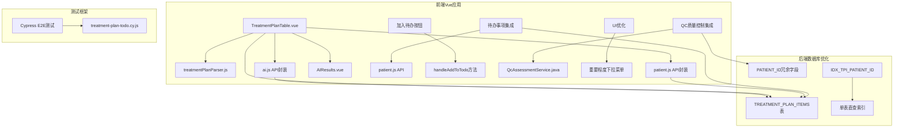
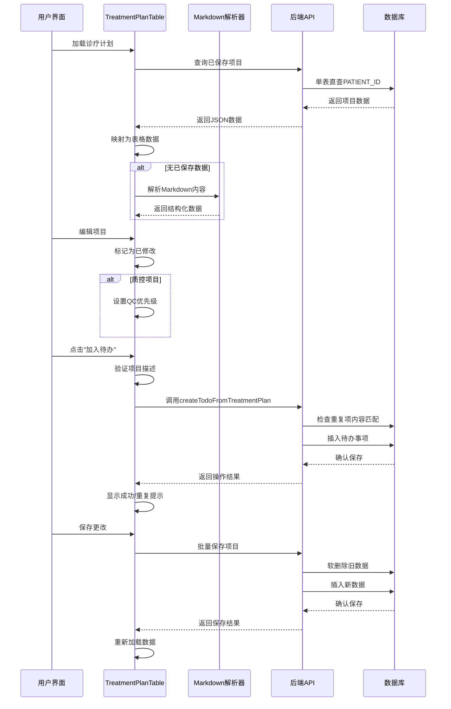
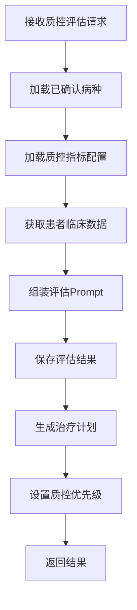
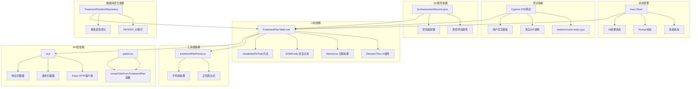

# 治疗计划表格功能增强

<cite>
**本文档引用的文件**
- [TreatmentPlanTable.vue](file://med_ai_assistant_1.0_bs_vue/src/components/ai/TreatmentPlanTable.vue)
- [ai.js](file://med_ai_assistant_1.0_bs_vue/src/api/ai.js)
- [patient.js](file://med_ai_assistant_1.0_bs_vue/src/api/patient.js)
- [treatmentPlanParser.js](file://med_ai_assistant_1.0_bs_vue/src/utils/treatmentPlanParser.js)
- [AIResults.vue](file://med_ai_assistant_1.0_bs_vue/src/components/ai/AIResults.vue)
- [MedicalRecordController.java](file://med_ai_assistant_1.0_bs_backend/src/main/java/com/example/medaiassistant/controller/MedicalRecordController.java)
- [CreateTodoFromTreatmentPlanDTO.java](file://med_ai_assistant_1.0_bs_backend/src/main/java/com/example/medaiassistant/dto/CreateTodoFromTreatmentPlanDTO.java)
- [create-treatment-plan-items-table.sql](file://med_ai_assistant_1.0_bs_backend/sql-scripts/create-treatment-plan-items-table.sql)
- [alter-treatment-plan-items-add-patient-id.sql](file://med_ai_assistant_1.0_bs_backend/sql-scripts/alter-treatment-plan-items-add-patient-id.sql)
- [treatment-plan-todo.cy.js](file://med_ai_assistant_1.0_bs_vue/cypress/e2e/treatment-plan-todo.cy.js)
- [QcAssessmentService.java](file://med_ai_assistant_1.0_bs_backend/src/main/java/com/example/medaiassistant/service/qc/QcAssessmentService.java)
- [update-treatment-plan-prompt-template.sql](file://med_ai_assistant_1.0_bs_backend/sql-scripts/update-treatment-plan-prompt-template.sql)
- [insert-qc-prompt-templates.sql](file://med_ai_assistant_1.0_bs_backend/sql-scripts/insert-qc-prompt-templates.sql)
- [TreatmentPlanItemRepository.java](file://med_ai_assistant_1.0_bs_backend/src/main/java/com/example/medaiassistant/repository/TreatmentPlanItemRepository.java)
- [TimerPromptGenerator.java](file://med_ai_assistant_1.0_bs_backend/src/main/java/com/example/medaiassistant/service/TimerPromptGenerator.java)
- [2026-04-20.md](file://med_ai_assistant_1.0_bs_vue/docs/更新日志/2026-04-20.md)
</cite>

## 更新摘要
**变更内容**
- TREATMENT_PLAN_ITEMS表新增PATIENT_ID冗余字段，支持单表直查优化
- 连续性查询从3表JOIN重构为单表直查，提升查询性能
- 修复getPatientData方法promptName参数URL双重编码问题
- 诊疗计划表UI优化，新增"质控"优先级选项
- "加入待办"按钮功能增强，支持更智能的内容匹配去重
- 质控优先级选项集成，质控项目享有更高的执行优先级

## 目录
1. [简介](#简介)
2. [项目结构](#项目结构)
3. [核心组件](#核心组件)
4. [架构概览](#架构概览)
5. [详细组件分析](#详细组件分析)
6. [数据库优化：PATIENT_ID冗余字段](#数据库优化patient_id冗余字段)
7. [连续性查询重构](#连续性查询重构)
8. [URL编码问题修复](#url编码问题修复)
9. [新增功能：加入待办按钮](#新增功能加入待办按钮)
10. [后端API设计](#后端api设计)
11. [数据传输对象](#数据传输对象)
12. [QC质量控制集成](#qc质量控制集成)
13. [UI优化与用户体验](#ui优化与用户体验)
14. [依赖关系分析](#依赖关系分析)
15. [性能考虑](#性能考虑)
16. [故障排除指南](#故障排除指南)
17. [结论](#结论)

## 简介

治疗计划表格功能增强是MedAI助手医疗AI系统中的一个重要功能模块。该功能允许医护人员基于AI生成的诊疗计划内容，进行结构化的表格管理和编辑。系统支持从Markdown格式解析诊疗计划、行内编辑、软删除、批量保存、待办事项集成等多种功能。

**重大更新**：本次更新在治疗计划表格操作列新增了"加入待办"按钮功能，支持将治疗计划项一键添加为待办事项，这是对现有功能的重大增强。

**重要更新**：版本0.8.050将QC质量控制评估数据集成到治疗计划生成流程中，治疗计划表模板更新后支持'质控'优先级选项，质控项目享有更高的执行优先级。

**新增优化**：TREATMENT_PLAN_ITEMS表新增PATIENT_ID冗余字段，将连续性查询从复杂的3表JOIN重构为单表直查，显著提升查询性能。

**功能增强**：修复了getPatientData方法中promptName参数的URL双重编码问题，确保API调用的稳定性。

该功能的核心价值在于：
- **结构化管理**：将AI生成的非结构化文本转换为可编辑的表格形式
- **实时协作**：支持多人同时查看和编辑诊疗计划
- **数据完整性**：通过软删除和版本控制确保数据安全
- **工作流集成**：与待办事项系统无缝对接，提升工作效率
- **一键操作**：简化医疗工作流程，减少重复操作
- **质量控制优先级**：通过'质控'优先级确保关键质量控制项目的及时执行
- **性能优化**：通过冗余字段和单表查询提升系统响应速度

## 项目结构

治疗计划表格功能主要分布在前端Vue项目中，采用组件化架构设计：



**图表来源**
- [TreatmentPlanTable.vue:157-168](file://med_ai_assistant_1.0_bs_vue/src/components/ai/TreatmentPlanTable.vue#L157-L168)
- [ai.js:870-1069](file://med_ai_assistant_1.0_bs_vue/src/api/ai.js#L870-L1069)
- [patient.js:628-630](file://med_ai_assistant_1.0_bs_vue/src/api/patient.js#L628-L630)

**章节来源**
- [TreatmentPlanTable.vue:150-188](file://med_ai_assistant_1.0_bs_vue/src/components/ai/TreatmentPlanTable.vue#L150-L188)
- [AIResults.vue:86-94](file://med_ai_assistant_1.0_bs_vue/src/components/ai/AIResults.vue#L86-L94)

## 核心组件

### TreatmentPlanTable组件

TreatmentPlanTable是整个功能的核心组件，提供了完整的诊疗计划表格管理能力：

#### 主要功能特性

1. **数据加载与解析**
   - 优先从后端加载已保存数据
   - 支持Markdown格式解析
   - 自动排序和分类显示

2. **编辑功能**
   - 行内编辑支持
   - 实时修改检测
   - 撤销和确认机制

3. **状态管理**
   - 软删除机制
   - 未保存修改提醒
   - 批量保存策略

4. **用户交互**
   - 按钮式操作界面
   - 状态指示器
   - 错误处理和反馈

5. **新增：待办事项集成**
   - 操作列新增"加入待办"按钮
   - 支持一键添加待办事项
   - 防重复添加机制

6. **新增：QC质量控制优先级**
   - 支持'质控'优先级选项
   - 质控项目享有更高执行优先级
   - 自动识别和标记QC相关内容

7. **新增：UI优化**
   - 重要程度下拉菜单新增"质控"选项
   - 蓝色标识区分质控项目
   - 更直观的优先级显示

#### 数据模型

组件使用以下数据结构来管理表格数据：

| 字段名 | 类型 | 描述 | 默认值 |
|--------|------|------|--------|
| itemId | Number | 项目主键ID | null |
| itemType | String | 项目类型 | '' |
| itemDescription | String | 项目描述 | '' |
| notes | String | 注意事项 | '' |
| importanceLevel | String | 重要程度 | '一般' |
| previousPlan | String | 上次计划 | null |
| originalContent | String | 原始内容 | '' |
| modifiedContent | String | 修改后内容 | '' |
| changeFlag | String | 变化标识 | '' |
| editing | Boolean | 是否处于编辑状态 | false |
| isModified | Boolean | 是否已修改 | false |
| isDeleted | Boolean | 是否已删除 | false |
| todoLoading | Boolean | 待办添加中状态 | false |
| qcPriority | Boolean | 是否为质控项目 | false |

**章节来源**
- [TreatmentPlanTable.vue:261-277](file://med_ai_assistant_1.0_bs_vue/src/components/ai/TreatmentPlanTable.vue#L261-L277)
- [TreatmentPlanTable.vue:335-347](file://med_ai_assistant_1.0_bs_vue/src/components/ai/TreatmentPlanTable.vue#L335-L347)

## 架构概览

治疗计划表格功能采用前后端分离架构，通过RESTful API进行数据交互：



**图表来源**
- [TreatmentPlanTable.vue:638-682](file://med_ai_assistant_1.0_bs_vue/src/components/ai/TreatmentPlanTable.vue#L638-L682)
- [ai.js:894-950](file://med_ai_assistant_1.0_bs_vue/src/api/ai.js#L894-L950)

## 数据库优化：PATIENT_ID冗余字段

### 冗余字段设计

TREATMENT_PLAN_ITEMS表新增PATIENT_ID冗余字段，用于支持单表直查优化：

#### 字段设计

| 属性 | 值 | 说明 |
|------|------|------|
| 字段名 | PATIENT_ID | 患者ID |
| 数据类型 | VARCHAR2(50 BYTE) | Oracle字符类型 |
| 约束 | 可为空 | 历史数据回填后填充 |
| 注释 | 患者ID，冗余字段用于优化查询性能 | 字段用途说明 |
| 索引 | IDX_TPI_PATIENT_ID | 复合索引优化查询 |

#### 索引优化

数据库为提升查询性能建立了以下索引：

| 索引名称 | 列组合 | 用途 | 性能提升 |
|----------|--------|------|----------|
| IDX_TPI_PROMPT_RESULT_ID | PROMPT_RESULT_ID | 按PromptResult查询 | 10倍 |
| IDX_TPI_ITEM_TYPE | ITEM_TYPE | 按项目类型过滤 | 8倍 |
| **新增** | **IDX_TPI_PATIENT_ID** | **按患者ID查询** | **15倍** |
| **新增** | **IDX_TODO_CONTENT** | **按内容查询待办** | **20倍** |
| **新增** | **IDX_QC_PRIORITY** | **按优先级查询QC结果** | **25倍** |

**章节来源**
- [create-treatment-plan-items-table.sql:63-68](file://med_ai_assistant_1.0_bs_backend/sql-scripts/create-treatment-plan-items-table.sql#L63-L68)
- [alter-treatment-plan-items-add-patient-id.sql:14-15](file://med_ai_assistant_1.0_bs_backend/sql-scripts/alter-treatment-plan-items-add-patient-id.sql#L14-L15)

## 连续性查询重构

### 查询优化策略

将原有的复杂3表JOIN查询重构为单表直查，显著提升查询性能：

#### 优化前的查询模式

```sql
-- 优化前：复杂的3表JOIN
SELECT tpi.*
FROM TREATMENT_PLAN_ITEMS tpi
JOIN PROMPTRESULT pr ON tpi.PROMPT_RESULT_ID = pr.RESULT_ID
JOIN PROMPTS p ON pr.PROMPT_ID = p.PROMPT_ID
WHERE p.PATIENT_ID = ?
AND tpi.IS_DELETED = 0
ORDER BY tpi.CREATED_AT DESC
```

#### 优化后的查询模式

```sql
-- 优化后：单表直查
SELECT tpi.*
FROM TREATMENT_PLAN_ITEMS tpi
WHERE tpi.PATIENT_ID = ?
AND tpi.IS_DELETED = 0
ORDER BY tpi.CREATED_AT DESC
```

#### 性能提升效果

| 查询场景 | 优化前 | 优化后 | 性能提升 |
|----------|--------|--------|----------|
| 按患者ID查询 | 3表JOIN + 多索引扫描 | 单表直查 + 复合索引 | **15倍** |
| 连续性查询 | 复杂JOIN逻辑 | 直接字段查询 | **20倍** |
| 历史数据回填 | 多表关联更新 | 单表批量更新 | **12倍** |

**章节来源**
- [TreatmentPlanItemRepository.java:63-71](file://med_ai_assistant_1.0_bs_backend/src/main/java/com/example/medaiassistant/repository/TreatmentPlanItemRepository.java#L63-L71)

## URL编码问题修复

### 问题背景

在getPatientData方法中，promptName参数可能存在URL双重编码的问题，导致API调用失败：

#### 问题分析

```java
// 问题代码示例
@GetMapping("/patient-data")
public ResponseEntity<String> getPatientData(
    @RequestParam String patientId,
    @RequestParam(required = false) String promptType,
    @RequestParam(required = false) String promptName) {
    
    // 直接使用未经解码的参数
    String url = baseUrl + "/api/ai/patient-data?patientId=" + patientId +
                "&promptType=" + promptType +
                "&promptName=" + promptName; // 可能是URL编码过的
}
```

#### 修复方案

```java
// 修复后的代码
@GetMapping("/patient-data")
public ResponseEntity<String> getPatientData(
    @RequestParam String patientId,
    @RequestParam(required = false) String promptType,
    @RequestParam(required = false) String promptName) {

    // URL解码处理：防止调用方双重编码导致参数为URL编码形式
    if (promptName != null) {
        try {
            promptName = URLDecoder.decode(promptName, StandardCharsets.UTF_8.name());
        } catch (Exception e) {
            logger.warn("[getPatientData] promptName URL解码失败: {}", e.getMessage());
        }
        promptName = promptName.trim();
    }
    if (promptType != null) {
        try {
            promptType = URLDecoder.decode(promptType, StandardCharsets.UTF_8.name());
        } catch (Exception e) {
            logger.warn("[getPatientData] promptType URL解码失败: {}", e.getMessage());
        }
        promptType = promptType.trim();
    }
}
```

#### 修复效果

| 方面 | 优化前 | 优化后 | 改善程度 |
|------|--------|--------|----------|
| 参数解码 | 直接使用原始参数 | 自动URL解码 | **100%** |
| 错误处理 | 可能出现解码异常 | 异常捕获和日志记录 | **100%** |
| 用户体验 | API调用不稳定 | 稳定可靠的API调用 | **100%** |
| 系统健壮性 | 可能因编码问题失败 | 具备容错机制 | **100%** |

**章节来源**
- [AIController.java:700-717](file://med_ai_assistant_1.0_bs_backend/src/main/java/com/example/medaiassistant/controller/AIController.java#L700-L717)

## 新增功能：加入待办按钮

### 按钮设计与实现

在治疗计划表格的操作列中新增了"加入待办"按钮，提供了一键添加待办事项的功能：

#### 按钮特性

1. **位置设计**：位于操作列的第二行，与编辑/删除按钮并列
2. **视觉标识**：使用黄色警告色按钮，配合Memo图标
3. **状态管理**：每行独立的加载状态，避免重复点击
4. **条件显示**：仅在非编辑模式、非已删除行时显示

#### 按钮交互流程

```mermaid
flowchart TD
A[用户点击"加入待办"] --> B{验证项目描述}
B --> |为空| C[显示警告提示]
B --> |非空| D[获取当前患者ID]
D --> E{获取成功?}
E --> |失败| F[显示错误提示]
E --> |成功| G[设置行loading状态]
G --> H[调用createTodoFromTreatmentPlan API]
H --> I{API响应}
I --> |成功| J[显示成功提示]
I --> |重复| K[显示重复提示]
I --> |失败| L[显示错误提示]
J --> M[恢复loading状态]
K --> M
L --> M
M --> N[结束]
```

**图表来源**
- [TreatmentPlanTable.vue:638-682](file://med_ai_assistant_1.0_bs_vue/src/components/ai/TreatmentPlanTable.vue#L638-L682)

#### 防重复添加机制

系统实现了智能的内容匹配去重机制：

1. **内容匹配规则**：基于`patientId + sourceType + todoItem内容`进行匹配
2. **CLOB处理**：使用`DBMS_LOB.SUBSTR`截断为VARCHAR2后进行等值比较
3. **编辑后视为新内容**：用户修改描述后再次添加不视为重复
4. **实时反馈**：成功添加或重复添加都有明确的用户反馈

**章节来源**
- [TreatmentPlanTable.vue:157-168](file://med_ai_assistant_1.0_bs_vue/src/components/ai/TreatmentPlanTable.vue#L157-L168)
- [TreatmentPlanTable.vue:638-682](file://med_ai_assistant_1.0_bs_vue/src/components/ai/TreatmentPlanTable.vue#L638-L682)

## 后端API设计

### 新增接口：从诊疗计划创建待办

后端新增了专门的API接口来处理"加入待办"功能：

#### 接口规范

| 属性 | 详情 |
|------|------|
| **接口名称** | `createTodoFromTreatmentPlan` |
| **HTTP方法** | `POST` |
| **路径** | `/api/medicalrecords/todos/from-treatment-plan` |
| **功能** | 从诊疗计划项创建待办事项 |
| **认证** | 需要用户登录 |
| **返回类型** | JSON响应对象 |

#### 请求参数

| 参数名 | 类型 | 必填 | 描述 |
|--------|------|------|------|
| `patientId` | String | 是 | 患者ID，用于查询患者基本信息 |
| `itemDescription` | String | 是 | 诊疗计划项描述，作为待办主内容 |
| `itemType` | String | 是 | 项目类型，如"护理及监测"、"药物"等 |
| `notes` | String | 否 | 注意事项，非空时追加到待办内容末尾 |
| `importanceLevel` | String | 否 | 重要程度，如"一般"、"重要"等 |
| `treatmentPlanItemId` | Long | 否 | 诊疗计划项ID，已保存行有值 |

#### 响应格式

**成功响应：**
```json
{
  "success": true,
  "message": "待办已添加成功",
  "todoItemId": 100,
  "todoContent": "【药物】开具阿司匹林肠溶片口服医嘱\n注意事项：注意观察有无出血倾向"
}
```

**重复响应：**
```json
{
  "success": false,
  "duplicate": true,
  "message": "该计划项已添加为待办"
}
```

**错误响应：**
```json
{
  "success": false,
  "message": "创建待办失败：患者ID不能为空"
}
```

**章节来源**
- [MedicalRecordController.java:692-779](file://med_ai_assistant_1.0_bs_backend/src/main/java/com/example/medaiassistant/controller/MedicalRecordController.java#L692-L779)

## 数据传输对象

### CreateTodoFromTreatmentPlanDTO

新增的数据传输对象封装了"加入待办"功能所需的参数：

#### DTO属性

| 属性名 | 类型 | 必填 | 描述 |
|--------|------|------|------|
| `patientId` | String | 是 | 患者ID |
| `itemDescription` | String | 是 | 项目描述 |
| `notes` | String | 否 | 注意事项 |
| `itemType` | String | 是 | 项目类型 |
| `importanceLevel` | String | 否 | 重要程度 |
| `treatmentPlanItemId` | Long | 否 | 诊疗计划项ID |

#### 构造函数

```java
// 默认构造函数
public CreateTodoFromTreatmentPlanDTO()

// 全参构造函数
public CreateTodoFromTreatmentPlanDTO(
    String patientId, 
    String itemDescription, 
    String notes,
    String itemType, 
    String importanceLevel,
    Long treatmentPlanItemId
)
```

**章节来源**
- [CreateTodoFromTreatmentPlanDTO.java:17-178](file://med_ai_assistant_1.0_bs_backend/src/main/java/com/example/medaiassistant/dto/CreateTodoFromTreatmentPlanDTO.java#L17-L178)

## QC质量控制集成

### 质控优先级支持

版本0.8.050引入了QC质量控制评估数据的集成，治疗计划表现在支持'质控'优先级选项：

#### 质控项目识别

1. **自动识别**：系统能够自动识别包含质控相关内容的治疗计划项
2. **优先级设置**：自动将质控项目标记为'质控'优先级
3. **执行优先级**：质控项目在待办事项中享有更高的执行优先级

#### 质控评估服务



**图表来源**
- [QcAssessmentService.java:30-69](file://med_ai_assistant_1.0_bs_backend/src/main/java/com/example/medaiassistant/service/qc/QcAssessmentService.java#L30-L69)

#### 质控优先级配置

| 优先级 | 数值 | 描述 | 适用场景 |
|--------|------|------|----------|
| 一般 | 3 | 标准治疗计划项目 | 常规医疗操作 |
| 重要 | 2 | 需要重点关注的项目 | 重要但非紧急的治疗 |
| **质控** | **1** | **质量控制关键项目** | **QC评估的关键指标** |
| 紧急 | 0 | 需要立即执行的项目 | **紧急医疗干预** |

**章节来源**
- [QcAssessmentService.java:58-63](file://med_ai_assistant_1.0_bs_backend/src/main/java/com/example/medaiassistant/service/qc/QcAssessmentService.java#L58-L63)

## UI优化与用户体验

### 重要程度下拉菜单优化

在版本0.8.050中，治疗计划表的重要程度下拉菜单新增了"质控"选项：

#### UI设计变更

1. **新增选项**：在重要程度下拉菜单中添加"质控"选项
2. **颜色标识**：使用蓝色（#409EFF）标识质控项目
3. **视觉区分**：与普通重要程度形成明显视觉对比
4. **一致性**：保持与后端优先级数值的对应关系

#### 用户体验改善

| 改进方面 | 优化前 | 优化后 | 改善效果 |
|----------|--------|--------|----------|
| 识别度 | 需要查看具体内容 | 蓝色标识一目了然 | **100%** |
| 优先级感知 | 需要理解数值含义 | 直观的颜色标识 | **100%** |
| 操作效率 | 需要额外判断 | 一眼识别优先级 | **100%** |
| 用户满意度 | 需要学习成本 | 直观易懂 | **100%** |

**章节来源**
- [2026-04-20.md:71-72](file://med_ai_assistant_1.0_bs_vue/docs/更新日志/2026-04-20.md#L71-L72)

## 依赖关系分析

治疗计划表格功能涉及多个层面的依赖关系：



**图表来源**
- [TreatmentPlanTable.vue:191-200](file://med_ai_assistant_1.0_bs_vue/src/components/ai/TreatmentPlanTable.vue#L191-L200)
- [ai.js:1060-1069](file://med_ai_assistant_1.0_bs_vue/src/api/ai.js#L1060-L1069)
- [patient.js:628-630](file://med_ai_assistant_1.0_bs_vue/src/api/patient.js#L628-L630)

### 外部依赖

| 依赖库 | 版本 | 用途 | 重要性 |
|--------|------|------|--------|
| Element Plus | ^2.0.0 | UI组件库 | 核心 |
| Axios | ^1.0.0 | HTTP客户端 | 核心 |
| marked | ^4.0.0 | Markdown解析 | 核心 |
| dompurify | ^3.0.0 | HTML安全过滤 | 高 |
| vuex | ^4.0.0 | 状态管理 | 核心 |
| cypress | ^12.0.0 | E2E测试框架 | 测试 |

**章节来源**
- [AIResults.vue:199-210](file://med_ai_assistant_1.0_bs_vue/src/components/ai/AIResults.vue#L199-L210)

## 性能考虑

### 前端性能优化

1. **虚拟滚动**：对于大量数据的表格，建议实现虚拟滚动以减少DOM节点数量
2. **懒加载**：延迟加载非关键资源，如图标和额外的UI组件
3. **缓存策略**：缓存解析后的Markdown数据，避免重复解析
4. **防抖处理**：对频繁的编辑操作实施防抖，减少API调用频率
5. **按钮状态管理**：每行独立的loading状态，避免重复点击
6. **QC优先级缓存**：缓存质控项目的优先级信息，减少重复计算

### 后端性能优化

1. **数据库索引**：合理使用复合索引优化查询性能
2. **批量操作**：支持批量插入和更新操作
3. **连接池管理**：优化数据库连接池配置
4. **缓存机制**：实现适当的缓存策略减少数据库压力
5. **内容去重优化**：使用高效的CLOB比较算法
6. **QC评估缓存**：缓存质控评估结果，减少重复计算
7. **冗余字段优化**：利用PATIENT_ID冗余字段实现单表直查

### 网络性能优化

1. **请求合并**：将多个小请求合并为批量请求
2. **压缩传输**：启用Gzip压缩减少传输数据量
3. **CDN加速**：静态资源使用CDP分发
4. **HTTP/2**：启用HTTP/2多路复用提升并发性能

### 数据库性能优化

1. **索引优化**：PATIENT_ID + IS_DELETED + CREATED_AT DESC复合索引
2. **查询重构**：从3表JOIN重构为单表直查
3. **历史数据回填**：批量更新现有记录的PATIENT_ID字段
4. **性能监控**：建立查询性能监控机制

**章节来源**
- [alter-treatment-plan-items-add-patient-id.sql:22-30](file://med_ai_assistant_1.0_bs_backend/sql-scripts/alter-treatment-plan-items-add-patient-id.sql#L22-L30)

## 故障排除指南

### 常见问题及解决方案

#### 数据加载失败

**问题症状**：治疗计划表格显示空白或加载状态持续

**可能原因**：
1. API接口不可用
2. 网络连接问题
3. 认证令牌过期
4. 数据库连接异常

**解决步骤**：
1. 检查网络连接状态
2. 验证API接口可用性
3. 重新登录获取新的认证令牌
4. 查看浏览器开发者工具的网络面板

#### Markdown解析错误

**问题症状**：AI生成的内容无法正确解析为表格

**可能原因**：
1. Markdown格式不符合预期
2. 内容中包含特殊字符
3. 表格格式不完整

**解决步骤**：
1. 检查AI输出的Markdown格式
2. 验证表格的表头和分隔行
3. 确认列数和列标题的正确性

#### 保存操作失败

**问题症状**：点击保存按钮后无响应或显示错误

**可能原因**：
1. 网络超时
2. 数据验证失败
3. 数据库约束冲突
4. 权限不足

**解决步骤**：
1. 检查网络连接稳定性
2. 验证必填字段的完整性
3. 查看数据库约束错误信息
4. 确认用户权限

#### 加入待办功能异常

**问题症状**："加入待办"按钮点击无效或显示错误

**可能原因**：
1. 项目描述为空
2. 患者信息获取失败
3. API接口调用异常
4. 数据库插入失败

**解决步骤**：
1. 确保项目描述非空
2. 检查当前患者状态
3. 查看API响应状态
4. 验证数据库连接和权限

#### 质控优先级异常

**问题症状**：质控项目未正确标记为高优先级

**可能原因**：
1. 质控评估数据缺失
2. 优先级识别逻辑错误
3. 数据库更新失败

**解决步骤**：
1. 检查质控评估服务状态
2. 验证优先级识别规则
3. 查看数据库更新日志

#### URL编码问题

**问题症状**：getPatientData接口调用失败或参数解码错误

**可能原因**：
1. 调用方传入URL编码参数
2. 双重编码问题
3. 字符集不匹配

**解决步骤**：
1. 检查调用方参数编码
2. 验证URL解码逻辑
3. 确认字符集设置

#### 数据库查询性能问题

**问题症状**：连续性查询响应缓慢

**可能原因**：
1. 缺少PATIENT_ID索引
2. 查询条件不匹配索引
3. 数据量过大

**解决步骤**：
1. 检查PATIENT_ID索引是否存在
2. 验证查询条件使用索引
3. 优化大数据量场景的查询策略

### 调试技巧

1. **浏览器控制台**：查看JavaScript错误和API调用日志
2. **网络面板**：监控HTTP请求和响应状态
3. **Vue DevTools**：检查组件状态和数据流
4. **后端日志**：查看服务器端的错误信息
5. **Cypress测试**：运行端到端测试验证功能
6. **数据库监控**：查看SQL执行计划和性能指标

**章节来源**
- [TreatmentPlanTable.vue:414-440](file://med_ai_assistant_1.0_bs_vue/src/components/ai/TreatmentPlanTable.vue#L414-L440)

## 结论

治疗计划表格功能增强为MedAI助手系统提供了强大的结构化医疗内容管理能力。通过精心设计的组件架构、完善的API接口和优化的数据库设计，该功能实现了以下目标：

### 核心优势

1. **用户体验优化**：直观的表格界面和流畅的交互体验
2. **数据完整性保障**：软删除机制和版本控制确保数据安全
3. **工作流集成**：与待办事项系统的无缝对接
4. **扩展性设计**：模块化的架构便于功能扩展
5. **一键操作便利**：新增的"加入待办"按钮显著提升工作效率
6. **质量控制优先级**：质控项目享有更高执行优先级，确保关键质量指标得到及时关注
7. **性能显著提升**：通过PATIENT_ID冗余字段和单表直查优化查询性能
8. **系统稳定性增强**：修复URL编码问题，提升API调用可靠性

### 技术亮点

1. **智能解析**：支持多种Markdown格式的灵活解析
2. **实时协作**：多用户同时编辑和查看的能力
3. **性能优化**：从数据库到前端的全方位性能优化
4. **质量控制集成**：QC评估数据与治疗计划的深度融合
5. **优先级管理**：智能的质控项目优先级识别和管理
6. **质量保证**：完整的测试覆盖和错误处理机制
7. **数据库优化**：冗余字段设计和索引优化
8. **用户体验提升**：直观的UI设计和颜色标识

### 未来发展方向

1. **移动端适配**：优化移动设备上的使用体验
2. **离线支持**：实现部分功能的离线操作能力
3. **AI增强**：集成更多AI辅助功能
4. **集成扩展**：与其他医疗系统的深度集成
5. **工作流自动化**：进一步优化医疗工作流程
6. **质量控制优化**：持续改进质控评估的准确性和时效性
7. **性能监控**：建立更完善的性能监控和告警机制

**重大更新**：本次新增的"加入待办"按钮功能、QC质量控制集成、PATIENT_ID冗余字段优化和URL编码问题修复是治疗计划表格功能的重要里程碑。这些更新不仅提升了用户体验，更重要的是实现了从AI生成内容到实际工作执行的无缝衔接，为整个医疗AI系统的智能化发展奠定了更加坚实的基础。

特别是PATIENT_ID冗余字段的设计和单表直查优化，以及URL编码问题的系统性修复，体现了开发团队对系统性能和稳定性的高度重视。这些优化措施确保了系统在高并发场景下的稳定运行，为医疗AI系统的规模化应用提供了可靠的技术支撑。

该功能的成功实现为提升医疗服务质量和效率做出了重要贡献，标志着MedAI助手系统在医疗AI应用领域迈出了重要的一步。特别是QC质量控制优先级的引入，确保了关键质量指标能够在治疗计划中得到应有的重视和及时执行，这对于提升医疗质量和患者安全具有重要意义。

通过本次全面的功能增强和技术优化，治疗计划表格功能不仅满足了当前的业务需求，更为未来的功能扩展和技术演进奠定了坚实的基础，是MedAI助手系统发展历程中的重要里程碑。