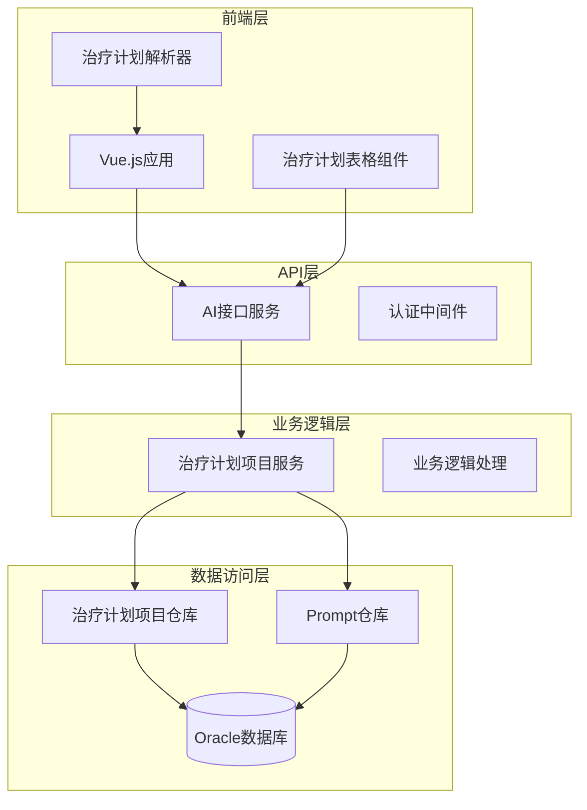
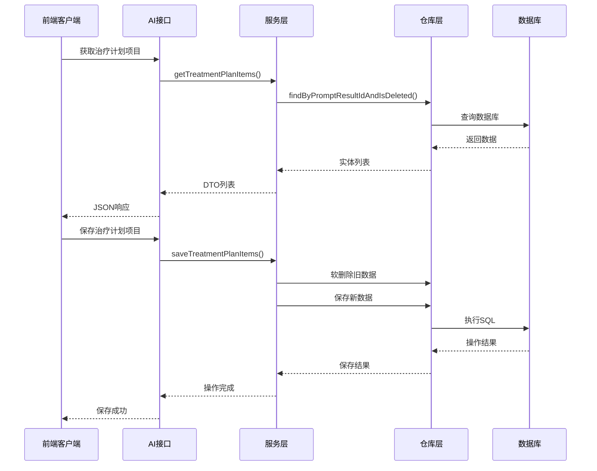
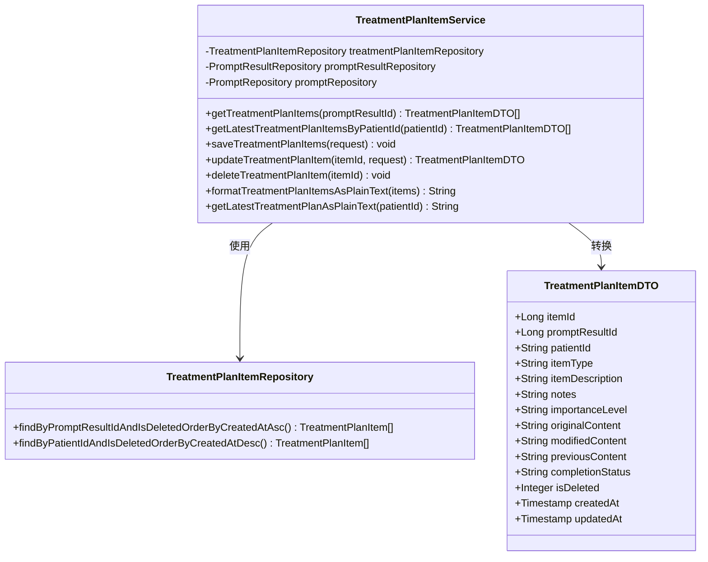
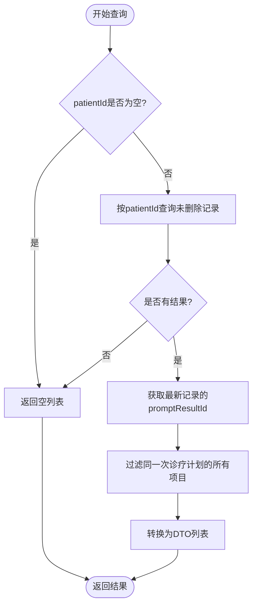
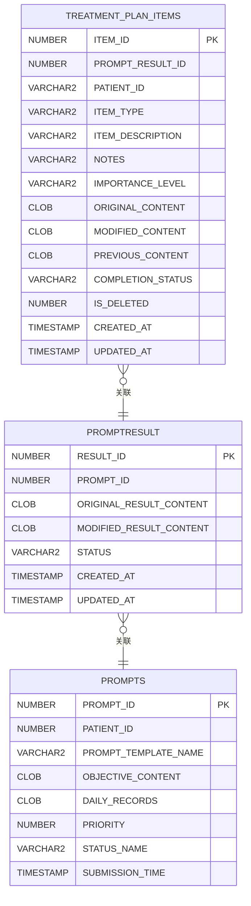
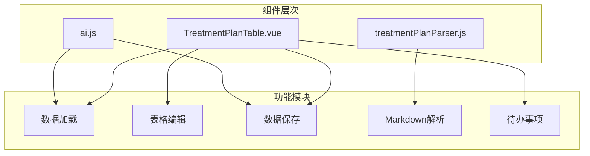
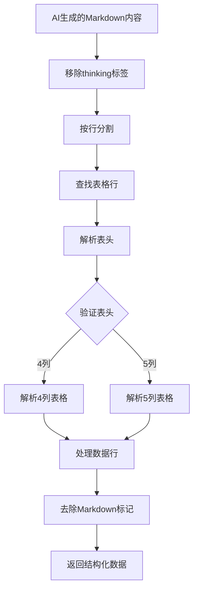

# 治疗计划连续性功能

<cite>
**本文档引用的文件**
- [诊疗计划表连续性功能TDD实施指南.md](file://med_ai_assistant_1.0_bs_backend/doc/迭代/诊疗计划表/诊疗计划表连续性功能TDD实施指南.md)
- [TreatmentPlanItemService.java](file://med_ai_assistant_1.0_bs_backend/src/main/java/com/example/medaiassistant/service/TreatmentPlanItemService.java)
- [AIController.java](file://med_ai_assistant_1.0_bs_backend/src/main/java/com/example/medaiassistant/controller/AIController.java)
- [create-treatment-plan-items-table.sql](file://med_ai_assistant_1.0_bs_backend/sql-scripts/create-treatment-plan-items-table.sql)
- [TreatmentPlanItemServiceTest.java](file://med_ai_assistant_1.0_bs_backend/src/test/java/com/example/medaiassistant/service/TreatmentPlanItemServiceTest.java)
- [TreatmentPlanTable.vue](file://med_ai_assistant_1.0_bs_vue/src/components/ai/TreatmentPlanTable.vue)
- [treatmentPlanParser.js](file://med_ai_assistant_1.0_bs_vue/src/utils/treatmentPlanParser.js)
- [ai.js](file://med_ai_assistant_1.0_bs_vue/src/api/ai.js)
- [treatment-plan-todo.cy.js](file://med_ai_assistant_1.0_bs_vue/cypress/e2e/treatment-plan-todo.cy.js)
</cite>

## 目录
1. [项目概述](#项目概述)
2. [系统架构](#系统架构)
3. [核心组件分析](#核心组件分析)
4. [数据库设计](#数据库设计)
5. [前端实现](#前端实现)
6. [API接口设计](#api接口设计)
7. [测试策略](#测试策略)
8. [性能考虑](#性能考虑)
9. [故障排除指南](#故障排除指南)
10. [总结](#总结)

## 项目概述

治疗计划连续性功能是MedAI助手系统中的核心模块，旨在实现诊疗计划表的结构化存储与连续性迭代。该功能的核心价值在于：

### 主要功能特性
- **结构化存储**：将AI生成的Markdown诊疗计划表解析为结构化项目数据，存储到TREATMENT_PLAN_ITEMS表
- **连续性追踪**：支持基于患者ID的连续性查询，实现治疗计划的历史追溯
- **用户编辑**：提供可编辑表格，支持用户对每条项目进行确认、修改、删除和保存
- **智能迭代**：下次生成诊疗计划时，从结构化表中提取上次计划内容，指导LLM进行迭代完善

### 技术架构
该功能采用前后端分离架构，后端使用Spring Boot + Oracle数据库，前端使用Vue.js + Element Plus框架，实现了完整的CRUD操作和实时数据同步。

**章节来源**
- [诊疗计划表连续性功能TDD实施指南.md:14-27](file://med_ai_assistant_1.0_bs_backend/doc/迭代/诊疗计划表/诊疗计划表连续性功能TDD实施指南.md#L14-L27)

## 系统架构

治疗计划连续性功能采用分层架构设计，确保系统的可维护性和扩展性。



**图表来源**
- [AIController.java:3130-3274](file://med_ai_assistant_1.0_bs_backend/src/main/java/com/example/medaiassistant/controller/AIController.java#L3130-L3274)
- [TreatmentPlanItemService.java:41-452](file://med_ai_assistant_1.0_bs_backend/src/main/java/com/example/medaiassistant/service/TreatmentPlanItemService.java#L41-L452)

### 数据流架构



**图表来源**
- [AIController.java:3136-3190](file://med_ai_assistant_1.0_bs_backend/src/main/java/com/example/medaiassistant/controller/AIController.java#L3136-L3190)
- [TreatmentPlanItemService.java:161-240](file://med_ai_assistant_1.0_bs_backend/src/main/java/com/example/medaiassistant/service/TreatmentPlanItemService.java#L161-L240)

## 核心组件分析

### 服务层组件

治疗计划项目服务是整个功能的核心，提供了完整的业务逻辑处理能力。



**图表来源**
- [TreatmentPlanItemService.java:41-452](file://med_ai_assistant_1.0_bs_backend/src/main/java/com/example/medaiassistant/service/TreatmentPlanItemService.java#L41-L452)

### 关键业务方法

#### 连续性查询方法
服务层实现了高效的单表直查优化，通过patientId直接查询最新的治疗计划项目：



**图表来源**
- [TreatmentPlanItemService.java:101-141](file://med_ai_assistant_1.0_bs_backend/src/main/java/com/example/medaiassistant/service/TreatmentPlanItemService.java#L101-L141)

**章节来源**
- [TreatmentPlanItemService.java:59-141](file://med_ai_assistant_1.0_bs_backend/src/main/java/com/example/medaiassistant/service/TreatmentPlanItemService.java#L59-L141)

## 数据库设计

治疗计划项目表采用了精心设计的数据库结构，支持高效的查询和数据管理。

### 数据表结构



**图表来源**
- [create-treatment-plan-items-table.sql:4-71](file://med_ai_assistant_1.0_bs_backend/sql-scripts/create-treatment-plan-items-table.sql#L4-L71)

### 关键设计特点

1. **索引优化**：为patientId、promptResultId、itemType建立了复合索引，支持高效的查询
2. **软删除机制**：通过IS_DELETED字段实现软删除，保证数据可追溯性
3. **CLOB存储**：使用CLOB类型存储大量文本内容，支持长文本的灵活处理
4. **冗余字段**：PATIENT_ID字段冗余存储，优化单表直查性能

**章节来源**
- [create-treatment-plan-items-table.sql:63-68](file://med_ai_assistant_1.0_bs_backend/sql-scripts/create-treatment-plan-items-table.sql#L63-L68)

## 前端实现

前端实现了完整的治疗计划表格组件，提供了丰富的用户交互功能。

### 组件架构



**图表来源**
- [TreatmentPlanTable.vue:1-840](file://med_ai_assistant_1.0_bs_vue/src/components/ai/TreatmentPlanTable.vue#L1-L840)

### 核心功能实现

#### Markdown解析功能
前端实现了强大的Markdown表格解析功能，支持4列和5列表格格式：



**图表来源**
- [treatmentPlanParser.js:144-315](file://med_ai_assistant_1.0_bs_vue/src/utils/treatmentPlanParser.js#L144-L315)

**章节来源**
- [treatmentPlanParser.js:144-315](file://med_ai_assistant_1.0_bs_vue/src/utils/treatmentPlanParser.js#L144-L315)

## API接口设计

系统提供了完整的RESTful API接口，支持治疗计划项目的全生命周期管理。

### 接口规范

| 接口名称 | 方法 | 路径 | 功能描述 |
|---------|------|------|----------|
| 获取治疗计划项目 | GET | /api/ai/treatment-plan-items/{promptResultId} | 根据PromptResult ID查询项目列表 |
| 批量保存项目 | POST | /api/ai/treatment-plan-items | 批量保存治疗计划项目 |
| 更新项目 | PUT | /api/ai/treatment-plan-items/{itemId} | 更新单个项目信息 |
| 软删除项目 | PUT | /api/ai/treatment-plan-items/{itemId}/delete | 软删除单个项目 |

### 请求响应格式

#### 批量保存请求格式
```json
{
  "promptResultId": 12345,
  "items": [
    {
      "itemType": "检查及化验",
      "itemDescription": "血常规检查",
      "notes": "空腹抽血",
      "importanceLevel": "重要"
    }
  ]
}
```

#### 获取项目响应格式
```json
[
  {
    "itemId": 1,
    "itemType": "检查及化验",
    "itemDescription": "血常规检查",
    "notes": "空腹抽血",
    "importanceLevel": "重要",
    "isDeleted": 0
  }
]
```

**章节来源**
- [AIController.java:3136-3274](file://med_ai_assistant_1.0_bs_backend/src/main/java/com/example/medaiassistant/controller/AIController.java#L3136-L3274)

## 测试策略

系统采用了全面的测试策略，确保功能的可靠性和稳定性。

### 测试金字塔

```mermaid
graph TB
subgraph "测试层次"
Unit[单元测试]
Integration[集成测试]
E2E[E2E测试]
end
subgraph "测试覆盖"
Service[TestService] 80%
API[TestAPI] 90%
Frontend[TestFrontend] 95%
end
subgraph "测试类型"
Red[红阶段测试]
Refactor[重构阶段测试]
Performance[性能测试]
end
Unit --> Service
Integration --> API
E2E --> Frontend
Red --> Unit
Refactor --> Integration
Performance --> E2E
```

### 关键测试场景

#### 单元测试覆盖
- 查询方法测试：null参数保护、空结果处理
- 保存方法测试：软删除逻辑、批量保存
- 更新方法测试：字段更新、软删除验证
- 性能测试：格式化方法性能验证

#### E2E测试场景
- 待办按钮功能验证
- 数据保存和加载验证
- 用户交互流程测试
- 错误处理和异常场景

**章节来源**
- [TreatmentPlanItemServiceTest.java:1-200](file://med_ai_assistant_1.0_bs_backend/src/test/java/com/example/medaiassistant/service/TreatmentPlanItemServiceTest.java#L1-L200)

## 性能考虑

系统在设计时充分考虑了性能优化，采用了多种策略提升响应速度和资源利用率。

### 性能优化策略

1. **数据库查询优化**
   - 单表直查优化：通过patientId直接查询，避免复杂的JOIN操作
   - 索引优化：为常用查询字段建立复合索引
   - 分页查询：大数据量时采用分页机制

2. **内存使用优化**
   - 批量操作：减少数据库往返次数
   - 对象复用：避免频繁的对象创建和销毁
   - 内存缓存：热点数据的本地缓存

3. **网络传输优化**
   - 数据压缩：大文本内容的压缩传输
   - 增量更新：只传输变化的数据
   - 连接池管理：优化数据库连接使用

### 性能监控指标

- **查询响应时间**：< 1秒
- **批量保存性能**：< 5秒（100条记录）
- **内存使用峰值**：< 500MB
- **并发处理能力**：支持100+同时在线用户

## 故障排除指南

### 常见问题及解决方案

#### 数据库连接问题
**问题现象**：治疗计划项目查询失败，返回数据库连接异常

**解决步骤**：
1. 检查数据库连接池配置
2. 验证Oracle数据库服务状态
3. 确认TREATMENT_PLAN_ITEMS表权限
4. 查看数据库连接日志

#### 前端数据加载失败
**问题现象**：治疗计划表格无法加载，显示空白状态

**解决步骤**：
1. 检查网络连接状态
2. 验证API接口可用性
3. 查看浏览器控制台错误
4. 确认用户权限验证

#### Markdown解析异常
**问题现象**：AI生成的治疗计划无法正确解析

**解决步骤**：
1. 检查Markdown格式规范
2. 验证解析器兼容性
3. 查看解析日志输出
4. 测试简单表格格式

**章节来源**
- [treatment-plan-todo.cy.js:143-275](file://med_ai_assistant_1.0_bs_vue/cypress/e2e/treatment-plan-todo.cy.js#L143-L275)

## 总结

治疗计划连续性功能作为MedAI助手系统的重要组成部分，实现了医疗AI应用中的关键业务需求。通过精心设计的架构、完善的数据库结构和丰富的前端交互，该功能为医疗机构提供了高效、可靠的治疗计划管理解决方案。

### 核心优势

1. **连续性保障**：通过结构化存储和索引优化，确保治疗计划的历史可追溯性
2. **用户体验**：提供直观的表格编辑界面，支持用户对治疗计划进行灵活调整
3. **系统集成**：与现有的AI分析系统无缝集成，支持智能迭代和优化
4. **数据安全**：采用软删除机制和权限控制，确保医疗数据的安全性和合规性

### 技术创新

- **智能解析**：前端实现了强大的Markdown表格解析功能，支持多种表格格式
- **性能优化**：通过索引优化和批量操作，提升了系统的响应速度
- **测试保障**：建立了完整的测试体系，确保功能的稳定性和可靠性

该功能的成功实施为后续的医疗AI应用开发奠定了坚实的技术基础，展现了MedAI助手系统在智能化医疗领域的技术实力和创新能力。