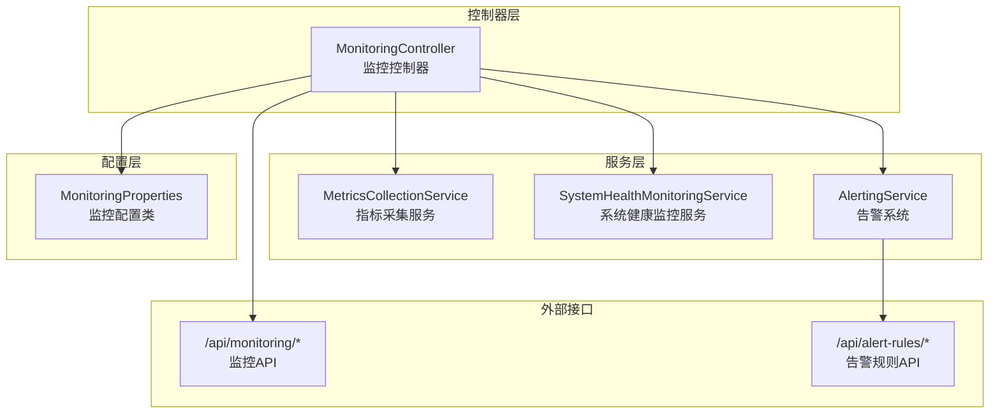
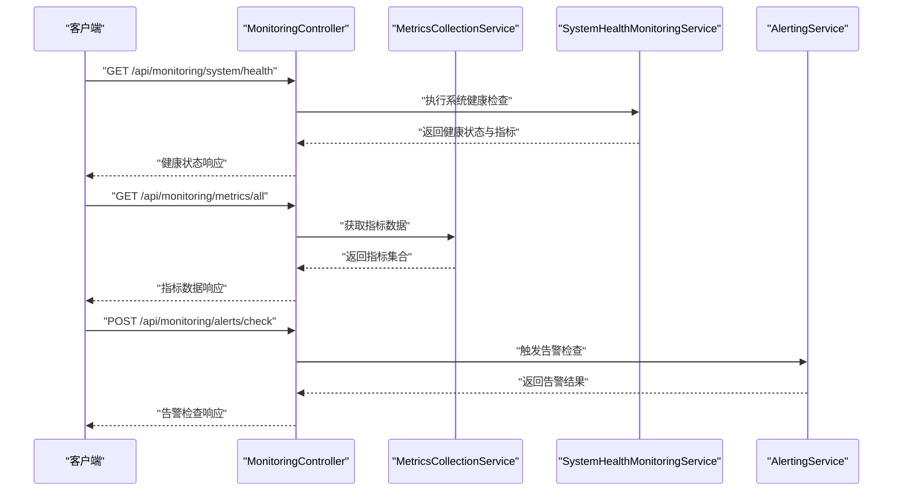
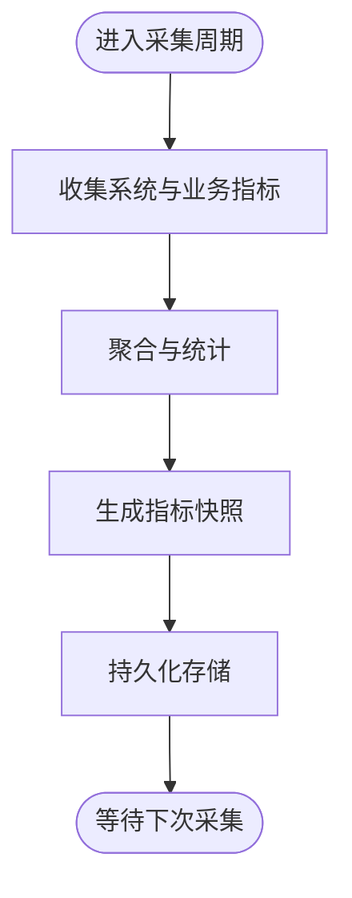
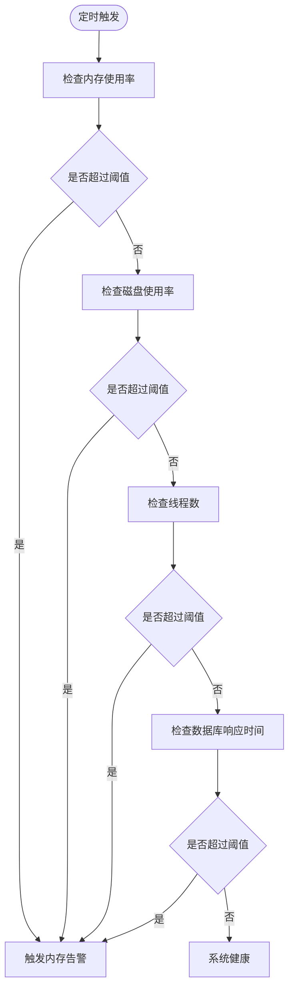
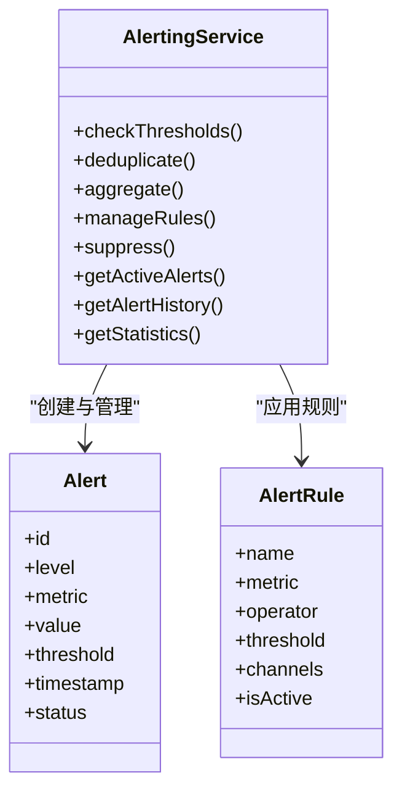
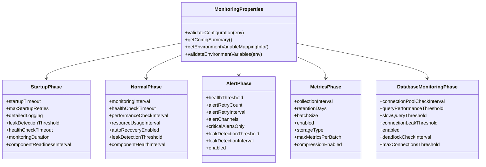
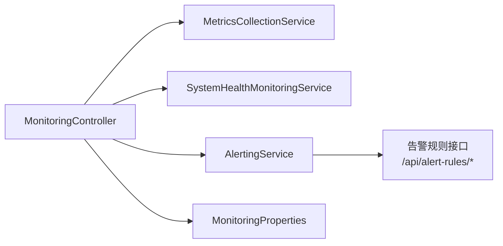

# 监控告警系统

<cite>
**本文引用的文件**
- [迭代4完成总结_监控和可观测性.md](file://med_ai_assistant_1.0_bs_backend/doc/其他/迭代4完成总结_监控和可观测性.md)
- [API_ALERT_RULES.md](file://med_ai_assistant_1.0_bs_backend/doc/其他/API_ALERT_RULES.md)
- [MonitoringProperties监控配置接口文档.md](file://med_ai_assistant_1.0_bs_backend/doc/接口/详细接口文档/MonitoringProperties监控配置接口文档.md)
- [MetricsCollectionService.java](file://med_ai_assistant_1.0_bs_backend/src/main/java/com/example/medaiassistant/service/MetricsCollectionService.java)
- [SystemHealthMonitoringService.java](file://med_ai_assistant_1.0_bs_backend/src/main/java/com/example/medaiassistant/service/SystemHealthMonitoringService.java)
- [AlertingService.java](file://med_ai_assistant_1.0_bs_backend/src/main/java/com/example/medaiassistant/service/AlertingService.java)
- [MonitoringController.java](file://med_ai_assistant_1.0_bs_backend/src/main/java/com/example/medaiassistant/controller/MonitoringController.java)
</cite>

## 目录
1. [简介](#简介)
2. [项目结构](#项目结构)
3. [核心组件](#核心组件)
4. [架构总览](#架构总览)
5. [详细组件分析](#详细组件分析)
6. [依赖分析](#依赖分析)
7. [性能考虑](#性能考虑)
8. [故障排查指南](#故障排查指南)
9. [结论](#结论)
10. [附录](#附录)

## 简介
本文件面向“监控告警系统”的综合文档，围绕系统健康监控、性能指标收集、告警规则配置与通知机制展开，结合仓库中现有的监控配置接口文档、告警规则接口文档以及迭代总结文档，系统梳理监控数据采集方式、存储策略、可视化展示、告警级别与触发条件、通知渠道与处理流程，并提供监控仪表板使用、故障预警与性能分析的实用建议及最佳实践。

## 项目结构
该代码库包含后端监控与可观测性相关的核心实现与文档，涵盖指标采集、系统健康监控、业务指标监控、告警系统、监控控制器以及统一的监控配置管理。整体采用分层架构：控制器层提供REST API，服务层承载监控与告警业务逻辑，配置层提供统一的监控参数管理与环境变量映射。

**图示来源**
- [MonitoringController.java](file://med_ai_assistant_1.0_bs_backend/src/main/java/com/example/medaiassistant/controller/MonitoringController.java)
- [MetricsCollectionService.java](file://med_ai_assistant_1.0_bs_backend/src/main/java/com/example/medaiassistant/service/MetricsCollectionService.java)
- [SystemHealthMonitoringService.java](file://med_ai_assistant_1.0_bs_backend/src/main/java/com/example/medaiassistant/service/SystemHealthMonitoringService.java)
- [AlertingService.java](file://med_ai_assistant_1.0_bs_backend/src/main/java/com/example/medaiassistant/service/AlertingService.java)
- [MonitoringProperties监控配置接口文档.md](file://med_ai_assistant_1.0_bs_backend/doc/接口/详细接口文档/MonitoringProperties监控配置接口文档.md)

**章节来源**
- [迭代4完成总结_监控和可观测性.md](file://med_ai_assistant_1.0_bs_backend/doc/其他/迭代4完成总结_监控和可观测性.md#L1-L275)
- [MonitoringProperties监控配置接口文档.md](file://med_ai_assistant_1.0_bs_backend/doc/接口/详细接口文档/MonitoringProperties监控配置接口文档.md#L1-L535)

## 核心组件
- 指标采集服务：负责系统级与业务级指标的收集、聚合与快照管理，支撑健康检查与性能分析。
- 系统健康监控服务：定期执行系统健康检查，包含内存、磁盘、线程、数据库连接池等关键阈值监控。
- 业务指标监控服务：聚焦业务KPI与性能趋势，提供吞吐量、响应时间、成功率与可用性等指标。
- 告警系统：基于阈值触发与规则管理，支持告警去重、聚合、级别分类与历史统计。
- 监控控制器：对外提供统一的监控查询、配置管理、告警管理与性能分析API。
- 监控配置：统一的配置类与API，支持启动阶段、运行阶段、告警、指标、数据库五个维度的参数管理与环境变量映射。

**章节来源**
- [迭代4完成总结_监控和可观测性.md](file://med_ai_assistant_1.0_bs_backend/doc/其他/迭代4完成总结_监控和可观测性.md#L28-L91)
- [MonitoringProperties监控配置接口文档.md](file://med_ai_assistant_1.0_bs_backend/doc/接口/详细接口文档/MonitoringProperties监控配置接口文档.md#L8-L23)

## 架构总览
监控系统采用“控制器-服务-配置”三层结构，控制器统一暴露REST API，服务层实现具体监控与告警逻辑，配置层提供参数化与环境变量支持。系统通过定时任务与事件驱动相结合的方式，实现指标采集、健康检查与告警触发的闭环。

**图示来源**
- [MonitoringController.java](file://med_ai_assistant_1.0_bs_backend/src/main/java/com/example/medaiassistant/controller/MonitoringController.java)
- [MetricsCollectionService.java](file://med_ai_assistant_1.0_bs_backend/src/main/java/com/example/medaiassistant/service/MetricsCollectionService.java)
- [SystemHealthMonitoringService.java](file://med_ai_assistant_1.0_bs_backend/src/main/java/com/example/medaiassistant/service/SystemHealthMonitoringService.java)
- [AlertingService.java](file://med_ai_assistant_1.0_bs_backend/src/main/java/com/example/medaiassistant/service/AlertingService.java)

## 详细组件分析

### 指标采集服务（MetricsCollectionService）
职责与能力
- 系统级指标：JVM内存、线程、垃圾回收等。
- 业务指标：Prompt执行、状态转换、异步处理性能等。
- 指标管理：自定义指标注册、聚合统计、快照与历史记录。
- 数据组织：支持指标快照查询与批量持久化。

性能与复杂度
- 采集频率由配置决定，典型周期为数秒至数分钟。
- 快照与历史记录支持按天/周/月维度查询，便于趋势分析。

**图示来源**
- [MetricsCollectionService.java](file://med_ai_assistant_1.0_bs_backend/src/main/java/com/example/medaiassistant/service/MetricsCollectionService.java)
- [迭代4完成总结_监控和可观测性.md](file://med_ai_assistant_1.0_bs_backend/doc/其他/迭代4完成总结_监控和可观测性.md#L28-L42)

**章节来源**
- [迭代4完成总结_监控和可观测性.md](file://med_ai_assistant_1.0_bs_backend/doc/其他/迭代4完成总结_监控和可观测性.md#L28-L42)

### 系统健康监控服务（SystemHealthMonitoringService）
职责与能力
- 定期健康检查（如每分钟一次），覆盖内存、磁盘、线程、数据库连接池与响应时间。
- 阈值管理：内存使用率、磁盘使用率、线程数、数据库响应时间等阈值可配置。
- 健康状态评估：基于阈值判断系统健康等级，触发相应告警。

阈值与级别
- 内存使用率阈值：85%
- 磁盘使用率阈值：90%
- 线程数阈值：500
- 数据库响应时间阈值：5秒
- 垃圾回收开销监控

**图示来源**
- [SystemHealthMonitoringService.java](file://med_ai_assistant_1.0_bs_backend/src/main/java/com/example/medaiassistant/service/SystemHealthMonitoringService.java)
- [迭代4完成总结_监控和可观测性.md](file://med_ai_assistant_1.0_bs_backend/doc/其他/迭代4完成总结_监控和可观测性.md#L43-L57)

**章节来源**
- [迭代4完成总结_监控和可观测性.md](file://med_ai_assistant_1.0_bs_backend/doc/其他/迭代4完成总结_监控和可观测性.md#L43-L57)

### 业务指标监控服务（BusinessMetricsMonitoringService）
职责与能力
- KPI指标：最小吞吐量、最大响应时间、最小成功率、最小可用性等。
- 实时分析：支持性能趋势数据查询，辅助容量规划与问题定位。
- 业务流程监控：覆盖关键业务流程的执行统计与状态转换。

KPI目标
- 最小吞吐量：10 requests/min
- 最大响应时间：30秒
- 最小成功率：95%
- 最小可用性：99%

**章节来源**
- [迭代4完成总结_监控和可观测性.md](file://med_ai_assistant_1.0_bs_backend/doc/其他/迭代4完成总结_监控和可观测性.md#L58-L71)

### 告警系统（AlertingService）
职责与能力
- 阈值监控与告警触发：基于系统与业务指标阈值自动触发告警。
- 告警去重与聚合：避免重复告警与风暴效应。
- 多级告警：INFO、WARNING、CRITICAL，满足不同紧急程度。
- 历史记录与统计：支持告警历史查询与统计分析。
- 规则管理与抑制：支持告警规则管理与抑制配置。

告警级别
- INFO：信息性告警，一般性通知。
- WARNING：警告级告警，需要关注但不影响业务。
- CRITICAL：严重告警，需要立即处理。

**图示来源**
- [AlertingService.java](file://med_ai_assistant_1.0_bs_backend/src/main/java/com/example/medaiassistant/service/AlertingService.java)
- [迭代4完成总结_监控和可观测性.md](file://med_ai_assistant_1.0_bs_backend/doc/其他/迭代4完成总结_监控和可观测性.md#L72-L84)

**章节来源**
- [迭代4完成总结_监控和可观测性.md](file://med_ai_assistant_1.0_bs_backend/doc/其他/迭代4完成总结_监控和可观测性.md#L72-L84)

### 监控控制器（MonitoringController）
职责与能力
- 系统健康状态查询API、业务指标监控API、告警管理API、性能分析API、监控配置管理API。
- 对外提供统一的REST接口，支撑监控仪表板与运维平台集成。

API总览（节选）
- 系统健康监控：健康检查、摘要查询、阈值更新。
- 业务指标监控：KPI指标、性能趋势、阈值更新。
- 指标收集：获取所有指标、获取指标快照、创建指标快照。
- 告警管理：活跃告警、历史告警、统计、规则、检查、抑制配置。

**章节来源**
- [迭代4完成总结_监控和可观测性.md](file://med_ai_assistant_1.0_bs_backend/doc/其他/迭代4完成总结_监控和可观测性.md#L85-L121)

### 监控配置（MonitoringProperties）
职责与能力
- 统一管理监控配置参数，支持启动阶段、正常运行阶段、告警、指标、数据库五个阶段的参数配置。
- 支持环境变量映射与配置验证，提供配置摘要与环境变量映射信息查询。
- 提供配置查询、验证、更新与重置API，支持动态配置调整。

配置阶段与参数（节选）
- 启动阶段：启动超时、最大重试次数、组件就绪检查间隔等。
- 正常运行阶段：监控间隔、健康检查超时、性能检查间隔、资源使用检查间隔、自动恢复开关等。
- 告警阶段：健康阈值、告警重试次数、告警渠道、仅关键告警等。
- 指标阶段：采集间隔、数据保留天数、批处理大小、存储类型、压缩开关等。
- 数据库阶段：连接池检查间隔、查询性能阈值、慢查询阈值、连接泄漏阈值、死锁检查间隔、最大连接数阈值等。

环境变量映射（节选）
- 启动阶段：MONITORING_STARTUP_* 前缀映射到 startup.* 属性。
- 正常运行阶段：MONITORING_NORMAL_* 前缀映射到 normal.* 属性。
- 告警阶段：MONITORING_ALERT_* 前缀映射到 alert.* 属性。
- 指标阶段：MONITORING_METRICS_* 前缀映射到 metrics.* 属性。
- 数据库阶段：MONITORING_DATABASE_* 前缀映射到 database.* 属性。

**图示来源**
- [MonitoringProperties监控配置接口文档.md](file://med_ai_assistant_1.0_bs_backend/doc/接口/详细接口文档/MonitoringProperties监控配置接口文档.md#L28-L107)

**章节来源**
- [MonitoringProperties监控配置接口文档.md](file://med_ai_assistant_1.0_bs_backend/doc/接口/详细接口文档/MonitoringProperties监控配置接口文档.md#L1-L535)

### 告警规则接口（API_ALERT_RULES.md）
接口能力
- 根据规则名称获取激活的告警规则内容信息，返回告警内容与所需操作。
- 支持按激活状态筛选，仅返回有效规则。
- 返回结构包含告警内容与所需操作（JSON格式）。

业务逻辑
- 根据 rule_name 查询告警规则表。
- 筛选 is_active=1 的记录。
- 返回 alert_content 与 required_actions 字段。
- 若无匹配记录，返回空数组。

**章节来源**
- [API_ALERT_RULES.md](file://med_ai_assistant_1.0_bs_backend/doc/其他/API_ALERT_RULES.md#L1-L59)

## 依赖分析
组件耦合与关系
- MonitoringController 依赖 MetricsCollectionService、SystemHealthMonitoringService、AlertingService 与 MonitoringProperties，统一对外提供API。
- AlertingService 依赖阈值配置与指标数据，实现告警规则与级别管理。
- SystemHealthMonitoringService 依赖数据库连接池与系统资源监控，提供健康检查与阈值判断。
- MonitoringProperties 为各服务提供参数化配置与环境变量映射，确保配置一致性与可维护性。

**图示来源**
- [MonitoringController.java](file://med_ai_assistant_1.0_bs_backend/src/main/java/com/example/medaiassistant/controller/MonitoringController.java)
- [MetricsCollectionService.java](file://med_ai_assistant_1.0_bs_backend/src/main/java/com/example/medaiassistant/service/MetricsCollectionService.java)
- [SystemHealthMonitoringService.java](file://med_ai_assistant_1.0_bs_backend/src/main/java/com/example/medaiassistant/service/SystemHealthMonitoringService.java)
- [AlertingService.java](file://med_ai_assistant_1.0_bs_backend/src/main/java/com/example/medaiassistant/service/AlertingService.java)
- [API_ALERT_RULES.md](file://med_ai_assistant_1.0_bs_backend/doc/其他/API_ALERT_RULES.md#L1-L59)

**章节来源**
- [迭代4完成总结_监控和可观测性.md](file://med_ai_assistant_1.0_bs_backend/doc/其他/迭代4完成总结_监控和可观测性.md#L85-L121)

## 性能考虑
- 指标采集频率与批处理：合理设置采集间隔与批处理大小，平衡数据新鲜度与系统开销。
- 存储策略：根据保留天数与压缩开关，控制存储成本与查询性能。
- 健康检查频率：系统健康检查建议每分钟一次，避免过于频繁导致额外负载。
- 告警抑制与去重：通过抑制窗口与聚合策略降低告警风暴风险，提升告警准确性。
- 数据库监控：慢查询阈值与连接池检查间隔需结合业务峰值流量进行调优。

[本节为通用性能建议，不直接分析具体文件]

## 故障排查指南
常见问题与处理
- 告警不触发或误报：检查阈值配置与告警规则，确认抑制配置与告警级别设置。
- 指标缺失或延迟：核查采集间隔与批处理设置，确认存储类型与压缩开关。
- 健康检查异常：核对内存、磁盘、线程与数据库响应时间阈值，检查数据库连接池状态。
- 配置不生效：通过配置查询API确认当前配置，使用环境变量映射信息核对环境变量设置。

定位与验证
- 使用监控控制器的健康检查与指标查询API进行快速验证。
- 通过告警历史与统计API分析告警趋势与准确率。
- 结合业务KPI与性能趋势数据进行根因分析。

**章节来源**
- [MonitoringController.java](file://med_ai_assistant_1.0_bs_backend/src/main/java/com/example/medaiassistant/controller/MonitoringController.java)
- [AlertingService.java](file://med_ai_assistant_1.0_bs_backend/src/main/java/com/example/medaiassistant/service/AlertingService.java)
- [MonitoringProperties监控配置接口文档.md](file://med_ai_assistant_1.0_bs_backend/doc/接口/详细接口文档/MonitoringProperties监控配置接口文档.md#L290-L452)

## 结论
该监控告警系统通过统一的配置管理与API接口，实现了系统健康监控、业务指标监控、指标采集与告警管理的完整闭环。系统具备高覆盖率的监控指标、多级告警与规则管理能力，并提供灵活的配置与环境变量支持。结合性能趋势分析与告警统计，能够显著提升问题定位效率与运维自动化水平。后续可进一步完善可视化仪表板、通知渠道扩展与分布式监控能力。

[本节为总结性内容，不直接分析具体文件]

## 附录

### 监控仪表板使用建议
- 仪表板布局：将系统健康摘要、关键业务KPI、性能趋势与活跃告警置于显著位置。
- 交互设计：支持按时间范围、指标类型与告警级别筛选，提供一键刷新与导出功能。
- 实时性：结合指标快照与实时查询API，确保数据更新频率与用户体验平衡。

[本节为概念性建议，不直接分析具体文件]

### 告警级别与触发条件最佳实践
- 分层告警：INFO用于提示性信息，WARNING用于潜在风险，CRITICAL用于紧急处理。
- 阈值设定：基于历史数据与业务SLA设定阈值，定期回顾与优化。
- 告警抑制：在升级窗口内启用抑制，避免重复告警干扰。
- 通知渠道：结合日志、邮件、短信等多渠道通知，确保关键告警及时触达。

[本节为通用实践建议，不直接分析具体文件]