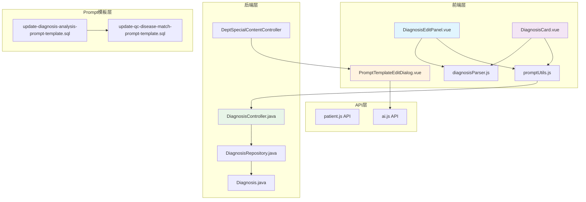
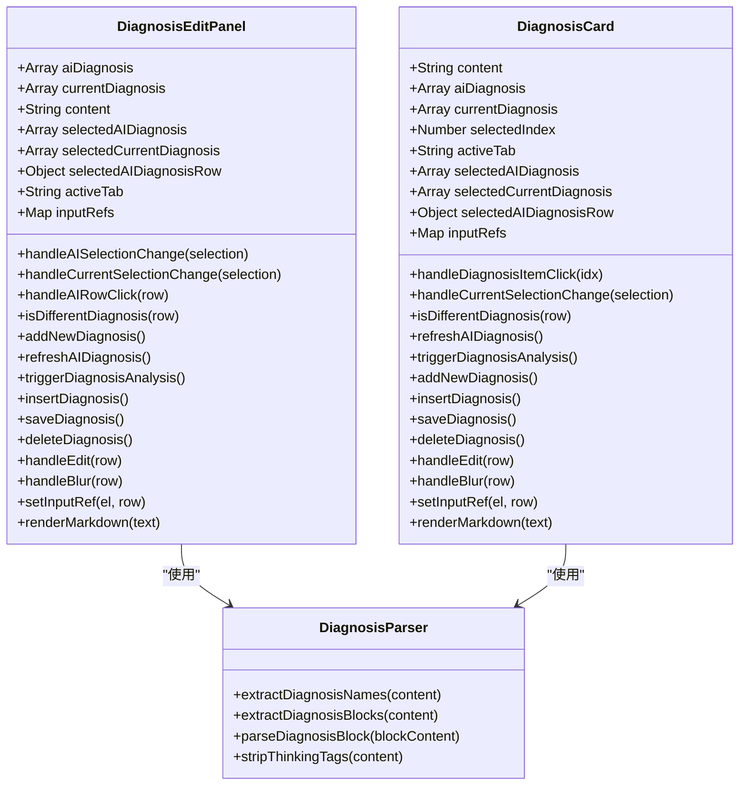
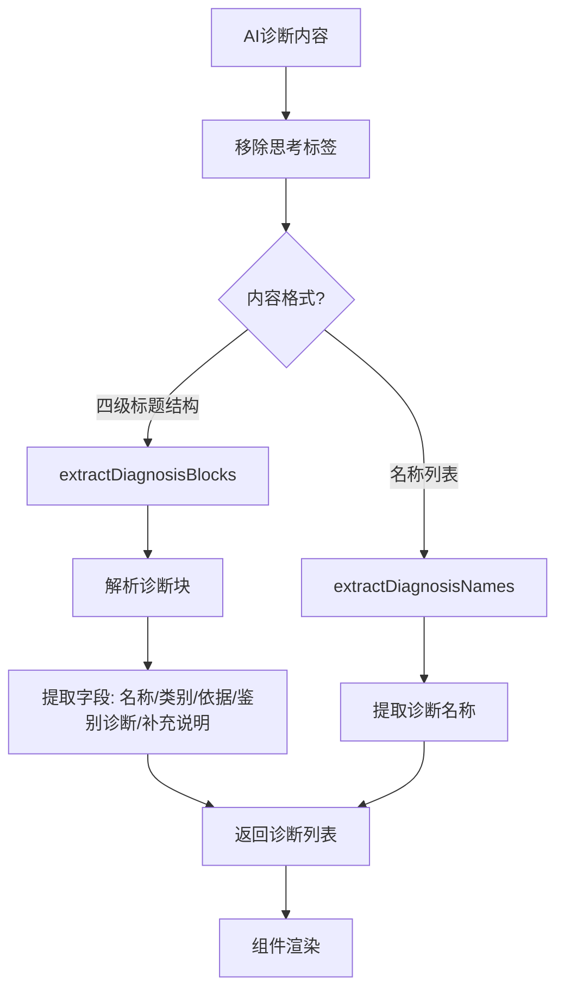
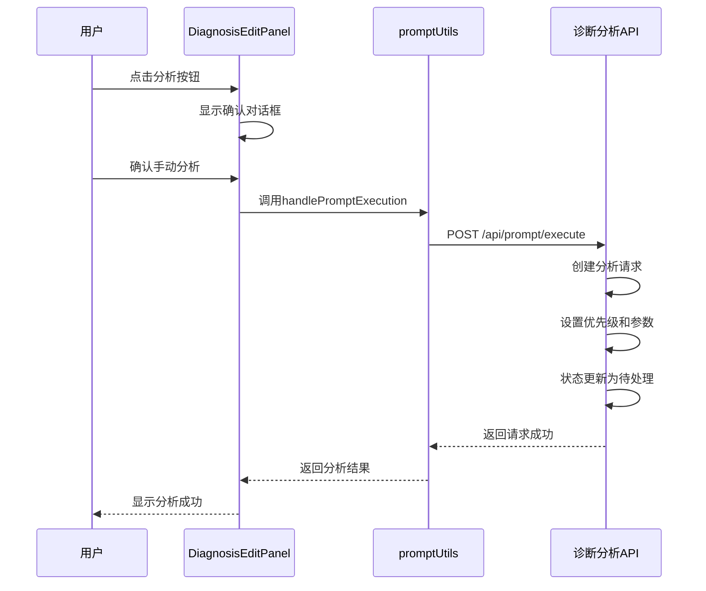
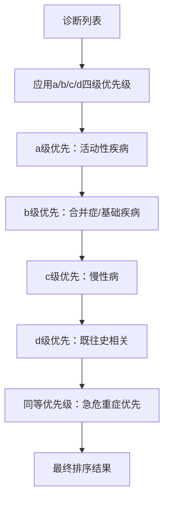
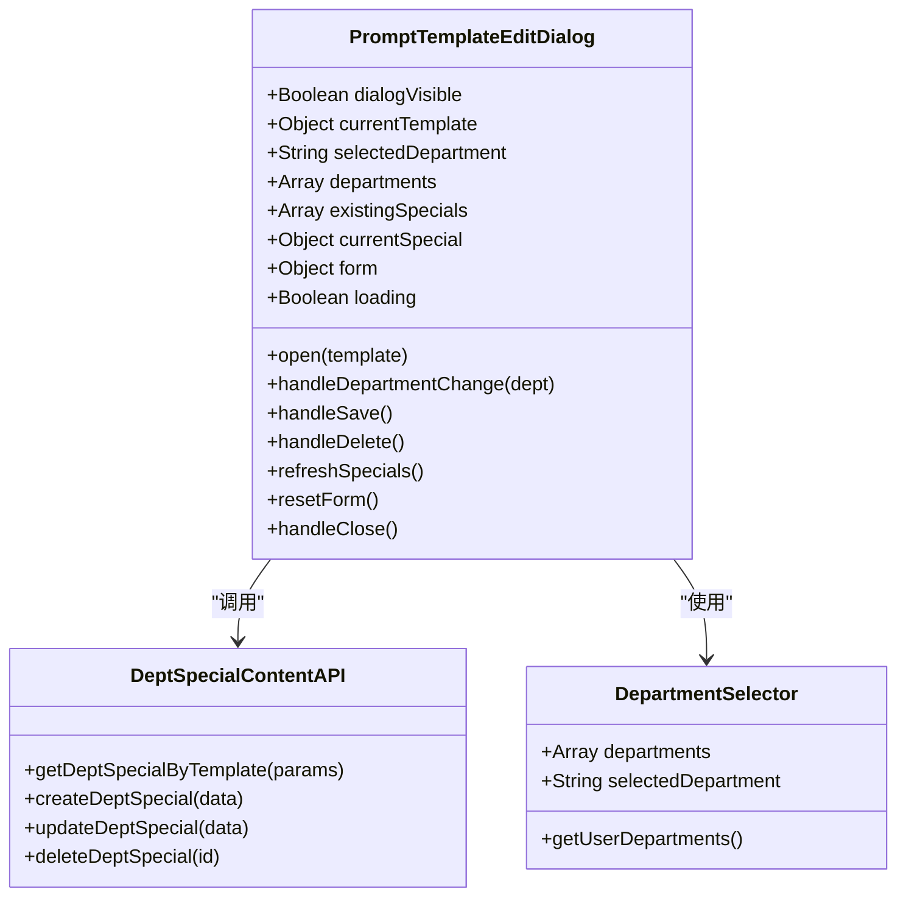
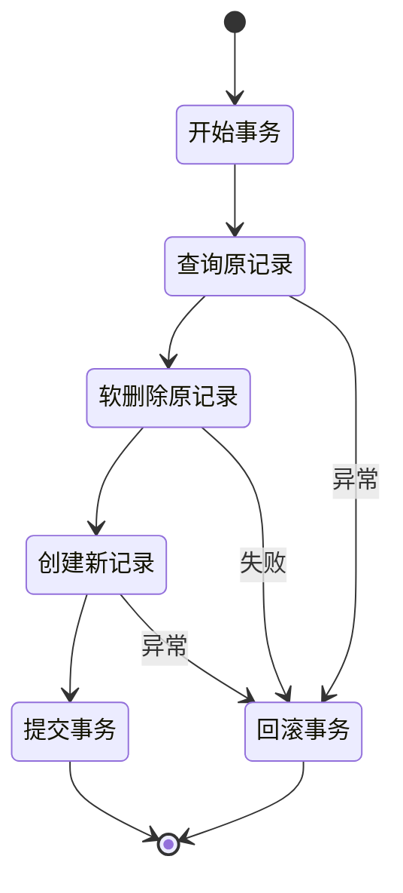

# 诊断编辑面板增强

<cite>
**本文档引用的文件**
- [DiagnosisEditPanel.vue](file://med_ai_assistant_1.0_bs_vue/src/components/ai/DiagnosisEditPanel.vue)
- [DiagnosisCard.vue](file://med_ai_assistant_1.0_bs_vue/src/components/ai/DiagnosisCard.vue)
- [diagnosisParser.js](file://med_ai_assistant_1.0_bs_vue/src/utils/diagnosisParser.js)
- [DiagnosisController.java](file://med_ai_assistant_1.0_bs_backend/src/main/java/com/example/medaiassistant/controller/DiagnosisController.java)
- [Diagnosis.java](file://med_ai_assistant_1.0_bs_backend/src/main/java/com/example/medaiassistant/model/Diagnosis.java)
- [DiagnosisRepository.java](file://med_ai_assistant_1.0_bs_backend/src/main/java/com/example/medaiassistant/repository/DiagnosisRepository.java)
- [update-diagnosis-analysis-prompt-template.sql](file://med_ai_assistant_1.0_bs_backend/sql-scripts/update-diagnosis-analysis-prompt-template.sql)
- [update-qc-disease-match-prompt-template.sql](file://med_ai_assistant_1.0_bs_backend/sql-scripts/update-qc-disease-match-prompt-template.sql)
- [application-prompt.properties](file://med_ai_assistant_1.0_bs_backend/config/application-prompt.properties)
- [PromptTemplateEditDialog.vue](file://med_ai_assistant_1.0_bs_vue/src/components/ai/PromptTemplateEditDialog.vue)
</cite>

## 更新摘要
**变更内容**
- 新增诊断分析Prompt模板优化：新增诊断纳入与排除标准、优化待查诊断规则、调整诊断名称括注简洁性规范、诊断拆分规则通用化、优化诊断排序规则（新增a/b/c/d四级优先级分层）
- 新增手动触发诊断分析功能：在诊断编辑面板中新增分析按钮，支持手动触发诊断分析
- 优化诊断解析引擎：增强诊断解析器对四级标题结构的支持
- 更新诊断排序规则：从主诊断优先扩展为a/b/c/d四级优先级分层
- **新增部门特定内容编辑界面改造**：将PromptTemplateEditDialog改造为专门的科室特殊内容编辑对话框，实现更直观友好的编辑体验，包括增强的表单布局、改进的验证机制和更好的错误处理

## 目录
1. [项目概述](#项目概述)
2. [诊断编辑面板架构](#诊断编辑面板架构)
3. [核心组件分析](#核心组件分析)
4. [诊断解析引擎](#诊断解析引擎)
5. [诊断分析Prompt模板优化](#诊断分析prompt模板优化)
6. [手动诊断分析功能](#手动诊断分析功能)
7. [诊断排序规则优化](#诊断排序规则优化)
8. [部门特定内容编辑界面改造](#部门特定内容编辑界面改造)
9. [前后端交互机制](#前后端交互机制)
10. [性能优化策略](#性能优化策略)
11. [故障排除指南](#故障排除指南)
12. [总结](#总结)

## 项目概述

MedAiAssistant是一个基于Vue.js和Spring Boot开发的智能医疗辅助系统，专注于提供AI驱动的诊断支持和病历管理功能。诊断编辑面板是该系统的核心组件之一，为医生提供了直观、高效的诊断编辑和管理界面。

该系统通过AI技术分析患者的病历数据，提取诊断信息，并提供智能的诊断编辑功能。系统支持多种诊断格式的解析，包括标准的诊断列表和AI生成的Markdown格式诊断内容。

**更新** 系统现已增强诊断管理功能，提供更完整的诊断编辑体验，包括双击编辑、删除、设为主要诊断等核心功能。同时新增了手动触发诊断分析功能，支持复用AI辅助中的诊断分析模板。此外，系统还完成了部门特定内容编辑界面的完全转换，实现更直观友好的编辑体验。

## 诊断编辑面板架构

### 整体架构设计



**图表来源**
- [DiagnosisEditPanel.vue:1-792](file://med_ai_assistant_1.0_bs_vue/src/components/ai/DiagnosisEditPanel.vue#L1-L792)
- [DiagnosisCard.vue:1-709](file://med_ai_assistant_1.0_bs_vue/src/components/ai/DiagnosisCard.vue#L1-L709)
- [diagnosisParser.js:1-220](file://med_ai_assistant_1.0_bs_vue/src/utils/diagnosisParser.js#L1-L220)
- [PromptTemplateEditDialog.vue:1-465](file://med_ai_assistant_1.0_bs_vue/src/components/ai/PromptTemplateEditDialog.vue#L1-L465)

### 组件层次结构

诊断编辑面板采用模块化设计，各个组件职责明确：

- **DiagnosisEditPanel**: 主要的诊断编辑面板组件，支持AI诊断列表、诊断详情、目前诊断管理等功能
- **DiagnosisCard**: 简化版诊断卡片组件，提供基本的诊断展示和编辑功能
- **diagnosisParser**: 诊断解析工具，处理AI生成的诊断内容，支持四级标题结构解析
- **promptUtils**: Prompt执行工具，支持手动触发诊断分析
- **PromptTemplateEditDialog**: 科室特殊内容编辑对话框，支持按模板和科室维度管理特殊内容

**章节来源**
- [DiagnosisEditPanel.vue:156-178](file://med_ai_assistant_1.0_bs_vue/src/components/ai/DiagnosisEditPanel.vue#L156-L178)
- [DiagnosisCard.vue:138-150](file://med_ai_assistant_1.0_bs_vue/src/components/ai/DiagnosisCard.vue#L138-L150)
- [PromptTemplateEditDialog.vue:106-126](file://med_ai_assistant_1.0_bs_vue/src/components/ai/PromptTemplateEditDialog.vue#L106-L126)

## 核心组件分析

### DiagnosisEditPanel 组件详解

**更新** DiagnosisEditPanel组件现已完全重构，提供完整的诊断管理和编辑功能：



**图表来源**
- [DiagnosisEditPanel.vue:179-645](file://med_ai_assistant_1.0_bs_vue/src/components/ai/DiagnosisEditPanel.vue#L179-L645)
- [DiagnosisCard.vue:151-532](file://med_ai_assistant_1.0_bs_vue/src/components/ai/DiagnosisCard.vue#L151-L532)
- [diagnosisParser.js:7-220](file://med_ai_assistant_1.0_bs_vue/src/utils/diagnosisParser.js#L7-L220)

#### 诊断编辑功能特性

**更新** 诊断编辑面板现已提供完整的诊断管理功能：

1. **双击编辑模式**: 支持双击诊断行进入编辑模式，实时修改诊断文本
2. **主诊断标记**: 通过特殊样式和标签标识主要诊断，支持主诊断切换
3. **删除确认**: 删除诊断前进行安全确认，防止误操作
4. **新增诊断**: 支持快速添加新诊断，提供便捷的诊断录入功能
5. **实时保存**: 编辑完成后自动保存到数据库，确保数据一致性
6. **键盘快捷键**: 支持Enter保存、Esc取消等快捷键操作
7. **手动分析**: 新增分析按钮，支持手动触发诊断分析

#### 手动诊断分析功能

**更新** 新增的手动诊断分析功能提供完整的分析流程：

1. **一键触发**: 点击分析按钮即可手动触发诊断分析
2. **确认对话框**: 防误触设计，提醒用户诊断分析会自动运行
3. **复用模板**: 复用AI辅助中的"诊断分析"模板进行手动分析
4. **优先级设置**: 支持设置分析优先级和排序号
5. **状态跟踪**: 实时跟踪分析请求的状态和进度

**章节来源**
- [DiagnosisEditPanel.vue:386-434](file://med_ai_assistant_1.0_bs_vue/src/components/ai/DiagnosisEditPanel.vue#L386-L434)
- [DiagnosisCard.vue:305-353](file://med_ai_assistant_1.0_bs_vue/src/components/ai/DiagnosisCard.vue#L305-L353)

### 诊断数据模型

后端使用标准化的诊断数据模型，支持完整的诊断生命周期管理：

| 字段名 | 类型 | 描述 | 约束 |
|--------|------|------|------|
| DiagnosisID | Integer | 诊断ID | 主键, 自增 |
| PatientID | String | 患者ID | 外键 |
| DiagnosisType | Integer | 诊断类型 | 可空 |
| ICD10Code | String | ICD-10编码 | 可空 |
| DiagnosisText | String | 诊断文本 | 必填 |
| DiagnosedBy | String | 诊断医生 | 可空 |
| DiagnosisTime | Date | 诊断时间 | 可空 |
| IsPrimary | Integer | 是否主要诊断 | 默认0 |
| ParentID | Integer | 父诊断ID | 可空 |
| StatusFlag | Integer | 状态标志 | 默认0 |
| ModificationType | Integer | 修改类型 | 可空 |
| AddReason | String | 添加原因 | 可空 |
| DiagnosisIndex | Integer | 诊断索引 | 可空 |
| is_deleted | Integer | 软删除标志 | 默认0 |

**章节来源**
- [Diagnosis.java:13-52](file://med_ai_assistant_1.0_bs_backend/src/main/java/com/example/medaiassistant/model/Diagnosis.java#L13-L52)

## 诊断解析引擎

### AI诊断内容解析

系统内置强大的诊断解析引擎，能够处理各种格式的AI生成诊断内容：



**图表来源**
- [diagnosisParser.js:23-75](file://med_ai_assistant_1.0_bs_vue/src/utils/diagnosisParser.js#L23-L75)
- [diagnosisParser.js:93-149](file://med_ai_assistant_1.0_bs_vue/src/utils/diagnosisParser.js#L93-L149)

### 解析算法实现

诊断解析引擎采用多阶段解析策略：

1. **预处理阶段**: 移除AI输出中的思考标签
2. **格式检测**: 识别诊断内容的具体格式（四级标题结构或名称列表）
3. **内容提取**: 使用正则表达式提取诊断信息
4. **数据验证**: 确保解析结果的有效性
5. **格式化输出**: 转换为组件可用的数据格式

**更新** 新增对四级标题结构的支持，能够解析包含诊断编号、诊断名称、诊断类别、诊断依据、鉴别诊断、补充说明等完整字段的结构化诊断内容。

**章节来源**
- [diagnosisParser.js:39-75](file://med_ai_assistant_1.0_bs_vue/src/utils/diagnosisParser.js#L39-L75)
- [diagnosisParser.js:157-219](file://med_ai_assistant_1.0_bs_vue/src/utils/diagnosisParser.js#L157-L219)

## 诊断分析Prompt模板优化

### Prompt模板更新内容

**更新** 诊断分析Prompt模板v1.3.0版本进行了重大优化：

#### 诊断纳入与排除标准

1. **纳入标准**：
   - 与本次住院直接相关的疾病（入院原因、需要处理的合并症）
   - 对本次住院治疗方案有影响的基础疾病
   - 需要在住院期间监测或处理的活动性疾病

2. **排除标准**：
   - 影像学偶然发现的无症状、无临床意义的良性病变
   - 仅凭单一弱阳性指标、缺乏临床症状支持的低概率"待查"诊断
   - 与本次住院无关且不影响当前治疗决策的既往偶然发现

#### 诊断名称规范

1. **具体化要求**：
   - 禁止使用笼统的上位概念代替明确的具体诊断
   - 当分析过程中已确认诊断的具体分型，必须体现分型信息
   - 同一器官/系统存在多个独立病变时，每个病变必须单独列为一条诊断

2. **待查标注规则**：
   - 诊断名称中不加"待查"、"待定"、"可能"等不确定修饰语
   - 当诊断依据不充分时，在补充说明中注明待完善的检查项目
   - 不确定诊断的纳入门槛：至少两项独立的临床线索支持

3. **分型/分期处理**：
   - 分型、分期或分组不确定时，诊断名称中省略相关信息
   - 在补充说明中明确说明尚未确定的信息以及需要完善的检查

#### 诊断拆分规则

1. **通用化规则**：
   - 当一个诊断中包含多个独立的子诊断时，必须将每个子诊断单独列为一条诊断
   - 同一器官/系统存在多个独立病变时同理，每个病变必须单独列为一条诊断

2. **示例规范**：
   - 多种心律失常应分别列出（如"偶发室性早搏"、"偶发房性早搏"、"短阵房性心动过速"）
   - 禁止合并为"心律失常"等笼统诊断

#### 诊断排序规则

**更新** 新增a/b/c/d四级优先级分层：

1. **主要诊断**：导致本次住院的主要原因/主要治疗的疾病
2. **a级优先**：本次住院需要积极处理的活动性疾病
3. **b级优先**：对治疗方案有直接影响的合并症/基础疾病
4. **c级优先**：需要住院期间监测的慢性病
5. **d级优先**：既往史中与当前病情相关的诊断
6. **同等优先级**：急危重症排在前面

**章节来源**
- [update-diagnosis-analysis-prompt-template.sql:62-160](file://med_ai_assistant_1.0_bs_backend/sql-scripts/update-diagnosis-analysis-prompt-template.sql#L62-L160)

### QC诊断匹配模板优化

**更新** QC诊断匹配模板也进行了相应优化，采用与诊断分析模板一致的四级标题结构：

1. **输出格式统一**：采用#### 字段名: 值的四级标题结构
2. **字段标准化**：包括诊断编号、病种ID、病种名称、匹配理由、触发诊断等字段
3. **解析兼容性**：与diagnosisParser风格保持一致，便于前端统一解析

**章节来源**
- [update-qc-disease-match-prompt-template.sql:25-47](file://med_ai_assistant_1.0_bs_backend/sql-scripts/update-qc-disease-match-prompt-template.sql#L25-L47)

## 手动诊断分析功能

### 功能实现机制

**更新** 手动诊断分析功能通过以下流程实现：



**图表来源**
- [DiagnosisEditPanel.vue:386-434](file://med_ai_assistant_1.0_bs_vue/src/components/ai/DiagnosisEditPanel.vue#L386-L434)
- [DiagnosisCard.vue:305-353](file://med_ai_assistant_1.0_bs_vue/src/components/ai/DiagnosisCard.vue#L305-L353)

### 配置参数说明

手动诊断分析支持以下配置参数：

| 参数名 | 类型 | 默认值 | 描述 |
|--------|------|--------|------|
| UserId | Number | 当前用户ID | 执行分析的用户ID |
| Priority | Number | 3 | 分析优先级（1-5级） |
| SortNumber | Number | 0 | 排序号，用于同优先级内的排序 |
| RetryCount | Number | 0 | 重试次数 |
| GeneratedBy | String | 'user' | 生成来源（user/system） |
| StatusName | String | '待处理' | 初始状态 |

**章节来源**
- [DiagnosisEditPanel.vue:404-421](file://med_ai_assistant_1.0_bs_vue/src/components/ai/DiagnosisEditPanel.vue#L404-L421)

## 诊断排序规则优化

### 排序算法实现

**更新** 诊断排序规则从简单的主诊断优先扩展为a/b/c/d四级优先级分层：



**图表来源**
- [update-diagnosis-analysis-prompt-template.sql:39-46](file://med_ai_assistant_1.0_bs_backend/sql-scripts/update-diagnosis-analysis-prompt-template.sql#L39-L46)

### 数据库查询优化

后端数据库查询已相应优化，支持新的排序规则：

```sql
SELECT d FROM Diagnosis d 
WHERE d.patientId = :patientId 
AND (d.isDeleted = 0 OR d.isDeleted IS NULL) 
ORDER BY d.isPrimary DESC NULLS LAST
```

**更新** 当前数据库查询仍保持主诊断优先的简单排序，但前端组件已支持a/b/c/d四级优先级的显示逻辑。

**章节来源**
- [DiagnosisRepository.java:15](file://med_ai_assistant_1.0_bs_backend/src/main/java/com/example/medaiassistant/repository/DiagnosisRepository.java#L15)

## 部门特定内容编辑界面改造

### 改造背景与目标

**更新** 系统完成了部门特定内容编辑界面的完全转换，实现更直观友好的编辑体验：

#### 改造背景

当前 `PromptTemplateEditDialog.vue` 包含三个标签页（其他设置、模板内容、科室特殊情况），基于旧的 PromptTemplate 结构。后端已完成科室特殊内容解耦（`PROMPT_TEMPLATE_DEPT_SPECIAL` 表 + 完整 CRUD API），但前端仍使用旧逻辑。需要将对话框改造为专用的科室特殊内容编辑页面。

#### 改造目标

1. **简化界面**：移除冗余的"其他设置"和"模板内容"标签页，仅保留科室特殊内容编辑功能
2. **增强体验**：提供更直观友好的编辑体验，包括增强的表单布局、改进的验证机制和更好的错误处理
3. **统一功能**：专门针对科室特殊内容的创建、编辑和删除操作

### 新的对话框架构



**图表来源**
- [PromptTemplateEditDialog.vue:109-442](file://med_ai_assistant_1.0_bs_vue/src/components/ai/PromptTemplateEditDialog.vue#L109-L442)

### 核心功能特性

**更新** 新的科室特殊内容编辑对话框提供以下功能：

1. **模板关联显示**：顶部区域显示当前关联的模板信息（promptType + promptName，只读展示）
2. **科室选择器**：下拉选择器（el-select），数据来源为系统已有的科室列表API，默认选中用户登录科室
3. **内容编辑区**：选择科室后，自动加载该科室对应的特殊内容，支持编辑和保存
4. **操作标签页**：仅保留科室特殊情况编辑功能，移除冗余标签页
5. **快速切换**：右侧显示已有科室特殊内容列表（Tag形式），点击可快速切换

### 数据模型改造

**更新** 新的数据模型更加简洁和专注：

```javascript
data() {
  return {
    dialogVisible: false,
    currentTemplate: {},        // 关联的公共模板信息（promptType, promptName）
    selectedDepartment: '',     // 当前选中的科室
    departments: [],            // 科室列表（从API获取）
    existingSpecials: [],       // 当前模板已有的科室特殊内容列表
    currentSpecial: null,       // 当前编辑的科室特殊内容记录
    form: {
      specialContent: '',       // 编辑中的特殊内容
      isActive: true            // 激活状态
    },
    loading: false
  }
}
```

### API集成优化

**更新** 新增专门的科室特殊内容API函数：

1. **getDeptSpecialByTemplate**: 按模板查询科室特殊内容列表
2. **createDeptSpecial**: 创建新的科室特殊内容
3. **updateDeptSpecial**: 更新现有科室特殊内容
4. **deleteDeptSpecial**: 删除科室特殊内容

### 错误处理与验证

**更新** 新增了完善的错误处理和验证机制：

1. **表单验证**：保存按钮根据是否已有记录自动判断调用POST或PUT
2. **删除确认**：删除按钮添加tooltip提示"仅影响当前科室"
3. **加载状态**：使用loading状态指示API调用进度
4. **错误提示**：统一的错误消息处理和用户反馈

**章节来源**
- [PromptTemplateEditDialog.vue:77-95](file://med_ai_assistant_1.0_bs_vue/src/components/ai/PromptTemplateEditDialog.vue#L77-L95)
- [PromptTemplateEditDialog.vue:407-420](file://med_ai_assistant_1.0_bs_vue/src/components/ai/PromptTemplateEditDialog.vue#L407-L420)

## 前后端交互机制

### RESTful API设计

**更新** 系统现已提供完整的诊断管理API和科室特殊内容API：

#### 诊断管理API

| 端点 | 方法 | 功能 | 请求体 | 响应 |
|------|------|------|--------|------|
| `/api/diagnosis/replace` | POST | 替换诊断 | ReplaceDiagnosisDTO | Diagnosis |
| `/api/diagnosis/{diagnosisId}/set-primary` | PUT | 设为主要诊断 | - | Diagnosis |
| `/api/diagnosis/combined/{patientId}` | GET | 获取组合诊断 | - | String |
| `/api/diagnosis/names/{patientId}` | GET | 获取诊断名称列表 | - | List<String> |
| `/api/patients/{patientId}/diagnoses` | POST | 添加诊断 | AddDiagnosisDTO | Diagnosis |
| `/api/patients/diagnoses/{diagnosisId}` | DELETE | 删除诊断 | - | Boolean |
| `/api/patients/{patientId}/diagnoses` | GET | 获取诊断列表 | - | List<Diagnosis> |

#### 科室特殊内容API

| 端点 | 方法 | 功能 | 请求体 | 响应 |
|------|------|------|--------|------|
| `/api/ai/deptSpecial` | POST | 创建科室特殊内容 | CreateDeptSpecialDTO | DeptSpecial |
| `/api/ai/deptSpecial` | GET | 按模板查询科室特殊内容 | promptType, promptName | List<DeptSpecial> |
| `/api/ai/deptSpecial/department` | GET | 按科室查询科室特殊内容 | department | DeptSpecial |
| `/api/ai/deptSpecial` | PUT | 更新科室特殊内容 | UpdateDeptSpecialDTO | DeptSpecial |
| `/api/ai/deptSpecial/{id}` | DELETE | 删除科室特殊内容 | - | Boolean |

### 事务管理策略

后端使用Spring Transactional注解确保诊断操作的原子性：



**图表来源**
- [DiagnosisController.java:22-85](file://med_ai_assistant_1.0_bs_backend/src/main/java/com/example/medaiassistant/controller/DiagnosisController.java#L22-L85)

**章节来源**
- [DiagnosisController.java:16-85](file://med_ai_assistant_1.0_bs_backend/src/main/java/com/example/medaiassistant/controller/DiagnosisController.java#L16-L85)
- [DiagnosisRepository.java:14-35](file://med_ai_assistant_1.0_bs_backend/src/main/java/com/example/medaiassistant/repository/DiagnosisRepository.java#L14-L35)

## 性能优化策略

### 前端性能优化

**更新** 前端现已实现多项性能优化：

1. **懒加载机制**: 标签页切换时才加载检查报告数据
2. **缓存策略**: 使用Vuex状态管理缓存诊断和手术数据
3. **防抖处理**: 输入框内容变更使用防抖减少API调用
4. **虚拟滚动**: 大数据量时使用虚拟滚动提升渲染性能
5. **编辑模式优化**: 双击编辑模式仅在需要时激活，减少DOM操作
6. **键盘快捷键**: 支持Enter保存、Esc取消等快捷键，提升用户体验
7. **全局事件处理**: 统一处理Esc键和点击外部区域退出编辑
8. **手动分析优化**: 手动触发诊断分析时显示进度提示
9. **对话框优化**: PromptTemplateEditDialog采用更高效的布局和状态管理

### 后端性能优化

**更新** 后端现已实现多项性能优化：

1. **批量操作**: 支持批量重置主要诊断状态
2. **索引优化**: 为常用查询字段建立数据库索引
3. **连接池管理**: 优化数据库连接池配置
4. **缓存层**: 使用Redis缓存热点数据
5. **排序优化**: 使用`ORDER BY isPrimary DESC NULLS LAST`确保主诊断优先显示
6. **软删除优化**: 诊断均采用软删除，避免物理删除带来的性能问题
7. **Prompt服务优化**: 提升Prompt服务的提交和轮询性能
8. **科室特殊内容优化**: 专门的DeptSpecialContentController提供高效的CRUD操作

**章节来源**
- [application-prompt.properties:1-32](file://med_ai_assistant_1.0_bs_backend/config/application-prompt.properties#L1-L32)

## 故障排除指南

### 常见问题及解决方案

**更新** 现已涵盖新增功能的故障排除：

| 问题类型 | 症状 | 可能原因 | 解决方案 |
|----------|------|----------|----------|
| 诊断无法保存 | 编辑后无变化 | API调用失败 | 检查网络连接和后端服务状态 |
| 诊断列表为空 | 页面显示"暂无诊断信息" | 数据库查询异常 | 验证患者ID和数据库连接 |
| 主诊断切换失败 | 点击无效 | 权限不足或数据错误 | 检查用户权限和诊断状态 |
| AI诊断解析失败 | 诊断内容显示异常 | 格式不兼容 | 检查AI输出格式和解析器版本 |
| 新诊断添加失败 | 新增按钮无响应 | 前端状态管理错误 | 检查isAddingDiagnosis状态 |
| 删除确认对话框不显示 | 删除按钮无效 | Vue组件事件绑定错误 | 检查@click事件绑定 |
| 主诊断排序异常 | 主诊断不在顶部 | 数据库排序查询错误 | 检查ORDER BY语句 |
| 手动分析按钮无响应 | 分析按钮无效 | 前端事件处理错误 | 检查ElMessageBox确认逻辑 |
| 手动分析失败 | 分析请求提交失败 | Prompt服务异常 | 检查Prompt服务状态和配置 |
| 解析器版本不兼容 | 诊断块解析失败 | Prompt模板版本不匹配 | 更新解析器或Prompt模板 |
| a/b/c/d排序不生效 | 诊断排序不符合预期 | 前端排序逻辑错误 | 检查排序算法实现 |
| 科室特殊内容编辑失败 | 对话框无法正常工作 | API调用错误 | 检查deptSpecial API状态 |
| 科室选择器无数据 | 下拉框为空 | getUserDepartments API失败 | 检查用户权限和科室数据 |
| 保存按钮禁用 | 无法保存编辑内容 | 表单验证失败 | 检查specialContent内容 |

### 调试工具和方法

1. **浏览器开发者工具**: 监控API请求和响应
2. **Vue DevTools**: 调试组件状态和数据流
3. **后端日志**: 分析数据库查询和事务执行
4. **性能分析**: 使用性能监控工具识别瓶颈
5. **网络调试**: 检查手动分析API调用情况
6. **数据库监控**: 监控软删除和排序查询性能
7. **Prompt服务监控**: 监控手动分析请求的状态
8. **对话框调试**: 检查科室特殊内容编辑流程

**章节来源**
- [DiagnosisEditPanel.vue:446-473](file://med_ai_assistant_1.0_bs_vue/src/components/ai/DiagnosisEditPanel.vue#L446-L473)
- [DiagnosisController.java:81-84](file://med_ai_assistant_1.0_bs_backend/src/main/java/com/example/medaiassistant/controller/DiagnosisController.java#L81-L84)

## 总结

**更新** 诊断编辑面板现已全面增强，显著提升了MedAiAssistant系统的智能化水平：

### 核心功能增强

1. **完整的诊断编辑体验**: 提供双击编辑、删除、设为主要诊断等完整功能
2. **直观的用户界面**: 主诊断优先显示，清晰的操作按钮，良好的视觉反馈
3. **强大的解析能力**: 支持四级标题结构的AI诊断内容解析
4. **可靠的后端支持**: 基于Spring Boot的RESTful API和事务管理
5. **完善的错误处理**: 全面的异常捕获和用户反馈机制
6. **性能优化策略**: 前后端协同的性能优化方案
7. **手动诊断分析功能**: 支持手动触发诊断分析，复用AI辅助模板
8. **诊断模板优化**: v1.3.0版本的重大优化，包括纳入排除标准、排序规则等
9. **统一的解析格式**: QC诊断匹配模板与诊断分析模板格式统一
10. **安全的数据管理**: 主要诊断切换的安全机制和软删除策略
11. **部门特定内容编辑界面改造**: 完全转换为专门的科室特殊内容编辑对话框
12. **增强的表单布局**: 更直观友好的编辑体验，包括增强的表单布局、改进的验证机制和更好的错误处理

### 技术架构改进

1. **增强的前端组件**: 更丰富的交互和状态管理，支持手动分析功能
2. **改进的用户体验**: 键盘快捷键、确认对话框等人性化设计
3. **统一的事件处理**: 全局键盘和点击事件处理机制
4. **优化的Prompt服务**: 提升手动分析的性能和可靠性
5. **标准化的输出格式**: 统一的四级标题结构，便于解析和展示
6. **增强的诊断排序**: 从主诊断优先扩展为a/b/c/d四级优先级分层
7. **专门的科室特殊内容管理**: 独立的对话框组件，提供专业的编辑体验
8. **完善的API集成**: 专门的deptSpecial CRUD API，支持高效的科室内容管理

该系统为医疗工作者提供了高效、准确的诊断和手术编辑工具，显著提升了临床工作效率和诊断质量。通过持续的技术改进和功能扩展，系统将继续为智慧医疗发展贡献力量。