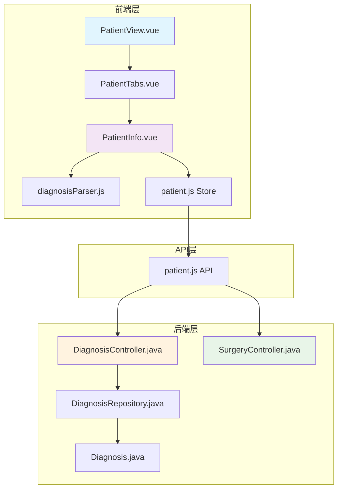
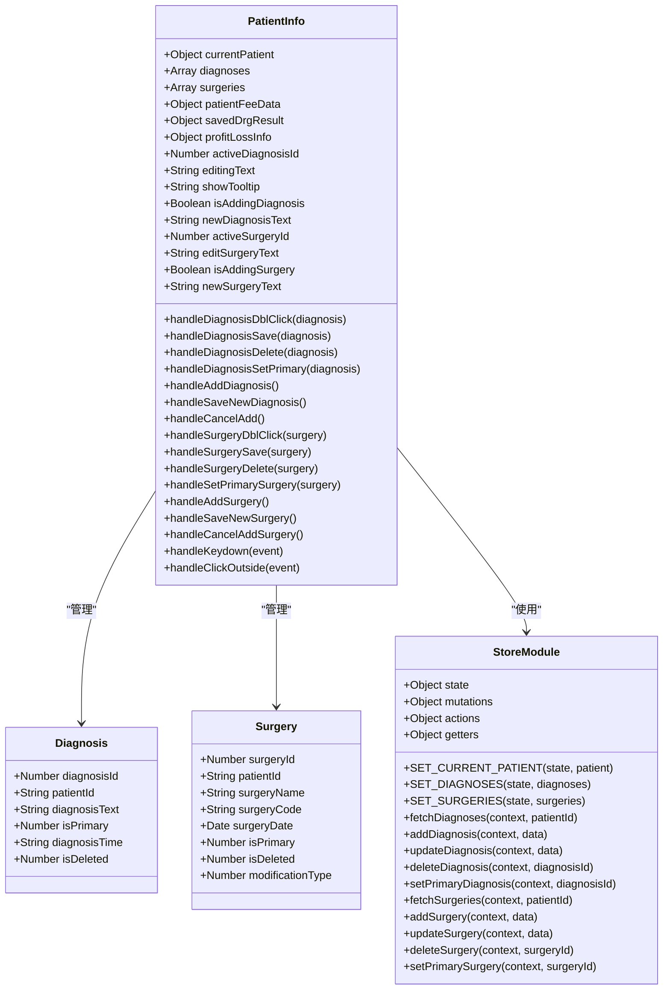
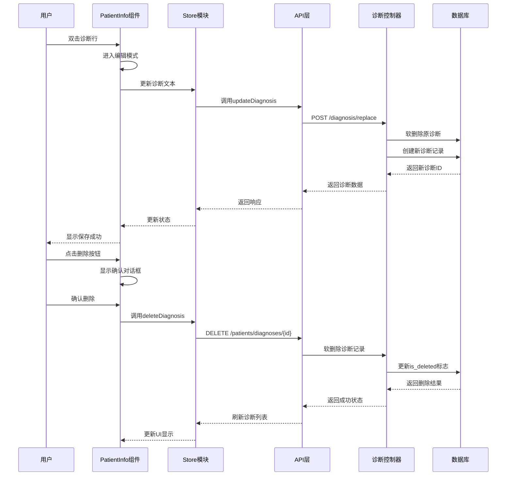
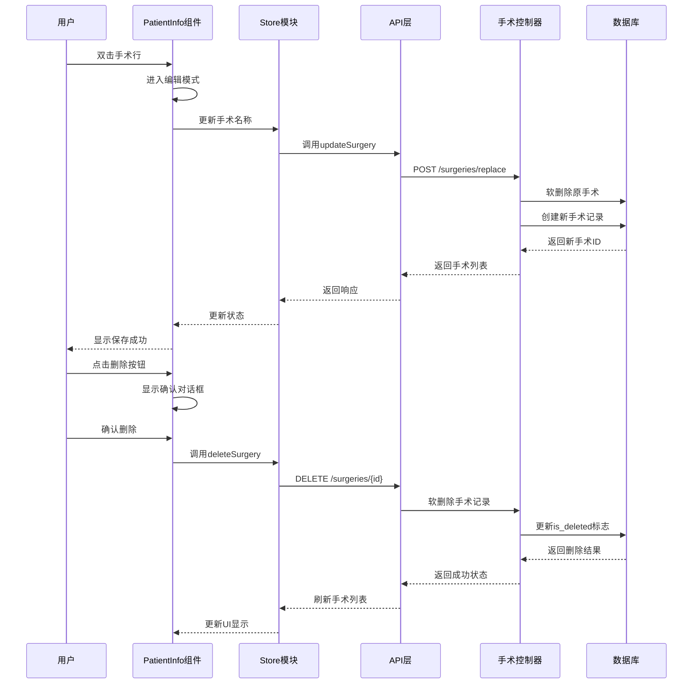
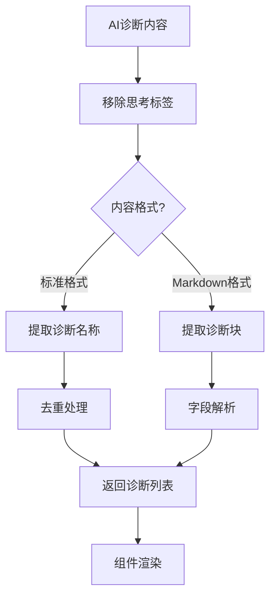
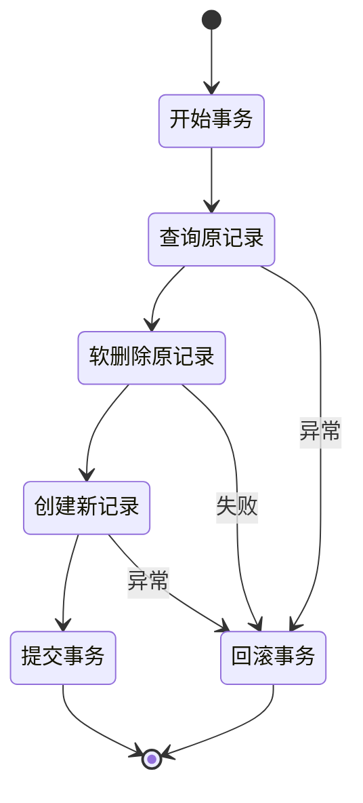

# 诊断编辑面板增强

<cite>
**本文档引用的文件**
- [PatientInfo.vue](file://med_ai_assistant_1.0_bs_vue/src/components/patient/PatientInfo.vue)
- [PatientView.vue](file://med_ai_assistant_1.0_bs_vue/src/views/PatientView.vue)
- [PatientTabs.vue](file://med_ai_assistant_1.0_bs_vue/src/components/patient/PatientTabs.vue)
- [diagnosisParser.js](file://med_ai_assistant_1.0_bs_vue/src/utils/diagnosisParser.js)
- [patient.js](file://med_ai_assistant_1.0_bs_vue/src/store/modules/patient.js)
- [DiagnosisController.java](file://med_ai_assistant_1.0_bs_backend/src/main/java/com/example/medaiassistant/controller/DiagnosisController.java)
- [Diagnosis.java](file://med_ai_assistant_1.0_bs_backend/src/main/java/com/example/medaiassistant/model/Diagnosis.java)
- [DiagnosisRepository.java](file://med_ai_assistant_1.0_bs_backend/src/main/java/com/example/medaiassistant/repository/DiagnosisRepository.java)
- [SurgeryController.java](file://med_ai_assistant_1.0_bs_backend/src/main/java/com/example/medaiassistant/controller/SurgeryController.java)
- [patient.js](file://med_ai_assistant_1.0_bs_vue/src/api/patient.js)
- [诊断管理接口.md](file://med_ai_assistant_1.0_bs_backend/doc/接口/诊断管理接口.md)
- [手术管理接口.md](file://med_ai_assistant_1.0_bs_backend/doc/接口/手术管理/手术管理接口.md)
</cite>

## 更新摘要
**变更内容**
- 新增双击编辑诊断功能，支持实时修改诊断文本
- 新增诊断删除功能，提供安全确认机制
- 新增设为主要诊断功能，支持主诊断切换
- 新增诊断列表按主诊断优先排序功能
- 新增后端设为主要诊断API接口
- 新增新增诊断功能，支持快速添加新诊断
- 新增手术列表功能，支持双击编辑、新增、软删除、设主手术
- 新增后端手术管理API接口，包括新增、替换、软删除、设主手术
- 新增手术列表按主手术优先排序功能

## 目录
1. [项目概述](#项目概述)
2. [诊断编辑面板架构](#诊断编辑面板架构)
3. [核心组件分析](#核心组件分析)
4. [数据流分析](#数据流分析)
5. [诊断解析引擎](#诊断解析引擎)
6. [前后端交互机制](#前后端交互机制)
7. [性能优化策略](#性能优化策略)
8. [故障排除指南](#故障排除指南)
9. [总结](#总结)

## 项目概述

MedAiAssistant是一个基于Vue.js和Spring Boot开发的智能医疗辅助系统，专注于提供AI驱动的诊断支持和病历管理功能。诊断编辑面板是该系统的核心组件之一，为医生提供了直观、高效的诊断编辑和管理界面。

该系统通过AI技术分析患者的病历数据，提取诊断信息，并提供智能的诊断编辑功能。系统支持多种诊断格式的解析，包括标准的诊断列表和AI生成的Markdown格式诊断内容。

**更新** 系统现已增强诊断管理功能，提供更完整的诊断编辑体验，包括双击编辑、删除、设为主要诊断等核心功能。同时新增了手术管理功能，支持手术列表的完整CRUD操作。

## 诊断编辑面板架构

### 整体架构设计



**图表来源**
- [PatientView.vue:1-64](file://med_ai_assistant_1.0_bs_vue/src/views/PatientView.vue#L1-L64)
- [PatientTabs.vue:1-122](file://med_ai_assistant_1.0_bs_vue/src/components/patient/PatientTabs.vue#L1-L122)
- [PatientInfo.vue:1-719](file://med_ai_assistant_1.0_bs_vue/src/components/patient/PatientInfo.vue#L1-L719)

### 组件层次结构

诊断编辑面板采用模块化设计，各个组件职责明确：

- **PatientView**: 主视图容器，管理患者列表和标签页布局
- **PatientTabs**: 标签页容器，包含多个子标签页
- **PatientInfo**: 诊断信息展示和编辑的核心组件，现已增强完整的诊断管理和手术管理功能
- **diagnosisParser**: 诊断解析工具，处理AI生成的诊断内容

**章节来源**
- [PatientView.vue:19-54](file://med_ai_assistant_1.0_bs_vue/src/views/PatientView.vue#L19-L54)
- [PatientTabs.vue:49-103](file://med_ai_assistant_1.0_bs_vue/src/components/patient/PatientTabs.vue#L49-L103)

## 核心组件分析

### PatientInfo 组件详解

**更新** PatientInfo组件现已完全重构，提供完整的诊断管理和编辑功能，以及新增的手术管理功能：



**图表来源**
- [PatientInfo.vue:131-560](file://med_ai_assistant_1.0_bs_vue/src/components/patient/PatientInfo.vue#L131-L560)
- [Diagnosis.java:8-167](file://med_ai_assistant_1.0_bs_backend/src/main/java/com/example/medaiassistant/model/Diagnosis.java#L8-L167)
- [SurgeryController.java:242-390](file://med_ai_assistant_1.0_bs_backend/src/main/java/com/example/medaiassistant/controller/SurgeryController.java#L242-L390)

#### 诊断编辑功能特性

**更新** 诊断编辑面板现已提供完整的诊断管理功能：

1. **双击编辑模式**: 支持双击诊断行进入编辑模式，实时修改诊断文本
2. **主诊断标记**: 通过特殊样式和标签标识主要诊断，支持主诊断切换
3. **删除确认**: 删除诊断前进行安全确认，防止误操作
4. **新增诊断**: 支持快速添加新诊断，提供便捷的诊断录入功能
5. **实时保存**: 编辑完成后自动保存到数据库，确保数据一致性
6. **键盘快捷键**: 支持Enter保存、Esc取消等快捷键操作

#### 手术管理功能特性

**更新** 新增的手术管理功能提供完整的CRUD操作：

1. **双击编辑模式**: 支持双击手术行进入编辑模式，实时修改手术名称
2. **主手术标记**: 通过特殊样式和标签标识主要手术，支持主手术切换
3. **删除确认**: 删除手术前进行安全确认，防止误操作
4. **新增手术**: 支持快速添加新手术，提供便捷的手术录入功能
5. **软删除机制**: 手术删除采用软删除，保留历史记录可恢复
6. **主手术优先排序**: 手术列表按主手术优先显示，提升用户体验

**章节来源**
- [PatientInfo.vue:416-497](file://med_ai_assistant_1.0_bs_vue/src/components/patient/PatientInfo.vue#L416-L497)
- [PatientInfo.vue:528-559](file://med_ai_assistant_1.0_bs_vue/src/components/patient/PatientInfo.vue#L528-L559)
- [PatientInfo.vue:634-672](file://med_ai_assistant_1.0_bs_vue/src/components/patient/PatientInfo.vue#L634-L672)
- [PatientInfo.vue:148-198](file://med_ai_assistant_1.0_bs_vue/src/components/patient/PatientInfo.vue#L148-L198)

### 诊断数据模型

后端使用标准化的诊断数据模型，支持完整的诊断生命周期管理：

| 字段名 | 类型 | 描述 | 约束 |
|--------|------|------|------|
| DiagnosisID | Integer | 诊断ID | 主键, 自增 |
| PatientID | String | 患者ID | 外键 |
| DiagnosisType | Integer | 诊断类型 | 可空 |
| ICD10Code | String | ICD-10编码 | 可空 |
| DiagnosisText | String | 诊断文本 | 必填 |
| DiagnosedBy | String | 诊断医生 | 可空 |
| DiagnosisTime | Date | 诊断时间 | 可空 |
| IsPrimary | Integer | 是否主要诊断 | 默认0 |
| ParentID | Integer | 父诊断ID | 可空 |
| StatusFlag | Integer | 状态标志 | 默认0 |
| ModificationType | Integer | 修改类型 | 可空 |
| AddReason | String | 添加原因 | 可空 |
| DiagnosisIndex | Integer | 诊断索引 | 可空 |
| is_deleted | Integer | 软删除标志 | 默认0 |

### 手术数据模型

后端使用标准化的手术数据模型，支持完整的手术生命周期管理：

| 字段名 | 类型 | 描述 | 约束 |
|--------|------|------|------|
| SurgeryID | Integer | 手术ID | 主键, 自增 |
| PatientID | String | 患者ID | 外键 |
| SurgeryName | String | 手术名称 | 必填 |
| SurgeryCode | String | 手术编码 | 可空 |
| SurgeryDate | Date | 手术日期 | 可空 |
| IsPrimary | Integer | 是否主要手术 | 默认0 |
| IsDeleted | Integer | 软删除标志 | 默认0 |
| ModificationType | Integer | 修改类型 | 默认0 |

**章节来源**
- [Diagnosis.java:13-52](file://med_ai_assistant_1.0_bs_backend/src/main/java/com/example/medaiassistant/model/Diagnosis.java#L13-L52)
- [SurgeryController.java:242-390](file://med_ai_assistant_1.0_bs_backend/src/main/java/com/example/medaiassistant/controller/SurgeryController.java#L242-L390)

## 数据流分析

### 诊断编辑流程

**更新** 诊断编辑流程现已支持完整的CRUD操作：



**图表来源**
- [PatientInfo.vue:425-450](file://med_ai_assistant_1.0_bs_vue/src/components/patient/PatientInfo.vue#L425-L450)
- [patient.js:368-375](file://med_ai_assistant_1.0_bs_vue/src/store/modules/patient.js#L368-L375)
- [DiagnosisController.java:22-85](file://med_ai_assistant_1.0_bs_backend/src/main/java/com/example/medaiassistant/controller/DiagnosisController.java#L22-L85)

### 手术管理流程

**更新** 新增的手术管理流程支持完整的CRUD操作：



**图表来源**
- [PatientInfo.vue:692-747](file://med_ai_assistant_1.0_bs_vue/src/components/patient/PatientInfo.vue#L692-L747)
- [patient.js:231-255](file://med_ai_assistant_1.0_bs_vue/src/api/patient.js#L231-L255)
- [SurgeryController.java:290-353](file://med_ai_assistant_1.0_bs_backend/src/main/java/com/example/medaiassistant/controller/SurgeryController.java#L290-L353)

### 诊断加载流程

**更新** 诊断加载流程现已支持主诊断优先排序：

```mermaid
flowchart TD
A[组件挂载] --> B[获取患者ID]
B --> C{ID有效?}
C --> |否| D[返回]
C --> |是| E[调用API]
E --> F[fetchDiagnoses]
F --> G[API: GET /patients/{id}/diagnoses]
G --> H[数据库查询]
H --> I[ORDER BY isPrimary DESC NULLS LAST]
I --> J[返回诊断列表]
J --> K[格式化数据]
K --> L[更新Store状态]
L --> M[渲染UI - 主诊断优先显示]
```

**图表来源**
- [patient.js:315-333](file://med_ai_assistant_1.0_bs_vue/src/store/modules/patient.js#L315-L333)
- [patient.js:165-167](file://med_ai_assistant_1.0_bs_vue/src/api/patient.js#L165-L167)

### 手术加载流程

**更新** 手术加载流程现已支持主手术优先排序：

```mermaid
flowchart TD
A[组件挂载] --> B[获取患者ID]
B --> C{ID有效?}
C --> |否| D[返回]
C --> |是| E[调用API]
E --> F[fetchSurgeries]
F --> G[API: GET /surgeries/by-patient/{id}]
G --> H[数据库查询]
H --> I[ORDER BY isPrimary DESC NULLS LAST]
I --> J[返回手术列表]
J --> K[格式化数据]
K --> L[更新Store状态]
L --> M[渲染UI - 主手术优先显示]
```

**图表来源**
- [patient.js:210-212](file://med_ai_assistant_1.0_bs_vue/src/api/patient.js#L210-L212)
- [SurgeryController.java:51-54](file://med_ai_assistant_1.0_bs_backend/src/main/java/com/example/medaiassistant/controller/SurgeryController.java#L51-L54)

**章节来源**
- [patient.js:128-186](file://med_ai_assistant_1.0_bs_vue/src/store/modules/patient.js#L128-L186)
- [patient.js:314-333](file://med_ai_assistant_1.0_bs_vue/src/store/modules/patient.js#L314-L333)

## 诊断解析引擎

### AI诊断内容解析

系统内置强大的诊断解析引擎，能够处理各种格式的AI生成诊断内容：



**图表来源**
- [diagnosisParser.js:23-75](file://med_ai_assistant_1.0_bs_vue/src/utils/diagnosisParser.js#L23-L75)
- [diagnosisParser.js:93-149](file://med_ai_assistant_1.0_bs_vue/src/utils/diagnosisParser.js#L93-L149)

### 解析算法实现

诊断解析引擎采用多阶段解析策略：

1. **预处理阶段**: 移除AI输出中的思考标签
2. **格式检测**: 识别诊断内容的具体格式
3. **内容提取**: 使用正则表达式提取诊断信息
4. **数据验证**: 确保解析结果的有效性
5. **格式化输出**: 转换为组件可用的数据格式

**章节来源**
- [diagnosisParser.js:39-75](file://med_ai_assistant_1.0_bs_vue/src/utils/diagnosisParser.js#L39-L75)
- [diagnosisParser.js:157-219](file://med_ai_assistant_1.0_bs_vue/src/utils/diagnosisParser.js#L157-L219)

## 前后端交互机制

### RESTful API设计

**更新** 系统现已提供完整的诊断和手术管理API：

#### 诊断管理API

| 端点 | 方法 | 功能 | 请求体 | 响应 |
|------|------|------|--------|------|
| `/api/diagnosis/replace` | POST | 替换诊断 | ReplaceDiagnosisDTO | Diagnosis |
| `/api/diagnosis/{diagnosisId}/set-primary` | PUT | 设为主要诊断 | - | Diagnosis |
| `/api/diagnosis/combined/{patientId}` | GET | 获取组合诊断 | - | String |
| `/api/diagnosis/names/{patientId}` | GET | 获取诊断名称列表 | - | List<String> |
| `/api/patients/{patientId}/diagnoses` | POST | 添加诊断 | AddDiagnosisDTO | Diagnosis |
| `/api/patients/diagnoses/{diagnosisId}` | DELETE | 删除诊断 | - | Boolean |
| `/api/patients/{patientId}/diagnoses` | GET | 获取诊断列表 | - | List<Diagnosis> |

#### 手术管理API

| 端点 | 方法 | 功能 | 请求体 | 响应 |
|------|------|------|--------|------|
| `/api/surgeries/{patientId}` | POST | 新增手术 | SurgeryDTO | Surgery |
| `/api/surgeries/replace` | POST | 替换/修改手术名称 | ReplaceSurgeryDTO | List<Surgery> |
| `/api/surgeries/{surgeryId}` | DELETE | 软删除手术 | - | Void |
| `/api/surgeries/{surgeryId}/set-primary` | PUT | 设为主要手术 | - | List<Surgery> |
| `/api/surgeries/by-patient/{patientId}` | GET | 获取手术列表 | - | List<Surgery> |

### 事务管理策略

后端使用Spring Transactional注解确保诊断和手术操作的原子性：



**图表来源**
- [DiagnosisController.java:22-85](file://med_ai_assistant_1.0_bs_backend/src/main/java/com/example/medaiassistant/controller/DiagnosisController.java#L22-L85)
- [SurgeryController.java:290-353](file://med_ai_assistant_1.0_bs_backend/src/main/java/com/example/medaiassistant/controller/SurgeryController.java#L290-L353)

**章节来源**
- [DiagnosisController.java:16-85](file://med_ai_assistant_1.0_bs_backend/src/main/java/com/example/medaiassistant/controller/DiagnosisController.java#L16-L85)
- [DiagnosisRepository.java:14-35](file://med_ai_assistant_1.0_bs_backend/src/main/java/com/example/medaiassistant/repository/DiagnosisRepository.java#L14-L35)
- [SurgeryController.java:364-389](file://med_ai_assistant_1.0_bs_backend/src/main/java/com/example/medaiassistant/controller/SurgeryController.java#L364-L389)

## 性能优化策略

### 前端性能优化

**更新** 前端现已实现多项性能优化：

1. **懒加载机制**: 标签页切换时才加载检查报告数据
2. **缓存策略**: 使用Vuex状态管理缓存诊断和手术数据
3. **防抖处理**: 输入框内容变更使用防抖减少API调用
4. **虚拟滚动**: 大数据量时使用虚拟滚动提升渲染性能
5. **编辑模式优化**: 双击编辑模式仅在需要时激活，减少DOM操作
6. **键盘快捷键**: 支持Enter保存、Esc取消等快捷键，提升用户体验
7. **全局事件处理**: 统一处理Esc键和点击外部区域退出编辑

### 后端性能优化

**更新** 后端现已实现主诊断和主手术优先排序优化：

1. **批量操作**: 支持批量重置主要诊断状态
2. **索引优化**: 为常用查询字段建立数据库索引
3. **连接池管理**: 优化数据库连接池配置
4. **缓存层**: 使用Redis缓存热点数据
5. **排序优化**: 使用`ORDER BY isPrimary DESC NULLS LAST`确保主诊断和主手术优先显示
6. **软删除优化**: 手术和诊断均采用软删除，避免物理删除带来的性能问题

**章节来源**
- [PatientTabs.vue:86-101](file://med_ai_assistant_1.0_bs_vue/src/components/patient/PatientTabs.vue#L86-L101)
- [patient.js:128-186](file://med_ai_assistant_1.0_bs_vue/src/store/modules/patient.js#L128-L186)
- [DiagnosisRepository.java:15](file://med_ai_assistant_1.0_bs_backend/src/main/java/com/example/medaiassistant/repository/DiagnosisRepository.java#L15)

## 故障排除指南

### 常见问题及解决方案

**更新** 现已涵盖新增功能的故障排除：

| 问题类型 | 症状 | 可能原因 | 解决方案 |
|----------|------|----------|----------|
| 诊断无法保存 | 编辑后无变化 | API调用失败 | 检查网络连接和后端服务状态 |
| 诊断列表为空 | 页面显示"暂无诊断信息" | 数据库查询异常 | 验证患者ID和数据库连接 |
| 主诊断切换失败 | 点击无效 | 权限不足或数据错误 | 检查用户权限和诊断状态 |
| AI诊断解析失败 | 诊断内容显示异常 | 格式不兼容 | 检查AI输出格式和解析器版本 |
| 新诊断添加失败 | 新增按钮无响应 | 前端状态管理错误 | 检查isAddingDiagnosis状态 |
| 删除确认对话框不显示 | 删除按钮无效 | Vue组件事件绑定错误 | 检查@click事件绑定 |
| 主诊断排序异常 | 主诊断不在顶部 | 数据库排序查询错误 | 检查ORDER BY语句 |
| 手术列表显示异常 | 手术信息不显示 | API调用失败 | 检查手术管理API状态 |
| 主手术切换失败 | 点击无效 | 手术状态或权限问题 | 检查手术状态和用户权限 |
| 新手术添加失败 | 新增按钮无响应 | 前端状态管理错误 | 检查isAddingSurgery状态 |
| 手术软删除失败 | 删除后仍显示 | 数据库查询过滤问题 | 检查软删除标志和查询条件 |

### 调试工具和方法

1. **浏览器开发者工具**: 监控API请求和响应
2. **Vue DevTools**: 调试组件状态和数据流
3. **后端日志**: 分析数据库查询和事务执行
4. **性能分析**: 使用性能监控工具识别瓶颈
5. **网络调试**: 检查新增诊断和手术API调用情况
6. **数据库监控**: 监控软删除和排序查询性能

**章节来源**
- [PatientInfo.vue:446-473](file://med_ai_assistant_1.0_bs_vue/src/components/patient/PatientInfo.vue#L446-L473)
- [DiagnosisController.java:81-84](file://med_ai_assistant_1.0_bs_backend/src/main/java/com/example/medaiassistant/controller/DiagnosisController.java#L81-L84)

## 总结

**更新** 诊断编辑面板现已全面增强，显著提升了MedAiAssistant系统的智能化水平：

### 核心功能增强

1. **完整的诊断编辑体验**: 提供双击编辑、删除、设为主要诊断等完整功能
2. **直观的用户界面**: 主诊断优先显示，清晰的操作按钮，良好的视觉反馈
3. **强大的解析能力**: 支持多种格式的AI诊断内容解析
4. **可靠的后端支持**: 基于Spring Boot的RESTful API和事务管理
5. **完善的错误处理**: 全面的异常捕获和用户反馈机制
6. **性能优化策略**: 前后端协同的性能优化方案
7. **新增手术管理功能**: 完整的手术CRUD操作支持
8. **主手术优先排序**: 手术列表按主手术优先显示
9. **软删除机制**: 手术和诊断均支持软删除，保留历史记录
10. **安全的数据管理**: 主要诊断和主手术切换的安全机制

### 技术架构改进

1. **新增诊断管理API**: 完整的诊断CRUD操作支持
2. **新增手术管理API**: 完整的手术CRUD操作支持
3. **主诊断优先排序**: 数据库层面的排序优化
4. **增强的前端组件**: 更丰富的交互和状态管理
5. **改进的用户体验**: 键盘快捷键、确认对话框等人性化设计
6. **统一的事件处理**: 全局键盘和点击事件处理机制

该系统为医疗工作者提供了高效、准确的诊断和手术编辑工具，显著提升了临床工作效率和诊断质量。通过持续的技术改进和功能扩展，系统将继续为智慧医疗发展贡献力量。