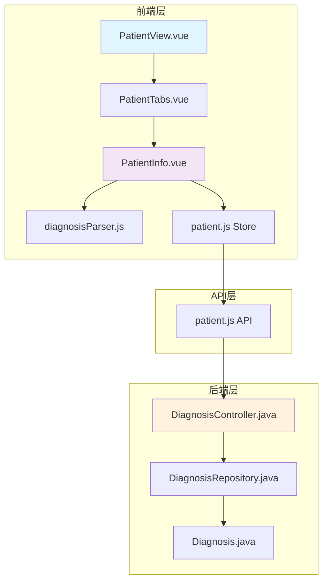
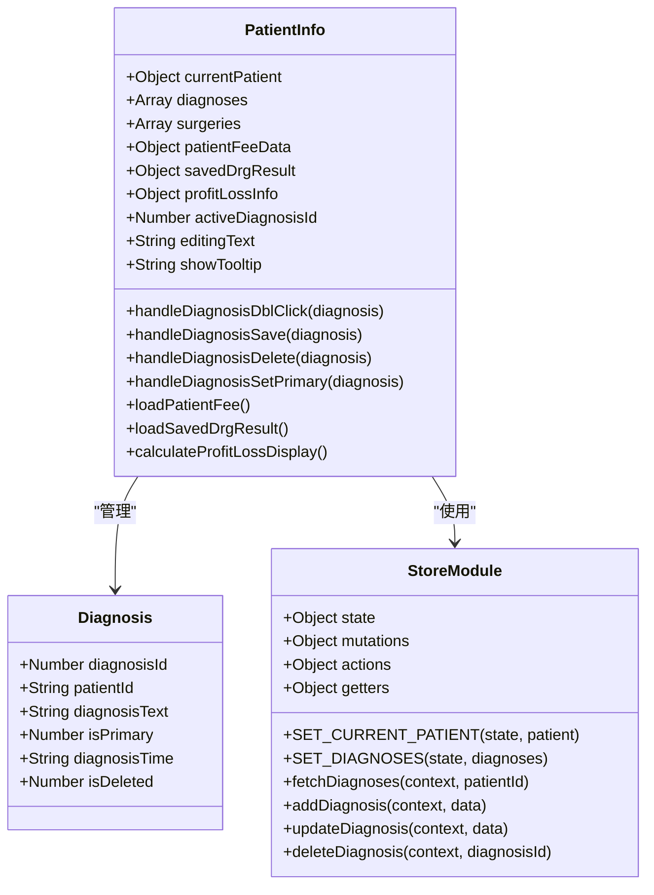
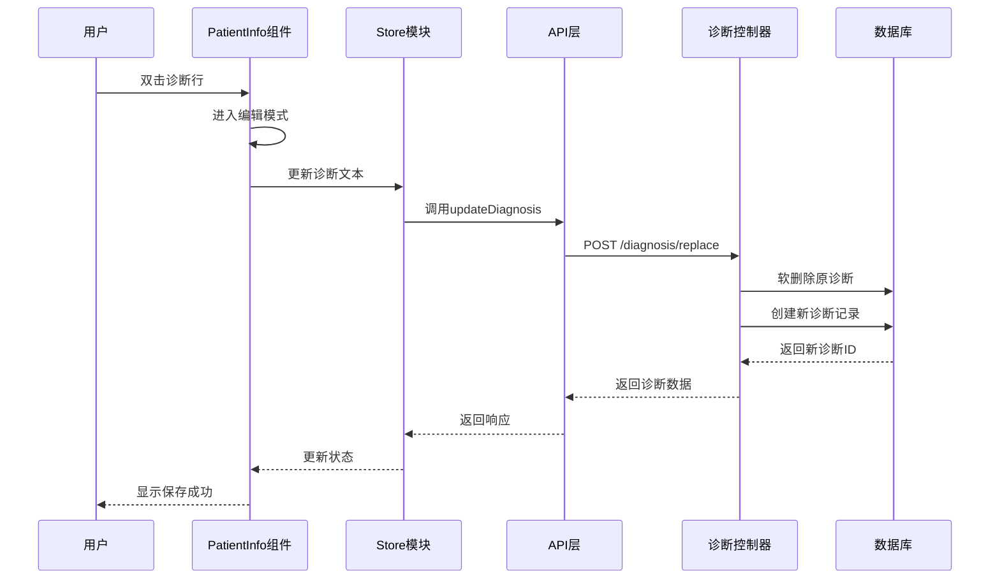
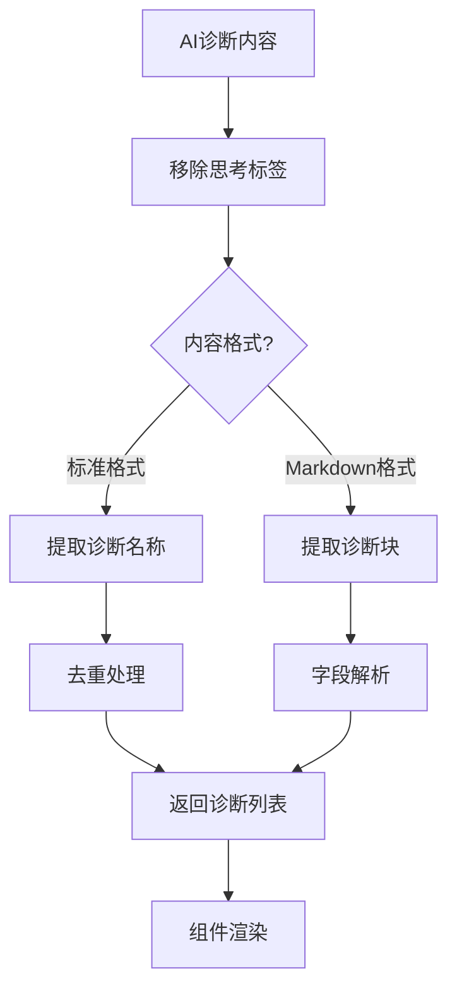
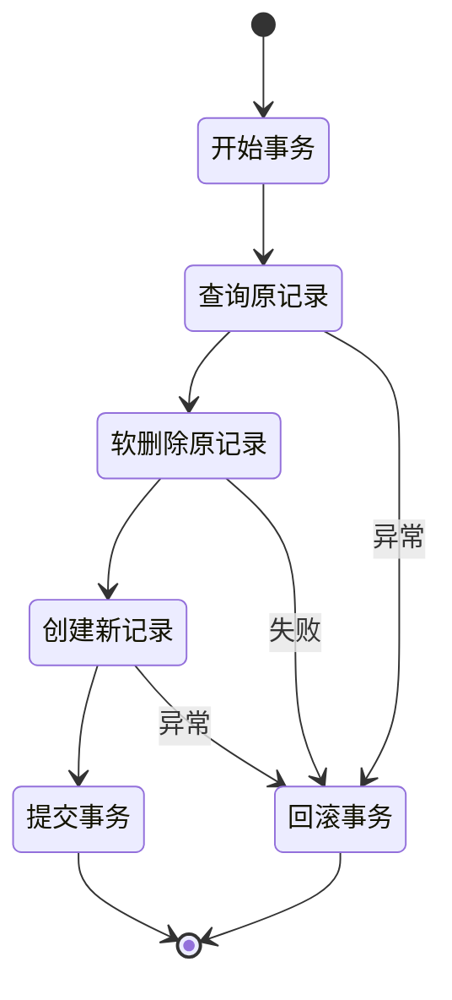

# 诊断编辑面板增强

<cite>
**本文档引用的文件**
- [PatientView.vue](file://med_ai_assistant_1.0_bs_vue/src/views/PatientView.vue)
- [PatientTabs.vue](file://med_ai_assistant_1.0_bs_vue/src/components/patient/PatientTabs.vue)
- [PatientInfo.vue](file://med_ai_assistant_1.0_bs_vue/src/components/patient/PatientInfo.vue)
- [diagnosisParser.js](file://med_ai_assistant_1.0_bs_vue/src/utils/diagnosisParser.js)
- [patient.js](file://med_ai_assistant_1.0_bs_vue/src/store/modules/patient.js)
- [DiagnosisController.java](file://med_ai_assistant_1.0_bs_backend/src/main/java/com/example/medaiassistant/controller/DiagnosisController.java)
- [Diagnosis.java](file://med_ai_assistant_1.0_bs_backend/src/main/java/com/example/medaiassistant/model/Diagnosis.java)
- [DiagnosisRepository.java](file://med_ai_assistant_1.0_bs_backend/src/main/java/com/example/medaiassistant/repository/DiagnosisRepository.java)
- [patient.js](file://med_ai_assistant_1.0_bs_vue/src/api/patient.js)
</cite>

## 目录
1. [项目概述](#项目概述)
2. [诊断编辑面板架构](#诊断编辑面板架构)
3. [核心组件分析](#核心组件分析)
4. [数据流分析](#数据流分析)
5. [诊断解析引擎](#诊断解析引擎)
6. [前后端交互机制](#前后端交互机制)
7. [性能优化策略](#性能优化策略)
8. [故障排除指南](#故障排除指南)
9. [总结](#总结)

## 项目概述

MedAiAssistant是一个基于Vue.js和Spring Boot开发的智能医疗辅助系统，专注于提供AI驱动的诊断支持和病历管理功能。诊断编辑面板是该系统的核心组件之一，为医生提供了直观、高效的诊断编辑和管理界面。

该系统通过AI技术分析患者的病历数据，提取诊断信息，并提供智能的诊断编辑功能。系统支持多种诊断格式的解析，包括标准的诊断列表和AI生成的Markdown格式诊断内容。

## 诊断编辑面板架构

### 整体架构设计



**图表来源**
- [PatientView.vue:1-64](file://med_ai_assistant_1.0_bs_vue/src/views/PatientView.vue#L1-L64)
- [PatientTabs.vue:1-122](file://med_ai_assistant_1.0_bs_vue/src/components/patient/PatientTabs.vue#L1-L122)
- [PatientInfo.vue:1-719](file://med_ai_assistant_1.0_bs_vue/src/components/patient/PatientInfo.vue#L1-L719)

### 组件层次结构

诊断编辑面板采用模块化设计，各个组件职责明确：

- **PatientView**: 主视图容器，管理患者列表和标签页布局
- **PatientTabs**: 标签页容器，包含多个子标签页
- **PatientInfo**: 诊断信息展示和编辑的核心组件
- **diagnosisParser**: 诊断解析工具，处理AI生成的诊断内容

**章节来源**
- [PatientView.vue:19-54](file://med_ai_assistant_1.0_bs_vue/src/views/PatientView.vue#L19-L54)
- [PatientTabs.vue:49-103](file://med_ai_assistant_1.0_bs_vue/src/components/patient/PatientTabs.vue#L49-L103)

## 核心组件分析

### PatientInfo 组件详解

PatientInfo组件是诊断编辑面板的核心，提供了完整的诊断管理和编辑功能：



**图表来源**
- [PatientInfo.vue:131-560](file://med_ai_assistant_1.0_bs_vue/src/components/patient/PatientInfo.vue#L131-L560)
- [Diagnosis.java:8-167](file://med_ai_assistant_1.0_bs_backend/src/main/java/com/example/medaiassistant/model/Diagnosis.java#L8-L167)

#### 诊断编辑功能特性

1. **双击编辑模式**: 支持双击诊断行进入编辑模式
2. **主诊断标记**: 通过特殊样式和标签标识主要诊断
3. **实时保存**: 编辑完成后自动保存到数据库
4. **删除确认**: 删除诊断前进行安全确认
5. **主诊断切换**: 支持在多个诊断间切换主要诊断

**章节来源**
- [PatientInfo.vue:416-497](file://med_ai_assistant_1.0_bs_vue/src/components/patient/PatientInfo.vue#L416-L497)
- [PatientInfo.vue:528-559](file://med_ai_assistant_1.0_bs_vue/src/components/patient/PatientInfo.vue#L528-L559)

### 诊断数据模型

后端使用标准化的诊断数据模型，支持完整的诊断生命周期管理：

| 字段名 | 类型 | 描述 | 约束 |
|--------|------|------|------|
| DiagnosisID | Integer | 诊断ID | 主键, 自增 |
| PatientID | String | 患者ID | 外键 |
| DiagnosisType | Integer | 诊断类型 | 可空 |
| ICD10Code | String | ICD-10编码 | 可空 |
| DiagnosisText | String | 诊断文本 | 必填 |
| DiagnosedBy | String | 诊断医生 | 可空 |
| DiagnosisTime | Date | 诊断时间 | 可空 |
| IsPrimary | Integer | 是否主要诊断 | 默认0 |
| ParentID | Integer | 父诊断ID | 可空 |
| StatusFlag | Integer | 状态标志 | 默认0 |
| ModificationType | Integer | 修改类型 | 可空 |
| AddReason | String | 添加原因 | 可空 |
| DiagnosisIndex | Integer | 诊断索引 | 可空 |
| is_deleted | Integer | 软删除标志 | 默认0 |

**章节来源**
- [Diagnosis.java:13-52](file://med_ai_assistant_1.0_bs_backend/src/main/java/com/example/medaiassistant/model/Diagnosis.java#L13-L52)

## 数据流分析

### 诊断编辑流程



**图表来源**
- [PatientInfo.vue:425-450](file://med_ai_assistant_1.0_bs_vue/src/components/patient/PatientInfo.vue#L425-L450)
- [patient.js:368-375](file://med_ai_assistant_1.0_bs_vue/src/store/modules/patient.js#L368-L375)
- [DiagnosisController.java:22-85](file://med_ai_assistant_1.0_bs_backend/src/main/java/com/example/medaiassistant/controller/DiagnosisController.java#L22-L85)

### 诊断加载流程

```mermaid
flowchart TD
A[组件挂载] --> B[获取患者ID]
B --> C{ID有效?}
C --> |否| D[返回]
C --> |是| E[调用API]
E --> F[fetchDiagnoses]
F --> G[API: GET /patients/{id}/diagnoses]
G --> H[数据库查询]
H --> I[返回诊断列表]
I --> J[格式化数据]
J --> K[更新Store状态]
K --> L[渲染UI]
```

**图表来源**
- [patient.js:315-333](file://med_ai_assistant_1.0_bs_vue/src/store/modules/patient.js#L315-L333)
- [patient.js:165-167](file://med_ai_assistant_1.0_bs_vue/src/api/patient.js#L165-L167)

**章节来源**
- [patient.js:128-186](file://med_ai_assistant_1.0_bs_vue/src/store/modules/patient.js#L128-L186)
- [patient.js:314-333](file://med_ai_assistant_1.0_bs_vue/src/store/modules/patient.js#L314-L333)

## 诊断解析引擎

### AI诊断内容解析

系统内置强大的诊断解析引擎，能够处理各种格式的AI生成诊断内容：



**图表来源**
- [diagnosisParser.js:23-75](file://med_ai_assistant_1.0_bs_vue/src/utils/diagnosisParser.js#L23-L75)
- [diagnosisParser.js:93-149](file://med_ai_assistant_1.0_bs_vue/src/utils/diagnosisParser.js#L93-L149)

### 解析算法实现

诊断解析引擎采用多阶段解析策略：

1. **预处理阶段**: 移除AI输出中的思考标签
2. **格式检测**: 识别诊断内容的具体格式
3. **内容提取**: 使用正则表达式提取诊断信息
4. **数据验证**: 确保解析结果的有效性
5. **格式化输出**: 转换为组件可用的数据格式

**章节来源**
- [diagnosisParser.js:39-75](file://med_ai_assistant_1.0_bs_vue/src/utils/diagnosisParser.js#L39-L75)
- [diagnosisParser.js:157-219](file://med_ai_assistant_1.0_bs_vue/src/utils/diagnosisParser.js#L157-L219)

## 前后端交互机制

### RESTful API设计

系统采用RESTful API设计，提供完整的诊断管理功能：

| 端点 | 方法 | 功能 | 请求体 | 响应 |
|------|------|------|--------|------|
| `/api/diagnosis/replace` | POST | 替换诊断 | ReplaceDiagnosisDTO | Diagnosis |
| `/api/diagnosis/combined/{patientId}` | GET | 获取组合诊断 | - | String |
| `/api/diagnosis/names/{patientId}` | GET | 获取诊断名称列表 | - | List<String> |
| `/api/diagnosis/{diagnosisId}/set-primary` | PUT | 设为主要诊断 | - | Diagnosis |

### 事务管理策略

后端使用Spring Transactional注解确保诊断操作的原子性：



**图表来源**
- [DiagnosisController.java:22-85](file://med_ai_assistant_1.0_bs_backend/src/main/java/com/example/medaiassistant/controller/DiagnosisController.java#L22-L85)

**章节来源**
- [DiagnosisController.java:16-85](file://med_ai_assistant_1.0_bs_backend/src/main/java/com/example/medaiassistant/controller/DiagnosisController.java#L16-L85)
- [DiagnosisRepository.java:14-35](file://med_ai_assistant_1.0_bs_backend/src/main/java/com/example/medaiassistant/repository/DiagnosisRepository.java#L14-L35)

## 性能优化策略

### 前端性能优化

1. **懒加载机制**: 标签页切换时才加载检查报告数据
2. **缓存策略**: 使用Vuex状态管理缓存诊断数据
3. **防抖处理**: 输入框内容变更使用防抖减少API调用
4. **虚拟滚动**: 大数据量时使用虚拟滚动提升渲染性能

### 后端性能优化

1. **批量操作**: 支持批量重置主要诊断状态
2. **索引优化**: 为常用查询字段建立数据库索引
3. **连接池管理**: 优化数据库连接池配置
4. **缓存层**: 使用Redis缓存热点数据

**章节来源**
- [PatientTabs.vue:86-101](file://med_ai_assistant_1.0_bs_vue/src/components/patient/PatientTabs.vue#L86-L101)
- [patient.js:128-186](file://med_ai_assistant_1.0_bs_vue/src/store/modules/patient.js#L128-L186)

## 故障排除指南

### 常见问题及解决方案

| 问题类型 | 症状 | 可能原因 | 解决方案 |
|----------|------|----------|----------|
| 诊断无法保存 | 编辑后无变化 | API调用失败 | 检查网络连接和后端服务状态 |
| 诊断列表为空 | 页面显示"暂无诊断信息" | 数据库查询异常 | 验证患者ID和数据库连接 |
| 主诊断切换失败 | 点击无效 | 权限不足或数据错误 | 检查用户权限和诊断状态 |
| AI诊断解析失败 | 诊断内容显示异常 | 格式不兼容 | 检查AI输出格式和解析器版本 |

### 调试工具和方法

1. **浏览器开发者工具**: 监控API请求和响应
2. **Vue DevTools**: 调试组件状态和数据流
3. **后端日志**: 分析数据库查询和事务执行
4. **性能分析**: 使用性能监控工具识别瓶颈

**章节来源**
- [PatientInfo.vue:446-473](file://med_ai_assistant_1.0_bs_vue/src/components/patient/PatientInfo.vue#L446-L473)
- [DiagnosisController.java:81-84](file://med_ai_assistant_1.0_bs_backend/src/main/java/com/example/medaiassistant/controller/DiagnosisController.java#L81-L84)

## 总结

诊断编辑面板增强了MedAiAssistant系统的智能化水平，通过以下关键特性实现了高效的诊断管理：

1. **直观的用户界面**: 提供双击编辑、主诊断标记等人性化功能
2. **强大的解析能力**: 支持多种格式的AI诊断内容解析
3. **可靠的后端支持**: 基于Spring Boot的RESTful API和事务管理
4. **完善的错误处理**: 全面的异常捕获和用户反馈机制
5. **性能优化策略**: 前后端协同的性能优化方案

该系统为医疗工作者提供了高效、准确的诊断编辑工具，显著提升了临床工作效率和诊断质量。通过持续的技术改进和功能扩展，系统将继续为智慧医疗发展贡献力量。