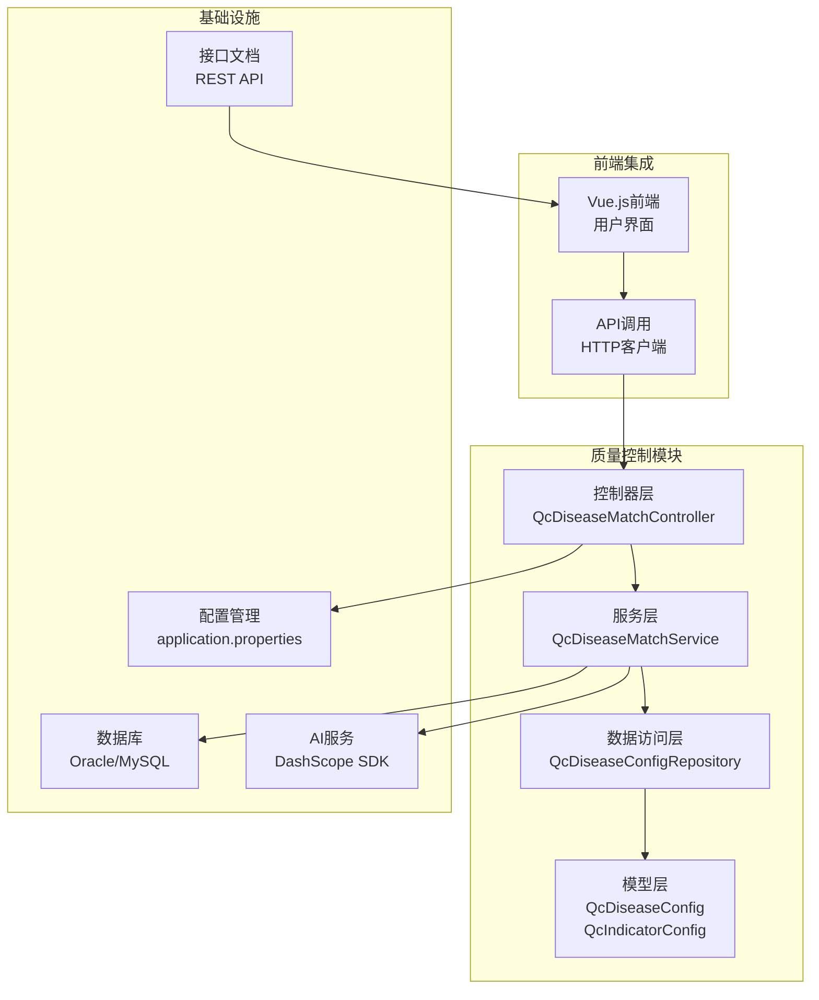
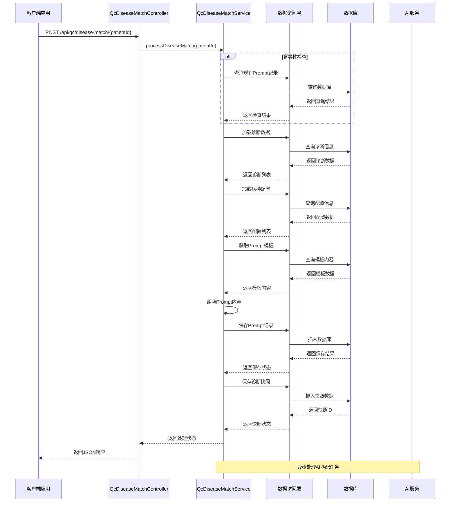
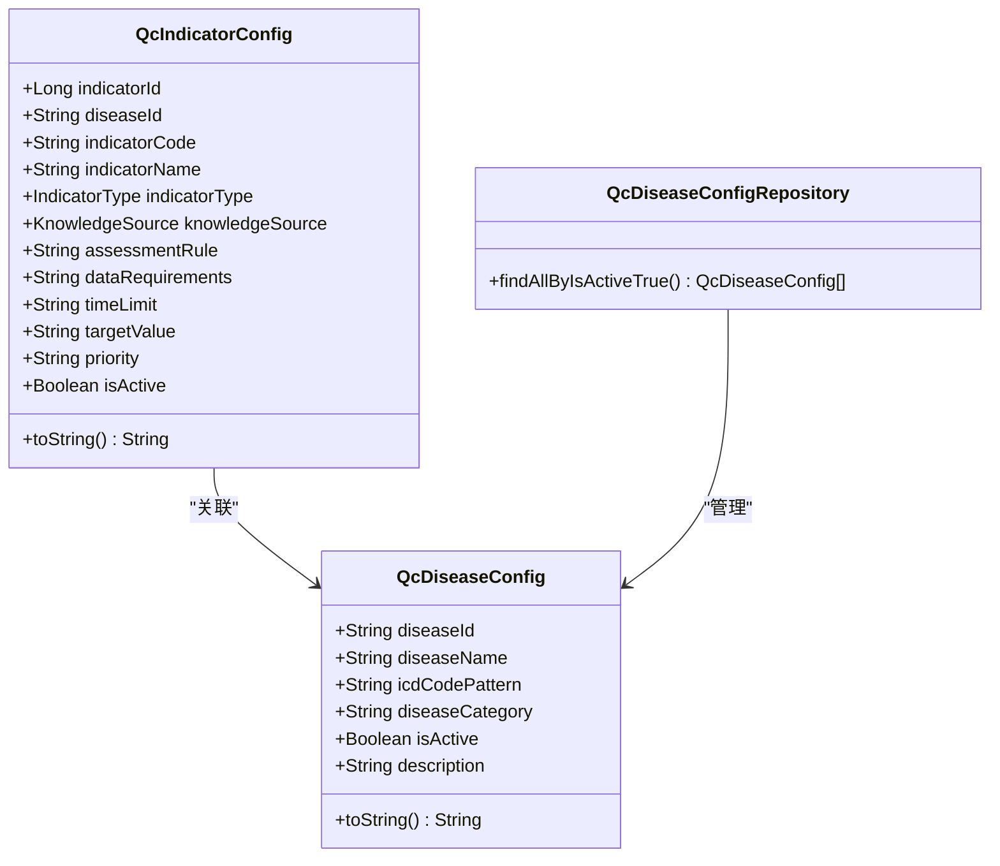
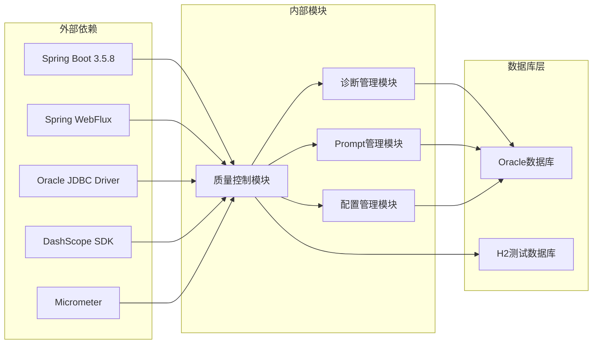
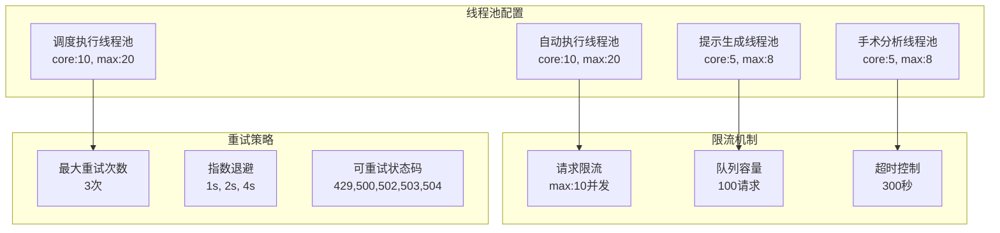

# 质量控制系统

<cite>
**本文档引用的文件**
- [pom.xml](file://med_ai_assistant_1.0_bs_backend/pom.xml)
- [application.properties](file://med_ai_assistant_1.0_bs_backend/src/main/resources/application.properties)
- [QcDiseaseMatchController.java](file://med_ai_assistant_1.0_bs_backend/src/main/java/com/example/medaiassistant/controller/QcDiseaseMatchController.java)
- [QcDiseaseMatchService.java](file://med_ai_assistant_1.0_bs_backend/src/main/java/com/example/medaiassistant/service/qc/QcDiseaseMatchService.java)
- [QcDiseaseConfig.java](file://med_ai_assistant_1.0_bs_backend/src/main/java/com/example/medaiassistant/model/qc/QcDiseaseConfig.java)
- [QcIndicatorConfig.java](file://med_ai_assistant_1.0_bs_backend/src/main/java/com/example/medaiassistant/model/qc/QcIndicatorConfig.java)
- [QcDiseaseConfigRepository.java](file://med_ai_assistant_1.0_bs_backend/src/main/java/com/example/medaiassistant/repository/qc/QcDiseaseConfigRepository.java)
- [create-qc-disease-config-table.sql](file://med_ai_assistant_1.0_bs_backend/sql-scripts/create-qc-disease-config-table.sql)
- [create-qc-indicator-config-table.sql](file://med_ai_assistant_1.0_bs_backend/sql-scripts/create-qc-indicator-config-table.sql)
- [质控病种匹配接口.md](file://med_ai_assistant_1.0_bs_backend/doc/接口/质控病种匹配接口.md)
</cite>

## 目录
1. [简介](#简介)
2. [项目结构](#项目结构)
3. [核心组件](#核心组件)
4. [架构概览](#架构概览)
5. [详细组件分析](#详细组件分析)
6. [依赖关系分析](#依赖关系分析)
7. [性能考虑](#性能考虑)
8. [故障排除指南](#故障排除指南)
9. [结论](#结论)

## 简介

质量控制系统是MedAiAssistant项目中的核心模块，专门负责医疗质量控制和临床路径管理。该系统基于AI技术为医生提供智能化的临床决策支持，通过质控病种匹配、指标评估和持续改进机制，帮助医疗机构提升医疗质量和患者安全。

系统采用现代化的微服务架构，结合Spring Boot、Spring WebFlux、JPA/Hibernate等技术栈，实现了高可用、高性能的医疗质量控制平台。通过标准化的接口设计和完善的监控机制，为临床医生提供可靠的AI辅助决策支持。

## 项目结构

**图表来源**
- [QcDiseaseMatchController.java:1-222](file://med_ai_assistant_1.0_bs_backend/src/main/java/com/example/medaiassistant/controller/QcDiseaseMatchController.java#L1-L222)
- [QcDiseaseMatchService.java:1-473](file://med_ai_assistant_1.0_bs_backend/src/main/java/com/example/medaiassistant/service/qc/QcDiseaseMatchService.java#L1-L473)
- [QcDiseaseConfigRepository.java:1-36](file://med_ai_assistant_1.0_bs_backend/src/main/java/com/example/medaiassistant/repository/qc/QcDiseaseConfigRepository.java#L1-L36)

**章节来源**
- [pom.xml:1-309](file://med_ai_assistant_1.0_bs_backend/pom.xml#L1-L309)
- [application.properties:1-312](file://med_ai_assistant_1.0_bs_backend/src/main/resources/application.properties#L1-L312)

## 核心组件

### 控制器层
质量控制模块的控制器层提供了完整的REST API接口，包括：
- 病种匹配触发接口：POST /api/qc/disease-match/{patientId}
- 最新结果查询接口：GET /api/qc/disease-match/{patientId}/latest
- 诊断变更检测接口：POST /api/qc/disease-match/{patientId}/check-and-trigger
- 病种配置查询接口：GET /api/qc/disease-configs

### 服务层
服务层实现了核心业务逻辑，包括：
- 幂等性检查机制，防止重复生成匹配任务
- 诊断数据处理和指纹计算
- AI Prompt模板管理和内容组装
- 诊断快照保存和历史追踪

### 数据访问层
数据访问层提供了对质控相关数据的持久化操作：
- 疾病配置管理（QcDiseaseConfigRepository）
- 指标配置管理
- 诊断快照存储
- Prompt结果管理

**章节来源**
- [QcDiseaseMatchController.java:18-222](file://med_ai_assistant_1.0_bs_backend/src/main/java/com/example/medaiassistant/controller/QcDiseaseMatchController.java#L18-L222)
- [QcDiseaseMatchService.java:25-473](file://med_ai_assistant_1.0_bs_backend/src/main/java/com/example/medaiassistant/service/qc/QcDiseaseMatchService.java#L25-L473)
- [QcDiseaseConfigRepository.java:9-36](file://med_ai_assistant_1.0_bs_backend/src/main/java/com/example/medaiassistant/repository/qc/QcDiseaseConfigRepository.java#L9-L36)

## 架构概览

**图表来源**
- [QcDiseaseMatchController.java:80-119](file://med_ai_assistant_1.0_bs_backend/src/main/java/com/example/medaiassistant/controller/QcDiseaseMatchController.java#L80-L119)
- [QcDiseaseMatchService.java:152-234](file://med_ai_assistant_1.0_bs_backend/src/main/java/com/example/medaiassistant/service/qc/QcDiseaseMatchService.java#L152-L234)

## 详细组件分析

### 疾病配置实体分析

**图表来源**
- [QcDiseaseConfig.java:19-203](file://med_ai_assistant_1.0_bs_backend/src/main/java/com/example/medaiassistant/model/qc/QcDiseaseConfig.java#L19-L203)
- [QcIndicatorConfig.java:23-371](file://med_ai_assistant_1.0_bs_backend/src/main/java/com/example/medaiassistant/model/qc/QcIndicatorConfig.java#L23-L371)
- [QcDiseaseConfigRepository.java:23-36](file://med_ai_assistant_1.0_bs_backend/src/main/java/com/example/medaiassistant/repository/qc/QcDiseaseConfigRepository.java#L23-L36)

### 诊断匹配服务流程

**图表来源**
- [QcDiseaseMatchService.java:152-234](file://med_ai_assistant_1.0_bs_backend/src/main/java/com/example/medaiassistant/service/qc/QcDiseaseMatchService.java#L152-L234)

### 接口设计分析

系统提供了完整的REST API接口，支持以下核心功能：

| 接口名称 | HTTP方法 | 路径 | 功能描述 |
|---------|---------|------|----------|
| 触发匹配 | POST | /api/qc/disease-match/{patientId} | 为指定患者触发AI诊断匹配 |
| 查询结果 | GET | /api/qc/disease-match/{patientId}/latest | 获取患者最新匹配结果 |
| 检查触发 | POST | /api/qc/disease-match/{patientId}/check-and-trigger | 检测诊断变更并按需触发 |
| 配置列表 | GET | /api/qc/disease-configs | 获取所有启用的病种配置 |

**章节来源**
- [QcDiseaseMatchController.java:80-220](file://med_ai_assistant_1.0_bs_backend/src/main/java/com/example/medaiassistant/controller/QcDiseaseMatchController.java#L80-L220)
- [质控病种匹配接口.md:1-171](file://med_ai_assistant_1.0_bs_backend/doc/接口/质控病种匹配接口.md#L1-L171)

## 依赖关系分析

**图表来源**
- [pom.xml:53-214](file://med_ai_assistant_1.0_bs_backend/pom.xml#L53-L214)

系统的关键技术栈包括：
- **Spring Boot 3.5.8**: 提供基础框架和自动配置
- **Spring WebFlux**: 支持响应式编程和异步处理
- **Oracle JDBC Driver**: 数据库连接和操作
- **DashScope SDK**: 阿里云百炼AI服务集成
- **Micrometer**: 监控和指标收集
- **Lombok**: 代码简化和样板代码消除

**章节来源**
- [pom.xml:29-214](file://med_ai_assistant_1.0_bs_backend/pom.xml#L29-L214)

## 性能考虑

### 数据库优化策略

系统采用了多项数据库性能优化措施：

1. **连接池配置优化**
   - 最大连接数：15个
   - 最小空闲连接：3个
   - 连接超时时间：10秒
   - 连接生命周期：30分钟

2. **索引策略**
   - 疾病配置表：按疾病分类和启用状态建立复合索引
   - 指标配置表：按疾病ID和启用状态建立索引

3. **查询优化**
   - 使用原生SQL查询减少ORM开销
   - 实施分页查询避免大数据集加载
   - 缓存常用配置数据

### 并发处理机制

**图表来源**
- [application.properties:140-222](file://med_ai_assistant_1.0_bs_backend/src/main/resources/application.properties#L140-L222)

## 故障排除指南

### 常见问题及解决方案

1. **数据库连接问题**
   - 检查Oracle数据库连接配置
   - 验证连接池参数设置
   - 确认网络连通性和防火墙设置

2. **AI服务集成问题**
   - 验证DashScope API密钥配置
   - 检查网络代理设置
   - 确认API调用超时参数

3. **性能问题排查**
   - 监控线程池使用情况
   - 检查数据库查询性能
   - 分析内存使用情况

4. **接口调用异常**
   - 查看详细的错误日志
   - 验证请求参数格式
   - 检查权限和认证配置

### 监控和告警

系统集成了完整的监控和告警机制：

- **系统健康监控**：磁盘使用率、线程数、响应时间阈值
- **业务指标监控**：吞吐量、响应时间、成功率阈值
- **告警配置**：邮件通知、告警抑制、最大活动告警数

**章节来源**
- [application.properties:234-268](file://med_ai_assistant_1.0_bs_backend/src/main/resources/application.properties#L234-L268)

## 结论

质量控制系统作为MedAiAssistant项目的核心模块，展现了现代医疗AI系统的最佳实践。通过模块化的架构设计、完善的接口规范和强大的技术支撑，系统能够为医疗机构提供可靠的AI辅助决策支持。

系统的主要优势包括：
- **高可用性**：通过微服务架构和负载均衡实现系统稳定性
- **可扩展性**：模块化设计支持功能扩展和性能优化
- **可靠性**：完善的监控、告警和故障恢复机制
- **易用性**：清晰的API设计和详细的文档支持

未来的发展方向包括：
- 进一步优化AI模型集成
- 增强数据分析和可视化功能
- 扩展更多医疗质量控制场景
- 提升系统的智能化水平

通过持续的技术创新和功能完善，质量控制系统将继续为提升医疗质量和患者安全做出重要贡献。