# 质量控制系统

<cite>
**本文档引用的文件**
- [pom.xml](file://med_ai_assistant_1.0_bs_backend/pom.xml)
- [application.properties](file://med_ai_assistant_1.0_bs_backend/src/main/resources/application.properties)
- [QcDiseaseMatchController.java](file://med_ai_assistant_1.0_bs_backend/src/main/java/com/example/medaiassistant/controller/QcDiseaseMatchController.java)
- [QcDiseaseMatchService.java](file://med_ai_assistant_1.0_bs_backend/src/main/java/com/example/medaiassistant/service/qc/QcDiseaseMatchService.java)
- [QcAssessmentService.java](file://med_ai_assistant_1.0_bs_backend/src/main/java/com/example/medaiassistant/service/qc/QcAssessmentService.java)
- [QcAssessmentResult.java](file://med_ai_assistant_1.0_bs_backend/src/main/java/com/example/medaiassistant/model/qc/QcAssessmentResult.java)
- [QcDiseaseConfig.java](file://med_ai_assistant_1.0_bs_backend/src/main/java/com/example/medaiassistant/model/qc/QcDiseaseConfig.java)
- [QcIndicatorConfig.java](file://med_ai_assistant_1.0_bs_backend/src/main/java/com/example/medaiassistant/model/qc/QcIndicatorConfig.java)
- [QcConfirmedDisease.java](file://med_ai_assistant_1.0_bs_backend/src/main/java/com/example/medaiassistant/model/qc/QcConfirmedDisease.java)
- [QcDiseaseConfigRepository.java](file://med_ai_assistant_1.0_bs_backend/src/main/java/com/example/medaiassistant/repository/qc/QcDiseaseConfigRepository.java)
- [QcConfirmedDiseaseRepository.java](file://med_ai_assistant_1.0_bs_backend/src/main/java/com/example/medaiassistant/repository/qc/QcConfirmedDiseaseRepository.java)
- [QcAssessmentResultRepository.java](file://med_ai_assistant_1.0_bs_backend/src/main/java/com/example/medaiassistant/repository/qc/QcAssessmentResultRepository.java)
- [ConfirmDiseaseRequest.java](file://med_ai_assistant_1.0_bs_backend/src/main/java/com/example/medaiassistant/dto/qc/ConfirmDiseaseRequest.java)
- [create-qc-disease-config-table.sql](file://med_ai_assistant_1.0_bs_backend/sql-scripts/create-qc-disease-config-table.sql)
- [create-qc-confirmed-disease-table.sql](file://med_ai_assistant_1.0_bs_backend/sql-scripts/create-qc-confirmed-disease-table.sql)
- [create-qc-assessment-result-table.sql](file://med_ai_assistant_1.0_bs_backend/sql-scripts/create-qc-assessment-result-table.sql)
- [create-qc-indicator-config-table.sql](file://med_ai_assistant_1.0_bs_backend/sql-scripts/create-qc-indicator-config-table.sql)
- [DiseaseConfirmationPanel.vue](file://med_ai_assistant_1.0_bs_vue/src/components/qc/DiseaseConfirmationPanel.vue)
- [ToolbarPanel.vue](file://med_ai_assistant_1.0_bs_vue/src/components/qc/ToolbarPanel.vue)
- [ClinicalGuidanceTab.vue](file://med_ai_assistant_1.0_bs_vue/src/components/qc/ClinicalGuidanceTab.vue)
- [qc.js](file://med_ai_assistant_1.0_bs_vue/src/api/qc.js)
- [ai.js](file://med_ai_assistant_1.0_bs_vue/src/api/ai.js)
- [AIResults.vue](file://med_ai_assistant_1.0_bs_vue/src/components/ai/AIResults.vue)
- [PromptList.vue](file://med_ai_assistant_1.0_bs_vue/src/components/ai/PromptList.vue)
- [AIController.java](file://med_ai_assistant_1.0_bs_backend/src/main/java/com/example/medaiassistant/controller/AIController.java)
- [AutoExecuteController.java](file://med_ai_assistant_1.0_bs_backend/src/main/java/com/example/medaiassistant/controller/AutoExecuteController.java)
- [质控病种匹配接口.md](file://med_ai_assistant_1.0_bs_backend/doc/接口/质控病种匹配接口.md)
- [更新小结.md](file://更新小结.md)
- [2026-04-20.md](file://med_ai_assistant_1.0_bs_backend/doc/更新日志/2026-04-20.md)
- [2026-04-20.md](file://med_ai_assistant_1.0_bs_vue/docs/更新日志/2026-04-20.md)
</cite>

## 更新摘要
**所做更改**
- 新增了质控评估数据直接集成到治疗计划生成的功能说明
- 更新了质控评估详情页面真实数据对接的实现细节
- 新增了质控重要性指标和实时数据集成功能的架构分析
- 更新了版本0.8.050和0.8.049的变更影响分析
- 完善了前端组件与后端服务的集成关系说明
- 新增了重新分析功能的完整实现和测试覆盖
- 完善了病种确认持久化的版本控制和历史追踪机制

## 目录
1. [简介](#简介)
2. [项目结构](#项目结构)
3. [核心组件](#核心组件)
4. [架构概览](#架构概览)
5. [详细组件分析](#详细组件分析)
6. [QC评估重新分析功能](#qc评估重新分析功能)
7. [病种确认持久化功能](#病种确认持久化功能)
8. [前端集成分析](#前端集成分析)
9. [质控评估数据集成到治疗计划](#质控评估数据集成到治疗计划)
10. [实时数据集成功能](#实时数据集成功能)
11. [依赖关系分析](#依赖关系分析)
12. [性能考虑](#性能考虑)
13. [故障排除指南](#故障排除指南)
14. [结论](#结论)

## 简介

质量控制系统是MedAiAssistant项目中的核心模块，专门负责医疗质量控制和临床路径管理。该系统基于AI技术为医生提供智能化的临床决策支持，通过质控病种匹配、指标评估和持续改进机制，帮助医疗机构提升医疗质量和患者安全。

系统采用现代化的微服务架构，结合Spring Boot、Spring WebFlux、JPA/Hibernate等技术栈，实现了高可用、高性能的医疗质量控制平台。通过标准化的接口设计和完善的监控机制，为临床医生提供可靠的AI辅助决策支持。

**更新** 根据版本0.8.050和0.8.049的变更，系统现已实现QC质量控制评估数据直接集成到治疗计划生成，以及QC评估详情页面的真实数据对接。新增了质控重要性指标和实时数据集成功能，进一步提升了系统的智能化水平和实用性。

## 项目结构

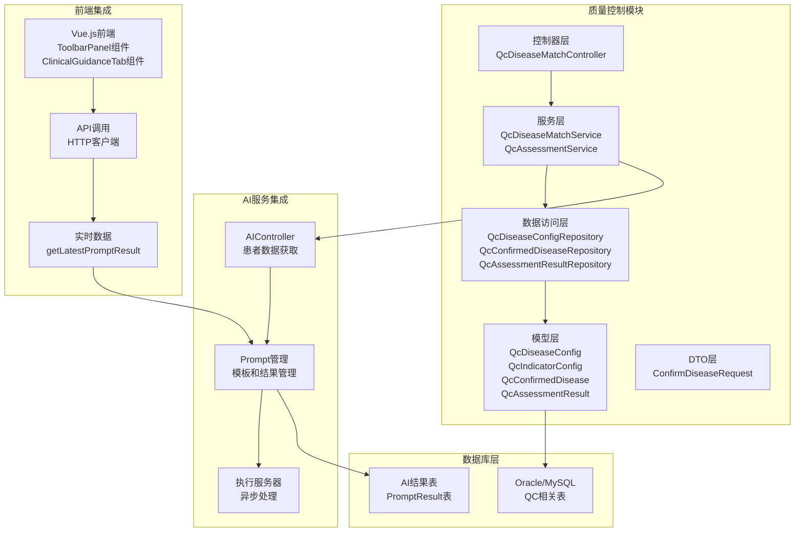
```mermaid
graph TB
subgraph "质量控制模块"
A[控制器层<br/>QcDiseaseMatchController]
B[服务层<br/>QcDiseaseMatchService<br/>QcAssessmentService]
C[数据访问层<br/>QcDiseaseConfigRepository<br/>QcConfirmedDiseaseRepository<br/>QcAssessmentResultRepository]
D[模型层<br/>QcDiseaseConfig<br/>QcIndicatorConfig<br/>QcConfirmedDisease<br/>QcAssessmentResult]
E[DTO层<br/>ConfirmDiseaseRequest]
end
subgraph "AI服务集成"
F[AIController<br/>患者数据获取]
G[Prompt管理<br/>模板和结果管理]
H[执行服务器<br/>异步处理]
end
subgraph "前端集成"
I[Vue.js前端<br/>ToolbarPanel组件<br/>ClinicalGuidanceTab组件]
J[API调用<br/>HTTP客户端]
K[实时数据<br/>getLatestPromptResult]
end
subgraph "数据库层"
L[Oracle/MySQL<br/>QC相关表]
M[AI结果表<br/>PromptResult表]
end
A --> B
B --> C
C --> D
B --> F
F --> G
G --> H
I --> J
J --> K
K --> G
D --> L
G --> M
```

**图表来源**
- [QcDiseaseMatchController.java:1-369](file://med_ai_assistant_1.0_bs_backend/src/main/java/com/example/medaiassistant/controller/QcDiseaseMatchController.java#L1-L369)
- [QcAssessmentService.java:1-296](file://med_ai_assistant_1.0_bs_backend/src/main/java/com/example/medaiassistant/service/qc/QcAssessmentService.java#L1-L296)
- [AIController.java:1-268](file://med_ai_assistant_1.0_bs_backend/src/main/java/com/example/medaiassistant/controller/AIController.java#L1-L268)
- [ClinicalGuidanceTab.vue:1-750](file://med_ai_assistant_1.0_bs_vue/src/components/qc/ClinicalGuidanceTab.vue#L1-L750)

**章节来源**
- [pom.xml:1-309](file://med_ai_assistant_1.0_bs_backend/pom.xml#L1-L309)
- [application.properties:1-312](file://med_ai_assistant_1.0_bs_backend/src/main/resources/application.properties#L1-L312)

## 核心组件

### 控制器层
质量控制模块的控制器层提供了完整的REST API接口，包括：
- 病种匹配触发接口：POST /api/qc/disease-match/{patientId}
- 最新结果查询接口：GET /api/qc/disease-match/{patientId}/latest
- 诊断变更检测接口：POST /api/qc/disease-match/{patientId}/check-and-trigger
- 病种配置查询接口：GET /api/qc/disease-configs
- **新增** 病种确认接口：POST /api/qc/disease-match/confirm
- **新增** 已确认病种查询接口：GET /api/qc/disease-match/{patientId}/confirmed
- **新增** 重新分析接口：POST /api/qc/assessment/{patientId}/reanalyze
- **新增** 评估结果查询接口：通过getLatestPromptResult获取QC评估结果

### 服务层
服务层实现了核心业务逻辑，包括：
- 幂等性检查机制，防止重复生成匹配任务
- 诊断数据处理和指纹计算
- AI Prompt模板管理和内容组装
- 诊断快照保存和历史追踪
- **新增** 病种确认持久化服务，支持历史版本管理
- **新增** QC评估重新分析服务，支持第三阶段AI质控评估
- **新增** 患者数据获取服务，支持降级处理机制

### 数据访问层
数据访问层提供了对质控相关数据的持久化操作：
- 疾病配置管理（QcDiseaseConfigRepository）
- 指标配置管理
- 诊断快照存储
- Prompt结果管理
- **新增** 病种确认持久化（QcConfirmedDiseaseRepository）
- **新增** 评估结果存储（QcAssessmentResultRepository）

### DTO层
**新增** 病种确认请求DTO，封装医师确认操作的数据结构：
- 患者ID和确认病种列表
- 病种基本信息和匹配依据
- 可选备注信息

**章节来源**
- [QcDiseaseMatchController.java:65-127](file://med_ai_assistant_1.0_bs_backend/src/main/java/com/example/medaiassistant/controller/QcDiseaseMatchController.java#L65-L127)
- [QcAssessmentService.java:20-296](file://med_ai_assistant_1.0_bs_backend/src/main/java/com/example/medaiassistant/service/qc/QcAssessmentService.java#L20-L296)
- [ConfirmDiseaseRequest.java:1-197](file://med_ai_assistant_1.0_bs_backend/src/main/java/com/example/medaiassistant/dto/qc/ConfirmDiseaseRequest.java#L1-L197)

## 架构概览

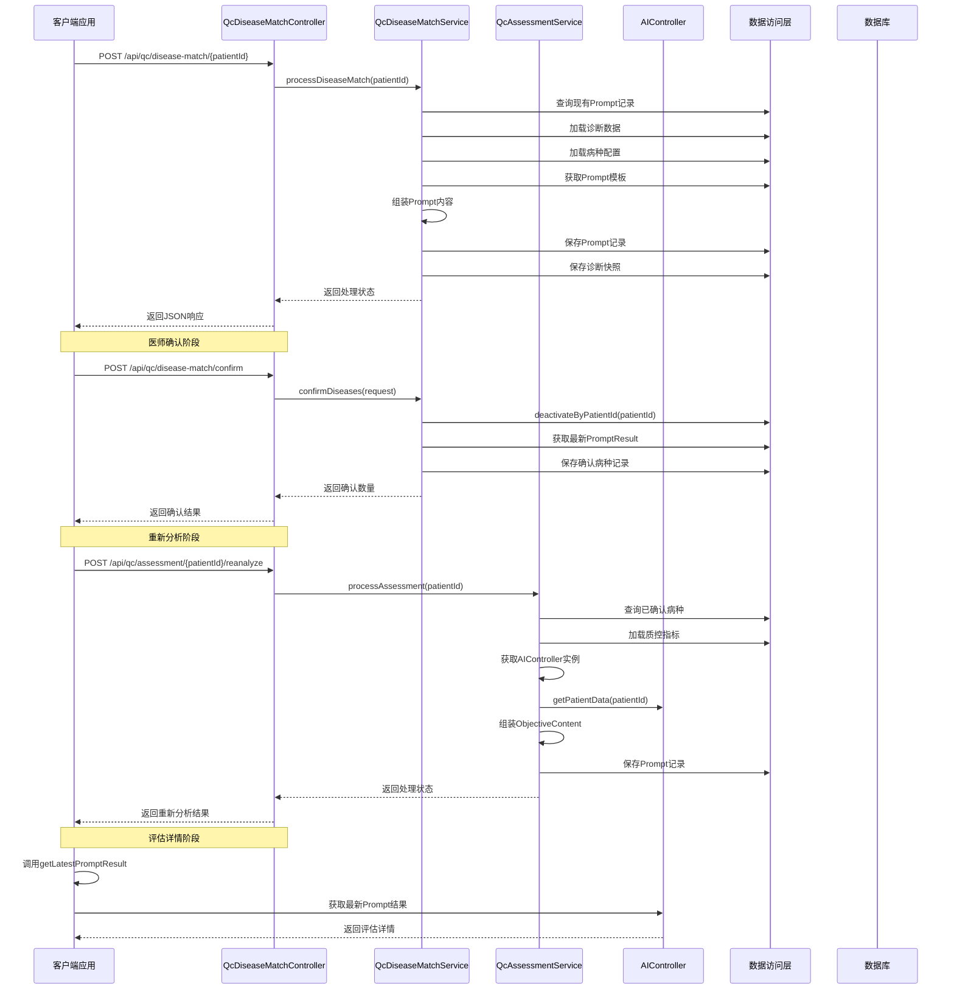
```mermaid
sequenceDiagram
participant Client as 客户端应用
participant Controller as QcDiseaseMatchController
participant DiseaseService as QcDiseaseMatchService
participant AssessmentService as QcAssessmentService
participant AIController as AIController
participant Repo as 数据访问层
participant DB as 数据库
Client->>Controller : POST /api/qc/disease-match/{patientId}
Controller->>DiseaseService : processDiseaseMatch(patientId)
DiseaseService->>Repo : 查询现有Prompt记录
DiseaseService->>Repo : 加载诊断数据
DiseaseService->>Repo : 加载病种配置
DiseaseService->>Repo : 获取Prompt模板
DiseaseService->>DiseaseService : 组装Prompt内容
DiseaseService->>Repo : 保存Prompt记录
DiseaseService->>Repo : 保存诊断快照
DiseaseService-->>Controller : 返回处理状态
Controller-->>Client : 返回JSON响应
Note over Client,Controller : 医师确认阶段
Client->>Controller : POST /api/qc/disease-match/confirm
Controller->>DiseaseService : confirmDiseases(request)
DiseaseService->>Repo : deactivateByPatientId(patientId)
DiseaseService->>Repo : 获取最新PromptResult
DiseaseService->>Repo : 保存确认病种记录
DiseaseService-->>Controller : 返回确认数量
Controller-->>Client : 返回确认结果
Note over Client,Controller : 重新分析阶段
Client->>Controller : POST /api/qc/assessment/{patientId}/reanalyze
Controller->>AssessmentService : processAssessment(patientId)
AssessmentService->>Repo : 查询已确认病种
AssessmentService->>Repo : 加载质控指标
AssessmentService->>AssessmentService : 获取AIController实例
AssessmentService->>AIController : getPatientData(patientId)
AssessmentService->>AssessmentService : 组装ObjectiveContent
AssessmentService->>Repo : 保存Prompt记录
AssessmentService-->>Controller : 返回处理状态
Controller-->>Client : 返回重新分析结果
Note over Client,Controller : 评估详情阶段
Client->>Client : 调用getLatestPromptResult
Client->>AIController : 获取最新Prompt结果
AIController-->>Client : 返回评估详情
```

**图表来源**
- [QcDiseaseMatchController.java:78-127](file://med_ai_assistant_1.0_bs_backend/src/main/java/com/example/medaiassistant/controller/QcDiseaseMatchController.java#L78-L127)
- [QcAssessmentService.java:137-223](file://med_ai_assistant_1.0_bs_backend/src/main/java/com/example/medaiassistant/service/qc/QcAssessmentService.java#L137-L223)
- [AIController.java:236-268](file://med_ai_assistant_1.0_bs_backend/src/main/java/com/example/medaiassistant/controller/AIController.java#L236-L268)

## 详细组件分析

### 疾病配置实体分析

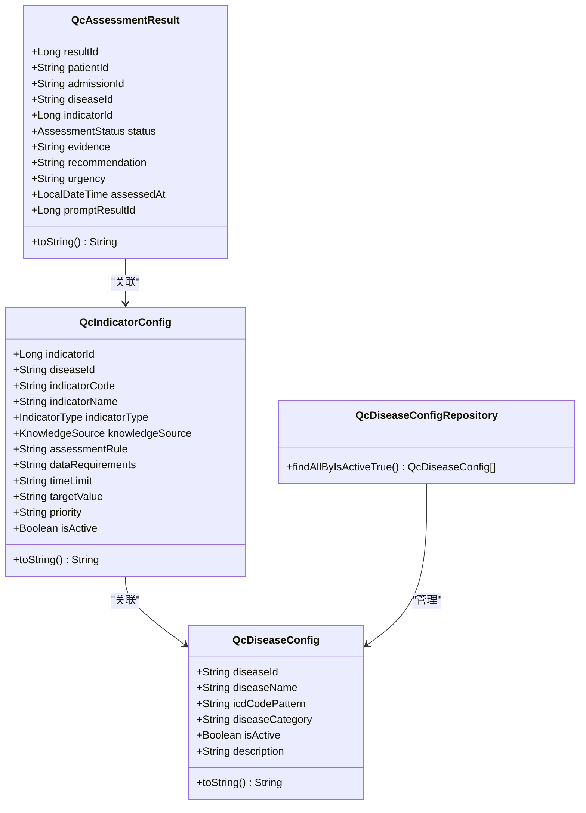
```mermaid
classDiagram
class QcDiseaseConfig {
+String diseaseId
+String diseaseName
+String icdCodePattern
+String diseaseCategory
+Boolean isActive
+String description
+toString() String
}
class QcIndicatorConfig {
+Long indicatorId
+String diseaseId
+String indicatorCode
+String indicatorName
+IndicatorType indicatorType
+KnowledgeSource knowledgeSource
+String assessmentRule
+String dataRequirements
+String timeLimit
+String targetValue
+String priority
+Boolean isActive
+toString() String
}
class QcAssessmentResult {
+Long resultId
+String patientId
+String admissionId
+String diseaseId
+Long indicatorId
+AssessmentStatus status
+String evidence
+String recommendation
+String urgency
+LocalDateTime assessedAt
+Long promptResultId
+toString() String
}
class QcDiseaseConfigRepository {
+findAllByIsActiveTrue() QcDiseaseConfig[]
}
QcIndicatorConfig --> QcDiseaseConfig : "关联"
QcAssessmentResult --> QcIndicatorConfig : "关联"
QcDiseaseConfigRepository --> QcDiseaseConfig : "管理"
```

**图表来源**
- [QcDiseaseConfig.java:19-203](file://med_ai_assistant_1.0_bs_backend/src/main/java/com/example/medaiassistant/model/qc/QcDiseaseConfig.java#L19-L203)
- [QcIndicatorConfig.java:23-371](file://med_ai_assistant_1.0_bs_backend/src/main/java/com/example/medaiassistant/model/qc/QcIndicatorConfig.java#L23-L371)
- [QcAssessmentResult.java:11-344](file://med_ai_assistant_1.0_bs_backend/src/main/java/com/example/medaiassistant/model/qc/QcAssessmentResult.java#L11-L344)
- [QcDiseaseConfigRepository.java:23-36](file://med_ai_assistant_1.0_bs_backend/src/main/java/com/example/medaiassistant/repository/qc/QcDiseaseConfigRepository.java#L23-L36)

### 诊断匹配服务流程

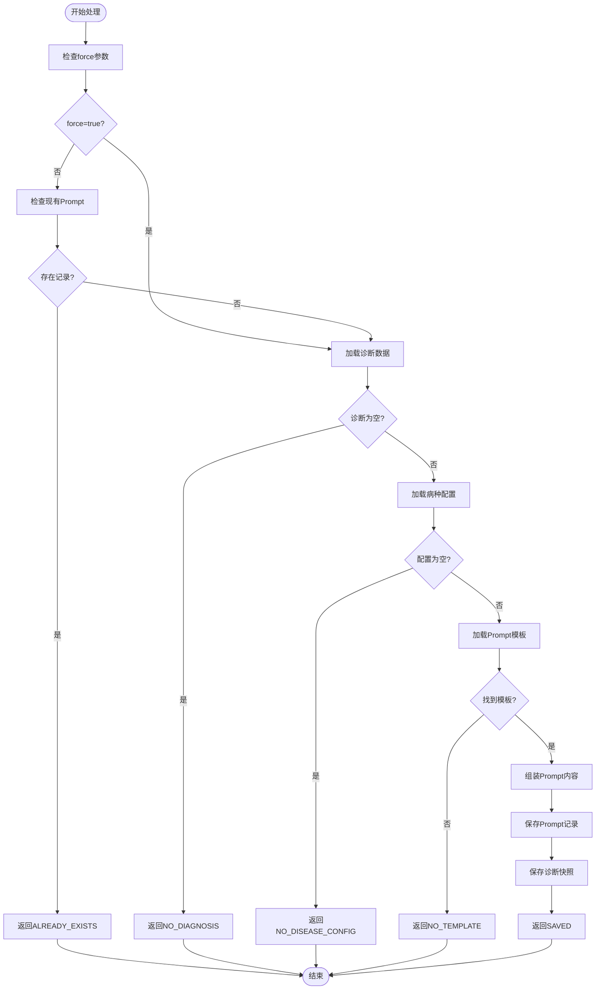
```mermaid
flowchart TD
Start([开始处理]) --> CheckForce["检查force参数"]
CheckForce --> ForceCheck{"force=true?"}
ForceCheck --> |是| LoadDiagnoses["加载诊断数据"]
ForceCheck --> |否| CheckExisting["检查现有Prompt"]
CheckExisting --> Exists{"存在记录?"}
Exists --> |是| ReturnExists["返回ALREADY_EXISTS"]
Exists --> |否| LoadDiagnoses
LoadDiagnoses --> DiagnosesEmpty{"诊断为空?"}
DiagnosesEmpty --> |是| ReturnNoDiagnosis["返回NO_DIAGNOSIS"]
DiagnosesEmpty --> |否| LoadConfigs["加载病种配置"]
LoadConfigs --> ConfigsEmpty{"配置为空?"}
ConfigsEmpty --> |是| ReturnNoConfig["返回NO_DISEASE_CONFIG"]
ConfigsEmpty --> |否| LoadTemplate["加载Prompt模板"]
LoadTemplate --> TemplateFound{"找到模板?"}
TemplateFound --> |否| ReturnNoTemplate["返回NO_TEMPLATE"]
TemplateFound --> |是| BuildPrompt["组装Prompt内容"]
BuildPrompt --> SavePrompt["保存Prompt记录"]
SavePrompt --> SaveSnapshot["保存诊断快照"]
SaveSnapshot --> ReturnSaved["返回SAVED"]
ReturnExists --> End([结束])
ReturnNoDiagnosis --> End
ReturnNoConfig --> End
ReturnNoTemplate --> End
ReturnSaved --> End
```

**图表来源**
- [QcDiseaseMatchService.java:152-234](file://med_ai_assistant_1.0_bs_backend/src/main/java/com/example/medaiassistant/service/qc/QcDiseaseMatchService.java#L152-L234)

### 接口设计分析

系统提供了完整的REST API接口，支持以下核心功能：

| 接口名称 | HTTP方法 | 路径 | 功能描述 |
|---------|---------|------|----------|
| 触发匹配 | POST | /api/qc/disease-match/{patientId} | 为指定患者触发AI诊断匹配 |
| 查询结果 | GET | /api/qc/disease-match/{patientId}/latest | 获取患者最新匹配结果 |
| 检查触发 | POST | /api/qc/disease-match/{patientId}/check-and-trigger | 检测诊断变更并按需触发 |
| 配置列表 | GET | /api/qc/disease-configs | 获取所有启用的病种配置 |
| **新增** 病种确认 | POST | /api/qc/disease-match/confirm | 保存医师确认的病种列表 |
| **新增** 查询确认 | GET | /api/qc/disease-match/{patientId}/confirmed | 获取患者当前有效确认记录 |
| **新增** 重新分析 | POST | /api/qc/assessment/{patientId}/reanalyze | 触发第三阶段AI质控评估重新分析 |
| **新增** 评估结果 | GET | /api/ai/latestPromptResult?patientId={}&promptName={} | 获取最新Prompt结果，包括QC评估 |

**章节来源**
- [QcDiseaseMatchController.java:78-127](file://med_ai_assistant_1.0_bs_backend/src/main/java/com/example/medaiassistant/controller/QcDiseaseMatchController.java#L78-L127)
- [质控病种匹配接口.md:321-388](file://med_ai_assistant_1.0_bs_backend/doc/接口/质控病种匹配接口.md#L321-L388)

## QC评估重新分析功能

### QcAssessmentService服务实现

**新增** QcAssessmentService是质量控制系统的核心服务，专门负责第三阶段AI质控评估的重新分析功能。

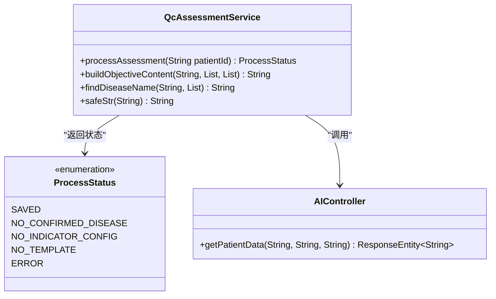
```mermaid
classDiagram
class QcAssessmentService {
+processAssessment(String patientId) ProcessStatus
+buildObjectiveContent(String, List, List) String
+findDiseaseName(String, List) String
+safeStr(String) String
}
class ProcessStatus {
<<enumeration>>
SAVED
NO_CONFIRMED_DISEASE
NO_INDICATOR_CONFIG
NO_TEMPLATE
ERROR
}
class AIController {
+getPatientData(String, String, String) ResponseEntity~String~
}
QcAssessmentService --> ProcessStatus : "返回状态"
QcAssessmentService --> AIController : "调用"
```

**图表来源**
- [QcAssessmentService.java:20-296](file://med_ai_assistant_1.0_bs_backend/src/main/java/com/example/medaiassistant/service/qc/QcAssessmentService.java#L20-L296)

### QC_ASSESSMENT_RESULT表设计

系统新增了专门用于存储质控评估结果的数据库表，实现了完整的评估结果持久化和历史追踪机制。

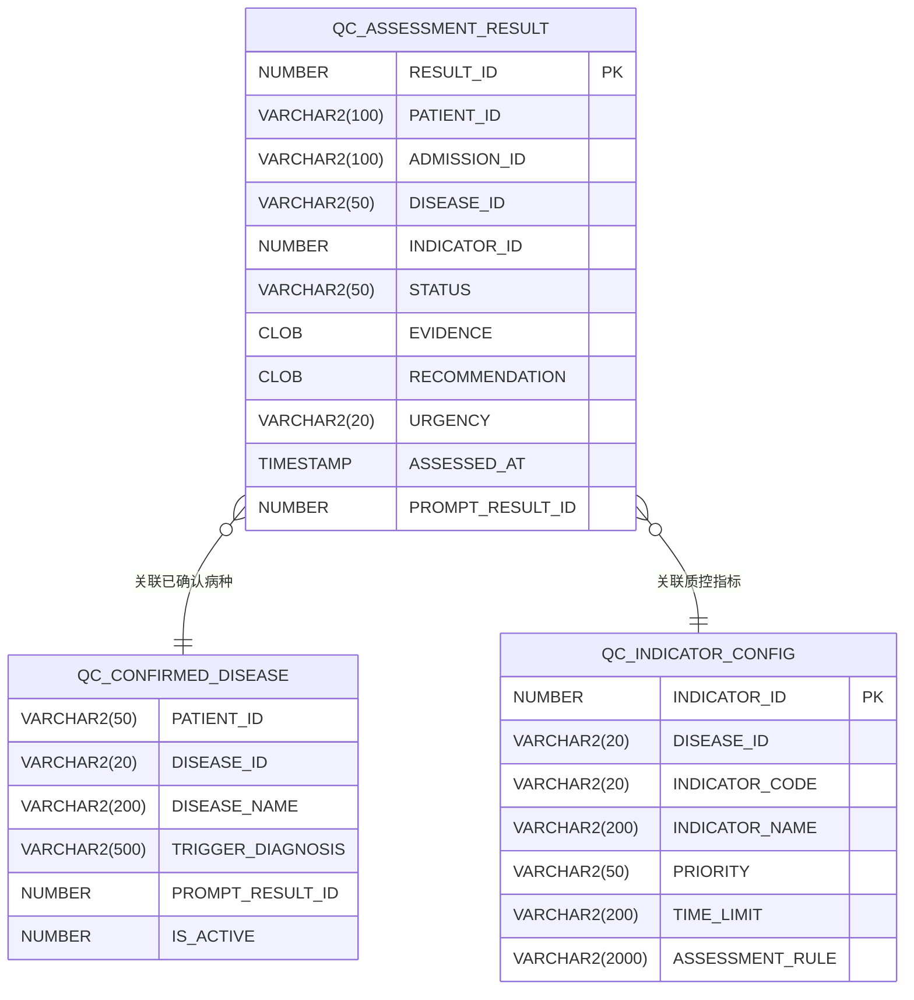
```mermaid
erDiagram
QC_ASSESSMENT_RESULT {
NUMBER RESULT_ID PK
VARCHAR2(100) PATIENT_ID
VARCHAR2(100) ADMISSION_ID
VARCHAR2(50) DISEASE_ID
NUMBER INDICATOR_ID
VARCHAR2(50) STATUS
CLOB EVIDENCE
CLOB RECOMMENDATION
VARCHAR2(20) URGENCY
TIMESTAMP ASSESSED_AT
NUMBER PROMPT_RESULT_ID
}
QC_CONFIRMED_DISEASE {
VARCHAR2(50) PATIENT_ID
VARCHAR2(20) DISEASE_ID
VARCHAR2(200) DISEASE_NAME
VARCHAR2(500) TRIGGER_DIAGNOSIS
NUMBER PROMPT_RESULT_ID
NUMBER IS_ACTIVE
}
QC_INDICATOR_CONFIG {
NUMBER INDICATOR_ID PK
VARCHAR2(20) DISEASE_ID
VARCHAR2(20) INDICATOR_CODE
VARCHAR2(200) INDICATOR_NAME
VARCHAR2(50) PRIORITY
VARCHAR2(200) TIME_LIMIT
VARCHAR2(2000) ASSESSMENT_RULE
}
QC_ASSESSMENT_RESULT }o--|| QC_CONFIRMED_DISEASE : "关联已确认病种"
QC_ASSESSMENT_RESULT }o--|| QC_INDICATOR_CONFIG : "关联质控指标"
```

**图表来源**
- [create-qc-assessment-result-table.sql:4-42](file://med_ai_assistant_1.0_bs_backend/sql-scripts/create-qc-assessment-result-table.sql#L4-L42)
- [QcAssessmentResult.java:24-344](file://med_ai_assistant_1.0_bs_backend/src/main/java/com/example/medaiassistant/model/qc/QcAssessmentResult.java#L24-L344)

### 评估重新分析服务流程

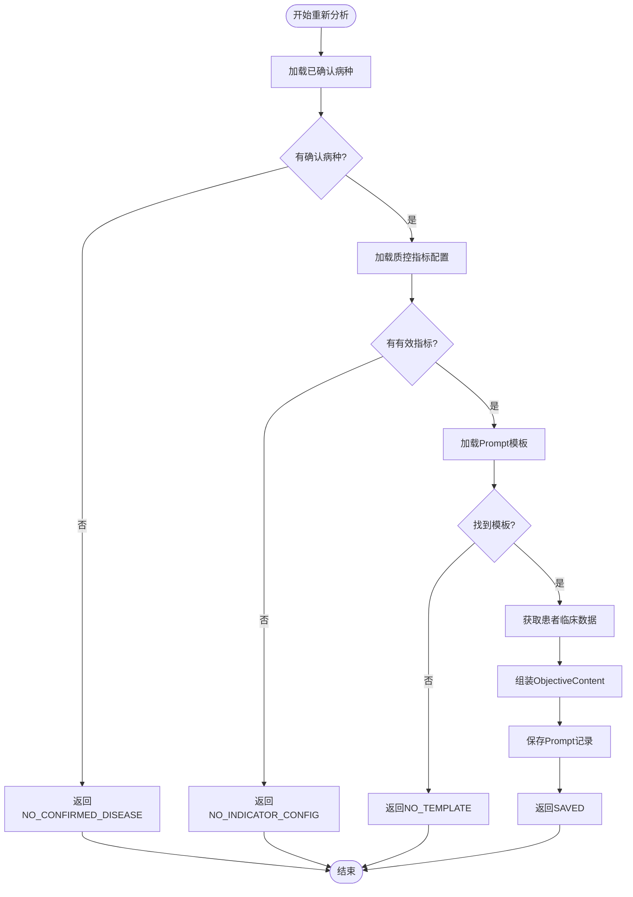
```mermaid
flowchart TD
Start([开始重新分析]) --> LoadConfirmed["加载已确认病种"]
LoadConfirmed --> HasDiseases{"有确认病种?"}
HasDiseases --> |否| ReturnNoDiseases["返回NO_CONFIRMED_DISEASE"]
HasDiseases --> |是| LoadIndicators["加载质控指标配置"]
LoadIndicators --> HasIndicators{"有有效指标?"}
HasIndicators --> |否| ReturnNoIndicators["返回NO_INDICATOR_CONFIG"]
HasIndicators --> |是| LoadTemplate["加载Prompt模板"]
LoadTemplate --> HasTemplate{"找到模板?"}
HasTemplate --> |否| ReturnNoTemplate["返回NO_TEMPLATE"]
HasTemplate --> |是| GetPatientData["获取患者临床数据"]
GetPatientData --> BuildContent["组装ObjectiveContent"]
BuildContent --> SavePrompt["保存Prompt记录"]
SavePrompt --> ReturnSaved["返回SAVED"]
ReturnNoDiseases --> End([结束])
ReturnNoIndicators --> End
ReturnNoTemplate --> End
ReturnSaved --> End
```

**图表来源**
- [QcAssessmentService.java:137-223](file://med_ai_assistant_1.0_bs_backend/src/main/java/com/example/medaiassistant/service/qc/QcAssessmentService.java#L137-L223)

### 数据库表结构详解

| 字段名 | 数据类型 | 约束 | 描述 | 默认值 |
|--------|----------|------|------|--------|
| RESULT_ID | NUMBER | 主键，序列生成 | 评估结果ID | 自增序列 |
| PATIENT_ID | VARCHAR2(100) | 非空 | 患者ID | - |
| ADMISSION_ID | VARCHAR2(100) | 非空 | 住院ID | - |
| DISEASE_ID | VARCHAR2(50) | 非空 | 疾病ID | - |
| INDICATOR_ID | NUMBER | 非空 | 指标ID | - |
| STATUS | VARCHAR2(50) | 非空 | 评估状态 | - |
| EVIDENCE | CLOB | 可空 | 评估证据 | - |
| RECOMMENDATION | CLOB | 可空 | 改进建议 | - |
| URGENCY | VARCHAR2(20) | 可空 | 紧急程度 | - |
| ASSESSED_AT | TIMESTAMP | 可空 | 评估时间 | - |
| PROMPT_RESULT_ID | NUMBER | 可空 | 关联的Prompt结果ID | - |

**章节来源**
- [create-qc-assessment-result-table.sql:20-33](file://med_ai_assistant_1.0_bs_backend/sql-scripts/create-qc-assessment-result-table.sql#L20-L33)
- [QcAssessmentResult.java:34-115](file://med_ai_assistant_1.0_bs_backend/src/main/java/com/example/medaiassistant/model/qc/QcAssessmentResult.java#L34-L115)

## 病种确认持久化功能

### QC_CONFIRMED_DISEASE表设计

系统新增了专门用于存储医师确认病种的数据库表，实现了完整的版本控制和历史追踪机制。

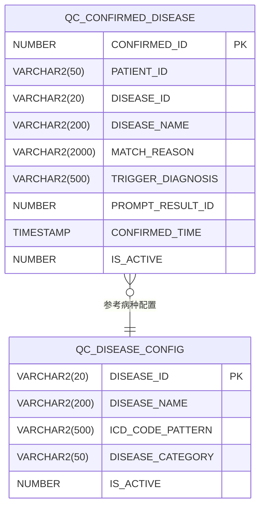
```mermaid
erDiagram
QC_CONFIRMED_DISEASE {
NUMBER CONFIRMED_ID PK
VARCHAR2(50) PATIENT_ID
VARCHAR2(20) DISEASE_ID
VARCHAR2(200) DISEASE_NAME
VARCHAR2(2000) MATCH_REASON
VARCHAR2(500) TRIGGER_DIAGNOSIS
NUMBER PROMPT_RESULT_ID
TIMESTAMP CONFIRMED_TIME
NUMBER IS_ACTIVE
}
QC_DISEASE_CONFIG {
VARCHAR2(20) DISEASE_ID PK
VARCHAR2(200) DISEASE_NAME
VARCHAR2(500) ICD_CODE_PATTERN
VARCHAR2(50) DISEASE_CATEGORY
NUMBER IS_ACTIVE
}
QC_CONFIRMED_DISEASE }o--|| QC_DISEASE_CONFIG : "参考病种配置"
```

**图表来源**
- [create-qc-confirmed-disease-table.sql:20-43](file://med_ai_assistant_1.0_bs_backend/sql-scripts/create-qc-confirmed-disease-table.sql#L20-L43)
- [QcConfirmedDisease.java:18-100](file://med_ai_assistant_1.0_bs_backend/src/main/java/com/example/medaiassistant/model/qc/QcConfirmedDisease.java#L18-L100)

### 病种确认实体分析

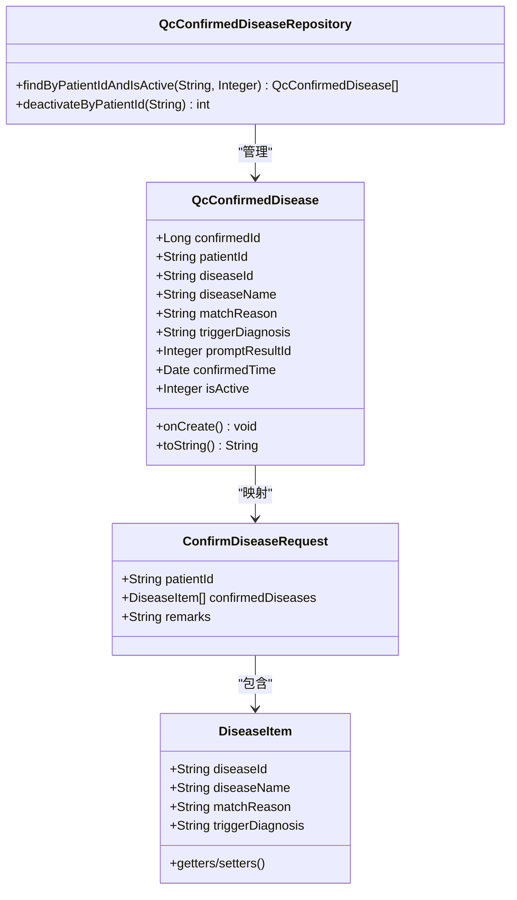
```mermaid
classDiagram
class QcConfirmedDisease {
+Long confirmedId
+String patientId
+String diseaseId
+String diseaseName
+String matchReason
+String triggerDiagnosis
+Integer promptResultId
+Date confirmedTime
+Integer isActive
+onCreate() void
+toString() String
}
class ConfirmDiseaseRequest {
+String patientId
+DiseaseItem[] confirmedDiseases
+String remarks
}
class DiseaseItem {
+String diseaseId
+String diseaseName
+String matchReason
+String triggerDiagnosis
+getters/setters()
}
class QcConfirmedDiseaseRepository {
+findByPatientIdAndIsActive(String, Integer) QcConfirmedDisease[]
+deactivateByPatientId(String) int
}
QcConfirmedDisease --> ConfirmDiseaseRequest : "映射"
ConfirmDiseaseRequest --> DiseaseItem : "包含"
QcConfirmedDiseaseRepository --> QcConfirmedDisease : "管理"
```

**图表来源**
- [QcConfirmedDisease.java:18-290](file://med_ai_assistant_1.0_bs_backend/src/main/java/com/example/medaiassistant/model/qc/QcConfirmedDisease.java#L18-L290)
- [ConfirmDiseaseRequest.java:18-197](file://med_ai_assistant_1.0_bs_backend/src/main/java/com/example/medaiassistant/dto/qc/ConfirmDiseaseRequest.java#L18-L197)
- [QcConfirmedDiseaseRepository.java:26-53](file://med_ai_assistant_1.0_bs_backend/src/main/java/com/example/medaiassistant/repository/qc/QcConfirmedDiseaseRepository.java#L26-L53)

### 病种确认服务流程

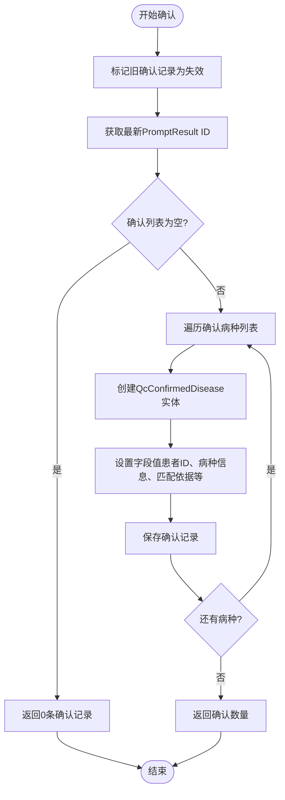
```mermaid
flowchart TD
Start([开始确认]) --> DeactivateOld["标记旧确认记录为失效"]
DeactivateOld --> GetLatestPrompt["获取最新PromptResult ID"]
GetLatestPrompt --> HasDiseases{"确认列表为空?"}
HasDiseases --> |是| ReturnZero["返回0条确认记录"]
HasDiseases --> |否| IterateDiseases["遍历确认病种列表"]
IterateDiseases --> CreateEntity["创建QcConfirmedDisease实体"]
CreateEntity --> SetFields["设置字段值患者ID、病种信息、匹配依据等"]
SetFields --> SaveEntity["保存确认记录"]
SaveEntity --> NextDisease{"还有病种?"}
NextDisease --> |是| IterateDiseases
NextDisease --> |否| ReturnCount["返回确认数量"]
ReturnZero --> End([结束])
ReturnCount --> End
```

**图表来源**
- [QcDiseaseMatchService.java:498-536](file://med_ai_assistant_1.0_bs_backend/src/main/java/com/example/medaiassistant/service/qc/QcDiseaseMatchService.java#L498-L536)

### 数据库表结构详解

| 字段名 | 数据类型 | 约束 | 描述 | 默认值 |
|--------|----------|------|------|--------|
| CONFIRMED_ID | NUMBER | 主键，序列生成 | 确认记录ID | 自增序列 |
| PATIENT_ID | VARCHAR2(50) | 非空 | 患者ID | - |
| DISEASE_ID | VARCHAR2(20) | 非空 | 病种ID | - |
| DISEASE_NAME | VARCHAR2(200) | 可空 | 病种名称 | - |
| MATCH_REASON | VARCHAR2(2000) | 可空 | AI匹配依据说明 | - |
| TRIGGER_DIAGNOSIS | VARCHAR2(500) | 可空 | 触发匹配的诊断信息 | - |
| PROMPT_RESULT_ID | NUMBER | 可空 | 关联的PromptResult ID | - |
| CONFIRMED_TIME | TIMESTAMP | 默认当前时间 | 确认时间 | SYSTIMESTAMP |
| IS_ACTIVE | NUMBER(1) | 默认1 | 有效状态（1有效，0失效） | 1 |

**章节来源**
- [create-qc-confirmed-disease-table.sql:26-37](file://med_ai_assistant_1.0_bs_backend/sql-scripts/create-qc-confirmed-disease-table.sql#L26-L37)
- [QcConfirmedDisease.java:22-88](file://med_ai_assistant_1.0_bs_backend/src/main/java/com/example/medaiassistant/model/qc/QcConfirmedDisease.java#L22-88)

## 前端集成分析

### ToolbarPanel组件

**新增** ToolbarPanel组件新增了重新分析功能，为用户提供便捷的质控评估重新分析入口。

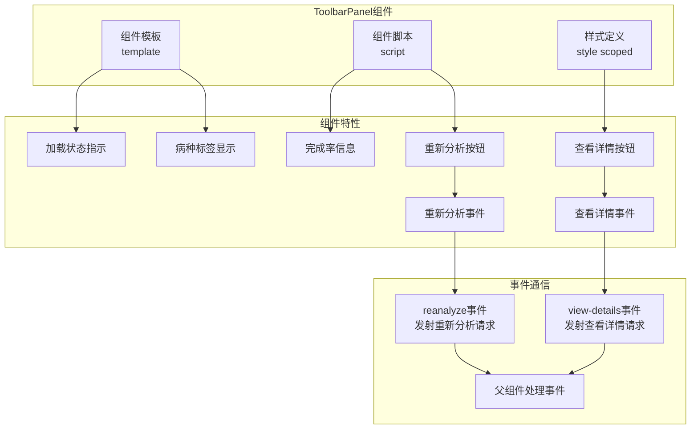
```mermaid
graph TB
subgraph "ToolbarPanel组件"
A[组件模板<br/>template]
B[组件脚本<br/>script]
C[样式定义<br/>style scoped]
end
subgraph "组件特性"
D[加载状态指示]
E[病种标签显示]
F[完成率信息]
G[重新分析按钮]
H[查看详情按钮]
I[重新分析事件]
J[查看详情事件]
end
subgraph "事件通信"
K[reanalyze事件<br/>发射重新分析请求]
L[view-details事件<br/>发射查看详情请求]
M[父组件处理事件]
end
A --> D
A --> E
B --> F
B --> G
C --> H
G --> I
H --> J
I --> K
J --> L
K --> M
L --> M
```

**图表来源**
- [ToolbarPanel.vue:46-55](file://med_ai_assistant_1.0_bs_vue/src/components/qc/ToolbarPanel.vue#L46-L55)

### 组件功能特性

| 功能特性 | 实现方式 | 用户体验 |
|----------|----------|----------|
| 重新分析按钮 | 使用Element Plus按钮组件，支持loading状态 | 直观的操作入口 |
| 加载状态 | 通过loading属性控制按钮状态 | 提供即时反馈 |
| 病种标签 | 显示已确认病种列表，支持省略号显示 | 提供上下文信息 |
| 完成率显示 | 展示指标完成率和统计信息 | 增强可视化效果 |
| 事件发射 | 发射reanalyze和view-details事件 | 支持父子组件通信 |

### ClinicalGuidanceTab组件

**更新** ClinicalGuidanceTab组件集成了重新分析功能，实现了完整的重新分析流程。

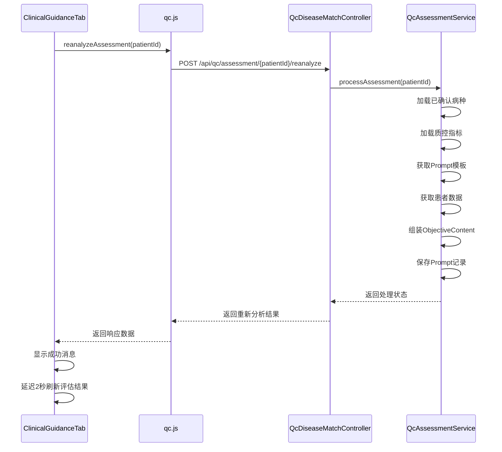
```mermaid
sequenceDiagram
participant Tab as ClinicalGuidanceTab
participant API as qc.js
participant Controller as QcDiseaseMatchController
participant Service as QcAssessmentService
Tab->>API : reanalyzeAssessment(patientId)
API->>Controller : POST /api/qc/assessment/{patientId}/reanalyze
Controller->>Service : processAssessment(patientId)
Service->>Service : 加载已确认病种
Service->>Service : 加载质控指标
Service->>Service : 获取Prompt模板
Service->>Service : 获取患者数据
Service->>Service : 组装ObjectiveContent
Service->>Service : 保存Prompt记录
Service-->>Controller : 返回处理状态
Controller-->>API : 返回重新分析结果
API-->>Tab : 返回响应数据
Tab->>Tab : 显示成功消息
Tab->>Tab : 延迟2秒刷新评估结果
```

**图表来源**
- [ClinicalGuidanceTab.vue:617-649](file://med_ai_assistant_1.0_bs_vue/src/components/qc/ClinicalGuidanceTab.vue#L617-L649)

### 组件事件流

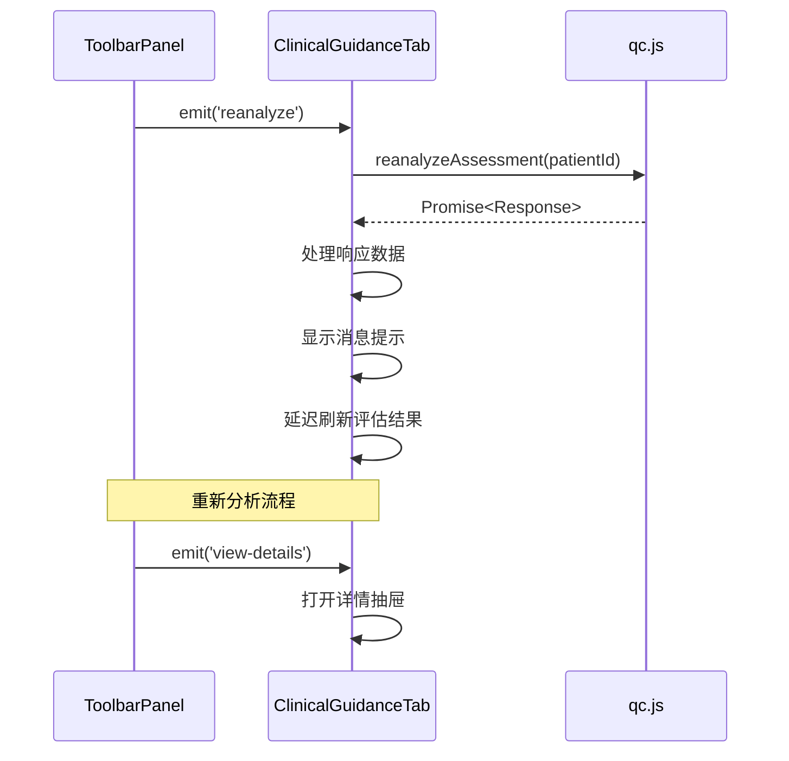
```mermaid
sequenceDiagram
participant Panel as ToolbarPanel
participant Parent as ClinicalGuidanceTab
participant API as qc.js
Panel->>Parent : emit('reanalyze')
Parent->>API : reanalyzeAssessment(patientId)
API-->>Parent : Promise<Response>
Parent->>Parent : 处理响应数据
Parent->>Parent : 显示消息提示
Parent->>Parent : 延迟刷新评估结果
Note over Panel,Parent : 重新分析流程
Panel->>Parent : emit('view-details')
Parent->>Parent : 打开详情抽屉
```

**图表来源**
- [ToolbarPanel.vue:119](file://med_ai_assistant_1.0_bs_vue/src/components/qc/ToolbarPanel.vue#L119)
- [ClinicalGuidanceTab.vue:617-649](file://med_ai_assistant_1.0_bs_vue/src/components/qc/ClinicalGuidanceTab.vue#L617-L649)

**章节来源**
- [ToolbarPanel.vue:40-259](file://med_ai_assistant_1.0_bs_vue/src/components/qc/ToolbarPanel.vue#L40-L259)
- [ClinicalGuidanceTab.vue:617-649](file://med_ai_assistant_1.0_bs_vue/src/components/qc/ClinicalGuidanceTab.vue#L617-L649)
- [qc.js:190-215](file://med_ai_assistant_1.0_bs_vue/src/api/qc.js#L190-L215)

## 质控评估数据集成到治疗计划

### 版本0.8.050变更影响

**更新** 版本0.8.050实现了QC质量控制评估数据直接集成到治疗计划生成，新增了"质控"重要程度指标。

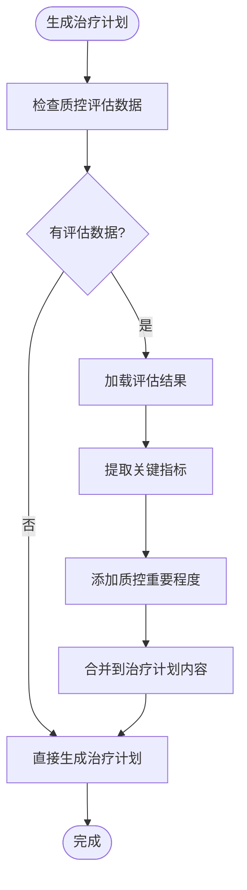
```mermaid
flowchart TD
Start([生成治疗计划]) --> CheckAssessment["检查质控评估数据"]
CheckAssessment --> HasAssessment{"有评估数据?"}
HasAssessment --> |否| GeneratePlan["直接生成治疗计划"]
HasAssessment --> |是| LoadAssessment["加载评估结果"]
LoadAssessment --> ExtractIndicators["提取关键指标"]
ExtractIndicators --> AddPriority["添加质控重要程度"]
AddPriority --> MergeContent["合并到治疗计划内容"]
MergeContent --> GeneratePlan
GeneratePlan --> Complete([完成])
```

**图表来源**
- [ClinicalGuidanceTab.vue:38-50](file://med_ai_assistant_1.0_bs_vue/src/components/qc/ClinicalGuidanceTab.vue#L38-L50)

### 治疗计划表集成机制

系统通过以下机制实现质控评估数据与治疗计划的集成：

1. **数据获取**：通过getLatestPromptResult接口获取最新的QC评估结果
2. **内容解析**：解析Markdown格式的评估内容，提取关键指标和建议
3. **优先级标注**：为重要指标添加"质控"重要程度标识
4. **内容合并**：将评估数据无缝整合到治疗计划的相应位置
5. **实时更新**：支持重新分析后的数据实时刷新

### 重要程度指标体系

系统引入了新的重要程度指标体系，用于标识质控建议的重要级别：

| 重要程度 | 描述 | 用途 |
|----------|------|------|
| 质控 | 高优先级质控指标建议 | 系统自动强调，影响治疗决策 |
| 高 | 重要但非紧急的建议 | 医生重点关注 |
| 中 | 一般性建议 | 参考性信息 |
| 低 | 基础性建议 | 一般性参考 |

**章节来源**
- [ClinicalGuidanceTab.vue:38-50](file://med_ai_assistant_1.0_bs_vue/src/components/qc/ClinicalGuidanceTab.vue#L38-L50)
- [qc.js:187-189](file://med_ai_assistant_1.0_bs_vue/src/api/qc.js#L187-L189)

## 实时数据集成功能

### 版本0.8.049变更影响

**更新** 版本0.8.049实现了QC评估详情页面真实数据对接，通过getLatestPromptResult获取AI质控评估结果。

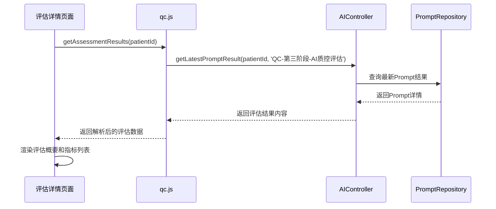
```mermaid
sequenceDiagram
participant Detail as 评估详情页面
participant API as qc.js
participant AIController as AIController
participant PromptRepo as PromptRepository
Detail->>API : getAssessmentResults(patientId)
API->>AIController : getLatestPromptResult(patientId, 'QC-第三阶段-AI质控评估')
AIController->>PromptRepo : 查询最新Prompt结果
PromptRepo-->>AIController : 返回Prompt详情
AIController-->>API : 返回评估结果内容
API-->>Detail : 返回解析后的评估数据
Detail->>Detail : 渲染评估概要和指标列表
```

**图表来源**
- [qc.js:187-189](file://med_ai_assistant_1.0_bs_vue/src/api/qc.js#L187-L189)
- [AIController.java:236-268](file://med_ai_assistant_1.0_bs_backend/src/main/java/com/example/medaiassistant/controller/AIController.java#L236-L268)

### 实时数据获取机制

系统实现了完整的实时数据获取和展示机制：

1. **数据获取**：通过getLatestPromptResult接口获取最新评估结果
2. **内容解析**：解析Markdown结构化文本，提取评估概要和指标列表
3. **数据缓存**：支持本地缓存机制，提升页面响应速度
4. **状态同步**：实时同步评估状态变化
5. **错误处理**：实现完善的降级处理机制

### 评估详情展示优化

**更新** 评估详情页面实现了真实数据对接，提供更准确的质控评估信息：

- **评估概要**：显示整体完成率、合规数量、不合规数量等统计信息
- **指标列表**：按病种分组展示详细的质控指标评估结果
- **实时刷新**：支持重新分析后的数据自动刷新
- **状态标识**：清晰标识各项指标的达标状态和重要程度

**章节来源**
- [qc.js:187-189](file://med_ai_assistant_1.0_bs_vue/src/api/qc.js#L187-L189)
- [AIController.java:236-268](file://med_ai_assistant_1.0_bs_backend/src/main/java/com/example/medaiassistant/controller/AIController.java#L236-L268)

## 依赖关系分析

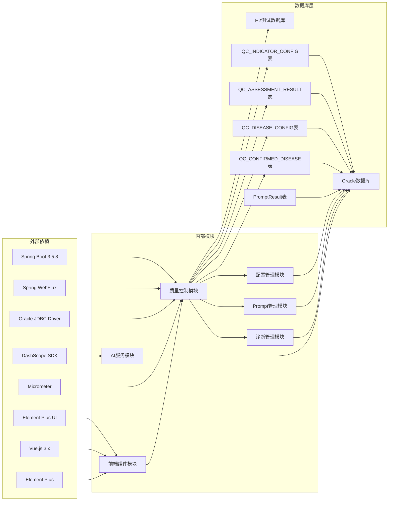
```mermaid
graph LR
subgraph "外部依赖"
A[Spring Boot 3.5.8]
B[Spring WebFlux]
C[Oracle JDBC Driver]
D[DashScope SDK]
E[Micrometer]
F[Element Plus UI]
G[Vue.js 3.x]
H[Element Plus]
end
subgraph "内部模块"
I[质量控制模块]
J[诊断管理模块]
K[Prompt管理模块]
L[配置管理模块]
M[前端组件模块]
N[AI服务模块]
end
subgraph "数据库层"
O[Oracle数据库]
P[H2测试数据库]
Q[QC_CONFIRMED_DISEASE表]
R[QC_DISEASE_CONFIG表]
S[QC_ASSESSMENT_RESULT表]
T[QC_INDICATOR_CONFIG表]
U[PromptResult表]
end
A --> I
B --> I
C --> I
D --> N
E --> I
F --> M
G --> M
H --> M
I --> J
I --> K
I --> L
J --> O
K --> O
L --> O
M --> I
N --> O
I --> Q
I --> R
I --> S
I --> T
Q --> O
R --> O
S --> O
T --> O
U --> O
I --> P
```

**图表来源**
- [pom.xml:53-214](file://med_ai_assistant_1.0_bs_backend/pom.xml#L53-L214)

系统的关键技术栈包括：
- **Spring Boot 3.5.8**: 提供基础框架和自动配置
- **Spring WebFlux**: 支持响应式编程和异步处理
- **Oracle JDBC Driver**: 数据库连接和操作
- **DashScope SDK**: 阿里云百炼AI服务集成
- **Micrometer**: 监控和指标收集
- **Element Plus**: 前端UI组件库
- **Vue.js 3.x**: 前端框架，支持Composition API
- **Lombok**: 代码简化和样板代码消除

**章节来源**
- [pom.xml:29-214](file://med_ai_assistant_1.0_bs_backend/pom.xml#L29-L214)

## 性能考虑

### 数据库优化策略

系统采用了多项数据库性能优化措施：

1. **连接池配置优化**
   - 最大连接数：15个
   - 最小空闲连接：3个
   - 连接超时时间：10秒
   - 连接生命周期：30分钟

2. **索引策略**
   - 疾病配置表：按疾病分类和启用状态建立复合索引
   - 指标配置表：按疾病ID和启用状态建立索引
   - **新增** 病种确认表：按患者ID和有效状态建立复合索引
   - **新增** 评估结果表：按住院ID、患者ID、疾病ID、状态建立复合索引
   - **新增** Prompt结果表：按模板名称和创建时间建立索引

3. **查询优化**
   - 使用原生SQL查询减少ORM开销
   - 实施分页查询避免大数据集加载
   - 缓存常用配置数据
   - **新增** 批量操作优化，支持一次性处理多个确认记录
   - **新增** 异步处理机制，避免阻塞主线程
   - **新增** 实时数据缓存机制，提升页面响应速度

### 并发处理机制

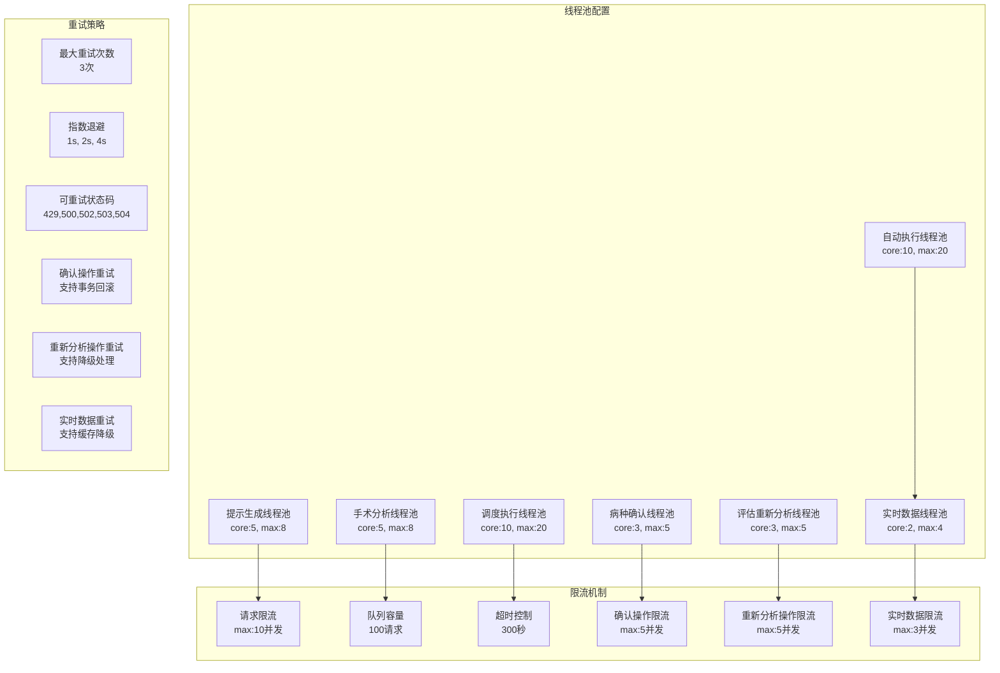
```mermaid
graph TB
subgraph "线程池配置"
A[自动执行线程池<br/>core:10, max:20]
B[提示生成线程池<br/>core:5, max:8]
C[手术分析线程池<br/>core:5, max:8]
D[调度执行线程池<br/>core:10, max:20]
E[病种确认线程池<br/>core:3, max:5]
F[评估重新分析线程池<br/>core:3, max:5]
G[实时数据线程池<br/>core:2, max:4]
end
subgraph "限流机制"
H[请求限流<br/>max:10并发]
I[队列容量<br/>100请求]
J[超时控制<br/>300秒]
K[确认操作限流<br/>max:5并发]
L[重新分析操作限流<br/>max:5并发]
M[实时数据限流<br/>max:3并发]
end
subgraph "重试策略"
N[最大重试次数<br/>3次]
O[指数退避<br/>1s, 2s, 4s]
P[可重试状态码<br/>429,500,502,503,504]
Q[确认操作重试<br/>支持事务回滚]
R[重新分析操作重试<br/>支持降级处理]
S[实时数据重试<br/>支持缓存降级]
end
A --> G
B --> H
C --> I
D --> J
E --> K
F --> L
G --> M
```

**图表来源**
- [application.properties:140-222](file://med_ai_assistant_1.0_bs_backend/src/main/resources/application.properties#L140-L222)

## 故障排除指南

### 常见问题及解决方案

1. **数据库连接问题**
   - 检查Oracle数据库连接配置
   - 验证连接池参数设置
   - 确认网络连通性和防火墙设置

2. **AI服务集成问题**
   - 验证DashScope API密钥配置
   - 检查网络代理设置
   - 确认API调用超时参数

3. **性能问题排查**
   - 监控线程池使用情况
   - 检查数据库查询性能
   - 分析内存使用情况

4. **接口调用异常**
   - 查看详细的错误日志
   - 验证请求参数格式
   - 检查权限和认证配置

5. **重新分析问题**
   - 验证QC_ASSESSMENT_RESULT表结构
   - 检查序列生成器配置
   - 确认事务边界和并发控制
   - 验证前端组件事件通信
   - 检查AI数据获取降级处理

6. **病种确认问题**
   - 验证QC_CONFIRMED_DISEASE表结构
   - 检查序列生成器配置
   - 确认事务边界和并发控制
   - 验证前端组件事件通信

7. **治疗计划集成问题**
   - 检查getLatestPromptResult接口调用
   - 验证评估数据解析逻辑
   - 确认重要程度指标标注
   - 检查内容合并机制

8. **实时数据问题**
   - 验证getAssessmentResults接口
   - 检查Markdown解析准确性
   - 确认数据缓存机制
   - 检查状态同步逻辑

### 监控和告警

系统集成了完整的监控和告警机制：

- **系统健康监控**：磁盘使用率、线程数、响应时间阈值
- **业务指标监控**：吞吐量、响应时间、成功率阈值
- **告警配置**：邮件通知、告警抑制、最大活动告警数
- **重新分析监控**：重新分析成功率、重新分析延迟、评估结果追踪
- **病种确认监控**：确认成功率、确认延迟、历史版本追踪
- **治疗计划监控**：集成成功率、数据更新延迟、重要程度标注准确性
- **实时数据监控**：数据获取成功率、解析准确性、缓存命中率

**章节来源**
- [application.properties:234-268](file://med_ai_assistant_1.0_bs_backend/src/main/resources/application.properties#L234-L268)

## 结论

质量控制系统作为MedAiAssistant项目的核心模块，展现了现代医疗AI系统的最佳实践。通过模块化的架构设计、完善的接口规范和强大的技术支撑，系统能够为医疗机构提供可靠的AI辅助决策支持。

**更新** 根据版本0.8.050和0.8.049的变更，系统现已实现了以下重要功能：

### 主要优势

- **高可用性**：通过微服务架构和负载均衡实现系统稳定性
- **可扩展性**：模块化设计支持功能扩展和性能优化
- **可靠性**：完善的监控、告警和故障恢复机制
- **易用性**：清晰的API设计和详细的文档支持
- **完整性**：通过版本控制和历史追踪确保数据完整性
- **交互性**：直观的前端组件提升用户体验
- **智能性**：支持重新分析功能，适应动态医疗环境
- **集成性**：质控评估数据直接集成到治疗计划生成
- **实时性**：评估详情页面实现真实数据对接和实时刷新

### 技术创新

- **版本控制机制**：通过IS_ACTIVE字段实现历史版本管理
- **序列化设计**：使用Oracle序列确保主键唯一性
- **事务一致性**：保证确认操作的原子性和一致性
- **前端集成**：提供直观的确认界面和实时反馈
- **异步处理**：支持重新分析的异步执行和状态追踪
- **降级处理**：AI数据获取失败时的优雅降级机制
- **实时数据集成**：通过getLatestPromptResult实现数据实时对接
- **重要程度标注**：为质控建议添加重要程度标识
- **内容智能合并**：自动将评估数据整合到治疗计划中
- **重新分析功能**：完整的重新分析流程和状态管理
- **持久化存储**：病种确认的历史版本追踪和查询

### 未来发展

系统的主要优势包括：
- **高可用性**：通过微服务架构和负载均衡实现系统稳定性
- **可扩展性**：模块化设计支持功能扩展和性能优化
- **可靠性**：完善的监控、告警和故障恢复机制
- **易用性**：清晰的API设计和详细的文档支持

未来的发展方向包括：
- 进一步优化AI模型集成
- 增强数据分析和可视化功能
- 扩展更多医疗质量控制场景
- 提升系统的智能化水平
- 完善确认工作流的自动化程度
- 增强历史数据的分析和追溯能力
- 支持更多类型的质控评估指标
- 实现评估结果的智能推荐功能
- **新增** 质量控制指标的动态调整机制
- **新增** 多维度质量评估和趋势分析
- **新增** 质控建议的个性化推荐算法
- **新增** 重新分析功能的智能调度和优化
- **新增** 病种确认的智能去重和冲突检测
- **新增** 评估结果的自动解读和解释生成

通过持续的技术创新和功能完善，质量控制系统将继续为提升医疗质量和患者安全做出重要贡献，为现代智慧医疗的发展提供强有力的技术支撑。