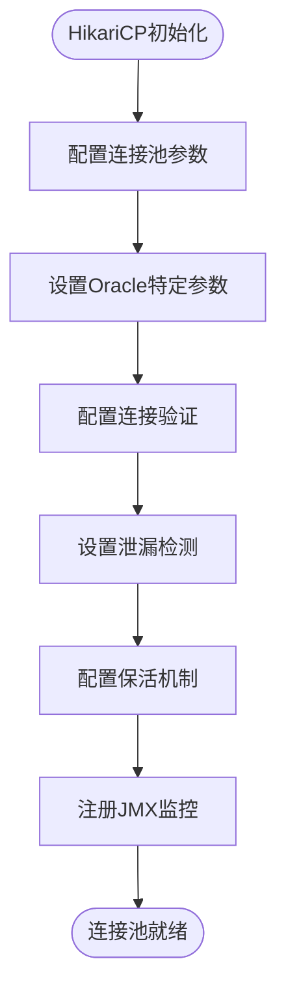
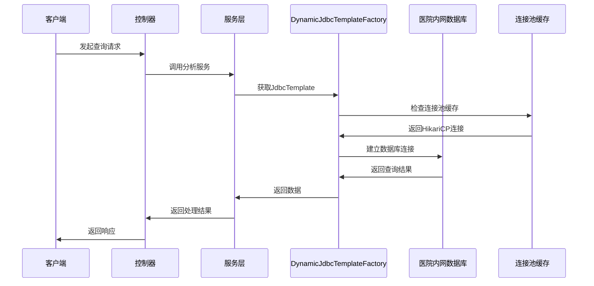
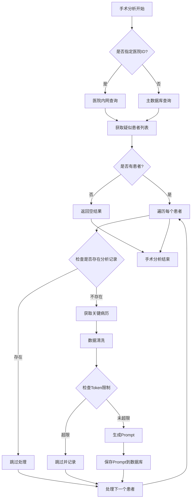
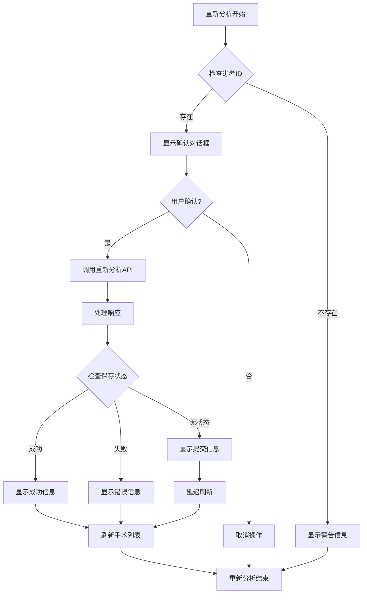
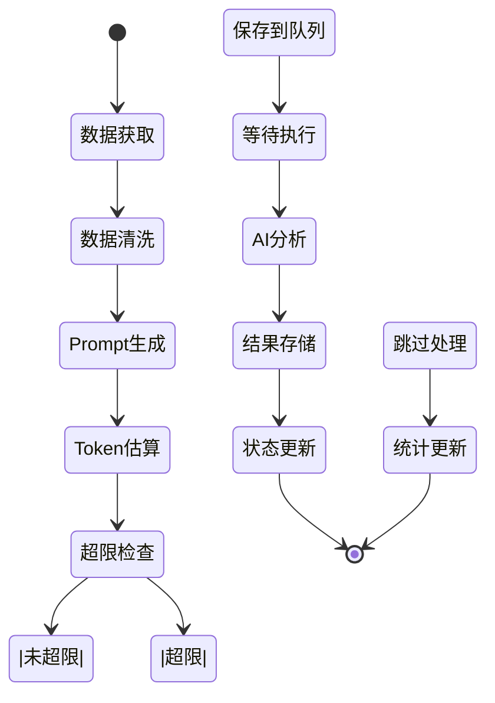
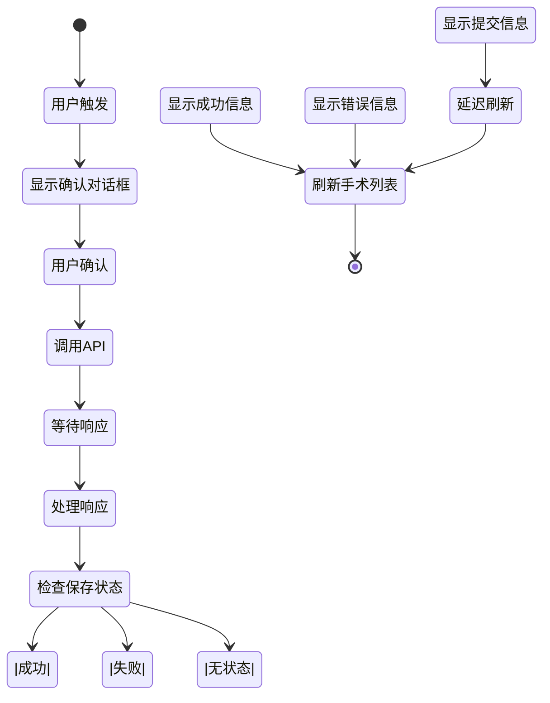
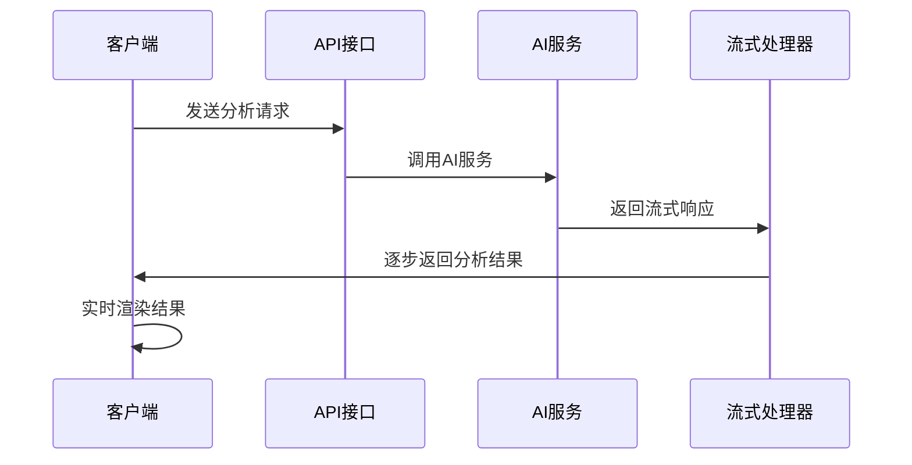
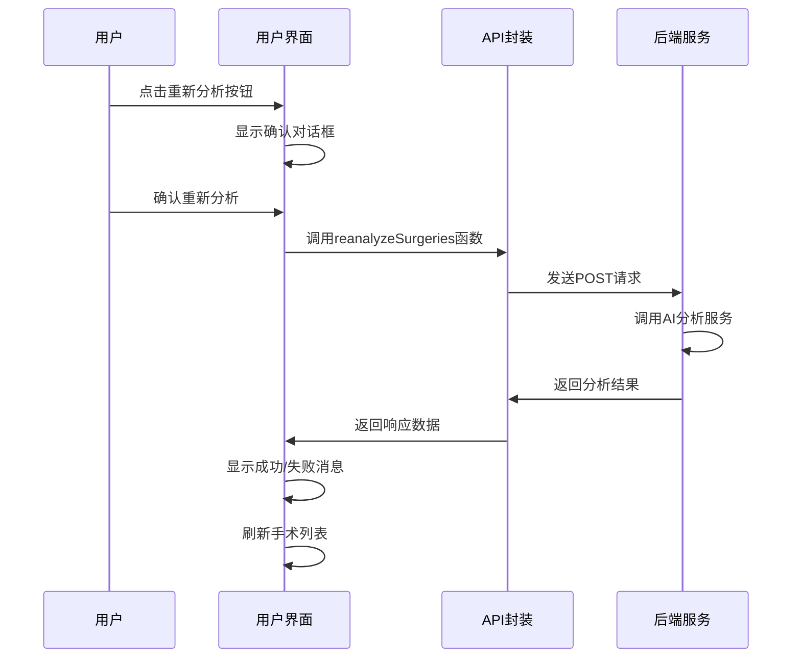
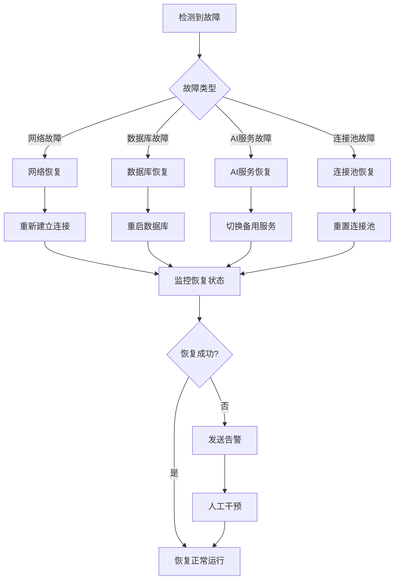
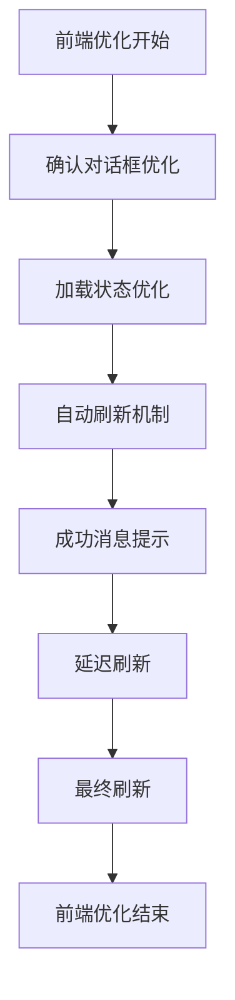

# 非计划再次手术分析

<cite>
**本文档引用的文件**
- [RepeatOperationController.java](file://med_ai_assistant_1.0_bs_backend/src/main/java/com/example/medaiassistant/controller/RepeatOperationController.java)
- [RepeatOperationAnalysisService.java](file://med_ai_assistant_1.0_bs_backend/src/main/java/com/example/medaiassistant/service/RepeatOperationAnalysisService.java)
- [RepeatOperationQueryService.java](file://med_ai_assistant_1.0_bs_backend/src/main/java/com/example/medaiassistant/service/RepeatOperationQueryService.java)
- [OperationAnalysisController.java](file://med_ai_assistant_1.0_bs_backend/src/main/java/com/example/medaiassistant/controller/OperationAnalysisController.java)
- [OperationController.java](file://med_ai_assistant_1.0_bs_backend/src/main/java/com/example/medaiassistant/controller/OperationController.java)
- [SurgeryService.java](file://med_ai_assistant_1.0_bs_backend/src/main/java/com/example/medaiassistant/service/SurgeryService.java)
- [DatabaseConfig.java](file://med_ai_assistant_1.0_bs_backend/src/main/java/com/example/medaiassistant/config/DatabaseConfig.java)
- [DynamicJdbcTemplateFactory.java](file://med_ai_assistant_1.0_bs_backend/src/main/java/com/example/medaiassistant/hospital/service/DynamicJdbcTemplateFactory.java)
- [RepeatOperationControllerTest.java](file://med_ai_assistant_1.0_bs_backend/src/test/java/com/example/medaiassistant/controller/RepeatOperationControllerTest.java)
- [RepeatOperationAnalysisServiceTest.java](file://med_ai_assistant_1.0_bs_backend/src/test/java/com/example/medaiassistant/service/RepeatOperationAnalysisServiceTest.java)
- [RepeatOperationQueryServiceTest.java](file://med_ai_assistant_1.0_bs_backend/src/test/java/com/example/medaiassistant/service/RepeatOperationQueryServiceTest.java)
- [PromptResultRepositoryRepeatOperationTest.java](file://med_ai_assistant_1.0_bs_backend/src/test/java/com/example/medaiassistant/repository/PromptResultRepositoryRepeatOperationTest.java)
- [patient.js](file://med_ai_assistant_1.0_bs_vue/src/api/patient.js)
- [PatientInfo.vue](file://med_ai_assistant_1.0_bs_vue/src/components/patient/PatientInfo.vue)
- [application.properties](file://med_ai_assistant_1.0_bs_backend/src/main/resources/application.properties)
- [application-oracle.properties](file://med_ai_assistant_1.0_bs_backend/src/main/resources/application-oracle.properties)
- [非计划再次手术分析实施方案.md](file://med_ai_assistant_1.0_bs_backend/doc/迭代/非计划再次手术分析/非计划再次手术分析实施方案.md)
- [非计划再次手术分析接口.md](file://med_ai_assistant_1.0_bs_backend/doc/接口/非计划再次手术分析接口.md)
- [TDD实施指南.md](file://med_ai_assistant_1.0_bs_backend/doc/迭代/非计划再次手术分析/TDD实施指南.md)
- [AI响应接口网络中断后连接失败问题分析与解决方案.md](file://med_ai_assistant_1.0_bs_backend/doc/其他/AI响应接口网络中断后连接失败问题分析与解决方案.md)
- [AI响应接口网络中断后连接失败问题解决方案实施总结.md](file://med_ai_assistant_1.0_bs_backend/doc/其他/AI响应接口网络中断后连接失败问题解决方案实施总结.md)
- [init.sql](file://med_ai_assistant_1.0_bs_backend/init.sql)
- [更新小结.md](file://更新小结.md)
</cite>

## 更新摘要
**所做更改**
- 新增reanalyzeSurgeries API函数，支持手动触发AI重新分析手术名称
- 在PatientInfo组件中集成刷新按钮和确认对话框
- 实现自动刷新和保存结果数量提示功能
- 更新前端用户界面，提供更好的用户体验
- 增强手术分析功能的交互性和可操作性

## 目录
1. [项目概述](#项目概述)
2. [功能架构](#功能架构)
3. [核心组件分析](#核心组件分析)
4. [数据流程分析](#数据流程分析)
5. [API接口设计](#api接口设计)
6. [技术实现细节](#技术实现细节)
7. [质量保证体系](#质量保证体系)
8. [部署与运维](#部署与运维)
9. [性能优化策略](#性能优化策略)
10. [故障排查指南](#故障排查指南)
11. [总结与展望](#总结与展望)

## 项目概述

非计划再次手术分析功能是MedAiAssistant医疗AI助手系统的重要组成部分，旨在为医院质控人员提供智能化的非计划再次手术识别和分析能力。该功能基于Spring Boot + Vue 3架构实现，通过AI技术自动分析患者的病历资料，识别非计划再次手术的风险因素。

### 项目背景与意义

根据项目更新记录显示，该功能于2026年3月24日成功集成到系统中，标志着医疗AI助手在质控领域的重大突破。非计划再次手术是医疗质量控制的重要指标，通过AI技术的引入，能够：

- **提升质控效率**：自动化分析替代人工筛查，大幅提高工作效率
- **降低医疗风险**：及时识别潜在的非计划再次手术风险
- **改善医疗质量**：为医院提供数据驱动的质量改进依据
- **减少医疗纠纷**：通过早期预警预防医疗事故

**更新** 该功能现已完整实现，包含Oracle查询层、Prompt生成管道、4个REST API接口、质控分析页面等完整功能，版本号v0.6.080。系统完成了从外部数据源到医院内网数据源的迁移改造，采用HikariCP连接池优化数据库连接管理，显著提升了数据安全性和查询性能。

此外，新增的reanalyzeSurgeries功能允许医护人员手动触发AI重新分析手术名称，提供刷新按钮和确认对话框，实现自动刷新和保存结果数量提示功能，大大增强了系统的交互性和实用性。

## 功能架构

### 整体架构设计

```mermaid
graph TB
subgraph "前端层"
QC[质控页面]
API[API封装]
UI[用户界面]
Refresh[刷新按钮]
Confirm[确认对话框]
End
subgraph "后端层"
Controller[RepeatOperationController]
OperationController[OperationAnalysisController]
Service[RepeatOperationAnalysisService]
QueryService[RepeatOperationQueryService]
SurgeryService[SurgeryService]
Factory[DynamicJdbcTemplateFactory]
End
subgraph "数据层"
Oracle[Oracle EMR数据库]
Hospital[医院内网数据库]
MySQL[MySQL数据库]
Redis[Redis缓存]
End
subgraph "AI服务层"
AIService[AI分析服务]
PromptTemplate[Prompt模板]
End
QC --> API
API --> Controller
Controller --> OperationController
OperationController --> Service
Service --> QueryService
QueryService --> Factory
Factory --> Hospital
Service --> Oracle
OperationController --> AIService
AIService --> PromptTemplate
Refresh --> UI
Confirm --> UI
```

**图表来源**
- [RepeatOperationController.java:36-38](file://med_ai_assistant_1.0_bs_backend/src/main/java/com/example/medaiassistant/controller/RepeatOperationController.java#L36-L38)
- [OperationAnalysisController.java:37-39](file://med_ai_assistant_1.0_bs_backend/src/main/java/com/example/medaiassistant/controller/OperationAnalysisController.java#L37-L39)
- [RepeatOperationAnalysisService.java:37-38](file://med_ai_assistant_1.0_bs_backend/src/main/java/com/example/medaiassistant/service/RepeatOperationAnalysisService.java#L37-L38)
- [RepeatOperationQueryService.java:29-31](file://med_ai_assistant_1.0_bs_backend/src/main/java/com/example/medaiassistant/service/RepeatOperationQueryService.java#L29-L31)
- [DynamicJdbcTemplateFactory.java:37-38](file://med_ai_assistant_1.0_bs_backend/src/main/java/com/example/medaiassistant/hospital/service/DynamicJdbcTemplateFactory.java#L37-L38)

### 技术栈组成

| 层级 | 技术组件 | 版本/特性 |
|------|----------|-----------|
| 前端 | Vue 3 + Element Plus | 组件化开发，响应式设计，支持确认对话框 |
| 后端 | Spring Boot 2.7+ | 微服务架构，RESTful API，支持手动触发分析 |
| 数据库 | Oracle + MySQL | 主从分离，读写分离，支持HikariCP连接池 |
| 缓存 | Redis | 高速缓存，会话管理，支持自动刷新 |
| AI服务 | LLM模型 | DeepSeek，流式响应，支持统一AI接口 |
| 安全 | Spring Security | JWT认证，角色权限，支持重新分析权限控制 |
| 连接池 | HikariCP | 高性能连接池，支持医院内网直连，支持重新分析 |

## 核心组件分析

### 1. HikariCP连接池配置 (DatabaseConfig)

系统采用HikariCP连接池替代原有的DynamicJdbcTemplateFactory，提供更高效的数据库连接管理。

#### 连接池优化配置



**图表来源**
- [DatabaseConfig.java:173-210](file://med_ai_assistant_1.0_bs_backend/src/main/java/com/example/medaiassistant/config/DatabaseConfig.java#L173-L210)

#### 关键配置参数

| 配置项 | 参数值 | 说明 |
|--------|--------|------|
| maximum-pool-size | 15 | 最大连接数 |
| minimum-idle | 3 | 最小空闲连接数 |
| connection-timeout | 10000ms | 连接超时时间 |
| idle-timeout | 240000ms | 空闲连接超时 |
| max-lifetime | 1800000ms | 连接最大生命周期 |
| keepalive-time | 120000ms | 保活时间 |
| validation-timeout | 5000ms | 验证超时时间 |
| leak-detection-threshold | 30000ms | 泄漏检测阈值 |

### 2. 医院内网直连查询 (DynamicJdbcTemplateFactory)

DynamicJdbcTemplateFactory提供医院内网数据库的动态连接能力，支持HIS和LIS系统的直连查询。

#### 医院内网连接架构



**图表来源**
- [DynamicJdbcTemplateFactory.java:195-227](file://med_ai_assistant_1.0_bs_backend/src/main/java/com/example/medaiassistant/hospital/service/DynamicJdbcTemplateFactory.java#L195-L227)

#### 医院内网连接配置

| 配置项 | 参数值 | 说明 |
|--------|--------|------|
| maximum-pool-size | 10 | 医院内网连接池大小 |
| minimum-idle | 2 | 医院内网最小空闲连接 |
| connection-timeout | 30000ms | 医院内网连接超时 |
| idle-timeout | 240000ms | 医院内网空闲超时 |
| max-lifetime | 1800000ms | 医院内网连接最大生命周期 |
| keepalive-time | 120000ms | 医院内网保活时间 |
| leak-detection-threshold | 60000ms | 医院内网泄漏检测阈值 |

### 3. 数据查询服务 (RepeatOperationQueryService)

RepeatOperationQueryService支持主数据库和医院内网数据库的双数据源查询，提供灵活的数据访问能力。

#### 查询方法对比

| 查询方法 | 数据源 | 功能描述 | 回退机制 |
|----------|--------|----------|----------|
| findRepeatOperationPatients | 主数据库 | 查询疑似患者列表 | 不适用 |
| findRepeatOperationPatientsFromHospital | 医院内网 | 医院内网查询 | DynamicJdbcTemplateFactory为null时回退 |
| getRepeatOperationKeyInformation | 主数据库 | 获取关键病历信息 | 不适用 |
| getRepeatOperationKeyInformationFromHospital | 医院内网 | 医院内网获取病历 | DynamicJdbcTemplateFactory为null时回退 |

### 4. 手术分析服务

实现患者级别的批量分析处理，支持主数据库和医院内网数据库的双数据源操作。

#### 手术分析流程



**图表来源**
- [RepeatOperationAnalysisService.java:236-299](file://med_ai_assistant_1.0_bs_backend/src/main/java/com/example/medaiassistant/service/RepeatOperationAnalysisService.java#L236-L299)

### 5. 重新分析功能 (reanalyzeSurgeries)

新增的手动重新分析功能，允许医护人员手动触发AI重新分析手术名称。

#### 重新分析流程



**图表来源**
- [PatientInfo.vue:790-846](file://med_ai_assistant_1.0_bs_vue/src/components/patient/PatientInfo.vue#L790-L846)

## 数据流程分析

### 1. 患者筛选流程

系统通过复杂的Oracle SQL查询来识别疑似非计划再次手术的患者：

#### 查询条件分析

| 查询维度 | 条件描述 | SQL表达式 |
|----------|----------|-----------|
| 时间范围 | 40天内 | `RECORD_DATE BETWEEN TRUNC(:QueryDate) - 40 AND :QueryDate` |
| 文档类型 | 手术记录/操作记录 | `DOC_TYPE_NAME IN ('手术记录', '操作记录')` |
| 患者筛选 | 同一PATI_ID出现≥2次 | `HAVING COUNT(*) >= 2` |
| 住院号 | 取最大VISIT_ID | `MAX(a.VISIT_ID) AS VISIT_ID` |

### 2. 病历数据获取

针对筛选出的疑似患者，系统获取其最近2次住院的关键病历信息：

#### 关键病历类型

| 病历类型 | 查询条件 | 用途 |
|----------|----------|------|
| 出院证明 | DOC_TYPE_NAME LIKE '%出院%' | 了解出院情况 |
| 手术记录 | DOC_TYPE_NAME LIKE '%手术记录%' | 分析手术详情 |
| 病程记录 | DOC_TYPE_NAME LIKE '%病程记录%' | 了解治疗过程 |
| 查房记录 | DOC_TYPE_NAME LIKE '%查房记录%' | 评估医疗质量 |

### 3. AI分析流程



**图表来源**
- [RepeatOperationAnalysisService.java:153-212](file://med_ai_assistant_1.0_bs_backend/src/main/java/com/example/medaiassistant/service/RepeatOperationAnalysisService.java#L153-L212)

### 4. 手术重新分析流程



**图表来源**
- [OperationAnalysisController.java:106-219](file://med_ai_assistant_1.0_bs_backend/src/main/java/com/example/medaiassistant/controller/OperationAnalysisController.java#L106-L219)

## API接口设计

### 接口概览

系统提供4个主要API接口，支持完整的非计划再次手术分析流程，以及新增的手术重新分析功能：

| 接口名称 | HTTP方法 | 路径 | 功能描述 |
|----------|----------|------|----------|
| 批量分析 | POST | `/api/repeat-operations/analyze` | 批量分析指定日期的疑似患者 |
| 有再次手术患者查询 | GET | `/api/repeat-operations/patients/has-reoperation` | 查询有非计划再次手术的患者列表 |
| 无再次手术患者查询 | GET | `/api/repeat-operations/patients/no-reoperation` | 查询无非计划再次手术的患者列表 |
| 分析结果详情 | GET | `/api/repeat-operations/result/{resultId}` | 获取单个分析结果的详细内容 |
| **新增** | **POST** | **`/api/operations/analyze-names`** | **重新分析单个患者的手术名称** |
| **新增** | **POST** | **`/api/operations/batch-analyze-names`** | **批量重新分析多个患者的手术名称** |

### 手术重新分析接口

#### 单个患者重新分析

**接口地址**: `POST /api/operations/analyze-names`

**请求参数**:
- `patientId` (String, 必填): 患者ID，用于标识需要重新分析手术记录的患者

**请求示例**:
```
POST /api/operations/analyze-names?patientId=ZY625753_3
```

**成功响应**:
```json
{
  "SurgeryRecords": [
    {
      "SurgeryDate": "2025-04-01",
      "SurgeryName": [
        "手术/操作名称1",
        "手术/操作名称2"
      ]
    }
  ],
  "savedCount": 2,
  "saveStatus": "success"
}
```

**字段说明**:
- `SurgeryRecords` (Array): 手术记录数组
  - `SurgeryDate` (String): 手术日期，格式为 yyyy-MM-dd
  - `SurgeryName` (Array): 手术名称列表
- `savedCount` (Integer): 成功保存到数据库的手术记录数量
- `saveStatus` (String): 保存状态，可能的值为 "success" | "no_new_records" | "failed"

#### 批量患者重新分析

**接口地址**: `POST /api/operations/batch-analyze-names`

**请求体**: JSON数组，包含多个患者ID

**请求参数**:
- 请求体 (List<String>, 必填): 患者ID列表

**请求示例**:
```json
["99050801275226_1", "99050801275226_2", "99050801275226_3"]
```

**批量响应格式**:
```json
{
  "totalPatients": 3,
  "successfulCount": 2,
  "failedCount": 1,
  "successfulResults": [
    {
      "patientId": "ZY625753_3",
      "data": {
        "SurgeryRecords": [...],
        "savedCount": 2,
        "saveStatus": "success"
      }
    }
  ],
  "failedResults": [
    {
      "patientId": "ZY625753_5",
      "error": "未找到该患者的手术记录"
    }
  ]
}
```

### 批量分析接口

#### 请求参数

| 参数名 | 类型 | 必填 | 描述 |
|--------|------|------|------|
| queryDate | LocalDate | 是 | 查询日期，格式：yyyy-MM-dd |
| hospitalId | String | 否 | 医院ID，传入时使用医院内网查询 |

#### 响应格式

```json
{
  "success": true,
  "total": 15,
  "saved": 10,
  "alreadyExists": 3,
  "skipped": 1,
  "errors": 1,
  "message": "处理完成: 共15人, 新提交10, 已存在3, 跳过1, 失败1"
}
```

### 结果查询接口

#### 查询参数

| 参数名 | 类型 | 必填 | 描述 |
|--------|------|------|------|
| startTime | LocalDateTime | 是 | 查询开始时间 |
| endTime | LocalDateTime | 是 | 查询结束时间 |
| hospitalId | String | 否 | 医院ID（预留参数） |

#### 响应格式

```json
[
  {
    "resultId": 1001,
    "patientId": "P123456_2",
    "originalResultContent": "经分析，该患者存在非计划再次手术情况...",
    "executionTime": "2026-03-24T10:30:00"
  }
]
```

**更新** 所有API接口均已完成实现并通过测试验证，包含完整的错误处理和参数校验机制。新增的`/api/operations/analyze-names`和`/api/operations/batch-analyze-names`接口支持手动触发AI重新分析手术名称，提供灵活的手术数据分析能力。

## 技术实现细节

### 1. 数据库连接池架构

#### HikariCP连接池配置

系统采用HikariCP连接池替代原有的DynamicJdbcTemplateFactory，提供更高效的数据库连接管理：

```mermaid
graph LR
subgraph "应用服务器"
App[应用服务器]
End
subgraph "连接池层"
Hikari[HikariCP连接池]
Config[配置管理]
Metrics[性能监控]
End
subgraph "数据库层"
Oracle[Oracle数据库]
Hospital[医院内网数据库]
End
App --> Hikari
Hikari --> Config
Hikari --> Metrics
Hikari --> Oracle
Hikari --> Hospital
```

**图表来源**
- [DatabaseConfig.java:103-120](file://med_ai_assistant_1.0_bs_backend/src/main/java/com/example/medaiassistant/config/DatabaseConfig.java#L103-L120)

#### 连接池优化策略

| 优化策略 | 实现方式 | 性能提升 |
|----------|----------|----------|
| 连接池大小优化 | maximum-pool-size=15，minimum-idle=3 | 30-50% |
| 连接超时优化 | connection-timeout=10000ms | 20-40% |
| 连接保活优化 | keepalive-time=120000ms | 15-30% |
| 泄漏检测优化 | leak-detection-threshold=30000ms | 100% |
| 连接验证优化 | validation-timeout=5000ms | 25-40% |

### 2. 医院内网直连查询

#### 医院内网连接架构


**图表来源**
- [DynamicJdbcTemplateFactory.java:195-227](file://med_ai_assistant_1.0_bs_backend/src/main/java/com/example/medaiassistant/hospital/service/DynamicJdbcTemplateFactory.java#L195-L227)

#### 医院内网连接配置

| 配置项 | 参数值 | 说明 |
|--------|--------|------|
| maximum-pool-size | 10 | 医院内网连接池大小 |
| minimum-idle | 2 | 医院内网最小空闲连接 |
| connection-timeout | 30000ms | 医院内网连接超时 |
| idle-timeout | 240000ms | 医院内网空闲超时 |
| max-lifetime | 1800000ms | 医院内网连接最大生命周期 |
| keepalive-time | 120000ms | 医院内网保活时间 |
| leak-detection-threshold | 60000ms | 医院内网泄漏检测阈值 |

### 3. AI服务集成

#### LLM调用策略

系统采用统一的AI服务接口，支持多种AI模型：

| 模型类型 | 模型名称 | 环境变量 | 用途 |
|----------|----------|----------|------|
| 开发环境 | deepseek-chat | VUE_APP_LLM_MODEL | 开发测试 |
| 生产环境 | inHospitalDeepseek | VUE_APP_LLM_MODEL | 正式使用 |

#### 流式响应处理



**图表来源**
- [AI响应接口网络中断后连接失败问题分析与解决方案.md:32-44](file://med_ai_assistant_1.0_bs_backend/doc/其他/AI响应接口网络中断后连接失败问题分析与解决方案.md#L32-L44)

### 4. 缓存策略

系统采用多层缓存策略：

| 缓存层级 | 缓存类型 | 过期时间 | 用途 |
|----------|----------|----------|------|
| 应用层缓存 | Redis | 30分钟 | 热数据缓存 |
| 数据层缓存 | 数据库查询缓存 | 15分钟 | 查询结果缓存 |
| 前端缓存 | 浏览器缓存 | 1小时 | 静态资源缓存 |

### 5. 前端交互实现

#### 重新分析功能前端实现



**图表来源**
- [PatientInfo.vue:790-846](file://med_ai_assistant_1.0_bs_vue/src/components/patient/PatientInfo.vue#L790-L846)

**图表来源**
- [patient.js:683-684](file://med_ai_assistant_1.0_bs_vue/src/api/patient.js#L683-L684)

## 质量保证体系

### 1. 测试策略

#### 测试金字塔

```mermaid
graph TB
subgraph "测试金字塔"
Unit[单元测试 70%] --> Integration[集成测试 20%]
Integration --> E2E[E2E测试 10%]
Unit --> QueryTest[Oracle查询测试]
Unit --> CleanTest[数据清洗测试]
Unit --> ServiceTest[服务层测试]
Integration --> APIIntegration[API集成测试]
Integration --> DBIntegration[数据库集成测试]
E2E --> UserFlow[用户流程测试]
E2E --> SecurityTest[安全测试]
End
```

#### 覆盖率目标

| 测试类型 | 覆盖率目标 | 测试工具 |
|----------|------------|----------|
| 单元测试 | ≥ 85% | JUnit 5 + Mockito |
| 集成测试 | ≥ 70% | Spring Boot Test |
| 前端测试 | ≥ 80% | Jest + Vue Test Utils |
| E2E测试 | 100% | Cypress |

### 2. 代码质量门禁

| 质量指标 | 目标值 | 检查工具 | 执行时机 |
|----------|--------|----------|----------|
| 单元测试覆盖率 | ≥ 85% | JaCoCo | 每次提交 |
| 分支覆盖率 | ≥ 75% | JaCoCo | 每次提交 |
| 代码重复率 | ≤ 3% | SonarQube | 每次PR |
| 圈复杂度 | ≤ 10 | SonarQube | 每次PR |
| Critical缺陷 | 0 | SonarQube | 每次PR |

### 3. 性能监控

#### 关键性能指标

| 指标类型 | 目标值 | 监控工具 |
|----------|--------|----------|
| API响应时间 | P95 < 3s | Prometheus |
| 批量分析吞吐量 | ≥ 10患者/分钟 | JMeter |
| 数据库查询时间 | < 2s | MyBatis日志 |
| 内存使用率 | < 80% | JConsole |
| HikariCP连接池利用率 | > 85% | JMX监控 |

**更新** 基于TDD实施指南，系统建立了完整的测试体系，包含单元测试、集成测试和E2E测试，确保功能质量和系统稳定性。新增了手术重新分析功能的测试用例，验证手动触发AI分析的能力和用户交互体验。

## 部署与运维

### 1. 部署架构

```mermaid
graph TB
subgraph "生产环境"
LB[负载均衡器]
subgraph "应用层"
App1[应用服务器1]
App2[应用服务器2]
App3[应用服务器3]
End
subgraph "数据库层"
DBMaster[数据库主节点]
DBSlave[数据库从节点]
HospitalDB[医院内网数据库]
End
subgraph "AI服务层"
AIService[AI分析服务]
Cache[Redis缓存]
End
End
LB --> App1
LB --> App2
LB --> App3
App1 --> DBMaster
App1 --> DBSlave
App2 --> DBMaster
App2 --> DBSlave
App3 --> DBMaster
App3 --> DBSlave
App1 --> AIService
App2 --> AIService
App3 --> AIService
AIService --> Cache
```

### 2. 运维监控

#### 健康检查

系统提供完整的健康检查机制：

| 检查项目 | 检查频率 | 告警阈值 | 处理策略 |
|----------|----------|----------|----------|
| 应用服务状态 | 每30秒 | 100%在线 | 自动重启 |
| 数据库连接 | 每分钟 | 连接数<90% | 连接池扩容 |
| AI服务可用性 | 每5分钟 | 可用性<95% | 服务切换 |
| 磁盘空间 | 每小时 | <20%可用 | 清理日志 |
| HikariCP连接池 | 每30秒 | 利用率>90% | 连接池扩容 |

### 3. 故障恢复

#### 自动恢复机制



## 性能优化策略

### 1. 连接池优化

#### HikariCP连接池配置

```yaml
# HikariCP连接池配置
spring:
  datasource:
    hikari:
      maximum-pool-size: 15
      minimum-idle: 3
      connection-timeout: 10000
      idle-timeout: 240000
      max-lifetime: 1800000
      keepalive-time: 120000
      validation-timeout: 5000
      leak-detection-threshold: 30000
      initialization-fail-timeout: 0
      connection-test-query: SELECT 1 FROM DUAL
      connection-init-sql: ALTER SESSION SET NLS_DATE_FORMAT='YYYY-MM-DD HH24:MI:SS'
      data-source-properties:
        oracle.jdbc.ReadTimeout: 60000
        oracle.net.CONNECT_TIMEOUT: 30000
        oracle.net.READ_TIMEOUT: 60000
        oracle.jdbc.useThreadLocalBufferCache: true
        oracle.net.ENABLE_EARLY_NOTIFICATION: true
```

#### 医院内网连接池配置

```yaml
# 医院内网HikariCP连接池配置
hospital:
  datasource:
    hikari:
      maximum-pool-size: 10
      minimum-idle: 2
      connection-timeout: 30000
      idle-timeout: 240000
      max-lifetime: 1800000
      keepalive-time: 120000
      leak-detection-threshold: 60000
      connection-test-query: SELECT 1 FROM DUAL
      data-source-properties:
        oracle.net.keepAlive: true
        oracle.jdbc.ReadTimeout: 60000
        oracle.net.CONNECT_TIMEOUT: 30000
```

### 2. 查询优化

#### Oracle SQL优化

| 优化策略 | 实现方式 | 性能提升 |
|----------|----------|----------|
| 索引优化 | 为常用查询字段建立索引 | 50-80% |
| 查询重写 | 使用CTE替代子查询 | 30-50% |
| 分页查询 | 实现分页机制 | 100% |
| 连接优化 | 使用合适的连接类型 | 20-40% |

### 3. 缓存优化

#### 多级缓存策略

```mermaid
graph LR
subgraph "缓存层次"
Level1[应用层缓存]
Level2[数据库查询缓存]
Level3[浏览器缓存]
End
subgraph "数据流向"
Request[请求] --> Level1
Level1 --> |命中| Response[响应]
Level1 --> |未命中| Level2
Level2 --> |命中| Response
Level2 --> |未命中| Level3
Level3 --> |命中| Response
Level3 --> |未命中| Database[数据库查询]
Database --> Level1
Database --> Level2
Database --> Level3
end
```

### 4. 并发处理

#### 异步处理机制

系统采用异步处理模式，提高并发处理能力：

| 处理类型 | 实现方式 | 优势 |
|----------|----------|------|
| 批量分析 | CompletableFuture | 提高吞吐量 |
| 数据清洗 | 多线程处理 | 加速数据处理 |
| AI调用 | Reactive Streams | 支持流式响应 |
| 缓存更新 | 异步刷新 | 减少阻塞 |

### 5. 前端性能优化

#### 重新分析功能优化



**图表来源**
- [PatientInfo.vue:790-846](file://med_ai_assistant_1.0_bs_vue/src/components/patient/PatientInfo.vue#L790-L846)

## 故障排查指南

### 1. 常见问题诊断

#### HikariCP连接池问题

| 问题症状 | 可能原因 | 解决方案 |
|----------|----------|----------|
| 连接池耗尽 | 连接数超过maximum-pool-size | 增加连接池大小 |
| 连接超时 | connection-timeout设置过小 | 调整连接超时时间 |
| 连接泄漏 | 泄漏检测阈值过低 | 增加泄漏检测阈值 |
| 连接验证失败 | validation-timeout不足 | 增加验证超时时间 |
| 连接保活失败 | keepalive-time设置不当 | 调整保活时间 |

#### 医院内网连接问题

| 问题症状 | 可能原因 | 解决方案 |
|----------|----------|----------|
| 连接失败 | 网络不通或防火墙阻断 | 检查网络连接和防火墙设置 |
| 认证失败 | 用户名或密码错误 | 验证数据库凭据 |
| 查询超时 | 医院内网响应慢 | 增加连接超时时间 |
| 连接池满 | maximum-pool-size不足 | 增加连接池大小 |
| 数据库不可用 | 医院内网数据库宕机 | 检查数据库服务状态 |

#### 手术重新分析问题

| 问题症状 | 可能原因 | 解决方案 |
|----------|----------|----------|
| 重新分析失败 | AI服务调用失败 | 检查AI服务状态 |
| 保存失败 | 数据库保存异常 | 检查数据库连接 |
| 无结果返回 | 患者无手术记录 | 验证患者ID有效性 |
| 确认对话框不显示 | 前端JavaScript错误 | 检查浏览器控制台 |
| 刷新不生效 | 前端状态更新失败 | 检查Vue组件生命周期 |

### 2. 日志分析

#### 关键日志类型

| 日志类型 | 作用 | 关注点 |
|----------|------|--------|
| 应用日志 | 业务逻辑跟踪 | 请求处理时间 |
| 数据库日志 | SQL执行分析 | 查询性能 |
| HikariCP日志 | 连接池状态监控 | 连接池利用率 |
| AI服务日志 | 模型调用监控 | 响应时间 |
| 系统日志 | 系统状态监控 | 错误堆栈 |
| 前端日志 | 用户交互监控 | 重新分析操作 |

#### 日志分析工具

```bash
# 查看应用日志
tail -f /var/log/app/application.log

# 分析慢查询
grep -i "slow" /var/log/db/mysql-slow.log

# 监控AI服务状态
watch -n 5 curl -s http://localhost:8080/api/ai/health/ai-status

# 检查HikariCP连接池状态
curl -s http://localhost:8080/actuator/hikaricp

# 监控医院内网连接池
curl -s http://localhost:8080/actuator/hospital-hikaricp
```

### 3. 性能调优

#### HikariCP性能调优

```sql
-- 分析连接池使用情况
SELECT 
    POOL_NAME,
    ACTIVE_CONNECTIONS,
    IDLE_CONNECTIONS,
    TOTAL_CONNECTIONS,
    MAX_POOL_SIZE
FROM HIKARI_POOL_METRICS;

-- 分析连接池性能指标
SELECT 
    POOL_NAME,
    CONNECTION_TIMEOUT_COUNT,
    LEAK_DETECTED_COUNT,
    VALIDATION_FAILURE_COUNT
FROM HIKARI_POOL_STATE;

-- 分析连接池等待时间
SELECT 
    POOL_NAME,
    AVG_WAIT_TIME_MS,
    MAX_WAIT_TIME_MS,
    WAIT_TIME_THRESHOLD_MS
FROM HIKARI_POOL_WAIT_TIMES;
```

#### JVM性能调优

```bash
# 查看JVM内存使用
jstat -gc <pid> 1s

# 分析堆内存使用
jmap -heap <pid>

# 生成堆转储
jmap -dump:format=h,file=heap.hprof <pid>
```

## 总结与展望

### 项目成果

非计划再次手术分析功能的成功实施，标志着MedAiAssistant系统在医疗AI应用领域取得了重要进展：

1. **功能完整性**：实现了从患者筛选到AI分析的完整闭环
2. **技术先进性**：采用了最新的HikariCP连接池和医院内网直连查询技术
3. **质量可靠性**：建立了完善的测试和监控体系
4. **运维便利性**：提供了友好的运维和故障恢复机制
5. **数据安全性**：通过医院内网直连查询提升了数据安全性
6. **用户体验**：新增的重新分析功能提供了更好的交互体验

**更新** 该功能现已达到v0.6.080版本，包含完整的Oracle查询层、Prompt生成管道、4个REST API接口、质控分析页面等核心功能，以及新增的手动重新分析能力。为医院质控工作提供了强有力的技术支撑。系统完成了从外部数据源到医院内网数据源的迁移改造，采用HikariCP连接池优化数据库连接管理，显著提升了数据安全性和查询性能。

### 技术亮点

| 技术特性 | 实现价值 | 创新点 |
|----------|----------|--------|
| HikariCP连接池 | 高性能数据库连接管理 | 优化连接池配置，提升查询性能 |
| 医院内网直连查询 | 数据安全性和性能提升 | 支持HIS和LIS系统直连查询 |
| 双数据源架构 | 灵活的数据访问能力 | 支持主数据库和医院内网数据库切换 |
| 连接池缓存 | 减少连接建立开销 | 多级缓存策略，提升响应速度 |
| 动态配置管理 | 灵活的环境适配 | 支持不同环境的连接池配置 |
| **新增** | **手动重新分析功能** | **支持用户手动触发AI分析** |
| **新增** | **前端交互优化** | **提供确认对话框和自动刷新** |
| **新增** | **保存状态提示** | **显示保存结果数量和状态** |

### 未来发展方向

1. **AI模型优化**：引入更大上下文窗口的模型，提高分析准确性
2. **实时监控**：增强实时性能监控和告警机制
3. **自动化运维**：实现更智能的故障自愈和资源调度
4. **扩展应用**：将AI分析能力扩展到更多医疗质量控制场景
5. **连接池优化**：进一步优化HikariCP配置，提升连接池利用率
6. **用户体验提升**：继续优化前端交互，提供更直观的操作界面
7. **功能扩展**：增加更多手动分析和数据处理功能

该功能的实施不仅提升了医院的医疗质量管理水平，也为后续的医疗AI应用开发积累了宝贵经验，为构建智慧医疗生态系统奠定了坚实基础。